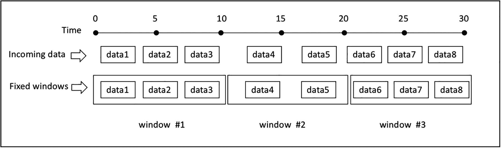
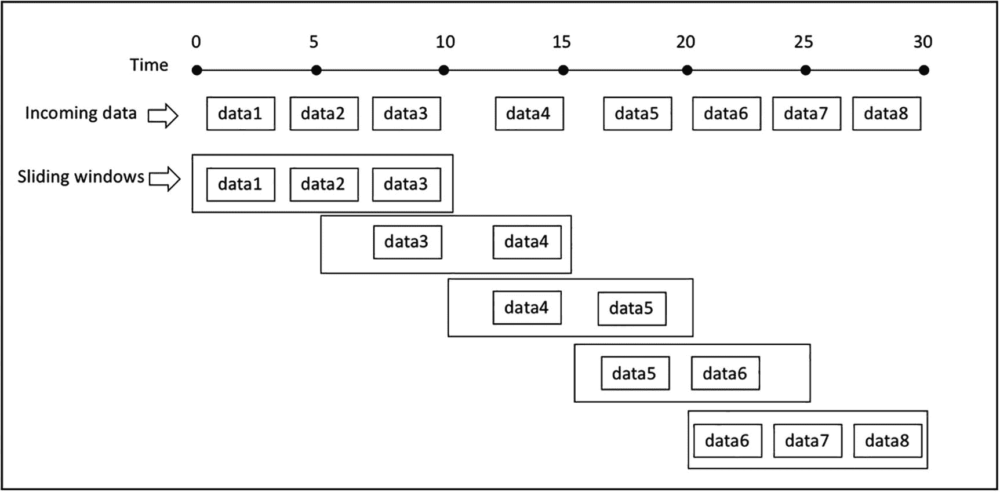
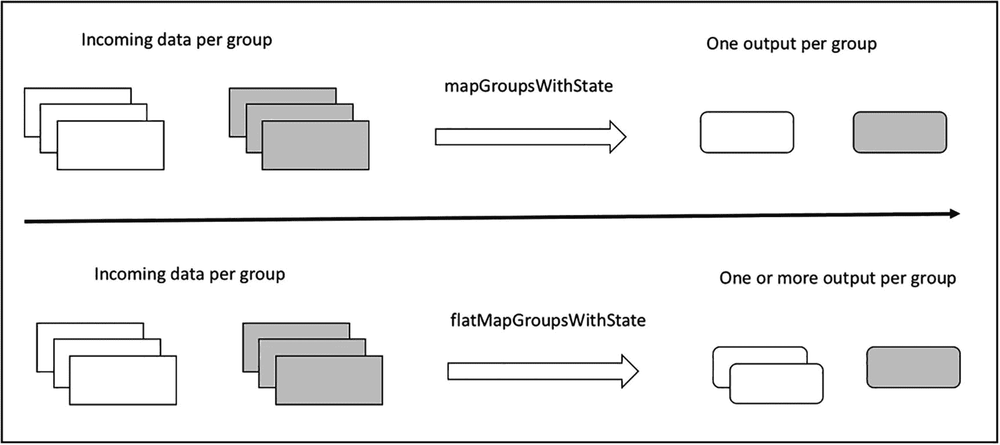
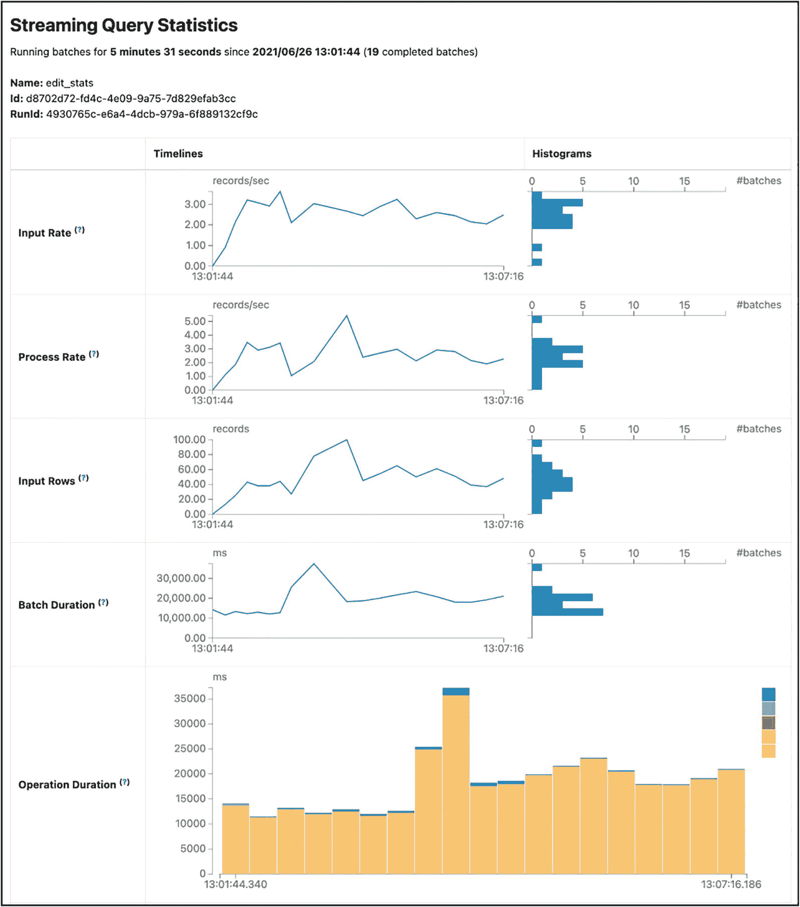

# 七、高级 Spark 流

第 [6](06.html) 章介绍了流处理的核心概念、Spark 结构化流处理引擎的特性以及开发流应用的基本步骤。现实世界的流应用程序通常需要从大规模传入的实时数据中提取见解或模式，并将这些信息提供给下游应用程序，以做出业务决策或将这些信息保存在某个存储系统中，以供进一步分析或可视化。现实世界流应用程序的另一个方面是，它们持续运行以处理实时数据。因此，他们必须对失败有弹性。

本章的前半部分介绍了结构化流中的事件时间处理和有状态处理功能，以及它们如何帮助从传入的实时数据中提取洞察力或模式。本章的后半部分解释了结构化流提供的支持，以帮助流应用程序对故障具有容错能力，并监控它们的状态和进度。

## 事件时间

基于数据创建时间处理输入流数据的能力是任何严肃的流处理引擎必须具备的特性。这很重要，因为要真正理解并准确地从流数据中提取见解或模式。您需要基于数据或事件发生的时间来处理它们，而不是基于它们被处理的时间。通常，事件时间处理是在聚合的上下文中进行的，聚合包括事件时间和事件中的零个或多个附加信息。

让我们以第 [6](06.html) 章描述的移动动作事件为例。您可以在一个时间窗口内应用聚合，而不是在动作类型上应用聚合，该时间窗口可以是固定的或滑动的窗口类型(在第 [6](06.html) 章中描述)。此外，您可以轻松地将动作类型添加到分组键中，以便根据时间段和动作类型进一步对移动动作事件进行分组。

以下示例处理移动数据事件；清单 [7-1](#PC1) 显示了它的模式。`ts`列表示事件创建的时间，换句话说，就是用户打开或关闭应用程序的时间。移动事件数据位于`<path>/chapter6/data/mobile`目录下，包含`file1.json`、`file2.json`、`file3.json`和`newaction.json`。清单 [7-2](#PC2) 显示了每个文件中的内容。

```scala
// file1.json
{"id":"phone1","action":"open","ts":"2018-03-02T10:02:33"}
{"id":"phone2","action":"open","ts":"2018-03-02T10:03:35"}
{"id":"phone3","action":"open","ts":"2018-03-02T10:03:50"}
{"id":"phone1","action":"close","ts":"2018-03-02T10:04:35"}

// file2.json
{"id":"phone3","action":"close","ts":"2018-03-02T10:07:35"}
{"id":"phone4","action":"open","ts":"2018-03-02T10:07:50"}

// file3.json
{"id":"phone2","action":"close","ts":"2018-03-02T10:04:50"}
{"id":"phone5","action":"open","ts":"2018-03-02T10:10:50"}

// newaction.json
{"id":"phone2","action":"crash","ts":"2018-03-02T11:09:13"}
{"id":"phone5","action":"swipe","ts":"2018-03-02T11:17:29"}

Listing 7-2Mobile Event Data in file1.json, file2.json, file3.json, newaction.json

```

```scala
mobileDataDF.printSchema

 |-- action: string (nullable = true)
 |-- id: string (nullable = true)
 |-- ts: timestamp (nullable = true)

Listing 7-1Mobile Data Event Schema

```

### 事件时间内的固定窗口聚合

固定窗口(也称为滚动窗口)操作基于窗口长度将传入数据流离散化为不重叠的桶。每个传入数据都根据其事件时间放入一个桶中。执行聚合就是遍历每个存储桶并应用聚合逻辑，无论是计数还是求和。图 [7-1](#Fig1) 说明了固定窗口聚合逻辑。



图 7-1

固定窗口操作

固定窗口聚合的一个例子是对每个 10 分钟长的固定窗口执行移动事件数量的计数聚合。窗口长度通常由特定用例的需求和数据量决定。通过聚合结果，您可以深入了解每个窗口生成的移动事件的比率。如果您对全天和每小时的移动使用感兴趣，那么 60 分钟的窗口长度可能更合适。清单 [7-3](#PC3) 包含执行计数聚合和聚合结果的代码。正如所料，在列出的所有四个文件中只有十个移动数据事件，输出中的总计数与该数字相匹配。

```scala
import org.apache.spark.sql.types._
import org.apache.spark.sql.functions._

val mobileDataSchema = new StructType()
                          .add("id", StringType, false)
                          .add("action", StringType, false)
                          .add("ts", TimestampType, false)

val mobileSSDF = spark.readStream.schema(mobileDataSchema)
                      .json("<path>/chapter6/data/input")

val windowCountDF = mobileSSDF.groupBy(
                                 window($"ts", "10 minutes"))
                              .count()

val mobileConsoleSQ = windowCountDF.writeStream.format("console")
                                   .option("truncate", "false")
                                   .outputMode("complete")
                                   .start()

// stop the streaming query

mobileConsoleSQ.stop

// output
+------------------------------------------------------+-------+
|                        window                        |  count|
+------------------------------------------------------+-------+
|            [2018-03-02 10:00:00, 2018-03-02 10:10:00]|      7|
|            [2018-03-02 10:10:00, 2018-03-02 10:20:00]|      1|
|            [2018-03-02 11:00:00, 2018-03-02 11:10:00]|      1|
|            [2018-03-02 11:10:00, 2018-03-02 11:20:00]|      1|
+------------------------------------------------------+-------+

windowCountDF.printSchema

 |-- window: struct (nullable = false)
 |    |-- start: timestamp (nullable = true)
 |    |-- end: timestamp (nullable = true)
 |-- count: long (nullable = false)

Listing 7-3Process Mobile Event Data with a 10 Minute Window

```

当使用窗口执行聚合时，输出窗口是一个结构类型，它包含开始和结束时间。

除了在`groupBy`转换中指定一个窗口之外，您还可以从事件本身指定额外的列。清单 [7-4](#PC4) 使用窗口长度和动作执行聚合。这为每个窗口和动作类型的计数提供了额外的见解。只需对前面的示例做一点小小的修改就可以实现这一点。清单 [7-4](#PC4) 只包含需要修改的行。

```scala
val windActDF= mobileSSDF.groupBy(
                    window($"ts", "10 minutes"), $"action").count

val windActDFSQ = windActDF.writeStream.format("console")
                           .option("truncate", "false")
                           .outputMode("complete")
                           .start()
// result
+----------------------------------------------+--------+-------+
|        window                                |  action|  count|
+----------------------------------------------+--------+-------+
|    [2018-03-02 10:00:00, 2018-03-02 10:10:00]|  close |      3|
|    [2018-03-02 11:00:00, 2018-03-02 11:10:00]|  crash |      1|
|    [2018-03-02 11:10:00, 2018-03-02 11:20:00]|  swipe |      1|
|    [2018-03-02 10:00:00, 2018-03-02 10:10:00]|  open  |      4|
|    [2018-03-02 10:10:00, 2018-03-02 10:20:00]|  open  |      1|
+----------------------------------------------+--------+-------+

// stop the query stream
windowActionCountSQ.stop()

Listing 7-4Process Mobile Event Data with a 10 Minute Window and Action Type

```

该结果表中的每一行都包含关于每个 10 分钟窗口中动作类型数量的信息。如果在某个窗口中有许多崩溃动作，那么如果在那个时间范围内有一个发布，那么这种洞察力是有用的。

### 事件时间内的滑动窗口聚合

除了固定窗口类型，还有一种开窗类型叫做*滑动窗口*。定义滑动窗口需要两条信息，窗口长度和滑动间隔，滑动间隔通常小于窗口长度。假设聚合计算在传入的数据流上滑动，结果通常比固定窗口类型的结果更平滑。因此，这种窗口类型通常用于计算移动平均值。关于滑动窗口需要注意的一件重要事情是，由于重叠，一条数据可能落入多个窗口，如图 [7-2](#Fig2) 所示。



图 7-2

固定窗口操作

为了说明传入数据的滑动窗口聚合，您使用了关于数据中心计算机机架温度的小型合成数据。想象一下，每一个计算机机架都以一定的间隔发出它的温度。您希望生成一份关于所有计算机机架和每个机架在 10 分钟窗口长度和 5 分钟滑动间隔内的平均温度的报告。这个数据集在`<path>/chapter7/data/iot`目录中，其中包含`file1.json`和`file2.json`。温度数据如清单 [7-5](#PC5) 所示。

```scala
// file1.json
{"rack":"rack1","temperature":99.5,"ts":"2017-06-02T08:01:01"}
{"rack":"rack1","temperature":100.5,"ts":"2017-06-02T08:06:02"}
{"rack":"rack1","temperature":101.0,"ts":"2017-06-02T08:11:03"}
{"rack":"rack1","temperature":102.0,"ts":"2017-06-02T08:16:04"}

// file2.json
{"rack":"rack2","temperature":99.5,"ts":"2017-06-02T08:01:02"}
{"rack":"rack2","temperature":105.5,"ts":"2017-06-02T08:06:04"}
{"rack":"rack2","temperature":104.0,"ts":"2017-06-02T08:11:06"}
{"rack":"rack2","temperature":108.0,"ts":"2017-06-02T08:16:08"}

Listing 7-5Temperature Data of Two Racks

```

清单 [7-6](#PC6) 首先读取温度数据，然后在`ts`列的滑动窗口上执行`groupBy`转换。对于每个滑动窗口，将`avg()`功能应用于温度栏。为了便于检查输出，它使用查询名`iot`将数据写出到内存数据接收器。然后，您可以对这个临时表发出 SQL 查询。

```scala
import org.apache.spark.sql.types._
import org.apache.spark.sql.functions._

// define schema
val iotSchema = new StructType().add("rack", StringType, false)
                                .add("temperature",
                                      DoubleType, false)
                                .add("ts", TimestampType, false)

val iotSSDF = spark.readStream.schema(iotSchema)
                   .json("<path>/chapter7/data/iot")

// group by a sliding window and perform average on the temperature column
val iotAvgDF = iotSSDF.groupBy(window($"ts",
                                 10 minutes", "5 minutes"))
                      .agg(avg("temperature") as "avg_temp")

// write the data out to memory sink with query name as iot
val iotMemorySQ = iotAvgDF.writeStream.format("memory")
                          .queryName("iot")
                          .outputMode("complete")
                          .start()

// display the data in the order of start time
spark.sql("select * from iot")
     .orderBy($"window.start").show(false)

// output

+------------------------------------------------+-------------+
|                       window                   |     avg_temp|
+------------------------------------------------+-------------+
|      [2017-06-02 07:55:00, 2017-06-02 08:05:00]|         99.5|
|      [2017-06-02 08:00:00, 2017-06-02 08:10:00]|       101.25|
|      [2017-06-02 08:05:00, 2017-06-02 08:15:00]|       102.75|
|      [2017-06-02 08:10:00, 2017-06-02 08:20:00]|       103.75|
|      [2017-06-02 08:15:00, 2017-06-02 08:25:00]|        105.0|
+------------------------------------------------+-------------+

// stop the streaming query
iotMemorySQ.stop

Listing 7-6Average Temperature of All the Computer Racks over a Sliding Window

```

该输出显示了合成数据集中的五个窗口。注意，由于您在`groupBy`转换中指定的滑动间隔的长度，每个窗口的开始时间相隔五分钟。温度栏显示平均温度正在上升，这是令人担忧的。不清楚是所有计算机机架的温度都在升高，还是只有某些机架的温度在升高。

为了帮助识别哪些计算机机架，清单 [7-7](#PC7) 将机架列添加到 groupBy 转换中，它只显示与清单 [7-6](#PC6) 中不同的行。

```scala
// group by a sliding window and rack column
val iotAvgByRackDF = iotSSDF.groupBy(
                      window($"ts", "10 minutes", "5 minutes"),
                             $"rack")
                     .agg(avg("temperature") as "avg_temp")

// write out to memory data sink with iot_rack query name
val iotByRackConsoleSQ = iotAvgByRackDF.writeStream
                                       .format("memory")
                                       .queryName("iot_rack")
                                       .outputMode("complete")
                                       .start()

spark.sql("select * from iot_rack").orderBy($"rack",
                   $"window.start").show(false)

+------------------------------------------+-------+------------+
|                        window            |  rack |    avg_temp|
+------------------------------------------+-------+------------+
|[2017-06-02 07:55:00, 2017-06-02 08:05:00]|  rack1|        99.5|
|[2017-06-02 08:00:00, 2017-06-02 08:10:00]|  rack1|       100.0|
|[2017-06-02 08:05:00, 2017-06-02 08:15:00]|  rack1|      100.75|
|[2017-06-02 08:10:00, 2017-06-02 08:20:00]|  rack1|       101.5|
|[2017-06-02 08:15:00, 2017-06-02 08:25:00]|  rack1|       102.0|
|[2017-06-02 07:55:00, 2017-06-02 08:05:00]|  rack2|        99.5|
|[2017-06-02 08:00:00, 2017-06-02 08:10:00]|  rack2|       102.5|
|[2017-06-02 08:05:00, 2017-06-02 08:15:00]|  rack2|      104.75|
|[2017-06-02 08:10:00, 2017-06-02 08:20:00]|  rack2|       106.0|
|[2017-06-02 08:15:00, 2017-06-02 08:25:00]|  rack2|       108.0|
+------------------------------------------+-------+------------+

// stop query stream
iotByRackConsoleSQ.stop()

Listing 7-7Average Temperature of Each Rack over a Sliding Window

```

输出表清楚地显示机架 1 的平均温度低于 103，您应该关注的是机架 2。

### 聚集状态

前面使用事件时间和附加列对固定或滑动窗口执行聚合的示例显示了在 Spark 结构化流中执行常用和复杂的流处理操作是多么容易。虽然从使用的角度来看这似乎很容易，但结构流引擎和 Spark SQL 引擎都努力工作并协同工作，以便在执行流聚合时以容错的方式维护中间聚合结果。每当对流式查询执行聚合时，必须维护中间聚合状态。这种状态在键-值对结构中维护，类似于哈希映射，其中键是组名，值是中间聚合值。在前面按滑动窗口和机架 ID 聚合的示例中，关键字是窗口的开始和结束时间以及机架名称的组合值，该值是平均温度。

中间状态存储在 Spark 执行器的内存中版本化的键/值“状态存储”中。它被写入预写日志，该日志应该被配置为驻留在像 HDFS 这样的持久性存储系统上。在每个触发点读取并更新内存“状态存储”中的状态，然后写入预写日志。当 Spark 结构化流应用程序重启失败后，状态将从预写日志中恢复，并从该点继续。这种容错状态管理会在结构化流引擎中引起一些资源和处理开销。开销的数量与它需要维护的状态数量成正比。因此，将状态的数量保持在可接受的大小是很重要的；换句话说，政府的规模不应该无限扩大。

鉴于滑动窗口的性质，窗口的数量会无限增长。这意味着滑动窗口聚合要求中间状态无限增长，除非有办法删除不再更新的旧状态。这是使用一种叫做*水印*的技术完成的。

### 水印:限制状态并处理后期数据

水印是流处理引擎中常用的技术，用于处理最新数据并限制需要维护的状态数量。现实世界中的流数据经常因为网络拥塞、网络中断或移动设备等数据生成器不在线而无序或延迟到达。作为实时流应用程序的开发人员，理解在处理某个阈值之后到达的最新数据时的权衡决策是很重要的。换句话说，相对于其他数据，您认为大部分数据到达的可接受时间是多少？最有可能的是，前一个问题的答案是它取决于用例。将最新的数据丢在地上并忽略它们可能是可以接受的。

从结构化流的角度来看，水印是事件时间中的移动阈值，落后于迄今为止所见的最大事件时间。当新数据到达时，最大事件时间被更新，这导致水印移动。图 [7-3](#Fig3) 举例说明了水印定义为十分钟的情况。实线代表水印线。它落后于最大事件时间线，由虚线表示。每个矩形框代表一段数据，它的事件时间就在框的下面。事件时间为 10:07 的数据到达得稍晚一些，大约在 10:12；然而，它仍然落在 10:03 和 10:13 之间的阈值内。因此它被照常处理。事件时间为 10:15 的数据属于同一类别。事件时间为 10:04 的数据到达较晚，大约在 10:22，这低于水位线，因此被忽略，不进行处理。


图 7-3

用水印处理过期日期

指定水印的最大好处之一是使结构流引擎能够安全地删除比水印旧的聚合状态。执行聚合的生产流应用程序应该指定一个水印，以避免内存不足问题。毫无疑问，水印是处理实时流数据中混乱部分的必要工具。

结构化流使得将水印指定为流数据帧的一部分变得非常容易。您只需要向`withWatermark` API 提供两个数据，事件时间列和阈值，可以是秒、分钟或小时。为了演示水印的作用，您可以通过一个简单的例子来处理`<path>/chapter7/data/mobile`目录中的两个 JSON 文件，并将水印指定为 10 分钟。清单 [7-8](#PC8) 显示了这两个文件中的数据。数据的设置使得`file1.json`文件中的每一行都落在自己的 10 分钟窗口内。`file2.json`文件中的第一行落在 10:20:00 到 10:30:00 的窗口中，尽管它到达得较晚，但它的时间戳仍在可接受的阈值内，因此它被处理。file2.json 文件中的最后一行是对最新数据的模拟，其时间戳在 10:10:00 到 10:20:00 窗口内，由于超出了水印阈值，因此将被忽略，不予处理。

```scala
// file1.json
{"id":"phone1","action":"open","ts":"2018-03-02T10:15:33"}
{"id":"phone2","action":"open","ts":"2018-03-02T10:22:35"}
{"id":"phone3","action":"open","ts":"2018-03-02T10:33:50"}

// file2.json
{"id":"phone4","action":"open","ts":"2018-03-02T10:29:35"}
{"id":"phone5","action":"open","ts":"2018-03-02T10:11:35"}

Listing 7-8Mobile Event Data in Two JSON Files

```

为了模拟处理过程，首先在`<path>/chapter7/data`目录下创建一个名为`input`的目录。然后运行清单 [7-9](#PC9) 中的代码。下一步是将`file1.json`文件复制到`input`目录并检查输出。最后一步是将`file2.json`文件复制到输入目录并检查输出。

```scala
import org.apache.spark.sql.types._
import org.apache.spark.sql.functions._

val mobileSchema = new StructType().add("id", StringType, false)
                                .add("action", StringType, false)
                                .add("ts", TimestampType, false)

val mobileSSDF = spark.readStream.schema(mobileSchema)
                      .json("<path>/book/chapter7/data/input")

// setup a streaming DataFrame with a watermark and group by ts and action column.
val windowCountDF = mobileSSDF.withWatermark("ts", "10 minutes")
                              .groupBy(window($"ts",
                                     "10 minutes"), $"action")
                               .count

val mobileMemorySQ = windowCountDF.writeStream
                                  .format("console")
                                  .option("truncate", "false")
                                  .outputMode("update")
                                  .start()

// the output from processing filel1.json
// as expected each row falls into its own window
+----------------------------------------------+--------+-------+
|         window                               |  action|  count|
+----------------------------------------------+--------+-------+
|    [2018-03-02 10:20:00, 2018-03-02 10:30:00]|  open  |   1   |
|    [2018-03-02 10:30:00, 2018-03-02 10:40:00]|  open  |   1   |
|    [2018-03-02 10:10:00, 2018-03-02 10:20:00]|  open  |   1   |
+----------------------------------------------+--------+-------+

// the output from processing file2.json
// notice the count for window 10:20 to 10:30 is now updated to 2
// and there was no change to the window 10:10:00 and 10:20:00
+----------------------------------------------+--------+-------+
|                       window                 | action |  count|
+----------------------------------------------+--------+-------+
|    [2018-03-02 10:20:00, 2018-03-02 10:30:00]|  open  |   2   |
+----------------------------------------------+--------+-------+

Listing 7-9Code for Processing Mobile Data Events with Late Arrival

```

由于`file2.json`文件中最后一行的时间戳超出了 10 分钟的水印阈值，因此未对其进行处理。如果删除对 watermark API 的调用，输出看起来类似于清单 [7-10](#PC10) 。窗口 10:10 和 10:20 的计数更新为 2。

```scala
+----------------------------------------------+--------+-------+
|                        window                |  action|  count|
+----------------------------------------------+--------+-------+
|    [2018-03-02 10:20:00, 2018-03-02 10:30:00]| open   |      2|
|    [2018-03-02 10:10:00, 2018-03-02 10:20:00]|  open  |      2|
+----------------------------------------------+--------+-------+

Listing 7-10Output of Removing the Call to Watermark API

```

水印是一个有用的特性，因此了解正确清理聚合状态的条件非常重要。

*   输出模式不能是完整模式，必须是更新或追加模式。原因是完整模式的语义规定必须维护所有聚合数据，并且不能违反这些语义；水印不能掉任何中间状态。

*   通过`groupBy`转换的聚合必须直接在事件时间列或事件时间列的窗口上进行。

*   水印 API 和`groupBy`转换中指定的事件时间列必须是同一个。

*   当设置一个流数据帧时，必须在`groupBy`转换之前调用水印 API 否则，它将被忽略。

## 任意状态处理

按键或事件窗口聚合的中间状态由结构化流自动维护。但是，并不是所有基于事件时间的处理都可以通过简单地在一个或多个列上进行聚合来满足，并且可以使用或不使用窗口。例如，当物联网温度数据集中连续三次出现大于 100 度的温度读数时，您希望发送警报、电子邮件或寻呼机。

维护用户会话是另一个例子，其中会话长度不是由固定的时间量决定的，而是由用户的活动和缺少活动决定的。为了解决这两个例子和类似的用例，您需要对每组数据应用任意的处理逻辑，控制每组数据的窗口长度，并在触发点之间保持任意的状态。这就是结构化流任意状态处理的用武之地。

### 具有结构化流的任意状态处理

为了实现灵活和任意的有状态处理，结构化流提供了回调机制。它负责确保以容错方式维护和存储中间状态。回调机制使您能够为自定义状态管理逻辑提供用户定义的函数，结构化流在适当的时候调用它。这种处理方式本质上归结为执行以下两个任务之一的能力，如图 [7-4](#Fig4) 所示。

*   映射多组数据，对每组数据应用任意处理，并且每组只生成一行。

*   映射数据组，对每个组应用任意处理，并为每个组生成任意数量的行，包括无行。

结构化流为每项任务提供了特定的 API。对于第一个任务，这个 API 叫做`mapGroupsWithState` `,`，对于第二个任务，这个 API 叫做`flatMapGroupsWithState`。这些 API 从 Spark 2.2 开始可用，并且只在 Scala 和 Java 中可用。



图 7-4

两个任意状态处理任务的可视化描述

在使用回调机制时，清楚地理解框架和回调函数之间关于输入参数的约定，以及何时调用和多久调用一次是很重要的。在这种情况下，顺序如下。

*   要在流数据帧上执行任意有状态处理，必须首先通过调用`groupByKey`转换指定分组，并提供 group by 列；然后它返回一个`KeyValueGroupedDataset`类的实例。

*   从一个`KeyValueGroupedDataset`类的实例中，你可以调用`mapGroupsWithState`或者`flatMapGroupsWithState`函数。每个 API 需要一组不同的输入参数。

*   调用`mapGroupsWithState`函数时，需要提供超时类型和自定义回调函数。超时部分稍后解释。

*   调用`flatMapGroupsWithState`函数时，需要提供一个输出模式，超时类型，以及一个用户自定义的回调函数。输出模式和超时部分将在稍后解释。

以下是结构化流和用户定义的回调函数之间的约定。

*   用户定义的回调函数在每个触发器中为每个组调用一次。在每次调用中，它意味着触发器中有数据的每个组。如果一个特定的组在触发器中没有任何数据，就没有调用。因此，您不应该假设在每个组的每个触发器中都调用了该函数。

*   每次调用用户定义的回调函数时，都会传递以下信息。
    *   组密钥的值。

    *   一个组的所有数据；不能保证它们有任何特定的顺序。

    *   组的先前状态，由同一组的先前调用返回。组状态由名为`GroupState`的状态持有者类管理。当需要更新一个组的状态时，必须用新的状态调用这个类的 update 函数。用户定义的类定义了每个组的状态信息。调用更新函数时，提供的自定义状态不能为空。

正如你在第 [6](06.html) 章中了解到的，只要需要保持中间状态，就只允许某些输出模式。从 Spark 2.3 开始，调用 API `mapGroupsWithState` API 时只支持更新输出模式；但是，在调用`flatMapGroupsWithState` API 时，追加和更新模式都受支持。

### 处理状态超时

在使用水印的事件时间聚合的情况下，中间状态的超时由结构化流在内部管理，没有任何方法可以影响它。另一方面，结构化流的任意状态处理提供了控制中间状态超时的灵活性。因为您可以维护任意状态，所以应用程序逻辑控制中间状态超时以满足特定用例是有意义的。

结构流状态处理提供了三种不同的超时类型。第一个基于处理时间，第二个基于事件时间。超时类型是在全局级别配置的，这意味着它适用于特定流数据帧内的所有组。可以为每个单独的组配置超时时间，并且可以随意更改。如果中间状态配置了超时，那么在处理回调函数中给定的值列表之前检查它是否超时是很重要的。在某些用例中不需要超时，第三种超时类型就是为这种场景设计的。超时类型在`GroupStateTimeout`类中定义。您在调用`mapGroupsWithState`或`flatMapGroupsWithState`函数时指定类型。分别使用处理超时和事件超时的`GroupState.setTimeoutDuration`或`GroupState.setTimeoutTimeStamp`功能指定超时持续时间。

敏锐的读者可能想知道当一个特定群体的中间状态超时时会发生什么。流提供的关于这种情况的契约结构是，它使用空值列表调用用户定义的回调函数，并将标志`GroupState.hasTimedOut`设置为 true。

在这三种超时类型中，事件时间超时是最复杂的一种，首先介绍。事件时间超时意味着它基于事件中的时间，因此需要通过`DataFrame.withWatermark`在流数据帧中设置水印。为了控制每个组的超时，您需要在处理特定组的过程中为`GroupState.setTimeoutTimestamp`函数提供一个时间戳值。当水印前进超过提供的时间戳时，组的中间状态超时。在用户会话化用例中，当用户与您的网站交互时，只需根据用户的最新交互时间加上某个阈值更新超时时间戳，会话就会延长。这确保了只要用户与您的网站交互，用户会话就保持活动，并且中间数据不会超时。

处理超时类型的工作方式类似于事件时间超时类型；不过不同的是，它是基于服务器的挂钟，是不断前进的。为了控制每个组的超时，您可以在处理特定组的过程中为`GroupState.setTimeoutDuration`函数提供一个持续时间。持续时间可以是一分钟、一小时或两天。当时钟前进超过规定的持续时间时，组的中间状态超时。由于这种超时类型取决于系统时钟，因此考虑时区变化或时钟偏差时的情况非常重要。

对于敏锐的读者来说，这可能是显而易见的，但重要的是要认识到，当流中暂时没有传入数据时，不会调用用户定义的回调函数。另外水印不前进，超时函数调用不发生。

至此，您应该对结构化流中的任意状态处理是如何工作的以及涉及到哪些 API 有了很好的理解。下一节将通过几个例子演示如何实现任意状态处理。

### 行动中的任意状态处理

本节通过两个用例演示了结构化流中的任意状态处理。

*   第一个是关于从数据中心计算机机架温度数据中提取模式，并将每个机架的状态保持在中间状态。每当遇到连续三个 100 度或更高的温度时，机架状态就会升级到警告级别。这个例子使用了`mapGroupsWithState` API。

*   第二个例子是用户会话化，它根据用户与网站的交互来跟踪用户状态。这个例子使用了`flatMapGroupsWithState` API。

不管哪个 API 执行任意状态处理，都需要一组通用的设置步骤。

1.  定义几个类来表示输入数据、中间状态和输出。

2.  定义两个函数。第一个是结构化流调用的回调函数。第二个功能包含对每组数据的任意状态处理逻辑以及维护状态的逻辑。

3.  决定超时类型及其合适的值。

#### 使用 mapGroupsWithState 提取模式

此使用案例旨在识别数据中心计算机机架温度数据中的特定模式。感兴趣的模式是来自同一机架的 100 度或更高的三个连续温度读数。两个连续高温读数之间的时间差必须在 60 秒以内。当检测到这种模式时，该机架的状态被升级为警告状态。如果下一个输入温度读数低于 100 度阈值，机架状态将降级为正常。

本例的数据在`<path>/chapter7/data/iot_pattern`目录中，该目录由三个文件组成，它们的内容如清单 [7-11](#PC11) 所示。`file1.json`的内容显示`rack1`的温度在 100 度上下变化。`file2.json`文件显示 rack2 的温度正在上升。在`file3.json`文件中，rack3 正在升温，但温度读数相差超过一分钟。

```scala
// file1.json
{"rack":"rack1","temperature":99.5,"ts":"2017-06-02T08:01:01"}
{"rack":"rack1","temperature":100.5,"ts":"2017-06-02T08:02:02"}
{"rack":"rack1","temperature":98.3,"ts":"2017-06-02T08:02:29"}
{"rack":"rack1","temperature":102.0,"ts":"2017-06-02T08:02:44"}

// file2.json
{"rack":"rack1","temperature":97.5,"ts":"2017-06-02T08:02:59"}
{"rack":"rack2","temperature":99.5,"ts":"2017-06-02T08:03:02"}
{"rack":"rack2","temperature":105.5,"ts":"2017-06-02T08:03:44"}
{"rack":"rack2","temperature":104.0,"ts":"2017-06-02T08:04:06"}
{"rack":"rack2","temperature":108.0,"ts":"2017-06-02T08:04:49"}

// file3.json
{"rack":"rack2","temperature":108.0,"ts":"2017-06-02T08:06:40"}
{"rack":"rack3","temperature":100.5,"ts":"2017-06-02T08:06:20"}
{"rack":"rack3","temperature":103.7,"ts":"2017-06-02T08:07:35"}
{"rack":"rack3","temperature":105.3,"ts":"2017-06-02T08:08:53"}

Listing 7-11Temperature Data in file1.json, file2.json and file3.json

```

接下来，准备几个类和两个函数，将模式检测逻辑应用于前面的数据。对于这个用例，机架温度数据输入数据由`RackInfo`类表示，中间状态和输出由同一个名为`RackState.`的类表示。清单 [7-12](#PC12) 显示了代码。

```scala
case class RackInfo(rack:String, temperature:Double,
                    ts:java.sql.Timestamp)

// notice the constructor arguments are defined to be modifiable so you can update them
// the lastTS variable is used to compare the time between previous and current temperature reading
case class RackState(var rackId:String, var highTempCount:Int,
                     var status:String,
                     var lastTS:java.sql.Timestamp)

Listing 7-12Scala Case Classes for the Input and Intermediate State

```

接下来，定义两个函数。第一个称为`updateRackState`，它包含了在一定时间内对三个连续温度读数进行事件模式检测的核心逻辑。第二个函数是`updateAcrossAllRackStatus`，它是传入`mapGroupsWithState` API 的回调函数。它确保根据事件时间的顺序处理机架温度读数。清单 [7-13](#PC13) 是代码。

```scala
import org.apache.spark.sql.streaming.GroupState

// contains the main logic to detect the temperature pattern described above

def updateRackState(rackState:RackState, rackInfo:RackInfo) : RackState = {
   // setup the conditions to decide whether to update the rack state
   val lastTS = Option(rackState.lastTS).getOrElse(rackInfo.ts)
   val withinTimeThreshold = (rackInfo.ts.getTime -
                              lastTS.getTime) <= 60000
   val meetCondition = if (rackState.highTempCount < 1) true
                      else withinTimeThreshold
   val greaterThanEqualTo100 = rackInfo.temperature >= 100.0

  (greaterThanEqualTo100, meetCondition) match {
     case (true, true) => {
        rackState.highTempCount = rackState.highTempCount + 1
        rackState.status = if (rackState.highTempCount >= 3)
                           "Warning" else "Normal"
     }
     case _ => {
       rackState.highTempCount = 0
       rackState.status = "Normal"
     }
   }
   rackState.lastTS = rackInfo.ts
   rackState

}

// call-back function to provide mapGroupsWithState API
def updateAcrossAllRackStatus(rackId:String,
                              inputs:Iterator[RackInfo],
             oldState: GroupState[RackState]) : RackState = {

   // initialize rackState with previous state if exists, otherwise create a new state
   var rackState = if (oldState.exists) oldState.get
                   else RackState(rackId, 5, "", null)

   // sort the inputs by timestamp in ascending order
   inputs.toList.sortBy(_.ts.getTime).foreach( input => {
     rackState = updateRackState(rackState, input)
   // very important to update the rackState in the state holder class GroupState
     oldState.update(rackState)
   })
   rackState
}

Listing 7-13the Functions for Performing Pattern Detection

```

设置步骤现在已经完成，现在您将回调函数连接到清单 [7-14](#PC14) 中的结构化流应用程序的`mapGroupsWithState`中。模拟流数据的步骤与前面的示例相似，如下所示。

1.  在<目录下创建一个名为`input`的目录。如果该目录已经存在，请删除该目录中的所有文件。

2.  运行清单 [7-14](#PC14) 中的代码。

3.  将`file1.json`复制到输入目录，然后观察输出。对`file2.json`和`file3.json`重复相同的步骤。

```scala
import org.apache.spark.sql.streaming.{GroupStateTimeout, OutputMode}
import org.apache.spark.sql.types._
import org.apache.spark.sql.functions._

// schema for the IoT data
val iotDataSchema = new StructType()
                         .add("rack",StringType, false)
                         .add("temperature", DoubleType, false)
                         .add("ts", TimestampType, false)

val iotSSDF = spark.readStream.schema(iotDataSchema)
                   .json("<path>/chapter7/data/input")

val iotPatDF = iotSSDF.as[RackInfo].groupByKey(_.rack)
                      .mapGroupsWithState[RackState,RackState]
         (GroupStateTimeout.NoTimeout)(updateAcrossAllRackStatus)

// setup the output and start the streaming query
val iotPatternSQ = iotPatDF.writeStream.format("console")
                           .outputMode("update")
                           .start()

// after file3.json is copied over to "input" directory, run the line below stop the streaming query
iotPatternSQ.stop

// the output after processing file1.json
+--------+---------------------+----------+---------------------+
|  rackId|        highTempCount|    status|               lastTS|
+--------+---------------------+----------+---------------------+
|   rack1|                    1|    Normal|  2017-06-02 08:02:44|
+--------+---------------------+----------+---------------------+

// the output after processing file2.json
+--------+---------------------+-----------+--------------------+
|  rackId|        highTempCount|     status|              lastTS|
+--------+---------------------+-----------+--------------------+
|   rack1|                    0|     Normal| 2017-06-02 08:02:59|
|   rack2|                    3|    Warning| 2017-06-02 08:04:49|
+--------+---------------------+-----------+--------------------+

// the output after processing file3.json
+--------+---------------------+----------+---------------------+
|  rackId|        highTempCount|    status|               lastTS|
+--------+---------------------+----------+---------------------+
|   rack3|                    1|    Normal|  2017-06-02 08:08:53|
|   rack2|                    0|    Normal|  2017-06-02 08:06:40|
+--------+---------------------+----------+---------------------+

Listing 7-14Using Arbitrary State Processing to Detect Patterns in a Streaming Application

```

rack1 有几个温度读数超过 100 度；然而，它们不是连续的，因此输出状态处于正常水平。`file2.json`档中，rack2 连续三次温度读数超过 100 度，每一次与前一次的时间差距小于 60 秒；因此，机架 2 的状态处于警告级别。rack3 连续三次温度读数超过 100 度；但是每一个和之前的时间差距都在 60 秒以上；因此，其状态处于正常水平。

#### 使用 flatMapGroupsWithState 的用户会话化

这个用例使用`flatMapGroupsWithState` API 执行用户会话化，它支持每组输出多行的能力。在本例中，会话化处理逻辑基于用户活动。当采取`login`动作时，创建一个会话。当采取`logout`动作时，会话结束。如果 30 分钟内没有用户活动，会话将自动结束。您可以利用超时特性来执行这种检测。每当会话开始或结束时，该信息都会发送到输出。输出信息包括用户 id、会话开始和结束时间以及访问的页面数量。

这个用例的数据在`<path>/chapter7/data/sessionization`目录中，它有三个文件。它们的内容如清单 [7-15](#PC15) 所示。`file1.json`文件包含 user1 的活动，并且包含一个`login`动作，但是没有`logout`动作。`file2.json`文件包含用户 2 `,`的所有活动，包括`login`和`logout`动作。`file3.json`文件只包含用户 3 的`login`动作。设置三个文件中用户活动的时间戳，以便在处理`file3.json`时 user1 会话超时。到那时，user1 空闲的时间已经超过 30 分钟。

```scala
// file1.json
{"user":"user1","action":"login","page":"page1", "ts":"2017-09-06T08:08:53"}
{"user":"user1","action":"click","page":"page2", "ts":"2017-09-06T08:10:11"}
{"user":"user1","action":"send","page":"page3", "ts":"2017-09-06T08:11:10"}

// file2.json
{"user":"user2","action":"login", "page":"page1", "ts":"2017-09-06T08:44:12"}
{"user":"user2","action":"view", "page":"page7", "ts":"2017-09-06T08:45:33"}
{"user":"user2","action":"view", "page":"page8", "ts":"2017-09-06T08:55:58"}
{"user":"user2","action":"view", "page":"page6", "ts":"2017-09-06T09:10:58"}
{"user":"user2","action":"logout","page":"page9", "ts":"2017-09-06T09:16:19"}

// file3.json
{"user":"user3","action":"login", "page":"page4", "ts":"2017-09-06T09:17:11"}

Listing 7-15User Activity Data

```

接下来，准备几个类和两个函数，将用户会话逻辑应用到前面的数据。对于这个用例，用户活动输入数据由`UserActivity`类表示。用户会话数据的中间状态由`UserSessionState`类表示，UserSessionInfo 类表示用户会话输出。这三个类的代码如清单 [7-16](#PC16) 所示。

```scala
case class UserActivity(user:String, action:String,
                        page:String, ts:java.sql.Timestamp)

// the lastTS field is for storing the largest user activity timestamp and this information is used
// when setting the timeout value for each user session
case class UserSessionState(var user:String, var status:String,
                            var startTS:java.sql.Timestamp,
                            var endTS:java.sql.Timestamp,
                            var lastTS:java.sql.Timestamp,
                            var numPage:Int)

// the end time stamp is filled when the session has ended.
case class UserSessionInfo(userId:String, start:java.sql.Timestamp, end:java.sql.Timestamp,  numPage:Int)

Listing 7-16Scala Case Classes for Input, Intermediate State, and Output

```

接下来，定义两个函数。第一个叫做`updateUserActivity`，负责根据用户活动更新用户会话状态。它还根据用户操作和最新的活动时间戳更新会话开始或结束时间。第二个函数叫做`updateAcrossAllUserActivities` `.`，它是传递给`flatMapGroupsWithState`函数的回调函数。该职能有两个主要职责。第一个是处理中间会话状态的超时，当出现这种情况时，它更新用户会话结束时间。另一个职责是确定何时向输出发送什么内容。期望的输出是在用户会话开始时发出一行，在用户会话结束时发出另一行。清单 [7-17](#PC17) 是这两个函数的逻辑。

```scala
import org.apache.spark.sql.streaming.GroupState
import scala.collection.mutable.ListBuffer

def updateUserActivity(userSessionState:UserSessionState, userActivity:UserActivity) : UserSessionState = {
    userActivity.action match {
      case "login" => {
        userSessionState.startTS = userActivity.ts
        userSessionState.status = "Online"
      }
      case "logout" => {
        userSessionState.endTS = userActivity.ts
        userSessionState.status = "Offline"
      }
      case _ => {
        userSessionState.numPage += 1
        userSessionState.status = "Active"
      }
    }

    userSessionState.lastTS = userActivity.ts
    userSessionState
}

def updateAcrossAllUserActivities(user:String,
                     inputs:Iterator[UserActivity],
                     oldState: GroupState[UserSessionState]) :
                     Iterator[UserSessionInfo] = {

   var userSessionState = if (oldState.exists) oldState.get
                          else UserSessionState(user, "",
    new java.sql.Timestamp(System.currentTimeMillis), null, null, 0)

   var output = ListBuffer[UserSessionInfo]()

   inputs.toList.sortBy(_.ts.getTime).foreach( userActivity => {
     userSessionState = updateUserActivity(userSessionState,
                           userActivity)
                           oldState.update(userSessionState)

     if (userActivity.action == "login") {

       output += UserSessionInfo(user, userSessionState.startTS,
                                 userSessionState.endTS, 0)
     }
   })

   val sessionTimedOut = oldState.hasTimedOut
   val sessionEnded = !Option(userSessionState.endTS).isEmpty
   val shouldOutput = sessionTimedOut || sessionEnded

   shouldOutput match {
    case true => {
        if (sessionTimedOut) {
            userSessionState.endTS =
new java.sql.Timestamp(oldState.getCurrentWatermarkMs)
        }
        oldState.remove()
        output += UserSessionInfo(user, userSessionState.startTS,
                                  userSessionState.endTS,
                                  userSessionState.numPage)

    }
    case _ => {
      // extend sesion
      oldState.update(userSessionState)             oldState.setTimeoutTimestamp(userSessionState.lastTS.getTime,
"30 minutes")
    }
   }

   output.iterator
}

Listing 7-17the Functions for Performing User Sessionization

```

一旦设置步骤完成，下一步是将回调函数连接到结构化流应用程序中的`flatMapGroupsWithState`函数，如清单 [7-18](#PC18) 所示。这个示例利用了超时特性，因此需要设置一个水位标志和事件时间超时类型。以下是模拟流数据的步骤。

1.  在`<path>/chapter7/data`目录下创建一个名为`input`的目录。如果该目录已经存在，请确保删除该目录中的所有现有文件。

2.  运行清单 [7-17](#PC17) 中所示的代码。

3.  将 file1.json 复制到输入目录，然后观察输出。对`file2.json`和`file3.json`重复这些步骤。

```scala
import org.apache.spark.sql.streaming.{GroupStateTimeout, OutputMode}
import org.apache.spark.sql.types._
import org.apache.spark.sql.functions._

val userActivitySchema = new StructType()
                              .add("user", StringType, false)
                              .add("action", StringType, false)
                              .add("page", StringType, false)
                              .add("ts", TimestampType, false)

val userActivityDF = spark.readStream.schema(userActivitySchema)
                          .json("<path>/chapter7/data/input")

// convert to DataSet of type UserActivity
val userActivityDS = userActivityDF.withWatermark("ts", "30 minutes").as[UserActivity]

// specify the event-time timeout type and wire in the call-back function
val userSessionDS = userActivityDS.groupByKey(_.user)
     .flatMapGroupsWithState[UserSessionState,UserSessionInfo]
     (OutputMode.Append,GroupStateTimeout.EventTimeTimeout)
     (updateAcrossAllUserActivities)

// setup the output and start the streaming query
val userSessionSQ = userSessionDS.writeStream
                                 .format("console")
                                 .option("truncate",false)
                                 .outputMode("append")
                                 .start()

// only run this line of code below after done copying over file3.json
userSessionSQ.stop

// the output after processing file1.json
+--------+----------------------------+-----+-------------+
|  userId|              start         | end |      numPage|
+--------+----------------------------+-----+-------------+
|  user1 |         2017-09-06 08:08:53| null|      0      |
+--------+----------------------------+-----+-------------+

// the output after processing file2.json
+--------+------------------------+--------------------+--------+
|  userId|             start      |               end  | numPage|
+--------+------------------------+--------------------+--------+
|  user2 |     2017-09-06 08:44:12| null               |       0|
|  user2 |     2017-09-06 08:44:12| 2017-09-06 09:16:19|       3|
+--------+------------------------+--------------------+--------+

// the output after processing file3.json

+--------+--------------------+--------------------+------------+
|  userId|       start        |              end   |     numPage|
+--------+--------------------+--------------------+------------+
|  user1 | 2017-09-06 08:08:53| 2017-09-06 08:46:19|           2|
|  user3 | 2017-09-06 09:17:11| null               |           0|
+--------+--------------------+--------------------+------------+

Listing 7-18Using Arbitrary State Processing to Perform User Sessionization in a Streaming Application

```

在处理完`file1.json`中的用户活动后，输出中应该有一行。这是意料之中的，因为每当`updateAcrossAllUserActivities`函数在用户活动中看到一个`login`动作，它就会将一个`UserSessionInfo`类的实例添加到`ListBuffer`输出中。处理 file2.json 后的输出中有两行，一行是针对`login`动作的，另一行是针对`logout`动作的。现在，`file3.json`只包含 user3 的一个带有动作`login`的用户活动，但是输出包含两行。`user1`的行是检测到`user1`会话超时的结果，这意味着由于缺少活动，水印已经超过该特定会话的超时值。

如前两个用例所示，结构化流中的任意状态处理功能提供了灵活而强大的方法，可以在每个组上应用用户定义的处理逻辑，并完全控制向输出发送的内容和时间。

## 处理重复数据

在处理数据时，重复数据删除是一种常见的需求，在批处理中很容易做到这一点。由于流数据的无界性质，它在流处理中更具挑战性。当数据生产者多次发送相同的数据以应对不可靠的网络连接或传输故障时，流数据中的数据复制就会发生。

幸运的是，结构化流使流应用程序可以轻松地执行数据复制，因此这些应用程序可以通过在重复数据到达时将其丢弃来保证一次性处理。结构化流提供的数据复制功能可以与水印结合使用，也可以不与水印结合使用。需要记住的一点是，在不指定水印的情况下执行数据复制时，状态结构化流需要在流应用程序的整个生命周期内保持无限增长，这可能会导致内存不足的问题。使用水印，比水印旧的最新数据会被自动丢弃，以避免重复。

指示结构化流执行重复数据删除的 API 非常简单。它只有一个输入:用于唯一标识每一行的列名列表。这些列的值执行重复检测，结构化流将它们存储为一个状态。演示重复数据删除功能的示例数据与移动事件数据具有相同的模式。计数聚合基于对`id`列的分组。`id`和`ts`列都用作用户定义的重复数据删除键。本例的数据在`<path>/chapter7/data/deduplication`中。它包含两个文件:`file1.json`和`file2.json`。这些文件的内容显示在清单 [7-19](#PC19) 中。

```scala
// file1.json - each line is unique in term of id and ts columns
{"id":"phone1","action":"open","ts":"2018-03-02T10:15:33"}
{"id":"phone2","action":"open","ts":"2018-03-02T10:22:35"}
{"id":"phone3","action":"open","ts":"2018-03-02T10:23:50"}

// file2.json - the first two lines are duplicate of the first two lines in file1.json above
// the third line is unique
// the fourth line is unique, but it arrives late, therefore it will not be processed
{"id":"phone1","action":"open","ts":"2018-03-02T10:15:33"}
{"id":"phone2","action":"open","ts":"2018-03-02T10:22:35"}
{"id":"phone4","action":"open","ts":"2018-03-02T10:29:35"}
{"id":"phone5","action":"open","ts":"2018-03-02T10:01:35"}

Listing 7-19Sample Data for the Data Duplication Example

```

为了模拟重复数据删除，首先在`<path>/chapter7/data`目录下创建一个名为`input`的目录。然后运行清单 [7-20](#PC20) 中的代码。下一步是将`file1.json`文件复制到输入目录，并检查输出。最后一步是将`file2.json`文件复制到输入目录并检查输出。

```scala
import org.apache.spark.sql.types._
import org.apache.spark.sql.functions._

val mobileDataSchema = new StructType()
                             .add("id", StringType, false)
                             .add("action", StringType, false)
                             .add("ts", TimestampType, false)

// mobileDataSchema is defined in previous example
val mobileDupSSDF = spark.readStream.schema(mobileDataSchema)
                      .json("<path>/chapter7/data/deduplication")

val windowCountDupDF = mobileDupSSDF.withWatermark("ts",
                                                   "10 minutes")
                                    .dropDuplicates("id", "ts")
                                    .groupBy("id").count

val mobileMemoryDupSQ = windowCountDupDF.writeStream
                                       .format("console")
                                     .option("truncate", "false")
                                     .outputMode("update")
                                     .start()
// output after copying file1.json to input directory
+---------+--------+
|   id    |   count|
+---------+--------+
|   phone3| 1      |
|   phone1| 1      |
|   phone2| 1      |
+---------+--------+

// output after coping file2.json to input directory
+---------+--------+
|   id    |  count |
+---------+--------+
|   phone4| 1      |
+---------+--------+

Listing 7-20Deduplicating Data Using dropDuplicates API

```

不出所料，`file2.json`复制到输入目录后，控制台只显示一行。前两行与 file1.json 中的前两行重复，所以被过滤掉了。最后一行的时间戳为 10:10，这被认为是晚数据，因为时间戳早于 10 分钟的水位线阈值。所以没有处理掉。

## 容错

开发流式应用程序并将其部署到生产环境中时，最重要的考虑因素之一是处理故障恢复。根据墨菲定律，任何可能出错的事情都会出错。机器会出故障，软件会有 bug。

幸运的是，结构化流提供了一种在出现故障时重启或恢复流应用程序的方法，它会从中断的地方继续运行。要利用这种恢复机制，您需要通过在设置流式查询时指定检查点位置，将流式应用程序配置为使用检查点和预写日志。理想情况下，检查点位置应该是一个可靠且容错的文件系统上的目录，比如 HDFS 或亚马逊 S3。结构流定期保存所有的进度信息，例如正在处理的数据的偏移量细节和到检查点位置的中间状态值。为流式查询指定检查点位置非常简单。您只需要向您的流查询添加一个选项，名称为`checkpointLocation`，值为目录名。列表 [7-21](#PC21) 就是一个例子。

```scala
val userSessionSQ = userSessionDS.writeStream.format("console")
                                 .option("truncate",false)
               .option("checkpointLocation","/reliable/location")
               .outputMode("append")
               .start()

Listing 7-21Add the checkpointLocation Option to a Streaming Query

```

如果您查看指定的检查点位置，应该会看到以下子目录:`commits`、`metadata`、`offsets`、`sources`、`stats`。这些目录中的信息特定于特定的流式查询；因此，每个都必须使用不同的检查点位置。

像大多数软件应用程序一样，流式应用程序会随着时间的推移而发展，因为需要改进处理逻辑或性能或修复错误。重要的是要记住这可能会如何影响保存在检查点位置的信息，并了解哪些更改被认为是安全的。概括地说，有两类变化。一个是对流式应用程序代码的更改，另一个是对 Spark 运行时的更改。

### 流式应用程序代码更改

检查点位置中的信息旨在对流式应用程序的变化具有一定的弹性。有几种变更被认为是不兼容的变更。第一个是改变聚合的方式，比如改变键列、添加更多的键列或者删除一个现有的键列。第二个是改变用于存储中间状态的类结构，例如，当一个字段被删除时，或者当一个字段的类型从字符串变为整数时。当重新启动期间检测到不兼容的更改时，结构化流会通过异常通知您。在这种情况下，您必须使用新的检查点位置，或者删除以前的检查点位置中的内容。

### Spark 运行时间变化

检查点格式旨在向前兼容，以便流式应用程序可以跨 Spark 次要补丁版本或次要版本(即从 Spark 2.2.0 升级到 2.2.1 或从 Spark 2.2.x 升级到 2.3.x)从旧的检查点重新启动。唯一的例外是当有关键的错误修复时。当 Spark 引入不兼容的变化时，发行说明中清楚地记录了这一点，这很好。

如果由于不兼容问题而无法使用现有检查点位置启动串流应用程序，则需要使用新的检查点位置。您可能还需要为您的应用程序提供一些关于从中读取数据的偏移量的信息。

## 流式查询度量和监控

与其他长期运行的应用程序(如在线服务)一样，了解流式应用程序的进度、传入数据速率或中间状态消耗的内存量非常重要。结构化流提供了一些 API 来提取最近的执行进度，并提供了一种异步方式来监控流应用程序中的所有流查询。

### 流式查询度量

在任何时候，关于流式查询的最基本的有用信息是它的当前状态。您可以通过调用`StreamingQuery.status`函数以人类可读的格式检索和显示这些信息。返回的对象是类型`StreamingQueryStatus,`，它可以很容易地将状态信息转换成 JSON 格式。清单 [7-22](#PC22) 展示了状态信息的一个例子。

```scala
// use a streaming query from the example above
userSessionSQ.status

// output
res11: org.apache.spark.sql.streaming.StreamingQueryStatus =
{
  "message" : "Waiting for data to arrive",
  "isDataAvailable" : false,
  "isTriggerActive" : false
}

Listing 7-22Query Status Information in JSON Format

```

状态提供了关于流查询中正在发生的事情的非常基本的信息。要从最近的进展中获得更多的细节，比如传入数据速率、处理速率、水印、数据源的偏移量以及一些关于中间状态的信息，可以调用`StreamingQuery.recentProgress`函数。该函数返回一组`StreamingQueryProgress`实例，这些实例可以将信息转换成 JSON 格式。默认情况下，每个流式查询被配置为保留 100 个进度更新，这个数字可以通过更新名为`spark.sql.streaming.numRecentProgressUpdates`的 Spark 配置来更改。要查看最近的流查询进度，可以调用`StreamingQuery.lastProgress`函数。清单 [7-23](#PC23) 展示了一个流查询进程的例子。

```scala
{
  "id" : "9ba6691d-7612-4906-b64d-9153544d81e9",
  "runId" : "c6d79bee-a691-4d2f-9be2-c93f3a88eb0c",
  "name" : null,
  "timestamp" : "2018-04-23T17:20:12.023Z",
  "batchId" : 0,
  "numInputRows" : 3,
  "inputRowsPerSecond" : 250.0,
  "processedRowsPerSecond" : 1.728110599078341,
  "durationMs" : {
    "addBatch" : 1548,
    "getBatch" : 8,
    "getOffset" : 36,
    "queryPlanning" : 110,
    "triggerExecution" : 1736,
    "walCommit" : 26
  },
  "eventTime" : {
    "avg" : "2017-09-06T15:10:04.666Z",
    "max" : "2017-09-06T15:11:10.000Z",
    "min" : "2017-09-06T15:08:53.000Z",
    "watermark" : "1970-01-01T00:00:00.000Z"
  },
  "stateOperators" : [ {
    "numRowsTotal" : 1,
    "numRowsUpdated" : 1,
    "memoryUsedBytes" : 16127
  } ],
  "sources" : [ {
    "description" : "FileStreamSource[file:<path>/chapter7/data/input]",
    "startOffset" : null,
    "endOffset" : {
      "logOffset" : 0
    },
    "numInputRows" : 3,
    "inputRowsPerSecond" : 250.0,
    "processedRowsPerSecond" : 1.728110599078341
  } ],
  "sink" : {
    "description" : "org.apache.spark.sql.execution.streaming.ConsoleSinkProvider@37dc4031"
  }
}

Listing 7-23Streaming Query Progress Details

```

在此流式处理进度状态中，有几个重要的关键指标需要注意。输入速率表示从输入源流入流式应用程序的输入数据量。处理速率告诉您流式应用程序处理传入数据的速度。在理想状态下，处理速率应该高于输入速率，如果不是这样，就需要考虑增加 Spark 集群中的节点数量。如果流应用程序通过`groupBy`转换隐式地维护状态，或者通过任意状态处理 API 显式地维护状态，那么注意`stateOperators`部分下的指标是很重要的。

Spark UI 在作业、阶段和任务级别提供了一组丰富的指标。流应用程序中的每个触发器都映射到 Spark UI 中的一个作业，在这里可以很容易地检查查询计划和任务持续时间。

Note

流式查询状态和进度详细信息可通过流式查询的实例获得。当流式应用程序在生产中运行时，您无权访问这些流式查询。如果您想从远程主机上看到这些信息，该怎么办呢？一种选择是在您的流应用程序中嵌入一个小型 HTTP 服务器，并公开几个简单的 URL 来检索这些信息。

### 通过回调监控流式查询

结构化流提供了一种回调机制，用于在流应用程序中异步接收流查询的事件和进度。这是通过注册一个`StreamingQueryListener`接口的实现来完成的。这个接口定义了几个回调方法来接收关于流查询的状态，比如什么时候开始，什么时候有进展，什么时候终止。该接口的实现完全控制如何处理所提供的信息。实现的一个例子是将该信息发送到 Kafka 主题或其他发布-订阅系统进行离线分析，或者发送到其他流应用程序进行处理。清单 [7-24](#PC24) 包含了`StreamingQueryListener`接口的一个非常简单的实现。它只是将信息打印到控制台。

```scala
import org.apache.spark.sql.streaming.StreamingQueryListener
import org.apache.spark.sql.streaming.StreamingQueryListener.{
                       QueryStartedEvent, QueryProgressEvent,
                       QueryTerminatedEvent}

class ConsoleStreamingQueryListener extends StreamingQueryListener {
  override def onQueryStarted(event: QueryStartedEvent): Unit = {
      println(s"streaming query started: ${event.id} -
                                 ${event.name} - ${event.runId}")
  }

override def onQueryProgress(event: QueryProgressEvent): Unit = {
      println(s"streaming query progress: ${event.progress}")
}

override def onQueryTerminated(event: QueryTerminatedEvent): Unit = {
     println(s"streaming query terminated: ${event.id} -
                                           ${event.runId}")
  }
}

Listing 7-24a Simple Implementation of StreamingQueryListener Interface

```

一旦实现了`StreamingQueryListener`，下一步就是向`StreamQueryManager`注册它，它可以处理多个侦听器。清单 [7-25](#PC25) 展示了如何注册和注销一个监听器。

```scala
Val listener = new ConsoleStreamingQueryListener

// to register
spark.streams.addListener(listener)

// to unregister
spark.streams.removeListener(listener)

Listing 7-25Register and Unregister an Instance of StreamingQueryListener with StreamQueryManager

```

需要记住的一点是，每个侦听器都会接收流式应用程序中所有流式查询的流式查询事件。如果需要将事件处理逻辑应用于特定的流式查询，您可以使用流式查询名称来标识感兴趣的查询。

### 通过可视化用户界面监控流式查询

Spark 3.0 引入了一种新的简单方法，通过 Spark UI 的结构化流选项卡来监控所有流查询，如图 [7-5](#Fig5) 所示。可视化 UI 旨在帮助 Spark 应用程序开发人员在开发阶段对其结构化流应用程序进行故障排除，并深入了解实时指标。UI 显示两种不同的统计数据。


图 7-5

Spark UI 中的结构化流选项卡

*   每个流式查询的摘要信息

*   每个流式查询的统计信息，包括输入速率、处理速率、输入行数和批处理持续时间

### 流式查询摘要信息

一个结构化流应用程序可以有多个流查询，只要其中一个被启动，它就会在 Spark UI 的 Structured Streaming 选项卡中列出。活动的和已完成的流式查询都有摘要信息，但在单独的部分中。图 [7-6](#Fig6) 显示了两个流式查询的汇总信息。

摘要信息表包含每个流式查询的基本信息，包括查询名称、状态、ID、运行 ID、开始时间、查询持续时间和聚集统计信息，如平均输入速率和平均处理速率。流式查询可以处于以下状态之一:正在运行、已完成和失败。“错误”列包含有关失败查询的异常详细信息的有用信息。


图 7-6

包含流查询摘要信息的结构化流选项卡

通过单击运行 ID 列中的链接，可以查看特定流式查询的详细统计信息。

### 流式查询详细的统计信息

「串流查询统计数据」页面会显示有用的测量结果，让您深入了解串流应用程序的性能、健康状况和除错问题。图 [7-7](#Fig7) 显示了一个样本流查询的详细统计信息。



图 7-7

流式查询统计示例

以下部分描述了图 [7-7](#Fig7) 中所示的指标。将鼠标放在指标名称旁边的问号上，可以看到每个指标的简要说明。

*   **输入速率**:数据流查询的所有输入源的数据到达速率。该比率显示为一个集合，即代表所有输入源的比率的单个值。

*   **处理速率**:结构化流媒体引擎处理传入数据的事件处理速率。与前面的指标一样，它是所有输入源的集合。

*   **批次持续时间**:每个微批次的加工持续时间

*   **操作持续时间**:(在批处理环境中)执行各种操作所花费的时间，以毫秒为单位。
    *   `addBatch`:读取、处理批处理的输出并将其写入接收器所需的时间。这将占用批处理持续时间的大部分时间。

    *   `getBatch`:准备逻辑查询以读取输入所需的时间。

    *   `getOffset`:查询输入源是否有新的输入数据所需的时间。

    *   `walCommit`:将偏移量写入元数据日志所需的时间。

    *   `queryPlanning`:生成执行计划所需的时间。

### 流式查询故障排除

有了流查询的详细指标，下一步就是利用它们来了解正在发生的事情以及要采取的措施，以提高结构化流应用程序的性能。本节讨论两种情况，并分享一些提高流式查询性能的建议。

第一种情况是当输入速率远高于处理速率度量时。这表明您的流式查询落后了，无法跟上数据生成者。以下是可以采取的一些措施。

*   增加更多的执行资源，如增加执行者的数量

*   或者增加分区数量以减少每个分区的工作量

第二种情况是当输入速率与过程速率度量大致相同，但是批处理持续时间度量相当高。这表明您的流式查询是稳定的，并且能够提供给数据生产者，但是处理每个批处理的延迟很高。以下是可以采取的一些措施。

*   提高流式查询的并行性
    *   如果输入源是 Kafka，则增加 Kafka 分区的数量

    *   增加每个 Spark 执行器的内核数量

新的结构化流式用户界面提供了每个流式查询的汇总和详细统计信息。这有助于 Spark 开发人员深入了解其结构化流应用程序的性能，以便采取适当的措施来解决性能问题。

## 摘要

Spark 结构化流引擎提供了许多高级功能和构建复杂和精密流应用程序的灵活性。

*   任何严肃的流处理引擎都必须支持在事件时间之前处理输入数据的能力。结构化流不仅支持做的能力，还支持基于固定和滑动窗口的窗口聚合。此外，它以容错方式自动保持中间状态。

*   随着流式应用程序长时间处理越来越多的数据，维护中间状态会带来内存耗尽的风险。引入水印是为了更容易推理出最新的数据，并删除不再需要的中间状态。

*   任意有状态处理允许以用户定义的方式处理每个组的值，并保持其中间状态。结构化流通过回调 API 提供了一种简单的方法，可以灵活地为每个组生成一行或多行输出。

*   结构化流提供端到端的一次性保证。这是通过使用检查点和预写日志机制实现的。通过提供一个位于容错文件系统上的检查点位置，这两者都可以很容易地打开。通过读取保存在检查点位置的信息，流式应用程序可以轻松重启，并从故障前停止的地方继续运行。

*   生产流应用程序需要能够洞察流查询的状态和指标。结构化流提供了流查询状态的简短摘要，以及有关传入数据速率、处理速率的详细指标，以及有关中间状态内存消耗的一些详细信息。为了监控流查询的生命周期和它们的详细进度，您可以注册一个或多个`StreamingQueryListener`接口的实例。Spark 3.0 中引入的新结构流 UI 提供了每个流查询的汇总和详细统计信息。