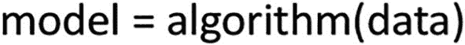
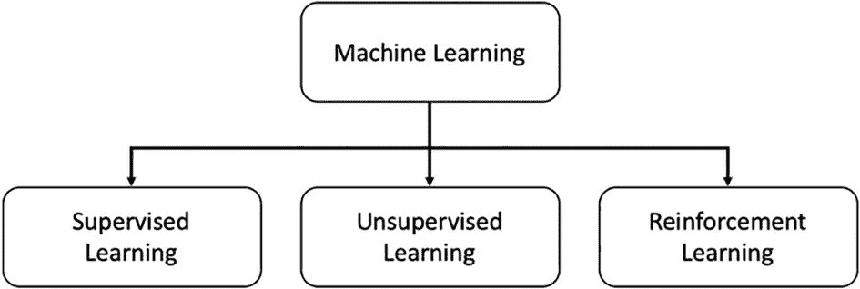
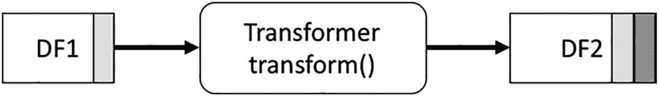
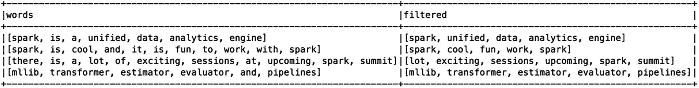
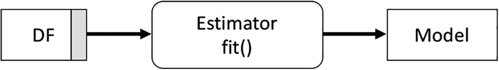
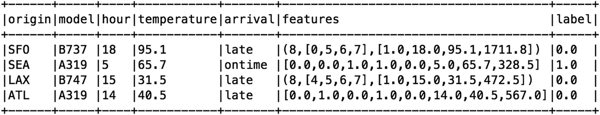
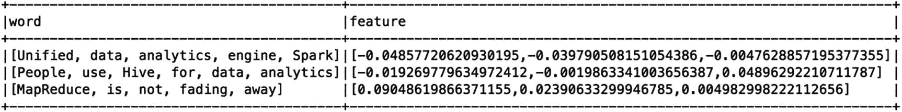
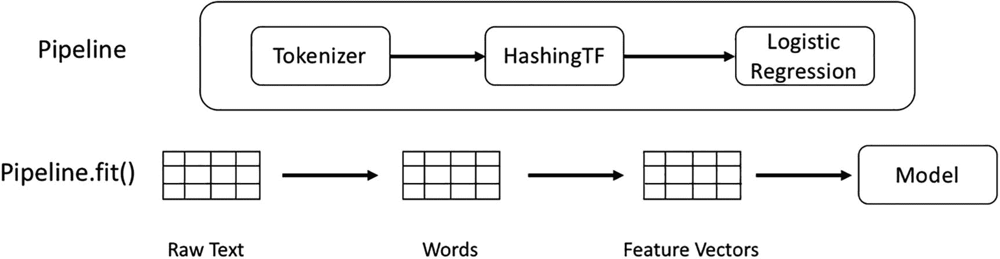
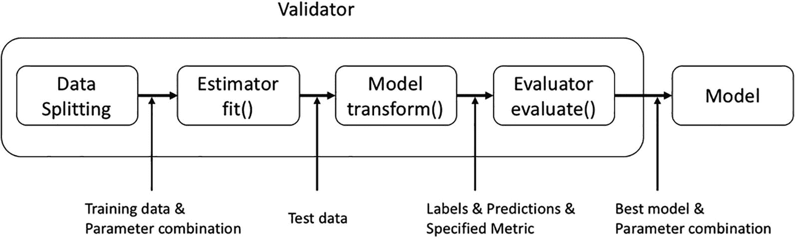
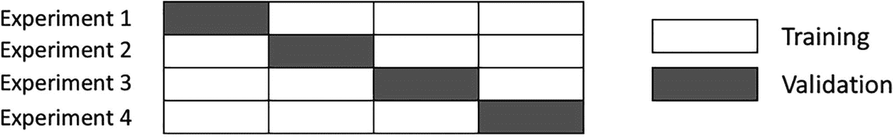

# 八、Spark 机器学习

近年来，围绕人工智能(AI)、机器学习(ML)和深度学习(DL)有很多令人兴奋的事情。人工智能专家和研究人员预测，人工智能将从根本上改变未来人类生活、工作和做生意的方式。对于世界各地的企业来说，人工智能是他们数字化转型之旅的下一步之一，一些企业在将人工智能纳入其商业战略方面取得了比其他企业更多的进展。企业希望人工智能能够高效快速地帮助解决他们的业务问题，并创造新的商业价值，以增加他们的竞争优势。像谷歌、亚马逊、微软、苹果和脸书这样的互联网巨头在投资、采用和将人工智能纳入其产品组合方面处于领先地位。2017 年，超过 150 亿美元的风险投资(VC)资金投资于全球人工智能相关的初创公司，预计这一趋势将持续下去。

人工智能是计算机科学的一个广阔领域，它试图让机器看起来像具有智能。帮助人类进步是一个大胆的目标。人工智能的一个子领域是机器学习，它专注于教会计算机在没有显式编程的情况下进行学习。学习过程包括使用算法从大量数据集中提取模式，并建立一个模型来解释世界。这些算法可以根据它们设计的任务分成不同的组。这些算法的一个共同特点是，它们通过优化内部参数的迭代过程来学习，以获得最佳结果。

深度学习(DL)是受人脑工作方式启发的机器学习方法之一，通过将复杂模式表示为嵌套的概念层次，它已被证明擅长从数据中学习复杂模式。随着大型和精选数据集的可用性与图形处理单元(GPU)的进步相结合，DL 已被证明可以有效地解决对象识别、图像识别、语音识别和机器翻译等领域的问题。在 ImageNet 图像分类挑战赛中，使用 DL 方法训练的计算机系统在图像分类方面击败了人类。这一成就和类似成就的含义是，现在计算机系统可以在与它们的创造者相同的水平上看到、识别物体和听到。图 [8-1](#Fig1) 说明了 AI、ML 和 DL 之间的关系以及它们的时间线。


图 8-1

AI、ML 和 DL 之间的关系及其时间线

创建 Spark 的动机之一是帮助应用程序大规模高效地运行迭代算法。在 Spark 的最近几个版本中，MLlib 库稳步增加了它的产品，通过提供一组常用的 ML 算法和一组工具来简化 ML 模型的构建和评估过程，使实用的 ML 变得可伸缩和简单。

为了理解 MLlib 库提供的特性，有必要对构建 ML 应用程序的过程有一个基本的了解。本章介绍了 MLlib 库中可用的特性和 API。

## 机器学习概述

本节提供了机器学习和 ML 应用程序开发过程的简要概述。这并不意味着详尽无遗；如果你已经熟悉机器学习，请随意跳过。

机器学习是一个广阔而迷人的研究领域，它结合了其他研究领域的部分内容，如数学、统计学和计算机科学。它教会计算机学习模式，并从历史数据中获得洞察力，通常用于决策或预测。与传统的硬编码软件不同，ML 只给你基于你提供的不完美数据的概率输出。向 ML 算法提供的数据越多，输出就越准确。ML 可以解决比传统软件有趣和困难得多的问题，并且这些问题不是特定于任何行业或商业领域的。相关领域的示例包括图像识别、语音识别、语言翻译、欺诈检测、产品推荐、机器人、自动驾驶汽车、加快药物发现过程、医疗诊断、客户流失预测、推荐等等。

鉴于人工智能的目标是让机器看起来像有智能，衡量这一点的最佳方式之一是通过比较机器智能和人类智能。

近几十年来，有几个众所周知的和公开的这种比较的例子。第一个是名为“深蓝”的计算机系统，它在 1997 年根据严格的比赛规则击败了世界象棋冠军。这个例子表明，在游戏中，计算机可以比人类思考得更快更好，有大量但有限的可能走法。

第二个是关于一个名叫沃森的计算机系统，它在 2011 年参加了一个 *Jeopardy* 游戏节目，与两位传奇冠军进行了比赛，赢得了 100 万美元的一等奖。这个例子表明，计算机可以理解特定问答结构中的人类语言，然后利用其庞大的知识库来开发概率答案。

第三个是关于一个名为 AlphGo 的计算机程序，它在 2016 年的一场历史性比赛中击败了一名世界冠军围棋选手。这个例子展示了人工智能领域进步的巨大飞跃。围棋是一种复杂的棋盘游戏，需要直觉、创造力和战略思维。执行穷举搜索移动是不可行的，因为它具有的可能移动的数量大于宇宙中的原子数量。

### 机器学习术语

在深入 ML 之前，学习这个领域的一些基本术语是很重要的。这在以后引用这些术语时很有帮助。为了更容易理解这些术语，在名为*垃圾邮件分类*的规范 ML 示例中提供了解释。

*   **观察**是一个来自统计学领域的术语。一个*观察*是用于学习的实体的一个实例。例如，电子邮件被认为是观察。

*   **标签**是标记观察值的值。例如，“垃圾邮件”或“非垃圾邮件”是用于标记电子邮件的两个可能值。

*   **特征**是关于最有可能对预测输出产生最大影响的观察值的重要属性，例如，电子邮件发件人 IP 地址、字数和大写单词数。

*   **训练数据**是训练 ML 算法以产生模型的观察值的一部分。通常的做法是将收集的数据分成三部分:训练数据、验证数据和测试数据。测试数据部分大约是原始数据集的 70%或 80%。

*   **验证数据**是在模型调整过程中评估 ML 模型性能的一部分观察结果。

*   **测试数据**是在调整过程完成后评估 ML 模型性能的一部分观察结果。

*   **ML 算法**是迭代运行的步骤的集合，用于从给定的测试数据中提取洞察或模式。ML 算法的主要目标是学习从输入到输出的映射。一套众所周知的 ML 算法可供您选择。挑战在于选择正确的算法来解决特定的 ML 问题。对于垃圾邮件检测问题，您可能会选择朴素贝叶斯算法。

*   **模型**:ML 算法从给定的输入数据中学习后，产生一个模型。然后，使用模型对新数据执行预测或做出决策。一个模型用一个数学公式来表示。我们的目标是生成一个通用模型，它可以很好地处理以前没有见过的任何新数据。

图 [8-2](#Fig2) 最好地说明了 ML 算法、数据和模型之间的关系。



图 8-2

最大似然算法、数据和模型之间的关系

应用机器学习时要记住的一个要点是，永远不要用测试数据来训练 ML 算法，因为这违背了产生通用 ML 模型的目的。另一个需要注意的要点是，ML 是一个广阔的领域，当你深入这个领域时，你会发现更多的术语和概念。希望这些基本术语能够帮助你开始学习 ML 的旅程。

### 机器学习类型

ML 是教机器从数据中学习模式，以做出决策或预测。这些任务广泛适用于许多不同类型的问题，其中每个问题类型需要不同的学习方式。有三种学习类型，如图 [8-3](#Fig3) 所示。



图 8-3

不同的机器学习类型

#### 监督学习

在三种不同的学习类型中，这一种被广泛使用并且更受欢迎，因为它可以帮助解决分类和回归中的一大类问题。

分类是将观察值分类到标签的离散或分类类别中。分类问题的例子包括预测电子邮件是否是垃圾邮件；产品评论是正面的还是负面的；图像是否包含狗、猫、海豚或鸟；一篇新闻文章的主题是关于体育、医学、政治还是宗教；特定手写数字是 1 还是 2；以及第四季度收入是否符合预期。当分类结果正好有两个离散值时，称为*二元分类*。当它有两个以上的离散值时，称为*多类分类*。

回归是根据观察预测真实值。与分类不同，预测值不是离散的，而是连续的。回归问题的例子包括根据他们的位置和大小预测房价，根据一组人的背景和教育预测一个人的收入，等等。

这种类型的学习与其他类型的学习之间的一个关键区别因素是，训练数据中的每个观察必须包含一个标签，无论它是离散的还是连续的。换句话说，正确的答案被提供给算法，以通过迭代和递增地改进其对训练数据的预测来学习。一旦预测值和实际值之间达到可接受的误差范围，它就会停止。

区分分类和回归的一个简单的心理模型是，前者是关于将数据分成不同的桶，而后者是关于将最佳线拟合到数据。图 [8-4](#Fig4) 显示了这个心智模型的视觉表现。


图 8-4

分类和回归心理模型

设计了大量算法来解决分类和回归机器学习问题。本章涉及 Spark MLlib 组件中支持的一些，如表 [8-1](#Tab1) 中所列。

表 8-1

MLlib 中的监督学习算法

<colgroup><col class="tcol1 align-left"> <col class="tcol2 align-left"></colgroup> 
| 

任务

 | 

算法

 |
| --- | --- |
| 分类 | 逻辑回归决策图表随机森林梯度增强树线性支持向量机奈伊夫拜厄斯 |
| 回归 | 线性回归广义线性回归决策树回归随机森林回归梯度推进回归 |

#### 无监督学习

这种学习方法的名字意味着没有监督；换句话说，训练 ML 算法的数据不包含标签。这种学习类型旨在解决一类不同的问题，例如发现数据中隐藏的结构或模式，这取决于我们人类来解释这些见解背后的意义。其中一个隐藏的结构叫做*聚类*，对于在聚类内的观察值之间导出有意义的关系或相似性是有用的。图 [8-5](#Fig5) 描述了集群的例子。


图 8-5

聚类的可视化

事实证明，这种学习方法可以解决很多实际问题。假设有大量的文档，但事先不知道某个文档属于哪个主题。您可以使用无监督学习来发现相关文档的聚类，并从那里为每个聚类分配一个主题。无监督学习可以帮助解决的另一个有趣而常见的问题是信用卡欺诈检测。在将用户信用卡交易分组后，发现异常值并不太困难，这些异常值代表小偷偷走信用卡后的异常信用卡交易。表 [8-2](#Tab2) 列出了 Spark 中支持的无监督学习算法。

表 8-2

MLlib 中的无监督学习算法

<colgroup><col class="tcol1 align-left"> <col class="tcol2 align-left"></colgroup> 
| 

任务

 | 

算法

 |
| --- | --- |
| 使聚集 | k 均值潜在狄利克雷分配平分*k*——意思是高斯的 |

#### 强化学习

与前两种类型的学习不同，这种学习不从数据中学习。相反，它通过一系列动作和接收到的反馈，从与环境的互动中学习。根据反馈，它做出调整，向最大化回报的目标靠近。换句话说，它从自己的经验中学习。

直到最近，这种学习方式还没有像前两种那样受到关注，因为除了电脑游戏之外，它还没有取得重大的实际成功。2016 年，谷歌 DeepMind 能够成功地应用这种学习类型来玩一场雅达利游戏，然后将其纳入其 AlphGo 程序，该程序在围棋比赛中击败了一名世界冠军。

此时，Spark MLlib 不包含任何强化学习算法。接下来的部分集中在前两种类型的学习。

Note

术语*被监督*隐喻性地指的是一个教师(人类)“监督”学习者，这就是 ML 算法，通过专门提供答案(标签)以及一组例子(训练数据)。

### 机器学习开发过程

为了有效地应用机器学习来开发智能应用程序，您应该考虑研究和采用大多数 ML 从业者遵循的一套最佳实践。有人说，有效地应用机器学习是一门手艺——一半是科学，一半是艺术。幸运的是，一个众所周知的结构化流程由一系列步骤组成，有助于提供合理的可重复性和一致性，如图 [8-6](#Fig6) 所示。


图 8-6

机器学习应用程序开发流程

这个过程的第一步是清楚地了解你认为 ML 可以帮助你的商业目标或挑战。评估 ML 的替代解决方案以了解成本和权衡是有益的。有时候，从简单的基于规则的解决方案开始会更快。如果有强有力的证据表明，ML 是高效、快速地交付有价值的商业见解的更好选择，那么您将进入下一步，即建立一套您和您的利益相关者都同意的成功度量标准。

成功指标从商业角度建立了 ML 项目的成功标准。它们是可衡量的，并且与商业成功直接相关。度量标准的例子是增加一定百分比的客户转化率，增加一定数量的广告点击率，增加一定数量的收入。成功指标也有助于决定何时因成本或未产生预期收益而放弃 ML 项目。

在成功度量被识别之后，下一步是识别和收集适当数量的数据来训练 ML 算法。收集的数据的质量和数量直接影响训练的 ML 模型的性能。需要记住的重要一点是，确保收集的数据代表了您试图解决的问题。短语“垃圾输入，垃圾输出”仍然适用于描述 ML 中的关键限制。

特色工程是这一过程中最重要也是最耗时的步骤之一。它主要是关于数据清洗和使用领域知识来识别观察值中的关键属性或特征，以帮助 ML 算法学习训练数据和提供的标签之间的直接关系。数据清理任务通常使用探索性数据分析框架来完成，以便从数据分布、相关性、异常值等方面更好地理解数据。这一步是一个昂贵的步骤，因为需要让人们参与进来，并使用他们的领域知识。DL 已经被证明是优于 ML 的学习方法，因为它可以自动提取特征而无需人工干预。

特征工程之后的下一步是选择合适的 ML 模型或算法并训练它。鉴于有许多可用的算法来解决类似的 ML 任务，问题是，使用什么模型是最好的？像大多数事情一样，决定最好的一个需要结合对手头问题的良好理解，对每个算法的各种特征的良好工作知识，以及在过去将它们应用于类似问题的经验。换句话说，在选择最佳算法时，一半是科学，一半是艺术。找到最佳算法需要一些实验。一旦选择了算法，就让它从特征工程步骤中产生的特征中学习。训练步骤的输出是一个模型，然后您可以继续执行一个模型评估，看看它的表现如何。导致这一步的所有先前步骤的目标是产生一个一般化的模型，意味着它在以前从未见过的数据上执行得有多好。

ML 开发过程中的另一个重要步骤是模型评估任务。这既是必要的，也是具有挑战性的。这一步不仅旨在回答模型性能如何的问题，还旨在知道何时停止调整模型，因为其性能已经达到了既定的成功标准。评估过程可以离线或在线完成。前一种情况是指使用训练数据评估模型，后一种情况是指使用生产数据或新数据评估模型。有一组常用的指标来理解模型性能:精度、召回、F1 分数和 AUC。

这一步的艺术部分是理解哪些指标适用于某些 ML 任务。模型性能结果决定了是继续生产部署步骤，还是返回到收集更多数据或不同类型数据的步骤。

这些信息旨在提供 ML 开发流程的概述，并不全面。很容易用一整章的时间来充分涵盖的内部细节和最佳实践。

## Spark 机器学习库

本章的其余部分涵盖了 Spark MLlib 组件的主要特性，并提供了将 Spark 中提供的 ML 算法应用于以下每个 ML 任务的示例:分类、回归、聚类和推荐。

Note

在 Python 世界中，scikit-learn 是最受欢迎的开源机器学习库之一。它构建在 NumPy、SciPy 和 matplotlib 库之上。它提供了一套有监督和无监督的学习算法。它被设计成一个简单高效的库，是在单机上学习和练习机器学习的完美之作。当数据大小超过单台机器的存储容量时，就该切换到 Spark MLlib 了。

近年来，有许多可用的 ML 库可供选择来训练 ML 模型。在大数据时代，有两个理由选择 Spark MLlib 而不是其他选项。第一个是易用性。Spark SQL 提供了一种非常用户友好的方式来执行探索性数据分析。MLlib 库提供了一种构建、管理和持久化复杂 ML 管道的方法。第二个原因是关于大规模训练 ML。Spark 统一数据分析引擎和 MLlib 库的结合可以支持训练具有数十亿次观察和数千个特征的机器学习模型。

### 机器学习管道

ML 流程本质上是一个管道，由一系列按顺序运行的步骤组成。管道通常需要运行多次才能产生最佳模型。为了使实用的机器学习变得容易，Spark MLlib 提供了一组抽象来帮助简化数据清理的步骤，包括工程，训练模型，模型调整和评估，并将它们组织到一个管道中，以便于理解，维护和重复。管道概念的灵感来自 scikit-learn 库。

有四个主要的抽象来形成端到端的 ML 管道:转换器、估计器、评估器和管道。他们提供了一套标准接口，便于与另一位数据科学家合作并理解他的管道。图 8-7 描述了 ML 过程的核心步骤和 MLlib 提供的主要抽象之间的相似性。


图 8-7

ML 主要步骤和 MLlib 管道主要概念之间的相似性

这些抽象的一个共同点是，输入和输出的类型主要是数据帧，这意味着您需要将输入数据转换成数据帧来使用这些抽象。

Note

像 Spark 统一数据分析引擎中的其他组件一样，MLlib 正在切换到基于 DataFrame 的 API，以提供更加用户友好的 API，并利用 Spark SQL 引擎的优化。org.apache.spark.ml 包中提供了新的 API。第一个 MLlib 版本是在基于 RDD 的 API 上开发的，现在仍受支持，但只是处于维护模式。旧的 API 可以在 org.apache.spark.mllib 包中找到。一旦达到功能对等，那么基于 RDD 的 API 将被弃用。

#### 变形金刚(电影名)

转换器被设计成通过在特征工程和模型评估步骤期间操纵一个或多个列来转换数据帧中的数据。转换过程是在构建由 ML 算法学习使用的特征的环境中进行的。这个过程通常包括添加或删除列(要素)，将列值从文本转换为数值，或者规范化特定列的值。

在 MLlib 中使用 ML 算法有一个严格的要求；它们要求所有要素都是双精度数据类型，包括标注。

从技术角度来看，转换器有一个`transform`函数，它对输入列执行转换，结果存储在输出列中。输入列和输出列的名称可以在构造转换器的过程中指定。如果未指定，则使用默认的列名。图 [8-8](#Fig8) 描绘了变压器的样子；DF1 中的阴影列表示输入列。DF2 中较暗的阴影列表示输出列。



图 8-8

变压器输入和输出

每个列数据类型需要一组不同的数据转换器。MLlib 提供了大约 30 个变压器。表 [8-3](#Tab3) 列出了每种数据转换的各种转换器。

表 8-3

不同变压器类型的变压器

<colgroup><col class="tcol1 align-left"> <col class="tcol2 align-left"></colgroup> 
| 

**类型**

 | 

**变形金刚**

 |
| --- | --- |
| 一般 | SQL 转换器向量汇编器 |
| 数字数据 | 斗式提升机量化分解器标准鞋匠 MixMaxScalerMaxAbsScaler 标准化者 |
| 文本数据 | IndexToStringOneHotEncoder 令牌设备，雨令牌设备停用词去除器 NGram 哈希 |

本节讨论几种常见的变压器。

`Binarizer`转换器只是将一个或多个输入列的值转换成一个或多个输出列。输出值为 0 或 1。小于或等于指定阈值的值在输出列中被转换为零。对于大于指定阈值的值，它们的值在输出列中被转换为 1。输入列类型必须是 double 或 VectorUDT。清单 [8-1](#PC1) 将温度列的值转换成两个桶。

```scala
import org.apache.spark.ml.feature.Binarizer

val arrival_data = spark.createDataFrame(Seq(
                 ("SFO", "B737", 18, 95.1, "late"),
                 ("SEA", "A319", 5, 65.7, "ontime"),
                 ("LAX", "B747", 15, 31.5, "late"),
                 ("ATL", "A319", 14, 40.5, "late") ))
                 .toDF("origin", "model", "hour",
                       "temperature", "arrival")

val binarizer = new Binarizer().setInputCol("temperature")
                               .setOutputCol("freezing")
                               .setThreshold(35.6)

binarizer.transform(arrival_data).show

// show the current values of the parameters in binarizer transformer
binarizer.explainParams

inputCol: input column name (current: temperature)
outputCol: output column name (default: binarizer_60430bb4e97f__output, current: freezing)
threshold: threshold used to binarize continuous features (default: 0.0, current: 35.6)

// show the transformation result
binarizer.transform(arrival_data)
         .select("temperature", "freezing").show

+----------------+----------+
|     temperature|  freezing|
+----------------+----------+
|            95.1|       1.0|
|            65.7|       1.0|
|            31.5|       0.0|
|            40.5|       1.0|
+----------------+----------+

Listing 8-1Use Binarizer Transformer Convert Temperature into Two Buckets

```

`Bucketizer` transformer 是二进制化器的通用版本，它可以将列值转换成您选择的桶。控制桶的数量和每个桶的值的范围的方法是以双精度值数组的形式指定一个桶边界列表。在列的值是连续的，并且您希望将它们转换为分类值的情况下，此转换器非常有用。例如，您有一个包含居住在特定州的每个人的收入金额的列，并且您希望将他们的收入分成以下几个类别:高收入、中等收入和低收入。

值存储桶边界数组必须是 double 类型，并且必须遵守以下要求。

*   最小的存储桶边界值必须小于数据帧中输入列的最小值。

*   最大存储桶边界值必须大于数据帧中输入列的最大值

*   输入数组中必须至少有三个桶边界，这将创建两个桶。

在一个人的收入中，很容易知道最小的收入额是 0。最小的桶边界值可以小于 0。当不可能预测最小列值时，可以指定负无穷大。同样，当无法预测最大列值时，则指定正无穷大。

清单 [8-2](#PC2) 是使用这个转换器将温度列分成三个桶的例子，这意味着桶边界数组必须包含至少四个值。它按温度列排序，以便于查看。

```scala
import org.apache.spark.ml.feature.Bucketizer

val bucketBorders = Array(-1.0, 32.0, 70.0, 150.0)
val bucketer = new Bucketizer().setSplits(bucketBorders)
                               .setInputCol("temperature")
                               .setOutputCol("intensity")

val output = bucketer.transform(arrival_data)
                     .output.select("temperature", "intensity")
                     .orderBy("temperature")
                     .show

+----------------+-----------+
|     temperature|  intensity|
+----------------+-----------+
|            31.5|        0.0|
|            40.5|        1.0|
|            65.7|        1.0|
|            95.1|        2.0|
+----------------+-----------+

Listing 8-2Use Bucketizer Transformer Convert Temperature into Three Buckets

```

当处理数值分类值时，通常使用`OneHotEncoder`转换器。如果分类值是字符串类型，首先应用`StringIndexer`估计器，并将它们转换成数字类型。`OneHotEncoder`本质上是将一个数值分类值映射到一个二进制向量，以有目的地删除数值的隐式排序。列表 [8-3](#PC3) 代表学生专业，其中每个专业被分配一个序号值，这表明某个专业高于其他专业。该转换器将序数值转换成向量，以在 ML 训练步骤中消除这种非预期的偏差。清单 [8-3](#PC3) 是使用这个变压器的一个例子。

```scala
import org.apache.spark.ml.feature.OneHotEncoder

val student_major_data = spark.createDataFrame(
                               Seq(("John", "Math", 3),
                                   ("Mary", "Engineering", 2),
                                   ("Jeff", "Philosophy", 7),
                                   ("Jane", "Math", 3),
                                   ("Lyna", "Nursing", 4) ))
                              .toDF("user", "major", "majorIdx")

val oneHotEncoder = new OneHotEncoder().setInputCol("majorIdx")
                                       .setOutputCol("majorVect")

oneHotEncoder.transform(student_major_data).show()

+------+---------------+------------+----------------+
|  user|          major|    majorIdx|       majorVect|
+------+---------------+------------+----------------+
|  John|           Math|           3|   (7,[3],[1.0])|
|  Mary|    Engineering|           2|   (7,[2],[1.0])|
|  Jeff|     Philosophy|           7|       (7,[],[])|
|  Jane|           Math|           3|   (7,[3],[1.0])|
|  Lyna|        Nursing|           4|  ( 7,[4],[1.0])|
+------+---------------+------------+----------------+

Listing 8-3Use OneHotEncoder Transformer the Ordinal Value of the Categorical Values

```

处理字符串分类值时的另一个常见需求是将它们转换为序数值，这可以使用 StringIndexer 估计器来完成。这个估计器在“估计器”一节中描述。

有许多有趣的机器学习用例，其中输入是自由格式的文本。它需要一些转换来将自由形式的文本转换成数字表示，以便 ML 算法可以使用它。其中包括标记化和统计词频。

最有可能的是，你可以猜到`Tokenizer`转换器是做什么的。它对由空格分隔的单词字符串执行标记化，并返回单词数组。如果分隔符不是空格，那么您可以使用带有指定分隔符的`RegexTokenizer`。清单 [8-4](#PC4) 是使用`Tokenizer`变压器的一个例子。

```scala
import org.apache.spark.ml.feature.Tokenizer
import org.apache.spark.sql.functions._

val text_data = spark.createDataFrame(Seq(
             (1, "Spark is a unified data analytics engine"),
             (2, "It is fun to work with Spark"),
             (3, "There is a lot of exciting sessions at upcoming
                    Spark summit"),
             (4, "mllib transformer estimator evaluator
                    and pipelines"))).toDF("id", "line")

val tokenizer = new Tokenizer().setInputCol("line")
                               .setOutputCol("words")

val tokenized = tokenizer.transform(text_data)

tokenized.select("words")
         .withColumn("tokens", size(col("words")))
         .show(false)

+-----------------------------------------------------------------+-------+
|        words                                                    | tokens|
+-----------------------------------------------------------------+-------+
|[spark, is, a, unified, data, analytics, engine]                 |      7|
|[spark, is cool, and, it, is, fun, to, work, with,               |     11|
|[there, is, a, lot, of, exciting, sessions, at, upcoming, spark, summit] |      11|
|[mllib, transformer, estimator, evaluator, and, pipelines]           |      6|
+-----------------------------------------------------------------+-------+

Listing 8-4Use Tokenizer Transformer to Perform Tokenization

```

停用词是语言中常用的词。在自然语言处理或机器学习的背景下，停用词往往会添加不必要的噪音，不会添加任何有意义的贡献。因此，它们通常在标记化步骤后立即被删除。`StopWordsRemover` transformer 旨在帮助这一努力。

从 Spark 2.3 版本开始，Spark 发行版中包含了以下语言的停用词:丹麦语、荷兰语、英语、芬兰语、法语、德语、匈牙利语、意大利语、挪威语、葡萄牙语、俄语、西班牙语、瑞典语和土耳其语。它被设计得很灵活，所以你可以从一个文件中提供一组停用词。

要在特定语言中使用停用词，首先要调用`StopWordsRemover.loadDefaultStopWords(<language in lower case>)`来加载它们，并将它们提供给`StopWordsRemover`的实例。此外，您可以请求该转换器执行不区分大小写的停用词过滤。清单 [8-5](#PC5) 是使用`StopWordsRemover`转换器删除英语停用词的一个例子。

```scala
import org.apache.spark.ml.feature.StopWordsRemover

val enSWords = StopWordsRemover.loadDefaultStopWords("english")

val remover = new StopWordsRemover().setStopWords(enSWords)
                                    .setInputCol("words")
                                    .setOutputCol("filtered")

// use the tokenized from Listing 8-5 example
val cleanedTokens = remover.transform(tokenized)

cleanedTokens.select("words","filtered").show(false)

Listing 8-5Use StopWordsRemover Transformer to Remove English Stop Words

```



`HashingTF`转换器通过计算每个单词的频率，将单词集合转换成数字表示。通过应用名为 MurmurHash 3 的哈希函数，每个单词都被映射到一个索引中。这种方法是有效的，但是它遭受潜在的散列冲突，这意味着多个单词可能映射到同一个索引。最小化冲突的一种方法是以 2 的幂指定大量的桶，以均匀地分布字。清单 [8-6](#PC6) 将来自清单 [8-5](#PC5) 的过滤后的柱送入`HashingTF`变压器。

```scala
import org.apache.spark.ml.feature.HashingTF

val tf = new HashingTF().setInputCol("filtered")
                        .setOutputCol("TFOut")
                        .setNumFeatures(4096)

val tfResult = tf.transform(cleanedTokens)

tfResult.select("filtered", "TFOut").show(false)

Listing 8-6Use HashingTF Transformer to Transform Words into Numerical Representation Via Hashing and Counting

```


本节讨论的最后一个转换器是`VectorAssembler`，它将一组列组合成一个向量列。在机器学习术语中，这相当于将单个特征组合成单个向量特征，供 ML 算法学习。单个输入列的类型必须是以下类型之一:数值、布尔或向量类型。输出向量列包含按指定顺序排列的所有列的值。这个变换器实际上用在每一个 ML 流水线中，它的输出被传递到一个估计器中。清单 [8-7](#PC7) 是使用`VectorAssembler`变压器的一个例子。

```scala
import org.apache.spark.ml.feature.VectorAssembler

val arrival_features  = spark.createDataFrame(Seq(
                                          (18, 95.1, true),
                                           (5, 65.7, true),
                                           (15, 31.5, false),
                                           (14, 40.5, false) ))
                          .toDF("hour", "temperature", "on_time")

val assembler = new VectorAssembler().setInputCols(
                       Array("hour", "temperature", "on_time"))
                                     .setOutputCol("features")

val output = assembler.transform(arrival_features)
output.show

+-----+-----------------+-----------+-------------------+
| hour|      temperature|    on_time|           features|
+-----+-----------------+-----------+-------------------+
|   18|             95.1|       true|    [18.0,95.1,1.0]|
|    5|             65.7|       true|     [5.0,65.7,1.0]|
|   15|             31.5|      false|    [15.0,31.5,0.0]|
|   14|             40.5|      false|    [14.0,40.5,0.0]|
+-----+-----------------+-----------+-------------------+

Listing 8-7Use VectorAssembler Transformer to Combines Features into a Vector Feature

```

为了方便一次转换多个列，Spark 版本增加了对这些转换器的支持:`Binarizer`、`StringIndexer`和`StopWordsRemover`。清单 [8-8](#PC8) 显示了一个用`Binarizer`转换器`.`转换多个列的小例子，您可以选择指定一个或多个阈值。如果指定了单个阈值，那么它将用于所有输入列。如果指定了多个阈值，则第一个阈值用于第一个输入列，依此类推。

```scala
import org.apache.spark.ml.feature.Binarizer

val temp_data = spark.createDataFrame(
                      Seq((65.3,95.1),(60.7,99.1),
                          (75.3, 105.3)))
                     .toDF("morning_temp", "night_temp")

val temp_bin = new Binarizer()
           .setInputCols(Array("morning_temp", "night_temp"))
           .setOutputCols(Array("morning_oput","night_out"))
           .setThresholds(Array(65,96))

temp_bin.transform(temp_data).show

+------------+----------+------------+---------+
|morning_temp|night_temp|morning_oput|night_out|
+------------+----------+------------+---------+
|        65.3|      95.1|         1.0|      0.0|
|        60.7|      99.1|         0.0|      1.0|
|        75.3|     105.3|         1.0|      1.0|
+------------+----------+------------+---------+

Listing 8-8Transforming Multiple Columns With Binarizer Transformer

```

了解转换器如何工作以及 MLlib 中可用的转换器在 ML 开发过程的特性工程步骤中起着重要的作用。通常，VectorAssembler 转换器的输出由估计器消耗，这将在下一节讨论。

#### 估计量

估计器是对 ML 学习算法或任何其他对数据进行操作的算法的抽象。一个估计量可以是两种算法中的一种，这是相当令人困惑的。第一种类型的一个例子是称为`LinearRegression`的 ML 算法，它用于预测房价的回归任务。第二种算法的一个例子是`StringIndexer`，它将分类值编码成索引。每个分类值的索引值基于它在数据帧的整个输入列中出现的频率。在高层次上，这种估计器将一列的值转换成另一列的值；然而，它需要在整个数据帧上通过两次才能产生预期的输出。

从技术角度来看，估计器有一个`fit`函数，它在输入列上应用一个算法。产生的结果封装在一个名为`Model`的对象类型中，这是一个`Transformer`类型。输入列和输出列的名称可以在构造估计器的过程中指定。图 [8-9](#Fig9) 描述了估计器的样子及其输入和输出。



图 8-9

估计量及其输入和输出

为了给这两种类型的估计器一个概念，表 [8-4](#Tab4) 提供了 MLlib 中可用估计器的子集。

表 8-4

MLlib 中可用估计量的样本

<colgroup><col class="tcol1 align-left"> <col class="tcol2 align-left"></colgroup> 
| 

类型

 | 

估计量

 |
| --- | --- |
| 机器学习算法 | 逻辑回归决策树分类器随机应变分类器线性回归随机森林回归量聚类皱胃向左移平分意味着 |
| 数据转换算法 | 综合资料的文件（intergrated Data File）公式 StringIndexeronehotencoderestomator 口腔癌标准鞋匠 MixMaxScalerMaxAbsScalerWord2Vec |

下一节提供了一些在处理文本和数字数据时常用的估计量的例子。

`RFormula`是一个有趣的通用估计器，其中转换逻辑以声明方式表达。它可以处理数值和分类值，其输出是一个特征向量。MLlib 从 R 语言中借用了这个估计器的思想，它只支持 R 中可用的运算符的子集。表 [8-5](#Tab5) 中列出了基本的和支持的运算符。理解转换语言以充分利用`RFormula`估算器的灵活性和强大功能需要时间。

表 8-5

公式转换器中支持的运算符

<colgroup><col class="tcol1 align-left"> <col class="tcol2 align-left"></colgroup> 
| 

**操作员**

 | 

**描述**

 |
| --- | --- |
| ~ | 目标和术语之间的分隔符 |
| + | 连接术语 |
| - | 删除一个术语 |
| ： | 其他术语之间的相互作用创造了新的特征。乘法用于数值，二进制用于分类值。 |
| 。 | 除目标之外的所有列 |

清单 [8-9](#PC9) 将到达列和其余列中的标签指定为特性。此外，它使用小时和温度列之间的交互创建了一个新功能。因为这两列是数字类型，所以它们的值相乘。

```scala
import org.apache.spark.ml.feature.RFormula

val arrival_data = spark.createDataFrame(Seq(
                     ("SFO", "B737", 18, 95.1, "late"),
                     ("SEA", "A319", 5, 65.7, "ontime"),
                     ("LAX", "B747", 15, 31.5, "late"),
                     ("ATL", "A319", 14, 40.5, "late") ))
                         .toDF("origin", "model", "hour",
                               "temperature", "arrival")

val formula = new RFormula().setFormula(
                       "arrival ~ . + hour:temperature")
                            .setFeaturesCol("features")
                            .setLabelCol("label")

// call fit function first, which returns a model (type of transformer), then call transform
val output = formula.fit(arrival_data).transform(arrival_data)

output.select("*").show(false)

Listing 8-9Use RFomula Transformer to Create a Feature Vector

```



在处理文本时，最常用的估计量之一是 IDF 估计量。它的名字是*逆文档频率*的首字母缩写。这个估计器通常在文本被标记化和计算出词频后立即使用。这个估计器背后的思想是通过计算每个单词出现在文档中的数量来计算它的重要性或权重。这种想法背后的直觉是，一个出现频率高、流行范围广的词不太重要；例如，单词*的*。相反，仅在少数文档中出现频率高的单词表示更高的重要性；比如*分类*这个词。在数据帧的上下文中，文档指的是一行。敏锐的读者会发现，计算每个单词的重要性需要遍历每一行，因此 IDF 是一个估计器，而不是转换器。清单 [8-10](#PC10) 将`Tokenizer`和`HashingTF`变压器与`IDF`估算器链接在一起。与变压器不同，估值器被急切地评估，这意味着当调用`fit`函数时，它触发一个 Spark 作业。

```scala
import org.apache.spark.ml.feature.Tokenizer
import org.apache.spark.ml.feature.HashingTF
import org.apache.spark.ml.feature.IDF

val text_data = spark.createDataFrame(Seq(
          (1, "Spark is a unified data analytics engine"),
          (2, "Spark is cool and it is fun to work with Spark"),
          (3, "There is a lot of exciting sessions at upcoming
               Spark summit"),
          (4, "mllib transformer estimator evaluator and
               pipelines")  )).toDF("id", "line")

val tokenizer = new Tokenizer().setInputCol("line")
                               .setOutputCol("words")

// the output column of the Tokenizer transformer is the input to HashingTF
val tf = new HashingTF().setInputCol("words")
                        .setOutputCol("wordFreqVect")
                        .setNumFeatures(4096)

val tfResult = tf.transform(tokenizer.transform(text_data))

// the output of the HashingTF transformer is the input to IDF estimator
val idf = new IDF().setInputCol("wordFreqVect")
                   .setOutputCol("features")

// since IDF is an estimator, call the fit function
val idfModel = idf.fit(tfResult)

// the returned object is a Model, which is of type Transformer
val weightedWords = idfModel.transform(tfResult)

weightedWords.select("label", "features").show(false)

weightedWords.printSchema

 |-- id: integer (nullable = false)
 |-- line: string (nullable = true)
 |-- words: array (nullable = true)
 |    |-- element: string (containsNull = true)
 |-- wordFreqVect: vector (nullable = true)
 |-- features: vector (nullable = true)

// the feature column contains a vector for the weight of each word, since it is long, the output is not included //below
weightedWords.select("wordFreqVect", "features").show(false)

Listing 8-10Use IDF Estimator to Compute the Weight of Each Word

```

当处理包含分类值的文本数据时，一个常用的估计器是`StringIndexer`估计器。它将类别值编码到基于其频率的索引中，使得最频繁的类别值的索引值为 0，依此类推。对于这个估计器来说，要得出一个分类值的索引值，它首先必须计算每个分类值的频率，最后给每个分类值分配一个索引值。为了执行计数和分配索引值，它必须从数据帧的开始到结束遍历输入列的所有值。如果输入列是数字，这个估计器在计算它的频率之前先转换它的字符串。

清单 [8-11](#PC11) 提供了一个使用`StringIndexer`估算器对电影类型进行编码的例子。

```scala
import org.apache.spark.ml.feature.StringIndexer

val movie_data = spark.createDataFrame(Seq(
                                           (1, "Comedy"),
                                           (2, "Action"),
                                           (3, "Comedy"),
                                           (4, "Horror"),
                                           (5, "Action"),
                                           (6, "Comedy"))
                                     ).toDF("id", "genre")

val movieIndexer = new StringIndexer().setInputCol("genre")
                                      .setOutputCol("genreIdx")

// first fit the data
val movieIndexModel = movieIndexer.fit(movie_data)

// use returned transformer to transform the data
val indexedMovie = movieIndexModel.transform(movie_data)

indexedMovie.orderBy("genreIdx").show()

+---+-----------+------------+
| id|      genre|    genreIdx|
+---+-----------+------------+
|  3|     Comedy|         0.0|
|  6|     Comedy|         0.0|
|  1|     Comedy|         0.0|
|  5|     Action|         1.0|
|  2|     Action|         1.0|
|  4|     Horror|         2.0|
+---+-----------+------------+

Listing 8-11StringIndex Estimator to Encode Movie Genre

```

该估计器基于频率的降序来分配索引。这种默认行为可以很容易地更改为频率的升序。它支持另外两种排序类型:降序和升序。要更改默认的排序类型，只需用下列值之一调用`setStringOrderType("<ordering type>")`函数:`frequencyDesc, frequencyAsc, alphabetDesc`和`alphabetAsc`。

在 Spark 版中，`StringIndexer`估算器可以支持对数据帧中的多列分类值进行编码。当有这样的需要时，您可以简单地调用`setInputCols`函数来指定要编码的输入列名，并通过调用`setOutputCols`函数来相应地指定输出列名。

```scala
import org.apache.spark.ml.feature.StringIndexer

val movie_data2 = spark.createDataFrame(Seq(
                                        (1, "Comedy", "G"),
                                        (2, "Action", "PG"),
                                        (3, "Comedy", "NC-17"),
                                        (4, "Horror", "PG-13"))
                                  ).toDF("id", "genre", "rating")

val movieIdx2 = new StringIndexer()
                   .setInputCols(Array("genre", "rating"))
                   .setOutputCols(Array("genreIdx", "ratingIdx"))

movieIdx2.fit(movie_data2)
         .transform(movie_data2)
         .orderBy('genreIdx)
         .show()

+---+------+------+--------+---------+
| id| genre|rating|genreIdx|ratingIdx|
+---+------+------+--------+---------+
|  3|Comedy| NC-17|     0.0|      1.0|
|  1|Comedy|     G|     0.0|      0.0|
|  2|Action|    PG|     1.0|      2.0|
|  4|Horror| PG-13|     2.0|      3.0|
+---+------+------+--------+--------+

Listing 8-12StringIndex Estimator to Encode Multiple Columns

```

在特定分类值存在于训练数据集中但不存在于测试数据集中的情况下。默认情况下，`StringIndexer`估计器抛出一个错误来指示这种情况。它提供了另外两种处理这种情况的方法。

*   **跳过**:过滤掉无效数据的行

*   **保存**:将无效数据放入专门的附加桶中

您可以通过为`setHandleInvalid`函数指定以下参数来说明您希望`StringIndexer`估计器如何处理这个场景:`keep`、`skip`、`error`。

处理分类值时另一个有用的估计器是`OneHotEncoderEstimator`，它将分类值的索引编码成一个二进制向量。从 Spark 版本 2.3.0 开始，`OneHotEncoder` transformer 已经被弃用，因为它在处理未知类别方面存在限制。该估计器通常与`StringIndexer`估计器结合使用，其中`StringIndexer`的输出成为该估计器的输入。清单 [8-13](#PC13) 展示了两种估算器的用法。

```scala
import org.apache.spark.ml.feature.OneHotEncoderEstimator

// the input column genreIdx is the output column of StringIndex in listing 8-9
val oneHotEncoderEst = new OneHotEncoderEstimator().setInputCols(
                                  Array("genreIdx"))
                          .setOutputCols(Array("genreIdxVector"))

// fit the indexedMovie data produced in listing 8-10
val oneHotEncoderModel = oneHotEncoderEst.fit(indexedMovie)

val oneHotEncVect = oneHotEncoderModel.transform(indexedMovie)

oneHotEncVect.orderBy("genre").show()

+---+--------+------------+--------------------+
|id |  genre |    genreIdx|      genreIdxVector|
+---+--------+------------+--------------------+
| 5 | Action |    1.0     |      (2,[1],[1.0]) |
| 2 | Action |    1.0     |      (2,[1],[1.0]) |
| 3 | Comedy |    2.0     |       (2,[],[])    |
| 6 | Comedy |    2.0     |       (2,[],[])    |
| 1 | Comedy |    2.0     |       (2,[],[])    |
| 4 | Horror |    0.0     |       (2,[0],[1.0])|
+---+--------+------------+--------------------+

Listing 8-13OneHotEncoderEstimator Consumes the Output of the StringIndexer Estimator

```

在处理自由文本时,`Word2Vec`估算器很有用。它代表*字到矢量*。该估计器利用众所周知的单词嵌入技术，该技术将单词标记转换成数字向量表示，使得语义相似的单词被映射到附近的点。这种技术背后的直觉是，相似的单词往往一起出现，并且具有相似的上下文。换句话说，当两个不同的单词有非常相似的相邻单词时，那么它们很可能在意义上非常相似或者是相关的。这种技术已经在一些自然语言处理应用中被证明是有效的，例如单词类比、单词相似性、实体识别和机器翻译。

`Word2Vec`估算器有几种配置，需要提供适当的值来控制输出。表 [8-6](#Tab6) 描述了这些配置。

表 8-6

Word2Vec 配置

<colgroup><col class="tcol1 align-left"> <col class="tcol2 align-left"> <col class="tcol3 align-left"></colgroup> 
| 

名字

 | 

缺省值

 | 

描述

 |
| --- | --- | --- |
| 向量大小 | One hundred | 输出向量的大小。 |
| windows size(windows size) | five | 用作上下文的单词数。 |
| minCount | five | 令牌必须出现在输出中的最小次数。 |
| maxsentexcelength | One thousand | 其他术语之间的相互作用创造了新的特征。乘法用于数值，二进制用于分类值。 |

清单 [8-14](#PC14) 展示了如何使用`Word2Vec`估计器，以及如何找到相似的单词。

```scala
import org.apache.spark.ml.feature.Word2Vec

val documentDF = spark.createDataFrame(Seq(
                "Unified data analytics engine Spark".split(" "),
                "People use Hive for data analytics".split(" "),
                "MapReduce is not fading away".split(" "))
                      .map(Tuple1.apply)).toDF("word")

val word2Vec = new Word2Vec().setInputCol("word")
                             .setOutputCol("feature")
                             .setVectorSize(3)
                             .setMinCount(0)

val model = word2Vec.fit(documentDF)
val result = model.transform(documentDF)

result.show(false)

Listing 8-14Use Word2Vec Estimator to Compute Word Embeddings and Find Similar Words

```



```scala
// find similar words to Spark, the result shows both Hive and MapReduce are similar.
model.findSynonyms("Spark", 3).show

+----------------+-----------------------------+
|            word|                   similarity|
+----------------+-----------------------------+
|          engine|           0.9133241772651672|
|       MapReduce|           0.7623026967048645|
|            Hive|           0.7179173827171326|
+----------------+-----------------------------+

// find similar words to Hive, the result shows Spark is similar
model.findSynonyms("Hive", 3).show
+---------+------------------------------+
|     word|                    similarity|
+---------+------------------------------+
|    Spark|            0.7179174423217773|
|   fading|            0.5859972238540649|
|   engine|           0.43200281262397766|
+---------+------------------------------+

```

下一个评估者是关于规范化和标准化数字数据的。使用这些估计值的原因是为了确保使用距离作为测量值的学习算法不会对具有较大值的要素施加比另一个具有较小值的要素更大的权重。

规范化数字数据是将其原始范围映射到从零到一的范围的过程。当观测值具有多个不同范围的属性时，这尤其有用。比如说你有一个员工的工资和身高。工资的价值以千计。高度的值是个位数。这就是`MinMaxScaler`估算器的设计目的。它使用列汇总统计数据，将每个要素(列)分别线性重新缩放到最小值和最大值的公共范围。例如，如果最小值为 0.0，最大值为 3.0，则所有值都在该范围内。清单 [8-15](#PC16) 提供了一个使用带有薪水和身高信息的 employee_data 与`MinMaxScaler`一起工作的例子。这两个特性的值之间的幅度相当大，但是在运行了`MinMaxScaler`之后，情况就不一样了。

```scala
import org.apache.spark.ml.feature.MinMaxScaler
import org.apache.spark.ml.linalg.Vectors

val employee_data = spark.createDataFrame(Seq(
                               (1, Vectors.dense(125400, 5.3)),
                               (2, Vectors.dense(179100, 6.9)),
                               (3, Vectors.dense(154770, 5.2)),
                               (4, Vectors.dense(199650, 4.11))))
                         .toDF("empId", "features")

val minMaxScaler = new MinMaxScaler().setMin(0.0)
                                     .setMax(5.0)
                                     .setInputCol("features")
                                     .setOutputCol("sFeatures")

val scalerModel = minMaxScaler.fit(employee_data)

val scaledData = scalerModel.transform(employee_data)

println(s"Features scaled to range:
          [${minMaxScaler.getMin}, ${minMaxScaler.getMax}]")
Features scaled to range: [0.0, 5.0]

scaledData.select("features", "sFeatures").show(false)

+--------------------+------------------------------------------+
|     features       | scaledFeatures                           |
+--------------------+------------------------------------------+
|     [125400.0,5.3] | [0.0,2.1326164874551963]                 |
|     [179100.0,6.9] | [3.616161616161616,5.0]                  |
|     [154770.0,5.2] | [1.9777777777777779,1.9534050179211468]  |
|    [199650.0,4.11] | [5.0,0.0]                                |
+--------------------+------------------------------------------+

Listing 8-15Use MinMaxScaler to Rescale Features

```

除了数字数据规范化，另一个经常用于处理数字数据的操作是*标准化*。当数值数据具有钟形曲线分布时，此操作尤其适用。标准化操作有助于将数据转换为规范化形式，其中数据在-1 和–1 的范围内，平均值为 0。这样做的原因是为了帮助某些 ML 算法在数据具有围绕零均值的分布时更好地学习。`StandardScaler`估算器是为标准化操作而设计的。清单 [8-16](#PC17) 使用与清单 [8-14](#PC14) 相同的输入数据集。输出显示要素值现在以 0 为中心，并带有一个单位的标准差。

```scala
import org.apache.spark.ml.feature.StandardScaler
import org.apache.spark.ml.linalg.Vectors

val employee_data = spark.createDataFrame(Seq(
                               (1, Vectors.dense(125400, 5.3)),
                               (2, Vectors.dense(179100, 6.9)),
                               (3, Vectors.dense(154770, 5.2)),
                               (4, Vectors.dense(199650, 4.11))))
                         .toDF("empId", "features")

// set the unit standard deviation to true and center around the mean
val standardScaler = new StandardScaler().setWithStd(true)
                                       .setWithMean(true)
                                       .setInputCol("features")
                                       .setOutputCol("sFeatures")

val standardMode = standardScaler.fit(employee_data)

val standardData = standardMode.transform(employee_data)

standardData.show(false)

+-----+--------------+------------------------------------------+
|empId| feature      |          sFeatures                       |
+-----+--------------+------------------------------------------+
|  1  |[125400.0,5.3]|[-1.2290717420781212,-0.06743742573177587]|
|  2  |[179100.0,6.9]|   [0.4490658767775897,1.3248191055048935]|
|  3  |[154770.0,5.2]|[-0.3112523404805006,-0.15445345893406737]|
|  4  |[199650.0,4.1]|    [1.091258205781032,-1.102928220839048]|
+-----+--------------+------------------------------------------+

Listing 8-16Use StandardScaler to Standard the Features Around the Mean of Zero

```

MLlib 中有更多的估算器可以用来执行大量的数据转换和映射。它们都遵循符合输入数据的标准抽象，并产生一个`Model`实例。这些例子旨在说明如何使用这些估算器。第二种估计量的例子是最大似然算法，将在下面的章节中介绍。

#### 管道

在机器学习中，通常会运行一系列步骤来清理和转换数据，然后训练一个或多个 ML 算法来从数据中学习，最后调整模型以实现最佳的模型性能。MLlib 中的管道抽象旨在使该工作流更易于开发和维护。从技术角度来看，MLlib 有一个用于管理一系列阶段的`Pipeline`类。每一个都由`PipelineStage`类表示，要么是转换器，要么是估计器。`Pipeline`抽象是一种估计器。

设置管道的第一步是创建一个 stage 集合，创建一个`Pipeline`类的实例，并用 stage 数组对其进行配置。`Pipeline`类按照指定的顺序运行这些阶段。如果一个阶段是一个变压器，那么`transform()`功能被调用。如果一个阶段是一个估计器，则调用`fit()`函数来产生一个转换器。

让我们看一个使用转换器和估算器处理文本的小工作流示例。图 [8-10](#Fig10) 中描述的小型管道由两个变压器和一个估算器组成。当调用`Pipeline.fit()`函数时，输入数据帧的原始文本被传递到`Tokenizer`转换器，其输出被传递到`HashingTF`转换器，后者将单词转换成特征。`Pipeline`类将`LogisticRegression`识别为一个估计器，使用计算出的特征调用`fit`函数来产生逻辑回归模式`l`。

图 [8-10](#Fig10) 中描述了`Pipeline`的代码，清单 [8-17](#PC18) 中列出了该代码。抽象是一个估计器。因此，一旦创建并配置了`Pipeline`的实例，就必须使用训练数据作为输入来调用`fit()`函数，以触发阶段的执行。输出是`PipelineModel`的一个实例，它是一种转换器。此时，您可以将测试数据传递给`transform()`函数来执行预测。

MLlib 提供了 ML 持久性特性，使得将管道或模型保存到磁盘并在以后加载以执行预测变得容易。持久性特性的好处在于，它被设计成以一种语言中立的格式保存信息。因此，当管道或模型在 Scala 中持久化时，可以用不同的语言读回，比如 Java 或 Python。

许多实际生产管道由许多阶段组成。阶段数多了，就很难理解流程和维护。MLlib `Pipeline`抽象可以帮助应对这些挑战。另一个需要注意的关键点是`Pipelines`和`PipelineModels`都被设计成确保训练和测试数据流通过相同的特征处理步骤。机器学习中的一个常见错误是不一致地处理训练和测试数据，这在模型评估结果中产生了差异。



图 8-10

小型管道示例

```scala
import org.apache.spark.ml.{Pipeline, PipelineModel}
import org.apache.spark.ml.classification.LogisticRegression
import org.apache.spark.ml.feature.{HashingTF, Tokenizer}

val text_data = spark.createDataFrame(Seq(
      (1, "Spark is a unified data analytics engine", 0.0),
      (2, "Spark is cool and it is fun to work with Spark", 0.0),
      (3, "There is a lot of exciting sessions at upcoming Spark
          summit", 0.0),
      (4, "signup to win a million dollars", 0.0)  ))
                     .toDF("id", "line", "label")

val tokenizer = new Tokenizer().setInputCol("line")
                               .setOutputCol("words")

val hashingTF = new HashingTF()
                    .setInputCol(tokenizer.getOutputCol)
                    .setOutputCol("features")
                    .setNumFeatures(4096)

val logisticReg = new LogisticRegression().setMaxIter(5)
                                          .setRegParam(0.01)

val pipeline = new Pipeline().setStages(Array(
                              tokenizer, hashingTF, logisticReg))
val logisticRegModel = pipeline.fit(text_data)

// persist model and pipeline
logisticRegModel.write.overwrite()
                .save("/tmp/logistic-regression-model")

pipeline.write.overwrite()
                .save("/tmp/logistic-regression-pipeline")

// load model and pipeline
val prevModel = PipelineModel.load("/tmp/spark-logistic-regression-model")

val prevPipeline = Pipeline.load("/tmp/logistic-regression-pipeline")

Listing 8-17Using Pipepline to Small a Small Workflow

```

##### 管道持久性:保存和加载

一旦对模型进行了训练和评估，您可以保存该模型或训练该模型的管道，以便在以后的日子里或在 Spark 集群重新启动后，使用其他数据集进一步评估您的模型。后一种方法是首选的，因为它记住了模型类型；否则，您必须在加载步骤中指定它。

持久化您的模型的主要好处是节省时间和跳过训练步骤，这可能需要几个小时才能完成。

#### 模型调整

模型调整步骤旨在使用一组参数来训练模型，以实现最佳模型性能，从而满足 ML 开发过程的第一步中定义的目标。这个步骤通常是乏味的、重复的和耗时的，因为它需要试验不同的 ML 算法或几组参数。

本节旨在描述 MLlib 提供的一些工具，以帮助完成模型调优步骤中的繁重部分。本节并不打算展示如何执行模型调优。

在详细介绍 MLlib 提供的工具之前，理解以下术语很重要。

*   模型超参数有
    *   管理 ML 算法训练过程的配置

    *   模型外部的配置，无法从训练数据中学习

    *   机器学习实践者在培训过程开始之前提供的配置

    *   通过迭代方式为给定的机器学习任务调整的配置

*   模型参数是
    *   机器学习实践者不提供的属性

    *   在训练过程中学习到的训练数据的属性

    *   在培训过程中优化的属性

    *   执行预测的模型的属性

模型超参数的示例包括 *k* 均值聚类算法中的聚类数、逻辑回归算法中应用的正则化量以及学习率。

模型参数的示例包括线性回归模型中的系数或决策树模型中的分支位置。

MLlib 中帮助模型调优的两个常用类是`CrossValidator`和`TrainValidationSplit,`，它们都是`Estimator`类型。这些类也被称为*验证器*，它们需要以下输入。

*   第一个输入是需要调整的内容——一个 ML 算法或一个`Pipeline`实例。它一定是一种估计量。

*   第二个输入是用于调整所提供的估计器的一组参数。这些参数也被称为*参数网格*，用于搜索以找到最佳模型。名为`ParagramGridBuilder`的便利实用程序可用于构建参数网格。

*   最后一个输入是一个评估器，用于根据保留的测试数据评估模型的性能。MLlib 为每个机器学习任务提供了一个特定的评估器，它可以产生一个或多个评估指标，供您了解模型性能。支持常用的机器学习指标，如均方根误差、精度、召回率和准确度

在高层次上，验证器对给定的输入执行以下步骤。

1.  根据指定的比率，将输入特征数据分为训练数据集和测试数据集。

2.  对于参数网格中的每个组合，给定的估计器与训练数据和参数组合相匹配。

3.  指定的评估器根据测试数据评估输出模型。记录并比较性能指标。

4.  产生最佳性能的模型与所使用的参数集一起返回。

这些步骤如图 [8-11](#Fig11) 所示，使得验证器中发生的事情更加直观。



图 8-11

在验证器内部

`TrainValidationSplit`验证器根据指定的比率将给定的输入数据分割成训练和验证数据集，然后根据每个参数组合训练和评估数据集对。例如，如果给定的参数集有六个组合，给定的估计器被训练和评估大小次，每次用不同的参数组合。

清单 [8-18](#PC19) 提供了一个使用`TrainValidationSplit`通过六个参数组合的参数网格调整线性回归估计器的例子。这个例子的重点是`TrainValidationSplit`。假设特征工程已经完成，数据帧中有一个名为`features`的列。

```scala
import org.apache.spark.ml.{Pipeline, PipelineModel}
import org.apache.spark.ml.classification.LogisticRegression
import org.apache.spark.ml.feature.{HashingTF, Tokenizer}
import org.apache.spark.ml.tuning.{ParamGridBuilder, TrainValidationSplit}
import org.apache.spark.ml.evaluation.BinaryClassificationEvaluator

val text_data = spark.createDataFrame(Seq(
            (1, "Spark is a unified data analytics engine", 0.0),
            (2, "Spark is cool and it is fun to work with Spark",
                0.0),
            (3, "There is a lot of exciting sessions at upcoming
                 Spark summit", 0.0),
            (4, "signup to win a million dollars", 0.0)  ))
                     .toDF("id", "line", "label")

val tokenizer = new Tokenizer().setInputCol("line")
                               .setOutputCol("words")

val hashingTF = new HashingTF().setInputCol(
                                    tokenizer.getOutputCol)
                               .setOutputCol("features")

val logisticReg = new LogisticRegression().setMaxIter(5)

val pipeline = new Pipeline().setStages(
                      Array(tokenizer, hashingTF, logisticReg))

// the first parameter has 3 values and second parameter has 2 values,
// therefore the total parameter combinations is 6
val paramGrid = new ParamGridBuilder().addGrid(
                      hashingTF.numFeatures, Array(10, 100, 250))
                 .addGrid(logisticReg.regParam, Array(0.1, 0.05))
                 .build()

// setting up the validator with required inputs - estimator, evaluator, parameter grid and train ratio
val trainValSplit = new TrainValidationSplit()
                         .setEstimator(pipeline)
                        .setEvaluator(
                             new BinaryClassificationEvaluator)
                        .setEstimatorParamMaps(paramGrid)
                        .setTrainRatio(0.8)

// train the linear regression estimator
val model = trainValidationSplit.fit(training)

Listing 8-18Example of TrainValidationSplit

```

`CrossValidator`验证器实现了机器学习社区中广为人知的技术来帮助模型调整步骤。这种技术通过将观察值随机分成大小大致相同的非重叠 *k* 组或折叠，最大化了用于训练和测试的数据量。每个都只使用一次。一折用于测试，剩下的用于训练。这个过程重复 *k* 次，并且每次都根据随机划分的训练和测试折叠来训练和评估估计器。

图 [8-12](#Fig12) 以 *k* 为四个褶皱说明了这个过程。`CrossValidator`生成四个训练和测试数据集对，四分之一的数据用于测试，四分之三的数据用于测试。重要的是选择合理的 *k* 值，以便每个训练和测试组在统计上代表可用的观察值。每个文件夹都有大致相同数量的样本数据。



图 8-12

k=4 的 k 倍示例

当使用带有大量参数组合的验证器时，要注意很长的完成时间，这一点很重要。这是因为图 [8-12](#Fig12) 中描述的每个实验都是针对每个参数组合进行的。例如，如果 *k* 是 4，参数组合的数量是 6，那么估计器被训练和评估的总次数是 24。清单 [8-17](#PC18) 将清单 [8-15](#PC16) 中的`TrainValidationSplit`替换为`CrossValidator,`的一个实例，并配置为 4 作为 *k* 值。实际上， *k* 的值通常为 10 或更高。清单 [8-17](#PC18) 结束了对评估者的 25 次训练和评估。

在识别出具有最佳性能的模型后，`CrossValidator`在整个数据集上使用相同的参数集来重新训练或重新拟合您的模型。这就是清单 [8-19](#PC20) 中的模型总共被训练 25 次的原因。

```scala
import org.apache.spark.ml.tuning.CrossValidator

val crossValidator = new CrossValidator()
                       .setEstimator(pipeline)
                       .setEvaluator(
                           new BinaryClassificationEvaluator)
                       .setEstimatorParamMaps(paramGrid)
                        .setNumFolds(4)

val model = crossValidator.fit(text_data)

Listing 8-19Example of CrossValidator

```

如果需要研究或分析中间模型，`CrossValidator`可以在调整过程中保留它们。您所需要做的就是在调用`setCollectSubmModels`函数时指定一个真值，然后通过调用`getCollectSubmModels()`函数`.`来访问中间模型

##### 加速模型调整

`TrainValidationSplit`和`CrossValidator`估计器被设计成消除机器学习开发过程中模型调整步骤的痛苦。您可能会发现，由于不同的参数组合，训练和评估所有不同的模型需要一段时间。参数组合的数量越多，花费的时间就越多。

默认情况下，估计器以连续的方式一次训练和评估一个模型。为了加快这个过程，您可能希望增加并行性，以利用 Spark 集群的计算和内存资源。这是通过在启动模型调整过程之前将并行度设置为 2 或更大的值来实现的。作为《Spark 调谐指南》中的一般指导原则，最大值为 10 通常就足够了。清单 [8-20](#PC21) 将 crossValidator 的并行度设置为 6。

```scala
crossValidator.setParallelism(6).fit(text_data)

Listing 8-20Setting CrossValidator Parallelism to 6

```

##### 模型评估者

为了理解模型的性能，您首先需要知道如何计算和评估模型评估指标。每项机器学习任务都使用一组不同的指标，计算它们是乏味的，并且使用数学。幸运的是，MLlib 提供了一组名为 *evaluator* 的工具来计算指标，这样验证器就可以测量拟合模型在测试数据上的表现。表 [8-7](#Tab7) 列出了 MLlib 中支持的不同赋值器、支持指标的子集以及简短描述。

表 8-7

支持的评估者

<colgroup><col class="tcol1 align-left"> <col class="tcol2 align-left"> <col class="tcol3 align-left"></colgroup> 
| 

名字

 | 

支持的指标

 | 

描述

 |
| --- | --- | --- |
| 回归评估器 | rmse，姆塞，r2，mae，var | 对于回归任务 |
| 二元分类计算器 | areaUnderROC，areaUnderPR | 对于只有两个类别分类任务 |
| 多类分类评估器 | 加权精度、加权回收等 | 对于只有两个以上类别分类任务 |
| 多层分类评估器 | 子准确度，精确度，汉明洛斯，召回，精确度按标签，召回按标签，f1 测量按标签 | 对于多标签分类任务 |
| 分级评估员 | meanAveragePrecisionAtK，PrecisionAtK，ndcgAtK，recallAtK | 对于分级任务 |

## 行动中的机器学习任务

本节汇集了本章中描述的概念和工具，并将其应用于以下机器学习任务:分类、回归和推荐。使用真实数据集完成机器学习开发过程，可以更清楚地了解所有部分是如何组合在一起的。

本节并不打算全面涵盖每个机器学习算法的超参数，模型调整步骤留给读者作为练习。

### 分类

分类是研究和使用最广泛的机器学习任务之一，因为它能够帮助解决许多现实生活中与分类相关的问题。比如这是不是信用卡欺诈交易？这是垃圾邮件吗？这是一只猫、一只狗还是一只鸟的图像？

有三种类型的分类。

*   **二元分类**:这里要预测的标签只有两种可能的类别(例如，欺诈与否，会议论文是否被接受，肿瘤是良性还是恶性)。

*   **多类分类**:这是指要预测的标签有两个以上可能的类别(例如，图像是狗、猫还是鸟)。

*   **多标签分类**:这是每个观察可以属于多个类别的地方。电影类型就是一个很好的例子。一部电影可以分为动作片和喜剧片。MLlib 本身不支持这种类型的分类。

MLlib 为分类任务提供了一些机器学习算法。

*   逻辑回归

*   决策图表

*   随机森林

*   梯度增强树

*   线性支持向量机

*   一对多

*   奈伊夫拜厄斯

#### 模型超参数

本例中使用了逻辑回归算法。以下是其模型超参数的子集。每个模型超参数都有一个默认值。

*   `family`:可能的值有`auto`、`binomial`和`multinomial`。默认值为`auto`，这意味着算法会根据标签列中的值自动选择系列为`binomial`或`multinomial`。`binomial`是针对二元分类的。`multinomial`用于多类分类。

*   `regParam`:这是控制过拟合的正则化参数。默认值为 0.0。

#### 例子

列表 [8-21](#PC22) 试图预测哪些*泰坦尼克号*乘客在悲剧中幸存。这是一个二元分类机器学习问题。该示例使用逻辑回归算法。信息和数据可在 [`www.kaggle.com/c/titanic`](http://www.kaggle.com/c/titanic) 获得。数据为 CSV 格式，有两个文件:`train.csv`和`test.csv`。`train.csv`文件包含标签列。

提供的数据包含许多有趣的特征；然而，清单 [8-21](#PC22) 仅使用年龄、性别和机票等级作为特征。

```scala
import org.apache.spark.ml.Pipeline
import org.apache.spark.ml.feature.StringIndexer
import org.apache.spark.ml.feature.VectorAssembler
import org.apache.spark.ml.classification.LogisticRegression
import org.apache.spark.ml.evaluation.BinaryClassificationEvaluator

val titanic_data = spark.read.format("csv")
                        .option("header", "true")
                        .option("inferSchema","true")
                        .load("/<folder>/train.csv")

// explore the schema
titanic_data.printSchema
 |-- PassengerId: integer (nullable = true)
 |-- Survived: integer (nullable = true)
 |-- Pclass: integer (nullable = true)
 |-- Name: string (nullable = true)
 |-- Sex: string (nullable = true)
 |-- Age: double (nullable = true)
 |-- SibSp: integer (nullable = true)
 |-- Parch: integer (nullable = true)
 |-- Ticket: string (nullable = true)
 |-- Fare: double (nullable = true)
 |-- Cabin: string (nullable = true)
 |-- Embarked: string (nullable = true)

// to start out with, we will use only three features
// filter out rows where age is null
val titanic_data1 = titanic_data.select('Survived.as("label"),
                      'Pclass.as("ticket_class"),
                      'Sex.as("gender"), 'Age.as("age"))
                                .filter('age.isNotNull)

// split the data into training and test with 80% and 20% split
val Array(training, test) = titanic_data1.randomSplit(
                                       Array(0.8, 0.2))

println(s"training count: ${training.count}, test count:
                          ${test.count}")

// estimator:  to convert gender string to numbers
val genderIndxr = new StringIndexer().setInputCol("gender")
                                       .setOutputCol("genderIdx")

// transformer: assemble the features into a vector
val assembler = new VectorAssembler().setInputCols(
                       Array("ticket_class", "genderIdx", "age"))
                                     .setOutputCol("features")

// estimator: the algorithm
val logisticRegression = new LogisticRegression()
                                      .setFamily("binomial")

// set up the pipeline with three stages
val pipeline = new Pipeline().setStages(Array(genderIndxr,
                                  assembler, logisticRegression))

// train the algorithm with the training data
val model = pipeline.fit(training)

// perform the predictions
val predictions = model.transform(test)

// perform the evaluation of the model performance, the default metric is the area under the ROC
val evaluator = new BinaryClassificationEvaluator()

evaluator.evaluate(predictions)
res10: Double = 0.8746657754010692

evaluator.getMetricName
res11: String = areaUnderROC

Listing 8-21Use Logistic Regression Algorithm to Predict the Survival of Titanic Passengers

```

由`BinaryClassificationEvaluator`产生的度量值为 0.87，对于使用三个特性来说，这是一个不错的性能。然而，这个例子没有探究各种超参数和训练参数。我强烈建议您试验各种超参数，看看您的模型是否能比 0.87 表现得更好。

### 回归

另一个流行的机器学习任务称为回归，它旨在预测一个实数或连续值。例如，您希望预测下一季度的销售收入，或者人口的收入，或者世界上某个地区的降雨量。

MLlib 为回归任务提供了以下机器学习算法。

*   线性回归

*   广义线性回归

*   决策树

*   随机森林

*   梯度增强树

*   保序回归

#### 模型超参数

以下示例使用带有以下超参数的线性回归。

*   `regParam`:该正则化参数控制过拟合。默认值为 0.0。

*   `fitIntercept`:该参数决定是否拟合截距。默认值为 true。

#### 例子

清单 [8-22](#PC23) 试图根据房屋的一系列特征来预测房价。数据集在 [`www.kaggle.com/c/house-prices-advanced-regression-techniques/data`](http://www.kaggle.com/c/house-prices-advanced-regression-techniques/data) 可用。数据以 CSV 格式提供，有两个文件，`train.csv,`和`test.csv`。`train.csv`文件中的标签列称为`SalePrice`。

提供的数据包含许多有趣的特征；然而，清单 [8-22](#PC23) 只使用了其中的一个子集。

```scala
import org.apache.spark.sql.functions._
import org.apache.spark.ml.Pipeline
import org.apache.spark.ml.feature.StringIndexer
import org.apache.spark.ml.feature.VectorAssembler
import org.apache.spark.ml.regression.LinearRegression
import org.apache.spark.ml.feature.RFormula
import org.apache.spark.ml.evaluation.RegressionEvaluator
import org.apache.spark.mllib.evaluation.RegressionMetrics

val house_data = spark.read.format("csv")
                      .option("header", "true")
                      .option("inferSchema","true")
                      .load("<path>/train.csv")

// select columns to use as features
val cols = Seq[String]("SalePrice", "LotArea",  "RoofStyle",
                        "Heating", "1stFlrSF", "2ndFlrSF",
                        "BedroomAbvGr", "KitchenAbvGr",
                        "GarageCars", "TotRmsAbvGrd",
                        "YearBuilt")

val colNames = cols.map(n => col(n))

// select only needed columns
val skinny_house_data = house_data.select(colNames:_*)

// create a new column called "TotalSF" by adding the value of "1stFlrSF" and "2ndFlrSF" columns
// cast the "SalePrice" column to double
val skinny_house_data1 = skinny_house_data.withColumn("TotalSF",
                              col("1stFlrSF") + col("2ndFlrSF"))
                             .drop("1stFlrSF", "2ndFlrSF")
                             .withColumn("SalePrice",
                                    $"SalePrice".cast("double"))

// examine the statistics of the label column called "SalePrice"
skinny_house_data1.describe("SalePrice").show

+------------+-----------------------------+
|     summary|                    SalePrice|
+------------+-----------------------------+
|       count|                         1460|
|        mean|           180921.19589041095|
|      stddev|            79442.50288288663|
|         min|                      34900.0|
|         max|                     755000.0|
+------------+-----------------------------+

// create estimators and transformers to setup a pipeline

// set the invalid categorical value handling policy to skip to avoid error
// at evaluation time
val roofStyleIndxr = new StringIndexer()
                               .setInputCol("RoofStyle")
                               .setOutputCol("RoofStyleIdx")
                               .setHandleInvalid("skip")

val heatingIndxr = new StringIndexer()
                             .setInputCol("Heating")
                             .setOutputCol("HeatingIdx")
                             .setHandleInvalid("skip")

val linearReg = new LinearRegression().setLabelCol("SalePrice")

// assembler to assemble the features into a feature vector
val assembler = new VectorAssembler().setInputCols(
                        Array("LotArea", "RoofStyleIdx",
                              "HeatingIdx", "LotArea",
                              "BedroomAbvGr", "KitchenAbvGr",
                              "GarageCars", "TotRmsAbvGrd",
                              "YearBuilt", "TotalSF"))
                                     .setOutputCol("features")

// setup the pipeline
val pipeline = new Pipeline().setStages(Array(roofStyleIndxr,
                      heatingIndxr, assembler, linearReg))

// split the data into training and test pair
val Array(training, test) = skinny_house_data1.randomSplit(
                                     Array(0.8, 0.2))

// train the pipeline
val model = pipeline.fit(training)

// perform prediction
val predictions = model.transform(test)

val evaluator = new RegressionEvaluator().setLabelCol("SalePrice")
                                                                    .setPredictionCol("prediction")
                                                                    .setMetricName("rmse")

val rmse = evaluator.evaluate(predictions)
rmse: Double = 37579.253919082395

Listing 8-22Use Linear Regression Algorithm to Predict House Price

```

RMSE 代表均方根误差。在这种情况下，RMSE 值约为 37，000 美元，这表明还有很大的改进空间。

### 建议

推荐系统是最直观和最著名的机器学习应用之一。也许事实就是如此，因为几乎每个人都在亚马逊和网飞等热门网站上看到过推荐系统的例子。几乎每一个受欢迎的网站或互联网电子商务公司都有一个或多个推荐系统。推荐系统的常见例子包括你可能在 Spotify 上喜欢的歌曲、你想在 Twitter 上关注的人、你可能在 Coursera 或 Udacity 上喜欢的课程。推荐系统给公司的用户和它自己都带来了好处。用户很高兴不用花太多力气就能找到或发现自己喜欢的物品。由于用户参与度、忠诚度和利润的增加，公司都很高兴。如果一个推荐系统表现好，那就是双赢。

构建推荐系统的常用方法包括基于内容的过滤、协同过滤以及两者的混合。第一种方法需要收集关于被推荐的项目和每个用户的简档的信息。第二种方法需要通过显式或隐式方式仅收集用户活动或行为。显性行为的例子包括对亚马逊上的电影或商品进行评级。隐含行为的例子包括观看电影预告片或描述。第二种方法背后的直觉是“群众的智慧”概念，即过去同意的人将来也会同意。

本节重点介绍协作过滤方法，这种方法的一种流行算法叫做 ALS，代表*交替最小二乘*。该算法需要的唯一输入是用户-项目评级矩阵，该矩阵通过*矩阵分解*发现用户偏好和项目属性。一旦找到这两条信息，它们就能预测用户对以前没有见过的物品的偏好。MLlib 实现了 ALS 算法。

#### 模型超参数

MLlib 中的 ALS 算法实现有几个重要的超参数需要注意。以下部分仅包含一个子集。请查阅 [`https://spark.apache.org/docs/latest/ml-collaborative-filtering.html`](https://spark.apache.org/docs/latest/ml-collaborative-filtering.html) 的文档。

*   `rank`:该参数指定在训练过程中学习到的关于用户和项目的潜在因素或属性的数量。等级的最佳值通常由实验和对准确描述项目所需的属性数量的直觉来确定。默认值为 10。

*   `regParam`:处理过拟合的正则化量。该参数的最佳值通常由实验确定。默认值为 0.1

*   `implicitPrefs` : ALS 算法支持显性和隐性的用户活动或行为。这个参数告诉我们输入数据代表哪一个。默认值为 false，意味着活动或行为是显式的。

#### 例子

该示例使用在 [`https://grouplens.org/datasets/movielens/`](https://grouplens.org/datasets/movielens/) 的电影评级数据集来构建电影推荐系统。具体数据集为 [`http://files.grouplens.org/datasets/movielens/ml-latest-small.zip`](http://files.grouplens.org/datasets/movielens/ml-latest-small.zip) 最新的 MovieLens 100K 数据集。该数据集包含 700 名用户对 9000 部电影的大约 100，000 个评级。zip 文件中包含四个文件:`links.csv`、`movies.csv`、`ratings.csv`和`tags.csv`。文件中的每一行代表一个用户对一部电影的评价。是这样的格式:`userId, movieId, rating, timestamp`。等级从 0 到 5，增量为半星。

清单 [8-23](#PC24) 用一组参数训练 ALS 算法，然后根据 RMSE 度量评估模型性能。此外，它在`ALSModel`类中调用几个有趣的提供的 API 来获得电影和用户的推荐。

```scala
import org.apache.spark.mllib.evaluation.RankingMetrics
import org.apache.spark.ml.evaluation.RegressionEvaluator
import org.apache.spark.ml.recommendation.ALS
import org.apache.spark.ml.tuning.{ParamGridBuilder, CrossValidator}
import org.apache.spark.sql.functions._

// we don't need the timestamp column, so drop it immediately
val ratingsDF = spark.read.option("header", "true")
                          .option("inferSchema", "true")
                          .csv("<path>/ratings.csv")
                          .drop("timestamp")

// quick check on the number of ratings
ratingsDF.count

res14: Long = 100004

// quick check who are the active movie raters
val ratingsByUserDF = ratingsDF.groupBy("userId").count()

ratingsByUserDF.orderBy($"count".desc).show(10)

+--------+-------+
|  userId|  count|
+--------+-------+
|     547|   2391|
|     564|   1868|
|     624|   1735|
|      15|   1700|
|      73|   1610|
|     452|   1340|
|     468|   1291|
|     380|   1063|
|     311|   1019|
|      30|   1011|
+--------+-------+

println("# of rated movies: " +ratingsDF.select("movieId").distinct().count)
# of rated movies: 9066

println("# of users: " + ratingsByUserDF.count)
# of users: 671

// analyze the movies largest number of ratings
val ratingsByMovieDF = ratingsDF.groupBy("movieId").count()
ratingsByMovieDF.orderBy($"count".desc).show(10)

+----------+-------+
|   movieId|  count|
+----------+-------+
|       356|    341|
|       296|    324|
|       318|    311|
|       593|    304|
|       260|    291|
|       480|    274|
|      2571|    259|
|         1|    247|
|       527|    244|
|       589|    237|
+----------+-------+

// prepare data for training and testing
val Array(trainingData, testData) = ratingsByUserDF.randomSplit(Array(0.8, 0.2))

// setting up an instance of ALS
val als = new ALS().setRank(12)
                     .setMaxIter(10)
                     .setRegParam(0.03)
                     .setUserCol("userId")
                     .setItemCol("movieId")
                     .setRatingCol("rating")

// train the model
val model = als.fit(trainingData)

// perform predictions
val predictions = model.transform(testData).na.drop

// setup an evaluator to calculate the RMSE metric
val evaluator = new RegressionEvaluator().setMetricName("rmse")
                                                     .setLabelCol("rating")
                                                     .setPredictionCol("prediction")

val rmse = evaluator.evaluate(predictions)
println(s"Root-mean-square error = $rmse")
Root-mean-square error = 1.06027809686058

Listing 8-23Building a Recommender System Using ALS Algorithm Implementation in MLlib

```

`ALSModel`类提供了两组有用的函数来执行推荐。第一组向所有用户或一组特定用户推荐前 n 个项目。第二组用于向前 *n* 用户推荐所有项目或一组特定项目。清单 8-24 提供了一个调用这些函数的例子。

```scala
// recommend the top 5 movies for all users
model.recommendForAllUsers(5).show(false)

// active raters
val activeMovieRaters = Seq((547), (564), (624), (15),
                            (73)).toDF("userId")

model.recommendForUserSubset(activeMovieRaters, 5).show(false)

+------+---------------------------------------------------------------------------------------------------+
|userId|             recommendations                                               |
+------+---------------------------------------------------------------------------------------------------+
|  15  | [[363, 5.4706035],   [422, 5.4109325],  [1192, 5.3407555], [1030, 5.329553],  [2467, 5.214414]]   |
| 547  | [[1298, 5.752393],   [1235, 5.4936843], [994, 5.426885],   [926, 5.28749],    [3910, 5.2009006]]  |
| 564  | [[121231, 6.199452], [2454, 5.4714866], [3569, 5.4276495], [1096, 5.4212027], [1292, 5.4203687]]  |
| 624  | [[1960, 5.4001703],  [1411, 5.2505665], [3083, 5.1079946], [3030, 5.0170803], [132333, 5.0165534]]|
|  73  | [[2068, 5.0426316],  [5244, 5.004793],  [923, 4.992707],   [85342, 4.979018], [1411, 4.9703207]]  |
+-------+--------------------------------------------------------------------------------------------------+

// recommend top 3 users for each movie
val recMovies = model.recommendForAllItems(3)

// read in movies dataset so we can see the movie title
val moviesDF = spark.read.option("header", "true")
                         .option("inferSchema", "true")
                         .csv("<path>/movies.csv")

val recMoviesWithInfoDF = recMovies.join(moviesDF, "movieId")

recMoviesWithInfoDF.select("movieId", "title", "recommendations")
                   .show(5, false)

+--------+----------------------------------+---------------------------------------------------------+
| movieId| title                     | recommendations                              |
+--------+----------------------------------+---------------------------------------------------------+
|  1580  | Men in Black (a.k.a. MIB) (1997) | [[46, 5.6861496],  [113, 5.6780157], [145, 5.3410296]]  |
|  5300  | 3:10 to Yuma (1957)              | [[545, 5.475599],  [354, 5.2230153], [257, 5.0623646]]  |
|  6620  | American Splendor (2003)         | [[156, 5.9004226], [83, 5.699677],   [112, 5.6194253]]  |
|  7340  | Just One of the Guys (1985)      | [[621, 4.5778027], [451, 3.9995837], [565, 3.6733315]]  |
| 32460  | Knockin' on Heaven's Door (1997) | [[565, 5.5728054], [298, 5.00507],   [476, 4.805148]]   |
+--------+----------------------------------+---------------------------------------------------------+
// top rated movies
val topRatedMovies = Seq((356), (296), (318),
                         (593)).toDF("movieId")

// recommend top 3 users per movie in topRatedMovies
val recUsers =  model.recommendForItemSubset(topRatedMovies, 3)

recUsers.join(moviesDF, "movieId")
        .select("movieId", "title", "recommendations")
        .show(false)

+----------+----------------------------------+-------------------------------------------------------+
| movieId| title                     | recommendations                            |
+----------+----------------------------------+-------------------------------------------------------+
| 296      | Pulp Fiction (1994)              | [[4, 5.8505774],   [473, 5.81865],   [631, 5.588397]] |
| 593      | Silence of the Lambs, The (1991) | [[153, 5.839533],  [586, 5.8279104], [473, 5.5933723]]|
| 318      | Shawshank Redemption, The (1994) | [[112, 5.8578305], [656, 5.8488774], [473, 5.795221]] |
| 356      | Forrest Gump (1994)              | [[464, 5.6555476], [58, 5.6497917],  [656, 5.625555]] |
+---------+----------------------------------+-------------------------------------------------------+

Listing 8-24Using ALSModel to Perform Recommendations

```

在清单 [8-24](#PC25) 中，ALS 算法的一个实例用一组参数训练，RSME 大约是 1.06。让我们尝试使用`CrossValidator`使用一组参数组合重新训练 ALS 算法的实例，看看是否可以降低 RSME 值。

清单 [8-25](#PC26) 为两个超参数设置了一个搜索网格，总共有四个参数组合，还有一个`CrossValidator`有三个折叠。这意味着 ALS 算法被训练和评估 12 次，因此需要一两分钟来完成。

```scala
val paramGrid = new ParamGridBuilder()
                        .addGrid(als.regParam,Array(0.05, 0.15))
                        .addGrid(als.rank, Array(12,20))
                        .build

val crossValidator = new CrossValidator().setEstimator(als)
                           .setEvaluator(evaluator)
                           .setEstimatorParamMaps(paramGrid)
                           .setNumFolds(3)

// print out the 4 hyperparameter combinations
crossValidator.getEstimatorParamMaps.foreach(println)
{
      als_d2ec698bdd1a-rank: 12,
      als_d2ec698bdd1a-regParam: 0.05
}
{
      als_d2ec698bdd1a-rank: 20,
      als_d2ec698bdd1a-regParam: 0.05
}
{
      als_d2ec698bdd1a-rank: 12,
      als_d2ec698bdd1a-regParam: 0.15
}
{
      als_d2ec698bdd1a-rank: 20,
      als_d2ec698bdd1a-regParam: 0.15
}

// this will take a while to run through more than 10 experiments
val cvModel = crossValidator.fit(trainingData)

// perform the predictions and drop the
val predictions2 = cvModel.transform(testData).na.drop

val evaluator2 = new RegressionEvaluator()
                                 .setMetricName("rmse")
                                 .setLabelCol("rating")
                                 .setPredictionCol("prediction")

val rmse2 = evaluator2.evaluate(predictions2)
rmse2: Double = 0.9881840432547675

Listing 8-25Use CrossValidator to Tune the ALS Model

```

通过利用`CrossValidator`来帮助调整模型，您已经成功地降低了 RMSE。训练最佳模型可能需要一段时间，但 MLlib 使试验一组参数组合变得很容易。

## 深度学习管道

如果没有提到深度学习主题，这一章将是不完整的，深度学习是人工智能和机器学习领域最热门的主题之一。已经有许多资源以书籍、博客、课程和研究论文的形式解释深度学习的每个方面。在技术方面，开源社区、大学和大型公司(如谷歌、脸书、微软和其他公司)有许多创新，提出了深度学习框架和最佳实践。这里是深度学习框架的当前列表。

*   TensorFlow 是 Google 创建的开源框架。

*   PyTorch 是由脸书开发的开源深度学习框架。

*   MXNet 是由一群大学和公司开发的深度学习框架。

*   Caffe 是由加州大学伯克利分校开发的深度学习框架。

*   CNTK 是微软开发的开源深度学习框架。

*   Theano 是蒙特利尔大学开发的另一个开放的深度学习框架。

*   BigDL 是英特尔开发的开源深度学习框架。

在 Apache Spark 这边，Databricks 正在推动开发一个名为深度学习管道的项目。它不是另一个深度学习框架，而是旨在现有流行的深度学习框架之上工作。本着 Spark 和 MLlib 的精神，深度学习管道项目提供了高级和易于使用的 API，用于使用 Apache Spark 在 Python 中构建可扩展的深度学习应用程序。这个项目目前正在 Apache Spark 开源项目之外开发，最终，它将被合并到主主干中。在撰写本文时，深度学习管道项目提供了以下功能。

*   常见的深度学习用例只需几行代码就可以实现。

*   在 Spark 中处理图像

*   应用预先训练的深度学习模型进行可扩展预测

*   进行迁移学习的能力，将为类似任务训练的模型应用于当前任务

*   分布式超参数调谐

*   让公开深度学习模型变得容易，这样其他人就可以将它们作为 SQL 中的一个函数来进行预测

有关令人兴奋的深度学习管道项目的更多信息，请访问 [`https://github.com/databricks/spark-deep-learning`](https://github.com/databricks/spark-deep-learning) 。

## 摘要

人工智能和机器学习的采用正在稳步增加，未来几年将有许多令人兴奋的突破。MLlib 组件建立在 Spark 的强大基础之上，旨在帮助以简单和可伸缩的方式构建智能应用程序。

*   人工智能是一个广阔的领域，其目标是让机器看起来像具有智能。机器学习是其中一个子领域；它专注于通过用数据训练机器来教会它们学习。

*   构建机器学习应用程序由一系列步骤组成，并且是高度迭代的。

*   Spark MLlib 组件包括用于功能工程、构建、评估和调整机器学习管道的工具和抽象，以及一组众所周知的机器学习算法，如分类、回归、聚类和协作过滤。

*   MLlib 组件引入的有助于构建和维护复杂管道的核心概念是转换器、估计器和管道。管道是一个编排器，确保训练和测试数据流通过相同的特征处理步骤。

*   模型调优是 ML 应用程序开发过程中的一个关键步骤。这是乏味和费时的，因为它涉及在一组参数组合上训练和评估模型。结合管道抽象，MLlib 提供了两个有帮助的工具:`CrossValidator`和`TrainValidationSplit`。