# 五、使用 R 和 Hadoop 学习数据分析

在前面的章节中，我们学习了 R 和 Hadoop 的安装、配置和集成。

在这一章中，我们将学习如何在集成的 R 和 Hadoop 环境中执行数据分析操作。由于本章是为数据分析而设计的，我们将通过有效的数据分析周期来理解这一点。

在本章中，我们将了解:

*   了解数据分析项目生命周期
*   了解数据分析问题

# 了解数据分析项目生命周期

在处理数据分析项目时，有一些固定的任务应该遵循，以获得预期的输出。因此，在这里，我们将构建一个数据分析项目周期，这将是一套标准的数据驱动流程，以有效地将数据引向见解。项目生命周期中定义的数据分析流程应遵循使用输入数据集有效实现目标的顺序。该数据分析过程可能包括识别数据分析问题、设计和收集数据集、数据分析和数据可视化。

数据分析项目生命周期阶段如下图所示:

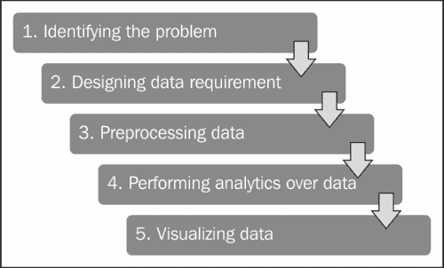

让我们对执行数据分析的这些阶段有所了解。

## 识别问题

如今，业务分析趋势通过在网络数据集上执行数据分析来改变，以发展业务。由于他们的数据的规模日益增加，他们的分析应用需要可扩展，以便从他们的数据集收集见解。

借助网络分析，我们可以解决业务分析问题。假设我们有一个大型电子商务网站，我们想知道如何增加业务。我们可以根据受欢迎程度将网站的重要页面分为高、中、低三类来识别。基于这些受欢迎的页面、它们的类型、它们的流量来源和它们的内容，我们将能够决定通过改善网络流量和内容来改善业务的路线图。

## 设计数据需求

为了针对特定问题执行数据分析，它需要来自相关领域的数据集。基于域和问题规范，可以根据问题定义决定数据源；可以定义这些数据集的数据属性。

例如，如果我们要执行社交媒体分析(问题规范)，我们使用的数据源是脸书或推特。为了识别用户特征，我们需要用户简档信息、喜好和帖子作为数据属性。

## 数据预处理

在数据分析中，我们不会一直使用相同的数据源、数据属性、数据工具和算法，因为它们都不会使用相同格式的数据。这将提高数据操作的性能，例如数据清理、数据聚合、数据扩充、数据排序和数据格式化，以支持的格式向所有数据工具以及将在数据分析中使用的算法提供数据。

简单来说，预处理就是在将数据提供给算法或工具之前，先进行数据操作，将数据翻译成固定的数据格式。然后，数据分析过程将以该格式化数据作为输入开始。

在大数据的情况下，数据集需要格式化并上传到 **Hadoop 分布式文件系统** ( **HDFS** )中，并由 Hadoop 集群中具有 Mappers 和 Reducers 的各个节点进一步使用。

## 对数据进行分析

在数据以数据分析算法所需的格式可用后，将执行数据分析操作。执行数据分析操作是为了从数据中发现有意义的信息，以便利用数据挖掘概念对业务做出更好的决策。它可以对商业智能使用描述性或预测性分析。

分析可以通过各种机器学习以及自定义算法概念来执行，例如回归、分类、聚类和基于模型的推荐。对于大数据，通过将其数据分析逻辑转换为将在 Hadoop 集群上运行的 MapReduce 作业，可以将相同的算法转换为在 Hadoop 集群上运行的 MapReduce 算法。这些模型需要通过机器学习概念的各种评估阶段来进一步评估和改进。改进或优化的算法可以提供更好的见解。

## 可视化数据

数据可视化用于显示数据分析的输出。可视化是一种表示数据见解的交互方式。这可以通过各种数据可视化软件以及 R 包来实现。r 有多种用于数据集可视化的包。它们如下:

*   `ggplot2`:这个是*哈德利·韦翰博士*([http://had.co.nz/](http://had.co.nz/))对《图形的语法》的实现。更多信息请参考[http://cran.r-project.org/web/packages/ggplot2/](http://cran.r-project.org/web/packages/ggplot2/)。
*   `rCharts`:这是一个 R 包，通过使用由*马库斯·格斯曼*和*迭戈·德·卡斯蒂略*设计的熟悉的点阵式绘图界面，从 R 中创建、定制和发布交互式 JavaScript 可视化效果。更多信息请参考[http://ramnathv.github.io/rCharts/](http://ramnathv.github.io/rCharts/)。

使用 R 可视化的一些流行示例如下:

*   **Plots for facet scales** (`ggplot`): The following figure shows the comparison of males and females with different measures; namely, education, income, life expectancy, and literacy, using `ggplot`:

    

*   **Dashboard charts**: This is an `rCharts` type. Using this we can build interactive animated dashboards with R.

    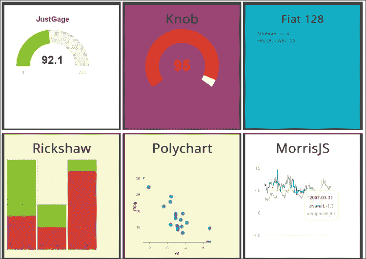

# 了解数据分析问题

在本节中，我们包括了三个实际的数据分析问题，这些问题与使用 R 和 Hadoop 技术的数据驱动活动的不同阶段有关。这些数据分析问题的定义旨在让读者了解如何利用函数的分析能力、R 包和 Hadoop 的计算能力来完成大数据分析。

数据分析问题定义如下:

*   探索网页分类
*   计算股票市场的变化频率
*   推土机蓝皮书销售价格预测(案例研究)

## 探索网页分类

该数据分析问题旨在识别网站网页的类别，根据页面的访问次数，可以将的受欢迎程度分类为高、中或低(常规)。在设计数据分析生命周期的数据需求阶段时，我们将看到如何从 **谷歌分析**收集这些类型的数据。

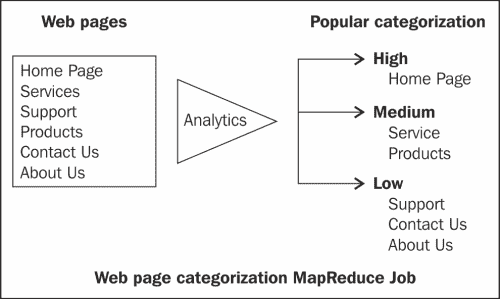

### 识别问题

由于这是一个网络分析问题，该问题的目标是确定为网站设计的网页的重要性。基于这些信息，可以改进或增加较低流行页面的内容、设计或访问量。

### 设计数据需求

在这个部分，我们将研究数据分析问题的数据需求和数据收集。首先，让我们看看如何针对这个问题实现对数据的需求。

由于这是一个网络分析问题，我们将使用谷歌分析数据源。要从谷歌分析中检索这些数据，我们需要一个现有的谷歌分析账户，上面存储着网络流量数据。为了增加知名度，我们将要求所有网页的访问信息。此外，在谷歌分析中，还有许多其他关于维度和指标的属性。

#### 了解所需的谷歌分析数据属性

要从谷歌分析中提取的数据集的标题格式如下:

```r
date, source, pageTitle, pagePath
```

*   `date`:这是网页被访问的日期
*   `source`:这是对网页的引用
*   `pageTitle`:这是网页的标题
*   `pagePath`:这是网页的 URL

##### 收集数据

当我们要从谷歌分析中提取数据时，我们需要使用`RGoogleAnalytics`，这是一个用于在 R 中提取谷歌分析数据集的 R 库。要提取数据，您需要在 R 中安装这个插件。然后您就可以使用它的功能。

以下是谷歌分析提取过程的代码:

```r
# Loading the RGoogleAnalytics library
require("RGoogleAnalyics")

# Step 1\. Authorize your account and paste the access_token
query <- QueryBuilder()
access_token <- query$authorize()

# Step 2\. Create a new Google Analytics API object
ga <- RGoogleAnalytics()

# To retrieve profiles from Google Analytics
ga.profiles <- ga$GetProfileData(access_token)

# List the GA profiles 
ga.profiles

# Step 3\. Setting up the input parameters
profile <- ga.profiles$id[3] 
startdate <- "2010-01-08"
enddate <- "2013-08-23"
dimension <- "ga:date,ga:source,ga:pageTitle,ga:pagePath"
metric <- "ga:visits"
sort <- "ga:visits"
maxresults <- 100099

# Step 4\. Build the query string, use the profile by setting its index value
query$Init(start.date = startdate,
           end.date = enddate,
           dimensions = dimension,
           metrics = metric,

           max.results = maxresults,
           table.id = paste("ga:",profile,sep="",collapse=","),
           access_token=access_token)

# Step 5\. Make a request to get the data from the API
ga.data <- ga$GetReportData(query)

# Look at the returned data
head(ga.data)
write.csv(ga.data,"webpages.csv", row.names=FALSE)
```

之前的文件将随章节内容一起提供下载。

### 数据预处理

现在，我们在一个 CSV 文件中提供了谷歌分析的原始数据。在提供给 MapReduce 算法之前，我们需要处理这个数据。

需要对数据集进行两项主要更改:

*   查询参数需要从`pagePath`栏中删除，如下所示:

    ```r
    pagePath <- as.character(data$pagePath)
    pagePath <- strsplit(pagePath,"\\?")
    pagePath <- do.call("rbind", pagePath)
    pagePath <- pagePath [,1]
    ```

*   新的 CSV 文件需要创建如下:

    ```r
    data  <- data.frame(source=data$source, pagePath=d,visits =)
    write.csv(data, "webpages_mapreduce.csv" , row.names=FALSE)
    ```

### 对数据进行分析

为了对网站页面进行分类，我们将构建并运行集成了 R 和 Hadoop 的 MapReduce 算法。正如在[第 2 章](2.html "Chapter 2. Writing Hadoop MapReduce Programs")、*编写 Hadoop MapReduce 程序*中已经讨论过的，有时我们需要使用多个 Mappers 和 Reduce 来执行数据分析；这意味着使用链式 MapReduce 作业。

在链接映射缩减作业的情况下，多个映射器和缩减器可以通过这样一种方式进行通信，即第一个作业的输出将作为输入分配给第二个作业。下图描述了 MapReduce 的执行顺序:

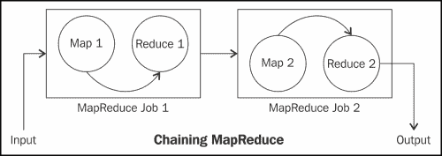

链接 MapReduce

现在，让我们从执行分析的编程任务开始:

1.  通过设置 Hadoop 变量并加载 RHadoop 库的`rmr2`和`rhdfs`包来初始化:

    ```r
    # setting up the Hadoop variables need by RHadoop
    Sys.setenv(HADOOP_HOME="/usr/local/hadoop/")
    Sys.setenv(HADOOP_CMD="/usr/local/hadoop/bin/hadoop")

    # Loading the RHadoop libraries rmr2 and rhdfs
    library(rmr2)
    library(rhdfs)

    # To initializing hdfs
    hdfs.init()
    ```

2.  将数据集上传至 HDFS:

    ```r
    # First uploading the data to R console,
    webpages <- read.csv("/home/vigs/Downloads/webpages_mapreduce.csv")

    # saving R file object to HDFS,
    webpages.hdfs <- to.dfs(webpages) 
    ```

现在我们将看到这些分析的 Hadoop MapReduce 作业 1 的开发。我们将把这项工作分为映射器和缩减器。因为有两个映射减少作业，所以将有两个映射器和减少器。还要注意，在这里，我们只需要为所有映射器和缩减器的两个作业创建一个文件。映射器和缩减器将通过定义它们各自的功能来建立。

让我们看看 MapReduce 作业 1。

*   **映射器 1** :代码如下:

    ```r
    mapper1 <- function(k,v) {

     # To storing pagePath column data in to key object
     key <- v[2]

     # To store visits column data into val object
     Val <- v[3]

     # emitting key and value for each row
     keyval(key, val)
    }
    totalvisits <- sum(webpages$visits)
    ```

*   **减速器 1** :代码如下:

    ```r
    reducer1 <- function(k,v) {

      # Calculating percentage visits for the specific URL
      per <- (sum(v)/totalvisits)*100
      # Identify the category of URL
      if (per <33 )
     {
    val <- "low"
    }
     if (per >33 && per < 67)
     {
     val <- "medium"
     }
     if (per > 67)
     {
     val <- "high"
     }

     # emitting key and values
     keyval(k, val)
    }
    ```

*   **Output of MapReduce job 1**: The intermediate output for the information is shown in the following screenshot:

    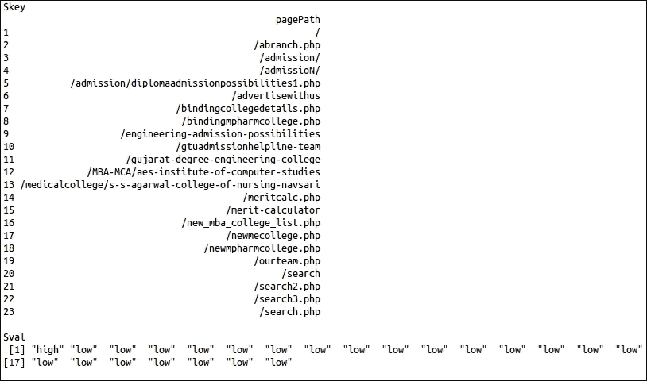

上一个截图中的输出仅用于获取关于这个 MapReduce 作业 1 的输出的信息。这可以被认为是中间输出，其中从整个数据集中仅考虑了 100 个数据行来提供输出。在这些行中，有 23 个 URL 是唯一的；所以输出提供了 23 个网址。

让我们看看 Hadoop MapReduce 作业 2:

*   **映射器 2** :代码如下:

    ```r
    #Mapper:
    mapper2 <- function(k, v) {

    # Reversing key and values and emitting them 
     keyval(v,k)
    }
    ```

*   **Reducer 2**: The code for this is as follows:

    ```r
    key <- NA
    val <- NULL
    # Reducer:
    reducer2  <-  function(k, v) {

    # for checking whether key-values are already assigned or not.
     if(is.na(key)) {
     key <- k
     val <- v
      } else {
       if(key==k) {
     val <- c(val,v)
      } else{
       key <- k
       val <- v
      }
     }
    # emitting key and list of values 
    keyval(key,list(val))
    }
    ```

    ### 类型

    在执行 MapReduce 作业之前，请启动所有 Hadoop 守护程序，并通过`hdfs.init()`方法检查 HDFS 连接。如果您的 Hadoop 守护程序尚未启动，您可以通过`$hduser@ubuntu :~ $HADOOP_HOME/bin/start-all.sh`启动它们。

一旦我们准备好映射器和缩减器的逻辑，MapReduce 作业就可以通过`rmr2`包的 MapReduce 方法来执行。这里我们已经开发了多个 MapReduce 作业，因此我们需要使用所需的参数调用`mapreduce`函数中的`mapreduce`函数。

下图显示了调用链式 MapReduce 作业的命令:

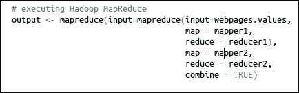

以下是从 HDFS 检索生成的输出的命令:

```r
from.dfs(output)

```

执行 Hadoop MapReduce 时，会通过终端打印执行日志输出，以达到监控的目的。我们将通过将 MapReduce 作业 1 和 MapReduce 作业 2 分成不同的部分来理解它们。

MapReduce 作业 1 的详细信息如下:

*   **Tracking the MapReduce job metadata**: With this initial portion of log, we can identify the metadata for the Hadoop MapReduce job. We can also track the job status with the web browser by calling the given `Tracking URL`.

    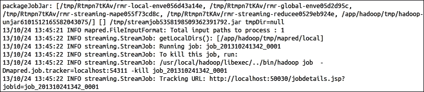

*   **Tracking status of Mapper and Reducer tasks**: With this portion of log, we can monitor the status of the Mapper or Reducer task being run on Hadoop cluster to get details such as whether it was a success or a failure.

    

*   **Tracking HDFS output location**: Once the MapReduce job is completed, its output location will be displayed at the end of logs.

    

对于 MapReduce 作业 2。

*   **Tracking the MapReduce job metadata**: With this initial portion of log, we can identify the metadata for the Hadoop MapReduce job. We can also track the job status with the web browser by calling the given `Tracking URL`.

    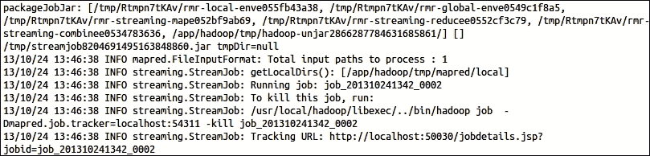

*   **Tracking status of the Mapper and Reducer tasks**: With this portion of log, we can monitor the status of the Mapper or Reducer tasks being run on the Hadoop cluster to get the details such as whether it was successful or failed.

    

*   **Tracking HDFS output location**: Once the MapReduce job is completed, its output location will be displayed at the end of the logs.

    

这个链式 MapReduce 作业的输出存储在 HDFS 的一个位置，可以通过以下命令检索:

```r
from.dfs(output)

```

下图显示了对前面命令的响应(仅输出数据集的前 1000 行):


### 可视化数据

我们使用这三个类别收集了网页分类输出。我认为我们能做的最好的事情就是简单地列出网址。但是如果我们有更多的信息，比如来源，我们可以将网页表示为一个图的节点，当用户跟随链接时，通过有向边的流行度来着色。这可以带来更丰富的见解。

## 计算股市变化的频率

这个数据分析 MapReduce 问题是为了计算股市变化的频率而设计的。

### 识别问题

由于这是一个典型的股票市场数据分析问题，它将计算股票市场的一个特定符号过去变化的频率，例如**傅立叶变换** 。基于这些信息，投资者可以获得更多关于不同时期变化的见解。所以这个分析的目标是计算百分比变化的频率。


### 设计数据需求

对于这个股市分析，我们将使用雅虎！财务作为输入数据集。我们需要检索特定符号的股票信息。为了检索这些数据，我们将使用雅虎！具有以下参数的应用编程接口:

*   从月份开始
*   从那天开始
*   从年
*   到月
*   今天
*   到年
*   标志

### 类型

更多关于这个 API 的信息，请访问[http://developer.yahoo.com/finance/](http://developer.yahoo.com/finance/)。

### 数据预处理

为了对提取的数据集执行分析，我们将使用 R 来触发以下命令:

```r
stock_BP <- read.csv("http://ichart.finance.yahoo.com/table.csv?s=BP")

```

或者您也可以通过终端下载:

```r
wget http://ichart.finance.yahoo.com/table.csv?s=BP
#exporting to csv file

write.csv(stock_BP,"table.csv", row.names=FALSE)

```

然后通过为此创建一个特定的 Hadoop 目录将其上传到 HDFS:

```r
# creating /stock directory in hdfs
bin/hadoop dfs -mkdir /stock

# uploading table.csv to hdfs in /stock directory
bin/hadoop dfs -put /home/Vignesh/downloads/table.csv /stock/ 

```

### 对数据进行分析

为了执行数据分析操作，我们将使用带有 R 和 Hadoop 的流(没有`HadoopStreaming`包)。因此，这个 MapReduce 作业的开发可以在没有任何 RHadoop 集成库/包的情况下完成。

在这个 MapReduce 作业中，我们在不同的 R 文件中定义了 Map 和 Reduce，以提供给 Hadoop 流功能。

*   **文件夹** ： `stock_mapper.R`

    ```r
    #! /usr/bin/env/Rscript
    # To disable the warnings
    options(warn=-1)
    # To take input the data from streaming
    input <- file("stdin", "r")

    # To reading the each lines of documents till the end
    while(length(currentLine <-readLines(input, n=1, warn=FALSE)) > 0)
    {

    # To split the line by "," seperator
    fields <- unlist(strsplit(currentLine, ","))

    # Capturing open column value
     open <- as.double(fields[2])

    # Capturing close columns value
     close <- as.double(fields[5])

    # Calculating the difference of close and open attribute
     change <- (close-open)

    # emitting change as key and value as 1
    write(paste(change, 1, sep="\t"), stdout())
    }

    close(input)

    ```

*   **减速器** : `stock_reducer.R`

    ```r
    #! /usr/bin/env Rscript
    stock.key <- NA
    stock.val <- 0.0

    conn <- file("stdin", open="r")
    while (length(next.line <- readLines(conn, n=1)) > 0) {
     split.line <- strsplit(next.line, "\t")
     key <- split.line[[1]][1]
     val <- as.numeric(split.line[[1]][2])
     if (is.na(current.key)) {
     current.key <- key
     current.val <- val
     }
     else {
     if (current.key == key) {
    current.val <- current.val + val
    }
    else {
    write(paste(current.key, current.val, sep="\t"), stdout())
    current.key <- key
    current.val<- val
    }
    }
    }
    write(paste(current.key, current.val, sep="\t"), stdout())
    close(conn)

    ```

从下面的代码中，我们在没有安装或使用任何 R 库/包的情况下在 R 中运行 MapReduce。R 中有一个`system()`方法可以将 R 控制台中的系统命令激发到中，帮助我们指导 R 中 Hadoop 作业的激发。它还将提供命令进入 R 控制台的休息。

```r
# For locating at Hadoop Directory
system("cd $HADOOP_HOME")

# For listing all HDFS first level directorysystem("bin/hadoop dfs -ls /")

# For running Hadoop MapReduce with streaming parameters
system(paste("bin/hadoop jar 
/usr/local/hadoop/contrib/streaming/hadoop-streaming-1.0.3.jar ",

" -input /stock/table.csv",
" -output /stock/outputs",
" -file /usr/local/hadoop/stock/stock_mapper.R",
" -mapper /usr/local/hadoop/stock/stock_mapper.R",
" -file /usr/local/hadoop/stock/stock_reducer.R",
" -reducer /usr/local/hadoop/stock/stock_reducer.R"))

# For storing the output of list command 
dir <- system("bin/hadoop dfs -ls /stock/outputs", intern=TRUE)
dir

# For storing the output from part-oooo (output file)
out <- system("bin/hadoop dfs -cat /stock/outputs/part-00000", intern=TRUE)

# displaying Hadoop MapReduce output data out

```

您也可以通过终端运行相同的程序:

```r
bin/hadoop jar /usr/local/hadoop/contrib/streaming/hadoop-streaming-1.0.3.jar \

 -input /stock/table.csv \
 -output /stock/outputs\
 -file /usr/local/hadoop/stock/stock_mapper.R \
 -mapper /usr/local/hadoop/stock/stock_mapper.R \
 -file /usr/local/hadoop/stock/stock_reducer.R \
 -reducer /usr/local/hadoop/stock/stock_reducer.R 

```

运行该程序时，您的 R 控制台或终端的输出将如下面的截图所示，在此帮助下，我们可以监控 Hadoop MapReduce 作业的状态。在这里，我们将依次看到它们的分割部分。请注意我们已经将输出的日志分成几部分，以帮助您更好地理解它们。

MapReduce 日志输出包含(从终端运行时):

*   With this initial portion of log, we can identify the metadata for the Hadoop MapReduce job. We can also track the job status with the web browser, by calling the given `Tracking URL`. This is how the MapReduce job metadata is tracked.

    

*   With this portion of log, we can monitor the status of the Mapper or Reducer tasks being run on the Hadoop cluster to get the details like whether it was successful or failed. This is how we track the status of the Mapper and Reducer tasks.

    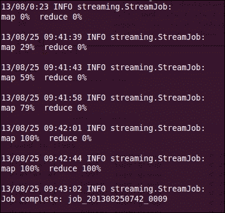

*   Once the MapReduce job is completed, its output location will be displayed at the end of the logs. This is known as tracking the HDFS output location.

    

*   从终端，可以使用以下命令调用 Hadoop MapReduce 程序的输出:

    ```r
    bin/hadoop dfs -cat /stock/outputs/part-00000

    ```

*   您的 MapReduce 程序输出的标题如下所示:

    ```r
    change    frequency

    ```

*   The following figure shows the sample output of MapReduce problem:

    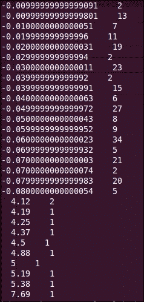

### 可视化数据

如果我们用 r 中的各种图形可视化我们的输出，我们可以得到更多的见解。在这里，我们试图借助`ggplot2`包可视化输出。

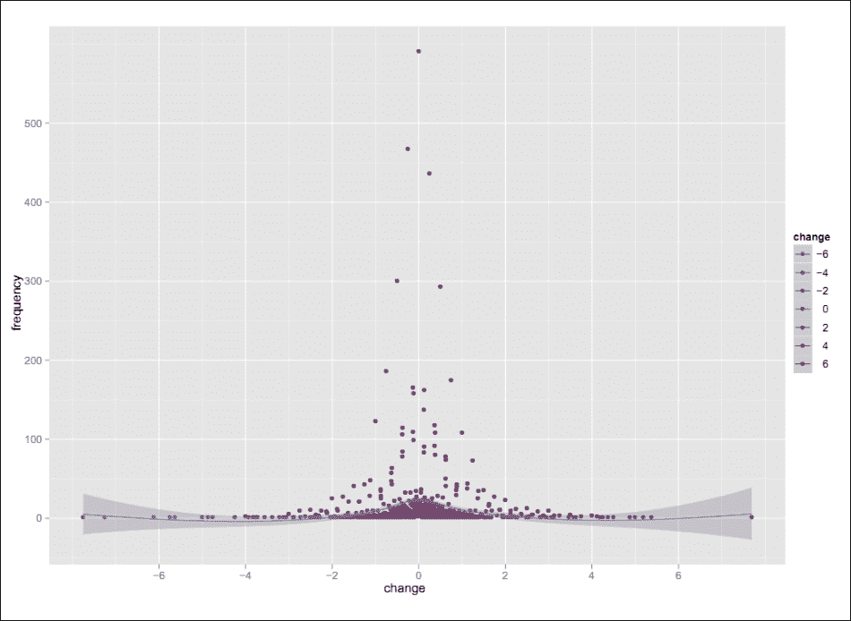

从前面的图中，我们可以很快识别出，大部分时间股价都是从 0 到 1.5 左右变化的。所以，历史上股票的价格走势在投资的时候会有帮助。

生成该图所需的代码如下:

```r
# Loading ggplot2 library
library(ggplot2);

# we have stored above terminal output to stock_output.txt file

#loading it to R workspace
myStockData <- read.delim("stock_output.txt", header=F, sep="", dec=".");

# plotting the data with ggplot2 geom_smooth function
ggplot(myStockData, aes(x=V1, y=V2)) + geom_smooth() + geom_point();
```

在下一部分中，我们已经包括了关于如何使用 R 和 Hadoop 为 **Kaggle** data 竞赛执行大数据分析的案例研究。

## 推土机蓝皮书销售价格预测——案例分析

这是一个预测重型设备拍卖价格的案例研究，为推土机创造蓝皮书。

### 识别问题

在这个的例子中，我包含了 Cloudera 数据科学家关于如何对大数据集进行重采样的案例研究，并应用了带有 R 和 Hadoop 的随机森林模型。在这里，我考虑了 Kaggle 推土机蓝皮书，以了解大数据问题定义的类型。在这里，本次竞赛的目标是根据使用情况、设备类型和配置，预测特定重型设备在使用拍卖中的销售价格。这个解决方案是由*尤里·拉尔森*(Cloudera 的数据科学家)提供的。所提供的数据包含关于拍卖结果公布、使用和设备配置的信息。

对大数据集建模并将其划分为更小的数据集是一个技巧。在该数据集上拟合模型是一种传统的机器学习技术，例如随机森林或打包。随机森林可能有两个原因:

*   大型数据集通常位于一个集群中，因此任何操作都有一定程度的并行性。独立的模型适合包含不同初始数据子集的独立节点。
*   即使您可以使用整个初始数据集来拟合单个模型，事实证明，通过使用数据子集来拟合多个较小模型的集成方法通常优于单个模型。事实上，用 1 亿个数据点拟合单个模型的性能可能比仅用 10M 个数据点拟合几个模型的性能差(因此较小的总数据优于较大的总数据)。

通过替换进行采样是从初始数据集进行采样的最流行方法，用于产生模型拟合的样本集合。这种方法相当于从多项式分布中进行采样，其中选择任何单个输入数据点的概率在整个数据集中是一致的。

### 类型

Kaggle 是一个大数据平台，来自世界各地的数据科学家竞相解决由数据驱动型组织托管的大数据分析问题。

### 设计数据需求

对于这场比赛，Kaggle 提供了真实世界的数据集，包括大约 400，000 个训练数据点。每个数据点代表销售的各种属性、推土机的配置和销售价格。为了找到预测销售价格的地方，需要实现随机森林回归模型。

### 注

本次卡格尔比赛的参考链接是[http://www.kaggle.com/c/bluebook-for-bulldozers](http://www.kaggle.com/c/bluebook-for-bulldozers)。您可以查看数据、信息、论坛和排行榜，还可以探索其他一些大数据分析竞赛，并参加这些竞赛来评估您的数据分析技能。

我们选择这个模型是因为我们对从大数据集的随机集合中预测数值形式的销售价格感兴趣。

数据集以下列数据文件的形式提供:

<colgroup><col style="text-align: left"> <col style="text-align: left"></colgroup> 
| 

文件名

 | 

描述格式(大小)

 |
| --- | --- |
| `Train` | 这是一个包含 2011 年数据的训练集。 |
| `Valid` | 这是一个验证集，包含 2012 年 1 月 1 日至 2012 年 4 月 30 日的数据。 |
| `Data dictionary` | 这是训练数据集变量的元数据。 |
| `Machine_Appendix` | 这包含给定机器的正确制造年份，以及制造商、型号和产品类别的详细信息。 |
| `Test` | 这将测试数据集。 |
| `random_forest_benchmark_test` | 这是主机提供的基准解决方案。 |

### 类型

如果你想学习和练习大数据分析，你可以通过参加卡格尔数据竞赛从卡格尔数据源获取大数据集。这些包含来自全球各行业的各个领域的数据集。

### 数据预处理

要对所提供的卡格尔数据集进行分析，我们需要建立一个预测模型。为了预测拍卖的销售价格，我们将在提供的数据集上拟合模型。但是数据集提供了不止一个文件。因此，我们将合并它们，并执行数据扩充，以获取更有意义的数据。我们将从`Train.csv`和`Machine_Appendix.csv`建立一个模型，以便更好地预测销售价格。

以下是需要对数据集执行的数据预处理任务:

```r
# Loading Train.csv dataset which includes the Sales as well as machine identifier data attributes.

transactions <- read.table(file="~/Downloads/Train.csv",
header=TRUE,
sep=",",
quote="\"",
row.names=1,
fill=TRUE,
colClasses=c(MachineID="factor",
 ModelID="factor",
datasource="factor",
YearMade="character",
SalesID="character",
auctioneerID="factor",
UsageBand="factor",
saledate="custom.date.2",
Tire_Size="tire.size",
Undercarriage_Pad_Width="undercarriage",
Stick_Length="stick.length"),
na.strings=na.values)

# Loading Machine_Appendix.csv for machine configuration information

machines <- read.table(file="~/Downloads/Machine_Appendix.csv",
header=TRUE,
sep=",",
quote="\"",
fill=TRUE,
colClasses=c(MachineID="character",
ModelID="factor",
fiManufacturerID="factor"),
na.strings=na.values)

# Updating the values to numeric 
# updating sale data number
transactions$saledatenumeric <- as.numeric(transactions$saledate)
transactions$ageAtSale <- as.numeric(transactions$saledate - as.Date(transactions$YearMade, format="%Y"))

transactions$saleYear <- as.numeric(format(transactions$saledate, "%Y"))

# updating the month of sale from transaction
transactions$saleMonth <- as.factor(format(transactions$saledate, "%B"))

# updating the date of sale from transaction
transactions$saleDay <- as.factor(format(transactions$saledate, "%d"))

# updating the day of week of sale from transaction
transactions$saleWeekday <- as.factor(format(transactions$saledate, "%A"))

# updating the year of sale from transaction
transactions$YearMade <- as.integer(transactions$YearMade)

# deriving the model price from transaction
transactions$MedianModelPrice <- unsplit(lapply(split(transactions$SalePrice, 
transactions$ModelID), median), transactions$ModelID)

# deriving the model count from transaction
transactions$ModelCount <- unsplit(lapply(split(transactions$SalePrice, transactions$ModelID), length), transactions$ModelID)

# Merging the transaction and machine data in to dataframe 
training.data <- merge(x=transactions, y=machines, by="MachineID")

# write denormalized data out
write.table(x=training.data,
file="~/temp/training.csv",
sep=",",
quote=TRUE,
row.names=FALSE,
eol="\n",
col.names=FALSE)
# Create poisson directory at HDFS
bin/hadoop dfs -mkdir /poisson

# Uploading file training.csv at HDFS
bin/hadoop dfs -put ~/temp/training.csv /poisson/
```

### 对数据进行分析

当我们要对采样数据集进行分析时，我们需要了解需要采样多少数据集。

对于随机抽样，我们考虑了三个模型参数，如下所示:

*   我们的初始训练集中有 N 个数据点。这是非常大的(106-109)，并且分布在 HDFS 集群上。
*   我们将为集成分类器训练一组 M 个不同的模型。
*   M 个模型中的每一个都将拟合 K 个数据点，其中通常 K << N(例如，K 可以是 n 的 1-10%)。

我们有 N 个训练数据集，这些数据集是固定的，通常不在我们的控制范围内。由于我们将通过**泊松**采样来处理这个问题，我们需要定义要在随机森林模型中消耗的输入向量的总数。

有三种情况需要考虑:

*   **KM < N** :在这种情况下，我们没有使用我们可以获得的全部数据
*   **KM = N** :在这种情况下，我们可以精确地划分我们的数据集，以产生完全独立的样本
*   **KM > N** :在这种情况下，我们必须用替换数据对我们的一些数据进行重新采样

下一节中描述的泊松采样方法在同一个框架中处理所有三种情况。但是，请注意，对于 KM = N 的情况，它不会对数据进行分区，而只是对其进行重新采样。

### 理解泊松近似重采样

广义线性模型是一般线性模型的扩展。泊松回归是广义模型的一种情况。因变量服从泊松分布。

泊松采样将在 MapReduce 任务的地图上运行，因为它是针对输入数据点进行的。这并不能保证每个数据点都会被考虑到模型中，这比全数据集的多项式重采样要好。但是它将保证通过使用 N 个训练输入点来生成独立的样本。

这里，下图显示了在泊松采样中可以检索到的缺失数据集的数量，其函数为 KM/N:


灰色的线表示 KM=N 的值，现在我们来看看 MapReduce 算法的伪代码。我们使用了三个参数:N、M 和 K，其中 K 是固定的。我们使用 T=K/N 来预先消除对 N 值的需要。

*   **采样参数示例**:这里我们用一个伪代码实现前面的逻辑。我们将从定义两个模型输入参数`frac.per.model`和`num.models`开始，其中`frac.per.model`用于定义可以使用的完整数据集的分数，`num.models`用于定义将从数据集拟合多少个模型。

    ```r
    T = 0.1  # param 1: K / N-average fraction of input data in each model 10%

    M = 50   # param 2: number of models
    ```

*   **映射器的逻辑**:映射器将被设计用于通过数据角力生成整个数据集的样本。

    ```r
    def map(k, v):
    // for each input data point
        for i in 1:M  
        // for each model
            m = Poisson(T)  
        // num times curr point should appear in this sample
            if m > 0
                for j in 1:m
       // emit current input point proper num of times
                    emit (i, v)
    ```

*   **减速器的逻辑**:减速器会取一个数据样本作为输入，在上面拟合随机森林模型。

    ```r
    def reduce(k, v):
        fit model or calculate statistic with the sample in v
    ```

#### 用 RHadoop 拟合随机森林

在机器学习中，拟合一个模型意味着将最佳线拟合到我们的数据中。拟合模型可以分为几种类型，即欠拟合、过拟合和正拟合。在欠拟合和过拟合的情况下，存在高偏差(交叉验证和训练误差高)和高方差(交叉验证误差高但训练误差低)影响的机会，这是不好的。我们通常会在数据集上拟合模型。

以下是通过三种拟合类型在数据集上拟合模型的图表:

*   **Under fitting**: In this cross validation and training errors are high

    

*   **Normal fitting**: In this cross-validation and training errors are normal

    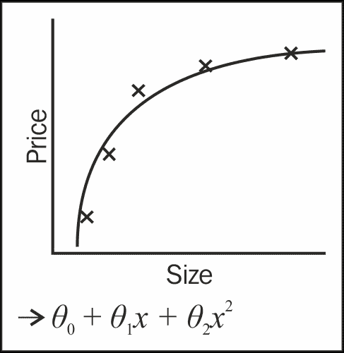

*   **Over fitting**: In this the cross-validation error is high but training error is low

    

我们将使用机器学习的随机森林技术对数据拟合模型。这是一种递归分区方法，特别适合小型和大型问题。它涉及分类(或回归)树的集合(或集合)，这些树是在数据的随机子集上计算的，对每个分类树中的每个分割使用随机限制和选择的预测器的子集。

此外，分类/回归树的集合的结果已经被用来产生更好的预测，而不是仅仅使用一个分类树的结果。

我们现在将使用 RHadoop 实现泊松采样策略。我们将从设置参数的全局值开始:

```r
#10% of input data to each sample on avg
frac.per.model <- 0.1  
num.models <- 50
```

让我们看看如何使用 RHadoop 按照伪代码中的规范实现映射器。

*   Mapper is implemented in the the following manner:

    ```r
    poisson.subsample <- function(k, input) {
      # this function is used to generate a sample from the current block of data
      generate.sample <- function(i) {
        # generate N Poisson variables
        draws <- rpois(n=nrow(input), lambda=frac.per.model)
        # compute the index vector for the corresponding rows,
        # weighted by the number of Poisson draws
        indices <- rep((1:nrow(input)), draws)
        # emit the rows; RHadoop takes care of replicating the key appropriately
        # and rbinding the data frames from different mappers together for the
        # reducer
        keyval(i, input[indices, ])
      }

      # here is where we generate the actual sampled data
      c.keyval(lapply(1:num.models, generate.sample))
    }
    ```

    因为我们使用的是 R，所以在收集的样本数据集上用随机森林模型拟合模型是很棘手的。

*   减速器通过以下方式实现:

    ```r
    # REDUCE function
    fit.trees <- function(k, v) {
      # rmr rbinds the emitted values, so v is a dataframe
      # note that do.trace=T is used to produce output to stderr to keep the reduce task from timing out
      rf <- randomForest(formula=model.formula,
                            data=v,
                            na.action=na.roughfix,
                            ntree=10,
                            do.trace=FALSE)

     # rf is a list so wrap it in another list to ensure that only
     # one object gets emitted. this is because keyval is vectorized
      keyval(k, list(forest=rf))
    }
    ```

*   To fit the model, we need `model.formula`, which is as follows:

    ```r
    model.formula <- SalePrice ~ datasource + auctioneerID + YearMade + saledatenumeric + ProductSize + ProductGroupDesc.x + Enclosure + Hydraulics + ageAtSale + saleYear + saleMonth + saleDay + saleWeekday + MedianModelPrice + ModelCount + MfgYear

    ```

    `SalePrice`定义为响应变量，其余定义为随机森林模型的预测变量。

    ### 类型

    R 的随机森林模型不支持等级大于 32 的因子。

*   The MapReduce job can be executed using the following command:

    ```r
    mapreduce(input="/poisson/training.csv",
     input.format=bulldozer.input.format,
     map=poisson.subsample,
     reduce=fit.trees,
     output="/poisson/output")

    ```

    由此产生的树木在`/poisson/output`被倾倒在 HDFS。

*   最后，我们可以加载树，合并它们，并使用它们来分类新的测试点:

    ```r
    mraw.forests <- values(from.dfs("/poisson/output"))
    forest <- do.call(combine, raw.forests)

    ```

50 个样本中的每一个都生成了一个包含 10 棵树的随机森林，因此最终的随机森林是 500 棵树的集合，以分布式方式分布在一个 Hadoop 集群上。

### 注

完整的源文件可在官方 Cloudera 博客[上获得，网址为 http://blog . Cloudera . com/blog/2013/02/如何与 hadoop 上的 r 并行从大数据集重新采样/](http://blog.cloudera.com/blog/2013/02/how-to-resample-from-a-large-data-set-in-parallel-with-r-on-hadoop/) 。

希望我们已经学习了一种可扩展的方法，通过对多项式采样使用泊松近似来训练集成分类器或以并行方式自举。

# 总结

在本章中，我们学习了如何在一个 R 和 Hadoop 集成的环境中，通过各种数据驱动的活动来执行大数据分析。

在下一章中，我们将进一步了解如何使用 R 和 Hadoop 来执行机器学习技术。