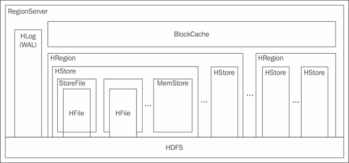

# 五、存储组件——HBase

Hadoop 生态系统中最重要的组件之一是 HBase，它非常高效地利用 HDFS，能够以更好的性能规模存储、管理和处理数据。NoSQL 正在崛起，人们非常关注大数据问题解决领域的不同实施和解决方案。HBase 是一个 NoSQL 数据库，可以处理 HDFS 以上的数据，以获得非常好的性能，同时具有优化、可扩展性和可管理性。在 Hadoop 中，HDFS 非常适合作为 WORM(一次写入多次读取)范例的存储，在这种范例中，数据不会更新。在许多情况下，需求可能是更新、特别分析或随机读取。在 HDFS，处理这些需求的效率不是很高，因为更新文件中的记录是不可能的；HDFS 必须删除和重写整个文件，这是资源、内存和输入/输出密集型的。但是，在海量随机读写中，HBase 可以以接近最佳的性能高效地管理此类处理。

在这一章中，我们将介绍 HBase 的需求和必要性及其功能、体系结构和设计。我们还将深入研究数据模型和模式设计、HBase 的组件、读写管道以及一些示例。

# 糖化血红蛋白酶概述

HBase 是基于谷歌白皮书*大表:结构化数据的分布式存储系统*设计的，定义为稀疏、分布式、持久的多维排序图。HBase 是一个面向列和分区的数据库，但存储在数据的键值对中。我知道这很令人困惑和棘手，所以让我们再详细看看这些术语。

*   **稀疏** : HBase 呈柱状，分区定向。通常，一条记录可能有许多列，其中许多列可能有空数据，或者这些值可能重复。HBase 可以高效、有效地节省稀疏数据中的空间。
*   **分布式**:数据存储在多个节点中，分散在集群中。
*   **持久**:数据写入并保存在集群中。
*   **多维**:一行可以有多个版本或者时间戳的值。
*   **映射**:键值对链接数据结构存储数据。
*   **已排序**:结构中的键以已排序的顺序存储，以实现更快的读写优化。

HBase 数据模型，正如我们将看到的，非常灵活，可以针对许多大数据用例进行调整。与每种技术一样，HBase 在某些用例中表现非常好，但在其他用例中可能不被建议。以下是糖化血红蛋白酶表现良好的情况:

*   需要大规模实时随机读/写
*   变量模式:可以在运行时添加或删除列
*   数据集的许多列是稀疏的
*   需要基于密钥的检索和自动分片
*   对一致性的需求大于可用性
*   为了获得更好的性能，必须对数据或表进行反规范化

# 糖化血红蛋白酶的优势

HBase 有很多好处，在很多用例中都是很好的解决方案。让我们来看看糖化血红蛋白的一些优点:

*   高容量请求中随机且一致的读/写访问
*   自动故障转移和可靠性
*   灵活的基于列的多维地图结构
*   变量模式:可以动态添加和删除列
*   与 Java 客户端、节俭和休息应用编程接口的集成
*   地图缩减和 Hive/PIG 集成
*   自动分区和分片
*   低延迟数据访问
*   用于查询优化的块缓存和布隆过滤器
*   HBase 允许数据压缩，非常适合稀疏数据

# 糖化血红蛋白酶的结构

HBase 通过设计是面向列的，其中 HBase 表存储在 ColumnFamilies 中，每个 ColumnFamily 可以有多个列。列族的数据存储在多个区域的多个文件中，其中一个区域保存特定范围的行键的数据。要管理区域，主服务器将多个区域分配给一个区域服务器。HBase 设计的灵活性源于灵活的区域服务器和区域，由单个主服务器控制。HBase Architecture 使用 Zookeeper 来管理分布式环境中高可用性所需的协调和资源管理方面。HBase 中的数据管理通过在区域中执行的拆分和压缩过程来高效地执行，以优化大容量读写的数据。为了处理大量的写请求，我们在区域服务器中有两级缓存 WAL，在区域服务器中有内存存储。如果区域中存在的特定范围或行关键字的数据增长超过阈值，则分割区域以利用群集。使用压缩过程合并和压缩数据。使用 WAL 管理数据恢复，因为它保存所有非持久编辑数据。

HBase 体系结构强调可扩展的并发读取和一致写入。设计 HBase 的关键在于提供高性能、可扩展的读取和一致的多次写入。HBase 使用以下组件，我们将在后面讨论:

*   主服务器
*   区域服务器
*   地区
*   动物园管理员

让我们看看下图:


## 主服务器

MasterServer 是管理员，在某个时间点，HBase 中只能有一个 Master。它负责以下工作:

*   集群监控和管理
*   将区域分配给区域服务器
*   通过重新分配区域实现故障转移和负载平衡

## 区域服务器

区域服务器由主服务器识别，主服务器将区域分配给区域服务器。区域服务器在数据节点上运行，并执行以下活动:

*   与主管协调管理区域
*   区域中的数据拆分
*   协调和服务读/写

除了管理区域之外，区域服务器还具有以下组件或数据结构:



### 墙面

用于写操作的数据首先保存在 WAL 中，然后放入 MemStore 中。MemStore 不保存数据，所以如果一个区域变得不可用，数据可能会丢失。在任何崩溃的情况下，或者在没有响应的区域恢复内存存储中的数据，WAL 是极其重要的。WAL 保存区域服务器管理的区域的内存存储中的所有数据。当数据从 MemStore 中刷新并保存为 HFile 时，数据也会从 WAL 中删除。只有在数据成功写入 WAL 后，才会向客户端发出成功写入的确认。

### 块缓存

从 HDFS 读取数据块时，HBase 会将数据块缓存在每个区域的数据块缓存服务器中，以备将来对该数据块的请求，从而优化了 HBase 中的随机读取。块缓存作为内存中的分布式缓存工作。它是一个接口，它的默认实现是 LruBlockCache，它基于最近使用的算法缓存。在较新版本的 HBase 中，我们可以使用 SlabCache 和 BucketCache 实现。我们将在接下来的章节中讨论这三个实现。

#### LRUBlockCache

数据块缓存在一个 JVM 堆中，根据访问请求，JVM 堆有三个区域，即单个、多个和内存中。如果块可以第一次被访问，那么它被保存在单个访问空间中。如果数据块被多次访问，那么它将被提升为多次访问。内存区域是为从内存标记列族加载的块保留的。使用最近最少使用的技术移除不频繁访问的块。

#### SlabCache

这个缓存是由 L1(JVM 堆)和 L2 缓存(JVM 堆外)组合而成的。使用 DirectByteBuffers 分配 L2 内存。可以根据需要将块大小配置为更大的大小。

#### 七叶树

它使用桶区域来保存缓存的块。该缓存是 SlabCache 的扩展，除了 L1 和 L2 缓存之外，还有一个文件模式的缓存级别。文件模式旨在低延迟存储在内存文件系统或固态硬盘存储中。

### 注

如果系统必须以低延迟执行，以便我们可以利用外部 JVM 堆内存，并且当 RegionServer 的 RAM 内存可能耗尽时，SlabCache 或 BucketCache 是不错的选择。

### 地区

HBase 通过区域管理可用性和数据分发。区域是 HBase 执行高速读写的关键。区域还管理行键排序。它在表的每个列族中都有单独的存储，每个存储都有两个组件 MemStore 和多个 StoreFiles。糖化血红蛋白使用区域实现自动分割。如果启用了自动拆分，当数据增长超过存储的配置最大大小时，存储在区域中的文件将被拆分为两个相等的区域。在区域中，拆分过程维护数据分布，压缩过程优化存储文件。

一个区域可以有多个存储文件或数据块，这些文件或数据块以 HFile 格式保存用于存储的数据。存储文件将保存数据库中列族的数据。列族在 *HBase 数据模型*部分讨论。

### 记忆库

内存存储是一个存储数据文件的区域的内存存储空间，称为存储文件。我们已经讨论过写请求的数据首先写入区域服务器的 WAL，然后放入 MemStore。需要注意的一点是，只有当 MemStore 中的 StoreFiles 达到一个阈值，具体来说就是`hbase-site.xml`文件的属性`hbase.hregion.memstore.flush.size`的值时，数据才会在 MemStore 中不持久；数据作为区域中的存储文件刷新。由于数据必须按照排序的行键顺序，所以首先写入数据，然后在刷新之前进行排序，以实现更快的写入。由于用于写入的数据存在于 MemStore 中，因此它还充当为最近写入的块数据而访问的数据的缓存。

### 动物园管理员

HBase 使用 Zookeeper 监控一个区域服务器，并在它关闭时恢复它。所有的区域服务器都由动物园管理员监控。区域服务器向 ZooKeeper 发送心跳消息，如果在一段超时时间内没有收到心跳，则区域服务器被认为是死的，主服务器开始恢复过程。动物园管理员也用于识别活动的主人和选择活动的主人。

# 糖化血红蛋白数据模型

HBase 中数据的存储以多层次键值映射的形式面向列。HBase 数据模型非常灵活，其优点是可以动态添加或删除列数据，而不会影响性能。HBase 可用于处理半结构化数据。它没有任何特定的数据类型，因为数据是以字节存储的。

## 数据模型的逻辑组件

HbSe 数据模型有如下逻辑组成部分:

*   桌子
*   行
*   柱族/柱
*   版本/时间戳
*   细胞

下图显示了 HBase 表:


让我们详细了解一下这些组件:

*   **表**:HBase 中的一个表实际上是逻辑多于物理的。一个数据表可以被描述为一组行。表的数据呈现在不同的多个区域中，并按行键的范围分布。
*   **Row**:ARow 只是 HBase 中的一个逻辑表示。物理上，数据不是存储在行中，而是存储在列中。HBase 中的行是可以有多个列族的列的组合。HBase 中的每一行都由一个用作主键索引的 rowkey 标识。在表中，rowkey 是唯一的。如果要写入的行有一个现有的 rowkey，那么同一行将被更新。
*   **Column Families/Columns**: A Column Family is a group of columns which are stored together. Column Families can be used for compression. Designing Column Families is critical for the performance and the utilization of the advantages of HBase. In HBase we store data in denormalization form to create a file which will hold a particular dataset to avoid joins. Ideally, we could have multiple column families in a table but it is not advisable.

    需要注意的一点是，对于一个表来说，拥有两个以上级别的列族层次结构是不可取的，尤其是当一个族具有非常高的数据而另一个族具有相当低的数据时。这是因为较小尺寸的柱族数据必须分布在许多区域，并且冲洗和压缩的效率不如区域对相邻族的影响。

    可以使用列系列在 HBase 中访问列，列限定符用于访问列的数据，例如`columnfamily:columnname`。

*   **版本/时间戳**:在 HBase 中，一个 rowkey(行、列、版本)保存一个单元格，我们可以让同一个行、同一个列用不同的版本保存多个单元格。HBase 按版本降序存储版本，以便首先找到最近的单元格值。在 HBase 0.96 之前，默认保留的版本数是三个，但在 0.96 及更高版本中，它已更改为一个。
*   **单元格**:一个单元格是在糖化血红蛋白中写入数值的地方。糖化血红蛋白中的一个单元格可以由糖化血红蛋白表中行关键字{行、列、版本}的组合来定义。数据类型将是字节[]，存储的数据称为 HBase 中的值。

我们可以用以下方式表示糖化血红蛋白组分的关系:

*(表、行键、列族、列、时间戳)→值*

## 酸性

HBase 不不遵循 ACID 属性的所有属性。让我们来看看 HBase 是如何遵守特定属性的:

*   原子性:在一行中，操作要么完全完成，要么根本不完成，但是跨节点的最终是一致的。
*   持久性:HBase 中的更新不会因为 WAL 和 MemStore 而丢失。
*   一致性和隔离 HBase 对于单个行级别是强一致的，但在不同级别之间不是。

更多细节可以查看 http://hbase.apache.org/acid-semantics.html[网站](http://hbase.apache.org/acid-semantics.html)。

## CAP 定理

CAP 定理也被称为布鲁尔定理。CAP 代表:

*   一致性
*   有效性
*   分区容差

这些都是任何分布式系统的关键设计属性。我们在这里不讨论 CAP 定理的细节，但是简单地说，根据 CAP 定理，一个分布式系统只能保证上面三个特性中的两个。由于系统是分布式的，它必须是分区容忍的。这导致了两种可能性；要么是 CP，要么是 AP。

HBase 采用主从架构。主服务器进程是单点故障(我们可以为主服务器配置高可用性，这样可以随时提供备份主服务器)，而对于区域服务器，从故障中恢复是可能的，但数据可能会在一段时间内不可用。实际上，HBase 被认为最终是一致的(行级一致性很强，而跨级别不太强)，并实现一致性和分区容差。因此，糖化血红蛋白更倾向于 CP，而不是 AP。

# 图式设计

由于需求和约束不同，HBase 模式与 RDBMS 模式设计有很大的不同。应该根据应用的要求设计 HBase 模式，并且建议对该模式进行非规范化。数据分布取决于 rowkey，它被选择为在整个集群中是一致的。Rowkey 对请求的扫描性能也有很好的影响。

HBase 模式设计中需要注意的事项如下:

*   **热封装**:热封装是指一个或几个区域有巨大的数据负载，数据范围被频繁写入或访问，导致性能下降。为了防止热封装，我们可以散列一个 rowkey 的值或一个特定的列，这样均匀分布的概率很高，并且读写将被优化。
*   **单调递增的行键/时间序列数据**:多个区域出现的一个问题是，一系列行键可能会达到拆分的阈值，并可能导致一段时间的超时。为了避免这种情况，我们不应该将不断增加的列值作为 rowkey 的初始值。
*   **反向时间戳**:如果我们在 rowkey 中有时间戳，那么更新的数据会被推到最后。如果时间戳像`Long.MAX_VALUE`时间戳一样存储，那么较新的数据将在开始时出现，并且会更快并且可以避免，尤其是在扫描的情况下。

让我们看看在 HBase 中设计模式的一些重要概念:

*   **Rowkey** : Rowkey 是 HBase 架构中极其重要的设计参数，因为数据是使用 Rowkey 进行索引的。Rowkey 是不可变的；更改 rowkey 的唯一方法是删除它，然后再次重新插入。行按**行按**排序，即如果行键为`1`、`32`、`001`、`225`、`060`、`45`，则数字的排序顺序为`001`、 `060`、 `1`、 `225`、 `32`、`45`。表文件通过一系列行键分布在区域中。通常顺序键和随机键的组合在 HBase 中表现更好。
*   **柱族**:柱族提供了很好的可扩展性和灵活性，但是要精心设计。在 HBase 的当前体系结构中，建议不要超过两个列系列。
*   **反规格化数据**:由于 HBase 本身不提供 Joins，数据应该反规格化。数据通常是稀疏的，并在许多列中重复，HBase 可以充分利用这一点。

# 写流水线

在 HBase 中写入管道是通过以下步骤进行的:

1.  客户端请求将数据写入 HTable，请求到达区域服务器。
2.  区域服务器首先在 WAL 中写入数据。
3.  区域服务器识别将存储数据的区域，数据将保存在该区域的内存存储中。
4.  MemStore 将数据保存在内存中，不保存它。当 MemStore 中的阈值达到时，则数据在该区域中被刷新为 HFile。

# 读取管道

在中读取 HBase 按以下步骤进行:

1.  客户端发送读取请求。请求由区域服务器接收，该服务器识别存在文件的所有区域。
2.  首先，查询区域的记忆库；如果数据存在，则请求得到服务。
3.  如果数据不存在，则查询块缓存以检查它是否有数据；如果是，则服务该请求。
4.  如果数据不在块缓存中，则从区域中提取数据并提供服务。现在数据被缓存在内存存储和块缓存中..

# 压实

在操作系统中，区域中的记忆库为一个列族创建许多文件。如此大量的文件将需要更多的时间来读取，因此会影响读取性能。为了提高性能，HBase 执行压缩来合并文件，以减少文件数量并保持数据的可管理性。压缩过程通过运行一种称为压缩策略的算法来识别要合并的存储文件。有两种类型的压缩:次要压缩和主要压缩。

## 紧缩政策

压缩策略是可用于选择要合并的存储文件的算法。有两种策略是可能的，可用的是`ExploringCompactionPolicy`和`RatioBasedCompactionPolicy`。要设置策略算法，我们必须设置`hbase-site.xml`的属性`hbase.hstore.defaultengine.compactionpolicy.class`的值。在 HBase 0.96 之前，RatioBasedCompactionPolicy 作为默认策略可用，现在仍然可用。ExploringCompactionPolicy 是 HBase 0.96 和更高版本的默认算法。简而言之，这些算法的不同之处在于，基于比率的公司操作策略选择第一个符合标准的集合，而探索公司操作策略选择工作量最少且更适合大容量数据加载的最佳存储文件集合。

## 轻微压实

次要压缩将相邻的和较小的大小的存储文件合并或重写为一个存储文件。较小的压缩会更快，因为它会创建一个新的存储文件，并且为压缩选择的存储文件是不可变的。请注意，小压缩不处理已删除和过期的版本。当存储文件的数量达到阈值时，就会发生这种情况；非常具体地说，`hbase-site.xml`中`hbase.hstore.compaction.min`属性的值。属性的默认值是`2`，小压缩只是合并较小的文件以减少文件数量。这将更快，因为数据已经排序。影响次要压缩的一些更可配置的属性如下:

*   `hbase.store.compaction.ratio`:这个值决定了读取成本和写入成本之间的平衡，值越高，读取速度快、写入成本高的文件数量就越少。较小的值将具有较低的写入成本，而读取成本将相对较高。建议值在 1.0 到 1.4 之间。
*   `hbase.hstore.compaction.min.size`:该值表示最小尺寸，低于该尺寸时，将包含用于压缩的存储文件。默认值为 128 兆字节。
*   `hbase.hstore.compaction.max.size`:该值表示最大尺寸，超过该尺寸，压缩时将不包括存储文件。默认值为`Long.MAX_VALUE`。
*   `hbase.hstore.compaction.min`:该值表示最小文件数，低于该值时，将包含要压缩的存储文件。默认值为 2。
*   `hbase.hstore.compaction.max.size`:该值表示压缩时不包含存储文件的最大文件数。默认值为 10。

## 主要压实

主压缩将一个区域的所有存储文件合并为一个存储文件。主压缩过程需要大量时间，因为它实际上删除了过期版本和已删除的数据。该过程的启动可以是时间触发、手动和大小触发。默认情况下，主压缩每 24 小时运行一次，但建议手动启动它，因为这是一个写密集型和资源密集型的过程，并且可以阻止写请求以防止 JVM 堆耗尽。影响主要压缩的可配置属性有:

*   `hbase.hregion.majorcompaction`:这个表示两次主要压实之间的时间，单位为毫秒。我们可以通过将该属性的值设置为 0 来禁用时间触发的主要压缩。默认值为 604800000 毫秒(7 天)。
*   `hbase.hregion.majorcompaction.jitter`:主压实的实际时间由该属性值计算，并乘以上述属性值。该值越小，开始压缩的频率就越高。默认值为 0.5°f。

# 分裂

正如我们所讨论的在 HBase 中的文件和数据管理，除了压缩，分割区域也是一个重要的过程。当数据在区域和区域服务器之间均匀分布时，可以获得最佳的 HBase 性能，这可以通过最佳分割区域来实现。首次使用默认选项创建表时，只有一个区域分配给该表，因为主机没有足够的信息来分配适当数量的区域。我们有三种类型的拆分触发器，即预拆分、自动拆分和强制拆分。

## 预分裂

为了在创建表格时帮助分割区域，我们可以使用预分割来让 HBase 初步知道要分配给表格的区域数量。对于预分割，我们应该知道数据的分布，如果我们预分割区域，并且我们有数据倾斜，那么分布将是不均匀的，并且会限制集群性能。我们还必须计算表格的分割点，这可以使用 RegionSplitter 实用程序来完成。RegionSplitter 使用可插入的 SplitAlgorithm 和两个预定义的算法，它们是 HexStringSplit 和 UniformSplit。如果行键有十六进制字符串的前缀，则可以使用 HexStringSplit，如果它们是随机字节数组，则可以使用 UniformSplit，或者我们可以实现并使用自己定制的 SplitAlgorithm。

以下是使用预拆分的一个例子:

```sh
$ hbase org.apache.hadoop.hbase.util.RegionSplitter pre_splitted_table HexStringSplit -c 10 -f f1

```

在这个命令中，我们使用了带有表名`pre_splitted_table`的 RegionSplitter，带有`SplitAlgorithm` `HexStringSplit`和`10`数量的区域，`f1`是 ColumnFamily 名称。它创建了一个名为`pre_splitted_table`的表格，其中包含 10 个区域。

## 自动拆分

当一个区域的大小增加到高于阈值时会执行自动分割，准确地说是`hbase-site.xml`文件的属性`hbase.hregion.max.filesize`的值，默认值为 10 GB。

## 强制拆分

很多情况下，数据增加后数据分布会不均匀。HBase 允许用户通过指定拆分键来拆分表的所有区域或特定区域。触发强制拆分的命令如下:

```sh
split 'tableName' 
split 'tableName', 'splitKey'
split 'regionName', 'splitKey'

```

# 命令

要使进入 HBase 外壳模式，请使用以下命令:

```sh
$ ${HBASE_HOME}/bin/hbase shell
.
.
HBase Shell; 
hbase>

```

您可以使用`help`获取所有命令的列表。

## 救命

```sh
hbase> help
HBASE SHELL COMMANDS:

```

## 创建

用于在 HBase 中创建新表。现在，我们将坚持最简单的版本，如下所示:

```sh
hbase> create 'test', 'cf'
0 row(s) in 1.2200 seconds

```

## 列表

使用`list`命令显示创建的表格列表，如下所示:

```sh
hbase> list 'test'
TABLE
test
1 row(s) in 0.0350 seconds

=> ["test"]

```

## 放

要将数据放入表格中，使用`put`命令:

```sh
hbase> put 'test', 'row1', 'cf:a', 'value1'
0 row(s) in 0.1770 seconds

hbase> put 'test', 'row2', 'cf:b', 'value2'
0 row(s) in 0.0160 seconds
hbase> put 'test', 'row3', 'cf:c', 'value3'
0 row(s) in 0.0260 seconds

```

## 扫描

`Scan` 命令用于扫描表格中的数据。您可以限制扫描，但目前，所有数据都已提取:

```sh
hbase> scan 'test'
ROW       COLUMN+CELL
 row1     column=cf:a, timestamp=1403759475114, value=value1
 row2     column=cf:b, timestamp=1403759492807, value=value2
 row3     column=cf:c, timestamp=1403759503155, value=value3
3 row(s) in 0.0440 seconds

```

## 获取

`Get`命令将一次检索一行数据，如下命令所示:

```sh
hbase> get 'test', 'row1'
COLUMN                CELL
 cf:a                 timestamp=1403759475114, value=value1
1 row(s) in 0.0230 seconds

```

## 禁用

要在表格中进行任何设置更改，我们必须使用`disable`命令禁用表格，执行该操作，然后重新启用它。您可以使用`enable`命令重新启用它。以下命令解释了禁用命令:

```sh
hbase> disable 'test'
0 row(s) in 1.6270 seconds

hbase> enable 'test'
0 row(s) in 0.4500 seconds

```

## 下降

`Drop` 命令删除一个表，如下所示:

```sh
hbase> drop 'test'
0 row(s) in 0.2900 seconds

```

# 糖化血红蛋白 Hive 整合

分析师通常更喜欢 Hive 环境，因为类似 SQL 的语法很舒服。HBase 与 Hive 很好地集成在一起，使用 Hive 与之接口的存储处理器。Hive 中的创建表语法如下所示:

```sh
CREATE EXTERNAL TABLE hbase_table_1(key int, value string) 
STORED BY 'org.apache.hadoop.hive.hbase.HBaseStorageHandler'
WITH SERDEPROPERTIES ("hbase.columns.mapping" = ":key,ColumnFamily:Column1, columnFalimy:column2")
TBLPROPERTIES ("hbase.table.name" = "xyz");
```

让我们了解表格的语法和关键字:

*   `EXTERNAL`:如果 HBase 中的表已经存在，或者 HBase 中的表是新的，并且您希望 Hive 只管理元数据而不管理实际数据，则使用此。
*   `STORED BY`:HBasetoragehandler 有用来处理来自 HBA ses 的输入和输出。
*   `SERDEPROPERTIES` : Hive 列到 HBase 列家族:列映射在这里需要指定。在本例中，键映射为 rowkey，值映射到 ColumnFamily cf1 的 val 列。
*   `TBLPROPERTIES`:映射 HBase 表名。

# 性能调整

HBase 架构提供了使用不同优化的灵活性，以帮助系统实现最佳性能，提高可扩展性和效率，并提供更好的性能。由于其灵活的数据模型及其接口组件，HBase 是最受欢迎的 NoSQL 技术。

非常有用且广泛使用的组件有:

*   压缩
*   过滤
*   计数器
*   糖化血红蛋白协同处理器

## 压缩

由于面向列的设计，HBase 可以利用压缩，这是对列族进行块压缩的理想选择。HBase 以最佳方式处理稀疏数据，因为空值不会占用任何引用或空间。压缩可以是不同的类型，并且可以根据压缩比、编码时间和解码时间进行比较。默认情况下，HBase 不应用或启用任何压缩；要使用压缩，必须启用“柱族”。

插件可用的压缩类型如下:

*   **GZip** :它提供了更高的压缩比，但是编码和解码比较慢，而且占用空间大。对于不常见的需要高压缩比的数据，我们可以使用 GZip 作为压缩。
*   **LZO** :它提供了更快的编码和解码，但是与 GZip 相比压缩率更低。LZO 获得了 GPL 许可，因此它没有与 HBase 一起发货。
*   **爽快**:爽快是理想的压缩类型，提供更快的编码或解码。它的压缩率介于 LZO 和 GZip 之间。爽快是在谷歌的 BSD 许可下。

使用外壳程序对现有表的列族启用压缩的代码如下:

```sh
hbase> disable 'test'
hbase> alter 'test', {NAME => 'cf', COMPRESSION => 'GZ'}
hbase> enable 'test'

```

要在 ColumnFamily 上创建具有压缩功能的新表，代码如下:

```sh
hbase> create 'test2', { NAME => 'cf2', COMPRESSION => 'SNAPPY' }

```

## 过滤器

HBase 中的过滤器可用于根据某些条件过滤数据。它们对于减少要处理的数据量非常有用，尤其有助于为客户端节省网络带宽和要处理的数据量。过滤器将处理逻辑移向节点中的数据，结果被累积并发送给客户端。这通过可管理的流程和代码提高了性能。过滤器足够强大，可以处理行、列、列族、限定符、值、时间戳等。过滤器更适合作为一个 Java 应用编程接口使用，但也可以从一个 HBase 外壳中使用。过滤器也可以用来执行一些特别的分析。

一些常用的过滤器，如下面列出的过滤器，已经存在，并且非常有用:

*   **列值**:最广泛使用的过滤器类型是列值，因为 HBase 具有面向列的架构设计。我们现在来看一些流行的面向列值的过滤器:
*   **单列值过滤器**:单列值过滤器过滤糖化血红蛋白表的列值上的数据。

    ```sh
    Syntax:
    SingleColumnValueFilter ('<ColumnFamily>', '<qualifier>', <compare operator>, '<comparator>'
    [, <filterIfColumnMissing_boolean>][, <latest_version_boolean>]) 

    Usage:
    SingleColumnValueFilter ('ColFamilyA', 'Column1', <=, 'abc', true, false)
    SingleColumnValueFilter ('ColFamilyA', 'Column1', <=, 'abc')

    ```

*   **单列值排除过滤器**:单列值排除过滤器用于从 HBase 表的列值中排除值。

    ```sh
    Syntax:
    SingleColumnValueExcludeFilter (<ColumnFamily>, <qualifier>, <compare operators>, <comparator> [, <latest_version_boolean>][, <filterIfColumnMissing_boolean>])
    Example:
    SingleColumnValueExcludeFilter ('FamilyA', 'Column1', '<=', 'abc', 'false', 'true')
    SingleColumnValueExcludeFilter ('FamilyA', 'Column1', '<=', 'abc')

    ```

*   **列测距仪过滤器**:列测距仪过滤器对列进行操作，根据最小列、最大列或两者对列进行过滤。我们可以通过`minColumnInclusive_bool`布尔参数启用或禁用最小列值约束，通过`maxColumnInclusive_bool`禁用`maxColumnValue`。

    ```sh
    Syntax:
    ColumnRangeFilter ('<minColumn >', <minColumnInclusive_bool>, '<maxColumn>', <maxColumnInclusive_bool>)
    Example:
    ColumnRangeFilter ('abc', true, 'xyz', false)

    ```

*   **键值**:一些过滤器对键值数据进行操作。
*   **FamilyFilter** :它对 Column Family 进行操作，将每个姓氏与比较器进行比较；如果比较结果为真，它将返回该系列中的所有键值。

    ```sh
    Syntax:
    FamilyFilter (<compareOp>, '<family_comparator>')

    ```

*   **限定符过滤器**:它对限定符进行操作，并将每个限定符名称与比较器进行比较。

    ```sh
    Syntax:
    QualifierFilter (<compareOp>, '<qualifier_comparator>')

    ```

*   **RowKey** :过滤器也可以进行行级比较，过滤数据。
*   **行过滤器**:使用比较运算符比较每个行键和比较器。

    ```sh
    Syntax:
    RowFilter (<compareOp>, '<row_comparator>')
    Example:
    RowFilter (<=, 'binary:xyz)

    ```

*   **多个过滤器**:我们可以将过滤器的组合添加到过滤器列表并扫描它们。我们可以使用:

    ```sh
    FilterList.Operator.MUST_PASS_ALL or FilterList.Operator.MUST_PASS_ONE.
    FilterList list = new FilterList(FilterList.Operator.MUST_PASS_ONE);
    // Use some filter and add it in the list.
    list.add(filter1);
    scan.setFilter(list);

    ```

    在过滤器之间选择“或”或“与”

我们有许多其他可用的过滤器，如果我们需要，我们还可以创建一个自定义过滤器。

## 计数器

HBase 的另一个有用功能是计数器。它们可以用作分布式计数器来增加一个列值，而不需要为增加一个值而锁定整个行并减少写入时的同步。在许多情况下需要递增或计数器，尤其是在许多分析系统中，如数字营销、点击流分析、文档索引模型等。HBase 计数器可以用非常少的开销进行管理。分布式计数器非常有用，但在分布式环境中会带来不同的挑战，因为计数器值将同时出现在多个服务器中，并且写入和读取请求将相当高。因此，为了提高效率，我们在 HBase 中有两种类型的计数器，即单计数器和多计数器。多个计数器可以被设计成根据 rowkey 分布在单个分层级别中计数，并且可以通过对计数器求和来获得整个计数器值。计数器的类型解释如下:

*   **Single Counter**: Single Counters work on specified columns in the HTable, row wise. The methods for Single Counters provided for an HTable, are as follows:

    ```sh
    long incrementColumnValue(byte[] row, byte[] family, byte[] qualifier,long amount) throws IOException
    long incrementColumnValue(byte[] row, byte[] family, byte[] qualifier,long amount, boolean writeToWAL) throws IOException
    ```

    我们应该使用带有`writeToWAL`的第二种方法来指定预写日志是否应该是活动的。

*   **多计数器**:多计数器将在 HTable 中以限定符方式工作。为 HTable 提供的多计数器的方法如下:

    ```sh
    Increment addColumn(byte[] family, byte[] qualifier, long amount)
    ```

## HbA1c 协处理器

协处理器是一个框架，HBase 提供来授权和执行区域服务器上的一些定制代码。协处理器使计算更接近数据，特别是区域方式。协处理器对于计算聚合器、二级索引、复杂过滤、审计和授权非常有用。

HBase 实现了一些有用的协处理器，并对协处理器的扩展和定制实现开放。协处理器可以基于两种策略来设计——观测器和端点，如下所示:

*   **观察者**:顾名思义，观察者协处理器可以设计成作为回调或者在某些事件的情况下工作。观察者可以被认为是关系数据库管理系统中的触发器，可以在区域、主或沃尔级别操作。观察者分别在事件之前和之后有方法覆盖的`PreXXX`和`PostXXX`约定。以下是根据不同级别的观察者类型:
    *   **区域观察者**:区域观察者处理区域级数据。这些可用于创建辅助索引，以帮助检索。对于每个可点击区域，我们可以有一个区域观察者。RegionObserver 为数据操作事件提供了钩子，如`Get`、`Put`、`Delete`、`Scan`等。常见的例子包括`Get`操作的`preGet`和`postGet`以及`prePut`和`postPut`操作的`Put`。
    *   **主观察器**:主观察器在主级别运行，处理 DDL 类型的操作，如创建、删除和修改表。使用 MasterObserver 时应格外小心。
    *   **沃尔观察员**:这为沃尔处理提供了挂钩。它只有两种方法；`preWALWrite()`和`postWALWrite()`。
*   **端点**:端点是可以通过客户端接口直接调用来调用的操作。如果观察者可以被认为是触发器，那么端点可以被认为是关系数据库管理系统的存储过程。HBase 可以有数千万行或更多行；如果我们需要计算一个聚合函数，比如该表上的一个和，我们可以编写一个端点协处理器，它将在区域内执行，并像在地图端处理中一样从一个区域返回计算结果。随后，来自所有区域的结果可以像在减少边处理中一样执行求和。Endpoint 的优势在于处理将更接近数据，集成将更高效。

# 总结

在本章中，您已经了解到 HBase 是一个 NoSQL 的、面向列的数据库，具有灵活的模式。它有以下组件——主服务器、区域服务器和区域，并利用 Zookeeper 通过两个缓存来监控它们——区域服务器中的 WAL 和区域中的 MemStore。我们还看到了 HBase 如何通过执行区域拆分和压缩来管理数据。与 CAP 定理的可用性相比，HBase 提供了分区容差和高得多的一致性级别。

该数据库数据模型不同于传统的关系数据库管理系统，因为数据存储在面向列的数据库和键值对的多维映射中。行由 rowkey 标识，并使用一系列 rowkey 值分布在集群中。Rowkey 对于设计用于性能和数据管理的 HBase 模式至关重要。

在 Hadoop 项目中，数据管理是非常关键的一步。在大数据的背景下，Hadoop 具有数据管理方面的优势。但是用一些脚本来管理它变得很困难，并带来了许多挑战。我们将在下一章中介绍这些工具，这些工具可以帮助我们使用 Sqoop 和 Flume 管理数据。