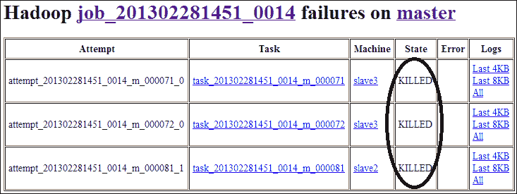

# 七、调整 Hadoop 集群来获得最佳性能

在本章中，我们将介绍：

*   对 Hadoop 集群进行基准测试和性能分析
*   使用瘤胃分析工作历史
*   使用 GridMix 对 Hadoop 集群进行基准测试
*   使用 Hadoop Vaidya 确定性能问题
*   平衡 Hadoop 集群的数据块
*   选择适当的块大小
*   对输入和输出使用压缩
*   配置推测性执行
*   为 TaskTracker 设置适当数量的 MAP 和 Reduce 插槽
*   调整 JobTracker 配置
*   调整 TaskTracker 配置
*   调整混洗、合并和排序参数
*   为 Hadoop 集群配置内存
*   设置适当的并行副本数
*   调整 JVM 参数
*   配置 JVM 重用
*   配置减速机初始化时间

# 简介

Hadoop 性能调优是一项具有挑战性的任务，这主要是由于系统的分布式特性。 从另一个角度来看，大量的配置属性可以告诉我们，配置 Hadoop 集群有多么复杂。 许多配置参数都会影响集群的性能。 有时，属性的不同设置可能会导致显著的性能差异。 在 Hadoop 集群的性能方面，有些属性比其他属性更相关、更敏感。

Hadoop 集群由许多组件组成。 一种系统的性能调优方法是根据组件对集群性能的贡献来调优组件。 大多数大数据应用都有 I/O 限制，Hadoop 也是如此。 因此，与 I/O 请求密切相关的配置应该是性能调优的首要任务。 例如，数据复制属性的次优配置可能会导致网络上的大量数据块拷贝，这将对集群的性能造成负面影响。 同样，不正确的 JVM 配置可能会导致对中间数据进行大量数据交换。 而且，DataNode 上不平衡的数据块分布可能会导致 MAP 和 Reduce 任务的执行效果不佳。

Hadoop 性能调优的第一步是了解 Hadoop MapReduce 如何使用不同的配置属性设置。 在此基础上，可以得出优化的配置或最佳实践。 但这不是一项微不足道的任务。 它需要一些技术，例如通过在不同参数设置下运行受控实验来收集数据，使用优化技术进行数据分析，以及分析和推理技能。 事实上，由于 Hadoop 集群性能调优的挑战性和新颖性，研究社区最近有关于学习和调优 Hadoop 集群性能的项目和出版物(例如，[http://www.cs.duke.edu/starfish/](http://www.cs.duke.edu/starfish/)的 Starfish 项目)。

虽然找到最佳参数配置的方法对于调优 Hadoop 集群的性能是直接的，但无论是在理论上还是在实践中，实现都是非常苛刻的。 Hadoop 社区已经开发并采用了各种优化 Hadoop 性能的工具和策略。 例如，**平衡器**是用于平衡倾斜数据块的工具，而**推测性****执行**是用于为进展缓慢的任务启动推测性任务的策略。

在本章中，我们将概括介绍以下主题：

*   通过对 Hadoop 集群进行基准测试来确定性能问题
*   调整 Hadoop 配置参数以获得最佳性能
*   使用策略和工具实现 Hadoop 最佳性能调优

### 备注

不同 Hadoop 集群的最佳设置可以不同。 换句话说，在不同的硬件配置下，一个集群的最佳配置可能不是另一个集群的最佳配置。 因此，要找到特定集群的最佳设置，需要实际的现场工作

# 对 Hadoop 集群进行基准测试和性能分析

对 Hadoop 集群进行基准测试是调优 Hadoop 集群性能的第一步。 我们还可以使用 Hadoop 基准测试来识别配置问题，并将其用作性能调优的参考。 例如，通过将本地基准测试与具有相似配置的集群进行比较，我们可以对集群性能有一个大致的了解。

通常，我们在对 Hadoop 集群进行新配置之后，在将其投入服务以接受作业之前对其进行基准测试。 这是因为，当客户端可以提交作业时，基准测试可能会被客户端的作业搞糊涂，无法显示 Hadoop 集群的真实性能，而且基准测试作业可能会给客户端带来不便。

在本节中，我们将介绍如何使用 Hadoop 发行版中包含的`tests`和`examples`包对 Hadoop 集群进行基准测试和压力测试。 更具体地说，我们将测试 HDFS 集群的读/写性能。 此外，我们还将测试 MapReduce 框架的故障恢复能力和 MapReduce 集群在压力下的性能。

## 做好准备

要开始使用 Hadoop 集群基准，我们假设已经配置了一个工作的 Hadoop 集群，并且所有守护进程都在运行，没有任何问题。 我们还假设已经在适当的位置正确设置了所需的环境变量。 例如，我们应该让`HADOOP_HOME`指向 Hadoop 安装的主目录，并在`$HADOOP_HOME/conf/hadoop-env.sh`文件中设置`JAVA_HOME`。

使用以下命令从 Hadoop 集群管理机登录到集群主节点：

```sh
ssh hduser@master

```

## 怎么做……

使用以下配方执行 HDFS 基准测试：

1.  Test the filesystem with the following command:

    ```sh
    hadoop jar $HADOOP_HOME/hadoop-test-1.1.2.jar testfilesystem -files 10 -megaBytes 10

    ```

    此命令将生成 10 个文件，每个文件大小为 10MB 用于测试，此基准测试的消息如下所示：

    ```sh
    13/04/18 21:25:36 INFO fs.FileSystem: seed = -7801967327500182430
    13/04/18 21:25:36 INFO fs.FileSystem: files = 10
    13/04/18 21:25:36 INFO fs.FileSystem: megaBytes = 10
    13/04/18 21:25:37 INFO fs.FileSystem: creating control file: 10485760 bytes, 10 files
    13/04/18 21:25:38 INFO fs.FileSystem: created control file for: 11691305 bytes
    13/04/18 21:25:38 WARN mapred.JobClient: Use GenericOptionsParser for parsing the arguments. Applications should implement Tool for the same.
    ...
    ```

    ### 备注

    如果没有错误，则认为测试成功。

2.  Benchmark the distributed write consistency on the distributed filesystem with the following command:

    ```sh
    hadoop jar $HADOOP_HOME/adoop-test-*.jar DistributedFSCheck -write -nrFiles 10 -fileSize 50

    ```

    此命令将向 HDFS 写入 10 个(由`-nrFiles`选项控制)大小为 50MB(由`-fileSize`选项控制)的随机内容文件。 它将生成一个名为`TestDFSIO_results.log`的结果文件，其中包含以下内容：

    ```sh
    ----- TestDFSIO ----- : write
               Date & time: Mon Apr 01 18:25:12 EDT 2013
           Number of files: 10
    Total Mbytes processed: 500
         Throughput mb/sec: 8.585459665510491
    Average IO rate mb/sec: 9.46606731414795
     IO rate std deviation: 2.906442884562995
    Test exec time sec: 42.338

    ```

3.  Similarly, we can benchmark the distributed read consistency on the distributed filesystem with the following command:

    ```sh
    hadoop jar $HADOOP_HOME/hadoop-test-*.jar DistributedFSCheck -read -nrFiles 10 -fileSize 50

    ```

    该命令将从集群中读取 10 个大小为 50 MB 的文件，并将生成包含以下内容的结果文件：

    ```sh
    ----- TestDFSIO ----- : read
               Date & time: Mon Apr 01 18:26:13 EDT 2013
           Number of files: 10
    Total MBytes processed: 500
         Throughput mb/sec: 15.531809145129225
    Average IO rate mb/sec: 17.578426361083984
     IO rate std deviation: 6.313778174121274
        Test exec time sec: 42.205
    ```

### 备注

从这两个(读/写一致性检查)命令的输出中，我们知道对于 HDFS 集群而言，写入比读取更昂贵。 这是因为写入操作又涉及更多操作，例如计算和记录数据块的校验和等。

以下配方可用于对 MapReduce 集群进行基准测试：

1.  Benchmark MapReduce jobs with the following command:

    ```sh
    hadoop jar $HADOOP_HOME/hadoop-test-*.jar mapredtest 5 1000

    ```

    `mapredtest`基准测试对 MapReduce 计算框架进行负载测试。 该基准测试是用随机整数完成的，生成随机整数、将其写入文件、从文件读回并使用原始文件进行测试。

2.  Test the reliability of the MapReduce distributed computing framework with the following command:

    ```sh
    hadoop jar $HADOOP_HOME/hadoop-test-*.jar MRReliabilityTest -libjars $HADOOP_HOME/hadoop-examples-*.jar

    ```

    该命令将故意导致正在运行的作业上的 TASK 和 TaskTracker 失败。 因此，在测试期间，我们将能够看到这样的消息：**终止几个任务**。 示例消息如下所示：

    ```sh
    13/04/17 17:49:22 INFO mapred.ReliabilityTest: Wed Apr 17 17:49:22 EDT 2013 Killing a few tasks
    13/04/17 17:49:22 INFO mapred.ReliabilityTest: Wed Apr 17 17:49:22 EDT 2013 Killed task : attempt_201304051222_0116_m_000000_0
    13/04/17 17:49:22 INFO mapred.ReliabilityTest: Wed Apr 17 17:49:22 EDT 2013 Killed task : attempt_201304051222_0116_m_000000_2
    13/04/17 17:49:22 INFO mapred.ReliabilityTest: Wed Apr 17 17:49:22 EDT 2013 Killed task : attempt_201304051222_0116_m_000001_0
    ...
    java.lang.Throwable: Child Error
            at org.apache.hadoop.mapred.TaskRunner.run(TaskRunner.java:271)
    Caused by: java.io.IOException: Task process exit with nonzero status of 126.
            at org.apache.hadoop.mapred.TaskRunner.run(TaskRunner.java:258)

    13/04/17 17:49:38 WARN mapred.JobClient: Error reading task outputhttp://slave1:50060/tasklog?plaintext=true&attemptid=attempt_201304051222_0119_m_000037_0&filter=stdout
    13/04/17 17:49:38 WARN mapred.JobClient: Error reading task outputhttp://slave1:50060/tasklog?plaintext=true&attemptid=attempt_201304051222_0119_m_000037_0&filter=stderr
    ```

    ### 备注

    失败的任务将在不同的 TaskTracker 上重新执行。 因此，如果集群对故障具有恢复能力，则终止一个或几个任务不会导致作业失败。 如果作业在几个终止任务后失败，可能是因为 MapReduce 不够可靠或对故障没有弹性，因此需要可靠性调优(例如通过添加更多计算 TaskTracker)。

3.  Benchmark MapReduce to deal with a large number of small jobs with the following command:

    ```sh
    hadoop jar $HADOOP_HOME/hadoop-test-*.jar mrbench -numRuns 20

    ```

    `mrbench`多次执行一个小作业(在此命令中为`20`)，并检查这些小作业是否*响应*以及是否可以在集群上高效地运行*。 此命令将生成类似以下内容的输出：*

    ```sh
    *DataLines       Maps    Reduces AvgTime (milliseconds)
    1               2       1       45231*
    ```

     *### 备注

    此输出告诉我们，平均运行时间约为`45`秒。* 
**   Benchmark the MapReduce load generator with the following command:

    ```sh
    hadoop jar $HADOOP_HOME/hadoop-test-1.1.2.jar loadgen -m 100 -r 10 -keepmap 50 -keepred 50 -indir input -outdir output

    ```

    此命令的结果将类似于以下内容：

    ```sh
    Original sum: 1000
    Recomputed sum: 1000
    Success=true

    ```

    *   Do a stress test with the NameNode:

    ```sh
    hadoop jar $HADOOP_HOME/hadoop-test-*.jar nnbench -create_write

    ```

    我们将得到类似于以下内容的输出：

    ```sh
    -------------- NNBench -------------- :
                                   Version: NameNode Benchmark 0.4
                               Date & time: 2013-04-01 18:24:10,491

                            Test Operation: create_write
                                Start time: 2013-04-01 18:22:53,382
                               Maps to run: 2
                            Reduces to run: 1
                        Block Size (bytes): 1
                            Bytes to write: 0
                        Bytes per checksum: 1
                           Number of files: 1
                        Replication factor: 1
                Successful file operations: 2

            # maps that missed the barrier: 0
                              # exceptions: 0

                   TPS: Create/Write/Close: 0
    Avg exec time (ms): Create/Write/Close: 30037.5
                Avg Lat (ms): Create/Write: 30030.5
                       Avg Lat (ms): Close: 6.5

                     RAW DATA: AL Total #1: 60061
                     RAW DATA: AL Total #2: 13
                  RAW DATA: TPS Total (ms): 60075
           RAW DATA: Longest Map Time (ms): 60045.0
                       RAW DATA: Late maps: 0
                 RAW DATA: # of exceptions: 0
    ```

    *   Test the Hadoop performance with large non-splittable files:

    ```sh
    hadoop jar $HADOOP_HOME/hadoop-test-*.jar testbigmapoutput -input input -output output -create 2048

    ```

    此基准测试将生成类似于以下内容的输出：

    ```sh
    13/04/18 22:16:12 INFO mapred.BigMapOutput: Writing 2147483648 bytes to in/part-0 with minKeySize: 10 keySizeRange: 990 minValueSize: 0 valueSizeRange: 20000
    13/04/18 22:17:32 INFO mapred.BigMapOutput: Created in/part-0 of size: 2048MB in 79secs
    Job started: Thu Apr 18 22:17:32 EDT 2013
    13/04/18 22:17:33 INFO mapred.FileInputFormat: Total input paths to process : 1
    13/04/18 22:17:33 INFO net.NetworkTopology: Adding a new node: /default-rack/slave1:50010
    13/04/18 22:17:33 INFO net.NetworkTopology: Adding a new node: /default-rack/slave2:50010
    13/04/18 22:17:33 INFO net.NetworkTopology: Adding a new node: /default-rack/slave3:50010
    ...
    ```

    *   Test thread map spills with the following command:

    ```sh
    hadoop jar $HADOOP_HOME/hadoop-test-*.jar threadedmapbench

    ```

    `threadedmapbench`是一项 MapReduce 基准测试，用于比较具有多个溢出的地图和具有一个溢出的地图的性能。 输出消息将类似于以下内容：

    ```sh
    13/04/18 23:16:01 INFO mapred.ThreadedMapBenchmark: Starting the benchmark for threaded spills
    ThreadedMapBenchmark.0.0.1
    13/04/18 23:16:02 INFO mapred.ThreadedMapBenchmark: Generating random input for the benchmark
    13/04/18 23:16:02 INFO mapred.ThreadedMapBenchmark: Total data : 128 mb
    13/04/18 23:16:02 INFO mapred.ThreadedMapBenchmark: Data per map: 128 mb
    13/04/18 23:16:02 INFO mapred.ThreadedMapBenchmark: Number of spills : 2
    13/04/18 23:16:02 INFO mapred.ThreadedMapBenchmark: Number of maps per host : 1
    13/04/18 23:16:02 INFO mapred.ThreadedMapBenchmark: Number of hosts : 1
    ```* 

 ***排序**是 MapReduce 作业的典型操作。 通过对随机数据进行排序，我们可以查看 Hadoop 集群的运行状况。 以下步骤可用于对 Hadoop 排序进行基准测试：

1.  使用以下命令生成一些随机文本数据：

    ```sh
    hadoop jar $HADOOP_HOME/hadoop-examples-*.jar randomwriter random.writer.out

    ```

2.  使用以下命令对生成的随机数据进行排序：

    ```sh
    hadoop jar $HADOOP_HOME/hadoop-examples-*.jar sort random.writer.out random.writer.out.sorted

    ```

3.  Validate the MapReduce sort algorithm with the following command:

    ```sh
    hadoop jar $HADOOP_HOME/hadoop-test-*.jar testmapredsort -m 50 -r 5 -sortInput random.writer.out -sortOutput random.writer.out.sorted

    ```

    此命令将验证排序算法的准确性。 如果排序算法没有问题，我们将收到以下消息：

    **成功！ 已成功验证 MapReduce 框架的“排序”。**

## …的工作原理

我们可以通过以下命令获取测试包的 Hadoop 基准的使用情况：

```sh
hadoop jar $HADOOP_HOME/hadoop-test-*.jar

```

此命令将为我们提供以下输出：

```sh
An example program must be given as the first argument.
Valid program names are:
  DFSCIOTest: Distributed i/o benchmark of libhdfs.
 DistributedFSCheck: Distributed checkup of the file system consistency.
 MRReliabilityTest: A program that tests the reliability of the MR framework by injecting faults/failures
  TestDFSIO: Distributed i/o benchmark.
  dfsthroughput: measure hdfs throughput
  filebench: Benchmark SequenceFile(Input|Output)Format (block,record compressed and uncompressed), Text(Input|Output)Format (compressed and uncompressed)
 loadgen: Generic map/reduce load generator
 mapredtest: A map/reduce test check.
 mrbench: A map/reduce benchmark that can create many small jobs
 nnbench: A benchmark that stresses the namenode.
  testarrayfile: A test for flat files of binary key/value pairs.
 testbigmapoutput: A map/reduce program that works on a very big non-splittable file and does identity map/reduce
 testfilesystem: A test for FileSystem read/write.
  testipc: A test for ipc.
 testmapredsort: A map/reduce program that validates the map-reduce framework's sort.
  testrpc: A test for rpc.
  testsequencefile: A test for flat files of binary key value pairs.
  testsequencefileinputformat: A test for sequence file input format.
  testsetfile: A test for flat files of binary key/value pairs.
  testtextinputformat: A test for text input format.
  threadedmapbench: A map/reduce benchmark that compares the performance of maps with multiple spills over maps with 1 spill
```

我们可以使用以下命令获取`testfilesystem`基准的用法：

```sh
hadoop jar $HADOOP_HOME/hadoop-test-1.1.2.jar testfilesystem

```

该命令将提供以下输出：

```sh
Usage: TestFileSystem -files N -megaBytes M [-noread] [-nowrite] [-noseek] [-fastcheck]

```

下表显示了此基准命令的每个选项的含义：

<colgroup><col style="text-align: left"> <col style="text-align: left"></colgroup> 
| 

选择 / 选择权 / 购买权 / 期权

 | 

描述 / 描写 / 形容 / 类别

 |
| --- | --- |
| `-files` | 要为基准生成的文件数。 |
| `-megaBytes` | 生成的文件的大小(MB)。 |
| `-noread` | 禁用数据读取测试。 |
| `-nowrite` | 禁用数据写入测试。 |
| `-noseek` | 禁用寻道测试。 |
| `-fastcheck` | 是否使用快速检查。 如果该值为 TRUE，则测试缓冲区将填充相同的值，否则将为测试缓冲区中的每个位置生成随机数。 |

我们可以使用以下命令获得`mrbench`基准测试的帮助：

```sh
hadoop jar $HADOOP_HOME/hadoop-test-*.jar mrbench --help

```

输出将如下所示：

```sh
MRBenchmark.0.0.2
Usage: mrbench [-baseDir <base DFS path for output/input, default is /benchmarks/MRBench>]
          [-jar <local path to job jar file containing Mapper and Reducer implementations, default is current jar file>]
          [-numRuns <number of times to run the job, default is 1>]
          [-maps <number of maps for each run, default is 2>]
          [-reduces <number of reduces for each run, default is 1>]
          [-inputLines <number of input lines to generate, default is 1>]
          [-inputType <type of input to generate, one of ascending (default), descending, random>]
          [-verbose]
```

我们可以使用以下命令获取`loadgen`基准的用法：

```sh
hadoop jar $HADOOP_HOME/hadoop-test-*.jar loadgen

```

此命令的输出将如下所示：

```sh
Usage: [-m <maps>] [-r <reduces>]
       [-keepmap <percent>] [-keepred <percent>]
       [-indir <path>] [-outdir <path]
       [-inFormat[Indirect] <InputFormat>] [-outFormat <OutputFormat>]
       [-outKey <WritableComparable>] [-outValue <Writable>] 
```

我们可以将`nnbench`与以下命令配合使用：

```sh
hadoop jar softwares/hadoop/hadoop-test-*.jar nnbench

```

用法如下所示：

```sh
NameNode Benchmark 0.4
Usage: nnbench <options>
Options:
 -operation <Available operations are create_write open_read
 rename delete. This option is mandatory>
         * NOTE: The open_read, rename and delete operations assumethat
         the files they operate on, are already available. The
         create_write operation must be run before running the other
         operations.
        -maps <number of maps. default is 1\. This is not mandatory>
        -reduces <number of reduces. default is 1\. This is not mandatory>
        -startTime <time to start, given in seconds from the epoch. 
         Make sure this is far enough into the future, so all maps 
         (operations) will start at the same time>. default is launch 
         time + 2 mins. This is not mandatory
        -blockSize <Block size in bytes. default is 1\. This is not
         mandatory>
        -bytesToWrite <Bytes to write. default is 0\. This is not 
         mandatory>
        -bytesPerChecksum <Bytes per checksum for the files. default is 1.
         This is not mandatory>
        -numberOfFiles <number of files to create. default is 1\. Thisis 
         not mandatory>
        -replicationFactorPerFile <Replication factor for the files. 
         default is 1\. This is not mandatory>
        -baseDir <base DFS path. default is /benchmarks/NNBench. This is 
         not mandatory>
        -readFileAfterOpen <true or false. if true, it reads the fileand 
         reports the average time to read. This is valid with the 
         open_read operation. default is false. This is not mandatory>
        -help: Display the help statement
```

输出告诉我们，只有`-operation`选项是必需的，其他所有选项都是可选的。

我们可以通过以下命令使用`testbigmapoutput`基准：

```sh
hadoop jar $HADOOP_HOME/hadoop-test-*.jar testbigmapoutput

```

输出将如下所示：

```sh
BigMapOutput -input <input-dir> -output <output-dir> [-create <filesize in MB>]

```

`-input`和`-output`选项对于该基准是强制的，而指定要读取创建的文件大小的`-create`选项是可选的。

我们可以使用以下命令获取`mapredtest`基准的用法：

```sh
hadoop jar $HADOOP_HOME/hadoop-test-*.jar mapredtest

```

我们将获得以下输出：

```sh
Usage: TestMapRed <range> <counts>

```

### 备注

一个好的测试应该有一个比`<range>`值大得多的`<counts>`值。

`<range>`选项指定要生成的整数的范围，将在 0 和范围-1 之间生成随机整数。 `<counts>`选项指定要为基准测试生成多少个随机整数；它的值应该比`<range>`选项大得多。

我们可以通过以下命令使用`testmapredsort`基准：

```sh
hadoop jar $HADOOP_HOME/hadoop-test-*.jar testmapredsort

```

输出将类似于以下内容：

```sh
sortvalidate [-m <maps>] [-r <reduces>] [-deep] -sortInput <sort-input-dir> -sortOutput <sort-output-dir>

```

下表显示了这些选项的含义：

<colgroup><col style="text-align: left"> <col style="text-align: left"></colgroup> 
| 

选择 / 选择权 / 购买权 / 期权

 | 

描述 / 描写 / 形容 / 类别

 |
| --- | --- |
| `-m` | 映射器的数量。 |
| `-r` | 减速箱的数量。 |
| `-deep` | 执行深度验证。 |
| `-sortInput` | 用于排序的输入数据的目录。 指定的目录必须存在，否则基准测试将失败。 |
| `-sortOutput` | `-sortInput`目录指定的数据排序后的输出目录。 指定的目录必须存在，否则基准测试将失败。 |

## 还有更多...

除了 Hadoop`tests`包之外，Hadoop 还附带了一个`example`包，该包也可用于对 Hadoop 集群进行基准测试。 我们可以使用以下命令获得所有示例基准：

```sh
hadoop jar $HADOOP_HOME/hadoop-example-*.jar

```

此命令将为我们提供以下输出：

```sh
Valid program names are:
  aggregatewordcount: An Aggregate based map/reduce program that counts the words in the input files.
  aggregatewordhist: An Aggregate based map/reduce program that computes the histogram of the words in the input files.
  dbcount: An example job that count the pageview counts from a database.
  grep: A map/reduce program that counts the matches of a regex in the input.
  join: A job that affects a join over sorted, equally partitioned datasets
  multifilewc: A job that counts words from several files.
  pentomino: A map/reduce tile laying program to find solutions to pentomino problems.
 pi: A map/reduce program that estimates Pi using monte-carlo method.
  randomtextwriter: A map/reduce program that writes 10GB of random textual data per node.
 randomwriter: A map/reduce program that writes 10GB of random data per node.
  secondarysort: An example defining a secondary sort to the reduce.
  sleep: A job that sleeps at each map and reduce task.
 sort: A map/reduce program that sorts the data written by the random writer.
  sudoku: A sudoku solver.
  teragen: Generate data for the terasort
  terasort: Run the terasort
  teravalidate: Checking results of terasort
 wordcount: A map/reduce program that counts the words in the input files.

```

有些命令对于测试 Hadoop 集群的配置非常方便。 例如，我们可以使用以下命令通过计算π(Pi)来测试集群：

```sh
hadoop jar $HADOOP_HOME/hadoop-example-*.jar pi 10 1000000

```

此命令将启动 MapReduce 作业，使用 10 个映射器计算π，每个映射器生成 1,000,000 个样本。

`randomwriter`的用法如下：

```sh
hadoop jar $HADOOP_HOME/hadoop-example-*.jar randomwriter <out-dir>

```

`<out-dir>`指定`randomwriter`的输出目录。

`sort`的用法如下：

```sh
sort [-m <maps>] [-r <reduces>] [-inFormat <input format class>] [-outFormat <output format class>] [-outKey <output key class>] [-outValue <output value class>] [-totalOrder <pcnt> <num samples> <max splits>] <input> <output>

```

下表显示了每个选项的含义：

<colgroup><col style="text-align: left"> <col style="text-align: left"></colgroup> 
| 

选择 / 选择权 / 购买权 / 期权

 | 

描述 / 描写 / 形容 / 类别

 |
| --- | --- |
| `-m` | 映射任务数。 |
| `-r` | Reduce 任务数。 |
| `-inFormat` | 输入格式类。 |
| `-outFormat` | 输出格式类。 |
| `-outKey` | 输出键类。 |
| `-outValue` | 输出值类。 |
| `-totalOrder` | 指定使用`TotalOrderPartitioner`对输入数据进行分区。 需要三个参数：`<pcnt>`指定分区数，`<num samples>`指定样本数，`<max splits>`指定数据的最大拆分数。 |
| `input` | 排序输入目录。 |
| `output` | 排序输出目录。 |

`wordcount`的用法如下：

```sh
hadoop jar $HADOOP_HOME/hadoop-example-*.jar wordcount <in> <out>

```

`in`指定输入目录，`out`指定输出目录。

## 另请参阅

*   使用 GridMix 配方对 Hadoop 集群进行基准测试的

 *# 使用 Rumen 分析作业历史

**Rumen**是一个用于从作业日志文件中提取格式良好的信息的工具。 它解析日志并生成 Hadoop 作业的统计数据。 作业跟踪可用于性能调整和模拟。

当前的 Rumen 实现包括两个组件：**TraceBuilder**和**文件夹**。 TraceBuilder 将作业历史记录作为输入，并生成易于解析的`json`文件。 文件夹是一个处理输入跟踪的实用程序，大多数情况下，它用于从 TraceBuilder 缩放汇总的作业跟踪。 例如，我们可以使用文件夹工具来放大(使时间更长)或缩小(使时间更短)作业运行时。 在本食谱中，我们将概述与 Rumen 一起分析工作历史的步骤。

## 做好准备

在开始之前，我们假设 Hadoop 集群已经正确配置，并且所有守护进程都在运行，没有任何问题。

使用以下命令从 Hadoop 集群管理员计算机登录到集群主节点：

```sh
ssh hduser@master

```

## 怎么做……

使用以下步骤分析 Rumen 的作业历史记录：

1.  Use the TraceBuilder to extract the **Gold** **Trace** from the Hadoop job history files. The syntax of the command is as follows:

    ```sh
    hadoop org.apache.hadoop.tools.rumen.TraceBuilder [options] <jobtrace-output> <topology-output> <inputs>

    ```

    例如，我们可以使用以下命令从作业历史目录中提取作业跟踪和拓扑：

    ```sh
    hadoop org.apache.hadoop.tools.rumen.TraceBuilder -recursive file:///tmp/jobtraces.json file:///tmp/topology.out file:///usr/local/hadoop/logs/history/done

    ```

    此命令将*递归地*从 Hadoop 作业历史目录`$HADOOP_HOME/logs/history/done`提取作业历史跟踪以及集群的拓扑。 `-recursive`选项告诉 TraceBuilder 递归扫描作业历史目录。

    `jobtraces.json`输出文件将包含 MapReduce 作业的所有指标，如下所示：

    ```sh
    {
      "priority" : "NORMAL",
      "jobID" : "job_201304012206_0001",
      "user" : "hduser",
      "jobName" : "PiEstimator",
      "mapTasks" : [ {
        "startTime" : 1364868424530,
        "attempts" : [ {
          "location" : {
            "layers" : [ "default-rack", "master" ]
          },
          "hostName" : "/default-rack/master",
          "result" : "SUCCESS",
          "startTime" : 1364868424536,
          "finishTime" : 1364868426761,
          "attemptID" : "attempt_201304012206_0001_m_000000_0",
          "shuffleFinished" : -1,
          "sortFinished" : -1,
          "hdfsBytesRead" : 242,
          "hdfsBytesWritten" : -1,
          "fileBytesRead" : -1,
          "fileBytesWritten" : 51959,
          "mapInputRecords" : 1,
          "mapOutputBytes" : 18,
          "mapOutputRecords" : 2,
          "combineInputRecords" : 0,
          "reduceInputGroups" : -1,
          "reduceInputRecords" : -1,
          "reduceShuffleBytes" : -1,
          "reduceOutputRecords" : -1,
          "spilledRecords" : 2,
          "mapInputBytes" : 24,
          "resourceUsageMetrics" : {
            "cumulativeCpuUsage" : 600,
            "virtualMemoryUsage" : 764727296,
            "physicalMemoryUsage" : 185315328,
            "heapUsage" : 173867008
          }
        } ],
        "finishTime" : 1364868426971,
        "preferredLocations" : [ {
          "layers" : [ "default-rack", "master" ]
        } ],
        "taskType" : "MAP",
        "taskStatus" : "SUCCESS",
        "taskID" : "task_201304012206_0001_m_000000",
        "inputBytes" : 242,
        "inputRecords" : 1,
    ...
    "outputBytes" : 51959,
      "reduceTasks" : [ {
        "startTime" : 1364868426978,
        "attempts" : [ {
          "location" : {
            "layers" : [ "default-rack", "master" ]
          },
          "hostName" : "/default-rack/master",
          "result" : "SUCCESS",
          "startTime" : 1364868426995,
          "finishTime" : 1364868441901,
          "attemptID" : "attempt_201304012206_0001_r_000000_0",
          "shuffleFinished" : 1364868440476,
    ...
      "failedReduceAttemptCDF" : {
        "maximum" : 9223372036854775807,
        "minimum" : -9223372036854775808,
        "rankings" : [ ],
        "numberValues" : 0
      },
      "mapperTriesToSucceed" : [ 1.0 ],
      "failedMapperFraction" : 0.0,
      "relativeTime" : 0,
      "clusterMapMB" : -1,
      "clusterReduceMB" : -1,
      "jobMapMB" : 200,
      "jobReduceMB" : 200
    }
    ```

2.  The second step of using Rumen is to scale the data generated from the previous step. We can use the following syntax to do this:

    ```sh
    hadoop org.apache.hadoop.tools.rumen.Folder [options] [input] [output]

    ```

    例如，要将上一步中生成的作业跟踪的运行时间调整为 50 分钟，我们可以使用以下命令：

    ```sh
    hadoop org.apache.hadoop.tools.rumen.Folder -output-duration 50m -input-cycle 20m file:///home/hduser/jobtraces.json file:///home/hduser/job-scaled-50min.json

    ```

    在此命令中，`-output-duration`选项定义作业跟踪的最终运行时间，此选项的默认值为 1 小时。 `-input-cycle`选项是强制性的，它定义折叠操作的基本时间单位。

## 另请参阅

*   使用 GridMix 配方对 Hadoop 集群进行基准测试的
**   参考[http://hadoop.apache.org/docs/r1.1.2/rumen.html](http://hadoop.apache.org/docs/r1.1.2/rumen.html)*   参考[https://issues.apache.org/jira/browse/MAPREDUCE-751](https://issues.apache.org/jira/browse/MAPREDUCE-751)*

 *# 使用 GridMix 为 Hadoop 集群制定基准

**GridMix**是一个对 Hadoop 集群进行基准测试的工具。 它生成个合成 MapReduce 作业，并基于个这些作业的性能构建模型。 基于作业执行度量对集群的资源配置文件进行建模。 这些配置文件可以帮助我们找到集群的性能瓶颈。 在本节中，我们将概述使用 GridMix 对 Hadoop 进行基准测试的步骤。

## 做好准备

我们假设我们的 Hadoop 集群已经正确配置，并且所有守护进程都在正常运行，没有任何问题。

### 备注

目前，GridMix 有三个版本。 为了便于区分和表示，我们将使用`GridMix`表示 GridMix 版本 1，使用`GridMix2`表示 GridMix 版本 2，并使用`GridMix3`表示 GridMix 版本 3。

使用以下命令从管理员计算机登录到 Hadoop 集群节点：

```sh
ssh hduser@master

```

## 怎么做……

使用以下步骤获取 GridMix2 基准：

1.  使用以下命令更改当前工作目录：

    ```sh
    cd $HADOOP_HOME/src/benchmarks/gridmix2

    ```

2.  使用以下命令构建 GridMix2 包：

    ```sh
    ant

    ```

3.  使用以下命令将`gridmix.jar`文件复制到当前工作目录：

    ```sh
    cp build/gridmix.jar .

    ```

4.  使用文本编辑器打开`gridmix-env-2`文件，并将环境变量更改为下列值：

    ```sh
    export HADOOP_VERSION=hadoop-1.1.2
    export HADOOP_HOME=/usr/local/hadoop
    export HADOOP_CONF_DIR=$HADOOP_HOME/conf
    export USE_REAL_DATASET=FALSE

    export APP_JAR=${HADOOP_HOME}/hadoop-test-*.jar
    export EXAMPLE_JAR=${HADOOP_HOME}/hadoop-examples-*.jar
    export STREAMING_JAR=${HADOOP_HOME}/contrib/streaming/hadoop-streaming-*.jar

    ```

5.  Open the `gridmix_config.xml` GridMix2 configuration file with a text editor and change the benchmark configuration by changing the properties for the benchmark. For example, the following lines configure the number of jobs for the `streamSort` benchmark with small jobs:

    ```sh
    <property>
      <name>streamSort.smallJobs.numOfJobs</name>
      <value>10,5</value>
    </property>

    <property>
      <name>streamSort.smallJobs.numOfReduces</name>
      <value>6,3</value>
    </property>
    ```

    ### 备注

    这两个属性指定我们将使用 10 个具有 6 个减速器的小型流排序作业，以及 5 个具有 3 个减速器的小型流排序作业。 所有其他配置都应遵循与此类似的规则。

6.  使用以下命令使`generateGridmix2Data.sh`脚本可执行：

    ```sh
    chmod +x generateGridmix2Data.sh

    ```

7.  Generate data with the following command:

    ```sh
    ./generateGridmix2Data.sh

    ```

    此命令将在 HDFS 上生成数据。 默认情况下，生成的数据将以块压缩率 4 进行压缩。将启动三个作业，如输出消息中所示：

    ```sh
    Job started: Fri Apr 19 16:02:48 EDT 2013
    Running 492 maps.
    Job started: Fri Apr 19 16:02:48 EDT 2013
    Running 492 maps.
    Job started: Fri Apr 19 16:02:48 EDT 2013
    13/04/19 16:02:49 INFO mapred.JobClient: Running job: job_201304051222_0233
    13/04/19 16:02:49 INFO mapred.JobClient: Running job: job_201304051222_0234
    13/04/19 16:02:49 INFO mapred.JobClient: Running job: job_201304051222_0235
    ...

    ```

8.  使用以下命令使`rungridmix_2`脚本可执行：

    ```sh
    chmod +x rungridmix_2

    ```

9.  Run the `GridMix2` benchmark with the command:

    ```sh
    ./rungridmix_2

    ```

    此命令需要一段时间才能完成。 我们可以看到类似以下内容的输出消息：

    ```sh
    Jobs in waiting state: 30
    Jobs in ready state: 0
    Jobs in running state: 140
    Jobs in success state: 32
    Jobs in failed state: 0
    ```

## 它是如何工作的.

GridMix 是 Hadoop 集群的基准测试。 它通常用于通过运行多个作业来对 Hadoop 集群的性能配置文件进行建模。

GridMix 所需的数据是通过运行`generateGridmix2data.sh` 脚本生成的。 我们可以将此文件配置为更改，例如，更改生成的数据文件的大小。 然后，在执行`rungridmix_2`脚本时，将以批处理模式生成并提交多个作业。 最后，计算出这些作业的运行时间。

GridMix2 附带以下代表性作业：`streamSort`、`javaSort`、`webdataSort`、`combiner`和`monsterSort`。 这些工作可分为以下几类：

*   由多阶段或流水线 MapReduce 作业驱动的三阶段 MapReduce 作业
*   大类可变键/值大小，这是由处理大数据集引起的
*   参考选择作业，其动机是从大量参考数据集中采样的作业
*   API 文本排序作业，其动机是应用 MapReduce API 进行排序

GridMix 基准是来自不同类别的许多小型、中型和大型作业的混合。 我们可以在`gridmix_config.xml`文件中指定混合。 根据规范，将创建多个作业并将其提交到 Hadoop 集群，直到其完成。

## 还有更多...

除了使用 GridMix2 进行基准测试之外，我们还可以使用 GridMix1 和 GridMix3 对 Hadoop 集群进行基准测试。

### 以 GridMix1 为基准的 Hadoop 集群

GridMix1 的用法类似于 GridMix2。 可以使用以下步骤：

1.  更改到 GridMix1 目录：

    ```sh
    cd $HADOOP_HOME/src/benchmarks/gridmix

    ```

2.  Open the `gridmix-env` file with a text editor and change the configuration to the following:

    ```sh
    export HADOOP_HOME=/usr/local/Hadoop
    export GRID_MIX_HOME=$HADOOP_HOME/src/benchmarks/gridmix
    export APP_JAR=${HADOOP_HOME}/hadoop-test-*.jar
    export EXAMPLE_JAR=${HADOOP_HOME}/hadoop-examples-*.jar
    export STREAMING_JAR=${HADOOP_HOME}/contrib/streaming/hadoop-streaming-*.jar
    export GRID_MIX_DATA=/gridmix1/data
    export GRID_MIX_PROG=/gridmix1/programs

    ```

    ### 备注

    最后两个环境变量`GRID_MIX_DATA`和`GRID_MIX_PROG`指定 HDFS 上的两个目录。 因此，生成的数据和程序将位于 HDFS 上。

3.  使用以下命令使`generateData.sh`脚本可执行：

    ```sh
    chmod +x generateData.sh

    ```

4.  Generate data with the following command:

    ```sh
    sh ./generateData.sh

    ```

    GridMix1 由许多高级脚本组成，用于控制基准作业的工作方式。 GridMix1 目录的树形结构如下所示：

    ```sh
    gridmix
    ├── generateData.sh
    ├── gridmix-env
    ├── gridmix.jar
    ├── javasort
    │   ├── text-sort.large
    │   ├── text-sort.medium
    │   └── text-sort.small
    ├── maxent
    │   └── maxent.large
    ├── monsterQuery
    │   ├── monster_query.large
    │   ├── monster_query.medium
    │   └── monster_query.small
    ├── pipesort
    │   ├── text-sort.large
    │   ├── text-sort.medium
    │   └── text-sort.small
    ├── README
    ├── streamsort
    │   ├── text-sort.large
    │   ├── text-sort.medium
    │   └── text-sort.small
    ├── submissionScripts
    │   ├── allThroughHod
    │   ├── allToSameCluster
    │   ├── maxentHod
    │   ├── maxentToSameCluster
    │   ├── monsterQueriesHod
    │   ├── monsterQueriesToSameCluster
    │   ├── sleep_if_too_busy
    │   ├── textSortHod
    │   ├── textSortToSameCluster
    │   ├── webdataScanHod
    │   ├── webdataScanToSameCluster
    │   ├── webdataSortHod
    │   └── webdataSortToSameCluster
    ├── webdatascan
    │   ├── webdata_scan.large
    │   ├── webdata_scan.medium
    │   └── webdata_scan.small
    └── webdatasort
        ├── webdata_sort.large
        ├── webdata_sort.medium
        └── webdata_sort.small

    8 directories, 36 files
    ```

    ### 备注

    GridMix1 目录包含几个大小不同的模板作业。 例如，`javasort`目录中的三个脚本(`text-sort.small`、`text-sort.medium`和`text-sort.large`)是用于小型、中型和大型`javasort`作业的模板。

5.  To run a small `javasort` job, we can use the following command:

    ```sh
    sh javasort/text-sort.small

    ```

    ### 备注

    我们可以使用类似的命令来运行中型和大型作业。

### 以 GridMix3 为基准的 Hadoop 集群

使用以下步骤为 Hadoop 集群构建 GridMix3 基准：

1.  Copy the required JAR files to the Hadoop `lib` directory using the following commands:

    ```sh
    cp $HADOOP_HOME/hadoop-tools-*.jar $HADOOP_HOME/lib
    cp $HADOOP_HOME/contrib/gridmix/hadoop-gridmix-*.jar $HADOOP_HOME/lib

    ```

    ### 备注

    `hadoop-tools-*.jar`文件包含 GridMix3 所需的 Rumen 等工具。 `hadoop-gridmix-*.jar`文件包含 GridMix3 基准测试工具。 此外，Hadoop 集群的 GridMix3 作业组合通常使用作业跟踪文件来描述，作业跟踪文件是使用 Rumen 从作业配置文件生成的。

2.  Use Rumen to generate a job trace file with the following command:

    ```sh
    hadoop org.apache.hadoop.tools.rumen.TraceBuilder -recursive file:///tmp/jobtrace.json file:///tmp/topology.out file:///usr/local/hadoop/logs/history/done

    ```

    该命令将生成一个作业跟踪文件`/tmp/jobtrace.json`，在下一步中，我们将使用该文件作为 GridMix3 Hadoop 基准测试的输入。

    ### 备注

    有时，在运行此命令时可能会出现`CRC`异常。 解决此问题的快速方法是删除相应作业配置文件的`.crc`文件，例如，作业配置文件`job_201304051222_0192_conf.xml`的校验和文件为`job_201304051222_0192_conf.xml.crc`。 我们可以删除后一个文件以忽略`.crc`检查。

3.  Run the GridMix3 benchmark with the following command:

    ```sh
    hadoop org.apache.hadoop.mapred.gridmix.Gridmix -generate 100m gridmixdata  /tmp/jobtraces.json

    ```

    此命令将生成类似以下内容的输出：

    ```sh
    13/04/01 22:57:11 INFO gridmix.SubmitterUserResolver:  Current user resolver is SubmitterUserResolver
    13/04/01 22:57:11 INFO gridmix.Gridmix:  Submission policy is STRESS
    13/04/01 22:57:11 INFO util.NativeCodeLoader: Loaded the native-hadoop library
    13/04/01 22:57:11 WARN snappy.LoadSnappy: Snappy native library not loaded
    13/04/01 22:57:11 INFO gridmix.CompressionEmulationUtil: GridMix is configured to generate compressed input data with  a compression ratio of 0.5
    13/04/01 22:57:11 INFO gridmix.Gridmix: Generating 100.0m of test data...
    13/04/01 22:57:11 INFO gridmix.Statistics: Not tracking job GRIDMIX_GENERATE_INPUT_DATA as seq id is less than zero: -1
    ```

4.  To acquire the usage and available parameters for GridMix3, we can use the following command:

    ```sh
    hadoop org.apache.hadoop.mapred.gridmix.Gridmix

    ```

    此命令的输出如下所示：

    ```sh
    The general command line syntax is
    bin/hadoop command [genericOptions] [commandOptions]

    Usage: gridmix [-generate <MiB>] [-users URI] [-Dname=value ...] <iopath> <trace>
      e.g. gridmix -generate 100m foo - Configuration parameters:
       General parameters:
           gridmix.output.directory               : Output directory
           gridmix.client.submit.threads          : Submitting threads
    ...
    ```

## 另请参阅

*   *基准测试和分析 Hadoop 集群*配方
*   参考[http://hadoop.apache.org/docs/r1.1.2/rumen.html](http://hadoop.apache.org/docs/r1.1.2/rumen.html)
*   请参阅[$HADOOP_HOME/src/Benchmark/Readme.gridMix2](http://%24HADOOP_HOME/src/benchmarks/README.gridmix2)

# 使用 Hadoop Vaidya 确定性能问题

Hadoop**Vaidya**是一个开源的、基于规则的 Apache Hadoop 性能诊断框架。 每条规则都可以识别特定的性能问题。 例如，Hadoop 集群管理员可以使用 Vaidya 来识别正在浪费集群资源的进度缓慢的作业。 Hadoop 客户端可以使用 Vaidya 来识别其提交的作业的配置错误。

Hadoop Vaidya 是可扩展的；用户可以使用自己的规则分析 Hadoop 作业。 在本食谱中，我们将概述配置 Hadoop Vaidya 以进行 Hadoop 集群性能诊断的步骤。

## 做好准备

在开始之前，我们假设 Hadoop 集群已经正确配置，并且所有守护进程都在运行，没有任何问题。

使用以下命令从 Hadoop 集群管理员计算机登录到主节点计算机：

```sh
ssh hduser@master

```

## 怎么做……

要使用 Hadoop Vaidya，请执行以下步骤：

1.  找到要分析的作业配置文件的目录。 此文件夹的默认位置为`$HADOOP_HOME/logs`。
2.  Locate the job history files under the job history directory with the following command:

    ```sh
    find $HADOOP_HOME/logs -name 'job_201304012330_0001*'

    ```

    ### 备注

    此命令假定至少运行了一个作业，以便可以找到至少一个作业配置文件。 为了说明起见，我们假设在运行此命令之前`teragen`作业已经完成。

    例如，在此命令中，我们希望获取作业 ID 为`job_201304012330_0001`的作业的配置文件。 我们可以得到以下两行作为输出：

    ```sh
    logs/history/job_201304012330_0001_conf.xml
    logs/history/job_201304012330_0001_1364874504561_hduser_TeraGen
    ```

    ### 备注

    输出中的第一个 XML 文件是作业配置文件，第二个是作业日志文件。

3.  Use Vaidya to analyze the job trace files with the following command:

    ```sh
    sh $HADOOP_HOME/contrib/vaidya/bin/vaidya.sh -jobconf file:///usr/local/hadoop/logs/history/job_201304012330_0002_conf.xml -joblog file:///usr/local/hadoop/logs/history/job_201304012330_0002_1364874504561_hduser_TeraGen -report report.txt

    ```

    ### 提示

    请注意，文件位置应该是包含架构的绝对路径，即`hdfs://`或`file://`。

    此命令将生成内容类似于以下内容的`report.txt`文件：

    ```sh
    <?xml version="1.0" encoding="UTF-8" standalone="no"?><PostExPerformanceDiagnosticReport><JobInformationElement><JobTrackerID/><JobName>PiEstimator</JobName><JobType>MAP_REDUCE</JobType><User>hduser</User><SubmitTime>2013-04-17 19:46:49.213</SubmitTime><LaunchTime>2013-04-17 19:46:49.369</LaunchTime><FinishTime>2013-04-17 19:54:06.833</FinishTime><Status>SUCCESS</Status></JobInformationElement><TestReportElement><TestTitle>Balanaced Reduce Partitioning</TestTitle><TestDescription>This rule tests as to how well the input to reduce tasks is balanced</TestDescription><TestImportance>HIGH</TestImportance>
    <TestResult>NEGATIVE(PASSED)</TestResult>
    <TestSeverity>0.0</TestSeverity><ReferenceDetails>* TotalReduceTasks: 1
    * BusyReduceTasks processing 0.85% of total records: 1
    * Impact: 0.0</ReferenceDetails><TestPrescription>* Use the appropriate partitioning function
    * For streaming job consider following partitioner and hadoop config parameters
      * org.apache.hadoop.mapred.lib.KeyFieldBasedPartitioner
      * -jobconf stream.map.output.field.separator, -jobconf stream.num.map.output.key.fields</TestPrescription></TestReportElement><TestReportElement><TestTitle>Impact of Map tasks Re-Execution</TestTitle><TestDescription>This test rule checks percentage of map task re-execution impacting the job performance</TestDescription><TestImportance>HIGH</TestImportance>
    <TestResult>NEGATIVE(PASSED)</TestResult>
    <TestSeverity>0.0</TestSeverity><ReferenceDetails>* Total Map Tasks: 10
    * Launched Map Tasks: 10
    * Percent Maps ReExecuted: 0
    * Impact: 0.0</ReferenceDetails><TestPrescription>* Need careful evaluation of why maps are re-executed.
      * It could be due to some set of unstable cluster nodes.
      * It could be due to application-specific failures.</TestPrescription></TestReportElement><TestReportElement><TestTitle>Impact of Reduce tasks Re-Execution</TestTitle><TestDescription>This test rule checks percentage of reduce task re-execution impacting the job performance</TestDescription><TestImportance>HIGH</TestImportance>
    <TestResult>NEGATIVE(PASSED)</TestResult>
    <TestSeverity>0.0</TestSeverity><ReferenceDetails>* Total Reduce Tasks: 1
    * Launched Reduce Tasks: 1
    * Percent Reduce Tasks ReExecuted: 0
    * Impact: 0.0</ReferenceDetails><TestPrescription>* Need careful evaluation of why reduce tasks are re-executed.
      * It could be due to some set of unstable cluster nodes.
      * It could be due to application-specific failures.</TestPrescription></TestReportElement><TestReportElement><TestTitle>Map and/or Reduce tasks reading HDFS data as a side effect</TestTitle><TestDescription>This test rule checks if map/reduce tasks are reading data from HDFS as a side effect. The more data read as a side effect can potentially be a bottleneck across parallel execution of map/reduce tasks.</TestDescription><TestImportance>HIGH</TestImportance>
    <TestResult>POSITIVE(FAILED)</TestResult>
    <TestSeverity>0.99</TestSeverity><ReferenceDetails>* Total HDFS Bytes read: 2440
    * Total Map Input Bytes read: 240
    * Impact: 1.0</ReferenceDetails><TestPrescription>Map and/or Reduce tasks are reading application specific files from HDFS. Make sure the replication factor
    of these HDFS files is high enough to avoid the data reading bottleneck. Typically the replication factor
    can be the square root of map/reduce tasks capacity of the allocated cluster.</TestPrescription></TestReportElement><TestReportElement><TestTitle>Map side disk spill</TestTitle><TestDescription>This test rule checks if Map tasks are spilling the data on to the local disk during the map side sorting due to insufficient sort buffer size. The impact is calculated as ratio between local bytes written to map output bytes. Impact is normalized using NormalizationFactor given below and any value greater than or equal to normalization factor is treated as the maximum (i.e. 1).</TestDescription><TestImportance>LOW</TestImportance>
    <TestResult>POSITIVE(FAILED)</TestResult>
    <TestSeverity>0.33</TestSeverity><ReferenceDetails>* TotalMapOutputBytes: 180
    * Total Local Bytes Written by Maps: 219400
    * Impact: 1.0</ReferenceDetails><TestPrescription>* Use the combiner to lower the map output size.
    * Increase map side sort buffer size (io.sort.mb:100).
    * Increase index buffer size (io.sort.record.percent:0) if the number of Map Output Records is large.
    * Increase (io.sort.spill.percent:0), default 0.80 i.e. 80% of sort buffer size and index buffer size.
    </TestPrescription></TestReportElement></PostExPerformanceDiagnosticReport>
    ```

## 它是如何工作的.

我们可以使用以下命令获取 Vaidya 的选项：

```sh
$HADOOP_HOME/contrib/vaidya/bin/vaidya.sh -help

```

输出如下：

```sh
Invalid arguments: -jobconf or -joblog arguments are missing
Usage:
PostExPerformanceDiagnoser -jobconf <fileurl> -joblog <fileurl> [-testconf <filepath>] [-report <filepath>]

-jobconf <fileurl>     : File path for job configuration file (e.g. job_xxxx_conf.xml). It can be on HDFS or
                       : local filesystem. It should be specified in the URL format.
                       : e.g. local file => file://localhost/Users/hadoop-user/job_0001_conf.xml
                       : e.g. hdfs file  => hdfs://namenode:port/Users/hadoop-user/hodlogs/.../job_0001_conf.xml

-joblog <fileurl>      : File path for job history logfile. It can be on HDFS or local file system.
                       : It should be specified in the URL format.

-testconf <filepath>   : Optional file path for performance advisor tests configuration file. It should be available
                       : on local file system and be specified as as an absolute file path.
                       : e.g. => /Users/hadoop-user/postex_diagnosis_tests.xml. If not specified default file will be used
                       : from the hadoop-{ver}-vaidya.jar in a classpath.
                       : For user to view or make local copy of default tests, file is available at $HADOOP_HOME/contrib/vaidya/conf/postex_diagnosis_tests.xml

-report <filepath>     : Optional file path for for storing diagnostic report in a XML format. Path should be available
                       : on local file system and be specified as as an absolute file path.
                       : e.g. => /Users/hadoop-user/postex_diagnosis_report.xml. If not specified report will be printed on console

-help                  : prints this usage
```

## 还有更多...

**HiBench**是一个针对 Hadoop 的基准测试套件。 它有 9 个典型的工作负载，包括 Micro、HDFS、网络搜索机器学习和数据分析基准。 例如，它支持**Nutch**(文本索引软件包)、**PageRank**(PageRank 算法)、Mahout 机器学习算法和配置单元查询的基准测试。

HiBench 项目和本文提供了很好的 Hadoop 基准测试示例。 有关更多信息，可以参考[https://github.com/intel-hadoop/Hibench](https://github.com/intel-hadoop/Hibench)。

## 另请参阅

*   *基准测试和分析 Hadoop 集群*配方
*   使用 GridMix 配方对 Hadoop 集群进行基准测试的
**   参考[http://hadoop.apache.org/docs/stable/vaidya.html](http://hadoop.apache.org/docs/stable/vaidya.html)*

 *# 平衡 Hadoop 集群的数据块

HDFS 将数据块存储在 DataNode 机器上。 当 Hadoop 处理作业时，会生成和删除数据。 随着时间的推移，一些 DataNode 可以承载比其他数据块多得多的数据块。 集群上数据的这种不平衡分布称为**数据倾斜**。

数据不对称是 Hadoop 集群的一个大问题。 我们知道，当 JobTracker 将任务分配给 TaskTracker 时，它遵循的一般规则是**数据本地**，这意味着映射任务将分配给数据块所在的主机。 如果数据块存储分布不对称，或者换句话说，数据块只位于一小部分 DataNode 上，则只有那些具有数据块的节点才能遵循数据本地规则。 此外，如果 JobTracker 将任务分配给本地没有托管数据的其他节点，则需要将数据从远程计算机传输到 TaskTracker 计算机。 数据传输将耗费大量网络带宽，从而降低集群的整体性能。

为了解决 HDFS 上的数据不对称问题，Hadoop 附带了**平衡器**工具。 它可以手动或自动配置以重新平衡数据块。

## 做好准备

要开始使用平衡器，我们假设 Hadoop 集群已经正确配置，并且所有守护进程都在正常运行。

使用以下命令从集群管理员计算机登录到主节点：

```sh
ssh hduser@master

```

## 怎么做……

使用以下步骤使用平衡器平衡 HDFS 数据块：

1.  Check the data skew through the web UI, for example, by the opening URL [http://master:50070/](http://master:50070/).

    该网页将类似于以下屏幕截图：

    

    屏幕截图显示数据块是倾斜的。 因此，再平衡是必要的。

2.  Use the following command to balance the data blocks on the DataNode machines:

    ```sh
    hadoop balancer -threshold 0.2

    ```

    ### 备注

    此命令需要一些时间才能完成，具体取决于分布式文件系统的状态以及`–threshold`选项的值。 `-threshold`选项指定集群是否平衡的阈值。 它是[0，1]范围内的实数，默认值为 0.1。 此选项的值越小，数据块的分布越均匀。 另一方面，它将需要更多的时间来完成。 不建议将此选项设置为`0`，因为要实现理想的平衡并不实际。

3.  Alternatively, we can start the Hadoop balancer daemon to automatically balance the data blocks on HDFS. We can use the following command to do this:

    ```sh
    start-balancer.sh

    ```

    平衡器将根据空间利用率在数据节点之间移动数据块。 例如，它会将数据块从利用率高的节点移动到利用率较低的节点。 这个过程是反复进行的。 我们可以在每次迭代后从 NameNode 获取更新后的 DataNode 信息。 如果集群已经平衡，我们将得到类似于以下内容的输出：

    ```sh
    Time Stamp               Iteration#  Bytes Already Moved  Bytes Left To Move  Bytes Being Moved
    13/04/02 00:56:27 INFO net.NetworkTopology: Adding a new node: /default-rack/127.0.0.1:50010
    13/04/02 00:56:27 INFO balancer.Balancer: 0 over utilized nodes:
    13/04/02 00:56:27 INFO balancer.Balancer: 1 under utilized nodes:  127.0.0.1:50010
    The cluster is balanced. Exiting...
    Balancing took 567.0 milliseconds
    ```

4.  要停止平衡器，可以使用以下命令：

    ```sh
    stop-balancer.sh

    ```

## …的工作原理

Hadoop 平衡器根据预配置的阈值平衡 HDFS 上的数据块，该阈值设置集群是否平衡的目标。 如果节点的空间利用率与集群的空间利用率之间的差值小于阈值，则认为该节点是平衡的。

有时，我们希望限制均衡器使用的带宽百分比。 默认情况下，Hadoop 定义了一个属性`dfs.balance.bandwidthPerSec`，该属性确定数据块从一个 DataNode 移动到另一个 DataNode 的最大速度。 其默认值为 1 MB/s。通过将此属性配置为更高的值，均衡速度会更快，但会占用更多资源。 例如，要将此属性的值更改为 10 MB/s，我们可以打开`$HADOOP_HOME/conf/hdfs-site.xml`文件并添加以下行：

```sh
<property>
  <name>dfs.balance.bandwidthPerSec</name>
  <value>10485760</value>
</property>
```

### 备注

我们需要重新启动 HDFS 才能使此更改生效。

# 选择合适的块大小

HDFS 将数据存储为分布在多台机器上的个数据块。 因此，当一个大文件被放到 HDFS 上时，它将首先被分割成多个数据块。 然后，NameNode 将这些数据块分发到集群中的 DataNode。 数据块的粒度会影响任务的分布和并行执行。

根据正在执行的作业的属性，一个**块大小**可能会比其他块大小带来更好的性能。 我们将引导您完成为 Hadoop 集群配置适当块大小的步骤。

## 做好准备

我们假设 Hadoop 集群已经正确配置，并且所有守护进程都在运行，没有任何问题。

使用以下命令从 Hadoop 集群管理员计算机登录到主节点：

```sh
ssh hduser@master

```

## 怎么做……

使用以下步骤配置适当的 HDFS 块大小：

1.  在配置的集群上运行典型作业。 例如，我们可以使用以下命令在集群上运行示例`terasort`：

    ```sh
    hadoop jar $HADOOP_HOME/hadoop-example-*.jar terasort input output

    ```

2.  使用 Rumen 通过以下命令从作业历史文件和作业日志文件生成作业跟踪：

    ```sh
    hadoop org.apache.hadoop.tools.rumen.TraceBuilder file:///tmp/jobtraces.json file:///tmp/topology.out file:///usr/local/hadoop/logs/history/done/ job_201304012206_0002_conf.xml

    ```

3.  Use GridMix3 to generate a Hadoop cluster benchmark with different block sizes:

    ```sh
    hadoop org.apache.hadoop.mapred.gridmix.Gridmix -generate 10m input jobtraces.json

    ```

    ### 备注

    现在，我们可以找到实现最佳性能的块大小。 例如，通过将块大小设置为 64MB，我们可以获得最佳性能。

4.  使用以下命令停止集群：

    ```sh
    stop-all.sh

    ```

5.  使用您喜欢的文本编辑器打开`$HADOOP_HOME/conf/hdfs-site.xml`文件，并将`dfs.block.size`属性更改为以下内容：

    ```sh
    <property>
      <name>dfs.block.size</name>
      <value>64</value>
    </property>
    ```

6.  使用以下命令启动 Hadoop 集群：

    ```sh
    start-all.sh

    ```

# 对输入和输出使用压缩

典型的 MapReduce 作业使用并行映射器任务将数据从外部存储设备(如硬盘)加载到主内存。 作业完成后，Reduce 任务会将结果数据写回硬盘。 这样，在 MapReduce 作业的生命周期中，当数据在硬盘和主内存之间中继时，会创建许多数据副本。 有时，数据通过网络从远程节点复制。

从硬盘驱动器复制数据以及通过网络传输数据都是昂贵的操作。 为了降低这些操作的成本，Hadoop 对数据引入了**压缩**。

Hadoop 中的数据压缩是由压缩编解码器完成的，压缩编解码器是对数据流进行编码和解码的程序。 虽然压缩和**解压缩**会给系统带来额外的成本，但利大于弊。

在本节中，我们将概述在 Hadoop 集群上配置数据压缩的步骤。

## 做好准备

我们假设 Hadoop 集群已经正确配置，并且所有守护进程都在运行，没有任何问题。

使用以下命令从 Hadoop 集群管理员计算机登录到集群主节点：

```sh
ssh hduser@master

```

### 备注

在本配方中，我们假设所有属性配置都将在`$HADOOP_HOME/conf/mapred-site.xml`文件中进行更改。

## 怎么做……

使用以下步骤配置 Hadoop 集群的输入和输出数据压缩：

1.  使用以下命令停止集群：

    ```sh
    stop-all.sh

    ```

2.  通过添加以下属性启用输出压缩：

    ```sh
    <property>
      <name>mapred.output.compress</name>
      <value>true</value>
    </property>
    ```

3.  Specify the output compression codec by changing the following property:

    ```sh
    <property>
      <name>mapred.output.compression.codec</name>
      <value>org.apache.hadoop.io.compress.GzipCodec</value>
    </property>
    ```

    ### 备注

    该属性指定 Hadoop 使用**Gzip**编解码器进行数据压缩。 其他可用的压缩编解码器包括`org.apache.hadoop.io.compress.GzipCodec`、`org.apache.hadoop.io.compress.BZip2Codec`等。 此属性的默认值为`org.apache.hadoop.io.compress.DefaultCodec`。

4.  Change the output compression type for sequence file output by changing the following property:

    ```sh
    <property>
      <name>mapred.output.compression.type</name>
      <value>BLOCK</value>
    </property>
    ```

    ### 备注

    这会将序列文件输出压缩类型从默认类型`RECORD`更改为`BLOCK`。 其他类型有`NONE`和`RECORD`。 通过将此属性设置为`NONE`，我们将禁用序列文件输出的压缩。 单个记录将使用`RECORD`压缩类型进行压缩，多个记录将使用`BLOCK`压缩类型进行压缩。 一般情况下，`BLOCK`压缩比`RECORD`压缩效率更高，推荐使用。

5.  Configure the map output compression by changing the following property:

    ```sh
    <property>
      <name>mapred.compress.map.output</name>
      <value>true</value>
    </property>
    ```

    ### 备注

    此配置将启用地图输出压缩。 要禁用它(这是默认设置)，我们可以将值更改为`false`，或者从配置文件中删除此配置属性。

6.  与 MapReduce 作业输出的编解码器配置类似，我们可以为 map 任务输出执行配置压缩编解码器，默认编解码器为`org.apache.hadoop.io.compress.DefaultCodec`。 例如，我们可以通过更改属性将地图输出压缩配置为 Gzip 编解码器，如以下代码所示：

    ```sh
    <property>
      <name>mapred.map.output.compression.codec</name>
      <value>org.apache.hadoop.io.compress.GzipCodec</value>
    </property>
    ```

7.  使用以下命令将配置文件从主节点复制到集群中的所有从节点：

    ```sh
    for host in 'cat $HADOOP_HOME/conf/slaves'
    do
     echo 'Copying mapred-site.xml file to host: ' $host
     scp $HADOOP_HOME/conf/mapred-site.xml $host:$HADOOP_HOME/conf/
    done

    ```

8.  使用以下命令重启 Hadoop 集群：

    ```sh
    start-all.sh

    ```

## 它是如何工作的.

下表汇总了用于配置 Hadoop 数据压缩的属性：

<colgroup><col style="text-align: left"> <col style="text-align: left"></colgroup> 
| 

性质 / 财产 / 所有权

 | 

不履行 / 拖欠 / 未到庭 / 不到场

 |
| --- | --- |
| `mapred.output.compress` | `true` |
| `mapred.output.compression.type` | `RECORD` |
| `mapred.output.compression.codec` | `org.apache.hadoop.io.compress.DefaultCodec` |
| `mapred.compress.map.output` | `false` |
| `mapred.map.output.compression.codec` | `org.apache.hadoop.io.compress.DefaultCodec` |

下表介绍了可用的压缩编解码器：

<colgroup><col style="text-align: left"> <col style="text-align: left"></colgroup> 
| 

编解码器名称

 | 

Java 类

 |
| --- | --- |
| `DefaultCodec` | `org.apache.hadoop.io.compress.DefaultCodec` |
| `GzipCodec` | `org.apache.hadoop.io.compress.GzipCodec` |
| `BZip2Codec` | `org.apache.hadoop.io.compress.BZip2Codec` |
| `SnappyCodec` | `org.apache.hadoop.io.compress.SnappyCodec` |
| `LzoCodec` | `org.apache.hadoop.io.compress.LzoCodec` |

# 配置推测性执行

**推测性执行**是 JobTracker 在两个 TaskTracker 实例上执行一个任务时使用的一种主动性能提升策略。 当这两个任务中的任何一个任务完成时，另一个任务将被终止。 默认情况下，投机性执行处于启用状态。

推测性执行可以通过减少进展缓慢的任务的执行时间来帮助提高 MapReduce 作业的性能。 例如，在硬件配置不同的异构 Hadoop 集群上，低性能计算节点会大大延长 MapReduce 作业的执行时间。 推测性执行可以通过为 MapReduce 任务执行的高性能节点设置优先级来解决此问题。 因此，可以缩短 MapReduce 的执行时间。

另一方面，当大量资源用于推测执行时，推测执行会对集群的性能产生负面影响。 例如，许多任务将不得不等待用于推测性执行的槽。

在本配方中，我们将列出配置 Hadoop 推测性执行的步骤。

## 做好准备

我们假设 Hadoop 集群已经正确配置，并且所有守护进程都在运行，没有任何问题。

使用以下命令从 Hadoop 集群管理员计算机登录到集群主节点：

```sh
ssh hduser@master

```

### 备注

在本配方中，我们假设所有属性配置都将对`$HADOOP_HOME/conf/mapred-site.xml`文件进行更改。

## 怎么做……

我们可以使用以下配方来配置 Hadoop 推测性执行：

1.  使用以下命令停止 MapReduce 集群：

    ```sh
    stop-mapred.sh

    ```

2.  Disable the map task speculative execution by changing the following property:

    ```sh
    <property>
      <name>mapred.map.tasks.speculative.execution</name>
      <value>false</value>
    </property>
    ```

    ### 备注

    默认情况下，Hadoop 推测性执行处于打开状态。

3.  通过更改以下属性禁用 Reduce 任务推测执行：

    ```sh
    <property>
      <name>mapred.reduce.tasks.speculative.execution</name>
      <value>false</value>
    </property>
    ```

4.  Configure the maximum percentage of concurrently running speculative tasks by changing the following property:

    ```sh
    <property>
      <name>mapreduce.job.speculative.speculativecap</name>
      <value>0.2</value>
    </property>
    ```

    ### 备注

    这最多将作业任务的 20%配置为推测性运行。

5.  Configure the job speculative execution threshold for slow tasks by changing the following property:

    ```sh
    <property>
      <name>mapreduce.job.speculative.slowtaskthreshold</name>
      <value>1.0</value>
    </property>
    ```

    ### 备注

    此属性用于测试是否需要推测性地执行任务。 其默认值为`1.0`。

6.  Configure the threshold for a TaskTracker to speculatively execute slow tasks by changing the following property:

    ```sh
    <property>
      <name>mapreduce.job.speculative.slownodethreshold</name>
      <value>1.0</value>
    </property>
    ```

    ### 备注

    此属性用于测试 TaskTracker 是否有资格运行推测性任务。 其默认值为`1.0`。

7.  使用以下命令将配置同步到从节点：

    ```sh
    for host in 'cat $HADOOP_HOME/conf/slaves'; do
     echo 'Copying mapred-site.xml file to host: ' $host
     sudo scp $HADOOP_HOME/conf/mapred-site.xml $host:$HADOOP_HOME/conf/
    done

    ```

8.  使用以下命令启动 MapReduce 集群：

    ```sh
    start-mapred.sh

    ```

## 它是如何工作的.

启用推测执行时，某些任务将被终止。 这可以通过打开 URL`http://master:50030/`进行验证。

该网页将类似于以下屏幕截图：



如果已经为 Hadoop 集群启用了推测性执行，我们仍然可以针对特定作业禁用它。 例如，当我们使用 Java 编程语言编写 MapReduce 作业时，我们可以使用以下代码片段来禁用该作业的推测性执行：

```sh
Configuration conf = new Configuration(); 
conf.set("mapred.map.tasks.speculative.execution", "false");
conf.set("mapred.reduce.tasks.speculative.execution", "false");

```

下表总结了我们在本配方中使用的属性及其默认值：

<colgroup><col style="text-align: left"> <col style="text-align: left"></colgroup> 
| 

性质 / 财产 / 所有权

 | 

默认值

 |
| --- | --- |
| `mapreduce.map.speculative` | `true` |
| `mapreduce.reduce.speculative` | `true` |
| `mapreduce.job.speculative.speculativecap` | `0.1` |
| `mapreduce.job.speculative.slowtaskthreshold` | `1.0` |
| `mapreduce.job.speculative.slownodethreshold` | `1.0` |

三个属性`mapreduce.job.speculative.speculativecap`、`mapreduce.job.speculative.slowtaskthreshold`和`mapreduce.job.speculative.slownodethreshold`控制 JobTracker 应何时启动推测性任务。 具体地说，常规任务的推测性任务将在满足以下条件时开始：

*   已启用推测性执行
*   常规任务的完成率(以百分比表示)小于所有其他任务平均完成率的`mapreduce.job.speculative.slowtaskthreshold`倍
*   常规任务的完成率(以百分比表示)小于`mapreduce.job.speculative.slownodethreshold`倍于当前 TaskTracker 上所有其他任务的平均完成率
*   启动的投机任务数小于配置的投机上限

# 为 TaskTracker 设置适当数量的 MAP 和 Reduce 插槽

MAP 和 Reduce 插槽的数量决定了 TaskTracker 的并发 MAP/Reduce 任务的数量，它会派生多个 JVM 来运行这些任务。 在本指南中，我们将大致介绍如何为 TaskTracker 设置适当数量的这些插槽。

## 做好准备

我们假设 Hadoop 集群已经正确配置，并且所有守护进程都在运行，没有任何问题。

使用以下命令从 Hadoop 集群管理员计算机登录到集群主节点：

```sh
ssh hduser@master

```

## 怎么做……

使用以下步骤为 TaskTracker 配置映射/减少插槽：

1.  使用以下命令停止 MapReduce 集群：

    ```sh
    stop-mapred.sh

    ```

2.  Configure the map slots by adding the following property into the `$HADOOP_HOME/conf/mapred-site.xml` file:

    ```sh
    <property>
      <name>mapred.takstracker.map.tasks.maximum</name>
      <value>4</value>
    </property>
    ```

    ### 备注

    TaskTracker 配置为有四个映射槽。

3.  同样，我们可以为 TaskTracker 配置 Reduce 插槽的数量：

    ```sh
    <property>
      <name>mapred.takstracker.reduce.tasks.maximum</name>
      <value>4</value>
    </property>
    ```

4.  通过添加以下属性配置每个插槽的内存使用情况：

    ```sh
    <property>
      <name>mapred.child.java.opts</name>
      <value>-Xmx1024m</value>
    </property>
    ```

5.  使用以下命令将配置同步到所有从节点：

    ```sh
    for host in 'cat $HADOOP_HOME/conf/slaves'; do
     echo 'Copying mapred-site.xml file to host: ' $host
     scp $HADOOP_HOME/conf/mapred-site.xml $host:$HADOOP_HOME/conf/
    done

    ```

6.  使用以下命令启动 MapReduce 集群：

    ```sh
    start-mapred.sh

    ```

# 调整 JobTracker 配置

在 Hadoop 集群中，JobTracker 负责管理作业和任务。 JobTracker 的性能对整个集群至关重要。 Hadoop 提供了一些属性供管理员调优 JobTracker。 在本食谱中，我们将列出配置 JobTracker 的步骤。

## 做好准备

我们假设 Hadoop 集群已经正确配置，并且所有守护进程都在运行，没有任何问题。

使用以下命令从 Hadoop 集群管理员计算机登录到集群主节点：

```sh
ssh hduser@master

```

### 备注

在本配方中，我们假设所有配置都在对`$HADOOP_HOME/conf/mapred-site.xml`文件进行更改。

## 怎么做……

使用以下步骤配置 JobTracker：

1.  使用以下命令停止 MapReduce 集群：

    ```sh
    stop-mapred.sh

    ```

2.  Configure the maximum number of tasks for a job by changing the following property:

    ```sh
    <property>
      <name>mapred.jobtracker.maxtasks.per.job</name>
      <value>3000</value>
    </property>
    ```

    ### 备注

    此属性的默认值为`-1`，它忽略该限制。

3.  Configure the JobTracker to recover upon restart by changing the following property:

    ```sh
    <property>
      <name>mapred.jobtracker.restart.recover</name>
      <value>true</value>
    </property>
    ```

    ### 备注

    默认情况下，此属性处于禁用状态，JobTracker 将重新启动。

4.  Configure the block size for the job history file by changing the following property:

    ```sh
    <property>
      <name>mapred.jobtracker.job.history.block.size</name>
      <value>3145728</value>
    </property>
    ```

    ### 备注

    将转储到磁盘的作业历史数据将用于作业恢复。

5.  Configure the task scheduler for the JobTracker by changing the following property:

    ```sh
    <property>
      <name>mapred.jobtracker.taskScheduler</name>
      <value>org.apache.hadoop.mapred.JobQueueTaskScheduler</value>
    </property>
    ```

    ### 备注

    此配置使`org.apache.hadoop.mapred.JobQueueTaskScheduler`Java 类能够调度任务。

6.  Configure the maximum running tasks for a job by changing the following property:

    ```sh
    <property>
      <name>mapred.jobtracker.taskScheduler.maxRunningTasksPerJob</name>
      <value>20</value>
    </property>
    ```

    ### 备注

    此属性设置每个作业在被作业计划程序抢占之前的最大任务数限制。 它与作业和任务的调度有关。

7.  使用以下命令将配置从主节点同步到所有从节点：

    ```sh
    for host in 'cat $HADOOP_HOME/conf/slaves'; do
     echo 'Copying mapred-site.xml file to host: ' $host
     scp $HADOOP_HOME/conf/mapred-site.xml $host:$HADOOP_HOME/conf/
    done

    ```

8.  使用以下命令重启 Hadoop 集群：

    ```sh
    start-mapred.sh

    ```

## …的工作原理

下表是属性的列表及其说明：

<colgroup><col style="text-align: left"> <col style="text-align: left"> <col style="text-align: left"></colgroup> 
| 

性质 / 财产 / 所有权

 | 

不履行 / 拖欠 / 未到庭 / 不到场

 | 

描述 / 描写 / 形容 / 类别

 |
| --- | --- | --- |
| `mapred.jobtracker.maxtasks.per.job` | `-1` | 无限量的 / 无限责任的 / 无尽的 / 无限制的 |
| `mapred.jobtracker.restart.recover` | `false` | 无恢复无恢复 |
| `mapred.jobtracker.job.history.block.size` | `3145728` |   |
| `mapred.jobtracker.taskScheduler.maxRunningTasksPerJob` | `EMPTY` | 无限制 |

## 另请参阅

*   *调整 TaskTracker 配置*配方
*   [第 4 章](4.html "Chapter 4. Managing a Hadoop Cluster")，*管理 Hadoop 集群*中的*配置 CapacityScheduler*配方
*   [第 4 章](4.html "Chapter 4. Managing a Hadoop Cluster")，*管理 Hadoop 集群*中的*配置公平调度器*配方

# 调整 TaskTracker 配置

TaskTracker 从集群中的 JobTracker 接受任务，并派生 JVM 来运行任务。 可以根据集群的配置配置几个 TaskTracker 属性。

在本节中，我们将列出配置 TaskTracker 属性的步骤。

## 做好准备

我们假设 Hadoop 集群已经正确配置，并且所有守护进程都在运行，没有任何问题。

使用以下命令从 Hadoop 集群管理员计算机登录到集群主节点：

```sh
ssh hduser@master

```

### 备注

在本配方中，我们假设所有配置都在对`$HADOOP_HOME/conf/mapred-site.xml`文件进行更改。

## 怎么做……

使用以下步骤配置 TaskTracker 属性：

1.  使用以下命令停止 MapReduce 集群：

    ```sh
    mapred-stop.sh

    ```

2.  Configure the MapReduce cluster heartbeat interval by changing the following property:

    ```sh
    <property>
      <name>mapred.tasktracker.expiry.interval</name>
      <value>600000</value>
    </property>
    ```

    ### 备注

    此属性指定心跳时间间隔(以毫秒为单位)，在此时间间隔之后，JobTracker 将标记为丢失。

3.  Configure the sleep time before sending the SIGKILL signal by changing the following property:

    ```sh
    <property>
      <name>mapred.tasktracker.tasks.sleeptime-before-sigkill</name>
      <value>6000</value>
    </property>
    ```

    ### 备注

    此属性配置在向进程发送 SIGTERM 信号之后，TaskTracker 在向进程发送 SIGKILL 信号之前等待的休眠时间(以毫秒为单位)。 其默认值为 5000 毫秒。

4.  通过更改以下属性启用 TaskTracker 内存管理：

    ```sh
    <property>
      <name>mapred.tasktracker.tasks.maxmemory</name>
      <value>true</value>
    </property>
    ```

5.  Configure the TaskTracker index cache size to be 20 MB by changing the following property:

    ```sh
    <property>
      <name>mapred.tasktracker.indexcache.mb</name>
      <value>20</value>
    </property>
    ```

    ### 备注

    此属性配置向减少器提供映射输出时 TaskTracker 用于索引缓存的最大内存。

6.  Configure the monitoring interval for the TaskTracker's task memory manager by changing the following property:

    ```sh
    <property>
      <name>mapred.tasktracker.taskmemorymanager.monitoring-interval</name>
      <value>5000</value>
    </property>
    ```

    ### 备注

    此属性配置 TaskTracker 监视任务内存使用的间隔(以毫秒为单位)。 只有在使用`mapred.tasktracker.tasks.maxmemory`属性启用了任务的内存管理时，它才有意义。

7.  Configure the TaskTracker to send an out-of-band heartbeat on task completion by changing the following property:

    ```sh
    <property>
      <name>mapreduce.tasktracker.outofband.heartbeat</name>
      <value>true</value>
    </property>
    ```

    ### 备注

    此属性的默认值为`false`，表示禁用带外心跳。 启用此属性可以实现更好的延迟。

8.  Configure the maximum number of retries for a map task by changing the following property:

    ```sh
    <property>
      <name>mapred.map.max.attempts</name>
      <value>4</value>
    </property>
    ```

    ### 备注

    通过此配置，失败的任务最多会重试三次，然后才会被宣布失败。

9.  Configure the maximum number of retries for a failed reduce task by changing the following property:

    ```sh
    <property>
      <name>mapred.reduce.max.attempts</name>
      <value>4</value>
    </property>
    ```

    ### 备注

    与映射任务的最大尝试次数配置类似，此属性配置为在宣布失败之前最多重试失败的 Reduce 任务三次。

10.  使用以下命令将配置从主节点同步到所有从节点：

    ```sh
    for host in 'cat $HADOOP_HOME/conf/slaves'; do
     echo 'Copying mapred-site.xml file to host: ' $host
     scp $HADOOP_HOME/conf/mapred-site.xml $host:$HADOOP_HOME/conf/
    done

    ```

11.  使用以下命令重新启动 MapReduce 集群：

    ```sh
    start-mapred.sh

    ```

## …的工作原理

下表包含属性的列表及其说明：

<colgroup><col style="text-align: left"> <col style="text-align: left"> <col style="text-align: left"></colgroup> 
| 

性质 / 财产 / 所有权

 | 

不履行 / 拖欠 / 未到庭 / 不到场

 | 

描述 / 描写 / 形容 / 类别

 |
| --- | --- | --- |
| `mapred.tasktracker.expiry.interval` | `600000` | 以毫秒为单位 |
| `mapred.tasktracker.tasks.sleeptime-before-sigkill` | `5000` | 以毫秒为单位 |
| `mapred.tasktracker.indexcache.mb` | `10` | 以 MB 为单位 |
| `mapred.tasktracker.taskmemorymanager.monitoring-interval` | `5000` | 以毫秒为单位 |
| `mapreduce.tasktracker.outofband.heartbeat` | `false` |   |
| `mapred.map.max.attempts` | `4` |   |
| `mapred.reduce.max.attempts` | `4` |   |

## 另请参阅

*   *调整 JobTracker 配置*配方

# 调整混洗、合并和排序参数

在 MapReduce 作业中，映射任务输出被聚合到 JVM 缓冲区中。 内存中缓冲区的大小决定了一次可以合并和排序的数据有多大。 缓冲区大小过小可能会导致大量交换操作，从而产生很大的开销。 在本节中，我们将展示配置随机、合并和排序参数的最佳实践。

## 做好准备

我们假设 Hadoop 集群已经正确配置，并且所有守护进程都在运行，没有任何问题。

使用以下命令从 Hadoop 集群管理员计算机登录到集群主节点：

```sh
ssh hduser@master

```

### 备注

在本配方中，我们假设所有配置都在对`$HADOOP_HOME/conf/mapred-site.xml`文件进行更改。

## 怎么做……

使用以下步骤配置分类参数：

1.  使用命令

    ```sh
    stop-mapred.sh

    ```

    停止 MapReduce 集群
2.  Configure the buffer size, in megabytes, for sorting by changing the property:

    ```sh
    <property>
      <name>io.sort.mb</name>
      <value>100</value>
    </property>
    ```

    ### 备注

    为了最大限度地减少寻道，我们通常为每个合并流分配 1 MB。

3.  Configure the merge factor by changing the following property:

    ```sh
    <property>
      <name>io.sort.factor</name>
      <value>100</value>
    </property>
    ```

    ### 备注

    此属性配置排序文件时要合并的数据流的数量。 它确定打开的文件句柄的数量。 此属性的默认值为 10。

4.  Change the percentage of buffer dedicated for record collection by changing the following property:

    ```sh
    <property>
      <name>io.sort.record.percent</name>
      <value>0.05</value>
    </property>
    ```

    ### 备注

    此属性配置用于记录边界跟踪的内存百分比。 收集线程必须阻塞之前收集的最大记录数等于`io.sort.record.percent * io.sort.mb / 4`。

5.  Change the spill factor for buffers by changing the following property:

    ```sh
    <property>
      <name>io.sort.spill.percent</name>
      <value>0.8</value>
    </property>
    ```

    ### 备注

    此属性对用于对集合进行排序或录制的内存中缓冲区实施软限制。 如果达到限制，后台线程将开始将数据溢出到磁盘。 该值不应小于 0.5。

6.  Configure the in-memory merge threshold by changing the following property:

    ```sh
    <property>
      <name>mapred.inmem.merge.threshold</name>
      <value>1000</value>
    </property>
    ```

    ### 备注

    此属性配置与内存中合并进程的文件数相关的阈值。 当累积的文件数量达到阈值时，合并过程将开始，结果将溢出到磁盘。 如果将此属性的值设置为等于或小于零，则将没有阈值，合并过程将仅由数据处理的内存消耗触发。

    此属性的默认值为 1000。

7.  Configure the percentage of memory to be allocated from the maximum heap size to storing map outputs during the shuffle by changing the following property:

    ```sh
    <property>
      <name>mapred.job.shuffle.input.buffer.percent</name>
      <value>0.70</value>
    </property>
    ```

    ### 备注

    此属性根据最大堆大小配置在混洗阶段用于存储映射输出的内存百分比。

8.  Configure the threshold to start the in-memory merge by changing the following property:

    ```sh
    <property>
      <name>mapred.job.shuffle.merge.percent</name>
      <value>0.66</value>
    </property>
    ```

    ### 备注

    此属性配置内存中合并阈值。 百分比是根据由`mapred.job.shuffle.input.buffer.percent`属性定义的混洗阶段期间分配给映射输出的内存来设置的。

    此属性的默认值为 0.66，约占内存的三分之二。

9.  Configure the percentage of memory to retain map outputs during the reduce phase by changing the following property:

    ```sh
    <property>
      <name>mapred.job.reduce.input.buffer.percent</name>
      <value>0.0</value>
    </property>
    ```

    ### 备注

    此属性根据最大堆大小配置在 Reduce 阶段用于存储映射输出的内存的百分比阈值。 要开始缩减阶段，映射输出使用的内存应该小于配置的阈值。

    此属性的默认值为`0.0`，这意味着启动 Reduce 阶段不需要映射输出内存消耗阈值。

10.  Configure the maximum retries in case of fetch failures by changing the following property:

    ```sh
    <property>
      <name>mapreduce.reduce.shuffle.maxfetchfailures</name>
      <value>10</value>
    </property>
    ```

    ### 备注

    此属性配置在提取失败时为提取映射输出而重试的减速器的最大次数。

11.  使用以下命令将主节点的配置同步到集群中的所有从节点：

    ```sh
    for host in 'cat $HADOOP_HOME/conf/slaves'; do
     echo 'Copying mapred-site.xml file to host: ' $host
     scp $HADOOP_HOME/conf/mapred-site.xml $host:$HADOOP_HOME/conf/
    done

    ```

12.  使用以下命令重新启动 MapReduce 集群：

    ```sh
    start-mapred.sh

    ```

## …的工作原理

下表显示了属性及其默认值的说明：

<colgroup><col style="text-align: left"> <col style="text-align: left"></colgroup> 
| 

性质 / 财产 / 所有权

 | 

不履行 / 拖欠 / 未到庭 / 不到场

 |
| --- | --- |
| `io.sort.mb` | `100` |
| `io.sort.factor` | `10` |
| `io.sort.record.percent` | `0.05` |
| `io.sort.spill.percent` | `0.80` |
| `mapred.inmem.merge.threshold` | `1000` |
| `mapred.job.shuffle.merge.percent` | `0.66` |
| `mapred.job.shuffle.input.buffer.percent` | `0.70` |
| `mapred.job.reduce.input.buffer.percent` | `0.0` |
| `mapreduce.reduce.shuffle.maxfetchfailures` | `10` |

## 另请参阅

*   为 Hadoop 集群配置内存的*配方*
*   *设置适当的并行副本数*配方

# 为 Hadoop 集群配置内存

Hadoop 有几个内存配置属性。 它们的值应根据集群的配置进行设置。 在本食谱中，我们将概述配置这些内存属性的步骤。

## 做好准备

我们假设已经正确配置了 Hadoop 集群，并且所有守护进程都在运行，没有任何问题。

使用以下命令从 Hadoop 集群管理员计算机登录到集群主节点：

```sh
ssh hduser@master

```

### 备注

在本配方中，我们假设所有配置都在对`$HADOOP_HOME/conf/mapred-site.xml`文件进行更改。

## 怎么做……

我们可以使用以下步骤配置 Hadoop 集群的内存属性：

1.  使用以下命令停止 MapReduce 集群：

    ```sh
    stop-mapred.sh

    ```

2.  Configure the virtual memory size, in megabytes, for a map task used by a scheduler by changing the following property:

    ```sh
    <property>
      <name>mapred.cluster.map.memory.mb</name>
      <value>200</value>
    </property>
    ```

    ### 备注

    此属性根据虚拟内存配置映射插槽的调度程序使用的内存大小。 此属性的默认值为`-1`，这将禁用此属性。

3.  同样，我们可以通过更改以下属性来配置调度程序使用的 Reduce 任务的虚拟内存大小(以 MB 为单位)：

    ```sh
    <property>
      <name>mapred.cluster.reduce.memory.mb</name>
      <value>512</value>
    </property>
    ```

4.  Configure the maximum virtual memory size for a map task used by a scheduler by changing the following property:

    ```sh
    <property>
      <name>mapred.cluster.max.map.memory.mb</name>
      <value>512</value>
    </property>
    ```

    ### 备注

    此属性类似于`mapred.cluster.map.memory.mb`属性，但它配置最大内存大小。

5.  通过更改以下属性配置计划程序使用的 Reduce 任务的最大虚拟内存大小：

    ```sh
    <property>
      <name>mapred.cluster.max.reduce.memory.mb</name>
      <value>512</value>
    </property>
    ```

6.  Configure the maximum virtual memory size for a single map task for the job used by a scheduler by changing the following property:

    ```sh
    <property>
      <name>mapred.job.map.memory.mb</name>
      <value>0.8</value>
    </property>
    ```

    ### 备注

    此任务的默认值为`-1`，这将忽略此属性。

7.  通过更改以下属性，为调度程序使用的作业配置单个 Reduce 任务的最大虚拟内存大小：

    ```sh
    <property>
      <name>mapred.job.reduce.memory.mb</name>
      <value>0.8</value>
    </property>
    ```

8.  使用以下命令将主节点的配置同步到集群中的所有从节点：

    ```sh
    for host in 'cat $HADOOP_HOME/conf/slaves'
    do
     echo 'Copying mapred-site.xml file to host: ' $host
     scp $HADOOP_HOME/conf/mapred-site.xml $host:$HADOOP_HOME/conf/
    done

    ```

9.  使用以下命令启动 Hadoop 集群：

    ```sh
    start-mapred.sh

    ```

## 它是如何工作的.

下表列出了属性及其说明：

<colgroup><col style="text-align: left"> <col style="text-align: left"> <col style="text-align: left"></colgroup> 
| 

性质 / 财产 / 所有权

 | 

不履行 / 拖欠 / 未到庭 / 不到场

 | 

描述 / 描写 / 形容 / 类别

 |
| --- | --- | --- |
| `mapred.cluster.map.memory.mb` | `-1` | 未使用的功能 |
| `mapred.cluster.reduce.memory.mb` | `-1` | 未使用的功能 |
| `mapred.cluster.max.map.memory.mb` | `-1` | 未使用的功能 |
| `mapred.cluster.max.reduce.memory.mb` | `-1` | 未使用的功能 |
| `mapred.job.map.memory.mb` | `-1` | 未使用的功能 |
| `mapred.job.reduce.memory.mb` | `-1` | 未使用的功能 |

## 另请参阅

*   *为 TaskTracker*配方设置适当数量的 MAP 和 Reduce 插槽
*   *调优混洗、合并和排序参数*配方

# 设置适当的并行份数

当全部或部分映射任务完成时，映射输出将从映射任务节点复制到 Reduce 任务节点。 采用并行复制策略来提高传输吞吐量。 通过调优此属性，我们可以提高 Hadoop 集群的性能。 在本配方中，我们将概述配置将映射输出传输到减速器的多副本数量的步骤。

## 做好准备

我们假设 Hadoop 集群已经正确配置，并且所有守护进程都在运行，没有任何问题。

使用以下命令从 Hadoop 集群管理员计算机登录到集群主节点：

```sh
ssh hduser@master

```

### 备注

在本配方中，我们假设所有配置都在对`$HADOOP_HOME/conf/mapred-site.xml`文件进行更改。

## 怎么做……

使用以下配方配置并行副本的数量：

1.  使用以下命令停止 MapReduce 集群：

    ```sh
    stop-mapred.sh

    ```

2.  Add or change, if it already exists, the following property:

    ```sh
    <property>
      <name>mapred.reduce.parallel.copies</name>
      <value>20</value>
    </property>
    ```

    ### 备注

    此配置将并行副本数从默认值 10 更改为 20。

3.  使用以下命令将配置同步到集群中的所有节点：

    ```sh
    for host in 'cat $HADOOP_HOME/conf/slaves'; do
     echo 'Copying mapred-site.xml file to host: ' $host
     scp $HADOOP_HOME/conf/mapred-site.xml $host:$HADOOP_HOME/conf/
    done

    ```

4.  使用以下命令重启 Hadoop 集群：

    ```sh
    start-mapred.sh

    ```

## 另请参阅

*   *调整 TaskTracker 配置*配方
*   *调优混洗、合并和排序参数*配方

# 调整 JVM 参数

配置 JVM 属性在 Hadoop 集群的性能调优中扮演着非常重要的角色。 在本食谱中，我们将概述配置 JVM 的步骤。

## 做好准备

我们假设 Hadoop 集群已经正确配置，并且所有守护进程都在运行，没有任何问题。

使用以下命令从 Hadoop 集群管理员计算机登录到集群主节点：

```sh
ssh hduser@master

```

## 怎么做……

使用以下步骤配置 JVM 参数：

1.  使用以下命令停止 Hadoop 集群：

    ```sh
    stop-all.sh

    ```

2.  Open the `$HADOOP_HOME/conf/mapred-site.xml` file and add or change, if it already exists, the following property:

    ```sh
    <property>
      <name>mapred.child.java.opts</name>
      <value>-Xmx512M</value>
    </property>
    ```

    ### 备注

    此属性配置 TaskTracker 子进程的 JVM 选项，默认情况下，子进程将具有与 TaskTracker 相同的选项。

    或者，我们可以通过更改`mapred.map.child.java.opts`和`mapred.reduce.child.java.opts`属性来分别配置 map 和 Reduce 进程的 JVM 选项。

3.  使用以下命令将配置从主节点复制到集群中的所有从节点：

    ```sh
    for host in 'cat $HADOOP_HOME/conf/slaves'; do
     echo 'Copying mapred-site.xml file to host: ' $host
     scp $HADOOP_HOME/conf/mapred-site.xml $host:$HADOOP_HOME/conf/
    done

    ```

4.  使用以下命令启动 MapReduce 集群：

    ```sh
    start-all.sh

    ```

## 另请参阅

*   *配置 JVM 重用*配方

# 配置 JVM 重用

MapReduce 任务由 JVM 进程/线程执行，这些进程/线程由 TaskTracker 派生。 JVM 的创建(包括执行环境的初始化)成本很高，特别是在任务数量很大的情况下。 在默认配置中，完成一个作业所需的 JVM 数量应该等于任务的数量。 换句话说，默认设置使用一个 JVM 来执行一个任务。 当任务执行完成时，其 JVM 将被 TaskTracker 终止。

**JVM****重用**是针对多个任务重用 JVM 的优化。 如果启用它，则可以使用一个 JVM 顺序执行多个任务。

在本食谱中，我们将概述配置 JVM 重用的步骤。

## 做好准备

我们假设已经正确配置了 Hadoop 集群，并且所有守护进程都在运行，没有任何问题。

使用以下命令从 Hadoop 集群管理员计算机登录到集群主节点：

```sh
ssh hduser@master

```

## 怎么做……

使用以下配方配置 JVM 重用：

1.  使用以下命令停止 MapReduce 集群：

    ```sh
    stop-mapred.sh

    ```

2.  Open the `$HADOOP_HOME/conf/mapred-site.xml` file and add or change, if it already exists, the following property:

    ```sh
    <property>
      <name>mapred.job.reuse.jvm.num.tasks</name>
      <value>2</value>
    </property>
    ```

    ### 备注

    此属性将一个 JVM 配置为运行两个任务。 此属性的默认值为`1`，表示禁用 JVM 重用。 如果将此属性设置为`-1`，则 JVM 可以执行的任务数量是无限制的。

3.  使用以下命令将配置文件同步到所有从节点：

    ```sh
    for host in 'cat $HADOOP_HOME/conf/slaves'; do
     echo 'Copying mapred-site.xml file to host: ' $host
     scp $HADOOP_HOME/conf/mapred-site.xml $host:$HADOOP_HOME/conf/
    done

    ```

4.  使用以下命令启动 Hadoop 集群：

    ```sh
    start-mapred.sh

    ```

## 另请参阅

*   *调优 JVM 参数*配方

# 配置减速器初始化时间

当完成一定百分比的映射任务时，可以启动 Reduce 任务。 通过将此属性设置为较小的数字，Reduce 任务将更早开始，从而占用计算插槽。 另一方面，如果该数字设置得太大，例如非常接近`1`，则 Reduce 任务将不得不等待大多数映射任务完成，从而延长作业执行时间。 在本配方中，我们将概述配置减速器初始化的步骤。

## 做好准备

我们假设 Hadoop 集群已经正确配置，并且所有守护进程都在运行，没有任何问题。

使用以下命令从 Hadoop 集群管理员计算机登录到集群主节点：

```sh
ssh hduser@master

```

## 怎么做……

使用以下配方配置减速器初始化时间：

1.  使用以下命令停止 MapReduce 集群：

    ```sh
    stop-mapred.sh

    ```

2.  打开`$HADOOP_HOME/conf/mapred-site.xml`文件并添加或更改(如果该文件已存在)以下属性：

    ```sh
    <property>
      <name>mapred.reduce.slowstart.completed.maps</name>
      <value>0.05</value>
    </property>
    ```

3.  使用以下命令将配置文件同步到所有从节点：

    ```sh
    for host in 'cat $HADOOP_HOME/conf/slaves'; do
     echo 'Copying mapred-site.xml file to host: ' $host
     scp $HADOOP_HOME/conf/mapred-site.xml $host:$HADOOP_HOME/conf/
    done

    ```

4.  使用以下命令重新启动 MapReduce 集群：

    ```sh
    start-mapred.sh

    ```

## 另请参阅

*   *调整 TaskTracker 配置*配方
*   *配置推测性执行*配方****