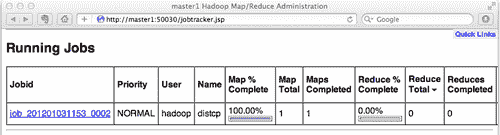
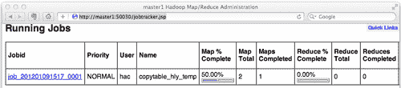
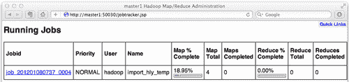
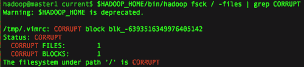
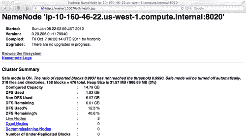
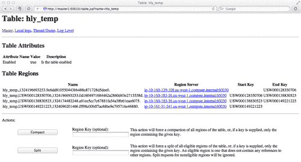

# 四、备份和恢复 HBase 数据

在本章中，我们将介绍：

*   使用 `distcp`进行完全关闭备份
*   使用 `CopyTable`将数据从一个表复制到另一个表
*   导出 HBase 表以转储 HDFS 上的文件
*   通过从 HDFS 导入转储文件恢复 HBase 数据
*   备份 NameNode 元数据
*   正在备份区域起始键
*   群集复制

# 简介

如果您正在考虑在生产中使用 HBase，您可能希望了解 HBase 的备份选项和做法。 挑战在于您需要备份的数据集可能很大，因此备份解决方案必须高效。 预计它将能够扩展到数百 TB 的存储容量，并在合理的时间框架内完成数据恢复。

备份 HBase 有两种策略：

*   通过完全关闭群集来备份它
*   在实时群集上备份它

完全关闭备份必须首先停止 HBase(或禁用所有表)，然后使用 Hadoop 的 `distcp`命令将 HBase 目录的内容复制到同一 HDFS 上的另一个目录，或复制到不同的 HDFS。 要从完全关闭的备份恢复，只需使用 `distcp`将备份的文件复制回 HBase 目录。

实时群集备份有几种方法：

*   使用 `CopyTable`实用程序将数据从一个表复制到另一个表
*   将 HBase 表导出到 HDFS 文件，然后将文件导入回 HBase
*   HBase 群集复制

`CopyTable`实用程序可用于将数据从一个表复制到同一集群上的另一个表，或复制到不同的集群。 `Export`实用程序将表的数据转储到同一集群上的 HDFS。 作为一组 `Export`， `Import`实用程序用于恢复转储文件的数据。

上述每种方法都有其优缺点。 完全关闭备份的好处是在备份过程中没有机会将数据写入群集，因此可以确保备份状态一致。 不利的一面是显而易见的--集群已经停机。 至于实时群集备份方法，由于群集已启动，因此在备份过程中可能会丢失编辑。 此外，由于 HBase 编辑仅在行级别是原子的，如果您的表相互依赖，则在执行 `Export`或 `CopyTable`的同时修改表可能会导致备份不一致。 当前 Apache 版本不支持创建 HBase 表的快照。

HBase 支持集群复制。 这是在不同的 HBase 部署之间复制数据的一种方式。 可以将群集复制视为 HBase 级别的灾难恢复解决方案。

除了表之外，您可能还需要备份 HDFS 元数据和 HBase 区域起始键。 HDFS 元数据包含 HDFS 的文件系统映像和提交日志。 元数据损坏可能会损坏整个 HDFS 元数据；建议经常备份元数据。 区域起始键代表 HBase 中的数据分布。 备份区域起始键不仅可以恢复数据，还可以恢复数据分布。 如果我们提前拆分表，使用分布均匀的区域起始键，使用 `CopyTable/Import`实用程序恢复数据的速度可以显著提高。

在本章中，我们将介绍如何使用上述方法备份 HBase 数据，它们的优缺点，以及根据您的数据集大小、资源和要求选择哪种方法。

# 使用 Distcp 进行完全关闭备份

`distcp`(**Distributed Copy**)是 Hadoop 提供的一个工具，用于在相同或不同的 HDFS 群集上复制大型数据集。 它使用 MapReduce 并行复制文件、处理错误和恢复，并报告作业状态。

由于 HBase 将其所有文件(包括 HDFS 上的系统文件)都存储在 HDFS 上，因此我们可以简单地使用 `distcp`将 HBase 目录复制到同一 HDFS 上的另一个目录，或者复制到不同的 HDFS，以备份源 HBase 集群。

请注意，这是一个完全关闭的备份解决方案。 `distcp`工具之所以有效，是因为 HBase 集群已关闭(或所有表都被禁用)，并且在此过程中没有对文件进行编辑。 不要在活动的 HBase 群集上使用*而不是*。 因此，此解决方案适用于能够容忍其 HBase 群集定期完全关闭的环境。 例如，用于后端批处理但不服务于前端请求的集群。

我们将介绍如何使用 `distcp`将完全关闭的 HBase 集群备份到不同的 HDFS 集群。 在不同群集上进行备份可用作灾难恢复解决方案，并有助于提高数据可用性。 在生产中，建议将完全关闭的 HBase 集群备份到不同的 HDFS 集群。

在本章后面部分，我们还将演示如何从备份中还原数据。

## 做好准备

如果要使用 `distcp`将 HBase 数据备份到另一个群集，则需要一个辅助群集。 您还可以将 HBase 数据备份到与源 HBase 群集相同的群集。 对于这种情况，不需要另一个群集。

在本食谱中，我们将使用不同的群集进行备份。 备份群集在不同的 EC2 实例上运行。 我们假设备份集群上运行的 HDFS 为 `hdfs://l-master1:8020; l-master1`，表示该集群运行在 EC2 大型实例上。 这是因为我们稍后将使用该集群进行性能调优，而小实例规格对于该用途来说太低了。

分别在源群集和备份群集上启动 HDFS。

`distcp`工具使用 MapReduce 并行复制文件，因此您还需要在源群集上启动 MapReduce。 可以使用以下命令从 JobTracker 节点启动 MapReduce：

```scala
hadoop@master1$ $HADOOP_HOME/bin/start-mapred.sh

```

我们将备份备份集群上 `/backup`目录下的 HBase 目录。 使用以下命令从备份群集的 Hadoop 客户端(l-client1)提前创建此目录：

```scala
hadoop@l-client1$ $HADOOP_HOME/bin/hadoop fs -mkdir /backup

```

## 怎么做……

按照以下说明使用 `distcp:`备份/恢复 HBase 数据

1.  关闭源和备份 HBase 群集(如果它们正在运行)：

    ```scala
    hadoop@master1$ $HBASE_HOME/bin/stop-hbase.sh

    ```

2.  通过检查 HMaster 守护程序是否已启动，确保已在源群集上关闭 HBase：

    ```scala
    hadoop@master1$ $JAVA_HOME/bin/jps
    1567 JobTracker
    1416 NameNode
    1705 Jps
    1690 QuorumPeerMain

    ```

    *   确保输出中没有列出 HMaster 守护程序。
3.  Also, make sure `mapred.map.tasks.speculative.execution` is not set to `final` and `true` on the client of the source cluster.

    此属性在`$HADOOP_HOME/conf`目录下的 MapReduce 配置文件(`mapred-site.xml`)中设置。 如果设置为`final`和`true`，请删除该设置。 这是一个客户端更改；它只会影响从该客户端提交的 MapReduce 作业。

4.  使用 `distcp`将 HBase 根目录从源群集复制到备份群集。 HBase 根目录由 HBase 配置文件(`hbase-site.xml`)中的 `hbase.rootdir`属性设置。 我们假设它是 `hdfs://master1:8020/hbase`，在这个配方中：

    ```scala
    hadoop@client1$ $HADOOP_HOME/bin/hadoop distcp hdfs://master1:8020/hbase hdfs://l-master1:8020/backup
    12/01/03 12:27:53 INFO tools.DistCp: srcPaths=[hdfs://master1:8020/hbase]
    12/01/03 12:27:53 INFO tools.DistCp: destPath=hdfs://l-master1:8020/backup
    12/01/03 12:27:54 INFO tools.DistCp: sourcePathsCount=76
    12/01/03 12:27:54 INFO tools.DistCp: filesToCopyCount=34
    12/01/03 12:27:54 INFO tools.DistCp: bytesToCopyCount=102.0m
    12/01/03 12:27:55 INFO mapred.JobClient: Running job: job_201201031153_0002
    12/01/03 12:27:56 INFO mapred.JobClient: map 0% reduce 0%
    ...

    ```

您将从 JobTracker 的管理页面中找到源群集的正在运行的 MapReduce 作业：



在 `distcp`作业完成后，您应该能够在备份群集上的 `/backup`目录下找到复制的 HBase 目录：

```scala
hadoop@l-client1$ $HADOOP_HOME/bin/hadoop fs -lsr /backup/hbase
drwxr-xr-x - hadoop hadoop 0 2012-01-03 12:28 /backup/hbase/-ROOT-
...

```

从上次备份恢复数据的步骤如下：

1.  使用以下命令在备份群集上启动 MapReduce：

    ```scala
    hadoop@l-master1$ $HADOOP_HOME/bin/start-mapred.sh

    ```

2.  确保备份群集客户端上的 `mapred.map.tasks.speculative.execution`未设置为 `final`和 `true`。
3.  确保 HBase 未在源群集和备份群集上运行。 如果 HBase 正在运行，请先停止它：

    ```scala
    hadoop@l-master1$ $HBASE_HOME/bin/stop-hbase.sh

    ```

4.  确保源群集上的 `hbase.rootdir`目录下没有文件。 如果存在文件，请将它们移动到另一个路径：

    ```scala
    hadoop@client1$ $HADOOP_HOME/bin/hadoop fs -mv /hbase /tmp

    ```

    *   如果您确定不需要这些文件，则可以将其删除。
5.  将 HBase 目录从备份群集复制到源群集：

    ```scala
    hadoop@l-client1$ $HADOOP_HOME/bin/hadoop distcp hdfs: //l-master1:8020/backup/hbase hdfs://master1:8020/

    ```

6.  在源群集上启动 HBase；您应该能够通过 HBase Shell 访问恢复的数据：

```scala
hadoop@master1$ $HBASE_HOME/bin/start-hbase.sh

```

## 它是如何工作的.

正如我们提到的， `distcp`是一个完全关闭的备份选项；因此，我们在步骤 1 中停止 HBase，并在步骤 2 中确认停止。 `jps`是 Java SDK 附带的一个方便的命令。 它显示被执行用户拥有的所有 Java 进程。 在我们的例子中，因为所有与 HBase 相关的守护进程都是由 `hadoop`用户启动的，所以我们可以使用 `jps`命令来查看 HBase 的主守护进程(HMaster)是否正在运行。

`distcp`使用 MapReduce 并行复制文件。 如果属性 `mapred.map.tasks.speculative.execution`设置为 `true`，则可以并行执行某些映射任务的多个实例，以执行相同的任务。 这是每个作业的客户端属性。 `distcp`会将其 MapReduce 作业的此属性设置为 `false`，因为 HDFS 不会处理同一文件的多个编写器。 但最终属性不能在单个 MapReduce 作业中更改。 如果将 `mapred.map.tasks.speculative.execution`设置为 `final`和 `true`，则复制结果未定义。 在步骤 3 中，我们删除最后一个设置，以使 `distcp`能够在其 MapReduce 作业中配置此属性。

我们只需要复制 `hbase.rootdir`目录。 在步骤 4 中，我们执行 `distcp`将其从源群集复制到备份群集。参数包括源目录的完整路径(包括其 HDFS 架构)以及备份群集上目标目录的 HDFS 架构和路径。 正如您从其输出中看到的那样， `distcp`启动了一个 MapReduce 作业来并行复制数据。

由 `distcp`启动的 MapReduce 作业仅在其映射阶段复制数据。 贴图的最大数量由 `-m`选项指定。 请注意，这只是对 MapReduce 作业的一个提示；更多的映射不一定会增加同步副本的数量或总体吞吐量。

为了从备份恢复，我们将数据从备份群集复制回源群集，然后在源群集上启动 HBase。

有关 `distcp`选项的完整列表，请键入以下命令：

```scala
$HADOOP_HOME/bin/hadoop distcp

```

# 使用 CopyTable 将数据从一个表复制到另一个表

`CopyTable`是一个实用程序，用于将一个表的数据复制到同一集群或不同 HBase 集群上的另一个表。 您可以复制到同一群集中的表；但是，如果您有另一个要作为备份的群集，则可能需要使用 `CopyTable`作为实时备份选项，将表的数据复制到备份群集。

`CopyTable`可配置开始和结束时间戳。 如果指定，则只复制特定时间范围内带有时间戳的数据。 此功能使得在某些情况下可以增量备份 HBase 表。

### 备注

“增量备份”是一种只备份上次备份期间更改的数据的方法。

### 提示

注意：由于群集持续运行，因此在复制过程中可能会丢失编辑。

在本食谱中，我们将介绍如何使用 `CopyTable`将一个表的数据复制到不同 HBase 集群上的另一个表中。 我们将演示将数据从 `hly_temp`表复制到 `hly_temp2`表；我们将只复制列族 `n`中的数据。

## 做好准备

在客户机节点上，您需要将 HBase 配置文件(`hbase-site.xml`)添加到 Hadoop 的类路径，以便 MapReduce 作业可以访问 HBase 集群。 您可以通过链接 Hadoop 配置目录下的 `hbase-site.xml`来完成此操作，如下所示：

```scala
hadoop@client1$ ln -s $HBASE_HOME/conf/hbase-site.xml $HADOOP_HOME/conf/hbase-site.xml

```

另外，通过编辑 `hadoop-env.sh:`，将 HBase 依赖 JAR 添加到 Hadoop 的类路径中

```scala
hadoop@client1$ vi $HADOOP_HOME/conf/hadoop-env.sh

```

```scala
export HADOOP_CLASSPATH= /usr/local/zookeeper/current/zookeeper-3.4.3.jar

```

### 备注

上述步骤是在 HBase 上运行 MapReduce 的最低要求。 由于这是一个常见的过程，我们将在这本书中跳过它的细节。

在源群集和备份群集上启动 HBase。 如果没有另一个群集，还可以将一个表复制到本地群集上的另一个表。 但是，不建议将其用于生产中的备份目的。 我们假设备份集群的 ZooKeeper 仲裁为 `l-master1:2181`，HBase 根目录为 `/hbase`。

`CopyTable`使用 MapReduce 并行复制数据；您需要使用以下命令在源群集上启动 MapReduce：

```scala
hadoop@master1$ $HADOOP_HOME/bin/start-mapred.sh

```

## 怎么做……

以下是将列族 `n`中的数据从 `hly_temp`表复制到备份群集上的 `hly_temp2`表的说明：

1.  通过 HBase Shell 连接到备份 HBase 群集，如果目标表不存在，则创建目标表：

    ```scala
    hbase> create 'hly_temp2', {NAME => 'n'}

    ```

2.  Run the following command from your client node of the source cluster to copy data from the `hly_temp` table to `hly_temp2` on the backup cluster:

    ```scala
    hac@client1$ $HADOOP_HOME/bin/hadoop jar $HBASE_HOME/hbase-0.92.1.jar copytable --families=n --peer.adr=l-master1:2181:/hbase --new.name=hly_temp2 hly_temp
    2/01/09 15:24:34 INFO zookeeper.ZooKeeper: Initiating client connection, connectString=l-master1:2181 sessionTimeout=10000 watcher=hconnection
    12/01/09 15:24:34 INFO zookeeper.ClientCnxn: Opening socket connection to server l-master1/10.170.114.96:2181
    12/01/09 15:24:34 INFO zookeeper.ClientCnxn: Socket connection established to l-master1/10.170.114.96:2181, initiating session
    12/01/09 15:24:34 INFO zookeeper.ClientCnxn: Session establishment complete on server l-master1/10.170.114.96:2181, sessionid = 0x134c11bb47c000a, negotiated timeout = 10000
    12/01/09 15:24:34 INFO mapreduce.TableOutputFormat: Created table instance for hly_temp2
    12/01/09 15:24:34 INFO zookeeper.ZooKeeper: Initiating client connection, connectString=master1:2181 sessionTimeout=10000 watcher=hconnection
    12/01/09 15:24:34 INFO zookeeper.ClientCnxn: Opening socket connection to server master1/10.166.105.212:2181
    12/01/09 15:24:34 INFO zookeeper.ClientCnxn: Socket connection established to master1/10.166.105.212:2181, initiating session
    12/01/09 15:24:34 INFO zookeeper.ClientCnxn: Session establishment complete on server master1/10.166.105.212:2181, sessionid = 0x134c11d62a20019, negotiated timeout = 10000
    12/01/09 15:24:34 INFO mapred.JobClient: Running job: job_201201091517_0001
    12/01/09 15:24:35 INFO mapred.JobClient: map 0% reduce 0%
    12/01/09 15:25:49 INFO mapred.JobClient: map 50% reduce 0%
    ...

    ```

    *   您将从 JobTracker 的管理页面中找到源群集的正在运行的 MapReduce 作业：

    

3.  您应该能够通过 HBase Shell：

    ```scala
    hbase> scan 'hly_temp2', { LIMIT => 1 }
    ROW COLUMN+CELL
    AQW000617050101 column=n:v01, timestamp=1323026325955, value=808C
    AQW000617050101 column=n:v02, timestamp=1323026325955, value=806C
    AQW000617050101 column=n:v03, timestamp=1323026325955, value=803C
    hbase> count 'hly_temp2'
    95630 row(s) in 22.4740 seconds

    ```

    访问备份群集上 `hly_temp2`中的数据
4.  键入以下命令以仅复制具有特定时间戳范围的数据：

    ```scala
    hac@client1$ $HADOOP_HOME/bin/hadoop jar $HBASE_HOME/hbase-0.92.1.jar copytable --families=n --peer.adr=l-master1:2181:/hbase --new.name=hly_temp2 --starttime=1324173586754 --endtime=1324189940000 hly_temp

    ```

## 它是如何工作的.

在步骤 1 中，我们使用要复制的列 MARY(N)在备份集群上创建目标表(`hly_temp2`)。

在步骤 2 中，我们将 FAMILY `n`列中的数据从 `hly_temp`表复制到备份群集上的 `hly_temp2`表。 备份集群由 `--peer.adr`选项指定，方法是指定 ZooKeeper 仲裁地址，格式为 `hbase.zookeeper.quorum:hbase.zookeeper.client.port:zookeeper.znode.parent`，如 `server,server2,server3:2181:/hbase`。

`--families`选项用于指定要复制的族的逗号分隔列表。 目标表由 `--new.name`选项指定；如果两个表具有相同的名称，则跳过此选项。

正如您从输出中看到的，数据是在 MapReduce 作业中复制的。 `hadoop jar`命令用于在 MapReduce 中运行 JAR 文件。 MapReduce 作业扫描源表，读取属于目标系列的数据条目，然后使用其普通客户端 API 将它们写入备份群集上的目标表。

从步骤 3 的输出中，您将发现列族 `n`中的 `hly_temp`表的数据(包括每个条目的时间戳)已被复制到备份集群上的 `hly_temp2`表中。 HBase 使用时间戳对编辑进行排序；时间戳较大的编辑具有较新的单元格版本。 默认情况下，时间戳由 HBase 使用长值自动设置，该值表示当前时间和午夜(1970 年 1 月 1 日 UTC)之间的毫秒差。

在步骤 4 中，我们将时间戳范围参数添加到 `CopyTable`命令中。在复制作业的扫描阶段，将跳过特定时间范围之外的数据。 由 `--starttime`选项指定的最小时间戳值包含在内。 由 `--endtime`选项指定的最大时间戳值是独占的。

步骤 2 可用于完全备份，而步骤 3 在某些情况下可用于增量备份。 使用具有特定时间戳范围的 `CopyTable`与增量备份不同。 这是因为，在将数据放入 HBase 时，时间戳可以由客户端显式指定，并且不能保证新插入的数据具有更大的时间戳。 另一个原因是 `CopyTable`不会处理删除。 没有办法知道数据是否被删除。 我们建议您在应用级别实施自己的增量备份解决方案。

有关 `CopyTable`用法的完整说明，请键入以下命令：

```scala
$HADOOP_HOME/bin/hadoop jar $HBASE_HOME/hbase-0.92.1.jar copytable

```

# 导出 HBase 表以转储 HDFS 上的文件

HBase `export`实用程序将表的内容转储到同一个 HDFS 集群。 转储文件采用 Hadoop 序列文件格式。 将数据导出到 Hadoop 序列文件对于数据备份有好处，因为 Hadoop 序列文件格式支持多种压缩类型和算法。 有了它，我们可以选择最适合我们环境的压缩选项。

与我们在前面的菜谱中提到的 `copytable`实用程序一样， `export`可配置为具有开始和结束时间戳，因此只有特定时间范围内的数据才会被转储。 此功能使 `export`能够增量地将 HBase 表导出到 HDFS。

HBase `export`也是一个实时备份选项。 由于群集正在运行，因此在导出过程中可能会丢失编辑。 在本食谱中，我们将介绍如何使用 `export`实用程序将表导出到同一集群上的 HDFS。 我们将在下一个配方中介绍 `import`实用程序，该实用程序用于从 `export`转储恢复数据。

## 做好准备

首先，启动 HDFS 和 HBase 集群。

我们将把 `hly_temp`表导出到 HDFS 群集上的 `/backup/hly_temp`。 您需要预先创建一个 `/backup`目录。

`export`实用程序使用 MapReduce 导出数据。 将 HBase 的可配置文件(`hbase-site.xml`)和依赖项 JAR 文件添加到您的客户端节点上 Hadoop 的类路径中。

## 怎么做……

按照以下说明使用 `export`实用程序将 HBase 表导出到 HDFS：

1.  Run the following command from your client node to export all the data in the `hly_temp` table:

    ```scala
    hadoop@client1$ $HADOOP_HOME/bin/hadoop jar $HBASE_HOME/hbase-0.92.1.jar export -D mapred.output.compress=true -D mapred.output.compression.codec=org.apache.hadoop.io.compress.BZip2Codec -D mapred.output.compression.type=BLOCK hly_temp /backup/hly_temp 2147483647
    12/01/08 07:39:35 INFO mapreduce.Export: verisons=2147483647, starttime=0, endtime=9223372036854775807
    ...
    12/01/08 07:39:37 INFO zookeeper.ClientCnxn: Session establishment complete on server master1/10.160.229.77:2181, sessionid = 0x134ba4a09070013, negotiated timeout = 10000
    12/01/08 07:39:38 INFO mapred.JobClient: Running job: job_201201080737_0001
    12/01/08 07:39:39 INFO mapred.JobClient: map 0% reduce 0%
    12/01/08 07:42:56 INFO mapred.JobClient: map 25% reduce 0%

    ```

    *   您将从 JobTracker 的管理页面中找到导出 MapReduce 作业：

    

    *   MapReduce 作业完成后，您将在 HDFS 上的`/backup/hly_temp`目录下找到生成的转储文件(`part-m-000x`)：

    

2.  执行以下命令，仅导出具有特定时间戳范围的数据：

```scala
hadoop@client1$ $HADOOP_HOME/bin/hadoop jar $HBASE_HOME/hbase-0.92.1.jar export -D mapred.output.compress=true -D mapred.output.compression.codec=org.apache.hadoop.io.compress.BZip2Codec -D mapred.output.compression.type=BLOCK hly_temp /backup/hly_temp_2 2147483647 1324601918502 1324693970000

```

## 它是如何工作的.

运行带有 `export`参数的 HBase JAR 文件将执行 `export`实用程序来转储 HBase 表的内容。 在步骤 1 中，我们将 `hly_temp`表转储到 HDFS 上的 `/backup/hly_temp`目录。 最后一个参数指定要导出的数据的最高版本。 HBase 支持在一个单元中存储多个版本的数据。 单元格可以存储的最大版本由其列族的 `VERSIONS`属性确定，该属性是在创建表时指定的。 要转储具有多版本列族的表，我们必须将要导出的最高版本传递给 `export`命令，否则将只导出最新版本。 在我们的示例中，我们只指定 `Integer.MAX_VALUE (2147483647)`来导出所有版本的数据。

许多 `-D`属性已传递给 `export`命令。 这些被设置为控制其运行时属性的导出 MapReduce 作业。 将 `mapred.output.compress`属性设置为 `true`以使 MapReduce 压缩其输出(序列文件)。 `mapred.output.compression.codec`属性控制用于导出的压缩算法。 我们将其设置为使用压缩比最高的 BZip2 编解码器。

在撰写本书时，这些是 Hadoop 广泛使用的编解码器。 选择哪种编解码器取决于您的需求；所有这些编解码器都有空间/时间权衡：

<colgroup><col style="text-align: left"> <col style="text-align: left"> <col style="text-align: left"> <col style="text-align: left"></colgroup> 
| 

压缩格式

 | 

Hadoop 压缩编解码器

 | 

压缩比 / 压缩率

 | 

(解)压缩速度

 |
| --- | --- | --- | --- |
| gzip | `org.apache.hadoop.io.compress.GzipCodec` | 中等的 / 中号的 / 适中的 / 半生熟的 | 中等的 / 中号的 / 适中的 / 半生熟的 |
| BZip2 | `org.apache.hadoop.io.compress.BZip2Codec` | 高的 / 大的 / 高级的 / 高音调的 | 低速的 / 慢的 / 迟钝的 / 不曲折的 |
| LZO | `com.hadoop.compression.lzo.LzoCodec` | 洛 （人名） | 快速的 / 牢实的 / 感光快的 / 紧的 |

由于许可问题，LZO 不包含在 Hadoop 包中；请参阅[章](08.html "Chapter 8. Basic Performance Tuning")，*基本性能调优中的*使用压缩*配方来安装 LZO。*

`mapred.output.compression.type`属性用于指定 Hadoop 序列文件的压缩类型。可用值为 `NONE, RECORD`和 `BLOCK`。 对于大多数情况，您应该选择 `BLOCK`，因为它将记录序列压缩在块中，这是最有效的压缩方式。

正如您从输出中看到的，数据是通过 MapReduce 导出的。 这是通过 `hadoop jar`命令完成的，该命令在 MapReduce 中运行一个 JAR 文件。 MapReduce 作业扫描该表，读取所有数据条目，然后将它们写入同一 HDFS 群集上输出路径下的 Hadoop 序列文件。

我们已在步骤 2 中向 `export`命令添加了时间戳范围参数。在导出作业的扫描阶段将跳过特定时间范围之外的数据。 最小时间戳值(`1324601918502`)是包含的，而最大时间戳值(`1324693970000`)是排除的。

就像我们在前面的食谱中提到的 `CopyTable`实用程序一样，步骤 1(没有特定的开始/结束时间)可用于完全备份，而步骤 2(具有特定的开始/结束时间)在某些情况下用于增量备份。

## 还有更多...

在将数据导出到同一群集上的 HDFS 时，如果 HDFS 崩溃，则备份可能不可用。 我们建议您使用 Hadoop `distcp`工具将导出的文件复制到不同的 HDFS 群集。 如果您的数据量不是很大，一个更好的选择是将转储的文件复制到磁带上，以便进行脱机备份。

## 另请参阅

*   *在本章中，通过从 HDFS*配方导入转储文件来恢复 HBase 数据
*   *使用压缩*配方，在[第 8 章](08.html "Chapter 8. Basic Performance Tuning")，*基本性能调整*

# 通过从 HDFS 导入转储文件恢复 HBase 数据

HBase `Import`实用程序用于将 `Export`实用程序导出的数据加载到现有 HBase 表中。 这是从 `Export`实用程序备份解决方案还原数据的过程。

我们将在本食谱中查看 `Import`实用程序的用法。

## 做好准备

首先，启动 HDFS 和 HBase 集群。

我们将把在上一个配方中导出的文件导入到我们的 `hly_temp`表中。 如果您没有这些转储文件，请参考*Exporting HBase 表在 HDFS*配方上转储文件，以便提前生成转储文件。 我们假设转储文件保存在 `/backup/hly_temp`目录中。

`Import`实用程序使用 MapReduce 导入数据。 将 HBase 可配置文件(`hbase-site.xml`)和依赖项 JAR 文件添加到客户端节点上的 Hadoop 类路径。

## 怎么做……

要将转储文件导入 `hly_temp`表，请执行以下操作：

1.  通过 HBase Shell 连接到您的 HBase 群集，如果目标表不存在，则创建目标表：

    ```scala
    hbase> create 'hly_temp', {NAME => 'n'} 

    ```

2.  Run the following command from your client node to import data into the `hly_temp` table:

    ```scala
    hadoop@client1$ $HADOOP_HOME/bin/hadoop jar $HBASE_HOME/hbase-0.92.1.jar import hly_temp /backup/hly_temp
    12/01/08 08:52:42 INFO mapreduce.TableOutputFormat: Created table instance for hly_temp
    12/01/08 08:52:42 INFO input.FileInputFormat: Total input paths to process : 4
    12/01/08 08:52:42 INFO mapred.JobClient: Running job: job_201201080737_0004
    12/01/08 08:52:43 INFO mapred.JobClient: map 0% reduce 0%
    12/01/08 08:53:09 INFO mapred.JobClient: map 1% reduce 0%
    ...

    ```

    *   您将从 JobTracker 的管理页面找到导入 MapReduce 作业：

    

3.  在 MapReduce 作业完成后，您应该能够通过 HBase Shell 访问 `hly_temp`表中的数据：

    ```scala
    hbase> scan 'hly_temp', {LIMIT => 1}
    ROW COLUMN+CELL
    AQW000617050101 column=n:v01, timestamp=1323026325955, value=808C
    AQW000617050101 column=n:v02, timestamp=1323026325955, value=806C
    AQW000617050101 column=n:v03, timestamp=1323026325955, value=803C
    ...

    ```

## 它是如何工作的.

我们在步骤 1 中创建了目标表。该表必须具有转储文件中存在的所有列族；否则，导入作业将失败，并显示 `NoSuchColumnFamilyException`错误消息。

从步骤 2 的输出中可以看到，数据是通过 MapReduce 导入的。 这是通过 `hadoop jar`命令完成的，该命令执行打包在 JAR 文件中的 MapReduce 代码。 导入 MapReduce 作业从输入目录(`/backup/hly_temp`)下的转储文件读取数据条目，然后使用 HBase 的客户端 API 将它们写入目标表(`hly_temp`)。

转储文件中的数据(包括每个条目的时间戳)将由 `Import`实用程序恢复。 在此之后，我们建议您对表进行重大压缩并手动执行集群平衡，以使集群以最佳状态运行。 这可以通过 HBase Shell 使用以下命令来完成：

```scala
hbase> major_compact 'hly_temp'
hbase> balancer

```

## 还有更多...

如果要将数据导入到新创建的表中，您可能会发现导入速度没有预期的那么快。 这是因为表格只从一个区域开始，所有编辑都将转到该区域。 这使得托管区域服务器忙于处理这些请求。 同时，其他地域的服务器都是空载的。 群集保持在这种不平衡状态下运行，直到第一个区域中的数据达到阈值，并且该区域被分成两个区域。 新表格需要很长时间才能通过这种自动区域拆分实现良好的平衡。

解决方案是在创建表时预先创建足够的区域。 需要使用适当的边界创建区域，以便可以将编辑内容很好地分发到所有这些预先创建的区域。 为了确定正确的边界，您可能还需要备份区域起始键，这也可用于恢复 HBase 表的区域分布。

从 HBase 0.94 开始， `Import`实用程序可以生成用于批量加载的 HBase 内部文件(HFiles)。 使用此功能，我们能够在更短的时间内恢复转储文件。 有关详细信息(`https://issues.apache.org/jira/browse/HBASE-5440`)，请参阅*HBase-5440*。

## 另请参阅

在本章中：

*   *导出 HBase 表以转储 HDFS*上的文件
*   *正在备份区域起始键*

在[第 9 章](09.html "Chapter 9. Advanced Configurations and Tuning")中，*高级配置和调整：*

*   *使用您自己的算法预先创建区域*

在[第 3 章](03.html "Chapter 3. Using Administration Tools")中，*使用管理工具：*

*   *使用 HBase Shell 管理群集*

# 备份 NameNode 元数据

由于 HBase 在 HDFS 中运行，因此除了照顾 HBase 集群之外，保持 HDFS 在健康状态下运行也很重要。 NameNode 是 HDFS 集群中最重要的组件。 NameNode 崩溃会导致整个 HDFS 群集无法访问。 HDFS 集群的元数据(包括文件系统映像和编辑日志)由 NameNode 管理。

我们需要在两种情况下保护 NameNode 元数据：

*   崩溃时丢失的元数据
*   元数据因任何原因损坏

对于第一种情况，我们可以设置 NameNode 将其元数据与 NFS 挂载一起写入其本地磁盘。 正如*设置多个高可用性(HA)主节点*配方中所述，在[第 1 章](01.html "Chapter 1. Setting Up HBase Cluster")，*设置 HBase 集群*中，我们甚至可以设置多个 NameNode 节点来实现高可用性。

对于第二种情况，我们的解决方案是频繁备份元数据，以便在元数据损坏时恢复 NameNode 状态。

在本指南中，我们将介绍如何备份和恢复 NameNode 元数据。

## 做好准备

启动 HDFS 并登录到客户端节点。 我们假设 NameNode 正在使用默认的 Web UI 端口 `50070`在 `master1`服务器上运行。 确保为您的客户端节点打开端口。

`dfs.name.dir`属性指定 NameNode 元数据的保存位置。 Grep HDFS 配置文件(`hdfs-site.xml`)以找出执行恢复任务所需的此属性的值。 在演示中，我们假设该值为 `/usr/local/hadoop/var/dfs/name`。

我们将备份保存在客户端节点上的 `/backup/namenode`下，并使用 NameNode 服务器上的 `/restore/namenode`作为恢复的工作目录。 创建这些目录，并确保运行备份任务的用户对它们具有写入权限。

## 怎么做……

要备份 NameNode 元数据，请执行以下操作：

1.  设置环境变量：

    ```scala
    hadoop@client1$ export BACKUP_DIR=/backup/namenode

    ```

2.  从 NameNode Web 用户界面获取 HDFS 的文件系统映像：

    ```scala
    hadoop@client1$ curl http://master1:50070/getimage?getimage=1 > $BACKUP_DIR/fsimage

    ```

3.  从 NameNode Web 用户界面获取 HDFS 的编辑日志：

    ```scala
    hadoop@client1$ curl http://master1:50070/getimage?getedit=1 > $BACKUP_DIR/edits

    ```

4.  使用以下命令为获取的元数据创建 tarball：

    ```scala
    hadoop@client1$ tar cfvj $BACKUP_DIR/metadata.`date +%Y%m%d`.tar.bz2 -C $BACKUP_DIR fsimage edits

    ```

为了从元数据备份恢复 NameNode 状态：

1.  如果 NameNode 守护程序正在您的 NameNode 服务器上运行，请停止它：

    ```scala
    hadoop@master1$ $HADOOP_HOME/bin/hadoop-daemon.sh stop namenode

    ```

    *   如果前面的命令由于某种原因不起作用，只需终止 NameNode 的 Java 进程即可。
2.  将元数据从备份复制到 NameNode 服务器上的 `dfs.name.dir`目录：

    ```scala
    hadoop@master1$ cd /usr/local/hadoop/var/dfs/name/current
    hadoop@master1$ tar cfvj /restore/namenode/metadata-org.tar.bz2 fsimage edits
    hadoop@master1$ scp client1:/backup/namenode/metadata.`date +%Y%m%d`.tar.bz2 ./
    hadoop@master1$ tar xfvj metadata.`date +%Y%m%d`.tar.bz2
    hadoop@master1$ rm metadata.`date +%Y%m%d`.tar.bz2

    ```

3.  再次启动 NameNode 后台进程：

    ```scala
    hadoop@master1$ $HADOOP_HOME/bin/hadoop-daemon.sh start namenode

    ```

4.  Run `hadoop fsck` to check inconsistencies after the NameNode server has been restarted:

    ```scala
    hadoop@master1$ $HADOOP_HOME/bin/hadoop fsck / -files | grep CORRUPT

    ```

    

    *   如果许多文件已损坏(如您在 Web 用户界面中看到的那样)，NameNode 可能会继续处于安全模式，直到您显式将其关闭：

    

5.  Turn off safe mode by explicitly using the following command:

    ```scala
    hadoop@master1$ $HADOOP_HOME/bin/hadoop dfsadmin -safemode leave
    Safe mode is OFF

    ```

    *   Web 用户界面不会声明安全模式已关闭；相反，它可能会在页面上显示一条警告消息：

    

6.  运行 `hadoop fsck -move`将损坏的文件(如果有)移动到 `/lost+found:`

    ```scala
    hadoop@master1$ $HADOOP_HOME/bin/hadoop fsck / -move
    The filesystem under path '/' is CORRUPT

    ```

7.  删除后再次运行 `hadoop fsck`以确认不存在不一致：

    ```scala
    hadoop@master1$ $HADOOP_HOME/bin/hadoop fsck /
    The filesystem under path '/' is HEALTHY

    ```

## 它是如何工作的.

NameNode 支持从其 Web 用户界面获取其文件系统映像和编辑日志。 从第 1 步到第 4 步，我们使用此功能将 NameNode 元数据提取到客户机节点上的本地磁盘，然后将提取的元数据压缩为一个文件作为备份。

为了从备份中恢复元数据，我们首先在步骤 5 中停止 NameNode 守护进程，然后在步骤 6 中，将原始元数据移动到我们的工作目录中，以防您出于任何原因想要取消恢复。 之后，我们将备份复制到存储 NameNode 元数据的 `$dfs.name.dir/current`目录，然后再次启动 NameNode 守护进程。

如果在我们的最新备份之后进行了编辑，我们恢复的元数据将与 DataNode 上的实际数据不匹配，在这种情况下，我们的 HDFS 将变得不一致。 我们在步骤 8 中运行 `hadoop fsck`命令来检查 HDFS 不一致。如果提供了路径和 `-files`选项， `fsck`将检查指定路径下的不一致，并打印它正在检查的文件。

如果检测到损坏的文件，我们需要删除它们以使 HDFS 保持一致。 如果许多文件已损坏，NameNode 将无法达到其将保持在安全模式下的报告块比率的阈值。 在删除损坏的文件之前，我们需要显式关闭 NameNode 安全模式。 这是通过步骤 9 中的 `hadoop dfsadmin`命令完成的。 `Dfsadmin`是用于管理任务的 HDFS 命令。 使用 `-safemode leave`选项运行它会显式关闭 NameNode 安全模式。

当安全模式关闭时，我们可以使用带有 `-move`选项的 `fsck`命令将损坏的文件移动到 `/lost+found`。 在此之后， `fsck`应该报告文件系统健康，您应该能够访问 HDFS。

## 还有更多...

从元数据备份恢复 NameNode 状态可能需要很长时间才能完成。 这是因为重新启动 NameNode 守护进程将首先从磁盘加载文件系统映像，然后重播编辑日志以重建最终的系统状态。 编辑日志可能很大，重放可能需要很长时间。

HDFS 有一个针对此问题的 Second DaryNameNode 组件。 请注意，Second daryNameNode 不是 NameNode 的备份守护进程。 它会定期(默认为 1 小时)将编辑日志压缩到检查点中，以便在重新启动 NameNode 后加载最新的检查点，并加载一个小得多的编辑日志，其中仅包含自检查点以来所做的编辑。 借助这种压缩功能，Second DaryNameNode 使 NameNode 元数据的备份和恢复更加高效。

默认情况下，Second daryNameNode 与 NameNode 在同一节点上运行。 为了提高可伸缩性和持久性，我们建议您在与 NameNode 服务器不同的服务器上运行它。 配置在 Hadoop 配置目录下的 `masters`文件中：

```scala
hadoop@master1$ vi $HADOOP_HOME/conf/masters

```

```scala
secondary_namenode_host

```

要在此文件中启动 Second daryNameNode，请添加所需的主机名，然后重新启动 HDFS 以应用更改。

# 备份区域起始键

除了 HBase 中的表之外，我们还应该备份每个表的区域起始键。 区域起始键决定表中的数据分布，因为区域由区域起始键拆分。 地域是 HBase 中负载均衡和指标采集的基本单位。

如果使用 `distcp`执行完全关机备份，则无需备份区域起始密钥，因为 `distcp`还会将区域边界复制到备份群集。

但对于实时备份选项，备份区域起始键与表数据一样重要，如果您的数据分布难以提前计算，或者您的区域是手动拆分的，则备份区域起始键尤其重要。 这一点很重要，因为实时备份选项(包括 `CopyTable`和 `Export`实用程序)使用普通的 HBase 客户端 API 来还原 MapReduce 作业中的数据。 如果我们在运行 Restore MapReduce 作业之前预先创建分割良好的区域，则可以显著提高恢复速度。

在本食谱中，我们将介绍如何备份 HBase 表的区域起始键。 我们将创建一个脚本来从 HBase 表中获取区域起始键。

## 做好准备

启动您的 HBase 集群，创建一个表，并在其中放入一些数据。 表中需要有几个区域，这样我们才能验证我们的脚本是否正常工作。 如果您的表只有一个区域，请从 HBase web UI 的表页手动将其拆分为几个区域。 我们将在此配方中使用 `hly_temp`表；其 Web 用户界面页面类似于以下屏幕截图中所示的网页：



我们将备份客户端节点上 `/backup/hly_temp`目录下的 `hly_temp`表的区域起始键。 创建此目录，并向将运行备份脚本的用户授予写入权限。

## 怎么做……

按照以下说明备份 `hly_temp`表的区域起始键：

1.  为 __T0 创建抯脚本文件：\\T1++
2.  在客户端节点上运行脚本：

    ```scala
    hac@client1 $HBASE_HOME/bin/hbase org.jruby.Main region-starting-keys.rb hly_temp /backup/hly_temp/regions

    ```

3.  脚本将创建一个包含区域起始键的文件(`/backup/hly_temp/regions`)。 该文件如下所示：

    ```scala
    hac@client1$ cat /backup/hly_temp/regions
    USW000128350706
    USW000138830523
    USW000149221223

    ```

## 它是如何工作的.

要获取 HBase 表的区域起始键，我们需要从脚本访问 HBase Java 客户端 API。 有几种基于 JVM 的脚本语言，比如 Jython、Scala 和 JRuby。 我们在步骤 1 中创建的脚本是用 JRuby 编写的。 我们之所以选择 JRuby，是因为 HBase Shell 是用 JRuby 编写的，不需要引入另一种语言及其依赖项。

在脚本中，我们创建了一个 `HTable`实例来访问我们的 `hly_temp`表。 `HTable`类用于与单个 HBase 表通信。 我们只将表名(`hly_temp`)传递给 `HTable`类的构造函数。 HBase 集群的 ZooKeeper 法定连接字符串被设置为默认值，这是通过使用 `hbase`命令从客户端上的 HBase 配置文件(`hbase-site.xml`)实现的。 如果成功创建了 `HTable`实例，则将建立与 ZooKeeper 仲裁的连接会话。 之后，我们可以通过 `HTable`实例与我们的 `hly_temp`表通信。

接下来，我们调用 `HTable`实例的 `getStartKeys()`方法，该方法返回表的区域起始键数组。 区域起始键是 HBase 中由字节数组表示的行键。

在脚本的下一步中，我们使用 `Bytes`类将键转换为字符串。 `Bytes`类是将其他对象从字节数组转换为字节数组或将其他对象转换为字节数组的实用程序类。 这个类很有用，因为所有键/值都以字节数组的形式存储在 HBase 中，而不考虑它们的原始数据类型。

在脚本的最后一步，我们将转换后的字符串写入输出文件，最后关闭到集群的连接。

在步骤 2 中，我们通过运行 `hbase`命令来执行脚本。 `hbase`命令用于在当前 HBase 上下文中运行 Java 类。 要运行 JRuby 脚本，我们将 JRuby 的 `org.jruby.Main—the`main 类传递给 `hbase`命令。 我们的脚本被传递给 `org.jruby.Main`类并在 HBase 上下文中运行。 表名和输出文件的路径也通过命令行传递给脚本。

正如您从步骤 3 的输出中看到的，我们写入输出文件的区域起始键与我们在表的管理网页上看到的相同。

## 另请参阅

*   *在[第 9 章](09.html "Chapter 9. Advanced Configurations and Tuning")，*高级配置和调整*中，使用您自己的算法*配方预先创建区域

# 群集复制

HBase 支持集群复制，这是在 HBase 集群之间复制数据的一种方式。 例如，它可以用作轻松地将编辑从实时前端集群传送到后端的批处理目的集群的一种方式。

HBase 复制的基本架构非常实用。 主群集捕获预写日志(WAL)，并将可复制的键/值(在支持复制的情况下对列族进行编辑)从日志放入复制队列。 然后，复制消息被发送到对等群集，然后使用其正常的 HBase 客户端 API 在该群集上重放。 主集群还会保留 ZooKeeper 中复制的 WAL 的当前位置，以进行故障恢复。

由于 HBase 复制是异步完成的，因此参与复制的群集在地理上可能相距遥远。 如果它们之间的连接离线一段时间，这不是问题，因为主群集会跟踪复制，并在连接再次在线后恢复它。 这意味着 HBase 复制可以作为 HBase 层的灾难恢复解决方案。

在本食谱中，我们将了解如何在两个集群之间启用表的复制。

## 做好准备

您需要两个 HBase 集群-一个是主集群，另一个是复制对等(从)集群。 这里，假设主机是 `master1:2181/hbase`，对等方是 `l-master1:2181/hbase`；这两个集群不需要具有相同的大小。

ZooKeeper 应该独立处理，而不是由 HBase 处理。 检查 `hbase-env.sh`文件中的 `HBASE_MANAGES_ZK`设置，并确保将其设置为 `false`。

所有机器，包括 ZooKeeper 集群和 HBase 集群，都需要能够访问其他机器。 确保两个群集具有相同的 HBase 和 Hadoop 主版本。 例如，主服务器上的 0.92.1 和对等机上的 0.92.0 是正确的，但 0.90 是不正确的。

## 怎么做……

按照以下说明在 HBase 群集之间复制数据：

1.  将以下代码添加到 HBase 的配置文件(`hbase-site.xml`)以启用主群集上的复制：

    ```scala
    hadoop@master1$ vi $HBASE_HOME/conf/hbase-site.xml
    <property>
    <name>hbase.replication</name>
    <value>true</value>
    </property>

    ```

2.  将更改同步到所有服务器，包括集群中的客户端节点，然后重新启动 HBase。
3.  连接到主群集上的 HBase Shell，并在要复制的表上启用复制：

    ```scala
    hac@client1$ $HBASE_HOME/bin/hbase shell
    hbase> create 'reptable1', { NAME => 'cf1', REPLICATION_SCOPE => 1}

    ```

    ```scala
    hbase> disable 'reptable1'
    hbase> alter 'reptable1', NAME => 'cf1', REPLICATION_SCOPE => '1'
    hbase> enable 'reptable1'

    ```

    *   如果您使用的是现有表，请更改它以支持复制：
4.  在对等(从)群集上也执行步骤 1 到 3。 这包括启用复制、重新启动 HBase 和创建表的相同副本。
5.  通过 HBase Shell 从主群集添加对等复制群集：

    ```scala
    hbase> add_peer '1', 'l-master1:2181:/hbase'

    ```

6.  通过运行以下命令在主群集上启动复制：

    ```scala
    hbase> start_replication

    ```

7.  向主群集中添加一些数据：

    ```scala
    hbase> put 'reptable1', 'row1', 'cf1:v1', 'foo'
    hbase> put 'reptable1', 'row1', 'cf1:v2', 'bar'
    hbase> put 'reptable1', 'row2', 'cf1:v1', 'foobar'

    ```

    *   您应该能够在短时间内看到数据出现在对等群集表中。
8.  连接到对等群集上的 HBase Shell 并对表进行扫描，以查看数据是否已复制：

    ```scala
    hac@l-client1$ $HBASE_HOME/bin/hbase shell
    hbase> scan ' reptable1'
    ROW COLUMN+CELL
    row1 column=cf1:v1, timestamp=1326095294209, value=foo
    row1 column=cf1:v2, timestamp=1326095300633, value=bar
    row2 column=cf1:v1, timestamp=1326095307619, value=foobar
    2 row(s) in 0.0280 seconds

    ```

9.  通过在主群集上调用 `verifyrep`命令来验证两个群集上的复制数据：

    ```scala
    hac@client1$ $HADOOP_HOME/bin/hadoop jar $HBASE_HOME/hbase-0.92.1.jar verifyrep 1 reptable1
    12/01/09 16:50:22 INFO replication.ReplicationZookeeper: Replication is now started
    ...
    12/01/09 16:50:24 INFO mapred.JobClient: Running job: job_201201091517_0005
    12/01/09 16:50:25 INFO mapred.JobClient: map 0% reduce 0%
    12/01/09 16:50:46 INFO mapred.JobClient: map 100% reduce 0%
    12/01/09 16:50:51 INFO mapred.JobClient: Job complete: job_201201091517_0005
    12/01/09 16:50:51 INFO mapred.JobClient: Counters: 19
    ...
    12/01/09 16:50:51 INFO mapred.JobClient: File Output Format Counters
    12/01/09 16:50:51 INFO mapred.JobClient: Bytes Written=0
    12/01/09 16:50:51 INFO mapred.JobClient: org.apache.hadoop.hbase.mapreduce.replication.VerifyReplication$Verifier$Counters
    12/01/09 16:50:51 INFO mapred.JobClient: GOODROWS=2
    ...

    ```

    *   我们跳过了 verifyrep 命令的一些输出，以使其更清晰。
10.  通过运行以下命令停止主群集上的复制：

    ```scala
    hbase> stop_replication

    ```

11.  使用以下命令从主群集中删除复制对等：

    ```scala
    hbase> remove_peer '1'

    ```

## 它是如何工作的.

复制仍被视为试验性功能，默认情况下该功能处于禁用状态。 为了启用它，我们在 HBase 的配置文件(`hbase-site.xml`)中添加了 `hbase.replication`属性，并将其设置为 `true`。 为了应用更改，我们将其同步到所有节点，包括集群中的客户端节点，然后在步骤 2 中重新启动 HBase。数据复制配置在列系列级别。 使用 `REPLICATION_SCOPE => '1'`属性设置柱族可以使该柱族支持复制。 我们在步骤 3 中实现了这一点，方法是更改现有表，或者创建一个复制范围设置为 `1`的新表。

对于对等群集，我们在步骤 4 中执行了相同的过程-为那些复制族启用复制支持并创建具有完全相同名称的相同表。

在步骤 1 和步骤 4 之间完成准备之后，我们在步骤 5 中将复制对等群集添加到主群集，以便随后可以向其发送编辑内容。 复制对等点由 ID(在我们的示例中为 1)和集群的 ZooKeeper 仲裁的完整描述(格式为 `hbase.zookeeper.quorum:hbase.zookeeper.client.port:zookeeper.znode.parent`，如 `server,server2,server3:2181:/hbase`)标识。 之后，我们开始将编辑记录实际传送到对等集群。

为了测试我们的复制设置，我们将一些数据放入表中，一段时间后，正如您从对等群集上的 `scan`命令的输出中看到的那样，数据已经正确地传送到对等群集。 虽然在只查看几行时很容易做到这一点，但更好的方法是使用 `verifyrep`命令在两个表之间进行比较。 以下是 `verifyrep`命令的帮助说明：

```scala
hac@client1$ $HADOOP_HOME/bin/hadoop jar $HBASE_HOME/hbase-0.92.1.jar verifyrep
Usage: verifyrep [--starttime=X] [--stoptime=Y] [--families=A] <peerid> <tablename>
Options:
starttime beginning of the time range
without endtime means from starttime to forever
stoptime end of the time range
families comma-separated list of families to copy
Args:
peerid Id of the peer used for verification, must match the one given for replication
tablename Name of the table to verify
Examples:
To verify the data replicated from TestTable for a 1 hour window with peer #5
$ bin/hbase org.apache.hadoop.hbase.mapreduce.replication.VerifyReplication --starttime=1265875194289 --stoptime=1265878794289 5 TestTable

```

从 `hadoop jar`命令运行 `verifyrep`，使用对等体 ID(在步骤 5 中用于建立复制流)和表名的参数，将启动 MapReduce 作业，以比较原始表和复制表中的每个单元。 使用 `verifyrep`命令提供两个计数器-`Verifier.Counters.GOODROWS`和 `Verifier.Counters.BADROWS`。 好行意味着两个表之间的行是完全匹配的，而坏行是不匹配的行。 当我们的数据被成功复制时，我们得到了以下输出：

```scala
12/01/09 16:50:51 INFO mapred.JobClient: GOODROWS=2

```

如果有一些错误的行，请检查 MapReduce 作业的映射日志以了解原因。

最后，我们停止复制并从主群集中删除对等项。 停止复制仍将完成将所有排队的编辑传送到对等方，但不接受进一步处理。

## 还有更多...

要深入了解用于 HBase 集群复制的体系结构，请参阅以下文档-[http://hbase.apache.org/replication.html](http://hbase.apache.org/replication.html)。