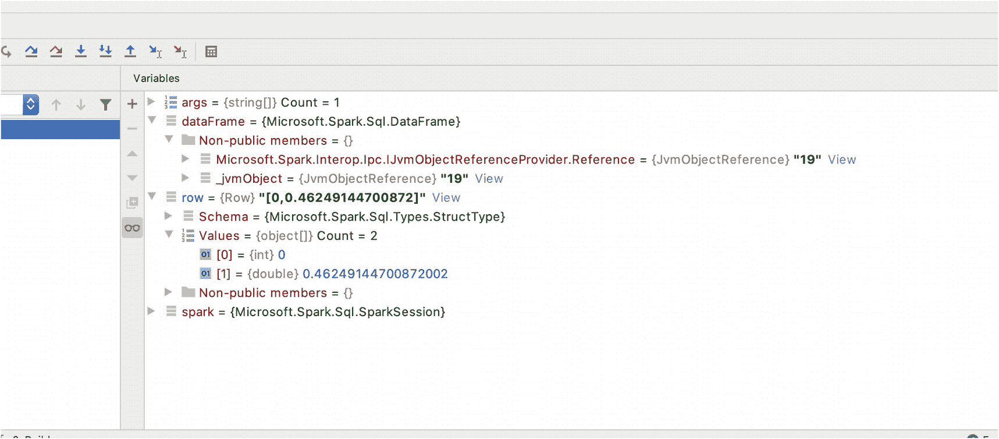

# 三、Spark.NET 编程

在这一章中，我们将编写我们的第一个。NET 的 Apache Spark 应用程序，我们可以执行，甚至在我们最喜欢的调试。NET IDE。我们将讨论在我们的项目中我们需要做什么，然后我们需要做什么，以便我们可以使用 Apache Spark 执行程序。

一旦我们运行了第一个程序，我们将继续研究如何从现有的 PySpark 示例进行转换，并强调一些从 Scala 转换到. NET 时需要记住的 Scala 特性。从 Python 和 Scala 进行转换的原因是，它们是 Apache Spark 最常用的语言，并将在相当长的一段时间内，可能是永远。了解如何阅读 Python 和 Scala 示例并将示例转换成。NET 会让你更有效率，我坚信在。NET for Apache Spark 对于任何实现都是至关重要的。

## 第一个程序

在我们的第一个程序中，我们将使用 Apache Spark 来创建一个`DataFrame`以及这个`DataFrame`中的数据。我们将创建一个`SparkSession`，它类似于 Apache Spark 应用程序的网关，我们通过一个`SparkSession`让 Apache Spark 执行查询。一旦我们有了一个`SparkSession`，我们将使用它来创建一些数据，然后进行一些处理并保存输出。最后，我们将看看数据的物理位置，以及如何将数据从 JVM 拉入我们的。NET 程序，包括任何潜在的性能问题。

我将使用 dotnet 的命令行版本来创建一个新的控制台应用程序，但是请随意使用 IDE 创建一个 dotnet 控制台项目。

```cs
» dotnet new console -output HelloSpark --language "C#"
Getting ready...
The template "Console Application" was created successfully.
Processing post-creation actions...
Running 'dotnet restore' on HelloSpark/HelloSpark.csproj...
  Determining projects to restore...
  Restored /Users/ed/git/scratch/HelloSpark/HelloSpark.csproj (in 121 ms).
Restore succeeded.

```

要创建一个 F#控制台应用程序，我们可以使用

```cs
» dotnet new console -output HelloSpark --language "F#"

```

### 微软。Spark NuGet 包

一旦我们有了一个控制台应用程序，我们需要添加微软。Spark NuGet 包( [`www.nuget.org/packages/Microsoft.Spark/`](https://www.nuget.org/packages/Microsoft.Spark/) )。

```cs
» cd HelloSpark
» dotnet add package Microsoft.Spark
  Determining projects to restore...
  Writing /var/folders/yw/9n3l8f4x2856pxvys69_lh580000gp/T/tmpgLiEtb.tmp
info : Adding PackageReference for package 'Microsoft.Spark' into project '/Users/ed/git/scratch/HelloSpark/HelloSpark.csproj'.
info : Restoring packages for /Users/ed/git/scratch/HelloSpark/HelloSpark.csproj...
info :   GET https://api.nuget.org/v3-flatcontainer/microsoft.spark/index.json
info :   OK https://api.nuget.org/v3-flatcontainer/microsoft.spark/index.json 112ms
info : Package 'Microsoft.Spark' is compatible with all the specified frameworks in project '/Users/ed/git/scratch/HelloSpark/HelloSpark.csproj'.
info : PackageReference for package 'Microsoft.Spark' version '0.12.1' added to file '/Users/ed/git/scratch/HelloSpark/HelloSpark.csproj'.
info : Committing restore...
info : Generating MSBuild file /Users/ed/git/scratch/HelloSpark/obj/HelloSpark.csproj.nuget.g.targets.
info : Writing assets file to disk. Path: /Users/ed/git/scratch/HelloSpark/obj/project.assets.json
log  : Restored /Users/ed/git/scratch/HelloSpark/HelloSpark.csproj (in 905 ms).

```

这些命令已经在 macOS 上运行；尽管 Windows 和 Linux 上的输出略有不同，但命令是相同的。

如果你做到了这一步，那么你就会有一个包含微软的项目。Spark NuGet 包，如果您按照第 [1](01.html) 章中的步骤操作，那么您也将拥有一个本地 Apache Spark 实例，我们现在可以使用它了。

### Spark 会议

是我们用来调用 Apache Spark 并让它执行我们的处理的类。每个 Java 虚拟机(JVM)只能有一个`SparkSession`，并且有一个特定的模式来获取我们的`SparkSession`，这涉及到使用`SparkSession.Builder()`和调用`GetOrCreate`，这将获得一个现有的会话或者创建一个新的会话。清单 [3-1](#PC4) 和 [3-2](#PC5) 展示了如何使用`GetOrCreate`创建一个`SparkSession`。

```cs
let spark = SparkSession
                    .Builder()
                    .AppName("DemoApp")
                    .Config("some-option", "value")
                    .Config("some-other-option", "value")
                    .GetOrCreate()

Listing 3-2Getting a reference to a SparkSession in F#

```

```cs
var spark = SparkSession
    .Builder()
    .AppName("DemoApp")
    .Config("some-option", "value")
    .Config("some-other-option", "value")
    .GetOrCreate();

Listing 3-1Getting a reference to a SparkSession in C#

```

在这些代码清单中，我们可以看到`SparkSession`有一个名为`Builder()`的静态方法，它返回一个`Builder`。`Builder`让我们设置各种配置设置，以及应用程序名称。我们可以设置很多配置设置，要查看全套选项，请访问 [`http://spark.apache.org/docs/latest/configuration.html#available-properties`](http://spark.apache.org/docs/latest/configuration.html%2523available-properties) 。

在这两个代码清单中，我使用变量名`spark`创建了`SparkSession`。我建议你也使用与在某些环境中使用 Apache Spark 相同的名字，比如 PySpark 或 Scala REPL，或者在 Databricks 笔记本中，变量 Spark 是预先定义的，并指向活动的`SparkSession`。如果您保持这种命名策略，那么在不同环境之间移植代码会更容易。

当我们使用 Apache Spark 时，我们需要理解代码和数据驻留在哪里。如果我创建一个变量并存储字符串“Hello Apache Spark”，那么变量和数据将存在于。NET 应用；阿帕奇 Spark 将无法看到它。相反，如果我使用 Apache Spark 读取一个文件，Apache Spark 将可以使用该数据，但是我们不能在我们的。NET 应用程序。我们要么需要从 Apache Spark 的某个地方写出数据，然后从我们的。NET 应用程序，否则我们需要将数据从 Apache Spark 返回到我们的。NET 应用程序。收集回数据会将数据代理回. NET 中。如果这是几行数据，那就没问题，但如果是万亿字节的数据，那么这可能会导致性能问题。

我们现在来看看我们的第一个完整的示例程序。在 Apache Spark 中，我们对创建和修改`DataFrames`感兴趣，然后我们可以聚集和保存一些数据，或者再次写回文件或数据库。在下一个例子中，列表 [3-3](#PC6) ，我们将创建一个 DataFrame，将输出保存到一个 CSV 文件，然后将结果“收集”回。这样我们就可以在. NET 中迭代每一行并对其进行操作。

```cs
using System;
using Microsoft.Spark.Sql;

namespace ConsoleApp1
{
    class Program
    {
        static void Main(string[] args)
        {
            var spark = SparkSession
                .Builder()
                .AppName("DemoApp")
                .GetOrCreate();

            var dataFrame = spark.Sql("select id, rand() as random_number from range(1000)");

            dataFrame
                .Write()
                .Format("csv")
                .Option("header", true)
                .Option("sep", "|")
                .Mode("overwrite")
                .Save(args[1]);

            foreach (var row in dataFrame.Collect())
            {
                if (row[0] as int? % 2 == 0)
                {

                    Console.WriteLine($"row: {row[0]}");
                }
            }
        }
    }
}

Listing 3-3Our first full .NET for Apache Spark application in C#

```

如果我们将它分解，在清单 [3-4](#PC7) 中，我们从`SparkSession`开始，通过使用`SparkSession.Builder()`来创建它，它又是从`SparkSession`获得的。

```cs
var spark = SparkSession
    .Builder()
    .AppName("DemoApp")
    .GetOrCreate();

Listing 3-4Creating a SparkSession in C#

```

当我们创建 SparkSession 时，我们可以选择传入一个 AppName。这在我们对共享 Apache Spark 实例进行故障排除时非常有用，因为 AppName 显示在 SparkUI 中，我们将在第 [10](10.html) 章中详细介绍。

然后我们在清单 [3-5](#PC8) 中展示了我们可以使用`spark.Sql`创建一个`DataFrame`并传入一个 SQL 查询。在这些演示中，我使用`range`来创建行；在实际项目中，您更可能通过读入数据来创建数据帧。

```cs
var dataFrame = spark.Sql("select id, rand() as random_number from range(1000)");

Listing 3-5Using SQL to create 1000 rows in C#

```

这里，我们将两个函数传递给`spark.Sql`。我们传递`rand()`，它为每一行创建一个随机数，传递`range`，它创建行，在本例中，行的 ID 列在 0 到 999 之间。在清单 [3-6](#PC9) 中，我们展示了如何将数据帧写入磁盘。这里需要注意的是，我们特别将“csv”作为格式传入。然而，默认的 CSV 选项很少是理想的，所以我们可以覆盖默认值，强制写入列标题，并使用选项“header”和“sep”来更改默认分隔符；有关 CSV 格式选项的完整列表，请参见 DataWriter API 文档中的`csv`方法: [`https://spark.apache.org/docs/latest/api/java/org/apache/spark/sql/DataFrameWriter.html`](https://spark.apache.org/docs/latest/api/java/org/apache/spark/sql/DataFrameWriter.html) 。

```cs
dataFrame
        .Write()
        .Format("csv")
        .Option("header", true)
        .Option("sep", "|")
        .Mode("overwrite")
        .Save(args[1]);

Listing 3-6Writing the DataFrame to disk using C#

```

此时，数据仅在 JVM 端，我们可以要求 Apache Spark 写入数据或对数据执行任何我们想要的操作，但我们无法在. NET 中看到数据。我们可以看到有一个`DataFrame`并计算行数，但要将数据带回。NET，我们需要调用`Collect()`。在清单 [3-7](#PC10) 中，我们展示了`Collect`，它返回一个`IEnumerable<Row>`，让我们访问每一行和每一行上的每一列。

```cs
foreach (var row in dataFrame.Collect())
{
  if (row[0] as int? % 2 == 0)
  {
    Console.WriteLine($"row: {row[0]}");
  }
}

Listing 3-7Writing the DataFrame to disk using C#

```

现在我们有了完整的 C#程序；我们还将在清单 [3-8](#PC11) 中展示用 F#实现的同一个程序。

```cs
[<EntryPoint>]
let main argv =

    let spark = SparkSession
                    .Builder()
                    .AppName("DemoApp")
                    .GetOrCreate()

    let dataFrame = spark.Sql("select id, rand() as random_number from range(1000)")

    dataFrame
                .Write()
                .Format("csv")
                .Option("header", true)
                .Option("sep", "|")
                .Mode("overwrite")
                .Save(argv.[1]);

    dataFrame.Collect()
                    |> Seq.map(fun row -> row.Get(0) :?> int)
                    |> Seq.filter(fun id -> id % 2 = 0)
                    |> Seq.iter(fun i -> printfn "row: %d" i)

    0

Listing 3-8Our first full .NET for Apache Spark application in F#

```

F#版本与 C#版本非常相似，直到我们想要将数据收集回。NET 中，我们映射`IEnumerable<Row>`来检索我们想要的特定列，然后过滤和迭代行。

在下一节中，我们将介绍如何在本地 Apache Spark 实例上运行我们的程序，以及如何调试。NET 代码在我们最喜欢的 IDE。

## 执行程序

在第 [1](01.html) 章中，我们讨论了写作所涉及的内容。NET 代码最终调用 Java 虚拟机(JVM)内部的 Java 类和方法。总而言之，我们需要做的是启动 Apache Spark 的一个会话，并使用。NET 的 Apache Spark 项目启动了我们的。NET 进程并代理。NET 代码和 JVM 代码。在这一节中，我们将介绍如何运行我们的应用程序，以及如何在我们最喜欢的 IDE 中调试代码。

### 在命令行上执行

为了执行我们的程序，我们需要运行`spark-submit`，它启动 Java 虚拟机并初始化 Apache Spark 的一个实例。我们向`spark-submit`传递一个参数，它告诉 Apache Spark 加载微软附带的 JAR 文件。Spark NuGet 包并运行`org.apache.spark.deploy.dotnet.DotnetRunner`类。`DotnetRunner`类启动一个监听端口，然后运行我们的应用程序，当我们的应用程序使用`SparkSession.Builder()`连接到 Apache Spark 时，`DotnetRunner`然后接受连接并在两个进程之间传递请求和响应。

因此，完整的命令行是 spark-submit 脚本，我们想要实例化的类名，到 Microsoft。Spark JAR 文件，执行 *our 的命令。NET 程序，*和我们程序需要的任何参数。我们在表 [3-1](#Tab1) 中展示了这些论点。

表 3-1

运行我们的。NET for Apache Spark 应用程序

<colgroup><col class="tcol1 align-left"> <col class="tcol2 align-left"> <col class="tcol3 align-left"></colgroup> 
| 

争吵

 | 

笔记

 | 

例子

 |
| --- | --- | --- |
| Spark-提交 | 启动 Apache Spark | Spark-提交 |
| -班级 | DotnetRunner 的完整类名 | org . Apache . spark . deploy . dot net . dotnetrunner |
| JAR 文件的路径 | JAR 在 NuGet 包中，并在构建时复制到 bin 文件夹中我认为最好是显式地传递完整路径，因为 Apache Sparks 工作目录可能不是您的工作目录在 Mac/Linux 上，这将区分大小写，而在 Windows 上，如果路径中有空格，您将需要使用引号将路径括起来，因此尽可能避免空格 | /Users/user/git/hello park/bin/Debug/netcoreapp 3.1/Microsoft-spark-2.4 . x-0 . 12 . 1 . jar |
| 我们的计划和任何争论 |   | dotnet 运行-项目/项目/路径/tmp/CSV-输出 |

如果您下载本书的示例代码并提取文件，构建解决方案，然后您会发现 JAR 文件已经被复制到 bin 目录。

这个 JAR 特定于 Apache Spark 的每个版本，以及 Apache Spark 和 Microsoft 的版本。Spark 库编码在文件名中。例如，JAR 文件“microsoft-Spark-2.4.x-0 . 12 . 1 . JAR”适用于 Apache Spark 版本“2.4 . x”并且适用于 Microsoft。Spark 库版本“0.12.1”。

如果不确定自己用的是哪个版本的 Apache Spark，可以运行“`spark-shell --version`”，屏幕上会显示版本。例如，如果在您构建了解决方案之后，您的 JAR 文件路径是"`c:\code\dotnet-spark\ch03\Chapter03\Listing3-3\bin\Debug\netcoreapp3.1\ microsoft-spark-2.4.x-0.12.1.jar`"并且清单 3-3 需要一个单独的参数，该参数是将 csv 文件写入的路径，那么您的命令行应该是

```cs
spark-submit --class org.apache.spark.deploy.dotnet.DotnetRunner "c:\code\dotnet-spark\ch03\Chapter03\Listing3-3\bin\Debug\netcoreapp3.1\ microsoft-spark-2.4.x-0.12.1.jar" dotnet run "c:\code\dotnet-spark\ch03\Chapter03\Listing3-3" "c:\code\dotnet-spark\ch03\Chapter03\output-csv"

```

当我们运行时，我们应该在输出中看到以下文本:

```cs
[2020-08-13T09:34:00.5421480Z] [Machine] [Info] [ConfigurationService] Using port 49596 for connection.
[2020-08-13T09:34:00.5623630Z] [Machine] [Info] [JvmBridge] JvMBridge port is 49596
line: 0
line: 2
line: 4
line: 6

```

此外，如果我们查看传入的输出目录，应该会看到一组 CSV 文件。经常让 Apache Spark 的新用户感到困惑的是，尽管您传入了一个 CSV 文件的路径，但还是创建了一个目录，在该目录中，您会得到 12 个 CSV 文件。有 12 个文件，因为 Apache Spark 在它的执行器之间分割它的处理，并且 12 个不同的执行器写了这些文件。将一个大文件拆分成多个小文件的好处是，当 Apache Spark 读回这些文件供以后处理时，可以独立读取每个文件，这有助于轻松地并行加载。当您在生产环境中运行时，您可以看出读取几个单独的文件与读取压缩文件的性能差异，由于压缩的性质，这意味着一次只有一个执行器可以读取文件。

在写出`DataFrame`之前，可以让 Apache Spark 在`DataFrame`上使用`Coalesce`或`Repartition`写入单个文件或任意数量的文件，但是这样做可能会导致以后的性能问题。

### 调试。IDE 中的. NET 代码

运行我们的程序是很棒的，但是有时我们想调试我们的代码。这意味着使用调试器，如 Visual Studio、Visual Studio 代码或 JetBrains Rider。当我们在调试器中运行时，我们仍然需要考虑这样一个事实，即我们需要在一个 JVM 上启动 Apache Spark 实例，它是一个独立于我们的进程的进程。NET 应用程序。

为了调试我们的应用程序，我们可以使用 debug 参数，我们可以将它传递给 Scala `DotnetRunner`类。代替运行我们的程序，`DotnetRunner`将创建监听端口并等待传入的连接。使用 debug 命令允许我们单独启动应用程序的调试会话，并连接到 Apache Spark 实例。

命令行类似于我们使用的最后一个。不同之处在于，我们将传递单词“debug ”,而不是运行我们的。NET 程序:

```cs
spark-submit --class org.apache.spark.deploy.dotnet.DotnetRunner "c:\code\dotnet-spark\ch03\Chapter03\Listing3-3\bin\Debug\netcoreapp3.1\ microsoft-spark-2.4.x-0.12.1.jar" debug

```

当我们运行该命令时，应该会看到以下输出:

```cs
************************************************************
* .NET Backend running debug mode. Press enter to exit *
*************************************************************

```

然后我们可以在我们最喜欢的调试器中启动我们的应用程序，当我们调用`SparkSession`时。`Builder()`，我们的应用程序连接到已经运行的 Apache Spark 实例。

当我们像这样运行时，我们可以像在. NET 应用程序中一样设置断点并检查局部变量。重要的是要记住，虽然我们看到了像`SparkSession`和`DataFrame`这样的对象，但这些并不是 JVM 中存在的实际的`SparkSession`或`DataFrame`，而是对真实对象的引用，所以我们看不到它们内部的数据，除非我们使用`Collect()`来传递数据。在图 [3-1](#Fig1) 中，我们看到了 JetBrains Rider IDE，它设置了一个断点并显示关于局部变量的信息。


图 3-1

调试我们的。NET for Apache Spark 应用程序

使用像 JetBrains Rider 或 Visual Studio 这样的调试器，我们可以单步调试代码，设置断点，并检查局部变量。图 [3-2](#Fig2) 显示了变量的内容。对 JVM 对象的引用的对象如`dataFrame`或`spark`是引用，我们看不到任何有用的属性。变量，比如`row`，它们已经被收集回。在这种情况下，有 1000 行，所以从 JVM 代理不会占用太多内存或花费太多，但是如果有几十亿行，那么这可能是一个问题。



图 3-2

探索局部变量

令人兴奋的是，尽管`dataFrame`变量是对 JVM 对象的引用，我们看不到任何实际的属性，但我们仍然可以计算表达式。在图 [3-3](#Fig3) 中，我使用了 Rider 中的评估窗口对`dataFrame.Count()`进行了评估，结果显示出来。在 Visual Studio 中，您可以使用即时窗口或监视窗口来做类似的事情。


图 3-3

检查局部变量

### Debug 命令的进一步使用

通常，当应用程序退出时，Apache Spark 实例和 Java 虚拟机也会退出。当您运行 debug 命令时，Apache Spark 实例保持活动状态，因此您可以启动应用程序的一个新实例，并连接到 Apache Spark 的前一个实例。在一些情况下，保持 Apache Spark 的运行实例是有用的。首先，当运行单元和集成测试时，如果您需要一个 Apache Spark 实例，您可以启动一个单独的实例并在所有测试中重用它，这样可以将启动 Apache Spark 的开销保持在最低水平。第二种情况是您正在开发一个应用程序，如果您有一个调试实例在后台运行，那么您可以快速测试更改，而不必每次都启动和停止 Apache Spark 实例。

当调试实例启动时，它监听一个特定的端口，即 5567，您可以通过使用环境变量`DOTNETBACKEND_PORT`更改默认端口来启动和使用多个调试实例。如果您更改调试实例侦听的端口，那么您还需要。NET 进程。

## 将现有应用程序转换为。网

在这一节中，我们将了解如何读取为 Apache Spark 编写的 PySpark 和 Scala 代码，以及如何将它们转换成。NET 代码。有一些事情需要理解，即使我们不知道如何用 Python 或 Scala 编程，我们也应该能够阅读代码并了解它是如何工作的，因为 Apache Spark 的大多数示例、范例和现有应用程序都是用 Python 或 Scala 编写的；因此，能够理解这些并将它们转化为。网络至关重要。

Apache Spark 发行版包括一个示例目录，其中包含一组 Java、Python、Scala 和 r 中的示例。

即使您已经精通 Python 和/或 Scala，我也鼓励您浏览这些示例，因为在介绍这些语言的同时，我们开始展示如何在 Apache Spark 中进行基本处理。

### 将 PySpark 示例转换为。网

在 Apache Spark 分发示例目录中，我们将转换“src/main/python/sql/basic.py”示例。本书中使用的文件也包含在示例代码中，如清单 [3-9](#PC16) 所示。代码的 C#版本在包含的项目中，名为“python tosharp”，F#版本名为“python tosharp”。

在清单 [3-9](#PC16) 中，我们看到了 Python 中所谓的 docstring，这是 Python 记录代码的方式，类似于我们经常添加到 C#方法和类中的 XML 注释。

```cs
"""
A simple example demonstrating basic Spark SQL features.
Run with:
  ./bin/spark-submit examples/src/main/python/sql/basic.py
"""

Listing 3-9Python docstring or documentation

```

Python 是非常层次化的，因为您可以在模块级、文件级、类级或函数级导入其他模块，无论导入发生在哪里，都可以在下面的级别进行导入，所以当您需要查看导入了什么时，您必须从函数开始，并向上检查更多的导入。在清单 [3-10](#PC17) 中，我们可以看到四个导入，除了最后一个导入“`from pyspark.sql.types import *`”，它导入“pyspark.sql.types”下的所有内容，每个语句都从一个模块中导入一个函数或类。进口的另一种写法是“`import pyspark.sql`”或“`from pyspark.sql import SparkSession, Row`”。

```cs
from __future__ import print_function

# $example on:init_session$
from pyspark.sql import SparkSession
# $example off:init_session$

# $example on:schema_inferring$
from pyspark.sql import Row
# $example off:schema_inferring$

# $example on:programmatic_schema$
# Import data types
from pyspark.sql.types import *
# $example off:programmatic_schema$

Listing 3-10Python imports

```

在清单 [3-11](#PC18) ，C#和 3-12，F#中，我们显示而不是导入 pyspark。XXX，我们改参考微软。Spark.XXX，所以 pyspark.sql.SparkSession 变成了 Microsoft . spark . SQL . spark session。

```cs
open Microsoft.Spark.Sql
open Microsoft.Spark.Sql.Types

Listing 3-12Python imports converted to F#

```

```cs
using Microsoft.Spark.Sql;
using Microsoft.Spark.Sql.Types;

Listing 3-11Python imports converted to C#

```

在清单 [3-13](#PC20) 中，我们看到我们定义的第一个函数。在 Python 中，程序的结构是用空格来定义的，所以当我们看到一个“`def name():`”的时候，所有缩进的东西，至少是一个层次，在文件的更下面是同一个函数的一部分。这个函数称为“basic_df_example ”,包含一个名为“spark”的参数。该函数做的第一件事是使用“`spark.read.json`”读入一个 JSON 文件。JSON 文件的内容被保存到一个`DataFrame`，然后使用`show()`显示出来。

```cs
def basic_df_example(spark):
    df = spark.read.json("examples/src/main/resources/people.json")
    # Displays the content of the DataFrame to stdout
    df.show()

Listing 3-13Defining a function in Python and reading in a JSON file as a DataFrame

```

在清单 [3-14](#PC21) ，C#中，我们将创建一个调用。网络版。在 C#中，我们需要指定“spark”参数的类型，它将是`SparkSession`。我们将在文件的后面看到 spark 的定义。在清单 [3-15](#PC22) ，F#中，我们将创建一个同样读取 JSON 文件并显示内容的函数。

```cs
    let BasicDfExample (spark:SparkSession) =
        let dataFrame = spark.Read().Json("examples/src/main/resources/people.json")
        dataFrame.Show()

Listing 3-15Defining a function in F# and reading in a JSON file as a DataFrame

```

```cs
static void BasicDfExample(SparkSession spark)
{
    var dataFrame = spark.Read().Json("examples/src/main/resources/people.json");
    dataFrame.Show();
}

Listing 3-14Defining a method in C# and reading in a JSON file as a DataFrame

```

然后，Python 代码打印清单 [3-16](#PC23) 中数据帧的模式，这是一种直观查看文件读取是否正确的简便方法。

```cs
df.printSchema()

Listing 3-16Printing the schema of a DataFrame

```

在清单 [3-17](#PC24) 和 [3-18](#PC25) 中，我们需要将`printSchema`转换成。净当量，也就是`PrintSchema`。当您从 Python 切换到。NET 中，改变方法的大小写是最常见的事情。

```cs
dataFrame.PrintSchema()

Listing 3-18Printing the schema of a DataFrame in F#

```

```cs
dataFrame.PrintSchema()

Listing 3-17Printing the schema of a DataFrame in C#

```

在清单 [3-19](#PC26) 中，Python 代码通过名称选择一列，然后打印出结果`DataFrame`。在`DataFrame`上调用`select`会创建一个`DataFrame`的新实例，因此任何操作都不会影响代码的其他部分。

```cs
df.select("name").show()

Listing 3-19Selecting a single column and displaying the contents

```

在清单 [3-20](#PC27) 和 [3-21](#PC28) 中，我们展示了 C#和 F#版本。

```cs
dataFrame.Select("name").Show()

Listing 3-21Selecting a single column and displaying the resulting DataFrame in F#

```

```cs
dataFrame.Select("name").Show();

Listing 3-20Selecting a single column and displaying the resulting DataFrame in C#

```

在清单 [3-22](#PC29) 中，代码选择了两列，而不是使用列名，正如我们在清单 [3-19](#PC26) 中看到的。我们在这里看到的是用列名索引的`DataFrame`，得到的是`Column`对象。`Column`对象很重要，因为它定义了列名和源`DataFrame`。考虑一下，如果你有两个数据帧，它们都包括列“ID”，如果你连接这两个数据帧并做一个`Select("ID")`，你会得到哪一列？这是不可能的，这将导致 Apache Spark 失败。在这种情况下，您可以通过从`DataFrame`中检索`Column`引用而不是使用字符串名称来精确地指定您想要的 ID 列。我们看到的第二件事是年龄列是一个计算，理解这个计算被传递到 Apache Spark 是很重要的，所以 Apache Spark 运行时运行这个计算，而不是数据被传递到 Python 进程和运行这个计算的 Python。对于大型数据集，这对性能非常重要。

```cs
df.select(df['name'], df['age'] + 1).show()

Listing 3-22Selecting two columns and performing a calculation on the age column

```

在清单 [3-23](#PC30) ，在 C#和 3-24，F#中，我们可以做同样的事情，但是应该注意，当我们调用`dataFrame["age"] +1`时，它是`dataFrame["age"].Plus(1)`的*语法糖*，这样写可能会更清楚。

```cs
dataFrame.Select(dataFrame.["name"], (dataFrame.["age"] + 1)).Show()
dataFrame.Select(dataFrame.["name"], (dataFrame.["age"].Plus(1))).Show()

Listing 3-24Selecting multiple columns and performing a calculation in F# including the more explicit “.Plus” call

```

```cs
dataFrame.Select(dataFrame["age"], dataFrame["age"] + 1).Show();
dataFrame.Select(dataFrame["age"], dataFrame["age"].Plus(1)).Show();

Listing 3-23Selecting multiple columns and performing a calculation in C# including the more explicit “.Plus” call

```

在清单 [3-25](#PC32) 中，代码过滤了一个`DataFrame`，再次使用语法糖来隐藏对`Column`对象的`Gt`函数的调用。

```cs
df.filter(df['age'] > 21).show()

Listing 3-25Filtering a DataFrame using the Gt function on the Column object

```

列表 [3-26](#PC33) 和 [3-27](#PC34) 显示了。NET 版本的过滤器，同样，理解实际的计算发生在 Apache Spark 内部的 JVM 端，而不是运行在。NET 代码。

```cs
dataFrame.Filter(dataFrame["age"].Gt(21)).Show();

Listing 3-27Filtering a DataFrame using the Gt function on the Column object, in F#

```

```cs
dataFrame.Filter(dataFrame["age"].Gt(21)).Show();

Listing 3-26Filtering a DataFrame using the Gt function on the Column object, in C#

```

在清单 [3-28](#PC35) 中，我们可以通过按年龄分组并计算每个年龄有多少行来看到数据帧上的聚集；C#和 F#版本在清单 [3-29](#PC36) 和 [3-30](#PC37) 中。

```cs
dataFrame.GroupBy(dataFrame.["age"]).Count().Show()

Listing 3-30Aggregating DataFrames in F#

```

```cs
dataFrame.GroupBy(dataFrame["age"]).Count().Show();

Listing 3-29Aggregating DataFrames in C#

```

```cs
df.groupBy("age").count().show()

Listing 3-28Aggregations in Apache Spark

```

在清单 [3-31](#PC38) 中，我们看到`DataFrame`被转换成 Apache Hive 视图，这允许使用 SQL 语句查询`DataFrame`。`SparkSession`类有`Sql()`方法，它允许我们运行 SQL 语句。然而，在那个 SQL 上下文中没有办法看到`DataFrame`、*中的数据，除非*我们获取`DataFrame`并使其对 SQL 上下文可用，我们使用一个临时视图来做到这一点。临时视图将和`SparkSession`一样长，所以当会话结束时，临时视图也将结束。

```cs
df.createOrReplaceTempView("people")
sqlDF = spark.sql("SELECT * FROM people")
sqlDF.show()

Listing 3-31Making a DataFrame accessible by the SQL context

```

清单 [3-32](#PC39) 展示了如何在 C#中创建视图，清单 [3-33](#PC40) 在 F#中

```cs
dataFrame.CreateOrReplaceTempView("people")
let sqlDataFrame = spark.Sql("SELECT * FROM people")

Listing 3-33Making a DataFrame accessible by the SQL context in F#

```

```cs
dataFrame.CreateOrReplaceTempView("people");
var sqlDataFrame = spark.Sql("SELECT * FROM people");

Listing 3-32Making a DataFrame accessible by the SQL context in C#

```

`CreateOrReplaceTempView`功能有一些变化。您可以使用`CreateTempView`，它不会覆盖现有的视图，或者您可以使用`CreateGlobalTempView`或`CreateOrReplaceGlobalTempView`。即使在您的会话停止之后，全局临时视图对正在运行的 Apache Spark 实例中的其他`SparkSessions`也是可用的，但是当您的会话结束时，临时视图会被销毁。在清单 [3-34](#PC41) 中，我们看到创建了一个全局临时视图，顺便说一下，这意味着当我们想在 SQL 上下文中使用它时，我们需要在视图名称前加上前缀“global_temp”。

```cs
df.createGlobalTempView("people")
spark.sql("SELECT * FROM global_temp.people").show()
spark.newSession().sql("SELECT * FROM global_temp.people").show()

Listing 3-34Making a DataFrame accessible to other SparkSession’s SQL context

```

在清单 [3-35](#PC42) 中，我们将看到如何在 C#中使一个数据帧可被其他 SparkSession 访问。

```cs
dataFrame.CreateGlobalTempView("people");
spark.Sql("SELECT * FROM global_temp.people").Show();
spark.NewSession().Sql("SELECT * FROM global_temp.people").Show();

Listing 3-35Making a DataFrame accessible to other SparkSession’s SQL context in C#

```

在清单 [3-36](#PC43) 中，我们将看到如何在 F#中使一个数据帧可被其他 SparkSession 访问。

```cs
dataFrame.CreateGlobalTempView("people")
spark.Sql("SELECT * FROM global_temp.people").Show()
spark.NewSession().Sql("SELECT * FROM global_temp.people").Show()

Listing 3-36Making a DataFrame accessible to other SparkSession’s SQL context F#

```

我们将在本节中看到的最后一点 Python 代码是清单 [3-37](#PC44) 中 Python 脚本文件的标准主定义。

```cs
if __name__ == "__main__":
    # $example on:init_session$
    spark = SparkSession \
        .builder \
        .appName("Python Spark SQL basic example") \
        .config("spark.some.config.option", "some-value") \
        .getOrCreate()
    # $example off:init_session$

    basic_df_example(spark)

Listing 3-37Python script entry point

```

这在 Python 脚本中是标准的。这意味着，如果您有意运行脚本，那么这个`if`语句中的代码就会运行。但是，如果您运行一个单独的文件来导入这个 Python 文件，那么代码将不会被执行。

在清单 [3-37](#PC44) 中，我们还看到`SparkSession builder`被用于`getOrCreate`一个`SparkSession`，它被传递给`basic_df_example`函数。清单 [3-38](#PC45) 和 [3-39](#PC46) 显示了 C#和 F#的等效物。

```cs
let spark = SparkSession.Builder().GetOrCreate()
BasicDfExample spark

Listing 3-39F# entry point

```

```cs
static void Main(string[] args)
{
    var spark = SparkSession.Builder().GetOrCreate();
    BasicDfExample(spark);
}

Listing 3-38C# entry point

```

### 将 Scala 示例转换为。网

当我们看一个 Scala Apache Spark 应用程序时，我们看到两种类型的代码；首先，我们看到处理命令行参数的 Scala 代码，其次，我们看到调用 Apache Spark 类和方法的 Scala 代码。许多对 Apache Spark 的调用在 Python 或 Scala 中都是相同的，在。除了不同的命名标准。清单 [3-40](#PC47) 显示了一个有效的 Python 或一个有效的 Scala 语句。

```cs
df.printSchema()

Listing 3-40Valid Python or valid Scala

```

不像我们对 PySpark 版本的代码那样一行一行地走，Scala 中有一些你经常在 Apache Spark 示例中遇到的东西，理解它们会很有帮助。

#### 使用$引用列

在 Scala 中，有一个获取对`Column`的引用的捷径。如果你正在查询一个`DataFrame`，并且你需要提供一个列，你可以写$"ColumnName "，所以如果你看到类似清单 [3-41](#PC48) ，那么你可以看到 Scala 可以使用这个快捷方式，而不是稍长的版本 PySpark 或。NET 需求，如清单 3-42 所示。

```cs
dataFrame.Select(dataFrame["ColumnName"])

Listing 3-42.NET has no shortcut to reference a column

```

```cs
dataFrame.Select($"ColumnName")

Listing 3-41Scala shortcut to reference a column

```

#### 资料组

Scala 有一个 PySpark 或中没有的特性。NET，它是静态类型的数据集。静态类型化数据集允许您从数据源读取数据，并且每一行都根据已知的类进行验证，因此当您运行时，您知道每一行都符合正确的类型。对于 Scala 来说，这是一个非常有吸引力的用例，但是我们现在还没有在. NET 中使用它。

当您看到一个`DataFrame`被读入，然后使用`.as[Type]`转换成一个`Dataset`时，要注意代码可能通过属性名引用列，而不是传入列名；如需这方面的示例，请参见清单 [3-43](#PC50) ，其中过滤器使用 lambda 函数引用年龄作为标准的类属性。

```cs
case class Person(
     name: String,
     age: Long
)

val people = dataFrame.as[Person]
people.filter(p => p.age > 10)

Listing 3-43Scala referencing a column as a Dataset

```

如果你在一个例子中看到数据集被使用，那么你将需要使用我们在. NET 中的`Column`引用。

## 摘要

在这一章中，我们写了我们的第一个。NET for Apache Spark 应用程序，在命令行上运行程序，并调试应用程序。我们还研究了如何将 PySpark 示例代码转换成。NET 示例代码，并强调了阅读 Scala Apache Spark 代码时我们需要记住的几个“陷阱”。希望您已经能够跟随并让您的应用程序在您的开发机器上运行。

在下一章中，我们将了解什么是 Apache Spark 中的用户自定义函数，我们如何在哪里使用它们，以及如何调试它们，因为它们在我们已经拥有的多个进程的复杂性上增加了一层复杂性。