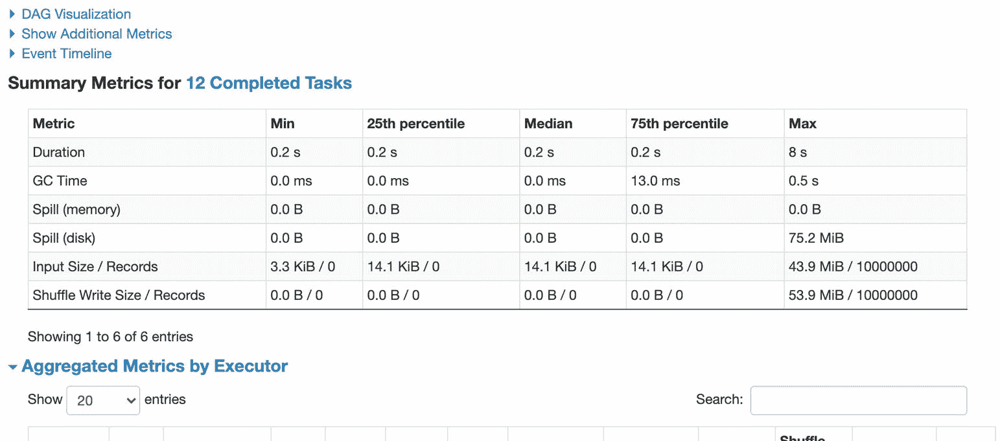
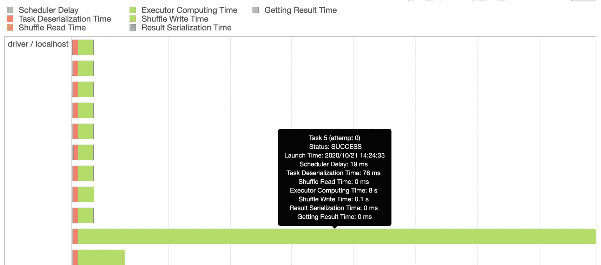
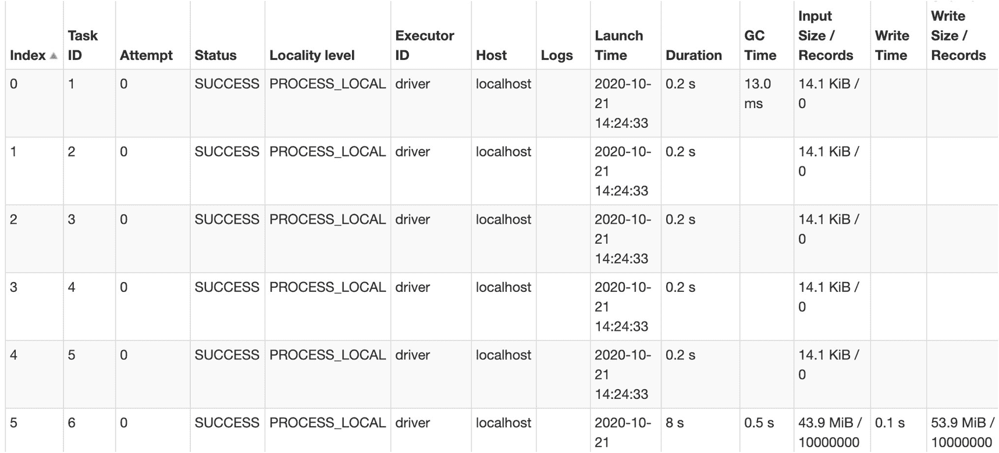
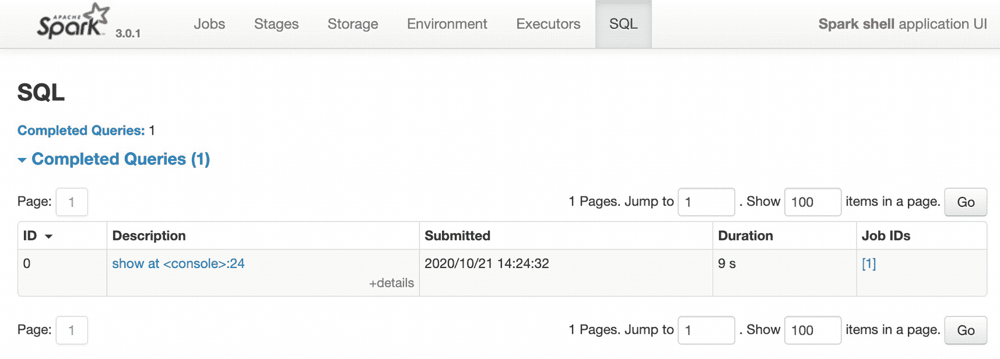
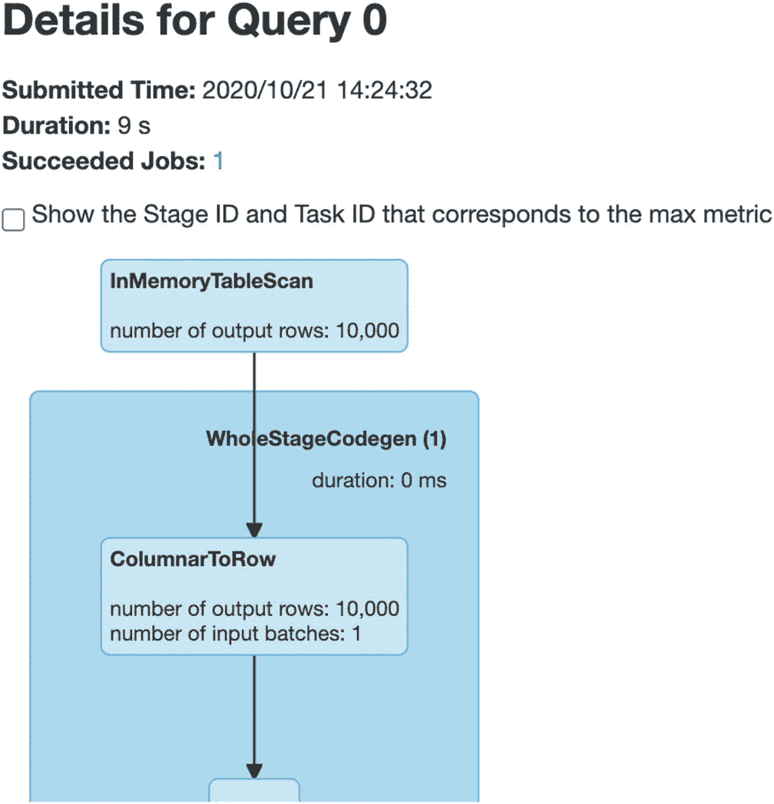
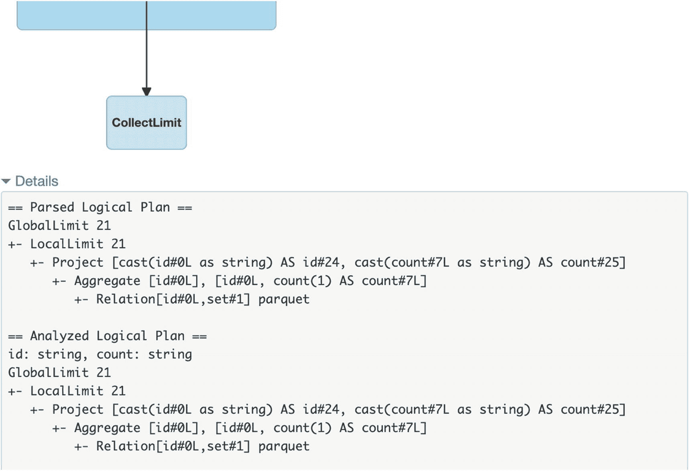
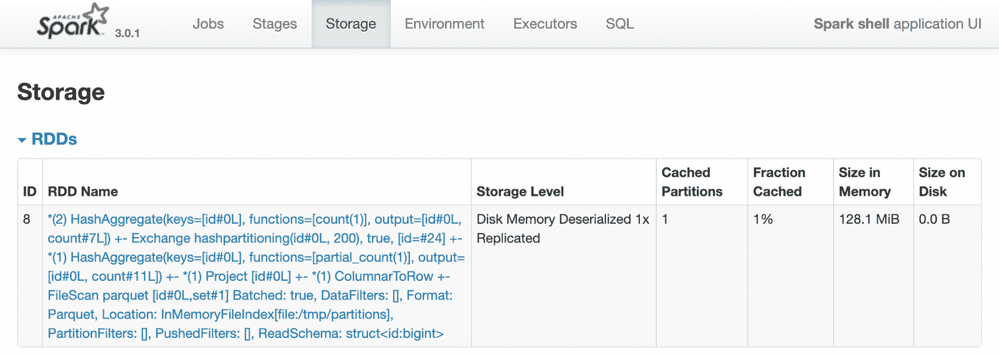
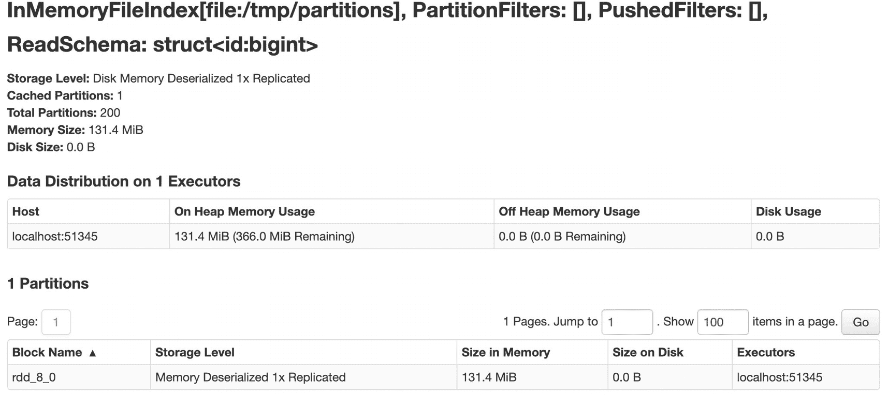
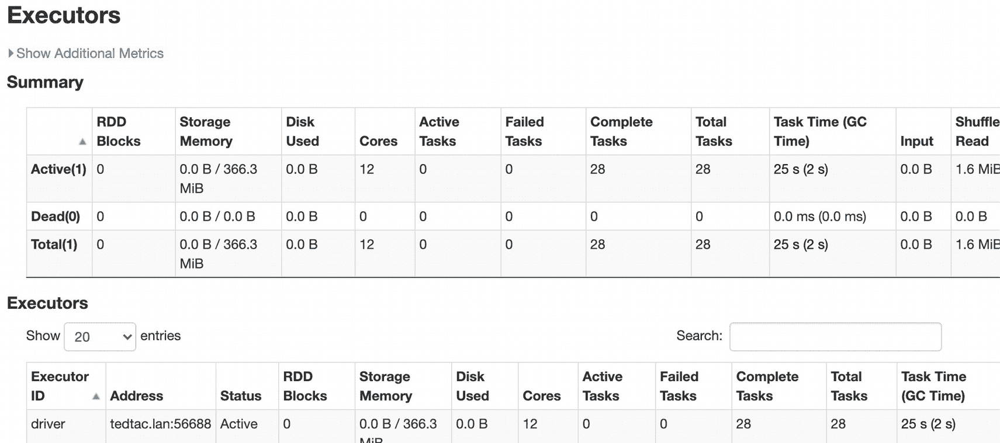
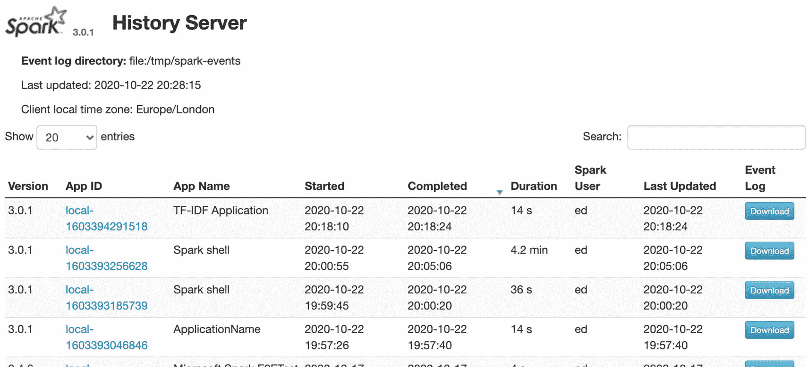

# 十、故障排除

在本章中，我们将了解如何监控您的应用程序并对其进行故障排除。我们将查看您可以控制的日志文件和 SparkUI，Spark ui 是一个用于检查 Apache Spark 作业的 web 界面，这些作业在性能方面如何运行，以及 Apache Spark 作业生成了什么执行计划。在这一章中，我们不会有任何代码示例，但我们会看看配置和 SparkUI web 界面。

## 记录

Apache Spark 使用 log4j 进行日志记录，为了控制日志记录的数量，您应该在 Spark 目录中找到“conf”文件夹，在该目录中应该可以看到 log4j.properties 文件。如果您没有看到 log4j.properties 文件，那么您应该看到 log4j.properties.template，您可以将它复制到 log4j.properties。模板文件放在。属性文件。

如果我们查看 log4j.properties 文件内部，第一部分控制我们看到多少日志记录以及日志到哪里。在清单 [10-1](#PC1) 中，我们将查看 log4j.properties 文件的第一部分。有关 log4j 的更多信息，请参见 [`https://logging.apache.org/log4j/2.x/`](https://logging.apache.org/log4j/2.x/) *。*

```cs
# Set everything to be logged to the console
log4j.rootCategory=INFO, console
log4j.appender.console=org.apache.log4j.ConsoleAppender
log4j.appender.console.target=System.err
log4j.appender.console.layout=org.apache.log4j.PatternLayout
log4j.appender.console.layout.ConversionPattern=%d{yy/MM/dd HH:mm:ss} %p %c{1}: %m%n

Listing 10-1The first section of the log4j.properties file

```

这意味着控制台将会看到大量的信息，因为任何来自信息层及以上的信息都会显示出来。我们在表 [10-1](#Tab1) 中显示了 log4j 消息级别。

表 10-1

log4j 消息级别

<colgroup><col class="tcol1 align-left"></colgroup> 
| 日志级别 |
| 离开 |
| 致命的 |
| 错误 |
| 警告 |
| 信息 |
| 调试 |
| 微量 |
| 全部 |

通常，在我的开发机器上，我将错误级别设置为 error 或 WARN。除此之外的任何事情都会导致消息太少或者太多。

要更改属性文件只是为了显示错误而不是警告，将“rootCategory”行更改为 ERROR，如清单 [10-2](#PC2) 所示。

```cs
log4j.rootCategory=ERROR, console

Listing 10-2Changing the logging level to ERROR

```

也可以通过使用`SparkContext`上的`LogLevel`方法来使用代码控制日志记录级别，您可以从`SparkSession`获得对它的引用。

## Spark UI

Apache Spark 附带了一个 UI，用于检查执行的作业。UI 非常有用，因为它允许我们深入研究作业的执行情况，并解决性能问题。了解如何访问 Spark UI 以及如何诊断性能问题对于提高 Apache Spark 的效率至关重要。

当您运行 Apache Spark 作业时，如果您将日志设置为 INFO 或以上，您可能会注意到日志中的这一行:

`INFO SparkUI: Bound SparkUI to 0.0.0.0, and started at` `http://machine.dns.name:4040`

这意味着 Apache Spark 已经启动了一个 web 服务器，并且正在监听端口 4040。当作业正在运行时，您可以连接并查看作业的详细信息。但是，一旦 Apache Spark 作业完成，web 服务器就会关闭，您将无法查看任何内容。在本例中，端口是 4040，这是默认端口，但是如果 Apache Spark 的另一个实例已经在运行，它将使用端口 4041 或下一个空闲端口，正确的 URL 将被打印出来。

除了为每个作业启动 Spark UI 并在作业完成时关闭之外，我们还可以请求 Apache Spark 实例将 Spark UI 所需的事件数据写入一个目录，而不是在作业运行时启动 Spark UI 并在作业完成时关闭，而是运行一个称为历史服务器的副本，它将从单个作业写入的文件夹中读取事件数据。

要配置 Apache Spark 以便将事件写入文件夹，您应该编辑 Spark 配置文件 conf/spark-defaults.conf 并添加以下两行:

```cs
spark.eventLog.enabled true
spark.eventLog.dir /tmp/spark-history-logs

```

然后，作业写入其中的任何数据都将被历史服务器获取，您可以从 Apache Spark 安装目录中运行“sbin/start-history-server.sh”来启动历史服务器。如果我们启动历史服务器，那么它有一个不同的默认端口，因此历史服务器通常在`http://localhost:18080`可用。

### 历史服务器

Spark UI 有两个版本，一个版本为 Apache Spark 的每个实例启动，另一个版本可以存储以前实例的数据，然后我们可以在名为历史服务器的 Spark UI 版本中显示详细信息。使用历史服务器，您可以看到不再活动的先前实例的跟踪输出。

我们看到的区别是，当我们连接到一个历史服务器而不是一个特定实例的 SparkUI 时，我们首先到达一个概览窗口，让我们深入到我们感兴趣的 Apache Spark 的特定实例。在图 [10-1](#Fig1) 中，我们第一次连接时看到了历史服务器。


图 10-1

历史服务器

从历史服务器上的默认页面，我们可以做一些事情。首先，我们可以选择下载“事件日志”,它包含 Apache Spark 实例编写的每个日志行，但是为了简化解析，它被包装成一个 JSON 文件。其次，我们可以点击一个“应用程序 ID ”,进入应用程序的主屏幕，如图 [10-2](#Fig2) 所示。

### 作业选项卡

主屏幕在顶部分为几个选项卡，“作业”是默认选项卡。如果我们展开“活动作业”，我们可以看到是否有任何当前正在执行的作业以及它们的状态。在这种情况下，我们可以看到有一个活动工单和一个已完成工单。在图 [10-3](#Fig3) 中，我们可以看到活动和已完成的作业展开后的样子。


图 10-3

可在 SparkUI 中查看的活动和已完成的作业


图 10-2

SparkUI 主屏幕

The main screen is broken into several tabs across the top, and “Jobs” is the default tab. If we expand “Active Jobs,” we can see if there are any currently executing jobs and what their status is. In this case, we can see that there is one active Job and one completed Job. In Figure

当我们查看描述时，我们需要记住 Apache Spark 中的处理是基于动作和转换的。在动作发生之前，转换会被添加到计划中，并且不会导致任何实际的处理。当一个动作发生时，在这种情况下，完成的动作是从一个 parquet 文件中读取，而正在运行的动作是在一个`DataFrame`上调用`Show`。

此外，虽然看起来提交了两个不同的作业，但我们看到的是 Apache Spark 如何将请求转换成作业和阶段，因此这是通过运行

```cs
spark.Read().Parquet("/tmp/partitions").GroupBy("id").Count().Cache().Show()

```

“作业”选项卡显示的最后一件事是添加或删除执行者的时间表，以及作业开始、完成和失败的时间。我们在图 [10-4](#Fig4) 中看到一个这样的例子，两个小任务在 14:25 左右运行并成功完成。如果作业失败了，那么方框会显示为红色。


图 10-4

Spark 工作时间表

为了深入到一个具体的工作，我们可以在时间线视图上点击它，如图 [10-4](#Fig4) 所示，或者点击图 [10-3](#Fig3) 所示的描述列中的链接。作业详细信息页签如图 [10-5](#Fig5) 所示。首先要注意的是，我们再次看到了构成工作的各个阶段。持续时间和无序播放列用于性能故障排除。如果一个阶段花费了大量时间，那么这是我们开始理解性能特征的第一步。


图 10-5

作业的不同阶段分为几个阶段，有助于了解作业的哪些部分速度较慢

当 Apache Spark 使用 DataFrame API 处理作业时，Apache Spark 将创建一个 SQL 执行计划并执行该计划。当我们使用 DataFrame API 时，它是 RDD API 上的一个抽象层，因此在对 Apache Spark 性能进行故障排除时，理解该计划是什么以及它是如何工作的是一项核心技能。在图 [10-5](#Fig5) 中，有一个到为作业生成的 SQL 计划的链接。在顶部，“关联的 SQL 查询:0”，0 指的是查询编号，如果您单击该链接，它将带您到 SQL 计划。我们将在本章后面讲述 SQL 计划选项卡以及如何阅读计划。

在图 [10-5](#Fig5) 中，我们可以看到另一个截面，我们可以将其展开，称为“DAG 可视化”；DAG 是将针对 rdd 运行的操作列表。DAG 可视化是 rdd 如何被处理的细节。图 [10-6](#Fig6) 显示了作业的 DAG 可视化，包括组成作业的所有阶段的所有操作。


图 10-6

作业的 DAG 可视化

图 [10-6](#Fig6) 中的 DAG 向我们展示了这项工作有两个阶段。第一个阶段读取一个 parquet 文件，“扫描 parquet”，然后使用“交换”操作符将数据传递给第二个阶段。然后，Apache Spark 使用“InMemoryTableScan”操作符对数据进行表扫描。如果我们看图 [10-7](#Fig7) ，我们可以看到当我们悬停在黑色和绿色的点上时，我们可以获得关于所发生事情的更多信息。在图 [10-8](#Fig8) 中，我们还可以看到“扫描拼花”和“InMemoryTableScan”的细节。


图 10-8

“InMemoryTableScan”的详细信息


图 10-7

“扫描拼花地板”的细节

“作业详细信息”选项卡用于显示作业是如何被分解成各个阶段的。在 DAG 可视化之后，我们可以看到每个阶段花费时间的细节；在图 [10-9](#Fig9) 中，我们看到了每个阶段的细节，包括每个阶段实际花费的时间、组成该阶段的任务数量以及涉及的数据量。


图 10-9

每个阶段的细节

在图 [10-9](#Fig9) 中，我们可以看到有两个阶段，表格显示第一个阶段由 12 个任务组成，该阶段耗时 8 秒。第二阶段由一项任务组成，耗时 1 秒。如果这项工作太慢，我们将使用这些信息来开始精确地缩小哪个或哪些任务花费的时间最多。

在这种情况下，我们开始看到为什么作业需要 8 秒钟的线索，因为第一阶段读取 44.1 MiB，并且必须执行 53.9 MiB 的随机写入。这可能意味着数据存储的方式对于处理来说效率不高，在处理完成之前必须在执行器之间重新排序和复制。

在图 [10-10](#Fig10) 中，我们单击运行了 8 秒钟的第一个阶段，这将我们带到“阶段”屏幕和第一个阶段的详细信息。

### “阶段”选项卡

我们在舞台细节中看到的细节向我们展示了

1.  该阶段花费的时间，包括所有任务

2.  就大小和行数而言，读取了多少数据

3.  有多少数据被“打乱”,这是我们应该尽量避免的

4.  有多少数据溢出到内存中

5.  有多少数据溢出到磁盘，这是我们应该尽可能避免的另一件事

6.  与该阶段关联的作业，通过该作业，我们可以导航回作业详细信息屏幕


图 10-10

“阶段”选项卡和阶段详细信息

The detail we start to see in the stage details shows

在图 [10-11](#Fig11) 中，我们进一步向下移动阶段详细信息屏幕，可以看到已完成任务的摘要，特别是每项任务所用时间的分布。这里重要的一点是，我们通常希望一个阶段中的任务花费大约相同的时间，所以如果最小和最大时间之间的差异非常大，或者如果第 75 个百分点和最大百分点之间的差异非常大，那么我们很可能遇到了数据分区方式的问题。原因是所有任务都读取一部分数据，如果一个任务最终获得的数据比其他任务多得多，那么这个任务就会成为性能的瓶颈。



图 10-11

分解为任务的阶段的概要度量

在这里，我们可以看到大多数任务花费了 0.2 秒，但至少有一个任务花费了 8 秒，这是一个相当大的差异。在图 [10-12](#Fig12) 中，我们将进一步向下移动阶段详细信息屏幕，并查看按执行者细分的汇总指标。在这个例子中，我在我的笔记本电脑上运行作业，所以我只有一个执行者。但是，如果它是在 Apache Spark 集群上，那么可能会有许多执行程序，这将允许您查看是特定的执行程序导致了问题，还是所有的执行程序都有问题。通常，当我们运行 Apache Spark 集群时，我们使用由相同类型的机器组成的集群。尽管如此，没有什么可以阻止您运行各种机器规模的集群，所以可能是一个节点上的一个执行器没有足够的内存，这是您可以在 stage details 屏幕上监视的。


图 10-12

执行者指标

stage details(阶段详细信息)屏幕还为我们提供了每个任务所用时间的直观概览，正如我们在图 [10-13](#Fig13) 中看到的，如果我们将鼠标悬停在该栏上，它将显示特定任务的详细信息。



图 10-13

每项任务执行情况的可视化

当您将鼠标悬停在该条上时，您会看到额外的信息，包括任务索引，在本例中为“任务 5”，它允许我们通过向下滚动并检查图 [10-14](#Fig14) 中所示的任务列表来查看更多细节。



图 10-14

组成一个阶段的任务列表

在图 [10-14](#Fig14) 中，我们可以看到索引为 5 的任务实际上是“任务 ID”6，这是需要注意的。

当我们查看这个任务列表时，我们可以看到快速任务和慢速任务之间的差异，也就是说，“混洗”的数据量要高得多。

### SQL 选项卡

如果我们现在转到“SQL”选项卡，我们可以看到为每个查询生成的执行计划列表。在图 [10-15](#Fig15) 中，我们可以看到“SQL”选项卡和生成的计划列表以及与计划相关的作业。在这种情况下，只有一个计划。



图 10-15

组成一个阶段的任务列表

如果我们单击描述，我们会深入到 SQL 的详细信息。在图 [10-16](#Fig16) 中，我们可以看到 SQL 详细信息屏幕的顶部，其中包括作业运行时间和相关作业，因此您可以在 SQL 计划和作业之间来回切换。重要的是要记住，当我们使用 DataFrame API 或使用 SQL 查询时，我们实际上是在做同样的事情。Apache Spark 解析任何 SQL 查询并构建一个执行查询的计划，其方式与 DataFrame API 调用导致计划生成并执行的方式相同。编写 SQL 查询和使用 DataFrame API 生成的计划可以是相同的。知道无论您想用哪种方式为 Apache Spark 编写代码都会导致相同的计划和处理是使用 Apache Spark 的另一个令人信服的原因。



图 10-16

SQL 详细信息

在查询细节之后，我们可以看到查询的可视化表示，包括每个阶段输出了多少行。这在查看复杂的查询时非常有用，尤其是使用连接时，有助于跟踪行来自何处或从何处丢失。

在屏幕的更下方，在图 [10-17](#Fig17) 中，我们看到了逻辑计划被解析时的文本表示以及被分析的逻辑计划。如果您曾经使用过 SQL Server 文本计划，那么您应该对它们相当熟悉。每个计划都是一个操作树，第一个操作在树的底部，沿着树向上传递数据，直到我们到达树的顶部。



图 10-17

经过解析和分析的逻辑计划

在逻辑计划之后，在图 [10-18](#Fig18) 中，我们可以看到“优化的逻辑计划”，它包含计划的性能特征，如在每个阶段使用哪种类型的连接，最后是“物理计划”，它详细描述了路径和分区信息，说明 Apache Spark 必须如何执行计划。


图 10-18

优化的逻辑规划和物理规划

图 [10-18](#Fig18) 中的细节可能有点难以阅读；需要注意的重要一点是，我们可以看到逻辑和物理计划的细节，包括分区信息和源文件细节。该计划还包含下推到源的任何过滤器的细节。

### 剩余选项卡

Spark UI 上的其余选项卡包括“存储”选项卡，如图 [10-19](#Fig19) 所示。“存储”选项卡显示已缓存的任何 rdd 的详细信息。在这个例子中，我编写的代码使用了 DataFrame API，调用了`DataFrame.Cache()`，这使得数据被写入磁盘，以便可以在另一个查询中使用，而不必再次进行处理。



图 10-19

“存储”选项卡概述屏幕

我们可以看到 RDD 占用了多少内存空间，缓存了多少分区。如果我们点击 RDD 的名字，它会把我们带到 RDD 的细节，如图 [10-20](#Fig20) 所示。



图 10-20

RDD 缓存详细信息屏幕

Spark UI 中的下一个选项卡是“Environment”选项卡，它包括环境的细节，比如 Apache Spark 实例使用的 Java 和 Scala 的版本。这些信息虽然有用，但希望不是经常需要。图 [10-21](#Fig21) 显示了我的本地 Apache Spark 实例上的环境选项卡。


图 10-21

Spark UI 中的“环境”选项卡

在图 [10-22](#Fig22) 中，我们看到 Spark UI 中的最后一个选项卡是“执行者”选项卡，它显示了每个执行者执行情况的细节。例如，如果我们看到“GC 时间”很长，那么我们应该考虑增加可用内存或优化代码，这样就需要更少的内存来处理作业。



图 10-22

Spark UI 中的“执行者”标签

关于 SparkUI 要指出的最后一点是，当您在共享集群上时，很难区分不同的作业，因此为了帮助跟踪特定的作业，当您创建`SparkSession`时，您可以选择为作业设置一个标识符，这允许您在 Spark UI 中快速查看作业。在清单 [10-3](#PC5) 中，我们可以看到如何设置应用程序名称，在图 [10-23](#Fig23) 中，我们可以看到名称显示在 Spark UI 中，以帮助跟踪特定的作业。



图 10-23

在共享的 Apache Spark 实例上运行时，应用程序名称有助于区分作业

```cs
var spark = SparkSession
    .Builder()
    .AppName("TF-IDF Application")
    .GetOrCreate();

Listing 10-3Setting the AppName, which is then displayed in the Spark UI

```

## 摘要

在本章中，我们已经了解了 Apache Spark 的日志记录，以及如何配置您看到的消息数量。通常情况下，您希望在需要所有消息的地方有尽可能少的消息，直到您需要返回并排除故障，因此知道在哪里配置日志记录是至关重要的。

然后，我们对 Spark UI 和不同的屏幕进行了概述，我们可以使用这些屏幕来获得诊断 Apache Spark 作业的性能问题所需的信息。希望您能够查看 Spark UI 并深入问题，而不会迷失在其他不相关工作的信息海洋中。