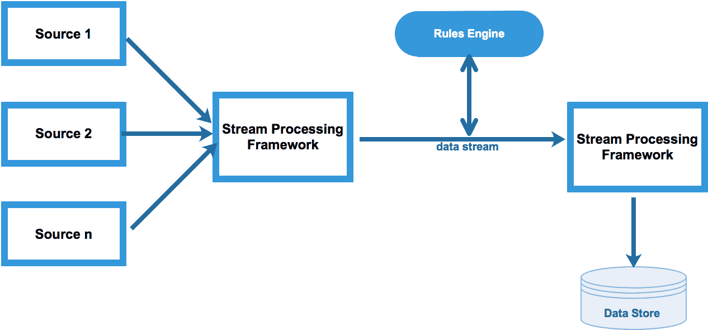
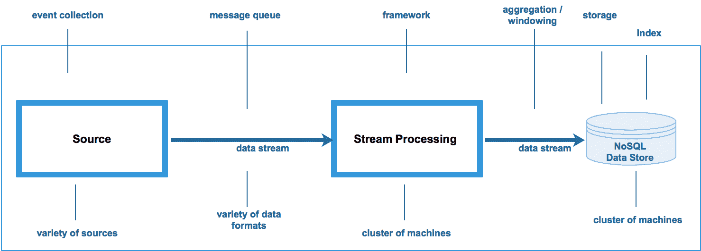
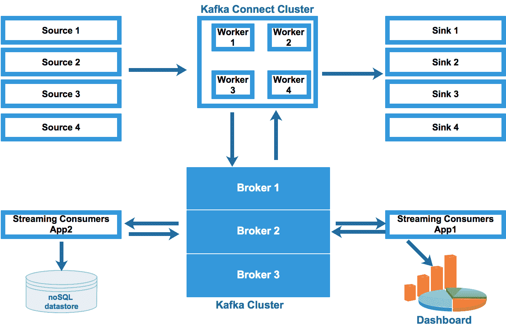
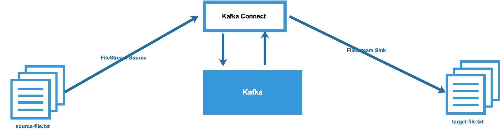
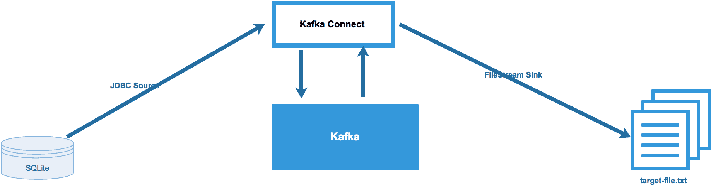
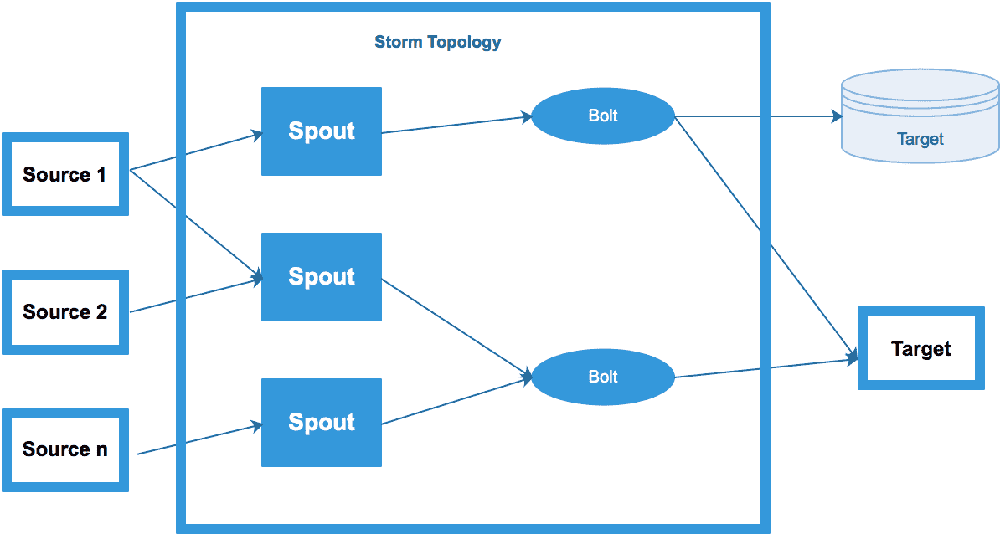
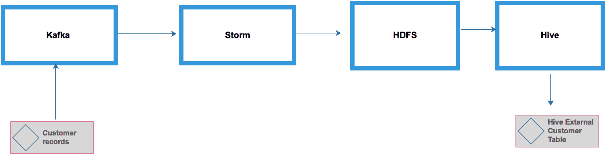
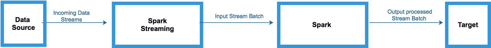

# 六、设计实时流数据管道

这本书的前三章都涉及批量数据。了解了 Hadoop 的安装、数据接收工具和技术以及数据存储之后，让我们来看看数据流。我们不仅要考虑如何处理实时数据流，还要考虑如何围绕数据流设计管道。

在本章中，我们将涵盖以下主题:

*   实时流概念
*   实时流组件
*   Apache 弗林克对 Spark
*   ApacheSpark 对 Storm

# 实时流概念

让我们在以下几节中了解一些与实时流应用相关的关键概念。

# 数据流

数据流是从一端到另一端、从发送者到接收者、从生产者到消费者的连续数据流。数据的速度和数量可能会有所不同；它可能是每秒 1 GB 的数据，也可能是每秒或每分钟 1 KB 的数据。

# 批处理与实时数据处理

在批处理中，数据是分批收集的，每批数据都被发送进行处理。批处理间隔可以是从一天到一分钟的任何时间。在当今的数据分析和商业智能世界中，数据不会在超过一天的时间内被批量处理。否则，业务团队将无法洞察日常业务发生了什么。例如，企业数据仓库团队可能会收集过去 24 小时内发出的所有订单，并将收集到的所有订单发送给分析引擎进行报告。

批次也可以是一分钟。在 Spark 框架中(我们将在[第 7 章](07.html)、*大规模数据处理框架*中学习 Spark)，数据是以微批处理的方式处理的。

在实时处理中，一旦在源端产生事件，数据(事件)就从生产者(发送者)传输(流传输)到消费者(接收者)。例如，在电子商务网站上，一旦客户在该网站上下了相同的订单，订单就会立即在分析引擎中得到处理。这样做的好处是，该公司的业务团队可以实时(在几毫秒或亚毫秒内)全面了解其业务。这将有助于他们调整促销以增加收入，所有这些都是实时的。

下图解释了流处理架构:


# 复杂事件处理

**复杂事件处理** ( **CEP** )是将来自多个来源的数据进行组合以发现复杂关系或模式的事件处理。CEP 的目标是识别有意义的事件(如机会或威胁)，并尽快做出反应。从根本上说，CEP 是将业务规则应用于流式事件数据。例如，CEP 用于用例，如股票交易、欺诈检测、医疗索赔处理等。

下图解释了流处理架构:



# 持续可用性

任何实时应用都应该随时可用，没有任何中断。事件收集、处理和存储组件应配置有下划线的高可用性假设。任何组件的任何故障都会对业务运行造成重大干扰。例如，在信用卡欺诈检测应用中，需要拒绝所有欺诈交易。如果应用中途停止，并且无法拒绝欺诈交易，那么将导致重大损失。

# 低延迟

在任何实时应用中，事件应该在几毫秒内从源流向目标。源收集事件，处理框架将事件移动到其目标数据存储中，在那里可以进一步分析事件以发现趋势和模式。所有这些都应该实时发生，否则可能会影响业务决策。例如，在信用卡欺诈检测应用中，预期应分析所有传入的交易，以发现可能的欺诈交易(如果有)。如果流处理花费的时间超过了所需的时间，这些事务可能会通过系统，给业务造成重大损失。

# 可扩展的处理框架

硬件故障可能会导致流处理应用中断。为了避免这种常见情况，我们总是需要一个处理框架，该框架提供内置的 API 来支持连续计算、容错事件状态管理、故障情况下的检查点功能、运行中聚合、窗口等。幸运的是，最近的所有 Apache 项目，如 Storm、Spark、Flink 和 Kafka，都支持所有这些开箱即用的特性。开发人员可以使用 Java、Python 和 Scala 来使用这些应用编程接口。

# 水平可伸缩性

流处理平台应该支持水平可伸缩性。这意味着在传入数据负载较高的情况下，向集群添加更多物理服务器，以保持吞吐量服务级别协议。这样，可以通过增加更多的节点来提高处理性能，而不是在现有的服务器上增加更多的 CPU 和内存；这就叫做**垂直伸缩**。

# 储存；储备

流的优选格式是键值对。JSON 和 Avro 格式很好地代表了这种格式。保存键值类型数据的首选存储是 NoSQL 数据存储，如 HBase 和 Cassandra。目前市场上总共有 100 个 NoSQL 开源数据库。选择合适的数据库非常具有挑战性，因为所有这些数据库都为数据持久性提供了一些独特的功能。几个例子是模式不可知、高度可分发、商品硬件支持、数据复制等等。

下图解释了所有流处理组件:



在本章中，我们将详细讨论消息队列和流处理框架。在下一章中，我们将集中讨论数据索引技术。

# 实时流组件

在接下来的部分中，我们将介绍一些重要的实时流组件。

# 消息队列

消息队列允许您发布和订阅事件/记录流。在我们的实时流体系结构中，有多种可供选择的消息队列。比如有 RabbitMQ、ActiveMQ、Kafka。其中，卡夫卡因其各种独特的特征而获得了巨大的知名度。因此，我们将详细讨论卡夫卡的建筑。关于 RabbitMQ 和 ActiveMQ 的讨论超出了本书的范围。

# 那么什么是卡夫卡呢？

Kafka 是一个快速、可扩展、持久且容错的发布-订阅消息传递系统。Apache Kafka 是一个开源的流处理项目。它提供了统一的高吞吐量，是处理实时数据流的低延迟平台。它提供了一个分布式存储层，支持大规模可扩展的发布/订阅消息队列。Kafka Connect 通过连接外部系统支持数据导入和导出。Kafka Streams 为流处理提供了 Java APIs。Kafka 与 Apache Spark、Apache Cassandra、Apache HBase、Apache Spark 等结合使用，实现实时流处理。

Apache Kafka 最初由 LinkedIn 开发，随后在 2011 年初开源。2014 年 11 月，几名在领英从事卡夫卡工作的工程师创建了一家名为 Confluent 的新公司，专注于卡夫卡。请使用此网址[https://www.confluent.io/](https://www.confluent.io/)了解更多关于融合平台的信息。

# 卡夫卡特色

以下是卡夫卡的特点:

*   **Kafka 可扩展** : Kafka 集群由多个物理服务器组成，有助于分配数据负载。在需要额外吞吐量的情况下，它很容易扩展，因为可以添加额外的服务器来维护服务级别协议。
*   **Kafka 持久**:在流处理过程中，Kafka 将消息持久保存在持久存储上。该存储可以是服务器本地磁盘或 Hadoop 集群。在消息处理失败的情况下，可以从磁盘访问消息并重放消息以再次处理消息。默认情况下，消息存储七天；这可以进一步配置。
*   **卡夫卡可靠**:卡夫卡借助名为**数据复制**的功能提供消息可靠性。每个消息至少复制三次(这是可配置的)，以便在数据丢失的情况下，可以使用消息的副本进行处理。
*   **Kafka 支持高性能吞吐量**:由于其独特的架构、分区、消息存储和水平可扩展性，Kafka 有助于每秒处理万亿字节的数据。

# 卡夫卡式建筑

下图展示了卡夫卡的建筑:

****

# 卡夫卡建筑组件

让我们详细看看每个组件:

*   **制作人**:制作人发布特定卡夫卡主题的消息。生产者可以在每条信息记录上附上一个密钥。默认情况下，生产者以循环方式向主题分区发布消息。有时，可以将生产者配置为根据消息关键字的哈希值将消息写入特定的主题分区。
*   **主题**:所有消息都存储在一个主题中。主题是记录发布到的类别或订阅源名称。主题可以与关系数据库中的表进行比较。多个使用者可以订阅一个主题来使用消息记录。
*   **分区**:一个话题分为多个分区。Kafka 通过将主题划分为分区，并将每个分区放在 Kafka 集群的单独代理(服务器)上，提供了主题并行性。每个分区在存储消息的磁盘上都有一个单独的分区日志。每个分区都包含一个有序的、不可变的消息序列。每条消息都分配有唯一的序列号，称为**偏移量**。使用者可以从分区中的任何点读取消息，无论是从开始还是从任何偏移量。
*   **消费者**:消费者订阅一个话题，消费消息。为了提高可伸缩性，可以将同一应用的使用者分组到一个使用者组中，每个使用者都可以从一个唯一的分区中读取消息。
*   **经纪人**:卡夫卡被分成多个服务器叫做**经纪人**。所有经纪人加起来叫做**卡夫卡集群**。卡夫卡经纪人处理来自生产者的信息写作和来自消费者的信息阅读。卡夫卡经纪人存储了来自制作人的所有信息。默认期限为七天。此期限(保留期)可以根据要求进行配置。保留期直接影响到卡夫卡经纪人的本地存储。如果配置了更长的保留期，则需要更多的存储。保留期结束后，邮件会自动丢弃。
*   **Kafka Connect** :根据 Kafka 文档，Kafka Connect 允许构建和运行可重用的生产者或消费者，将 Kafka 主题连接到现有的应用或数据系统。例如，关系数据库的连接器可能捕获表的每一个变化。
*   **Kafka Streams**:Stream API 允许应用充当流处理器，消耗来自一个或多个主题的输入流，并产生到一个或多个输出主题的输出流，有效地将输入流转换为输出流。

# 卡夫卡连接深潜

卡夫卡连接是融合平台的一部分。它与卡夫卡融为一体。使用 Kafka Connect，构建从多个源到多个目标的数据管道非常容易。**源连接器**从另一个系统导入数据(例如，从关系数据库导入卡夫卡)，而**接收器连接器**导出数据(例如，卡夫卡主题的内容到 HDFS 文件)。

# 卡夫卡连接建筑

下图展示了卡夫卡连线的架构:



数据流可以解释如下:

*   各种信号源连接到**卡夫卡连接集群**。**卡夫卡连接集群**从数据源提取数据。
*   **Kafka Connect Cluster** 由一组工作进程组成，这些工作进程是执行连接器的容器，任务自动相互协调以分配工作并提供可伸缩性和容错性。
*   **卡夫卡连接集群**将数据推送到**卡夫卡集群**。
*   **卡夫卡集群**将数据保存在代理本地磁盘或 Hadoop 上。
*   Storm、Spark Streaming 和 Flink 等流应用从**卡夫卡集群**中提取数据进行流转换、聚合、连接等。这些应用可以将数据发送回 Kafka，或者将其保存到外部数据存储中，例如 HBase、Cassandra、MongoDB、HDFS 等。
*   **卡夫卡连接集群**从**卡夫卡集群**提取数据，并将其推入接收器。
*   用户可以扩展现有的卡夫卡连接器或开发全新的连接器。

# 卡夫卡连接工人独立模式与分布式模式

用户可以通过两种方式运行 Kafka Connect:独立模式或分布式模式。

在独立模式下，一个进程运行所有连接器。它不是容错的。因为它只使用一个进程，所以它是不可扩展的。一般来说，它对用户的开发和测试很有用。

在分布式模式下，多个工人运行 Kafka Connect。在这种模式下，Kafka Connect 具有可伸缩性和容错性，因此用于生产部署。

让我们了解更多关于卡夫卡和卡夫卡连接(独立模式)。在本例中，我们将执行以下操作:

1.  安装卡夫卡
2.  创建主题
3.  生成一些消息来验证生产者和消费者
4.  卡夫卡连接-文件-源和文件-接收器
5.  卡夫卡连接-JDBC-来源

下图显示了一个使用**卡夫卡连接**的用例:



让我们通过运行几个例子来看看卡夫卡和卡夫卡连接是如何工作的。有关更多详细信息，请使用以下链接获取卡夫卡汇的文档:[https://docs.confluent.io/current/](https://docs.confluent.io/current/)。

# 安装卡夫卡

让我们执行以下步骤来安装卡夫卡:

1.  从[https://www.confluent.io/download/](https://www.confluent.io/download/)下载汇合
2.  点击融合开源
3.  从`tar.gz`下载文件`confluent-oss-4.0.0-2.11.tar.gz`并执行以下操作:

```sh
tar xvf confluent-oss-4.0.0-2.11.tar.gz
cd /opt/confluent-4.0.0/etc/kafka
vi server.properties
```

4.  取消注释`listeners=PLAINTEXT://:9092`
5.  开始汇合:

```sh
$ ./bin/confluent start schema-registry
```

6.  开始`zookeeper`:

```sh
zookeeper is [UP]
```

7.  开始`kafka`:

```sh
kafka is [UP]
```

8.  开始`schema-registry`:

```sh
schema-registry is [UP]
A4774045:confluent-4.0.0 m046277$
```

# 创建主题

执行以下步骤创建主题:

1.  列出现有主题
2.  打开另一个终端，输入以下命令:

```sh
/opt/confluent-4.0.0
bin/kafka-topics --list --zookeeper localhost:2181
_schemas
```

3.  创建主题:

```sh
bin/kafka-topics --create --zookeeper localhost:2181 --replication-factor 1 --partitions 3 --topic my-first-topic

Created topic "my-first-topic"
```

4.  仔细检查新创建的主题:

```sh
bin/kafka-topics --list --zookeeper localhost:2181
_schemas
my-first-topic
```

# 生成消息来验证生产者和消费者

执行以下步骤生成消息以验证生产者和消费者:

1.  给卡夫卡发信息`my-first-topic`:

```sh
bin/kafka-console-producer --broker-list localhost:9092 --topic my-first-topic
test1
test2
test3
```

2.  开始消费者消费消息
3.  打开另一个终端，输入以下命令:

```sh
$ bin/kafka-console-consumer --bootstrap-server localhost:9092 --topic my-first-topic --from-beginning
test3
test2
test1
```

4.  转到生产者终端并输入另一条消息:

```sh
test4
```

5.  验证消费终端，查看是否能看到`test4`信息

# 卡夫卡连接使用文件源和接收器

让我们看一下如何使用文件“源”和“接收器”创建主题，这有以下帮助:

```sh
cd /opt/confluent-4.0.0/etc/kafka
vi connect-file-test-source.properties
name=local-file-source
connector.class=FileStreamSource
tasks.max=1
file=/opt/kafka_2.10-0.10.2.1/source-file.txt
topic=my-first-topic
vi connect-file-test-sink.properties
name=local-file-sink
connector.class=FileStreamSink
tasks.max=1
file=/opt/kafka_2.10-0.10.2.1/target-file.txt
topics=my-first-topic
```

请执行以下步骤:

1.  启动源连接器和接收器连接器:

```sh
cd /opt/confluent-4.0.0
$ ./bin/connect-standalone config/connect-standalone.properties config/connect-file-test-source.properties config/connect-file-test-sink.properties

echo 'test-kafka-connect-1' >> source-file.txt
echo 'test-kafka-connect-2' >> source-file.txt
echo 'test-kafka-connect-3' >> source-file.txt
echo 'test-kafka-connect-4' >> source-file.txt
```

2.  再次检查卡夫卡主题是否收到了消息:

```sh
$ ./bin/kafka-console-consumer.sh --zookeeper localhost:2181 --from-beginning --topic my-first-topic

test3
test1
test4

{"schema":{"type":"string","optional":false},"payload":"test-kafka-connect-1"}
{"schema":{"type":"string","optional":false},"payload":"test-kafka-connect-2"}
{"schema":{"type":"string","optional":false},"payload":"test-kafka-connect-3"}
{"schema":{"type":"string","optional":false},"payload":"test-kafka-connect-4"}

test2
```

3.  验证`target-file.txt`:

```sh
$ cat target-file.txt

{"schema":{"type":"string","optional":false},"payload":"test-kafka-connect-1"}
{"schema":{"type":"string","optional":false},"payload":"test-kafka-connect-2"}
{"schema":{"type":"string","optional":false},"payload":"test-kafka-connect-3"}
{"schema":{"type":"string","optional":false},"payload":"test-kafka-connect-4"}
```

# 卡夫卡连接使用 JDBC 和文件接收器连接器

下图显示了如何将数据库表中的所有记录推送到文本文件:



让我们使用卡夫卡连接实现前面的例子:

1.  安装 SQLite:

```sh
$ sqlite3 firstdb.db

SQLite version 3.16.0 2016-11-04 19:09:39
Enter ".help" for usage hints.

sqlite>
sqlite> CREATE TABLE customer(cust_id INTEGER PRIMARY KEY AUTOINCREMENT NOT NULL, cust_name VARCHAR(255));
sqlite> INSERT INTO customer(cust_id,cust_name) VALUES(1,'Jon');
sqlite> INSERT INTO customer(cust_id,cust_name) VALUES(2,'Harry');
sqlite> INSERT INTO customer(cust_id,cust_name) VALUES(3,'James');
sqlite> select * from customer;

1|Jon
2|Harry
3|James
```

2.  配置 JDBC 源连接器:

```sh
cd /opt/confluent-4.0.0
vi ./etc/kafka-connect-jdbc/source-quickstart-sqlite.properties
name=test-sqlite-jdbc-autoincrement
connector.class=io.confluent.connect.jdbc.JdbcSourceConnector
tasks.max=1
connection.url=jdbc:sqlite:firstdb.db
mode=incrementing
incrementing.column.name=cust_id
topic.prefix=test-sqlite-jdbc-
```

3.  配置文件接收器连接器:

```sh
cd /opt/confluent-4.0.0
vi etc/kafka/connect-file-sink.properties
name=local-file-sink
connector.class=FileStreamSink
tasks.max=1
file=/opt/confluent-4.0.0/test.sink.txt
topics=test-sqlite-jdbc-customer
```

4.  启动卡夫卡连接(`.jdbs`源和文件接收器):

```sh
./bin/connect-standalone ./etc/schema-registry/connect-avro-standalone.properties ./etc/kafka-connect-jdbc/source-quickstart-sqlite.properties ./etc/kafka/connect-file-sink.properties
```

5.  验证消费者:

```sh
$ ./bin/kafka-avro-console-consumer --new-consumer --bootstrap-server localhost:9092 --topic test-sqlite-jdbc-customer --from-beginning
```

`--new-consumer`选项已被弃用，将在未来的主要版本中删除。如果提供了`--bootstrap-server`选项，则默认使用新消费者:

```sh
{"cust_id":1,"cust_name":{"string":"Jon"}}
{"cust_id":2,"cust_name":{"string":"Harry"}}
{"cust_id":3,"cust_name":{"string":"James"}}
```

6.  验证目标文件:

```sh
tail -f /opt/confluent-4.0.0/test.sink.txt

Struct{cust_id=1,cust_name=Jon}
Struct{cust_id=2,cust_name=Harry}
Struct{cust_id=3,cust_name=James}
```

7.  在客户表中再插入几条记录:

```sh
sqlite> INSERT INTO customer(cust_id,cust_name) VALUES(4,'Susan');
sqlite> INSERT INTO customer(cust_id,cust_name) VALUES(5,'Lisa');
```

8.  验证目标文件:

```sh
tail -f /opt/confluent-4.0.0/test.sink.txt
```

您将在目标文件中看到所有客户记录(`cust_id`)。使用前面的示例，您可以自定义和实验任何其他接收器。

下表显示了汇流平台上可用的卡夫卡连接器(由汇流开发并完全支持):

| **连接器名称** | **源/汇** |
| JDBC | 源和汇 |
| HDFS | Flume |
| 弹性搜索 | Flume |
| 亚马逊 S3 | Flume |

如需了解更多关于汇流公司认证的其他连接器的信息，请使用以下网址:[https://www.confluent.io/product/connectors/](https://www.confluent.io/product/connectors/)。

您一定已经观察到 Kafka Connect 是一个基于配置的流处理框架。这意味着我们只需配置源和接收器连接器文件。我们不需要使用 Java 或 Scala 等低级语言编写任何代码。但是，现在，让我们转向一个更流行的实时流处理框架，称为 **Apache Storm** 。让我们了解一下 Apache Storm 的一些很酷的特性。

# ApacheStorm

Apache Storm 是一个免费的开源分布式实时流处理框架。在写这本书的时候，Apache Storm 的稳定发布版本是 1.0.5。Storm 框架主要是用 Clojure 编程语言编写的。最初，它是由内森·马尔斯和巴克特的团队创建和开发的。该项目后来被推特收购。

在他关于 Storm 框架的一次演讲中，Nathan Marz 谈到了使用任何框架的流处理应用，比如 Storm。这些应用涉及队列和工作线程。一些数据源线程将消息写入队列，而其他线程获取这些消息并写入目标数据存储。这里的主要缺点是源线程和目标线程彼此的数据负载不匹配，这导致了数据堆积。它还会导致数据丢失和额外的线程维护。

为了避免前面的挑战，Nathan Marz 想出了一个很棒的架构，将源线程和工作线程抽象成 tumbles 和 Bolts。这些喷口和螺栓被提交给拓扑框架，该框架负责整个流处理。

# ApacheStorm 的特征

ApacheStorm 是分布式的。如果流的工作负载增加，可以将多个节点添加到 Storm 集群中，以添加更多的工作人员和更多的处理能力。

是真正的实时流处理系统，支持**低延迟**。事件可以在毫秒、秒或分钟内从源到达目标，具体取决于用例。

Storm 框架支持**多种编程语言**，但 Java 是首选。暴风是**容错**。即使集群中的任何节点出现故障，它也能继续运行。暴风是**可靠的**。它支持至少一次或恰好一次的处理。

使用 Storm 框架没有**复杂性**。有关更多详细信息，请参考 Storm 文档:[http://storm.apache.org/releases/1.0.4/index.html](http://storm.apache.org/releases/1.0.4/index.html)。

# Storm 拓扑

下图显示了典型的**Storm 拓扑**:



# Storm 拓扑组件

以下部分解释了 Storm 拓扑的所有组件:

*   **拓扑结构** : 拓扑结构是一个由喷口和螺栓组成的 **DAG** ( **有向无环图**)与溪流分组相连。拓扑持续运行，直到被终止。
*   **流** : 流是一个无界的元组序列。元组可以是任何数据类型。它支持所有的 Java 数据类型。
*   **流分组** : 流分组决定哪个螺栓从喷口接收元组。基本上，这些是关于流如何在不同螺栓之间流动的策略。以下是 Storm 中内置的流分组。
*   **洗牌分组** : 是默认的分组策略。元组是随机分布的，每个螺栓得到相同数量的流来处理。
*   **字段分组** : 在此策略中，一个流字段的相同值将被发送到一个螺栓。例如，如果所有元组按`customer_id`分组，那么相同`customer_id`的所有元组将被发送到一个螺栓任务，而另一个`customer_id`的所有元组将被发送到另一个螺栓任务。
*   **全部分组** : 在全部分组中，每个元组被发送到每个螺栓任务。当必须对同一组数据执行两种不同的功能时，可以使用它。在这种情况下，可以复制流，并且可以在数据的每个副本上计算每个函数。
*   **直接分组**:这是一种特殊的分组。在这里，开发人员可以定义组件中的分组逻辑，元组本身就是在其中发出的。元组的生产者决定消费者的哪个任务将接收这个元组。
*   **自定义分组** : 开发者可以通过实现`CustomGrouping`方法来决定实现自己的分组策略。
*   **喷口** : 一个喷口连接到数据源，并将流吸入 Storm 拓扑。
*   **枪栓** : 喷口向枪栓发射一个元组。bolt 负责事件转换、将事件连接到其他事件、过滤、聚合和窗口。它将元组发送给另一个螺栓，或者将它保持在目标上。拓扑中的所有处理都是通过螺栓完成的。螺栓可以做任何事情，从过滤到函数、聚合、连接、与数据库对话等等。
*   **Storm 星团**:**下图显示了一个**Storm 星团**的所有组成部分:**

 **

*   **Storm 集群节点** : Storm 集群的三个主要节点是光轮、监督者和动物园管理员。下一节详细解释了所有组件。
*   **光轮节点** : 在 Storm 中，这是一个 Storm 集群的主节点。它分发代码并在集群中启动工作者任务。基本上，它为集群中的每个节点分配任务。它还监控提交的每个作业的状态。在任何作业失败的情况下，Nimbus 会将作业重新分配给集群中的不同主管。在光轮不可用的情况下，工人仍将继续工作。但是，没有 Nimbus，工人在必要时不会被重新分配到其他机器上。在节点不可用的情况下，分配给该节点的任务将超时，Nimbus 会将这些任务重新分配给其他机器。在 Nimbus 和 Supervisor 都不可用的情况下，它们需要像什么都没发生一样重新启动，并且不会影响任何工作进程。
*   **主管节点** : 在 Storm 中，这是一个从节点。它通过动物园管理员与光轮交流。它启动和停止主管内部的工作进程。例如，如果 Supervisor 发现某个特定的工作进程已经死亡，那么它会立即重新启动该工作进程。如果 Supervisor 在尝试几次后未能重新启动工作者，那么它会将此情况传达给 Nimbus，Nimbus 会在不同的 Supervisor 节点上重新启动该工作者。
*   **动物园管理员节点** : 它充当 Storm 集群中主(光轮)和从(监督者)之间的协调者。在生产环境中，通常设置一个 Zookeeper 集群，该集群有三个 Zookeeper 实例(节点)。

# 在单节点集群上安装 Storm

以下是在单台计算机上安装 Storm Cluster 的步骤:

1.  安装`jdk`。确保你已经安装了 1.8:

```sh
$ java -version
```

您应该会看到以下输出:

```sh
openjdk version "1.8.0_141"
OpenJDK Runtime Environment (build 1.8.0_141-b16)
OpenJDK 64-Bit Server VM (build 25.141-b16, mixed mod
```

2.  创建一个文件夹来下载 Storm 的`.tar`文件:

```sh
$ mkdir /opt/storm
$ cd storm
```

3.  创建一个文件夹来保存动物园管理员和 Storm 数据:

```sh
$ mkdir /usr/local/zookeeper/data
$ mkdir /usr/local/storm/data
```

4.  下载动物园管理员和 Storm:

```sh
$ wget http://apache.osuosl.org/zookeeper/stable/zookeeper-3.4.10.tar.gz
$ gunzip zookeeper-3.4.10.tar.gz
$ tar -xvf zookeeper-3.4.10.tar
$ wget http://mirrors.ibiblio.org/apache/storm/apache-storm-1.0.5/apache-storm-1.0.5.tar.gz
$ gunzip apache-storm-1.0.5.tar.gz
$ tar -xvf apache-storm-1.0.5.tar
```

5.  配置 Zookeeper 并将以下内容设置为 Zookeeper ( `zoo.cfg`):

```sh
$ cd zookeeper-3.4.10
$ vi con/zoo.cfg
tickTime = 2000
dataDir = /usr/local/zookeeper/data
clientPort = 2181
```

6.  按如下方式配置 Storm:

```sh
$ cd /opt/ apache-storm-1.0.5
$ vi conf/storm.yaml
```

7.  添加以下内容:

```sh
storm.zookeeper.servers:
 - "127.0.0.1"
 nimbus.host: "127.0.0.1"
 storm.local.dir: "/usr/local/storm/data"
 supervisor.slots.ports:
 - 6700
 - 6701
 - 6702
 - 6703
```

(对于额外的工作人员，添加更多端口，如 6704 等)

8.  启动动物园管理员:

```sh
$ cd /opt/zookeeper-3.4.10
$ bin/zkServer.sh start &amp;amp;
```

9.  启动光轮:

```sh
$ cd /opt/ apache-storm-1.0.5
$ bin/storm nimbus &amp;amp;
```

10.  启动主管:

```sh
$ bin/storm supervisor &amp;amp;
```

11.  验证 Storm 用户界面中的安装:

```sh
http://127.0.0.1:8080
```

# 使用 Storm 开发实时流管道

在本节中，我们将创建以下三条管道:

*   带卡夫卡-Storm- MySQL 的流媒体管道
*   卡夫卡-Storm- HDFS -Hive 流媒体管道

在本节中，我们将看到数据流是如何从 Kafka 到 Storm 再到 MySQL 表的。

整个管道的工作原理如下:

1.  我们将使用卡夫卡控制台-制作人应用编程接口摄取卡夫卡的客户记录(`customer_firstname`和`customer_lastname`)。
2.  之后，Storm 会从卡夫卡那里拉消息。
3.  将建立与 MySQL 的连接。
4.  Storm 将使用 MySQL-Bolt 将记录摄取到 MySQL 表中。MySQL 会自动生成`customer_id`。
5.  MySQL 表数据(`customer_id`、`customer_firstname`、`customer_lastname`)将使用 SQL 进行访问。

我们将开发以下 Java 类:

*   `MysqlConnection.java`:这个类将与本地 MySQL 数据库建立连接。
*   `MysqlPrepare.java`:这个类将准备要插入数据库的 SQL 语句。
*   `MysqlBolt`:这个类是一个 Storm 螺栓框架，把元组从 Kafka 发射到 MySQL。
*   `MySQLKafkaTopology`:这是一个 Storm 拓扑框架，它构建了一个工作流，将喷口(卡夫卡)绑定到螺栓(MySQL)。这里，我们使用的是一个本地 Storm 集群。

# 从卡夫卡到 Storm 再到 MySQL 的流媒体管道

下图显示了管道的组件。在这条管道中，我们将了解消息将如何从卡夫卡到 Storm 再到 MySQL 实时流动:


以下是`MysqlConnection.java`的完整 Java 代码:

```sh
package com.StormMysql;
import java.sql.Connection;
import java.sql.DriverManager;
public class MysqlConnection {
private String server_name;
 private String database_name;
 private String user_name;
 private String password;
 private Connection connection;

public MysqlConnection(String server_name, String database_name, String user_name, String password)
 {
 this.server_name=server_name;
 this.database_name=database_name;
 this.user_name=user_name;
 this.password=password;
 }

public Connection getConnection()
 {
 return connection;
 }

public boolean open()
 {
 boolean successful=true;
 try{
 Class.*forName*("com.mysql.jdbc.Driver");
 connection = DriverManager.*getConnection*("jdbc:mysql://"+server_name+"/"+database_name+"?"+"user="+user_name+"&amp;amp;password="+password);
 }catch(Exception ex)
 {
 successful=false;
 ex.printStackTrace();
 }
 return successful;
 }

public boolean close()
 {
 if(connection==null)
 {
 return false;
 }

boolean successful=true;
 try{
 connection.close();
 }catch(Exception ex)
 {
 successful=false;
 ex.printStackTrace();
 }

return successful;
 }
 }
```

以下是`MySqlPrepare.java`的完整代码:

```sh
package com.StormMysql;
import org.apache.storm.tuple.Tuple;
import java.sql.PreparedStatement;
public class MySqlPrepare {
 private MysqlConnection conn;

public MySqlPrepare(String server_name, String database_name, String user_name, String password)
 {
 conn = new MysqlConnection(server_name, database_name, user_name, password);
 conn.open();
 }

public void persist(Tuple tuple)
 {
 PreparedStatement statement=null;
 try{
 statement = conn.getConnection().prepareStatement("insert into customer (cust_id,cust_firstname, cust_lastname) values (default, ?,?)");
 statement.setString(1, tuple.getString(0));

statement.executeUpdate();
 }catch(Exception ex)
 {
 ex.printStackTrace();
 }finally {
 if(statement != null)
 {
 try{
 statement.close();
 }catch(Exception ex)
 {
 ex.printStackTrace();
 }
 }
 }
 }

public void close()
 {
 conn.close();
 }
 }
```

以下是`MySqlBolt.java`的完整代码:

```sh
package com.StormMysql;

import java.util.Map;

import org.apache.storm.topology.BasicOutputCollector;
 import org.apache.storm.topology.OutputFieldsDeclarer;
 import org.apache.storm.topology.base.BaseBasicBolt;
 import org.apache.storm.tuple.Fields;
 import org.apache.storm.tuple.Tuple;
 import org.apache.storm.tuple.Values;
 import org.apache.storm.task.TopologyContext;
 import java.util.Map;

public class MySqlBolt extends BaseBasicBolt {

private static final long *serialVersionUID* = 1L;
 private MySqlPrepare mySqlPrepare;

@Override
 public void prepare(Map stormConf, TopologyContext context)
 {
 mySqlPrepare=new MySqlPrepare("localhost", "sales","root","");
 }

public void execute(Tuple input, BasicOutputCollector collector) {
 *//* *TODO Auto-generated method stub* mySqlPrepare.persist(input);
 *//System.out.println(input);* }
@Override
 public void cleanup() {
 mySqlPrepare.close();
 }
}
```

以下是`KafkaMySQLTopology.java`的完整代码:

```sh
package com.StormMysql;
```

```sh
import org.apache.storm.Config;
 import org.apache.storm.spout.SchemeAsMultiScheme;
 import org.apache.storm.topology.TopologyBuilder;
 import org.apache.storm.kafka.*;
 import org.apache.storm.LocalCluster;
 import org.apache.storm.generated.AlreadyAliveException;
 import org.apache.storm.generated.InvalidTopologyException;
```

```sh
public class KafkaMySQLTopology
 {
 public static void main( String[] args ) throws AlreadyAliveException, InvalidTopologyException
 {
 ZkHosts zkHosts=new ZkHosts("localhost:2181");
```

```sh
String topic="mysql-topic";
 String consumer_group_id="id7";
```

```sh
SpoutConfig kafkaConfig=new SpoutConfig(zkHosts, topic, "", consumer_group_id);
```

```sh
kafkaConfig.scheme=new SchemeAsMultiScheme(new StringScheme());
```

```sh
KafkaSpout kafkaSpout=new KafkaSpout(kafkaConfig);
```

```sh
TopologyBuilder builder=new TopologyBuilder();
 builder.setSpout("KafkaSpout", kafkaSpout);
 builder.setBolt("MySqlBolt", new MySqlBolt()).globalGrouping("KafkaSpout");
```

```sh
LocalCluster cluster=new LocalCluster();
```

```sh
Config config=new Config();
```

```sh
cluster.submitTopology("KafkaMySQLTopology", config, builder.createTopology());
```

```sh
try{
 Thread.*sleep*(10000);
 }catch(InterruptedException ex)
 {
 ex.printStackTrace();
 }
```

```sh
// cluster.killTopology("KafkaMySQLTopology");
 // cluster.shutdown();
}
 }
```

使用`pom.xml`文件在 IDE 中构建您的项目。

# 从卡夫卡到 Storm 再到 HDFS

在本节中，我们将看到数据流将如何从卡夫卡到斯托姆再到 HDFS，并通过一个 Hive 外部表来访问它们。

下图显示了管道的组件。在这条管道中，我们将了解信息将如何实时从卡夫卡到 Storm 再到 HDFS:



整个管道的工作原理如下:

1.  我们将使用卡夫卡控制台制作人应用编程接口摄取卡夫卡的客户记录(`customer_id`、`customer_firstname`、`customer_lastname`)
2.  之后，暴风将从卡夫卡那里获取信息
3.  将建立与 HDFS 的联系
4.  “Storm”将利用 HDFS-博尔特将记录带入 HDFS
5.  将创建 Hive 外部表来存储(`customer_id`、`customer_firstname`和`customer_lastname`)
6.  将使用 SQL 访问配置单元表数据(`customer_id`、`customer_firstname`和`customer_lastname`

我们将开发以下 Java 类:

`KafkaTopology.java`:这是一个 Storm 拓扑框架，它构建了一个工作流，将喷点(卡夫卡)绑定到螺栓(HDFS)。这里我们使用的是本地 Storm 集群。

在前面的示例管道中，可以开发用于数据流解析和转换的多个单独的类来处理卡夫卡生产者和消费者。

以下是`KafkaToplogy.java`的完整 Java 代码:

```sh
package com.stormhdfs;
```

```sh
import org.apache.storm.Config;
 import org.apache.storm.LocalCluster;
 import org.apache.storm.generated.AlreadyAliveException;
 import org.apache.storm.generated.InvalidTopologyException;
 import org.apache.storm.hdfs.bolt.HdfsBolt;
 import org.apache.storm.hdfs.bolt.format.DefaultFileNameFormat;
 import org.apache.storm.hdfs.bolt.format.DelimitedRecordFormat;
 import org.apache.storm.hdfs.bolt.format.RecordFormat;
 import org.apache.storm.hdfs.bolt.rotation.FileRotationPolicy;
 import org.apache.storm.hdfs.bolt.rotation.FileSizeRotationPolicy;
 import org.apache.storm.hdfs.bolt.sync.CountSyncPolicy;
 import org.apache.storm.hdfs.bolt.sync.SyncPolicy;
 import org.apache.storm.kafka.KafkaSpout;
 import org.apache.storm.kafka.SpoutConfig;
 import org.apache.storm.kafka.StringScheme;
 import org.apache.storm.kafka.ZkHosts;
 import org.apache.storm.spout.SchemeAsMultiScheme;
 import org.apache.storm.topology.TopologyBuilder;
```

```sh
public class KafkaTopology {
 public static void main(String[] args) throws AlreadyAliveException, InvalidTopologyException {
```

```sh
// zookeeper hosts for the Kafka clusterZkHosts zkHosts = new ZkHosts("localhost:2181");
```

```sh
// Create the KafkaSpout configuartion
 // Second argument is the topic name
 // Third argument is the zookeeper root for Kafka
 // Fourth argument is consumer group id
SpoutConfig kafkaConfig = new SpoutConfig(zkHosts,
 "data-pipleline-topic", "", "id7");
```

```sh
// Specify that the kafka messages are String
kafkaConfig.scheme = new SchemeAsMultiScheme(new StringScheme());
```

```sh
// We want to consume all the first messages in the topic everytime
 // we run the topology to help in debugging. In production, this
 // property should be false
kafkaConfig.startOffsetTime = kafka.api.OffsetRequest.*EarliestTime*();
```

```sh
RecordFormat format = new DelimitedRecordFormat().withFieldDelimiter("|");
 SyncPolicy syncPolicy = new CountSyncPolicy(1000);
```

```sh
FileRotationPolicy rotationPolicy = new FileSizeRotationPolicy(1.0f,FileSizeRotationPolicy.Units.*MB*);
```

```sh
DefaultFileNameFormat fileNameFormat = new DefaultFileNameFormat();

fileNameFormat.withPath("/user/storm-data");

fileNameFormat.withPrefix("records-");

fileNameFormat.withExtension(".txt");

HdfsBolt bolt =
 new HdfsBolt().withFsUrl("hdfs://127.0.0.1:8020")
 .withFileNameFormat(fileNameFormat)
 .withRecordFormat(format)
 .withRotationPolicy(rotationPolicy)
 .withSyncPolicy(syncPolicy);

// Now we create the topology
TopologyBuilder builder = new TopologyBuilder();

// set the kafka spout class
builder.setSpout("KafkaSpout", new KafkaSpout(kafkaConfig), 1);

// configure the bolts
 // builder.setBolt("SentenceBolt", new SentenceBolt(), 1).globalGrouping("KafkaSpout");
 // builder.setBolt("PrinterBolt", new PrinterBolt(), 1).globalGrouping("SentenceBolt");
builder.setBolt("HDFS-Bolt", bolt ).globalGrouping("KafkaSpout");

// create an instance of LocalCluster class for executing topology in local mode.
LocalCluster cluster = new LocalCluster();
 Config conf = new Config();

// Submit topology for execution
cluster.submitTopology("KafkaTopology", conf, builder.createTopology());

try {
 // Wait for some time before exiting
System.out.println("Waiting to consume from kafka");
 Thread.sleep(10000);
 } catch (Exception exception) {
 System.out.println("Thread interrupted exception : " + exception);
 }

// kill the KafkaTopology
 //cluster.killTopology("KafkaTopology");

// shut down the storm test cluster
 // cluster.shutdown();
}
 }
```

的配置单元表如下:

```sh
CREATE EXTERNAL TABLE IF NOT EXISTS customer (
customer_id INT,
customer_firstname String,
customer_lastname String))
COMMENT 'customer table'
ROW FORMAT DELIMITED
FIELDS TERMINATED BY '|'
STORED AS TEXTFILE
location '/user/storm-data';
$ hive > select * from customer;
```

# 其他流行的实时数据流框架

除了 Apache Storm，还有相当多的其他开源实时数据流框架。在这一节中，我将只简单地讨论开源的非商业框架。但是，在这一节的最后，我将提供一些商业供应商产品的网址，这些产品提供了一些非常有趣的功能。

# 卡夫卡溪流原料药

Kafka Streams 是一个用于构建流应用的库。Kafka Streams 是一个用于构建应用和微服务的客户端库，输入和输出数据存储在 Kafka Clusters 中。卡夫卡流应用编程接口转换和丰富数据。

以下是卡夫卡流应用编程接口的重要特性:

*   它是开源 Apache Kafka 项目的一部分。
*   它支持非常低延迟(毫秒)的每记录流处理。卡夫卡流应用编程接口中没有微批处理概念。进入流的每条记录都是单独处理的。
*   它支持无状态处理(过滤和映射)、有状态处理(连接和聚合)和窗口操作(例如，计算最后一分钟、最后 5 分钟、最后 30 分钟或最后一天的数据量，等等)。
*   要运行卡夫卡流应用编程接口，不需要构建一个有多台机器的独立集群。开发人员可以在他们的 Java 应用或微服务中使用卡夫卡流应用编程接口来处理实时数据。
*   卡夫卡流应用编程接口是高度可扩展和容错的。
*   卡夫卡流应用编程接口是完全不依赖于部署的。它可以部署在裸机、虚拟机、Kubernetes 容器和云上。完全没有限制。流应用编程接口从未在卡夫卡经纪人上部署。它是一个独立的应用，就像部署在 Kafka 代理之外的任何其他 Java 应用一样。
*   它采用了卡夫卡式的安全模式。
*   从 0.11.0 版本开始，它只支持一次语义。

让我们再次回顾前面的图像，找出卡夫卡流应用编程接口在整个卡夫卡建筑中的确切位置。

这里有几个有用的网址来详细了解卡夫卡流:

*   [https://kafka.apache.org/documentation/](https://kafka.apache.org/documentation/)
*   [https://www.confluent.io/blog/](https://www.confluent.io/blog/)
*   [https://www . confluent . io/blog/introduction-Kafka-streams-streams-processing-make-simple/](https://www.confluent.io/blog/introducing-kafka-streams-stream-processing-made-simple/)
*   [https://docs.confluent.io/current/streams/index.html](https://docs.confluent.io/current/streams/index.html)

# Spark 流

请注意，我们将在[第 7 章](07.html)、*大规模数据处理框架、*中讨论 Spark，这是专门针对 Spark 的。但是，在这一节中，我将讨论 Spark Streaming 的一些重要特性。为了更好的理解，建议读者先学习[第 7 章](07.html)、*大规模数据处理框架*，回来进一步阅读本节，了解更多关于 Spark Streaming 的内容。

通常的做法是使用 Hadoop MapReduce 进行批处理，使用 Apache Storm 进行实时流处理。

使用这两种不同的编程模型会导致代码大小、需要修复的 bug 数量和开发工作量的增加；它还引入了一条学习曲线，并引发了其他问题。Spark Streaming 有助于解决这些问题，并提供了一个可扩展的、高效的、有弹性的和集成的(带有批处理)系统。

Spark Streaming 的优势在于其与批处理相结合的能力。可以使用普通的 Spark 编程创建一个 RDD，并将其与 Spark 流结合起来。此外，代码库是相似的，如果需要的话，允许容易的迁移——并且从 Spark 没有学习曲线。

Spark 流是核心 Spark 应用编程接口的扩展。它扩展了 Spark 来进行实时流处理。Spark 流具有以下特征:

*   它是可扩展的，可以在数百个节点上扩展
*   它提供高吞吐量并实现二级延迟
*   它是容错的，可以有效地从故障中接收信息
*   它集成了批处理和交互式数据处理

Spark Streaming 将数据流应用作为一系列非常小的确定性批处理作业进行处理。

Spark Streaming 用 Scala、Java 和 Python 提供了一个应用编程接口。Spark Streaming 根据时间将实时数据流分为多个批次。时间范围可以从一秒到几分钟/小时。一般来说，批次分为几秒钟。Spark 将每个批处理视为一个 RDD，并基于 RDD 操作(映射、筛选、连接平面图、distinct、reduceByKey 等)处理每个批处理。最后，RDDs 的处理结果被分批返回。

下图描述了 Spark 流数据流:



这里有几个有用的网址来详细了解 Spark 流:

*   [https://databricks.com/blog](https://databricks.com/blog)
*   [https://databricks.com/blog/category/engineering/streaming](https://databricks.com/blog/category/engineering/streaming)
*   [https://spark.apache.org/streaming/](https://spark.apache.org/streaming/)

# Apache 很不错

Apache Flink 的文档是这样描述 Flink 的:Flink 是一个开源的分布式流处理框架。

Flink 提供准确的结果，并支持无序或延迟到达的数据集。它是有状态和容错的，可以从故障中无缝恢复，同时保持一次应用状态。它可以大规模运行，在数千个节点上运行，具有非常好的吞吐量和延迟特性。

以下是 Apache Flink 的功能:

*   Flink 保证有状态计算的语义只有一次
*   Flink 支持流处理和带有事件时间语义的窗口
*   除了数据驱动窗口之外，Flink 还支持基于时间、计数或会话的灵活窗口
*   Flink 能够实现高吞吐量和低延迟
*   Flink 的保存点提供了一种状态版本控制机制，使更新应用或重新处理历史数据成为可能，而不会丢失状态，停机时间也最少
*   Flink 被设计为在具有数千个节点的大规模集群上运行，除了独立集群模式之外，Flink 还提供了对 Yarn 和 Mesos 的支持

Flink 的核心是分布式流式数据流引擎。它支持一次处理一个流，而不是一次处理整批流。

Flink 支持以下库:

*   圆概率误差(circular error probable)
*   机器学习
*   图形处理
*   ApacheStorm 兼容性

Flink 支持以下 API:

*   **数据流应用编程接口**:这个应用编程接口帮助所有的流、转换，也就是过滤、聚合、计数和窗口
*   **数据集 API** :这个 API 帮助所有的批处理数据转换，也就是连接、分组、映射和过滤
*   **表 API** :支持关系数据流上的 SQL
*   **流 SQL** :支持批量和流表的 SQL

下图描述了 Flink 编程模型:


下图描述了 Flink 架构:


以下是 Flink 编程模型的组成部分:

*   **来源**:收集数据并发送给 Flink 引擎的数据源
*   **转换**:在这个组件中，整个转换发生
*   **接收器**:发送已处理流的目标

这里有几个有用的网址来详细了解 Spark 流:

*   [https://ci . Apache . org/project/flink/flink-docs-release-1.4/](https://ci.apache.org/projects/flink/flink-docs-release-1.4/)
*   [https://www.youtube.com/watch?v=ACS6OM1-xgE&amp；amp。特色=youtu.be](https://www.youtube.com/watch?v=ACS6OM1-xgE&feature=youtu.be)

在接下来的部分中，我们将看一看各种流框架的比较。

# Apache 弗林克对 Spark

Spark 流的主要焦点是流批处理操作，称为**微批处理**。这种编程模型适合许多用例，但并不是所有用例都需要亚秒延迟的实时流处理。例如，信用卡欺诈防范之类的用例需要毫秒级延迟。因此，微批处理编程模型不适合那里。(但是，最新版本的 Spark 2.4 支持毫秒级数据延迟)。

Apache Flink 支持毫秒级延迟，适合欺诈检测等用例。

# ApacheSpark 对 Storm

Spark 使用微批处理来处理事件，而 Storm 则逐个处理事件。这意味着 Spark 有几秒钟的延迟，而 Storm 提供了一毫秒的延迟。Spark 流提供了一个高级抽象，称为**离散流**或**数据流**，它代表一个连续的 rdd 序列。(但是，最新版本的 Spark，2.4 支持毫秒级的数据延迟。)最新的 Spark 版本支持数据帧。

几乎相同的代码(应用编程接口)可以用于 Spark 流和 Spark 批处理作业。这有助于重用两种编程模型的大部分代码库。此外，Spark 支持机器学习和图形应用编程接口。所以，同样的代码库也可以用于那些用例。

# 摘要

在本章中，我们首先详细了解了实时流处理概念，包括数据流、批处理与实时处理、CEP、低延迟、连续可用性、水平可扩展性、存储等。后来，我们了解了 Apache Kafka，它是现代实时流数据管道的一个非常重要的组成部分。Kafka 的主要特点是可扩展性、耐用性、可靠性和高吞吐量。

我们还了解了卡夫卡连接；它的体系结构、数据流、源和连接器。我们研究了使用文件源、文件接收器、JDBC 源和文件接收器连接器设计数据管道的案例研究。

在后面的章节中，我们学习了各种开源实时流处理框架，比如 Apache Storm 框架。我们也看到了一些实际的例子。Apache Storm 是分布式的，支持低延迟和多种编程语言。Storm 是容错和可靠的。它支持至少一次或恰好一次的处理。

Spark Streaming 有助于解决这些问题，并提供了一个可扩展的、高效的、有弹性的和集成的(带有批处理)系统。Spark Streaming 的优势在于其与批处理相结合的能力。Spark 流是可扩展的，并提供高吞吐量。它支持二级延迟的微批处理，具有容错能力，并集成了批处理和交互式数据处理。

Apache Flink 保证一次语义，支持事件时间语义，高吞吐量和低延迟。它被设计成在大规模集群上运行。**