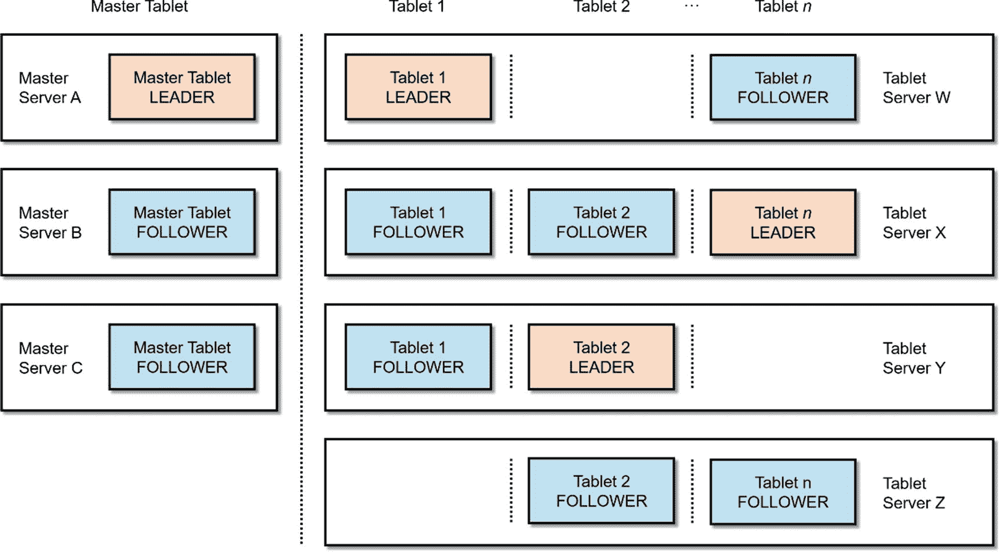
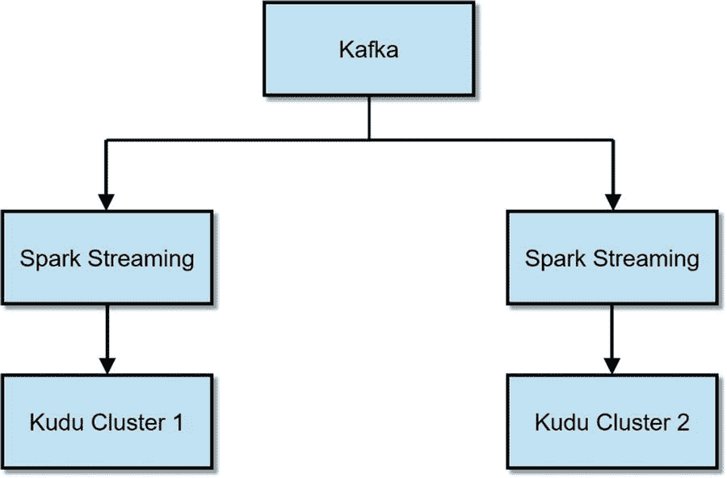
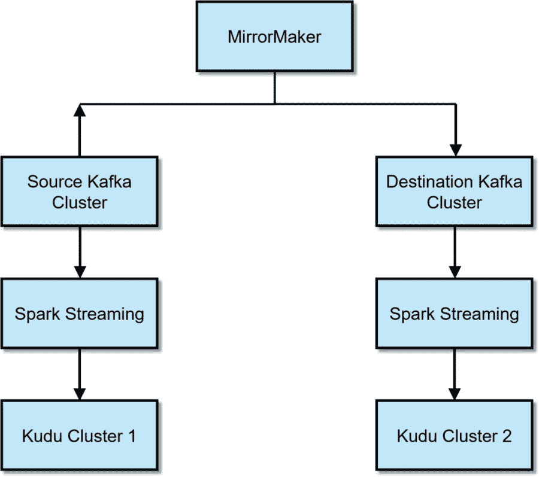
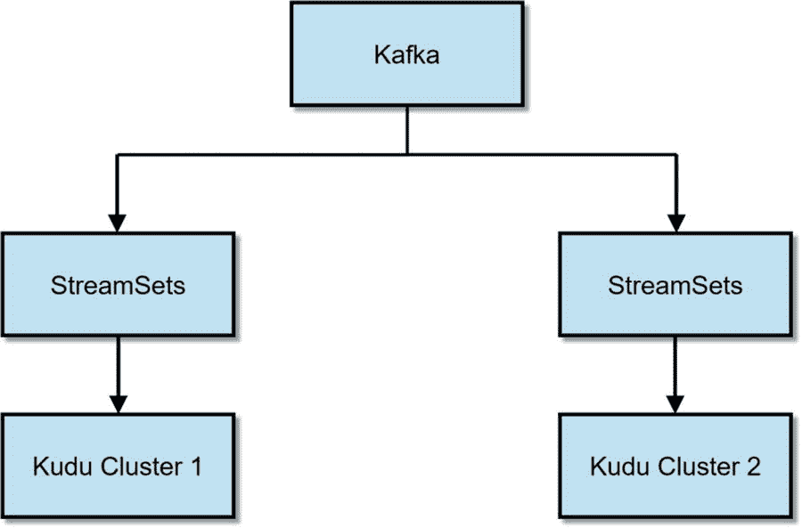
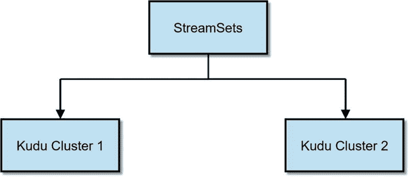

# 二、Kudu 简介

Kudu 是一个 Apache 许可的开源列存储引擎，为 Apache Hadoop 平台构建。它支持快速顺序和随机读写，支持实时流处理和分析工作负载。 [<sup>i</sup>](#Sec62) 它与 Impala 集成，允许您使用 SQL 插入、删除、更新、向上插入和检索数据。Kudu 还与 Spark(和 MapReduce)集成，用于快速和可扩展的数据处理和分析。像 Apache Hadoop 生态系统中的其他项目一样，Kudu 运行在商用硬件上，并被设计为高度可伸缩和高度可用。

Apache Kudu 项目由 Cloudera 的软件工程师 Todd Lipcon 于 2012 年创立，他是 Hadoop、HBase 和 Thrift 项目的 PMC 成员和委员。 [<sup>ii</sup>](#Sec62) Kudu 的开发是为了解决 HDFS 和 HBase 的局限性，同时结合两者的优势。虽然 HDFS 支持快速分析和大型表扫描，但存储在 HDFS 的文件是不可变的，只能在创建后追加。 [<sup>iii</sup>](#Sec62) HBase 使更新和随机访问数据成为可能，但对于分析工作负载来说速度较慢。Kudu 可以处理高速数据和实时分析，允许您同时更新 Kudu 表和运行分析工作负载。在某些情况下，HDFS 上的批处理和分析仍然略快于 Kudu，HBase 在随机读写性能方面优于 Kudu。Kudu 在中间的某个地方。如图 [2-1](#Fig1) 所示，在随机读取和写入方面，Kudu 的性能与 HDFS 的 Parquet (Kudu 在某些情况下更快)和 HBase 非常接近，因此大多数时候性能差异可以忽略不计。


图 2-1

High-level performance comparison of HDFS, Kudu, and HBase

在 Kudu 之前，一些数据工程师使用一种称为 Lambda 架构的数据处理架构来解决 HDFS 和 HBase 的局限性。Lambda 架构有一个速度和批处理层(从技术上讲，还有一个服务层)。交易数据转到速度层(通常是 HBase ),用户在这里可以立即访问最新数据。速度层的数据以拼花格式定期(每小时或每天)复制到批处理层(通常为 HDFS ),用于报告和分析。正如您在图 [2-2](#Fig2) 中看到的，数据被复制了两次，数据流水线比 Lambda 架构所需的更复杂。这有点类似于典型的企业数据仓库环境，其中 OLTP 数据库代表“速度层”，数据仓库充当“批处理层”


图 2-2

Lambda Architecture

Kudu 使 Lambda 架构过时，因为它能够同时处理随机读写和分析工作负载。如图 [2-3](#Fig3) 所示，有了 Kudu，就不会有数据重复，数据管道也简单多了。


图 2-3

Modern data ingest pipeline using Kudu

## Kudu 代表结构化数据

Kudu 被设计用来存储类似于关系数据库的结构化数据。事实上，Kudu(与 Impala 一起使用时)通常用于关系数据管理和分析。Kudu 在功能、性能和可伸缩性方面与商业数据仓库平台不相上下。我们将在本章后面讨论 Impala 和 Kudu 的集成，并在第 4 章中更详细地讨论。

## 用例

在开始之前，先说一下 Kudu 不是什么。库都并不是要取代 HBase 或者 HDFS。HBase 是一个无模式的 NoSQL 风格的数据存储，这使得它适用于稀疏数据或需要可变模式的应用程序。HBase 专为需要随机读写的 OLTP 类型工作负载而设计。有关 HBase 的更多信息，请参见 HBase 在线文档。

HDFS 旨在存储所有类型的数据:结构化、半结构化和非结构化。如果您需要将数据存储在高度可伸缩的文件系统中，HDFS 是一个很好的选择。如前所述，在运行分析工作负载时，HDFS(使用 Parquet)在某些情况下仍然比 Kudu 快。有关 HDFS 的更多信息，请参阅 HDFS 在线文档。

如前所述，Kudu 擅长存储结构化数据。它没有 SQL 接口，因此您需要将 Kudu 与 Impala 配对。通常认为应该存储在关系数据库或时间序列数据库中的数据也很可能存储在 Kudu 中。下面是一些可以利用 Kudu 的用例。 [<sup>iv</sup>](#Sec62)

### 关系数据管理和分析

Kudu(与 Impala 一起使用时)展示了关系数据库的大部分特征。它在行和列中存储数据，并在数据库和表中组织它们。Impala 提供了一个高度可伸缩的 MPP SQL 引擎，允许您使用 ANSI SQL 命令与 Kudu 表进行交互，就像使用关系数据库一样。关系数据库用例可以分为两大类，联机事务处理(OLTP)和决策支持系统(DSS ),或者用现代术语来说就是数据仓库。Kudu 不是为 OLTP 设计的，但是它可以用于数据仓库和其他企业数据仓库(EDW)现代化用例。

#### 数据库

Kudu 可用于维度建模——现代数据仓库和在线分析处理(OLAP)的基础。Kudu 缺少外键约束、自动递增列和其他一些您通常会在传统数据仓库平台中发现的特性；但是，这些限制并不妨碍您在事实和维度表中组织数据。通过 ODBC/JDBC，可以使用您最喜欢的 BI 和 OLAP 工具访问 Impala。我在第 8 章中讨论了使用 Impala 和 Kudu 的数据仓库。

#### ETL 卸载

ETL 卸载是您可以使用 Kudu 的许多 EDW 优化用例之一。由于 ETL 流程的运行时间远远超出了其处理窗口，并且进入了工作时间，因此关键报告对整个组织都不可用。通过将耗时的 ETL 处理卸载到廉价的 Kudu 集群，ETL 作业可以在工作时间之前完成，从而在业务用户需要时为他们提供关键的报告和分析。我在第 8 章中讨论了使用 Impala 和 Kudu 的 ETL 卸载。

#### 分析卸载和活动归档

Impala 是一个非常快速和可伸缩的 MPP SQL 引擎。通过将一些特别的查询和报告重定向到 Impala 和 Kudu，可以减轻企业数据仓库的负载。与花费数百万美元升级您的数据仓库相比，分析卸载和活动归档是优化您的 EDW 环境的更智能、更具成本效益的方式。我在第 [8](08.html) 章中讨论了使用 Impala 和 Kudu 的分析卸载和主动归档。

#### 数据整合

对于大型组织来说，将数百或数千个遗留数据库分散在整个企业中并不罕见，这需要支付数百万美元的许可、管理和基础架构成本。通过将这些数据库整合到一个 Kudu 集群中，并使用 Impala 提供 SQL 访问，您可以显著降低成本，同时提高性能和可伸缩性。我在第 8 章中讨论了使用 Impala 和 Kudu 的数据整合。

### 物联网与时间序列

Kudu 非常适合物联网和时间序列应用，在这些应用中，传感器数据的实时数据摄取、可视化和复杂事件处理至关重要。小米、 [<sup>v</sup>](#Sec62) 和澳洲国防部 [<sup>vi</sup>](#Sec62) 等几家大公司和政府机构都在成功使用 Kudu 进行物联网用例。我在第 [7](07.html) 章使用 Impala、Kudu 和 StreamSets 讨论物联网、实时数据摄取和复杂事件处理。我在第 9 章[中讨论了使用 Zoomdata 的实时数据可视化。](09.html)

### 机器学习平台的特征存储

数据科学团队通常会创建一个集中的功能库，他们可以在其中发布并与其他团队共享精选的权威功能集，以创建机器学习模型。使用不可变的数据格式(如 ORC 和 Parquet)创建和维护特征存储非常耗时、麻烦，并且需要太多不必要的艰苦工作，尤其是对于大型数据集。使用 Kudu 作为快速和高度可扩展的可变特征库，数据科学家和工程师可以使用熟悉的 SQL 语句轻松更新和添加特征。在数据科学家不断迭代构建、测试和提高预测模型准确性的敏捷环境中，在数秒或数分钟内更新要素库的能力至关重要。在第 [6](06.html) 章中，我们使用 Kudu 作为使用 Spark MLlib 构建预测机器学习模型的特征库。

Note

Kudu 允许每个表最多 300 列。如果需要存储 300 个以上的特性，HBase 是比较合适的存储引擎。HBase 表可以包含数千或数百万列。使用 HBase 的缺点是，与 Kudu 相比，它在处理全表扫描时效率不高。Apache Kudu 社区正在讨论在 Kudu 的未来版本中解决 300 列的限制。

严格来说，可以通过设置不安全标志来绕过 Kudu 的 300 列限制。例如，如果您需要创建一个包含 1000 列的 Kudu 表，您可以使用以下标志启动 Kudu master:-unlock-unsafe-flags-max-num-columns = 1000。这还没有经过 Kudu 开发团队的彻底测试，因此不建议用于生产。

## 关键概念

Kudu 引入了几个概念来描述其架构的不同部分。

表 A 表是 Kudu 中存储数据的地方。每个 Kudu 表都有一个主键，并被分成称为 tablets 的段。

平板电脑平板电脑或隔板是桌子的一部分。

平板电脑服务器平板电脑服务器存储平板电脑并向客户端提供平板电脑。

主设备主设备跟踪所有集群元数据并协调元数据操作。

所有集群元数据的目录表中央存储。目录表存储有关桌子和平板电脑的位置、它们的当前状态以及副本数量的信息。目录表存储在主数据库中。

## 体系结构

类似于其他 Hadoop 组件的设计，如 HDFS 和 HBase(以及他们的谷歌同行 BigTable 和 GFS)，Kudu 有一个主从架构。如图 [2-4](#Fig4) 所示，Kudu 由一个或多个主服务器组成，负责集群协调和元数据管理。Kudu 还拥有一台或多台平板电脑服务器，用于存储数据并提供给客户端应用程序。 [<sup>vii</sup>](#Sec62) 对于一个平板来说，任何时候都只能有一个代理大师，领袖。如果领导变得不可用，则另一个主设备被选举成为新的领导。类似于主，一个平板服务器充当领导者，其余的都是跟随者。所有写请求都发送给领导者，而读请求则发送给领导者或副本。存储在 Kudu 中的数据使用 Raft Consensus 算法进行复制，只要副本总数中的大部分仍然可用，就可以保证数据的可用性在一些副本丢失后仍然存在。只要有可能，Kudu 就会复制逻辑操作而不是实际的物理数据，从而限制跨集群的数据移动量。

Note

Raft 共识算法在 Diego Ongaro 和 John Ousterhout 所著的《Raft 论文:寻找可理解的共识算法(扩展版)》中有详细描述。 [<sup>viii</sup>](#Sec62) 迭戈·翁加罗(Diego Ongaro)的博士论文《共识:桥接理论与实践》(Consensus:Bridging Theory and Practice)，由斯坦福大学于 2014 年发表，对论文内容进行了更详细的阐述。[T5】IXT7】](#Sec62)



图 2-4

Kudu Architecture

## 多版本并发控制(MVCC)

大多数现代数据库使用某种形式的并发控制来确保读取一致性，而不是传统的锁定机制。Oracle 从 6.0 版开始就有了多版本一致性模型。 [<sup>x</sup>](#Sec62) Oracle 使用回滚段中维护的数据来提供读取一致性。回滚段包含已被未提交或最近提交的事务修改的先前数据。 [<sup>xi</sup>](#Sec62) MemSQL 和 SAP HANA 也使用 MVCC 管理并发。最初，SQL Server 只支持悲观并发模型，使用锁定来强制并发。结果，读者屏蔽作家，作家屏蔽读者。随着并发用户和操作数量的增加，阻塞问题和锁争用的可能性也会增加，从而导致性能和可伸缩性问题。SQL Server 领域的情况变得如此糟糕，以至于开发人员和 DBA 不得不在查询中使用 NOLOCK 提示，或者设置 READ UNCOMITTED 隔离级别，容忍脏读以换取较小的性能提升。从 SQL Server 2005 开始，微软引入了自己的多版本并发控制版本，称为行级版本控制。 [<sup>xii</sup>](#Sec62) SQL Server 没有相当于回滚段的功能，所以它使用 tempdb 来存储以前提交的数据。Teradata 没有多版本一致性模型，依赖事务和锁来实现并发控制。 [<sup>十三</sup>](#Sec62)

与 Oracle、MemSQL 和 SAP HANA 类似，Kudu 使用多版本并发控制来确保读取一致性。 [<sup>xiv</sup>](#Sec62) 读者不屏蔽作家，作家不屏蔽读者。Kudu 的乐观并发模型意味着在大型全表扫描期间不需要操作来获取锁，从而大大提高了查询性能和可伸缩性。

## 黑斑羚和库杜

Impala 是 Kudu 默认的 MPP SQL 引擎。Impala 允许您使用 SQL 与 Kudu 进行交互。如果您有使用 SQL 和存储引擎紧密集成的传统关系数据库的经验，您可能会发现 Kudu 和 Impala 相互解耦并不常见。Impala 旨在与其他存储引擎(如 HDFS、HBase 和 S3)一起工作，而不仅仅是 Kudu。将其他 SQL 引擎如 Apache Drill (DRILL-4241)和 Hive (HIVE-12971)与 Kudu 集成的工作也在进行中。解耦存储、SQL 和处理引擎是开源社区的常见做法。

Impala-Kudu 的整合非常成功，但仍有工作要做。虽然它在性能和可伸缩性方面与传统的数据仓库平台相当或者超过了传统的数据仓库平台，但是 Impala-Kudu 缺乏大多数传统数据仓库平台中的一些企业特性。我们将在本章后面讨论其中的一些限制。

### 主关键字

每个 Kudu 表都需要有一个主键。Kudu 的主键是作为聚集索引实现的。对于聚集索引，行以与索引相同的顺序物理存储在 tablet 中。还要注意，Kudu 没有自动递增特性，所以在向 Kudu 表中插入行时，必须包含唯一的主键值。如果没有主键值，可以使用 Impala 内置的 uuid()函数或另一种方法生成唯一值。

### 数据类型

和其他关系数据库一样，Kudu 支持各种数据类型(表 [2-1](#Tab1) )。

表 2-1

List of Data Types, with Available and Default Encoding

<colgroup><col align="left"> <col align="left"> <col align="left"></colgroup> 
| 数据类型 | 编码 | 默认 |
| :-- | :-- | :-- |
| 布尔 | 普通，游程长度 | 运行长度 |
| 8 位有符号整数 | 普通、位洗牌、游程长度 | 比特洗牌 |
| 16 位有符号整数 | 普通、位洗牌、游程长度 | 比特洗牌 |
| 32 位有符号整数 | 普通、位洗牌、游程长度 | 比特洗牌 |
| 64 位有符号整数 | 普通、位洗牌、游程长度 | 比特洗牌 |
| unixtime_micros(自 Unix 纪元以来的 64 位微秒) | 普通、位洗牌、游程长度 | 比特洗牌 |
| 单精度(32 位)IEEE-754 浮点数 | 普通，位图 | 比特洗牌 |
| 双精度(64 位)IEEE-754 浮点数 | 普通，位图 | 比特洗牌 |
| UTF-8 编码字符串(未压缩时最大 64KB) | 普通，前缀，字典 | 词典 |
| 二进制(最多 64KB 未压缩) | 普通，前缀，字典 | 词典 |

您可能注意到 Kudu 目前不支持 decimal 数据类型。这是 Kudu 的一个关键限制。float 和 double 数据类型仅存储非常接近的值，而不是 IEEE 754 规范中定义的精确值。 [<sup>xv</sup>](#Sec62) 由于这种行为，float 和 double 都不适合存储财务数据。在撰写本文时，对十进制数据类型的支持仍在开发中(Apache Kudu 1.5 / CDH 5.13)。十进制支持在 Kudu 1.7 中到来。更多详情请查看 KUDU-721。有各种解决方法。您可以将财务数据存储为字符串，然后在每次需要读取数据时使用 Impala 将值转换为十进制。因为 Parquet 支持小数，所以另一个解决方法是对事实表使用 Parquet，对维度表使用 Kudu。

如表 [2-1](#Tab1) 所示，根据列的类型，Kudu 列可以使用不同的编码类型。支持的编码类型包括普通、位混洗、游程、字典和前缀。默认情况下，Kudu 列是未压缩的。Kudu 支持使用 Snappy、zlib 或 LZ4 压缩编解码器进行列压缩。有关 Kudu 编码和压缩支持的更多细节，请参考 Kudu 的文档。

Note

在 Kudu 的早期版本中，日期和时间被表示为 BIGINT。从 Impala 2.9/CDH 5.12 开始，可以在 Kudu 表中使用时间戳数据类型。然而，有几件事要记住。Kudu 使用 64 位值表示日期和时间列，而 Impala 使用 96 位值表示日期和时间。存储在 Kudu 中时，Impala 生成的纳秒值四舍五入。在读写时间戳列时，Kudu 的 64 位表示和 Impala 的 96 位表示之间存在转换开销。有两种解决方法:使用 Kudu 客户端 API 或 Spark 来插入数据，或者继续使用 BIGINT 来表示日期和时间。[<sup>XVI</sup>T3】](#Sec62)

### 分割

表分区是增强 Kudu 表的性能、可用性和可管理性的常用方法。分区允许将表细分成更小的部分，即片。分区使 Kudu 能够以更精细的粒度访问表，从而利用分区修剪。所有 Kudu 表都需要进行表分区，表分区对应用程序是完全透明的。Kudu 支持散列、范围、复合散列-范围和散列-散列分区。下面是 Kudu 中分区的几个例子。

#### 哈希分区

有时，为了避免 IO 瓶颈，需要在分区之间随机均匀地分布数据。使用哈希分区，数据根据应用于分区键的哈希函数放入分区。并不是说不允许在散列分区表上添加分区。如果希望添加更多的分区，就必须重建整个散列分区表。

```scala
CREATE TABLE myTable (
 id BIGINT NOT NULL,
 name STRING,
 PRIMARY KEY(id)
)
PARTITION BY HASH PARTITIONS 4
STORED AS KUDU;

```

#### 范围划分

范围分区根据每个分区的分区键值的预定义范围将数据存储在分区中。范围分区允许向表中添加新的分区，从而增强了分区的可管理性。它还通过分区修剪提高了读取操作的性能。一个缺点是:如果按分区键顺序插入数据，范围分区会导致热点。

```scala
CREATE TABLE myTable (
  year INT,
  deviceid INT,
  totalamt INT,
  PRIMARY KEY (deviceid, year)
)
PARTITION BY RANGE (year) (
  PARTITION VALUE = 2016,
  PARTITION VALUE = 2017,
  PARTITION VALUE = 2018
)
STORED AS KUDU;

```

#### 哈希范围分区

散列范围分区结合了散列和范围分区的优点，同时最大限度地减少了它们的限制。使用哈希分区可确保写入 IO 均匀分布在平板电脑服务器上，而使用范围分区可确保可以添加新的平板电脑来适应未来的增长。

```scala
CREATE TABLE myTable (
 id BIGINT NOT NULL,
 sensortimestamp BIGINT NOT NULL,
 sensorid INTEGER,
 temperature INTEGER,
 pressure INTEGER,
 PRIMARY KEY(rowid,sensortimestamp)
)
PARTITION BY HASH (id) PARTITIONS 16,
RANGE (sensortimestamp)
(

PARTITION unix_timestamp('2017-01-01') <= VALUES < unix_timestamp('2018-01-01'),
PARTITION unix_timestamp('2018-01-01') <= VALUES < unix_timestamp('2019-01-01'),
PARTITION unix_timestamp('2019-01-01') <= VALUES < unix_timestamp('2020-01-01')
)
STORED AS KUDU;

```

我将在第 4 章中更详细地讨论表分区。

## Spark 和酷都

Spark 是 Kudu 理想的数据处理和摄取工具。Spark SQL 和 DataFrame API 使得与 Kudu 的交互变得很容易。我将在第 [6](06.html) 章更详细地讨论 Spark 和 Kudu 集成。

您可以通过 DataFrame API 将 Spark 与 Kudu 结合使用。您可以使用 spark-shell 或 spark-submit 中的- packages 选项来包含 kudu-spark 依赖项。您还可以从 central.maven.org 手动下载 jar 文件，并将其包含在您的- jars 选项中。如果您在 Scala 2.11 中使用 spark2，请使用 kudu-spark2_2.11 工件。例如:

```scala
spark-shell –-packages org.apache.kudu:kudu-spark2_2.11:1.1.0
spark-shell --jars kudu-spark2_2.11-1.1.0.jar

```

### 酷都语境

您使用 Kudu 上下文来对 Kudu 表执行 DML 语句。 [<sup>xvii</sup>](#Sec62) 例如，如果我们需要将数据插入一个 Kudu 表中:

```scala
import org.apache.kudu.spark.kudu._
val kuduContext = new KuduContext("kudumaster01:7051")
case class CustomerData(id: Long, name: String, age: Short)

val data = Array(CustomerData(101,"Lisa Kim",60), CustomerData(102,"Casey Fernandez",45))

val insertRDD = sc.parallelize(data)
val insertDF = sqlContext.createDataFrame(insertRDD)

insertDF.show

+----------+---------------+---+
|customerid|           name|age|
+----------+---------------+---+
|       101|       Lisa Kim| 60|
|       102|Casey Fernandez| 45|
+----------+---------------+---+

```

将数据帧插入 Kudu 表。我假设该表已经存在。

```scala
kuduContext.insertRows(insertDF, "impala::default.customers")

```

确认数据已成功插入。

```scala
val df = sqlContext.read.options(Map("kudu.master" -> "kuducluster:7051","kudu.table" -> "impala::default.customers")).kudu
df.select("id","name","age").show()

+---+---------------+---+
| id|           name|age|
+---+---------------+---+
|102|Casey Fernandez| 45|
|101|       Lisa Kim| 60|
+---+---------------+---+

```

我将在第 [6](06.html) 章更详细地讨论 Spark 和 Kudu 集成。

Note

从 Kudu 1.6 开始，Spark 通过利用扫描局部性来提高性能。Spark 将扫描最近的平板电脑副本，而不是扫描领导者，领导者可能在不同的平板电脑服务器中。

#### Spark 流和 Kudu

在清单 [2-1](#Par56) 所示的示例中，我们将使用 Flafka (Flume 和 Kafka)和 Spark Streaming 从 Flume spooldir 源读取数据，将其存储在 Kafka 中，并使用 Spark Streaming 处理数据并将其写入 Kudu。

Spark 2.0 中包含了一个基于 Spark SQL 的新的流处理引擎，称为结构化流。从 Spark 2.2.0 开始，结构化流的实验标签已经被移除。然而，在撰写本文时，Cloudera 仍然不支持结构化流(CDH 5.13)。第 [7](07.html) 章更详细地描述了 Flafka 和 Spark 流。

```scala
import org.apache.kudu.client.CreateTableOptions;
import org.apache.kudu.spark.kudu._
import org.apache.spark._
import org.apache.spark.rdd.NewHadoopRDD
import org.apache.spark.SparkConf
import org.apache.spark.storage.StorageLevel
import org.apache.spark.streaming.flume._
import org.apache.spark.streaming.Seconds
import org.apache.spark.streaming.StreamingContext
import org.apache.spark.util.IntParam
import org.apache.spark.sql.SQLContext

object FlumeStreaming {

   case class MySensorData(tableid: String, deviceid: String, thedate: String, thetime: String, temp: Short, status: String)

    def readSensorData(str: String): MySensorData = {
      val col = str.split(",")

      val thetableid = col(0)
      val thedeviceid = col(1)
      val thedate = col(2)
      val thetime = col(3)
      val thetemp = col(4)
      val thestatus = col(5)

      MySensorData(col(0), col(1), col(2), col(3), col(4).toShort, col(5))
    }

  def main(args: Array[String]) {

    val sparkConf = new SparkConf().setMaster("local[2]").setAppName("FlumeStreaming")
    val sc = new SparkContext(sparkConf)
    val ssc = new StreamingContext(sc, Seconds(1))

       // the arguments are for host name and port number
    val flumeStream = FlumeUtils.createPollingStream(ssc,args(0),args(1).toInt)

    val sensorDStream = flumeStream.map (x => new String(x.event.getBody.array)).map(readSensorData)

    sensorDStream.foreachRDD {rdd =>

             val sqlContext = new SQLContext(sc)
             import sqlContext.implicits._
             val kuduContext = new KuduContext("kudumaster01:7051")

// convert the RDD into a DataFrame and insert it into the Kudu table

             val DataDF = rdd.toDF
             kuduContext.insertRows(DataDF, "impala::default.sensortable")

             DataDF.registerTempTable("currentDF")

             // Update the table based on the thresholds

             val WarningFilteredDF = sqlContext.sql("select * from currentDF where temp > 50 and temp <= 60")
             WarningFilteredDF.registerTempTable("warningtable")
             val UpdatedWarningDF = sqlContext.sql("select tableid,deviceid,thedate,thetime,temp,'WARNING' as status from warningtable")
             kuduContext.updateRows(UpdatedWarningDF, "impala::default.sensortable")

             val CriticalFilteredDF = sqlContext.sql("select * from currentDF where temp > 61")
             CriticalFilteredDF.registerTempTable("criticaltable")
             val UpdatedCriticalDF = sqlContext.sql("select tableid,deviceid,thedate,thetime,temp,'CRITICAL' as status from criticaltable")
             kuduContext.updateRows(UpdatedCriticalDF, "impala::default.sensortable")

     }

    ssc.start()
    ssc.awaitTermination()

  }

}

Listing 2-1Spark Streaming and Kudu

```

清单 [2-2](#Par58) 显示了 flume 配置文件，其中 Kafka 被用作 flume 通道。

```scala
agent1.sources  = source1
agent1.channels = channel1
agent1.sinks = spark

agent1.sources.source1.type = spooldir
agent1.sources.source1.spoolDir = /tmp/streaming
agent1.sources.source1.channels = channel1

agent1.channels.channel1.type = org.apache.flume.channel.kafka.KafkaChannel
agent1.channels.channel1.brokerList = kafkabroker01:9092, kafkabroker02:9092, kafkabroker03:9092
agent1.channels.channel1.zookeeperConnect = server03:2181
agent1.channels.channel1.topic = mytopic

agent1.sinks.spark.type = org.apache.spark.streaming.flume.sink.SparkSink
agent1.sinks.spark.hostname = 127.0.0.1
agent1.sinks.spark.port =  9999
agent1.sinks.spark.channel = channel1
agent1.sinks.spark.batchSize=5

Listing 2-2Flume configuration file

```

编译完包后，将应用程序提交给集群来执行它。

```scala
spark-submit \
--class FlumeStreaming \
--jars kudu-spark_2.10-0.10.0.jar \
--master yarn-client \
--driver-memory=512m \
--executor-memory=512m \
--executor-cores 4  \
/mydir/spark/flume_streaming_kudu/target/scala-2.10/test-app_2.10-1.0.jar \ localhost 9999

```

带 Spark 流和 Kudu 的 Flafka 管道应如图 [2-5](#Fig5) 所示。


图 2-5

A Flafka pipeline with Spark Streaming and Kudu

## Kudu C++、Java 和 Python 客户端 API

Kudu 提供了 NoSQL 风格的 Java、C++和 Python 客户端 API。需要 Kudu 提供最佳性能的应用程序应该使用客户端 API。事实上，第 7 章中讨论的一些数据摄取工具，比如 StreamSets、CDAP 和 Talend，利用客户端 API 将数据摄取到 Kudu 中。通过 API 对 DML 的修改可以立即在 Impala 中进行查询，而不需要执行无效元数据。

### Kudu Java 客户端 API

清单 [2-3](#Par64) 提供了一个使用 Java 客户端 API 的例子。

```scala
import org.apache.kudu.ColumnSchema;
import org.apache.kudu.Schema;
import org.apache.kudu.Type;
import org.apache.kudu.client.*;

import java.util.ArrayList;
import java.util.List;

public class JavaKuduClient {

  public static void main(String[] args) {

// Create Kudu client object

KuduClient myKuduClient = new KuduClient.KuduClientBuilder("kudumaster01").build();

// Create the schema

         List<ColumnSchema> myColumns = new ArrayList(3);
      myColumns.add(new ColumnSchema.ColumnSchemaBuilder("rowid", Type.INT32)
          .key(true)
          .build());
      myColumns.add(new ColumnSchema.ColumnSchemaBuilder("customername", Type.STRING)
          .build());
         myColumns.add(new ColumnSchema.ColumnSchemaBuilder("customerage", Type.INT8)
          .build());
      List<String> partKeys = new ArrayList<>();
      partKeys.add("key");

// Create the table based on the schema

      Schema mySchema = new Schema(myColumns);
      client.createTable("CustomersTbl", mySchema, new CreateTableOptions().setRangePartitionColumns(partKeys));

// Open the Kudu table

      KuduTable myTable = myKuduClient.openTable("CustomersTbl");
      KuduSession mySession = myKuduClient.newSession();

// Insert new rows

        Insert myInsert = myTable.newInsert();
        myInsert.getRow().addInt("rowid", 1);
        myInsert.getRow().addString("customername", "Jerry Walsh");
             myInsert.getRow().addInt("customerage", 64)
             mySession.apply(myInsert);

// Update existing rows

        Update myUpdate = myTable.newUpdate();
        myUpdate.getRow().addInt("rowid", 1);
        myUpdate.getRow().addString("customername", "Jerome Walsh");
             myUpdate.getRow().addInt("customerage", 65)
             mySession.apply(myUpdate);

// Upsert rows

        Upsert myUpsert = myTable.newUpsert();
        myUpsert.getRow().addInt("rowid", 2);
        myUpsert.getRow().addString("customername", "Tim Stein");
             myUpsert.getRow().addInt("customerage", 49)
             myUpsert.apply(myUpdate);

// Delete row
             Delete myDelete = myTable.newDelete()
             myDelete.getrow().addString("rowid", 1);
             mySession.apply(myDelete)

// Display rows

      List<String> myColumns = new ArrayList<String>();
      myColumns.add("rowid");
         myColumns.add("customername");
         myColumns.add("customerage");

      KuduScanner myScanner = myClient.newScannerBuilder(myTable)
          .setProjectedColumnNames(myColumns)
          .build();

      while (myScanner.hasMoreRows()) {
        RowResultIterator myResultIterator = myScanner.nextRows();
        while (myResultIterator.hasNext()) {
          RowResult myRow = myResultIterator.next();
          System.out.println(myRow.getInt("rowid"));
               System.out.println(myRow.getString("customername"));
               System.out.println(myRow.getString("customerage"));
        }
       }  

// Delete table

        myKuduClient.deleteTable(myTable);

// Close the connection

        myKuduClient.shutdown();

  }
}

Listing 2-3Sample Java code using the Kudu client API

```

#### Maven 工件

pom.xml 文件中需要以下内容。

```scala
<dependency>
  <groupId>org.apache.kudu</groupId>
  <artifactId>kudu-client</artifactId>
  <version>1.1.0</version>
</dependency>

```

### Kudu Python 客户端 API

Python 客户端 API 提供了一种与 Kudu 交互的简单方法。Python API 仍处于试验阶段，可能会随时更改。参见清单 [2-4](#Par68) 中的示例。

```scala
import kudu
from kudu.client import Partitioning
from datetime import datetime

# Connect to Kudu
myclient = kudu.connect(host='kudumaster01', port=7051)

# Define the columns
mybuilder = kudu.schema_builder()
mybuilder.add_column('rowid').type(kudu.int64).nullable(False).primary_key()
mybuilder.add_column('customername', type_=kudu.string, nullable=False)
mybuilder.add_column('customerage', type_=kudu.int8, nullable=False)
myschema = mybuilder.build()

# Define partitioning method
mypartitioning = Partitioning().add_hash_partitions(column_names=['rowid'], num_buckets=24)

# Create new table
myclient.create_table('customers', myschema, mypartitioning)

# Open a table
mytable = myclient.table('customers')

# Create a new session
mysession = client.new_session()

# Insert a row
myinsert = mytable.new_insert({'rowid': 1, 'customername': "Jason Weinstein", 'customerage': 62})
mysession.apply(myinsert)

# Upsert a row
myupsert = mytable.new_upsert({'rowid': 2, 'customername': "Frank Nunez", 'customerage': 47})
session.apply(myupsert)

# Updating a row
myupdate = table.new_update({'rowid': 1, 'customername': "Jason Dean Weinstein"})
session.apply(myupdate)

# Delete a row
mydelete = table.new_delete({'rowid': 1})
session.apply(mydelete`)

# Flush the session
mysession.flush()

# Create a scanner with a predicate
myscanner = mytable.scanner()
myscanner.add_predicate(table['customerage'] < 50)

# Read the data. Note that this method doesn't scale well for large table scans
myresult = myscanner.open().read_all_tuples()

Listing 2-4Sample Python code using the Kudu client API

```

### Kudu C++客户端 API

Kudu 还提供了一个 C++客户端 API。参见清单 [2-5](#Par70) 中的示例。

```scala
#include <ctime>
#include <iostream>
#include <sstream>

#include "kudu/client/callbacks.h"
#include "kudu/client/client.h"
#include "kudu/client/row_result.h"
#include "kudu/client/stubs.h"
#include "kudu/client/value.h"
#include "kudu/client/write_op.h"
#include "kudu/common/partial_row.h"
#include "kudu/util/monotime.h"

using kudu::client::KuduClient;
using kudu::client::KuduClientBuilder;
using kudu::client::KuduColumnSchema;
using kudu::client::KuduError;
using kudu::client::KuduInsert;
using kudu::client::KuduPredicate;
using kudu::client::KuduRowResult;
using kudu::client::KuduScanner;
using kudu::client::KuduSchema;
using kudu::client::KuduSchemaBuilder;
using kudu::client::KuduSession;
using kudu::client::KuduStatusFunctionCallback;
using kudu::client::KuduTable;
using kudu::client::KuduTableAlterer;
using kudu::client::KuduTableCreator;
using kudu::client::KuduValue;
using kudu::client::sp::shared_ptr;
using kudu::KuduPartialRow;
using kudu::MonoDelta;
using kudu::Status;

using std::string;
using std::vector;

int main(int argc, char* argv[]) {

  // Enable verbose debugging for the client library.
  // Set parameter to 0 to disable
  kudu::client::SetVerboseLogLevel(2);

  // Create and connect a client.
  shared_ptr<KuduClient> client;
  KUDU_CHECK_OK(KuduClientBuilder().add_master_server_addr("kudumaster01:7051").Build(&client));
  KUDU_LOG(INFO) << "Client connection created.";

  // Create a schema.
  // Available data types:  INT8 = 0, INT16 = 1, INT32 = 2,
  // INT64 = 3, STRING = 4, BOOL = 5, FLOAT = 6, DOUBLE = 7,
  // BINARY = 8, UNIXTIME_MICROS = 9, TIMESTAMP = UNIXTIME_MICROS
  KuduSchema mytable_schema;
  KuduSchemaBuilder mytable_builder;
  categories_builder.AddColumn("rowid")->Type(KuduColumnSchema::INT32)->NotNull();
  categories_builder.AddColumn("name")->Type(KuduColumnSchema::STRING)->NotNull();
  categories_builder.AddColumn("age")->Type(KuduColumnSchema::INT8)->NotNull();
  categories_builder.AddColumn("salary")->Type(KuduColumnSchema::DOUBLE)->NotNull();
  categories_builder.SetPrimaryKey({"rowid"});
  KUDU_CHECK_OK(categories_builder.Build(&mytable_schema));
  KUDU_LOG(INFO) << "Created a schema for mytable";

  // Delete table if it exists
  bool exists;
  KUDU_CHECK_OK(client->TableExists("mytable", &exists));
  if (exists) {
    KUDU_CHECK_OK(client->DeleteTable("mytable"));
       KUDU_LOG(INFO) << "Deleting table if it exists.";
  }

   // Generate the split keys for the table.
  vector<const KuduPartialRow*> splits;
  int32_t num_tablets = 20
  int32_t increment = 1000 / num_tablets;
  for (int32_t i = 1; i < num_tablets; i++) {
    KuduPartialRow* row = mytable_schema.NewRow();
    KUDU_CHECK_OK(row->SetInt32(0, i * increment));
    splits.push_back(row);
  }

  vector<string> column_names;
  column_names.push_back("rowid");

  // Create the table.
  KuduTableCreator* table_creator = client->NewTableCreator();

  KUDU_CHECK_OK(table_creator->table_name("mytable")
        .schema(&mytable_schema)
      .set_range_partition_columns(column_names)
      .split_rows(splits)
      .Create());

  // Confirm if the table was successfully created
  bool created;
  KUDU_CHECK_OK(client->TableExists("mytable", &created));
  created ? KUDU_LOG(INFO) << "Created table mytable." :
            KUDU_LOG(INFO) << "Failed to create table mytable.";

  // Insert two rows into the table.
  shared_ptr<KuduTable> table;
  client->OpenTable("mytable", &table);

  KuduInsert* my_insert = table->NewInsert();
  KuduPartialRow* row = categories_insert->mutable_row();
  KUDU_CHECK_OK(row->SetInt32("rowid", 100));
  KUDU_CHECK_OK(row->SetStringCopy("name", "Fred Smith"));
  KUDU_CHECK_OK(row->SetInt8("age", 56));
  KUDU_CHECK_OK(row->SetDouble("salary", 110000));
  KUDU_CHECK_OK(session->Apply(my_insert));

  KuduInsert* my_insert = table->NewInsert();
  KuduPartialRow* row = categories_insert->mutable_row();
  KUDU_CHECK_OK(row->SetInt32("rowid", 101));
  KUDU_CHECK_OK(row->SetStringCopy("name", "Linda Stern"));
  KUDU_CHECK_OK(row->SetInt8("age", 29));
  KUDU_CHECK_OK(row->SetDouble("salary", 75000));
  KUDU_CHECK_OK(session->Apply(my_insert));

  KUDU_CHECK_OK(session->Flush());
  KUDU_LOG(INFO) << "Inserted two rows into mytable";

  // Scan one row based on a predicate

  KuduScanner scanner(table.get());

  // Add a predicate: WHERE name = "Linda Stern"
  KuduPredicate* pred = table->NewComparisonPredicate(
      "name", KuduPredicate::EQUAL, KuduValue::FromString("Linda Stern"));
  KUDU_RETURN_NOT_OK(scanner.AddConjunctPredicate(pred));

  KUDU_RETURN_NOT_OK(scanner.Open());
  vector<KuduRowResult> results;

  while (scanner.HasMoreRows()) {
    KUDU_RETURN_NOT_OK(scanner.NextBatch(&results));
    for (vector<KuduRowResult>::iterator iter = results.begin();
        iter != results.end();
        iter++) {
      const KuduRowResult& result = *iter;
      string_t myname;
      KUDU_RETURN_NOT_OK(result.GetString("name", &myname));
      KUDU_LOG(INFO) << "Scanned some rows out of a table" << myname;
    }
    results.clear();
  }

  // Delete the table.
  KUDU_CHECK_OK(client->DeleteTable("mytable"));
  KUDU_LOG(INFO) << "Deleted mytable.";

}

Listing 2-5Sample C++ code using the Kudu client API

```

更多例子 [<sup>xviii</sup>](#Sec62) 可以在 Kudu 官网 [<sup>xix</sup>](#Sec62) 和 github 资源库找到。 [<sup>xx</sup>](#Sec62) 在线提供的示例代码由 Kudu 开发团队提供，作为本章的参考。

## 备份和恢复

Kudu 没有备份和恢复工具。但是，有几种方法可以使用 Impala、Spark 和第三方工具(如 StreamSets 和 Talend)来备份(和恢复)Kudu 表。

Note

HDFS 快照不能用于备份 Kudu 表，因为 Kudu 数据不在 HDFS。[<sup>XXI</sup>T3】](#Sec62)

### 经由 CTAS 的备份

备份 Kudu 表的最简单方法是使用 CREATE TABLE AS (CTAS)。您基本上只是在 HDFS 创建 Kudu 表的另一个副本，最好是 Parquet 格式(或其他压缩格式)，这样您就可以将文件复制到远程位置，比如另一个集群或 S3。

```scala
CREATE TABLE AS DimCustomer_copy AS SELECT * FROM DimCustomer;

+-----------------------+
| summary               |
+-----------------------+
| Inserted 18484 row(s) |
+-----------------------+

```

您可以先创建表格，以便在需要时自定义表格选项，然后使用“插入”从 Kudu 表格中插入数据。

```scala
CREATE TABLE DimCustomer_Parquet (
ID STRING,
CustomerKey BIGINT,
FirstName STRING,
LastName STRING,
BirthDate STRING,
YearlyIncome FLOAT,
TotalChildren INT,
EnglishEducation STRING,
EnglishOccupation STRING,
HouseOwnerFlag INT,
NumberCarsOwned INT
)
STORED AS PARQUET;

set COMPRESSION_CODEC=gzip;

insert into DimCustomer_Parquet Select * from DimCustomer;
Modified 18484 row(s) in 4.52s

```

Note

Kudu 表不支持 CREATE TABLE LIKE 语法。如果您尝试使用该语法创建一个表，您将会收到一条类似如下的错误消息:“错误:分析异常:不支持使用 CREATE TABLE LIKE 克隆 Kudu 表。”

用 HDFS 命令检查文件。

```scala
hadoop fs -du -h /user/hive/warehouse/dimcustomer_parquet

636.8 K  1.9 M  /user/hive/warehouse/dimcustomer_parquet/f948582ab9f8dfbb-5e57d0ca00000000_1052047868_data.0.parq

```

## 将拼花文件复制到另一个集群或 S3

现在，您可以使用 distcp 将 Parquet 文件复制到另一个集群中。

```scala
hadoop distctp -pb hftp://kuducluster:50070/user/hive/warehouse/dimcustomer_parquet hdfs://kuducluster2/backup_files

```

你也可以把文件复制到 S3。

```scala
hadoop distcp –pb -Dfs.s3a.access.key=s3-access-key -Dfs.s3a.secret.key=s3-secret-key hdfs://user/hive/warehouse/dimcustomer_parquet s3a://myWarehouseBucket/backup_files

```

为了保持一致性，请注意，我使用了-pb 选项来保证保留 Parquet 数据文件的特殊块大小。[<sup>XXII</sup>T3】](#Sec62)

Note

Cloudera 有一个名为 Cloudera 企业备份和灾难恢复(BDR)的集群复制功能。BDR 提供了一个易于使用的图形用户界面，允许您安排从一个集群到另一个集群的复制。BDR 不支持 Kudu，但是您可以复制位于 HDFS 的目标拼花文件。[<sup>XXIII</sup>T3】](#Sec62)

### 通过 impala-shell 将结果导出到本地目录、NFS 或 SAN 卷

Impala-shell 可以生成带分隔符的文件，然后您可以将其压缩并复制到远程服务器或 NFS/SAN 卷。请注意，这种方法不适用于大型表。

```scala
impala-shell -q "SELECT * FROM DimCustomer" --delimited --output_delimiter=, --output_file /backup_nfs/dimcustomer_bak.csv

```

### 使用 Kudu 客户端 API 导出结果

Kudu 客户端 API 也可以用来导出数据。参见清单 [2-6](#Par90) 中的示例。

```scala
import org.apache.kudu.ColumnSchema;
import org.apache.kudu.Schema;
import org.apache.kudu.Type;
import org.apache.kudu.client.*;

import java.util.ArrayList;
import java.util.List;

public class TableBackup {

  public static void main(String[] args) {

// Create Kudu client object

KuduClient myKuduClient = new KuduClient.KuduClientBuilder("kudumaster").build();

KuduTable myTable = myKuduClient.openTable("CustomersTbl");
KuduSession mySession = myKuduClient.newSession();

// Display rows

      List<String> myColumns = new ArrayList<String>();
      myColumns.add("rowid");
        myColumns.add("customername");
        myColumns.add("customerage");

      KuduScanner myScanner = myKuduClient.newScannerBuilder(myTable)
          .setProjectedColumnNames(myColumns)
          .build();

      while (myScanner.hasMoreRows()) {
        RowResultIterator myResultIterator = myScanner.nextRows();
        while (myResultIterator.hasNext()) {
          RowResult myRow = myResultIterator.next();
          System.out.println(myRow.getInt("rowid"));
              System.out.println(myRow.getString("customername"));
              System.out.println(myRow.getString("customerage"));
        }
       }
 }
}

Listing 2-6Sample Java code using the Kudu client API to export data

```

编译 java 代码并从命令行运行它。将结果重定向到文件。这种方法适用于小型数据集。

```scala
java TableBackup >> /backup_nfs/mybackup.txt

```

### 使用 Spark 导出结果

您也可以使用 Spark 备份数据。这更适合大型表，因为您可以控制并行性、执行器数量、执行器核心和执行器内存。

首先创建一个数据帧。

```scala
val df = sqlContext.read.options(Map("kudu.master" -> "localhost:7051","kudu.table" -> "impala::default.DimCustomer")).kudu

```

以 CSV 格式保存数据。

```scala
df.coalesce(1).write.format("com.databricks.spark.csv").option("header", "true").save("/backup/dimcustomer_bak")

```

或者你可以把它保存为拼花地板。

```scala
df.coalesce(1).write.mode("append").parquet("/backup/dimcustomer_p_bak”)

```

使用合并来限制写入 HDFS 时生成的文件数量可能会导致性能问题。我将在第 5 章详细讨论联合。

### 使用 Spark 和 Kudu 数据源 API 进行复制

我们可以使用 Spark 将数据从一个 Kudu 集群复制到另一个集群。

启动 Spark 壳。

```scala
spark-shell --packages org.apache.kudu:kudu-spark_2.10:1.1.0 --driver-class-path mysql-connector-java-5.1.40-bin.jar --jars mysql-connector-java-5.1.40-bin.jar

```

连接到 Kudu master 并检查 users 表中的数据。我们将把这个 Kudu 表与另一个集群中的另一个 Kudu 表同步。

```scala
import org.apache.kudu.spark.kudu._

val kuduDF = sqlContext.read.options(Map("kudu.master" -> "kuducluster:7051","kudu.table" -> "impala::default.users")).kudu

kuduDF.select("userid","name","city","state","zip","age").sort($"userid".asc).show()

+------+---------------+---------------+-----+-----+---+
|userid|           name|           city|state|  zip|age|
+------+---------------+---------------+-----+-----+---+
|   100|   Wendell Ryan|      San Diego|   CA|92102| 24|
|   101|Alicia Thompson|       Berkeley|   CA|94705| 52|
|   102|Felipe Drummond|      Palo Alto|   CA|94301| 33|
|   103|  Teresa Levine|   Walnut Creek|   CA|94507| 47|
|   200|  Jonathan West|         Frisco|   TX|75034| 35|
|   201| Andrea Foreman|         Dallas|   TX|75001| 28|
|   202|   Kirsten Jung|          Plano|   TX|75025| 69|
|   203| Jessica Nguyen|          Allen|   TX|75002| 52|
|   300|   Fred Stevens|       Torrance|   CA|90503| 23|
|   301|    Nancy Gibbs|       Valencia|   CA|91354| 49|
|   302|     Randy Park|Manhattan Beach|   CA|90267| 21|
|   303|  Victoria Loma|  Rolling Hills|   CA|90274| 75|
+------+---------------+---------------+-----+-----+---+

```

让我们继续将数据插入到另一个 Kudu 集群的表中。目标表需要存在于另一个 Kudu 簇中。

```scala
val kuduContext = new KuduContext("kuducluster2:7051")

kuduContext.insertRows(kuduDF, "impala::default.users2")

```

验证目标表中的数据。

```scala
impala-shell

select * from users2 order by userid;
+------+---------------+---------------+-----+-----+---+
|userid|           name|           city|state|  zip|age|
+------+---------------+---------------+-----+-----+---+
|   100|   Wendell Ryan|      San Diego|   CA|92102| 24|
|   101|Alicia Thompson|       Berkeley|   CA|94705| 52|
|   102|Felipe Drummond|      Palo Alto|   CA|94301| 33|
|   103|  Teresa Levine|   Walnut Creek|   CA|94507| 47|
|   200|  Jonathan West|         Frisco|   TX|75034| 35|
|   201| Andrea Foreman|         Dallas|   TX|75001| 28|
|   202|   Kirsten Jung|          Plano|   TX|75025| 69|
|   203| Jessica Nguyen|          Allen|   TX|75002| 52|
|   300|   Fred Stevens|       Torrance|   CA|90503| 23|
|   301|    Nancy Gibbs|       Valencia|   CA|91354| 49|
|   302|     Randy Park|Manhattan Beach|   CA|90267| 21|
|   303|  Victoria Loma|  Rolling Hills|   CA|90274| 75|
+------+---------------+---------------+-----+-----+---+

```

行已成功复制。

### 使用流集进行实时复制

StreamSets 是一个强大的实时和批量接收工具，主要用于实时流和物联网(IoT)用例。您可以使用流集实时或接近实时地将数据从 Oracle、MySQL、SQL Server 或 Kudu 等 JDBC 源复制到另一个目的地。StreamSets 提供了两个源来促进通过 JDBC 连接的复制:JDBC 查询消费者和 JDBC 多表消费者。JDBC 查询使用者源使用用户定义的 SQL 查询从表中读取数据。参见图 [2-6](#Fig6) 。


图 2-6

StreamSets and Kudu

JDBC 多表消费者源读取同一个数据库中的多个表。JDBC 多表消费者源适用于数据库复制。StreamSets 包括一个 Kudu 目的地；或者，JDBC 生成器是一个(较慢的)选项，可用于将数据复制到其他关系数据库。第 7 章更详细地介绍了流集。

### 使用 Talend、Pentaho 和 CDAP 等 ETL 工具复制数据

Talend(图 [2-9](#Fig9) )和木桶数据平台(图 [2-7](#Fig7) )为 Kudu 提供原生支持。两者都提供 Kudu 源和汇，并可用于将数据从一个 Kudu 集群复制到一个或多个 Kudu 集群；另一个目的地，如 S3；或 RDBMS，如 SQL Server、MySQL 或 Oracle。其他工具如 Pentaho PDI(图 [2-8](#Fig8) )没有本地 Kudu 支持。然而，它可以通过 Impala 将数据传输到 Kudu，尽管速度较慢。第 [7](07.html) 章详细介绍了 StreamSets、Talend、Pentaho 和 CDAP 中的批处理和实时摄取工具。


图 2-9

ETL with Talend and Kudu


图 2-8

ETL with Pentaho and Kudu


图 2-7

ETL with CDAP and Kudu Note

Talend Kudu 组件由第三方公司 One point Ltd .提供。这些组件可从 Talend Exchange 免费下载，网址为—[`https://exchange.talend.com/`](https://exchange.talend.com/)。在将 Talend 与 Kudu 配合使用之前，需要安装 Kudu 输出和输入组件。

## 蟒蛇和黑斑羚

使用 Python 不是备份大型 Kudu 表的最快或最具可伸缩性的方法，但对于中小型数据集来说应该足够了。下面是从 Python 中访问 Kudu 表的最常用方法列表。

### 黑斑羚

Cloudera 构建了一个名为 Impyla 的 Python 包。 [<sup>xxiv</sup>](#Sec62) Impyla 只是使用标准 ODBC/JDBC 与 Impala 通信。Impyla 的一个很好的特性是它能够轻松地将查询结果转换成 pandas 数据帧(不要与 Spark 数据帧混淆)。这里有一个例子。

```scala
>>> from impala.util import as_pandas
>>> cur.execute('SELECT id, name, salary FROM employees')
>>> df = as_pandas(cur)
>>> type(df)
<class 'pandas.core.frame.DataFrame'>
>>> df
              id     name                      salary
0            001     James Chan                100000
1            002     Roger Lim                  75000
2            003     Dan Tanner            v    65000
3            004     Lilian Russo               90000
4            005     Edith Sarkisian           110000

```

### pyodbc

pyodbc 是一个流行的开源 Python 包，可以用来通过 ODBC/JDBC 访问数据库。下面是一个如何使用 pyodbc 的例子。要了解更多关于 pyodbc 的信息，请访问它在 github.com/mkleehammer/pyodbc.的 github 页面

```scala
import pyodbc

myconnection_str = '''Driver=/mypath/libclouderaimpalaodbc.dylib;HOST=localhost;PORT=21050'''

myconnection = pyodbc.connect("myconnection_str")
cursor = myconnection.cursor()
cursor.execute("select id, name, salary  from employees")

```

### sqllcemy(SQL 语法)

SQLAlchemy 是一个用于 Python 的 SQL 工具包，具有对象关系映射器(ORM)的特性。要了解更多关于 SQLAlchemy 的信息，请访问它在 sqlalchemy.org 的网站。这里有一个关于如何使用 SQLAlchemy 连接到 Impala 的例子。

```scala
import sqlalchemy
from sqlalchemy.orm import sessionmaker
from sqlalchemy import create_engine

myconnection_str = '''Driver=/mypath/libclouderaimpalaodbc.dylib;HOST=localhost;PORT=21050'''

myconnection = create_engine("myconnection_str")
session = sessionmaker(bind=db)
user = session.query(Employees).filter_by(salary > '65000').first()

```

## 高可用性选项

除了 Kudu 的默认平板电脑复制因子为 3(可以增加到 5 或 7)，Kudu 没有内置的高可用性工具或功能。幸运的是，您可以使用 Cloudera Enterprise 中的内置组件和 StreamSets 等第三方工具来为 Kudu 提供高可用性功能。通过拥有两个或更多 Kudu 集群，高可用性可以保护您免受整个站点故障的影响。集群可以位于地理上分散的数据中心或云提供商。 [<sup>xxvi</sup>](#Sec62) 请注意，复制的数据量可能会影响性能和成本。拥有主动-主动环境的另一个好处是能够将两个群集用于不同的使用情形。例如，第二个集群可用于即席查询、构建机器学习模型和其他数据科学工作负载，而第一个集群用于实时分析或具有明确定义的 SLA 的用例。让我们探索 Kudu 的几个高可用性选项。

### 使用 Kafka 和 Spark 流的主动-主动双重摄取

在此选项中，所有数据都发布到 Kafka 集群。Spark 流用于从 Kafka 主题中读取数据。使用 Spark Streaming，您可以选择在将数据写入 Kudu 之前执行数据转换和清理。图 [2-10](#Fig10) 显示了两个 Kudu 目的地，但是根据您的 HA 要求，您可以有更多目的地。



图 2-10

Active-Active Dual Ingest with Kafka and Spark Streaming

### 使用 MirrorMaker 进行主动-主动 Kafka 复制

另一个高可用性选项是使用 MirrorMaker 复制 Kafka。如图 [2-11](#Fig11) 所示，使用 MirrorMaker 将摄取到源 Kafka 集群的数据复制到目标 Kafka 集群。从那里，数据被 Spark 流读取并写入 Kudu 目的地，类似于图 [2-10](#Fig10) 。如果您的目标是双重摄取，那么使用 MirrorMaker 来复制您的 Kudu 集群可能是多余的。但是，它提供了更好的数据保护，因为数据是在两个或更多 Kafka 和 Kudu 集群上复制的。



图 2-11

Active-Active Kafka Replication with MirrorMaker

### 使用 Kafka 和 StreamSets 的主动-主动双重摄取

该选项与图 [2-10](#Fig10) 非常相似，但使用流集代替 Spark 流。StreamSets 比 Spark Streaming 更易于使用和管理，并提供内置的监控、警报和异常处理。它还提供了一个事件框架，使得基于事件开始任务变得容易。在大多数项目中，我通常推荐 StreamSets 而不是 Spark Streaming(图 [2-12](#Fig12) )。



图 2-12

Active-Active Dual Ingest with Kafka and StreamSets

### 带流集的主动-主动双重接收

从技术上来说，你不需要卡夫卡来进行主动-主动双重摄取。StreamSets 允许您配置多个目的地。使用流选择器处理器，它甚至可以根据某些条件将数据路由到不同的目的地(图 [2-13](#Fig13) )。使用 Kafka 提供了额外的高可用性和可伸缩性，在大多数情况下仍然推荐使用。我会在第 7 章[中更详细地介绍流集。](07.html)



图 2-13

Active-Active Dual Ingest with Kafka and StreamSets

## 管理和监控

就像其他数据管理平台一样，Kudu 提供了帮助系统管理和监控的工具。

### Cloudera 经理 Kudu 服务

Cloudera Manager 是 Cloudera 的集群管理工具，为管理 Cloudera 企业集群提供了单一平台。使用 Cloudera Manager，您可以执行常见的管理任务，例如启动和停止 Kudu 服务、更新配置、监控性能和检查日志。

### Kudu Master Web UI

Kudu Masters 提供了一个 web 界面(在端口 8051 上可用),该界面提供了有关集群的信息。它显示有关 tablet 服务器、心跳、主机名、表和模式的信息。您还可以查看可用日志、内存使用和资源消耗的详细信息。

### Kudu 平板电脑服务器 Web 用户界面

每个 table server 还提供了一个 web 界面(在端口 8050 上可用),该界面提供了关于 table t server 集群的信息。它显示有关平板电脑服务器上托管的每台平板电脑的更多详细信息、调试和状态信息、资源消耗以及可用日志。

### Kudu 度量

Kudu 提供了几个指标，您可以使用它们来监控集群并对集群进行故障排除。您可以通过执行$ Kudu-tserver-dump _ metrics _ JSON 或 kudu-master - dump_metrics_json 来获得可用 Kudu 指标的列表。一旦知道了想要检查的指标，就可以通过 HTTP 访问/metrics end-point 来收集实际值。这些指标也由 Cloudera Manager 收集和汇总。例如:

```scala
curl -s 'http://tabletserver01:8050/metrics?include_schema=1&metrics=read_bytes_rate'

```

### Kudu 命令行工具

除了主服务器和平板服务器提供的 Cloudera Manager 和可访问的 web 用户界面，Kudu 还包括用于常见系统管理任务的命令行工具。

#### 验证集群运行状况

ksck:检查集群元数据是否一致，主服务器和平板服务器是否正在运行。默认情况下，Ksck 检查所有表和 tables，但是您可以使用 tables 标志指定要检查的表的列表，或者使用 tables 标志指定 tables 服务器的列表。使用校验和扫描和校验和快照检查数据中的不一致。

用法:

```scala
kudu cluster ksck --checksum_scan [--tables <tables>] <master_address>

```

##### 文件系统

检查:检查 Kudu 文件系统的不一致性

用法:

```scala
kudu fs check [-fs_wal_dir=<dir>] [-fs_data_dirs=<dirs>] [-repair]

```

list:显示本地文件系统中的 tablet 副本列表

用法:

```scala
kudu local_replica list [-fs_wal_dir=<dir>] [-fs_data_dirs=<dirs>] [-list_detail]

```

data_size:总结给定本地副本的数据大小/空间使用情况。

用法:

```scala
kudu local_replica data_size <tablet_id_pattern> [-fs_wal_dir=<dir>] [-fs_data_dirs=<dirs>] [-format=<format>]

```

##### 掌握

状态:获得一个 Kudu 大师的状态

用法:

```scala
kudu master status <master_address>

```

时间戳:获取 Kudu 主机的当前时间戳

用法:

```scala
kudu master timestamp <master_address>

```

列表:列出 Kudu 集群中的主节点

用法:

```scala
kudu master list <master_addresses> [-columns=<columns>] [-format=<format>] [-timeout_ms=<ms>]

```

##### 衡量 Kudu 集群的性能

loadgen:运行负载生成，随后进行可选扫描

loadgen 以集群可以执行的速度将自动生成的随机数据插入到现有的或自动创建的表中。Loadgen 还可以检查实际插入的行数是否与原始行数匹配。

用法:

```scala
kudu perf loadgen <master_addresses> [-buffer_flush_watermark_pct=<pct>] [-buffer_size_bytes=<bytes>] [-buffers_num=<num>] [-error_buffer_size_bytes=<bytes>] [-flush_per_n_rows=<rows>] [-keep_auto_table] [-num_rows_per_thread=<thread>] [-num_threads=<threads>] [-run_scan] [-seq_start=<start>] [-show_first_n_errors=<errors>] [-string_fixed=<fixed>] [-string_len=<len>] [-table_name=<name>] [-table_num_buckets=<buckets>] [-table_num_replicas=<replicas>] [-use_random]

```

##### 桌子

删除:删除表格

用法:

```scala
kudu table delete <master_addresses> <table_name>

```

列表:列出所有表格

用法:

```scala
kudu table list <master_addresses> [-list_tablets]

```

##### 药片

leader_step_down:强制平板电脑的 leader 副本下台

用法:

```scala
kudu tablet leader_step_down <master_addresses> <tablet_id>

```

add_replica:向平板电脑的 Raft 配置添加新副本

用法:

```scala
kudu tablet change_config add_replica <master_addresses> <tablet_id> <ts_uuid> <replica_type>

```

move_replica:将一个 tablet 副本从一个 tablet 服务器移动到另一个

副本移动工具通过向新服务器添加副本，然后从旧服务器删除副本，有效地将副本从一台平板服务器移动到另一台。

用法:

```scala
kudu tablet change_config move_replica <master_addresses> <tablet_id> <from_ts_uuid> <to_ts_uuid>

```

##### 平板电脑服务器

状态:获取 Kudu 平板电脑服务器的状态

用法:

```scala
kudu tserver status <tserver_address>

```

时间戳:获取 Kudu Tablet 服务器的当前时间戳

用法:

```scala
kudu tserver timestamp <tserver_address>

```

列表:列出 Kudu 集群中的平板电脑服务器

用法:

```scala
kudu tserver list <master_addresses> [-columns=<columns>] [-format=<format>] [-timeout_ms=<ms>]

```

查阅 Kudu 的在线命令行参考指南 [<sup>xxvii</sup>](#Sec62) 以获得 Kudu 命令行工具的完整列表和描述。

## 已知问题和限制

Kudu 有几个问题和局限性。根据您的使用案例，它们可以被认为是小问题或大问题。他们中的大多数都有解决方法，但有些没有。在构建新的应用程序或将工作负载迁移到 Kudu 时，您必须意识到这些限制。我在下面列出了一些主要的。Kudu 提交者和贡献者正在努力修正这些限制。

*   Kudu 不支持 DECIMAL、CHAR、VARCHAR、DATE 和复杂类型，如 ARRAY、MAP 和 STRUCT。
*   Kudu 表最多可以有 300 列。
*   Kudu 没有二级索引。
*   Kudu 没有外键。
*   不支持多行多表交易。
*   Kudu 没有内置的备份和恢复以及高可用性功能。
*   Kudu 不支持行、列和表级别的基于角色的访问控制。
*   Kudu 建议平板服务器的最大数量为 100 台。
*   Kudu 建议最多 3 个大师。
*   Kudu 建议每台平板电脑服务器在复制后和压缩后的最大存储数据量为 8TB。
*   Kudu 建议复制后每台平板电脑服务器的最大平板电脑数量为 2000 台。
*   Kudu 建议在复制后创建表时，每个 tablet 服务器的最大 table t 数量为 60。
*   Kudu 不支持机架感知、多数据中心和滚动重启。

有关 Kudu 限制的更完整和最新列表，请参考 Cloudera 的在线文档。[<sup>XXVIII</sup>T3】](#Sec62)

## 安全

Kudu 支持 Kerberos 进行强认证。Kudu 客户端和服务器之间的通信使用 TLS 加密。Kudu 不支持表、行或列级访问控制。相反，它使用白名单样式的访问控制列表来实现粗粒度授权。两种访问级别包括超级用户和用户。未经验证的用户将无法访问 Kudu 集群。[<sup>XXIX</sup>T3】](#Sec62)

从安全角度来看，还有很多工作要做。同时，加强安全性的其他建议包括限制对 Kudu 表的直接访问，以及通过商业智能工具的语义层实现基于角色的访问控制。实现数据库视图来模拟行和列级别的基于角色的访问控制是另一种选择。还可以研究如何配置 IP 访问列表，以限制某些 IP 地址对 RPC 的主服务器使用的端口(默认端口是 7051)的访问。

有关 Kudu security 的最新开发，请参考 Cloudera 的在线文档。

## 摘要

尽管 Hadoop 以其处理结构化、非结构化和半结构化数据的能力而闻名，但结构化关系数据仍然是大多数公司数据管理和分析策略的重点，并且在可预见的未来仍将如此。 [<sup>xxx</sup>](#Sec62) 事实上，大部分大数据用例都涉及从关系数据库复制工作负载。Kudu 是结构化数据的完美存储引擎。在整本书中，我们将重点关注 Kudu 以及它如何与 Hadoop 生态系统中的其他项目和第三方应用程序集成，以实现有用的业务用例。

## 参考

1.  环球新闻网；“随着 Cloudera Enterprise 5.10 的发布，Cloudera 宣布 Apache Kudu 正式上市，”Cloudera，2017， [`https://globenewswire.com/news-release/2017/01/31/912363/0/en/Cloudera-Announces-General-Availability-of-Apache-Kudu-with-Release-of-Cloudera-Enterprise-5-10.html`](https://globenewswire.com/news-release/2017/01/31/912363/0/en/Cloudera-Announces-General-Availability-of-Apache-Kudu-with-Release-of-Cloudera-Enterprise-5-10.html)
2.  托德·利普孔；“可变大数据中的勇敢新世界:关系存储”，奥赖利，2017， [`https://conferences.oreilly.com/strata/strata-ny/public/schedule/speaker/75982`](https://conferences.oreilly.com/strata/strata-ny/public/schedule/speaker/75982)
3.  吉米·香；《Apache HBase 写入路径》，Cloudera，2012， [`https://blog.cloudera.com/blog/2012/06/hbase-write-path/`](https://blog.cloudera.com/blog/2012/06/hbase-write-path/)
4.  阿帕奇软件基金会；《阿帕奇库杜简介》，ASF，2017， [`https://kudu.apache.org/docs/#kudu_use_cases`](https://kudu.apache.org/docs/#kudu_use_cases)
5.  阿帕奇软件基金会；“Apache 软件基金会宣布推出 Apache Kudu v 1.0，”ASF，2017， [`https://blogs.apache.org/foundation/entry/the_apache_software_foundation_announces100`](https://blogs.apache.org/foundation/entry/the_apache_software_foundation_announces100)
6.  帕特·帕特森；“与@ApacheKafka、#StreamSets、@ApacheKudu & @Cloudera 在澳大利亚@DeptDefence 的创新-在 Kudu Slack 频道发现，”Twitter，2017， [`https://twitter.com/metadaddy/status/843842328242634754`](https://twitter.com/metadaddy/status/843842328242634754)
7.  托德·利普孔；“Kudu:针对快速数据的快速分析存储”，Cloudera，2015 年， [`https://kudu.apache.org/kudu.pdf`](https://kudu.apache.org/kudu.pdf)
8.  迭戈·翁加罗和约翰·奥斯特胡特；《寻找一种可理解的共识算法(扩展版)》，斯坦福大学，2014 年， [`https://raft.github.io/raft.pdf`](https://raft.github.io/raft.pdf)
9.  迭戈·翁加罗；《共识:理论与实践的桥梁》，斯坦福大学，2014 年， [`https://github.com/ongardie/dissertation#readme`](https://github.com/ongardie/dissertation#readme)
10.  尼尔·钱德勒；“Oracle 的锁定模型——多版本并发控制”，Neil Chandler，2013， [`https://chandlerdba.com/2013/12/01/oracles-locking-model-multi-version-concurrency-control/`](https://chandlerdba.com/2013/12/01/oracles-locking-model-multi-version-concurrency-control/)
11.  甲骨文；《多版本并发控制》，甲骨文，2018， [`https://docs.oracle.com/cd/B19306_01/server.102/b14220/consist.htm#i17881`](https://docs.oracle.com/cd/B19306_01/server.102/b14220/consist.htm#i17881)
12.  微软；《SQL Server 2005 中的数据库并发和行级版本控制》，微软，2018， [`https://technet.microsoft.com/en-us/library/cc917674.aspx`](https://technet.microsoft.com/en-us/library/cc917674.aspx)
13.  Teradata《关于并发控制》，Teradata，2018， [`https://info.teradata.com/HTMLPubs/DB_TTU_16_00/index.html#page/General_Reference%2FB035-1091-160K%2Fvju1472241438286.html%23`](https://info.teradata.com/HTMLPubs/DB_TTU_16_00/index.html#page/General_Reference%2FB035-1091-160K%2Fvju1472241438286.html%23)
14.  大卫·阿尔维斯和詹姆斯·金利；《阿帕奇库杜读写路径》，Cloudera，2017， [`https://blog.cloudera.com/blog/2017/04/apache-kudu-read-write-paths/`](https://blog.cloudera.com/blog/2017/04/apache-kudu-read-write-paths/)
15.  微软；“使用十进制、浮点和实数数据”，微软，2018， [`https://technet.microsoft.com/en-us/library/ms187912(v=sql.105).aspx`](https://technet.microsoft.com/en-us/library/ms187912(v=sql.105).aspx)
16.  阿帕奇黑斑羚；“时间戳数据类型”，Apache Impala，2017， [`https://impala.apache.org/docs/build/html/topics/impala_timestamp.html`](https://impala.apache.org/docs/build/html/topics/impala_timestamp.html)
17.  Cloudera《黑斑羚命令与库杜的例子》，Cloudera，2017， [`https://kudu.apache.org/docs/developing.html#_kudu_integration_with_spark`](https://kudu.apache.org/docs/developing.html#_kudu_integration_with_spark)
18.  威廉·柏克莱，《scantoken_noncoveringrange.cc》，Cloudera，2017， [`https://gist.github.com/wdberkeley/50e2e47548a0daa3d3bff68e388da37a`](https://gist.github.com/wdberkeley/50e2e47548a0daa3d3bff68e388da37a)
19.  阿帕奇库杜，《用阿帕奇库杜开发应用》，阿帕奇库杜，2017， [`http://kudu.apache.org/docs/developing.html`](http://kudu.apache.org/docs/developing.html)
20.  apache kudu“Kudu C++客户端样本”，Apache Kudu，2018 年，
21.  阿巴契人：“阿帕契族常见问题”阿帕契族 2018 年“t1”【t0”
22.  Cloudera《用 Impala 表使用拼花文件格式》，Cloudera，2018， [`https://www.cloudera.com/documentation/enterprise/latest/topics/impala_parquet.html`](https://www.cloudera.com/documentation/enterprise/latest/topics/impala_parquet.html)
23.  Cloudera《如何使用 Cloudera Enterprise BDR 备份和恢复 HDFS 数据》，Cloudera，2018， [`https://www.cloudera.com/documentation/enterprise/latest/topics/cm_bdr_howto_hdfs.html`](https://www.cloudera.com/documentation/enterprise/latest/topics/cm_bdr_howto_hdfs.html)
24.  Cloudera《面向 Impala 的全新 Python 客户端》，Cloudera，2018， [`http://blog.cloudera.com/blog/2014/04/a-new-python-client-for-impala/`](http://blog.cloudera.com/blog/2014/04/a-new-python-client-for-impala/)
25.  Cloudera《将数据导入 Cloudera 数据科学工作台》，Cloudera，2018， [`https://www.cloudera.com/documentation/data-science-workbench/latest/topics/cdsw_import_data.html#impala_impyla`](https://www.cloudera.com/documentation/data-science-workbench/latest/topics/cdsw_import_data.html#impala_impyla)
26.  Cloudera“利用 Cloudera Enterprise 实现主动/主动多集群部署”，Cloudera，2018， [`https://www.cloudera.com/content/dam/www/marketing/resources/whitepapers/implementing-active-deployments-with-cloudera-enterprise-whitepaper.pdf.landing.html`](https://www.cloudera.com/content/dam/www/marketing/resources/whitepapers/implementing-active-deployments-with-cloudera-enterprise-whitepaper.pdf.landing.html)
27.  Cloudera《Apache Kudu 命令行工具参考》，Cloudera，2018， [`https://kudu.apache.org/docs/command_line_tools_reference.html`](https://kudu.apache.org/docs/command_line_tools_reference.html)
28.  Cloudera《黑斑羚的整合局限》，Cloudera，2018， [`https://www.cloudera.com/documentation/kudu/latest/topics/kudu_known_issues.html#impala_kudu_limitations`](https://www.cloudera.com/documentation/kudu/latest/topics/kudu_known_issues.html#impala_kudu_limitations)
29.  Cloudera《阿帕奇库杜安全》，Cloudera，2018， [`https://www.cloudera.com/documentation/kudu/latest/topics/kudu_security.html`](https://www.cloudera.com/documentation/kudu/latest/topics/kudu_security.html)
30.  Cloudera“戴尔调查:尽管信息管理环境快速变化，结构化数据仍是焦点”，Cloudera，2018， [`http://www.dell.com/learn/us/en/uscorp1/press-releases/2015-04-15-dell-survey`](http://www.dell.com/learn/us/en/uscorp1/press-releases/2015-04-15-dell-survey)