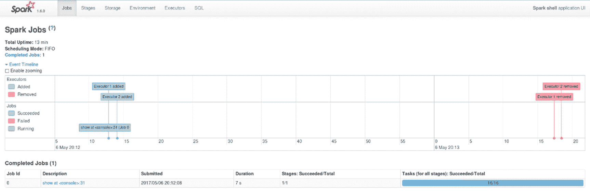
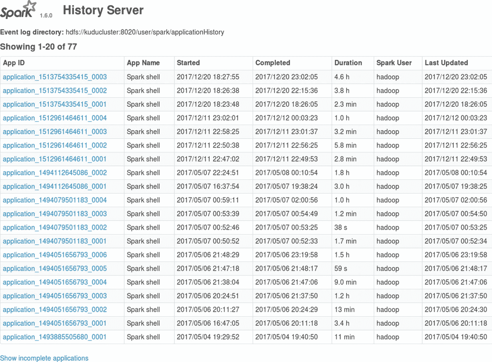

# 五、Spark 简介

Spark 是下一代大数据处理框架，用于处理和分析大型数据集。Spark 具有统一的处理框架，提供 Scala、Python、Java 和 R 的高级 API 以及强大的库，包括用于 SQL 支持的 Spark SQL、用于机器学习的 MLlib、用于实时流的 Spark Streaming 和用于图形处理的 GraphX。 [<sup>i</sup>](#Sec66) Spark 由马泰·扎哈里亚(Matei Zaharia)在加州大学伯克利分校的 AMPLab 创立，后捐赠给阿帕奇软件基金会，于 2014 年 2 月 24 日成为顶级项目。 [<sup>ii</sup>](#Sec66) 第一版于 2014 年 5 月 30 日发布。 [<sup>iii</sup>](#Sec66)

整本书都是关于 Spark 的。本章将向您简要介绍 Spark，足以让您掌握执行常见数据处理任务所需的技能。我的目标是让你尽快变得高效。对于更彻底的治疗，霍尔登·卡劳、安迪·孔温斯基、帕特里克·温德尔和马泰·扎哈里亚(O'Reilly，2015 年)的《学习 Spark》仍然是对 Spark 的最佳介绍。Sandy Ryza、Uri Laserson、Sean Owen 和 Josh Wills (O'Reilly，2015 年)撰写的《Spark 高级分析》第二版涵盖了高级 Spark 主题，也是强烈推荐的。我假设你以前没有 Spark 的知识。然而，了解一些 Scala 知识是有帮助的。Jason Swartz (O'Reilly，2014)的《学习 Scala》和 Martin Odersky、Lex Spoon 和 Bill Venners (Artima，2011)的《Scala 第二版编程》是帮助您学习 Scala 的好书。有关 Hadoop 和 Hadoop 组件(如 HDFS 和 YARN)的初级读本，请访问 Apache Hadoop 网站。第 [6](06.html) 章讨论了与 Kudu 的集成。

## 概观

Spark 的开发是为了解决 Hadoop 最初的数据处理框架 MapReduce 的局限性。Matei Zaharia 在加州大学伯克利分校和脸书大学(他在那里实习)看到了 MapReduce 的许多局限性，并试图创建一个更快、更通用、多用途的数据处理框架，可以处理迭代和交互式应用程序。 [<sup>iv</sup>](#Sec66) 马泰成功实现了他的目标，让 Spark 几乎在各个方面都优于 MapReduce。由于其简单而强大的 API，Spark 更容易访问和使用。Spark 提供了一个统一的平台(图 [5-1](#Fig1) )，支持更多类型的工作负载，如流式、交互式、图形处理、机器学习和批处理。 [<sup>v</sup>](#Sec66) Spark 作业的运行速度比同等的 MapReduce 作业快 10-100 倍，这是因为它具有快速的内存功能和高级 DAG(定向非循环图)执行引擎。数据科学家和工程师通常使用 Spark 比使用 MapReduce 更有效率。


图 5-1

Apache Spark Ecosystem

### 集群管理器

群集管理器管理和分配群集资源应用程序。Spark 支持 Spark(独立调度程序)、YARN 和 Mesos 自带的独立集群管理器。有一个实验性的项目，为 Spark 提供本地支持，将 Kubernetes 用作集群管理器。查看 SPARK-18278 了解更多详情。

## 体系结构

在高层次上，Spark 将 Spark 应用程序任务的执行分布在集群节点上(图 [5-2](#Fig2) )。每个 Spark 应用程序在其驱动程序中都有一个 SparkContext 对象。SparkContext 表示到集群管理器的连接，集群管理器为 Spark 应用程序提供计算资源。在连接到集群之后，Spark 在您的 worker 节点上获取执行器。然后 Spark 将您的应用程序代码发送给执行器。一个应用程序通常会运行一个或多个作业来响应一个 Spark 动作。然后 Spark 将每个任务划分成更小的有向无环图(Dag ),表示任务的各个阶段。然后，每个任务被分发并发送给工作节点上的执行器来执行。


图 5-2

Apache Spark Architecture

每个 Spark 应用程序都有自己的一组执行器。因为来自不同应用程序的任务在不同的 JVM 中运行，所以一个 Spark 应用程序不会干扰另一个 Spark 应用程序。这也意味着，如果不使用像 HDFS 或 S3 这样的慢速外部数据源，Spark 应用程序很难共享数据[38]。使用 Tachyon(又名 Alluxio)等堆外内存存储可以使数据共享更快更容易。我在第 10 章讨论了 Alluxio。

## 执行 Spark 应用程序

我假设您正在使用 Cloudera Enterprise 作为您的大数据平台。在 CDH，Spark 1.x 和 2.x 可以在同一个集群上共存，不会出现任何问题。您可以使用交互式 shell (spark-shell 或 pyspark)或提交应用程序(spark-submit)来执行 Spark 1.x 应用程序。你需要使用不同的命令来访问 Spark 2.x(表 [5-1](#Tab1) )。

表 5-1

Spark 1.x and Spark 2.x Commands

<colgroup><col align="left"> <col align="left"></colgroup> 
| Spark 1.x | Spark 2.x |
| :-- | :-- |
| Spark-提交 | Spark 2-提交 |
| Spark 壳 | Spark 2-外壳 |
| 派斯巴基派斯巴基派斯巴基派斯巴基派斯巴基派斯巴基派斯巴基派斯巴基派斯巴基派斯巴基派斯巴基派斯巴基 | 派斯巴基 2 号 |

## 纱线上的 Spark

YARN 是大多数基于 Hadoop 的平台(如 Cloudera 和 Hortonworks)的默认集群管理器。有两种部署模式可用于在 YARN 中启动 Spark 应用程序。

### 集群模式

在集群模式下，驱动程序运行在由 YARN 管理的主应用程序中。客户端可以退出而不影响应用程序的执行。以集群模式启动应用程序或 spark-shell:

```scala
spark-shell --master yarn --deploy-mode cluster

spark-submit --class mypath.myClass --master yarn --deploy-mode cluster

```

### 客户端模式

在客户端模式下，驱动程序在客户端上运行。应用程序主机仅用于向 YARN 请求资源。要在客户端模式下启动应用程序或 spark-shell:

```scala
spark-shell --master yarn --deploy-mode client

spark-submit --class mypath.myClass --master yarn --deploy-mode client

```

## Spark 壳简介

您通常使用交互式 shell 进行特定的数据分析或探索。也是学习 Spark API 的好工具。Spark 的交互 shell 有 Scala 或 Python 版本。在下面的例子中，我们将创建一个城市列表，并将它们全部转换为大写。

```scala
spark2-shell

Setting default log level to "WARN".
To adjust logging level use sc.setLogLevel(newLevel). For SparkR, use setLogLevel(newLevel).
Spark context Web UI available at http://10.0.1.101:4040
Spark context available as 'sc' (master = yarn, app id = application_1513771857144_0002).
Spark session available as 'spark'.
Welcome to
      ____              __
     / __/__  ___ _____/ /__
    _\ \/ _ \/ _ `/ __/  '_/
   /___/ .__/\_,_/_/ /_/\_\   version 2.2.0.cloudera1
      /_/

Using Scala version 2.11.8 (Java HotSpot(TM) 64-Bit Server VM, Java 1.8.0_151)
Type in expressions to have them evaluated.
Type :help for more information.

scala> val myCities = sc.parallelize(List("tokyo","new york","sydney","san francisco"))
myCities: org.apache.spark.rdd.RDD[String] = ParallelCollectionRDD[0] at parallelize at <console>:24

scala> val uCities = myCities.map {x => x.toUpperCase}
uCities: org.apache.spark.rdd.RDD[String] = MapPartitionsRDD[1] at map at <console>:26

scala> uCities.collect.foreach(println)

TOKYO
NEW YORK
SYDNEY
SAN FRANCISCO

Listing 5-1Introduction to spark-shell

```

你将在整章中使用 Spark 壳。当您启动如清单 [5-1](#Par14) 所示的 spark2-shell 时，会自动创建一个名为“spark”的 SparkSession。

### Spark 会议

如图 [5-2](#Fig2) 所示，SparkContext 支持访问所有 Spark 特性和功能。驱动程序使用 SparkContext 来访问其他上下文，如 StreamingContext、SQLContext 和 HiveContext。从 Spark 2.0 开始，SparkSession 提供了与 Spark 交互的单一入口点。SparkContext 提供的所有功能，如 Spark 1.x 中的 SQLContext、HiveContext 和 StreamingContext，现在都可以通过 SparkSession 访问。[T3】VIT5】](#Sec66)

在 Spark 1.x 中，您可以编写类似这样的代码。

```scala
val sparkConf = new SparkConf().setAppName("MyApp").setMaster("local")

val sc = new SparkContext(sparkConf).set("spark.executor.cores", "4")

val sqlContext = new org.apache.spark.sql.SQLContext(sc)

```

在 Spark 2.x 中，您不必显式创建 SparkConf、SparkContext 或 SQLContext，因为它们的所有功能都已经包含在 SparkSession 中。

```scala
val spark = SparkSession.
builder().
appName("MyApp").
config("spark.executor.cores", "4").
getOrCreate()

```

### 蓄电池

累加器是只被“添加”的变量。它们通常用于实现计数器。在示例中，我使用累加器将数组的元素相加:

```scala
val accum = sc.longAccumulator("Accumulator 01")

sc.parallelize(Array(10, 20, 30, 40)).foreach(x => accum.add(x))

accum.value
res2: Long = 100

```

### 广播变量

广播变量是存储在每个执行器节点内存中的只读变量。Spark 使用高速广播算法来减少复制广播变量的网络延迟。使用广播变量在每个节点上存储数据集的副本是一种更快的方法，而不是将数据存储在 HDFS 或 S3 这样的慢速存储引擎中。

```scala
val broadcastVar = sc.broadcast(Array(10, 20, 30))

broadcastVar.value
res0: Array[Int] = Array(10, 20, 30)

```

### 放射性散布装置

RDD 是一个有弹性的不可变分布式对象集合，跨集群中的一个或多个节点进行分区。RDD 可以通过两种类型的操作并行处理和操作:转换和动作。

Note

RDD 是 Spark 1.x 中 Spark 的主要编程接口。从 Spark 2.0 开始，数据集已经取代 RDD 成为主要的 API。由于更丰富的编程界面和更好的性能，强烈建议用户从 RDD 切换到数据集。我们将在本章后面讨论数据集和数据帧。

#### 创建 RDD

创建 RDD 非常简单。你可以从现有的 Scala 集合中创建一个 RDD，或者从存储在 HDFS 或 S3 的外部文件中读取。

##### 平行放置

并行化从 Scala 集合创建一个 RDD。

```scala
val myList = (1 to 5).toList
val myRDD = sc.parallelize(myList)
val myCitiesRDD = sc.parallelize(List("tokyo","new york","sydney","san francisco"))

```

##### 文本文件

文本文件从储存在 HDFS 或 S3 的文本文件创建 RDD。

```scala
val myRDD = sc.textFile("hdfs://master01:9000/files/mydirectory")

val myRDD = sc.textFile("s3a://mybucket/files/mydata.csv")

```

请注意，RDD 是不可变的。需要执行任何类型的数据转换的操作将需要创建另一个 RDD。RDD 操作可以分为两类:转换和行动。

#### 转换

转换是创建新 RDD 的操作。我描述了一些最常见的转换。有关完整的列表，请参考在线 Spark 文档。

##### 地图

Map 对 RDD 中的每个元素执行一个函数。它创建并返回结果的新 RDD。地图的返回类型不必与原始 RDD 的类型相同。

```scala
val myCities = sc.parallelize(List("tokyo","new york","paris","san francisco"))
val uCities = myCities.map {x => x.toUpperCase}
uCities.collect.foreach(println)
TOKYO
NEW YORK
PARIS
SAN FRANCISCO

```

让我们展示另一个地图的例子。

```scala
val lines = sc.parallelize(List("Michael Jordan", "iPhone"))

val words = lines.map(line => line.split(" "))

words.collect

res2: Array[Array[String]] = Array(Array(Michael, Jordan), Array(iPhone))  

```

##### 平面地图

Flatmap 对 RDD 中的每个元素执行一个函数，然后对结果进行拼合。

```scala
val lines = sc.parallelize(List("Michael Jordan", "iPhone"))

val words = lines.flatMap(line => line.split(" "))

words.collect

res3: Array[String] = Array(Michael, Jordan, iPhone)

```

##### 过滤器

返回仅包含符合指定条件的元素的 RDD。

```scala
val lines = sc.parallelize(List("Michael Jordan", "iPhone","Michael Corleone"))

val words = lines.map(line => line.split(" "))

val results = words.filter(w => w.contains("Michael"))

results.collect

res9: Array[Array[String]] = Array(Array(Michael, Jordan), Array(Michael, Corleone))

```

##### 明显的

仅返回不同的值。

```scala
val myCities1 = sc.parallelize(List("tokyo","tokyo","paris","sydney"))

val myCities2 = sc.parallelize(List("perth","tokyo","canberra","sydney"))

```

使用 union 合并结果。

```scala
val citiesFromBoth = myCities1.union(myCities2)

```

仅显示不同的值。

```scala
citiesFromBoth.distinct.collect.foreach(println)

sydney
perth
canberra
tokyo
paris

```

##### ReduceByKey

用同一个键组合值。使用指定的 reduce 函数。

```scala
val pairRDD = sc.parallelize(List(("a", 1), ("b",2), ("c",3), ("a", 30), ("b",25), ("a",20)))
val sumRDD = pairRDD.reduceByKey((x,y) => x+y)
sumRDD.collect
res15: Array[(String, Int)] = Array((b,27), (a,51), (c,3))   

```

##### 键

返回一个只包含键的 RDD。

```scala
val myRDD = sc.parallelize(List(("a", "Larry"), ("b", "Curly"), ("c", "Moe")))

val keysRDD = myRDD.keys

keysRDD.collect.foreach(println)

a
b
c

```

##### 价值观念

返回只包含值的 RDD。

```scala
val myRDD = sc.parallelize(List(("a", "Larry"), ("b", "Curly"), ("c", "Moe")))

val valRDD = myRDD.values

valRDD.collect.foreach(println)

Larry
Curly
Moe

```

##### 内部连接

基于连接谓词返回两个 RDD 中所有元素的 RDD。

```scala
val employee = Array((100,"Jim Hernandez"), (101,"Shane King"))
val employeeRDD = sc.parallelize(employee)

val employeeCity = Array((100,"Glendale"), (101,"Burbank"))
val employeeCityRDD = sc.parallelize(employeeCity)

val employeeState = Array((100,"CA"), (101,"CA"), (102,"NY"))
val employeeStateRDD = sc.parallelize(employeeState)

val employeeRecordRDD = employeeRDD.join(employeeCityRDD).join(employeeStateRDD)

employeeRecordRDD.collect.foreach(println)

(100,((Jim Hernandez,Glendale),CA))
(101,((Shane King,Burbank),CA))

```

##### RightOuterJoin / LeftOuterJoin

返回右 RDD 中所有元素的 RDD，即使左 RDD 中没有匹配的行。左外连接相当于右外连接，只是列的顺序不同。

```scala
val employeeRecordRDD = employeeRDD.join(employeeCityRDD).rightOuterJoin(employeeStateRDD)

employeeRecordRDD.collect.foreach(println)

(100,(Some((Jim Hernandez,Glendale)),CA))
(102,(None,NY))
(101,(Some((Shane King,Burbank)),CA))

```

##### 联盟

返回包含两个或更多 RDD 组合的 RDD。

```scala
val  employee2 = Array((103,"Mark Choi","Torrance","CA"), (104,"Janet Reyes","Rolling Hills","CA"))
val employee2RDD = sc.parallelize(employee2)
val  employee3 = Array((105,"Lester Cruz","Van Nuys","CA"), (106,"John White","Inglewood","CA"))
val employee3RDD = sc.parallelize(employee3)
employeesRDD.collect.foreach(println)

(103,Mark Choi,Torrance,CA)
(104,Janet Reyes,Rolling Hills,CA)
(105,Lester Cruz,Van Nuys,CA)
(106,John White,Inglewood,CA)

```

##### 减去

返回仅包含第一个 RDD 中的元素的 RDD。

```scala
val  listEmployees = Array((103,"Mark Choi","Torrance","CA"), (104,"Janet Reyes","Rolling Hills","CA"),(105,"Lester Cruz","Van Nuys","CA"))
val listEmployeesRDD = sc.parallelize(listEmployees)

val  exEmployees = Array((103,"Mark Choi","Torrance","CA"))
val exEmployeesRDD = sc.parallelize(exEmployees)

val currentEmployeesRDD = listEmployeesRDD.subtract(exEmployeesRDD)

currentEmployeesRDD.collect.foreach(println)

(105,Lester Cruz,Van Nuys,CA)
(104,Janet Reyes,Rolling Hills,CA)

```

##### 联合

联合减少了 RDD 中的分区数量。在大型 RDD 上执行过滤后，您可能需要使用合并。虽然过滤减少了新 RDD 消耗的数据量，但它继承了原始 RDD 的分区数量。如果新的 RDD 比原来的 RDD 小得多，它可能会有成百上千个小分区，这可能会导致性能问题。

当您希望在写入 HDFS 时减少 Spark 生成的文件数量，防止可怕的“小文件”问题时，使用 coalesce 也很有用。每个分区作为单独的文件写入 HDFS。请注意，使用 coalesce 时，您可能会遇到性能问题，因为在写入 HDFS 时，您会有效地降低并行度。如果发生这种情况，请尝试增加分区的数量。这也适用于数据帧，我将在后面讨论。在下面的例子中，我们只写了一个拼花文件给 HDFS。

```scala
DF.coalesce(1).write.mode("append").parquet("/user/hive/warehouse/Mytable")

```

##### 再分

重新分区可以减少或增加 RDD 中的分区数量。减少分区时通常会使用联合，因为它比重新分区更有效。在写入 HDFS 时，增加分区数量可能有助于提高并行度。这也适用于数据帧，我将在后面讨论。在下面的例子中，我们写了 6 个拼花文件给 HDFS。

```scala
DF.repartition (6).write.mode("append").parquet("/user/hive/warehouse/Mytable")

```

Note

合并通常比重新分区快。重新分区将执行完全洗牌，创建新分区并在工作节点之间平均分配数据。通过使用现有分区，联合最大限度地减少了数据移动并避免了完全洗牌。

#### 行动

动作是向驱动程序返回值的 RDD 操作。我列出了一些最常见的动作。有关 RDD 行动的完整列表，请参考在线 Spark 文档。

##### 收集

将 RDD 的全部内容返回给驱动程序。不适合大型数据集。

```scala
val myCities = sc.parallelize(List("tokyo","new york","paris","san francisco"))
myCities.collect
res2: Array[String] = Array(tokyo, new york, paris, san francisco)

```

##### 拿

将 RDD 的子集返回给驱动程序。

```scala
val myCities = sc.parallelize(List("tokyo","new york","paris","san francisco"))
myCities.take(2)
res4: Array[String] = Array(tokyo, new york)

```

##### 数数

返回 RDD 中的项目数。

```scala
val myCities = sc.parallelize(List("tokyo","new york","paris","san francisco"))
myCities.count
res3: Long = 4   

```

##### 为每一个

对 RDD 的每一项执行所提供的功能。

```scala
val myCities = sc.parallelize(List("tokyo","new york","paris","san francisco"))

myCities.collect.foreach(println)

tokyo
new york
paris
san Francisco

```

#### 懒惰评估

Spark 支持惰性求值，这对于大数据处理至关重要。Spark 中的所有转换都是延迟计算的。Spark 不会立即执行转换。您可以继续定义更多的转换。当您最终想要最终结果时，您执行一个动作，这将导致转换被执行。

#### 贮藏

默认情况下，每次运行操作时，都会重新执行每个转换。您可以使用 cache 或 persist 方法在内存中缓存 RDD，以避免多次重复执行转换。有几个持久性级别可供选择，如 MEMORY_ONLY、MEMORY_ONLY_SER、MEMORY_AND_DISK、MEMORY_AND_DISK_SER。和仅磁盘。有关缓存的更多细节，请参考 Apache Spark 的在线文档。使用 Alluxio(以前称为 Tachyon)的堆外缓存在第 [10](10.html) 章中讨论。

## Spark SQL、数据集和数据帧 API

虽然目前大多数令人兴奋的事情都集中在涉及非结构化和半结构化数据(视频分析、图像处理和文本挖掘等)的用例上，但大多数实际的数据分析和处理仍然是在结构化的关系数据上完成的。公司的大多数重要商业决策仍然基于对关系数据的分析。

SparkSQL 的开发是为了让 Spark 数据工程师和数据科学更容易处理和分析结构化数据。数据集类似于 RDD，因为它支持强类型，但是在它的内部有一个更高效的引擎。从 Spark 2.0 开始，数据集 API 现在是主要的编程接口。DataFrame 只是一个带有命名列的数据集，非常类似于关系表。Spark SQL 和 DataFrames 一起为处理和分析结构化数据提供了强大的编程接口。这里有一个关于如何使用 DataFrames API 的简单例子。稍后我将更详细地讨论 DataFrames API。

```scala
val jsonDF = spark.read.json("/jsondata")

jsonDF.show
+---+------+--------------+-----+------+-----+
|age|  city|          name|state|userid|  zip|
+---+------+--------------+-----+------+-----+
| 35|Frisco| Jonathan West|   TX|   200|75034|
| 28|Dallas|Andrea Foreman|   TX|   201|75001|
| 69| Plano|  Kirsten Jung|   TX|   202|75025|
| 52| Allen|Jessica Nguyen|   TX|   203|75002|
+---+------+--------------+-----+------+-----+

jsonDF.select ("age", "city").show

+---+------+
|age|  city|
+---+------+
| 35|Frisco|
| 28|Dallas|
| 69| Plano|
| 52| Allen|
+---+------+

jsonDF.filter($"userid" < 202).show()
+---+------+--------------+-----+------+-----+
|age|  city|          name|state|userid|  zip|
+---+------+--------------+-----+------+-----+
| 35|Frisco| Jonathan West|   TX|   200|75034|
| 28|Dallas|Andrea Foreman|   TX|   201|75001|

+---+------+--------------+-----+------+-----+

jsonDF.createOrReplaceTempView("jsonDF")

val uzDF = spark.sql("SELECT userid, zip FROM jsonDF")

uzDF.show
+------+-----+
|userid|  zip|
+------+-----+
|   200|75034|
|   201|75001|
|   202|75025|
|   203|75002|
+------+-----+

```

Note

Spark 2.0 中统一了数据帧和数据集 API。DataFrame 现在只是行数据集的类型别名，其中行是通用的非类型化对象。相比之下，Dataset 是强类型对象 Dataset[T]的集合。Scala 支持强类型和非类型 API，而在 Java 中，Dataset[T]是主要的抽象。DataFrames 是 R 和 Python 的主要编程接口，因为它缺乏对编译时类型安全的支持。

## Spark 数据源

数据处理中一些最常见的任务是读取和写入不同的数据源。在接下来的几页中，我提供了几个例子。我在第 6 章中介绍了 Spark 和 Kudu integration。

### 战斗支援车

Spark 为您提供了从 CSV 文件中读取数据的不同方法。您可以先将数据读入 RDD，然后将其转换为 DataFrame。

```scala
val dataRDD = sc.textFile("/sparkdata/customerdata.csv")
val parsedRDD = dataRDD.map{_.split(",")}
case class CustomerData(customerid: Int, name: String, city: String, state: String, zip: String)
val dataDF = parsedRDD.map{ a => CustomerData (a(0).toInt, a(1).toString, a(2).toString,a(3).toString,a(4).toString) }.toDF

```

您也可以使用 Databricks CSV 包。该方法直接读取数据帧中的数据。

```scala
spark-shell --packages com.databricks:spark-csv_2.10:1.5.0

val dataDF = sqlContext.read.format("csv")
  .option("header", "true")
  .option("inferSchema", "true")
  .load("/sparkdata/customerdata.csv")

```

从 Spark 2.0 开始，CSV 连接器已经内置，因此无需使用 Databrick 的第三方包。

```scala
val dataDF = spark.read
              .option("header", "true")
              .option("inferSchema", "true")    
              .csv("/sparkdata/customerdata.csv")

```

### 可扩展置标语言

Databricks 有一个 Spark xml 包，可以轻松读取 xml 数据。

```scala
cat users.xml

<userid>100</userid><name>Wendell Ryan</name><city>San Diego</city><state>CA</state><zip>92102</zip>
<userid>101</userid><name>Alicia Thompson</name><city>Berkeley</city><state>CA</state><zip>94705</zip>
<userid>102</userid><name>Felipe Drummond</name><city>Palo Alto</city><state>CA</state><zip>94301</zip>
<userid>103</userid><name>Teresa Levine</name><city>Walnut Creek</city><state>CA</state><zip>94507</zip>

hadoop fs -mkdir /xmldata
hadoop fs -put users.xml /xmldata

spark-shell --packages  com.databricks:spark-xml:2.10:0.4.1

```

使用 Spark XML 创建一个数据帧。在本例中，我们指定了行标记和 XML 文件所在的 HDFS 路径。

```scala
val xmlDF = sqlContext.read.format("com.databricks.spark.xml").option("rowTag", "user").load("/xmldata/");

xmlDF: org.apache.spark.sql.DataFrame = [city: string, name: string, state: string, userid: bigint, zip: bigint]

```

我们也来看看数据。

```scala
xmlDF.show

+------------+---------------+-----+------+-----+
|        city|           name|state|userid|  zip|
+------------+---------------+-----+------+-----+
|   San Diego|   Wendell Ryan|   CA|   100|92102|
|    Berkeley|Alicia Thompson|   CA|   101|94705|
|   Palo Alto|Felipe Drummond|   CA|   102|94301|
|Walnut Creek|  Teresa Levine|   CA|   103|94507|
+------------+---------------+-----+------+-----+

```

### 数据

我们将创建一个 JSON 文件作为这个例子的样本数据。确保该文件位于 HDFS 名为/jsondata 的文件夹中。

```scala
cat users.json

{"userid": 200, "name": "Jonathan West", "city":"Frisco", "state":"TX", "zip": "75034", "age":35}
{"userid": 201, "name": "Andrea Foreman", "city":"Dallas", "state":"TX", "zip": "75001", "age":28}
{"userid": 202, "name": "Kirsten Jung", "city":"Plano", "state":"TX", "zip": "75025", "age":69}
{"userid": 203, "name": "Jessica Nguyen", "city":"Allen", "state":"TX", "zip": "75002", "age":52}

```

从 JSON 文件创建一个数据帧。

```scala
val jsonDF = sqlContext.read.json("/jsondata")

jsonDF: org.apache.spark.sql.DataFrame = [age: bigint, city: string, name: string, state: string, userid: bigint, zip: string]

```

检查日期

```scala
jsonDF.show

+---+------+--------------+-----+------+-----+
|age|  city|          name|state|userid|  zip|
+---+------+--------------+-----+------+-----+
| 35|Frisco| Jonathan West|   TX|   200|75034|
| 28|Dallas|Andrea Foreman|   TX|   201|75001|
| 69| Plano|  Kirsten Jung|   TX|   202|75025|
| 52| Allen|Jessica Nguyen|   TX|   203|75002|
+---+------+--------------+-----+------+-----+

```

### 使用 JDBC 的关系数据库

我们在这个例子中使用 MySQL，但是也支持其他关系数据库，例如 Oracle、SQL Server、Teradata 和 PostgreSQL 等等。只要关系数据库有 JDBC/ODBC 驱动程序，就应该可以从 Spark 访问它。性能取决于您的 JDBC/ODBC 驱动程序对批处理操作的支持。请查看您的 JDBC 驱动程序文档以了解更多详细信息。

```scala
mysql -u root -pmypassword

create databases salesdb;

use salesdb;

create table customers (
customerid INT,
name VARCHAR(100),
city VARCHAR(100),
state CHAR(3),
zip  CHAR(5));

spark-shell --driver-class-path mysql-connector-java-5.1.40-bin.jar --jars mysql-connector-java-5.1.40-bin.jar

```

Note

在某些版本的 Spark - jars 中，没有在驱动程序的类路径中添加 JAR。 [<sup>vii</sup>](#Sec66) 建议您将 JDBC 驱动程序包含在您的- jars 和 Spark 类路径中。[T5】VIIIT7】](#Sec66)

启动 Spark 壳。请注意，我必须将 MySQL 驱动程序作为参数包含在–driver-class-path 和–jar 中。在较新版本的 Spark 中，您可能不需要这样做。

将 csv 文件读入数据帧

```scala
val dataRDD = sc.textFile("/home/hadoop/test.csv")
val parsedRDD = dataRDD.map{_.split(",")}
case class CustomerData(customerid: Int, name: String, city: String, state: String, zip: String)

val dataDF = parsedRDD.map{ a => CustomerData (a(0).toInt, a(1).toString, a(2).toString,a(3).toString,a(4).toString)}.toDF

```

将数据帧注册为临时表，以便我们可以对其运行 SQL 查询。在 Spark 2.x 中，使用 createOrReplaceTempView。

```scala
dataDF.registerTempTable("dataDF")

```

让我们设置连接属性。

```scala
val jdbcUsername = "myuser"
val jdbcPassword = "mypass"
val jdbcHostname = "10.0.1.112"
val jdbcPort = 3306
val jdbcDatabase ="salesdb"
val jdbcrewriteBatchedStatements = "true"
val jdbcUrl = s"jdbc:mysql://${jdbcHostname}:${jdbcPort}/${jdbcDatabase}?user=${jdbcUsername}&password=${jdbcPassword}&rewriteBatchedStatements=${jdbcrewriteBatchedStatements}"

val connectionProperties = new java.util.Properties()

```

这将允许我们指定正确的保存模式——追加、覆盖等。

```scala
import org.apache.spark.sql.SaveMode

```

将 SELECT 语句返回的数据插入到 MySQL salesdb 数据库中存储的 customer 表中。

```scala
sqlContext.sql("select * from dataDF").write.mode(SaveMode.Append).jdbc(jdbcUrl, "customers", connectionProperties)

```

让我们用 JDBC 读一个表格。让我们用一些测试数据填充 MySQL 中的 users 表。确保 salesdb 数据库中存在 users 表。

```scala
mysql -u root -pmypassword

use salesdb;

describe users;
+--------+--------------+------+-----+---------+-------+
| Field  | Type         | Null | Key | Default | Extra |
+--------+--------------+------+-----+---------+-------+
| userid | bigint(20)   | YES  |     | NULL    |       |
| name   | varchar(100) | YES  |     | NULL    |       |
| city   | varchar(100) | YES  |     | NULL    |       |
| state  | char(3)      | YES  |     | NULL    |       |
| zip    | char(5)      | YES  |     | NULL    |       |
| age    | tinyint(4)   | YES  |     | NULL    |       |
+--------+--------------+------+-----+---------+-------+

select * from users;
Empty set (0.00 sec)

insert into users values (300,'Fred Stevens','Torrance','CA',90503,23);

insert into users values (301,'Nancy Gibbs','Valencia','CA',91354,49);

insert into users values (302,'Randy Park','Manhattan Beach','CA',90267,21);

insert into users values (303,'Victoria Loma','Rolling Hills','CA',90274,75);

 select * from users;

+--------+---------------+-----------------+-------+-------+------+
| userid | name          | city            | state | zip   | age  |
+--------+---------------+-----------------+-------+-------+------+
|    300 | Fred Stevens  | Torrance        | CA    | 90503 |   23 |
|    301 | Nancy Gibbs   | Valencia        | CA    | 91354 |   49 |
|    302 | Randy Park    | Manhattan Beach | CA    | 90267 |   21 |
|    303 | Victoria Loma | Rolling Hills   | CA    | 90274 |   75 |
+--------+---------------+-----------------+-------+-------+------+

spark-shell --driver-class-path mysql-connector-java-5.1.40-bin.jar --jars mysql-connector-java-5.1.40-bin.jar

```

让我们设置 jdbc url 和连接属性。

```scala
val jdbcURL = s"jdbc:mysql://10.0.1.101:3306/salesdb?user=myuser&password=mypass"

val connectionProperties = new java.util.Properties()

```

我们可以从整个表中创建一个数据帧。

```scala
val mysqlDF = sqlContext.read.jdbc(jdbcURL, "users", connectionProperties)

mysqlDF.show
+------+-------------+---------------+-----+-----+---+
|userid|         name|           city|state|  zip|age|
+------+-------------+---------------+-----+-----+---+
|   300| Fred Stevens|       Torrance|   CA|90503| 23|
|   301|  Nancy Gibbs|       Valencia|   CA|91354| 49|
|   302|   Randy Park|Manhattan Beach|   CA|90267| 21|
|   303|Victoria Loma|  Rolling Hills|   CA|90274| 75|
+------+-------------+---------------+-----+-----+---+

```

### 镶木地板

在拼花地板上读写很简单。

```scala
val employeeDF = spark.read.load("/sparkdata/employees.parquet")

employeeDF.select("id","firstname","lastname","salary").write.format("parquet").save("/sparkdata/myData.parquet")

```

您可以直接在 Parquet 文件上运行 SELECT 语句。

```scala
val myDF = spark.sql("SELECT * FROM parquet.`/sparkdata/myData.parquet`")

```

### 巴什

从 Spark 访问 HBase 有不同的方法。如前所述，Scala 可以访问所有 Java 库，包括 HBase 客户端 API。这并不是从 Spark 访问 HBase 的首选方式，但一些开发人员可能会发现它们很方便。另一种访问 HBase 的方式是通过 Impala，我将在第 [6](06.html) 章中讨论。

Note

HBase 上的 Spark 是从 Spark 访问 HBase 的首选方式。然而，在撰写本文时，它只能在 Spark 1.x 上运行。HBase 上的 Spark 在 Spark 2.x 上不受支持。

您可以使用 SaveAsHadoopDataset 将数据写入 HBase。

启动 HBase shell。创建一个 HBase 表并用测试数据填充它。

```scala
hbase shell

create 'users', 'cf1'

```

启动 Spark 壳。

```scala
spark-shell

```

导入所有必需的包。

```scala
import org.apache.hadoop.fs.Path;
import org.apache.hadoop.hbase.{HBaseConfiguration, HTableDescriptor}
import org.apache.hadoop.hbase.client.HBaseAdmin
import org.apache.hadoop.hbase.mapreduce.TableInputFormat
import org.apache.hadoop.hbase.HColumnDescriptor
import org.apache.hadoop.hbase.client.Put;
import org.apache.hadoop.hbase.client.Get;
import org.apache.hadoop.hbase.client.HTable;
import org.apache.hadoop.conf.Configuration;
import org.apache.hadoop.hbase.client.Result;
import org.apache.hadoop.hbase.util.Bytes;
import java.io.IOException;

val hconf = HBaseConfiguration.create()
val jobConf = new JobConf(hconf, this.getClass)
jobConf.setOutputFormat(classOf[TableOutputFormat])
jobConf.set(TableOutputFormat.OUTPUT_TABLE,"users")

val num = sc.parallelize(List(1,2,3,4,5,6))

val theRDD = num.filter.map(x=>{

        val rowkey = "row" + x

        val put = new Put(Bytes.toBytes(rowkey))

        put.add(Bytes.toBytes("cf1"), Bytes.toBytes("fname"), Bytes.toBytes("my fname" + x))

    (new ImmutableBytesWritable, put)
})
theRDD.saveAsHadoopDataset(jobConf)

```

您还可以使用 Spark 中的 HBase 客户端 API 来读写 HBase 中的数据。

启动 HBase shell。创建另一个 HBase 表，并用测试数据填充它。

```scala
hbase shell

create 'employees', 'cf1'

put 'employees','400','cf1:name', 'Patrick Montalban'
put 'employees','400','cf1:city', 'Los Angeles'
put 'employees','400','cf1:state', 'CA'
put 'employees','400','cf1:zip', '90010'
put 'employees','400','cf1:age', '71'
put 'employees','401','cf1:name', 'Jillian Collins'
put 'employees','401','cf1:city', 'Santa Monica'
put 'employees','401','cf1:state', 'CA'
put 'employees','401','cf1:zip', '90402'
put 'employees','401','cf1:age', '45'

put 'employees','402','cf1:name', 'Robert Sarkisian'
put 'employees','402','cf1:city', 'Glendale'

put 'employees','402','cf1:state', 'CA'
put 'employees','402','cf1:zip', '91204'
put 'employees','402','cf1:age', '29'

put 'employees','403','cf1:name', 'Warren Porcaro'
put 'employees','403','cf1:city', 'Burbank'
put 'employees','403','cf1:state', 'CA'
put 'employees','403','cf1:zip', '91523'
put 'employees','403','cf1:age', '62'

```

让我们验证数据是否成功地插入到我们的 HBase 表中。

```scala
scan 'employees'

ROW                    COLUMN+CELL
 400                   column=cf1:age, timestamp=1493105325812, value=71
 400                   column=cf1:city, timestamp=1493105325691, value=Los Angeles
 400                   column=cf1:name, timestamp=1493105325644, value=Patrick Montalban
 400                   column=cf1:state, timestamp=1493105325738, value=CA
 400                   column=cf1:zip, timestamp=1493105325789, value=90010
 401                   column=cf1:age, timestamp=1493105334417, value=45
 401                   column=cf1:city, timestamp=1493105333126, value=Santa Monica
 401                   column=cf1:name, timestamp=1493105333050, value=Jillian Collins
 401                   column=cf1:state, timestamp=1493105333145, value=CA
 401                   column=cf1:zip, timestamp=1493105333165, value=90402
 402                   column=cf1:age, timestamp=1493105346254, value=29
 402                   column=cf1:city, timestamp=1493105345053, value=Glendale
 402                   column=cf1:name, timestamp=1493105344979, value=Robert Sarkisian
 402                   column=cf1:state, timestamp=1493105345074, value=CA
 402                   column=cf1:zip, timestamp=1493105345093, value=91204
 403                   column=cf1:age, timestamp=1493105353650, value=62
 403                   column=cf1:city, timestamp=1493105352467, value=Burbank
 403                   column=cf1:name, timestamp=1493105352445, value=Warren Porcaro
 403                   column=cf1:state, timestamp=1493105352513, value=CA
 403                   column=cf1:zip, timestamp=1493105352549, value=91523

```

启动 Spark 壳。

```scala
spark-shell

```

导入所有必需的包。

```scala
val configuration = HBaseConfiguration.create()

```

指定 HBase 表和行键。

```scala
val table = new HTable(configuration, "employees");
val g = new Get(Bytes.toBytes("401"))
val result = table.get(g);

```

从表中提取值。

```scala
val val2 = result.getValue(Bytes.toBytes("cf1"),Bytes.toBytes("name"));
val val3 = result.getValue(Bytes.toBytes("cf1"),Bytes.toBytes("city"));
val val4 = result.getValue(Bytes.toBytes("cf1"),Bytes.toBytes("state"));
val val5 = result.getValue(Bytes.toBytes("cf1"),Bytes.toBytes("zip"));
val val6 = result.getValue(Bytes.toBytes("cf1"),Bytes.toBytes("age"));

```

将这些值转换为适当的数据类型。

```scala
val id = Bytes.toString(result.getRow())
val name = Bytes.toString(val2);
val city = Bytes.toString(val3);
val state = Bytes.toString(val4);
val zip = Bytes.toString(val5);
val age = Bytes.toShort(val6);

```

打印数值。

```scala
println("employee id: " + id + "name: " + name + "city: " + city + "state: " + state + "zip: " + zip + "age: " + age);

employee id: 401 name: Jillian Collins city: Santa Monica state: CA zip: 90402 age: 13365

```

让我们使用 HBase API 写入 HBase。

```scala
val configuration = HBaseConfiguration.create()
val table = new HTable(configuration, "employees");

```

指定新的行键。

```scala
val p = new Put(new String("404").getBytes());

```

用新值填充单元格。

```scala
p.add("cf1".getBytes(), "name".getBytes(), new String("Denise Shulman").getBytes());
p.add("cf1".getBytes(), "city".getBytes(), new String("La Jolla").getBytes());
p.add("cf1".getBytes(), "state".getBytes(), new String("CA").getBytes());
p.add("cf1".getBytes(), "zip".getBytes(), new String("92093").getBytes());
p.add("cf1".getBytes(), "age".getBytes(), new String("56").getBytes());

```

写入 HBase 表。

```scala
table.put(p);
table.close();

```

确认值已成功插入 HBase 表中。

启动 HBase shell。

```scala
hbase shell

scan 'employees'

ROW                COLUMN+CELL
 400               column=cf1:age, timestamp=1493105325812, value=71
 400               column=cf1:city, timestamp=1493105325691, value=Los Angeles
 400               column=cf1:name, timestamp=1493105325644, value=Patrick Montalban
 400               column=cf1:state, timestamp=1493105325738, value=CA
 400               column=cf1:zip, timestamp=1493105325789, value=90010
 401               column=cf1:age, timestamp=1493105334417, value=45
 401               column=cf1:city, timestamp=1493105333126, value=Santa Monica
 401               column=cf1:name, timestamp=1493105333050, value=Jillian Collins
 401               column=cf1:state, timestamp=1493105333145, value=CA
 401               column=cf1:zip, timestamp=1493105333165, value=90402
 402               column=cf1:age, timestamp=1493105346254, value=29
 402               column=cf1:city, timestamp=1493105345053, value=Glendale
 402               column=cf1:name, timestamp=1493105344979, value=Robert Sarkisian
 402               column=cf1:state, timestamp=1493105345074, value=CA
 402               column=cf1:zip, timestamp=1493105345093, value=91204
 403               column=cf1:age, timestamp=1493105353650, value=62
 403               column=cf1:city, timestamp=1493105352467, value=Burbank
 403               column=cf1:name, timestamp=1493105352445, value=Warren Porcaro
 403               column=cf1:state, timestamp=1493105352513, value=CA
 403               column=cf1:zip, timestamp=1493105352549, value=91523
 404               column=cf1:age, timestamp=1493123890714, value=56
 404               column=cf1:city, timestamp=1493123890714, value=La Jolla
 404               column=cf1:name, timestamp=1493123890714, value=Denise Shulman
 404               column=cf1:state, timestamp=1493123890714, value=CA
 404               column=cf1:zip, timestamp=1493123890714, value=92093

```

### 亚马逊 S3

亚马逊 S3 是一个流行的对象存储，经常被用作临时集群的数据存储。它还是备份和冷数据的经济高效的存储方式。从 S3 读取数据就像从 HDFS 或任何其他文件系统读取数据一样。

阅读来自亚马逊 S3 的 CSV 文件。请确保您已经配置了 S3 凭据。

```scala
val myCSV = sc.textFile("s3a://mydata/customers.csv")

```

将 CSV 数据映射到 RDD。

```scala
import org.apache.spark.sql.Row

val myRDD = myCSV.map(_.split(',')).map(e ⇒ Row(r(0).trim.toInt, r(1), r(2).trim.toInt, r(3)))

```

创建一个模式。

```scala
import org.apache.spark.sql.types.{StructType, StructField, StringType, IntegerType};

val mySchema = StructType(Array(
StructField("customerid",IntegerType,false),
StructField("customername",StringType,false),
StructField("age",IntegerType,false),
StructField("city",StringType,false)))

val myDF = sqlContext.createDataFrame(myRDD, mySchema)

```

### 使用

Solr 是一个流行的搜索平台，提供全文搜索和实时索引功能。您可以使用 SolrJ 从 Spark 与 Solr 进行交互。 [<sup>ix</sup>](#Sec66)

```scala
import java.net.MalformedURLException;
import org.apache.solr.client.solrj.SolrServerException;
import org.apache.solr.client.solrj.impl.HttpSolrServer;
import org.apache.solr.client.solrj.SolrQuery;
import org.apache.solr.client.solrj.response.QueryResponse;
import org.apache.solr.common.SolrDocumentList;

val solr = new HttpSolrServer("http://master02:8983/solr/mycollection");

val query = new SolrQuery();

query.setQuery("*:*");
query.addFilterQuery("userid:3");
query.setFields("userid","name","age","city");
query.setStart(0);    
query.set("defType", "edismax");

val response = solr.query(query);
val results = response.getResults();

println(results);

```

从 Spark 访问 Solr 集合的一个更好的方法是使用 spark-solr 包。Lucidworks 启动了 spark-solr 项目来提供 Spark-Solr 集成。与 solrJ 相比，使用 spark-solr 要简单和强大得多，它允许你从 Solr 集合中创建数据帧，并使用 SparkSQL 与它们进行交互。

首先从 spark-shell 导入 jar 文件。您可以从 Lucidworks 的网站下载 jar 文件。

```scala
spark-shell --jars spark-solr-3.0.1-shaded.jar

```

指定集合和连接信息。

```scala
val myOptions = Map( "collection" -> "mycollection","zkhost" -> "{ master02:8983/solr}")

```

创建一个数据帧。

```scala
val solrDF = spark.read.format("solr")
  .options(myOptions)
  .load

```

### 微软优越试算表

我遇到过几个关于如何从 Spark 访问 Excel 工作表的请求。虽然这不是我通常会做的事情，但使用 Excel 是几乎每个企业 IT 环境中的现实。

一家名为 Crealytics 的公司开发了一个用于与 Excel 交互的 Spark 插件。该库需要 Spark 2.x。可以使用- packages 命令行选项添加该包。[<sup>Xi</sup>](#Sec66)

```scala
spark-shell --packages com.crealytics:spark-excel_2.11:0.9.12

```

从 Excel 工作表创建数据帧。

```scala
val ExcelDF = spark.read
    .format("com.crealytics.spark.excel")
    .option("sheetName", "sheet1")
    .option("useHeader", "true")
    .option("inferSchema", "true")
    .option("treatEmptyValuesAsNulls", "true")
    .load("budget.xlsx")

```

将数据帧写入 Excel 工作表。

```scala
ExcelDF2.write
  .format("com.crealytics.spark.excel")
  .option("sheetName", "sheet1")
  .option("useHeader", "true")
  .mode("overwrite")
  .save("budget2.xlsx")

```

你可以在他们的 github 页面上找到更多的细节:github.com/crealytics.

### 安全 FTP

从 SFTP 下载文件并将数据帧写入 SFTP 的服务器也是一个流行的请求。SpringML 提供了一个 Spark SFTP 连接器库。该库需要 Spark 2.x 并利用 jsch，这是 SSH2 的一个 Java 实现。对 SFTP 服务器的读写将作为单个进程执行。

可以使用- packages 命令行选项添加软件包。[<sup>XII</sup>T3】](#Sec66)

```scala
spark-shell --packages com.springml:spark-sftp_2.11:1.1.1

```

从 SFTP 服务器中的文件创建一个数据帧。

```scala
val SftpDF = spark.read.
            format("com.springml.spark.sftp").
            option("host", "sftpserver.com").
            option("username", "myusername").
            option("password", "mypassword").
            option("inferSchema", "true").
            option("fileType", "csv").
            option("delimiter", ",").
            load("/myftp/myfile.csv")

```

将数据帧作为 CSV 文件写入 FTP 服务器。

```scala
SftpDF2.write.
      format("com.springml.spark.sftp").
      option("host", "sftpserver.com").
      option("username", "myusername").
      option("password", "mypassword").
      option("fileType", "csv").
      option("delimiter", ",").
      save("/myftp/myfile.csv")

```

你可以在他们的 github 页面上找到更多的细节:github.com/springml/spark-sftp.

## Spark MLlib(基于数据帧的 API)

机器学习是 Spark 的主要应用之一。基于数据帧的 API (Spark ML 或 Spark ML 管道)现在是 Spark 的主要 API。基于 RDD 的 API (Spark MLlib)正在进入维护模式。我们不会讨论旧的基于 RDD 的 API。以前，基于数据帧的 API 被非正式地称为 Spark ML 和 Spark ML 管道(spark.ml 包),以区别于基于 RDD 的 API，后者是基于原始 spark.mllib 包命名的。一旦基于数据帧的 API 达到特性对等，基于 RDD 的 API 在 Spark 2.3 中将被弃用。 [<sup>xiii</sup>](#Sec66) 基于 RDD 的 API 将在 Spark 3.0 中被移除。目前，Spark MLlib 包含这两种 API。

基于 DataFrames 的 API 比基于 RDD 的 API 更快更容易使用，允许用户使用 SQL 并利用 Catalyst 和钨优化。基于 DataFrames 的 API 通过提供更高级别的抽象来表示类似于关系数据库表的表格数据，使转换功能变得容易，这使它成为实现管道的自然选择。

在典型的机器学习流水线中执行的大多数操作是特征转换。如图 [5-3](#Fig3) 所示，DataFrames 便于执行特征转换。 [<sup>xiv</sup>](#Sec66) 记号赋予器将文本分解成单词包，将单词附加到输出的第二数据帧中。TF-IDF 将第二个数据帧作为输入，将单词包转换为特征向量，并将它们添加到第三个数据帧中。


图 5-3

Example Feature Transformation in a typical Spark ML pipeline

### 管道

流水线只是创建机器学习工作流的一系列相连的阶段。一个阶段可以是一个转换器或估计器。

### 变压器

转换器将一个数据帧作为输入，并输出一个新的数据帧，其中附加了附加列。新数据帧包括来自输入数据帧的列和附加列。

### 估计量

估计是一种机器学习算法，适合训练数据的模型。估计器估计器接受训练数据并产生机器学习模型。

### ParamGridBuilder

ParamGridBuilder 用于构建参数网格。CrossValidator 执行网格搜索，并用参数网格中用户指定的超参数组合来训练模型。

### 交叉验证器

CrossValidator 交叉评估拟合的机器学习模型，并通过尝试用用户指定的超参数组合拟合底层估计器来输出最佳模型。

### 求值程序

评估者计算你的机器学习模型的性能。评估器输出精度或召回率等指标来衡量拟合模型的表现。

## 例子

让我们来看一个例子。我们将使用来自 UCI 机器学习库中的心脏病数据集[<sup>【XV】</sup>](#Sec66)来预测心脏病的存在。这些数据是由罗伯特德特拉诺，医学博士，博士，从弗吉尼亚州医学中心，长滩和克利夫兰诊所基金会收集的。历史上，克利夫兰数据集一直是众多研究的主题，因此我们将使用该数据集。原始数据集有 76 个属性，但其中只有 14 个是 ML 研究人员传统使用的(表 [5-2](#Tab2) )。我们将简单地执行二项式分类，并确定患者是否患有心脏病。

表 5-2

Cleveland Heart Disease Data Set Attribute Information

<colgroup><col align="left"> <col align="left"></colgroup> 
| 属性 | 描述 |
| :-- | :-- |
| 年龄 | 年龄 |
| 性 | 性 |
| 丙酸纤维素 | 胸痛型 |
| treatbps | 静息血压 |
| 胆固醇 | 血清胆固醇(毫克/分升) |
| 前沿系统 | 空腹血糖> 120 毫克/分升 |
| 尊重 | 静息心电图结果 |
| 塔尔巴赫 | 达到最大心率 |
| 考试 | 运动诱发的心绞痛 |
| 旧峰 | 相对于静息运动诱发的 ST 段压低 |
| 倾斜 | 运动 ST 段峰值的斜率 |
| 大约 | 荧光镜染色的主要血管数量(0-3) |
| 塔尔 | 唐松草压力测试结果 |
| 数字 | 预测属性——心脏病的诊断 |

我们开始吧。开始之前，将列名添加到 CSV 文件中。我们需要下载文件并拷贝到 HDFS。

```scala
wget http://archive.ics.uci.edu/ml/machine-learning-databases/heart-disease/cleveland.data

head -n 10 processed.cleveland.data

63.0,1.0,1.0,145.0,233.0,1.0,2.0,150.0,0.0,2.3,3.0,0.0,6.0,0
67.0,1.0,4.0,160.0,286.0,0.0,2.0,108.0,1.0,1.5,2.0,3.0,3.0,2
67.0,1.0,4.0,120.0,229.0,0.0,2.0,129.0,1.0,2.6,2.0,2.0,7.0,1
37.0,1.0,3.0,130.0,250.0,0.0,0.0,187.0,0.0,3.5,3.0,0.0,3.0,0
41.0,0.0,2.0,130.0,204.0,0.0,2.0,172.0,0.0,1.4,1.0,0.0,3.0,0
56.0,1.0,2.0,120.0,236.0,0.0,0.0,178.0,0.0,0.8,1.0,0.0,3.0,0
62.0,0.0,4.0,140.0,268.0,0.0,2.0,160.0,0.0,3.6,3.0,2.0,3.0,3
57.0,0.0,4.0,120.0,354.0,0.0,0.0,163.0,1.0,0.6,1.0,0.0,3.0,0
63.0,1.0,4.0,130.0,254.0,0.0,2.0,147.0,0.0,1.4,2.0,1.0,7.0,2
53.0,1.0,4.0,140.0,203.0,1.0,2.0,155.0,1.0,3.1,3.0,0.0,7.0,1

hadoop fs -put processed.cleveland.data /tmp/data

```

然后使用 spark-shell 通过 Spark MLlib 交互式地创建我们的模型，如清单 [5-2](#Par208) 所示。

```scala
spark-shell --packages com.databricks:spark-csv_2.10:1.5.0

import org.apache.spark._
import org.apache.spark.rdd.RDD
import org.apache.spark.sql.SQLContext
import org.apache.spark.sql.functions._
import org.apache.spark.sql.types._
import org.apache.spark.sql._
import org.apache.spark.ml.classification.RandomForestClassifier
import org.apache.spark.ml.evaluation.BinaryClassificationEvaluator
import org.apache.spark.ml.feature.StringIndexer
import org.apache.spark.ml.feature.VectorAssembler
import org.apache.spark.ml.tuning.{ParamGridBuilder, CrossValidator}
import org.apache.spark.ml.{Pipeline, PipelineStage}
import org.apache.spark.mllib.evaluation.RegressionMetrics
import org.apache.spark.ml.param.ParamMap
import org.apache.kudu.spark.kudu._

val dataDF = sqlContext.read.format("csv")
  .option("header", "true")
  .option("inferSchema", "true")
  .load("/tmp/data/processed.cleveland.data")

dataDF.printSchema
root
 |-- id: string (nullable = false)
 |-- age: float (nullable = true)
 |-- sex: float (nullable = true)
 |-- cp: float (nullable = true)
 |-- trestbps: float (nullable = true)
 |-- chol: float (nullable = true)
 |-- fbs: float (nullable = true)
 |-- restecg: float (nullable = true)
 |-- thalach: float (nullable = true)
 |-- exang: float (nullable = true)
 |-- oldpeak: float (nullable = true)
 |-- slope: float (nullable = true)
 |-- ca: float (nullable = true)
 |-- thal: float (nullable = true)
 |-- num: float (nullable = true)

val myFeatures = Array("age", "sex", "cp", "trestbps", "chol", "fbs",
      "restecg", "thalach", "exang", "oldpeak", "slope",
      "ca", "thal", "num")

val myAssembler = new VectorAssembler().setInputCols(myFeatures).setOutputCol("features")

val dataDF2 = myAssembler.transform(dataDF)

val myLabelIndexer = new StringIndexer().setInputCol("num").setOutputCol("label")

val dataDF3 = mylabelIndexer.fit(dataDF2).transform(dataDF2)

val dataDF4 = dataDF3.where(dataDF3("ca").isNotNull).where(dataDF3("thal").isNotNull).where(dataDF3("num").isNotNull)

val Array(trainingData, testData) = dataDF4.randomSplit(Array(0.8, 0.2), 101)

val myRFclassifier = new RandomForestClassifier().setFeatureSubsetStrategy("auto").setSeed(101)

val myEvaluator = new BinaryClassificationEvaluator().setLabelCol("label")

val myParamGrid = new ParamGridBuilder()
      .addGrid(myRFclassifier.maxBins, Array(10, 20, 30))
      .addGrid(myRFclassifier.maxDepth, Array(5, 10, 15))
      .addGrid(myRFclassifier.numTrees, Array(20, 30, 40))
      .addGrid(myRGclassifier.impurity, Array("gini", "entropy"))
      .build()

val myPipeline = new Pipeline().setStages(Array(myRFclassifier))

val myCV = new CrosValidator()
      .setEstimator(myPipeline)
      .setEvaluator(myEvaluator)
      .setEstimatorParamMaps(myParamGrid)
      .setNumFolds(3)

Listing 5-2Performing binary classification using Random Forest

```

我们现在可以拟合模型了

```scala
val myCrossValidatorModel = myCV.fit(trainingData)

```

我们来评价一下模型。

```scala
val myEvaluatorParamMap = ParamMap(myEvaluator.metricName -> "areaUnderROC")

val aucTrainingData = myEvaluator.evaluate(CrossValidatorPrediction, myEvaluatorParamMap)

```

你现在可以根据我们的数据做一些预测。

```scala
val myCrossValidatorPrediction = myCrossValidatorModel.transform(testData)

```

Spark MLlib 提供了构建管道、特征化和流行的机器学习算法的功能，用于回归、分类、聚类和协作过滤。Sandy Ryza、Uri Laserson、Sean Owen 和 Josh Wills (O'Reilly，2017 年)的《Spark 高级分析第二版》对 Spark 的机器学习进行了更深入的处理。我们将在第 [6](06.html) 章中使用 Kudu 作为功能商店。

## 图形 x

Spark 包括一个名为 GraphX 的图形处理框架。有一个名为 GraphFrames 的基于 DataFrames 的独立包。GraphFrames 目前不是核心 Apache Spark 的一部分。在撰写本文时，GraphX 和 GraphFrames 仍被认为是不成熟的，不被 Cloudera Enterprise 支持。 [<sup>xvi</sup>](#Sec66) 我不会在本书中涉及它们，但可以随意访问 Spark 的在线文档了解更多细节。

## Spark 流

我在第 6 章中介绍了 Spark 流。Spark 2.0 包括一个新的流处理框架，称为结构化流，这是一个构建在 Spark SQL 之上的高级流 API。撰写本文时，Cloudera 还不支持结构化流。[T3】XVIIT5】](#Sec66)

## Spark 上的蜂巢

Cloudera 支持 Hive on Spark，以实现更快的批处理。早期基准测试显示，在 MapReduce 上，性能比 Hive 平均快 3 倍。 [<sup>xviii</sup> 对于那些希望利用 Spark 的性能而无需学习 Scala 或 Python 的组织来说，Hive on Spark 非常有用。由于 HiveQL 查询的数量和复杂性，有些人可能会发现重构数据处理管道并不容易。Hive for Spark 非常适合这些场景。](#Sec66)

## Spark 1.x vs Spark 2.x

尽管大量代码仍然在 Spark 1.x 上运行，但现在您的大部分开发应该在 Spark 2.x 上进行。Spark 2.x API 的大部分与 1.x 相似，但 2.x 中有一些改变破坏了 API 兼容性。Spark 2 不兼容 Scala 2.10 仅支持 Scala 2.11。JDK 8 也是 Spark 2.2 的一个要求。更多细节请参考 Spark 的在线文档。

## 监控和配置

有几个工具可以用来监控和配置 Apache Spark。Cloudera Manager 是 Cloudera Enterprise 事实上的管理工具。Spark 还包括系统管理和监控功能。

### Cloudera 经理

Cloudera Manager 是 Cloudera Enterprise 附带的集群管理工具。您可以使用 Cloudera Manager 执行各种管理任务，例如更新配置(图 [5-4](#Fig4) )和监控其性能(图 [5-5](#Fig5) )。


图 5-5

Monitoring Spark Jobs


图 5-4

Using Cloudera Manager to configure Spark

### Spark Web 用户界面

Spark 提供了几种监控 Spark 应用程序的方法。对于当前正在运行的 Spark 应用程序，您可以在端口 4040 上访问其性能信息。如果在同一节点上运行多个作业，您可以通过端口 4041、4042 等访问 web 用户界面。

Spark 历史服务器提供关于已经完成执行的 Spark 应用程序的详细信息。Spark 历史服务器可以通过端口 18088 访问(图 [5-6](#Fig6) )。可以查看详细的性能指标(图 [5-7](#Fig7) 和图 [5-8](#Fig8) )和关于 Spark 环境的信息(图 [5-9](#Fig9) )以帮助监控和故障排除。


图 5-9

Information about the current Spark environment


图 5-8

Performance metrics on Spark executors



图 5-7

Detailed performance information about a particular Spark job



图 5-6

Spark History Server

## 摘要

Apache Spark 已经取代 MapReduce 成为事实上的大数据处理框架。数据工程师和科学家欣赏 Spark 简单易用的 API、处理多种工作负载的能力以及快速的性能。它对 SparkSQL、Dataset 和 DataFrame APIs 的关注是受欢迎的改进，使 Spark 更容易访问和使用。Spark 是 Kudu 的理想数据处理引擎。我在第 6 章讨论 Spark 和 Kudu 集成。

## 参考

1.  阿帕奇 Spark《Spark 概览》，阿帕奇 Spark，2018， [`https://spark.apache.org/docs/2.2.0/`](https://spark.apache.org/docs/2.2.0/)
2.  “阿帕奇软件基金会”Apache 软件基金会宣布 Apache Spark 为顶级项目，“Apache 软件基金会，2018， [`https://blogs.apache.org/foundation/entry/the_apache_software_foundation_announces50`](https://blogs.apache.org/foundation/entry/the_apache_software_foundation_announces50)
3.  阿帕奇 Spark《阿帕奇星火新闻》，阿帕奇星火，2018， [`https://spark.apache.org/news/`](https://spark.apache.org/news/)
4.  马泰·扎哈里亚；“我是 Matei Zaharia，Spark 的创始人，Databricks 的首席技术官。AMA！，“Reddit，2018， [`https://www.reddit.com/r/IAmA/comments/31bkue/im_matei_zaharia_creator_of_spark_and_cto_at/?st=j1svbrx9&sh=a8b9698e`](https://www.reddit.com/r/IAmA/comments/31bkue/im_matei_zaharia_creator_of_spark_and_cto_at/%3Fst=j1svbrx9%26sh=a8b9698e)
5.  数据块；“什么是阿帕奇 Spark？，“Databricks，2018， [`https://databricks.com/spark/about`](https://databricks.com/spark/about)
6.  朱尔斯·丹吉；《如何在 Apache Spark 2.0 中使用 SparkSession》，Databricks，2018， [`https://databricks.com/blog/2016/08/15/how-to-use-sparksession-in-apache-spark-2-0.html`](https://databricks.com/blog/2016/08/15/how-to-use-sparksession-in-apache-spark-2-0.html)
7.  霍尔登·卡劳，雷切尔·沃伦；“高性能 Spark”，奥莱利，2017 年 6 月， [`https://www.safaribooksonline.com/library/view/high-performance-spark/9781491943199/`](https://www.safaribooksonline.com/library/view/high-performance-spark/9781491943199/)
8.  阿帕奇 Spark《JDBC 到其他数据库》，阿帕奇 Spark，2018， [`https://spark.apache.org/docs/latest/sql-programming-guide.html#jdbc-to-other-databases`](http://spark.apache.org/docs/latest/sql-programming-guide.html%23jdbc-to-other-databases)
9.  阿帕奇 Lucene《使用 SolrJ》，阿帕奇·卢斯，2018， [`https://lucene.apache.org/solr/guide/6_6/using-solrj.html`](https://lucene.apache.org/solr/guide/6_6/using-solrj.html)
10.  Lucidworks“从 Solr 中读取数据作为 Spark RDD 并使用 SolrJ 将 Spark 中的对象索引到 Solr 中的工具”，Lucidworks，2018， [`https://github.com/lucidworks/spark-solr`](https://github.com/lucidworks/spark-solr)
11.  Crealytics“一个通过 Apache POI 读取 Excel 文件的 Spark 插件”，Crealytics，2018， [`https://github.com/crealytics/spark-excel`](https://github.com/crealytics/spark-excel)
12.  SpringML《星火 SFTP 连接器库》，SpringML，2018， [`https://github.com/springml/spark-sftp`](https://github.com/springml/spark-sftp)
13.  阿帕奇 Spark《机器学习库(MLlib)指南》，Apache Spark，2018， [`https://spark.apache.org/docs/latest/ml-guide.html`](http://spark.apache.org/docs/latest/ml-guide.html)
14.  孟祥瑞、约瑟夫·布拉德利、埃文·斯帕克斯和希瓦拉姆·文卡塔拉曼；《ML Pipelines:ML lib 的一种新的高层 API》，Databricks，2018， [`https://databricks.com/blog/2015/01/07/ml-pipelines-a-new-high-level-api-for-mllib.html`](https://databricks.com/blog/2015/01/07/ml-pipelines-a-new-high-level-api-for-mllib.html)
15.  大卫啊哈；《心脏病数据集》，UCI 机器学习资源库，1988 年， [`https://archive.ics.uci.edu/ml/datasets/heart%2BDisease`](http://archive.ics.uci.edu/ml/datasets/heart+Disease)
16.  Cloudera“不支持 GraphX”，Cloudera，2018， [`https://www.cloudera.com/documentation/spark2/latest/topics/spark2_known_issues.html#ki_graphx`](https://www.cloudera.com/documentation/spark2/latest/topics/spark2_known_issues.html#ki_graphx)
17.  Cloudera“不支持结构化流”，Cloudera，2018， [`https://www.cloudera.com/documentation/spark2/latest/topics/spark2_known_issues.html#ki_structured_streaming`](https://www.cloudera.com/documentation/spark2/latest/topics/spark2_known_issues.html#ki_structured_streaming)
18.  桑托什·库马尔；“利用 Hive-on-Spark 实现更快的批处理”，Cloudera，2016， [`https://vision.cloudera.com/faster-batch-processing-with-hive-on-spark/`](https://vision.cloudera.com/faster-batch-processing-with-hive-on-spark/)