# 七、批量和实时数据接收和处理

数据接收是将数据传输、加载和处理到数据管理或存储平台的过程。本章讨论了各种工具和方法，说明如何将数据批量和实时地摄取到 Kudu 中。我将介绍流行的 Hadoop 发行版自带的原生工具。我将举例说明如何使用 Spark 通过数据源 API 以及 Java、Python 和 C++中的 Kudu 客户端 API 将数据接收到 Kudu 中。有一组下一代商业数据摄取工具提供了原生 Kudu 支持。物联网也是一个热门话题。我将在本章中从流集开始详细讨论它们。

## 流集数据收集器

StreamSets Data Collector 是一个强大的企业级流平台，可用于接收、路由和处理来自各种来源的实时流和批处理数据。StreamSets 由 Informatica 前首席产品官 Girish Pancha 创立；以及 Arvind Prabhakar，Cloudera 的早期员工，他领导了 Apache Flume 和 Apache Sqoop 的开发。 [<sup>i</sup>](#Sec54) StreamSets 被 CBS Interactive、Cox Automotive、沃达丰等公司使用。 [<sup>ii</sup>](#Sec54)

Data Collector 可以执行各种数据浓缩、转换和流内清理，然后将数据写入大量目的地，如 HDFS、索尔、卡夫卡或库杜，而无需编写任何代码。对于更复杂的数据处理，可以用以下支持的语言和框架之一编写代码:Java、JavaScript、Jython (Python)、Groovy、Java 表达式语言(EL)和 Spark。数据收集器可以独立或集群模式运行，以支持最大的环境。

### 管道

为了接收数据，Data Collector 要求您设计一个管道。管道由多个阶段组成，您可以配置这些阶段来定义数据源(起点)、所需的任何数据转换或路由(处理器)以及要写入数据的位置(目标)。

设计好管道后，您可以启动它，它将立即开始接收数据。数据收集器将处于待机状态，一直静静地等待数据到达，直到您停止管道。您可以通过在数据被接收时检查数据或通过查看有关管道的实时指标来监视数据收集器。

### 起源

在 StreamSets 管道中，数据源称为源。它们是可配置的组件，无需任何编码就可以添加到画布中。StreamSets 包括几个源代码，可以节省您的开发时间和精力。一些可用的源包括 MQTT 订户、目录、文件尾、HDFS、S3、MongoDB、Kafka、RabbitMQ、MySQL 二进制博客、SQL Server 和 Oracle CDC 客户端等等。访问 StreamSets.com 获得支持来源的完整列表。

### 处理器

Processors 允许您对数据执行数据转换。一些可用的处理器是字段哈希器、字段掩码器、表达式计算器、记录去重器、JSON 解析器、XML 解析器和 JDBC 查找等等。有些处理器，比如流选择器，可以让您根据条件轻松地路由数据。此外，您可以使用能够基于自定义代码处理数据的赋值器。支持的语言和框架包括 JavaScript、Groovy、Jython 和 Spark。访问 StreamSets.com 获得支持的处理器的完整列表。

### 目的地

目的地是管道的目标。可用的目的地包括 Kudu、S3、Azure Data Lake Store、Solr、Kafka、JDBC Producer、Elasticsearch、Cassandra、HBase、MQTT Publisher 和 HDFS 等等。请访问 StreamSets.com，查看支持的目的地的完整列表。

### 实现者

执行器允许您在收到事件时运行 MapReduce 作业、Hive 查询、Shell 脚本或 Spark 应用程序等任务。

### 数据收集器控制台

控制台是数据采集器的主要用户界面(见图 [7-1](#Fig1) )。这是所有活动发生的地方。这是您设计管道、配置阶段、运行管道和排除管道故障等的地方。


图 7-1

StreamSets Data Collector console

StreamSets 数据收集器可以实时或批量摄取数据(参见图 [7-2](#Fig2) )。实时数据源或起源包括 MQTT、Kafka 和 Kinesis 等等。批量数据源包括 HDFS、S3、Oracle、SQL Server、MongoDB 等。数据最终会到达一个或多个目的地。在数据源和目的地之间是转换和处理流中数据的处理器。


图 7-2

Typical StreamSets Architecture

对于一些最常见的数据转换和丰富，有几个预构建的处理器。处理器的例子包括列拆分器和散列器、数据类型转换器、XML 解析器、JDBC 查找和流处理器等等。这些处理器无需编写一行代码就可以进行配置。但是，有时您需要编写代码，主要是因为现有的处理器都不能处理您需要的特定类型的转换。StreamSets 提供了支持 JavaScript、Java、Java EL、Spark、Jython 和 Groovy 的评估器。StreamSets 将所有这些阶段(起点、处理器、数据源)连接起来，形成一个管道。StreamSets 在内存中执行管道，提供最大的性能和可伸缩性。

#### 实时流

如前几章所述，Kudu 特别适合于实时接收和处理，因为它支持高效的插入和更新以及快速的列数据扫描。 [<sup>iii</sup>](#Sec54) 对于实时工作负载，用户需要选择合适的目的地类型。有些存储引擎不是为实时流设计的。这些存储引擎的例子包括 HDFS 和 S3。

HDFS 是为面向批处理的工作负载而设计的。它以 128MB 块大小(可配置)拆分和写入数据，以实现高吞吐量并行处理。当 StreamSets 或 Flume 等实时数据接收工具开始以接收数据的速度向 HDFS 写入数据，以便让用户实时或接近实时地使用数据时，问题就出现了。这将导致 HDFS 产生大量的小文件。如前所述，HDFS 不是为处理小文件而设计的。[<sup>iv</sup>](#Sec54)HDFS 的每个文件、目录或块都有元数据存储在名称节点的存储器中。这些小文件消耗的内存量迟早会淹没 name 节点。小文件的另一个问题是访问它们的物理效率很低。应用程序需要执行比读取小文件所需更多的 IO。常见的解决方法是在 Spark 中使用 coalesce 或 repartition 来限制写入 HDFS 的文件数量，或者使用 Impala 定期压缩文件，但这并不总是可行的。

S3 有自己的 IO 特点，工作方式与 HDFS 不同。S3 是一个最终一致的对象存储。对于最终一致的文件系统，用户可能不会总是立即看到他们的更新。 [<sup>v</sup>](#Sec54) 这可能会导致从 S3 读写数据时出现不一致。通常，数据在写入 S3 后几毫秒或几秒钟内就会出现，但在某些情况下，某些数据可能需要长达 12 个小时才会出现并变得一致。在极少数情况下，一些物体可能需要 24 小时才能出现。[<sup>VI</sup>](#Sec54)S3 的另一个限制是延迟。与 HDFS 和其他存储系统相比，访问存储在 S3 上的数据要慢得多。

每个 S3 操作都是一个 API 调用，可能需要几十到几百毫秒。如果您正在处理流集中的数百万个对象，延迟将会增加，并可能成为性能瓶颈。 [<sup>vii</sup>](#Sec54) S3 非常适合存储备份或历史数据，但不适合存储流媒体数据。除了 Kudu，其他适合实时数据摄取的目的地包括 HBase 和 MemSQL 等等。

#### 面向批处理的数据摄取

如前所述，StreamSets 还支持批处理工作负载。作为始发地和目的地，我建议大多数面向批量的工作使用 Kudu。Kudu 提供了 HDFS 的大部分好处，而且没有管理费用。Kudu 开发团队执行的性能基准表明，在某些操作中，Kudu 仍然比 HDFS(拼花地板)稍慢。如果性能差异对您的应用程序很重要(或者如果您正在处理非结构化数据)，那么我建议您使用 HDFS。对于大多数应用程序来说，性能上的差异可能并不重要。在这种情况下，我建议你坚持使用 Kudu(见图 [7-3](#Fig3) )。使用流集，批处理管道的构建方式与实时管道相同。唯一的区别是，当您使用面向批处理的源(如 S3、HDFS、RDBMS 或文件目录)时，StreamSets 会检测源的类型，并自动以批处理模式读取数据。


图 7-3

Batch data ingestion with StreamSets and Kudu

#### 物联网

StreamSets 是数据摄取的瑞士军刀。除了众多的特性和功能，它还支持物联网或物联网 [<sup>viii</sup>](#Sec54) (见图 [7-4](#Fig4) )。StreamSets 包括一个 MQTT 订阅者源和 MQTT 发布者目的地，这允许它被用作物联网网关。为了从 SCADA 网络和 OPC 历史记录中读取数据，StreamSets 包括一个 OPC UA 客户端源。最后，StreamSets 支持 CoAP(受限应用协议)。 [<sup>ix</sup>](#Sec54) CoAP 是一种用于低功耗和低带宽环境的协议，专为机器对机器设备通信而设计。在第 [9](09.html) 章中，我们使用 StreamSets、Kudu 和 Zoomdata 实现了一个完整的物联网数据摄取和可视化应用。

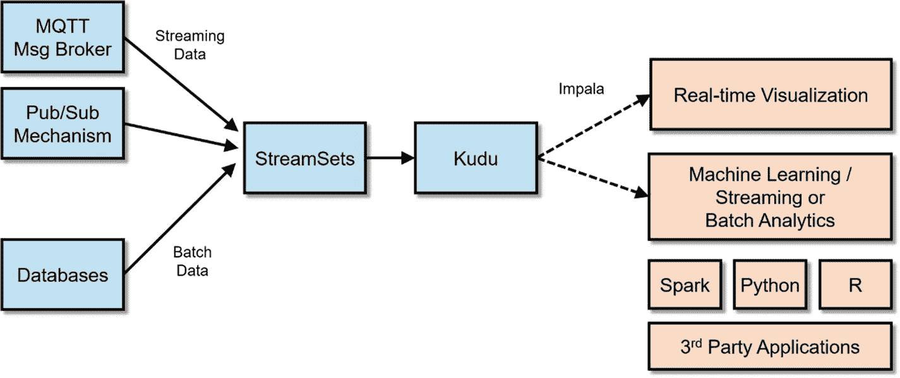

图 7-4

StreamSets IoT Architecture

### 部署选项

StreamSets 支持不同的部署选项，独立模式或集群模式。在独立模式下，StreamSets 数据收集器安装在一个或多个边缘节点上。这些边缘节点可以位于同一个数据中心，也可以位于地理位置不同的站点，只要网络能够支持管道的延迟和吞吐量要求。在集群模式下，StreamSets 管道作为 Spark 流应用进行部署和执行，利用 YARN 或 Mesos 作为其集群管理器，以充分利用 Hadoop 集群的可扩展性(参见图 [7-5](#Fig5) )。


图 7-5

StreamSets Deployment Options

有关从 Tar ball(服务启动)、RPM 包(服务启动)和 Cloudera Manager(集群模式)安装流集的信息，请参考 Data Collector 用户指南。

### 使用流集数据收集器

让我们从创建第一个管道开始。导航到 StreamSets 数据收集器 URL，您将看到一个登录页面。默认用户名是“admin”默认密码是“admin”登录，然后点击“创建新管道”出现提示时，输入新管道的标题和描述(见图 [7-6](#Fig6) )。

现在你可以设计你的第一个管道了。


图 7-6

StreamSets Console

### 向 kudu 投资 xml

在这个例子中，我们将把 XML 格式的传感器数据接收到一个 Kudu 表中。登录 StreamSets。在管道页面上，点击“创建新管道”按钮(见图 [7-7](#Fig7) )。


图 7-7

New Pipeline

在数据采集器控制台中，单击位于“帮助”图标附近的“暂存库”图标(参见图 [7-8](#Fig8) )。您将看到您可以使用的可用阶段列表。在阶段列表中选择“起源”。在这个例子中，我们将使用目录原点。有了目录源，复制到指定目录的文件将被流集接收。将目录原点拖到画布的右侧。

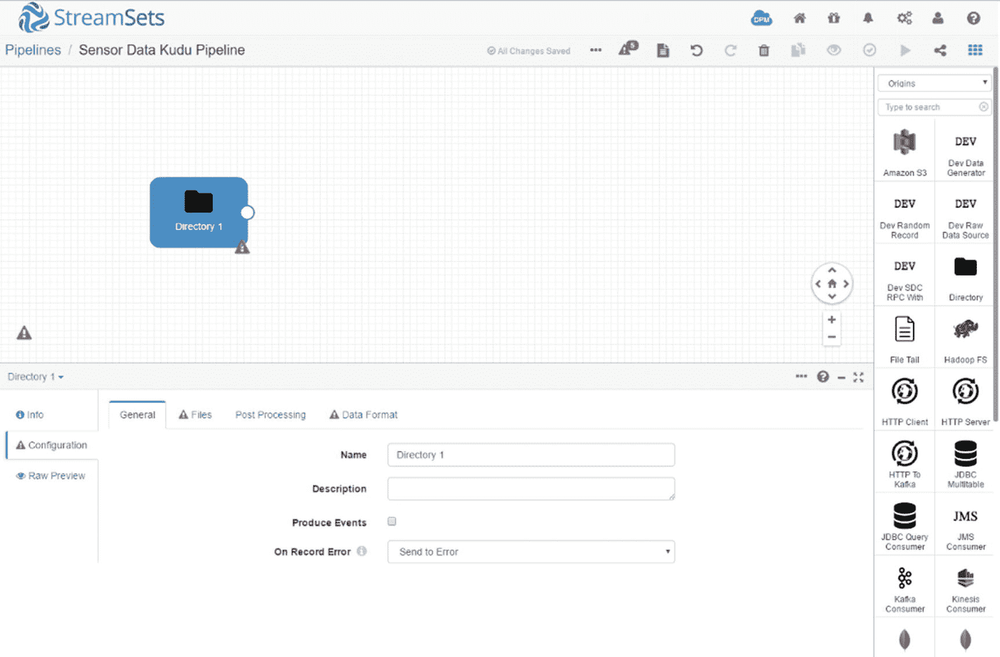

图 7-8

Directory Origin

接下来，我们需要添加一个处理器。在阶段库中选择“处理器”。我们将使用 XML 解析器来解析我们的 XML 数据，并将其转换成可以插入 Kudu 的格式。向下滚动，直到看到 XML 解析器图标。将 XML 解析器处理器拖到目录原点附近的画布上。将目录源连接到画布中的 XML 解析器处理器，如图 [7-9](#Fig9) 所示。您会注意到一个黄色的管道创建帮助栏。您可以使用帮助栏来帮助您选择阶段。现在，我们将忽略帮助栏。


图 7-9

XML Parser

我们需要一个目的地来完成我们的管道。在舞台库中选择“目的地”。我们将使用一个库都作为我们的目的地。将 Kudu 目的地拖到画布上，靠近 XML 解析器处理器。将 XML 解析器连接到画布中的 Kudu 目的地，如图 [7-10](#Fig10) 所示。


图 7-10

Kudu destination

在开始配置我们的阶段之前，我们需要创建一个目录，它将作为我们的数据源和目标 Kudu 表的来源。我们还会准备一些测试数据。

打开 impala-shell 并创建一个表格。

```scala
CREATE TABLE sensordata
(
       rowid BIGINT,
       sensorid SMALLINT,
       sensortimestamp STRING,
       temperature TINYINT,
       pressure TINYINT,
       PRIMARY KEY(rowid)
)
PARTITION BY HASH PARTITIONS 16
STORED AS KUDU;

```

登录到 Cloudera 集群，创建一个包含我们的传感器数据的目录。

```scala
mkdir /sensordata
chown hadoop:hadoop /sensordata

```

让我们创建一些测试数据，我们将在稍后的练习中使用。

```scala
<sensordata><rowid>1000</rowid><sensorid>12</sensorid><sensortimestamp>20170409001904</sensortimestamp><temperature>23</temperature><pressure>30</pressure></sensordata>
<sensordata><rowid>1001</rowid><sensorid>39</sensorid><sensortimestamp>20170409001927</sensortimestamp><temperature>25</temperature><pressure>28</pressure></sensordata>

```

### 配置管道

通过单击管道的名称，可以为整个管道设置配置选项；在我们的例子中，点击面板左上方附近的“传感器数据 Kudu Pipeline”链接(见图 [7-11](#Fig11) )。

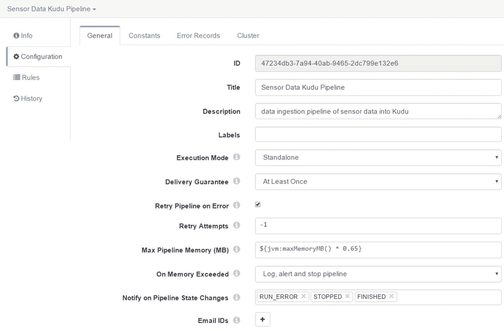

图 7-11

Configure Pipeline

在“错误记录”选项卡中，将“错误记录”更改为“丢弃(库:基本)”(参见图 [7-12](#Fig12) )。现在，保留其余的默认参数。

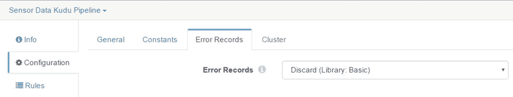

图 7-12

Error Records

### 配置目录来源

在管道画布中单击目录原始阶段。在属性面板中，导航到“配置”选项卡。在“配置”面板中，您会看到另一组选项卡(参见图 [7-13](#Fig13) )。我们会仔细检查每个标签。


图 7-13

Configure Directory origin

“通用”允许用户为原点指定一个名称和描述。有一个选项可以让原点生成事件。如果启用“产生事件”，则每次目录源开始或结束读取文件时，目录源都会产生事件记录。您现在可以忽略这个配置项。“记录错误”允许您选择对发送至错误的记录采取的操作。默认选项是“发送到错误”其他选项是“放弃”和“停止管道”暂时保留默认选项。

“文件”选项卡包含与文件接收相关的各种配置选项。在我们的示例中，对我们来说最有趣的选项是“文件目录”，这是您想要放置想要摄取的文件的本地目录。“文件名模式”允许您选择指定的文件名模式是使用 regex 语法还是 glob 语法。暂时将其设置为“Glob”。“文件名模式”是定义目录中文件名模式的表达式。因为我们正在接收 XML 文件，所以让我们将模式设置为“*”。xml”。“读取顺序”控制数据收集器读取和处理文件的顺序。有两个选项，“最后修改的时间戳”和“按字典顺序升序排列的文件名”当使用按字典顺序升序排列的文件名时，将根据文件名按字典顺序升序读取文件。 [<sup>x</sup>](#Sec54) 需要注意的是，这个排序会把数字 1，2，3，4，5，6，7，8，9，10，11，12，13，14，15 排序为 1，10，11，12，13，14，15，2，3，4，5，6，7，8，9。如果必须按字典升序读取文件，请考虑在文件名前添加前导零，例如:file_001.xml、file_002.xml、file_003.xml、file_004.xml、file_010.xml、file_011.xml、file_012.xml。

当使用最后修改的时间戳时，使用该时间戳读取文件。时间戳相同的文件根据文件名排序。在本练习中，让我们将读取顺序设置为“上次修改时间戳”(见图 [7-14](#Fig14) )。


图 7-14

Last Modified Timestamp

“后处理”选项卡在文件被读取和处理后为文件提供配置选项。“错误目录”可以配置为无法读取的文件的目的地。“文件后处理”提供了文件处理后要采取的选项。您可以在处理后存档或删除文件，也可以什么都不做。如果您选择“存档”，将会显示附加选项，例如“存档目录”和“存档保留时间(分钟)”(参见图 [7-15](#Fig15) )。对于本例，我们将“文件后处理”设置为空。


图 7-15

Archive

“数据格式”选项卡允许您设置与数据格式相关的配置参数(参见图 [7-16](#Fig16) )。我们最感兴趣的参数是“数据格式”注意，即使我们正在接收 XML 数据，我们也将把这个参数设置为“Text”我们接收的 XML 数据不是严格有效的 XML，因为它不包含根元素或 XML prolog。所以我们必须使用自定义分隔符来处理 XML 数据。[T3】XiT5】让我们勾选“使用客户分隔符”并指定一个客户分隔符；在我们的例子中，让我们将它设置为"< /sensordata >"最后，让我们检查“包括客户清单”我们暂时将其他参数保留为默认值。](#Sec54)

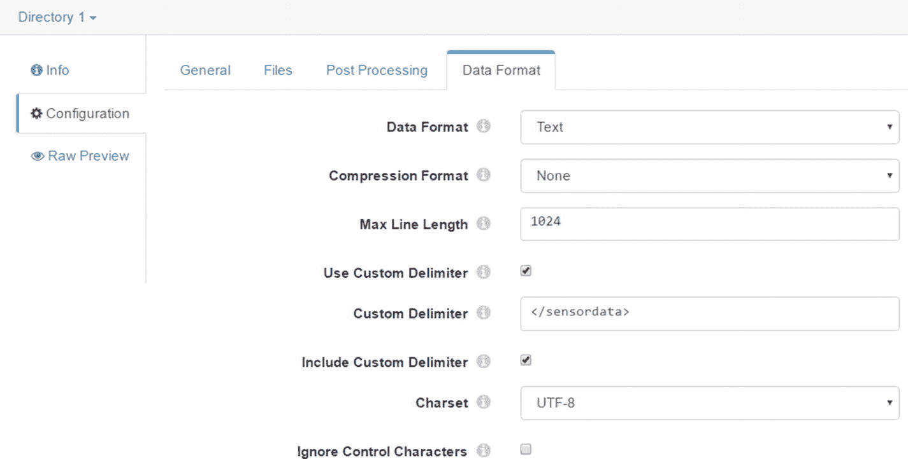

图 7-16

Data Format

### 配置 XML 解析器处理器

单击画布中的 XML 解析器处理器，并导航到属性面板的“配置”部分。“General”选项卡将允许您为 XML 解析器处理器设置名称和描述。导航至“解析”选项卡，并将“要解析的字段”和“目标字段”设置为“/文本”(参见图 [7-17](#Fig17) )。如前所述，目录源被配置为处理文本数据。它将记录写入一个名为“text”的文本字段 [<sup>xii</sup>](#Sec54) 这是 SDC 惯用的惯例。


图 7-17

Parse tab

当 Directory origins 处理我们的 XML 数据时，它将创建两个记录，用“.”分隔

```scala
<sensordata><rowid>1000</rowid><sensorid>12</sensorid><sensortimestamp>20170409001904</sensortimestamp><temperature>23</temperature><pressure>30</pressure></sensordata>
<sensordata><rowid>1001</rowid><sensorid>39</sensorid><sensortimestamp>20170409001927</sensortimestamp><temperature>25</temperature><pressure>28</pressure></sensordata>

```

在“配置”选项卡中，导航至 Kudu 并填写所需参数。“库都大师”的主机名和端口注意，因为我们在 Impala 中创建了“sensordata”表，所以它被认为是一个内部管理的表。在 Impala 中创建的 Kudu 表遵循命名约定“impala::database.table_name”将“表名”设置为“impala::default.sensordata”。您还需要设置字段到列的映射，如图 [7-18](#Fig18) 所示。SDC 字段的格式类似于“/text/column[0]/value”最后，您将“默认操作”设置为“插入”请注意，您可以选择执行其他操作，如向上插入、更新和删除。

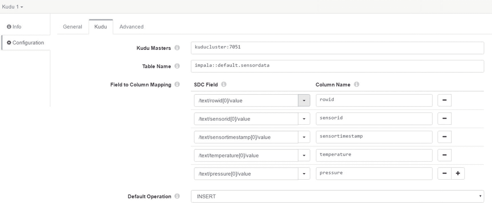

图 7-18

Kudu tab

### 验证和预览管道

现在您已经完成了管道的设计，您需要检查并确保所有的配置都是有效的。单击画布右上角的 validate 图标来验证管道。一旦您完成了验证，您就可以预览您的管道来测试它，而不用实际运行它。预览管道是调试和单步调试管道的简单方法，允许您在每个阶段检查数据。 [<sup>xiii</sup>](#Sec54) 点击预览图标。将出现一个“预览配置”窗口(参见图 [7-19](#Fig19) )。接受默认值并单击“运行预览”按钮。

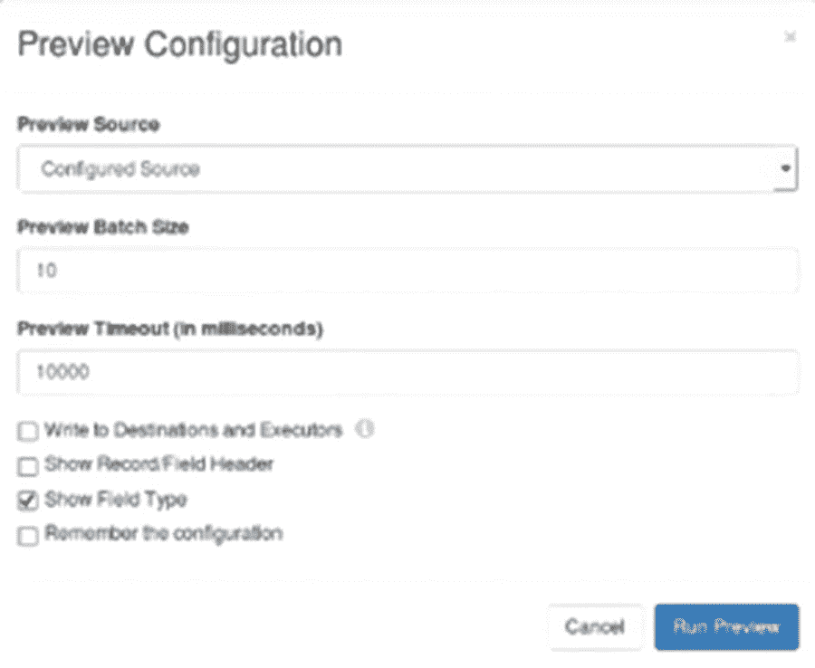

图 7-19

Preview Configuration

您现在处于预览模式。单击目录原点。在预览阶段窗格中，您可以看到测试记录的列表(参见图 [7-20](#Fig20) )。折叠每个记录会显示实际数据。请注意，第三条记录是空的。这将导致 XML 解析器处理器出错。


图 7-20

Preview – inspecting records

单击 XML 解析器处理器。在这里，您可以看到输入数据是如何处理的，以及产生的输出数据是什么样的。如您所见，XML 数据得到了正确处理，但正如所料，在处理空记录时出现了错误(参见图 [7-21](#Fig21) )。


图 7-21

Preview – error processing empty record

正如所料，Kudu 目的地的输入数据是 XML 解析器的输出(见图 [7-22](#Fig22) )。


图 7-22

Preview – Kudu destination

您也可以预览多个阶段。单击预览阶段面板顶部的“多个”。“预览多个阶段”面板允许您检查记录从一个阶段到另一个阶段的流程(参见图 [7-23](#Fig23) )。

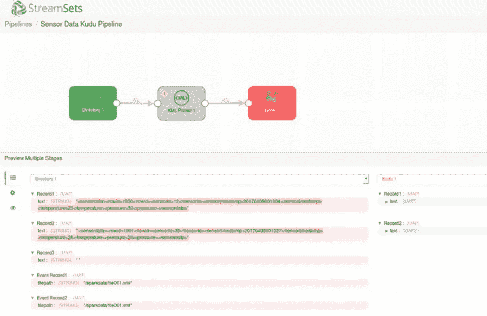

图 7-23

Preview – Multiple Stages

### 启动管道

现在，您已经准备好启动管道了。单击 start 图标，然后将我们的测试数据(file001.xml)复制到/sparkdata。

```scala
cat file001.xml
<sensordata><rowid>1000</rowid><sensorid>12</sensorid><sensortimestamp>20170409001904</sensortimestamp><temperature>23</temperature><pressure>30</pressure></sensordata>
<sensordata><rowid>1001</rowid><sensorid>39</sensorid><sensortimestamp>20170409001927</sensortimestamp><temperature>25</temperature><pressure>28</pressure></sensordata>
cp file001.xml /sparkdata

```

几秒钟后，您应该在监控面板上看到一些运行时统计数据，例如记录计数、记录吞吐量和批处理吞吐量等(参见图 [7-24](#Fig24) )。

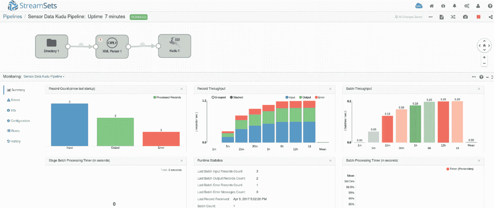

图 7-24

Monitoring pipeline

单击画布中的每个阶段，查看特定于该阶段的运行时统计信息。让我们点击位于画布中的目录原点(参见图 [7-25](#Fig25) )。

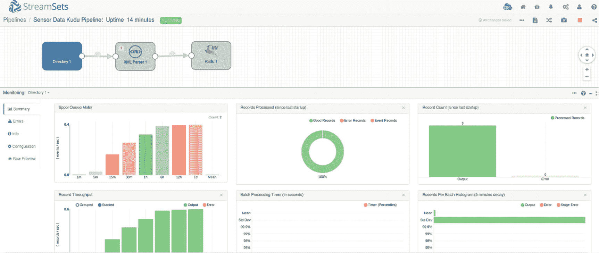

图 7-25

Monitoring– Directory Origin

单击 XML 解析器处理器会得到一组不同的指标(参见图 [7-26](#Fig26) )。


图 7-26

Monitoring – XML Parser

Kudu 目的地也有一套不同的指标。根据图 [7-27](#Fig27) 中的截图，在 sensordata Kudu 表中插入了两行。


图 7-27

Monitoring – Kudu destination

让我们验证这些行是否确实成功地插入到 Kudu 中。启动 impala-shell 并查询 sensordata 表。

```scala
select * from sensordata;

+-------+----------+-----------------+-------------+----------+
| rowid | sensorid | sensortimestamp | temperature | pressure |
+-------+----------+-----------------+-------------+----------+
| 1001  | 39       | 20170409001927  | 25          | 28       |
| 1000  | 12       | 20170409001904  | 23          | 30       |
+-------+----------+-----------------+-------------+----------+

```

行已成功添加到表中。尝试添加更多数据(参见图 [7-28](#Fig28) )。添加更多数据后，您将看到图表和其他指标得到更新。


图 7-28

Monitoring pipeline after one hour

恭喜你！您已经成功构建并运行了第一个 StreamSets 数据管道。

### 流选择器

有时候，您需要根据条件将数据路由到某些流。例如，您可以根据“国家”向某些表中插入数据有一个默认流处理不匹配任何用户定义条件的记录。 [<sup>十四</sup>](#Sec54)

```scala
Stream 1: ${record:value("/Country")==’USA’}
Stream 2: ${record:value("/Country")==’CANADA’}
Stream 3: ${record:value("/Country")==’BRAZIL’}
Stream 4: default

```

在这个管道中，所有“Country”匹配美国的记录都进入流 1，加拿大进入流 2，巴西进入流 3。其他的都到流 4。您将能够使用流选择器来指定这些条件。

让我们设计另一个管道。让我们复制刚刚创建的管道，并修改它以使用流选择器，而不是从头开始。在这个例子中，我们将把三个不同版本的 XML 数据写到三个不同的 Kudu 表中。这是我们新的 XML 数据的样子。流选择器将检查 firmwareversion 的值。

```scala
cat file002.xml

<sensordata>
        <rowid>1000</rowid>
        <sensorid>12</sensorid>
        <sensortimestamp>20170409001904</sensortimestamp>
        <temperature>23</temperature>
        <pressure>30</pressure>
        <firmwareversion>1</firmwareversion>
</sensordata>
<sensordata>
        <rowid>1001</rowid>
        <sensorid>39</sensorid>
        <sensortimestamp>20170409001927</sensortimestamp>
        <temperature>25</temperature>
        <pressure>28</pressure>
        <firmwareversion>2</firmwareversion>
        <humidity>110</humidity>
        <ozone>31</ozone>
</sensordata>
<sensordata>
        <rowid>1001</rowid>
        <sensorid>39</sensorid>
        <sensortimestamp>20170409001927</sensortimestamp>
        <temperature>25</temperature>
        <pressure>28</pressure>
        <firmwareversion>3</firmwareversion>
        <humidity>115</humidity>
        <ozone>12</ozone>
        <location>
                <altitude>121</altitude>
                <lat>37.8136</lat>
                <long>144.9631</long>
        </location>
</sensordata>

```

我们将创建另外两个 Kudu 表:sensordata2 和 sensordata3。我们还将在现有的 sensordata 表中添加 firmwareversion 列。我们总共有三个 sensordata 表，每个表都有一组不同的列。

```scala
CREATE TABLE sensordata2
(
       rowid BIGINT,
       sensorid SMALLINT,
       sensortimestamp STRING,
       temperature TINYINT,
       pressure TINYINT,
       firmwareversion TINYINT,
       humidity TINYINT,
       ozone TINYINT,
       PRIMARY KEY(rowid)
)
PARTITION BY HASH PARTITIONS 16
STORED AS KUDU;

CREATE TABLE sensordata3
(
       rowid BIGINT,
       sensorid SMALLINT,
       sensortimestamp STRING,
       temperature TINYINT,
       pressure TINYINT,
       firmwareversion TINYINT,
       humidity TINYINT,
       ozone TINYINT,
       altitude TINYINT,
       lat FLOAT,
       long FLOAT,
       PRIMARY KEY(rowid)
)
PARTITION BY HASH PARTITIONS 16
STORED AS KUDU;

ALTER TABLE sensordata ADD COLUMNS (firmwareversion TINYINT);

```

将一个流选择器处理器和另外两个 Kudu 目的地拖到画布上。将 XML 解析器连接到流连接器。你需要定义三个条件:firmwareversion 为 1(或者 2 或 3 以外的任何值)的 XML 数据到缺省流(Kudu 1)，firmwareversion 为 2 的 XML 数据到流 2 (Kudu 2)，最后 firmwareversion 为 3 的 XML 数据到流 3 (Kudu 3)。

用这些条件向流选择器处理器添加另外两个条件。

```scala
${record:value('/text/firmwareversion[0]/value') == "3"}
${record:value('/text/firmwareversion[0]/value') == "2"}

```

您的新管道应该如图 [7-29](#Fig29) 所示。


图 7-29

Stream Selector

对于每个 Kudu 目的地，确保将正确的 SDC 字段映射到相应的列名(图 [7-30](#Fig30) )。


图 7-30

First Kudu destination

请注意，第二个和第三个 Kudu 目的地将有额外的列(图 [7-31](#Fig31) )。不要忘记将固件版本添加到第一个 Kudu 目的地(图 [7-32](#Fig32) )。


图 7-32

Third Kudu destination

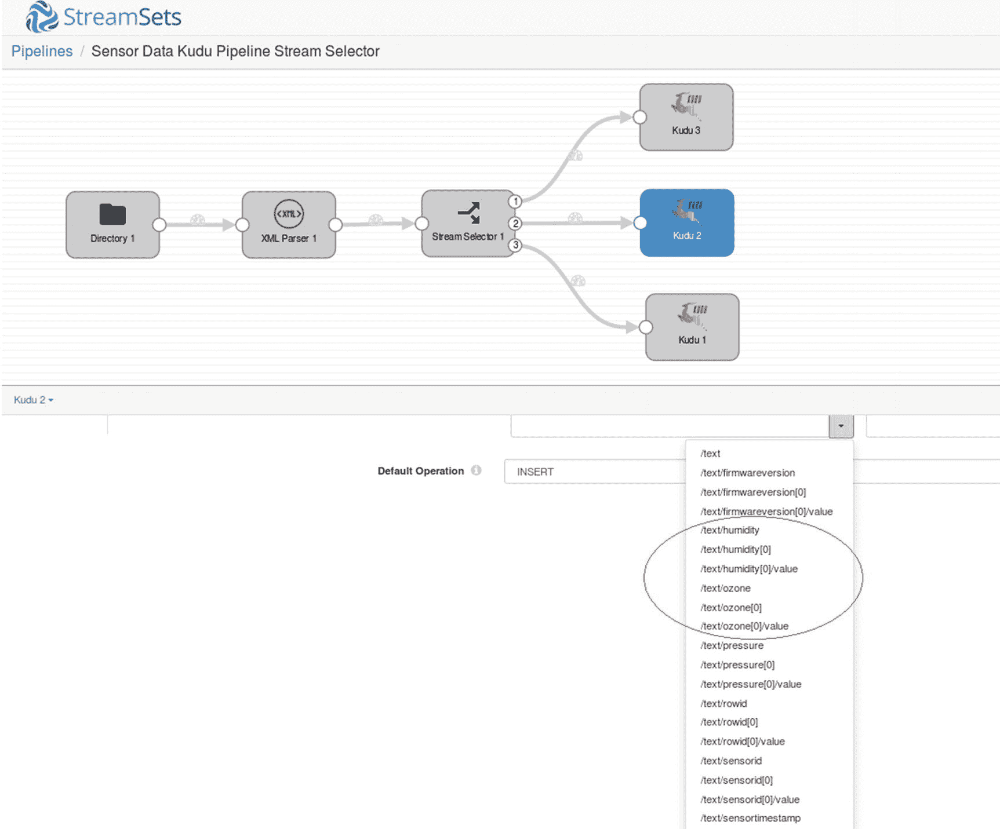

图 7-31

Second Kudu destination

验证并预览您刚刚创建的管道(图 [7-33](#Fig33) )。确认每个 Kudu 目的地正在接收正确的 XML 数据(图 [7-34](#Fig34) 和 [7-35](#Fig35) )。


图 7-35

Preview – Third Kudu destination


图 7-34

Preview – Second Kudu destination

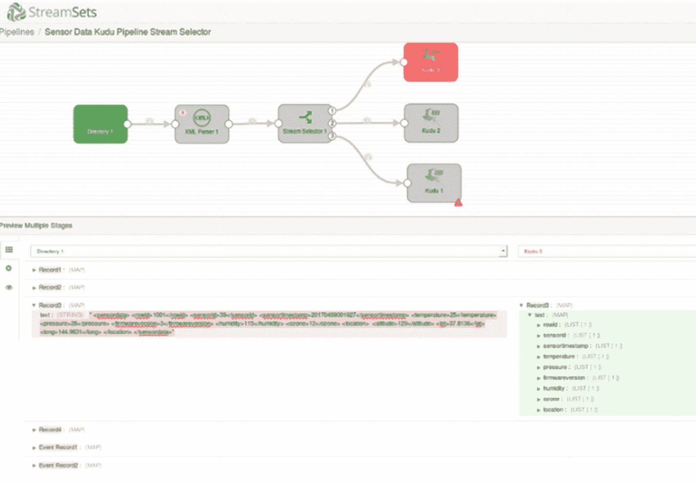

图 7-33

Preview – First Kudu destination

在开始流水线之前，确认目的地 Kudu 表是空的。

```scala
select count(*) from sensordata;

+----------+
| count(*) |
+----------+
| 0        |
+----------+

select count(*) from sensordata2;

+----------+
| count(*) |
+----------+
| 0        |
+----------+

select count(*) from sensordata3;

+----------+
| count(*) |
+----------+
| 0        |
+----------+

```

启动管道，然后将 file002.xml 复制到/sparkdata。几秒钟后，您将在 monitoring panel 中的图表上看到一些更新。单击流选择器处理器。正如您在记录计数图表中看到的，输入有三条记录，而三个输出各有一条记录。


图 7-36

Monitor Stream Selector (Figure [7-36](#Fig36))

检查每个 Kudu 目的地，查看记录是否被成功摄取。


图 7-37

Monitor Kudu destination (Figure [7-37](#Fig37))

检查 Kudu 表，确认记录已被成功摄取。

```scala
select * from sensordata;

+-------+----------+-----------------+-------------+
| rowid | sensorid | sensortimestamp | temperature |
+-------+----------+-----------------+-------------+
| 1000  | 12       | 20170409001904  | 23          |
+-------+----------+-----------------+-------------+
+-----------+-----------------+
| pressure  | firmwareversion |
+-----------+-----------------+
| 30        | 1               |
+-----------+-----------------+

select * from sensordata2;

+-------+----------+-----------------+-------------+
| rowid | sensorid | sensortimestamp | temperature |
+-------+----------+-----------------+-------------+
| 1001  | 39       | 20170409001927  | 25          |
+-------+----------+-----------------+-------------+
+----------+-----------------+----------+-------+
| pressure | firmwareversion | humidity | ozone |
+----------+-----------------+----------+-------+
| 28       | 2               | 110      | 31    |
+----------+-----------------+----------+-------+

select * from sensordata3;

+-------+----------+-----------------+-------------+
| rowid | sensorid | sensortimestamp | temperature |

+-------+----------+-----------------+-------------+
| 1001  | 39       | 20170409001927  | 25          |
+-------+----------+-----------------+-------------+
+----------+-----------------+----------+
| pressure | firmwareversion | humidity |
+----------+-----------------+----------+
| 28       | 3               | 115      |
+----------+-----------------+----------+
+-------+----------+------------------+-------------------+
| ozone | altitude | lat              | long              |
+-------+----------+------------------+-------------------+
| 12    | 121      | 37.8135986328125 | 144.9631042480469 |
+-------+----------+------------------+-------------------+

```

### 表达式评估器

表达式计算器允许用户执行数据转换和计算，并将结果写入新的或现有的字段。用户还可以添加或更改字段属性和记录标题属性。 [<sup>xv</sup>](#Sec54) 我经常使用表达式计算器作为规则引擎。

让我们做一个新的例子。我们将使用表达式计算器来执行两个数据转换。我们将把温度从摄氏温度转换为华氏温度，并保存到现有的温度场。对于第二个转换，我们将根据压力字段的值，用值“正常”、“警告”或“严重”来更新一个新的状态字段。如果压力超过 40，则状态字段更新为“警告”，如果压力超过 50，则更新为“危急”我们开始吧。

向 Kudu sensordata 表中添加另一个“status”列。

```scala
ALTER TABLE sensordata ADD COLUMNS (status STRING);

DESCRIBE sensordata;

+-----------------+----------+-------------+
| name            | type     | primary_key |
+-----------------+----------+-------------+
| rowid           | bigint   | true        |
| sensorid        | smallint | false       |
| sensortimestamp | string   | false       |
| temperature     | tinyint  | false       |
| pressure        | tinyint  | false       |
| firmwareversion | tinyint  | false       |
| status          | string   | false       |
+-----------------+----------+-------------+

```

在这个例子中，我们将使用下面的 XML 数据。

```scala
cat file003.xml

<sensordata>
       <rowid>1000</rowid>
       <sensorid>12</sensorid>
       <sensortimestamp>20170409001904</sensortimestamp>
       <temperature>23</temperature>
       <pressure>30</pressure>
       <firmwareversion>1</firmwareversion>
</sensordata>
<sensordata>
       <rowid>1001</rowid>
       <sensorid>39</sensorid>
       <sensortimestamp>20170409001927</sensortimestamp>
       <temperature>25</temperature>
       <pressure>28</pressure>
       <firmwareversion>2</firmwareversion>
       <humidity>110</humidity>
       <ozone>31</ozone>
</sensordata>
<sensordata>
        <rowid>1002</rowid>
        <sensorid>39</sensorid>
        <sensortimestamp>20170409001927</sensortimestamp>
        <temperature>25</temperature>
        <pressure>28</pressure>
        <firmwareversion>3</firmwareversion>

       <humidity>115</humidity>
       <ozone>12</ozone>
       <location>
              <altitude>121</altitude>
              <lat>37.8136</lat>
              <long>144.9631</long>
       </location>
</sensordata>
<sensordata>
       <rowid>1003</rowid>
        <sensorid>58</sensorid>
        <sensortimestamp>20170409001930</sensortimestamp>
        <temperature>22</temperature>
        <pressure>44</pressure>
        <firmwareversion>2</firmwareversion>
        <humidity>112</humidity>
        <ozone>17</ozone>
</sensordata>
<sensordata>
       <rowid>1004</rowid>
        <sensorid>72</sensorid>
        <sensortimestamp>20170409001934</sensortimestamp>
        <temperature>26</temperature>
        <pressure>59</pressure>
        <firmwareversion>2</firmwareversion>
        <humidity>115</humidity>
        <ozone>12</ozone>
</sensordata>

```

复制原始管道，并在 XML 解析器处理器和 Kudu 目的地之间添加一个表达式求值器处理器。连接阶段。你的画布看起来应该如图 [7-40](#Fig40) 所示。

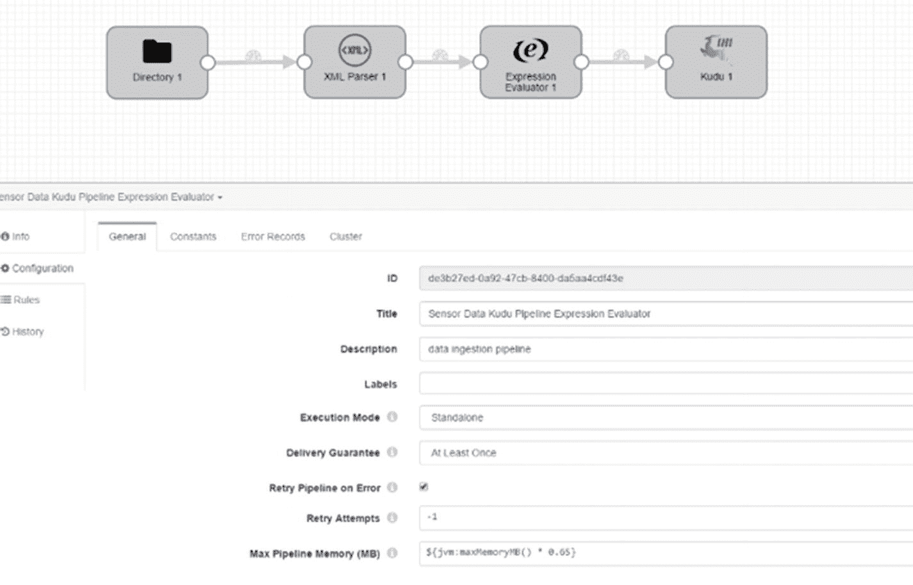

图 7-38

Expression Evaluator

点击表达式求值器处理器(图 [7-38](#Fig38) )并导航至“表达式”选项卡。我们将在“字段表达式”部分添加两个条目。对于第一个条目，在“输出字段”中输入以下值:

```scala
/text/temperature[0]/value

```

在“字段表达式”中，输入表达式:

```scala
 ${record:value('/text/temperature[0]/value') * 1.8 + 32}

```

这是把摄氏温度转换成华氏温度的公式。在“输出字段”中指定现有字段将覆盖字段中的值。

对于第二个条目，我们将使用 if-then-else 表达式。在“输出字段”中输入一个新字段:

```scala
/text/status

```

在“字段表达式”中输入表达式:

```scala
${record:value('/text/pressure[0]/value') > 50?'CRITICAL': (record:value('/text/pressure[0]/value') > 40?'WARNING':'NORMAL')}

```

你的屏幕应该如图 [7-41](#Fig41) 所示。


图 7-39

Expression Evaluator - Expression

将“/text/status”映射到 Kudu 目的地的新状态字段。

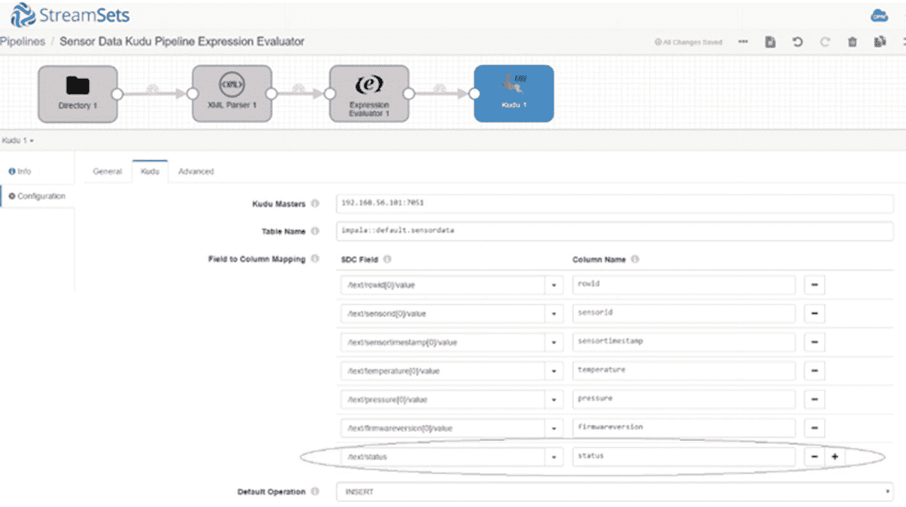

图 7-40

Map SDC field to Kudu field

验证和预览管道。单击表达式赋值器阶段，并确认输入和输出记录的值。请注意，输出记录 4 和记录 5 中的温度值已经转换为华氏温度。基于压力字段的值，输出记录 4 和记录 5 上的状态值分别更新为“警告”和“严重”。

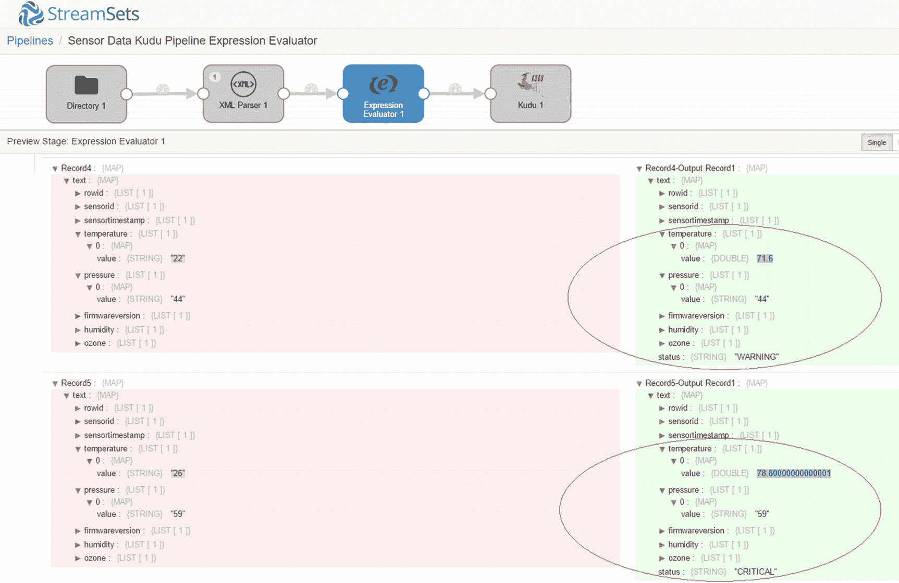

图 7-41

Preview – Expression Evaluator

确认 Kudu 目的地中的值。

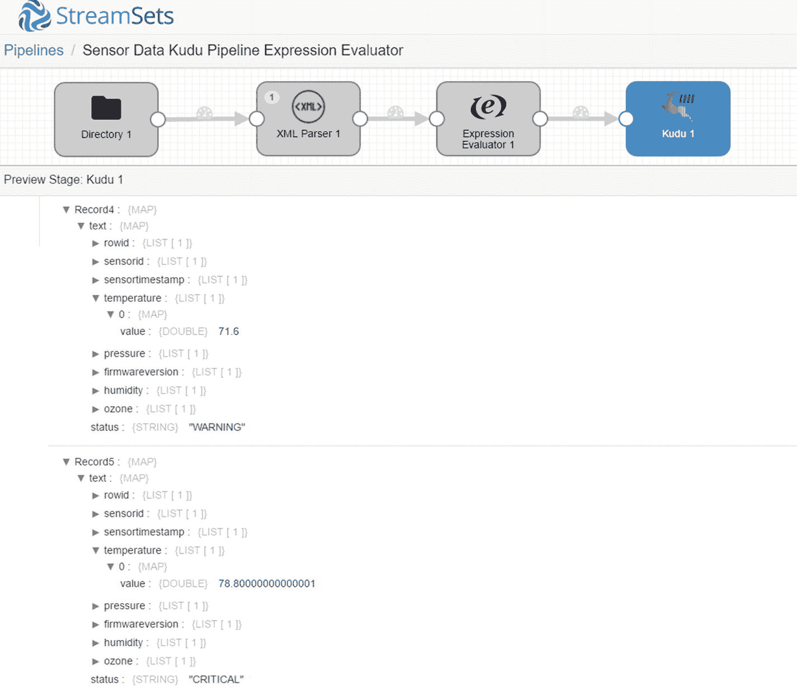

图 7-42

Preview – Kudu destination

运行管道并将 XML 文件复制到/sparkdata。

看起来所有五条记录都成功地插入到了 Kudu sensordata 表中。


图 7-43

Five records inserted into Kudu destination

确认数据已成功插入 Kudu。如您所见，状态字段已基于压力成功更新。另外，现在的温度是华氏温度。

```scala
SELECT * FROM sensordata;

+-------+----------+-----------------+-------------+
| rowid | sensorid | sensortimestamp | temperature |
+-------+----------+-----------------+-------------+
| 1002  | 39       | 20170409001927  | 77          |
| 1000  | 12       | 20170409001904  | 73          |
| 1001  | 39       | 20170409001927  | 77          |
| 1003  | 58       | 20170409001930  | 71          |
| 1004  | 72       | 20170409001934  | 78          |
+-------+----------+-----------------+-------------+

+----------+-----------------+----------+
|pressure  | firmwareversion | status   |
+----------+-----------------+----------+
|28        | 3               | NORMAL   |
|30        | 1               | NORMAL   |
|28        | 2               | NORMAL   |
|44        | 2               | WARNING  |
|59        | 2               | CRITICAL |

+----------+-----------------+----------+

```

### 使用 JavaScript 计算器

StreamSets 数据收集器包括一个 JavaScript 计算器，您可以使用它进行更复杂的处理和转换。它使用 JavaScript 代码一次处理一条记录或一批记录。 [<sup>xvi</sup>](#Sec54) 可以想象，与一次处理一批数据相比，一次处理一条记录很可能会更慢。在生产环境中，建议使用批处理。

虽然我们在这个例子中使用 JavaScript，但是 Data Collector 也支持其他语言。除了 JavaScript，您还可以使用 Java、Jython (Python)、Groovy 和 Spark 评估器。这些评估器使用户能够执行更高级的复杂流处理，充分利用每种编程语言的全部功能。

让我们从一个简单的例子开始。我们将创建两个附加字段，action 和 uniqueid。我们将基于 status 字段的值生成 action 的值。接下来，我们将使用定制的 JavaScript 函数生成一个通用唯一标识符(UUID)。我们将把这个 UUID 保存在我们唯一的字段中。

我们不必从头开始。我们将复制前面的管道，然后将一个 JavaScript 赋值器处理器拖到画布中，并放置在表达式赋值器处理器和 Kudu 目的地之间。重新连接舞台。你的画布看起来应该如图 [7-46](#Fig46) 所示。

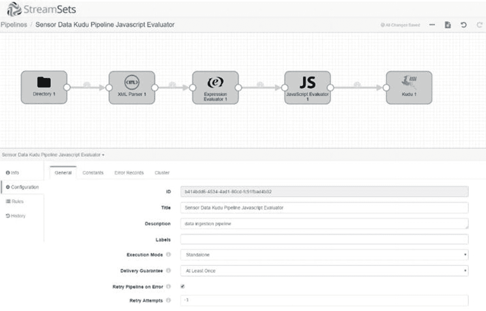

图 7-44

JavaScript Evaluator

现在让我们配置 JavaScript 评估器，以便在管道中使用我们的定制 JavaScript 代码。在“属性”面板的“JavaScript”选项卡上，确保“记录处理模式”设置为“逐批”“脚本”将包含您的客户 JavaScript 代码。如前所述，我们将创建一个函数来生成 UUID。[<sup>XVII</sup>](#Sec54)JavaScript 求值器将批处理作为数组传递给脚本。要访问单个字段，请使用以下格式:records[array index]. value . text . columname。要引用 status 字段的值，请使用“records[i].value.text.status”。我们还使用此格式创建了一个新字段“record[i].value.text.action”。见清单 [7-1](#Par110) 。

```scala
function generateUUID() {
    var d = new Date().getTime();
    var uuid = 'xxxxxxxx-xxxx-4xxx-yxxx-xxxxxxxxxxxx'.replace(/[xy]/g, function(c) {
        var r = (d + Math.random()*16)%16 | 0;
        d = Math.floor(d/16);
        return (c=='x' ? r : (r&0x3|0x8)).toString(16);
    });
    return uuid;
};

for(var i = 0; i < records.length; i++) {
  try {

   var myUUID = generateUUID()

    if (records[i].value.text.status == "NORMAL")
             records[i].value.text.action = "None. Pressure is normal.";
       else if (records[i].value.text.status == "WARNING")
             records[i].value.text.action = "File a support ticket.";
       else if (records[i].value.text.status == "CRITICAL")
             records[i].value.text.action = "Inform your supervisor immediately!";

    records[i].value.text.uniqueid = myUUID;

    output.write(records[i]);

  } catch (e) {
    error.write(records[i], e);
  }
}

Listing 7-1Javascript Evaluator code

```

你的屏幕应该如图 [7-47](#Fig47) 所示。

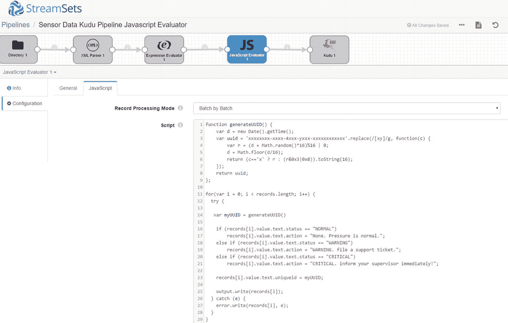

图 7-45

JavaScript Evaluator code

将 action 和 uniqueid 列添加到 Kudu sensordata 列中。

```scala
ALTER TABLE sensordata ADD COLUMNS (action STRING);

ALTER TABLE sensordata ADD COLUMNS (uniqueid STRING);

DESCRIBE sensordata;

+-----------------+----------+-------------+
| name            | type     | primary_key |
+-----------------+----------+-------------+
| rowid           | bigint   | true        |
| sensorid        | smallint | false       |
| sensortimestamp | string   | false       |
| temperature     | tinyint  | false       |
| pressure        | tinyint  | false       |
| firmwareversion | tinyint  | false       |
| status          | string   | false       |
| action          | string   | false       |
| uniqueid        | string   | false       |
+-----------------+----------+-------------+

```

将 SDC 字段与其对应的 Kudu 表列进行映射。


图 7-46

Map SDC field

验证和预览您的管道。单击 JavaScript 赋值器并确认输入和输出记录的值。请注意，已经填充了 action 和 unique 字段。


图 7-47

Preview values

确认 Kudu 目的地中的值。


图 7-48

Confirm values in Kudu destination

运行管道并将 XML 文件复制到/sparkdata。

看起来 JavaScript 评估器成功地处理了所有五条记录。


图 7-49

Monitor JavaScript Evaluator

所有五个记录也成功地插入到 Kudu sensordata 表中。


图 7-50

Monitor Kudu destination

确认数据已成功插入 Kudu。如您所见，action 和 uniqueid 字段已成功填充。

```scala
SELECT rowid, status, action, substr(1,10,uniqueid) as uniqueid FROM sensordata;

+-------+----------+-----------------------------------------+------------+
| rowid | status   | action                                  |uniqueid    |
+-------+----------+-----------------------------------------+------------+
| 1002  | NORMAL   | None. Pressure is normal.               |35c47cb3-e9 |
| 1000  | NORMAL   | None. Pressure is normal.               |d3017138-09 |
| 1001  | NORMAL   | None. Pressure is normal.               |d91416e0-1b |
| 1003  | WARNING  | WARNING. file a support ticket.         |30aa86be-71 |
| 1004  | CRITICAL | CRITICAL. inform your supervisor immediately!|f7161ea3-eb |
+-------+----------+----------------------------------------+-------------+

```

恭喜你！您已经在管道中成功地使用了 JavaScript 评估器。

### 摄入多个 Kudu 集群

有时，出于高可用性和可扩展性的原因，您需要将数据接收到两个或更多主动-主动集群中。使用 Data Collector，只需将 Kudu 目的地添加到画布并将它们连接到处理器即可轻松完成。在本例中，我们将同时将 XML 数据接收到两个 Kudu 集群 kuducluster01 和 kuducluster02 中。

将第二个 Kudu 目的位置拖到画布上。您现在应该有两个 Kudu 目的地。确保它们都连接到 XML 处理器。


图 7-51

Multiple Kudu destinations

单击第一个 Kudu 目的地。确保在 Kudu Masters 字段中指定了正确的主机名和端口。确保 SDC 字段也映射到 Kudu 表字段。


图 7-52

Configure first Kudu destination

接下来，单击第二个 Kudu 目的地。执行与第一个 Kudu 目的地相同的任务。

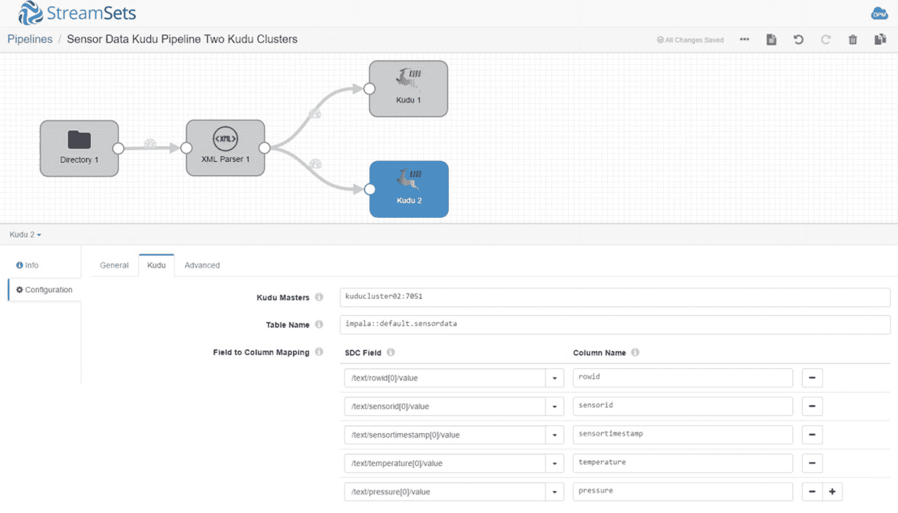

图 7-53

Configure second Kudu destination

验证和预览管道。完成后，启动管道并开始添加数据。监视 XML 解析器。注意输入和输出数据的数量。

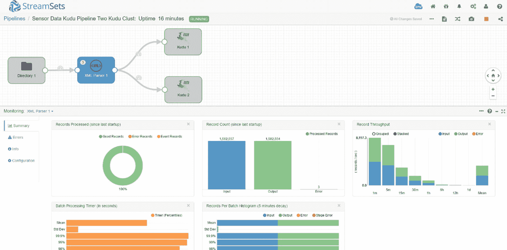

图 7-54

Monitor XML Parser

监控第一个库都目的地。请注意，它处理了 1，582，554 条记录。


图 7-55

Monitor first Kudu destination

检查第二个 Kudu 目的地，注意它也接收了相同数量的记录。


图 7-56

Monitor second Kudu destination

在黑斑羚验证。对第一个 Kudu 集群上的 sensordata 表执行选择计数。

```scala
select count(*) from sensordata;

+----------+
| count(*) |
+----------+
| 1582554  |
+----------+

```

对第二个 Kudu 集群执行相同的选择计数。

```scala
select count(*) from sensordata;

+----------+
| count(*) |
+----------+
| 1582554  |
+----------+

```

你同时摄入了两个库度星团的数据。您可以摄取到不同的平台组合，如 HBase、Cassandra、Solr、Kafka、S3、MongoDB 等。有关详细信息，请参考数据采集器用户指南。

### 应用程序接口

Data Collector 有一个易于使用的基于 web 的 GUI，用于设计、运行和管理管道。但是，如果您希望以编程方式与数据收集器进行交互，例如出于自动化的目的，您也可以使用内置的 REST API。REST API 允许您访问数据收集器的所有方面，从启动和停止管道、返回配置信息和监控管道指标。

您可以通过单击帮助图标，然后选择“RESTful API”来访问 REST API

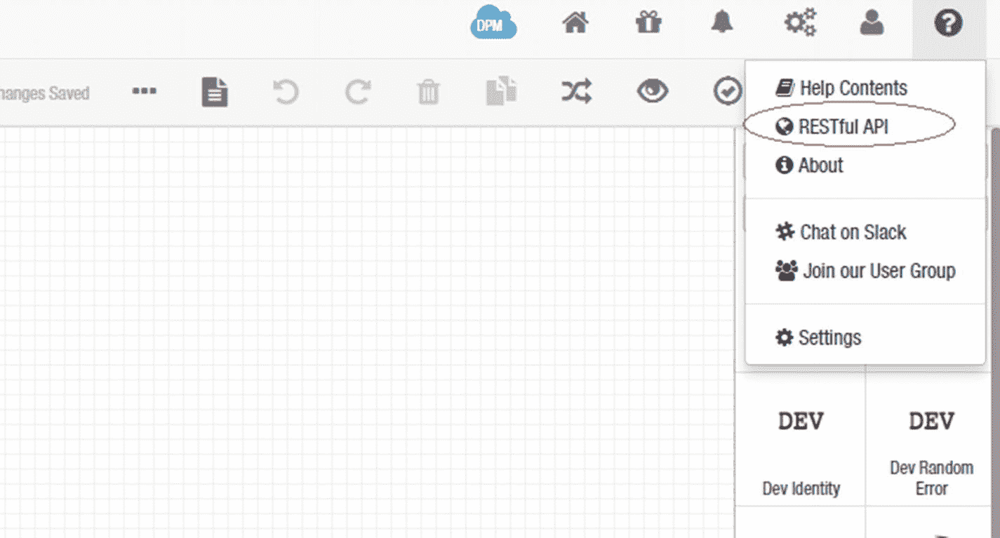

图 7-57

REST API

您将看到一组可用的操作。点击“经理”展开经理列表您可以在“manager”组下探索不同的操作，例如返回管道状态、启动和停止管道等等。

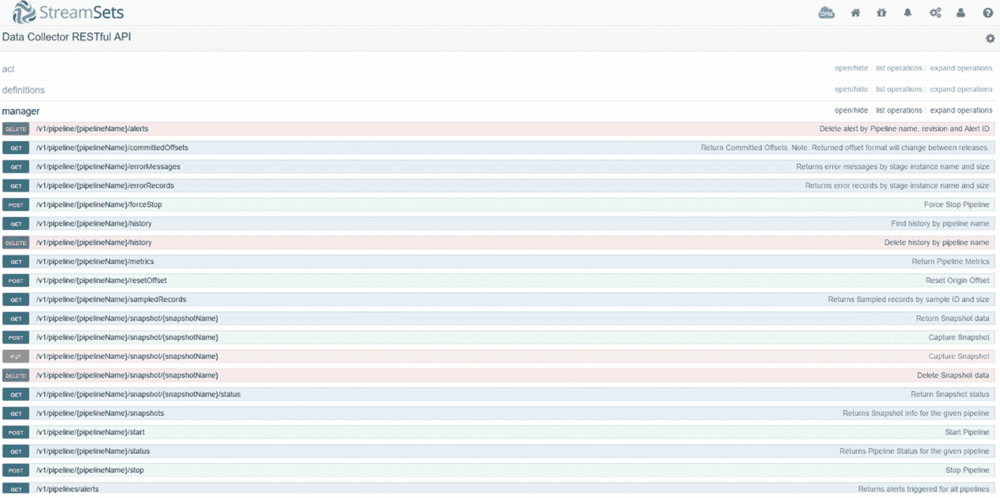

图 7-58

List of available operations

展开“返回所有管道状态”选择响应内容类型“application/json ”,然后单击“试用”按钮。

“响应体”将包含 JSON 格式的管道细节，类似于清单 [7-2](#Par140) 。根据管道数量和返回的错误消息类型，响应正文可能会非常大。

```scala
{
  "47234db3-7a94-40ab-9465-2dc799e132e6": {
    "user": "admin",
    "name": "47234db3-7a94-40ab-9465-2dc799e132e6",
    "rev": "0",
    "status": "EDITED",
    "message": "Pipeline edited",
    "timeStamp": 1491742372750,
    "attributes": {
      "IS_REMOTE_PIPELINE": false
    },
    "executionMode": "STANDALONE",
    "metrics": null,
    "retryAttempt": 0,
    "nextRetryTimeStamp": 0
  },
  "6c92cc6d-bdef-4b2b-ad62-69537e057128": {
    "user": "admin",
    "name": "6c92cc6d-bdef-4b2b-ad62-69537e057128",
    "rev": "0",
    "status": "EDITED",
    "message": "Pipeline edited",
    "timeStamp": 1491739709715,
    "attributes": {
      "IS_REMOTE_PIPELINE": false
    },
    "executionMode": "STANDALONE",
    "metrics": null,
    "retryAttempt": 0,
    "nextRetryTimeStamp": 0
  },
  "de3b27ed-0a92-47cb-8400-da5aa4cdf43e": {

    "user": "admin",
    "name": "de3b27ed-0a92-47cb-8400-da5aa4cdf43e",
    "rev": "0",
    "status": "STOPPED",
    "message": "The pipeline was stopped. The last committed source offset is 'file006.xml::-1'.",
    "timeStamp": 1492067839465,
    "attributes": {
      "IS_REMOTE_PIPELINE": false
    },
    "executionMode": "STANDALONE",
    "metrics": null,
    "retryAttempt": 0,
    "nextRetryTimeStamp": 0
  },
  "e4ded330-c573-4ab0-8fa8-004991493398": {
    "user": "admin",
    "name": "e4ded330-c573-4ab0-8fa8-004991493398",
    "rev": "0",
    "status": "STOPPED",
    "message": "The pipeline was stopped. The last committed source offset is 'file006.xml::-1'.",
    "timeStamp": 1492176332877,
    "attributes": {
      "IS_REMOTE_PIPELINE": false
    },
    "executionMode": "STANDALONE",

    "metrics": null,
    "retryAttempt": 0,
    "nextRetryTimeStamp": 0
  }
}
Listing 7-2Return all pipeline status response body

```

您可以使用 curl 发出 REST API 请求，curl 是一个可以使用标准协议下载数据的实用程序。用户名和密码以及自定义 HTTP 头属性(X-Requested-By)是必需的。

```scala
curl -u admin:mypassword http://localhost:18630/rest/v1/pipelines/status -H "X-Requested-By:myscript"

```

### 事件框架

StreamSets 有一个事件框架，允许用户启动任务来响应管道中发生的触发器或事件。StreamSets 使用数据流触发器来执行任务，如发送电子邮件、执行 shell 脚本、启动 JDBC 查询或在事件后启动 Spark 作业，例如，在管道成功完成 JDBC 查询后。

### 数据流性能管理器

StreamSets 最强大的功能之一是 StreamSets 数据流性能管理器。StreamSets data flow Performance Manager(DPM)是一个管理控制台，允许您管理复杂的数据流，为您的环境中所有正在运行的管道提供统一的视图。DPM 在管道监控和故障排除方面非常有用。当你的任务是监控数百甚至数千条管道时，你会更加体会到它的价值。介绍 DPM 超出了本书的范围。有关详细信息，请参阅数据采集器用户指南。

我只介绍了 StreamSets 特性和功能的一小部分。有关流集的详细信息，请参阅《流集数据采集器用户指南》。在第 [9](09.html) 章中，我使用 StreamSets、Zoomdata 和 Kudu 创建了一个完整的物联网(IoT)应用程序，该应用程序实时接收和可视化传感器数据。

## 其他下一代大数据集成工具

市场上还有其他下一代数据集成工具。我讨论了在木桶数据应用程序平台中一些最流行的选项。

木桶数据应用平台(CDAP)是一个开源平台，您可以使用 Spark 和 Hadoop 堆栈来开发大数据应用和 ETL 作业。CDAP 提供了一个基于 GUI 的数据摄取工作室，用于开发、部署和管理数据管道。其数据准备功能提供了一种交互式的数据清理和转换方法，这是一组通常称为数据整理的任务。CDAP 还有一个应用程序开发框架、用于快速应用程序开发和部署的高级 Java APIs。除此之外，它还具有对企业环境非常重要的元数据、数据沿袭和安全特性。和 StreamSets 一样，它也有对 Kudu 的本地支持。让我们开发一个 CDAP 管道将数据输入到 Kudu。

### 使用 Kudu 摄取数据

我们需要做的第一件事是为我们的例子准备测试数据。

```scala
cat test01.csv

1,Jeff Wells,San Diego,71
2,Nancy Maher,Van Nuys,34
3,Thomas Chen,Rolling Hills,62
4,Earl Brown,Artesia,29

hadoop fs -put test01.csv /mydata

```

要访问 CDAP，请使用端口 11011 将您的浏览器定向到安装该应用程序的服务器的主机名。第一次访问 CDAP 时，你会看到一个欢迎页面。

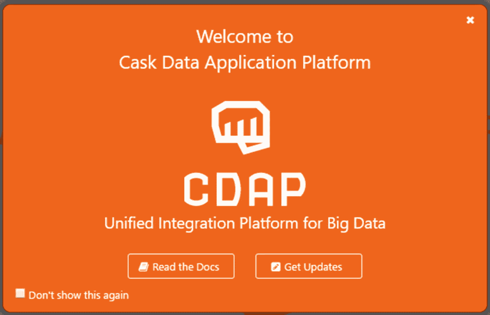

图 7-59

CDAP welcome page

关闭窗口，然后单击按钮“从向 CDAP 添加实体开始”你有五个选择。让我们创建一个管道。


图 7-60

Add Entity

将出现一个画布。这是您设计、部署和管理数据管道的地方。在画布的右侧，您可以选择不同的源、转换和接收器来设计您的管道。


图 7-61

CDAP canvas

你可能会注意到 Kudu 源和汇都不见了。我们需要添加酒桶市场的 Kudu 源和汇。单击应用程序窗口右上角附近的“木桶市场”链接。

向下滚动木桶市场的物品列表，直到你找到库杜源头和水槽。


图 7-62

Cask Market

单击 Kudu 源和接收器图标，然后单击“部署”


图 7-63

Cask Market – Kudu Source and Sink

点击“完成”

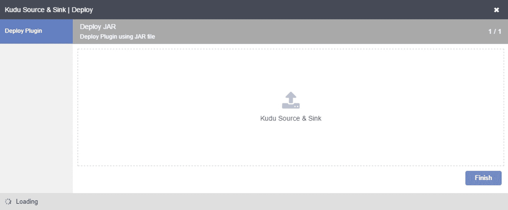

图 7-64

Finish installation

单击“创建管道”请注意，Kudu 图标现在可以用作数据源和接收器。


图 7-65

Kudu data source and sink

我们的示例 CDAP 管道将一个 CSV 文件接收到一个 Kudu 表中。但是在插入数据之前，我们将使用流行的散列算法对名称进行散列。让我们将一个“文件”源拖到画布上。

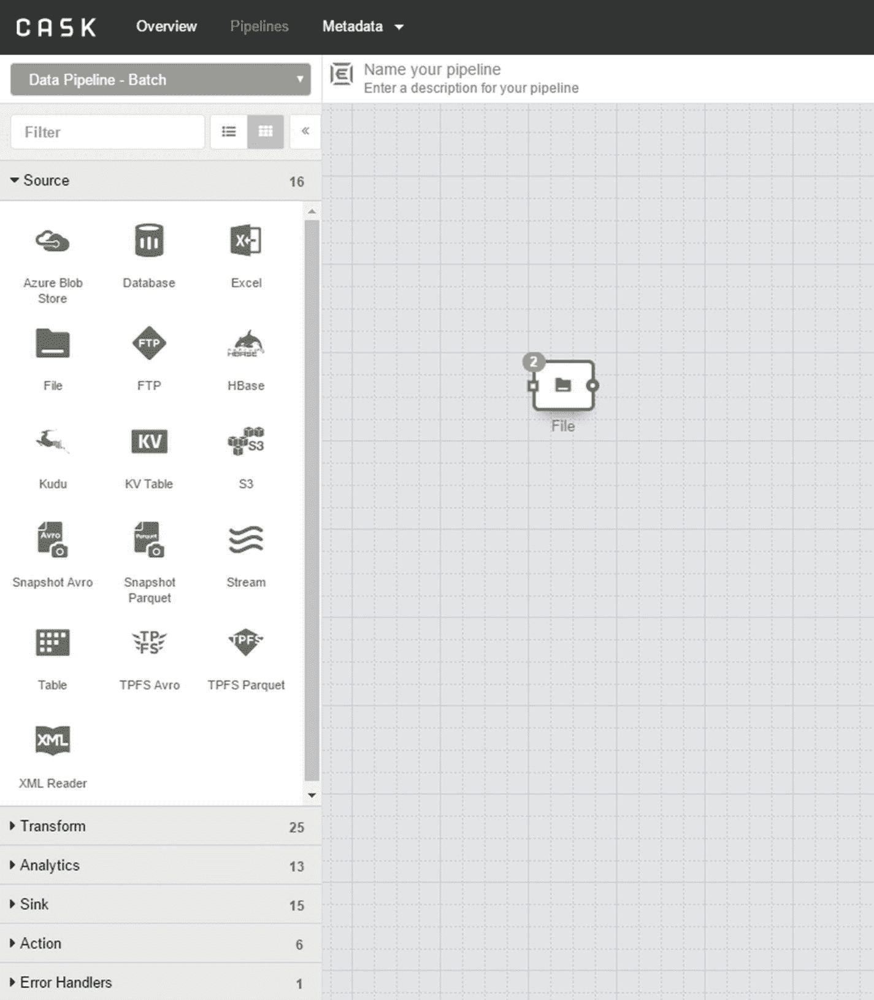

图 7-66

File source

双击文件源图标。输入文件属性，如文件名和文件在 HDFS 的路径。

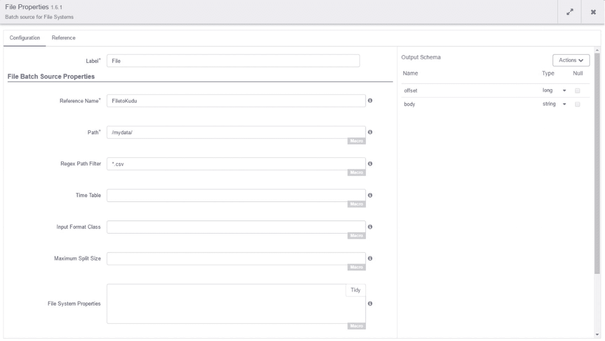

图 7-67

File properties

CDAP 使得访问关于特定汇、源或转换的文档变得容易。

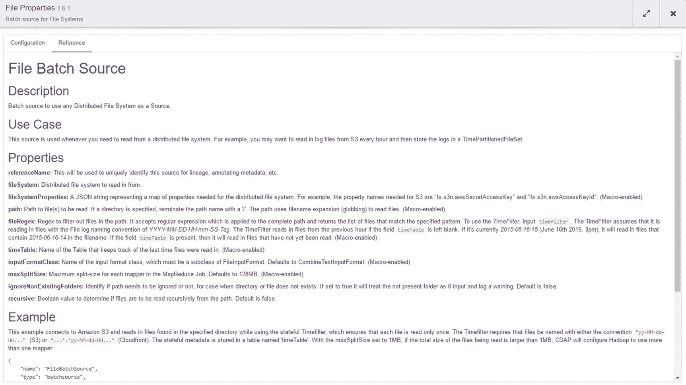

图 7-68

File Batch Source documentation

接下来，将一个 CSVParser 转换拖到画布上，并将其连接到文件源。


图 7-69

CSVParser transformation

输入 CSVParser 属性。确保输出模式具有正确的列。


图 7-70

Configure CSVParser

如果您需要帮助，CSV 解析器转换的文档是现成的。

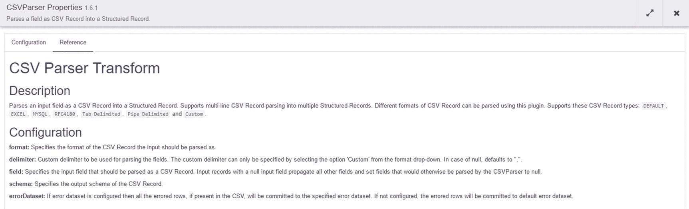

图 7-71

CSVParser documentation

将 Hasher 转换拖到画布上，并将其与 CSVParser 连接起来。


图 7-72

Hasher transformation

通过选择哈希算法并指定要哈希的字段来配置哈希器。对于这个例子，我们将选择 MD5 作为我们的散列算法。


图 7-73

Hasher configuration

拖动 Kudu 水槽并将其连接到哈希器。

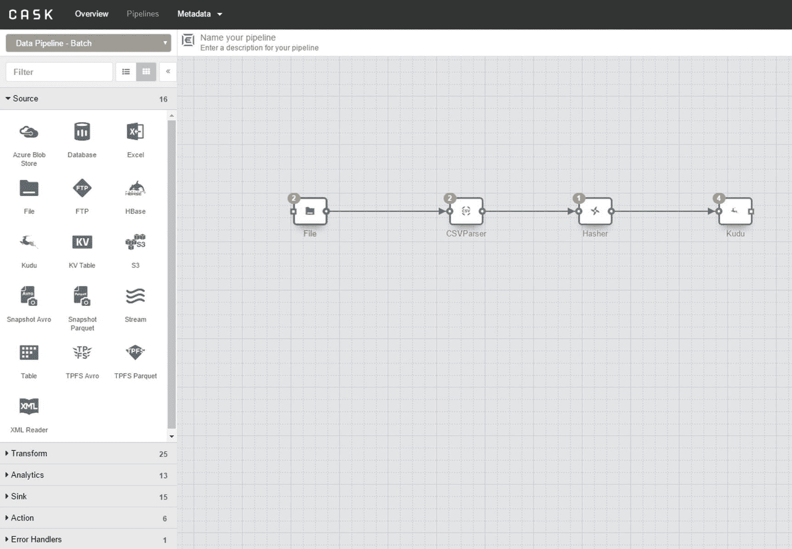

图 7-74

Kudu sink

配置 Kudu 接收器。注意，CDAP 使用 Kudu 原生 API 将数据插入到表中，而不是通过 Impala。CDAP 还将创建目标表，因此您只需要指定表名，而不是使用“impala::database _ name . table _ name”格式。在本例中，我们将使用表名“users_table”稍后，我们将在这个 Kudu 表的顶部创建一个外部 Impala 表。


图 7-75

Kudu sink configuration

Kudu sink 文档可供使用，以防您在某些选项上需要帮助。

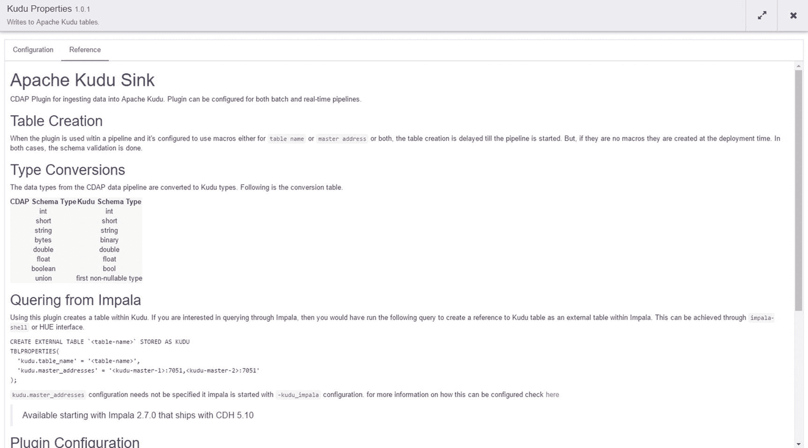

图 7-76

Kudu sink documentation

你的画布看起来应该如图 [7-77](#Fig77) 所示。现在可以部署管道了。您可以先预览和验证管道，以确保没有错误。


图 7-77

Complete pipeline

最后，画布将向您显示从文件源一直到 Kudu 接收器传输和处理的记录数量。您会在画布的左上角附近看到一个指示器，指示作业是否成功。参见图 [7-78](#Fig78) 。


图 7-78

Number of records transferred and processed

检查日志并确认作业成功，如图 [7-79](#Fig79) 所示。

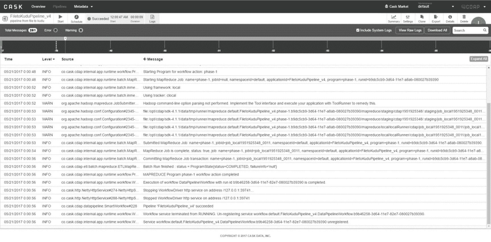

图 7-79

Check CDAP logs

确认行已成功插入到 Kudu 表中。首先，我们必须在 CDAP 创建的 Kudu 表之上用 Impala 创建一个外部表。确保名称字段是散列的。

```scala
impala-shell

CREATE EXTERNAL TABLE cdap_users
STORED AS KUDU
TBLPROPERTIES (
'kudu.table_name' = 'users_table'
);

SELECT * FROM cdap_users;

+----+----------------------------------+---------------+-----+
| id | name                             | city          | age |
+----+----------------------------------+---------------+-----+
| 3  | dd500fc6d39cde55b6b4858e9854a21d | Rolling Hills | 62  |
| 1  | 228b855279d81c5251cff62e2b503079 | San Diego     | 71  |
| 4  | 332035b1942026174865ede2021dad2a | Artesia       | 29  |
| 2  | 8283a7fa1a09657dcc62125f8d734a7e | Van Nuys      | 34  |
+----+----------------------------------+---------------+-----+

```

您已经成功地将数据接收到一个 Kudu 表中，使用一个字段散列器对数据执行流内转换。

### Pentaho 数据集成

Pentaho 为数据集成、大数据处理和商业分析提供完整的产品系列。在本章中，我们将重点介绍 Pentaho 数据集成(PDI)。有一个社区版叫 Pentaho 社区版(CE)，里面有 Kettle，Pentaho 数据集成的开源版本。有一个企业版，包括原生纱集成、分析器和仪表板增强、高级安全性和高可用性特性。 [<sup>xix</sup>](#Sec54)

Pentaho PDI 有一个直观的用户界面，具有现成的和易于使用的组件，以帮助您开发数据摄取管道。与市场上大多数 ETL 工具类似，Pentaho PDI 允许您连接到不同类型的数据源，从 Oracle、SQL Server、MySQL 和 Teradata 等流行的 RDBMS 到 HDFS、HBase、Cassandra 和 MongoDB 等大数据和 NoSQL 平台。PDI 包括用于协调和管理工作流的集成企业流程编排和调度功能。您可以毫不费力地在 Pentaho 的本地执行引擎和 Apache Spark 之间切换，以扩展您的管道来处理大量数据。

### 将 CSV 摄入 HDFS 和库都

与本章描述的其他数据集成工具不同，Pentaho 还没有包含对 Kudu 的本地支持。为了将数据插入到 Kudu 中，我们需要使用 Pentaho 的通用表格输出组件和 Impala 的 JDBC 驱动程序。根据数据的大小和数据接收要求，直接使用表输出可能不够快。提高性能的一种方法是首先将数据转移到 HDFS，然后使用表输出将数据从 HDFS 接收到 Kudu。在某些情况下，这可能比直接摄入 Kudu 更快。

我们需要做的第一件事是为我们的例子准备测试数据。

```scala
cd /mydata

cat test01.csv

id,name,city,age
1,Jeff Wells,San Diego,71
2,Nancy Maher,Van Nuys,34
3,Thomas Chen,Rolling Hills,62
4,Earl Brown,Artesia,29

```

开始彭塔霍 PDI。在这个例子中，我们将使用社区版(Kettle)。导航到安装二进制文件的位置并执行。见图 [7-80](#Fig80) 。

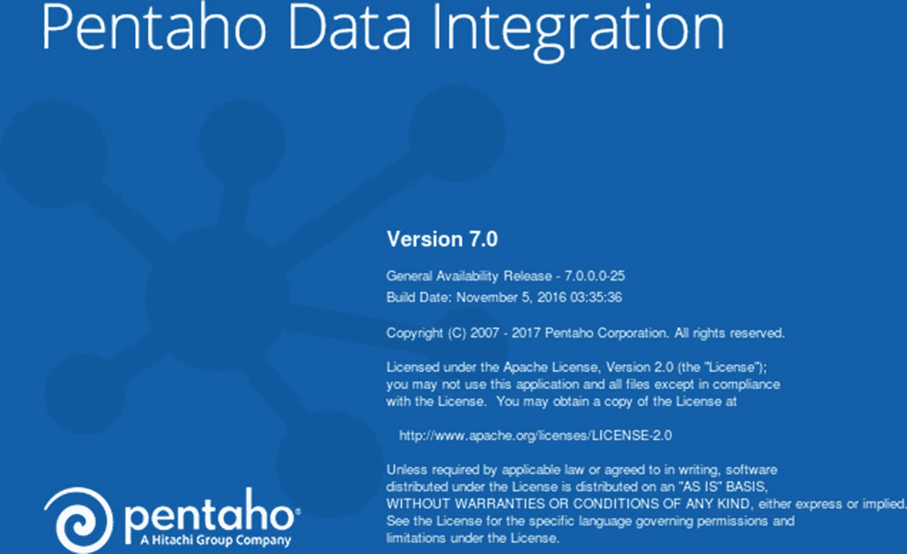

图 7-80

Start Pentaho Data Integration

勺子图形用户界面如图 [7-81](#Fig81) 所示。这是你设计和构建工作和转型的地方。


图 7-81

Graphical view

在窗口的左侧，您可以找到 ETL 开发中所有支持的输入、输出和转换步骤的列表。展开“输入”并将“CSV 文件输入”步骤拖动到画布上，如图 [7-82](#Fig82) 所示。


图 7-82

CSV file input

双击该图标。输入配置详细信息，如文件名、分隔符等。参见图 [7-83](#Fig83) 。

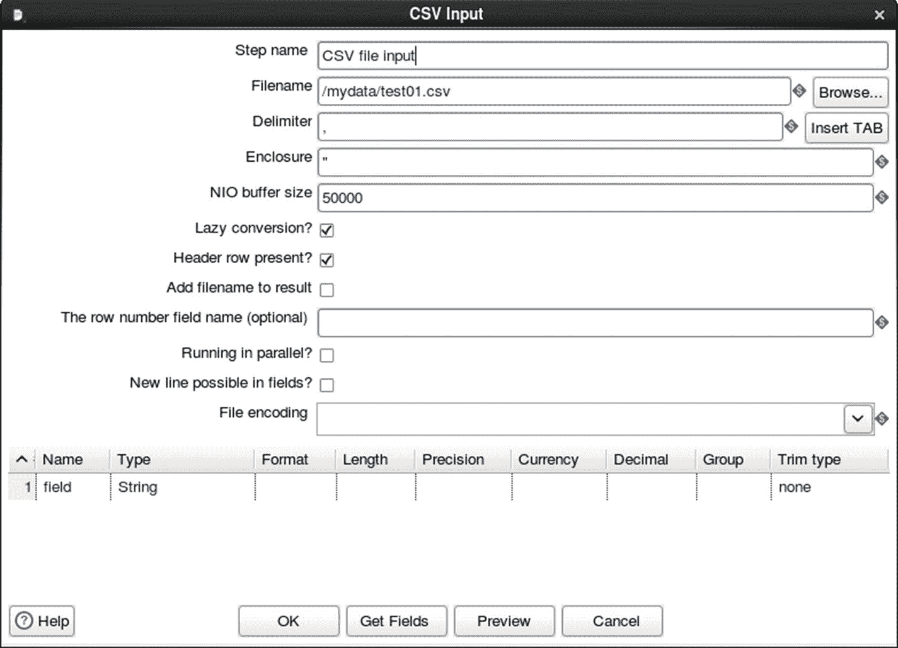

图 7-83

Configure CSV file input

点击“获取字段”让 Pentaho 推断字段类型和字段大小。参见图 [7-84](#Fig84) 。


图 7-84

Get fields

展开“大数据”，拖动“Hadoop 文件输出”到画布上，如图 [7-85](#Fig85) 所示。


图 7-85

Hadoop file output

将“CSV 文件输入”连接到“Hadoop 文件输出”，如图 [7-86](#Fig86) 所示。

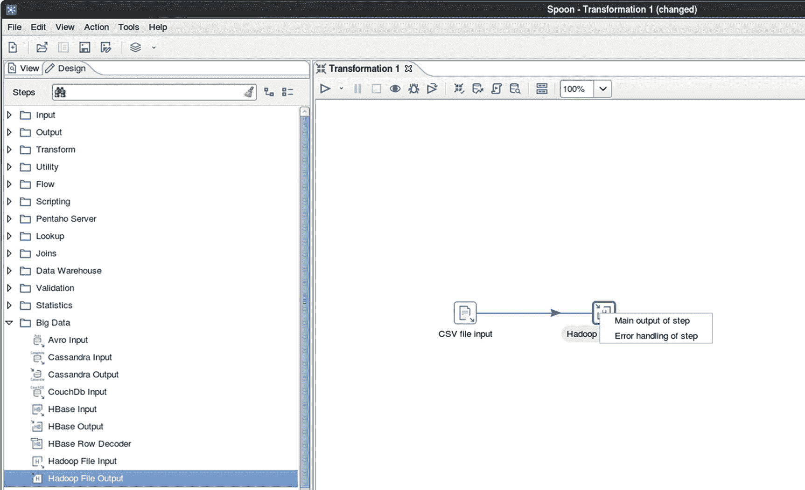

图 7-86

Connect CSV file input to Hadoop file output

双击“Hadoop 文件输出”组件来配置目标。输入所有必需的信息，例如集群的名称、HDFS 命名节点的地址等等。参见图 [7-87](#Fig87) 。

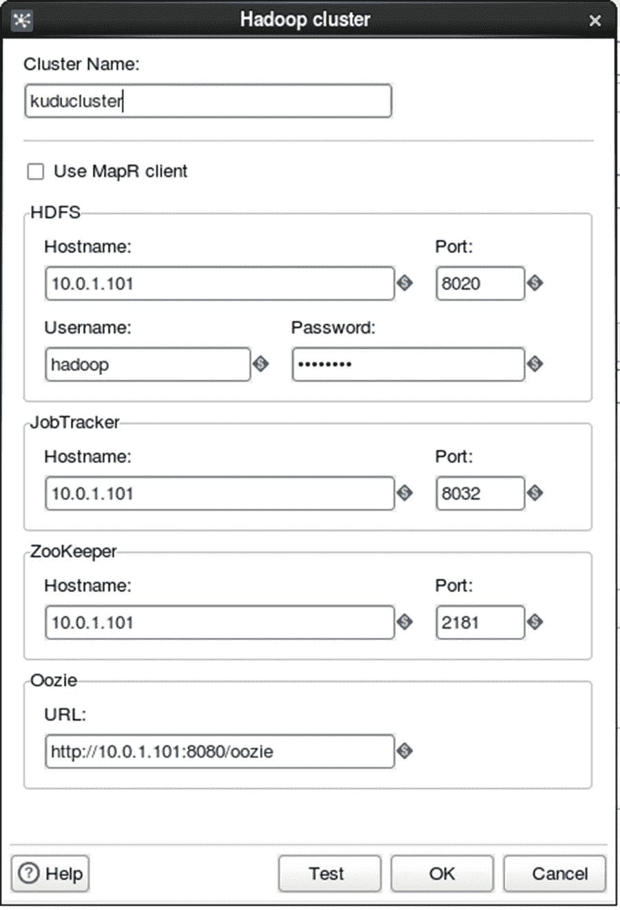

图 7-87

Configure Hadoop file output

向 Hadoop 文件输出阶段输入附加参数。在我们的例子中，我们将根据自己的日期时间格式重命名文件。参见图 [7-88](#Fig88) 。

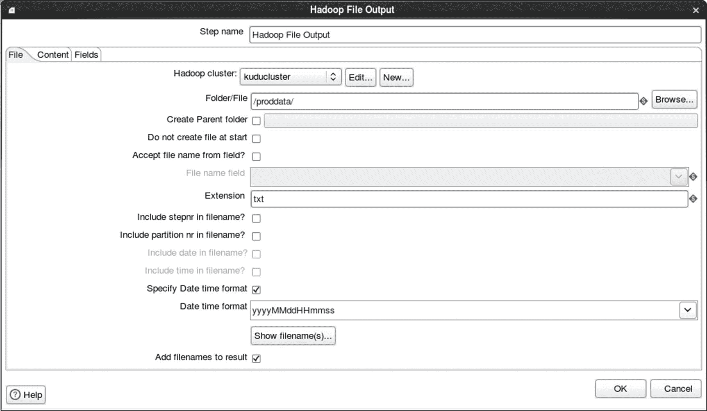

图 7-88

Rename file based on date time format

指定字段的详细信息，如数据类型、格式、长度、精度等。参见图 [7-89](#Fig89) 。


图 7-89

Configure fields

您可以预览和检查您的数据。参见图 [7-90](#Fig90) 。


图 7-90

Preview data

PDI 最有用的功能之一是能够监控工作的执行指标。试着做一次测试，确保数据从源传输到目的地。见图 [7-91](#Fig91) 。

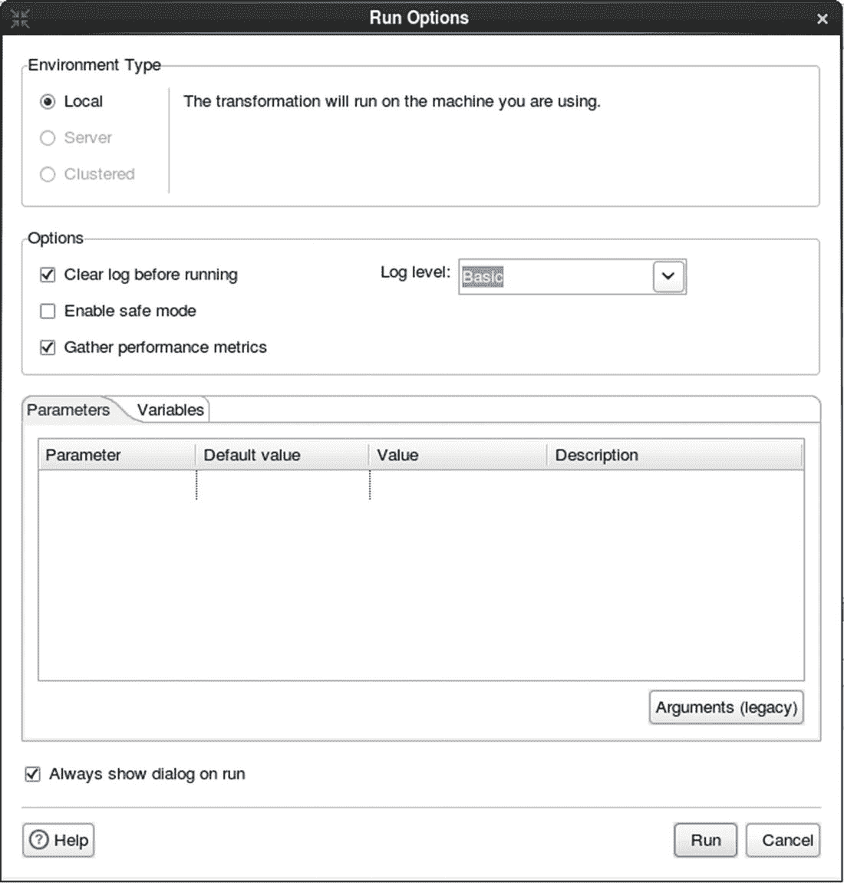

图 7-91

Run the job

导航到执行结果面板中的“指标”，如图 [7-92](#Fig92) 所示。

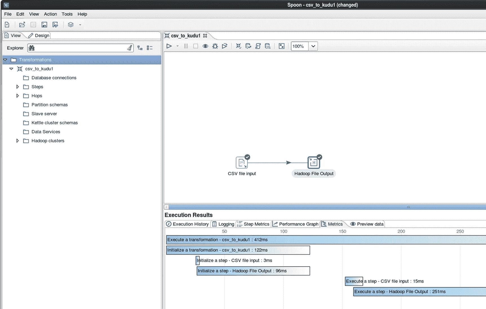

图 7-92

Execution Results

仔细看，它显示了工作中每一步需要多长时间。在本例中，整个作业执行了 412 毫秒。初始化转换耗时 122 毫秒，其中一部分耗时 122 毫秒，初始化 CSV 文件输入步骤耗时 3 毫秒，而初始化 Hadoop 文件输出步骤耗时 96 毫秒。CSV 文件输入步骤的实际执行耗时 15 毫秒，而 Hadoop 文件输出的执行耗时 251 毫秒。参见图 [7-93](#Fig93) 。


图 7-93

Metrics – Execution Results

导航到“日志记录”选项卡以检查应用程序日志。如图 [7-94](#Fig94) 所示，可以看到作业成功执行。


图 7-94

Logging – Execution Results

确认文件确实被复制到 HDFS。

```scala
hadoop fs -ls /proddata
-rw-r--r--   3 hadoop supergroup        129 2017-05-13 00:05/proddata/20170513000514.txt

hadoop fs -cat /proddata/20170513000514.txt
id,name,city,age
1,Jeff Wells,San Diego,71
2,Nancy Maher,Van Nuys,34
3,Thomas Chen,Rolling Hills,62
4,Earl Brown,Artesia,29

```

让我们配置最终目的地。将表格输出步骤拖到画布上。双击图标并开始配置步骤。我们来配置一下 Impala 驱动。从 Cloudera.com 下载黑斑羚 JDBC 驱动程序，并复制到 <install directory="">/data-integration/lib。见图 [7-95](#Fig95) 。</install>

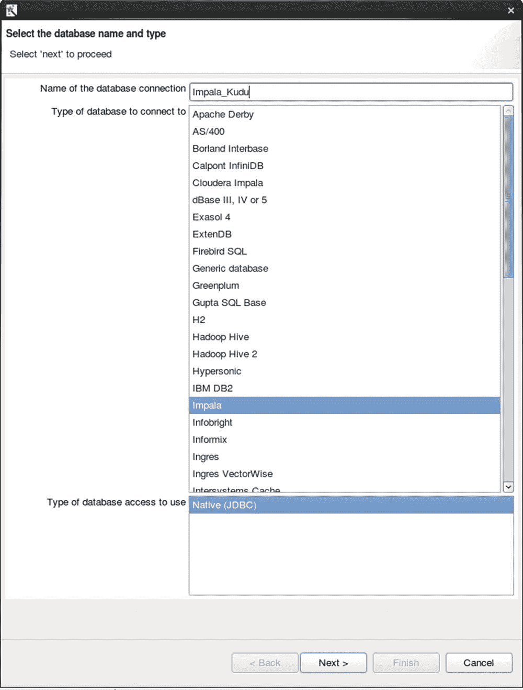

图 7-95

配置数据库连接

配置 JDBC 驱动程序。输入 Impala 服务器的主机名或 IP 地址、TCP/UP 端口和数据库名称，如图 [7-96](#Fig96) 所示。

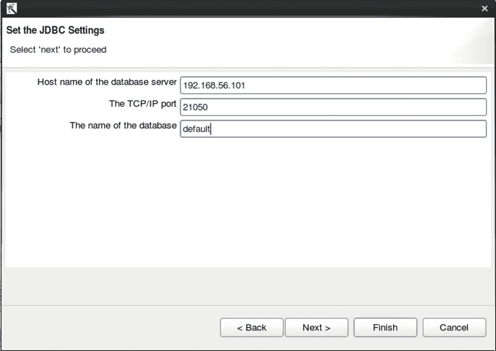

图 7-96

Configure JDBC settings

测试数据库连接，如图 [7-97](#Fig97) 所示。


图 7-97

Test the database connection

创建目标表。

```scala
impala-shell

CREATE TABLE pentaho_users
(
 id BIGINT,
 name STRING,
 city STRING,
 age TINYINT,
 PRIMARY KEY(id)
)
PARTITION BY HASH PARTITIONS 4
STORED AS KUDU;

```

输入目标表和其他相关配置选项。参见图 [7-98](#Fig98) 。


图 7-98

Configure table output

点击“获取字段”并确保源和目标字段匹配，如图 [7-99](#Fig99) 所示。


图 7-99

Get fields

如图 [7-100](#Fig100) 所示，对数据进行预览和完整性检查。


图 7-100

Preview data

执行作业。监控日志并确保作业成功执行。参见图 [7-101](#Fig101) 。


图 7-101

Run the job

作业运行成功。

```scala
2017/05/13 00:21:16 - Spoon - Transformation opened.
2017/05/13 00:21:16 - Spoon - Launching transformation [csv_to_kudu1]...
2017/05/13 00:21:16 - Spoon - Started the transformation execution.
2017/05/13 00:21:16 - csv_to_kudu1 - Dispatching started for transformation [csv_to_kudu1]
2017/05/13 00:21:16 - Table output.0 - Connected to database [Impala_Kudu] (commit=1000)
2017/05/13 00:21:16 - CSV file input.0 - Header row skipped in file '/mydata/test01.csv'
2017/05/13 00:21:16 - CSV file input.0 - Finished processing (I=5, O=0, R=0, W=4, U=0, E=0)
2017/05/13 00:21:16 - Hadoop File Output.0 - Finished processing (I=0, O=5, R=4, W=4, U=0, E=0)
2017/05/13 00:21:16 - Table output.0 - Finished processing (I=0, O=4, R=4, W=4, U=0, E=0)
2017/05/13 00:21:16 - Spoon - The transformation has finished!!

```

确认数据已成功插入 Kudu 表。

```scala
impala-shell

select * from pentaho_users;

+----+-------------+---------------+-----+
| id | name        | city          | age |
+----+-------------+---------------+-----+
| 2  | Nancy Maher | Van Nuys      | 34  |
| 3  | Thomas Chen | Rolling Hills | 62  |
| 1  | Jeff Wells  | San Diego     | 71  |
| 4  | Earl Brown  | Artesia       | 29  |
+----+-------------+---------------+-----+

```

### 通过转换将数据摄取到 Kudu

先说另一个例子。这次我们将使用字符串替换转换将字符串“Yonkers”替换为“Berkeley”

准备数据。

```scala
ls /mydata
test01.csv  test02.csv

cat test01.csv

id,name,city,age
1,Jeff Wells,San Diego,71
2,Nancy Maher,Van Nuys,34
3,Thomas Chen,Rolling Hills,62
4,Earl Brown,Artesia,29

cat test02.csv

id,name,city,age
5,Damian Lee,Yonkers,27
6,John Lohan,Encino,55
7,Lily Tran,Reseda,50
8,Sam Estevez,Tucson,81

```

输入源目录和正则表达式(通配符)来搜索文件。参见图 [7-102](#Fig102) 。


图 7-102

Specify source directory and file

预览和健全检查数据。参见图 [7-103](#Fig103) 。


图 7-103

Preview data

将“替换字符串”转换步骤拖到画布上。双击图标，通过指定要搜索的字符串和要替换的字符串来配置它。如前所述，我们将在 city 字段中用“Berkeley”替换字符串“Yonkers”。您可以暂时忽略其他选项。参见图 [7-104](#Fig104) 。


图 7-104

Replace a string transformation

如图 [7-105](#Fig105) 所示运行作业。


图 7-105

Run the job

检查表格，确保将“扬克斯”替换为“伯克利”将 id 5 行中的城市值与原始源文本文件进行比较。

```scala
impala-shell

select * from pentaho_users order by id;

+----+-------------+---------------+-----+
| id | name        | city          | age |
+----+-------------+---------------+-----+
| 1  | Jeff Wells  | San Diego     | 71  |
| 2  | Nancy Maher | Van Nuys      | 34  |
| 3  | Thomas Chen | Rolling Hills | 62  |
| 4  | Earl Brown  | Artesia       | 29  |
| 5  | Damian Lee  | Berkeley      | 27  |
| 6  | John Lohan  | Encino        | 55  |
| 7  | Lily Tran   | Reseda        | 50  |
| 8  | Sam Estevez | Tucson        | 81  |

+----+-------------+---------------+-----+

```

### SQL Server 到 Kudu

在本例中，我们将展示如何将数据从 RDBMS (SQL Server 2016)接收到 Kudu。

请确保源 SQL Server 2016 数据库中有数据。我们将使用在其他示例中使用的相同的表。在 salesdb 数据库中，有一个名为 users 的表，包含以下行。请使用 SQL Server Management Studio 进行确认。参见图 [7-106](#Fig106) 。


图 7-106

Check the table in SQL Server Management Studio

在 Spoon 中，将一个表格输入步骤拖到画布上，如图 [7-107](#Fig107) 所示。


图 7-107

Table input

配置表格输入步骤。参见图 [7-108](#Fig108) 。


图 7-108

Configure Table input

确保通过将 sqljdbc41.jar (JDK 1.7)或 sqljdbc42.jar (JDK 1.8)复制到 <install directory="">/data-integration/lib 来安装 SQL Server JDBC 驱动程序。如果你还没有，从 Microsoft.com 下载 JDBC 驱动程序。选择 MS SQL Server (native)连接类型，如图 [7-109](#Fig109) 所示。</install>

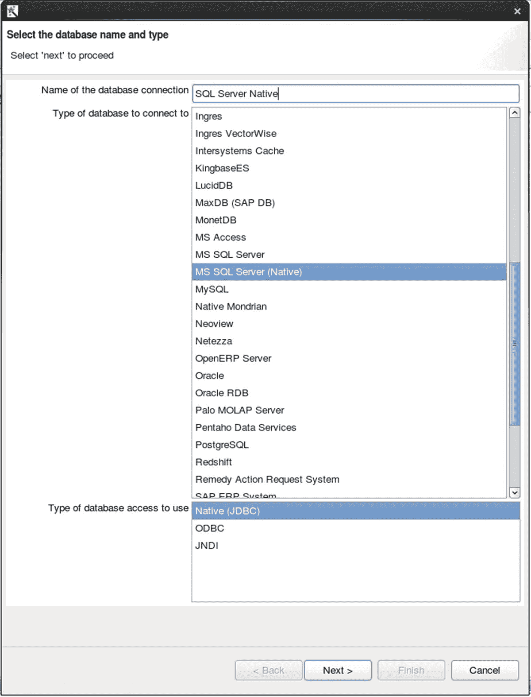

图 7-109

配置数据库连接

配置 JDBC 设置(图 [7-110](#Fig110) )。

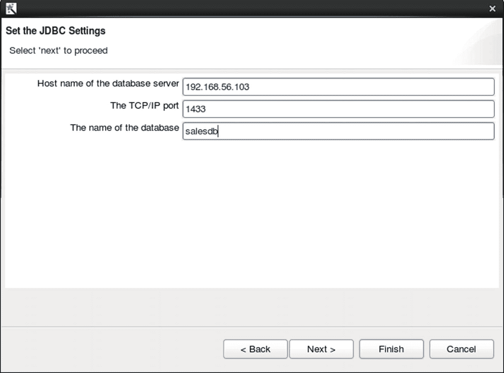

图 7-110

Configure JDBC settings

测试与源 SQL Server 2016 数据库的连接(图 [7-111](#Fig111) )。

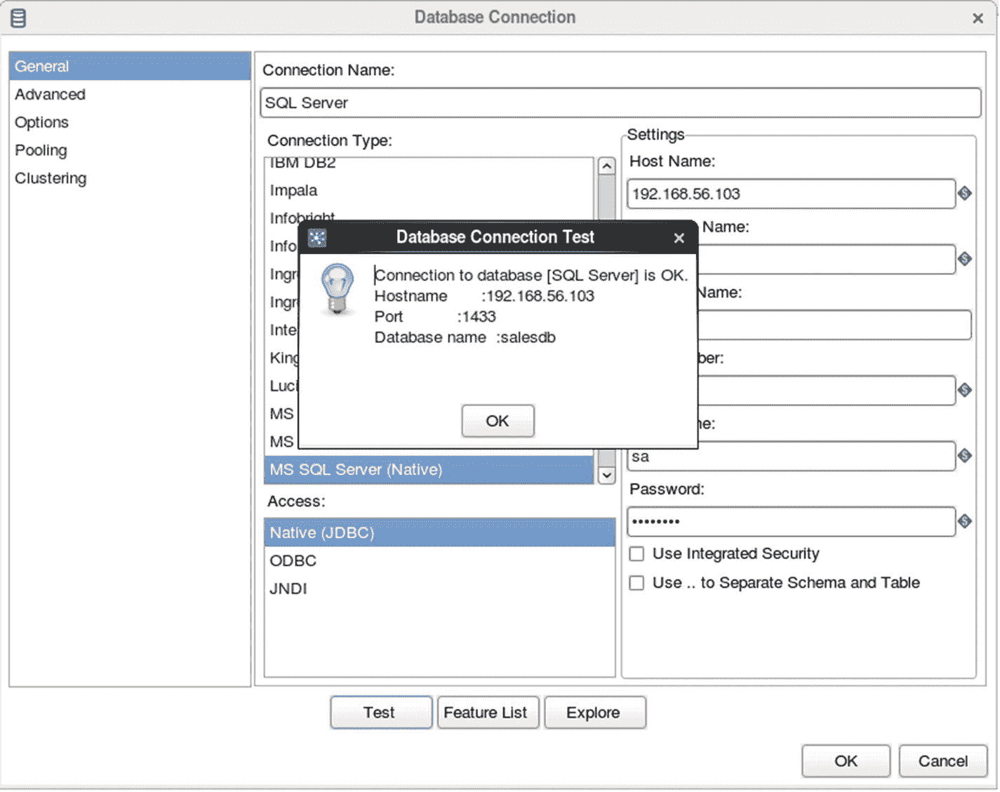

图 7-111

Test database connection

现在您已经配置了到源数据库的连接，指定一个 SQL 查询作为您的数据源。参见图 [7-112](#Fig112) 。


图 7-112

Specify SQL query as data source

预览您的数据以确保您的 SQL 查询有效(图 [7-113](#Fig113) )。

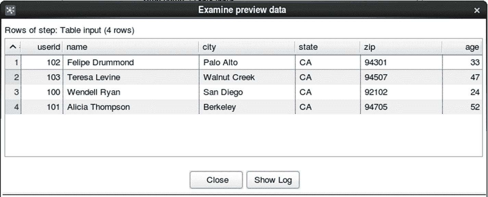

图 7-113

Preview data

将一个表格输出步骤拖到您的画布上，并将其连接到表格输入步骤(图 [7-114](#Fig114) )。


图 7-114

Table output

配置您的目的地。输入目标模式和目标表。如果你还没有这样做，配置你的黑斑羚 JDBC 连接以及图 [7-115](#Fig115) 。

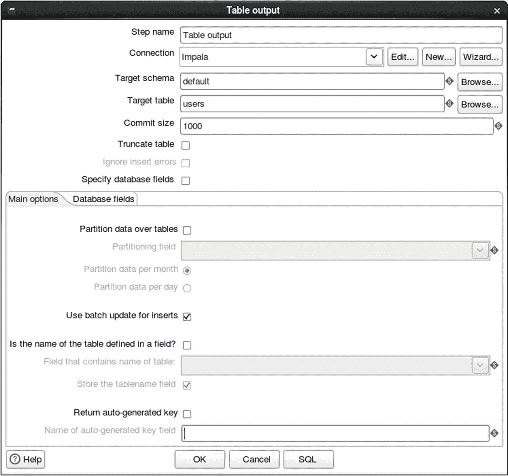

图 7-115

Configure Table output

运行作业(图 [7-116](#Fig116) )。


图 7-116

Run the job

检查日志中的错误。

```scala
2017/06/03 20:31:17 - Spoon - Transformation opened.
2017/06/03 20:31:17 - Spoon - Launching transformation [SQL Server to Kudu]...
2017/06/03 20:31:17 - Spoon - Started the transformation execution.
2017/06/03 20:31:17 - SQL Server to Kudu - Dispatching started for transformation [SQL Server to Kudu]
2017/06/03 20:31:17 - Table output.0 - Connected to database [Impala] (commit=1000)
2017/06/03 20:31:17 - Table input.0 - Finished reading query, closing connection.
2017/06/03 20:31:17 - Table input.0 - Finished processing (I=4, O=0, R=0, W=4, U=0, E=0)
2017/06/03 20:31:18 - Table output.0 - Finished processing (I=0, O=4, R=4, W=4, U=0, E=0)
2017/06/03 20:31:18 - Spoon - The transformation has finished!!

```

确认数据已成功插入 Kudu 表。

```scala
impala-shell

select * from users;

+--------+-----------------+--------------+-------+-------+-----+
| userid | name            | city         | state | zip   | age |
+--------+-----------------+--------------+-------+-------+-----+
| 102    | Felipe Drummond | Palo Alto    | CA    | 94301 | 33  |
| 100    | Wendell Ryan    | San Diego    | CA    | 92102 | 24  |
| 101    | Alicia Thompson | Berkeley     | CA    | 94705 | 52  |
| 103    | Teresa Levine   | Walnut Creek | CA    | 94507 | 47  |
+--------+-----------------+--------------+-------+-------+-----+

```

恭喜你！您已成功将数据从 SQL Server 2016 导入 Kudu。

### 拓蓝

Talend 是专注于大数据集成的领先软件公司之一。Talend 提供免费的开源数据摄取工具，称为 Open Studio for Big Data 和 Open Studio for Data Integration。这两个工具都提供了现代图形用户界面、YARN 支持、HDFS、HBase、Hive 和 Kudu 支持、到 Oracle、SQL Server 和 Teradata 的连接器，并在 Apache 许可证 v2 下完全开源。[<sup>xx</sup>](#Sec54)Open Studio for Data Integration 和 Open Studio for Big Data 的主要区别在于，数据集成只能生成原生 Java 代码，而 Big Data 可以同时生成原生 Java、Spark 和 MapReduce 代码。

商业版为您提供实时 Talend 支持、有保证的响应时间、升级和产品补丁。开源版本只提供社区支持。 [<sup>xxi</sup>](#Sec54) 如果你处理的是 TB 级或者 Pb 级的数据，我建议你用大数据版。对于传统的 ETL 类型的工作负载，比如将数据从 RDBMS 移动到 Kudu，中间有一些简单的数据转换，Data Integration edition 就足够了。本章我们将使用 Talend Open Studio 进行数据集成。

Note

Talend Kudu 组件由第三方公司 One point Ltd .提供。这些组件可从 Talend Exchange-[`https://exchange.talend.com/`](https://exchange.talend.com/)免费下载。在将 Talend 与 Kudu 配合使用之前，需要安装 Kudu 输出和输入组件。

### 将 csv 文件输入到 kudu

让我们从一个熟悉的将 CSV 文件摄取到 Kudu 的例子开始。

准备测试数据。

```scala
ls /mydata

test01.csv

cat test01.csv

id,name,city,age
1,Jeff Wells,San Diego,71
2,Nancy Maher,Van Nuys,34
3,Thomas Chen,Rolling Hills,62
4,Earl Brown,Artesia,29

```

在 Impala 中创建目标 Kudu 表。

```scala
impala-shell

CREATE TABLE talend_users
(
 id INTEGER,
 name STRING,
 city STRING,
 age INTEGER,
 PRIMARY KEY(id)
)
PARTITION BY HASH PARTITIONS 4
STORED AS KUDU;

```

启动 Talend Open Studio 进行数据集成，如图 [7-117](#Fig117) 所示。


图 7-117

Start Talend Open Studio for Data Integration

您可以选择创建新项目或打开现有项目。让我们开始一个新的项目(图 [7-118](#Fig118) )。

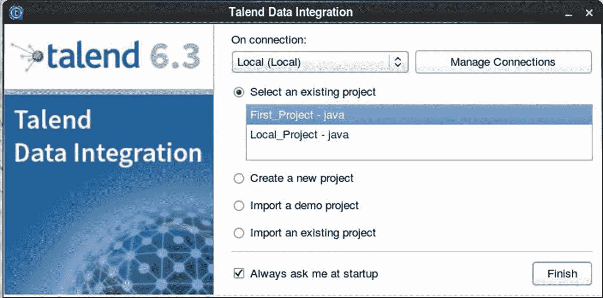

图 7-118

Select an existing project or create a new project

你会看到一个类似于图 [7-119](#Fig119) 的图形用户界面。


图 7-119

Talend Open Studio Graphical User Interface

让我们创建一个新任务(图 [7-120](#Fig120) )。


图 7-120

Create job

指定作业的名称。您可以指定其他属性，如目的、描述、作者等。完成后点击“完成”(图 [7-121](#Fig121) )。


图 7-121

Specify job name and other job properties

你会看到一个类似于图 [7-122](#Fig122) 的画布。这是您设计和运行作业的地方。

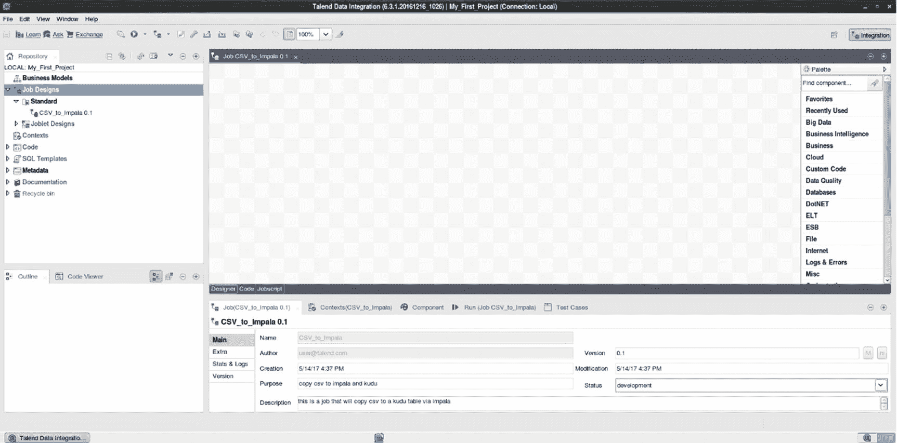

图 7-122

Job canvas

与本章前面讨论的数据接收工具类似，在设计数据接收管道时，您必须指定源、转换步骤和目标。在画布的右侧，您会看到一个可以用作数据源的输入列表。因为我们正在接收 CSV 文件，所以将 tFileInputDelimited 源拖放到画布中。通过指定 CSV 文件的文件名来配置源文件。参见图 [7-123](#Fig123) 。

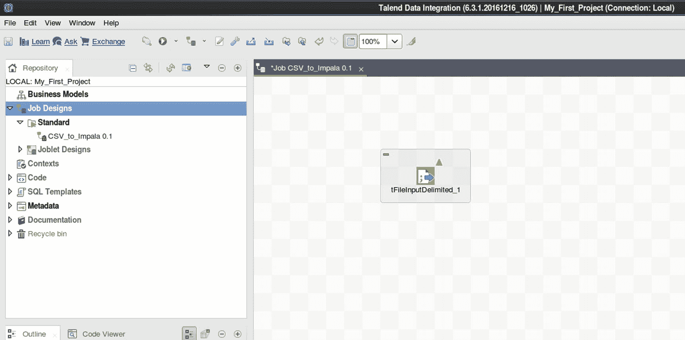

图 7-123

tFileInputDelimited source

接下来，通过将 Kudu 输出拖放到画布中来指定输出。通过指定表名、连接信息等来配置 Kudu 输出(图 [7-124](#Fig124) )。


图 7-124

Kudu output

不要忘记连接输入和输出图标(图 [7-125](#Fig125) )。


图 7-125

Connect File Input delimited and Kudu output

如图 [7-126](#Fig126) 所示运行作业。

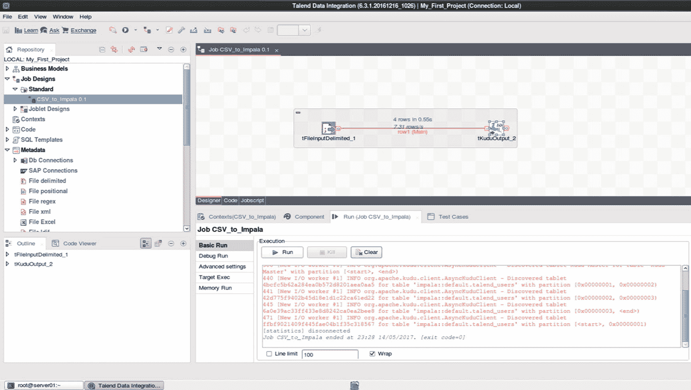

图 7-126

Run the job

日志将显示作业运行时的相关信息。当作业完成时，您会看到一个退出代码。退出代码为零表示作业成功完成。

```scala
Starting job CSV_to_Impala at 23:20 14/05/2017.
[statistics] connecting to socket on port 3725
[statistics] connected
330 [New I/O worker #1] INFO org.apache.kudu.client.AsyncKuduClient - Discovered tablet Kudu Master for table 'Kudu Master' with partition [<start>, <end>)
399 [New I/O worker #1] INFO org.apache.kudu.client.AsyncKuduClient - Discovered tablet 4bcfc5b62a284ea0b572d8201aea0aa5 for table 'impala::default.talend_users' with partition [0x00000001, 0x00000002)
400 [New I/O worker #1] INFO org.apache.kudu.client.AsyncKuduClient - Discovered tablet 42d775f9402b45d18e1d1c22ca61ed22 for table 'impala::default.talend_users' with partition [0x00000002, 0x00000003)
400 [New I/O worker #1] INFO org.apache.kudu.client.AsyncKuduClient - Discovered tablet 6a0e39ac33ff433e8d8242ca0ea2bee8 for table 'impala::default.talend_users' with partition [0x00000003, <end>)

453 [New I/O worker #1] INFO org.apache.kudu.client.AsyncKuduClient - Discovered tablet ffbf9021409f445fae04b1f35c318567 for table 'impala::default.talend_users' with partition [<start>, 0x00000001)
[statistics] disconnected
Job CSV_to_Impala ended at 23:20 14/05/2017\. [exit code=0]

```

确认这些行已成功插入 Kudu 表中。

```scala
impala-shell

select * from talend_users;

+----+-------------+---------------+-----+
| id | name        | city          | age |
+----+-------------+---------------+-----+
| 3  | Thomas Chen | Rolling Hills | 62  |
| 4  | Earl Brown  | Artesia       | 29  |
| 1  | Jeff Wells  | San Diego     | 71  |
| 2  | Nancy Maher | Van Nuys      | 34  |
+----+-------------+---------------+-----+

```

### SQL Server 到 Kudu

对于我们的第二个例子，让我们使用 Talend Open Studio 将数据从 SQL Server 接收到 Kudu。在 Impala 中创建 Kudu 表 DimGeography，如果您还没有这样做的话。

创建一个新任务(图 [7-127](#Fig127) )。

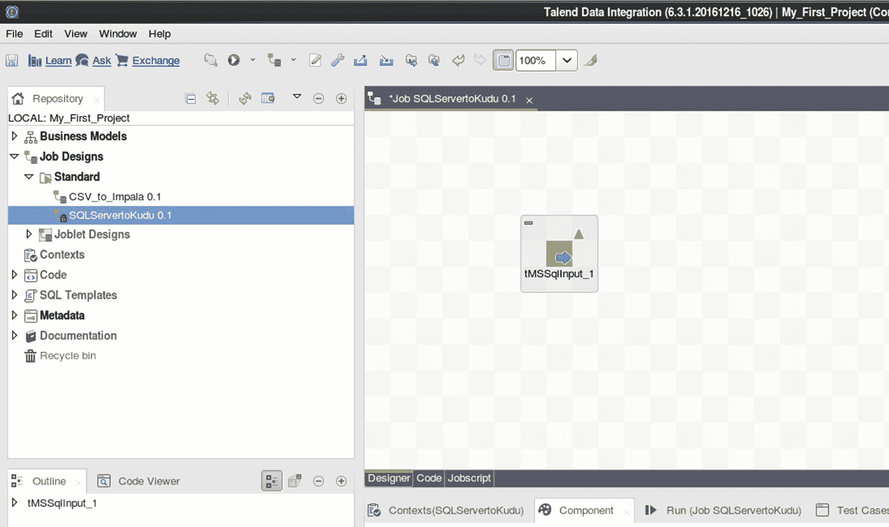

图 7-128

tMSSQLinput. See Figure [7-128](#Fig128).

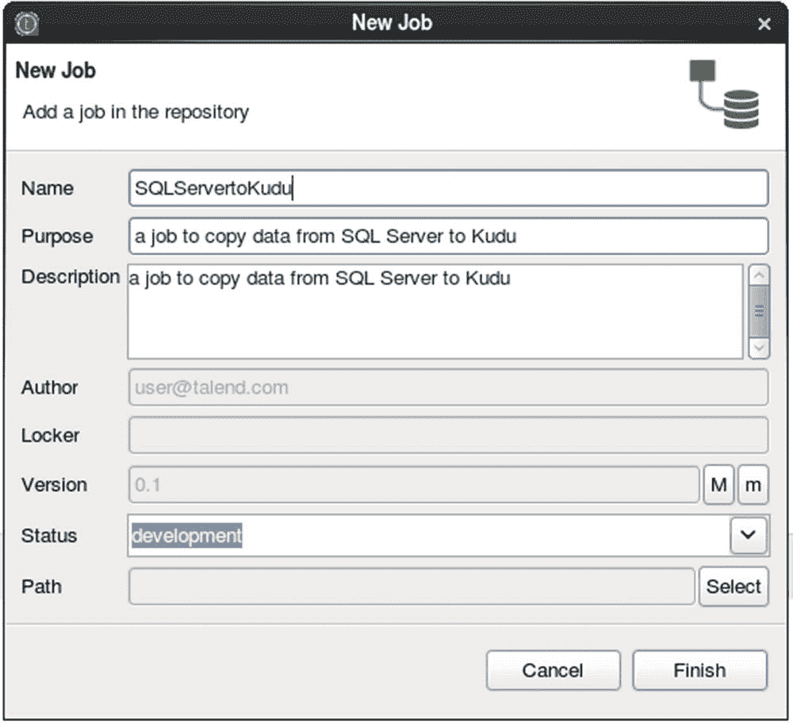

图 7-127

New job

通过确保指定了正确的数据类型等来配置组件(图 [7-129](#Fig129) )。

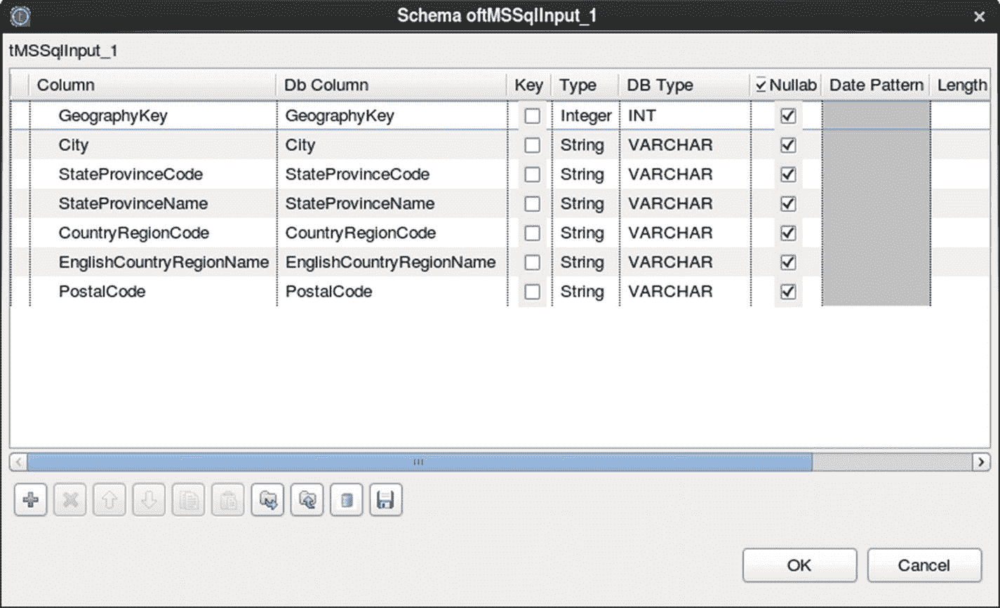

图 7-129

Configure MS SQL input

将 Kudu 输出组件拖放到画布中。如图 [7-130](#Fig130) 所示，将其连接到 tMSSQLinput 组件。


图 7-130

Kudu output

配置 Kudu 输出，确保数据类型与 SQL Server 表匹配，如图 [7-131](#Fig130) 所示。

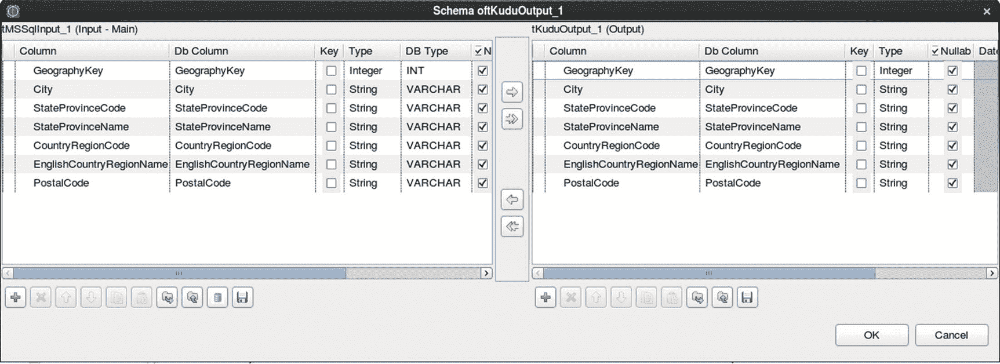

图 7-131

Configure Kudu output

如果模式不匹配，则同步模式(图 [7-132](#Fig132) )。


图 7-132

Sync the schema

如图 [7-133](#Fig133) 所示运行作业。


图 7-133

Run the job

通过比较源和目标行数来验证作业是否成功运行(图 [7-134](#Fig134) )。


图 7-134

Verify if the job ran successfully

```scala
impala-shell

SELECT count(*) FROM DimGeography;

 +----------+
| count(*) |
+----------+
| 655      |
+----------+

```

### 数据转换

现在让我们使用 Talend 的一些内置特性进行数据转换。我将使用 tReplace 组件替换指定输入列中的值。我们将用“英国”替换值“英国”我还将使用 tFilterRow 组件来过滤结果，只包括城市等于“伦敦”或“伯克希尔”的记录

将 tReplace 和 tFilterRow 组件拖放到画布中，在输入和输出之间，如图 [7-136](#Fig136) 所示。

通过选择包含您想要替换的值的字段来配置 tReplace 组件(图 [7-135](#Fig135) )。


图 7-135

Select field

通过指定要替换的值和替换值来配置 tReplace 组件。在这种情况下，我们将用“英国”替换“英国”(图 [7-136](#Fig136) )。

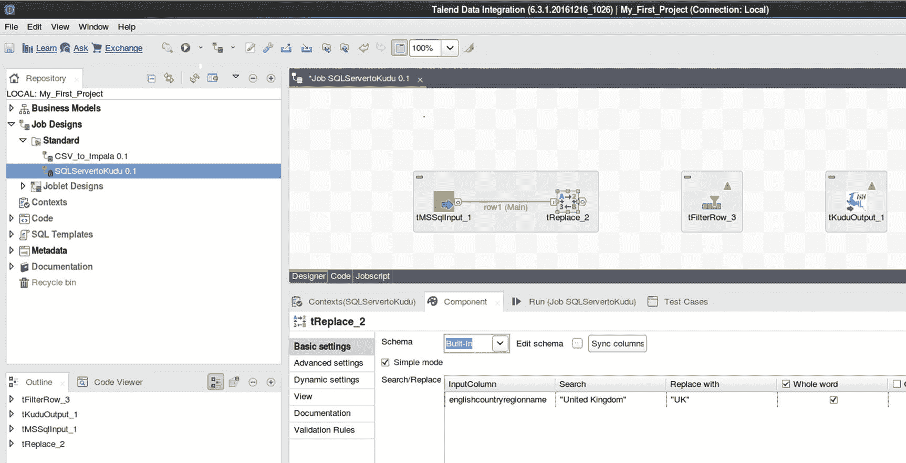

图 7-136

Configure tReplace

配置 tFilterRow 组件。我们将只返回城市字段中等于“伦敦”和“伯克希尔”的行(图 [7-137](#Fig137) )。

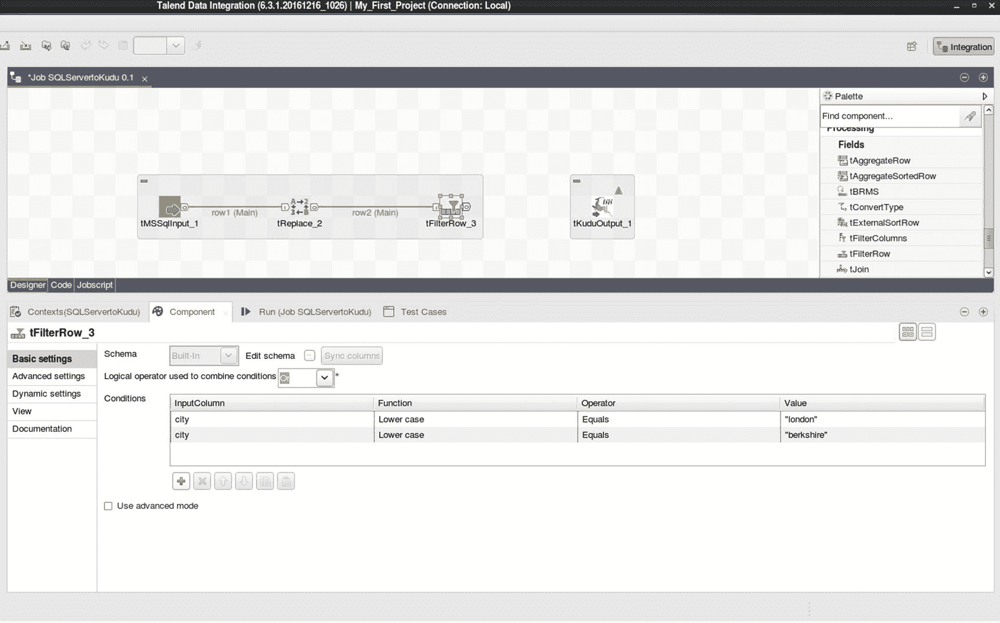

图 7-137

Configure tFilterRow

不要忘记如图 [7-138](#Fig138) 所示连接所有组件。


图 7-138

Connect tFilterRow to Kudu output

如图 [7-139](#Fig139) 所示运行作业。

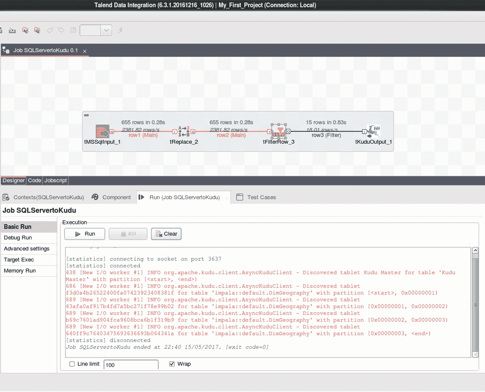

图 7-139

Run the job

检查 Kudu 表中的数据，以确保作业成功执行。从结果中可以看出，只返回了 city 等于 London 和 Berkshire 的记录。英国也被英国取代。

```scala
impala-shell

SELECT geographykey as gkey, city, stateprovincecode as spc, stateprovincename as spn, countryregioncode as crc, englishcountryregionname as ecr, postalcode as pc FROM DimGeography;

+------+-----------+-----+---------+-----+-----+----------+
| gkey | city      | spc | spn     | crc | ecr | pc       |
+------+-----------+-----+---------+-----+-----+----------+
| 246  | London    | ENG | England | GB  | UK  | EC1R 0DU |
| 250  | London    | ENG | England | GB  | UK  | SW6 SBY  |
| 254  | London    | ENG | England | GB  | UK  | W1N 9FA  |
| 257  | London    | ENG | England | GB  | UK  | W1Y 3RA  |
| 230  | Berkshire | ENG | England | GB  | UK  | RG11 5TP |
| 244  | London    | ENG | England | GB  | UK  | C2H 7AU  |
| 248  | London    | ENG | England | GB  | UK  | SW19 3RU |
| 249  | London    | ENG | England | GB  | UK  | SW1P 2NU |
| 251  | London    | ENG | England | GB  | UK  | SW8 1XD  |

| 252  | London    | ENG | England | GB  | UK  | SW8 4BG  |
| 253  | London    | ENG | England | GB  | UK  | W10 6BL  |
| 256  | London    | ENG | England | GB  | UK  | W1X3SE   |
| 245  | London    | ENG | England | GB  | UK  | E17 6JF  |
| 247  | London    | ENG | England | GB  | UK  | SE1 8HL  |
| 255  | London    | ENG | England | GB  | UK  | W1V 5RN  |
+------+-----------+-----+---------+-----+-----+----------+
Fetched 15 row(s) in 4.50s

```

## 其他大数据集成参与者

如果我没有提到传统的 ETL 播放器，这一章将是不完整的。它们是经过增强的工具，包括大数据集成。即便如此，与我刚刚讨论的较新的大数据集成工具相比，它们在原生功能方面仍然落后。例如，大多数都缺乏本地 Spark 支持和到流行大数据源的连接器。

### 信息

Informatica 是世界上最大的软件开发公司，专门从事数据集成。该公司成立于 1993 年，总部位于加利福尼亚州的红木城。Informatica 还为主数据管理、数据质量、b2b 数据交换、数据虚拟化等开发软件。[<sup>XXII</sup>](#Sec54)Informatica power center 大数据版是公司的大数据集成旗舰产品。与本章描述的其他 ETL 工具一样，Informatica PowerCenter 大数据版具有易于使用的可视化开发环境。Informatica PowerCenter 大数据版与领先的传统和大数据平台紧密集成，使您可以轻松地计划、管理和监控整个企业的流程和工作流。[T5】XXIIIT7】在撰写本文时，Informatica PowerCenter 还没有原生的 Kudu 支持；但是你可以通过 Impala 和 JDBC/ODBC 使用 Informatica PowerCenter 将数据导入 Kudu。](#Sec54)

### Microsoft SQL Server 集成服务

如果我没有提到前三大企业软件开发公司，微软、IBM 和 Oracle，这个列表将是不完整的。SQL Server Integration Services(SSIS)包括支持 Hadoop 和 HDFS 数据集成的功能。SSIS 提供了 Hadoop 连接管理器和以下控制流任务:Hadoop 文件系统任务、Hadoop Hive 任务和 Hadoop Pig 任务。SSIS 支持以下数据源和目标:HDFS 文件源和 HDFS 文件目标。和本章描述的所有 ETL 工具一样，SSIS 也有一个 GUI 开发环境。 [<sup>xxiv</sup> 但是你可以通过 Impala 和 JDBC/ODBC 将数据导入 Kudu。](#Sec54)

### 面向大数据的 Oracle 数据集成器

Oracle Data Integrator for Big Data 为大数据平台提供了高级数据集成功能。它支持各种工作负载，包括 Spark、Spark Streaming 和 Pig 转换，并连接到各种大数据源，如 Kafka 和 Cassandra。对于 ODI 作业的编排，用户可以选择使用 ODI 代理或 Oozie 作为编排引擎。 [<sup>xxv</sup>](#Sec54) 在撰写本文时，Oracle Data Integrator 还没有原生的 Kudu 支持；但是，您可以通过 Impala 和 JDBC/ODBC 使用 Oracle Data Integrator 将数据导入 Kudu。

### IBM InfoSphere DataStage

IBM InfoSphere DataStage 是 IBM InfoSphere Information Server 附带的数据集成工具。它支持提取、转换和加载(ETL)以及提取、加载和转换(ELT)模式。 [<sup>xxvi</sup>](#Sec54) 它提供一些大数据支持，比如访问和处理 HDFS 上的文件，将表从 Hive 移动到 RDBMS。[T5】XXVIIT7】IBM infosphereinformationserver 操作控制台可用于监控和管理 DataStage 作业，包括监控作业日志和资源使用情况。出现运行时问题时，操作控制台还有助于解决问题。](#Sec54) [<sup>xxviii</sup>](#Sec54) 截至本文撰写之时，DataStage 还没有原生的 Kudu 支持；但是，您可以使用 DataStage 通过 Impala 和 JDBC/ODBC 将数据导入 Kudu。

### 备份表达

Syncsort 是另一家专注于大数据集成的领先软件开发公司。他们以对大型机的广泛支持而闻名。到 2013 年，Syncsort 将自己定位为“大铁到大数据”的数据集成公司。[<sup>XXIX</sup>T3】](#Sec54)

Syncsort 的大数据集成平台 Syncsort DMX-h 有一个批处理和流式接口，可以从多个来源收集不同类型的数据，如 Kafka、HBase、RDBMS、S3 和大型机。与本章描述的其他 ETL 解决方案一样，Syncsort 为 ETL 开发提供了一个易于使用的 GUI。 [<sup>xxxi</sup>](#Sec54) 截至本文写作时，DMX-h 还没有原生 Kudu 支持；但是你可以通过 Impala 和 JDBC/ODBC 使用 DMX-h 将数据导入 Kudu。

### 阿帕奇尼菲

Apache NIFI 是一个开源的实时数据摄取工具，主要用于 Hortonworks 环境，尽管它也可以用于从 Cloudera 和 MapR 等其他平台摄取数据。它在许多方面与 StreamSets 相似。NIFI 的主要限制之一是缺少纱线支撑。NIFI 作为一个独立的 JVM 进程或多个 JVM 进程运行，如果配置为集群模式的话。在撰写本文时，NIFI 还没有本地的 Kudu 支持，尽管开源社区正在努力。查看 NIFI-3973 了解更多详情。[T5】XXXIIIT7】](#Sec54)

## 使用本机工具摄取数据

十年前，你必须是 Java 开发人员，才能用 Hadoop 接收和处理数据。通常需要几十行代码来执行简单的数据接收或处理。今天，由于各种 Apache 项目的成千上万的提交者和贡献者，Hadoop 生态系统有了一大堆(有人说太多了)用于数据摄取和处理的原生工具。其中一些工具可用于将数据导入 Kudu。我将使用 Flume、Kafka 和 Spark 展示示例。如果您想开发自己的数据摄取例程，Kudu 提供了 Spark、Java、C++和 Python 的 API。

### Kudu 和 Spark

Kudu 提供了一个 Spark API，您可以使用它将数据接收到 Kudu 表中。在下面的示例中，我们将连接存储在 SQL Server 数据库中的一个表和存储在 Oracle 数据库中的另一个表，并将连接的数据插入到 Kudu 表中。第 6 章对 Kudu 和 Spark 进行了更深入的讨论。

启动 Spark 壳。不要忘记包括必要的驱动程序和依赖项。

```scala
spark-shell --packages org.apache.kudu:kudu-spark_2.10:1.1.0 --driver-class-path ojdbc6.jar:sqljdbc41.jar --jars ojdbc6.jar,sqljdbc41.jar

```

设置 Oracle 连接

```scala
val jdbcURL = "jdbc:oracle:thin:sales/cloudera@//192.168.56.30:1521/EDWPDB"
val connectionProperties = new java.util.Properties()

```

从 Oracle 表创建一个数据帧。

```scala
val oraDF = sqlContext.read.jdbc(jdbcURL, "users", connectionProperties)

oraDF.show

+------+---------------+------------+-----+-----+---+
|USERID|           NAME|        CITY|STATE|  ZIP|AGE|
+------+---------------+------------+-----+-----+---+
|   102|Felipe Drummond|   Palo Alto|   CA|94301| 33|
|   103|  Teresa Levine|Walnut Creek|   CA|94507| 47|
|   100|   Wendell Ryan|   San Diego|   CA|92102| 24|
|   101|Alicia Thompson|    Berkeley|   CA|94705| 52|
+------+---------------+------------+-----+-----+---+

```

注册该表，以便我们可以对其运行 SQL。

```scala
oraDF.registerTempTable("ora_users")

```

设置 SQL Server 连接。

```scala
val jdbcURL = "jdbc:sqlserver://192.168.56.103;databaseName=salesdb;user=sa;password=cloudera"
val connectionProperties = new java.util.Properties()

```

从 SQL Server 表创建数据帧。

```scala
val sqlDF = sqlContext.read.jdbc(jdbcURL, "userattributes", connectionProperties)

sqlDF.show

+------+------+------+------------------+
|userid|height|weight|        occupation|
+------+------+------+------------------+
|   100|   175|   170|       Electrician|
|   101|   180|   120|         Librarian|
|   102|   180|   215|    Data Scientist|
|   103|   178|   132|Software Developer|
+------+------+------+------------------+

```

注册该表，以便我们可以将其连接到 Oracle 表。

```scala
sqlDF.registerTempTable("sql_userattributes")

```

连接两张桌子。我们将把结果插入到 Kudu 表中。

```scala
val joinDF = sqlContext.sql("select ora_users.userid,ora_users.name,ora_users.city,ora_users.state,ora_users.zip,ora_users.age,sql_userattributes.height,sql_userattributes.weight,sql_userattributes.occupation from ora_users  INNER JOIN sql_userattributes ON ora_users.userid=sql_userattributes.userid")

joinDF.show

+------+---------------+------------+-----+-----+---+------+------+-----------+
|userid|           name|        city|state|  zip|age|height|weight| occupation|
+------+---------------+------------+-----+-----+---+------+------+-----------+
|   100|   Wendell Ryan|   San Diego|   CA|92102| 24|   175|   170|Electrician|
|   101|Alicia Thompson|    Berkeley|   CA|94705| 52|   180|   120|  Librarian|
|   102|Felipe Drummond|   Palo Alto|   CA|94301| 33|   180|   215|Data                                                                    Scientist|
|   103|  Teresa Levine|Walnut Creek|   CA|94507| 47|   178|   132|Software                                                                     Developer|
+------+---------------+------------+-----+-----+---+------+------+-----------+

```

您也可以使用以下方法连接数据帧。

```scala
val joinDF2 = oraDF.join(sqlDF,"userid")

joinDF2.show

+------+---------------+------------+-----+-----+---+------+------+-----------+
|userid|           NAME|        CITY|STATE|  ZIP|AGE|height|weight|occupation |
+------+---------------+------------+-----+-----+---+------+------+-----------+
|   100|   Wendell Ryan|   San Diego|   CA|92102| 24|   175|   170|Electrician|
|   101|Alicia Thompson|    Berkeley|   CA|94705| 52|   180|   120|Librarian  |
|   102|Felipe Drummond|   Palo Alto|   CA|94301| 33|   180|   215|Data                                                                      Scientist|
|   103|  Teresa Levine|Walnut Creek|   CA|94507| 47|   178|   132|Software                                                                      Developer|
+------+---------------+------------+-----+-----+---+------+------+-----------+

```

在 Impala 中创建目标 Kudu 表。

```scala
impala-shell

create table users2 (
userid BIGINT PRIMARY KEY,
name STRING,
city STRING,
state STRING,
zip STRING,
age STRING,
height STRING,
weight STRING,
occupation STRING
)
PARTITION BY HASH PARTITIONS 16
STORED AS KUDU;

```

回到 spark-shell 并建立 Kudu 连接。

```scala
import org.apache.kudu.spark.kudu._

val kuduContext = new KuduContext("kuducluster:7051")

```

将数据插入 Kudu。

```scala
kuduContext.insertRows(JoinDF, "impala::default.users2")

```

确认数据已成功插入 Kudu 表。

```scala
impala-shell

select * from users2;

+------+--------------+------------+-----+------+---+------+------+-----------+
|userid|name          |city        |state|zip   |age|height|weight|occupation|
+------+--------------+------------+-----+------+---+------+------+-----------+
|102  |Felipe Drummond|Palo Alto   |CA   |94301 |33 |180   |215   |Data                                                                    Scientist|
|103  |Teresa Levine  |Walnut Creek|CA   |94507 |47 |178   |132   |Software                                                                      Developer|
|100  |Wendell Ryan   |San Diego   |CA   |92102 |24 |175   |170   |Electrician|
|101  |Alicia Thompson|Berkeley    |CA   |94705 |52 |180   |120   |Librarian  |
+-----+---------------+------------+-----+------+---+------+------+-----------+

```

#### 水槽，卡夫卡和 Spark 流

使用 Flume、Kafka 和 Spark 流进行实时数据接收和事件处理是一种常见的架构模式。阿帕奇水槽

允许用户收集、转换和移动大量的流媒体和事件数据到 HDFS、HBase 和 Kafka 等等。 [<sup>xxxiv</sup>](#Sec54) 它是大多数 Hadoop 发行版的集成组件。Flume 的架构可以分为源、通道和接收器。源是你的数据源，信道在源和接收器之间提供中间缓冲并提供可靠性，接收器代表你的目的地。Flume 有一个简单的架构，如图 [7-140](#Fig140) 所示。

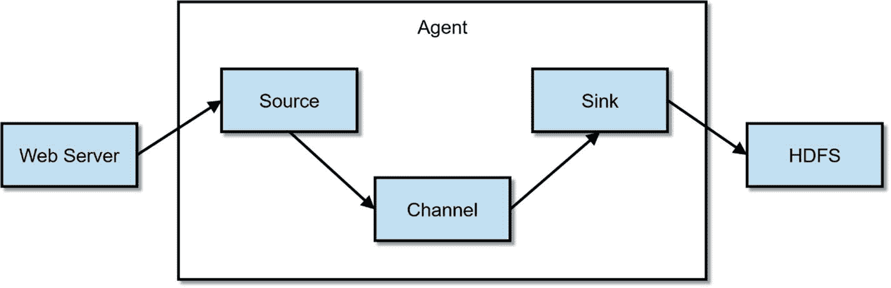

图 7-140

Flume Architecture

使用一个简单的配置文件来配置 Flume。示例配置文件允许您从脚本生成事件，然后将它们记录到控制台。

```scala
# Name the components
agent1.sources = source1
agent1.sinks = sinks1
agent1.channels = channel1

# Configure the source
agent1.sources.source1.type = exec
agent1.sources.source1.command = /tmp/myscript.sh
agent1.sources.source1.channels = channel1

# Configure the channel
agent1.channels.channel1.type = memory
agent1.channels.channel1.capacity = 10000
agent1.channels.channel1.transactionCapacity = 1000

# Configure the sink
agent1.sinks.sinks1.type = logger
agent1.sinks.sinks1.channel = channel1

```

要了解有关 Flume 的更多信息，Hari Shreedharan 的《使用 Flume 》( O ' Reilly，2014)是权威指南。

##### 阿帕奇卡夫卡

Kafka 是一个快速、可伸缩、可靠的分布式发布-订阅消息系统。Kafka 现在是需要实时数据摄取和流式传输的架构的标准组件。尽管不是必需的，Kafka 经常与 Apache Flume、Storm、Spark Streaming 和 StreamSets 一起使用。

Kafka 作为一个集群在一个或多个代理上运行，并具有内置的复制和分区，如图 [7-141](#Fig141) 所示。

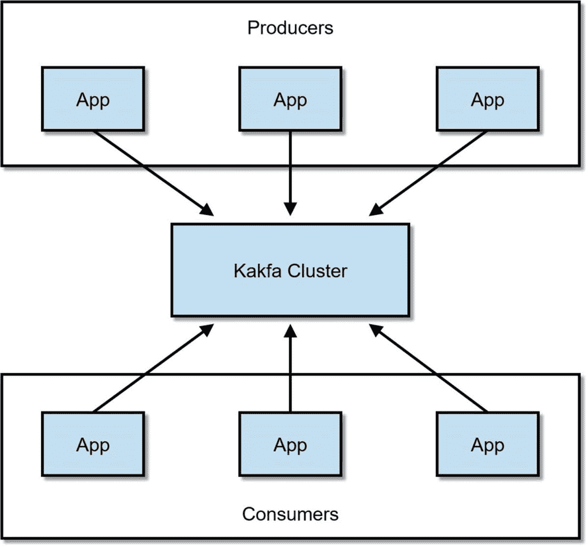

图 7-141

Kafka Producers and Consumers

卡夫卡的唱片是作为主题出版的。每个主题都被分割并不断追加。分区中的每条记录都被分配一个唯一的偏移量来标识每条记录。 [<sup>xxxv</sup>](#Sec54) 把题目想成表格，把偏移量想成主键(图 [7-142](#Fig142) )。


图 7-142

Kafka Topic

要了解更多关于卡夫卡的知识，夏皮罗、纳克赫德和帕林的《卡夫卡:权威指南》(O'Reilly，2017 年)是最好的资源。

##### 弗拉斯卡

当 Kafka 在 2011 年首次发布时，用户必须编写 Java 代码才能将数据输入 Kafka 或从中读取数据。不幸的是，这个需求减缓了 Kafka 的采用，因为不是每个人都能用 Java 编写代码。必须有一种更简单的方式让应用程序与 Kafka 交互。如前所述，使用 Flume 可以轻松完成这些任务(图 [7-143](#Fig143) )。


图 7-143

A typical Flafka pipeline

Cloudera 的工程师和开源社区的其他人认识到了 Flume 与 Kafka 集成的好处，因此他们开发了 Flume 和 Kafka 集成，通常称为 Flafka。从 CDH 5.2 开始，Flume 可以充当卡夫卡的消费者和生产者。随着水槽 1.6 和 CDH 5.3 的进一步发展，卡夫卡作为水槽通道的功能已经被添加。[<sup>XXXVI</sup>T3】](#Sec54)

##### Spark 流

从历史上看，Kafka 没有为流处理提供任何机制。Kafka Streams 最近发布，提供基本的流处理功能。Flume 也有拦截器，可以用于轻量级的流处理。然而，由于 Apache Spark 的流行，水槽拦截器最近已经过时了。由于 Spark Streaming 与 Spark SQL、Spark MLlib 和 Spark 的其他功能相集成，Spark Streaming 比 Kafka Streams 和 Flume 拦截器更强大(图 [7-144](#Fig144) )。与拦截器不同，Spark Streaming 不需要 Flume，可以与 MQTT、Kafka 和 Kinesis 等其他数据源集成。如果您有一个不支持的数据源，并希望与 Spark Streaming 集成，那么您可以实现一个定制的接收器来处理这个特定的数据源。参考第 [2](02.html) 章，了解如何使用 Spark 流读写 Kudu 的示例。


图 7-144

A typical Flafka pipeline with Spark Streaming and Kudu

### Sqoop

Sqoop 在技术上与 Kudu 不兼容。您不能使用 Sqoop 将数据从 RDBMS 传输到 Kudu，反之亦然。然而，Sqoop 可能是一些用户从 RDBMS 获取数据的唯一工具。

您可以使用 Sqoop 将数据从 RDBMS 导入 HDFS，然后使用 Spark 或 Impala 从 HDFS 读取数据并插入 Kudu。这里有几个使用 Sqoop 的例子。确保您安装并配置了正确的驱动程序。

获取 SQL Server 中可用数据库的列表。

```scala
sqoop list-databases --connect jdbc:sqlserver://10.0.1.124:1433 --username myusername --password mypassword

```

将表从 SQL Server 复制到 Hadoop。

```scala
sqoop import --connect "jdbc:sqlserver://10.0.1.124:1433;database=AdventureWorksDW2012;username=myusername;password=mypassword" --table DimProduct --hive-import --hive-overwrite

```

将表从配置单元复制到 SQL Server。

```scala
sqoop export --connect "jdbc:sqlserver://10.0.1.124:1433;database=AdventureWorksDW2012;username=myusername;password=mypassword" --table salesfact_hadoop --hcatalog-database default --hcatalog-table sales_data

```

然后，您可以简单地执行 Impala insert into…select 语句:

```scala
INSERT INTO my_kudu_table SELECT * FROM sales_data;

```

## kudu 客户端

Kudu 提供了 NoSQL 风格的 Java、C++和 Python 客户端 API。需要 Kudu 提供最佳性能的应用程序应该使用客户端 API。事实上，前面讨论的一些数据摄取工具，比如 StreamSets、CDAP 和 Talend，利用客户端 API 将数据摄取到 Kudu 中。通过 API 进行的 DML 更改可以立即在 Impala 中查询，而不需要执行 INVALIDATE 元数据。有关 Kudu 客户端 API 的更多详细信息，请参考第 [2](02.html) 章。

## MapReduce 和 Kudu

如果您的组织仍然使用 MapReduce，您可能会很高兴地知道 Kudu 集成了 MapReduce。示例 MapReduce 代码可以在 Kudu 的官方网站上找到。[<sup>XXXVII</sup>T3】](#Sec54)

## 摘要

有几种方法可以将数据摄取到 Kudu 中。可以使用 StreamSets、Talend 等第三方商业工具。您可以使用 Apache Spark 和 Kudu 的客户端 API 等本地工具创建自己的应用程序。Kudu 使用户能够批量或实时摄取数据，同时运行分析查询，使其成为物联网和高级分析的理想平台。既然您已经将数据吸收到 Kudu 中，您需要从中提取价值。在第 [8](08.html) 和 [9](09.html) 章中，我将讨论分析存储在 Kudu 表中的数据的常用方法。

## 参考

1.  商业电线；“StreamSets 在由 Battery Ventures 和 NEA 牵头的 A 轮融资中筹集了 1250 万美元，”商业资讯，2015 年， [`https://www.businesswire.com/news/home/20150924005143/en/StreamSets-Raises-12.5-Million-Series-Funding-Led`](https://www.businesswire.com/news/home/20150924005143/en/StreamSets-Raises-12.5-Million-Series-Funding-Led)
2.  流集；《征服数据流混沌》，StreamSets，2018， [`https://streamsets.com/`](https://streamsets.com/)
3.  阿帕奇库杜；《实例用例》，阿帕奇库杜，2018， [`https://kudu.apache.org/docs/#kudu_use_cases`](https://kudu.apache.org/docs/#kudu_use_cases)
4.  汤姆·怀特；《小文件问题》，Cloudera，2009， [`https://blog.cloudera.com/blog/2009/02/the-small-files-problem/`](https://blog.cloudera.com/blog/2009/02/the-small-files-problem/)
5.  亚伦·法夫里；《S3Guard 简介:Apache Hadoop 的 S3 一致性》，Cloudera，2017， [`http://blog.cloudera.com/blog/2017/08/introducing-s3guard-s3-consistency-for-apache-hadoop/`](http://blog.cloudera.com/blog/2017/08/introducing-s3guard-s3-consistency-for-apache-hadoop/)
6.  伊尔科·多尔斯特拉；“S3BinaryCacheStore 最终是一致的”，Github，2017， [`https://github.com/NixOS/nix/issues/1420`](https://github.com/NixOS/nix/issues/1420)
7.  Sumologic《使用 S3 你可能不知道的 10 件事》，Sumologic，2018， [`https://www.sumologic.com/aws/s3/10-things-might-not-know-using-s3/`](https://www.sumologic.com/aws/s3/10-things-might-not-know-using-s3/)
8.  蒸汽装置；《MQTT 订户》，StreamSets，2018， [`https://streamsets.com/documentation/datacollector/latest/help/index.html#Origins/MQTTSubscriber.html#concept_ukz_3vt_lz`](https://streamsets.com/documentation/datacollector/latest/help/index.html%23Origins/MQTTSubscriber.html)
9.  流集；“CoAP 客户端”，流集，2018 年，
10.  流集；《读序》，StreamSets，2018， [`https://streamsets.com/documentation/datacollector/latest/help/#datacollector/UserGuide/Origins/Directory.html#concept_qcq_54n_jq`](https://streamsets.com/documentation/datacollector/latest/help/%23datacollector/UserGuide/Origins/Directory.html)
11.  流集；《用自定义分隔符处理 XML 数据》，StreamSets，2018， [`https://streamsets.com/documentation/datacollector/latest/help/#Pipeline_Design/TextCDelim.html#concept_okt_kmg_jx`](https://streamsets.com/documentation/datacollector/latest/help/%23Pipeline_Design/TextCDelim.html)
12.  流集；《用自定义分隔符处理 XML 数据》，StreamSets，2018， [`https://streamsets.com/documentation/datacollector/latest/help/#Pipeline_Design/TextCDelim.html#concept_okt_kmg_jx`](https://streamsets.com/documentation/datacollector/latest/help/%23Pipeline_Design/TextCDelim.html)
13.  阿尔温德·普拉巴卡尔；“用流集驯服不羁的大数据流”，InfoWorld，2016， [`http://www.infoworld.com/article/3138005/analytics/tame-unruly-big-data-flows-with-streamsets.html`](http://www.infoworld.com/article/3138005/analytics/tame-unruly-big-data-flows-with-streamsets.html)
14.  流集；《流选择器》，StreamSets，2018， [`https://streamsets.com/documentation/datacollector/latest/help/#Processors/StreamSelector.html#concept_tqv_t5r_wq`](https://streamsets.com/documentation/datacollector/latest/help/%23Processors/StreamSelector.html)
15.  流集；”表情，“StreamSets，2018， [`https://streamsets.com/documentation/datacollector/latest/help/#Processors/Expression.html#concept_zm2_pp3_wq`](https://streamsets.com/documentation/datacollector/latest/help/%23Processors/Expression.html)
16.  流集；《JavaScript Evaluator》，StreamSets，2018， [`https://streamsets.com/documentation/datacollector/latest/help/index.html#Processors/JavaScript.html#concept_n2p_jgf_lr`](https://streamsets.com/documentation/datacollector/latest/help/index.html%23Processors/JavaScript.html)
17.  jsfiddle“生成 UUID”，JSFiddle，2018 年，
18.  帕特·帕特森；“通过 StreamSets 数据收集器 REST API 检索指标”，StreamSets，2016， [`https://streamsets.com/blog/retrieving-metrics-via-streamsets-data-collector-rest-api/`](https://streamsets.com/blog/retrieving-metrics-via-streamsets-data-collector-rest-api/)
19.  Pentaho《产品对比》，Pentaho，2017， [`https://support.pentaho.com/hc/en-us/articles/205788659-PENTAHO-COMMUNITY-COMMERCIAL-PRODUCT-COMPARISON`](https://support.pentaho.com/hc/en-us/articles/205788659-PENTAHO-COMMUNITY-COMMERCIAL-PRODUCT-COMPARISON)
20.  Talend《开源集成软件》，Talend，2018， [`https://www.talend.com/download/talend-open-studio/`](https://www.talend.com/download/talend-open-studio/)
21.  Talend“为什么升级？，“Talend，2018， [`https://www.talend.com/products/why-upgrade/`](https://www.talend.com/products/why-upgrade/)
22.  crunchbase；crunchbase；“计算机”，Crunchbase，2018 年，
23.  计算机科学；《计算机科学动力中心大数据版》，《计算机科学》，2018 年，
24.  病毒科塔里语；《微软 SSIS 与 Cloudera BIGDATA》，YouTube，2016， [`https://www.youtube.com/watch?v=gPLfcL2zDX8`](https://www.youtube.com/watch?v=gPLfcL2zDX8)
25.  甲骨文；《面向大数据的甲骨文数据集成商》，甲骨文，2018，[`http://www.oracle.com/us/products/middleware/data-integration/odieebd-ds-2464372.pdf`](http://www.oracle.com/us/products/middleware/data-integration/odieebd-ds-2464372.pdf)；
26.  IBM《InfoSphere DataStage 概述》，IBM，2018， [`https://www.ibm.com/support/knowledgecenter/SSZJPZ_11.5.0/com.ibm.swg.im.iis.ds.intro.doc/topics/what_is_ds.html`](https://www.ibm.com/support/knowledgecenter/SSZJPZ_11.5.0/com.ibm.swg.im.iis.ds.intro.doc/topics/what_is_ds.html)
27.  IBM《大数据处理》，IBM，2018， [`https://www.ibm.com/support/knowledgecenter/SSZJPZ_11.5.0/com.ibm.swg.im.iis.ds.intro.doc/topics/ds_samples_bigdata.html`](https://www.ibm.com/support/knowledgecenter/SSZJPZ_11.5.0/com.ibm.swg.im.iis.ds.intro.doc/topics/ds_samples_bigdata.html)
28.  IBM 分析技能；“使用 IBM InfoSphere Information Server 操作控制台监控 DataStage 作业”，IBM，2013， [`https://www.youtube.com/watch?v=qOl_6HqyVes`](https://www.youtube.com/watch?v=qOl_6HqyVes)
29.  SyncSort《从大铁到大数据的创新软件》，SyncSort，2018， [`http://www.syncsort.com/en/About/Syncsort-History`](http://www.syncsort.com/en/About/Syncsort-History)
30.  SyncSort《Syncsort DMX-h》，Syncsort，2018， [`http://www.syncsort.com/en/Products/BigData/DMXh`](http://www.syncsort.com/en/Products/BigData/DMXh)
31.  SyncSort《Syncsort DMX-h 8 简介》，Syncsort，2015， [`https://www.youtube.com/watch?v=7e_8YadLa9E`](https://www.youtube.com/watch?v=7e_8YadLa9E)
32.  霍顿作品；《APACHE NIFI》，《Hortonworks，2018 年》，
33.  吉拉；“创建一个新的 Kudu 处理器来摄取数据”，吉拉，2017， [`https://issues.apache.org/jira/browse/NIFI-3973`](https://issues.apache.org/jira/browse/NIFI-3973)
34.  阿帕奇水槽；《Flume 1.8.0 用户指南》，阿帕奇 Flume，2018， [`https://flume.apache.org/FlumeUserGuide.html`](https://flume.apache.org/FlumeUserGuide.html)
35.  阿帕契卡夫卡；“导言，”apache kafka，2018 年， [`https://kafka.apache.org/intro`](https://kafka.apache.org/intro)
36.  格温·沙皮拉，杰夫·霍洛曼；《Flafka: Apache Flume 遇上 Apache Kafka 进行事件处理》，Cloudera，2014， [`http://blog.cloudera.com/blog/2014/11/flafka-apache-flume-meets-apache-kafka-for-event-processing/`](http://blog.cloudera.com/blog/2014/11/flafka-apache-flume-meets-apache-kafka-for-event-processing/)
37.  dan burkert" ImportCsv.java，" Apache Kudu，2017 年，