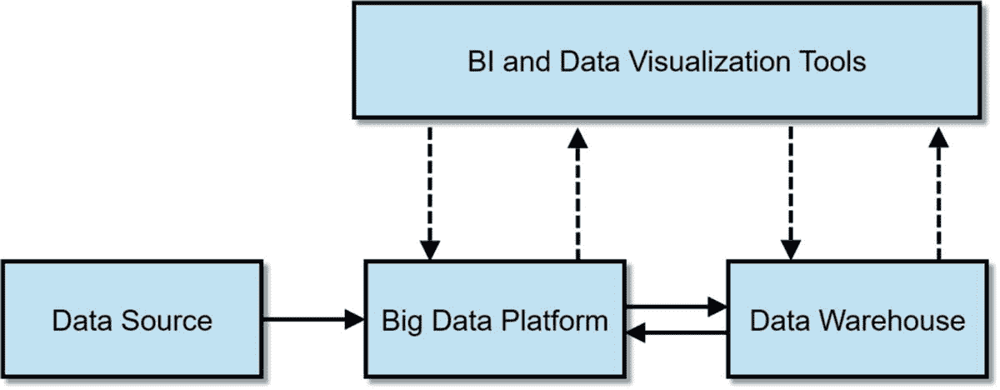
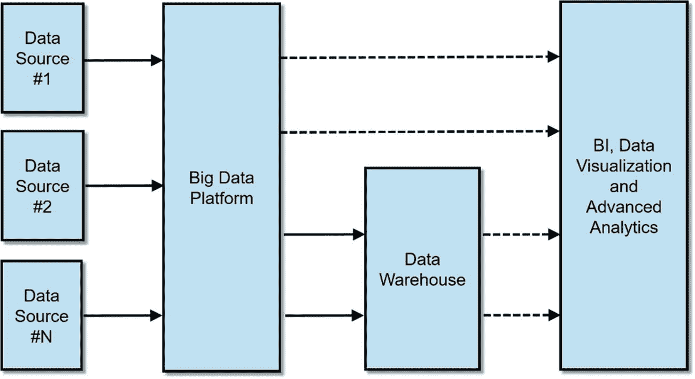
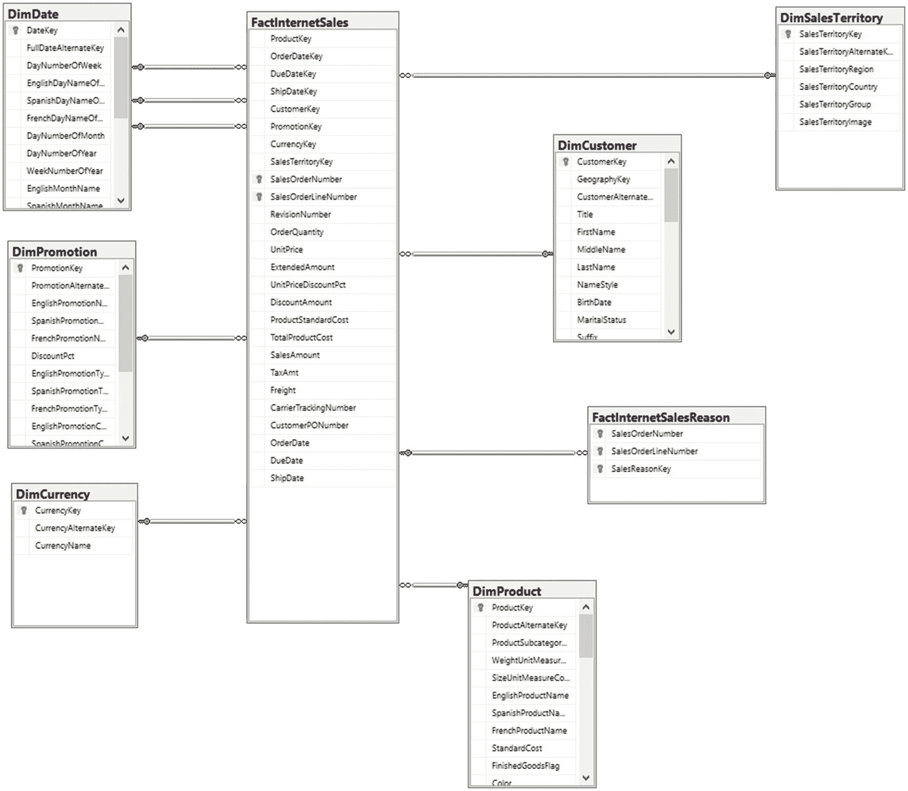
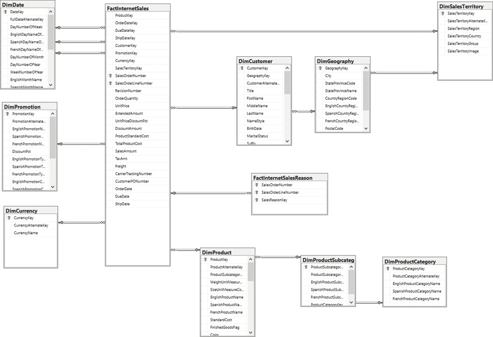
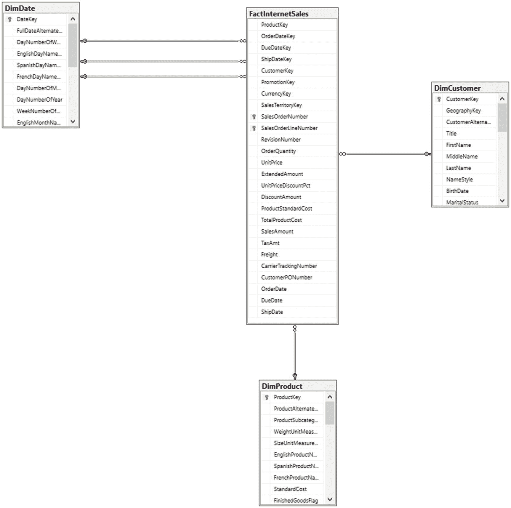
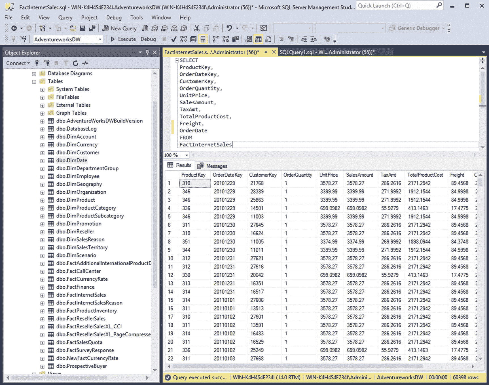
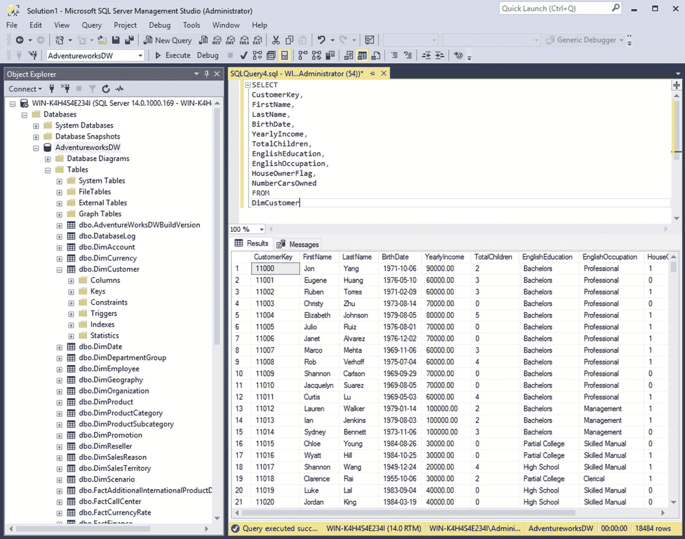
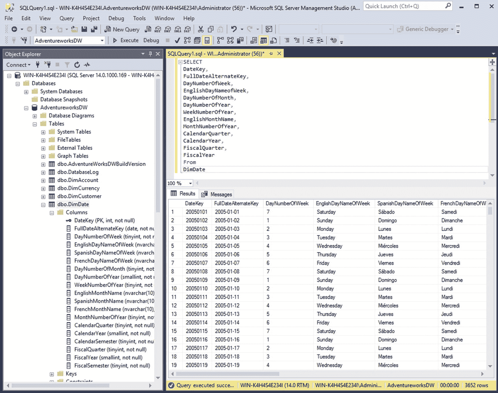

# 八、大数据仓库

几十年来，企业数据仓库一直是企业数据的中央存储库。它是每个组织的商业智能基础设施不可或缺的一部分。

数据仓库有各种形状和形式。多年来，微软和甲骨文公司销售用于 SMP(对称多处理)系统上的数据仓库的关系数据库管理软件。其他公司，如 Teradata，销售大型集成 MPP(大规模并行处理)系统。微软等云提供商提供完全托管的云数据仓库，如 Azure SQL 数据仓库。开发 Apache Hive 项目是为了提供构建在 Hadoop 之上的数据仓库基础设施。无论采用何种形式，数据仓库的目的都是一样的——提供一个可以高效存储、处理和分析结构化数据的平台。

在本章中，我将讨论大数据(更具体地说是 Cloudera Enterprise)如何颠覆数据仓库。我假设读者熟悉数据仓库，所以我不会讨论数据仓库的基础知识和理论。有关数据仓库的权威指南，请参考 Ralph Kimball 的《数据仓库工具包》。 [<sup>ii</sup>](#Sec17)

Note

我将在本章(以及整本书)中交替使用术语“大数据”和“Hadoop”。从技术上讲，大数据指的是整个技术和框架生态系统，Hadoop 是其中的一部分。在整本书中，我还将交替使用术语“数据湖”、“数据中心”和“大数据平台”。

## 大数据时代的企业数据仓库

正如我们所知，大数据时代已经颠覆了数据仓库。大数据的先驱发明了新的数据处理和分析方法，使传统的数据仓库显得过时。大数据平台处理和分析结构化和非结构化数据的能力以及 ELT(提取、加载和转换)、读取模式、数据整理和自助数据分析等新技术暴露了数据仓库的局限性，使传统的数据建模和 ETL 开发生命周期看起来缓慢而僵化。

从成本和技术角度来看，大数据平台通常比传统数据仓库平台更具可扩展性。一般来说，最大的数据仓库最多只能处理数百 TB 的数据，需要大量的硬件投资来扩展。大数据平台可以使用低成本的商用服务器轻松处理和分析数 Pb 的数据。对于大多数组织来说，最实际的问题可能是实现和维护商业数据仓库的财务负担。为了拥有一个全功能的企业数据仓库，公司在许可、基础设施和开发成本上花费了数百万美元。像 Impala、Drill 和 Presto 这样的开源 MPP Apache 项目以很小的成本提供了相当的性能和可伸缩性。

## 结构化数据仍然占主导地位

对于数据仓库来说，并不完全是厄运和黑暗，远非如此。尽管围绕大数据大肆宣传，但戴尔进行的一项调查显示，超过三分之二的公司报告结构化数据占正在处理的数据的 75%，三分之一的公司报告根本不分析非结构化数据。该调查还显示，结构化数据的增长速度快于非结构化数据。 [<sup>iii</sup>](#Sec17)

## EDW 现代化

尽管 Cloudera Enterprise 等 Hadoop 平台接近复制数据仓库的一些功能，但商业数据仓库平台仍然是分析结构化数据的最佳平台。Impala 和 Kudu(以及 Hive)仍然缺乏商业数据仓库平台的许多(专有)功能和特性。您会发现一些流行的商业智能和 OLAP(在线分析处理)工具依赖于这些专有特性。Impala 和 Kudu 中没有的一些功能包括多行和多表事务、OLAP 支持、高级备份和恢复特性、二级索引、物化视图、对十进制数据类型的支持以及自动增加列等等。表 [8-1](#Tab1) 包含了 Impala 和 Kudu 与传统数据仓库平台的对比。

表 8-1

Impala and Kudu vs. a Traditional Data Warehouse

<colgroup><col align="left"> <col align="left"> <col align="left"></colgroup> 
| 特征 | 黑斑羚和库杜 | 数据仓库平台 |
| :-- | :-- | :-- |
| 多行多表交易 | 不 | 是 |
| 自动递增列 | 不 | 是 |
| 外键约束 | 不 | 是 |
| 次要索引 | 不 | 是 |
| 物化视图 | 不 | 是 |
| 扳机 | 不 | 是 |
| 存储过程 | 不 | 是 |
| 数据库缓存 | 不 | 是 |
| OLAP 支持 | 不 | 是 |
| SQL 的过程扩展 | 不 | 是 |
| 高级备份和恢复 | 不 | 是 |
| 十进制和复杂数据类型 | 不 | 是 |

Hadoop 供应商通常将他们的平台作为“数据中心”或“数据湖”进行营销，这些平台可用于扩充或更新数据仓库，而不是取代它。事实上，现在大多数公司都有数据仓库和数据湖。有多种方法可以使用数据湖来实现企业数据仓库的现代化:ETL 卸载、活动归档和分析卸载以及数据整合。这些用例相对容易实现。投资回报也很容易衡量并向管理层证明。

### ETL 卸载

在典型的数据仓库环境中，IO 和 CPU 密集型数据转换和加载在数据仓库上执行(图 [8-1](#Fig1) )。随着时间的推移，随着越来越多的数据被接收并存储在数据仓库中，其 ETL 窗口将开始占用业务时间，导致业务用户无法使用重要的报告和仪表板。一个明显的解决方法是升级数据仓库。这是一个短期的解决方法。随着时间的推移，当您将更多的数据接收到数据仓库中时，您会遇到同样的性能和可伸缩性问题。


图 8-1

Traditional ETL

正确的解决方案是通过 ETL 卸载用数据湖来扩充您的数据仓库。如图 [8-2](#Fig2) 所示，大部分繁重的数据转换是在大数据平台上执行的，由于 Spark 和 MapReduce 等高度分布式数据处理框架，大数据平台可以在相对较短的时间内处理大量数据。数据湖可以充当临时区域或操作数据存储。然后，经过处理和聚合的数据被加载到数据仓库中，现在可以免费用于数据分析。


图 8-2

ETL Offloading with Big Data

### 分析卸载和活动归档

您还可以使用您的数据湖来卸载一些昂贵的报告和即席查询。通过卸载一些分析，您可以腾出数据仓库来处理更重要的任务。分析卸载还允许您的数据仓库处理更多数据和并发用户，同时保持较小的数据仓库占用空间，从而为您的组织节省数百万的数据仓库升级费用。

如果您已经使用大数据平台进行 ETL 卸载，那么您已经在大数据平台中存储了数据的副本。您还可以通过将旧数据移动或归档到大数据平台来帮助提高数据仓库的效率。一旦您在大数据平台中获得了所需的数据，您就可以通过 JDBC 将您的 BI 或数据可视化工具(如 Tableau 或 MS Power BI)指向 Impala(图 [8-3](#Fig3) )。在某些情况下，BI tools 有一个语义层，它提供了一种连接、读取和缓存来自不同数据源的数据的方法。它向用户隐藏了数据源的详细信息，提供了数据的统一视图。



图 8-3

Some of the analytics are offloaded to the big data platform

### 数据整合

Hadoop 最好的特性之一是它存储大量数据的能力。通过结合来自商用硬件的存储并提供分布式存储引擎，如 HDFS、HBase 和 Kudu，Hadoop 使大型数据集的存储和处理不仅成为可能，而且变得切实可行。与只能存储结构化数据的数据仓库不同，数据湖可以存储和处理结构化和非结构化数据集，使其成为真正的企业数据存储库。

将数据整合到一个集中的数据湖中有几个好处。首先，它通过使连接和关联数据变得更容易来增强数据分析。第二，因为您的数据在一个中心位置，所以用户可以更容易地跨各种数据集运行 SQL 连接，例如，提供客户的 360 度视图。第三，特征工程–选择和处理属性以及为预测模型创建特征集也变得更加容易。第四，一旦数据被整合到一个中心位置，数据治理和主数据管理就变得简单明了，为您提供一个数据的黄金副本，而不是将同一数据的多个副本分散到多个数据仓库中。

整合数据带来的最切实的好处可能是许可、运营和基础架构成本的大幅降低。对于大型组织来说，积累分散在整个企业中的数百甚至数千个数据库是相当常见的。通过将这些数据库整合到一个集中的数据湖中(图 [8-4](#Fig4) )，您可以淘汰托管这些数据库的旧服务器，并停止支付数据库软件许可证的费用。



图 8-4

Consolidating data in a data lake or data hub

## 重新构建企业数据仓库

这可能是你阅读这本书或这一章的原因。用 Cloudera Enterprise 替换或重新构建数据仓库在技术上是可能的。许多公司已经成功地做到了这一点，在本章的其余部分，我们将讨论如何做到这一点。

Note

提醒一句。除非你有真正令人信服的理由，否则我建议你在用 Cloudera Enterprise 重新平台化你的数据仓库之前三思。有许多事情要考虑。您需要仔细评估贵公司的数据管理和分析需求。您还需要评估 Cloudera Enterprise 的能力和弱点。你的商业智能和 OLAP 工具能和 Impala 一起工作吗？您需要迁移数千个 ETL 作业吗？把 PL/SQL 或者 T-SQL 移植到 Impala SQL 有多难？在经历将数据仓库迁移到 Cloudera Enterprise 的磨难之前，这些只是您需要问自己的一些问题。

## 大数据仓库 101

对于我们的示例，我们将使用来自微软 [<sup>iv</sup>](#Sec17) 的 AdventureWorksDW 免费示例数据库。如果你想学习我们的例子，你可以从微软的网站下载这个数据库。

### 维度建模

维度建模是对数据库表进行逻辑建模的一种方式，以便于使用和提高 SQL 查询性能。维度模型是当今市场上大多数商业智能和 OLAP 系统的逻辑基础。事实上，大多数数据仓库平台在设计和优化时都考虑了维度建模。维度建模有几个概念:

#### 事实

维度模型有事实数据表，其中包含表示业务指标(如销售额或成本)的度量值或数值。一个数据仓库通常有几个用于不同业务流程的事实表。在 Kudu 之前，出于性能原因，事实表通常以 Parquet 格式存储。

#### 维度表

维度表包含描述事实表中存储的度量或为其提供上下文的属性。典型的属性包括日期、地点、年龄、宗教、国籍和性别等等。

#### 星形模式

有两种物理实现维度模型的方法:使用星型或雪花型模式。星型模式在中间包含一个事实表，周围是维度表。事实表和维度表通过表的外键和主键连接起来。图 [8-5](#Fig5) 中的 ER 图是星型模式的一个例子。



图 8-5

Star Schema

#### 雪花模式

雪花模式非常类似于星型模式，它有一个中央事实表，但维度表被进一步规范化为子维度表。数据仓库专家 Ralph Kimball 通常推荐使用星型模式。他建议在一些度量引用许多其他度量不共享的属性的情况下使用雪花模式。 [<sup>v</sup>](#Sec17) 图 [8-6](#Fig6) 所示的 ER 图就是雪花图式的一个例子。



图 8-6

Snowflake Schema

#### 尺寸缓慢变化

有效使用 Hive 或 Impala 进行数据仓库存储的最大障碍之一是它无法执行一件简单的事情——更新表。无法更新纵栏文件格式，例如存储在 HDFS 的拼花地板。这可能会让有 RDBMS 背景的人感到震惊。用户需要覆盖整个表或分区，以便更改存储在镶木地板表中的值。当处理缓慢变化的维度时，这种限制成为一个令人头疼的问题。在 Kudu 之前，处理缓慢变化的维度的最佳方式是将维度表存储在 HBase 中，然后在表的顶部创建一个外部 Hive 表，以便从 Impala 访问它。Impala 不支持 SQL update 语句，但是因为 HBase 支持版本控制，所以可以通过使用相同的 rowkey 执行 insert 语句来模拟更新。 [<sup>vi</sup>](#Sec17)

### 使用 Impala 和 Kudu 的大数据仓库

多年来，Hive 被用来在 Hadoop 中实现基本的数据仓库。它慢得令人痛苦，也很笨拙，但它比 MapReduce 更容易使用，而且它能完成工作，所以用户能容忍它。

几年后，Impala 和其他开源 MPP 引擎出现了。与 Parquet 等列式文件格式一起使用，它为企业中的 Hadoop 铺平了道路，使 BI 和 OLAP 工具能够连接到 Hadoop 集群并获得快速性能。使用 Impala 和 Parquet 进行 ETL 和维度建模仍然很麻烦，但是好处超过了成本，所以用户忍受使用它。

Impala 和 Kudu 使得在 Cloudera Enterprise 上存储、处理和分析关系数据变得更加容易。虽然它还不具备商业数据仓库平台的所有高级功能，但它的功能已经足够接近关系数据库了。

让我们通过在 Kudu 中实现一个简单的维度星型模式模型来研究一个例子。我将把 AdventureWorksDW 数据库的子集从 SQL Server 复制到 Kudu，并使用 Impala 对其运行一些 SQL 查询。我们将复制三个维度表和一个事实表。我们还将复制列的子集。该模式应该如图 [8-7](#Fig7) 所示。



图 8-7

Example schema

如图 [8-8](#Fig8) 所示，我将从 FactInternetSales 表中转移以下各列:ProductKey、OrderDateKey、CustomerKey、OrderQuantity、UnitPrice、SalesAmount、TaxAmt、TotalProductCost、Freight、OrderDate、SalesOrderNumber 和 SalesOrderLineNumber。



图 8-8

Fact Internet Sales

我将从 DimCustomer 表中复制以下各列:CustomerKey、FirstName、LastName、BirthDate、YearlyIncome、TotalChildren、EnglishEducation、EnglishOccupation、HouseOwnerFlag 和 NumberofCarsOwned，如图 [8-9](#Fig9) 所示。



图 8-9

DimCustomer

我们将从 DimProduct 表中选择四列:ProductKey、EnglishProductName、EnglishDescription 和 Color，如图 8-10 所示。


图 8-10

DimProduct

我们将从 DimDate 表中选取几列:DateKey、FullDateAlternateKey、DayNumberOfWeek、EnlighsDayNameOfWeek、DayNumberOfMonth、DayNumberOfYear、WeekNumberOfYear、EnglishMonthName、MonthNumberOfYear、CalendarQuarter、CalendarYear、FiscalQuarter 和 FiscalYear，如图 [8-11](#Fig11) 所示。



图 8-11

DimDate

我需要将表从 SQL Server 复制到 Impala。为此，我为每个表手动生成一个 CSV 文件。你可以使用我们在第 [7](07.html) 章中提到的任何 ETL 工具。在这种情况下，我使用 SQL Server 的数据导出和导入工具来生成 CSV 文件。不要忘记排除列标题。然后，我将文件移动到 HDFS，并在每个文件的顶部创建一个外部表。清单 [8-1](#Par35) 显示了步骤。

```scala
hadoop fs -mkdir /tmp/factinternetsales
hadoop fs -mkdir /tmp/dimcustomer
hadoop fs -mkdir /tmp/dimproduct
hadoop fs -mkdir /tmp/dimdate

hadoop fs -put FactInternetSales.csv /tmp/factinternetsales/
hadoop fs -put DimCustomer.csv /tmp/dimcustomer/
hadoop fs -put DimProduct.csv /tmp/dimproduct/
hadoop fs -put DimDate.csv /tmp/dimdate/

impala-shell

CREATE EXTERNAL TABLE FactInternetSales_CSV (
OrderDate STRING,
ProductKey BIGINT,
OrderDateKey BIGINT,
CustomerKey BIGINT,
OrderQuantity FLOAT,
UnitPrice FLOAT,
SalesAmount FLOAT,
TaxAmt FLOAT,
TotalProductCost FLOAT,
Freight FLOAT
)
ROW FORMAT
DELIMITED FIELDS TERMINATED BY ','
LINES TERMINATED BY '\n' STORED AS TEXTFILE
LOCATION '/tmp/factinternetsales';

CREATE EXTERNAL TABLE DimCustomer_CSV (
CustomerKey BIGINT,
FirstName STRING,
LastName STRING,
BirthDate STRING,
YearlyIncome FLOAT,
TotalChildren INT,
EnglishEducation STRING,
EnglishOccupation STRING,
HouseOwnerFlag INT,
NumberCarsOwned INT
)
ROW FORMAT
DELIMITED FIELDS TERMINATED BY ','
LINES TERMINATED BY '\n' STORED AS TEXTFILE
LOCATION '/tmp/dimcustomer';

CREATE EXTERNAL TABLE DimDate_CSV (
DateKey BIGINT,
FullDateAlternateKey STRING,
DayNumberOfWeek INT,
EnglishDayNameOfWeek STRING,
DayNumberOfMonth INT,
DayNumberOfYear INT,
WeekNumberOfYear INT,
EnglishMonthName STRING,
MonthNumberOfYear INT,
CalendarQuarter INT,
CalendarYear INT,
FiscalQuarter INT,
FiscalYear INT
)
ROW FORMAT
DELIMITED FIELDS TERMINATED BY ','
LINES TERMINATED BY '\n' STORED AS TEXTFILE
LOCATION '/tmp/dimdate';

CREATE EXTERNAL TABLE DimProduct_CSV (
ProductKey BIGINT,
EnglishProductName STRING,
EnglishDescription STRING,
Color STRING
)
ROW FORMAT
DELIMITED FIELDS TERMINATED BY ','
LINES TERMINATED BY '\n' STORED AS TEXTFILE
LOCATION '/tmp/dimproduct';

invalidate metadata;

select count(*) from FactInternetSales_csv;

60398

select count(*) from DimCustomer_csv;

18484

select count(*) from DimProduct_csv;

606

select count(*) from DimDate_csv;

3652

Listing 8-1Copy the tables from SQL Server to Impala

```

既然可以从 Impala 访问数据，我们就可以创建 Kudu 表，并用外部表中的数据填充它。步骤如清单 [8-2](#Par38) 所示。

Note

如第 [2](02.html) 章所述，Kudu 不支持多行多表的 ACID 兼容事务。即使某些行由于违反主键或约束而被拒绝，ETL 作业也将继续成功运行。在 ETL 过程之后，必须执行额外的数据验证，以确保数据处于一致的状态。此外，考虑对您的表进行反规范化，以减少 Kudu 中数据不一致的可能性。[T3】VIIT5】](#Sec17)

```scala
CREATE TABLE FactInternetSales
(
ID STRING NOT NULL,
OrderDate BIGINT NOT NULL,
ProductKey BIGINT,
OrderDateKey BIGINT,
CustomerKey BIGINT,
OrderQuantity FLOAT,
UnitPrice FLOAT,
SalesAmount FLOAT,
TaxAmt FLOAT,
TotalProductCost FLOAT,
Freight FLOAT,
SalesOrderNumber STRING,
SalesOrderLineNumber TINYINT,
PRIMARY KEY(ID, OrderDate)
)
PARTITION BY HASH (ID) PARTITIONS 16,
RANGE (OrderDate)
(

PARTITION unix_timestamp('2017-01-01') <= VALUES < unix_timestamp('2017-02-01'),
PARTITION unix_timestamp('2017-02-01') <= VALUES < unix_timestamp('2017-03-01'),
PARTITION unix_timestamp('2017-03-01') <= VALUES < unix_timestamp('2017-04-01'),
PARTITION unix_timestamp('2017-04-01') <= VALUES < unix_timestamp('2017-05-01'),
PARTITION unix_timestamp('2017-05-01') <= VALUES < unix_timestamp('2017-06-01'),
PARTITION unix_timestamp('2017-06-01') <= VALUES < unix_timestamp('2017-07-01'),
PARTITION unix_timestamp('2017-07-01') <= VALUES < unix_timestamp('2017-08-01'),
PARTITION unix_timestamp('2017-08-01') <= VALUES < unix_timestamp('2017-09-01'),
PARTITION unix_timestamp('2017-09-01') <= VALUES < unix_timestamp('2017-10-01'),
PARTITION unix_timestamp('2017-10-01') <= VALUES < unix_timestamp('2017-11-01'),
PARTITION unix_timestamp('2017-11-01') <= VALUES < unix_timestamp('2017-12-01'),
PARTITION unix_timestamp('2017-12-01') <= VALUES < unix_timestamp('2018-01-01')
)
STORED AS KUDU;

INSERT INTO FactInternetSales
SELECT
uuid(),
unix_timestamp('2017-01-20'),
ProductKey,
OrderDateKey,
CustomerKey,
OrderQuantity,
UnitPrice,
SalesAmount,
TaxAmt,
TotalProductCost,
Freight,
SalesOrderNumber,
SalesOrderLineNumber
FROM
FactInternetSales_CSV;

SELECT COUNT(*) FROM FactInternetSales_csv

+----------+
| count(*) |
+----------+
| 60398    |
+----------+

SELECT COUNT(*) FROM FactInternetSales;

+----------+
| count(*) |
+----------+
| 60398    |
+----------+

CREATE TABLE DimCustomer (
ID STRING,
CustomerKey BIGINT,
FirstName STRING,
LastName STRING,
BirthDate STRING,
YearlyIncome FLOAT,
TotalChildren INT,
EnglishEducation STRING,
EnglishOccupation STRING,
HouseOwnerFlag INT,
NumberCarsOwned INT,
PRIMARY KEY(ID)
)
PARTITION BY HASH (ID) PARTITIONS 16
STORED AS KUDU);

INSERT INTO DimCustomer
SELECT
uuid(),
CustomerKey,
FirstName,
LastName,
BirthDate,
YearlyIncome,
TotalChildren,
EnglishEducation,
EnglishOccupation,
HouseOwnerFlag,

NumberCarsOwned

FROM
DimCustomer_CSV;

SELECT COUNT(*) FROM DimCustomer;

+----------+
| count(*) |
+----------+
| 18484    |
+----------+

SELECT COUNT(*) FROM DimCustomer_CSV;

+----------+
| count(*) |
+----------+
| 18484    |
+----------+

CREATE TABLE DimDate (
ID STRING,
DateKey BIGINT,
FullDateAlternateKey STRING,
DayNumberOfWeek INT,
EnglishDayNameOfWeek STRING,
DayNumberOfMonth INT,
DayNumberOfYear INT,
WeekNumberOfYear INT,
EnglishMonthName STRING,
MonthNumberOfYear INT,
CalendarQuarter INT,
CalendarYear INT,
FiscalQuarter INT,
FiscalYear INT,
PRIMARY KEY(ID)

)
PARTITION BY HASH (ID) PARTITIONS 16
STORED AS KUDU;

INSERT INTO DimDate
SELECT
uuid(),
DateKey,
FullDateAlternateKey,
DayNumberOfWeek,
EnglishDayNameOfWeek,
DayNumberOfMonth,
DayNumberOfYear,
WeekNumberOfYear,
EnglishMonthName,
MonthNumberOfYear,
CalendarQuarter,
CalendarYear,
FiscalQuarter,
FiscalYear
FROM DimDate_CSV;

SELECT count(*) from DimDate;
+----------+
| count(*) |
+----------+
| 3652     |
+----------+

SELECT count(*) from Dimdate_CSV;
+----------+
| count(*) |
+----------+
| 3652     |
+----------+

CREATE TABLE DimProduct (

ID STRING,
ProductKey BIGINT,
EnglishProductName STRING,
EnglishDescription STRING,
Color STRING
)
PARTITION BY HASH (ID) PARTITIONS 16
STORED AS KUDU;

INSERT INTO DimProduct
SELECT
uuid(),
productkey,
englishproductname,
englishdescription,
color
FROM
DimProduct_CSV

select COUNT(*) from DimProduct

+----------+
| count(*) |
+----------+
| 606      |
+----------+

select COUNT(*) from DimProduct_CSV

+----------+
| count(*) |
+----------+
| 606      |

+----------+

Listing 8-2Build Kudu tables and populate it with data

```

这里有几件重要的事情要讨论。注意，我使用了 Impala 内置函数 uuid()为事实表和维度表生成一个惟一的 id。Impala 和 Kudu 不包含自动增量特性，这实际上被认为是分布式环境中的反模式。使用 Kudu、Spanner 和类似的分布式系统，对值单调递增的列进行范围分区会将所有插入一次写入一个平板，导致平板比其他平板大得多，并限制了插入的可伸缩性。这也被称为热点。当插入具有单调递增行键的行时，HBase 中也会出现热点。

虽然在单个 SMP 服务器上运行的数据库上使用 UUIDs 作为主键是一种灾难，但是在分布式 MPP 环境中，使用不是从表中包含的业务或数据派生的唯一键进行哈希分区会将工作负载分散到集群中的各个节点上。哈希分区可防止数据和工作负载不对称，并通过将插入并行发送到多个平板电脑来提高数据接收的可伸缩性。 [<sup>viii</sup>](#Sec17)

一些数据库系统，如 Microsoft SQL Server，具有本地 UUID 数据类型，为 uuid 提供了更有效的存储。Kudu 没有 UUID 数据类型，因此您必须使用字符串数据类型来存储 UUID。36 个字符的 UUID 确实会占用一些空间；然而，基准测试表明，在 Kudu 中使用 36 个字符的主键不会影响大多数查询的性能，尽管您的体验可能会有所不同。如果您关心 UUID 的使用，那么另一个选择是散列 UUID 来生成一个非连续的 BIGINT 值作为您的主键。您可以使用 Impala 的内置哈希函数 fnv_hash()(它不是加密安全的，这意味着在生成唯一 ID 时可能会发生冲突)或一个加密安全的哈希算法。只要确保您测试了 insert 语句的性能。每个 insert 语句都调用内置函数可能会导致性能瓶颈。当然，还有其他方法可以生成非顺序的唯一键。

如您所见，事实表是散列和范围分区的。通过结合这两种分区策略，我们获得了两者的优点，同时减少了各自的局限性。 [<sup>ix</sup>](#Sec17) 通过对日期列使用范围分区，您的查询可以在按日期范围扫描时利用分区修剪。此外，随着新数据添加到表中，可以添加新的分区(这将导致 16 个额外的平板电脑)。通过在 ID 列上使用散列分区(这是一种非顺序的 UUID)，插入被均匀地分布在多个平板上，直到散列分区的数量(在我们的例子中是 16)，从而提高了数据接收的吞吐量和性能。将此策略与当前的 AdventureWorksDW 架构进行比较，您会发现一些不同之处。首先，FactInternetSales 的主键在 SalesOrderNumber 和 SalesOrderLineNumber 上。这对于在一台服务器上运行的 SQL Server 数据库来说已经足够了。然而，这打破了我们刚刚讨论的关于分布式系统上的分区和选择主键值的几个规则。SalesOrderNumber 是单调递增的，SalesOrderLineNumber 的大部分值是 1。如果我们使用这两列作为主键，所有插入都将被定向到一个分区，从而导致数据和工作负载不对称，并降低数据接收速度。

维度表通常很小，并且大多是只读的。缓慢变化的维度通常不需要像事实表那样考虑性能，所以我们将使用唯一的 UUID 作为主键对维度表进行哈希分区。较大的维度表可能需要不同的分区策略。

虽然 Kudu 要求所有表都有主键，但它没有外键约束。因此，在 Kudu 数据仓库中，数据不一致是可能的。但是，出于性能和可管理性的原因，数据仓库通常会禁用外键约束。清单 [8-3](#Par45) 显示了我们刚刚创建的 Kudu 表的结构。

```scala
describe FactInternetSales;

+----------------------+---------+---------+-------------+----------+
| name                 | type    | comment | primary_key | nullable |
+----------------------+---------+---------+-------------+----------+
| id                   | string  |         | true        | false    |
| orderdate            | bigint  |         | true        | false    |
| productkey           | bigint  |         | false       | true     |
| orderdatekey         | bigint  |         | false       | true     |
| customerkey          | bigint  |         | false       | true     |
| orderquantity        | float   |         | false       | true     |
| unitprice            | float   |         | false       | true     |
| salesamount          | float   |         | false       | true     |
| taxamt               | float   |         | false       | true     |
| totalproductcost     | float   |         | false       | true     |
| freight              | float   |         | false       | true     |
| salesordernumber     | string  |         | false       | true     |
| salesorderlinenumber | tinyint |         | false       | true     |
+----------------------+---------+---------+-------------+----------+

describe DimDate;

+----------------------+--------+---------+-------------+----------+
| name                 | type   | comment | primary_key | nullable |
+----------------------+--------+---------+-------------+----------+
| id                   | string |         | true        | false    |
| datekey              | bigint |         | false       | true     |

| fulldatealternatekey | string |         | false       | true     |
| daynumberofweek      | int    |         | false       | true     |
| englishdaynameofweek | string |         | false       | true     |
| daynumberofmonth     | int    |         | false       | true     |
| daynumberofyear      | int    |         | false       | true     |
| weeknumberofyear     | int    |         | false       | true     |
| englishmonthname     | string |         | false       | true     |
| monthnumberofyear    | int    |         | false       | true     |
| calendarquarter      | int    |         | false       | true     |
| calendaryear         | int    |         | false       | true     |
| fiscalquarter        | int    |         | false       | true     |
| fiscalyear           | int    |         | false       | true     |
+----------------------+--------+---------+-------------+----------+

describe DimCustomer;

+-------------------+--------+---------+-------------+----------+
| name              | type   | comment | primary_key | nullable |
+-------------------+--------+---------+-------------+----------+
| id                | string |         | true        | false    |
| customerkey       | bigint |         | false       | true     |
| firstname         | string |         | false       | true     |
| lastname          | string |         | false       | true     |
| birthdate         | string |         | false       | true     |
| yearlyincome      | float  |         | false       | true     |
| totalchildren     | int    |         | false       | true     |
| englisheducation  | string |         | false       | true     |
| englishoccupation | string |         | false       | true     |
| houseownerflag    | int    |         | false       | true     |
| numbercarsowned   | int    |         | false       | true     |
+-------------------+--------+---------+-------------+----------+

describe DimProduct;

+--------------------+--------+---------+-------------+----------+
| name               | type   | comment | primary_key | nullable |
+--------------------+--------+---------+-------------+----------+
| id                 | string |         | true        | false    |
| productkey         | bigint |         | false       | true     |
| englishproductname | string |         | false       | true     |
| englishdescription | string |         | false       | true     |
| color              | string |         | false       | true     |
+--------------------+--------+---------+-------------+----------+

Listing 8-3Structure of Kudu tables

```

Note

正如本章前面提到的，Kudu 不支持 decimal 数据类型。float 和 double 数据类型仅存储非常接近的值，而不是 IEEE 754 规范中定义的精确值。 [<sup>x</sup>](#Sec17) 正因为如此，behavior float 和 double 都不适合存储财务数据。在撰写本文时，对十进制数据类型的支持仍在开发中(Apache Kudu 1.5 / CDH 5.13)。更多详情请参考 KUDU-721。一种解决方法是将财务数据存储为字符串，然后在每次需要读取数据时使用 Impala 将值转换为十进制。因为 Parquet 支持小数，所以另一个解决方法是对事实表使用 Parquet，对维度表使用 Kudu。

我们现在可以对 Kudu 的数据仓库运行 Impala 查询。

例如，这里有一个查询，获取收入超过 100，000 美元且拥有住房的所有人的前 20 名列表。

```scala
SELECT
DC.FirstName,
DC.LastName,
DC.BirthDate,
DC.HouseOwnerFlag,
DC.YearlyIncome
FROM FactInternetSales FIS
INNER JOIN DimCustomer DC ON FIS.customerkey = DC.customerkey
WHERE
DC.YearlyIncome >= 100000
AND
DC.HouseOwnerFlag = 1
ORDER BY
DC.YearlyIncome DESC
LIMIT 20;

+-----------+------------+------------+----------------+--------------+
| firstname | lastname   | birthdate  | houseownerflag | yearlyincome |
+-----------+------------+------------+----------------+--------------+
| Shannon   | Navarro    | 1971-05-03 | 1              | 170000       |
| Devin     | Anderson   | 1959-08-22 | 1              | 170000       |
| Luis      | Washington | 1946-05-07 | 1              | 170000       |
| Ian       | Watson     | 1950-12-08 | 1              | 170000       |
| Jenny     | Chander    | 1955-02-04 | 1              | 170000       |
| Nathan    | Wright     | 1965-12-20 | 1              | 170000       |
| Trisha    | Wu         | 1959-01-03 | 1              | 170000       |
| Dale      | Holt       | 1952-02-01 | 1              | 170000       |
| Craig     | Gutierrez  | 1952-04-11 | 1              | 170000       |
| Devin     | Martin     | 1960-02-01 | 1              | 170000       |
| Katrina   | Luo        | 1950-04-22 | 1              | 170000       |
| Alvin     | Nara       | 1972-11-16 | 1              | 170000       |
| Megan     | Morgan     | 1966-02-13 | 1              | 170000       |
| Armando   | Munoz      | 1961-10-31 | 1              | 170000       |
| Arturo    | Zheng      | 1975-04-06 | 1              | 170000       |
| Vincent   | Sun        | 1959-11-03 | 1              | 170000       |
| Colleen   | Anand      | 1963-09-23 | 1              | 170000       |
| Caleb     | Jenkins    | 1970-04-22 | 1              | 170000       |
| Devin     | Johnson    | 1965-12-16 | 1              | 170000       |
| Shannon   | Liu        | 1966-03-08 | 1              | 170000       |
+-----------+------------+------------+----------------+--------------+

```

列出所有买了“Sport-100 头盔”并且拥有两辆以上汽车的人。

```scala
SELECT
DC.FirstName,

DC.LastName,
DC.BirthDate,
DC.NumberCarsOwned,
DP.EnglishProductName
FROM FactInternetSales FIS
INNER JOIN DimCustomer DC ON FIS.customerkey = DC.customerkey
INNER JOIN DimProduct DP ON FIS.productkey = DP.productkey
WHERE
DP.EnglishProductName = 'Sport-100 Helmet'
AND
DC.NumberCarsOwned > 2
LIMIT 20;

+-----------+-----------+------------+-----------------+------------------+
| firstname | lastname  | birthdate  | numbercarsowned | englishproductname |
+-----------+-----------+------------+-----------------+------------------+
| Colleen   | Goel      | 1954-04-06 | 4               | Sport-100 Helmet |
| Timothy   | Stewart   | 1948-12-22 | 4               | Sport-100 Helmet |
| Janelle   | Arthur    | 1971-01-14 | 3               | Sport-100 Helmet |
| Colin     | Lal       | 1976-11-30 | 4               | Sport-100 Helmet |
| Melody    | Ruiz      | 1979-08-01 | 4               | Sport-100 Helmet |
| Nicolas   | Andersen  | 1972-11-10 | 3               | Sport-100 Helmet |
| Hunter    | Lopez     | 1958-02-06 | 3               | Sport-100 Helmet |
| Jake      | Zhu       | 1978-06-24 | 3               | Sport-100 Helmet |
| Caleb     | Yang      | 1985-08-13 | 3               | Sport-100 Helmet |
| Jeffery   | Ma        | 1969-12-03 | 3               | Sport-100 Helmet |
| Miranda   | Patterson | 1952-01-07 | 4               | Sport-100 Helmet |
| Isaac     | Ward      | 1957-11-09 | 3               | Sport-100 Helmet |
| Roy       | Chandra   | 1953-02-09 | 4               | Sport-100 Helmet |
| William   | Harris    | 1979-09-30 | 3               | Sport-100 Helmet |
| Xavier    | Williams  | 1974-01-18 | 3               | Sport-100 Helmet |
| Mason     | Mitchell  | 1952-11-03 | 4               | Sport-100 Helmet |
| Claudia   | Zhou      | 1961-12-04 | 3               | Sport-100 Helmet |
| Tamara    | Lal       | 1961-06-17 | 3               | Sport-100 Helmet |
| Misty     | Tang      | 1947-08-30 | 3               | Sport-100 Helmet |
| Alisha    | Zeng      | 1977-10-31 | 3               | Sport-100 Helmet |

+-----------+-----------+------------+-----------------+------------------+

```

## 摘要

恭喜你！您刚刚使用了 Impala 和 Kudu 进行数据仓库存储！您可以通过 JDBC/ODBC 将您最喜欢的商业智能、数据可视化和 OLAP 工具连接到 Impala，根据我们刚刚创建的表创建仪表板、报告和 OLAP 立方体。我建议您参考第 [9](09.html) 章，了解更多关于数据可视化工具的信息。您可以使用 Spark 来处理海量数据并将其接收到 Kudu 中。这将在第 6 章[中详细讨论。还可以使用 StreamSets 和 Talend 等商业第三方 ETL 应用程序将数据加载到 Kudu 中。这在第 7 章](06.html)[中有所涉及。看起来您已经拥有了构建数据仓库所需的一切！](07.html)

本章讨论了利用 Impala 和 Kudu 的几种方法。您可以更新您的数据仓库，或者完全取代它。只要确保您已经仔细评估了它的优势和劣势，以及它是否是您组织的正确解决方案。

## 参考

1.  Hortonworks《用 Apache Hive 进行数据仓储》，Hortonworks，2018， [`https://docs.hortonworks.com/HDPDocuments/HDP2/HDP-2.6.2/bk_data-access/content/ch_using-hive.html`](https://docs.hortonworks.com/HDPDocuments/HDP2/HDP-2.6.2/bk_data-access/content/ch_using-hive.html)
2.  金博尔集团；《数据仓库工具包，第 3 版》，金博尔集团，2018， [`http://www.kimballgroup.com/data-warehouse-business-intelligence-resources/books/data-warehouse-dw-toolkit/`](http://www.kimballgroup.com/data-warehouse-business-intelligence-resources/books/data-warehouse-dw-toolkit/)
3.  戴尔；“戴尔调查:尽管信息管理格局快速变化，结构化数据仍是焦点”，戴尔，2018， [`http://www.dell.com/learn/us/en/uscorp1/press-releases/2015-04-15-dell-survey`](http://www.dell.com/learn/us/en/uscorp1/press-releases/2015-04-15-dell-survey)
4.  微软；《用于 SQL Server 2016 CTP3 的 AdventureWorks 数据库和脚本》，微软，2018， [`https://www.microsoft.com/en-us/download/details.aspx?id=49502`](https://www.microsoft.com/en-us/download/details.aspx?id=49502)
5.  甲骨文；《星形与雪花图式》，甲骨文，2018， [`http://www.oracle.com/webfolder/technetwork/tutorials/obe/db/10g/r2/owb/owb10gr2_gs/owb/lesson3/starandsnowflake.htm`](http://www.oracle.com/webfolder/technetwork/tutorials/obe/db/10g/r2/owb/owb10gr2_gs/owb/lesson3/starandsnowflake.htm)
6.  Cloudera《使用 Impala 查询 HBase 表》，Cloudera，2018， [`https://www.cloudera.com/documentation/enterprise/latest/topics/impala_hbase.html`](https://www.cloudera.com/documentation/enterprise/latest/topics/impala_hbase.html)
7.  Cloudera《使用 Impala 查询 Kudu 表》，Cloudera，2018， [`https://www.cloudera.com/documentation/enterprise/5-12-x/topics/impala_kudu.html`](https://www.cloudera.com/documentation/enterprise/5-12-x/topics/impala_kudu.html)
8.  阿帕奇库杜；《Kudu:常见问题》阿帕奇 Kudu，2018， [`https://kudu.apache.org/faq.html`](https://kudu.apache.org/faq.html)
9.  阿帕奇库杜；《哈希和范围划分示例》，Apache Kudu，2018， [`https://kudu.apache.org/docs/schema_design.html#hash-range-partitioning-example`](https://kudu.apache.org/docs/schema_design.html#hash-range-partitioning-example)
10.  微软；“使用十进制、浮点和实数数据”，微软，2018， [`https://technet.microsoft.com/en-us/library/ms187912(v=sql.105).aspx`](https://technet.microsoft.com/en-us/library/ms187912(v=sql.105).aspx)