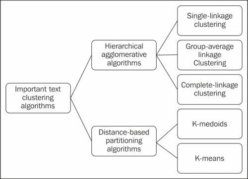
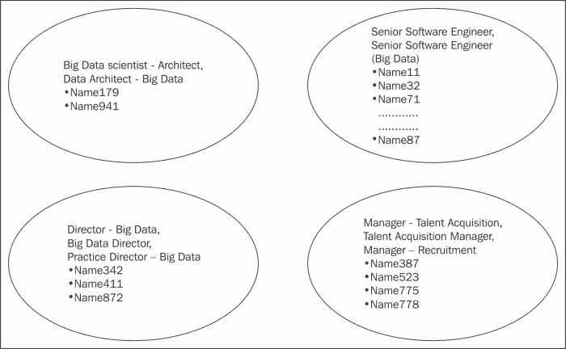
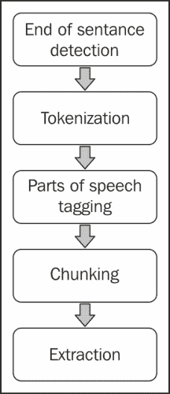
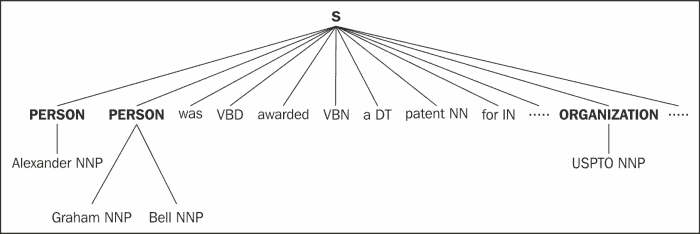
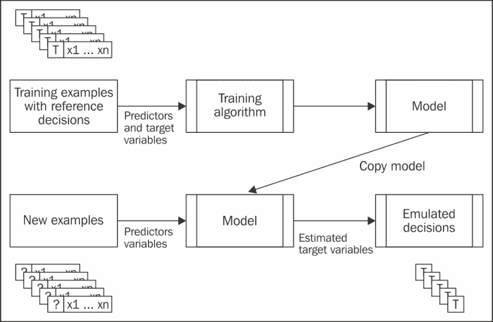
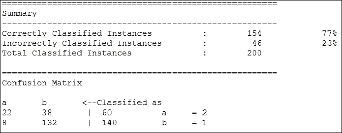

# 七、高级模式和未来工作

在前一章中，您已经学习了各种旨在减少分析或处理的数据量的大数据缩减技术。我们探索了使用主成分分析技术降维和使用聚类、采样和直方图技术降维的设计模式。

在本章中，我们将从讨论主要处理文本数据的设计模式开始，并探索使用 Pig 作为关键的输入和处理引擎可以构建的各种分析管道。

我们将深入研究以下模式:

*   文本数据聚类
*   发现主题
*   自然语言处理
*   分类

我们也将推测 PIG 设计模式的未来。这些未来趋势分析了主流中遵循的趋势，以针对特定用例修改 Pig。包括这些趋势将从哪里产生，什么样的数据趋势将影响当前的设计模式，等等。

# 聚类模式

聚类设计模式通过计算集合的相似度，用 Pig 和 Python 对结果进行聚类，探索文本聚类。

## 背景

在的前一章中，我们研究了如何使用聚类作为数据约简技术。我们探索了一种处理数字数据的聚类技术。

文本聚类自动将相关文档分组为彼此相似的聚类，并将不同的文档划分为不同的聚类。执行聚类的主要原因是，如果文档语料库被聚类，我们划分搜索空间，以便可以在包含相关文档的聚类上执行搜索。聚类是提高搜索有效性和效率的重要途径之一。一组文档是否相似或不同并不总是很清楚，但通常会随着实际问题而变化。例如，在对研究文章进行聚类时，如果任何两篇文章共享相似的主题，则认为它们相似。在对网站进行聚类时，我们感兴趣的是根据网页包含的信息类型对网页进行聚类。例如，为了将大学网站聚集在一起，我们可能希望将教授的主页与学生的主页分开，并将课程页面与研究项目页面分开。

文本聚类适用于我们需要将多个文本文档组织成标记整齐的类别，使信息检索更加容易的情况。它还可以用于文本语料库的自动摘要，这样我们就可以对语料库的全部内容有一个大致的了解。

文本数据具有许多独特的属性，因此有必要设计一种特殊的分类算法。以下是文本表示的一些显著特征:

*   文本表示通常是非常高维的，但是底层数据是稀疏的。换句话说，从中提取文档的字典可能包含一百万个单词，但是给定的文档可能只包含几百个单词。
*   这些词通常是相互关联的，这意味着主要成分(或重要概念)比词少。
*   每个文档中的单词数量差异很大，因此需要根据单词向量在文档和整个集合中的相对频率对其进行标准化。这通常通过计算**项频率-逆文档频率** ( **TF-IDF** )来实现。
*   当我们需要对短句或推文进行聚类时，这些问题的影响更大。

聚类在从社交媒体对话中检索重要见解方面发挥着关键作用，这些对话主要是非结构化的，数量巨大。由于社交媒体内容由一个客户生成并交付给其他客户，因此内容生成的速度也是选择聚类机制时需要考虑的因素。社交媒体不仅限于微博平台上的 Twitter 和社交网络平台上的脸书单独创作的内容；维基、论坛、博客和其他媒体共享平台经常创建各种其他内容源。这些平台主要创建文本内容，除了 Flickr 和 YouTube，它们创建图像和视频数据。对各种类型的社交媒体内容进行聚类提供了对文档、图像、视频、网络链接和其他上下文信息之间的关系相似性的内在理解。

在这种设计模式中，我们将自己局限于对从社交媒体收集的文本数据进行聚类，这样如果我们自己的社交网络中有相似的人，我们就可以从数据中进行解释。这种相似性可能是由于相同的头衔、公司或地点。

## 动机

有各种算法常用于文本聚类。我们有层次聚类和基于距离的聚类技术，它们使用相似性函数来衡量任何两个文本对象之间的接近程度。许多聚类算法主要在相似性度量的计算方法上有所不同。下图描述了最常见的文本数据聚类技术:



基于的常见文本聚类算法

以下是对最常见的文本聚类技术的简要描述:

*   **Hierarchical Agglomerative Clustering** **(HAC)**: This technique is useful for supporting a variety of problems that arise while searching because it creates a tree hierarchy that can be leveraged for the search process and improves the search effectiveness and efficiency.

    HAC 算法的一般概念是根据文档与其他文档的相似性，将文档组合成簇。层次聚类算法根据文档组之间的最佳成对相似度不断地组合组。使用流行的距离度量(如欧几里德、曼哈顿和莱文斯坦)来计算文档中不同点集之间的相似度。这分别对应于单连锁、群体平均连锁和完全连锁聚类。这些算法相当精确，但缺乏效率。

*   **基于距离的划分算法**:这些算法一般是用来创建一个聚类对象的，其中层次结构并没有起到重要的作用。有两种广泛使用的基于距离的聚类算法:K-med oid 和 K-means。这些算法远不如 HAC 算法精确，但效率要高得多。
    *   **K-** **水母聚类算法**:这种技术使用一组来自原始数据的 *K* 数据点作为中心点(或水母)，围绕这个中心点展开聚类。该算法的中心目标是从原始文档集中找到一组理想的文档，并围绕这些文档构建一个聚类。每个文档都被分配给集合中与其最接近的文档。这将从文档集中创建一个迭代集群，并通过随机过程不断改进它。K-med oid 聚类算法的主要缺点是速度慢，因为需要大量迭代才能实现收敛，并且不适合稀疏文本数据集。
    *   **K-means 聚类算法**:这个技术和 K-medoids 非常相似，因为它也使用了一组 *K* 数据点来围绕这些数据点构建聚类。然而，与 K-med oid 不同，这组初始代表点不是从原始数据中获得的。代表点的初始集合从诸如分层聚类和部分监督的方法中获得。K-means 算法比 K-medoids 算法更快，因为它在更少的迭代中收敛。使用 K-means 方法的缺点是严重依赖于初始种子集的准确性，给定文档簇的质心可能包含大量单词。

Pig 用于摄取源数据，并将几个标准转换应用于术语向量表示。

1.  删除停止字。这些词对于文档的主题来说是不可描述的(例如，a、an、is 和)。
2.  使用波特的词干分析器对单词进行词干分析，以便将不同词尾的单词映射到一个单词中。
3.  衡量文档中包含的稀有词对整体聚类能力的影响，然后决定丢弃频率低于指定阈值的词。

以下是一些字符串相似性度量的快速概述，这些度量用于计算用于聚类的字符串的接近度:

*   **编辑距离或莱文斯坦距离**:这个通过计算将一个字符串转换成另一个字符串所需的最小替换次数来计算字符串的相异度
*   **Jaccard 相似度** : 这是通过将两个集合之间的公共项目数除以两个集合中不同项目的总数来计算的。
*   **度量集值项目(masi)** 的一致性:当集合之间存在部分重叠时，该距离返回的距离比 Jaccard 相似度短。

## 用例

集群设计模式可用于以下目的:

*   检索后，对数据进行聚类，以便向用户呈现更有条理的结果。
*   基于文档的相似性为浏览目的创建文档的分层分类。

## 模式实现

该模式中描述的用例将具有相似标题的 Outlook 联系人聚集在一起。从概念上讲，该模型可以根据任何标准(如职位)识别哪些联系人是相似的。例如，这个模型可以扩展到回答你的哪些联系人在你想工作的公司工作过，或者你的大多数联系人在哪里。

Pig 脚本加载数据，通过用完整形式替换缩写来转换数据，并通过流将不同的作业传递给 Python 脚本。传递不同的职称可以确保发送到 Python 脚本的数据量减少。

大多数集群代码都是用 Python 实现的，Python 对集群有现成的支持。Python 脚本在简化阶段通过流调用。《PIG 传》标题从`stdin`开始用 Python 脚本读取，计算 MASI 距离。基于距离和阈值对标题进行聚类，然后将聚类后的标题写入`stdout`。

Pig 脚本将 Python 写入的值读入`stdout`，通过从 Pig 关系中可用的数据中获取标题来执行名称和标题之间的关联。

我们探索了几种计算 levenshtein 的方法，以便在这种模式下聚集作业和集中 MASI 距离。这个距离度量被认为适合我们当前的用例，其中标题重叠。

## 代码片段

为了说明模式的工作原理，我们已经将联系人姓名及其标题从 Outlook 导出到一个 CSV 文件中，并对姓名进行了识别。该文件存储在 HDFS。

### 注

所有不在默认 Python 路径中的外部 Python 模块都应该在脚本执行之前添加到`PYTHONPATH`环境变量中。

下面的代码片段是一个 Pig 脚本，演示了这种模式的实现:

```sh
 /*
Assign alias cluster_contacts to the streaming command
Use SHIP to send the streaming binary files (Python script) from the client node to the compute node
*/
DEFINE cluster_contacts 'cluster_contacts.py' SHIP ('cluster_contacts.py');

/*
Register the piggybank jar file
*/
REGISTER '/home/cloudera/pig-0.11.0/contrib/piggybank/java/piggybank.jar';

/*
Load the outlook_contacts.csv dataset into the relation outlook_contacts
*/
outlook_contacts = LOAD '/user/cloudera/pdp/datasets/advanced_patterns/outlook_contacts.csv' USING PigStorage(',') AS (name: chararray, job_title: chararray);

/*
Transform the job titles by replacing few abbreviations with their full forms
*/
transformed_job_titles = FOREACH outlook_contacts {
job_title_sr = REPLACE(job_title,'Sr', 'Senior');

.
.
job_title_vp = REPLACE(job_title_cfo,'VP', 'Vice President');

GENERATE name AS name,job_title_vp AS job_title;
}

/*
Trim spaces for the field job_title
*/
jt_trimmed = FOREACH transformed_job_titles GENERATE TRIM(job_title) AS job_title,name;

/*
Group outlook_contacts by job_title
Extract unique job titles and store into the relation jt_flattened
STREAM is used to send the data to the external script
The Python script executes as a reduce job as STREAM is called after GROUP BY
The result is stored in the relation clustered_jt
*/
jt_trimmed_grpd = GROUP jt_trimmed BY job_title;
jt_flattened = FOREACH jt_trimmed_grpd GENERATE flatten(group);
clustered_jt = STREAM jt_flattened THROUGH cluster_contacts;

/*
Clustered job titles from relation clustered_jt are typecasted to chararray and are assigned to relation clustered_jt_cast.
clustered_jt_cast relation contains job title clusters.  
*/
clustered_jt_cast = FOREACH clustered_jt GENERATE (chararray)$0 AS cluster;

/*
The job titles are tokenized by using comma and are assigned to the relation clustered_jt_tokens along with the cluster name.
*/
clustered_jt_tokens  = FOREACH clustered_jt_cast GENERATE TOKENIZE(cluster,','), cluster;

/*
Each job title in job cluster is converted into a new tuple and is assigned to relation clustered_jt_flattened along with the cluster name.
*/
clustered_jt_flattened = FOREACH clustered_jt_tokens  GENERATE FLATTEN($0) AS cluster_job, cluster;

/*
Trim spaces in the job titles.
*/
clustered_jt_trimmed  = FOREACH clustered_jt_flattened GENERATE TRIM(cluster_job) AS cluster_job, cluster;

/*
Join jt_trimmed relation by job_title with the relation clustered_jt_trimmed by cluster_job. Project the contact name and cluster name.
*/
jt_clustered_joind = JOIN jt_trimmed BY job_title,clustered_jt_trimmed  BY cluster_job;
name_clustered_jt = FOREACH jt_clustered_joind GENERATE jt_trimmed::name AS name, clustered_jt_trimmed::cluster AS cluster;

/*
Remove duplicate tuples from relation name_clustered_jt.
*/
uniq_name_clustered_jt  = DISTINCT name_clustered_jt;

/*
Group the relation uniq_name_clustered_jt by field cluster and project the cluster name(consisting of a set of job titles) and the contact name
*/
name_clustered_jt_grpd =  GROUP uniq_name_clustered_jt  BY cluster;
similar_jt_clusters= FOREACH name_clustered_jt_grpd GENERATE group AS clustername, uniq_name_clustered_jt.name AS name;

/*
The results are stored on the HDFS in the directory clustering
*/
STORE similar_jt_clusters into '/user/cloudera/pdp/output/advanced_patterns/clustering';
```

下面的是一个 Python 代码片段，说明了这个模式的实现:

```sh
#! /usr/bin/env python

# Import required modules 
import sys
import csv
from nltk.metrics.distance import masi_distance

# Set the distance function to use and the distance threshold value 
DISTANCE_THRESHOLD = 0.5
DISTANCE = masi_distance

def cluster_contacts_by_title():

# Read data from stdin and store in a list called contacts
    contacts = [line.strip() for line in sys.stdin]
    for c in contacts[:]:
        if len(c)==0 :
            contacts.remove(c)

# create list of titles to be clustered (from contacts list) 
    all_titles = []
    for i in range(len(contacts)):
        title = [contacts[i]]
        all_titles.extend(title)

    all_titles = list(set(all_titles))

    # calculate masi_distance between two titles and cluster them based on the distance threshold, store them in dictionary variable called clusters
    clusters = {}
    for title1 in all_titles:
        clusters[title1] = []
        for title2 in all_titles:
            if title2 in clusters[title1] or clusters.has_key(title2) and title1 \
                in clusters[title2]:
                continue
            distance = DISTANCE(set(title1.split()), set(title2.split()))
            if distance < DISTANCE_THRESHOLD:
                clusters[title1].append(title2)

    # Flatten out clusters
    clusters = [clusters[title] for title in clusters if len(clusters[title]) > 1]

    # Write the cluster names to stdout
    for i in range(len(clusters)):
        print ", ".join(clusters[i])
```

## 结果

下面的是在数据集上以这种模式执行代码后的结果片段。为了提高可读性，我们只显示了几个集群。左边以逗号分隔的列表显示了汇总的职务，而与职务相关联的名称显示在右边。

```sh
IT Analyst, IT Financial Analyst    {(Name268),(Name869)}
Delivery Head, Delivery Unit Head    {(Name631),(Name662)}
Data Scientist, Lead Data Scientist    {(Name50),(Name823),(Name960),(Name314),(Name124),(Name163),(Name777),(Name58),(Name695)}
Lead Analyst, Lead Business Analyst    {(Name667),(Name495),(Name536),(Name952)}
Pega Practice Head, M2M Practice Head    {(Name618),(Name322)}
Technical Lead, Lead Technical Writer    {(Name52),(Name101),(Name120),(Name969),(Name683)}
Vice President, Vice President Sales    {(Name894),(Name673),(Name72)}
Business Analyst, Lead Business Analyst    {(Name536),(Name847)}
Director - Presales, Director - Staffing    {(Name104),(Name793)}
Product Manager, Senior. Product Manager    {(Name161),(Name956)}
Technology Lead, Technology Lead Service    {(Name791),(Name257)}
```

在下图中，我们用图形表示了几个集群，以提高可读性:



集群输出

如上图所示，第一个集群由两个联系人组成，头衔分别为**大数据科学家-架构师**和**数据架构师-大数据**。这两个标题相似，因此联系人被分组到一个集群中。

## 附加信息

本节的完整代码和数据集可以在以下 GitHub 目录中找到:

*   `Chapter7/code/`
*   `Chapter7/datasets/`

# 话题发现模式

主题发现设计模式通过名为**潜在狄利克雷分配** ( **LDA** ) 的技术，探索一种利用 Pig 和 Mahout 对文本语料库进行分类的方法。

## 背景

在文本语料库中发现隐藏主题是自然语言处理领域的最新发展之一。社交媒体网站上发布的数据通常涵盖广泛的主题。然而，为了从这些网站中提取相关信息，我们必须根据隐藏在文本中的主题的相关性对文本语料库进行分类。这将实现对大量文本的自动摘要，找到真正的内容。这样发现的主题的先验知识被用来对新文档进行分类。

## 动机

主题模型的关键难点是在没有任何内容先验知识的情况下，对文本语料库进行分类并识别其主题。先验知识意味着文档之前没有被标记为属于特定主题。主题模型使用统计方法来发现隐藏在文本语料库中的主题。

**潜在狄利克雷赋值** ( **LDA** )是主题模型的实现，其工作原理是从文档中包含的一组词中识别主题，然后将文档分组为主题组合。

LDA 使用 TF-向量空间模型根据单词的上下文而不是频率来识别单词的含义。使用线性判别分析通过消除歧义来解决单词的含义。LDA 利用语境线索将意义相同的词联系起来，区分具有多重意义的词的用法。

我们可以通过考虑一个案例来形成对主题模型的直观理解。在这种情况下，人类很容易理解“青霉素”和“抗生素”这两个词在关于医学的文档中出现的频率更高，而“代码”和“调试器”这两个词在关于软件的文档中出现的频率更高。主题模型试图基于主题的词分布和文档分布从语料库中收集主题。

让我们考虑以下说法:

*   我早餐吃了燕麦和胡萝卜。
*   我喜欢橘子和胡萝卜。
*   小狗小猫很可爱。
*   我哥哥带了一只小狗回家。
*   这只可爱的兔子正在嚼胡萝卜。

LDA 自动发现这些句子中包含的话题。例如，如果我们对这些句子执行 LDA 并查询发现的主题，输出可能如下:

```sh
Topic A: 30% oats, 15% carrots, 10% breakfast, 10% chewing, … (this topic could be interpreted to be about food)
Topic B: 20% Puppies, 20% kittens, 20% cute, 15% rabbit, ... (this topic could be interpreted to be about cute animals)
Sentences 1 and 2: 100% Topic A
Sentences 3 and 4: 100% Topic B
Sentence 5: 60% Topic A, 40% Topic B

```

Pig 是连接原始数据和 LDA 算法的粘合剂。它对数据进行预处理，并将其转换为适合 LDA 算法的格式。它可以轻松快速地从各种来源获取正确的数据，对其进行清理，并将其转换为必要的格式。Pig 根据原始数据制作数据集，并发送给 LDA 实现脚本。

## 用例

您可以考虑在非结构化文本语料库中使用这种设计模式来探索潜在的意图和摘要。当我们不知道文本语料库的内容，不能基于监督分类算法进行分类时，也可以考虑这个模型，这样我们甚至可以理解潜在的主题。

## 模式实现

为了实现这种模式，我们考虑了一组关于大数据和医学的文章，我们打算在文档中找到内在的主题。这种设计模式在 Pig 和 Mahout 中实现。阐述了一种实现 Pig 和 Mahout 集成的方法，以缓解数据矢量化并转换为 Mahout 可读格式的问题，从而实现快速原型制作。我们特意省略了预处理和向量转换的步骤，因为我们已经在[和*的第 6 章【理解数据约简模式】中看到了说明这些步骤的例子。*](6.html "Chapter 6. Understanding Data Reduction Patterns")

`sh`Pig 中的命令用于调用 Mahout 命令。这些命令执行预处理，创建稀疏向量，并应用**折叠变分贝叶斯** ( **CVB** ) ，这是 Mahout 主题建模的 LDA 实现。返回每个主题的单词及其概率的结果列表。

## 代码片段

为了解释这个模型是如何工作的，我们考虑一个数据集，其中有两篇关于大数据和医学的文章。这些文件储存在 HDFS。对于这个模型，我们将对文本语料库应用主题建模来识别主题。

下面的代码片段是 Pig 代码，它演示了这种模式的实现:

```sh
/*
Register piggybank jar file
*/
REGISTER '/home/cloudera/pig-0.11.0/contrib/piggybank/java/piggybank.jar';

/*
*Ideally the following data pre-processing steps have to be generally performed on the actual data, we have deliberately omitted the implementation as these steps were covered in the respective chapters

*Data Ingestion to ingest data from the required sources

*Data Profiling by applying statistical techniques to profile data and find data quality issues

*Data Validation to validate the correctness of the data and cleanse it accordingly

*Data Transformation to apply transformations on the data.

*Data Reduction to obtain a reduced representation of the data.
*/

/*
We have deliberately omitted the steps for vector conversion as we have an example illustrating these in the chapter Understanding Data Reduction Patterns. 
*/

/*
Use sh command to execute shell commands.
Convert the files in a directory to sequence files
-i specifies the input directory on HDFS
-o specifies the output directory on HDFS
*/
sh /home/cloudera/mahout-distribution-0.8/bin/mahout seqdirectory -i /user/cloudera/pdp/datasets/advanced_patterns/lda -o /user/cloudera/pdp/output/advanced_patterns/lda/sequence_files

/*
Create sparse vectors
-i specifies the input directory on HDFS
-o specifies the output directory on HDFS
-nv to get the named vectors
*/
sh /home/cloudera/mahout-distribution-0.8/bin/mahout seq2sparse -i /user/cloudera/pdp/output/advanced_patterns/lda/sequence_files -o /user/cloudera/pdp/output/advanced_patterns/lda/sparse_vectors -nv -wt tf

/*
Use rowid to convert the sparse vectors by changing the text key to integer
-i specifies the input directory on HDFS
-o specifies the output directory on HDFS
*/
sh /home/cloudera/mahout-distribution-0.8/bin/mahout rowid -i /user/cloudera/pdp/output/advanced_patterns/lda/sparse_vectors/tf-vectors/ -o /user/cloudera/pdp/output/advanced_patterns/lda/matrix

/*
Use Collapsed Variational Bayes for topic modelling
-i specifies the input directory on HDFS
-o specifies the output directory on HDFS
-k specifies the number of topics
-x specifies the maximum number of iterations
-dict specifies the path to term dictionary
-dt specifies the path to document topic distribution
-mt specifies temporary directory of the model, this is useful when restarting the jobs
*/
sh /home/cloudera/mahout-distribution-0.8/bin/mahout cvb -i /user/cloudera/pdp/output/advanced_patterns/lda/matrix/matrix -o /user/cloudera/pdp/output/advanced_patterns/lda/lda-out -k 2 -x 5 -dict /user/cloudera/pdp/output/advanced_patterns/lda/sparse_vectors/dictionary.file-* -dt /user/cloudera/pdp/output/advanced_patterns  /lda/lda-topics -mt /user/cloudera/pdp/output/advanced_patterns/  lda/lda-model

/*
Display top ten words along with their probabilities for each topic
-i specifies the input directory on HDFS
-d specifies the path to the dictionary file
-dt specifies the type of the dictionary (sequence / text)
-sort sorts the Key/Value pairs in descending order
*/
sh /home/cloudera/mahout-distribution-0.8/bin/mahout vectordump -i /user/cloudera/pdp/output/advanced_patterns/lda/lda-out -d /user/cloudera/pdp/output/advanced_patterns/lda/sparse_vectors/dictionary.file-* -dt sequencefile -vs 10 -sort /user/cloudera/pdp/output/advanced_patterns/lda/lda-out
```

## 结果

以下是在数据集上以此模式执行代码后的结果片段:

```sh
Topic 1: {examination:0.11428571430112491,medical:0.09999999999299336,follow:0.057142857068596745,may:0.057142857068595974,patient:0.05714285706859565,order:0.05714285706858435,tests:0.042857142760463936,physical:0.04285714276045852,signs:0.04285714276044089,other:0.028571428452333902}
Topic 2:
  {data:0.14754098319799064,parallel:0.0983606554177082,processing:0.08196721282428095,mapreduce:0.08196721282428092,big:0.06557377023085392,framework:0.06557377023085392,architecture:0.06557377023085391,use:0.032786885044002005,end:0.032786885044002005,type:0.032786885044002005}
```

之前的结果表明，在文档中找到了两个主题(`Topic 1`和`Topic 2`)以及每个主题的前十个单词及其概率列表。这些主题与大数据和医学有关。

## 附加信息

本节完整的代码和数据集可以在以下 GitHub 目录中找到:

*   `Chapter7/code/`
*   `Chapter7/datasets/`

More information about the realization of abomasum moving to the left by the elephant can be found in [https://mahout. Apache. Organization/user/cluster/latent-dirty-allocation.html](https://mahout.apache.org/users/clustering/latent-dirichlet-allocation.html) found.

# 自然语言处理模式

这种设计模式探索了使用 Pig 实现对非结构化文本数据的自然语言处理。

## 背景

信息从非结构化数据(如博客和文章)中检索围绕着从大量未注释的文本中提取有意义的信息。信息检索的核心目标是从非结构化文本中提取结构化信息。结构化信息被编入索引以优化搜索。例如，考虑以下句子:

"格雷厄姆·贝尔于 1876 年发明了电话."

前一句用于提取以下结构化信息:

```sh
Inventorof (Telephone, Graham Bell)
InventedIn(Telephone, 1876)
```

从文本语料库中检索信息的方法有很多。我们研究了基于 TF-IDF 的词包模型如何通过访问章节[、章节](3.html "Chapter 3. Data Profiling Patterns")、*、数据分析模式*、*、非结构化文本分析模式*中词频繁的文档，帮助将文档分解为词频，使信息检索成为可能。这种基于 TF-IDF 的模型的一个明显缺点是不需要对数据进行深入的语义理解。相反，这些模型侧重于用空格分隔的单词的语法，将文档分成一袋单词，并使用频率和简单的相似性度量来确定哪些单词在数据中可能很重要。虽然这些技术被广泛应用于各种应用中，但是当我们必须检索处理数据上下文的信息时，它们会失败。

以为例，生物医学研究人员经常查阅大量医学出版物，收集与基因、蛋白质或其他生物医学实体相关的发现。为了实现这一目标，简单的带有关键词匹配的搜索(如 TF-IDF)可能还不够，因为很多生物医学实体都有同义词和歧义名称；这使得准确检索相关文档变得困难。基于语义或上下文从文本中识别生物医学实体，并将它们链接到现有知识库中相应的条目，是生物医学文献挖掘的一项关键任务。在这个设计模式中，我们将探索使用 Pig 和 Python 从非结构化语料库中提取命名实体。

## 动机

使用自然语言处理对数据进行上下文敏感分解的两个基本任务称为实体识别和关系提取。

命名实体识别是一种技术，用于从非结构化文本中识别奥巴马、总统和华盛顿等实体的名称，并将它们分类为预定义的类型，如人员、工作和地点。命名实体识别通常不能通过字符串匹配来执行，因为给定类型的实体可以是无限的，并且命名实体的类型可以是上下文相关的。在上例中，实体“Washington”可以属于实体类型“Location”或“person”；为了正确确定正确的实体类型，必须考虑其上下文。命名实体识别是信息抽取的基本任务。其他信息结构(如关系和事件)的提取取决于命名实体识别作为预处理步骤的准确性。

命名实体识别一般通过统计序列标注算法来实现，如最大熵模型、隐马尔可夫模型和条件随机场。

以下是执行命名实体识别所涉及的高级步骤:



命名实体识别

以下是 NLP 管道中涉及的步骤的简要描述:

*   **句末检测**:这是语料库处理的第一步。它在整个文本语料库上执行，以将其分割成有意义的句子集。这一步克服了句末检测中涉及的歧义，在句末检测中，句号或其他标点符号表示句末和其他缩写。
*   **标记**:这个对简单的句子进行操作，并将它们转换成标记。
*   **词性标注**:这个给每个标注分配关于词性的信息(比如名词、动词和形容词)。在这一步中作为结果列出的词类将被分组在一起(例如，所有名词都可以分组)。这种分组最终将有助于对它们所属的实体类型(例如，人员、地点和组织)进行推理。
*   **阻塞**:这个执行寻找名词组、动词组等一系列任务，把句子分成不同类型的组。
*   **提取**:这个分析每个组块，标记为实体类型，比如人、地点、组织。

提取实体的上述步骤使我们能够使用这些实体作为分析的基础，而不是涉及关键词搜索和频率分析的以文档为中心的分析。这种分析的一个简单方法是从文档中提取所有名词和名词短语，并将它们作为出现在文档中的实体进行索引。

在这种设计模式中，Pig 用于摄取源数据，并在应用自然语言处理算法和识别词性或实体之前对其进行预处理。

## 用例

该设计模式可用于解决以下问题领域的需求:

*   从新闻或其他文本语料库中提取金融或生物医学信息
*   提取实体以自动汇总文本，并通过组合来自多个文档的信息来创建新文本。
*   检测文本中的一些序列，这是聚类或索引文本之前所必需的。

## 模式实现

为了实现模型，我们考虑一个包含一些电话发明文本的文本数据集。代码的目标是从文档中提取命名实体。

这种设计模式是通过集成 Pig 和 Python 实现的。Python 通过其 NLTK 工具包对处理自然语言提供了广泛的支持。Pig 脚本加载一个文本文件，并通过流将这种关系传递给 Python 脚本。Python 的`NLTK`库内置了标记句子和单词的功能。其`pos_tag`功能是为每个令牌标记词性；Block 操作查找名词和动词组，并用实体类型(如人员、组织和地点)标记它们。Python 脚本使用`NLTK`库的这些功能，并将命名实体返回给 Pig 脚本。

## 代码片段

为了说明该模型的工作原理，我们考虑了从维基百科关于电话发明的文章中提取的文本数据集。该文件存储在 HDFS。对于这种模式，我们将使用 Pig 和 Python 来提取命名实体。

### 注

所有不在默认 Python 路径中的外部 Python 模块都应该在脚本执行之前添加到`PYTHONPATH`环境变量中。

下面的代码片段是 Pig 代码，它演示了这种模式的实现:

```sh
 /*
Assign alias ner to the streaming command
Use SHIP to send the streaming binary files (Python script) from the client node to the compute node
*/
DEFINE ner 'named_entities.py' SHIP ('named_entities.py');

/*
Load the dataset into the relation data
*/
data = LOAD '/user/cloudera/pdp/datasets/advanced_patterns/input.txt';

/*
STREAM is used to send the data to the external script
The result is stored in the relation extracted_named_entities
*/
extracted_named_entities = STREAM data THROUGH ner;

/*
The results are stored on the HDFS in the directory nlp
*/
STORE extracted_named_entities INTO '/user/cloudera/pdp/output/advanced_patterns/nlp';
```

下面的代码片段是说明这种模式实现的 Python 代码:

```sh
 #! /usr/bin/env python

# Import required modules 

import sys
import string
import nltk

# Read data from stdin and store it as sentences
for line in sys.stdin:
    if len(line) == 0: continue
    sentences = nltk.tokenize.sent_tokenize(line)

    # Extract words from sentences
    words = [nltk.tokenize.word_tokenize(s) for s in sentences]

    # Extract Part of Speech from words
    pos_words = [nltk.pos_tag(t) for t in words]

    # Chunk the extracted Part of Speech tags
    named_entities = nltk.batch_ne_chunk(pos_words)

    # Write the chunks to stdout
    print named_entities[0]
```

## 结果

下面的是在数据集上以这种模式执行代码后的结果片段。标签`NNP`表示名词是名词短语的一部分，`VBD`表示动词是简单过去式，`JJ`表示形容词。有关标签的更多信息，请参考佩恩树库项目，该项目提供了完整的摘要。以下是返回的词性标记的片段:

```sh
(S
 (PERSON Alexander/NNP)
 (PERSON Graham/NNP Bell/NNP)
 was/VBD
 awarded/VBN
 a/DT
 patent/NN
 for/IN
 the/DT
 electric/JJ
 telephone/NN
 by/IN
 (ORGANIZATION USPTO/NNP)
 in/IN
 March/NNP
 1876/CD
 ./.)

```

为了提高可读性，我们重新绘制了结果，如下图所示:



命名实体标识输出

词性标注是对每个单词进行的。亚历山大·格雷厄姆·贝尔认人，词性标注完成为 NNP(名词短语的名词部分)，代表专有名词。USPTO 被确定为一个组织，并被标记为专有名词。

## 附加信息

本节的完整代码和数据集可以在以下 GitHub 目录中找到:

*   `Chapter7/code/`
*   `Chapter7/datasets/`

See [http://www.ling for other part-of-speech tagging information. upen。 Edu/ Course/Fall 2003/Ling 001/ Pennsylvania Tree Bank. html](http://www.ling.upenn.edu/courses/Fall_2003/ling001/penn_treebank_pos.html) .

# 分类模式

这个设计模式探索了使用 Pig 和 Mahout 来实现分类。

## 背景

分类是预测分析的核心概念之一。这是一种技术，其中数据根据其特征被标记为类别或组。分类是一种基于数据及其属性进行决策的简化方法。例如，在调查问卷中，我们为给定的问题选择适当的答案或选中特定的复选框。在这里，我们从提供给我们的一组有限的选择(复选框或答案)中做出决定。有时，选择的数量可以少至两个(是/否)。在这些情况下，分类使用关于输入数据的特定信息来从一组预定响应中选择单个输出。

考虑一个人类决定购买比萨饼的例子。该决策的输入数据包括多个披萨的价格、配料、皮型等，预定选项组包括*买*和*不买*。查看输入信息，选择*购买*披萨(如果适合他的口味，在他的具体价格限制内)，帮助分类相关人员做出有效决策。

利用机器学习进行分类，可以训练机器学习算法模仿人类思维，根据输入数据的特点进行自动决策。当这些算法必须根据特定的输入特征从分类值的短列表中决定单个输出时，它们工作得最好。

使用分类的预测分析的一个众所周知的例子是垃圾邮件检测，其中机器学习算法使用标记为垃圾邮件的过去电子邮件的细节，并将它们与电子邮件消息的属性相结合来*决定*新消息是*垃圾邮件*还是*非垃圾邮件*。类似地，在信用卡欺诈检测的情况下，欺诈交易的过去历史和当前交易的属性被用来确定交易是否是欺诈的。

所有分类算法都学习如何根据例子(过去的数据)做出决策。决策的准确性取决于输入分类算法示例的准确性和输入数据的质量。

## 动机

分类是一个三步走的过程:**培训**、**测试**、**生产**。培训和测试是生产前的步骤，历史数据用于构建和改进模型。这个数据已经被贴上了决策的标签(说*垃圾*或者*不是垃圾*)。历史数据分为两个桶，一个用于构建训练模型，另一个用于测试。训练数据约为历史数据的 80%到 90%，其余为测试数据。测试桶中的决定被故意删除。

*   **训练**:训练步骤的输入由标记有已知决策的样本数据组成。基于已知的决策和输入数据特征，训练好的模型在测试步骤中执行分类。训练模型是分类引擎中最重要的工件。通过向其提供适当标记的样本数据，可以对其进行调整，以尽可能准确地进行预测。
*   **测试**:测试步骤的输入是上一步的训练模型加上训练步骤中保留的新例子，有意删除决策。作为测试步骤的结果，模型选择一个决策并评估这些决策的准确性。这种评估是通过将已知结果与模型结果进行比较来完成的。这一步将影响模型的性能，模型将被相应地修改。一旦模型按预期运行，它将被部署到生产中，在那里将给出更多未标记的示例。
*   **Production**: The input to the production step is a set of new example data whose decision is unknown. The model deployed in production uses the inference formed out of the training and testing phase to perform the actual classification. The output of this phase is generally in line with the precision of the results obtained in the testing phase unless there is a drastic change in the input values or poor data quality. Occasionally, the samples of the production data are taken to be used as new training data so that the classification model is updated and deployed back into production.

    

    分类过程

分类练习的表现可以通过混淆矩阵来理解。混淆矩阵包含模型做出的决策值(预测类)和实际决策值(实际类)。它通常有两行两列，分别报告真阳性、假阴性、假阳性和真阴性的数量。混淆矩阵的列表示预测的类，行表示实际的类。

例如，如果模型需要将电子邮件分类为`SPAM`和`NOT_A_SPAM`，文档实际上是`SPAM`，但模型将其分类为`NOT_A_SPAM`，那么混淆矩阵如下:


混淆矩阵

在前面的混淆矩阵图中，对角线包含模型正确分类的电子邮件计数，而非对角线包含错误分类的示例。一个完美的分类器会正确地对所有项目进行分类，所以对角线上会有所有的计数。

分类可以使用各种算法进行。这些算法各有千秋，这取决于它所能处理的输入数据类型(如倾斜数据和均匀数据)、数据量、结果的可解释性、属性数量(具有高维空间)、分类器数量(如二进制是/否或多分类器)、训练和分类速度、并行性等等。

下图显示了最重要的分类算法的快照。对于给定的问题集，这些算法在有效性、效率和适用性方面有不同的权衡。


几种分类算法

Pig 是生产中实现分类流水线的一种非常有用的语言。它派上了用场。它可以快速探索数据，分配正确的模式，从各种来源获取正确的数据，对其进行清理，整合数据并将其转换为必要的格式。Pig 根据原始数据制作一个数据集，以便对这个现成的数据集进行分类。

## 用例

设计模式可用于解决以下问题领域的需求，但不限于此:

*   垃圾邮件过滤
*   欺诈检测
*   情感分析

## 模式实现

这个设计模式在 Pig 和 Mahout 中实现。阐述了一种实现 Pig 和 Mahout 集成的方法，以缓解数据矢量化并转换为 Mahout 可读格式的问题，从而实现快速原型制作。我们特意省略了预处理和向量转换的步骤，因为我们已经在[和*的第 6 章【理解数据约简模式】中看到了说明这些步骤的例子。*](6.html "Chapter 6. Understanding Data Reduction Patterns")

一般来说，在向 Mahout 发送数据之前，可以使用 Pig 脚本来应用数据分析、验证和清理以及转换和约简步骤。在我们的用例中，我们假设数据已经被分析、清理和转换。

数据以 80:20 的比例分为训练数据和测试数据。训练数据用于训练模型，测试数据用于测试模型的预测精度。决策树模型以训练数据为基础，应用于测试数据。结果矩阵显示了预测结果和实际结果之间的比较。

## 代码片段

为了解释这个模型的工作原理，我们考虑了 UCI 格式的德国信用数据集。共有 20 个属性(7 个数字属性和 13 个分类属性)和 1000 个实例。该文件存储在 HDFS。对于这个模型，我们将使用 Pig 和 Mahout 对模型进行训练，根据一组属性将人分为好客户或坏客户；然后将根据测试数据对预测进行测试。

以下是 Pig 脚本，它演示了这种模式的实现:

```sh
 /*
Register piggybank jar file
*/
REGISTER '/home/cloudera/pig-0.11.0/contrib/piggybank/java/piggybank.jar';

/*
*The following data pre-processing steps have to be performed here, we have deliberately omitted the implementation as these steps were covered in the respective chapters
*Data Ingestion to ingest data from the required sources
*Data Profiling by applying statistical techniques to profile data and find data quality issues
*Data Validation to validate the correctness of the data and cleanse it accordingly
*Data Transformation to apply transformations on the data.
*Data Reduction to obtain a reduced representation of the data.
*/

/*
We have deliberately omitted the steps for vector conversion as we have an example illustrating these in the chapter Understanding Data Reduction Patterns. 
*/

/*
Use sh command to execute shell commands.
Generate file descriptor for the training dataset
The string C N 2 C N 2 C N 2 C N C N 2 C N C N 2 C L provides the description of the data.
C specifies that the first attribute is Categorical, it is followed by N specifying the next attribute to be Numeric. This is followed by 2 C which means that the next two attributes are Categorical.
L represents the Label
*/
sh hadoop jar /home/cloudera/mahout-distribution-0.8/core/target/mahout-core-0.8-job.jar org.apache.mahout.classifier.df.tools.Describe -p /user/cloudera/pdp/datasets/advanced_patterns/german-train.data -f /user/cloudera/pdp/datasets/advanced_patterns/german-train.info -d C N 2 C N 2 C N 2 C N C N 2 C N C N 2 C L

/*
Build Random Forests
-t specifies the number of decision trees to build
-p specifies usage of partial implementation
-sl specifies the number of random attributes to select for each node
-o specifies the output directory
-d specifies the path to the training dataset
-ds specifies the data descriptor
-Dmapred.max.split.size indicates the maximum size of each partition
*/
sh hadoop jar /home/cloudera/mahout-distribution-0.8/examples/target/mahout-examples-0.8-job.jar org.apache.mahout.classifier.df.mapreduce.BuildForest -Dmapred.max.split.size=1874231 -d /user/cloudera/pdp/datasets/advanced_patterns/german-train.data -ds /user/cloudera/pdp/datasets/advanced_patterns/german-train.info -sl 5 -p -t 100 -o /user/cloudera/pdp/output/advanced_patterns/classification

/*
Predict the label in the test dataset
-i specifies the file path of the test dataset
-ds specifies the dataset descriptor, we use the one generated for training data as the data description is the same for both training and test data
-m specifies the file path of the decision tree built on the training data
-a specifies that confusion matrix has to be calculated
-mr specifies usage of Hadoop to distribute the classification
-o specifies the output directory
*/
sh hadoop jar /home/cloudera/mahout-distribution-0.8/examples/target/mahout-examples-0.8-job.jar org.apache.mahout.classifier.df.mapreduce.TestForest -i /user/cloudera/pdp/datasets/advanced_patterns/german-test.data -ds /user/cloudera/pdp/datasets/advanced_patterns/german-train.info -m /user/cloudera/pdp/output/advanced_patterns/classification -a -mr -o /user/cloudera/pdp/output/advanced_patterns/classification_pred
```

## 结果

以下快照显示了在数据集上以此模式执行代码后的结果:



决策树输出

前面的矩阵显示了预测结果和实际结果之间的比较。我们可以看到，该模型正确预测了 154 个实例，但错误地分类了 46 个实例。混淆矩阵显示，60 例中，22 例被正确归类为不良客户，38 例被错误归类为良好客户。同样，在 140 个案例中，132 个被正确归类为好客户，8 个被错误归类为坏客户。

## 附加信息

本节的完整代码和数据集可以在以下 GitHub 目录中找到:

*   `Chapter7/code/`
*   `Chapter7/datasets/`

See [https://mahout for information on classification by using the elephant man. Apache. Organization/user/material/partial realization. html](https://mahout.apache.org/users/stuff/partial-implementation.html) .

# 未来趋势

当我开始写这本书时，PIG 的用法发展很快。与 Pig 集成的新使用模式、新功能和新系统的知识正被各个行业和学术界定期推向公共领域。这些发展将对本书探讨的 PIG 设计模式产生直接影响。新技术的采用也将促进用户社区通过分享新模式和成熟的现有模式来记录 Pig 设计模式。

## 数据驱动模式的出现

在本书中，我们广泛讨论了 Pig 设计模式在传统企业环境中的使用。由于物联网现象的增长，未来大有可为。未来，物联网将使世界上的每一件人类神器、每一件实物，甚至每一个人都可以振振有词地连接到互联网上。所有这些东西都将能够被连接、读取和监控，并且数据驱动的智能将被持续交付。

在传统环境中，数据沿着熟悉的路线传输。专有数据和信息存储在常规数据库中，并在报告中进行分析；然后上升到管理链。

这些熟悉的数据和信息流路线将根据物联网的新范式而改变。在物联网中，来自外部世界的数据(来自设备的传感器和执行器)将成为重要的信息源，这将促进对真正互联世界的真实分析。

新兴的 PIG 设计模式可能会解决即将到来的来自物联网的数据洪流。这些模式可能需要定期集成高速流数据，并使用 Pig 来执行流分析。与实施风暴中的 PIG 和 Tez 中的 PIG 相关的拟议工作可能是一个很好的起点。

## 解决方案驱动模式的出现

随着设计模式在许多业务问题中继续被更广泛地接受，用户倾向于看到将这些模式分组到可管理的模块化可重用模式库中的好处。在这本书里，重点是根据熟悉的数据从摄入到排出的路径对模式进行分组；可能有一种新颖的分组机制，其中模式基于功能使用进行分组。从这个角度来看，更新的设计模式可能会填补本书没有提到的空白。

## 求解可编程性约束的模式

Pig 设计为数据驱动的过程语言，可用于小规模分析，不适合复杂的数学算法。它的支柱是站在数据管道的前面，努力理解、吸收、整合数据，让 R、Weka、Python、OpenNLP、Mahout 这样的库能够分析数据。

由于固有的复杂性，迫切需要将这些外部库与 Pig 无缝集成。一般来说，我们在将 Pig 与 R 或任何其他分析库集成时都会遇到困难。这些问题包括没有找到库中实现的所有常用算法、注册库函数、数据类型不兼容、缺少内置函数等。

更新的设计模式可能会出现，导致这些外部库和 Pig 之间的集成框架更加紧密。Pig 的可伸缩性特性，如流和 UDF，在实现这些框架时会派上用场。这些设计模式利用了库的统计分析能力和 Pig 的并行数据处理能力。

# 总结

在本章中，我们将探索一些高级模式，这些模式涉及使用 Pig 来使用各种模式分析非结构化文本数据。

我们首先了解文本数据聚类背后的背景和动机；然后，我们简要检查了几种技术，接着是一个用例，Pig 代码详细解释了这个用例。同样，通过一个包含大数据和医学的文本示例，我们理解了主题模型对于理解文本文档潜在上下文的相关性。我们已经探索了 Pig 如何与 Python 的`NLTK`库集成来执行自然语言处理，从而将文本语料库分解成句子并识别命名实体。这些实体最终被用于索引和信息检索。在最后一种模式中，我们考虑一个信用数据集来说明使用与 Pig 集成的 Mahout 进行分类或预测分析的过程。

*未来趋势*结合 Pig 作为处理大数据的主流编程语言的发展，确定了未来的设计模式。这一部分还将设计模式的进步性带入视野，使你能够识别和开发你从未见过的新设计模式，并与世界分享。

希望这本书能给你提供一个跳板，让你轻松使用这本书提到的设计模式。这弥合了创建复杂数据管道的理论理解和实际实现之间的差距，并将其应用于数据管理生命周期和分析的所有阶段。通过这本书，我们讲述了大数据从进入企业到最终被用于分析的过程；在整个旅程中，Pig 设计模式起到了催化剂的作用，指导我们完成数据管理生命周期和分析的下一步工作。