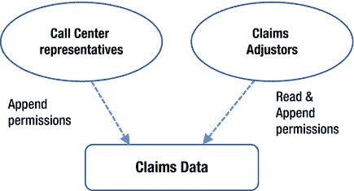
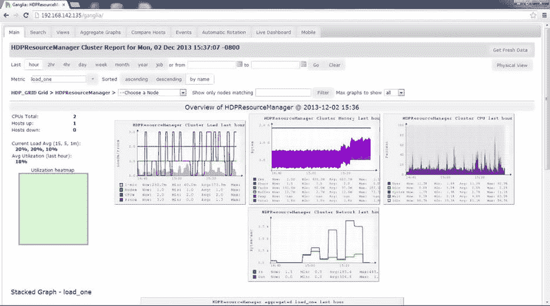
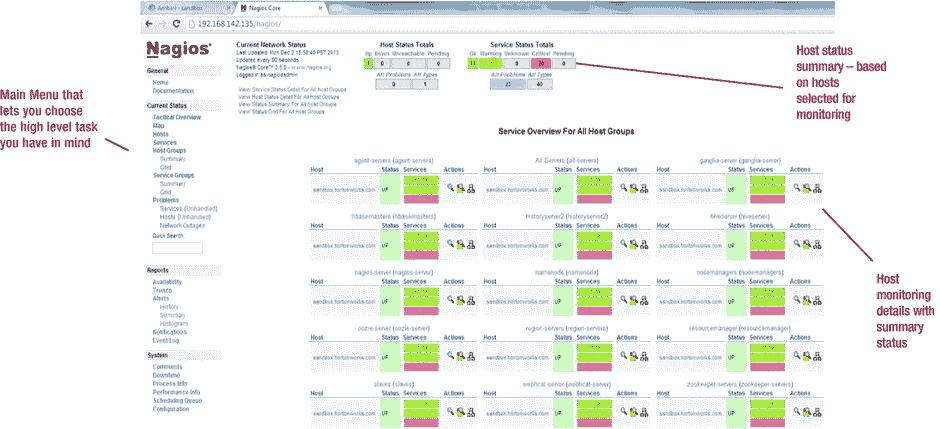

# 三、Hadoop 安全性简介

我们生活在一个非常不安全的世界。从你家前门的钥匙到所有重要的虚拟钥匙，你的密码，所有的东西都需要被保护好。在处理、转换和存储海量数据的大数据世界中，保护您的数据更加重要。

几年前，伦敦警方逮捕了一群年轻人，他们涉嫌欺诈和盗窃价值 3000 万美元的数字资产。他们 20 岁的头目使用宙斯木马，从他的笔记本电脑上窃取银行信息的软件来实现犯罪。由于即使在进行简单的业务交易时，也会涉及大量的信息和无数的系统，因此像这样的事件很常见。在过去，可能只有成千上万的人有可能访问你的数据来对你犯罪；现在，随着互联网的出现，可能有数十亿人！同样，在大数据出现之前，只有直接访问特定系统上的特定数据才是危险的；现在，大数据成倍增加了此类信息的存储位置，因此提供了更多方式来泄露您的隐私，甚至更糟。在新技术驱动、互联网驱动的世界中，一切都被扩大和缩小了——包括犯罪和潜在的犯罪。

想象一下，如果您的公司花费数百万美元安装 Hadoop 集群，使用大数据解决方案收集和分析客户对某个产品类别的消费习惯。由于该解决方案不安全，您的竞争对手获得了该数据，您的该产品类别的销售额下降了 20%。系统是如何允许未经授权访问数据的？没有任何认证机制吗？为什么没有警报？这个场景应该让您思考安全性的重要性，尤其是涉及敏感数据的时候。

尽管 Hadoop 由于其分布式架构而存在固有的安全性问题(正如您在第 2 章中看到的那样)，但所描述的情况极不可能发生在安全管理的 Hadoop 安装上。Hadoop 安装明确定义了用户角色和敏感数据的多级认证(和加密),不会让任何未经授权的访问通过。

这一章是本书其余部分的路线图。它简要概述了确保 Hadoop 安装安全所需的每项技术；后面的章节将会更详细地介绍这些主题。目的是提供安全选项的快速概述，并帮助您根据需要快速找到相关技术。我从认证(使用 Kerberos)开始，接着讨论授权(使用 Hadoop ACLs 和 Apache Sentry)，然后讨论安全管理(审计日志和监控)。最后，本章研究了 Hadoop 的加密和可用选项。我尽可能使用开源软件，因此您可以轻松构建自己的 Hadoop 集群来尝试本书中描述的一些技术。

然而，作为这一切的基础，您需要了解 Hadoop 的开发方式，并对 Hadoop 架构有所了解。有了这些背景信息，您将更好地理解本章后面讨论的认证和授权技术。

从 Hadoop 安全性开始

当谈到 Hadoop 安全性时，您必须考虑 Hadoop 是如何被概念化的。当 Doug Cutting 和 Mike Cafarella 开始开发 Hadoop 时，安全性并不是他们的首要任务。我确信这甚至不是最初设计的一部分。Hadoop 旨在处理公共领域的大量 web 数据，因此安全性不是开发的重点。这就是为什么它缺乏一个安全模型，只为 HDFS 提供基本的认证——这不是很有用，因为假冒另一个用户非常容易。

另一个问题是 Hadoop 不是作为一个具有预定义模块的内聚系统来设计和开发的，而是作为一个模块的拼贴来开发的，这些模块要么对应于各种开源项目，要么对应于由各种供应商开发的一组(专有)扩展，以补充 Hadoop 生态系统中缺乏的功能。

因此，Hadoop 为其集群的运行假设了一个可信环境的隔离(或茧),而没有任何安全违规——这在大多数情况下是缺乏的。目前，Hadoop 正从实验或新兴技术阶段过渡到企业级和公司使用。这些新用户需要一种方法来保护敏感的业务数据。

目前，社区支持的保护 Hadoop 集群的标准方法是使用 Kerberos 安全性。Hadoop 及其主要组件现在完全支持 Kerberos 认证。不过，这只是增加了一层认证。仅仅添加了 Kerberos，仍然没有一致的内置方法来定义用户角色以更好地控制组件，没有方法来保护对 Hadoop 进程(或守护程序)的访问或加密传输中的数据(甚至静态数据)。一个安全的系统需要解决所有这些问题，还需要提供更多的特性和方法来定制满足特定需求的安全性。在整本书中，您将学习如何在 Hadoop 中使用这些技术。现在，让我们先简单看一下解决 Hadoop 认证问题的流行解决方案。

HDFS 认证授权介绍

安全性的第一个也是最重要的考虑是认证。用户在被允许访问 Hadoop 集群之前需要进行认证。由于 Hadoop 不做任何安全认证，Kerberos 通常与 Hadoop 一起使用来提供认证。

当为了安全而实现 Kerberos 时，一个客户端(试图访问 Hadoop 集群)联系 KDC(托管凭证数据库的中央 Kerberos 服务器)并请求访问。如果提供的凭据有效，KDC 将提供请求的访问权限。我们可以将 Kerberos 认证过程分为三个主要步骤:

1.  **TGT 代**，其中认证服务器(AS)授予客户端一张票据授予票(TGT) 作为认证令牌。一个客户端可以对多个 TGS 请求使用同一个 TGT(直到 TGT 过期)。
2.  **TGS 会话票证生成**，客户端使用凭证解密 TGT，然后使用 TGT 从票证授予服务器(TGS) 获取服务票证，该服务器授予服务器对 Hadoop 集群的访问权限。
3.  **服务访问**，客户端使用服务票认证并访问 Hadoop 集群。

第 4 章讨论了 Kerberos 架构的细节，以及如何配置 Kerberos 以用于 Hadoop。此外，您将找到一个分步指南，帮助您设置 Kerberos 为您的 Hadoop 集群提供认证。

授权

实现安全性时，下一步是授权。具体来说，如何在 Hadoop 中实现细粒度的授权和角色？最大的问题是所有信息都存储在文件中，就像在 Linux 主机上一样(毕竟，HDFS 是一个文件系统)。没有表的概念(像关系数据库一样),这使得授权用户对存储的数据进行部分访问变得更加困难。

无论您称之为定义授权细节、设计细粒度授权还是“微调”安全性，这都是一个多步骤的过程。这些步骤是:

1.  分析你的环境，
2.  对数据进行分类以便访问，
3.  确定谁需要访问什么数据，
4.  确定必要的访问级别，以及
5.  实现您设计的安全模型。

但是，您必须记住，Hadoop(及其分布式文件系统)将其所有数据存储在文件中，因此您可以设计的安全性粒度是有限的。像 Unix 或 Linux 一样， Hadoop 有一个非常类似于基于 POSIX(可移植操作系统接口)模型的权限模型——很容易将这些权限与 Linux 权限混淆——因此权限粒度仅限于对文件或目录的读或写权限。你可能会说，“有什么问题？我的 Oracle 或 PostgreSQL 数据库在磁盘上以文件形式存储数据，为什么 Hadoop 不一样？”在传统的数据库安全模型中，所有的访问都是通过明确定义的角色来管理的，并通过一个中央服务器进程来引导。相比之下，数据文件存储在 HDFS，没有这样的中央进程和多个服务，如 Hive 或 HBase 可以直接访问 HDFS 文件。

为了让您详细了解使用基于文件/目录的权限可能实现的授权，[第 5 章](05.html)讨论了相关概念，解释了逻辑过程，并提供了一个详细的实际例子。现在，另一个真实世界的例子，即授权，将帮助您更好地理解这个概念。

设计 Hadoop 授权的真实示例

假设您正在为一家保险公司的索赔管理系统设计安全性，您必须为访问这些数据的所有部门分配角色并设计细粒度的访问。对于这个例子，考虑两个部门的功能需求:呼叫中心和理赔员。

呼叫中心代表接听客户来电，然后在他们满足所有规定条件的情况下提出或记录索赔(例如，由“天灾”造成的损坏不符合索赔条件，因此不能为他们提出索赔)。

索赔调解人查看提交的索赔，并拒绝违反任何监管条件的索赔。然后，该理赔员提交剩余的索赔进行调查，将它们分配给专业理赔员。这些调整人员根据公司规定和他们的具体职能知识评估索赔，以决定最终结果。

自动报告程序挑选最终状态为“已调整”的索赔，并生成适当的信件邮寄给客户，通知他们索赔结果。[图 3-1](#Fig1) 总结了该系统。

[图 3-1](#_Fig1) 。各部门所需的索赔数据和访问权限

如您所见，呼叫中心代表需要追加索赔数据，而调解人需要修改数据。因为 HDFS 没有更新或删除的规定，所以 adjustors 只需要添加一个新的记录或行(针对索赔及其数据),其中包含更新的数据和新的版本号。一个预定的流程将需要生成一份报告来查找调整后的索赔，并将最终索赔结果邮寄给客户。因此，该流程将需要对索赔数据的读取权限。

在 Hadoop 中，请记住，数据存储在文件中。对于本例，数据存储在名为`Claims`的文件中。每日数据临时存储在名为`Claims_today`的文件中，并在每晚追加到`Claims`文件中。呼叫中心人员使用组`ccenter`，而理赔员使用组`claims`，这意味着`Claims`和`Claims_today`上的 HDFS 权限看起来像图 3-2 中的[所示。](#Fig2)

[图 3-2](#_Fig2) 。HDFS 文件权限

第一个文件`Claims_today`，拥有所有者和组`ccuser`的写权限。因此，属于该组的所有代表都可以写入或附加到该文件。

第二个文件`Claims`，拥有所有者和组`claims`的读写权限。因此，所有的索赔调整人员都可以读取`Claims`数据，并为他们已经完成工作并提供最终结果的索赔添加新行。另外，请注意，您需要在组`claims`中创建一个名为`Reports`的用户，用于访问报告数据。

 **注意**示例中讨论的权限是 HDFS 权限，而不是操作系统权限。Hadoop 遵循一个独立的权限模型，该模型看起来与 Linux 相同，但是前面的权限存在于 HDFS 中，而不是 Linux 中。

那么，这些权限满足这个系统的所有功能需求吗？你可以很容易地验证他们这样做。当然，用户`Reports`拥有他不需要的写权限；但是除此之外，所有的功能需求都得到了满足。

我们将在第 5 章中用一个更详细的例子来讨论这个话题。正如您所观察到的，您分配的权限仅限于完整的数据文件。然而，在现实世界中，您可能需要足够细粒度的权限来访问部分数据文件。你是怎么做到的？下一节将预览如何操作。

Hadoop 的细粒度授权

有时，数据的必要权限与组织的现有组结构不匹配。例如，一家银行可能需要一个备用主管拥有与主管相同的权限集，以防主管休假或生病。因为备份监督者可能只需要监督者权限的子集，所以为他或她设计一个新的组是不实际的。另外，考虑另一种情况，公司帐户被转移到不同的部门，负责迁移的组需要临时访问权限。

HDFS 的新版本支持 ACL(访问控制列表)功能，这在这种情况下将非常有用。使用 ACL，您可以根据需要为特定用户或组指定读/写权限。在银行示例中，如果备份管理员需要对特定“个人帐户”文件的写权限，则可以使用 HDFS ACL 功能来提供必要的写权限，而无需对文件权限进行任何其他更改。对于迁移场景，可以使用 HDFS ACL 为执行迁移的组分配读/写权限。如果您熟悉 POSIX ACLs，HDFS ACL 的工作方式完全相同。[第 5 章](05.html)在“HDFS 的访问控制列表”一节中再次详细讨论了 Hadoop ACLs。

最后，如何只为数据文件的一部分或数据的某一部分配置权限？也许用户只需要访问非敏感信息。可以进一步配置粒度(用于授权)的唯一方法是使用 NoSQL 数据库(如 Hive)和专用软件(如 Apache Sentry)。您可以将部分文件数据定义为 Hive 中的*表*，然后使用 Sentry 来配置权限。Sentry 与*用户*和用户组(称为*组*)一起工作，并让您定义*规则* (对表的可能操作，如读或写)和*角色*(一组规则)。一个用户或组可以分配一个或多个角色。[第 5 章](05.html)提供了一个使用 Hive 和 Sentry 的真实示例，解释了如何为 Hadoop 定义微调授权。第 5 章的[中的也有 Apache Sentry 的架构细节。](05.html)

安全管理 HDFS

第 4 章和[第 5 章](05.html)将带你了解各种认证和授权技术，这些技术有助于保护你的系统，但不是一个完整的解决方案。如果授权用户访问他们未被授权使用的资源，或者未经授权的用户使用不可预见的方法访问 Hadoop 集群上的资源(阅读:黑客攻击)，该怎么办？安全管理通过监控或*审计*所有对集群的访问来帮助您处理这些情况。如果您不能阻止这种类型的访问，您至少需要知道它发生了！Hadoop 为其所有进程提供了广泛的日志记录(也称为*守护进程*),一些开源工具可以帮助监控集群。([第 6 章](06.html)和[第 7 章](07.html)详细讨论了审计日志记录和监控。)

由于 HDFS 的设计和构建方式，安全管理 HDFS 面临诸多挑战。监控可以提醒您对任何 Hadoop 集群资源的未授权访问，从而有助于提高安全性。然后，您可以根据这些警报的严重性设计针对恶意攻击的对策。虽然 Hadoop 为这种监控提供了指标，但是使用起来很麻烦。当您使用 Nagios 或 Ganglia 等专用软件时，监控会容易得多。此外，Cloudera 和 Hortonworks 的标准 Hadoop 发行版提供了自己的监控模块。最后，您可以捕获和监控 MapReduce 计数器。

审计日志通过记录流向 Hadoop 集群的所有访问来补充安全性。您可以决定日志记录的级别(如仅记录错误，或记录错误和警告等。)，而 Log4j 等模块提供的高级日志管理为日志记录过程提供了很多控制和灵活性。[第 6 章](06.html)提供了 Hadoop 可用的审计日志记录的详细概述(带示例)。作为预览，下一节将简要概述 Hadoop 日志记录。

使用 Hadoop 日志实现安全性

当安全问题发生时，拥有大量可用的活动日志可以帮助您调查问题。因此，在违规发生之前，您应该启用审计日志记录来跟踪对系统的所有访问。你总是可以过滤掉不需要的信息。即使您已经启用了认证和授权，审计集群活动仍然有好处。毕竟，即使是授权用户也可能执行他们无权执行的任务；例如，具有更新权限的用户可以在没有适当批准的情况下更新条目。但是，您必须记住，Hadoop 日志是原始输出。因此，为了使它们对安全管理员有用，需要接收和处理这些日志的工具(注意，一些安装使用 Hadoop 本身来分析审计日志，因此您可以使用 Hadoop 来保护 Hadoop！).

仅仅捕获审计数据是不够的。您还需要捕获 Hadoop 守护进程数据。受联邦监管法律约束的企业，如健康信息携带和责任法案(HIPAA) 和萨班斯-奥克斯利法案(SOX) 就是这种需求的例子。例如，美国法律要求 HIPAA 涵盖的所有企业防止未经授权访问“受保护的健康信息”(患者姓名、地址以及与患者健康和支付记录相关的所有信息)或审计该信息的应用程序。必须遵守 SOX(2002 年美国联邦法律，要求任何美国上市公司的最高管理层单独证明其公司财务信息的准确性)的企业必须审核对应用程序中任何数据对象(如表)的所有访问。他们还必须监控谁提交、管理或查看了可以更改被审核应用程序中任何数据的作业。对于这样的业务案例，您需要捕捉:

*   HDFS 审计日志(记录 Hadoop 内的所有 HDFS 访问活动)，
*   MapReduce 审核日志(记录所有提交的作业活动)，以及
*   NameNode、DataNode、JobTracker 和 TaskTracker 的 Hadoop 守护进程日志文件。

Log4j API 是 Hadoop 日志记录的核心，无论是审计日志还是 Hadoop 守护进程日志。Log4j 模块提供了广泛的日志记录功能，并包含几个日志记录级别，您可以使用这些级别来按类别限制消息的输出，以及按类别限制(或抑制)消息。例如，如果 Log4j 日志记录级别被定义为 NameNode 日志记录的信息，则对于 NameNode 接收的任何文件访问请求，事件将被写入 NameNode 日志(即，所有信息性消息将被写入 NameNode 日志文件)。

您可以在 Hadoop 守护进程的 URL 上轻松地更改其日志记录级别。例如，`http://jobtracker-host:50030/logLevel`将在此守护程序运行时更改日志记录级别，但当它重新启动时将被重置。如果遇到问题，可以临时更改相应守护进程的日志记录级别，以便于调试。问题解决后，您可以重置日志记录级别。对于守护进程日志级别的永久更改，您需要在 Log4j 配置文件(`log4j.properties`)中更改相应的属性。

Log4j 架构使用一个*日志记录器*(一个用于日志事件的命名通道，如 NameNode、JobTracker 等。)、一个*附加器*(日志事件被转发到该附加器，并负责将其写入控制台或文件)和一个*布局*(日志事件的格式化程序)。日志记录级别(致命、错误、警告、信息、调试和跟踪)以降序显示事件的严重性。最低日志级别用作过滤器；接受日志级别大于或等于指定级别的日志事件，而忽略不太严重的事件。

[图 3-3](#Fig3) 展示了级别过滤的工作原理。列显示日志记录级别，而行显示与适当的记录器配置相关联的级别。交集标识事件是被允许通过进一步处理(是)还是被丢弃(否)。使用[图 3-3](#Fig3) 您可以根据配置的日志记录级别，轻松确定日志中将包含的事件类别。例如，如果 NameNode 的日志记录级别设置为 INFO，则属于 INFO、WARN、ERROR 和 FATAL 类别的所有消息都将被写入 NameNode 日志文件。通过查看列信息并观察标记为 YES 的事件级别，您可以很容易地识别出这一点。“跟踪”和“调试”级别被标记为“否”,将被过滤掉。如果 JobTracker 的日志记录级别设置为致命，则只记录致命错误，这从“致命”列中的值可以明显看出。

[图 3-3](#_Fig3) 。Log4j 基于事件级别的日志记录级别和包含内容

第 6 章将全面介绍 Hadoop 日志(以及它在调查安全问题中的用途)。在下一节中，您将了解监控的主要特性。

安全监控

当您想到监控时，您可能会想到需要进行故障排除的可能的性能问题，或者，如果系统资源(如 CPU、内存、磁盘空间)达到阈值，可能会生成警报。但是，您也可以出于安全目的使用监控。例如，如果用户试图访问群集元数据或读取/写入包含敏感数据的文件，或者某个作业试图访问不应该访问的数据，您可以生成警报。更重要的是，您可以监控许多指标来获得有用的安全信息。

监控像 Hadoop 这样的分布式系统更具挑战性，因为监控软件必须监控单个主机，然后在整个系统的上下文中整合数据。例如，DataNode 上的 CPU 消耗没有 NameNode 上的 CPU 消耗重要。那么，系统将如何处理 CPU 消耗警报，或者能够为分布式系统中具有不同角色的主机识别单独的阈值级别？[第 7 章](07.html)详细回答了这些问题，但现在让我们来看看可以用于安全目的的 Hadoop 指标:

*   NameNode 上的活动统计信息
*   DataNode 的活动统计信息
*   服务的详细 RPC 信息
*   针对系统资源突然变化的健康监控

贸易工具

领先的监控工具是 Ganglia ( `http://ganglia.sourceforge.net`)和 Nagios ( `www.nagios.org`)。这些流行的开源工具互为补充，各有千秋。Ganglia 侧重于收集指标并在一段时间内跟踪它们，而 Nagios 更侧重于作为一种警报机制。因为收集指标和发出警报都是监控的重要方面，所以它们最好结合使用。Ganglia 和 Nagios 都在集群的所有主机上运行代理，并收集信息。

神经中枢

Ganglia 的概念来自加州大学伯克利分校，是一个开源监控项目，旨在用于大型分布式系统。作为集群一部分的每个主机都运行一个名为 *gmond* 的守护进程，该进程收集并发送指标(如 CPU 使用率、内存使用率等。)从操作系统到中央主机。收到所有指标后，中央主机可以显示、汇总或总结这些指标以备将来使用。

Ganglia 旨在与其他应用程序轻松集成，并收集有关其操作的统计信息。例如，Ganglia 可以轻松地从 Hadoop metrics 接收输出数据，并有效地使用它。gmond(Ganglia 在每台主机上都运行它)占用空间很小，因此可以很容易地在集群中的每台机器上运行，而不会影响用户性能。

Ganglia 的 web 界面([图 3-4](#Fig4) )向您展示了集群使用的硬件、最近一个小时的集群负载、CPU 和内存资源消耗等等。您可以根据需要查看过去一小时、一天、一周或一个月的使用情况摘要。此外，您可以根据需要获得这些资源使用的详细信息。[第 7 章](07.html)将更详细地讨论神经节。

[图 3-4](#_Fig4) 。Ganglia 监控系统:集群概述

纳吉奥斯

Nagios 提供了一个非常好的警报机制，可以使用 Ganglia 收集的指标。Nagios 的早期版本从其目标主机轮询信息，但目前它使用在主机(集群的一部分)上运行代理的插件。Nagios 有一个优秀的内置通知系统，可以用于通过页面或电子邮件发送某些事件的警报(例如，NameNode 故障或磁盘已满)。Nagios 可以监控应用程序、服务、服务器和网络基础设施。[图 3-5](#Fig5) 显示了 Nagios web 界面，它可以方便地管理状态(被监控的资源)、警报(在资源上定义)、通知、历史等等。

[图 3-5](#_Fig5) 。用于监控的 Nagios web 界面

Nagios 的真正优势在于数百个用户开发的插件可以免费使用。插件在所有类别中都可用。例如,“系统度量”类别包含子类别“用户”,其中包含诸如“显示用户”之类的插件，这些插件可以在某些用户登录或未登录时向您发出警报。使用这些插件可以减少宝贵的定制时间，这是所有开源(和非开源)软件的主要问题。第 7 章讨论了设置 Nagios 的细节。

加密:Hadoop 的相关性和实现

作为一个分布式系统，Hadoop 将数据分布在大量主机上，并存储在本地。这些主机之间有大量的数据通信；因此，数据在传输过程中以及在静止和存储在本地存储时都容易受到攻击。Hadoop 最初是一个数据存储库，用于收集 web 使用数据以及其他形式的不敏感的大量数据。这就是为什么 Hadoop 没有任何内置的数据加密功能。

如今，情况正在发生变化，Hadoop 越来越多地被用于在企业中存储敏感的仓库数据。这就产生了对传输中和静态数据进行加密的需求。现在有许多替代方案可以帮助您加密数据。

传输中的数据加密

Hadoop 中的节间通信使用 RPC、TCP/IP、HTTP 等协议。RPC 通信可以使用简单的 Hadoop 配置选项进行加密，并用于 NameNode、JobTracker、DataNodes 和 Hadoop 客户端之间的通信。这使得客户端和 datanode(TCP/IP)之间的文件数据的实际读/写以及 HTTP 通信(web 控制台、NameNode/辅助 NameNode 之间的通信以及 MapReduce shuffle 数据)未加密。

加密 TCP/IP 或 HTTP 通信是可能的，但这需要使用 Kerberos 或 SASL 框架。Hadoop 的当前版本通过在配置文件`core-site.xml`和`hdfs-site.xml`中设置显式值来允许网络加密(结合 Kerberos)。[第 4 章](04.html)将重温这个详细的设置，并详细讨论网络加密。

静态数据加密

使用 Hadoop 实现静态加密有许多选择，但它们由不同的供应商提供，并且依赖于他们的发行版来实现加密。最值得注意的是英特尔项目 Rhino(致力于 Apache 软件基金会和开源)和 AWS(亚马逊网络服务)产品，它们为存储在磁盘上的数据提供加密。

因为 Hadoop 通常处理大量数据，加密/解密需要时间，所以所用框架执行加密/解密的速度要足够快，以免影响性能，这一点很重要。英特尔解决方案(即将通过 Cloudera 发行版提供)声称能够以极高的速度执行这些操作——前提是英特尔 CPU 与英特尔磁盘驱动器和所有其他相关硬件配合使用。让我们快速了解一下亚马逊加密“静态”选项的一些细节。

AWS 对存储在 HDFS 中的数据进行加密，并且还支持由其他组件(如 Hive 或 HBase)对加密数据进行操作。这种加密对用户可以是透明的(如果必要的密码存储在配置文件中),或者可以在允许访问敏感数据之前提示用户输入密码，可以逐个文件地应用，并且可以与外部密钥管理应用程序结合使用。这种加密可以使用对称密钥和非对称密钥。要使用这种加密，敏感文件在存储到 HDFS 之前必须使用对称或非对称密钥进行加密。

当加密文件存储在 HDFS 时，它仍然是加密的。根据处理需要对其进行解密，并在移回存储之前重新加密。分析结果也被加密，包括中间结果。数据和结果不会以未加密的形式存储或传输。[图 3-6](#Fig6) 提供了该过程的概述。存储在 HDFS 的数据使用对称密钥加密，而 MapReduce 作业使用对称密钥(带证书)传输加密数据。

[图 3-6](#_Fig6) 。英特尔 Hadoop 发行版(现为 Project Rhino)提供的静态加密的详细信息

第 8 章将更详细地介绍加密。它概述了加密概念和协议，然后简要讨论了实现加密的两个选项:使用英特尔的发行版(现在作为 Project Rhino 提供)和使用 AWS 提供透明加密。

摘要

有了路线图，找到你想去的地方并计划如何到达那里就容易多了。本章是您设计和实现 Hadoop 安全性的技术路线图。在概述了 Hadoop 架构之后，您研究了使用 Kerberos 提供安全访问的认证。然后，您学习了如何使用授权来指定访问级别，以及您需要遵循分析数据的多步骤过程，并需要定义有效的授权策略。

为了通过认证和授权来补充您的安全性，您需要持续监控未经授权的访问或不可预见的恶意攻击；Ganglia 或 Nagios 之类的工具会有所帮助。您还了解了使用 Log4j 日志记录系统和 Hadoop 守护进程日志以及审计日志记录对 Hadoop 守护进程的所有访问的重要性。

最后，您了解了传输中(以及静态)的数据加密，以及它作为附加安全级别的重要性，因为这是阻止黑客绕过认证和授权层进行未授权访问的唯一方法。要为 Hadoop 实现加密，可以使用 AWS(亚马逊网络服务)或英特尔的 Project Rhino 的解决方案。

在本书的其余部分，你将遵循这个路线图，深入探讨本章中出现的每个主题。我们将在第 4 章中从认证开始。