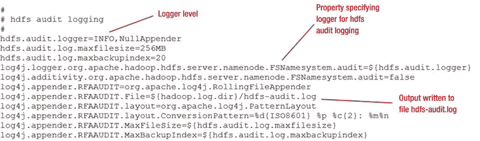
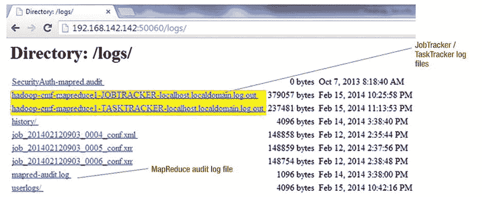
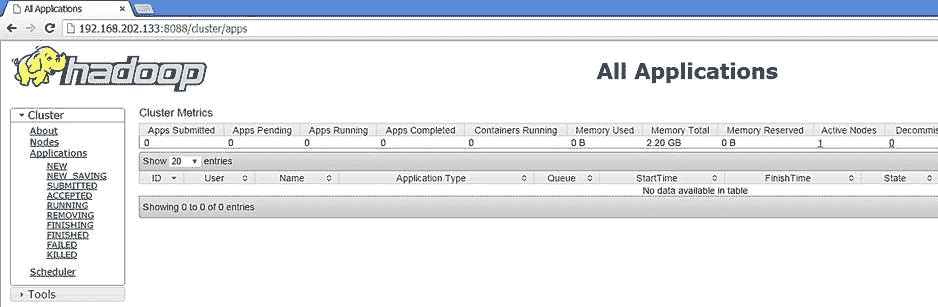
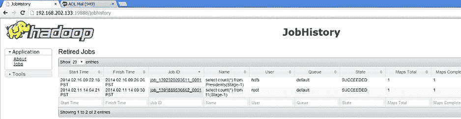

# 六、Hadoop 日志：关联和解释

有一天，一位非常恼火的商业智能主管(在一个客户站点)冲进我的办公室，抱怨其中一个承包商从生产服务器上删除了一些分类账记录。她收到了一份每日摘要审计日志报告，显示有 300 个分类账记录(财务交易条目)被删除！首先，有问题的承包商不应该接触到它们。所以我进行了调查，结果发现客户使用的 ERP(企业资源规划)软件有一个缺陷，它通过“公共”角色提供访问。如果我没有启用审计日志记录，我就不会发现这个错误，这证明了审计日志记录从安全角度来看是多么重要。

HDFS 审计日志记录的目的是记录 Hadoop 内的所有 HDFS 访问活动。MapReduce 审核日志包含所有已提交作业的条目。此外，Hadoop 守护进程日志文件包含启动消息、内部诊断信息、错误、信息或警告消息、配置日志等。您可以过滤以后不需要的信息，但记录所有访问(包括授权访问)会很有帮助。即使授权用户也可以执行未授权的任务。例如，一名警察可能在没有适当批准的情况下对其女友的罚单记录进行了未经授权的更新。此外，对于被审核的应用程序或任何符合 SOX 的应用程序，必须审核对应用程序中数据对象(例如，表)的所有访问，以及审核更改被审核的应用程序中任何数据的所有作业活动。

在本章中，我将讨论如何为 Hadoop 启用审计，以及如何捕获审计数据。Log4j 是 Hadoop 日志记录的核心，无论是审计日志还是 Hadoop 守护进程日志。我将从对 Log4j API 以及如何使用它进行审计日志记录的高级讨论开始，然后讨论 Log4j 日志记录级别及其目的。在概述了守护进程日志及其捕获的信息之后，您将了解如何将审计与 Hadoop 守护进程日志关联起来，以有效地实现安全性。

使用 Log4j API

Apache Log4j 是一个基于 Java 的实用程序或框架，由 Ceki Gülcü创建，后来成为 Apache 软件基金会的一个项目。日志记录是任何开发周期的重要组成部分，在没有调试器的情况下(通常是这样)，它是排除应用程序代码故障的唯一工具。使用正确的日志记录类型非常重要——可靠、快速、灵活的日志记录类型。Log4j 满足这些要求:

*   **可靠性** 是对相关错误或状态信息显示无任何异常的期望。自定义日志记录例程容易出现错误，因为一些消息由于逻辑错误而无法显示。Log4j 没有这个问题。这个日志系统经过了很好的测试，并且已经流行了很长时间。Log4j 当然可以保证日志输出逻辑的可靠性。
*   **速度** 指所使用的测井程序的响应时间。使用 Log4j，`Logger`类被实例化(创建一个实例),而不是与接口交互，从而产生超快的响应。决定记录什么(基于日志记录级别)只涉及基于记录器层次结构的决定，这很快。由于使用了使用布局和附录的预格式化，日志消息的输出很快；通常，实际的日志记录大约需要 100 到 300 微秒。使用 simple Layout(Log4j 最简单的布局选项，在“布局”一节中有解释)，Log4j 可以像 print 语句一样快速地记录日志(它只是将输入文本打印到控制台或文件中)！
*   **灵活性** 是指对日志记录系统进行更改的容易程度(无需修改使用它的应用程序二进制文件)以及使用修改后的日志记录的应用程序的易用性。例如，使用 Log4j，您可以使用多个日志目的地(也称为 Appenders)将输出定向到两个目的地，比如控制台和日志文件。只需修改 log4j.properties 配置文件来进行这一更改；不需要修改代码。

当然，包含状态或错误消息的最简单的方法是将它们直接插入到代码中。那么，与在应用程序代码中插入注释或使用自定义日志模块相比，使用 Log4j 进行日志记录有什么优势呢？嗯，插入注释和删除注释是一个乏味且耗时的过程,依赖于程序员的专业知识——他们可能会在测试后忘记删除注释。获得正确的评论百分比(有时太多，有时太少)是困难的，并且有选择地显示那些评论是不可能的。此外，对注释的任何更改都涉及到代码的重新编译。最后，一个定制的日志模块可能会有错误，或者可能没有 Log4j API 那样丰富的功能。

通过配置文件，Log4j 允许您在运行时设置日志行为，而无需修改应用程序二进制文件。日志记录的一个主要问题是它对性能的影响。任何日志记录本质上都降低了应用程序的速度，但是对于 Log4j，对性能的影响微乎其微。例如，对最新发布的 Log4j 2(版本 2)的独立测试显示，它每秒可以输出高达 1800 万条消息(完整结果请参见 Christian Grobmeier，“Log4j”:性能接近疯狂，”`www.javacodegeeks.com/2013/07/Log4j-2-performance-close-to-insane.html`)。对于 Log4j，影响被限制在纳秒到微秒的范围内，这取决于您的 Log4j 配置、日志记录级别和 Appenders。

Log4j 日志框架的主要组件是记录器、附加器、布局和过滤器。因此你可以更好地理解它们是如何一起工作的，图 6-1 说明了它们在框架中的位置。


[图 6-1](#_Fig1) 。Log4j 框架及其主要组件

接下来的部分将详细讨论这些组件，并提供关于它们的作用以及它们在框架中的确切角色的信息。

记录器

*记录器* 是一个命名实体，它与一个配置(LoggerConfig)相关联，随后与一个日志记录级别相关联。为了让 Log4j 日志记录正常工作，您需要一个定义了相关配置的根日志记录器。根记录器定义默认配置(附加器、布局等。).那么，这些日志记录级别是什么，它们是如何相互关联的呢？

Log4j 的日志记录级别

Log4j API 有七个日志记录级别。它们按照严重性顺序记录信息，每个级别都包含所有更高的级别。例如，日志级别`INFO`包括信息性消息、警告(包括更高级别的`WARN`)、非致命错误(包括更高级别的`ERROR`)和致命错误(包括更高级别的`FATAL`)。类似地，日志级别`WARN`包括警告、非致命错误和致命错误。图 6-2 总结了这些内含物。


[图 6-2](#_Fig2) 。Log4j 测井级别和内含物

七个日志级别如下:

*   **ALL** :这是可能的最低日志级别，它记录包括更高级别的所有消息(例如，致命错误、非致命错误、信息性消息等。)
*   **TRACE** :顾名思义，这个级别比调试级别记录更细粒度的信息事件。
*   **DEBUG** :记录对调试应用程序最有用的细粒度信息事件。
*   **INFO** :记录信息性消息，以更粗粒度的级别突出应用程序的进度。
*   **警告**:记录潜在的有害情况。
*   **ERROR** :记录可能仍然允许应用程序继续运行的错误事件。
*   **FATAL** :记录可能导致应用程序中止的非常严重的错误事件。

请注意，启用的`TRACE`和`DEBUG`级别可被视为生产系统中的严重安全缺陷，并可能被漏洞扫描器报告。因此，请仅在解决问题时使用这些日志级别，并确保在解决问题后立即禁用它们。

记录器继承

记录器名称区分大小写并分层命名。如果一个记录器的名字后面跟一个点是其后代记录器名字的前缀，那么这个记录器就是另一个记录器的*祖先*。如果一个日志记录器和它的后代日志记录器之间没有祖先，那么这个日志记录器就是子日志记录器的*父代*。举个例子，那个名叫 L1 的伐木工。L2 是名为 L1.L2.L3 的记录器的父亲，L1 也是 L1 的父亲。L2 和 L1.L2.L3 的祖先(认为是祖父母)。*根*记录器位于记录器层次结构的顶端。

可以为记录器分配默认的日志级别。如果一个级别没有分配给记录器，那么它将从其最近的祖先那里继承一个已分配的级别。给定记录器 L1 的继承级别等于记录器层次结构中的第一个非空级别，从 L1 开始，在层次结构中向上朝着根记录器前进。为了确保所有记录器都继承一个级别，根记录器总是有一个指定的级别。[图 6-3](#Fig3) 包含了一个级别继承的例子。


[图 6-3](#_Fig3) 。记录器级别继承

如你所见，伐木工 L1 和 L1。L2.L3 已经分配了日志记录级别。伐木工 L1。没有为 L2 分配日志记录级别，它从其母公司 L1 继承了 L1 日志记录级别。如果日志请求的级别高于或等于其记录器的级别，则称该日志请求已启用。否则，请求将被禁用。

大多数 Hadoop 发行版都在`/etc/Hadoop/conf`或`$HADOOP_INSTALL/hadoop/conf`目录下的`log4j.properties`中定义了五个标准记录器([图 6-4](#Fig4) )。为了使 Log4j 日志记录正常工作，必须定义一个*根*日志记录器(带有相关配置)。*安全*记录器记录安全审计信息。*审计*记录器记录 HDFS 和 MapReduce 审计信息，而*作业摘要*记录器记录关于 MapReduce 作业的摘要信息。一些发行版还为 Hadoop metrics、JobTracker 或 TaskTracker 定义了记录器。


[图 6-4](#_Fig4) 。记录器和默认日志级别

[图 6-5](#Fig5) 是来自`log4j.properties`的 HDFS 审计记录器的示例条目。



[图 6-5](#_Fig5) 。HDFS 审计记录者

`maxfilesize`设置是临界大小(此处为 256MB ),在此之后，日志文件将“滚动”并创建一个新的日志文件；`maxbackupindex`(本例中为 20)是要创建的日志文件的备份副本数量。在此示例中，当日志文件滚动 21 次时，最旧的文件将被擦除。其他记录器的属性在`log4j.properties`文件中以类似的方式指定。

附加器

对于 Log4j 框架，输出目的地被称为*附加器*。目前，附加器存在于控制台、文件、GUI 组件、远程套接字服务器、JMS、NT 事件记录器和远程 UNIX 系统日志守护进程中。换句话说，您可以将其中任何一个定义为日志记录的输出目的地。从 Log4j Version 2 开始，您还可以异步记录日志，将控制权从日志记录器传递回应用程序，同时 I/O 操作由单独的线程或进程在后台执行。异步日志记录可以提高应用程序的性能。

追加加法

一个记录器可以连接多个附加器。给定记录器的每个启用的日志记录请求将被转发给该记录器中的所有附加器以及层次结构中更高的附加器。这是一个默认的行为，称为*追加器累加性*，可以通过在`log4j.properties`配置文件中将累加性标志设置为`false`来轻松禁用。

考虑图 6-6 中[的例子。如果将控制台 Appender 添加到根日志记录器，那么所有启用的日志记录请求都将显示在控制台上。此外，如果一个文件附加器被添加到记录器 L1，L1。L2 和 L1。L2。L3，然后记录 L1 L1 的请求。L2 和 L1。L2.L3 将被写入适当的文件并显示在控制台上。现在假设您将 Logger L4 的加法标志设置为`false`。这有效地断开了 L4 及其子节点与日志输出向上传播的连接。因为 Logger L4 的父。L5(在本例中是 L4)将其可加性标志设置为`false`，L4。L5 的输出将只指向 L4 中的 Appenders。L5(在这种情况下没有)及其祖先直到并包括 L4 ( `File4`)，但是不会传播到 L1、L2 或 L3。](#Fig6)[图 6-6](#Fig6) 列出了结果。


[图 6-6](#_Fig6) 。Log4j 框架的附加器可加性

主要 Hadoop 发行版经常使用的附加器有:

*   **控制台追加器**:在控制台上显示日志信息
*   **文件附加器**:将日志信息写入一个特定的文件，该文件在`log4j.properties`中定义
*   **滚动文件追加器**:将日志消息写入文件，并根据大小滚动
*   **每日滚动文件追加器**:将日志消息写入文件并每日滚动

使用与 HDFS 审计记录器相同的条目([图 6-5](#Fig5) )，考虑[图 6-7](#Fig7) 中的附录部分。


[图 6-7](#_Fig7) 。HDFS 审计记录器的滚动文件附加器

在[图 6-7](#Fig7) 中，我将`RollingFileAppender`与 HDFS 审计记录器一起使用。输出按照布局(`PatternLayout`)和定义的转换模式格式化(我稍后将讨论布局和转换模式)，如下所示:

```scala
2014-02-09 16:00:00,683 INFO FSNamesystem.audit: allowed=true ugi=hdfs (auth:SIMPLE) ip=/127.0.0.1 cmd=getfileinfo src=/user/sqoop2/.Trash/Current dst=null perm=null

```

 **注意** HDFS 审计输出可能会产生一个大文件。因此，每天或按大小将它回滚到一个新文件是一个好主意。

布局

*布局* 是日志条目的输出格式。它可以与一个 Appender 相关联，并且可以在通过 Appender 传递请求之前，根据您的规范格式化日志记录请求。

以一种易于阅读和解释的方式组织和呈现信息是很重要的。通常有必要将日志信息传递给远程机器上运行的另一个错误处理程序。因此，决定记录信息的结构很重要。这就是`Layout`对象所提供的。

布局使用转换模式来格式化和输出日志消息。*转换模式*由格式修饰符和转换字符组成。例如，修饰符`t`输出生成日志事件的线程的名称，转换字符`%5p`使用五个字符显示(或写入)日志级别，在左边填充空格。因此，日志级别`INFO`显示(或写入)为`"INFO"`。

可以在`log4j.properties`文件中为一个追加器指定一个布局。例如，我在图 6-8 的[中指定了 PatternLayout 作为一个布局(用于我们的 HDFS 审计日志附录)。](#Fig8)


[图 6-8](#_Fig8) 。HDFS 审计记录器的模式布局

图 6-8 中[的转换图形`%d{ISO8601} %p %c{2}: %m%n`输出为:](#Fig8)

```scala
2014-01-27 20:34:55,508 INFO FSNamesystem.audit: allowed=true ugi=mapred (auth:SIMPLE) ip=/127.0.0.1 cmd=setPermission src=/tmp/mapred/system/jobtracker.info dst=null perm=mapred:supergroup:rw-------

```

第一个字段是 ISO8601 (YYYY-MM-DD HH:mm:ss，SSS)格式的日期/时间。第二个字段是日志语句的级别或优先级。第三个是类别，第四个字段是消息本身，第五个字段是行分隔符(newline 或`/n`)。

Apache Log4j 提供了几个`Layout`对象:

*   **简单布局** : `org.apache.log4j.SimpleLayout`为日志消息提供了非常基本的结构。它只包括日志信息的级别和日志消息本身。如果使用简单布局而不是 PatternLayout:

    ```scala
    INFO allowed=true ugi=hdfs (auth:SIMPLE) ip=/127.0.0.1 cmd=getfileinfo src=/user/sqoop2/.Trash/Current dst=null perm=null

    ```

    ，这就是 HDFS 审计记录器的日志消息(来自[图 6-8](#Fig8) )的输出方式
*   **Thread-Time-Category-Context Layout** **(TTCCLayout)**: This Layout outputs the invoking thread, time (in milliseconds since application started), the category or Logger used to create this logging event, and nested diagnostic context. All these properties are optional and if they are all disabled, the Layout will still write out the logging level and the message itself, just like Simple Layout. If you specify the following options in `log4j.properties`:

    ```scala
    #configuring the Appender CONSOLE
    log4j.appender.CONSOLE=org.apache.log4j.ConsoleAppender
    log4j.appender.CONSOLE.layout=org.apache.log4j.TTCCLayout
    #configuring the Layout TTCCLayout
    log4j.appender.CONSOLE.layout.ThreadPrinting=false
    log4j.appender.CONSOLE.layout.ContextPrinting=false
    log4j.appender.CONSOLE.layout.CategoryPrefixing=false
    log4j.appender.CONSOLE.layout.DateFormat= ISO8601

    ```

    您将获得以下输出:

    ```scala
    INFO allowed=true ugi=hdfs (auth:SIMPLE) ip=/127.0.0.1 cmd=getfileinfo src=/user/sqoop2/.Trash/Current dst=null perm=null

    ```

*   **DateLayout** :顾名思义，这种布局提供了 NULL(不显示日期/时间)、RELATIVE(显示应用程序启动后经过的时间)、DATE (dd MMM YYYY HH:mm:ss、SSS 模式；最终 SSS 是应用程序启动后经过的时间)、绝对时间(HH:mm:ss，SSS 模式)和 ISO8601 (yyyy-MM-dd HH:mm:ss，SSS 模式)。
*   **HTMLLayout** :您的应用程序可能需要在一个美观的 HTML 格式文件中呈现日志信息。`org.apache.log4j.HTMLLayout`是相关对象。使用 HTML 格式的日志文件的一个很大的优点是，它可以作为网页发布，以便远程查看。
*   **XMLLayout** :为了以可移植(跨多个应用程序模块)的格式呈现日志信息，Log4j 提供了`org.apache.log4j.xml.XMLLayout`对象。需要注意的是，最终输出是*而不是*一个格式良好的 XML 文件。这个`Layout`对象产生大量的`<log4j:event>`元素形式的日志信息。
*   **PatternLayout** :您可以使用这种布局，使用一致的模式来“格式化”或输出日志消息，以便于外部实体使用它们。相关的布局对象是`org.apache.log4j.PatternLayout` *。*格式由*格式修饰符*指定(如`m`写日志信息，`p`写日志级别信息)，转换模式如`%d{ISO8601} %p %c{2}: %m%n`。显示(或写入)信息由*转换字符*指定。例如，`%10c`指示记录器名称必须是 10 个字符，如果它更短，就在左边添加空格填充。指定`%-10c`表示应该向右添加空格填充。有关 PatternLayout 类和转换字符的更多详细信息，请参见:`http://logging.apache.org/log4j/1.2/apidocs/org/apache/log4j/PatternLayout.html`。

过滤

过滤器评估日志事件，并允许或不允许它们被发布。有几种类型的过滤器，它们根据事件数量(BurstFilter)等标准筛选出事件；匹配正则表达式(RegexFilter)的日志事件消息；或者事件 ID、类型和消息(StructuredDataFilter)。过滤器的类型决定了您需要指定它的位置:

*   上下文范围的过滤器作为配置(LoggerConfig)的一部分进行配置，并在将事件传递给记录器进行进一步处理之前对其进行评估。
*   记录器过滤器是为记录器配置的，并在记录器的上下文范围过滤器和日志级别之后进行评估。
*   Appender 过滤器是为 Appender 配置的，它确定特定的 Appender 是否应该发布事件。
*   Appender 引用过滤器是为记录器配置的，它确定记录器是否应该将事件路由到 Appender。

请注意，所有这些过滤器都需要在您的`log4j.properties`文件中的适当部分(针对记录器或附加器)指定。例如，[图 6-9](#Fig9) 显示了来自`log4j.properties`的一个部分，它定义了一个 RegexFilter 来捕获仅用于登录根的 HDFS 审计事件:


[图 6-9](#_Fig9) 。HDFS 审核记录器的 RegexFilter

同样，您可以使用其他类型的过滤器来防止捕获不需要的事件，这将有助于保持较小的审计日志大小，并使关注特定问题变得更加容易。

查看 Hadoop 审计日志和守护程序日志

正如您已经了解到的，您可以使用 Log4j 组件为许多目的生成日志输出(例如，调试、操作统计、审计)。Log4j 输出的日志数据依次由系统守护进程生成，特定类型的数据可能存在于多个位置。如何连接和分析来自不同来源的数据，以获得系统操作、历史和状态的总体视图？关键是 Hadoop 的审计日志。本节将讨论哪些守护进程生成哪些数据，审计捕获哪些类型的数据，以及如何使用 Hadoop 审计日志来提出安全建议。

为了获得完整的系统图片，您需要了解 Hadoop 守护进程或进程(生成日志)记录了什么类型的数据，以及这些日志文件驻留在哪里。您还需要了解捕获的数据与配置的日志记录级别有何不同。例如，来自 HDFS 的审计数据没有执行的作业的细节。该数据存在于其他地方，因此将职务与 HDFS 访问审计关联起来需要一些工作。您必须知道 JobTracker、TaskTracker (MapReduce V1)和 ResourceManager (MapReduce V2)的日志在哪里，或者任务尝试的日志数据存储在哪里。您将需要它来对数据访问(谁/什么/哪里)进行完整的审计，并且在出现安全漏洞时，您肯定会需要它。

Hadoop 审计的一个主要问题是，没有直接或简单的方法将审计数据与作业数据关联起来。例如，JobTracker 和 TaskTracker 日志(以及任务尝试日志数据)可以提供已执行作业的详细信息以及与作业相关的所有统计信息。但是，如何将这些数据与只有所有 HDFS 访问细节的审计数据联系起来呢？在本章的后面，你将会学到几种可能的方法。

审计日志

Hadoop 中的审计是使用 Log4j API 实现的，但默认情况下是不启用的。Hadoop 提供了一个 HDFS 审计日志，用于捕获对 HDFS 的所有访问，以及 MapReduce 审计日志，用于捕获关于 Hadoop 集群的所有已提交作业的信息。使用位于`$HADOOP_INSTALL/hadoop/conf directory` ( `$HADOOP_INSTALL`是 Hadoop 的安装目录)的`hadoop-env.sh`配置文件中定义的环境变量`HADOOP_LOG_DIR`来指定审计日志的位置。审计日志文件名在`log4j.properties`文件中定义，默认为`hdfs-audit.log`(针对 HDFS 审计日志)和`mapred-audit.log`(针对 MapReduce 审计日志)。您还不能使用`log4j.properties`为纱线定义审计日志；这仍在进行中(参见“将 YARN 审计日志添加到 log4j.properties”，`https://issues.apache.org/jira/browse/HADOOP-8392`)。

要启用审计，您需要修改`log4j.properties`配置文件，将适当记录器的记录级别从`WARN`更改为`INFO`。您将在`/etc/Hadoop/conf`目录或`$HADOOP_INSTALL/hadoop/conf`目录中找到该文件，其中`$HADOOP_INSTALL`是 Hadoop 的安装目录。`log4j.properties`定义 NameNode 和其他 Hadoop 守护进程(JobTracker、TaskTracker、NodeManager 和 ResourceManager)的日志配置。例如，要启用 HDFS 审计，请在`log4j.properties`文件中查找这一行:

```scala
log4j.logger.org.apache.hadoop.hdfs.server.namenode.FSNamesystem.audit=WARN

```

将`WARN`替换为`INFO`以启用 HDFS 审计，并确保为每个 HDFS 事件在 HDFS 审计日志中写入一个日志行。

同样，要启用 MapReduce 审计，请将其记录器设置为 INFO 级别:

```scala
log4j.logger.org.apache.hadoop.mapred.AuditLogger=INFO

```

[图 6-10](#Fig10) 显示了`log4j.properties`中定义 HDFS 审计配置的部分。


[图 6-10](#_Fig10) 。HDFS 审计日志记录配置

Hadoop 守护进程日志

Hadoop 守护进程日志是由 Hadoop 守护进程(NameNode、DataNode、JobTracker 等)生成的日志。)并位于`/var/log/hadoop`下；实际目录可能会因所使用的 Hadoop 发行版而异。可用日志如下:

*   NameNode 日志(`hadoop-hdfs-namenode-xxx.log`)包含有关文件打开和创建、元数据操作(如重命名、mkdir 等)的信息。
*   DataNode 日志(`hadoop-hdfs-datanode-xxx.log`)，包含有关 DataNode 访问和数据块修改的信息。
*   二级 NameNode 日志(`hadoop-hdfs-secondarynamenode-xxx.log`)，包含有关 FSimage 编辑应用、新 FSimage 生成和 NameNode 传输的信息。
*   JobTracker 日志(`hadoop-xxx-mapreduce1-jobtracker-xxx.log`)，包含有关已执行作业的信息。JobTracker 为集群上运行的每个作业创建一个 xml 文件(`job_xxx_conf.xml`)。XML 文件包含作业配置。此外，JobTracker 为作业创建运行时统计信息。统计数据包括任务尝试、任务尝试的开始时间和其他信息。
*   TaskTracker 日志(`hadoop-xxx-mapreduce1-tasktracker-xxx.log`)，包含有关已执行任务的信息。TaskTracker 为任务尝试创建日志，包括标准错误日志、标准输出日志和 Log4j 日志。
*   ResourceManager ( `yarn-xxx-resourcemanager-xxx.log`)和作业历史服务器日志(`mapred-xxx-historyserver-xxx.log`)，包含有关作业提交、视图或修改的信息。这些仅在使用 MapReduce V2 或 YARN 时可用。

与审计日志一样，您可以在配置文件`log4j.properties`中指定 Hadoop 守护进程的日志记录级别，如果需要，每个守护进程可以有不同的日志记录级别。例如，您可以将 HDFS 的审计日志记录器设置为`INFO`级别，并指示 TaskTracker 在`TRACE`级别记录日志:

```scala
log4j.logger.org.apache.hadoop.hdfs.server.namenode.FSNamesystem.audit=INFO
log4j.logger.org.apache.hadoop.mapred.TaskTracker=TRACE

```

请注意，其他组件(例如，蜂巢、HBase、猪、Oozie 等。)在自己的配置目录中有对应的`log4j.properties`文件。

任何可运行的 Hadoop 集群都有许多在不同时间执行的计划(和未计划的或临时的)作业，由任何批准的用户提交。如上所述，将作业日志与通过审核捕获的 HDFS 访问日志相关联是一项挑战。例如，考虑审计记录中的典型行:

```scala
2013-10-07 08:17:53,438 INFO FSNamesystem.audit: allowed=true ugi=hdfs (auth:SIMPLE) ip=/127.0.0.1 cmd=setOwner src=/var/lib/hadoop-hdfs/cache/mapred/mapred/staging dst=null perm=mapred:supergroup:rwxrwxrwt

```

这一行只说了一个命令(在本例中为`setOwner`)是在源文件上执行的，但没有指出它是否是作为作业的一部分执行的。

您需要参考相应的 JobTracker 或 TaskTracker 日志来查看当时是否有任何作业正在执行，或者假设这是使用 Hadoop 客户端执行的特定操作。因此，除了审计日志之外，您还需要维护其他 Hadoop 守护进程或进程的日志，并将它们关联起来，以便进行有效的故障排除。

关联和解释日志文件

Hadoop 会生成大量日志。有审计日志和守护进程日志，它们分别提供关于在收集它们的源上完成的处理的大量信息。然而，它们并没有形成在您的 Hadoop 集群上执行的所有处理的连贯、完整的画面。这就是为什么在解决问题或调查安全漏洞时，您需要关联这些日志。

将 Hadoop 审计数据与 Hadoop 守护进程生成的日志关联起来并不简单，确实需要一点努力，但是结果非常值得。使用用户名或作业号以及 Linux 过滤器(例如 sed 或流编辑器实用程序)，您可以关联数据并识别安全漏洞。

关联什么？

Hadoop 守护进程记录了许多有用的信息，您还可以启用和收集审计日志。假设您有所有这些可用的日志，您应该关联什么？嗯，这取决于你要调查的事件。

在第 3 章的票务系统例子中考虑一个可能的安全漏洞。如您所知，所有警察局每晚都会向警察总部的中央存储库发送票务数据。中央存储库将票据数据保存在一个 Hive 表中，该表包含每天的分区。每天，IT 专业人员都会使用收到的数据运行自动流程来添加新分区。

一天，一名 IT 专业人员决定帮助他的女朋友删除超速罚单记录。由于使用相关日志进行分析，他被捕了。他从传票表中删除了传票条目，但忘记了从司法相关的表中删除相应的条目，当案件要进行听证时，系统标记了错误。随后，进行了彻底的调查。让我们跟随它展开的轨迹；不专业的 IT 专业人员使用用户名`RogueITGuy`。

检测到错误时，系统管理员使用以下命令检查对 HDFS 的访问:

*   **HDFS 审计日志** :该日志提供了用户在集群上执行的所有命令的详细信息。因为`Ticket_details`是丢失记录的表，调查人员将注意力集中在它上面，过滤掉用户`root`和 HDFS 超级用户`hdfs`(因为两者都是密码受控的系统用户)的访问，以获得访问过`Ticket_details`的用户列表。为了过滤，调查人员(包括系统管理员在内的团队)使用了以下 shell 命令:

    ```scala
    grep Ticket_details hdfs-audit.log | grep -v 'ugi=root' | grep -v 'ugi=hdfs'

    ```

*   (The `-v` option for command `grep` filters records with the keyword specified after the option.) The results included normal user activity plus the following suspicious activity by a user `RogueITGuy`:

    ```scala
    2014-03-06 22:26:08,280 INFO FSNamesystem.audit: allowed=true ugi=RogueITGuy (auth:SIMPLE) ip=/127.0.0.1 cmd=getfileinfo
    src=/Ticketing/Ticket_details_20140220
          dst=null perm=null

    2014-03-06 22:26:08,296 INFO FSNamesystem.audit: allowed=true ugi=RogueITGuy (auth:SIMPLE) ip=/127.0.0.1 cmd=rename
          src=/Ticketing/Ticket_details_20140220
          dst=/Ticketing/Ticket_stg/Ticket_details_20140220
          perm=RogueITGuy:supergroup:rw-r--r—

    2014-03-06 22:27:02,666 INFO FSNamesystem.audit: allowed=true ugi=RogueITGuy
    (auth:SIMPLE) ip=/127.0.0.1 cmd=open
          src=/Ticketing/Ticket_stg/Ticket_details_20140220       dst=null
          perm=null

    ```

    调查人员得出以下结论:

    *   用户`RogueITGuy` ( `ugi=RogueITGuy`)加载了新版本的每日登台文件`Ticket_details_20140220` ( `cmd=rename src=/Ticketing/Ticket_details_20140220 dst=/Ticketing/Ticket_stg/Ticket_details_20140220`)。
    *   文件被加载到指向外部登台表`Ticket_details_stg`的 HDFS 位置，该表用于通过创建和覆盖特定日期的分区将数据加载到`Ticket_details`表。
    *   第一个条目(`cmd=getfileinfo src=/Ticketing/Ticket_details_20140220`)是确保他从自己的 PC 上传了正确的(修改后删除了他女朋友的机票条目)文件。
    *   第三个条目是确保修改后的文件被正确地上传到暂存位置。
*   **Hive log**: If this user overwrote a partition with the modified file, he would have done that using Hive. So, investigators looked at the Hive logs next (in `/var/log/hive` for Cloudera CDH4; may vary as per your distribution and configuration):

    ```scala
    grep 'ugi=RogueITGuy' hadoop-cmf-hive1-HIVEMETASTORE-localhost.localdomain.log.out | grep 'ticket_details' | grep -v 'get_partition'

    ```

    他们通过表`Ticket_details`中的`RogueITGuy`搜索活动，并在查看输出后，过滤掉`'get_partition'`条目，因为该命令不会修改分区。以下是他们看到的情况:

    ```scala
    2014-03-06 22:42:36,948 INFO
    org.apache.hadoop.hive.metastore.HiveMetaStore.audit: ugi=RogueITGuy
    ip=/127.0.0.1 cmd=source:/127.0.0.1 get_table : db=default tbl=ticket_details

    2014-03-06 22:42:37,184 INFO
    org.apache.hadoop.hive.metastore.HiveMetaStore.audit: ugi=RogueITGuy
    ip=/127.0.0.1 cmd=source:/127.0.0.1 append_partition: db=default
    tbl=ticket_details[2014,2,20]

    ```

    调查人员得出以下结论:

*   `2/20/14`的分区被`RogueITGuy`覆盖了`Ticket_details`表的`ugi=RogueITGuy ip=/127.0.0.1 cmd=source:/127.0.0.1 append_partition: db=default tbl=ticket_details[2014,2,20]`。
*   文件`Ticket_details_20140220`于 2014 年 3 月 6 日 22:26 上传，配置单元分区于 2014 年 3 月 6 日 22:42 被同一用户`RogueITGuy`覆盖。结案了。

最后，调查人员检查了`RogueITGuy`提交的工作。几个*任务相关日志*提供了用户执行任务的细节。调查人员从审查 *MapReduce 审计日志**开始，其中包含所有用户、日期/时间和提交作业的结果细节。对于 Cloudera，它们的位置是`/var/log/hadoop-0.20-mapreduce/mapred-audit.log`。调查人员接下来发布了以下命令:*

```scala
grep 'RogueITGuy' mapred-audit.log

```

它创造了几个工作机会:

```scala
2014-03-06 22:28:01,590 INFO mapred.AuditLogger: USER=RogueITGuy IP=127.0.0.1
        OPERATION=SUBMIT_JOB TARGET=job_201403042158_0008 RESULT=SUCCESS
2014-03-06 22:42:07,415 INFO mapred.AuditLogger: USER=RogueITGuy IP=127.0.0.1
        OPERATION=SUBMIT_JOB TARGET=job_201403042158_0009 RESULT=SUCCESS
2014-03-06 22:45:55,399 INFO mapred.AuditLogger: USER=RogueITGuy IP=127.0.0.1
        OPERATION=SUBMIT_JOB TARGET=job_201403042158_0010 RESULT=SUCCESS
2014-03-06 22:47:39,380 INFO mapred.AuditLogger: USER=RogueITGuy IP=127.0.0.1
        OPERATION=SUBMIT_JOB TARGET=job_201403042158_0011 RESULT=SUCCESS
2014-03-06 22:48:46,991 INFO mapred.AuditLogger: USER=RogueITGuy IP=127.0.0.1
        OPERATION=SUBMIT_JOB TARGET=job_201403042158_0012 RESULT=SUCCESS

```

调查人员在`http://JobTrackerHost:50030/JobTracker.jsp`使用 JobTracker 的 web 界面检查了 JobTracker 和 TaskTracker 日志。乔布斯`job_201403042158_00010`、`job_201403042158_0011`和`job_201403042158_0012`是没有修改任何数据的精选语句，但是乔布斯`job_201403042158_0008`和`job_201403042158_0009`导致了确凿的证据！调查人员检查了这些作业的`job.xml`文件中的`hive.query.string`属性，并检索了执行的查询，它是:

```scala
FROM Ticket_details_stg INSERT OVERWRITE TABLE Ticket_details PARTITION (Yr=2014,Mo=2,Dy=20) SELECT TicketId,DriverSSN,Offense,IssuingOfficer

```

该查询使用来自`Ticket_details_stg`表(每日分段表)的数据来覆盖表`Ticket_details`的日期为 2/20/14 的分区。HDFS 审计日志已经确定`RogueITGuy`已经将一个临时数据文件加载到暂存表中。

这些日志一起明确了`RogueITGuy`编辑了每日临时数据文件，并删除了包含其女友门票条目的记录。然后，他将这个新文件上传到 staging 表，并使用 staging 表来覆盖`Ticket_details`表的一个分区，以确保 ticket 条目被删除。通过使用 HDFS 审计日志、Hive 日志、MapReduce 审计日志和`job.xml`文件，调查人员获得了`RogueITGuy`进行未授权活动的确凿证据，并能够成功结束调查。

结果，`RogueITGuy`丢了工作，女朋友要付机票钱。然而，她被他的忠诚所感动，同意嫁给他。所以，最后连`RogueITGuy`都感谢了相关日志！

如何使用工作名称进行关联？

有几种方法可以关联日志。最简单的方法是使用登录名或作业名，因为日志消息包含这些信息。您看到了`RogueITGuy`用户名如何关联各种日志文件来调查未授权的活动。使用作业名关联日志也是重要的一步。为了追踪安全漏洞，调查人员必须从日志中提取相关信息，并使用作业名称来关联多个日志，以获得特定作业所执行活动的详细信息。

我现在将带你完成这个过程，从 MapReduce 审计日志(`mapred-audit.log`)开始，它有如图 6-11 所示的条目。


[图 6-11](#_Fig11) 。MapReduce 审核日志

注意带有作业名称`job_201403042158_0008`的高亮条目。HDFS 审核日志对此作业有多个条目。你如何过滤掉它们？

如果您查看这个作业的第一个条目(在`hdfs-audit.log`中)，您会发现它具有模式`cmd=getfileinfo`以及作业名称`job_201403042158_0008`。这适用于 Cloudera 的 Hadoop 发行版(CDH4 ),如果您使用不同的发行版，您将需要为特定作业的第一次和最后一次出现确定一个唯一的模式。好消息是，对于 Hadoop 发行版，您只需执行这个练习*一次。您只需为作业名称的第一次和最后一次出现建立一个唯一的模式，将它与随后的出现区分开来；然后你可以用它进行所有的搜索。*

随后，您可以使用 Linux 实用程序 awk 来获取该模式第一次出现的行号:

```scala
awk '/cmd\=getfileinfo/ && /job_201403042158_0008\t/ { print NR }' hdfs-audit.log

```

awk 实用程序寻找匹配模式`cmd=getfileinfo`和`job_201403042158_0008`的第一行，并使用内置变量`NR`输出行号。

此外，您可以通过使用模式`cmd=delete`和`/src=/tmp/mapred/system/ job_201403042158_0008`获得作业名称最后出现的行号，如下所示:

```scala
awk '/cmd\=delete/ && /src=\/tmp\/mapred\/system\/job_201403042158_0008/ { print NR }' hdfs-audit.log

```

之后，您可以使用流编辑器，比如 sed，打印以第一个模式开始，以第二个模式结束的行。例如，`sed –n 1,20p hdfs-audit.log`将在屏幕上显示文件`hdfs-audit.log`的第 1 至 20 行。

```scala
sed -n `awk '/cmd\=getfileinfo/ && /job_201403042158_0008\t/ { print NR }' hdfs-audit.log`,`*awk '/cmd\=delete/* && */src=\/tmp\/mapred\/system\/ job_201403042158_0008/ { print NR }' hdfs-audit.log*`p hdfs-audit.log

```

`sed`命令使用之前步骤中获得的行号(用**粗体和斜体**标记)作为开始和结束，打印中间的所有行。您可以将命令`sed`的输出重定向到一个文件，并查看 HDFS 审计记录，而不是在屏幕上查看它们(正如最后一个`sed`命令所暗示的)。您可以使用这个`sed`命令从`hdfs-audit.log`中提取任何作业(对于 CDH4)的作业细节——只需替换作业名称！

现在，在这种情况下，您没有从`hdfs-audit.log`条目中获得太多信息，除了这个作业进行了与 Hive 相关的处理，并且还显示了`job.xml`的位置:

```scala
2014-03-06 22:27:59,817 INFO FSNamesystem.audit: allowed=true ugi=RogueITGuy (auth:SIMPLE) ip=/127.0.0.1 cmd=create src=/user/RogueITGuy/.staging/job_201403042158_0008/libjars/hive-builtins-0.10.0-cdh4.4.0.jar dst=null perm=RogueITGuy:supergroup:rw-r--r—

2014-03-06 22:28:02,184 INFO FSNamesystem.audit: allowed=true ugi=RogueITGuy (auth:SIMPLE) ip=/127.0.0.1 cmd=getfileinfo src=/user/RogueITGuy/.staging/job_201403042158_0008/job.xml dst=null perm=null

2014-03-06 22:28:02,324 INFO FSNamesystem.audit: allowed=true ugi=RogueITGuy (auth:SIMPLE) ip=/127.0.0.1 cmd=getfileinfo src=/tmp/hive-RogueITGuy/hive_2014-03-06_22-27-55_562_981696949097457901-1/-mr-10004/164c8515-a032-4b6f-a551-9bc285ce37c4 dst=null perm=null

```

为什么不直接使用`grep`命令来检索`hdfs-audit.log`中作业`job_201403042158_0008`的作业细节呢？原因是与作业`job_201403042158_0008`相关的所有行可能不包含作业名称模式，并且您希望确保不会遗漏日志文件`hdfs-audit.log`中的任何相关行。

使用作业名称检索作业详细信息

您可以使用查找第一次出现的唯一模式的相同技术，从 JobTracker 或 TaskTracker 日志中检索与作业相关的记录。例如，要在 JobTracker 日志文件中查找模式，并获得作业第一次出现的行号，如`job_201403042158_0008`，请使用:

```scala
awk '/job_201403042158_0008/ && /nMaps/ && /nReduces/ { print NR }' hadoop-cmf-mapreduce1-JOBTRACKER-localhost.localdomain.log.out

```

要检索“job_201403042158_0008”最后一次出现的行号，请使用:

```scala
awk '/job_201403042158_0008/ && /completed successfully/ { print NR }' hadoop-cmf-mapreduce1-JOBTRACKER-localhost.localdomain.log.out

```

您可以使用命令`sed`通过指定作业名从 CDH4 的 JobTracker 日志文件中获取详细信息。例如，打印出`job_201403042158_0008`的所有记录的`sed`命令是:

```scala
sed -n `awk '/job_201403042158_0008/ && /nMaps/ && /nReduces/ { print NR }' hadoop-cmf-mapreduce1-JOBTRACKER-localhost.localdomain.log.out*`,`awk '/job_201403042158_0008/* && */completed successfully/ { print NR }' hadoop-cmf-mapreduce1-JOBTRACKER-localhost.localdomain.log.out*`p hadoop-cmf-mapreduce1-JOBTRACKER-localhost.localdomain.log.out

```

该命令的输出提供了有价值的详细信息，如执行任务的节点或任务输出的位置:

```scala
2014-03-06 22:28:01,394 INFO org.apache.hadoop.mapred.JobInProgress: job_201403042158_0008: nMaps=1 nReduces=0 max=-1

2014-03-06 22:28:01,764 INFO org.apache.hadoop.mapred.JobInProgress: Input size for job job_201403042158_0008 = 74\. Number of splits = 1

2014-03-06 22:28:01,765 INFO org.apache.hadoop.mapred.JobInProgress: tip:task_201403042158_0008_m_000000 has split on node:/default/localhost.localdomain

2014-03-06 22:28:01,765 INFO org.apache.hadoop.mapred.JobInProgress: Job job_201403042158_0008 initialized successfully with 1 map tasks and 0 reduce tasks.

2014-03-06 22:28:02,089 INFO org.apache.hadoop.mapred.JobTracker: Adding task (JOB_SETUP) 'attempt_201403042158_0008_m_000002_0' to tip task_201403042158_0008_m_000002, for tracker 'tracker_localhost.localdomain:localhost.localdomain/127.0.0.1:47799'

```

使用 Web 浏览器检索工作详细信息

您还可以使用浏览器界面轻松查看 JobTracker 和 TaskTracker 日志记录。最好使用浏览器界面查看作业的运行时统计信息或作业的 XML 文件。记录的 URL 由跟踪者的姓名和 web 访问端口组成。例如，如果您的 JobTracker 主机名为`'MyJobHost'`，并使用端口 50030 进行 web 访问，那么可以在`http://MyJobHost:50030/logs/`查看 JobTracker 日志。同样，在主机`'MyTaskHost'`上运行并使用端口 50060 的 TaskTracker 的日志可以在`http://MyTaskHost:50060/logs/`查看。检查您的配置文件(`mapred-site.xml`)以了解运行特定守护程序和端口的主机的详细信息。文件名可能因发行版而异，但日志文件的名称中会有`TaskTracker`或`JobTracker`，使它们易于识别。

[图 6-12](#Fig12) 显示了使用 MapReduce 1.0 的集群的日志目录和各种 MapReduce 日志文件。



[图 6-12](#_Fig12) 。MapReduce 版本 1 的 MapReduce 日志文件

如果使用 YARN，那么对应的守护进程是 ResourceManager(而不是 JobTracker)和 NodeManager(而不是 TaskTracker)。请检查纱线配置文件(`yarn-site.xml`)中的网络访问端口(`mapreduce.johistory.webapp.address`和`yarn.resourcemanager.webapp.address`的值)。例如，在图 6-13 的[中，资源管理器使用端口 8088。](#Fig13)



[图 6-13](#_Fig13) 。纱线资源管理器 web 界面

节点管理器使用端口 8042，如图[图 6-14](#Fig14) 所示。


[图 6-14](#_Fig14) 。YARN 的节点管理器 web 界面

最后，历史服务器使用端口 19888 ( [图 6-15](#Fig15) )。



[图 6-15](#_Fig15) 。纱线的历史服务器 web 界面

当使用 YARN 时，应该使用 NodeManager 和 ResourceManager 的 YARN 日志来获取作业细节。Historyserver 保存已存档或“退役”作业的日志。因此，如果您需要访问旧的工作详细信息，这就是您需要检查的内容。定位第一行和最后一行的模式可能稍有变化，可能需要调整；但是您可以轻松地浏览日志文件来进行这些调整。找出纱线日志文件位置的一个简单方法是参考位于`/etc/hadoop/conf`中的`log4j.properties`文件，并查看合适的附件指向哪里。

在我结束这一章之前的一个想法。您已经看到了如何为一个作业关联日志，但是如果您想要跟踪一个用户的所有活动或者想要跟踪一整天的活动，该怎么办呢？定义和使用 awk 模式会很麻烦、困难，并且容易出错。相反，可以尝试为 appender 定义 Log4j 过滤器，并定义额外的 appender 来将相关输出定向到一个问题的单独文件，并合并一个问题的所有文件。为此，您可以使用 Flume，也可以简单地让 shell 脚本为您进行整合。

日志记录的重要注意事项

一些额外的因素将帮助您有效地使用日志记录。虽然它们与安全性没有直接关系，但我将在本节中简要介绍它们，您可以决定它们与您的具体环境有多大关系。

时间同步

Hadoop 是一个具有多个节点的分布式系统，通常有大量节点。因此，Hadoop 日志也分布在集群中的各个节点上。各个日志消息都有时间戳，在进行故障排除时，您需要确保一个节点上的 12:00 PM 与另一个节点上指定的 12:00 PM 是同一时刻。

对于一个网络，*时钟偏差*是网络上不同节点时钟的时间差。通常，以毫秒为单位的时间差是可以接受的；但是需要避免更大的时钟偏移。许多协议(例如，网络时间协议，`http://en.wikipedia.org/wiki/Network_Time_Protocol`)可用于确保存在可忽略的时间偏差。确保为集群生成的日志是时间同步的，这一点当然很重要。

Hadoop 分析

在“关联和解释日志文件”一节中，我讨论了如何结合使用 Linux 流编辑器 sed 和功能强大的文本处理器 awk 来搜索模式并打印适当的行。您可以很容易地将这种方法扩展到计算匹配模式的行数。您可以对日志文件进行多次检查，并聚合匹配项来分析使用模式。如此生成的分析可能对安全调查没有用处，但它们肯定能为您的 Hadoop 集群提供有用的统计数据。

例如，下面的命令可以告诉您自 Hadoop 集群启动以来用户`RogueITGuy`访问了它多少次(当然您也可以轻松地提取访问的日期范围):

```scala
grep 'ugi=RogueITGuy' hdfs-audit.log | wc -l

```

以下命令告诉您自从集群重新启动以来，`RogueITGuy`执行了多少个作业:

```scala
grep 'USER=RogueITGuy' mapred-audit.log | wc -l

```

以下脚本提取作业`job_201403042158_0008`的开始和结束日期/时间(然后您可以计算作业持续时间):

```scala
awk –F ',' '/cmd\=getfileinfo/ && /job_201403042158_0008\t/ { print $1 }' hdfs-audit.log
awk –F ',' '/cmd\=delete/ && /src=\/tmp\/mapred\/system\/job_201403042158_0008/ { print $1 }' hdfs-audit.log

```

您可以开发自动化脚本，将所有日常作业分析或 HDFS 访问分析写入文件，并将它们作为分区添加到适当的配置单元表中。然后，您可以在自己的分析系统中对这些数据执行聚合或使用其他统计函数。

当然，与你更相关的分析可能会有所不同，但我相信你理解它们背后的方法。

通过定义*变化阈值*，该历史数据(存储为 Hive 表)也可用于生成安全警报。例如，您可以编写一个 Hive 查询来生成一个警报(通过 Nagios ),如果一个用户执行的作业数量是他的月平均值的两倍(或更多)。安全警报的历史数据的使用总是依赖于使用中的突然变化，您可以使用适用于您的环境的概念。

软体

Splunk 是一个非常强大的分析 Hadoop 数据的工具。使用 Splunk 的 Hadoop Connect 模块，您可以导入任何 HDFS 数据，并使用 Splunk 的索引功能进一步搜索、报告、分析和可视化您的数据。您还可以导入 Hadoop 日志，对其进行索引和分析。

Splunk 为搜索和分析实时和历史数据提供了强大的搜索处理语言(SPL)。它还可以提供实时监控日志数据(模式/阈值)的功能，并在特定模式出现时(在您的数据中)生成警报。例如，如果您正在使用 Hive，您想知道一个分区(对于您的一个生产表)何时被覆盖或添加。当其中一个用户连接到您的集群时，您可能还希望提醒您的系统管理员。

Splunk 最重要的功能(从安全日志的角度来看)是关联数据的能力。Splunk 支持以下关联数据的方式:

*   **基于时间和地理位置的**:您可以关联在特定日期或时间段以及特定位置发生的事件的数据。因此，如果我使用 Splunk 对`RogueITGuy`进行调查，我可以要求 Splunk 向我提供 2014 年 3 月 16 日(问题发生的具体日期)的所有日志数据。
*   **基于事务的**:您可以关联一个业务流程(或一系列业务流程)的所有数据，并将其标识为单个事件。尽管它不能用于安全性，但它可以为作业或业务流程提供分析(如持续时间、消耗的 CPU 和 RAM 资源等。).
*   **子搜索**:允许你使用一次搜索的结果，并在另一次搜索中使用。因此，如果我使用 Splunk 对`RogueITGuy`进行调查，那么我可以将我的子搜索定义为 HDFS、MapReduce 或 Hive access，以便于分析。
*   **查找**:允许您关联来自外部来源的数据。例如，我可以检查来自 Nagios 的所有 Hive 警报，看看`RogueITGuy`是否涉及任何其他问题。
*   **Joins** :允许您基于用户名或事件 ID 字段将两个完全不同的数据集链接在一起。使用 Splunk，我可以使用用户名`RogueITGuy`链接 Ganglia 的监控数据和 Hadoop 日志数据，并调查他在执行已知的非法活动时还访问了什么。

最后，Splunk 提供了 Hunk，这是一款专门为 Hadoop 和 NoSQL 数据设计的分析工具。它允许您探索、分析和可视化原始的非结构化数据。Hunk 还提供基于角色的访问，以限制对敏感数据的访问(更多信息见`www.splunk.com/hunk`)。看一看，是不是对你的需求更有用！

摘要

在本章中，我讨论了 Hadoop 日志如何有效地用于安全目的。高级方法是使用 Linux 实用程序和流编辑器来处理日志文件中的文本，并获取必要的信息，但是这当然是非常过时和困难的工作。通过使用 Splunk 等第三方解决方案，有更简单的方法来实现类似的结果。

大量第三方产品可用于减少排除故障或调查安全漏洞的工作量。缺点是，在关联或分析日志时，您将没有足够的控制力或灵活性。首选项是您的，而且大多数时候是由您的环境和需求决定的。无论采用哪种方法，在依赖生成的日志之前，都要确保同步所有需要考虑的节点上的时间。

最后，探索使用 Hadoop 日志进行分析是值得的——无论是否与安全相关。您可以购买昂贵的软件来执行分析，或者开发您自己的脚本，如果您确定您的需求——如果它们的数量很少！*