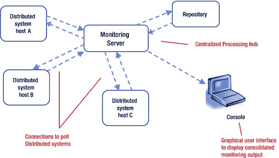
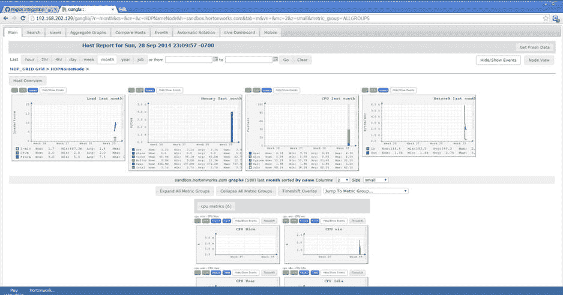
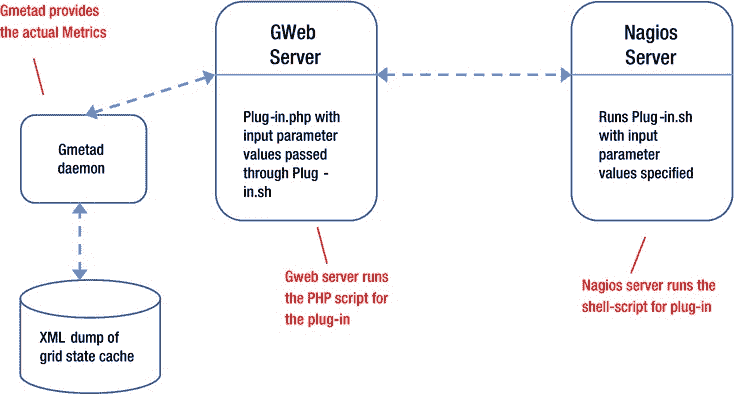
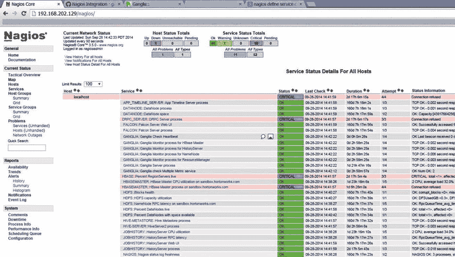

# 七、Hadoop 中的监控

任何系统管理员都会告诉你，监控是找到性能问题根源的理想方法。例如，监视可以帮助您了解系统 CPU 或 RAM 资源不足的原因，并在 CPU 或 RAM 使用率接近指定百分比时通知您。您的系统管理员可能不知道(但您可以在阅读本章后解释)的是，监视同样非常适合于找出安全问题。

考虑一个场景:您管理一个 Hadoop 集群(作为系统管理员)，并且关注两个特定的用户:Bob，一个公认的黑客，和 Steve，他喜欢运行访问大量他不应该访问的数据的查询！为了防止密码丢失和避免服务器崩溃，您希望在 Bob 试图读取`/etc/password`文件和 Steve 运行检索整个数据库的大型查询时得到通知。Hadoop 监控可以提供你需要的信息。具体来说，Hadoop 提供了许多指标来获取有用的安全细节，领先的监控系统可以使用这些指标来提醒您注意问题。此外，这些监控系统允许您基于特定指标值定义阈值(用于生成警报)，还允许您定义适当的操作(如果达到阈值)。因此，Hadoop 监控提供了许多功能，您可以使用这些功能进行性能监控和故障排除。

在本章对监控的详细概述中，我将讨论监控系统需要的特性，重点是监控分布式集群。此后，我将讨论可以用于安全目的的 Hadoop 指标，并介绍 Ganglia 和 Nagios，这是两个最流行的 Hadoop 监控应用程序。最后，我将讨论一些对 Ganglia 和 Nagios 有用的插件，它们提供了这两个程序之间的集成，以及提供安全相关功能的插件。

监控系统概述

监控分布式系统总是具有挑战性。不仅多个进程与用户交互，而且还相互交互，您必须在不影响这些进程性能的情况下监视系统。像 Hadoop 这样的系统提出了更大的挑战，因为监控软件必须监控单个主机，然后在整个系统的上下文中整合数据。它还需要考虑整个系统中各种组件的作用。例如，DataNode 上的 CPU 使用率不如 NameNode 上的 CPU 使用率重要。那么，系统将如何处理 CPU 消耗警报，或者为分布式系统中具有不同角色的主机确定单独的阈值级别呢？此外，在考虑 datanode 的 CPU 或存储使用情况时，监视系统必须考虑群集中所有 datanode 的组合使用情况。随后，监控系统还需要能够按角色汇总监控阈值。

除了复杂的资源监控能力之外，用于分布式系统的监控系统还需要随时访问正在执行的进程的细节。这是生成警报(例如，导致 90% CPU 使用率的用户进程)或执行任何预防措施(例如，用户正在访问关键系统文件)所必需的。

在有效应对监控 Hadoop 系统的挑战之前，您需要了解一个简单监控系统的架构。在下一节中，我将讨论有效监控分布式系统所需的组件、处理和特性，以及如何调整这个简单的架构以更好地监控 Hadoop 集群。

简单监控系统

一个简单的监控系统需要四个关键组件:一个服务器或协调器进程，轮询分布式系统主机并收集必要信息的连接，一个存储收集信息的存储库，以及一个作为前端的图形用户界面([图 7-1](#Fig1) )。



[图 7-1](#_Fig1) 。简单监控系统

如您所见，监控服务器整合了通过轮询分布式系统主机接收到的输入，并将详细的(以及汇总的)输出写入存储库。控制台为收集的数据提供显示选项，这些数据可以使用各种参数进行汇总，如监视事件、服务器、警报类型等。

不幸的是，像这样简单的监控系统架构不能很好地扩展。考虑一下，如果图 7-1 的系统必须监控数千台主机而不是三台，会发生什么。监控服务器必须管理一千个连接的轮询，处理和整合输出，并在几秒钟内将其呈现在控制台上！随着每台主机添加到监控系统，监控服务器上的负载也会增加。达到一定数量的主机后，您将无法再添加任何主机，因为服务器根本无法支持它们。此外，大量轮询会增加网络流量并影响整体系统性能。

除此之外，Hadoop 集群的复杂性还在于，您需要在整合数据时考虑节点的角色，以及汇总具有相同角色的多个节点的数据。简单的设计是不够的，但它可以用于监控 Hadoop 集群。

Hadoop 监控系统

一个简单的监控系统遵循与传统的客户端-服务器设计相同的处理安排:一个单一的集中式监控服务器完成所有的处理，并且随着主机数量的增加，处理负载也会增加。网络流量也会降低负载，因为来自主机的轮询数据会整合到监控服务器上。

正如 Hadoop 的分布式架构在效率上比传统的客户端-服务器处理有了显著提高一样，分布式处理模型也可以改进简单的监控系统。例如，如果本地化的监控流程为 Hadoop 集群中的每个节点捕获和存储监控数据，那么就不会再有集中式服务器成为处理瓶颈或单点故障。每个节点都是并行执行部分处理的主动参与者。然后，这些本地化进程中的每一个都可以将数据传输到群集中的其他节点，并且还可以从群集中的其他节点接收数据的副本。轮询过程可以以任何预定的频率从集群内的任何节点轮询整个集群的监控数据。数据可被写入储存库并存储以供进一步处理，或由基于图形或网络的前端显示。图 7-2 显示了一种可能的设计。


[图 7-2](#_Fig2) 。Hadoop 监控系统

使用这种体系结构，即使添加 1000 台主机进行监控也不会对性能产生负面影响。任何现有节点或轮询进程都没有额外的负载负担，因为轮询进程仍然可以从任何节点进行轮询，而不必进行多次轮询。集群节点将数据传输到公共信道，所有其他节点接收该数据。因此，增加节点数量不会以任何方式影响轮询过程或系统性能，从而使体系结构具有高度可伸缩性。与传统的监控系统相比，您需要做的唯一额外工作是将监控流程配置应用于所有节点。

仔细查看[图 7-2](#Fig2) ，注意各个节点上的监控进程计算“本地监控数据”监控数据需要在本地计算；由于 Hadoop 是一个多节点分布式系统，数据分布在众多的 datanode 上，根据 Hadoop“对数据进行处理”的理念，数据在本地进行处理(数据驻留在 datanode 上)。这个“本地监控数据”实际上是各个节点的度量输出；它可以告诉你很多关于你的系统的安全性和性能的信息，这一点你接下来会学到。

Hadoop 指标

Hadoop *指标*是关于系统内发生的事情的简单信息，例如内存使用情况、打开的连接数或节点上的剩余容量。您可以配置每个 Hadoop 守护进程 定期收集指标，然后使用插件输出数据。收集的数据可以包含关于 Hadoop 守护进程(例如，它们使用的资源)、事件(例如，MapReduce 作业执行)和测量(例如，为 NameNode 创建的文件数量)的信息。您使用的输出插件决定了指标的目的地。例如，FileContext 将指标写入文件，GangliaContext 将传递给 Ganglia 监控系统的指标进行显示和整合，而 NullContext 则丢弃该指标。

根据它们包含的信息，度量被分为四个*上下文* : jvm、dfs、rpc 和 mapred。jvm 的度量包含 JVM (Java 虚拟机)的基本统计数据，如内存使用或线程计数等。这个上下文适用于所有 Hadoop 守护进程。dfs (分布式文件系统)上下文适用于 NameNode 和 DataNode。该上下文的一些指标输出诸如容量或文件数量(对于 NameNode)、故障磁盘卷数量、特定工作节点上的剩余容量(对于 DataNode)等信息。JobTracker 和 TaskTracker 为它们的计数器使用 mapred 上下文。这些度量包含作业前计数器数据、作业计数器和作业后计数器。rpc 上下文用于远程过程调用(rpc)指标，如处理 RPC 所需的平均时间、打开的连接数等，适用于所有 Hadoop 守护进程。表 7-1 总结了上下文。

[表 7-1](#_Tab1) 。Hadoop 指标的上下文


早期版本的 Hadoop 通过一个名为 Metrics 的系统来管理指标，而当前版本的 Hadoop 使用 Metrics2 。管理系统有两个主要的区别。度量依赖于每个插件一个上下文的一对一关系，而 Metrics2 使您能够将度量输出到多个插件。Metrics2 系统也使用稍微不同的术语；Hadoop 守护进程输出的指标数据被称为*源*，插件被称为*接收器*。源产生数据，接收器消费或输出数据。让我讨论一下每种环境的一些指标。

jvm 上下文

jvm 度量关注基本的 JVM 统计数据。表 7-2 列出了其中的一些指标。

[表 7-2](#_Tab2) 。jvm 上下文的度量

<colgroup><col width="50%"> <col width="50%"></colgroup> 
| 

公制的

 | 

描述

 |
| --- | --- |
| 账户 | 为 JVM 执行的垃圾收集(从不使用的对象中自动释放堆内存)的数量 |
| GcTimeMillis | JVM 的所有垃圾收集的总时间(毫秒) |
| 日志致命 | 错误级别为致命的日志行数(使用 Log4j) |
| MemHeapCommittedM | 提交的堆内存，或者保证可供 JVM 使用的内存量(MB) |
| MemHeapUsedM | JVM 当前使用的堆内存(包括所有对象占用的内存)(MB) |
| 线程等待 | 处于等待状态(即等待另一个线程完成操作)的线程数 |

您可以通过查看 **GcCount** 和 **GcTimeMillis** 指标来推断 JVM 进程的动态性；较大的数字表示大量基于内存的活动。大量致命错误表明您的系统或应用程序有问题，您需要立即查阅日志。内存计数器 **MemHeapUsedM** 告诉你总的内存使用情况，如果你看到大量的**线程等待**，你就知道你需要更多的内存。

dfs 上下文

dfs(分布式文件系统)指标侧重于基本文件操作(创建、删除)或容量、事务等。表 7-3 列出了其中一些指标。

[表 7-3](#_Tab3) 。dfs 上下文的度量

<colgroup><col width="50%"> <col width="50%"></colgroup> 
| 

公制的

 | 

说明

 |
| --- | --- |
| 容量维护 | HDFS 的总可用磁盘空间(GB) |
| 创建的文件 | 群集中创建的文件数量 |
| 删除的文件 | 群集中删除的文件数 |
| 文件重命名 | 群集中重命名的文件数 |
| 剩余百分比 | 剩余 HDFS 容量的百分比(GB) |
| 总块数 | 簇中的总块数 |
| 事务 _ 平均 _ 时间 | 交易的平均时间 |
| 交易数量操作 | 交易数量 |

dfs 指标可用于安全目的。您可以使用它们来发现集群中不寻常的活动或活动的突然变化。您可以存储每天的度量值(在一个 Hive 表中)，并计算过去 30 天的平均值。然后，如果某个指标的每日值与平均值相差 50%，您就可以生成一个警报。您还可以将指标输出定向到 Ganglia，使用 Ganglia 进行聚合和平均，然后使用 Nagios 生成基于 50%变化阈值的警报。

rpc 上下文

rpc(远程过程调用)度量关注远程过程的过程细节。表 7-4 列出了一些重要的 RPC 矩阵。

[表 7-4](#_Tab4) 。rpc 上下文的度量

<colgroup><col width="50%"> <col width="50%"></colgroup> 
| 

公制的

 | 

说明

 |
| --- | --- |
| RpcProcessingTimeNumOps | 已处理的 RPC 请求数 |
| rpcauthentaicationfailures | 失败的 RPC 认证调用数 |
| RpcAuthorizationFailures | 失败的 RPC 授权调用数 |

rpc 度量也可以用于安全目的。您可以使用它们来发现集群中不寻常的 RPC 活动或 RPC 活动的突然变化。同样，您可以将每日指标值存储在一个 Hive 表中(或使用 Ganglia ),并维护过去 30 天的平均值。然后，如果某个指标的每日值与平均值相差某个百分比，如 50%，您可以生成一个警报。从安全的角度来看，像**RpcAuthenticationFailures**或 **RpcAuthorizationFailures** 这样的指标尤其重要。

映射的上下文

mapred (MapReduce)上下文的度量提供与作业相关的详细信息(针对 JobTracker/TaskTracker)。表 7-5 列出了一些重要的 mapred 指标。

[表 7-5](#_Tab5) 。映射上下文的度量

<colgroup><col width="50%"> <col width="50%"></colgroup> 
| 

公制的

 | 

说明

 |
| --- | --- |
| 作业 _ 已完成 | 成功完成的作业数 |
| 作业 _ 失败 | 失败的作业数 |
| 地图 _ 已完成 | 成功完成的映射数 |
| 地图 _ 失败 | 失败的映射数 |
| memNonHeapCommittedM | 提交的非堆内存(MB) |
| memNonHeapUsedM | 使用的非堆内存(MB) |
| 已占用 _ 地图 _ 插槽 | 使用的地图槽数 |
| 地图 _ 插槽 | 地图位置的数量 |
| 已占用 _ 减少 _ 插槽 | 使用的缩减插槽数量 |
| 减少 _ 插槽 | 缩减插槽的数量 |
| 减少 _ 完成 | 成功完成的缩减器数量 |
| 减少 _ 失败 | 失败的减速器数量 |
| 跑步 _1440 | 长期运行的作业数(超过 24 小时) |
| 追踪者 | 可用于群集的 TaskTrackers 数量 |

mapred 上下文的度量提供了有关在集群上执行的作业的有价值的信息。它们可以帮助您确定集群是否有任何性能问题(从作业执行的角度来看)。您可以使用一个监控系统(比如 Ganglia)来确保您有足够的 map 和 reduce 插槽随时可用。此外，你可以确保你没有任何长时间运行的作业——除非你事先知道它们！您可以在 Ganglia 中使用 Nagios 来生成适当的警报。就像其他上下文一样，还可以监视 mapred 度量的异常作业活动(相对于平均作业活动)。

您可以在附录 D“Hadoop 指标及其与安全性的相关性”中找到 Hadoop 指标[附录 D](12.html) 还包含了一个例子，解释了使用特定的度量和模式搜索来实现安全性(我也包含了那个例子的特定于安全性的配置)。

指标和安全性

一些指标可以提供有用的安全信息，包括:

*   **NameNode 的**活动统计:**T5】监控 NameNode 上的活动很重要，因为它可以提供大量信息，提醒您注意安全问题。作为 Hadoop 集群的“大脑”, NameNode 是所有文件创建活动的中枢。如果新创建的文件数量急剧变化，或者权限被更改的文件数量急剧增加，这些指标会触发警报，以便您进行调查。**
*   **活动统计对于一个** **DataNode:** 对于一个 DataNode，如果一个本地客户端的读写次数突然增加，你肯定需要调查。此外，如果添加或删除的块数发生较大百分比的变化，则指标会触发警报向您发出警告。
*   **RPC 相关处理的**活动统计:** 对于 NameNode(或 DataNode)，您需要密切监视 RPC 统计，例如处理的 RPC 请求的数量、失败的 RPC 认证调用的数量或失败的 RPC 授权调用的数量。您可以将每天的数字与每周的平均值进行比较，如果数字相差阈值百分比，则生成警报。例如，如果一天中失败的 RPC 授权调用次数为 50 次，每周平均次数为 30 次，那么如果警报阈值为每周平均次数的 50%或更多，将会生成警报(30 的 50%为 15，每天的次数(50)大于 45)。**
*   **系统突然变化的活动统计****资源:** 监视任何主要系统资源(如可用内存、CPU 或存储)的突然变化都是有益的。Hadoop 提供了监控这些资源的指标，您可以定义一个特定的百分比(用于生成警报)或监控与每周或每月平均值的百分比偏差。后一种方法更加精确，因为即使受到恶意攻击，一些集群也可能永远达不到目标警报百分比(例如，如果集群的平均内存使用率为 20%，而恶意攻击导致使用率跃升至 60%)。如果您定义了 80%或 90%的警报阈值，那么您将永远不会收到警报。或者，如果您将警报阈值定义为 50%或更多(平均使用率)，那么您肯定会收到警报。

您可以结合使用 Ganglia 和 Nagios 来监控任何 Hadoop 守护进程的任何系统资源或指标值的突然变化。同样，附录 D 有一个描述这种方法的例子。

如果您不想使用监控系统，而想采用将指标数据写入文件并使用 Hive 或 HBase 将数据加载到表中的“老式”方法，这也是可行的。当然，您需要开发 will 脚本来调度您的数据加载、执行聚合、生成摘要报告以及生成适当的警报。

指标过滤

当您对安全漏洞或可能的性能问题进行故障排除时，查看大量指标数据可能会花费时间，并且会分散注意力和容易出错。过滤指标数据有助于您关注可能的问题并节省宝贵的时间。Hadoop 允许您通过源、上下文、记录和指标来配置指标过滤器。最高级别的筛选是按源(例如，DataNode5)，最低级别的筛选是按指标名称(例如，文件创建)。可以组合过滤器以优化过滤效率。

例如，以下文件接收器仅接受来自上下文 dfs 的指标:

```scala
bcl.sink.file0.class=org.apache.hadoop.metrics2.sink.FileSink
bcl.sink.file0.context=dfs

```

要设置过滤器，您首先需要在您的`$HADOOP_INSTALL/hadoop/conf/`**Hadoop-metrics 2 . properties**文件中添加如下代码片段:

```scala
# Syntax: <prefix>.(source|sink).<instance>.<option>

*.sink.file.class=org.apache.hadoop.metrics2.sink.FileSink
*.source.filter.class=org.apache.hadoop.metrics2.filter.GlobFilter
*.record.filter.class=${*.source.filter.class}
*.metric.filter.class=${*.source.filter.class}

```

此后，您可以包括以下任何配置选项，这些选项将在不同级别设置过滤器:

```scala
# This will filter out sources with names starting with Cluster2

jobtracker.*.source.filter.exclude=Cluster2*

# This will filter out records with names that match localhost in the source dfs

jobtracker.source.dfs.record.filter.exclude=localhost*

# This will filter out Metrics with names that match cpu* for sink instance file only

jobtracker.sink.file.metric.filter.exclude=cpu*
jobtracker.sink.file.filename=MyJT-metrics.out

```

因此，总的来说，您可以根据源、源中的模式或者接收的输出文件中的指标名称或模式来过滤指标数据。

请记住，当您仅指定“包括”模式时，过滤器仅包括与过滤条件匹配的数据。此外，当您仅指定“排除”模式时，匹配的数据将被排除。最重要的是，当您指定这两种模式时，不匹配任何一种模式的源也包括在内！最后，包含模式优先于排除模式。

将指标输出捕获到文件

如何将 NameNode 或 DataNode 指标输出到文件中？使用 Metrics2，您可以定义一个接收器(输出文件),通过向目录`/etc/Hadoop/conf`或`$HADOOP_INSTALL/hadoop/conf`中的`hadoop-metrics2.properties`配置文件添加几行，将来自您的度量源的输出定向到该接收器中。在下面的示例中，我将 NameNode 和 DataNode 指标重定向到单独的输出文件以及 Ganglia 监控系统(请记住，Metrics2 可以支持同时输出到两个接收器):

```scala
# Following are entries from configuration file hadoop-metrics2.properties
# collectively they output Metrics from sources NameNode and DataNode to
# a sink named 'tfile' (output to file) and also to a sink named 'ganglia'
# (output to Ganglia)

# Defining sink for file output
*.sink.tfile.class=org.apache.hadoop.metrics2.sink.FileSink

# Filename for NameNode output

namenode.sink.tfile.filename = namenode-metrics.log

# Output the DataNode Metrics to a separate file
datanode.sink.tfile.filename = datanode-metrics.log

# Defining sink for Ganglia 3.1
*.sink.ganglia.class=org.apache.hadoop.metrics2.sink.ganglia.GangliaSink31

# Default polling period for GangliaSink
*.sink.ganglia.period=10

# Directing output to ganglia servers
namenode.sink.ganglia.servers=gangliahost_1:8649,gangliahost_2:8649
datanode.sink.ganglia.servers=gangliahost_1:8649,gangliahost_2:8649

```

现在您已经将所有的度量数据保存在文件中，您需要有效地利用它。如果您不打算使用监控系统，您将不得不为所有 Hadoop 守护进程定义文件接收器(作为输出),并手动分析巨大的输出文件或根据需要聚合它们！最多，您可以定义 Hive 外部表并简化处理。或者，您可以将指标输出定向到 JMX 控制台进行检查。

请注意，无论使用哪种方法，您都无法以图形方式显示指标数据或聚合以进行快速查看。此外，您还需要通过 shellscripts(访问配置单元数据)设置带有警报机制的接口，并设置用于寻呼系统管理员的接口(如果发生关键事件)。

但是，如果您计划使用 Ganglia，那么将您的指标发送到 Ganglia 监控系统就像将它们发送到一个文件一样简单，并且提供了更多的优势，您将在下一节中了解到。

使用 Ganglia 和 Nagios 进行安全监控

最适合您的 Hadoop 集群的安全监控系统是一个符合您的环境和需求的系统。在某些情况下，确保只有授权用户才能访问可能是最重要的，而在其他情况下，您可能需要监控系统资源，并在资源使用发生突然变化时立即发出警报。一些集群管理员只想监控失败的认证请求。Hadoop 安全监控领域的领导者 Ganglia ( `http://ganglia.sourceforge.net`)和 Nagios ( `www.nagios.org`)通过提供灵活性和各种监控系统资源、连接以及技术上可能监控的 Hadoop 集群的任何其他部分的方法来应对这一挑战。

两者都是开源工具，具有不同的优势，可以很好地互补。Ganglia 非常擅长收集指标，随着时间的推移跟踪它们，并汇总结果；而 Nagios 更侧重于提供一种警报机制。由于收集指标和发出警报都是监控的重要方面，Ganglia 和 Nagios 配合得最好。这两种工具都有在集群的所有主机上运行的代理，并通过轮询过程收集信息，轮询过程可以轮询任何主机以获取必要的信息。

神经节

Ganglia 是在加州大学伯克利分校设计的，最初是一个开源监控项目，旨在用于大型分布式系统。Ganglia 的开放式架构使其易于与其他应用程序集成，并收集有关其操作的统计数据。这就是 Ganglia 能够轻松接收和处理来自 Hadoop 指标的输出数据并有效使用它的原因。

对于受监控的集群，每个主机运行一个名为 *gmond* 的守护进程，该进程收集并广播本地指标数据(如 CPU 使用率、内存使用率等。)发送到集群中的所有主机。然后，轮询进程( *gmetad* )可以查询任何主机，读取所有指标数据，并将其路由到中央监控服务器。中央主机可以显示指标、汇总指标或汇总指标以备将来使用。 *Gmond* 开销很小，因此可以很容易地在集群中的每台机器上运行，而不会影响用户性能。Ganglia 的 web 界面可以根据您的需要轻松显示过去一小时、一天、一周或一个月的使用情况摘要。此外，您可以根据需要获得这些资源使用的详细信息。

神经节架构

概括地说，Ganglia 有四个主要组件:gmond、gmetad、rrdtool 和 gweb。gmond 在集群中的所有节点上运行并收集指标数据， *gmetad* 轮询来自 *gmond* 的数据， *rrdtool* 存储轮询的数据， *gweb* 是为存储的数据提供可视化和分析的接口。[图 7-3](#Fig3) 展示了 Ganglia 的组件如何适应图 7-2 所示的基本 Hadoop 分布式监控系统。


[图 7-3](#_Fig3) 。适用于 Hadoop 的 Ganglia 监控系统

仔细看看每个 Ganglia 组件的功能:

*   **gmond:** gmond needs to be installed on every host you want monitored. It interacts with the host operating system to acquire Metrics such as load Metrics (e.g., average cluster load), process Metrics (e.g., total running processes) or rpc Metrics (e.g., RpcAuthenticationFailures). It is modular and uses operating system–specific plugins to take measurements. Since only the necessary plugins are installed at compile time, gmond has a very small footprint and negligible overhead.

    gmond 不是根据来自外部轮询引擎的请求被调用的(用于测量)，而是根据本地配置文件定义的时间表进行轮询。通过在同一组播地址广播的简单监听/通告协议，与其他主机(来自集群)共享测量结果。每个 gmond 主机还记录它从集群中的其他主机接收到的指标。

    因此，Ganglia 集群中的每个主机都知道同一个集群中每个其他主机记录的每个指标的当前值。这就是为什么每个集群只需要轮询一台主机来获取整个集群的指标，任何单个主机故障都不会影响系统！此外，这种设计减少了需要以指数方式轮询的主机数量，因此很容易扩展到大型集群。

*   **gmetad:** gmetad 是 Ganglia 监控系统中的轮询过程。它需要一个主机名列表，为每个集群指定至少一台主机。gmetad 可以通过端口 8649 从集群中的任何主机请求集群指标的 XML 格式转储，这就是 gmetad 获取集群指标数据的方式。
*   **RRDtool:** RRDtool 是 Ganglia 组件，用于存储 gmetad 从任何集群主机轮询的度量数据。指标以“循环”方式存储；当没有剩余空间来存储新值时，旧值将被覆盖。根据指定的数据保留需求， *RRDtool* 聚集数据值或“汇总它们”这种数据存储方式允许我们快速分析最近的数据，并使用少量的磁盘空间维护多年的历史数据。此外，因为所有需要的磁盘空间都是预先分配的，所以容量规划非常容易。
*   **gweb:** gweb is the visualization interface for Ganglia. It provides instant access to any Metric from any host in the cluster without specifying any configuration details. It visually summarizes the entire grid using graphs that combine Metrics by cluster and provides drop-downs for additional details. If you need details of a specific host or Metric, you can specify the details and create a custom graph of exactly what you want to see.

    gweb 允许您更改图表中的时间段，支持以各种文本格式(CSV、JSON 等)提取数据，并提供了一个功能齐全的 URL 接口，以便您可以通过特定的 URL 将必要的图表嵌入到其他程序中。此外，gweb 是一个 PHP 程序，运行在 Apache web 服务器下，通常安装在与 gmetad 相同的物理硬件上，因为它需要访问 gmetad 创建的 RRD 数据库。

配置和使用 Ganglia

对 Ganglia 的主要组件有了更清晰的理解后，您就可以设置它并让它为安全相关的监控和输出特定的 Hadoop 指标而工作了。

要在想要监控的 Hadoop 集群上安装 Ganglia，请执行以下步骤:

1.  在一个集群节点或主机上安装 Ganglia 组件 gmetad、gmond 和 gweb。(以我为例，我调用了主机 GMaster)。
2.  在所有其他集群节点上安装 Ganglia 组件 gmond。

确切的命令语法或安装方式会因您使用的操作系统而异。具体请参考 Ganglia 安装说明。然而，在所有情况下，您都需要修改配置文件，以使 Ganglia 正常工作，并使 Hadoop 按照预期通过 Ganglia 输出指标(需要修改配置文件`gmond.conf`、`gmetad.conf`和`hadoop-metrics2.properties`)。

首先，将`gmond.conf`(具有以下配置)复制到所有集群节点:

```scala
/* the values closely match ./gmond/metric.h definitions in 2.5.x */
globals {
  daemonize = yes
  setuid = yes
  user = nobody
  debug_level = 0
  max_udp_msg_len = 1472
  mute = no
  deaf = no
  allow_extra_data = yes
  host_dmax = 86400 /*secs. Expires hosts in 1 day */
  host_tmax = 20 /*secs */
  cleanup_threshold = 300 /*secs */
  gexec = no
  send_metadata_interval = 0 /*secs */
}

/*
 * The cluster attributes specified will be used as part of the <CLUSTER>
 * tag that will wrap all hosts collected by this instance.
 */
cluster {
  name = "pract_hdp_sec"
  owner = "Apress"
  latlong = "N43.47 E112.34"
  url = "http://www.apress.com/9781430265443"
}

/* The host section describes attributes of the host, like the location */
host {
  location = "Chicago"
}

/* Feel free to specify as many udp_send_channels as you like */
udp_send_channel {
  bind_hostname = yes #soon to be default
  mcast_join = 239.2.11.71
  port = 8649
  ttl = 1
}

/* You can specify as many udp_recv_channels as you like as well. */
udp_recv_channel {
  mcast_join = 239.2.11.71
  port = 8649
  bind = 239.2.11.71
  retry_bind = true
}

/* You can specify as many tcp_accept_channels as you like to share
   an xml description of the state of the cluster */
tcp_accept_channel {
  port = 8649
}

/* Each Metrics module that is referenced by gmond must be specified and
   loaded. If the module has been statically linked with gmond, it does
   not require a load path. However all dynamically loadable modules must
   include a load path. */
modules {
  module {name = "core_metrics"}
  module {name = "cpu_module" path = "modcpu.so"}
  module {name = "disk_module" path = "moddisk.so"}
  module {name = "load_module" path = "modload.so"}
  module {name = "mem_module" path = "modmem.so"}
  module {name = "net_module" path = "modnet.so"}
  module {name = "proc_module" path = "modproc.so"}
  module {name = "sys_module" path = "modsys.so"}
}

```

在 Globals 部分，`daemonize`属性，当`true`时，将使 gmond 作为后台进程运行。大于 0 的`debug_level`将导致 gmond 在前台运行并输出调试信息。当`true`时，`mute`属性将阻止 gmond 发送任何数据，当`true`时，`deaf`属性将阻止 gmond 接收任何数据。如果`host_dmax`设置为正数，那么 gmond 将在`host_dmax`秒内没有收到主机消息后刷新主机。`cleanup_threshold`是 gmond 清除任何带有过期数据的主机或指标之前的最短时间。`send_metadata_interval`设置为 0 意味着 gmond 将只在启动时以及在收到远程运行的其他 gmond 节点的请求时发送元数据包。

几个 Ganglia 指标可以检测系统资源的突然变化，非常适合安全监控:

*   cpu_aidle(自上次启动以来 cpu 周期空闲的百分比；对 Linux 有效)
*   cpu_user(执行用户进程所花费的 cpu 周期百分比)
*   load_five(报告的系统负载，五分钟内的平均值)
*   mem_shared(系统和用户进程占用的内存量)
*   proc_run(运行的进程总数)
*   mem_free(可用内存量)
*   disk_free(总可用磁盘空间)
*   bytes_in(从所有非环回接口读取的字节数)
*   bytes_out(写入所有非环回接口的字节数)

您可以将它们添加到您的`gmond.conf`文件中，格式如下:

```scala
collection_group {
  collect_every = 40
  time_threshold = 300
  metric {
    name = "bytes_out"
    value_threshold = 4096
    title = "Bytes Sent"
  }
}

```

正如您在示例中看到的，需要以相同的时间间隔收集和发送的指标可以被分组到同一个`collection_group`下。在本例中，`collect_every`指定采样间隔，`time_threshold`指定最大数据发送间隔(即，数据以该间隔发送)，而`value_threshold`是度量方差阈值(即，如果值超过`value_threshold`值，则发送该值)。

第二个配置文件是`gmetad.conf`，它只需要驻留在主机(GMaster)上。请记住，下面的代码只是一个示例，您可以根据需要设置自己的数据源或更改设置以进行循环归档:

```scala
# Format:
# data_source "my cluster" [polling interval] address1:port addreses2:port ...
#
data_source "HDPTaskTracker" 50 localhost:8658
data_source "HDPDataNode" 50 localhost:8659
data_source "HDPNameNode" 50 localhost:8661
data_source "HDPJobTracker" 50 localhost:8662
data_source "HDPResourceManager" 50 localhost:8664
data_source "HDPHistoryServer" 50 localhost:8666
#
# Round-Robin Archives
# You can specify custom Round-Robin archives here
#
RRAs "RRA:AVERAGE:0.5:1:244" "RRA:AVERAGE:0.5:24:244" RRA:AVERAGE:0.5:168:244" "RRA:AVERAGE:0.5:672:244" "RRA:AVERAGE:0.5:5760:374"
#
# The name of this Grid. All the data sources above will be wrapped in a GRID
# tag with this name.
# default: unspecified
gridname "HDP_GRID"
#
# In earlier versions of gmetad, hostnames were handled in a case
# sensitive manner. If your hostname directories have been renamed to lower
# case, set this option to 0 to disable backward compatibility.
# From version 3.2, backwards compatibility will be disabled by default.
# default: 1 (for gmetad < 3.2)
# default: 0 (for gmetad >= 3.2)
case_sensitive_hostnames 1

```

最后，您需要定制目录`/etc/Hadoop/conf`或`$HADOOP_INSTALL/hadoop/conf`中的`hadoop-metrics2.properties`配置文件。您可以定义适当的源(在本例中，可以是 dfs、jvm、rpc 或 mapred 指标)、接收器(只是 Ganglia 或 Ganglia 和输出文件的组合)和过滤器(过滤掉您不需要的指标数据)。

要设置源和接收器，请使用类似如下的代码:

```scala
# syntax: [prefix].[source|sink|jmx].[instance].[options]
# See package.html for org.apache.hadoop.metrics2 for details

*.period=60

*.sink.ganglia.class=org.apache.hadoop.metrics2.sink.ganglia.GangliaSink31
*.sink.ganglia.period=10

# default for supportsparse is false
*.sink.ganglia.supportsparse=true

.sink.ganglia.slope=jvm.metrics.gcCount=zero,jvm.metrics.memHeapUsedM=both
.sink.ganglia.dmax=jvm.metrics.threadsBlocked=70,jvm.metrics.memHeapUsedM=40

# Associate sinks with server and ports
namenode.sink.ganglia.servers=localhost:8661
datanode.sink.ganglia.servers=localhost:8659
jobtracker.sink.ganglia.servers=localhost:8662
tasktracker.sink.ganglia.servers=localhost:8658
maptask.sink.ganglia.servers=localhost:8660
reducetask.sink.ganglia.servers=localhost:8660
resourcemanager.sink.ganglia.servers=localhost:8664
nodemanager.sink.ganglia.servers=localhost:8657
historyserver.sink.ganglia.servers=localhost:8666
resourcemanager.sink.ganglia.tagsForPrefix.yarn=Queue

```

将`supportsparse`设置为`true`有助于减少带宽使用。否则，每次发布指标时都会更新指标缓存，这可能会占用大量 CPU/网络资源。Ganglia `slope`可以有值`zero`(度量值始终保持不变)、`positive`(度量值只能增加)、`negative`(度量值只能减少)或`both`(度量值可以增加或减少)。`dmax`值表示特定值将保留多长时间。例如，JVM 指标`threadsBlocked`(来自前面的配置)的值将只保留 70 秒。

正如我在前面的“指标过滤”一节中所讨论的，过滤器在您进行故障排除或需要关注已知问题并且只需要特定指标数据的情况下非常有用。当然，您可以通过`gmond.conf`中的设置来限制您正在捕获的指标数据(正如您在本节前面所学的那样)，但是当您需要临时限制(或捕获)指标数据时，过滤器会很有用——而且要快！

使用 Ganglia 监控 HBase

Ganglia 可用于监控 HBase，就像您看到的它用于监控 Hadoop 一样。在目录`$HBASE_HOME/conf`中有一个名为`hadoop-metrics.properties`的配置文件(其中`$HBASE_HOME`是 HBase 安装目录)。您需要为 HBase 配置所有“上下文”,以便将 Ganglia 用作输出:

```scala
# Configuration of the "hbase" context for Ganglia
hbase.class=org.apache.hadoop.metrics.ganglia.GangliaContext
hbase.period=60
hbase.servers=localhost:8649

# Configuration of the "jvm" context for Ganglia
jvm.class=org.apache.hadoop.metrics.ganglia.GangliaContext
jvm.period=60
hbase.servers=localhost:8649

# Configuration of the "rpc" context for Ganglia
rpc.class=org.apache.hadoop.metrics.ganglia.GangliaContext
rpc.period=60
hbase.servers=localhost:8649

```

对于`hbase`上下文，您可以在 HBase 主服务器上看到 averageLoad(每个区域服务器服务的平均区域数)或 numRegionServers(在线区域服务器数)等指标的值。

另外，对于`jvm`上下文，您可以看到 MemHeapUsedM(使用的堆内存，以 MB 为单位)和 MemHeapCommittedM(提交的堆内存，以 MB 为单位)这样的指标。如果不止一个 jvm 正在运行(即不止一个 HBase 进程), Ganglia 会聚合指标值，而不是针对每个实例报告它们。

HBase 监控部分到此结束。我在附录 D 中列出了所有 HBase 指标，供您参考。

在结束关于 Ganglia 的讨论之前，我想让您快速浏览一下 Ganglia web 界面。请回顾[图 7-4](#Fig4) 。它显示了 Ganglia 仪表板，其中显示了上个月的摘要图。您可以看到平均和最大负载、CPU 使用率、内存使用率和网络使用率。从控制面板中，您可以选择任何这些资源的详细图表，或者为您需要的特定指标创建自定义图表。



[图 7-4](#_Fig4) 。神经节仪表盘

 **注**神经节在`http://ganglia.sourceforge.net/`可用。神经节的插件在`https://github.com/ganglia/`可用。Ganglia 的用户社区 URL 是:`http://ganglia.info/?page_id=67`。

Nagios〔t0〕

Nagios 是一个专门的调度和通知引擎。它不监控任何进程或资源，而是调度插件(可执行程序——Nagios 插件与 Hadoop Metrics 插件不同)的执行，并根据执行状态采取行动。例如，状态 0 表示成功，1 表示警告，2 表示严重，3 表示未知。您可以配置 Nagios 服务，为配置文件中定义的所有插件的每个输出映射特定的动作。此外，您可以定义自己的插件，并定义监视它们的频率以及映射到每个可能输出的操作。

除了代码之外，插件还可以返回文本消息，该消息可以写入日志，也可以显示在 web 界面上。如果文本消息包含管道字符，则其后的文本将被视为性能数据。性能数据包含来自被监控主机的指标，可以传递给外部系统(如 Ganglia)使用。

大多数时候，Nagios 与 Ganglia 一起用于监控。原因是这两种开源工具很好地互补，因为它们有不同的优势。例如，Ganglia 更侧重于收集指标并在一段时间内跟踪它们，而 Nagios 更侧重于作为一种警报机制。因为收集指标和发出警报都是监控的重要方面，所以它们最好结合使用。Ganglia 和 Nagios 都在集群的所有主机上运行代理，并收集信息。

回到 Nagios，让我从 Nagios 体系结构开始。

架构

Nagios 守护进程或服务运行在一台主机上，并在所有需要监控的远程主机上运行插件。(要将 Nagios 与 Ganglia 集成，请确保 Ganglia 进程 *gmond* 正在运行 Nagios 插件的每台主机上运行)。远程 Nagios 插件向 Nagios 服务发送信息和更新，Nagios web 界面显示这些信息。当检测到问题时，Nagios 守护程序使用电子邮件或页面(发送到手机的文本消息)通知预定义的管理联系人。配置文件中定义的日志文件中提供了历史日志数据。正如你在[图 7-5](#Fig5) 中看到的，Nagios 监控系统有三个主要组件:

*   **服务器:**服务器负责管理和调度插件。服务器定期检查插件状态，并根据状态执行操作。出现警报时，会通知已配置的管理资源。
*   **插件:** Nagios 提供了一组标准的用户可配置插件，您还可以根据需要添加更多插件。插件是可执行程序(大多用 C、Java、Python 等编写)。它执行特定的任务并将结果返回给 Nagios 服务器。
*   Nagios 的浏览器界面:这些是由 CGI 生成的网页，显示关于被监控资源的概要信息。


[图 7-5](#_Fig5) 。Nagios 架构

 **注意** Nagios 在`http://www.nagios.org`免费提供。你可以在`http://nagiosplug.sourceforge.net`从 Nagios 插件开发团队下载 Nagios 官方插件。此外，Nagios 社区正在不断开发新的插件，您可以在`http://exchange.nagios.org`找到。

尽管结合使用 Ganglia 和 Nagios 是一种有效的安全监控方法，但是在默认情况下，这些应用程序并没有集成。正如下一节所解释的，您需要通过插件来集成它们。

Nagios 与 Ganglia 的集成

Nagios 没有内置的指标。Nagios 执行远程或本地插件，并将它们的状态与用户指定的状态/通知映射进行比较，以执行任何必要的通知任务。像 NRPE (Nagios 远程插件执行器)或 NSCA (Nagios 服务检查接收器)这样的服务被用于远程执行。但是，如果使用 Ganglia 进行监控，Nagios 需要的所有指标(CPU、内存、磁盘 I/O 等。)已经有了。您只需将 Nagios 指向 Ganglia 来收集这些指标！为了帮助您，从版本 2.2.0 开始，Ganglia 项目开始在其 gweb 版本中包含许多官方 Nagios 插件(有关详细信息，请参见`https://github.com/ganglia/ganglia-web/wiki/Nagios-Integration`)。在 Nagios 中，您可以使用这些插件创建命令和服务，将 Ganglia 捕获(或生成)的指标与 Nagios 中定义的警报阈值进行比较。

最初，有五个 Ganglia 插件可用:

*   `check_heartbeat`(检查心跳以验证主机是否可用)
*   `check_metric`(检查特定主机上的单个指标)
*   `check_multiple_metrics`(检查特定主机上的多个指标)
*   `check_host_regex`(检查 regex 定义的主机范围内的多个指标)
*   `check_value_same_everywhere`(检查一组主机上的值是否相同)

现在，当前的 Ganglia web tarball(版本 3.6.2)包含 10 个用于 Nagios 集成的插件！你可以在`http://sourceforge.net/projects/ganglia/files/ganglia-web/3.6.2/`下载它来检查五个新插件。

使用 Ganglia 的 Nagios 插件

解压缩后，Ganglia web tarball 包含一个名为`nagios`的子目录，其中包含 well 脚本以及每个插件的 PHP 脚本。插件的 shellscript 接受参数值，并将它们传递给相应的 PHP 脚本。PHP 脚本处理这些值，并使用网格状态的 XML 转储(包含所有指标细节的集群状态；由 gmetad 获得)以按照请求获取当前度量值。一个返回代码(指示请求的状态)被传递回 Nagios。[图 7-6](#Fig6) 说明了这个过程。



[图 7-6](#_Fig6) 。Ganglia-Nagios 集成处理

记得在使用服务器端 PHP 脚本功能之前启用它，并验证配置文件`conf.php`(由 gweb 使用)中的以下参数值:

```scala
$conf['nagios_cache_enabled'] = 1;
$conf['nagios_cache_file']= $conf['conf_dir']."/nagios_ganglia.cache";
$conf['nagios_cache_time'] = 45;

```

`conf.php`的位置因操作系统、Hadoop 发行版和其他因素而异。您的最佳选择是使用`find`命令:

```scala
find / -name conf.php –print

```

使用 Nagios 作为五个 Ganglia 插件中任何一个的调度和警报机制的步骤都非常相似。因此，我将用两个插件来演示这个过程:`check_heartbeat`和`check_multiple_metrics`。我还假设您已经安装了 Ganglia、PHP 和 Nagios，并且正在使用 Hortonworks Hadoop 发行版。

`check_heartbeat`插件是 Ganglia 用来确保主机正常运行的心跳计数器。每当主机收到新的度量数据包时，此计数器都会重置。要在 Nagios 中使用这个插件，首先将 Ganglia web tarball(在我的例子中是`/var/www/html/ganglia/nagios`)中 Nagios 子目录下的`check_heartbeat.sh`脚本复制到您的 Nagios 插件目录下(在我的例子中是`/usr/lib64/nagios/plugins`)。确保脚本中的`GANGLIA_URL`是正确的。替换您的本地主机名，并检查`http://localhost/ganglia`是否会将您带到 Ganglia 主页进行安装。然后检查这是否是`check_heartbeat.sh`中的设置:

```scala
GANGLIA_URL=http://*<localhost>*/ganglia/nagios/check_heartbeat.php

```

此时，您可能还想验证 Nagios 服务器上的 PHP 命令行安装是否正常工作；你可以通过运行`php –version`命令来实现。您应该会看到类似以下内容的响应:

```scala
PHP 5.3.3 (cli) (built: Aug 6 2014 05:54:27)
Copyright (c) 1997-2010 The PHP Group
Zend Engine v2.3.0, Copyright (c) 1998-2010 Zend Technologies

```

运行插件脚本，并验证它是否正确提供了心跳状态:

```scala
> ./check_heartbeat.sh host=pract_hdp_sec threshold=75

OK Last beacon received 0 days, 0:00:07

```

接下来，将这个插件定义为 Nagios 的一个命令(详见侧栏“Nagios 命令和宏”)。阈值是自上次报告心跳以来的时间量；也就是说，如果收到的最后一个数据包是在 50 秒之前，您应该将阈值指定为 50:

```scala
define command {
command_name check_ganglia_heartbeat
command_line $USER1$/check_heartbeat.sh host=$HOSTADDRESS$ threshold=$ARG1$
}

```

请注意宏`$HOSTADDRESS$`(替换为主机的 IPaddress)、`$USER1$`(在资源文件中定义的用户自定义宏)和`$ARG1$`(命令的第一个参数)的使用。使用宏会将宏中包含的信息自动提供给命令(因为引用的值是可用的)。因此，命令`check_ganglia_heartbeat`可以用于检查集群中任何主机的心跳。类似地，传递给该命令的参数值允许您在运行时更改该参数。请参考侧栏“Nagios 命令和宏”,了解关于宏的更多细节。

NAGIOS 命令和宏

对于 Nagios，可以将命令定义为包括服务检查、服务通知、服务事件处理程序、主机检查、主机通知和主机事件处理程序。命令定义可以包含在运行时替换的宏；这是使 Nagios 灵活的主要特性之一(关于宏的更多信息，请参考`http://nagios.sourceforge.net/docs/3_0/macros.html`)。

宏可以提供来自主机、服务和其他来源的信息。例如，`$HOSTNAME$`或`$HOSTADDRESS$`是经常使用的宏。宏也可以使用$ARGn$传递参数(第 n 个参数传递给命令*)。Nagios 支持多达 32 个参数宏(`$ARG1$`到`$ARG32$`)。定义命令的语法如下:*

`define command{`
`command_name`*<command _ name>*
`command_line`*<command _ line>
`}`*

其中`<command_name>`是命令的名称，而`<command_line>`是 Nagios 在使用命令时实际执行的内容。

您可以在名为`nagios.cfg`的 Nagios 主配置文件中定义命令。大多数情况下，该文件驻留在`/etc/nagios`中，但是对于您的安装，位置可能会有所不同。主配置文件为命令、服务、联系人、模板等定义了单独的对象配置文件。此外，可能会有一个针对 Hadoop 服务器的特定部分。例如，Hortonworks `nagios.cfg`有以下部分:

```scala
# Definitions for hadoop servers
cfg_file=/etc/nagios/objects/hadoop-hosts.cfg
cfg_file=/etc/nagios/objects/hadoop-hostgroups.cfg
cfg_file=/etc/nagios/objects/hadoop-servicegroups.cfg
cfg_file=/etc/nagios/objects/hadoop-services.cfg
cfg_file=/etc/nagios/objects/hadoop-commands.cfg

```

我将在配置文件`/etc/nagios/objects/hadoop-commands.cfg`中定义命令`check_ganglia_heartbeat`。最后一步是为 Nagios 定义一个服务。在 Nagios 中，术语*服务*的使用非常通用或者不明确。它可以指示主机上运行的实际服务(例如，POP、SMTP、HTTP 等)。)或与主机相关联的某种其他类型的度量(空闲磁盘空间、CPU 使用率等)。).服务在配置文件`/etc/nagios/objects/hadoop-services.cfg`中定义，其语法如下:

```scala
define service {
        host_name localhost
        use hadoop-service
        service_description GANGLIA::Ganglia Check Heartbeat
        servicegroups GANGLIA
        check_command check_ganglia_heartbeat!50
        normal_check_interval 0.25
        retry_check_interval 0.25
        max_check_attempts 4
}

```

请注意，`check_command`表示将在指定主机上执行的实际命令。参数`normal_check_interval`指示在安排服务的下一次检查之前要等待的时间单位数。一个时间单位是 60 秒(这是默认值)，因此 0.25 表示 15 秒。`retry_check_interval`定义了当服务变为非正常状态时，在安排重新检查服务之前等待的时间单位数，而`max_check_attempts`表示在这种情况下重试的次数。

命令`check_multiple_metrics`检查多个 Ganglia 指标并生成一个警报。要使用它，请将 Ganglia web tarball 中 Nagios 子目录下的`check_multiple_metrics.sh`脚本复制到您的 Nagios 插件目录中。确保脚本中的`GANGLIA_URL`被设置为`http://localhost/ganglia/nagios/check_heartbeat.php`，还记得用适当的主机名替换`localhost`。

在配置文件`/etc/nagios/objects/hadoop-commands.cfg`中定义相应的命令`check_ganglia_multiple_metrics`:

```scala
define command {
command_name check_ganglia_multiple_metrics
command_line $USER1$/check_multiple_metrics.sh host=$HOSTADDRESS$ checks='$ARG1$'
}

```

您可以添加用冒号分隔的检查列表。每次检查由`Metric_name,operator,critical_value`组成。接下来，在配置文件`/etc/nagios/objects/hadoop-services.cfg`中定义相应的服务:

```scala
define service {
        host_name localhost
        use hadoop-service
        service_description GANGLIA::Ganglia check Multiple Metric service
        servicegroups GANGLIA
        check_command check_ganglia_multiple_metrics!disk_free,less,10:load_one,more,5
        normal_check_interval 0.25
        retry_check_interval 0.25
        max_check_attempts 4
}

```

注意定义要执行的命令的`check_command`部分:

```scala
check_ganglia_multiple_metrics!disk_free,less,10:load_one,more,5.

```

这表示如果(主机的)可用磁盘空间低于 10GB，或者如果 1 分钟平均负载超过 5，将会生成警报。

成功定义 Ganglia 插件后，您可以使用 Nagios web 界面来检查和管理这些插件。正如您在[图 7-7](#Fig7) 中看到的，新的`check_heartbeat`和`check_multiple_metrics`插件已经就位，并由 Nagios 管理。



[图 7-7](#_Fig7) 。带插件的 Nagios web 界面

如果您想要更多的练习，您可以遵循相同的步骤并添加其他三个插件。

Nagios 社区

Nagios 的真正优势在于其活跃的用户社区，该社区一直致力于更有效地使用 Nagios，并添加插件来增强其功能。要查看其他用户开发的最新插件，请访问位于`http://exchange.nagios.org/directory/Plugins`的社区页面。出于安全目的，您会发现许多可以有效使用的插件，例如:

*   `check_ssh_faillogin` :监控`ssh`次失败的登录尝试；在`http://exchange.nagios.org/directory/Plugins/Security/check_ssh_faillogin/details`有售。
*   **显示 _ 用户:** 显示已登录的用户。可以使用白名单、黑名单或两者同时使用，对登录的特定用户发出警报。详情请见:`http://exchange.nagios.org/directory/Plugins/System-Metrics/Users/Show-Users/details`
*   **check _ long _ running _ procs . sh:**T3】检查长时间运行的流程；在`http://exchange.nagios.org/directory/Plugins/System-Metrics/Processes/Check-long-running-processes/details`可用。

您可以使用与使用 Ganglia 插件相同的过程来使用任何新插件。您需要将它复制到 Nagios 插件目录，然后定义一个命令和服务。当然，请遵循各个插件的任何特定安装说明，或者安装它们运行所需的任何附加包。

摘要

在本章中，我讨论了 Hadoop 的监控以及流行的开源监控工具。请记住，监视需要对需要监视的资源和您计划监视的环境有很好的了解。虽然我可以告诉您 Hadoop 集群需要监控什么，但是您最了解您的环境的具体需求。我已经尝试提供一些一般性的提示，但是从我的经验来看，监视总是比您自己的系统管理员对您的环境的了解和理解要好。

“相关性”(一个系统的“最新”或“最先进”程度)也是一个非常有效的考虑因素。您必须每天关注您感兴趣领域的所有创新(包括恶意攻击),并根据它们调整您的监控。请记住，最好的系统管理员是那些最警觉、反应最敏捷的人。

最后，请试着透过特定的工具和版本号来理解本章中描述的监控技术背后的原理和意图。您可能无法使用相同的工具进行监控，但是如果您遵循这些原则，您将能够建立有效的监控系统——最终，这是我们的共同目标。