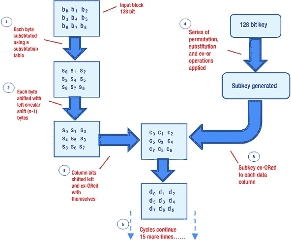
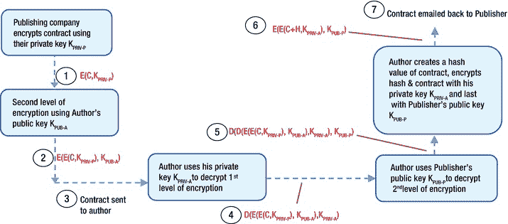
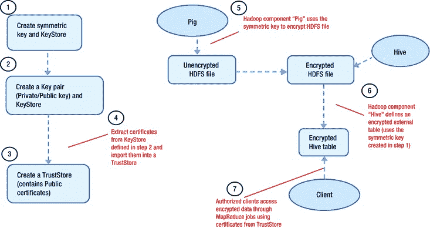
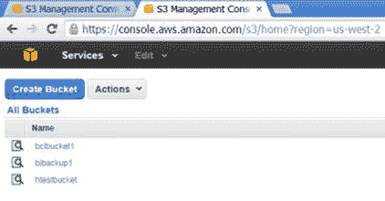
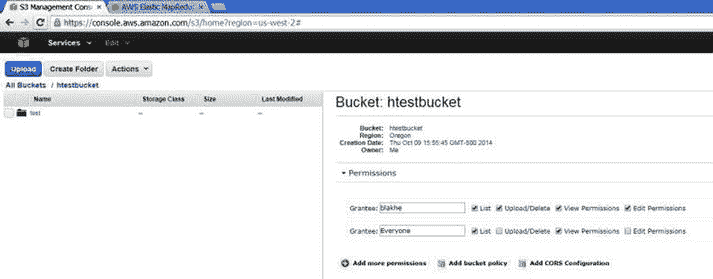
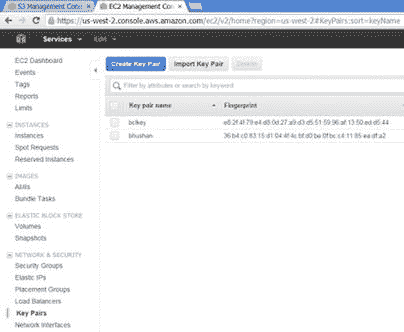
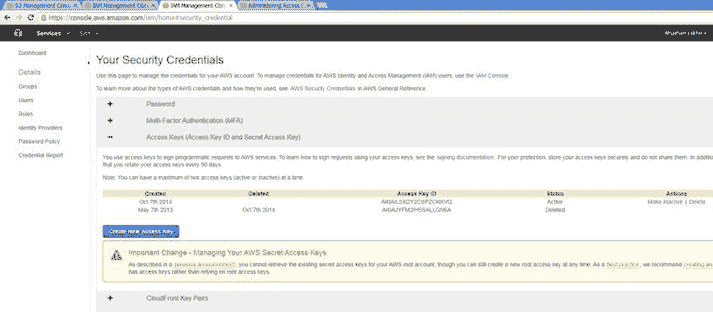
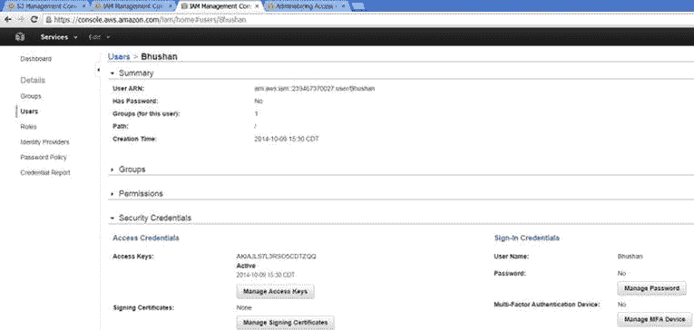
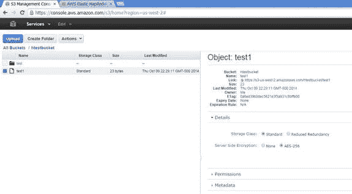

# 八、Hadoop 中的加密

最近，我和一个朋友谈论可能使用 Hadoop 来加速对他公司的 4TB“海量”数据仓库的报告。(他是芝加哥地区最大的房地产公司之一的 IT 部门主管。)虽然他勉强同意了一个可能的性能收益，但是他非常自信地问道，“但是加密我们的 HR(人力资源)数据呢？对于基于 MS SQL Server 的 HR 数据，我们使用对称密钥加密和证书，并辅以 C#代码。你如何用 Hadoop 实现这一点？”

随着 Hadoop 越来越多地在企业环境中使用，越来越多的人会问同样的问题。答案并不简单。大多数 Hadoop 发行版现在已经安装和/或实现了 Kerberos，并且包括实现授权和传输加密的简单选项，但是对于 Hadoop 的静态加密，您的选项是有限的，尤其是文件级粒度。

当数据处于静止状态并存储在磁盘上时，为什么需要对其进行加密？当黑客完全访问您的数据时，加密是最后一道防线。知道你的数据仍然是安全的，这是一种令人欣慰的感觉，因为没有加密它的密钥，它就不能被解密和使用。但是，请记住，加密是用于对抗未授权的访问，因此不能被认证或授权所取代(这两者都控制授权的访问)。

在本章中，我将讨论静态加密，以及如何在 Hadoop 中实现它。首先，我将简要概述 DES 和 AES 算法使用的对称(密钥)加密、RSA 算法使用的非对称(公钥)加密、密钥交换协议和证书、数字签名以及加密哈希函数。然后，我将解释 Hadoop 中需要加密的内容以及如何加密，并讨论英特尔 Hadoop 发行版，该发行版现在计划部分随 Cloudera 的发行版提供，也可通过 Project Rhino 开源获得。最后，我将讨论如何使用 Amazon Web Services 的 Elastic MapReduce(或预装 Hadoop 的虚拟机)来实现静态加密。

数据加密简介

密码学 可以非常有效地用来对抗多种安全威胁。无论您将数据称为加扰的、伪装的还是加密的，它都不容易被读取、修改或操纵。幸运的是，即使密码学起源于高等数学，你也不需要理解它的数学基础来使用它。简单理解一下，一种常见的方法是将加密建立在一个*密钥*(一种用作加密和解密基础的独特字符模式)和一个*算法*(根据需要使用密钥对数据进行加扰或解扰的逻辑)的基础上。参见“加密的基本原理”侧栏，了解更多关于加密的构建模块*。*

加密的基本原理

小时候，我和我的朋友们开发了我们自己的特殊代码语言，以便在学校里交流。任何需要在课堂上传递的信息都包含像“4 21 8 0 27 18 24 0 6 18 16 12 17 10”这样的数字序列，如果我们被抓住了，就会让老师感到困惑。

我们的代码是一个简单的*替换密码*的例子，其中数字(表示字母表中的位置)被替换为字母，然后每个数字加一个 3；0 被用作单词分隔符。于是，上面的序列简单的问了对方一句“你来吗”？虽然我们的代码非常简单，但实际应用中的数据加密使用复杂的密码，这些密码依赖于复杂的逻辑来替换字符。在某些情况下，一个键，如一个单词或数学表达式，被用来调换字母。因此，例如，使用“myword”作为密钥，ABCDEFGHIJKLMNOPQRSTUVWXYZ 可以映射到**my word**abcefghijklnpqstuvwxyz，这意味着短语“Hello world”的密码文本将是“Brggj ujngo”。为了增加复杂度，可以用字母在字母表中的位置代替表达式 2 *x* + 5 `£` 26 中的 *x* 来映射 ABCDEFGHIJKLMNOPQRSTUVWXYZ 到 gikmoqsuwyabcdefhjlnprtvxz。复杂的替代密码可用于增强安全性，但一个大问题是加密和解密它们所需的时间。

另一种加密方法是*转置*(也称为重新排序、重新排列或置换)。换位是一种加密，其中原始文本的字母被重新排列以生成加密文本。通过在信息中传播信息，换位使信息难以理解。这种加密的一个非常简单的例子是*列转置*，它涉及到将文本行转置为列。例如，要将短语“你现在能读这个吗”转置为六列转置，我可以将字符写成六行，并一行接一行地排列:

`C A N Y O U`
`R E A D T H`
T2】

然后，生成的密码文本将按列读取:“cri aes nan ydo otw uh”。由于所需的存储空间和解密密文所涉及的延迟，当时间至关重要时，这种算法并不特别适合于长消息。

虽然替换和转置密码并不单独用于现实世界的数据加密，但它们的组合构成了一些广泛使用的商业级加密算法的基础。

流行的加密算法

有两种基本的基于密钥的加密:对称的和非对称的。对称算法通常被称为*秘密密钥* ，使用相同的密钥进行加密和解密。两个用户共享一个密钥，他们都用这个密钥来加密和发送信息给对方，以及解密来自对方的信息——就像我童年的朋友和我用相同的数字替换密钥来编码我们在课堂上传递的笔记一样。因为每对计划使用它的用户都需要一个单独的密钥，所以密钥分发是使用对称加密的一个主要问题。数学上， *n* 需要成对通信的用户需要*n*×(*n*–1)/2 个密钥。因此，随着用户数量的增加，密钥的数量几乎呈指数增长。使用对称密钥的两种流行算法是 DES 和 AES(稍后将详细介绍)。

非对称或*公钥*系统不存在密钥分配和密钥指数的问题。公钥可以通过电子邮件消息分发，或者复制到共享目录中。使用它加密的消息可以使用相应的私钥解密，该私钥只有授权用户拥有。由于一个用户(在一个系统内)可以使用任何其他用户的公钥来加密发给他的消息(该用户有相应的私钥来解密)，密钥的数量仍然很少——是用户数量的两倍。流行的加密算法 RSA 使用公钥。然而，公钥加密通常比对称密钥加密慢 10，000 倍，因为公钥加密使用的模幂运算涉及乘法和除法，比对称算法使用的位操作(加法、异或、替换、移位)慢。因此，对称加密更常用，而公钥加密则保留给速度不是限制因素的特殊应用。公钥加密变得非常有用的一个地方是对称密钥交换:它允许对称密钥的受保护交换，然后可以用它来保护进一步的通信。

对称和非对称加密，尤其是 DES、AES 和 RSA，被用作执行诸如签署文档、检测更改和交换敏感数据等计算任务的构建模块，您将在“加密的应用”一节中了解到这一点。现在，让我们仔细看看这些流行的算法。

数据加密标准(DES)

由 IBM 在其 Lucifer 算法的基础上开发的*数据加密标准* ( *DES* )于 1976 年 11 月被正式采纳为美国联邦标准，用于所有公共和私营部门的非机密通信。DES 算法是加密的两个基本原理的复杂组合:替换和换位。该算法的稳健性是由于在总共 16 个循环中重复应用这两种技术。DES 算法是一种块算法，这意味着它使用 64 位数据块而不是字符流。它将输入数据块分成两半，分别对每一半执行替换，将密钥与其中一半融合，最后交换这两半。这个过程执行 16 次，详见“DES 算法”侧栏。

DES 算法

对于 DES 算法，当最初的 64 个数据位通过初始置换进行转置时，第一个加密周期开始。首先，64 个转置数据位被分成左半部分和右半部分，每部分 32 位。64 位密钥(56 位用作密钥；其余的是奇偶校验位)用于变换数据位。接下来，密钥左移预定数量的位并被转置。产生的密钥与右半部分组合(替换),并且在一轮排列之后，结果与左半部分组合。这成为新的右半边。旧的右半部分(与键和左半部分结合之前的部分)成为新的左半部分。该循环([图 8-1](#Fig1) )执行 16 次。在最后一个循环完成后，执行最终的转置(与初始置换相反)以完成算法。


[图 8-1](#_Fig1) 。DES 算法的循环

因为 DES 将其算术和逻辑运算限制为 64 位数字，所以它可以在当前大多数 64 位操作系统上与软件一起用于加密。

这种算法的真正弱点是抵御一种称为差分密码分析的攻击，在差分密码分析中，可以在 258 次搜索中从选择的密文中确定密钥。密码分析攻击没有暴露 DES 中任何重大的、可利用的漏洞，但是随着计算能力的容易获得，使用 56 位密钥的风险正在增加。尽管破解 DES 所需的计算能力或时间仍然很重要，但一个有决心的黑客肯定能解密用 DES 加密的文本。如果使用三重 DES 方法(使用序列调用 DES 三次进行加密:通过 Key1 加密，使用 Key2 解密，使用 Key3 加密)，则有效密钥长度变为 112(如果三个密钥中只有两个是唯一的)或 168 位(如果 Key1、Key2 和 Key3 都是唯一的)，攻击难度成倍增加。DES 可以在短期内使用，但肯定会寿终正寝，需要被更健壮的算法所取代。

高级加密标准(AES)

1997 年，美国国家标准与技术研究所呼吁采用新的加密算法；随后，*高级加密标准* ( *AES* )成为 2001 年的新标准。最初被称为 *Rijndael* ，AES 也是一种分组密码，使用多个循环或回合，使用 128 的输入数据块大小来加密数据。128、192 和 256 位的加密密钥分别需要 10、12 或 14 个加密周期。AES 的循环很简单，包括一个替换、两个置换函数和一个键控函数(更多细节见侧栏“AES 算法”)。AES 没有已知的弱点，并且在商业上广泛使用。

AES 算法

为了帮助您直观地了解 AES 的操作，我先假设输入数据长度为 9 个字节，并将 AES 矩阵表示为一个 3 × 3 数组，数据字节为 b0 至 b8。

如[图 8-2](#Fig2) 所示，AES 算法的每一轮由以下四个步骤组成:

1.  **替换**:为了扩散数据，使用替换表替换 128 位数据块的每个字节。
2.  **移位行**:通过左循环移位对数据行进行置换；行 *n* 的第一个(最左边，高位) *n* 元素被移至末尾(最右边，低位)。因此，行 *n* 向左循环移位(*n*–1)字节。
3.  **混合列**:为了转换列，每列的三个元素乘以一个多项式。对于每个元素，比特被左移并与它们自身进行异或运算，以将该列的每个元素扩散到该列的所有三个元素上。
4.  **添加循环密钥**:最后，对这个循环唯一的密钥(子密钥)的一部分进行异或运算或添加到每个数据列。子密钥是通过对密钥进行一系列置换、替换和异或运算而从密钥中得到的。



[图 8-2](#_Fig2) 。AES 算法的周期

里维斯特-沙米尔-阿德尔曼加密

对于 DES、AES 和其他对称密钥算法，每对用户都需要一个单独的密钥。每增加一个用户( *n* + 1)， *n* 就需要更多的密钥，这使得很难跟踪你需要与之通信的每个额外用户的密钥。确定和分发这些密钥可能是一个问题，维护分发的密钥的安全性也是一个问题，因为它们不可能都被记住。然而，非对称或公钥加密有助于避免对称密钥加密遇到的这一问题和许多其他问题。使用公钥加密的最著名的算法是*Rivest-sha mir-Adelman*(*RSA*)算法。RSA 于 1978 年推出，并以其三位发明者(Rivest、Shamir 和 Adelman)的名字命名，至今仍然安全，没有发现严重的缺陷。要了解 RSA 如何工作，请参见“Rivest-Shamir-Adelman (RSA)加密”侧栏。

RIVEST-SHAMIR-ADELMAN (RSA)加密

RSA 加密算法将数论的结果与确定给定数字的质因数的难度结合起来。RSA 算法用算术模 *n* 运算；对于一个数 *P* 的模 *n* 是你用 *P* 除以 *n* 的余数。

RSA 中用于解密和加密的两个密钥是可以互换的；可以选择任一个作为公钥，另一个可以用作私钥。任何明文块 *P* 都被加密为*P*T4】emod*n*。因为是求幂运算，mod *n* 和 *e* 以及 *n* 都是非常大的数( *e* 一般是 100 位， *n* 一般是 200 位)，因式分解 *P* <sup class="sgc-2">e</sup> 来解密加密的明文几乎是不可能的。选择解密密钥 *d* 使得(*P*T26】e)<sup class="sgc-2">d</sup>mod*n*=*P*。因此，知道 *d* 的合法接收者可以简单地确定(*P*e)<sup class="sgc-2">d</sup>mod*n*=*P*，从而恢复 *P* ，而不需要因式分解 *P* <sup class="sgc-2">e</sup> 。加密算法基于分解大数的基本问题，该问题没有简单或快速的解决方案。

如何确定加密密钥？如果你的明文是 *P* ，你在计算*P*T4】emod*n*，那么加密密钥将是数字 *e* 和 *n* ，解密密钥将是 *d* 和 *n* 。作为两个质数 *p* 和 *q* 的乘积， *n* 的值应该非常大，通常大约 100 位或大约 200 个十进制数(或 512 位)长。如果需要， *n* 可以是 768 位甚至 1024 位。 *n* 的值越大，因式分解 *n* 以确定 *p* 和 *q* 的难度就越大。

下一步，选择一个数 *e* ，使得 e 与(*p*-*1*)×(*q*-1)没有共同的因子。确保这一点的一种方法是选择 *e* 作为大于( *p* - 1)以及( *q* - 1)的素数。

最后，选择这样一个数字 *d* ,数学上:

`e × d = 1 mod (p - 1) × (q - 1)`

如你所见，即使已知 *n* 是两个素数的乘积，但如果它们很大，从 *e* 中确定素数 *p* 和 *q* 或私钥 *d* 是不可行的。因此，该方案为 *d* 提供了足够的安全性。这也是 RSA 安全并在商业上使用的原因。不过，值得注意的是，由于改进的算法和增强的计算能力，多达 1024 位的 RSA 密钥已经被破解(尽管无论如何都不是微不足道的)。因此，被认为对大多数应用足够安全的密钥大小是 2048 位；对于更敏感的数据，应该使用 4096 位。

数字签名算法加密

另一种使用公钥加密的流行算法是 *DSA* ( *数字签名算法*)。尽管这个算法的最初目的是签名，但它也可以用于加密。DSA 安全性具有基于离散对数问题的理论数学基础，并且是使用离散对数问题没有快速或有效解决方案的假设来设计的。[表 8-1](#Tab1) 比较了 DSA 和 RSA。

[表 8-1](#_Tab1) 。DSA 与 RSA

| 

属性

 | 

目录系统代理(Directory System Agent)

 | 

南非共和国(Republic of South Africa)

 |
| --- | --- | --- |
| 密钥生成 | 更快的 |   |
| 加密 |   | 更快的 |
| [通信]解密 | 更快 [<sup>**</sup>](#ch8fn1) |   |
| 数字签名生成 | 更快的 |   |
| 数字签名验证 |   | 更快的 |
| 较慢的客户端 |   | 更好的 |
| 较慢的服务器 | 更好的 |   |

[<sup>**</sup>](#ch8fn_1) 请注意，“更快”也意味着使用更少的计算资源

总而言之，DSA 和 RSA 具有几乎相同的加密强度，尽管它们各有自己的性能优势。在出现性能问题的情况下，评估问题出在哪里(客户端还是服务器)并以此为基础选择关键算法可能是个好主意。

加密的应用

在许多情况下，一种类型的加密比另一种更适合您的需要，或者您可能需要多种加密方法的组合来满足您的需要。您将遇到的加密算法的四种常见应用是加密散列函数、密钥交换、数字签名和证书。对于 HDFS，客户端数据访问使用 TCP/IP 协议，该协议反过来使用 SASL 和数据加密密钥。Hadoop web 控制台和 MapReduce shuffle 使用使用公钥证书的安全 HTTP。英特尔的 Hadoop 发行版(现在的 Project Rhino)使用对称密钥进行静态加密，使用证书通过 MapReduce 作业进行加密数据处理。为了更好地理解 Hadoop 和其他应用程序如何使用这些应用程序，您需要了解每个应用程序是如何工作的。

哈希函数

在某些情况下，诚信比保密更重要。例如，在存储法律文档或管理贷款的文档管理系统中，知道文档没有被更改是很重要的。因此，加密也可以用来提供完整性。

在大多数文件中，内容的组件没有以任何方式绑定在一起。换句话说，文件中的每个字符都是独立的，即使更改一个值会影响文件的完整性，也很容易被检测到。加密可以用来“密封”文件，这样任何更改都可以很容易地被检测到。提供这种密封的一种方法是计算一个加密函数，称为文件的*散列*或*校验和*，或*消息摘要*。因为散列函数依赖于被密封文件的所有位，所以改变一位将改变校验和结果。每次访问或使用文件时，哈希函数都会重新计算校验和，只要计算出的校验和与存储的值匹配，就可以知道文件没有被更改。

DES 和 AES 非常适合于密封值，因为需要一个密钥来修改存储的值(以匹配修改的数据)。分组密码也使用一种叫做*链接*的技术:通过使用异或将加密的前一个块与当前块的加密相结合，一个块链接到前一个块的值，从而链接到文件中所有前一个块，就像一个链。随后，文件的加密校验和可能是文件的链式加密的最后一个块，因为该块依赖于所有其他块。常见的哈希函数有 *MD4* 、 *MD5* (MD 意为消息摘要)、以及 *SHA* / *SHS* (安全哈希算法或标准)。事实上，当具有 Hadoop 令牌凭证的 Hadoop 客户端连接到 Hadoop 守护程序(例如，读取/写入 HDFS 的 MapReduce 任务)时，Hadoop 使用 SASL MD5-DIGEST 机制进行认证。

密钥交换

假设你需要与一个陌生人(他也不认识你)交换信息，同时确保没有其他人可以访问这些信息。解决方案是公钥加密。因为非对称密钥是成对的，所以一对密钥中的一半可以公开，而另一半不会受到影响。私钥可以用来加密，接收方只需要有公钥就可以解密。为了理解这一点的重要性，考虑一个示例密钥交换。

假设萨姆和罗伊需要交换一个共享的对称密钥，并且两人都有一个通用加密算法的公钥(称这些为 K <sub>PUB-S</sub> 和 K <sub>PUB-R</sub> )以及私钥(称这些为 K <sub>PRIV-S</sub> 和 K <sub>PRIV-R</sub> )。最简单的解决方案是 Sam 选择任意对称密钥 K，并使用他的私钥(K <sub>PRIV-S</sub> )对其进行加密，然后将其发送给 Roy，Roy 可以使用 Sam 的公钥来解除加密并获得 K。不幸的是，任何能够访问 Sam 的公钥的人也可以获得仅对 Roy 有用的对称密钥 K。因此，更安全的解决方案是 Sam 首先使用他自己的私钥加密对称密钥 K，然后使用 Roy 的公钥再次加密它。然后，罗伊可以用他的私钥解密第一级加密(外部加密)——这是只有他能做的事情——然后用萨姆的公钥解密“内部加密”(证明通信来自萨姆)。因此，总之，对称密钥可以在不损害安全性的情况下进行交换。

数字签名和证书

今天，我们的大部分日常交易都是在数字世界中进行的，因此用于批准的签名的概念已经发展成一种依赖于数字签名的相互认证的模型。一个*数字* *签名* 是一个像真实签名一样工作的协议:它可以为发送者提供一个唯一的标记，并使其他人能够从该标记中识别发送者，从而确认一个协议。数字签名需要以下属性:

*   不可复制
*   唯一可追溯的来源真实性(仅来自预期来源)
*   与信息不可分割
*   传输后不可变
*   最近使用过一次，不应允许重复使用

公钥加密系统非常适合数字签名。例如，出版公司可以先用自己的私钥加密合同，然后再用作者的公钥加密。作者可以使用他的私钥解密第一级加密，然后使用发布者的公钥解密内部加密以获得合同。之后，作者可以通过创建合同的哈希值，然后用自己的私钥加密合同和哈希值来“签名”。最后，他可以通过使用发布者的公钥再次加密来增加一层加密，然后将加密的合同通过电子邮件发送回发布者。因为只有作者和出版商有权访问他们的私钥，所以交换显然是不可伪造的，并且是唯一可信的。哈希函数和校验和确认了不变性(假设计算并保存了合同的初始校验和以供比较)，而电子邮件的频率和时间戳确保了最近的一次性使用。[图 8-3](#Fig3) 总结了该过程。



[图 8-3](#_Fig3) 。使用数字签名进行加密通信

在[图 8-3](#Fig3) 中，E(C，K <sub>PRIV-P</sub> 表示契约 C 是用 K<sub>PRIV-P</sub>加密的，同样，D(E(E(C，K <sub>PRIV-P</sub> ，K <sub>PUB-A</sub> ，K <sub>PRIV-A</sub> 表示发送给作者的双重加密契约的第一级是用 K<sub>PRIV-A</sub>解密的)

数字证书建立在各方之间通过一个共同的受尊重的个人的信任基础上，它在多方之间的作用类似于数字签名对两个人的作用。公钥和用户的身份在一个*证书*中相关联，然后由一个*认证机构*进行“签名”，证明关联的准确性并认证身份。

例如，一家出版公司可能会建立一个证书方案，以下列方式对作者、他们的代理和公司编辑进行认证。首先，发布者选择一个公钥对，将公钥公布在公司中每个人都可以访问的地方，并保留私钥。然后，每个编辑创建一个公钥对，将公钥和他或她的身份一起放入消息中，并将消息安全地传递给发布者。发布者通过创建消息的哈希值对其进行签名，然后用他或她的私钥对消息和哈希值进行加密。通过签署消息，发布者确认消息中的公钥(编辑者的)和身份(也是编辑者的)是同一个人的。这条消息被称为编辑证书。作者可以用他的公钥创建一个消息，作者的代理可以签名、散列并返回它。那将是作者的证明。因此，作者和编辑的证书可以建立和用于验证他们的身份。任何人都可以通过从发布者的公钥开始并解密编辑者的证书以检索他或她的公钥和身份来验证编辑者的证书。可以通过从代理从发布者处获得的公钥开始验证作者的证书，并使用该公钥解密证书以检索作者的公钥和身份。

因为 Hadoop 为其各种组件使用不同类型的加密，所以我将在下一节中简要讨论这些加密在哪里使用。

Hadoop 加密选项概述

当考虑 Hadoop 中敏感数据的加密时，您需要考虑存储在集群节点内磁盘上的“静态”数据，以及传输中的数据，这些数据在不同节点之间以及节点和客户端之间的通信过程中会移动。第 4 章解释了保护节点和应用程序之间传输的数据的细节；您可以为加密配置单个 Hadoop 生态系统组件(使用组件的配置文件)，就像您为加密配置 Hadoop 的 RPC 通信一样。例如，要为 Hive 配置 SSL 加密，您需要在`hive-site.xml`中更改配置(需要将`hive-site.xml`中的属性`hive.server2.use.SSL`设置为`true`，并且需要使用属性`hive.server2.keystore.path`和`hive.server2.keystore.password`来指定密钥库)。因此，本章重点介绍静态配置 Hadoop 数据。

 **注意**加密是一项 CPU 密集型活动，会加重硬件负担，降低处理速度。仔细权衡使用加密的决定。如果您确定加密是必要的，则对存储在集群中的所有数据以及与该数据相关的处理实现加密。

对于 Hadoop 集群，静态数据是分布在所有 DataNodes 上的数据。需要加密可能是因为数据是敏感的，信息需要得到保护，或者加密对于遵守法律法规(如保险业的 HIPAA 或金融业的 SOX)是必要的。

尽管目前没有 Hadoop 发行版提供静态加密，但 Cloudera 和 Hortonworks 等主要供应商提供了第三方解决方案。例如，Cloudera 与 Gazzang 的 zNcrypt 合作，为数据块和文件提供静态加密。为了提供额外的保护，zNcrypt 使用基于进程的 ACL 和密钥。此外，亚马逊 Web 服务(AWS) 通过其弹性 MapReduce web 服务和 S3 存储提供静态加密(您将很快了解到更多信息)，英特尔的 Hadoop 发行版也提供静态加密。但所有这些解决方案要么是专有的，要么将您限制在 Hadoop 的特定发行版上。

对于加密静态 Hadoop 数据的开源解决方案，您可以使用 Project Rhino。2013 年，英特尔启动了一个开源项目，通过向 Apache 贡献代码来提高 Hadoop 和 Hadoop 生态系统的安全能力。该代码尚未在 Apache Foundation 的 Hadoop 发行版中实现，但它包含了一些增强功能，包括分布式密钥管理和静态加密功能。这个开源项目的总体目标如下:

*   支持加密和密钥管理
*   通用授权框架(超越 ACL)
*   一个通用的基于令牌的认证框架
*   HBase 的安全性改进
*   改进的安全审计

你可以在`https://github.com/intel-hadoop/project-rhino`查看 Project Rhino 的进度，在下一节了解更多。

使用英特尔的 Hadoop 发行版进行加密

2013 年，英特尔宣布了自己的 Hadoop 发行版——对于一家硬件制造公司来说，这是一个奇怪的决定，通过 Hadoop 发行版姗姗来迟地进入大数据领域。然而，英特尔向 Hadoop 世界保证，它的意图只是为 Hadoop 生态系统(Apache 基金会)做出贡献，并帮助解决 Hadoop 安全问题。英特尔声称其 Hadoop 发行版与特定的英特尔芯片(用作 CPU)完美协调，加密和解密速度比当前的替代产品快 10 至 15 倍。

大约在同一时间，我有机会与英特尔团队合作，为一个需要加密存储在 HDFS 的数据的客户进行试点项目，我了解了英特尔的加密技术是如何工作的。客户使用 Hive 进行查询和报告，英特尔提供涵盖 HDFS 和 Hive 的加密。虽然我所使用的发行版(它构成了本节所介绍信息的基础)还没有上市，但它所提供的大部分功能都可以通过 Project Rhino 和 Cloudera 的 Hadoop 发行版获得(现在英特尔已经投资了该发行版)。

具体来说，英特尔发行版使用编解码器来实现加密(稍后将详细介绍)，并提供可用于 Hive 或 HBase 的文件级加密。它将对称和非对称密钥与 Java 密钥库结合使用(更多信息请参见侧栏“密钥库和信任库”)。我使用的实现细节将让您对 Project Rhino 的潜力有所了解。

密钥库和信任库

*密钥库*是用于各种目的的密钥或可信证书的数据库或储存库，包括认证、加密和数据完整性。密钥条目包含所有者的身份和私钥，而可信证书条目除了实体的身份之外，只包含公钥。为了更好的管理和安全性，您可以使用两个密钥库:一个包含您的密钥条目，另一个包含您的可信证书条目(包括证书颁发机构的证书)。使用您的私钥可以限制对密钥库的访问，而可信证书驻留在更容易公开访问的信任库中。

在决定信任什么时使用，*信任库* 包含来自您希望与之通信的某人的证书，或者来自您信任以识别其他方的证书颁发机构的证书。仅当您信任潜在条目的来源实体时，才将条目添加到信任库。

有各种类型的密钥库可用，如 PKCS12 或 JKS。JKS 是 Java 世界中最常用的。PKCS12 不是特定于 Java 的，但是对于具有从浏览器备份的私钥或者来自基于 OpenSSL 的工具的私钥的证书来说，使用起来很方便。PKCS12 主要用作密钥库，但对信任库来说用处不大，因为它需要一个与证书相关联的私钥。JKS 不要求每个条目都是私钥条目，因此您可以将它用作您信任但不需要私钥的证书的信任库。

逐步实现

该客户的要求是对存储在 HDFS 并使用 Hive 访问的敏感财务数据进行静态加密。因此，我必须确保从 SQL Server 作为文本文件推送的数据文件在存储于 HDFS 时是加密的，并且只能由授权用户通过 Hive 正常访问(应用解密)。[图 8-4](#Fig4) 提供了加密过程的概述。



[图 8-4](#_Fig4) 。英特尔 Hadoop 发行版的数据加密

实现我的目标的第一步是用命令创建一个秘密(对称)密钥和密钥库(我在我的主目录下创建了一个目录/密钥，并在那里创建了所有与加密相关的文件):

```scala
> keytool -genseckey -alias BCLKey -keypass bcl2601 -storepass bcl2601 -keyalg AES -keysize 256 -KeyStore BCLKeyStore.keystore -storetype JCEKS

```

这个`keytool`命令生成密钥`BCLKey`，并将其存储在新创建的名为`BCLKeyStore`的密钥库中。`keyalg`参数指定用于生成密钥的算法`AES`，而`keysize 256`指定要生成的密钥的大小。最后，`keypass`是用于保护密钥的密码，`storepass`对密钥库也是如此。您可以使用以下命令调整密钥库的权限:

```scala
> chmod 600 BCLKeyStore.keystore

```

接下来，我用以下命令创建了一个密钥对(私钥/公钥)和密钥库:

```scala
> keytool -genkey -alias KEYCLUSTERPRIVATEASYM -keyalg RSA -keystore clusterprivate.keystore -storepass 123456 -keypass 123456 -dname "CN= JohnDoe, OU=Development, O=Intel, L=Chicago, S=IL, C=US" -storetype JKS -keysize 1024

```

这将生成一个密钥对(一个公钥和相关的私钥)和单元素证书链，作为条目`KEYCLUSTERPRIVATEASYM`存储在密钥库`clusterprivate.keystore`中。注意使用算法`RSA`进行公钥加密和密钥长度`1024`。参数`dname`指定与`alias`关联的名称，作为自签名证书中的颁发者和主体。

我使用英特尔管理器(admin) 配置安全密钥管理在集群中分发创建的密钥库`clusterprivate.keystore`。

为了创建信任库，我接下来采取了以下步骤:

1.  Extract the certificate from the newly created KeyStore with the command:

    ```scala
    > keytool -export -alias KEYCLUSTERPRIVATEASYM -keystore clusterprivate.keystore -rfc -file hivepublic.cert -storepass 123456

    ```

    该命令从 KeyStore `clusterprivate.keystore`中读取与`alias KEYCLUSTERPRIVATEASYM`相关联的证书，并将其存储在文件`hivepublic.cert`中。证书将以可打印的编码格式输出(如`-rfc`选项所示)。

2.  Create a TrustStore containing the public certificate:

    ```scala
    > keytool -import -alias HIVEKEYCLUSTERPUBLICASYM -file hivepublic.cert -keystore clusterpublic.TrustStore -storepass 123456

    ```

    该命令从文件`hivepublic.cert`中读取证书(或证书链),并将其存储在由`HIVEKEYCLUSTERPUBLICASYM`标识的密钥库(用作信任库)条目中。信任库`clusterpublic.TrustStore`被创建，导入的证书被添加到可信证书列表中。

3.  用

    ```scala
    > chmod 644 clusterpublic.TrustStore
    > chown root:hadoop clusterpublic.TrustStore

    ```

    命令将`clusterpublic.TrustStore`所有权改为`root`，组改为`hadoop`，权限改为`"644" (read/write for root and read for members of all groups)`
4.  创建一个文件`TrustStore.passwords` *，*将其权限设置为`644`，并在文件中添加以下内容:`keystore.password=123456`。
5.  将`/keys`目录及其所有文件复制到集群中的所有其他节点。在每个节点上，密钥库目录必须在`/usr/lib/hadoop/`中。

准备好信任库后，我随后创建了一个文本文件(`bcl.txt`)用于测试加密，并将其复制到 HDFS:

```scala
> hadoop fs -mkdir /tmp/bcl.....
> hadoop fs -put bcl.txt /tmp/bcl

```

启动 Pig `(> pig)`，被带到`grunt>`提示。我在 Pig 中执行了以下命令来设置所有需要的环境变量`:`

```scala
set KEY_PROVIDER_PARAMETERS 'keyStoreUrl=file:////root/bcl/BCLKeyStore.keystore&keyStoreType-JCEKS&password=bcl2601';
set AGENT_SECRETS_PROTECTOR 'com.intel.hadoop.mapreduce.crypto.KeyStoreKeyProvider';

set AGENT_PUBLIC_KEY_PROVIDER 'org.apache.hadoop.io.crypto.KeyStoreKeyProvider';

set AGENT_PUBLIC_KEY_PROVIDER_PARAMETERS 'keyStoreUrl=file:////keys/clusterpublic.TrustStore&keyStoreType=JKS&password=123456';
set AGENT_PUBLIC_KEY_NAME 'HIVEKEYCLUSTERPUBLICASYM';
set pig.encrypt.keyProviderParameters 'keyStoreUrl=file:////root/bcl/BCLKeyStore.keystore&keyStoreType-JCEKS&password=bcl2601';

```

接下来，为了从 HDFS 读取`bcl.txt`文件，对其进行加密，并将其存储到名为`bcl_encrypted`的目录中的相同位置，我发出了以下命令:

```scala
raw = LOAD '/tmp/bcl/bcl.txt' AS (name:chararray,age:int,country:chararray);
STORE raw INTO '/tmp/bcl/bcl_encrypted' USING PigStorage('\t','-keyName BCLKey');

```

退出 Pig 后，我通过发出以下命令检查加密文件的内容:

```scala
> hadoop fs -cat /tmp/bcl/bcl_encrypted/part-m-00000.aes

```

控制字符似乎确认了加密。我使用以下步骤创建了一个 Hive 外部表并将其指向加密文件:

1.  启动蜂巢。
2.  设置环境变量:

    ```scala
    set hive.encrypt.master.keyName=BCLKey;
    set hive.encrypt.master.keyProviderParameters=keyStoreUrl=file:////root/bcl/BCLKeyStore.keystore&keyStoreType=JCEKS&password=bcl2601;
    set hive.encrypt.keyProviderParameters=keyStoreUrl=file:////root/bcl/BCLKeyStore.keystore&keyStoreType=JCEKS&password=bcl2601;
    set mapred.crypto.secrets.protector.class=com.intel.hadoop.mapreduce.cryptocontext.provider.AgentSecretsProtector;
    set mapred.agent.encryption.key.provider=org.apache.hadoop.io.crypto.KeyStoreKeyProvider;
    set mapred.agent.encryption.key.provider.parameters=keyStoreUrl=file:////keys/clusterpublic.TrustStore&keyStoreType=JKS&password=123456;
    set mapred.agent.encryption.keyname=HIVEKEYCLUSTERPUBLICASYM;

    ```

3.  创建一个指向 Pig 创建的加密数据文件的加密外部表:

    ```scala
    create external table bcl_encrypted_pig_data(name STRING, age INT, country STRING) ROW FORMAT DELIMITED FIELDS TERMINATED BY ',' STORED AS TEXTFILE LOCATION '/tmp/bcl/bcl_encrypted/' TBLPROPERTIES("hive.encrypt.enable"="true", "hive.encrypt.keyName"="BCLKey");

    ```

4.  一旦创建了表，任何授权的客户端(在/usr/lib/hadoop/keys 目录中有适当的密钥和证书文件)都可以在 Hive 提示符下使用`select`查询(在 Hive 语法中):

    ```scala
    > select * from bcl_encrypted_pig_data;

    ```

总之，为了实现用于 Hive 的 Intel 发行版，我设置了用于加密的密钥、密钥库和证书。然后，我从密钥库中提取证书，并将其导入信任库。注意，虽然我在示例中为用户`JohnDoe`创建了密钥对和证书，但是对于多用户环境，您需要为所有授权用户创建密钥对和证书。

对称密钥用于加密 HDFS(和 Hive)内的数据。MapReduce 使用公钥和证书，因为配置单元内的客户端通信使用 MapReduce。这也是 Hive 的授权用户(被授权访问加密数据的用户)需要密钥对和证书的原因。

英特尔发行版使用的特殊类

静态加密的预期功能需要实现特殊的编解码器、类和逻辑。尽管有许多类和编码解码器可用，但它们不能在提供加密功能的公共逻辑支持下协调工作。英特尔在其发行版中添加了底层逻辑。

例如，`org.apache.hadoop.io.crypto.KeyStoreKeyProvider`是类`org.apache.hadoop.io.crypto.KeyProvider.`的实现，HBase 对应的 Apache 类是`org.apache.hadoop.hbase.io.crypto.KeyStoreKeyProvider`，它是`org.apache.hadoop.hbase.io.crypto.KeyProvider`的实现。此类用于解析本地文件系统上受保护的密钥库文件中的密钥。英特尔使用这个类来管理存储在密钥库(和信任库)文件中的密钥。使用的其他 Hbase 类有:

```scala
org.apache.hadoop.hbase.io.crypto.Cipher
org.apache.hadoop.hbase.io.crypto.Decryptor
org.apache.hadoop.hbase.io.crypto.Encryptor

```

这些类是如何使用的？例如，用 Java 术语来说，类`org.apache.hadoop.hbase.io.crypto.Cipher`的方法`Encryption.decryptWithSubjectKey`使用提供的对称密钥解密加密数据块；而方法`Encryption.encryptWithSubjectKey`使用提供的对称密钥加密数据块。总之，这个类使用对称密钥提供加密/解密。

英特尔定制类`com.intel.hadoop.mapreduce.crypto.KeyStoreKeyProvider`专为加密 MapReduce 处理而设计，其工作方式类似于 Apache Hadoop 加密类`mapred.crypto.KeyStoreKeyProvider`。它适用于 MapReduce 作业，能够处理证书和密钥。

这些类中的大多数都是由 Apache 基金会开发和使用的。唯一的区别是 Apache Foundation 的 Hadoop 发行版不使用这些类来提供静态加密的累积功能，其他商业发行版也不使用这些类。Project Rhino 正在尝试补救这种情况，由于甚至英特尔定制类和编解码器也可供他们使用，因此您可以期待很快 Project Rhino 将提供静态加密功能。

使用亚马逊网络服务 来加密你的数据

正如你所看到的，安装和使用加密可能是一项艰巨的任务，但 Amazon 有意识地努力让它变得简单。AWS 提供了简单的选项，消除了安装、配置、管理和使用 Hadoop 加密所需的大部分工作和时间。有了 AWS，您可以选择不做、做部分或全部工作，这取决于您租用的配置服务。例如，如果您需要关注项目的其他部分(例如设计从 RDBMS(关系数据库管理系统)向 HDFS 或分析系统批量加载数据的 ETL)，您可以让 AWS 负责为您的数据全面实现静态加密。

决定数据加密和存储的模式

AWS 为加密使用提供了几种配置或*型号*。第一个模型，模型 A，让你控制加密方法以及 KMI(密钥管理基础设施 ) 。它为您提供了最大的灵活性和控制力，但是所有的工作都由您来做。模型 B 让您在 AWS 存储密钥时控制加密方法。；你仍然可以管理你的钥匙。最严格的选择是模型 C，它不能控制 KMI 或加密方法，尽管它是最容易实现的，因为 AWS 为您完成了所有工作。要实现模型 C，您需要使用支持服务器端加密的 AWS 服务，如亚马逊 S3、亚马逊 EMR、亚马逊红移或亚马逊冰川。

为了演示，我将使用 Amazon 的模型 C 实现静态加密。基本步骤很容易理解，您可以使用您获得的理解来实现模型 A，为此您需要实现所有的任务(我已经提供了实现模型 A 的步骤，可以在 Apress 网站上下载)。我将使用亚马逊 EMR(或 Elastic MapReduce，它提供了一个易于使用的 Hadoop 实现，运行在*亚马逊弹性计算云、*或 *EC2* 上)以及亚马逊 S3 进行存储。请注意:租用 EMR 服务的一个警告是，AWS 按“正常”小时收费，而不是实际小时，因为该计划使用多个 AWS“设备”和至少两个 EC2 实例。

如果你不熟悉 AWS 的产品，EC2 是 AWS 的焦点。EC2 允许您租用一个虚拟服务器(或虚拟机),这是一个预配置的 Amazon 机器映像，带有所需的操作系统和虚拟硬件资源选择(CPU、RAM、磁盘存储等)。).您可以引导(或启动)这个虚拟机或*实例*，并根据需要运行您自己的应用程序。术语*弹性*指的是灵活的、按小时付费的模型，适用于你创建和使用的任何实例。[图 8-5](#Fig5) 显示 AWS 管理控制台 。这就是你需要开始“租用”各种 AWS 组件的地方(假设你已经先创建了一个 AWS 账户):`http://aws.amazon.com`。


[图 8-5](#_Fig5) 。AWS 管理控制台

回到使用模型 C 的实现，如果您在获取 EMR 集群时指定了服务器端加密(选择 AWS 控制台中的弹性 MapReduce 选项，如[图 8-5](#Fig5) 所示)，EMR 模型将为您的数据提供服务器端加密，并透明地管理加密方法和密钥。[图 8-6](#Fig6) 描绘了 AWS 用于服务器端加密的 方法“信封加密”。基本步骤如下:

1.  当您请求加密数据时，AWS 服务会生成一个数据密钥。
2.  AWS 使用数据密钥来加密您的数据。
3.  使用 S3 存储来存储加密的数据密钥和加密的数据
4.  AWS 使用密钥加密密钥(在这种情况下是 S3 独有的)来加密数据密钥，并将其与数据密钥和加密数据分开存储。


[图 8-6](#_Fig6) 。AWS 的信封加密

对于数据检索和解密，这个过程是相反的。首先，使用密钥加密密钥对加密的数据密钥进行解密，然后用它来解密您的数据。

从[图 8-6](#Fig6) 可以看出，S3 存储服务支持服务器端加密。亚马逊 S3 服务器端加密使用 256 位 AES 对称密钥作为数据密钥和主(密钥加密)密钥。

使用所选模型加密数据文件

在这一节中，我将讨论基于 EMR 的 model C 的逐步实现，其中 AWS 透明地管理您的加密方法和密钥。如前所述，您可以在 Apress 网站上找到实现模型 A 的步骤。

通过 AWS 创建 S3 存储

您需要首先创建存储，因为您的 EMR 集群将需要它。只需登录 AWS 管理控制台，选择服务 S3，并在([图 8-7](#Fig7) )中创建一个名为`htestbucket`的存储桶和一个文件夹`test`。



[图 8-7](#_Fig7) 。创建 S3 存储桶和文件夹

为您创建的文件夹`test`指定服务器端加密([图 8-8](#Fig8) )。


[图 8-8](#_Fig8) 。激活文件夹的服务器端加密

根据需要调整先前创建的存储桶`htestbucket`的权限([图 8-9](#Fig9) )。



[图 8-9](#_Fig9) 。调整 S3 存储桶的权限

创建一个密钥对(`bclkey`)用于认证

将`.pem`文件保存到您的客户端。使用 PuTTYgen 创建一个`.ppk`(私有密钥文件)，可以使用 PuTTY 进行认证，以连接到 EMR 集群(主节点)。有关使用 PuTTY 和 PuTTYgen 的详细信息，请参见[第 4 章](04.html)和附录 b。[图 8-10](#Fig10) 显示了创建密钥对的 AWS 屏幕。要访问它，请在 AWS 管理控制台上选择 service EC2，然后选择 option Key Pairs。



[图 8-10](#_Fig10) 。在 AWS 中创建密钥对

创建访问密钥 ID 和秘密访问密钥

这些密钥用作加密的凭证，并与用户相关联。如果您没有创建任何用户，并且正在使用 AWS 的`root`帐户，那么您需要为`root`创建这些密钥。从身份和访问管理(IAM)管理控制台 ( [图 8-11](#Fig11) )，选择 Dashboard，然后点击第一个选项，删除您的根访问密钥。(如果你没有为`root`创建这些键，你不会看到这个警告)。要访问 IAM 控制台，请在 AWS 管理控制台上选择服务“身份&访问管理”。


[图 8-11](#_Fig11) 。AWS 的 IAM 控制台

点击管理安全凭证 按钮，忽略警告“继续安全凭证”([图 8-12](#Fig12) )。



[图 8-12](#_Fig12) 。安全凭证的创建

你的 AWS `root`账户就像一个 UNIX `root`账户，AWS 不建议使用它。相反，根据需要创建具有角色、权限和访问密钥的用户帐户。如果这样做，您可以更容易地自定义权限，而不会影响安全性。关于使用`root`账户，另一件要记住的事情是，如果你丢失了访问密钥 ID 或秘密访问密钥，你将无法找回它们！因此，我创建了一个用户`Bhushan`，用于我的 EMR 集群([图 8-13](#Fig13) )。我使用身份和访问管理(IAM)管理控制台中的“用户”选项和“创建新用户”按钮([图 8-11](#Fig11) )来创建这个新用户。



[图 8-13](#_Fig13) 。创建用于 EMR 集群的用户

要为用户设置密钥，请再次从 IAM 管理控制台开始，选择“用户”选项，然后选择特定用户(或创建用户)。接下来，打开安全凭证区域，为所选用户创建访问密钥 ID 和秘密访问密钥([图 8-13](#Fig13) )。

 **注意**当您创建访问密钥 ID 和秘密访问密钥时，您可以下载它们并将其保存在安全的地方作为备份。采取这种预防措施肯定比在丢失钥匙的情况下重新创建一套钥匙容易。

创建 AWS EMR 集群，指定服务器端加密

完成准备步骤后，您就可以创建 EMR 集群了。登录到 AWS 管理控制台，选择 Elastic MapReduce 服务，然后单击 Create Cluster 按钮。选择“服务器端加密”和“一致视图”配置选项，保留其他选项的默认值([图 8-14](#Fig14) )。


[图 8-14](#_Fig14) 。创建 EMR 集群

在硬件配置部分([图 8-15](#Fig15) ，请求一个主 EC2 实例运行 JobTracker 和 NameNode，请求一个核心 EC2 实例运行 TaskTrackers 和 DataNodes。(这只是为了测试；在现实世界中，根据您所需的处理能力，您需要获得多个主实例或核心实例。)在 Security Access 部分，指定前面创建的密钥对之一(`bclkey`)，而在 IAM Roles 部分，为 EMR 角色设置`EMR_DefaultRole`和`EMR_EC2_DefaultRole`。确保这些角色有权访问 S3 存储(存储桶和文件夹)以及您需要使用的任何其他资源。


[图 8-15](#_Fig15) 。EMR 集群的硬件配置

检查完所有要求的配置选项后，单击屏幕底部的“创建集群”按钮，根据您的要求创建一个 EMR 集群。

几分钟后，您将收到类似于[图 8-16](#Fig16) 的集群创建确认。


[图 8-16](#_Fig16) 。EMR 集群已创建

测试加密

最后一步，测试 EMR 和 S3 之间的“静态”加密是否正常工作。根据 AWS 和 EMR 文档，任何将数据从 HDFS 传输到 S3 存储(或从 S3 传输到 HDFS)的 MapReduce 作业都应该对写入永久存储的数据进行加密。

您可以使用 Amazon utility S3DistCp 来验证这一点，该工具旨在亚马逊 S3 和 HDFS 之间移动大量数据(来自 EMR 集群)。S3DistCp 支持请求亚马逊 S3 在将 EMR 数据写入您管理的亚马逊 S3 桶时使用服务器端加密。然而，在使用它之前，您需要将以下配置添加到您的`core-site.xml`(我已经清空了我的访问键):

```scala
<property>
 <name>fs.s3.awsSecretAccessKey</name>
 <value>xxxxxxxxxxxxxxxxxxxx</value>
</property>
<property>
 <name>fs.s3.awsAccessKeyId</name>
 <value>yyyyyyyyyyyyyyyyyyyy</value>
</property>
<property>
 <name>fs.s3n.awsSecretAccessKey</name>
 <value>xxxxxxxxxxxxxxxxxxxx</value>
</property>
<property>
 <name>fs.s3n.awsAccessKeyId</name>
 <value>yyyyyyyyyyyyyyyyyyyy</value>
</property>

```

记住用值替换您自己的访问密钥 ID 和秘密访问密钥。不需要重启任何 Hadoop 守护进程。

接下来，确保以下 jar 存在于您的`/home/hadoop/lib`(my Hadoop 安装目录下的`/lib`)中。如果没有，找到并复制到以下位置:

```scala
/home/hadoop/lib/emr-s3distcp-1.0.jar
/home/hadoop/lib/gson-2.1.jar
/home/hadoop/lib/emr-s3distcp-1.0.jar
/home/hadoop/lib/EmrMetrics-1.0.jar
/home/hadoop/lib/httpcore-4.1.jar
/home/hadoop/lib/httpclient-4.1.1.jar

```

现在，您已经准备好运行 S3DistCp 实用程序，并将文件`test1`从 HDFS 复制到文件夹`test`中，用于 S3 桶`htestbucket`:

```scala
> hadoop jar /home/hadoop/lib/emr-s3distcp-1.0.jar -libjars /home/hadoop/lib/gson-2.1.jar,/home/hadoop/lib/emr-s3distcp-1.0.jar,/home/hadoop/lib/EmrMetrics-1.0.jar,/home/hadoop/lib/httpcore-4.1.jar,/home/hadoop/lib/httpclient-4.1.1.jar --src /tmp/test1 --dest s3://htestbucket/test/ --disableMultipartUpload --s3ServerSideEncryption

```

我的示例在几秒钟内产生了以下响应:

```scala
14/10/10 03:27:47 INFO s3distcp.S3DistCp: Running with args: -libjars /home/hadoop/lib/gson-2.1.jar,/home/hadoop/lib/emr-s3distcp-1.0.jar,/home/hadoop/lib/EmrMetrics-1.0.jar,/home/hadoop/lib/httpcore-4.1.jar,/home/hadoop/lib/httpclient-4.1.1.jar --src /tmp/test1 --dest s3://htestbucket/test/ --disableMultipartUpload --s3ServerSideEncryption
....
....
14/10/10 03:27:51 INFO client.RMProxy: Connecting to ResourceManager at
14/10/10 03:27:54 INFO mapreduce.Job: The url to track the job: http://10.232.45.82:9046/proxy/application_1412889867251_0001/
14/10/10 03:27:54 INFO mapreduce.Job: Running job: job_1412889867251_0001
14/10/10 03:28:12 INFO mapreduce.Job: map 0% reduce 0%
....
....
14/10/10 03:30:17 INFO mapreduce.Job: map 100% reduce 100%
14/10/10 03:30:18 INFO mapreduce.Job: Job job_1412889867251_0001 completed successfully

```

显然，MapReduce 作业成功地将文件复制到了 S3 存储。现在，您需要验证文件是否加密存储在 S3。为此，使用 S3 管理控制台并检查存储桶`htestbucket`中文件夹`test`内文件`test1`的属性([图 8-17](#Fig17) )。



[图 8-17](#_Fig17) 。验证 MapReduce 作业的服务器端加密

如您所见，属性服务器端加密被设置为`AES-256`，这意味着来自 EMR 集群的 MapReduce 作业成功地将数据复制到具有服务器端加密的 S3 存储中！

您可以尝试调用 MapReduce 作业的其他方式(例如，Hive 查询或 Pig 脚本),并写入 S3 存储以验证存储的数据确实是加密的。您还可以使用 S3DistCp 将数据从您自己的本地 Hadoop 集群传输到亚马逊 S3 存储。只需确保在本地集群的所有节点上复制了`core-site.xml`中的 AWS 凭证，并且之前列出的六个`.jar`文件位于 Hadoop 安装目录的`/lib`子目录中。

如果您想比较使用 AWS EMR 的加密实现与更实用的模型 A 的实现(在模型 A 中，您管理加密和密钥，另外您需要在 EC2 实例上安装特定的软件来实现加密)，请记住您可以从 Apress 网站下载并查看这些步骤。

现在，您已经看到了使用 Hadoop 提供静态加密的两种选择(使用英特尔的 Hadoop 发行版和使用 AWS)。如果你仔细回顾，你会发现它们在实现加密方面确实有共性。[图 8-18](#Fig18) 总结了通用步骤。


[图 8-18](#_Fig18) 。DataNode 使用对称密钥(来自客户端)来解密数据块，如果成功，则检索数据块。各个数据节点检索并传回后续数据块

摘要

Hadoop 的静态加密仍然是一项正在进行的工作，特别是对于开源世界。也许当 Hadoop 在企业界得到更广泛的应用时，我们的选择会有所改善。现在，你必须求助于付费的第三方解决方案。这些第三方解决方案的缺点是，即使他们声称可以使用特定的发行版，他们的声明也很难得到验证。此外，不清楚他们给你的 Hadoop 安装添加了多少定制代码，以及你实际上为加密/解密获得了什么样的性能。最后，这些解决方案不是由训练有素的密码学家或密码分析师开发或测试的。因此，没有可靠性或保证它们是(并将是)“牢不可破的”。

英特尔以大量宣传和炒作进入 Hadoop 和静态加密领域，但很快退出并投资了 Cloudera。现在，Rhino 项目的未来以及该代码与 Cloudera 发行版的可能集成似乎还不太明朗。有一些零星的开源应用程序，但是还没有一个健壮的、集成的解决方案可以满足一个严肃的 Hadoop 实践者的实际加密需求。

现在，让我们希望这个 Hadoop 领域在用户中产生足够的兴趣，以便在未来使用开源解决方案实现加密的更多选择。

无论未来如何，就目前而言，这是最后一章。我真诚地希望这本书能够促进您对 Hadoop 安全选项的理解，并帮助您确保环境的安全！