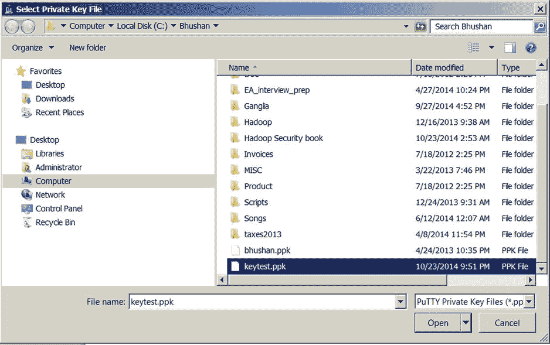
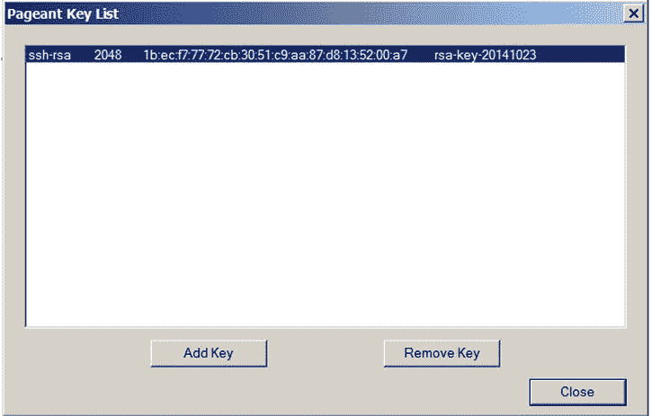
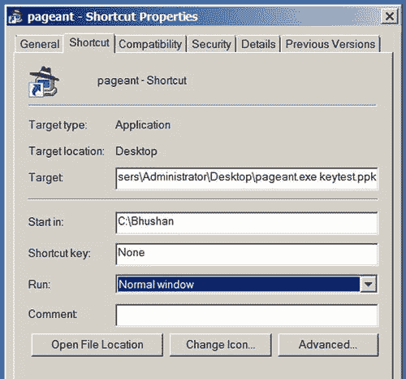

# 九、附录 A：Pageant 使用和实现

Pageant 是一个 SSH 认证代理，它可以与 PuTTY 或 WinSCP 一起使用，用于在内存中保存您的解密密钥，这样您就不需要在每次使用密钥对向服务器进行认证时输入密码来解密您的密钥([第 4 章](04.html)详细讨论了基于密钥的认证)。如果您使用多个密钥对来认证多个服务器，Pageant 甚至更有用。您可以使用 Pageant 将所有解密的密钥保存在内存中，这意味着您只需在启动 Windows 会话时输入一次相应的密码。当您注销您的 Windows 会话时，Pageant 会退出，而不会将解密的密钥保存在磁盘上，这就是您需要在启动您的 Windows 会话时再次输入密码短语的原因。

因为 Pageant 是 PuTTY 安装包的一部分，所以可以从同一个 URL ( `http://www.chiark.greenend.org.uk/~sgtatham/putty/download.html`)下载。当你运行可执行文件 Pageant.exe 开始 Pageant，一个图标，看起来像一个戴着帽子的电脑会出现在你的系统托盘。右键单击图标以调用 Pageant 菜单，然后选择所需的菜单选项:新建会话、保存的会话、查看密钥、添加密钥、关于或退出。但是，如果在添加键之前选择查看键，您将只会看到一个空的列表框。

使用 Pageant

要使用 Pageant，首先需要生成一个密钥对，并将公钥复制到需要连接的服务器上。例如，我生成了一个密钥对，并将密钥保存为`keytest.ppk`(私钥)和`keytest.pub`(公钥)。然后，我使用一个密码对私钥进行了加密。因为我想连接到主机`pract_hdp_sec`，所以我将我的公钥粘贴到。ssh 目录(正如在[第四章](04.html)中讨论的)。接下来，我将把解密的私钥存储在 Pageant 中。[图 A-1](#Fig1) 说明了选择和添加密钥。



[图 A-1](#_Fig1) 。为 Pageant 比赛添加关键点

当您选择一个密钥时(此处为`testkey.ppk`，系统会提示您输入密码短语([图 A-2](#Fig2) )。


[图 A-2](#_Fig2) 。使用 Pageant 存储密钥的密码短语

输入正确的密码短语后，Pageant 解密您的私钥，并将其保存在内存中，直到您注销 Windows 会话。您可以看到您的密钥在 Pageant 中列出，如[图 A-3](#Fig3) 所示。



[图 A-3](#_Fig3) 。列出 Pageant 比赛中存储的密钥

现在，您只需要在 PuTTY ( [图 A-4](#Fig4) )中指定您的私钥作为授权方式。


[图 A-4](#_Fig4) 。在 PuTTY 中指定基于密钥的认证

下次您想连接到服务器`pract_hdp_sec`时，只需打开一个 PuTTY 会话，它会提示您输入登录名。一旦你输入登录名，PuTTY 会直接将你连接到服务器，正如你在图 A-5 中看到的。


[图 A-5](#_Fig5) 。使用来自 Pageant 比赛的解密密钥执行基于密钥的认证

PuTTY 识别出 Pageant 正在运行，自动检索解密的密钥，并使用它进行认证。您可以根据需要为同一台服务器打开任意多个 PuTTY 会话，而无需再次键入密码。

此外，Pageant 可以在启动时自动加载多个私钥。例如，假设您每天需要连接十台服务器。每天手动将密钥添加到 Pageant 比赛中既困难又容易出错。要自动加载多个键，请使用类似下面的 Pageant 命令行；当然，目录路径取决于您的`Pageant.exe`或您的私钥文件(。ppk 文件)位于:

```scala
C:\Users\Administrator\Desktop>pageant.exe c:\bhushan\keytest.ppk c:\bhushan\bhushan.ppk

```

您可以添加多个由空格分隔的键。如果密钥是加密的，Pageant 会在启动时提示输入密码。如果 Pageant 已经在运行，并且您执行了这个命令，它会将密钥加载到现有的 Pageant 中。

你也可以创建一个快捷方式，并在那里指定命令行，如图[图 A-6](#Fig6) 所示。



[图 A-6](#_Fig6) 。为多个键指定起始(默认)目录

如果您只有一个私钥，请在**目标**字段中指定其完整路径:

```scala
C:\Users\Administrator\Desktop>pageant.exe c:\bhushan\keytest.ppk

```

如果您有多个键并且路径很长，您可以只指定一个起始目录，而不是为每个键指定路径。例如，要为我之前的多键示例指定一个起点，在**目标**字段中输入`C:\Users\Administrator\Desktop>pageant.exe keytest.ppk`，在**起点**字段中输入`C:\Bhushan`。

在 Pageant 初始化并加载命令行上指定的键之后，您可以命令 Pageant 启动另一个程序。此程序(例如 WinSCP 或 PuTTY 等。)然后可以使用 Pageant 加载的密钥。语法如下:

```scala
C:\Users\Administrator\Desktop>pageant.exe c:\bhushan\keytest.ppk -c C:\PuTTY\putty.exe

```

安全考虑

在 Pageant 中保存解密的私钥比在本地磁盘驱动器上存储密钥文件更安全，但是仍然存在一些已知的安全问题。

例如，Windows 不以任何方式保护“交换”数据(写入系统交换文件的内存数据)。因此，如果您长时间使用 Pageant，解密的密钥数据可能会被交换并写入磁盘。获得您硬盘访问权限的恶意攻击者也可以获得您的密钥。当然，这比将未加密的文件存储在本地磁盘驱动器上要安全得多，但仍然存在漏洞。

Windows 只有防止可执行代码写入另一个可执行程序的内存空间的安全措施；但是仍然提供对它的读访问。换句话说，程序可以访问彼此的内存空间，这是一种帮助调试的方式。不幸的是，恶意程序可以利用这一特性，并可以访问 Pageant 的内存来提取解密的密钥，并将它们用于非法目的。

然而，通过确保您的网络基础设施是安全的并且安装了防火墙，这些风险可以很容易地被减轻。