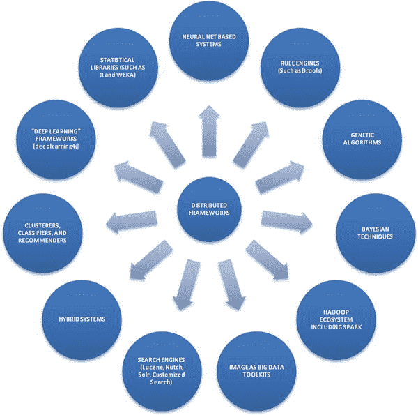
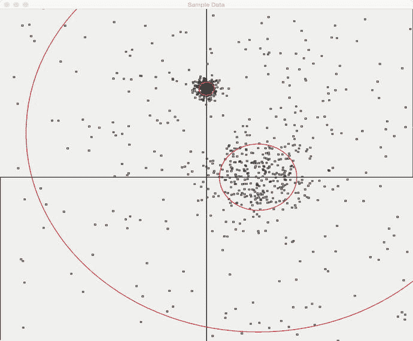
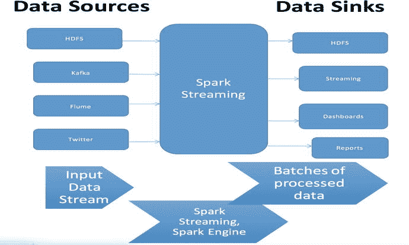
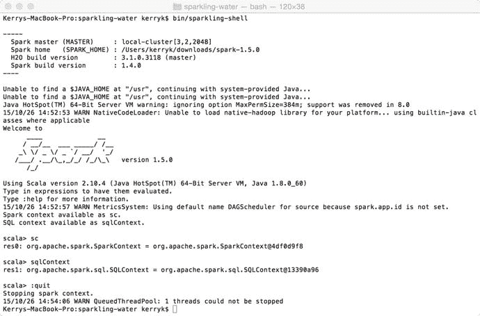

# 三、Hadoop 和分析的标准工具包

在这一章中，我们来看看 BDA 系统的必要组成部分:对构建 BDAs 最有用的标准库和工具包。我们使用 Hadoop 和 Spark 生态系统中的标准工具包描述了一个示例系统(我们将在本书的剩余部分中开发该系统)。我们还使用其他分析工具包，如 R 和 Weka，以及主流开发组件，如 Ant、Maven、npm、pip、Bower 和其他系统构建工具。Apache Camel、Spring Framework、Spring Data、Apache Kafka、Apache Tika 等“Glueware 组件”可用于创建适合各种应用程序的基于 Hadoop 的系统。

Note

Hadoop 及其相关组件的成功安装是评估本书中示例的关键。在标题为“在 Mac 上安装 Hadoop 第一部分”的文章中的 [`http://amodernstory.com/2014/09/23/installing-hadoop-on-mac-osx-yosemite/`](http://amodernstory.com/2014/09/23/installing-hadoop-on-mac-osx-yosemite/) 中描述了在 Mac 上相对轻松地安装 Hadoop 的方法

## 3.1 库、组件和工具包:调查

没有一章可以描述所有的大数据分析组件，这些组件可以帮助您构建 BDA 系统。我们只能建议组件的类别，谈一些典型的例子，并在后面的章节中对这些例子进行扩展。

有大量的图书馆支持 BDA 系统的建设。为了了解可用技术的范围，考虑图 [3-1](#Fig1) 中所示的组件。这并不是组件类型的唯一列表，但是当您意识到每种组件类型都有各种各样的工具包、库、语言和框架可供选择时，定义 BDA 系统技术堆栈可能会在一开始就显得势不可挡。为了克服这个定义问题，系统模块化和灵活性是关键。



图 3-1。

A whole spectrum of distributed techniques are available for building BDAs

构建模块化 BDA 系统最简单的方法之一是使用 Apache Maven 来管理依赖项，并为您完成大多数简单的组件管理。建立一个简单的 Maven `pom.xml`文件并在 Eclipse IDE 中创建一个简单的项目是让评估系统运行的好方法。我们可以从一个简单的 Maven `pom.xml`开始，类似于清单 [2-1](02.html#Par21) 中所示的那个。请注意，显示的唯一依赖项是 Hadoop 核心和 Apache Mahout，这是我们在第 [1](01.html) 章中讨论的 Hadoop 机器学习工具包，我们在示例中经常使用。我们将扩展 Maven pom 文件，以包含我们在本书后面使用的所有辅助工具包。你可以随意增加或减少组件，只需从`pom.xml`文件中移除依赖关系。

请记住，对于图表中显示的每种技术，都有几种备选方案。对于技术堆栈中的每个选择，通常都有方便的 Maven 依赖项，您可以将它们添加到您的评估系统中来检查功能，因此很容易混合和匹配组件。包含正确的“glueware”组件可以使不同库的集成不那么痛苦。

Note

为了有效地使用图书示例，需要设置以下重要的环境变量:

```scala
   export BDA_HOME="/Users/kerryk/workspace/bdt"

```

```scala
<project  xmlns:xsi="http://www.w3.org/2001/XMLSchema-instance"
  xsi:schemaLocation="http://maven.apache.org/POM/4.0.0 http://maven.apache.org/maven-v4_0_0.xsd">
  <modelVersion>4.0.0</modelVersion>
  <groupId>com.kildane</groupId>
  <artifactId>bdt</artifactId>
  <packaging>war</packaging>
  <version>0.0.1-SNAPSHOT</version>
  <name>Big Data Toolkit (BDT) Application</name>
  <url>http://maven.apache.org</url>
  <properties>
  <hadoop.version>0.20.2</hadoop.version>
  </properties>
  <dependencies>
    <dependency>
      <groupId>junit</groupId>
      <artifactId>junit</artifactId>
      <version>3.8.1</version>
      <scope>test</scope>
    </dependency>
    <dependency>
        <groupId>org.apache.hadoop</groupId>
        <artifactId>hadoop-core</artifactId>
        <version>${hadoop.version}</version>
</dependency>
<dependency>
        <groupId>org.apache.mahout</groupId>
        <artifactId>mahout-core</artifactId>
        <version>0.9</version>
</dependency>
  </dependencies>
  <build>
    <finalName>BDT</finalName>
  </build>
</project>

Listing 3-1.A basic pom.xml file for the evaluation system

```

构建模块化 BDA 系统最简单的方法是使用 Apache Maven 来管理依赖项，并为您完成大多数简单的组件管理。使用一个简单的 pom.xml 来启动您的 BDA 项目是试验模块、锁定技术堆栈和定义系统功能的好方法——根据需要逐步修改您的依赖项和插件。

设置一个简单的 Maven pom.xml 文件并在 Eclipse IDE 中创建一个简单的项目是让评估系统运行的一种简单方法。我们可以从一个简单的 Maven pom.xml 开始，类似于清单 [3-1](#Par9) 中所示。请注意，显示的唯一依赖项是 Hadoop Core 和 Apache Mahout，这是我们在第 [1](01.html) 章中讨论的 Hadoop 机器学习工具包，我们在示例中经常使用。我们将扩展 Maven pom 文件，以包含我们在本书后面使用的所有辅助工具包。只要从 pom.xml 文件中删除依赖项，就可以随意添加或删除组件。

让我们以举例的方式给评估系统添加一个规则系统。只需为 drools 规则系统添加适当的依赖项(对于 Drools 的大多数最新版本，请使用 Google“Drools maven 依赖项”)。清单 [3-2](#Par13) 中显示了完整的`pom.xml`文件(基于我们的原始文件)。我们将在第 8 章的完整分析引擎示例中利用 JBoss Drools 的功能。请注意，我们提供依赖关系来连接 Drools 系统和 Apache Camel 以及 Drools 的 Spring 框架。

```scala
<project  xmlns:xsi="http://www.w3.org/2001/XMLSchema-instance"
  xsi:schemaLocation="http://maven.apache.org/POM/4.0.0 http://maven.apache.org/maven-v4_0_0.xsd">
  <modelVersion>4.0.0</modelVersion>
  <groupId>com.kildane</groupId>
  <artifactId>bdt</artifactId>
  <packaging>war</packaging>
  <version>0.0.1-SNAPSHOT</version>
  <name>Big Data Toolkit (BDT) Application, with JBoss Drools Component</name>
  <url>http://maven.apache.org</url>
  <properties>
  <hadoop.version>0.20.2</hadoop.version>
  </properties>
  <dependencies>
    <dependency>
      <groupId>junit</groupId>
      <artifactId>junit</artifactId>
      <version>3.8.1</version>
      <scope>test</scope>
    </dependency>

<!--  add these five dependencies to your BDA project to achieve rule-based support -->
<dependency>
        <groupId>org.drools</groupId>
        <artifactId>drools-core</artifactId>
        <version>6.3.0.Final</version>
</dependency>
<dependency>
        <groupId>org.drools</groupId>
        <artifactId>drools-persistence-jpa</artifactId>
        <version>6.3.0.Final</version>
</dependency>
<dependency>
        <groupId>org.drools</groupId>
        <artifactId>drools-spring</artifactId>
        <version>6.0.0.Beta2</version>
</dependency>
<dependency>
        <groupId>org.drools</groupId>
        <artifactId>drools-camel</artifactId>
        <version>6.0.0.Beta2</version>
</dependency>
<dependency>
        <groupId>org.drools</groupId>
        <artifactId>drools-jsr94</artifactId>
        <version>6.3.0.Final</version>
</dependency>
    <dependency>
        <groupId>org.apache.hadoop</groupId>
        <artifactId>hadoop-core</artifactId>
        <version>${hadoop.version}</version>
</dependency>
<dependency>
        <groupId>org.apache.mahout</groupId>
        <artifactId>mahout-core</artifactId>
        <version>0.9</version>
</dependency>
  </dependencies>
  <build>
    <finalName>BDT</finalName>
  </build>
</project>

Listing 3-2.Add JBoss Drools dependencies to add rule-based support to your analytical engine. A complete example of a Drools use case is in Chapter 8!

```

## 3.2 在评估系统中使用深度学习

DL4j ( [`http://deeplearning4j.org`](http://deeplearning4j.org) )是一个面向 Java 和 Scala 的开源分布式深度学习库。它集成了 Hadoop 和 Spark。

要安装:

```scala
git clone https://github.com/deeplearning4j/dl4j-0.4-examples.git

```

要构建系统:

```scala
cd $DL4J_HOME directory

```

然后:

```scala
mvn clean install -DskipTests -Dmaven.javadoc.skip=true

```

要验证 dl4j 组件是否正常运行，请键入以下内容:

```scala
mvn exec:java -Dexec.mainClass="org.deeplearning4j.examples.tsne.TSNEStandardExample" -Dexec.cleanupDaemonThreads=false

```

如果组件运行成功，您将看到类似于清单 y.y .的文本输出。

```scala
[INFO] --- exec-maven-plugin:1.4.0:java (default-cli) @ deeplearning4j-examples ---
o.d.e.t.TSNEStandardExample - Load & Vectorize data....
Nov 01, 2015 1:44:49 PM com.github.fommil.jni.JniLoader liberalLoad
INFO: successfully loaded /var/folders/kf/6fwdssg903x6hq7y0fdgfhxc0000gn/T/jniloader545087044337083844netlib-native_system-osx-x86_64.jnilib
o.d.e.t.TSNEStandardExample - Build model....
o.d.e.t.TSNEStandardExample - Store TSNE Coordinates for Plotting....
o.d.plot.Tsne - Calculating probabilities of data similarities..
o.d.plot.Tsne - Mean value of sigma 0.00
o.d.plot.Tsne - Cost at iteration 0 was 98.8718490600586
o.d.plot.Tsne - Cost at iteration 1 was 98.8718490600586
o.d.plot.Tsne - Cost at iteration 2 was 98.8718490600586
o.d.plot.Tsne - Cost at iteration 3 was 98.8718490600586
o.d.plot.Tsne - Cost at iteration 4 was 98.8718490600586
o.d.plot.Tsne - Cost at iteration 5 was 98.8718490600586
o.d.plot.Tsne - Cost at iteration 6 was 98.8718490600586
o.d.plot.Tsne - Cost at iteration 7 was 98.8718490600586
o.d.plot.Tsne - Cost at iteration 8 was 98.87185668945312
o.d.plot.Tsne - Cost at iteration 9 was 98.87185668945312
o.d.plot.Tsne - Cost at iteration 10 was 98.87186431884766
......    ......    ......   .......   .....  ......
o.d.plot.Tsne - Cost at iteration 98 was 98.99024963378906
o.d.plot.Tsne - Cost at iteration 99 was 98.99067687988281
[INFO] ------------------------------------------------------------------------
[INFO] BUILD SUCCESS
[INFO] ------------------------------------------------------------------------
[INFO] Total time: 23.075 s
[INFO] Finished at: 2015-11-01T13:45:06-08:00
[INFO] Final Memory: 21M/721M
[INFO] ------------------------------------------------------------------------
Listing 3-3.Output from the deep learning 4j test routine

```

为了在我们的评估系统中使用`deeplearning4j`组件，我们现在需要对我们的 BDA pom 文件进行迄今为止最广泛的修改。完整的文件如清单 [3-4](#Par26) 所示。

```scala
<project  xmlns:xsi="http://www.w3.org/2001/XMLSchema-instance"
        xsi:schemaLocation="http://maven.apache.org/POM/4.0.0 http://maven.apache.org/maven-v4_0_0.xsd">
        <modelVersion>4.0.0</modelVersion>
        <groupId>com.kildane</groupId>
        <artifactId>bdt</artifactId>
        <packaging>war</packaging>
        <version>0.0.1-SNAPSHOT</version>
        <name>Big Data Toolkit (BDT) Application</name>
        <url>http://maven.apache.org</url>
        <properties>
        <!--  new properties for deep learning (dl4j) components -->
                <nd4j.version>0.4-rc3.5</nd4j.version>
                <dl4j.version> 0.4-rc3.4 </dl4j.version>
                <canova.version>0.0.0.11</canova.version>
                <jackson.version>2.5.1</jackson.version>

                <hadoop.version>0.20.2</hadoop.version>
                <mahout.version>0.9</mahout.version>
        </properties>
        <!--  distribution management for dl4j  -->
        <distributionManagement>
                <snapshotRepository>
                        <id>sonatype-nexus-snapshots</id>
                        <name>Sonatype Nexus snapshot repository</name>
                        <url>https://oss.sonatype.org/content/repositories/snapshots</url>
                </snapshotRepository>
                <repository>
                        <id>nexus-releases</id>
                        <name>Nexus Release Repository</name>
                        <url>http://oss.sonatype.org/service/local/staging/deploy/maven2/</url>
                </repository>
        </distributionManagement>
        <dependencyManagement>
                <dependencies>
                        <dependency>
                                <groupId>org.nd4j</groupId>
                                <artifactId>nd4j-jcublas-7.5</artifactId>
                                <version>${nd4j.version}</version>
                        </dependency>
                </dependencies>
        </dependencyManagement>
        <repositories>
                <repository>
                        <id>pentaho-releases</id>
                        <url>http://repository.pentaho.org/artifactory/repo/</url>
                </repository>
        </repositories>
        <dependencies>
                <!--  dependencies for dl4j components -->
                <dependency>
                        <groupId>org.deeplearning4j</groupId>
                        <artifactId>deeplearning4j-nlp</artifactId>
                        <version>${dl4j.version}</version>
                </dependency>
                <dependency>
                        <groupId>org.deeplearning4j</groupId>
                        <artifactId>deeplearning4j-core</artifactId>
                        <version>${dl4j.version}</version>
                </dependency>
                <dependency>
                        <groupId>org.nd4j</groupId>
                        <artifactId>nd4j-x86</artifactId>
                        <version>${nd4j.version}</version>
                </dependency>
                <dependency>
                        <groupId>org.jblas</groupId>
                        <artifactId>jblas</artifactId>
                        <version>1.2.4</version>
                </dependency>
                <dependency>
                        <artifactId>canova-nd4j-image</artifactId>
                        <groupId>org.nd4j</groupId>
                        <version>${canova.version}</version>
                </dependency>
                <dependency>
                        <groupId>com.fasterxml.jackson.dataformat</groupId>
                        <artifactId>jackson-dataformat-yaml</artifactId>
                        <version>${jackson.version}</version>
                </dependency>

                <dependency>
                        <groupId>org.apache.solr</groupId>
                        <artifactId>solandra</artifactId>
                        <version>UNKNOWN</version>
                </dependency>
                <dependency>
                        <groupId>junit</groupId>
                        <artifactId>junit</artifactId>
                        <version>3.8.1</version>
                        <scope>test</scope>
                </dependency>
                <dependency>
                        <groupId>org.apache.hadoop</groupId>
                        <artifactId>hadoop-core</artifactId>
                        <version>${hadoop.version}</version>
                </dependency>
                <dependency>
                        <groupId>pentaho</groupId>
                        <artifactId>mondrian</artifactId>
                        <version>3.6.0</version>
                </dependency>
                <!-- add these five dependencies to your BDA project to achieve rule-based
                        support -->
                <dependency>
                        <groupId>org.drools</groupId>
                        <artifactId>drools-core</artifactId>
                        <version>6.3.0.Final</version>
                </dependency>
                <dependency>
                        <groupId>org.drools</groupId>
                        <artifactId>drools-persistence-jpa</artifactId>
                        <version>6.3.0.Final</version>
                </dependency>
                <dependency>
                        <groupId>org.drools</groupId>
                        <artifactId>drools-spring</artifactId>
                        <version>6.0.0.Beta2</version>
                </dependency>
                <dependency>
                        <groupId>org.apache.spark</groupId>
                        <artifactId>spark-streaming_2.10</artifactId>
                        <version>1.5.1</version>
                </dependency>
                <dependency>
                        <groupId>org.drools</groupId>
                        <artifactId>drools-camel</artifactId>
                        <version>6.0.0.Beta2</version>
                </dependency>
                <dependency>
                        <groupId>org.drools</groupId>
                        <artifactId>drools-jsr94</artifactId>
                        <version>6.3.0.Final</version>
                </dependency>

                <dependency>
                        <groupId>com.github.johnlangford</groupId>
                        <artifactId>vw-jni</artifactId>
                        <version>8.0.0</version>
                </dependency>
                <dependency>
                        <groupId>org.apache.mahout</groupId>
                        <artifactId>mahout-core</artifactId>
                        <version>${mahout.version}</version>
                </dependency>
                <dependency>
                        <groupId>org.apache.mahout</groupId>
                        <artifactId>mahout-math</artifactId>
                        <version>0.11.0</version>
                </dependency>
                <dependency>
                        <groupId>org.apache.mahout</groupId>
                        <artifactId>mahout-hdfs</artifactId>
                        <version>0.11.0</version>
                </dependency>
        </dependencies>
        <build>
                <finalName>BDT</finalName>
                <plugins>
                        <plugin>
                                <groupId>org.codehaus.mojo</groupId>
                                <artifactId>exec-maven-plugin</artifactId>
                                <version>1.4.0</version>
                                <executions>
                                        <execution>
                                                <goals>
                                                        <goal>exec</goal>
                                                </goals>
                                        </execution>
                                </executions>
                                <configuration>
                                        <executable>java</executable>
                                </configuration>
                        </plugin>
                        <plugin>
                                <groupId>org.apache.maven.plugins</groupId>
                                <artifactId>maven-shade-plugin</artifactId>
                                <version>1.6</version>
                                <configuration>
                                        <createDependencyReducedPom>true</createDependencyReducedPom>
                                        <filters>
                                                <filter>
                                                        <artifact>*:*</artifact>
                                                        <excludes>
                                                                <exclude>org/datanucleus/**</exclude>
                                                                <exclude>META-INF/*.SF</exclude>
                                                                <exclude>META-INF/*.DSA</exclude>
                                                                <exclude>META-INF/*.RSA</exclude>
                                                        </excludes>
                                                </filter>
                                        </filters>
                                </configuration>
                                <executions>
                                        <execution>
                                                <phase>package</phase>
                                                <goals>
                                                        <goal>shade</goal>
                                                </goals>
                                                <configuration>
                                                        <transformers>
                                                                <transformer
                                                                        implementation="org.                                  apache.maven.plugins.shade.resource.AppendingTransformer">
                                                                        <resource>reference.conf</resource>
                                                                </transformer>
                                                                <transformer
                                                                        implementation="org.                         apache.maven.plugins.shade.resource.ServicesResourceTransformer" />
                                                                <transformer
                                                                        implementation="org.                           apache.maven.plugins.shade.resource.ManifestResourceTransformer">
                                                                </transformer>
                                                        </transformers>
                                                </configuration>
                                        </execution>
                                </executions>
                        </plugin>
                        <plugin>
                                <groupId>org.apache.maven.plugins</groupId>
                                <artifactId>maven-compiler-plugin</artifactId>
                                <configuration>
                                        <source>1.7</source>
                                        <target>1.7</target>
                                </configuration>
                        </plugin>
                </plugins>
        </build>
</project>

Listing 3-4.Complete listing to include deeplearning 4j components

```

在扩充您的 BDA 评估项目以使用这个`pom.xml`之后，执行`maven clean`、`install`和`package`任务以确保您的项目正确编译。

## 3.3 Spring 框架和 Spring 数据的使用

Spring 框架( [`https://spring.io`](https://spring.io) )及其相关框架 Spring 数据(`projects.spring.io/spring-data`)是重要的 glueware 组件，但是 Spring 框架也提供了各种各样的功能资源。这些包括安全性、ORM 连接性、基于模型-视图-控制器(MVC)的应用程序开发等等。Spring Framework 使用面向方面的编程方法来解决横切关注点，并完全支持 Java 代码中各种称为“原型”的注释，最大限度地减少了手工制作样板文件的需要。

我们将在本书中使用 Spring Framework 来利用它提供的复杂功能资源，并研究 Spring Data Hadoop 组件(`projects.spring.io/spring-hadoop/`)，这是 Hadoop 和 Spring 的无缝集成。特别是，我们将在第 [9](09.html) 章开发的完整分析系统中使用几个 Spring 框架组件。

## 3.4 数字和统计库:R、Weka 和其他

在这一节中，我们将讨论 R 和 Weka 统计库。R ( `r-project.org`)是一种专门为统计分析开发的解释性高级语言。Weka ( [`http://www.cs.waikato.ac.nz/ml/weka`](http://www.cs.waikato.ac.nz/ml/weka) )是一个强大的统计库，为数据挖掘和其他分析任务提供机器学习算法。一个有趣的新发展是分布式 R 和分布式 Weka 工具包。有关 Mark Hall 的 DistributedWekaBase 和 Distributed Weka 的信息，请访问

*   [T2`http://weka.sourceforge.net/packageMetaData/distributedWekaBase/index.html`](http://weka.sourceforge.net/packageMetaData/distributedWekaBase/index.html)
*   [T2`http://weka.sourceforge.net/packageMetaData/distributedWekaHadoop/index.html`](http://weka.sourceforge.net/packageMetaData/distributedWekaHadoop/index.html)

## 3.5 分布式系统中的 OLAP 技术

OLAP(在线分析处理)是另一种古老的分析技术，它在 20 世纪 70 年代就已经出现，并在“大数据时代”复兴已经开发了几个强大的库和框架来支持大数据 OLAP 操作。其中最有趣的两个是 Pentaho 的 Mondrian ( [`http://community.pentaho.com/projects/mondrian/`](http://community.pentaho.com/projects/mondrian/) )和 Apache 的一个新孵化器项目 Apache Kylin ( [`http://kylin.incubator.apache.org`](http://kylin.incubator.apache.org) )。Pentaho Mondrian 提供了一个开源的分析引擎和自己的查询语言 MDX。要将 Pentaho Mondrian 添加到您的评估系统中，请将这个存储库和依赖项添加到您的`pom.xml`中:

```scala
<repository>
    <id>pentaho-releases</id>
    <url>http://repository.pentaho.org/artifactory/repo/</url>
  </repository>

<dependency>
  <groupId>pentaho</groupId>
  <artifactId>mondrian</artifactId>
  <version>3.6.0</version>
</dependency>

```

Apache Kylin 提供了 ANSI SQL 接口和多维分析，利用了 Hadoop 功能。Apache Kylin 也支持 Tableau ( `get.tableau.com`)等商业智能工具。

在第 [9](09.html) 章中，我们将使用 Apache Kylin 开发一个完整的分析引擎示例来提供 OLAP 功能。

## 3.6 用于分析的 Hadoop 工具包:Apache Mahout 和朋友

Apache Mahout ( `mahout.apache.org`)是一个机器学习库，专门设计用于 Apache Hadoop，以及更新版本的 Mahout 和 Apache Spark。像大多数现代软件框架一样，Mahout 与 Samsara 耦合，Samsara 是一个与 Mahout 协作的附加组件，为 Mahout 功能提供高级数学库支持。Apache Mahout 也可以与 MLlib 等兼容库一起使用。关于高级功能的更多信息可以在 Apache Mahout 和其他基于 Hadoop 的机器学习包的大量教程和书籍中找到。

Mahout 包含许多为分布式处理实现的标准算法。其中一些算法包括分类算法，如随机森林分类算法、多层感知器神经网络分类器的实现、朴素贝叶斯分类器和许多其他分类算法。这些可以单独使用，也可以作为数据管道中的阶段使用，甚至可以与正确的配置设置并行使用。

Vowpal Wabbit ( [`https://github.com/JohnLangford/vowpal_wabbit`](https://github.com/JohnLangford/vowpal_wabbit) )是雅虎发起的一个开源项目并由微软研究院继续。大众的一些特性包括稀疏降维、快速特性查找、多项式学习和集群并行学习，所有这些都是在我们的 BDA 系统中使用的有效技术。VW 最有趣的扩展之一是 RESTful web 界面，可以在

关于 Vowpal-Wabbit 以及如何正确设置和运行 VW 的详细讨论，请参见 [`http://zinkov.com/posts/2013-08-13-vowpal-tutorial/`](http://zinkov.com/posts/2013-08-13-vowpal-tutorial/) 。

要安装大众系统，您可能需要先安装`boost`系统。

在 Mac OS 上，键入以下三个命令(如果您愿意，可以稍后重新`chmod`您的`/usr/local/lib`):

```scala
sudo chmod 777 /usr/local/lib
brew install boost
brew link boost

git clone git://github.com/JohnLangford/vowpal_wabbit.git
cd $VW_HOME
make
make test

```

你可能还想研究一下大众非常有趣的网络界面，可以在 [`https://github.com/eHarmony/vw-webservice`](https://github.com/eHarmony/vw-webservice) 找到。要安装:

```scala
git clone https://github.com/eHarmony/vw-webservice.git
cd $VW_WEBSERVICE_HOME
mvn clean install package

```

## 3.7 Apache Mahout 中的可视化

Apache Mahout 具有基于`java.awt`图形包的内置集群可视化功能。聚类可视化的一个简单例子如图 [3-2](#Fig2) 所示。在可视化技术一章中，我们将讨论这个基本系统的扩展和替代方案，旨在提供更高级的可视化功能，扩展可视化控件和显示，以包括“作为大数据的图像”显示以及一些以 Mahout 为中心的仪表板。



图 3-2。

A simple data point visualization using Apache Mahout

## 3.8 Apache Spark 库和组件

Apache Spark 库和组件对于本书中开发的 BDA 系统的开发是必不可少的。为了帮助开发人员，Spark 附带了 Python 交互式 shell 和 Scala 交互式 shell。随着本书的进展，我们将详细了解 Apache Spark，因为它是 Hadoop MapReduce 技术最有用的替代技术之一。在这一部分中，我们将提供对 Spark 技术及其生态系统的高水平概述。

### 3.8.1 多种不同的外壳可供选择

有许多 Python 和 Scala shells 可供选择，在 Java 9 中，我们可以期待一个基于 Java 的读取-评估-打印循环(REPL)。

要运行 Spark Python shell，请键入:

```scala
/bin/pyspark --master spark://server.com:7077 --driver-memory 4g --executor-memory 4g

```

要运行 Spark Scala shell，请键入:

```scala
./spark-1.2.0/bin/spark-shell --master spark://server.com:7077 --driver-memory 4g --executor-memory 4g

```

一旦你成功安装了`sparkling-water`包，你就可以使用如图 [3-4](#Fig4) 所示的闪亮外壳作为你的 Scala 外壳。为了方便起见，它已经有了一些到 Apache Spark 的方便挂钩。

### 3.8.2 Apache Spark 流

Spark Streaming 是一个容错、可伸缩和高吞吐量的流处理器。

Note

Apache 流正在积极开发中。关于 Spark 流的信息经常发生变化。请参考 [`http://spark.apache.org/docs/latest/streaming-programming-guide.html`](http://spark.apache.org/docs/latest/streaming-programming-guide.html) 以获取 Apache 流的最新信息。在本书中，我们主要指的是 Spark 1.5.1 版本。

要将 Spark 流添加到您的 Java 项目中，请将这个依赖项添加到您的`pom.xml`文件中(从 Spark 网站获取最新的版本参数以供使用):

```scala
<dependency>
    <groupId>org.apache.spark</groupId>
    <artifactId>spark-streaming_2.10</artifactId>
    <version>1.5.1</version>
</dependency>

```

图 [3-3](#Fig3) 中显示了 Spark 流系统的简图。输入数据流通过 Spark 引擎进行处理，并作为批量处理数据发出。



图 3-3。

A simplified diagram of the Spark Streaming system

Spark Streaming 还兼容亚马逊 Kinesis ( [`https://aws.amazon.com/kinesis/`](https://aws.amazon.com/kinesis/) )，即 AWS 数据流平台。

### 3.8.3 苏打水和 H20 机器学习

苏打水(`h20.ai`)是 H20 机器学习工具包，集成到 Apache Spark 中。对于苏打水，您可以使用 Spark 数据结构作为 H20s 算法的输入，并且有一个 Python 接口允许您直接从 PyShe ll 使用苏打水。



图 3-4。

Running the Sparkling Water shell to test your installation

## 3.9 组件使用和系统构建示例

在本节中，我们将使用 Solandra (Solr + Cassandra)系统作为构建 BDA 的简单示例，该系统具有执行大数据分析所需的所有要素。在第 [1](01.html) 章中，我们简要介绍了 Solr，一个开源的 RESTful 搜索引擎组件，它与 Hadoop 和卡珊德拉 NoSQL 数据库都兼容。我们的大部分设置可以使用 Maven 来完成，如清单 [3-4](#Par26) 所示。您会注意到，这里列出的 pom 文件与我们最初的项目 pom 文件相同，增加了 Solr、Solandra 和 Cassandra 组件的依赖项。

1.  从 Git 源( [`https://github.com/tjake/Solandra`](https://github.com/tjake/Solandra) ):

    ```scala
    git clone https://github.com/tjake/Solandra.git

    ```

    下载 Solandra
2.  `cd`到 Solandra 目录，用 Maven:

    ```scala
    cd Solandra
    mvn -DskipTests clean install package

    ```

    创建 JAR 文件
3.  将 JAR 文件添加到本地 Maven 存储库中，因为 Solandra 还没有标准的 Maven 依赖项:

    ```scala
    mvn install:install-file -Dfile=solandra.jar -DgroupId=solandra -DartifactId=solandra -Dpackaging=jar -Dversion=UNKNOWN

    ```

4.  修改您的 BDA 系统`pom.xml`文件，并添加 Solandra 依赖项:

    ```scala
    <dependency>
            <groupId>org.apache.solr</groupId>
            <artifactId>solandra</artifactId>
            <version>UNKNOWN</version>
    </dependency>

    ```

5.  测试你的新 BDA `pom.xml` :

    ```scala
    cd $BDA_HOME
    mvn clean install package

    ```

Building the Apache KAFKA Messaging System

在这一节中，我们将详细讨论如何设置和使用 Apache Kafka 消息传递系统，这是我们的示例 BDA 框架的一个重要组件。

1.  从 [`http://kafka.apache.org/downloads.html`](http://kafka.apache.org/downloads.html) 下载阿帕奇卡夫卡 TAR 文件
2.  设置`KAFKA_HOME`环境变量。
3.  解压文件并转到`KAFKA_HOME`(在这种情况下`KAFKA_HOME`就是`/Users/kerryk/Downloads/kafka_2.9.1-0.8.2.2`)。
4.  接下来，通过键入

    ```scala
    bin/zookeeper-server-start.sh  config/zookeeper.properties

    ```

    启动 ZooKeeper 服务器
5.  一旦 ZooKeeper 服务启动并运行，输入:

    ```scala
    bin/kafka-server-start.sh config/server.properties

    ```

6.  要测试主题创建，请键入:

    ```scala
    bin/kafka-topics.sh –create –zookeeper localhost:2181 –replication-factor 1 –partitions 1 –topic ProHadoopBDA0

    ```

7.  要提供所有可用主题的列表，请键入:

    ```scala
    bin/kafka-topics.sh –list –zookeeper localhost:2181

    ```

    在这一阶段，结果将是`ProHadoopBDA0`，这是您在步骤 5 中定义的主题的名称。
8.  从控制台发送一些消息来测试消息发送功能。键入:

    ```scala
    bin/kafka-console-producer.sh –broker-list localhost:9092 –topic ProHadoopBDA0

    ```

    现在在控制台中键入一些消息。
9.  您可以通过修改适当的配置文件来配置多代理集群。查看 Apache Kafka 文档，了解如何实现这一点的分步过程。

## 3.10 示例系统的包装、测试和记录

在这一节中，我们将讨论 BDA 单元和集成测试。我们将讨论 Apache Bigtop ( `bigtop.apache.com`)和 Apache MRUnit ( `mrunit.apache.com`)。

```scala
import unittest

class TestStringMethods(unittest.TestCase):

  def test_upper(self):
      self.assertEqual('foo'.upper(), 'FOO')

  def test_isupper(self):
      self.assertTrue('FOO'.isupper())
      self.assertFalse('Foo'.isupper())

  def test_split(self):
      s = 'hello world'
      self.assertEqual(s.split(), ['hello', 'world'])
      # check that s.split fails when the separator is not a string

      with self.assertRaises(TypeError):
          s.split(2)

if __name__ == '__main__':
    unittest.main()

Listing 3-5.Example of Python unit testing
from 
https://docs.python.org/2/library/unittest.html

```

为了进行测试，整本书我们将使用来自 [`http://archive.ics.uci.edu/ml/machine-learning-databases/`](http://archive.ics.uci.edu/ml/machine-learning-databases/) 的测试数据集以及来自 [`http://www.dm.unibo.it/~simoncin/DATA.html`](http://www.dm.unibo.it/%7Esimoncin/DATA.html) 的博洛尼亚大学的数据库。对于 Python 测试，我们将使用 py unit(Java 单元测试 JUnit 框架的一个基于 Python 的版本)和 pytest ( `pytest.org`)，一个替代的 Python 测试框架。清单 [3-5](#Par90) 显示了 Python 测试组件的一个简单示例。


图 3-5。

An architecture diagram for the “Sparkling Water” Spark + H20 System

## 3.11 摘要

在这一章中，我们使用了一个可扩展示例系统的第一部分来帮助激发我们关于基于 Hadoop 和 Spark 的大数据分析的标准库的讨论。我们还了解到，虽然有数不清的库、框架和工具包用于广泛的分布式分析领域，但是所有这些组件都可以通过小心使用良好的开发环境来驯服。我们选择了 Eclipse IDE、Scala 和 Python 插件支持，并使用 Maven、npm、easy_install 和 pip 构建工具来简化我们的工作并帮助组织我们的开发过程。仅使用 Maven 系统，我们就能够将大量工具集成到一个简单但功能强大的图像处理模块中，该模块拥有良好的 BDA 数据流水线应用程序的许多基本特征。

在本章中，我们反复回到了模块化设计的主题，展示了如何使用我们在第 [1](01.html) 章中讨论的标准十步流程来定义和构建各种数据管道系统。我们还了解了可用于帮助我们的库的类别，包括数学、统计、机器学习、图像处理和许多其他方面。我们详细讨论了如何安装和使用 Apache Kafka 消息传递系统，这是我们在本书其余部分的示例系统中使用的一个重要组件。

有许多语言绑定可用于这些大数据 Hadoop 包，但我们将讨论局限于 Java、Scala 和 Python 编程语言。如果应用程序需要，您可以自由使用其他语言绑定。

我们没有忽视我们的示例系统的测试和文档。虽然这些组件通常被视为“必要的邪恶”、“附加的”、“多余的”或“不必要的”，但是单元和集成测试仍然是任何成功的分布式系统的关键组件。我们讨论了 MRUnit 和 Apache Bigtop 作为评估 BDA 系统的可行测试工具。有效的测试和文档导致有效的剖析和优化，以及在许多其他方面的整体系统改进。

我们不仅学习了如何使用 Apache Mahout 构建以 Hadoop 为中心的 BDA，还学习了如何使用 Apache Spark 作为基础构建模块，使用 PySpark、MLlib、H20 和 Sparkling Water 库。用于机器学习和 BDA 构建的 Spark 技术现在是利用强大的机器学习、认知计算和自然语言处理库来构建和扩展您自己的 BDA 系统的成熟而有用的方法。

## 3.12 参考文献

贾科姆利，皮耶罗。阿帕奇看象人食谱。英国伯明翰。，派克特出版社，2013 年。

古普塔，阿希什。学习 Apache Mahout 分类。英国伯明翰。，派克特出版社，2015 年。

格兰杰、特雷和波特、蒂莫西。Solr 在行动。纽约州谢尔特岛:曼宁出版公司，2014 年。

穆罕默德·古勒。Spark 大数据分析:Spark 大规模数据分析实践指南。Apress/Springer 科学+商业媒体纽约，2015 年。

麦克肯多斯，迈克尔，哈奇，埃里克，还有高斯波德尼克，奥蒂斯。Lucene 在行动，第二版。纽约州谢尔特岛:曼宁出版公司，2010 年。

欧文、肖恩、安尼尔、罗伯特、邓宁、泰德和弗里德曼、艾伦。看象人在行动。纽约州谢尔特岛:曼宁出版公司，2011 年。

道格·特恩布尔和约翰·贝里曼。相关搜索:Solr 和 Elasticsearch 的应用。纽约州谢尔特岛:曼宁出版公司，2016 年。