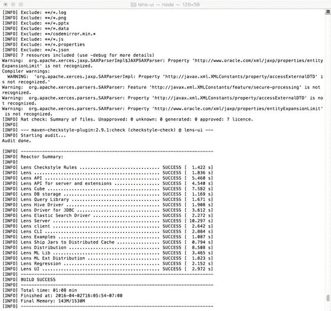

# 四、关系数据库、NoSQL 数据库和图数据库

在本章中，我们描述了数据库在分布式大数据分析中的作用。数据库类型包括关系数据库、文档数据库、图数据库等，它们可以在我们的分析管道中用作数据源或接收器。这些数据库类型中的大多数都可以与 Hadoop 生态系统组件以及 Apache Spark 很好地集成。不同种类的数据库和 Hadoop/Apache Spark 分布式处理之间的连接可能由 Spring Data 或 Apache Camel 等“glueware”提供。我们描述了关系数据库，如 MySQL，NoSQL 数据库，如 Cassandra，图数据库，如 Neo4j，以及如何将它们与 Hadoop 生态系统集成。

有一系列数据库类型可供您使用，如图 [4-1](#Fig1) 所示。这些包括平面文件(甚至 CSV 文件也是一种数据库)、关系数据库(如 MySQL 和 Oracle)、关键值数据存储(如 Redis)、列数据库(如 HBase，Hadoop 生态系统的一部分)以及更奇特的数据库类型(如 graph 数据库，包括 Neo4J、GraphX 和 Giraph)


图 4-1。

A spectrum of database types

我们可以将不同数据库类型的概念“抽象”为通用数据源，并提出一个公共 API 来连接、处理和输出这些数据源的内容。这让我们可以根据需要灵活地使用不同种类的数据库。有时有必要采用“即插即用”的方法进行评估，或者构建概念验证系统。在这些情况下，使用 NoSQL 数据库(如 MongoDB)并与 Cassandra 数据库甚至图数据库组件进行性能比较会很方便。评估后，根据您的需求选择合适的数据库。为此使用合适的 glueware，无论是 Apache Camel、Spring Data 还是 Spring Integration，都是构建可以快速更改的模块化系统的关键。glueware 的大部分代码可以保持与现有代码库相同或相似。如果胶制品选择得当，只需最少的返工。

上面显示的所有数据库类型都可以用作分布式系统数据源，包括关系数据库，如 MySQL 或 Oracle。使用关系数据源实现的典型的基于 ETL 的处理流程可能看起来像图 [4-2](#Fig2) 中所示的数据流。

1.  循环开始。处理周期的开始是整个系统运行的入口部分。它是从哪里开始调度处理任务的参考点，也是系统必须重新启动时的返回点。
2.  参考数据大楼。“引用数据”是指可以在单个表字段或键-值对的“值”部分中使用的有效数据类型。
3.  源提取。从原始数据源中检索数据，并对数据进行任何必要的预处理。这可能是初步的数据清理或格式化步骤。
4.  验证阶段。评估数据的一致性。
5.  数据转换。对数据集执行“业务逻辑”操作以产生中间结果。
6.  加载到临时表/数据缓存或存储库(如果使用的话)。临时表是中间数据存储区域，也可以是缓存或文档数据库。
7.  报告审核(针对业务规则遵从性或诊断/修复阶段)。计算并格式化报告结果，导出为可显示的格式(可以是任何格式，从 CSV 文件到网页，再到复杂的交互式仪表板显示)。其他形式的报告可以指示数据处理的效率、定时和性能数据、系统健康数据等。这些辅助报告支持主报告任务，即一致地传达对原始数据源内容的数据分析操作的结果。
8.  发布到目标表/存储库。到目前为止，结果被导出到指定的输出表或数据存储库，这些输出表或数据存储库可以采用多种形式，包括键/值缓存、文档数据库，甚至图数据库。
9.  存档备份数据。拥有备份策略对于图数据和传统数据同样重要。复制、验证和高效恢复是必须的。
10.  记录周期状态和错误。我们可以利用标准的日志结构，甚至在 Java 代码中的 Log4j 级别，或者我们可能希望在必要时使用更复杂的错误日志和报告。


图 4-2。

Extract-Transform-Load (ETL) processing lifecycle

根据需要重复。您可以详细说明各个步骤，或者根据需要专门解决您的各个领域的问题。

## 4.1 图形查询语言:Cypher 和 Gremlin

Cypher ( [`http://neo4j.com/developer/cypher-query-language/`](http://neo4j.com/developer/cypher-query-language/) )和 Gremlin ( [`http://tinkerpop.incubator.apache.org/gremlin.html`](http://tinkerpop.incubator.apache.org/gremlin.html) )是两种比较知名的图查询语言。大多数情况下，对于具有 SQL 风格查询语言背景的程序员来说，图形查询语言被设计得相对直观。图查询语言使用节点、边、关系和模式来形成关于被建模为图的数据集的断言和查询。有关 Gremlin 查询语言的更多信息，请参考 Apache TinkerPop 的网页( [`http://tinkerpop.incubator.apache.org`](http://tinkerpop.incubator.apache.org) )。

要使用新的 TinkerPop 3(撰写本书时正在酝酿项目),只需在 pom.xml 文件中包含以下依赖项:

```scala
<dependency>
  <groupId>org.apache.tinkerpop</groupId>
  <artifactId>gremlin-core</artifactId>
  <version>3.2.0-incubating</version>
</dependency>

```

一旦依赖关系在 Java 项目中就位，您就可以对 Java API 进行编程，如清单 4-1 和 4-2 所示。更多信息请参见在线文档: [`https://neo4j.com/developer/cypher-query-language/`](https://neo4j.com/developer/cypher-query-language/) 和 [`http://tinkerpop.incubator.apache.org`](http://tinkerpop.incubator.apache.org) 。

## 4.2 密码中的示例

要在 Cypher 中创建节点:

```scala
CREATE (kerry:Person {name:"Kerry"})

RETURN kerry

MATCH (neo:Database {name:"Neo4j"})

MATCH (arubo:Person {name:"Arubo"})

CREATE (anna)-[:FRIEND]->(:Person:Expert {name:"Arubo"})-[:WORKED_WITH]->(neo)

```

要使用 cURL 导出到 CSV 文件:

```scala
curl -H accept:application/json -H content-type:application/json \
     -d '{"statements":[{"statement":"MATCH (p1:PROFILES)-[:RELATION]-(p2) RETURN ... LIMIT 4"}]}' \
     http://localhost:7474/db/data/transaction/commit \
  | jq -r '(.results[0]) | .columns,.data[].row | @csv'

```

和计时性能，请使用

```scala
curl -H accept:application/json -H content-type:application/json \
     -d '{"statements":[{"statement":"MATCH (p1:PROFILES)-[:RELATION]-(p2) RETURN ..."}]}' \
     http://localhost:7474/db/data/transaction/commit \
     | jq -r '(.results[0]) | .columns,.data[].row | @csv' | /dev/null

```

## 4.3 Gremlin 中的示例

Gremlin 图形查询语言是 Cypher 的替代语言。

在图形中添加新顶点

```scala
g.addVertex([firstName:'Kerry',lastName:'Koitzsch',age:'50']); g.commit();

```

这将需要多个语句。注意变量(jdoe 和 mj)是如何定义的，只需从 Gremlin 查询中给它们赋值。

```scala
jdoe = g.addVertex([firstName:'John',lastName:'Doe',age:'25']);  mj = g.addVertex([firstName:'Mary',lastName:'Joe',age:'21']); g.addEdge(jdoe,mj,'friend'); g.commit();

```

在 id 为 1 和 2 的两个现有顶点之间添加关系

```scala
g.addEdge(g.v(1),g.v(2),'coworker'); g.commit();

```

从图形中移除所有顶点:

```scala
g.V.each{g.removeVertex(it)}
g.commit();

```

从图形中删除所有边

```scala
g.E.each{g.removeEdge(it)}
g.commit();

```

移除名字为' Kerry '的所有顶点

```scala
g.V('firstName','Kerry').each{g.removeVertex(it)}
g.commit();

```

移除 id 为 1 的顶点:

```scala
g.removeVertex(g.v(1));
g.commit();

```

移除 id 为 1 的边

```scala
g.removeEdge(g.e(1));
g.commit();

```

这是用您可能希望经常搜索的特定字段来索引图表。例如，“我的字段”

```scala
g.createKeyIndex("frequentSearch",Vertex.class);

```

也可以使用 TinkerPop 的 Java API 来构建图形。在这些例子中，我们将使用本书写作时的尖端版本(3-孵化)。

有关 TinkerPop 系统的详细讨论，请参见 [`http://tinkerpop.apache.org`](http://tinkerpop.apache.org) 。

出于管理数据的目的，参考数据由值集、状态代码或分类模式组成:这些是适用于事务的数据对象。例如，如果我们设想进行 ATM 取款交易，我们可以设想这种交易的相关状态代码，如“成功(S)”、“取消(CN)”、“资金不可用(FNA)、“卡已取消(CC)”等。

参考数据通常是统一的、全公司范围的，可以在一个国家内创建，也可以由外部标准化机构创建。某些类型的参考数据，如货币和货币代码，总是标准化的。其他的，比如一个组织内员工的职位，就不那么标准化了。

主数据和相关的事务数据被组合在一起，作为事务记录的一部分。

参考数据通常是高度标准化的，要么是在公司内部，要么是由为标准化目的而设立的外部机构提供的标准化代码。

与交易过程相关的数据对象被称为参考数据。这些对象可以是分类模式、值集或状态对象。

记录周期状态和错误可能非常简单，只需在编程的 Java 组件中设置“日志级别”,让基于程序的日志记录来完成剩下的工作，或者构建整个系统来完成复杂的日志记录、监控、警报和定制报告。当然，在大多数情况下，仅仅信任 Java 日志是不够的。

基于模型-视图-控制器(MVC)模式的简单图数据库应用程序如图 [4-3](#Fig3) 所示。图形查询语言可以是 Cypher 或 Gremlin，这是我们在本章前面讨论的两种图形查询语言。


图 4-3。

MVC and graph database components

## 4.4 图数据库:Apache Neo4J

图数据库相对来说是 NoSQL 数据库领域的新人。Apache Neo4j 包(neo4j.org)是最流行和使用最广泛的图数据库之一。使用 Neo4j 的 Spring 数据组件( [`http://projects.spring.io/spring-data-neo4j/`](http://projects.spring.io/spring-data-neo4j/) `)`)可以很容易地将 Neo4j 图数据库集成到您的分布式分析应用程序中。只需确保 pom.xml Maven 文件中存在适当的依赖关系:

```scala
<dependency>
        <groupId>org.springframework.data</groupId>
        <artifactId>spring-data-neo4j</artifactId>
        <version>4.1.1.RELEASE</version>
</dependency>

```

一定要记得提供正确的版本号，或者让它成为 pom.xml <properties>标签中的属性之一。</properties>

在以 Hadoop 为中心的系统中，图数据库有很多用途。它们可以是中间结果存储库，保存计算的最终结果，甚至为仪表板组件提供一些相对简单的“开箱即用”的可视化功能，如图 [4-4](#Fig4) 所示。


图 4-4。

Simple Neo4J data graph visualization

让我们尝试一个简单的加载和显示 Neo4j 程序来开始。该程序使用标准的 pom.xml，包含在本书包含的“大数据分析工具包”软件中:这个 pom.xml 包含运行我们程序所必需的依赖项，如清单 [4-1](#Par58) 所示。

```scala
import org.neo4j.driver.v1.*;
public class Neo4JExample {
public static void main (String... args){
    // NOTE: on the next line, make sure you have a user defined with the appropriate password for your
    // authorization tokens.
    Driver driver = GraphDatabase.driver( "bolt://localhost", AuthTokens.basic( "neo4j", "datrosa2016" ) );
    Session session = driver.session();
    session.run( "CREATE (a:Person {name:'Kerry', role:'Programmer'})" );
    StatementResult result = session.run( "MATCH (a:Person) WHERE a.name = 'Kerry' RETURN a.name AS name, a.role AS role" );
    while ( result.hasNext() )
    {
        Record record = result.next();
        System.out.println( record.get( "role" ).asString() + " " + record.get("name").asString() );
    }
    System.out.println(".....Simple Neo4J Test is now complete....");
    session.close();
    driver.close();
}
}
Listing 4-1.package com.apress.probda.database;

```

## 4.5 关系数据库和 Hadoop 生态系统

关系数据库在 Hadoop 之前已经存在很长时间了，但它们与 Hadoop、Hadoop 生态系统以及 Apache Spark 非常兼容。我们可以使用 Spring Data JPA ( [`http://docs.spring.io/spring-data/jpa/docs/current/reference/html/`](http://docs.spring.io/spring-data/jpa/docs/current/reference/html/) )将主流的关系数据库技术与分布式环境结合起来。Java Persistence API 是一个规范(用 Java 编写)，用于管理、访问和持久化基于对象的 Java 数据和关系数据库，如 MySQL ( [`dev.mysql.com`](http://dev.mysql.com) )。在这一节中，我们将使用 MySQL 作为关系数据库实现的例子。许多其他关系数据库系统可以用来代替 MySQL。

## 4.6 Hadoop 和统一分析(UA)组件

Apache Lens(lens.apache.org)是一种为 Hadoop 生态系统提供“统一分析”(UA)的新型组件，如图 [4-5](#Fig5) 所示。统一分析源于这样一种认识，即软件组件、语言方言和技术堆栈的激增使得至少部分分析任务的标准化变得至关重要。统一分析试图以同样的方式标准化数据访问语义，RESTful APIs 和语义 web 技术如 RDF(使用 RDF-REST: [`http://liris.cnrs.fr/~pchampin/rdfrest/`](http://liris.cnrs.fr/%7Epchampin/rdfrest/) `)`和 OWL ( [`http://owlapi.hets.eu`](http://owlapi.hets.eu) )提供标准化的语义。


图 4-5。

Apache LENS architecture diagram

与我们在本书中讨论的大多数组件一样，Apache Lens 易于安装。下载网站的最新版本(我们的版本是 [`http://www.apache.org/dyn/closer.lua/lens/2.5-beta`](http://www.apache.org/dyn/closer.lua/lens/2.5-beta) )，展开压缩的 TAR 文件，然后运行

```scala
mvn –DskipTests clean package

```

镜头系统，包括镜头 UI 组件，将会构建，包括如图 [4-6](#Fig6) 所示的 Apache 镜头 UI。



图 4-6。

Apache LENS installed successfully using Maven on MacOSX

通过在任何浏览器中访问 localhost:8784 默认镜头网页来登录 Apache Lens。您的登录屏幕将出现如图 [4-8](#Fig8) 所示。

通过键入以下命令运行镜头 REPL:

```scala
./lens-cli.sh

```

你会看到类似图 [4-7](#Fig7) 的结果。在交互式 shell 中键入“help”以查看您可以尝试的 OLAP 命令列表。


图 4-8。

Apache LENS login page .Use ‘admin’ for default username and ‘admin’ for default password.


图 4-7。

Using the Apache Lens REPL

Apache Zeppelin ( [`https://zeppelin.incubator.apache.org`](https://zeppelin.incubator.apache.org) )是一个基于 web 的多用途笔记本应用程序，支持数据摄取、发现和交互式分析操作。Zeppelin 兼容 Scala、SQL 和许多其他组件、语言和库。


图 4-10。

Successful Maven build of the Zeppelin notebook


图 4-9。

. Successfully running the Zeppelin browser UI

```scala
mvn clean package -Pcassandra-spark-1.5 -Dhadoop.version=2.6.0 -Phadoop-2.6 –DskipTests

```

然后

```scala
mvn verify

```

使用

```scala
bin/zeppelin-daemon.sh start

```

来启动 Zeppelin 服务器

```scala
bin/zeppelin-daemon.sh stop

```

停止齐柏林飞船的服务器。运行入门教程来测试在 [`https://zeppelin.apache.org/docs/0.6.0/quickstart/tutorial.html`](https://zeppelin.apache.org/docs/0.6.0/quickstart/tutorial.html) 使用齐柏林飞艇。Zeppelin 对于与 Apache Spark 应用程序以及 NoSQL 组件(如 Apache Cassandra)的接口特别有用。


图 4-11。

Zeppelin-Lens-Cassandra architecture , with data sources

OLAP 在 Hadoop 生态系统中依然生机勃勃。例如，Apache Kylin ( [`http://kylin.apache.org`](http://kylin.apache.org) )是用于 Hadoop 的开源 OLAP 引擎。Apache Kylin 支持分布式分析、内置安全性和交互式查询功能，包括 ANSI SQL 支持。

Apache Kylin 依赖 Apache 方解石( [`http://incubator.apache.org/projects/calcite.html`](http://incubator.apache.org/projects/calcite.html) )来提供一个“SQL 核心”

要使用 Apache 方解石，请确保 pom.xml 文件中有以下依赖项。


图 4-12。

HSQLDB installation from the command line

```scala
<dependency>
        <groupId>org.apache.calcite</groupId>
        <artifactId>calcite-core</artifactId>
        <version>1.7.0</version>
</dependency>

```

要安装 HSQLDB 工具，只需执行

```scala
curl -L -O http://search.maven.org/remotecontent?filepath=org/hsqldb/sqltool/2.3.2/sqltool-2.3.2.jar

```

和

```scala
curl -L -O http://search.maven.org/remotecontent?filepath=org/hsqldb/hsqldb/2.3.2/hsqldb-2.3.2.jar

```

在命令行上。您应该会看到类似于图 [4-13](#Fig13) 的安装结果。如您所见，方解石与我们一直在谈论的许多数据库兼容。可以使用 Cassandra、Spark 和 Splunk 的组件。


图 4-13。

Successful installation of Apache Calcite

## 4.7 总结

在本章中，我们讨论了各种数据库类型、可用的软件库以及如何以分布式方式使用数据库。应该强调的是，有很多数据库技术和库可以与 Hadoop 和 Apache Spark 一起使用。正如我们所讨论的，当将 BDA 系统与数据库技术集成时，Spring Data project、Spring Integration 和 Apache Camel 等“glueware”尤其重要，因为它们允许将分布式处理技术与更主流的数据库组件集成。由此产生的协同作用允许构建的系统利用关系、NoSQL 和图形技术来帮助实现业务逻辑、数据清理和验证、报告以及分析生命周期的许多其他部分。

我们讨论了两种最流行的图形查询语言，Cypher 和 Gremlin，并查看了一些简单的例子。我们看了看小精灵 REPL，在那里做了一些简单的操作。

当谈到图数据库时，我们将重点放在 Neo4j 图数据库上，因为它是一个易于使用的全功能包。不过请记住，有几个类似的包同样有用，包括 Apache Giraph (giraph.apache.org)、TitanDB ( [`http://thinkaurelius.github.io/titan/`](http://thinkaurelius.github.io/titan/) )、OrientDB ( [`http://orientdb.com/orientdb/`](http://orientdb.com/orientdb/) )、Franz 的 AllegroGraph ( [`http://franz.com/agraph/allegrograph/`](http://franz.com/agraph/allegrograph/) `)`)。

在下一章，我们将更详细地讨论分布式数据管道——它们的结构、必要的工具包，以及如何设计和实现它们。

## 4.8 参考文献

霍佩，格雷戈尔，和伍尔夫，鲍比。企业集成模式:设计、构建和部署消息传递解决方案。波士顿，麻州:艾迪生-卫斯理出版公司，2004 年。

易卜生，克劳斯，和斯特兰昌，詹姆斯。行动中的阿帕奇骆驼。纽约州谢尔特岛:曼宁出版公司，2010 年。

马尔泰拉，克罗迪奥，洛格西提斯，狄俄尼索斯，沙波什尼克，罗马。使用 Apache Giraph 的实用图形分析。纽约:新闻媒体，2015 年。

波拉克，马克，格尔克，奥利弗，里斯伯格，托马斯，布里斯班，约翰，和饥饿，迈克尔。Spring Data:企业 Java 的现代数据访问。塞瓦斯托波尔，加利福尼亚州:奥莱利媒体，2012 年。

拉杰索纳尔。Neo4J 高性能。英国伯明翰:PACKT 出版社，2015 年。

《七周七个数据库:现代数据库和 NoSQL 运动指南》。北卡罗来纳州罗利:务实的程序员，2012 年。

武科蒂奇，亚历克莎，瓦特，尼基。Neo4j 在行动。纽约州谢尔特岛:曼宁出版社，2015 年。