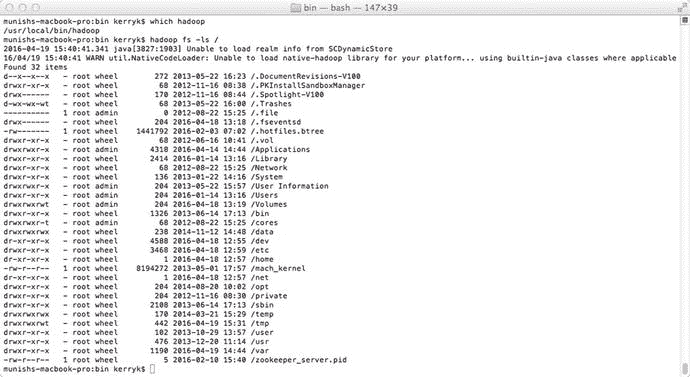
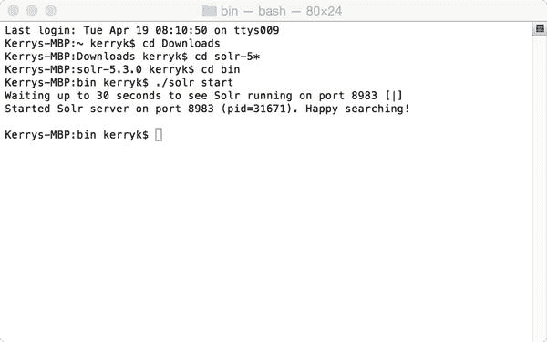
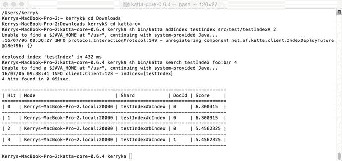
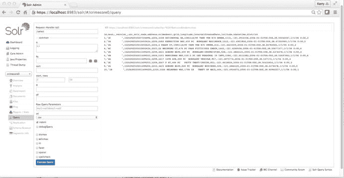
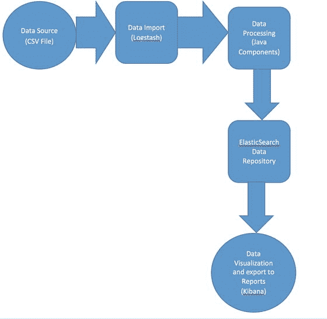
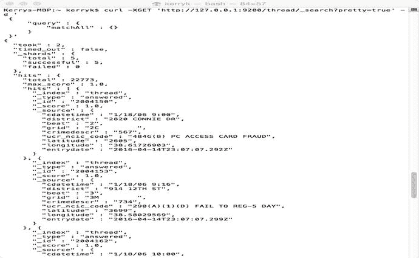
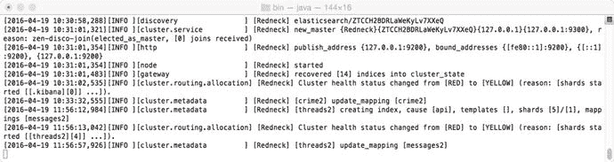
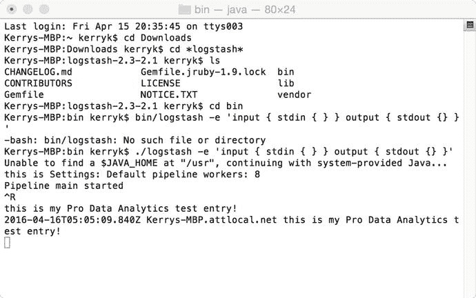
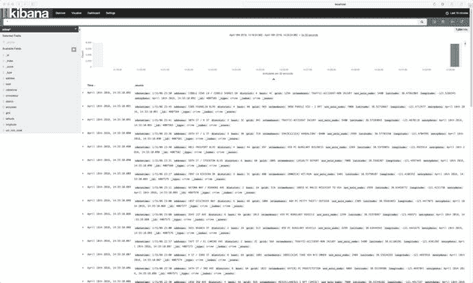
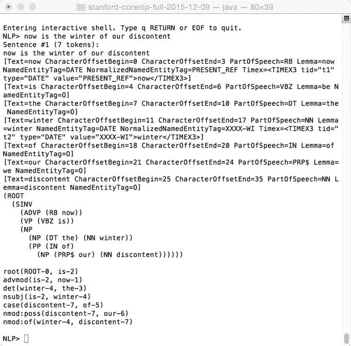

# 六、Hadoop、Lucene 和 Solr 的高级搜索技术

在本章中，我们将描述 Apache Lucene 和 Solr 第三方搜索引擎组件的结构和使用，如何在 Hadoop 中使用它们，以及如何开发为分析应用程序定制的高级搜索功能。我们还将研究一些较新的基于 Lucene 的搜索框架，主要是 Elasticsearch，这是一个主要的搜索工具，特别适合构建分布式分析数据管道。我们还将讨论扩展的 Lucene/Solr 生态系统，以及一些如何在分布式大数据分析应用程序中使用 Lucene 和 Solr 的真实编程示例。

## 6.1 Lucene/SOLR 生态系统介绍

正如我们在第 [1](01.html) 章 Lucene 和 Solr 概述中所讨论的，Apache Lucene(lucene.apache.com)是构建定制搜索组件时需要了解的一项关键技术，这是有道理的。它是最古老的 Apache 组件之一，经历了很长时间才成熟。尽管年代久远，Lucene/Solr 项目一直是搜索技术中一些有趣的新发展的焦点。截至 2010 年，Lucene 和 Solr 已经合并为一个 Apache 项目。Lucene/Solr 生态系统的一些主要组件如图 [6-1](#Fig1) 所示。


图 6-1。

The Lucene/SOLR ecosystem, with some useful additions

SolrCloud 是 Lucene/Solr 技术栈的新成员，它允许使用 RESTful 接口进行多核处理。要了解更多关于 SolrCloud 的信息，请访问信息页面 [`https://cwiki.apache.org/confluence/display/solr/SolrCloud`](https://cwiki.apache.org/confluence/display/solr/SolrCloud) 。

## 6.2 Lucene 查询语法

Lucene 查询在 Lucene 项目的生命周期中已经发展到包括一些对过去基本查询语法的复杂扩展。虽然 Lucene 查询语法可能会因版本而异(自 2001 年在 Apache 中引入以来已经有了很大的发展)，但大多数功能和搜索类型保持不变，如表 [6-1](#Tab1) 所示。

表 6-1。

Lucene query types and how to use them

<colgroup><col> <col> <col> <col></colgroup> 
| 搜索组件的类型 | 句法 | 例子 | 描述 |
| --- | --- | --- | --- |
| 自由格式文本 | 单词或“短语” | `"to be or not to be"` | 不带引号的单词或带双引号的短语 |
| 关键字搜索 | 字段名称:冒号值 | `city:Sunnyvale` | 要搜索的字段、冒号和要搜索的字符串 |
| 助推 | 后跟提升值的术语或短语 | `term^3` | 使用插入符号为术语提供新的提升值。 |
| 通配符搜索 | 符号*可用于通配符。 | `*kerry` | 带有“*”或“？”的通配符搜索标志 |
| 模糊搜索 | 使用波浪符号表示公制距离。 | `Hadoop∼` | 模糊搜索使用符号波浪号来表示使用 Levenschein 距离度量的接近程度。 |
| 分组 | 普通括号提供分组。 | `(java or C)` | 使用括号提供子查询。 |
| 字段分组 | 圆括号和冒号用于阐明查询字符串。 | `title:(+gift +"of the magi")` | 用字段名限定符分组，使用普通括号来提供分组 |
| 范围搜索 | 字段名称和冒号，后跟范围子句 | `startDate:[20020101 TO 20030101]` `heroes:{Achilles TO Zoroaster}` | 方括号和允许构造 range 子句的关键字，例如{阿基里斯对琐罗亚斯德}。 |
| 邻近搜索 | 术语颚化符接近值 | `Term∼` `10` | 近似搜索使用代字号符号来表示与匹配项的“接近程度”。 |

Installing Hadoop, Apache Solr, and NGDATA Lily

在这一节中，我们将简要概述如何安装 Hadoop、Lucene/Solr 和 NGData 的 Lily 项目，并建议一些“快速启动”技术来启动 Lily 安装并运行，以便进行开发和测试。

首先，安装 Hadoop。这是一个下载、解压缩、配置和运行的过程，类似于您在本书中遇到的许多其他过程。

当您成功安装和配置了 Hadoop，并设置了 HDFS 文件系统后，您应该能够执行一些简单的 Hadoop 命令，例如

```scala
hadoop fs –ls /

```

执行此操作后，您应该会看到类似于图 [6-2](#Fig2) 中的屏幕。



图 6-2。

Successful test of installation of Hadoop and the Hadoop Distributed File System (HDFS)

第二，安装 Solr。这只是下载 zip 文件，解压缩，并刻录到二进制文件中，然后使用命令立即启动服务器。

Solr 的成功安装可以如图 [6-3](#Fig3) 所示进行测试。



图 6-3。

A successful installation and start of the Solr server

第三，在 [`https://github.com/NGDATA/lilyproject`](https://github.com/NGDATA/lilyproject) 从 github 项目下载 NGDATA 的 Lily 项目。

让 Hadoop、Lucene、Solr 和 Lily 在同一个软件环境中协同工作可能会很棘手，因此我们提供了一些关于设置环境的技巧，这些技巧您可能已经忘记了。

Tips On Using HADOOP With SOLR and LUCENE

1.  确保您可以使用“ssh”登录而无需密码。这是 Hadoop 正常工作的必要条件。时不时地测试一下你的 Hadoop 安装，以确保所有的活动组件都正常工作，这不会有什么坏处。只需几个命令，就可以在命令行上完成 Hadoop 功能的快速测试。例如:
2.  确保您的环境变量设置正确，并适当配置您的 init 文件。这包括诸如你的。例如，如果您在 MacOS 上，bash_profile 文件。
3.  经常测试组件交互。分布式系统中有许多移动组件。进行单独测试，以确保每个零件都能顺利工作。
4.  在适当的时候，在独立、伪分布式和全分布式模式下测试交互。这包括调查可疑的性能问题、挂起、意外停止和错误，以及版本不兼容。
5.  注意 pom.xml 中的版本不兼容性，并始终保持良好的 pom.xml 卫生。确保您的基础设施组件(如 Java、Maven、Python、npm、Node 和其他组件)是最新且兼容的。请注意:本书中的大多数示例使用 Java 8(并且一些示例依赖于 Java 8 中存在的高级特性)，以及使用 Maven 3+。如有疑问，请使用 java 版本和 mvn 版本！
6.  对您的整个技术体系进行“整体优化”。这包括 Hadoop、Solr 和数据源/接收器级别。识别瓶颈和资源问题。如果您在小型 Hadoop 集群上运行，请识别“问题硬件”，尤其是单个“问题处理器”。
7.  经常在您的应用中使用多核功能。在复杂的应用程序中很少使用单个内核，所以要确保使用多个内核能够顺利工作。
8.  虔诚地执行集成测试。
9.  性能监控是必须的。使用标准的性能监控“脚本”,并根据以前的结果和当前的预期来评估性能。根据需要升级硬件和软件以改善性能结果，并重新监控以确保准确的分析。
10.  不要忽视单元测试。在 [`https://wiki.apache.org/hadoop/HowToDevelopUnitTests`](https://wiki.apache.org/hadoop/HowToDevelopUnitTests) 可以找到为当前版本的 Hadoop 编写单元测试的很好的介绍。

Apache Katta ( [`http://katta.sourceforge.net/about`](http://katta.sourceforge.net/about) )是任何基于 Solr 的分布式数据管道架构的有用补充，并允许 Hadoop 索引到分片中，以及许多其他高级功能。

How to Install and Configure Apache Katta

1.  从位于 [`https://sourceforge.net/projects/katta/files/`](https://sourceforge.net/projects/katta/files/) 的资源库下载 Apache Katta。解压文件。
2.  将 Katta 环境变量添加到。bash_profile 文件(如果您在 MacOS 下运行),或者适当的启动文件(如果运行另一个版本的 Linux)。这些变量包括(请注意，这些只是示例；在这里替换您自己合适的路径值):

    ```scala
    export KATTA_HOME= /Users/kerryk/Downloads/kata-core-0.6.4

    ```

    并将 Katta 的二进制文件添加到路径中，这样您就可以直接调用它:

    ```scala
    export PATH=$KATTA_HOME/bin:$PATH

    ```

3.  Check to make sure the Katta process is running correctly by typing

    ```scala
    ps –al | grep katta

    ```

    on the command line. You should see an output similar to Figure [6-4](#Fig4).

    

    图 6-4。

    A successful initialization of the Katta Solr subsystem  
4.  Successfully running the Katta component will produce results similar to those in Figure [6-4](#Fig4).

    

    图 6-5。

    Successful installation and run of Apache Katta screen  

## 6.3 使用 SOLR 的编程示例

我们将通过一个完整的例子来使用 SOLR 加载、修改、评估和搜索我们从互联网上下载的标准数据集。我们将重点介绍 Solr 的几个特性。正如我们前面提到的，Solr 包含称为“核心”的独立数据存储库。每一个都可以有一个单独定义的模式与之相关联。Solr 内核可以在命令行上创建。

首先，从 URL [`http://samplecsvs.s3.amazonaws.com/SacramentocrimeJanuary2006.csv`](http://samplecsvs.s3.amazonaws.com/SacramentocrimeJanuary2006.csv) 下载样本数据集作为 csv 文件

您可以在下载文件夹中找到它，文件名为

```scala
yourDownLoadDirectory/SacramentocrimeJanuary2006.csv

```

使用以下命令创建新的 SOLR 核心:

```scala
./solr create –c crimecore1 –d basic_configs

```

如果您的核心创建成功，您将看到类似于图 [6-2](#Fig2) 中的屏幕。


图 6-6。

Successful construction of a Solr core

通过在规范末尾添加正确的字段来修改模式文件 schema.xml。

```scala
<!— much more of the schema.xml file will be here -->

                                ............

<!--   you will now add the field specifications for the cdatetime,address,district,beat,grid,crimedescr,ucr_ncic_code,latitude,longitude
   fields found in the data file SacramentocrimeJanuary2006.csv
-->
    <field name="cdatetime" type="string" indexed="true" stored="true" required="true" multiValued="false" />  
    <field name="address" type="string" indexed="true" stored="true" required="true" multiValued="false" />  

    <field name="district" type="string" indexed="true" stored="true" required="true" multiValued="false" />  
<field name="beat" type="string" indexed="true" stored="true" required="true" multiValued="false" />  

<field name="grid" type="string" indexed="true" stored="true" required="true" multiValued="false" />  
<field name="crimedescr" type="string" indexed="true" stored="true" required="true" multiValued="false" />  

<field name="ucr_ncic_code" type="string" indexed="true" stored="true" required="true" multiValued="false" />  
<field name="latitude" type="string" indexed="true" stored="true" required="true" multiValued="false" />  

<field name="longitude" type="string" indexed="true" stored="true" required="true" multiValued="false" />  
   <field name="internalCreatedDate" type="date" indexed="true" stored="true" required="true" multiValued="false" />  

   <!--  the previous fields were added to the schema.xml file. Field type definition for currentcy is shown below  -->

    <fieldType name="currency" class="solr.CurrencyField" precisionStep="8" defaultCurrency="USD" currencyConfig="currency.xml" />

</schema>

```

通过向 CSV 文件的各个数据行添加关键字和附加数据，可以很容易地修改数据。清单 [6-1](#Par50) 是这样一个 CSV 转换程序的简单例子。

通过向 CSV 文件添加唯一的键和创建日期来修改 Solr 数据。

清单 [6-1](#Par50) 中显示了完成这项工作的程序。文件名将为`com/apress/converter/csv/CSVConverter.java`。

向 CSV 数据集添加字段的程序几乎不需要解释。它逐行读取输入的 CSV 文件，向每行数据添加唯一的 ID 和日期字段。类中有两个助手方法，`createInternalSolrDate()`和`getCSVField()`。

在 CSV 数据文件中，标题和前几行如图 [6-7](#Fig7) 所示，如 Excel 所示。


图 6-7。

Crime data CSV file . This data will be used throughout this chapter.

```scala
package com.apress.converter.csv;

import java.io.File;

import java.io.FileNotFoundException;

import java.io.FileOutputStream;

import java.io.FileReader;

import java.io.FileWriter;

import java.io.IOException;

import java.io.LineNumberReader;

import java.text.DateFormat;

import java.text.SimpleDateFormat;

import java.util.ArrayList;

import java.util.Date;

import java.util.List;

import java.util.TimeZone;

import java.util.logging.Logger;

public class CSVConverter {
        Logger LOGGER = Logger.getAnonymousLogger();

        String targetSource = "SacramentocrimeJan2006.csv";
        String targetDest = "crime0.csv";

        /** Make a date Solr can understand from a regular oracle-style day string.
         *
         * @param regularJavaDate
         * @return

         */
        public String createInternalSolrDate(String regularJavaDate){
                if (regularJavaDate.equals("")||(regularJavaDate.equals("\"\""))){ return ""; }

                String answer = "";
                TimeZone tz = TimeZone.getTimeZone("UTC");
                DateFormat df = new SimpleDateFormat("yyyy-MM-dd'T'HH:mm'Z'");
                df.setTimeZone(tz);
                try {
                answer = df.format(new Date(regularJavaDate));
                } catch (IllegalArgumentException e){
                        return "";
                }
                return answer

;
        }

        /** Get a CSV field in a CSV string by numerical index. Doesnt care if there are blank fields, but they count in the indices.
         *
         * @param s
         * @param fieldnum
         * @return

         */
        public String getCSVField(String s, int fieldnum){
                String answer = "";
                if (s != null) { s = s.replace(",,", ", ,");
                String[] them = s.split(",");
                int count = 0;
                for (String t : them){
                        if (fieldnum == count) answer = them[fieldnum];
                        count++;
                }        
                }
                return answer;
        }

        public CSVConverter()

{
                LOGGER.info("Performing CSV conversion for SOLR input");

                List<String>contents = new ArrayList<String>();
                ArrayList<String>result = new ArrayList<String>();
                String readline = "";
                LineNumberReader reader = null;
                FileOutputStream writer = null;
                try {
                         reader = new LineNumberReader(new FileReader(targetSource));
                         writer = new FileOutputStream (new File(targetDest));
                        int count = 0;
                        int thefield = 1;
                        while (readline != null){
                        readline = reader.readLine();
                        if (readline.split(","))<2){
                                LOGGER.info("Last line, exiting...");
                                break;
                        }
                        if (count != 0){
                                String origDate = getCSVField(readline, thefield).split(“ “)[0];
                                String newdate = createInternalSolrDate(origDate);
                                String resultLine = readline + "," + newdate+"\n";
                                LOGGER.info("===== Created new line: " + resultLine);
                                writer.write(resultLine.getBytes());
                                result.add(resultLine);
                        } else {
                                String resultLine = readline +",INTERNAL_CREATED_DATE\n";   // add the internal date for faceted search
                                writer.write(resultLine.getBytes());
                        }
                        count++;

                        LOGGER.info("Just read imported row: " + readline);
                        }
                } catch (FileNotFoundException e) {
                        e.printStackTrace();
                } catch (IOException e) {
                        // TODO Auto-generated catch block
                        e.printStackTrace();
                }
                for (String line : contents){
                String newLine = "";        
                }
                try {
                reader.close();
                writer.close();
                } catch (IOException e){ e.printStackTrace(); }
                LOGGER.info("...CSV conversion complete...");
        }

        /** MAIN ROUTINE
         *
         * @param args
         */
        public static void main(String[] args){
                new CSVConverter(args[0], args[1]);
        }

}

Listing 6-1.Java source code for CSVConverter.java.

```

通过键入以下命令编译该文件:

```scala
javac com/apress/converter/csv/CSVConverter.java

```

如上所述正确设置 CSV 转换程序后，您可以通过键入

```scala
java com.apress.converter.csv.CSVConverter inputcsvfile.csv outputcsvfile.csv

```

将修改后的数据发布到 SOLR 核心:

```scala
./post –c crimecore1 ./modifiedcrimedata2006.csv

```

既然我们已经将数据发送到 Solr 核心，我们可以在 Splr 仪表板中检查数据集。为此，请转到 localhost:8983。您应该会看到类似于图 [6-4](#Fig4) 中的屏幕。


图 6-8。

Initial Solr dashboard

我们还可以评估来自我们在本章前面创建的 Solandra 核心的数据，如图 _ _。

现在，从核心选择器下拉列表中选择 crimedata0 核心。单击 query，将输出格式(“wt”参数下拉菜单)更改为 csv，这样您就可以一次看到几行数据。您将看到类似于图 [6-9](#Fig9) 中的数据显示。



图 6-10。

Result of Solr query using the dashboard (Sacramento crime data core)


图 6-9。

Result of Solr query , showing the JSON output format

由于 Solr 的 RESTful 接口，我们可以通过仪表板(符合前面讨论的 Lucene 查询语法)或在命令行上使用 CURL 实用程序进行查询。

## 6.4 使用 ELK 堆栈(Elasticsearch、Logstash 和 Kibana)

正如我们之前提到的，Lucene、Solr 和 Nutch 都有替代品。根据系统的整体架构，您可以使用各种技术栈、语言、集成和插件助手库以及功能。其中一些组件可能使用 Lucene 或 Solr，或者通过集成助手库(如 Spring Data、Spring MVC 或 Apache Camel 等)与 Lucene/Solr 组件兼容。图 [6-6](#Fig6) 显示了一个替代基本 Lucene 堆栈的例子，称为“ELK 堆栈”。

elastic search(elasticsearch.org)是一个分布式高性能搜索引擎。在引擎盖下，Elasticsearch 使用 Lucene 作为核心组件，如图 [6-3](#Fig3) 所示。Elasticsearch 是 SolrCloud 的强大竞争对手，易于扩展、维护、监控和部署。

为什么会用 Elasticsearch 而不是 Solr？仔细查看 Solr 和 Elasticsearch 的特性矩阵可以发现，在许多方面，这两个工具包具有相似的功能。它们都利用了 Apache Lucene。Solr 和 Elasticsearch 都可以使用 JSON 作为数据交换格式，虽然 Solr 也支持 XML。

表 6-2。

Feature comparison table of Elasticsearch features vs. Apache Solr features

<colgroup><col> <col> <col> <col> <col> <col> <col> <col> <col> <col> <col> <col></colgroup> 
|   | 数据 | 可扩展置标语言 | 战斗支援车 | HTTP REST | 管理扩展 | 客户端库 | Lucene 查询解析 | 独立分布式集群 | 分片 | 形象化 | Web 管理界面 |
| --- | --- | --- | --- | --- | --- | --- | --- | --- | --- | --- | --- |
| 使用 | X | X | X | X | X | 爪哇 | X |   | X | 吉婆那港（香蕉） |   |
| 弹性搜索 | X |   |   | X |   | Java Python Javascript | X | X | X | 马纳人 |   |

log stash(logstash.net)是一个有用的应用程序，允许将各种不同类型的数据导入到 Elasticsearch 中，包括 CSV 格式的文件和普通的“日志格式”文件。基巴纳( [`https://www.elastic.co/guide/en/kibana/current/index.html`](https://www.elastic.co/guide/en/kibana/current/index.html) )是一个开放源码的可视化组件，允许定制。Elasticsearch、Logstash 和 Kibana 一起构成了所谓的“ELK stack”，主要用于。在这一节中，我们将看一个运行中的 ELK 堆栈的小例子。



图 6-12。

ELK stack in use: Elasticsearch search engine/pipeline architecture diagram


图 6-11。

The so-called “ELK stack ”: Elasticsearch, Logstash, and Kibana visualization Installing Elasticsearch, Logstash, and Kibana

安装和试用 ELK 堆栈再简单不过了。如果你已经阅读了本书的介绍性章节，这是一个熟悉的过程。按照以下三个步骤安装和测试 ELK 堆栈:

1.  Download Elasticsearch from [`https://www.elastic.co/downloads/elasticsearch`](https://www.elastic.co/downloads/elasticsearch) . Unzip the downloaded file to a convenient staging area. Then,

    ```scala
    cd $ELASTICSEARCH_HOME/bin/
    ./elasticsearch

    ```

    Elasticsearch will start up successfully with a display similar to that in Figure [6-3](#Fig3).

    

    图 6-13。

    Successful start-up of the Elasticsearch server from the binary directory Use the following Java program to import the crime data CSV file (or, with a little modification, any CSV formatted data file you wish):

    ```scala
    public static void main(String[] args)
        {
            System.out.println( "Import crime data" );
            String originalClassPath = System.getProperty("java.class.path");
            String[] classPathEntries = originalClassPath.split(";");
            StringBuilder esClasspath = new StringBuilder();
            for (String entry : classPathEntries) {
            if (entry.contains("elasticsearch") || entry.contains("lucene")) {
            esClasspath.append(entry);
            esClasspath.append(";");
            }
            }
            System.setProperty("java.class.path", esClasspath.toString());
            System.setProperty("java.class.path", originalClassPath);
            System.setProperty("es.path.home", "/Users/kerryk/Downloads/elasticsearch-2.3.1");
            String file = "SacramentocrimeJanuary2006.csv";
            Client client = null;
            try {

            client = TransportClient.builder().build()
             .addTransportAddress(new InetSocketTransportAddress(InetAddress.getByName("localhost"), 9300));

            int numlines = 0;
            XContentBuilder builder = null;

            int i=0;

            String currentLine = "";
            BufferedReader br = new BufferedReader(new FileReader(file));

                while ((currentLine = br.readLine()) != null) {
                if (i > 0){
                System.out.println("Processing line: " + currentLine);
            String[] tokens = currentLine.split(",");
            String city = "sacramento";
            String recordmonthyear = "jan2006";
            String cdatetime = tokens[0];
            String address = tokens[1];
            String district = tokens[2];
            String beat = tokens[3];
            String grid = tokens[4];
            String crimedescr = tokens[5];
            String ucrnciccode = tokens[6]

    ;
            String latitude = tokens[7];
            String longitude = tokens[8];
            System.out.println("Crime description = " + crimedescr);
            i=i+1;
            System.out.println("Index is: " + i);
            IndexResponse response = client.prepareIndex("thread", "answered", "400"+new Integer(i).toString()).setSource(

            jsonBuilder()
            .startObject()
            .field("cdatetime", cdatetime)
            .field("address", address)
            .field("district", district)
            .field("beat", beat)
            .field("grid", grid)
            .field("crimedescr", crimedescr)
            .field("ucr_ncic_code", ucrnciccode)
            .field("latitude", latitude)
            .field("longitude", longitude)
            .field("entrydate", new Date())
            .endObject())
            .execute().actionGet();

                } else {
                    System.out.println("Ignoring first line...");
                    i++;
                }
            }

        } catch (Exception e) {
            // TODO Auto-generated catch block
            e.printStackTrace();

            }
            }

    ```

    Run the program in Eclipse or in the command line. You will see a result similar to the one in Figure [6-14](#Fig14). Please note that each row of the CSV is entered as a set of fields into the Elasticsearch repository. You can also select the index name and index type by changing the appropriate strings in the code example.

    

    图 6-14。

    Successful test of an Elasticsearch crime database import from the Eclipse IDE You can test the query capabilities of your new Elasticsearch set-up by using ‘curl’ on the command line to execute some sample queries, such as:

    

    图 6-16。

    Successful test of an Elasticsearch crime database query from the command line

    

    图 6-15。

    You can see the schema update logged in the Elasticsearch console  
2.  Download Logstash from [`https://www.elastic.co/downloads/logstash`](https://www.elastic.co/downloads/logstash) . Unzip the downloaded file to the staging area.

    ```scala
    cd <your logstash staging area, LOGSTASH_HOME>

    ```

    After entering some text, you will see an echoed result similar to Figure [6-6](#Fig6).

    

    图 6-17。

    Testing your Logstash installation . You can enter text from the command line. You will also need to set up a configuration file for use with Logstash. Follow the directions found at  to make a configuration file such as the one shown in Listing [6-2](#Par78).

    ```scala
    input { stdin { } }

    filter {
      grok {
        match => { "message" => "%{COMBINEDAPACHELOG}" }
      }
      date {
        match => [ "timestamp" , "dd/MMM/yyyy:HH:mm:ss Z" ]
      }
    }

    output {
      elasticsearch { hosts => ["localhost:9200"] }
      stdout { codec => rubydebug }
    }

    Listing 6-2.Typical Logstash configuration file

    listing

    ```

3.  Download Kibana from [`https://www.elastic.co/downloads/kibana`](https://www.elastic.co/downloads/kibana) . Unzip the downloaded file to the staging area. In a similar way to starting the Elasticsearch server:

    

    图 6-18。

    Successful start-up of the Kibana visualization component from its binary directory

    ```scala
      cd bin
    ./kibana

    ```

    You can easily query for keywords or more complex queries interactively using the Kibana dashboard as shown in Figure [6-19](#Fig19).

    

    图 6-20。

    Kibana dashboard example: highlighted search for “FRAUD.”

    

    图 6-19。

    Kibana dashboard example with crime dataset Add this schema for the crime data to Elasticsearch with this cURL command:

    ```scala
    curl -XPUT http://localhost:9200/crime2 -d '
    { "mappings" :
    { "crime2" : { "properties" : { "cdatetime" : {"type" : "string"}, "address" : {"type": "string"}, "district" : {"type" : "string"}, "beat": {"type" : "string"}, "grid": {"type" : "string"}, "crimedescr" : {"type": "string"}, "ucr_ncic_code": {"type": "string"},"latitude": {"type" : "string"}, "longitude": {"type" : "string"}, "location": {"type" : "geo_point"}}  
    } } }'

    ```

    Notice the “location” tag in particular, which has a geo_point-type definition. This allows Kibana to identify the physical location on a map for visualization purposes , as shown in Figure [6-21](#Fig21).

    

    图 6-21。

    The crime data for Sacramento as a visualization in Kibana  

图 [6-21](#Fig21) 是理解复杂数据集的一个很好的例子。我们可以立即用红色标出“高犯罪率”地区。

## 6.5 Solr 与 ElasticSearch:特征和逻辑

在本节中，我们将在一个使用 Elasticsearch 的代码示例中使用所谓的 CRUD 操作(创建、替换、更新和删除方法，以及一个附加的搜索实用程序方法)作为示例。

```scala
package com.apress.main;

import java.io.IOException;

import java.util.Date;

import java.util.HashMap;

import java.util.Map;

import org.elasticsearch.action.delete.DeleteResponse;

import org.elasticsearch.action.get.GetResponse;

import org.elasticsearch.action.search.SearchResponse;

import org.elasticsearch.action.search.SearchType;

import org.elasticsearch.client.Client;

import static org.elasticsearch.index.query.QueryBuilders.fieldQuery;

import org.elasticsearch.node.Node;

import static org.elasticsearch.node.NodeBuilder.nodeBuilder;

import org.elasticsearch.search.SearchHit;

/**
 *
 * @author kerryk
 */

public class ElasticSearchMain {

          public static final String INDEX_NAME = "narwhal";
          public static final String THEME_NAME = "messages";

    public static void main(String args[]) throws IOException{

        Node node     = nodeBuilder().node();
        Client client = node.client();

        client.prepareIndex(INDEX_NAME, THEME_NAME, "1")
              .setSource(put("ElasticSearch: Java",
                                         "ElasticSeach provides Java API, thus it executes all operations " +
                                          "asynchronously by using client object..",
                                         new Date(),
                                         new String[]{"elasticsearch"},
                                         "Kerry Koitzsch", "iPad", "Root")).execute().actionGet();

        client.prepareIndex(INDEX_NAME, THEME_NAME, "2")
              .setSource(put("Java Web Application and ElasticSearch (Video)",
                                         "Today, here I am for exemplifying the usage of ElasticSearch which is an open source, distributed " +
                                         "and scalable full text search engine and a data analysis tool in a Java web application.",
                                         new Date(),
                                         new String[]{"elasticsearch"},
                                         "Kerry Koitzsch", "Apple TV", "Root")).execute().actionGet();

        get(client, INDEX_NAME, THEME_NAME, "1");

        update(client, INDEX_NAME, THEME_NAME, "1", "title", "ElasticSearch: Java API");
        update(client, INDEX_NAME, THEME_NAME, "1", "tags", new String[]{"bigdata"});

        get(client, INDEX_NAME, THEME_NAME, "1");

        search(client, INDEX_NAME, THEME_NAME, "title", "ElasticSearch");

        delete(client, INDEX_NAME, THEME_NAME, "1");

        node.close();
    }

    public static Map<String, Object> put(String title, String content, Date postDate,
                                                      String[] tags, String author, String communityName, String parentCommunityName){

        Map<String, Object> jsonDocument = new HashMap<String, Object>();

        jsonDocument.put("title", title);
        jsonDocument.put("content", content);
        jsonDocument.put("postDate", postDate);
        jsonDocument.put("tags", tags);
        jsonDocument.put("author", author);
        jsonDocument.put("communityName", communityName);
        jsonDocument.put("parentCommunityName", parentCommunityName);
        return jsonDocument;
    }

    public static void get(Client client, String index, String type, String id){

        GetResponse getResponse = client.prepareGet(index, type, id)
                                        .execute()
                                        .actionGet();
        Map<String, Object> source = getResponse.getSource();

        System.out.println("------------------------------");
        System.out.println("Index: " + getResponse.getIndex());
        System.out.println("Type: " + getResponse.getType());
        System.out.println("Id: " + getResponse.getId());
        System.out.println("Version: " + getResponse.getVersion());
        System.out.println(source);
        System.out.println("------------------------------");

    }

    public static void update(Client client, String index, String type,
                                      String id, String field, String newValue){

        Map<String, Object> updateObject = new HashMap<String, Object>();
        updateObject.put(field, newValue);

        client.prepareUpdate(index, type, id)
              .setScript("ctx._source." + field + "=" + field)
              .setScriptParams(updateObject).execute().actionGet();
    }

    public static void update(Client client, String index, String type,
                                      String id, String field, String[] newValue){

        String tags = "";
        for(String tag :newValue)
            tags += tag + ", ";

        tags = tags.substring(0, tags.length() - 2);

        Map<String, Object> updateObject = new HashMap<String, Object>();
        updateObject.put(field, tags);

        client.prepareUpdate(index, type, id)
                .setScript("ctx._source." + field + "+=" + field)
                .setScriptParams(updateObject).execute().actionGet();
    }

    public static void search(Client client, String index, String type,
                                      String field, String value){

        SearchResponse response = client.prepareSearch(index)
                                        .setTypes(type)
                                        .setSearchType(SearchType.QUERY_AND_FETCH)
                                        .setQuery(fieldQuery(field, value))
                                        .setFrom(0).setSize(60).setExplain(true)
                                        .execute()
                                        .actionGet();

        SearchHit[] results = response.getHits().getHits();

        System.out.println("Current results: " + results.length);
        for (SearchHit hit : results) {
            System.out.println("------------------------------");
            Map<String,Object> result = hit.getSource();   
            System.out.println(result);
        }
    }

    public static void delete(Client client, String index, String type, String id){

        DeleteResponse response = client.prepareDelete(index, type, id).execute().actionGet();
        System.out.println("===== Information on the deleted document:");
        System.out.println("Index: " + response.getIndex());
        System.out.println("Type: " + response.getType());
        System.out.println("Id: " + response.getId());
        System.out.println("Version: " + response.getVersion());
    }
}

Listing 6-3.
CRUD operations

for  Elasticsearch example

```

为搜索组件定义 CRUD 操作是定制组件如何“适应”系统其余部分的整体架构和逻辑的关键。

## 6.6 带有 Elasticsearch 和 Solr 的 Spring 数据组件

在这一节中，我们将开发一个代码示例，它使用 Spring 数据来实现同类组件，使用 Solr 和 Elasticsearch 作为“幕后”使用的搜索框架。

您可以为 pom.xml 文件分别定义 Elasticsearch 和 Solr 两个属性，如下所示:

```scala
<spring.data.elasticsearch.version>2.0.1.RELEASE</spring.data.elasticsearch.version>
<spring.data.solr.version>2.0.1.RELEASE</spring.data.solr.version>

<dependency>
        <groupId>org.springframework.data</groupId>
        <artifactId>spring-data-elasticsearch</artifactId>
        <version>2.0.1.RELEASE</version>
</dependency>
and
<dependency>
        <groupId>org.springframework.data</groupId>
        <artifactId>spring-data-solr</artifactId>
        <version>2.0.1.RELEASE</version>
</dependency>

```

我们现在可以开发基于 Spring 数据的代码示例，如清单 [6-5](#Par95) 和清单 [6-6](#Par97) 所示。

```scala
package com.apress.probda.solr.search;
import org.springframework.boot.SpringApplication;
import org.springframework.boot.autoconfigure.EnableAutoConfiguration;
import org.springframework.context.annotation.ComponentScan;
import org.springframework.context.annotation.Configuration;
import org.springframework.context.annotation.Import;
import com.apress.probda.context.config.SearchContext;
import com.apress.probda.context.config.WebContext;
@Configuration
@ComponentScan
@EnableAutoConfiguration
@Import({ WebContext.class, SearchContext.class })
public class Application {
        public static void main(String[] args) {
                SpringApplication.run(Application.class, args);
        }
import org.apache.solr.client.solrj.SolrServer;
import org.apache.solr.client.solrj.impl.HttpSolrServer;
import org.springframework.beans.factory.annotation.Value;
import org.springframework.context.annotation.Bean;
import org.springframework.context.annotation.Configuration;
import org.springframework.data.solr.repository.config.EnableSolrRepositories;

@Configuration
@EnableSolrRepositories(basePackages = { "org.springframework.data.solr.showcase.product" }, multicoreSupport = true)
public class SearchContext {

        @Bean
        public SolrServer solrServer(@Value("${solr.host}") String solrHost) {
                return new HttpSolrServer(solrHost);
        }

}

File: WebContext.java

import java.util.List;
import org.springframework.context.annotation.Bean;
import org.springframework.context.annotation.Configuration;
import org.springframework.data.web.PageableHandlerMethodArgumentResolver;
import org.springframework.web.method.support.HandlerMethodArgumentResolver;
import org.springframework.web.servlet.config.annotation.ViewControllerRegistry;
import org.springframework.web.servlet.config.annotation.WebMvcConfigurerAdapter;

/**
 * @author kkoitzsch
 */
@Configuration
public class WebContext {
        @Bean
        public WebMvcConfigurerAdapter mvcViewConfigurer() {
                return new WebMvcConfigurerAdapter() {
                        @Override
                        public void addViewControllers(ViewControllerRegistry registry) {

                                registry.addViewController("/").setViewName("search");
                                registry.addViewController("/monitor").setViewName("monitor");
                        }
                        @Override
                        public void addArgumentResolvers(List<HandlerMethodArgumentResolver> argumentResolvers) {
                                argumentResolvers.add(new PageableHandlerMethodArgumentResolver());
                        }
                };
        }
}

Listing 6-4.
NLP program
—main() executable method

```

```scala
public static void main(String[] args) throws IOException {
        String text = "The World is a great place";
        Properties props = new Properties();
        props.setProperty("annotators", "tokenize, ssplit, pos, lemma, parse, sentiment");
        StanfordCoreNLP pipeline = new StanfordCoreNLP(props);

        Annotation annotation = pipeline.process(text);
        List<CoreMap> sentences = annotation.get(CoreAnnotations.SentencesAnnotation.class);
        for (CoreMap sentence : sentences) {
            String sentiment = sentence.get(SentimentCoreAnnotations.SentimentClass.class);
            System.out.println(sentiment + "\t" + sentence);
        }
    }

Listing 6-5.Spring Data code example using Solr

```

```scala
package com.apress.probda.search.elasticsearch;

import com.apress.probda.search.elasticsearch .Application;

import com.apress.probda.search.elasticsearch .Post;

import com.apress.probda.search.elasticsearch.Tag;

import com.apress.probda.search.elasticsearch.PostService;

import org.junit.Before;

import org.junit.Test;

import org.junit.runner.RunWith;

import org.springframework.beans.factory.annotation.Autowired;

import org.springframework.boot.test.SpringApplicationConfiguration;

import org.springframework.data.domain.Page;

import org.springframework.data.domain.PageRequest;

import org.springframework.data.elasticsearch.core.ElasticsearchTemplate;

import org.springframework.test.context.junit4.SpringJUnit4ClassRunner;

import java.util.Arrays;

import static org.hamcrest.CoreMatchers.notNullValue;

import static org.hamcrest.core.Is.is;

import static org.junit.Assert.assertThat;

@RunWith(SpringJUnit4ClassRunner.class)

@SpringApplicationConfiguration(classes = Application.class)

public class PostServiceImplTest{

    @Autowired

    private PostService postService;

    @Autowired

    private ElasticsearchTemplate elasticsearchTemplate;

    @Before

    public void before() {

        elasticsearchTemplate.deleteIndex(Post.class);

        elasticsearchTemplate.createIndex(Post.class);

        elasticsearchTemplate.putMapping(Post.class);

        elasticsearchTemplate.refresh(Post.class, true);

    }

    //@Test

    public void testSave() throws Exception {

        Tag tag = new Tag();

        tag.setId("1");

        tag.setName("tech");

        Tag tag2 = new Tag();

        tag2.setId("2");

        tag2.setName("elasticsearch");

        Post post = new Post();

        post.setId("1");

        post.setTitle("Bigining with spring boot application and elasticsearch");

        post.setTags(Arrays.asList(tag, tag2));

        postService.save(post);

        assertThat(post.getId(), notNullValue());

        Post post2 = new Post();

        post2.setId("1");

        post2.setTitle("Bigining with spring boot application");

        post2.setTags(Arrays.asList(tag));

        postService.save(post);

        assertThat(post2.getId(), notNullValue());

    }

    public void testFindOne() throws Exception {

    }

    public void testFindAll() throws Exception {

    }

    @Test

    public void testFindByTagsName() throws Exception {

        Tag tag = new Tag();

        tag.setId("1");

        tag.setName("tech");

        Tag tag2 = new Tag();

        tag2.setId("2");

        tag2.setName("elasticsearch");

        Post post = new Post();

        post.setId("1");

        post.setTitle("Bigining with spring boot application and elasticsearch");

        post.setTags(Arrays.asList(tag, tag2));

        postService.save(post);

        Post post2 = new Post();

        post2.setId("1");

        post2.setTitle("Bigining with spring boot application");

        post2.setTags(Arrays.asList(tag));

        postService.save(post);

        Page<Post> posts  = postService.findByTagsName("tech", new PageRequest(0,10));

        Page<Post> posts2  = postService.findByTagsName("tech", new PageRequest(0,10));

        Page<Post> posts3  = postService.findByTagsName("maz", new PageRequest(0,10));

       assertThat(posts.getTotalElements(), is(1L));

        assertThat(posts2.getTotalElements(), is(1L));

        assertThat(posts3.getTotalElements(), is(0L));

    }

}

Listing 6-6.Spring Data code example using Elasticsearch (unit test)

```

## 6.7 使用 LingPipe 和 GATE 进行定制搜索

在这一节中，我们将回顾一对有用的分析工具，它们可以与 Lucene 和 Solr 一起使用，以增强分布式分析应用程序中的自然语言处理(NLP)分析能力。LingPipe ( [`http://alias-i.com/lingpipe/`](http://alias-i.com/lingpipe/) )和 GATE(文本工程通用架构， [`https://gate.ac.uk`](https://gate.ac.uk) )可用于为分析系统增加自然语言处理能力。基于 NLP 的分析系统的典型架构可能类似于图 [6-22](#Fig22) 。


图 6-22。

NLP system architecture , using LingPipe, GATE, and NGDATA Lily

自然语言处理系统可以以类似于任何其他分布式流水线系统的方式来设计和构建。唯一的区别是针对数据和元数据本身的特殊性质进行了必要的调整。LingPipe、GATE、Vowpal Wabbit 和 StanfordNLP 允许处理、解析和“理解”文本，Emir/Caliph、ImageTerrier 和 HIPI 等软件包提供了分析和索引基于图像和信号的数据的功能。你可能还希望添加一些软件包来帮助地理定位，比如 SpatialHadoop ( [`http://spatialhadoop.cs.umn.edu`](http://spatialhadoop.cs.umn.edu) )，这将在第 [14 章](14.html)中详细讨论。

GATE 可以处理各种输入格式，包括原始文本、XML、HTML 和 PDF 文档，以及关系数据/JDBC 中介数据。这包括从 Oracle、PostgreSQL 等导入的数据。

Apache Tika 导入组件可能如清单 [6-7](#Par104) 中所示实现。

```scala
Package com.apress.probda.io;

import java.io.*;
import java.nio.file.Paths;
import java.util.ArrayList;
import java.util.List;
import java.util.Map;
import java.util.Set;

import com.apress.probda.pc.AbstractProbdaKafkaProducer;
import org.apache.commons.lang3.StringUtils;
import org.apache.tika.exception.TikaException;
import org.apache.tika.io.TikaInputStream;
import org.apache.tika.metadata.Metadata;
import org.apache.tika.metadata.serialization.JsonMetadata;
import org.apache.tika.parser.ParseContext;
import org.apache.tika.parser.Parser;
import org.apache.tika.parser.isatab.ISArchiveParser;
import org.apache.tika.sax.ToHTMLContentHandler;
import org.dia.kafka.solr.consumer.SolrKafkaConsumer;
import org.json.simple.JSONArray;
import org.json.simple.JSONObject;
import org.json.simple.JSONValue;
import org.json.simple.parser.JSONParser;
import org.json.simple.parser.ParseException;
import org.xml.sax.ContentHandler;
import org.xml.sax.SAXException;

import static org.dia.kafka.Constants.*;

public class ISAToolsKafkaProducer extends AbstractKafkaProducer {

    /**
     * Tag for specifying things coming out of LABKEY
     */
    public final static String ISATOOLS_SOURCE_VAL = "ISATOOLS";
    /**
     * ISA files default prefix
     */
    private static final String DEFAULT_ISA_FILE_PREFIX = "s_";
    /**
     * Json jsonParser to decode TIKA responses
     */
    private static JSONParser jsonParser = new JSONParser();
    ;

    /**
     * Constructor
     */
    public ISAToolsKafkaProducer(String kafkaTopic, String kafkaUrl) {
        initializeKafkaProducer(kafkaTopic, kafkaUrl);
    }

    /**
     * @param args
     */
    public static void main(String[] args) throws IOException {
        String isaToolsDir = null;
        long waitTime = DEFAULT_WAIT;
        String kafkaTopic = KAFKA_TOPIC;
        String kafkaUrl = KAFKA_URL;

        // TODO Implement commons-cli
        String usage = "java -jar ./target/isatools-producer.jar [--tikaRESTURL <url>] [--isaToolsDir <dir>] [--wait <secs>] [--kafka-topic <topic_name>] [--kafka-url]\n";

        for (int i = 0; i < args.length - 1; i++) {
            if (args[i].equals("--isaToolsDir")) {
                isaToolsDir = args[++i];
            } else if (args[i].equals("--kafka-topic")) {
                kafkaTopic = args[++i];
            } else if (args[i].equals("--kafka-url")) {
                kafkaUrl = args[++i];
            }
        }

        // Checking for required parameters
        if (StringUtils.isEmpty(isaToolsDir)) {
            System.err.format("[%s] A folder containing ISA files should be specified.\n", ISAToolsKafkaProducer.class.getSimpleName());
            System.err.println(usage);
            System.exit(0);
        }

        // get KafkaProducer
        final ISAToolsKafkaProducer isatProd = new ISAToolsKafkaProducer(kafkaTopic, kafkaUrl);
        DirWatcher dw = new DirWatcher(Paths.get(isaToolsDir));

        // adding shutdown hook for shutdown gracefully
        Runtime.getRuntime().addShutdownHook(new Thread(new Runnable() {
            public void run() {
                System.out.println();
                System.out.format("[%s] Exiting app.\n", isatProd.getClass().getSimpleName());
                isatProd.closeProducer();
            }
        }));

        // get initial ISATools files
        List<JSONObject> newISAUpdates = isatProd.initialFileLoad(isaToolsDir);
        // send new studies to kafka
        isatProd.sendISAToolsUpdates(newISAUpdates);
        dw.processEvents(isatProd);

    }

    /**
     * Checks for files inside a folder
     *
     * @param innerFolder
     * @return
     */
    public static List<String> getFolderFiles(File innerFolder) {
        List<String> folderFiles = new ArrayList<String>();
        String[] innerFiles = innerFolder.list(new FilenameFilter() {
            public boolean accept(File dir, String name) {
                if (name.startsWith(DEFAULT_ISA_FILE_PREFIX)) {
                    return true;
                }
                return false;
            }
        });

        for (String innerFile : innerFiles) {
            File tmpDir = new File(innerFolder.getAbsolutePath() + File.separator + innerFile);
            if (!tmpDir.isDirectory()) {
                folderFiles.add(tmpDir.getAbsolutePath());
            }
        }
        return folderFiles;
    }

    /**
     * Performs the parsing request to Tika
     *
     * @param files
     * @return a list of JSON objects.
     */
    public static List<JSONObject> doTikaRequest(List<String> files) {
        List<JSONObject> jsonObjs = new ArrayList<JSONObject>();

        try {
            Parser parser = new ISArchiveParser();
            StringWriter strWriter = new StringWriter();

            for (String file : files) {
                JSONObject jsonObject = new JSONObject();

                // get metadata from tika
                InputStream stream = TikaInputStream.get(new File(file));
                ContentHandler handler = new ToHTMLContentHandler();
                Metadata metadata = new Metadata();
                ParseContext context = new ParseContext();
                parser.parse(stream, handler, metadata, context);

                // get json object
                jsonObject.put(SOURCE_TAG, ISATOOLS_SOURCE_VAL);
                JsonMetadata.toJson(metadata, strWriter);
                jsonObject = adjustUnifiedSchema((JSONObject) jsonParser.parse(new String(strWriter.toString())));
                //TODO Tika parsed content is not used needed for now
                //jsonObject.put(X_TIKA_CONTENT, handler.toString());
                System.out.format("[%s] Tika message: %s \n", ISAToolsKafkaProducer.class.getSimpleName(), jsonObject.toJSONString());

                jsonObjs.add(jsonObject);

                strWriter.getBuffer().setLength(0);
            }
            strWriter.flush();
            strWriter.close();

        } catch (IOException e) {
            e.printStackTrace();
        } catch (ParseException e) {
            e.printStackTrace();
        } catch (SAXException e) {
            e.printStackTrace();
        } catch (TikaException e) {
            e.printStackTrace();
        }
        return jsonObjs;
    }

    private static JSONObject adjustUnifiedSchema(JSONObject parse) {
        JSONObject jsonObject = new JSONObject();
        List invNames = new ArrayList<String>();
        List invMid = new ArrayList<String>();
        List invLastNames = new ArrayList<String>();

        Set<Map.Entry> set = parse.entrySet();
        for (Map.Entry entry : set) {
            String jsonKey = SolrKafkaConsumer.updateCommentPreffix(entry.getKey().toString());
            String solrKey = ISA_SOLR.get(jsonKey);

//            System.out.println("solrKey " + solrKey);
            if (solrKey != null) {
//                System.out.println("jsonKey: " + jsonKey + " -> solrKey: " + solrKey);
                if (jsonKey.equals("Study_Person_First_Name")) {
                    invNames.addAll(((JSONArray) JSONValue.parse(entry.getValue().toString())));
                } else if (jsonKey.equals("Study_Person_Mid_Initials")) {
                    invMid.addAll(((JSONArray) JSONValue.parse(entry.getValue().toString())));
                } else if (jsonKey.equals("Study_Person_Last_Name")) {
                    invLastNames.addAll(((JSONArray) JSONValue.parse(entry.getValue().toString())));
                }
                jsonKey = solrKey;
            } else {
                jsonKey = jsonKey.replace(" ", "_");
            }
            jsonObject.put(jsonKey, entry.getValue());
        }

        JSONArray jsonArray = new JSONArray();

        for (int cnt = 0; cnt < invLastNames.size(); cnt++) {
            StringBuilder sb = new StringBuilder();
            if (!StringUtils.isEmpty(invNames.get(cnt).toString()))
                sb.append(invNames.get(cnt)).append(" ");
            if (!StringUtils.isEmpty(invMid.get(cnt).toString()))
                sb.append(invMid.get(cnt)).append(" ");
            if (!StringUtils.isEmpty(invLastNames.get(cnt).toString()))
                sb.append(invLastNames.get(cnt));
            jsonArray.add(sb.toString());
        }
        if (!jsonArray.isEmpty()) {
            jsonObject.put("Investigator", jsonArray.toJSONString());
        }
        return jsonObject;
    }

    /**
     * Send message from IsaTools to kafka
     *
     * @param newISAUpdates
     */
    void sendISAToolsUpdates(List<JSONObject> newISAUpdates) {
        for (JSONObject row : newISAUpdates) {
            row.put(SOURCE_TAG, ISATOOLS_SOURCE_VAL);
            this.sendKafka(row.toJSONString());
            System.out.format("[%s] New message posted to kafka.\n", this.getClass().getSimpleName());
        }
    }

    /**
     * Gets the application updates from a directory
     *
     * @param isaToolsTopDir
     * @return
     */
    private List<JSONObject> initialFileLoad(String isaToolsTopDir) {
        System.out.format("[%s] Checking in %s\n", this.getClass().getSimpleName(), isaToolsTopDir);
        List<JSONObject> jsonParsedResults = new ArrayList<JSONObject>();
        List<File> innerFolders = getInnerFolders(isaToolsTopDir);

        for (File innerFolder : innerFolders) {
            jsonParsedResults.addAll(doTikaRequest(getFolderFiles(innerFolder)));
        }

        return jsonParsedResults;
    }

    /**
     * Gets the inner folders inside a folder
     *
     * @param isaToolsTopDir
     * @return
     */
    private List<File> getInnerFolders(String isaToolsTopDir) {
        List<File> innerFolders = new ArrayList<File>();
        File topDir = new File(isaToolsTopDir);
        String[] innerFiles = topDir.list();
        for (String innerFile : innerFiles) {
            File tmpDir = new File(isaToolsTopDir + File.separator + innerFile);
            if (tmpDir.isDirectory()) {
                innerFolders.add(tmpDir);
            }
        }
        return innerFolders;
    }
}

Listing 6-7.Apache Tika import routines for use throughout the PROBDA System

```

Installing and Testing Lingpipe, Gate, and Stanford Core NLP

1.  首先从 [`http://alias-i.com/lingpipe/web/download.html`](http://alias-i.com/lingpipe/web/download.html) 下载灵管发布 JAR 文件安装灵管。你也可以从 [`http://alias-i.com/lingpipe/web/models.html`](http://alias-i.com/lingpipe/web/models.html) 下载你感兴趣的凌管模型。按照指示将模型放在正确的目录中，这样 LingPipe 就可以为需要它们的适当演示获取模型。
2.  从谢菲尔德大学网站( [`https://gate.ac.uk`](https://gate.ac.uk) )下载 GATE，使用安装程序安装 GATE 组件。安装对话框非常容易使用，允许你有选择地安装各种组件，如图 [6-24](#Fig24) 所示。
3.  We will also introduce the StanfordNLP ( [`http://stanfordnlp.github.io/CoreNLP/#human-languages-supported`](http://stanfordnlp.github.io/CoreNLP/#human-languages-supported) `)` library component for our example. To get started with Stanford NLP, download the CoreNLP zip file from the GitHub link above. Expand the zip file. Make sure the following dependencies are in your pom.xml file:

    ```scala
               <dependency>
                <groupId>edu.stanford.nlp</groupId>
                <artifactId>stanford-corenlp</artifactId>
                <version>3.5.2</version>
                <classifier>models</classifier>
               </dependency>
               <dependency>
                <groupId>edu.stanford.nlp</groupId>
                <artifactId>stanford-corenlp</artifactId>
                <version>3.5.2</version>
               </dependency>
               <dependency>
                <groupId>edu.stanford.nlp</groupId>
                <artifactId>stanford-parser</artifactId>
                <version>3.5.2</version>
               </dependency>

    ```

    Go to Stanford NLP “home directory” (where the pom.xml file is located) and do

    ```scala
    mvn clean package

    ```

    then test the interactive NLP shell to insure correct behavior. Type

    ```scala
    ./corenlp.sh

    ```

    to start the interactive NLP shell. Type some sample text into the shell to see the parser in action. The results shown will be similar to those shown in Figure [6-17](#Fig17).

    

    图 6-23。

    StanfordNLP interactive shell in action  

我们可以如下定义通用搜索的接口:

```scala
public interface ProbdaSearchEngine<T> {

  <Q> List<T> search(final String field, final Q query, int maximumResultCount);

  List<T> search(final String query, int maximumResultCount);
…………}

Listing 6-8.ProbdaSearchEngine java interface stub

```

search()有两个不同的方法签名。一个是专门针对字段和查询组合的。Query 是字符串形式的 Lucene 查询，maximumResultCount 将结果元素的数量限制在可管理的范围内。

我们可以定义 ProbdaSearchEngine 接口的实现，如清单 [6-8](#Par118) 所示。


图 6-24。

GATE Installation dialog. GATE is easy to install and use.

只需点击安装向导。请访问网站并安装提供的所有软件组件。

为了在程序中使用 LingPipe 和 GATE，让我们来看一个简单的例子，如清单 [6-9](#Par123) 所示。请参考本章末尾的一些参考资料，以便更全面地了解 LingPipe 和 GATE 所能提供的特性。

```scala
package com.apress.probda.nlp;

import java.io.*;
import java.util.*;

import edu.stanford.nlp.io.*;
import edu.stanford.nlp.ling.*;
import edu.stanford.nlp.pipeline.*;
import edu.stanford.nlp.trees.*;
import edu.stanford.nlp.util.*;

public class ProbdaNLPDemo {

  public static void main(String[] args) throws IOException {
    PrintWriter out;
    if (args.length > 1) {
      out = new PrintWriter(args[1]);
    } else {
      out = new PrintWriter(System.out);
    }
    PrintWriter xmlOut = null;
    if (args.length > 2) {
      xmlOut = new PrintWriter(args[2]);
    }

    StanfordCoreNLP pipeline = new StanfordCoreNLP();
    Annotation annotation;
    if (args.length > 0) {
      annotation = new Annotation(IOUtils.slurpFileNoExceptions(args[0]));
    } else {
      annotation = new Annotation(“No reply from local Probda email site”);
    }

    pipeline.annotate(annotation);
    pipeline.prettyPrint(annotation, out);
    if (xmlOut != null) {
      pipeline.xmlPrint(annotation, xmlOut);
    }
    List<CoreMap> sentences = annotation.get(CoreAnnotations.SentencesAnnotation.class);
    if (sentences != null && sentences.size() > 0) {
      CoreMap sentence = sentences.get(0);
      Tree tree = sentence.get(TreeCoreAnnotations.TreeAnnotation.class);
      out.println();
      out.println("The first sentence parsed is:");
      tree.pennPrint(out);
    }
  }

}

Listing 6-9.LingPipe | GATE | StanfordNLP Java test program

,

imports

```

## 6.8 总结

在这一章中，我们对 Apache Lucene 和 Solr 生态系统做了一个快速的概述。有趣的是，虽然 Hadoop 和 Solr 一起作为 Lucene 生态系统的一部分开始，但它们后来分道扬镳，演变成了有用的独立框架。然而，这并不意味着 Solr 和 Hadoop 生态系统不能非常有效地协同工作。许多 Apache 组件，如 Mahout、LingPipe、GATE 和 Stanford NLP，都可以与 Lucene 和 Solr 无缝协作。Solr 中的新技术，比如 SolrCloud 和其他技术，使得使用 RESTful APIs 来连接 Lucene/Solr 技术变得更加容易。

我们完成了一个使用 Solr 及其生态系统的完整示例:从下载、按摩和输入数据集到转换数据和以各种数据格式输出结果。更加明显的是，Apache Tika 和 Spring 数据对于数据管道“粘合”非常有用。

我们没有忽视 Lucene/Solr 技术栈的竞争对手。我们讨论了 Elasticsearch，它是 Lucene/Solr 的一个强有力的替代品，并描述了使用 Elasticsearch 优于更“普通”的 Lucene/Solr 方法的优缺点。Elasticsearch 最有趣的部分之一是无缝的可视化数据的能力，正如我们在探索萨克拉门托的犯罪统计数据时所展示的那样。

在下一章中，我们将在目前所学的基础上，讨论一些对构建分布式分析系统特别有用的分析技术和算法。

## 6.9 参考文献

阿瓦德，玛丽埃特和卡纳，拉胡尔。高效的学习机器。纽约:2015 年出版发行。

巴本科，德米特里和马尔马尼，哈拉兰博斯。智能网的算法。庇护所岛:曼宁出版公司，2009 年。

穆罕默德·古勒。使用 Apache Spark 进行大数据分析。纽约:阿普瑞斯出版社，2015 年。

卡兰贝尔卡，赫里什克什。使用 Hadoop 和 Solr 扩展大数据。英国伯明翰:PACKT 出版社，2013 年。

曼努·孔查迪。构建搜索应用:Lucene，LingPipe 和 GATE。弗吉尼亚州奥克顿:穆斯特鲁出版社，2008 年。

克里斯·马特曼和兹廷、朱卡·蒂卡在行动。庇护所岛:曼宁出版公司，2012 年。

波拉克、马克、吉尔克、奥利弗、里斯伯格、托马斯、布里斯班、乔恩、亨格、迈克尔。Spring Data:企业 Java 的现代数据访问。塞瓦斯托波尔，加利福尼亚州:奥莱利媒体，2012 年。

万纳杰森。Pro Hadoop。纽约州纽约市:新闻出版社，2009 年。