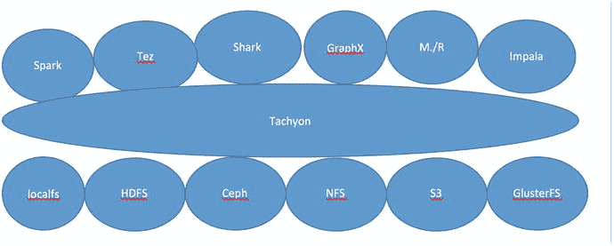
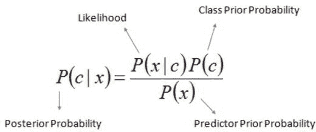
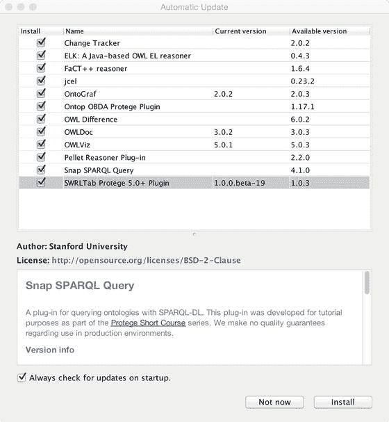
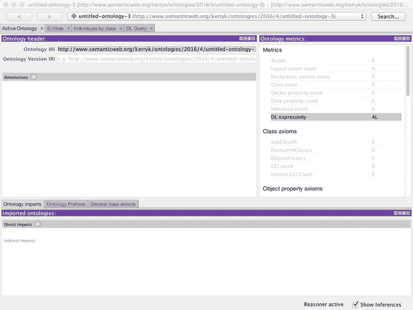
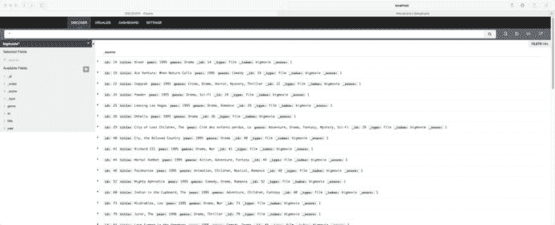

# 七、分析技术和算法概述

在本章中，我们提供了四类算法的概述:统计、贝叶斯、本体驱动和混合算法，这些算法利用标准库中找到的更基本的算法来使用 Hadoop 执行更深入和准确的分析。

## 7.1 算法类型概述

事实证明，Apache Mahout 和大多数其他主流机器学习工具包支持我们感兴趣的各种算法。例如，参见图 [7-1](#Fig1) 查看 Apache Mahout 支持的算法。

<colgroup><col> <col> <col> <col></colgroup> 
| 数字 | 算法名称 | 算法类型 | 描述 |
| --- | --- | --- | --- |
| one | 奈伊夫拜厄斯 | 分类者 | 简单的贝叶斯分类器:存在于几乎所有的现代工具包中 |
| Two | 隐马尔可夫模型 | 分类者 | 通过结果观察预测系统状态 |
| three | (学习)随机森林 | 分类者 | 随机森林算法(有时也称为随机决策森林)是一种用于分类、回归和其他任务的集成学习方法，它在训练时构建决策树集合，输出作为分类类模式或单个树的均值预测(回归)的类。 |
| four | (学习)多层感知机(LMP) | 分类者 | 也在 Theano 工具包和其他几个工具包中实现。 |
| five | (学习)逻辑回归 | 分类者 | scikit-learn 中也支持。实际上是一种分类技术，而不是回归技术。 |
| six | 随机梯度下降 | 优化器，模型查找 | H2O 和沃帕尔·瓦比特等人也支持目标函数最小化程序 |
| seven | 遗传算法 | 遗传算法 | 根据维基百科，“在数学优化领域，遗传算法(GA)是一种模拟自然选择过程的搜索启发式算法。这种试探法(有时也称为元试探法)通常用于生成优化和搜索问题的有用解决方案。 |
| eight | 奇异值分解 | 降维 | 降维的矩阵分解 |
| nine | 协同过滤(CF) | 被推荐的 | 一些推荐系统使用的技术 |
| Ten | 潜在狄利克雷分配 | 主题建模器 | 一个强大的算法(学习者),自动(和联合)将单词聚类成“主题”,并将文档聚类成主题“混合物” |
| Eleven | 谱聚类 | 聚合 |   |
| Twelve | 频繁模式挖掘 | 数据挖掘器 |   |
| Thirteen | k 均值聚类 | 聚合 | 使用 Mahout 可以得到普通的和模糊的 k 均值 |
| Fourteen | 树冠集群 | 聚合 | k-means 聚类器的预处理步骤:双阈值系统 |


图 7-1。

Mean, standard deviation, and normal distribution are often used in statistical methods

统计和数值算法是我们可以使用的最直接的分布式算法。

统计技术包括使用标准统计计算，如图 [7-1](#Fig1) 所示。

贝叶斯技术是构建分类器、数据建模和其他目的的最有效的技术之一。

另一方面，本体驱动的算法是一整套算法，它们依赖于逻辑的、结构化的、层次化的建模、语法和其他技术来为建模、数据挖掘和对数据集进行推断提供基础设施。

混合算法将一个或多个由不同类型的算法组成的模块结合在一起，用 glueware 连接在一起，提供一个比单一算法类型更灵活、更强大的数据管道。例如，神经网络技术可以与贝叶斯技术和 ML 技术相结合来创建“学习贝叶斯网络”，这是通过使用混合方法可以获得的协同作用的一个非常有趣的例子。

## 7.2 统计/数字技术

示例系统中的统计类和支持方法可以在`com.apress.probda.algorithms.statistics`子包中找到。

我们可以在图 [7-2](#Fig2) 中看到一个使用 Apache Storm 的简单分布式技术栈。


图 7-3。

An Apache Spark-centric technology stack


图 7-2。

A distributed technology stack including Apache Storm

我们可以在图 [7-4](#Fig4) 中看到一个以超光速粒子为中心的技术堆栈。Tachyon 是一个容错分布式内存文件系统



图 7-4。

A Tachyon-centric technology stack , showing some of the associated ecosystem

## 7.3 贝叶斯技术

我们在示例系统中实现的贝叶斯技术可以在包 com.prodba.algorithms.bayes 中找到

我们最流行的库所支持的一些贝叶斯技术(除了朴素贝叶斯算法之外)包括图 [7-1](#Fig1) 中所示的那些。

朴素贝叶斯分类器基于基本贝叶斯方程，如图 [7-5](#Fig5) 所示。



图 7-5。

The fundamental Bayes equation

该方程包含四种主要的概率类型:后验概率、似然性、类先验概率和预测先验概率。这些术语在本章末尾的参考资料中有解释。

我们可以用一种简单的方式来尝试 Mahout 文本分类器。首先，下载一个基本数据集进行测试。

## 7.4 本体驱动的算法

本体驱动的组件和支持类可以在`com.apress.probda.algorithms.ontology`子包中找到。

要包含 Protégé Core 组件，请将以下 Maven 依赖项添加到您的项目 pom.xml 文件中。

```scala
<dependency>
        <groupId>edu.stanford.protege</groupId>
        <artifactId>protege-common</artifactId>
        <version>5.0.0-beta-24</version>
</dependency>

```

从网站注册并下载 protegé:

[T0](http://protege.stanford.edu/products.php#desktop-prot%C3%A9g%C3%A9)T1】

可以通过使用诸如斯坦福的 Protégé系统之类的本体编辑器来交互式地定义本体，如图 [7-5](#Fig5) 所示。



图 7-6。

Setting up SPARQL functionality with the Stanford toolkit interactive setup

您可以安全地选择所有组件，或者只选择您需要的组件。请参考各个在线文档页面，查看这些组件是否适合您的应用。



图 7-7。

Using an ontology editor to define ontologies, taxonomies, and grammars

## 7.5 混合算法:组合算法类型

Probda 示例系统中实现的混合算法可以在`com.apress.prodbda.algorithms.hybrid`子包中找到。

我们可以混合匹配算法类型来构建更好的数据管道。这些“混合系统”可能更复杂一些——当然，它们通常有几个额外的组件——但它们在实用性上弥补了这一点。

最有效的混合算法之一是所谓的“深度学习”组件。并非所有人都认为深度学习器是一种混合算法(在大多数情况下，它们本质上是建立在多层神经网络技术上的)，但有一些令人信服的理由将深度学习器视为混合系统，正如我们将在下面讨论的那样。

所谓的“深度学习”技术包括图 yy-yy 所示的技术。DeepLearning4J 和 TensorFlow toolkit 是目前可用的两个比较流行和强大的深度学习库。在 [`https://www.tensorflow.org/versions/r0.10/get_started/basic_usage.htmlautoenc`](https://www.tensorflow.org/versions/r0.10/get_started/basic_usage.htmlautoenc) 查看 TensorFlow。Theano 是一个基于 Python 的多维数组库。查看 [`http://deeplearning.net/tutorial/dA.html`](http://deeplearning.net/tutorial/dA.html) 了解更多关于如何使用 Theano 的细节。

<colgroup><col> <col> <col> <col> <col></colgroup> 
| 数字 | 算法名称 | 算法类型 | 工具包 | 描述 |
| --- | --- | --- | --- | --- |
| one | 深度信念网络 | 神经网络 | 深入学习 4j，tensorflow，Theano | 多层隐藏单元，仅具有层互连性 |
| Two | (堆叠、去噪)自动编码器(DA) | 基本自动编码器原理的变体 | 深入学习 4j，tensorflow，Theano | 堆叠自动编码器是由多层稀疏自动编码器组成的神经网络，其中每层的输出都连接到连续层的输入。去噪自动编码器可以接受部分损坏的输入，同时恢复原始未损坏的输入。 |
| three | 卷积神经网络(CNN) | 神经网络，MLP 的变体 | 深入学习 4j，tensorflow，Theano | 稀疏连接和共享权重是细胞神经网络的两个特征。 |
| four | 长短期记忆单位(LSTM) | 递归神经网络，分类器，预测器 | Deeplearning4j， TensorFlow | 分类和时间序列预测，甚至情感分析 |
| five | 递归神经网络 | 神经网络 | Deeplearning4j， TensorFlow | 分类，时间序列预测 |
| six | 计算图 | 复杂网络架构构建器 | Deeplearning4j， TensorFlow | 计算用图形表示。 |

## 7.6 代码示例

在本节中，我们将讨论我们在前面章节中讨论的算法类型的一些扩展示例。

为了对一些算法比较有所了解，让我们使用电影数据集来评估我们已经讨论过的一些算法和工具包。

```scala
package com.apress.probda.datareader.csv;

import java.io.BufferedReader;
import java.io.BufferedWriter;
import java.io.File;
import java.io.FileNotFoundException;
import java.io.FileOutputStream;
import java.io.FileReader;
import java.io.IOException;
import java.io.OutputStreamWriter;

public class FileTransducer {

        /**
         * This routine splits a line which is delimited into fields by the vertical
         * bar symbol '|'
         *
         * @param l
         * @return
         */
        public static String makeComponentsList(String l) {
                String[] genres = l.split("\\|");
                StringBuffer sb = new StringBuffer();
                for (String g : genres) {
                        sb.append("\"" + g + "\",");
                }
                String answer = sb.toString();
                return answer.substring(0, answer.length() - 1);
        }

        /**
         * The main routine processes the standard movie data files so that mahout
         * can use them.
         *
         * @param args
         */
        public static void main(String[] args) {
if (args.length < 4){
System.out.println("Usage: <movie data input><movie output file><ratings input file> <ratings output file>");
                        System.exit(-1);
                }
                File file = new File(args[0]);
                if (!file.exists()) {
                        System.out.println("File: " + file + " did not exist, exiting...");
                        System.exit(-1);
                }
                System.out.println("Processing file: " + file);
                BufferedWriter bw = null;
                FileOutputStream fos = null;
                String line;
                try (BufferedReader br = new BufferedReader(new FileReader(file))) {
                        int i = 1;
                        File fout = new File(args[1]);
                        fos = new FileOutputStream(fout);
                        bw = new BufferedWriter(new OutputStreamWriter(fos));
                        while ((line = br.readLine()) != null) {
                                String[] components = line.split("::");
                                String number = components[0].trim();
                                String[] titleDate = components[1].split("\\(");
                                String title = titleDate[0].trim();
                                String date = titleDate[1].replace(")", "").trim();
                                String genreList = makeComponentsList(components[2]);
                                String outLine = "{ \"create\" : { \"_index\" : \"bigmovie\", \"_type\" : \"film\", \"_id\" : \"" + i
                                                + "\" } }\n" + "{ \"id\": \"" + i + "\", \"title\" : \"" + title + "\", \"year\":\"" + date
                                                + "\" , \"genre\":[" + genreList + "] }";
                                i++;
                                bw.write(outLine);
                                bw.newLine();
                        }
                } catch (IOException e) {
                        // TODO Auto-generated catch block
                        e.printStackTrace();
                } finally {
                        if (bw != null) {
                                try {
                                        bw.close();
                                } catch (IOException e) {
                                        // TODO Auto-generated catch block
                                        e.printStackTrace();
                                }
                        }
                }
                file = new File(args[2]);
                try (BufferedReader br2 = new BufferedReader(new FileReader(file))) {
                        File fileout = new File(args[3]);
                        fos = new FileOutputStream(fileout);
                        bw = new BufferedWriter(new OutputStreamWriter(fos));
                        while ((line = br2.readLine()) != null) {
                                String lineout = line.replace("::", "\t");
                                bw.write(lineout);
                        }
                } catch (IOException e) {
                        // TODO Auto-generated catch block
                        e.printStackTrace();
                } finally {
                        if (bw != null) {
                                try {
                                        bw.close();
                                } catch (IOException e) {
                                        // TODO Auto-generated catch block
                                        e.printStackTrace();
                                }
                        }
                }
        }
}
Execute the following curl command on the command line to import the data set into elastic search:
curl -s -XPOST localhost:9200/_bulk --data-binary @index.json; echo

```

数据集可以通过命令行使用 CURL 命令导入到 Elasticsearch 中。图 [7-8](#Fig8) 就是执行这样一个命令的结果。Elasticsearch 服务器返回一个 JSON 数据结构，该数据结构显示在控制台上，并被索引到 Elasticsearch 系统中。



图 7-9。

Using Kibana as a reporting and visualization tool


图 7-8。

Importing a standard movie data set example using a CURL command

我们可以在图 [7-7](#Fig7) 中看到一个使用 Kibana 作为报告工具的简单例子。顺便说一句，在本书余下的大部分内容中，我们会遇到 Kibana 和 ELK Stack(elastic search–Logstash–Kibana)。虽然有使用 ELK 堆栈的替代方法，但这是从第三方构建块构建数据分析系统的更轻松的方法之一。

## 7.7 摘要

在这一章中，我们讨论了分析技术和算法以及一些评估算法有效性的标准。我们谈到了一些较老的算法类型:统计和数值分析函数。组合或混合算法在最近几天变得特别重要，因为来自机器学习、统计学和其他领域的技术可以以合作的方式非常有效地使用，正如我们在本章中所看到的。对于分布式算法的一般介绍，参见 Barbosa (1996)。

这些算法类型中有许多非常复杂。其中一些，例如贝叶斯技术，有专门的文献。对于贝叶斯技术的详细解释，特别是概率技术，见扎德(1992)，

在下一章中，我们将讨论基于规则的系统，可用的规则引擎系统，如 JBoss Drools，以及基于规则的系统在智能数据收集、基于规则的分析和数据管道控制调度和编排方面的一些应用。

## 7.8 参考文献

分布式算法导论。麻省剑桥:麻省理工学院出版社，1996 年。

贝叶斯统计导论。纽约:威利 Inter-Science，威利父子公司，2004 年。

贾科姆利，皮可。阿帕奇看象人食谱。英国伯明翰:PACKT 出版社，2013 年。

古普塔，阿希什。学习 Apache Mahout 分类。英国伯明翰:PACKT 出版社，2015 年。

马尔马尼什，哈拉兰博斯和巴本科，德米特里。智能网的算法。康涅狄格州格林威治:曼宁出版社，2009 年。

Nakhaeizadeh，g .和 Taylor，C.C .(编辑)。机器学习和统计学:界面。纽约:约翰·威利父子公司，1997 年。

西蒙帕森斯。不确定条件下推理的定性方法。剑桥。马:麻省理工学院出版社，2001。

珀尔朱迪亚。智能系统中的概率推理:似是而非推理网络。加利福尼亚州圣马特奥:摩根-考夫曼出版社，1988 年。

扎德、洛夫蒂和卡普奇克(合编)。不确定性管理的模糊逻辑。纽约:约翰·威利父子公司，1992 年。