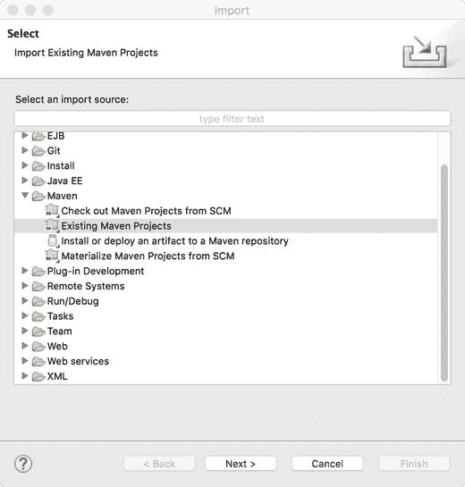
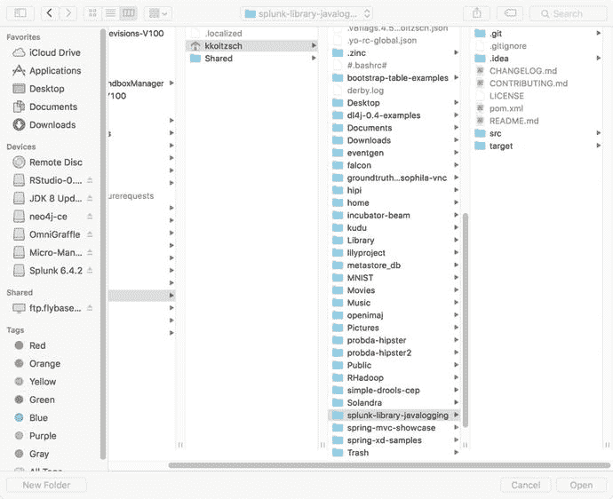
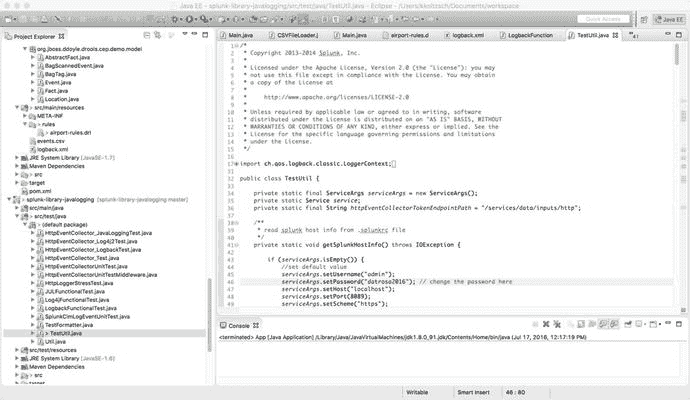
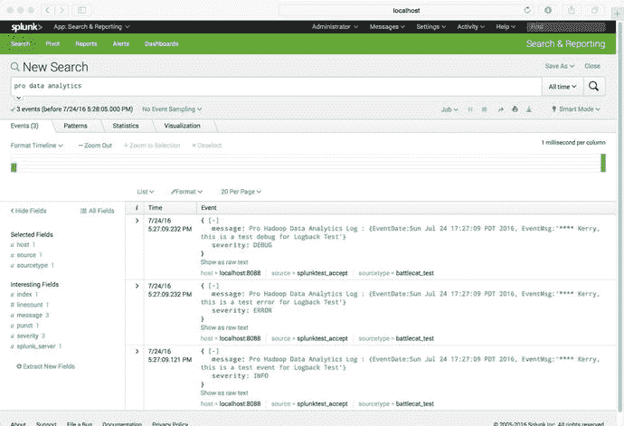

# 九、将所有这些放在一起：设计一个完整的分析系统

在本章中，我们将描述一个端到端的设计示例，使用到目前为止讨论过的许多组件。我们还讨论了在系统开发项目的需求获取、计划、架构、开发、测试和部署阶段使用的“最佳实践”。

Note

本章使用了本书其他地方讨论的许多软件组件，包括 Hadoop、Spark、Splunk、Mahout、Spring Data、Spring XD、Samza 和 Kafka。查看附录 A 中的组件摘要，并确保在尝试本章中的示例时可以使用它们。

构建一个完整的分布式分析系统比听起来容易。在前面的章节中，我们已经讨论了这样一个系统的许多重要组成部分。一旦您理解了您的数据源和汇点将会是什么，并且您对要使用的技术栈和要利用的“glueware”有了一个相当清晰的概念，编写业务逻辑和其他处理代码就可以成为一个相对简单的任务。

一个简单的端到端架构如图 [9-1](#Fig1) 所示。对于数据源、处理器、数据接收器和存储库以及输出模块实际使用的技术，这里显示的许多组件都留有余地，其中包括我们将在其他章节中看到的熟悉的仪表板、报告、可视化等。在本例中，我们将使用熟悉的导入工具 Splunk 来提供输入源。


图 9-1。

A simple end-to-end analytics architecture

在下一节中，我们将介绍如何设置 Splunk 并将其与示例系统的其他组件集成。

How to Install Splunk for the Example System

Splunk ( [`https://www.splunk.com`](https://www.splunk.com) )是一个日志框架，非常容易下载、安装和使用。对于我们在这里展示的示例分析系统来说，它附带了许多非常有用的功能，包括一个内置的搜索工具。

要安装 Splunk，请转到下载网页，创建一个用户帐户，并下载适用于您的适当平台的 Splunk Enterprise。这里展示的所有例子都使用 MacOS 平台。

为您选择的平台正确安装 Splunk Enterprise。在 Mac 平台上，如果安装成功，您将看到 Splunk 出现在您的应用程序目录中，如图 [9-2](#Fig2) 所示。


图 9-2。

Successful Splunk Enterprise installation for Mac OSX

关于如何启动 Splunk，请参考 [`http://docs.splunk.com/Documentation/Splunk/6.4.2/SearchTutorial/StartSplunk`](http://docs.splunk.com/Documentation/Splunk/6.4.2/SearchTutorial/StartSplunk) 。请注意，正确启动后，可以在`http://localhost:8000`找到 Splunk Web 界面。


图 9-3。

Login page for Splunk Enterprise

当您将浏览器指向 localhost:8000 时，最初会看到 Splunk 登录页面。首先使用默认的用户名和密码，按照指示进行更改，并确保用于连接的 Java 代码使用更新的用户名(' admin ')和密码(' changename ')。


图 9-4。

Change password during initial Splunk Enterprise setup

从 github 下载以下非常有用的库，splunk-library-javalogging:

```scala
git clone https://github.com/splunk/splunk-library-javalogging.git

cd splunk-library-javalogging

mvn clean install

```

在您的 Eclipse IDE 中，导入现有的 Maven 项目，如图 [9-5](#Fig5) 所示。



图 9-5。

Import an existing Maven to use splunk-library-javalogging

图 [9-5](#Fig5) 显示了导入现有 Maven 项目以使用 splunk-library-javalogging 的对话框。



图 9-6。

Select splunk-library-javalogging for import

如图 [9-7](#Fig7) 所示，选择合适的 pom.xml 是您在这一步需要做的全部工作。


图 9-7。

Select the appropriate root directory for Maven construction

如图 [9-8](#Fig8) 所示，修改以包括适当的用户名和密码值通常是此安装步骤所必需的。



图 9-8。

Eclipse IDE installation of Splunk test code

如图 [9-9](#Fig9) 所示，为 Splunk 配置 HadoopConnect 组件。


图 9-9。

Configure the HadoopConnect component for Splunk

Splunk 仪表盘中的文本搜索可如图 [9-10](#Fig10) 所示完成。我们还可以选择一个合适的带时间戳的时间间隔来对数据集执行查询。



图 9-10。

Searching for Pro Data Analytics events in the Splunk dashboard

可视化是这一整合过程的重要组成部分。查看本章底部的一些 D3 参考资料，了解一些可以与数据管道的其他组件结合使用的技术。

## 9.1 摘要

在这一章中，我们讨论了构建一个完整的分析系统，以及架构师和开发人员在这个过程中遇到的一些挑战。我们使用前几章中讨论的现已熟悉的技术组件构建了一个完整的端到端分析管道。特别是，我们讨论了如何使用 Splunk 作为输入数据源。Splunk 是一种特别通用和灵活的工具，可用于各种通用日志事件。

## 9.2 参考文献

莫克，德里克，约翰逊，保罗，迪亚昆，乔什。Splunk 运营情报指南。英国伯明翰:PACKT 出版社，2014 年。

朱，尼克齐。用 d3.js Cookbook 实现数据可视化。英国伯明翰:PACKT 出版社，2014 年。