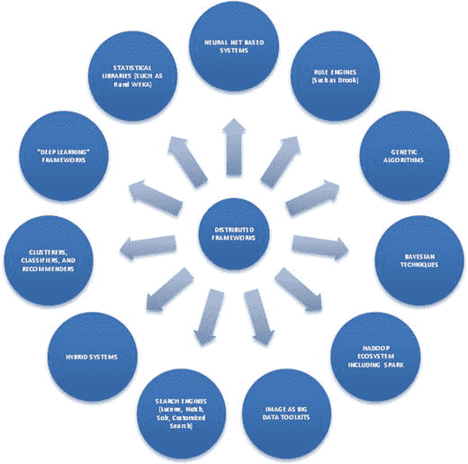
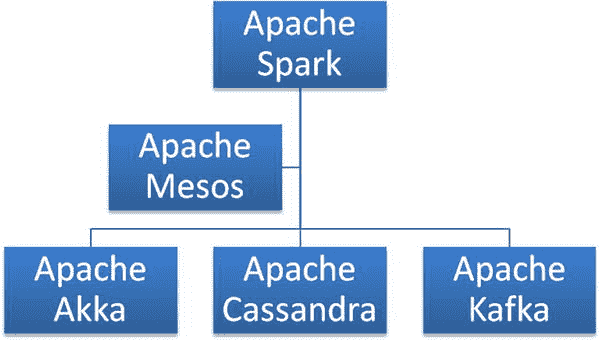
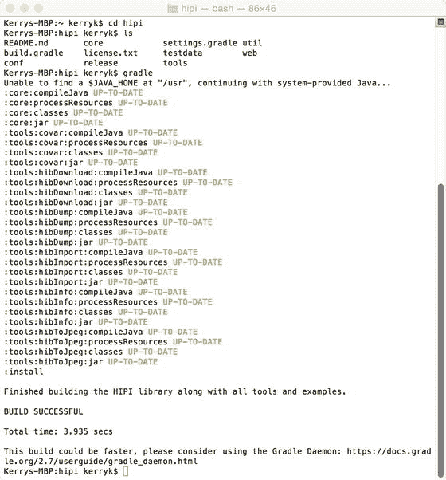
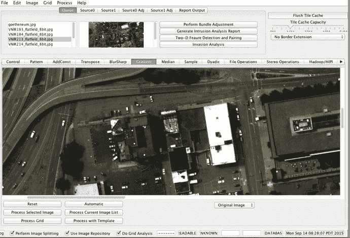
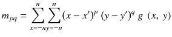
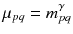
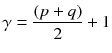
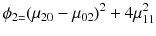
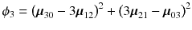
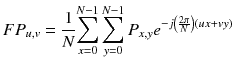

# 十四、“作为大数据的图像”系统：一些案例研究

在本章中，我们将简要介绍一个示例工具包，即 Image as Big Data Toolkit (IABDT)，这是一个基于 Java 的开源框架，用于以可扩展、高度可用且可靠的方式执行各种分布式图像处理和分析任务。IABDT 是过去几年开发的图像处理框架，旨在应对大数据技术的快速发展，尤其是分布式图像处理技术。IABDT 设计为接受多种格式的图像、信号、传感器数据、元数据和视频作为数据输入。

讨论了图像分析、大数据存储以及图像和图像衍生数据的压缩方法的一般架构，以及图像作为大数据分析的标准技术。作为我们的图像分析架构的一个示例实现，IABDT 解决了图像分析开发人员经常遇到的一些挑战，包括将图像导入分布式文件系统或缓存、图像预处理和特征提取、应用分析和结果可视化。最后，我们展示了 IABDT 的一些特性，特别强调了显示、演示、报告、仪表板构建和用户交互案例研究，以激励和解释我们的设计和方法堆栈选择。

## 14.1 图像作为大数据的介绍

“大数据”软件技术发展的快速变化使得执行图像分析(自动分析和解释来自计算机图像的复杂半结构化和非结构化数据集)变得比以前更加容易、准确、灵活和快速，即使使用最复杂和高性能的单台计算机或数据中心也是如此。包括 Hadoop、Apache Spark 和分布式计算系统在内的“大数据处理范式”使许多应用领域受益于图像分析和将图像作为大数据处理，包括医疗、航空航天、地理空间分析和文档处理应用。模块化、高效和灵活的工具包仍处于形成或实验开发阶段。图像处理组件、数据流控制和图像分析的其他方面的集成仍然是不明确的和尝试性的。大数据技术的快速变化甚至使得选择“技术堆栈”来构建图像分析应用程序都成了问题。为了解决图像分析应用开发中的这些挑战，我们开发了一个专门用于分布式大数据图像分析支持的架构和基线框架实现。

在过去，低级图像分析和机器学习模块被结合在一个计算框架内，以完成特定领域的任务。随着分布式处理框架(如 Hadoop 和 Apache Spark)的出现，可以构建与其他分布式框架和库无缝连接的集成图像框架，其中“图像作为大数据”的概念已经成为框架架构的基本原则。

我们的示例工具包 IABDT 提供了一个灵活的、面向插件的模块化架构。这使得将许多不同的软件库、工具包、系统和数据源结合在一个集成的分布式计算框架中成为可能。IABDT 是一个以 Java 和 Scala 为中心的框架，因为它使用 Hadoop 及其生态系统以及 Apache Spark 框架及其生态系统来执行图像处理和图像分析功能。

IABDT 可与 NoSQL 数据库(如 MongoDB、Neo4j、Giraph 或 Cassandra)以及更传统的关系数据库系统(如 MySQL 或 Postgres)一起使用，以存储计算结果并用作图像处理管道中预处理和后处理阶段生成的中间数据的数据储存库。这些中间数据可能包括要素描述符、影像金字塔、边界、视频帧、辅助传感器数据(如激光雷达)或元数据。像 Apache Camel 和 Spring Framework 这样的软件库可以作为“粘合剂”将组件相互集成。

创建 IABDT 的动机之一是提供一个模块化的可扩展基础设施，用于执行预处理、分析以及分析结果的可视化和报告——特别是针对图像和信号。它们利用了分布式处理的能力(就像 Apache Hadoop 和 Apache Spark 框架一样),并受到 OpenCV、BoofCV、HIPI、Lire、Caliph、Emir、Image Terrier、Apache Mahout 等工具包的启发。表 [14-1](#Tab1) 总结了这些图像工具包的特征和特性。IABDT 提供框架、模块化库和可扩展示例，使用高效、可配置和分布式数据流水线技术对图像执行大数据分析。

表 14-1。

Mainstream image processing toolkit features and characteristics

<colgroup><col> <col> <col> <col></colgroup> 
| 工具包名称 | 位置 | 工具语言 | 描述 |
| --- | --- | --- | --- |
| 开放计算机视觉 | opencv.org | 许多语言绑定，包括 Java | 通用编程图像处理工具包 |
| BoofCV | boofcv.org | 爪哇 | 基于 Java 的图像处理工具包 |
| 嘘嘘嘘嘘嘘嘘嘘嘘嘘嘘嘘嘘嘘嘘 | hipi.cs.virginia.edu | 爪哇 | Hadoop 工具包的图像处理 |
| 阅读/卡利夫/埃米尔 | semanticmetadata.net | 爪哇 | 使用 Lucene 的图像搜索工具包和库 |
| 影像梗 | imageterrier.org | 爪哇 | 基于 Lucene 搜索引擎的图像索引和搜索 |
| Java 高级成像 | oracle.com/technetwork/java/javase/overview/in… | 爪哇 | 通用图像处理工具包，古老但仍然有用 |

如图 [14-1](#Fig1) 所示，大数据工具包和组件正在成为基于 Apache Hadoop 和 Apache Spark 的其他分布式软件包中的资源。



图 14-1。

Image as Big Data tookits as distributed systems

IABDT 中实现的图 [14-1](#Fig1) 中模块类型的一些分布式实现包括:

遗传系统。有许多遗传算法特别适合于图像分析 <sup>1</sup> ，包括对大型解决方案空间进行采样、特征提取和分类的技术。前两类技术更适用于分析过程和分布式分类技术的图像预处理和特征提取阶段，甚至是那些使用多个分类器的技术。

贝叶斯技术。贝叶斯技术包括大多数机器学习工具包中的朴素贝叶斯算法，还有更多。

Hadoop 生态系统扩展。可以在现有 Hadoop 组件的基础上构建新的扩展，以提供定制的“大数据图像”功能。

聚类、分类和推荐。这三种类型的分析算法存在于大多数标准库中，包括 Mahout、MLib 和 H2O，它们构成了更复杂的分析系统的基础。

混合系统将许多不同类型的组件集成到一个集成的整体中，以执行单一功能。通常，混合系统包含一个控制组件，它可能是基于规则的系统，如 Drools，或者是其他标准的控制组件，如 Oozie，它可能用于调度任务或其他目的，如 Luigi for Python ( `https://github.com/spotify/luigi`)，它带有内置的 Hadoop 支持。如果您想试用 Luigi，请使用 Git 安装 Luigi，并将其克隆到一个方便的子目录中:



图 14-2。

Image as Big Data tookits as distributed systems

```scala
git clone

https://github.com/spotify/luigi?cm_mc_uid=02629589701314462628476&cm_mc_sid_50200000=1457296715

cd to the bin directory and start the server

./luigid

```

## 14.2 使用 HIPI 系统的第一个代码示例

在本节中，我们将介绍 HIPI Hadoop 图像处理系统，并展示一些简单的示例，说明如何将其用作图像的分布式数据处理管道组件。

hipi.cs.virginia.edu 是一个非常有用的基于 Hadoop 的图像处理工具，它起源于弗吉尼亚大学。它与 OpenCV 等更主流的标准图像处理库集成，以 Hadoop 为中心的方式提供广泛的图像处理和分析技术。

HIPI 系统包含了几个用于基本 Hadoop-centric 图像处理任务的基本工具。

这些工具包括创建“HIB”文件(HIPI 图像包)的工具，如图 [14-3](#Fig3) 所示。


图 14-3。

A HIPI image data flow, consisting of bunding, culling, map/shuffle and reduce to end result

HIPI 映像包或“HIB”是 HIPI 用来将映像分组到一个物理单元中的结构化存储方法。剔除阶段允许根据适当的程序标准过滤掉每个 HIB。被剔除的图像没有被完全解码，这使得 HIPI 管道更加有效。剔除阶段的输出产生如图所示的图像集。每个图像集都有自己的贴图阶段，随后是洗牌阶段和相应的减少步骤，以创建最终结果。因此，如您所见，HIPI 数据流类似于标准的地图缩减数据流过程。我们重现了图 [14-4](#Fig4) 中的 Hadoop 数据流过程，供您参考。


图 14-4。

A reference diagram of the classic map-reduce data flow, for comparison with 14-3 Installing a Basic Hipi System

下面是基本的 HIPI 安装说明。

1.  首先，查看 [`http://hipi.cs.virginia.edu/gettingstarted.html`](http://hipi.cs.virginia.edu/gettingstarted.html) 的“开始使用”页面，了解系统的最新动态和/或变化。
2.  安装基本的 HIPI 软件，如“入门”页面所示:

    ```scala
    git clone git@github.com:uvagfx/hipi.git

    ```

这将把源代码安装到一个“hipi”目录中。Cd 到这个“hipi”目录和“ls”目录来查看内容。您将需要一个 Gradle 构建工具安装程序来从源代码进行安装。最终的构建将类似于图 [14-5](#Fig5) 。



图 14-5。

Successful Gradle installation of the HIPI toolkit

Gradle 是另一个有用的安装和构建工具，类似于 Maven。有些系统，比如 HIPI，使用 Gradle 比使用 Maven 等其他技术更容易安装。


图 14-6。

Example using HIPI info utility: Mage info about a 10-image HIB in the HIPI system

然而，安装 HIPI 只是第一步！我们必须将我们的 HIPI 处理器与分析组件集成在一起，才能得出我们的结果。

## 14.3 BDA 图像工具包利用高级语言功能

使用 Python 等现代解释语言的能力，以及交互式读取-评估-打印循环(REPLs)和函数式编程，是大多数现代编程语言的特性，包括 Java 9、Scala 和交互式 Python。IABDT 使用这些现代编程语言特性使系统更容易使用，结果 API 代码更加简洁。

IABDT 与 Hadoop 2 和 Apache Spark 无缝集成，并使用 Mahout、MLib、H20 和 Sparkling Water 等标准分布式库来提供分析功能。我们讨论的一个案例研究也在 Hadoop 中使用了标准的以 Java 为中心的统计库，比如 R 和 Weka。

## 14.4 什么是图像数据分析？

图像数据分析应用与一般数据分析相同的一般原则、模式和策略。区别在于数据来源。我们摆脱了分析数字、行项目、文本、文档、日志条目和其他基于文本的数据源的传统观念。与基于文本的数据源不同，我们现在处理的数据要简单得多:信号(本质上是时间序列)和图像(可以是带有 RGB 值的彩色像素的二维图像，甚至是附加了元数据、地理位置和叠加信息的更奇特的图像类型)。

需要专门的工具包来执行基本的图像数据流水线操作。在顶层，提供了许多预编码和可定制的方法来帮助您。这些方法的分类如表 [14-2](#Tab2) 所示。


图 14-7。

Architecture of the Image as Big Data Toolkit

表 14-3。

Display methods for visualization provided by the IABDT. Most object types in the IABDT may be displayed using similar methods

<colgroup><col> <col> <col> <col></colgroup> 
| 方法名称 | 方法签名 | 利用工具包 | 描述 |
| --- | --- | --- | --- |
| 显示 | 显示(图像，属性集) | BoofCV |   |
| 显示 | 显示(图像金字塔，属性集) | BoofCV |   |
| 显示 | 显示(图像集，属性集) | BoofCV |   |
| 显示 | 显示(图像、功能集、属性集) | BoofCV |   |
| 显示 | 显示(图像、地理位置模型、属性集) | BoofCV |   |
| 显示 | 显示(图像、结果集、属性集) | BoofCV |   |

表 14-2。

A selection of methods from the Image as Big Data Toolkit

<colgroup><col> <col> <col> <col></colgroup> 
| 方法名称 | 方法签名 | 输出类型 | 描述 |
| --- | --- | --- | --- |
| EJRCL | EJRCL(图像，属性集) | 计算结果 | 边缘、交汇点、区域、轮廓和线 |
| 创建图像金字塔 | imagePyramid(图像特性集) | 图像金字塔 | 一个图像转换为图像金字塔，参数化 |
| 项目贝叶斯 | 项目贝叶斯(图像集，贝叶斯模型，属性集) | BayesianResult 结果 | 将图像集投影到贝叶斯假设空间中 |
| 计算统计数据 | 计算机统计(图像，属性集) | 计算结果 | 针对单个图像或图像集或图像金字塔计算的基本统计数据 |
| deepLearn | deepLearn(图像集，学习者，属性集) | LearnerResult | 使用标准的分布式深度学习算法来处理图像集或金字塔 |
| 多分类 | 多分类(图像集，分类模型，属性集) | 分类结果 | 使用多个分类器对图像集或图像金字塔进行分类 |

图像数据源处理器是负责数据采集、图像清理、格式转换和其他操作的组件，用于将数据“处理”成其他管道组件可接受的格式。

分析引擎组件可以是支持库，如 R 和 Weka。

中间数据源是初始分析计算的输出。

用户控制仪表板是一个事件处理程序、交互式组件。

控制和配置模块由 Drools 之类的规则组件或其他规则引擎或控制组件组成，并且可能包含用于诸如调度、数据过滤和细化以及整个系统控制和配置任务之类的任务的其他“助手”库。通常，动物园管理员和/或馆长可以用于协调和编排控制和配置任务。

分布式系统基础结构模块包含底层支持和“助手”库。

持久结果储存库可以是各种类型的数据接收器中的任何一种，包括关系型、图形型或 NoSQL 型数据库。如果合适，也可以使用内存中的键值数据存储。

报告模块通常由老式的分析结果的表格或图表表示组成。

用户交互、控制和反馈是由 IABDT 交互模块提供的，它包括用于常见用例的默认仪表板。

可视化模块由支持库组成，用于显示图像、叠加图、特征位置和其他可视化信息，使交互和理解数据集更加容易。

## 14.5 交互模块和仪表板

为分布式图像处理系统开发适当的显示器和仪表板的能力是对已完成实现的评估、测试、概念验证和优化的必要辅助。

IABDT 直接支持构建基本的用户界面和仪表板。一个简单的用户界面如图 [14-8](#Fig8) 所示。



图 14-8。

A simple user interface build with the IABDT

相同对象的统一视图、处理图像序列的图像显示和图像叠加功能都由 IABD 工具包提供。

仪表板、显示器和交互式界面——包括独立应用程序和基于网络的界面——可通过 IABDT 用户界面构建模块构建。原型 IABDT 支持标准类型的显示，包括覆盖和地理位置数据。

## 14.6 添加新的数据管道和分布式特征发现

使用 IABDT 设计新的分析数据流非常简单。来自算法的等式可以被转换成独立代码，以及从独立代码转换成 map/reduce 实现，利用为与 Hadoop/Spark 生态系统集成而提供的许多工具包，包括弗吉尼亚大学的 HIPI 系统(hipi.cs.virginia.edu)，如下所述。

已经为基于 Spark 的系统明确开发了一些分布式图像处理功能，因此在这里可能需要稍微偏离一下 Apache Spark 与 Hadoop 的争论。最近在文献中有一些关于 Apache Spark 是否已经杀死了 map/reduce 范式以及“杀死”了 Hadoop 生态系统的有用性的争论(例如，Apache Mahout 库最初只支持 map/reduce，但后来发展到支持 Apache Spark 甚至 H20)。随着 IABDT 原型系统的发展和开发，我们改变了自己的观点(随着时间的推移，Apache Spark 越来越成为一股不可忽视的力量),并逐渐认识到 Hadoop 和 Spark 是密切互补的技术，根本不应该分开。因此，我们将 IABDT 工具包设计为一个模块化和极其灵活的系统，以便我们可以轻松地使用 Hadoop 生态系统组件和 Spark 组件，即使在“混合”数据流开发中同时使用 Hadoop 和 Spark 技术，其中来自 M/R 和内存(Hadoop 和 Spark)处理的组件合作提供最终结果。

## 14.7 示例:分布式特征发现算法

可以使用所谓的“Hu 矩”的概念来构建分布式特征发现算法

Hu 矩用于计算特征形状。

按照 Kulkani (1994)的说法，我们可以用下面的几个方程来表达这一数学问题。

标准几何矩可以计算如下:


其中 g(x，y)是图像 g 的二维索引。所谓的中心矩可以定义为



其中 x' = m <sub>10</sub> /m <sub>00</sub> ，y' = m <sub>01</sub> /m00

并且当针对比例不变性进行归一化时。



其中



旋转和缩放不变的中心矩可以刻画如下:胡:







![$$ \begin{array}{l}{\phi}_5=\left({\mu}_{30} - 3{\mu}_{12}\right)\left({\mu}_{30} + {\mu}_{12}\right)\left[{\left({\mu}_{30}\kern0.5em + {\mu}_{12}\right)}^2-3{\left(\ {\mu}_{21}+{\mu}_{03}\kern0.5em \right)}^2\right]\kern0.5em +\\ {}\left(3{\mu}_{21} - {\mu}_{03}\right)\left({\mu}_{21} + {\mu}_{03}\right)\left[3{\left({\mu}_{30} + {\mu}_{12}\right)}^2-{\left({\mu}_{12}+{\mu}_{03}\right)}^2\right]\end{array} $$](img/A371868_1_En_14_Chapter_Equi.gif)

![$$ {\phi}_6 = \left({\mu}_{20} - {\mu}_{02}\ \right)\ \left[\ {\left({\mu}_{30} + {\mu}_{12}\right)}^2\ \hbox{--}\ {\left({\mu}_{21} + {\mu}_{03}\right)}^2\right] + 4{\mu}_{11}\left(\kern0.5em {\mu}_{30}+{\mu}_{12}\right)\left(\kern0.5em {\mu}_{21} + {\mu}_{03}\right) $$](img/A371868_1_En_14_Chapter_Equj.gif)

![$$ {\phi}_7=\kern0.5em \left(3{\mu}_{21} - {\mu}_{03}\right)\left(\kern0.5em {\mu}_{30} + {\mu}_{12}\right)\left[\ {\left({\mu}_{30} + {\mu}_{12}\right)}^2-3{\left({\mu}_{21}+{\mu}_{03}\right)}^2\right]\kern0.75em  - \left({\mu}_{30}-3{\mu}_{12}\ \right)\left(\kern0.5em {\mu}_{12} + {\mu}_{03}\right)\left[\ {\left(3{\mu}_{30} + {\mu}_{12}\right)}^2 - {\left({\mu}_{21}+{\mu}_{03}\right)}^2\kern0.5em \right] $$](img/A371868_1_En_14_Chapter_Equk.gif)

Hadoop 中的 map/reduce 任务可以根据矩方程显式编码，首先用 java 进行实验，以测试程序逻辑并确保计算值符合预期，然后转换为适当的 map/reduce 结构。清单 [14-1](#Par58) 中显示了 java 实现的草图。我们使用一个标准的 java 类 com . a press . prob da . core . computational result 来保存答案和“质心”(也是由我们的算法计算的):

```scala
public ComputationResult computeMoments(int numpoints, double[] xpts, double[] ypts)
    {
         int i;
           // array where the moments go
            double[] moments = new double[7];
         double xm.ym,x,y,xsq,ysq, factor;
         xm = ym = 0.0;
             for (i = 0; i<n; i++){
                        xm += xpts[i];
                        ym += ypts[i];
                }
        // now compute the centroid
        xm /= (double) n;
        ym /= (double) n;
        // compute the seven moments for the seven equations above
        for (i=0; i<7; i++){
        x =xpts[i]-xm;
        y = ypts[i]-ym;
        // now the seven moments
        moments[0] += (xsq=x*x); // mu 20
        moments[1] += x*y;       // mu 11
        moments[2] += (ysq = y * y); // mu 02
        moments[3] += xsq *x;        // mu 30
        moments[4] += xsq *y;        // mu 21
        moments[5] += x * ysq;       // mu 12
        moments[6] += y * ysq;       // mu 03
        }
// factor to normalize the size
        factor = 1.0 / ((double)n *(double)n);
        // second-order moment computation
        moments[0] *= factor;
        moments[1] *= factor;
        moments[2] *= factor;
        factor /= sqrt((double)n);
        // third order moment computation
        moments[3] *= factor;
        moments[4] *= factor;
        moments[5] *= factor;
        moments[6] *= factor;
        // a variety of constructors for ComputationalResult exist.
// this one constructs a result with centroid and
//moment array. ComputationResult instances are persistable.
        return new ComputationResult(xm, ym, moments);
    }
Listing 14-1.Moment computation in Java

```

从这个简单的 java 实现中，我们可以实现带有签名的 map、reduce 和 combine 方法，如清单 [14-2](#Par60) 所示。

```scala
// Method signatures for the map() and reduce() methods for
// moment feature extraction module
public void map(HipiImageHeader header, FloatImage image, Context context) throws IOException,
      InterruptedException

public void reduce(IntWritable key, Iterable momentComponents, Context context)
      throws IOException, InterruptedException

Listing 14-2.HIPI map/reduce method signatures for moment feature extraction computation

```

让我们回忆一下第 11 章的显微镜例子。在某些方面，这是一个非常典型的非结构化数据管道处理分析问题。正如您所记得的，图像序列最初是一个有序的图像列表，它们可以按时间戳或更复杂的方式排列，如地理位置、立体配对或重要性顺序。您可以想象在一个医疗应用程序中，可能有几十个同一患者的医学图像，那些有威胁生命的异常情况应该尽快出现在队列的前面。

其他图像操作可能是分布式处理的良好候选，例如清单 [14-3](#Par1000) 中用 BoofCV 编码的 Canny edge 操作。

```scala
package com.apress.iabdt.examples;

import java.awt.image.BufferedImage;

import java.util.List;

import com.kildane.iabdt.model.Camera;

import boofcv.alg.feature.detect.edge.CannyEdge;

import boofcv.alg.feature.detect.edge.EdgeContour;

import boofcv.alg.filter.binary.BinaryImageOps;

import boofcv.alg.filter.binary.Contour;

import boofcv.factory.feature.detect.edge.FactoryEdgeDetectors;

import boofcv.gui.ListDisplayPanel;

import boofcv.gui.binary.VisualizeBinaryData;

import boofcv.gui.image.ShowImages;

import boofcv.io.UtilIO;

import boofcv.io.image.ConvertBufferedImage;

import boofcv.io.image.UtilImageIO;

import boofcv.struct.ConnectRule;

import boofcv.struct.image.ImageSInt16;

import boofcv.struct.image.ImageUInt8;

public class CannyEdgeDetector {

        public static void main(String args[]) {
                BufferedImage image = UtilImageIO

                                .loadImage("/Users/kerryk/Downloads/groundtruth-drosophila-vnc/stack1/membranes/00.png");

                ImageUInt8 gray = ConvertBufferedImage.convertFrom(image, (ImageUInt8) null);
                ImageUInt8 edgeImage = gray.createSameShape();

                // Create a canny edge detector which will dynamically compute the
                // threshold based on maximum edge intensity
                // It has also been configured to save the trace as a graph. This is the
                // graph created while performing
                // hysteresis thresholding.
                CannyEdge<ImageUInt8, ImageSInt16> canny = FactoryEdgeDetectors.canny(2, true, true, ImageUInt8.class, ImageSInt16.class);
                // The edge image is actually an optional parameter. If you don't need
                // it just pass in null
                canny.process(gray, 0.1f, 0.3f, edgeImage);
                // First get the contour created by canny

                List<EdgeContour> edgeContours = canny.getContours();
                // The 'edgeContours' is a tree graph that can be difficult to process.
                // An alternative is to extract
                // the contours from the binary image, which will produce a single loop
                // for each connected cluster of pixels.
                // Note that you are only interested in external contours.
                List<Contour> contours = BinaryImageOps.contour(edgeImage, ConnectRule.EIGHT, null);
                // display the results
                BufferedImage visualBinary = VisualizeBinaryData.renderBinary(edgeImage, false, null);
                BufferedImage visualCannyContour = VisualizeBinaryData.renderContours(edgeContours, null, gray.width, gray.height, null);
                BufferedImage visualEdgeContour = new BufferedImage(gray.width, gray.height, BufferedImage.TYPE_INT_RGB);
                VisualizeBinaryData.renderExternal(contours, (int[]) null, visualEdgeContour);
                ListDisplayPanel panel = new ListDisplayPanel();
                panel.addImage(visualBinary, "Binary Edges");
                panel.addImage(visualCannyContour, "Canny GraphTrace");
                panel.addImage(visualEdgeContour, "Canny Binary Contours");
                ShowImages.showWindow(panel, "Image As Big Data Toolkit Canny Edge Extraction: ", true);
        }
}

Listing 14-3.Canny Edge Detection Using BoofCV, before parallelization

```

兴趣点是定义明确、稳定的图像空间位置，具有“特定的兴趣”例如，你可能会注意到图 [14-9](#Fig9) 中感兴趣的点出现在连接图像中其他结构的连接点处。角点、交叉点、轮廓和模板可以用来识别我们在图像中寻找的内容，并且可以对我们找到的结果进行统计分析。


图 14-9。

Finding interest points in an image: the circled + signs are the interest points

IABDT 的典型输入过程如图 [14-10](#Fig10) 所示。


图 14-10。

Input process for IABD Toolkit, showing image preprocessing components

数据流管道可以以“批处理模式”或“流模式”处理数据源。数据源预处理器是。图像数据源预处理器可以执行以图像为中心的预处理，例如特征提取、区域识别、图像金字塔构建和其他任务，以使流水线的图像处理部分更容易。

## 14.8 IABD 工具包中的低级图像处理器

低级图像处理例程是 IABDT 的重要组成部分。大多数标准图像处理库，包括 JAI、OpenCV 和 BoofCV，都可以无缝地与 IABDT 一起使用，使用 Maven 对 IABDT pom.xml 文件的依赖性。IABDT 最初提供的一些标准低级图像处理包括傅立叶算子。傅立叶算子将图像数据映射到频率空间，如下式所示:



精明的边缘算子。Canny 算子可以通过高斯平滑、Sobel 算子——非最大抑制阶段、阈值处理(具有滞后——一种特殊的阈值处理)来连接边缘点的步骤来近似。提取的二维形状可以保存到 IABDT 数据源。

直线、圆和椭圆提取运算符。存在用于从二维图像数据中提取直线、圆和椭圆形状图元的特征提取算法。工具包中包含了几个示例实现。

## 14.9 术语

下面是与图像处理和“图像作为大数据”概念相关的一些术语的简要总结。

基于代理的系统:合作多代理系统，或代理，是设计和实现 IABD 系统的有效方法。各个代理节点进程在一个编程的网络拓扑中合作，以实现共同的目标。

贝叶斯图像处理:使用贝叶斯技术的基于阵列的图像处理通常涉及用贝叶斯网络进行构建和计算，贝叶斯网络是一个图，其中的节点被视为随机变量，图的边是条件依赖关系。随机变量和条件依赖是来自基本贝叶斯统计的标准贝叶斯概念。继奥珀和温瑟之后，我们可以将贝叶斯最优预测刻画为


目标假设、预测和传感器融合是贝叶斯图像处理的典型问题领域。

分类算法:IABDT 中的分布式分类算法包括大间隔和小间隔(间隔是分类的置信度)分类器。包括遗传算法、神经网络、增强和支持向量机(SVMs)在内的多种技术可用于分类。分布式分类算法，如标准 k-means 或模糊 k-means 技术，包含在标准支持库中，如 Apache Mahout。

深度学习(DL):机器学习的一个分支，基于基于学习的数据表示，以及对高级数据抽象进行建模的算法。深度学习使用多个复杂的处理级别和多个非线性转换。

分布式系统:基于网络硬件拓扑上的消息传递架构的软件系统。分布式系统可能部分由诸如 Apache Hadoop 和 Apache Spark 之类的软件框架实现。

图像作为大数据(IABD):IABD 概念要求在某些方面将信号、图像和视频视为任何其他“大数据”来源，包括“多样性、容量、速度和准确性”的 4V 概念基础。IABD 的特殊要求包括各种自动处理，如压缩、格式转换和特征提取。

机器学习(ML):机器学习技术可以用于各种图像处理任务，包括特征提取、场景分析、对象检测、假设生成、模型建立和模型实例化。

神经网络:神经网络是一种模拟人类高级推理的生物模型的数学模型。许多类型的分布式神经网络算法对于图像分析、特征提取以及从图像建立二维和三维模型是有用的。

本体驱动的建模:本体作为对模型中的实体以及这些实体之间的关系的描述，可以被开发来驱动和通知建模过程，其中模型精化、元数据、甚至新的本体形式和模式都作为建模过程的输出而发展。

传感器融合:将来自多个传感器或数据源的信息组合成一个集成的、一致的、同质的数据模型。传感器融合可以通过多种数学技术来完成，包括一些贝叶斯技术。

分类学:建立目录的分类和命名方案。通过利用分类法和相关的本体数据结构和处理技术，可以帮助定义、生成或建模对象的层次结构。

## 14.10 摘要

在本章中，我们讨论了“图像作为大数据”的概念，以及为什么它是大数据分析技术领域中的一个重要概念。描述了新的图像作为大数据工具包(IABDT)的当前架构、功能和用例。其中，Apache Hadoop 和 Apache Spark 的互补技术及其各自的生态系统和支持库已被统一起来，以提供低级图像处理操作，以及复杂的图像分析算法，可用于开发分布式、定制的图像处理管道。

在下一章中，我们将讨论如何使用我们在本书前几章中学到的许多技术和技术堆栈来构建一个通用的数据处理管道。

## 14.11 参考

阿克勒，塞利姆 G. (1989)。并行算法的设计与分析。新泽西州恩格尔伍德悬崖:普伦蒂斯霍尔。

j .阿洛伊莫诺斯和 d .舒尔曼(1989 年)。视觉模块的集成:Marr 范式的扩展。加利福尼亚州圣地亚哥:学术出版专业公司。

n . aya che(1991 年)。移动机器人的人工视觉:立体视觉和多感官知觉。麻省剑桥:麻省理工学院出版社。

巴乔博士、埃马米博士、埃斯科里瓦博士、马哈茂德博士、莱夫根博士、萨拉吉博士(2011 年)。通过实际的计算机视觉项目掌握 OpenCV。英国伯明翰:PACKT 出版公司。

巴尔博萨瓦尔米尔。(1996).分布式算法介绍。麻省剑桥:麻省理工学院出版社。

伯格，m .，昌，o .，克雷瓦尔德，V. M .，奥维马斯，m .(编辑。).(2008).算法与应用。柏林海德堡，德国:施普林格出版社。

贝兹德克，J. C .，帕尔，S. K. (1992 年)。(艾德。)模式识别的模糊模型:在数据中搜索结构的方法。纽约州纽约市:IEEE 出版社。

布莱克和尤耶。).(1992).主动视觉。麻省剑桥:麻省理工学院出版社。

布莱洛克，通用电气公司(1990 年)。数据并行计算的矢量模型。麻省剑桥:麻省理工学院出版社。

伯格，w .，&伯格，M. J。).(2016).数字图像处理:使用 Java 的算法介绍，第二版。英国伦敦:斯普林格出版社伦敦。

戴维斯，E.R .(编辑。).(2004).机器视觉:理论，算法，实用性。第三版。英国伦敦:摩根·考夫曼出版社。

福杰拉斯(1993 年)。三维计算机视觉:几何观点。麻省剑桥:麻省理工学院出版社。

弗里曼。) (1988).算法、架构和系统。马萨诸塞州波士顿:学术出版社。

贾科姆利，皮耶罗。(2013).阿帕奇看象人食谱。英国伯明翰:PACKT 出版公司。

格里姆森；t .洛扎诺-佩兹；Huttenlocher 博士(1990 年)。计算机识别物体:几何约束的作用。麻省剑桥:麻省理工学院出版社。

古普塔，阿希什。(2015).学习 Apache Mahout 分类。英国伯明翰:PACKT 出版公司。

Hare，j .，Samangooei，s .和 Dupplaw，D. P. (2011 年)。OpenIMAJ 和 ImageTerrier:用于可伸缩多媒体分析和图像索引的 Java 库和工具。第 19 届 ACM 多媒体国际会议论文集(MM '11)。美国纽约州纽约市 ACM，691-694。DOI = 10.1145/2072298.2072421[`http://doi.acm.org/10.1145/2072298.2072421`](http://doi.acm.org/10.1145/2072298.2072421)

库尔卡尼(1994 年)。用于图像理解的人工神经网络。纽约州纽约市:范·诺斯特兰德·赖因霍尔德。

Kumar，v .，Gopalakrishnan，P.S .，Kanal，l .(编辑).(1990).机器智能和视觉的并行算法。纽约州纽约市:斯普林格出版社纽约公司。

Lud milla I . Kun cheva(2004 年)。组合模式分类器:方法和算法。美国新泽西州霍博肯:约翰·威利父子公司。

Laganiere，R. (2011 年)。OpenCV 2 计算机视觉应用编程食谱。英国伯明翰:PACKT 出版公司。

林德布拉德，t .金瑟，J.M。).(2005).使用脉冲耦合神经网络的图像处理，第二版，修订版。德国柏林海德堡，英国:施普林格出版社柏林海德堡。

Lux，M. (2015)。LIRE: Lucene 图像检索。2016 年 5 月 4 日检索自 [`http://www.lire-project.net/`](http://www.lire-project.net/)

Lux，M. (2015)。哈里发和埃米尔:MPEG-7 图像注释和检索 GUI 工具。哈里发-哈里发和埃米尔-基图布。第 17 届 ACM 多媒体国际会议论文集。美国计算机学会，2009 年。2016 年 5 月 4 日检索自 [`https://github.com/dermotte/CaliphEmir`](https://github.com/dermotte/CaliphEmir)

Mallat，s .(编辑) (2009).一个小波信号处理之旅，稀疏方式。美国马萨诸塞州伯灵顿:爱思唯尔公司。

Mallot，H. A .，Allen，J.S .).(2000).计算视觉:感知和视觉行为中的信息处理，第二版。美国马萨诸塞州剑桥:麻省理工学院出版社。

t .马斯特斯(2015 年)。C++和 CUDA C 中的深度信念网第 1 卷:受限玻尔兹曼机器。作者发布:TimothyMasters.info

-c++和 CUDA C 中的深度信念网，第二卷:复数域中的自动编码。(2015).作者发布:TimothyMasters.info

尼克森硕士和阿瓜多硕士(2012)。计算机视觉的特征提取和图像处理，第三版。英国牛津:学术出版社爱思唯尔有限公司。

彭特兰，亚历克斯。(1986).从像素到谓词:计算和机器人视觉的最新进展。新泽西州诺伍德:Ablex 出版公司。

里夫，迈克(编辑。).(1989).并行处理和人工智能。英国奇切斯特:约翰·威利父子公司。

[南安普顿大学](http://www.soton.ac.uk) (2011-2015)。ImageTerrier 图像检索平台。2016 年 5 月 4 日检索自 [`http://www.imageterrier.org/`](http://www.imageterrier.org/)

Tanimoto 和 and Kilnger(编辑).(1980).结构化计算机视觉:通过层次结构的机器感知。纽约:学术出版社。

乌尔曼，西蒙。(1996).高级视觉:物体识别和视觉认知。麻省剑桥:麻省理工学院出版社。

弗吉尼亚大学计算机图形实验室(2016)。HIPI-Hadoop 图像处理接口。2016 年 5 月 4 日检索自 [`http://hipi.cs.virginia.edu/`](http://hipi.cs.virginia.edu/)