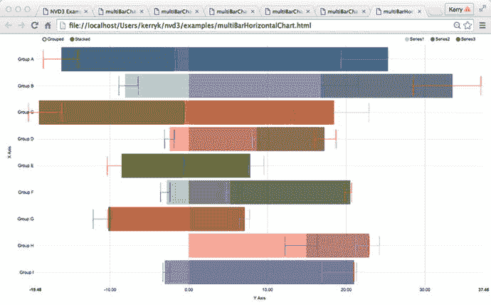
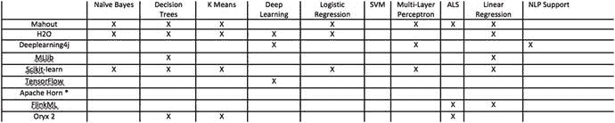

# 十六、大数据分析的总结和未来

在这最后一章中，我们总结了我们在前面几章中学到的知识，并讨论了大数据分析的一些发展趋势，包括数据分析的“孵化器”项目和“年轻”项目。我们还推测大数据分析和 Hadoop 生态系统的未来——“未来 Hadoop”(可能还包括 Apache Spark 和其他产品)。

请记住，随着时间的推移，大数据的 4v(速度、准确性、容量和多样性)只会变得更大、更复杂。我们的主要结论是:大数据分析解决方案的范围、广度和有效性也必须相应地继续增长，以跟上可用数据的步伐！

## 16.1 结论和年表

在本书中，我们对分布式业务分析系统进行了技术调查——特别是 Hadoop 作为架构、实现、部署和应用的起点和构建模块。我们已经讨论了一些语言、工具包、库和框架，我们发现它们是启动和运行新的 Hadoop BDAs 的最有用的方法。在我们前进的过程中，我们试图遵守一些战略原则，以保持事情的灵活性，并适应未来几个月或几年可能出现的新需求和软件组件。

这些战略原则包括以下内容:

1.  使用模块化设计/构建/测试策略来维护软件依赖性、版本和测试/集成。在我们的例子中，我们使用 Maven 和相关的软件工具来管理新软件模块的构建、测试、部署和模块化添加或减少，或者更新版本。这并不意味着我们排除其他必要的构建工具，比如 Bower、Gradle、Grunt 等等。相反，所有好的构建工具、内容管理器和测试框架都应该足够灵活，能够与其他工具协同工作。例如，在我们的实验系统中，经常可以看到 Maven、Grunt、Bower 和 Git 组件和谐共存，几乎没有摩擦或不兼容。
2.  战略性地选择能够适应未来需求和不断变化的要求的技术组合。牢记一个架构“愿景”允许系统设计者一起工作来构建和维护一个连贯的技术栈，它解决了需求。对实现技术进行良好的初始选择是重要的，也是可取的，但是为了纠正错误，采用灵活的方法更为可取。
3.  能够以尽可能无缝的方式适当地适应不同的编程语言。由于需要有选择地选择技术堆栈，现在甚至一些最简单的应用程序也是多语言应用程序，可能在一个框架中包含 Java、JavaScript、HTML、Scala 和 Python 组件。
4.  为组件集成、测试和优化/部署选择合适的“胶件”。正如我们在本书的例子中所看到的，“胶合件”几乎和被胶合的组件一样重要！幸运的是，对于开发人员来说，有许多组件和框架可以用于这个目的，包括 Spring Framework、Spring Data、Apache Camel、Apache Tika 以及 Commons Imaging 等专用包。
5.  最后但同样重要的是，保持一种灵活敏捷的方法来使系统适应新发现的需求、数据集、不断变化的技术以及数据源和接收器的容量/复杂性/数量。需求会不断变化，支持技术也会不断变化。从长远来看，适应性方法可以节省时间和返工。

总之，我们已经相信，遵循上述系统构建的战略方法将有助于架构师、开发人员和管理人员实现功能性业务分析系统，这些系统具有足够的灵活性、可伸缩性和适应性来适应不断变化的技术，并且能够处理具有挑战性的数据集、构建数据管道，并提供有用和有说服力的报告功能，包括正确的数据可视化以足够详细地表达您的结果。

## 16.2 大数据分析的现状

在这最后一章的剩余部分，我们将研究 Hadoop 的当前状态，并注意一些未来可能的方向和发展，推测“未来的 Hadoop”，这当然包括分布式技术的表现和发展，类似于 Apache Spark、YARN 和 Hadoop 2 如何成为 Hadoop 及其生态系统发展到今天的里程碑。

首先，我们必须回到十九世纪。

数据处理技术危机的第一次爆发至少可以追溯到 1880 年。在那一年，美国人口普查被计算为使用当时普遍使用的技术需要八年来处理。到 1952 年，美国人口普查使用 UNIVAC 计算机的协助进行。从那时起，时代对数据处理技术的挑战就有了一个又一个的解决方案:机械、电子和半导体硬件解决方案，伴随着软件技术(如通用编程语言)的发展和革命，以及媒体的组织(从最早的照片和录音到最新的电子流、视频处理和存储以及数字媒体记录技术)。

1944 年，富有远见的图书管理员弗里蒙特·莱德(Fremont Rider)对“信息危机” [1](#Fn1) (在那个年代，这意味着物理图书馆中物理存储的文件数量)提出了一种创新的解决方案，他称之为“微型卡”:一种在透明缩微胶片的一面上显示我们现在称为“元数据”的方式，而书籍本身的单页显示在相反的一面上。莱德建议，可以通过使用这些“微型卡”来保存珍贵的独一无二的书籍和手稿，以避免目前正在肆虐的战争的破坏。现在，随着“数据不朽”在网络上的 [`www.archive.com`](http://www.archive.com) 等项目中被发现，我们看到了莱德的发明所预见的电子书籍的存档。

从穿孔卡片和机械计算器，到像莱德那样的缩微胶片解决方案，再到电子计算机，我们已经走过了漫长的道路；但是请记住，许多计算和分析问题保持不变。随着计算能力的提高，数据量和可用性(大量各种传感器输出数据)不仅需要大数据分析，还需要所谓的“传感器融合”过程，其中不同种类的结构化、半结构化和非结构化数据(信号、图像和各种形状和大小的流)必须集成到一个共同的分析画面中。无人机和机器人技术是“未来的 Hadoop”可能大放异彩的两个领域，强大的传感器融合项目已经在进行中。

无论软件和硬件组件变得多么先进，统计分析仍然在大数据分析的世界中占有一席之地。统计的“老派”可视化总会有一席之地，如图 [16-1](#Fig1) 和图 [16-2](#Fig2) 所示。至于分类、聚类、特征分析、趋势识别、共性、匹配等基本要素。，我们可以期待看到所有这些基本技术被改造成越来越强大的库。数据和元数据格式——最重要的是，它们的标准化和在整个大数据社区的采用——将允许我们在未来几十年内发展 BDAs 的软件编程范式。

图 16-2。

“Old school” candlestick graphs can still be used to summarize chronological data

图 16-1。

Different kinds of “old school” bar graphs can be used to summarize grouped data

当我们思考大数据分析的现状时，许多问题立即浮现在脑海中。一个迫在眉睫的问题是，当我们解决一个数据分析问题时，我们需要覆盖多少领域？就组件而言，业务分析的极限是什么(记住我们的问题定义和范围)？商业分析在哪里结束，信息技术和计算机科学的其他方面从哪里开始？

就组件而言，让我们快速回顾一下“业务分析”到底是什么。我们可以从一系列组件和功能开始，如下所示:

1.  数据仓库组件。Apache Hive 最初是用于 Hadoop 的数据仓库技术，现在仍被大量软件应用程序广泛使用。
2.  商业智能(BI)功能。“商业智能”(BI)的传统定义包括数据和流程挖掘、预测分析和事件处理组件，但在分布式 BI 时代，可能还包括涉及模拟、深度学习和复杂模型构建的组件。BI 可以提供数据集的历史、当前或预测视图，并可以在“运营分析”领域提供帮助，即通过应用 BI 解决方案来改善现有运营。
3.  企业集成管理(EIM)。EIM 得到了整个企业集成模式(EIPs)领域的帮助。许多软件组件，包括 Apache Camel 这样的“glueware ”,都是基于 Hohpe 和 Woolf 的经典著作《企业集成模式》中所有或大部分 EIP 的实现。 [2](#Fn2)
4.  企业绩效管理(EPM)。EPM 是一些供应商非常感兴趣的地区，尤其是 Cloudera。Bernard Marr 写了一篇有趣而有见地的文章，题为“大数据分析将改变企业绩效管理的三种方式”。 [3](#Fn3)
5.  分析应用程序(单个组件和功能)。许多孵化和全新的图书馆和框架等待着！
6.  关键功能需求:审计的治理、风险和法规遵从性管理。
7.  在整个核心、支持生态系统和分布式分析应用中始终如一地提供安全性和集成安全性。在 Hadoop 开发的早期，Hadoop 生态系统中的许多组件都没有充分考虑安全性。数据来源和实时监控分布式系统只是“未来 Hadoop”面临的两个挑战，但它们是 Hadoop 和 Apache Spark 分布式系统中需要改进安全措施的重要例子。

大数据分析能力只会继续增长和繁荣。硬件和软件技术，包括人工智能研究和创新的新复兴，有助于机器学习和深度学习技术，这对大数据分析技术的进一步发展非常必要。开源库和蓬勃发展的软件社区使得新系统的开发更加容易，即使使用现成的组件也是如此。

## 16.3“孵化项目”和“年轻项目”

在整本书中，我们经常提到“成熟软件项目”、“孵化项目”和“年轻项目”在这一节中，我们想看看这些术语的含义，并指出它对架构师和开发人员跟踪可能在队列中的“孵化中”和“年轻的”项目是多么有用。请注意，我们的示例大多来自 Apache.org 网站，这是寻找成熟技术组件的最佳场所之一，但是也有许多其他网站可以满足特定领域的需求。例如，在 [`http://www.mmorph.com/resources.html`](http://www.mmorph.com/resources.html) 和许多其他类似的网站上列出了处于各种成熟、开发和使用阶段的各种图像处理工具包。

如果你看一下 apache.org 上的 Apache 软件组件列表( [`http://incubator.apache.org/projects/`](http://incubator.apache.org/projects/) )，你会看到许多项目要么正在孵化，要么已经从孵化中毕业，甚至已经“退休”了。孵化器的毕业生凭借自己的能力继续成为成熟的 Apache 项目，而退休的项目即使在“退休”事件之后也可以继续开发。

虽然孵化项目的列表在不断变化，但看看孵化项目如何与上面显示的商业分析组件和功能列表相匹配是有启发性的。一些例子包括 Apache Atlas ( [`http://atlas.incubator.apache.org`](http://atlas.incubator.apache.org) )用于使用 Hadoop 的企业治理服务，使用“分类法业务注释”用于数据分类。提供了审计、搜索、沿袭和安全功能。与古老的 Apache Hive 数据仓库组件相比，Lens ( [`http://incubator.apache.org/projects/lens.html`](http://incubator.apache.org/projects/lens.html) `)`)以无缝的方式将 Hadoop 与传统数据仓库集成在一起，提供了数据的单一视图。Lens 于 2015 年 8 月 19 日从孵化器毕业，成为一个成熟的 Apache 项目。

Apache Lenya ( [`http://incubator.apache.org/projects/lenya.html`](http://incubator.apache.org/projects/lenya.html) )，一个内容管理系统，也已经毕业，成为一个独立的 Apache 项目。

安全性是 Hadoop 分布式系统中的一个关键问题，有几个孵化组件可以解决这些问题。目前正在酝酿的一些项目包括:

密特隆( [`http://incubator.apache.org/projects/metron.html`](http://incubator.apache.org/projects/metron.html) )是一款用于安全组织和分析的集中式工具，它集成了 Hadoop 生态系统中的许多组件，以提供可扩展的安全分析平台。

Ranger ( [`http://incubator.apache.org/projects/ranger.html`](http://incubator.apache.org/projects/ranger.html) )，一个跨 Hadoop 平台的全面数据安全的管理框架。

“分析应用程序”可能是上面组件和功能列表中列出的最常见的类别，目前有几个正在孵化的实现，它们支持组件集成、数据流构建、算法实现、仪表板、统计分析支持以及任何分布式分析应用程序的许多其他必要组件。

Apache 目前正在酝酿的一些以应用程序为中心的分析组件包括:

1.  Apache Beam ( [`http://incubator.apache.org/projects/beam.html`](http://incubator.apache.org/projects/beam.html) `)`)是一组特定于语言的 SDK，用于定义和执行数据处理工作流以及其他类型的工作流，包括数据摄取、集成等。Beam 以类似于 Apache Camel 系统的方式支持 EIPs(企业集成模式)。
2.  HAWQ ( [`http://incubator.apache.org/projects/hawq.html`](http://incubator.apache.org/projects/hawq.html) )是一个企业级 SQL 分析引擎，包含一个 MPP(大规模并行处理)SQL 框架，源自 Pivotal 的 Greenplum Database 框架。HAWQ 是 Hadoop 的原生产品。
3.  Apache NiFi ( [`http://nifi.apache.org/index.html`](http://nifi.apache.org/index.html) )是一个高度可配置的数据流系统，在撰写本文时是 Apache 孵化器的新成员。有趣的是，NiFi 提供了一个基于 web 的界面来设计、监控和控制数据流。
4.  MadLib ( [`http://madlib.incubator.apache.org`](http://madlib.incubator.apache.org) `)`是一个大数据分析库，它依赖于 HAWQ SQL 框架( [`http://hawq.incubator.apache.org`](http://hawq.incubator.apache.org) )，一个“近实时”的企业数据库和查询引擎。

## 16.4 对未来 Hadoop 及其继任者的推测

在撰写本书时，Apache Hadoop 已经伴随我们好几年了(2011–2016)。从 Apache Lucene 和 Solr 搜索引擎项目发展而来，它已经有了自己的生命，并激发了像 Apache Spark 和其他人这样的潜在“继承者”。对于大数据分析领域，Hadoop 核心和 Hadoop 生态系统发展的下一步是什么？

Hadoop 开发人员和架构师当前面临的一个问题是“Hadoop 过时了吗？”或者更准确地说，“鉴于 Hadoop 1 已经被 Hadoop 2 取代，Apache Spark 似乎已经在某些领域取代了 Hadoop，使用 Hadoop 及其生态系统的可行性如何？Hadoop 生态系统是否有其他更好的替代方案？”

在这最后一节，我们只能根据 Hadoop 生态系统的当前状态和未来发展的可能途径，对这些问题提供一个尝试性的答案。

请记住 Hadoop 当前的功能架构，如图 [16-3](#Fig3) 所示。让我们根据我们在前几章所学的内容得出一些结论。

图 16-3。

A functional view of current Hadoop technologies and capabilities

16-3 中显示的数字将继续发展，随着时间的推移，一些额外的部分可能最终被增加或减少(例如，“编程语言绑定”和“备份、灾难恢复和风险管理”是我们可以做的明显的增加，但是这些主题需要它们自己的书长度的处理。

1.  工作流和调度:工作流和调度可能由像 Oozie 这样的 Hadoop 组件处理。
2.  查询和报告功能:查询和报告功能还可以包括可视化和仪表板功能。
3.  安全、审计和合规性:Apache 保护伞下的新孵化项目解决了 Hadoop 生态系统中的安全、审计和合规性挑战。这些安全组件的例子包括 Apache Ranger ( [`http://hortonworks.com/apache/ranger/`](http://hortonworks.com/apache/ranger/) )，一个 Hadoop 集群安全管理工具。
4.  集群协调:集群协调通常由框架提供，如 ZooKeeper 和 Apache Curator 的库支持。
5.  分布式存储:HDFS 不是分布式存储的唯一答案。像 NetApp 这样的供应商已经使用 Hadoop 连接器连接到 NFS 存储系统 [4](#Fn4) 。
6.  NoSQL 数据库:正如我们在第 4 章[中看到的，有很多种 NoSQL 数据库技术可供选择，包括 MongoDB 和 Cassandra。像 Neo4j 和 Giraph 这样的图数据库也是流行的 NoSQL 框架，它们有自己的库用于数据转换、计算和可视化。](04.html)
7.  数据集成能力:数据集成和 glueware 也在继续发展，以适应不同的数据格式、遗留程序和数据、关系数据库和 NoSQL 数据库，以及 Solr/Lucene 等数据存储。
8.  机器学习:机器学习和深度学习技术已经成为任何 BDAs 计算模块的重要组成部分。
9.  脚本功能:Python 等高级语言中的脚本功能正在快速发展，交互式 shells 或 REPLs(读取-评估-打印循环)也是如此。甚至古老的 Java 语言也在版本 9 中包含了 REPL。
10.  监控和系统管理:Ganglia、Nagios 和 Ambari 中用于监控和管理系统的基本功能将继续发展。一些较新的系统监控和管理条目包括 Cloudera Manager ( [`http://www.cloudera.com/products/cloudera-manager.html`](http://www.cloudera.com/products/cloudera-manager.html) )。

## 16.5 不同的视角:Hadoop 的当前替代方案

如今，Hadoop 并不是分布式大数据分析的唯一选择。如今，标准 Hadoop 平台和生态系统有许多替代品，其中一些已经得到了 Apache foundation 的支持。请注意，其中一些包括 Apache Flink，(flink.apache.org)，这是一个分布式大数据分析框架，为批处理和流数据处理提供了基础架构。

Flink 可以使用来自 Apache Kafka 等消息系统的数据。

阿帕奇风暴(storm.apache.org)是阿帕奇 Spark 的另一个潜在竞争对手。Storm 是一个实时、分布式流处理计算系统，支持机器学习、ETL 和“连续计算”

## 16.6 在“未来 Hadoop”中使用机器学习和深度学习技术

算法实现、“助手库”、机器学习和深度学习库和框架，以及对 Mahout 和 MLib 等经典库的改进，都是现代 BDA 实现的重要组成部分。它们支持我们每次构建数据处理管道时执行的各种任务。我们应该指出“机器学习”和所谓的“深度学习”之间的区别，深度学习是“多层神经网络”算法的一个相对较新的术语，以及其他技术。一个非常有趣的例子是 Apache Horn 孵化器项目，下面将详细描述。总体而言，机器学习通常被视为通往“人工智能”道路上的“进化前期”，而“深度学习”则是更进一步的进化。支持向量机、朴素贝叶斯算法和决策树算法通常被称为“浅层”学习技术，因为与深度学习器不同，在输出数据集发出之前，输入不会经过一个以上的非线性处理步骤。这些所谓的“浅层”技术被归入“机器学习”，而更高级的技术，通常使用许多处理阶段，是“深度学习”的一部分。

Apache(和其他地方)的一些解决 ML 和 DL 问题的孵化库(以及它们对各种技术栈和平台的支持)包括:

图 16-4。

A feaure matrix of ML toolkits

1.  Apache SystemML ( [`http://systemml.apache.org`](http://systemml.apache.org) `)`):这个库支持许多标准算法，这些算法可以使用 Hadoop 或 Spark 以分布式方式运行。SystemML 高效且可扩展，可以在独立模式下运行，也可以在 Hadoop 集群上运行。
2.  DL4J ( [`http://deeplearning4j.org`](http://deeplearning4j.org) ): DL4J 有很多高级特性，比如 GPU 编程支持。
3.  H2O 和闪闪水( [`http://h2o.org`](http://h2o.org) `)`):闪闪水是基于 H2O 和阿帕奇 Spark 的机器学习库。这些组件在 Scala 中是可编程的，具有多种算法。
4.  MLib for Apache Spark(Spark . Apache . org):MLib 是一个可扩展的 Spark 机器学习库。
5.  Apache Mahout(Apache . Mahout . com):Mahout 是 Hadoop 生态系统中一个古老而有价值的部分。
6.  Cloudera Oryx 机器学习库( [`https://github.com/cloudera/oryx`](https://github.com/cloudera/oryx) `)` : Oryx 是一个支持多种算法的机器学习库。
7.  分布式 R | Weka ( [`https://github.com/vertica/distributedR`](https://github.com/vertica/distributedR) 、 [`http://weka.sourceforge.net/packageMetaData/distributedWekaHadoop/index.html`](http://weka.sourceforge.net/packageMetaData/distributedWekaHadoop/index.html) ):分布式 R 和 Weka 是各种分布式统计分析的良好配对，R 和 Weka 可用的各种实现算法使实现数据管道更加简单。
8.  Apache Horn([`https://horn.incubator.apache.org`](https://horn.incubator.apache.org)):Apache Horn 是一个简单易用的深度学习孵化项目。尽管 Apache Horn 还处于早期开发阶段，但它已经可以用于原型开发和构建基于神经网络的分布式分析组件。
9.  并排查看这些工具包各自的功能是很有用的，因此这里包含了一个机器学习工具包的“功能矩阵”，供您参考。

*有关 Apache Horn 的最新信息，请参见位于 [`https://horn.incubator.apache.org`](https://horn.incubator.apache.org) 的孵化网站。

## 16.7 数据可视化和 BDAs 的新领域

数据可视化一直是大数据分析的一个关键组成部分，随着图数据库和复杂的可视化库(如 D3、sigmajs 和许多其他库)的结合，数据可视化也在不断涌现。创建、可视化和交互式编辑非常复杂和非常大的数据集变得更加简单。我们在可视化章节第 [10](10.html) 章看到了一些这样的例子。数据可视化的未来方向有很多，包括全息、虚拟现实和“远程呈现”技术的开发。虽然其中许多已经存在了一段时间，但随着“近实时”处理系统变得更加高效，分布式软件系统将使复杂的“现实系统”变得越来越可能。这将有助于实现处理更大和更复杂的数据集的目标，同时保持与现有分析库的兼容性、效率和无缝性。事实上，许多现代机器学习和深度学习框架，以及支持 BDAs 的统计框架(如 R 和 Weka)都包含自己的可视化组件和仪表板。尽管一些老派的可视化库是用 Java 甚至 C 编写的，但是许多现代的可视化库支持多种语言绑定，当然特别是 JavaScript，但是也支持基于 Scala 和 Python 的 API，正如我们在前面的章节中看到的。

## 16.8 结束语

当我们考虑“未来 Hadoop”的命运时，让我们记住当今大数据技术所面临的未来问题和挑战。

这些挑战包括:

1.  成熟预测分析的可用性:能够从现有数据预测未来数据一直是业务分析的目标，但许多研究和系统建设仍有待完成。
2.  作为大数据分析的图像和信号:在第 [14](14.html) 章中，我们深入探讨了“作为大数据的图像”概念，正如那里所提到的，对这些复杂数据源的工作才刚刚开始，其中当然包括来自各种不同传感器的时间序列数据和“信号”，包括激光雷达、用于法医分析的化学传感器、医疗工业应用、来自车辆的加速度计和倾斜传感器数据，以及许多其他数据。
3.  甚至更大的速度、种类和输入源数据量:至于数据处理所需的速度、结构和复杂性的种类和水平(或者缺乏它！)，以及原始数据量，这些要求将变得越来越苛刻，因为硬件和软件将能够处理增加的架构挑战和“未来数据分析”将要求的更苛刻的问题集。
4.  将不同类型的数据源合并到统一的分析中:“传感器融合”只是将数据合并到由传感器测量和绘制的数据环境的一个“统一画面”中的一个方面。分布式人工智能和机器学习的发展，以及相对较新的“深度学习”领域，通过提供意义、上下文和预测以及原始数据统计分析，提供了超越不同数据源的简单聚合和融合的潜在路径。这将实现复杂的模型构建、数据理解系统和高级决策系统应用。
5.  人工智能(AI)和大数据分析的融合:人工智能、大数据和数据分析一直共存，甚至可以追溯到人工智能系统的最早历史。近年来，分布式机器学习(ML)和深度学习(DL)的进步更加模糊了这些领域之间的界限。深度学习库，如 Deeplearning4j，目前在 BDA 应用程序中经常使用，并且已经提出了许多有用的应用程序解决方案，其中人工智能组件已经与 BDAs 无缝集成。
6.  基础设施和底层支持库演进(包括安全性):基于 Hadoop 的应用的基础设施支持工具包通常包括 Oozie、Azkaban、Schedoscope 和 Falcon。低级支持和集成库包括 Apache Tika、Apache Camel、Spring Data 和 Spring Framework 本身等等。针对 Hadoop、Spark 及其生态系统的专门安全组件包括 Accumulo、Apache Sentry、Apache Knox Gateway 以及许多其他最近的贡献。

无论您是程序员、架构师、经理还是分析师，现在都是进入大数据分析领域的好时机。许多有趣的、改变游戏规则的未来发展在等着我们。Hadoop 通常被视为向更强大的分布式分析系统发展的一个阶段，无论这种发展是朝着“我们所知的 Hadoop”之外的方向发展，还是我们已经知道的 Hadoop 系统发展其生态系统，以更好的方式处理更多数据，分布式大数据分析都将继续存在，Hadoop 是当前计算领域的主要参与者。我们希望您喜欢这次使用 Hadoop 的大数据分析技术调查，就像我们喜欢带给您一样。

Footnotes [1](#Fn1_source)

在《学者与研究图书馆的未来》中，弗里蒙特·莱德描述了他对时代信息爆炸的解决方案。对于任何对基本技术问题如何随着时间的推移以不同形式重现感兴趣的人来说，这是一本好书。

  [2](#Fn2_source)

格雷格·霍佩，鲍比·伍尔夫。(2003)企业集成模式设计、构建和部署消息传递系统。艾迪森.韦斯利。ISBN 978-0321200686

  [3](#Fn3_source)

[T2`http://www.smartdatacollective.com/bernardmarr/47669/3-ways-big-data-analytics-will-change-enterprise-performance-management`](http://www.smartdatacollective.com/bernardmarr/47669/3-ways-big-data-analytics-will-change-enterprise-performance-management)

只要这本书还在使用，上面的链接就有效吗？

  [4](#Fn4_source)

有关 NetApp NFS | Hadoop 连接器的更多信息，请参见 [`http://www.netapp.com/us/solutions/big-data/nfs-connector-hadoop.aspx`](http://www.netapp.com/us/solutions/big-data/nfs-connector-hadoop.aspx) 。