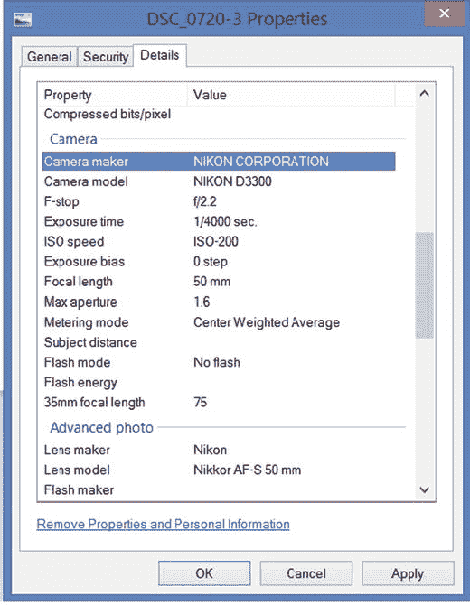
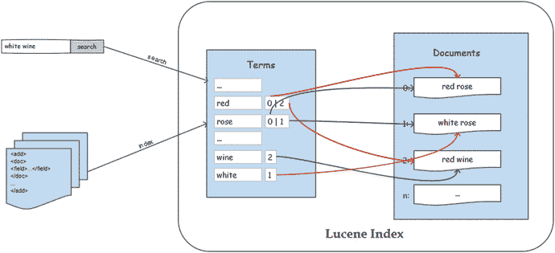
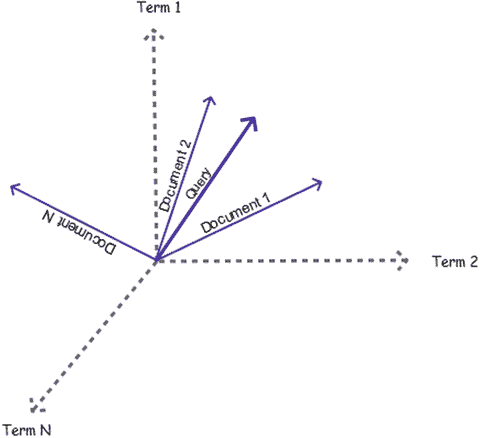
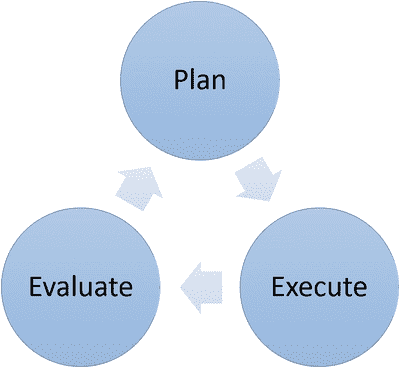

# 三、信息检索

这本书的主要焦点是向你展示如何使用 Solr 开发一个搜索引擎。然而，搜索引擎不再是一个筒仓，需要与其他工具和技术集成，以满足复杂的信息需求。其他章节介绍了 Solr 的特性、它的组件、它们的用法以及相关的例子和用例，但是在您更深入地研究实现和任何更严肃的事情之前，让我们先了解一下信息检索。

理解信息检索(IR)对于预示搜索引擎开发中更大图景的整体观点是很重要的，这一点通常被忽略了。在这一章中，你将学习到信息检索系统开发中涉及的更广泛的概念、组件和阶段。这些知识将有助于将检索问题分类成小的可管理的单元，并通过迭代开发来驯服它。这一章也涵盖了一些工具和技术，这些工具和技术可以用来给搜索引擎带来智能，并使其更上一层楼。尽管本章指出了如何将这些方面与 Solr 联系起来，但是这些概念通常可以应用于任何搜索引擎。

这一章不仅能让开发者和搜索工程师受益，也能让项目经理和任何参与搜索引擎生命周期的人受益。

本章涵盖以下主题:

*   信息检索导论
*   数据分类和提取
*   文本处理
*   倒排索引
*   信息检索模型
*   信息检索过程
*   结果评估

## 信息检索导论

信息检索是基于特定需求来表示、存储并最终获取信息的一系列活动。基于机器的信息检索是在 20 世纪 50 年代引入的，它的需求仅限于研究团体。后来在商业产品和垂直搜索引擎中实现。

信息检索是一个广泛的概念，搜索引擎是其主要应用之一。它的其他常见应用领域是推荐系统、文档分类和聚类、过滤和问答系统。要检索的信息可以以任何来源、格式和数量提供，并且可以应用于几乎任何领域，如医疗保健、临床研究、音乐、电子商务和 web 搜索。系统的使用可以局限于律师或医生等一组人，也可以是全世界都可以使用。

信息检索系统正在成为信息访问的主要形式。随着网络搜索引擎的出现，大规模的信息检索系统已经实现，而这仅仅是个开始。在当前 Android 和 iOS 智能手机及其更智能的应用程序的时代，信息需求急剧增加，随着物联网的发展，对信息的需求将会更大，甚至更加关键。有了这些，你可以想象机器需要处理的数据的种类和数量，以支持与这种需求相关的搜索。

## 搜索引擎

搜索引擎是最广泛使用的信息检索系统之一。像谷歌这样的网络搜索引擎是最明显的例子之一。每个搜索引擎都有自己的挑战，但其中一些挑战更多地与信息检索有关，而不是搜索引擎。对相关文档进行适当的排序和评估排序算法的有效性可以被认为是 IR 关注的问题，而性能和可伸缩性是搜索引擎关注的问题。

搜索引擎可以大致分为几类，每一类在某种程度上都有相似的信息需求。以下是更广泛的类别列表:

*   Web 搜索:这种方法在万维网上爬行，从 HTML 标签中提取内容，并对信息进行索引以使其可搜索。一些引擎还抓取图像和其他相关文件，并在索引之前处理文本以获取其他有趣的信息和链接。DuckDuckGo 是一个使用 Solr 开发的 web 搜索引擎的典型例子。
*   垂直搜索:垂直搜索针对特定的领域、信息领域或行业，如医疗保健或金融。这些信息通常存在于主数据库或数据源中，如 Word 文档或 PDF 文件。这些类型的搜索通常是为满足特定需求而开发的。
*   桌面搜索:这是设计来索引用户电脑中的文件，并使其可搜索。一些搜索引擎还会将文件内容和元数据一起编入索引，以使其可被搜索。麦克 OS X 的聚光灯就是一个典型的例子。
*   其他:信息检索不再局限于文本，而是广泛用于搜索图像、音频指纹和语音识别。

任何信息检索系统的目标都是将数据转化为满足用户需求的可操作信息。在搜索引擎的情况下，信息属于为搜索请求而检索的相关文档。图 [3-1](#Fig1) 描述了将数据转化为信息的搜索系统中的组件。

图 3-1。

A search system

在接下来的部分中，您将了解重要的信息检索组件以及任何搜索引擎开发中通常遵循的过程。

## 数据及其分类

数据以不同的形式创建，以满足不同的需求——有些供人类使用，如博客和帖子，有些供机器使用，如表格或元数据中的数据。这些数据也有各种格式，如 Word 或 PDF，并保存在不同的数据源中。

根据数据的性质及其格式，系统需要执行不同的内容提取任务，这些任务可以是简单的数据库查询，也可以是复杂的过程，例如从图像中提取数据。

在学习更多关于内容提取的知识之前，您首先需要理解数据类别。要索引的数据可以分为三类:结构化、非结构化和半结构化。接下来将描述每个类别。

### 结构化的

结构化数据是一条符合预定义结构的信息。信息被组织成易于管理的单元，以便有效地存储、处理和检索。与非结构化数据相比，结构化数据更容易组织、存储和查询。如果关系数据库或表是信息的主要来源，那么数据通常是结构化的。结构化数据的一个简单例子是 web 表单或 Excel 表。这些值在逻辑上是分开的，每个值都可以索引到不同的字段。

结构化数据更容易接收，因为它不需要高度复杂的文本解析，检索技术和相关性规则的应用也更易于管理和有效。此外，它还具有更好的互操作性，方便其他机器使用。你周围的一切都会产生数据:你的相机、手机、GPS 设备和可穿戴设备。他们的数据越结构化，消费就越容易。

### 无社会组织的

反过来，非结构化数据不能被正式定义为可管理的单元，并且包含机器无法区分的自由格式文本块。这些块很难以编程方式解释，或识别相关联的上下文和概念，并且可能包含歧义和垃圾。它们可以包含基于域的各种信息(如人员、位置、日期、号码、疾病和症状)。非结构化数据的例子包括文本文件、pdf、Word 文档、书籍、日志和电子邮件。

我们周围的大多数文档都是非结构化的，因此对其进行处理和分析以找到其文本中的模式非常重要，这样机器就可以提取实体，解释语义，并过滤掉无关的数据。如果非结构化内容有关联的元数据，这可能是结构化信息的另一个有价值的来源。

值得注意的是，由于自然语言语法，即使是非结构化数据也有一些结构，以章节、段落和句子的形式存在。可以对该文本应用高级处理管道，以提取大量有趣的信息，并从中构建一些结构。看看维基百科:这是一种非结构化的数据形式，也有一些相关的结构。

非结构化文本可以通过使用人工智能等机器处理技术来结构化。您可以使用开源工具(例如，Apache UIMA)构建一个管道来注释文本流中的有用信息。Solr 通过处理器和过滤器为 UIMA 管道提供第一手支持。Apache Stanbol 是另一个允许您执行语义内容管理的项目。如果这对你不起作用，可以通过使用亚马逊机械土耳其人( [`www.mturk.com/mturk/welcome`](https://www.mturk.com/mturk/welcome) )等平台手工制作或众包结构。

### 半结构化的

半结构化数据是第三种形式，介于结构化和非结构化之间。这种数据具有某种结构，这种结构为互操作性提供了便利，但不能受模式的约束。没有规定结构的数量；数量取决于需要。XML 格式的文件是半结构化数据的典型例子。您可能需要执行一些类似于处理非结构化文本的处理，以便从中提取更有意义的信息，但是这个过程相对来说更容易。

## 内容提取

上下文抽取是信息流的第一步。在这个过程中，您从数据源中提取内容，并将其转换为可索引的文档。在 Solr 中，这个过程可以在 it 内部执行，也可以在索引文档的客户端应用程序中执行。你会在第 5 章的[中看到 Solr 提供的文档索引选项的更多细节。](05.html)

让我们假设正在为研究人员和学者开发一个搜索引擎。在这种情况下，大多数内容通常是非结构化的，并以 PDF、DOC 和 PPT 格式提供。这种非结构化数据的提取需要相当复杂的处理。要索引这些文档，首先需要检测内容类型，然后提取文本进行索引。解析器可用于从不同文件格式的内容中提取文本。表 [3-1](#Tab1) 提供了可用于文本处理的常见文件格式和开源工具的列表。

表 3-1。

File Formats and Open Source Tools

<colgroup><col> <col></colgroup> 
| 文件格式 | 开源工具 |
| --- | --- |
| 便携文档格式 | Apache 然后 Apache PDFBox |
| 微软 Word/Excel/PowerPoint | Apache，然后 Apache OpenOffice |
| 超文本标记语言 | jsoup HTMLCleaner |
| 可扩展置标语言 | Apache[Xerces](http://java-source.net/open-source/xml-parsers/xerces)Java Architecture for XML Binding(JAXB)Dom4j Solr data importhandler 提供了许多其他的 SAX 和 Dom 解析器 |
| 光学字符识别 | 宇宙魔方 |
| 地理空间的 | 地理空间数据抽象库 |
| 电子邮件 | JavaMail API |
| 网络爬行 | 阿帕奇努奇 |

提取过程因数据源而异。如果数据在数据库中可用，它通常会是规范化的形式，因此应该在索引前展平。Solr 提供了定义反规范化过程的工具，或者如果您正在使用外部索引过程，您可以在该应用程序中完成。你将在第 5 章中通过使用 DataImportHandler Solr 模块学习如何从数据库中索引数据。

一个名为 Apache Tika 的开源项目为处理多种格式的文件提供了一个框架。它支持自动检测内容类型，并允许提取内容以及相关的元数据。Tika 并不自己完成所有的检测和提取工作；相反，它通过其接口包装了 Apache POI 和 Apache PDFBox 等库，以提供一种方便的提取方法。Tika 支持对各种文件格式的内容进行解析，例如包格式(`.tar`、`.jar`、`.zip`)、文本文档(`.doc`、`.xml`、`.ppt`、`.pdf`、`.html`)、图像(`.jpeg`、`.png`、`.bmp`)、音频(`.mp3`、`.wav`)等等。

Tika 解析器通过隐藏文件格式的复杂性和调用单独的解析库来简化您的任务。它为客户端应用程序提取内容和元数据提供了一个简单而强大的机制。它为所有提取任务提供了一个单一的 API，使您不必为不同的提取需求学习和实现不同的 API。

Solr 提供了一个名为 Solr Content Extraction Library(Cell)的框架，它使用 Apache Tika 来暴露`ExtractingRequestHandler`，这是一个用于从不同格式的文件中提取内容并将其索引到各自的 Solr 字段的处理程序。[第 5 章](05.html)提供了使用 Solr Cell 提取内容的更多细节。

## 文本处理

如前一节所述，从数据库接收的原始文档或从二进制文档中提取的文本需要在被索引之前进行处理。处理任务可以是文本的清理、规范化、丰富或聚合。这些过程通常链接在一起以实现所需的输出，管道取决于您的处理需求，这取决于数据的性质和质量以及所需的输出。

在 Solr 中，文本处理可以分两步执行，由分析过程和更新请求处理器执行。这些步骤的目的是满足各种文本处理需求。分析过程满足单个字段级标记化和分析的需求，而更新请求处理器则满足其他文本处理需求，其作用范围是整个文档。更新请求处理器也称为预处理器或文档处理器。

不同系统之间的文本处理各不相同，在索引和搜索时也各不相同。例如，用户查询可能不需要清理或最少清理。接下来讨论各种文本处理类别。

### 清洗和正常化

并不是所有的数据都是重要的，一些重要的数据在被索引之前需要进行规范化和转换。常见的清理和规范化任务包括删除标点符号、删除停用词、小写、转换为最接近的 ASCII 字符和词干。这些是在任何搜索引擎中都应该执行的一些最基本的任务，并且对于匹配是至关重要的。

### 改进

文本充实是分析和挖掘内容的阶段，以找到充实、注释、实体提取的模式，并应用各种智能使内容更可用、更可理解和更相关。应用于文本的丰富取决于您的检索需求和您所担心的扩展深度。此外，建议在您的系统在清理和规范化方面表现合理，并检索相关的基于关键字的匹配之后，再尝试丰富。以下是可以应用于文本的一些丰富内容:

*   实体提取:如果要索引的内容是非结构化的，或者任何字段都是全文的，那么您可能希望提取诸如人员、组织和位置之类的实体，并对内容进行注释。假设您正在索引来自临床试验的文本；您可以从文本中提取疾病、症状和解剖结构等实体，这样索引就更加结构化。然后，如果检测到用户查询是针对特定疾病或解剖结构的，则可以适当地对文档进行排序。
*   词性标注:任何语言中的单词都可以根据语言的语法分类为预定义的词性(如名词或动词)。这些词类可用于形成短语并识别文本中的重要概念，这些概念可被提升以适当地排列文档。
*   叙词表:叙词表(复数:叙词表)是一个受控词汇表，通常包含一个单词及其相关单词的列表。相关单词是语义元数据，例如同义词、反义词、更宽泛和更狭窄的概念、部分术语等等，并且支持的元数据列表可以在同义词词典之间变化。WordNet 是一个通用词典，也包含术语注释(定义)。这些词表由定期更新词汇表的社区维护。词汇表可以是通用的(如在 WordNet 中)，也可以是特定的(如医学主题标题或 MeSH，它包含更深层次的术语列表，广泛用于医学科学领域)。你选择的词表取决于你的需要，你甚至可以选择使用多个词表。你可以在 [`http://wordnetweb.princeton.edu/perl/webwn`](http://wordnetweb.princeton.edu/perl/webwn) 试试 WordNet 的现场演示。
*   本体:本体是特定领域中概念及其关系的正式表示，例如更宽和更窄的概念。值得注意的是，一些叙词表也包含关系，但它们是非正式的，可以基于语言词典中的用法。此外，叙词表可以是通用的，而本体则局限于一个领域。

这只是冰山一角，也是一个活跃的研究领域。您所做的处理可以是高效检索和排列文档所需的任何事情。例如，如果文本包含评论，您可能想要进行情感分析；如果您正在索引新闻、期刊或法庭诉讼，您可能想要进行文本摘要。

文本处理不一定只在索引时应用。它还可以应用于用户查询，特别是查询扩展、概念识别和意图挖掘等场景。问答是一个典型的例子，用户查询通过一个管道，如查询类型分类。

表 [3-2](#Tab2) 列出了常见的预处理类型以及免费提供的工具和资源。

表 3-2。

Tools and Resources for Processing of Text

<colgroup><col> <col></colgroup> 
| 预处理 | 工具/资源 |
| --- | --- |
| 自然语言处理 | Apache OpenNLP 斯坦福 CoreNLP |
| 使聚集 | 胡萝卜 2 阿帕奇驯象人槌 Weka |
| 分类 | 阿帕奇驯象员马利特·韦卡 |
| 受控词汇 | 国会图书馆主题词(LCSH)医学主题词(MeSH) |
| 文本处理框架 | 阿帕奇 UIMA 门阿帕奇斯坦波尔阿帕奇 cTAKES(临床研究) |
| 知识库 | DBpedia YAGO |

### 元数据生成

元数据是关于数据的数据，是访问文档和确定文档相关性的有用信息源。结构化元数据允许更容易的互操作性、交换和机器对数据的处理。

许多系统会自动为内容提供元数据，您无需担心如何生成元数据。网页具有以元标签形式关联的元数据，元标签包含关键字和页面内容的描述，并且被搜索引擎用于主题识别。如果您对摄影感兴趣，您可能知道您的相机会为您点按的每个图像生成 EXIF(可交换图像文件)格式的元数据，其中包括相机和镜头的详细信息、曝光信息和版权。最近的相机和移动电话也通过使用内置的 GPS 接收器以 EXIF 格式存储位置信息。在图 [3-2](#Fig2) 中，可以看到 JPEG 图像的元数据。想象一下，通过使用这些元数据，您可以根据提供的空间、相机或其他信息来调整文档的相关性。

图 3-2。

Metadata of a JPEG file

元数据模式标准已经由 Dublin Core 等社区定义，其中包含描述 web 和物理资源的术语。

如果元数据不是自动可用的，您可能希望手工制作它或者从内容提供商那里获得它。此外，还有半自动的方式来产生它。我们不会涉及这些，因为它们超出了本书的范围。

如果元数据被集成到包含内容的文件中，那么可以通过使用 Apache Tika 在 Solr 中使用它。您将在第 5 章中看到相关步骤。

## 倒排索引

从数据源提取的数据应该建立索引，以便快速准确地检索。如果您一直想知道为什么向 Solr 添加文档的过程通常被称为索引，那么倒排索引就是答案。Solr 内部使用 Lucene，当您添加文档时，它会创建一个倒排索引来使信息可搜索。

倒排索引是典型搜索引擎中的主要数据结构，它维护所有唯一术语的字典以及它们出现的所有文档的映射。每个术语都是一个键，它的值是一个发布列表，即该术语出现的文档列表。

Lucene 数据结构被称为倒排索引，因为遍历是向后的(或倒排的):从术语到文档，而不是像前向索引那样从文档到术语。倒排索引类似于本书末尾的索引，包含单词列表和单词出现的相应页面。在 Lucene 的上下文中，单词是术语的同义词，页面是文档的同义词。相比之下，前向索引类似于本书开头的目录。

倒排索引的方法是以术语为中心，而不是像前向索引那样以文档为中心。对于查询中的每个术语，面向文档的数据结构必须顺序扫描所有文档的术语，而倒排索引在索引中查找术语，并从发布列表中找到匹配的文档。这种方法提供了快速的全文搜索和更好的性能。

图 [3-3](#Fig3) 提供了倒排索引表示的简化视图。您可以看到，当一个文档被索引时，术语被作为关键字添加，它的文档映射在一个发布列表中。当用户启动查询时，倒排索引会提供关于所有匹配文档的信息。

图 3-3。

Lucene inverted index

发布列表还包含附加信息，如文档中的术语频率、索引时间提升和有效负载，这提供了便利和更快的搜索。

Note

用户查询和索引需要经过大量复杂的处理，为了简单起见，图 [3-3](#Fig3) 对这些处理进行了抽象。

## 检索模型

要搜索相关文档，您需要一个检索模型。检索模型是通过使用数学概念来定义检索过程的框架。它提供了确定与用户需求相关的文档的蓝图，以及一个文档为什么比另一个文档排序更高的推理。您选择的模型在很大程度上取决于您的信息检索需求。每个模型使用不同的方法来确定查询和文档之间的相似性。该模型甚至可以像返回 0 或 1 作为值的布尔模型一样简单。此外，系统的实现可以是解决实际用例的模型的变体或扩展。在第 8 章中，您将看到 Lucene 如何修改向量空间模型，这将在本节稍后讨论。

本节涵盖了搜索引擎通常使用的信息检索模型。

### 布尔模型

信息检索的布尔模型是基于集合论和布尔代数的简单模型。顾名思义，它将文档分为真或假(文档匹配或不匹配)。

让我们用 Solr 的说法来理解这一点。建立索引时，从文档中提取术语，并创建索引。因此，我们可以将文档视为一组术语。在搜索时，解析用户查询以确定术语并形成布尔表达式。用户查询可以包含运算符 AND、OR 或 NOT，它们在布尔表达式中具有特殊的含义，分别用于标识合取、联合或析取。Solr 还使用+和-符号将术语指定为“必须发生”或“不得发生”

所有满足表达式的文档都被认为是匹配的，其他的都被丢弃。以下是为指定的布尔表达式匹配和不匹配文档的示例:

`Query:`

`(singer AND dancer) OR actor`

`Match:`

`"He started his career as a dancer but he is also a singer"`

`"Mr. Mark is a famous actor"`

`No Match:`

`"Who is the singer of this song?"`

`"He is an amateur dancer."`

这种模型的挑战在于，它认为所有术语都是同等相关的，并且没有提供任何对文档进行排序的规定。因此，您需要一个更复杂的模型来根据相关性对文档进行排序。另一个挑战是将布尔查询转换成布尔表达式。

### 向量空间模型

布尔模型带你走了一半。对于用户查询，它确定匹配的文档，但是您可能还想知道匹配文档的相关程度。布尔模型在一个消耗成百上千个结果的系统中是可以接受的。但是如果最终用户是人类呢？在谷歌搜索时，你希望最佳匹配出现在第一页。当对文档进行排序时，您知道前几个结果是最相关的，并且您几乎不关心遍历许多结果页面后出现的结果。

向量空间模型(VSM)是一种检索模型，可用于根据用户查询对索引文档进行排序。查询响应包含文档以及分配给它的分数，分数表示与用户查询的相似程度。具有最高分数的文档被认为是最佳匹配。

向量空间模型通过高维空间中的术语权重向量来表示每个文档和查询，并基于查询和文档之间的角度来计算得分。图 [3-4](#Fig4) 描绘了一个 N 维空间，其中文档用实线表示，查询用强实线表示。VSM 使用下列步骤进行相关性排名:

图 3-4。

Vector space model While indexing, represent each document as a weighted vector of term frequency and inverse document frequency   While searching, represent the query as a weighted TF-IDF vector   Compute the cosine similarity score between the query vector and each document vector   Rank documents with respect to the query   Return the matching top N rows in the response  

默认的 Lucene 评分算法使用布尔模型和向量空间模型的组合来查找相关文档。由布尔模型批准的文档由向量空间模型排序。因此，Lucene 只为满足布尔查询的文档计算相似度。此外，它使用余弦相似性的修改形式来计算相关性排名。第 8 章详细介绍了 Lucene 评分。

这个模型非常适合自由文本查询。这个模型的局限性在于它忽略了术语之间的关系，并假设它们是独立的。它认为文本是一个单词包。

### 概率模型

概率模型通过估计文档相对于查询的相关性概率来对文档进行排序。评估的过程是至关重要的，这也是实现彼此不同的地方。这个模型基于这样一个概念，即对于一个查询，每个文档可以被分类为相关或不相关:P(R|D)或 P(NR|D)。

### 语言模型

语言模型是概率模型的一个分支，它根据文档生成查询词的概率对文档进行排序。它通常使用最大似然估计来估计概率。评估过程大致分为三个步骤:

Estimate the language model for each document in the corpus and sample them   Calculate the probability of observing the query terms in the sample   Rank the documents in the order of probability  

因为每个文档都是用于估计的样本，所以它可能会稀疏，因此应该应用平滑来解决这个问题。语言模型可以是一元或多元的。更常见的 Unigram 模型分割了不同术语的概率，忽略了上下文。N-gram 模型估计每一项的概率，考虑先前上下文的 N-1 项。

## 信息检索过程

在前面的章节中，您了解了信息检索中的关键概念。现在，这个故事好的一面是 Solr 使您不必担心任何与倒排索引以及检索模型的实现细节有关的事情。Lucene 提供的默认模型非常适合全文搜索和大多数检索需求。如果您想集成任何其他检索模型，您可以扩展现有的 Java 类。

信息检索是一门实验性很强的学科，建议遵循检索过程的迭代开发和改进。图 [3-5](#Fig5) 描述了信息检索过程的各个阶段，这些阶段最终会导致更好的搜索引擎的开发。在实践中，多个阶段可以同时执行，或者在同一迭代中重复多次。Solr 的分层架构以及可配置和可插拔的组件提供了所需的便利性和灵活性。

图 3-5。

Stages in information retrieval process

### 计划

规划是一项极其重要的任务，尤其是在信息检索领域，这是一个耗时的过程。在开始设计模式和定义搜索特性之前，需要考虑许多因素和策略。你可能会觉得有些因素是不相关的，所以可能会忽略它们，但这可能会极大地影响用户体验和转化率。以下是您在开始开发之前应该考虑的一些因素。

#### 了解垂直

如果你正在开发一个垂直搜索引擎，你的首要任务是理解问题陈述，然后了解领域。大多数领域都有自己独特的功能需求，并带来自己的挑战。例如，在地理搜索中，位置和邻近性对于计算文档的相关性至关重要，而在生物医学领域，跨多个资源的信息链接变得非常重要。

#### 了解最终用户

最终用户是最终使用搜索引擎的人，了解他的真实需求很重要。除了检索相关文档，易用性、便利性和导航能力也应该是优先考虑的。用户通常遵循基于域或地区的模式。例如，用户可能对最相关的结果感兴趣，例如当你在 Google 中搜索时，而其他人可能需要所有匹配的结果，例如法律从业者对所有匹配的案件感兴趣。在音乐发现网站中，用户期望相关文档出现在结果集中的顶部；相比之下，在服装电子商务网站中，用户通常浏览数百个匹配的文档。理解系统的核心需求，并在初始迭代中努力解决它。

一些用户需求可能是具体的和主观的，通常难以执行和评估，优先级较低。在这种情况下，文档排名可能与一个用户高度相关，但与另一个用户无关。这些问题可以通过使用诸如用户特征分析和结果个性化等技术来解决。

#### 了解内容

所有的数据都不重要，只有一部分数据满足了用户的信息需求。不需要的数据应该被丢弃，以避免任何垃圾进入系统。此外，一些数据需要丰富，以满足用户的检索需求。在规划阶段，理解数据是至关重要的，这样就可以应用适当的工具和技术进行提取、清理、丰富和其他所需的文本处理。要搜索的内容可能取决于三个维度，在大数据世界中通常称为 3v:

*   数量:一些系统需要处理大量的数据，比如在网络搜索或社交网络中。脸书管理着一个超过 300 的数据仓库。搜索引擎应该是可扩展的，以支持高容量，这就是 SolrCloud 的用途。如果您正在编写定制组件，请从 SolrCloud 的角度考虑，并确保您的特性是云就绪的。
*   多样性:多样性是指内容的不同形式。要索引的内容可以是结构化的，也可以是非结构化的。为了创建索引，可以从多个来源提取或聚合数据。假设您正在构建一个类似于 IMDB 的电影搜索引擎。这些内容可能来自许多来源，例如主数据源中的记录、内容提供商提供的元数据、第三方应用程序的评论以及 Twitter 或 YouTube 等社交媒体的趋势和流行信息。所有这些内容整合在一起将形成识别电影相关性的基础。
*   速度:如果搜索引擎需要处理接近实时的查询，数据处理的速度很重要。Twitter 等公司每天处理超过 5 亿条推文，需要实时传输数据。在这种情况下，批处理不是一种选择。

#### 了解媒介

媒介是指用户用来查询搜索引擎的设备。这一点通常被忽略，但在信息检索中却很重要。在手机上打字很困难，所以用户很可能会写一些包含重要关键字的简短查询，而且可能不是用自然语言。用户可以优选地使用单词的简短形式。诸如自动完成之类的功能是这类设备必须具备的。使用移动电话的一个好处是，它可以提供用户的额外信息，比如她的当前位置，这些信息可以用来提高本地化结果的排名。在网络上，搜索体验应该是不同的。你可以为诸如建议、诸如此类和推荐等功能提供大量空间。最重要的是，用户倾向于在网上更自然地书写。

不应该忽略搜索所使用的媒介，并且应该相应地规划你所提供的功能。

### 执行

在此步骤中，您将执行前面步骤中计划的信息检索任务。在得出结论之前，您需要通过多次实验和研究来执行文本处理和检索技术。在满足检索需求的同时，对于一个搜索引擎来说，其他重要的生产准备因素也不应该被忽视。例如，如果您的业务需要高度分布式和可伸缩的系统，请确保 SolrCloud 支持该功能。

### 评价

您学习了建立和改进搜索系统的信息检索模型和文本处理技术。检索模型为 Lucene 评分奠定了基础，Lucene 评分根据与用户查询的相似性对文档进行排序，文本处理策略在文档的可查找性方面起着关键作用。每当您调整文档的分数时，例如通过应用 boost，或者在文本处理中执行任何更改，您通常会寻求以下一些问题的答案:

*   我的搜索结果是否显示了最相关的文档？
*   是否遗漏了任何高度相关的文件？
*   结果集中是否包含不良或不相关的文档？
*   我的结果在这次迭代中有所改进吗，我如何度量改进？

有时你可能会发现系统遗漏了一些高度相关的文档，并调整引擎来提高它们的排名。这种活动反过来会影响文档与其他查询的相关性，这可能会被忽视，并可能在产品生命周期的后期被发现。因此，在执行阶段之后，检查和评估搜索结果变得至关重要。在本节中，您将了解文档的各种状态以及适用于信息检索的评估概念。

当您执行搜索时，匹配的文档将具有表 [3-3](#Tab3) 中提到的四种状态中的任何一种。表中的第一行表示理想情况下的结果状态(无论文档是否被正确识别)。表中的第一列代表您的系统，以及文档是否匹配用户查询。

表 3-3。

Contingency Table (2×2)

<colgroup><col> <col> <col></colgroup> 
|   | 辨认 | 被拒绝 |
| --- | --- | --- |
| 相配的 | 正确肯定 | 假阳性 |
| 不匹配 | 正确否定 | 假阴性 |

列联表中所有值的说明如下。

#### 正确肯定

在这个场景中，为用户查询识别正确的文档。假设用户查询是“cancer”，应用程序检索匹配“cancer”的文档。这是一个真正积极的例子。

#### 假阳性

在这种情况下，文档被错误地识别为匹配。例如，查询“癌症疾病”会得到一个关于癌症的结果，它指的是螃蟹或星座癌症。这种情况通常是由于低效的文本清理(例如，遗漏的停用词删除)而发生的，这会导致不相关的文档被识别为匹配。记住“垃圾进，垃圾出”这句话。这种情况也被称为假警报或 I 型错误。

#### 正确否定

在这种情况下，文档被正确拒绝。例如，查询“癌症疾病”不会得到与螃蟹或星座相关的癌症结果。大多数文档应该属于这一类别，真正的否定对于确定检索结果的质量没有作用。

#### 假阴性

在这种情况下，应该是响应的一部分的文档被错误地拒绝了。例如，如果系统被期望带来语义相关的结果，而与“良性肿瘤”相关的文档在用户查询“癌症疾病”时被遗漏，那么这就是假阳性的情况。这种情况通常是由于文档的不正确的规范化和丰富化而发生的，在这种情况下，即使添加一个标点符号或缺少小写字母也可能拒绝文档。这种类型的错误可以归类为第二类错误。

假阳性和假阴性的情况是不希望的，应该避免并减少到最低限度。误报场景导致结果分页，并影响用户体验和对系统的信心。如果搜索引擎是通过短消息服务这样的媒介访问的，假阳性匹配是完全不可接受的。假阴性场景甚至会变得更糟，直接影响业务；在电子商务网站上寻找产品的用户将无法发现该产品，即使该产品可从卖方处获得。

#### 评估指标

您需要度量来确定检索的结果是否符合用户的期望。此外，您可能有兴趣将现有系统的结果与新的和改进的系统的结果进行比较。精确度和召回率是有助于评估结果的主要指标。精确度是另一个度量标准，但由于其不切实际的计算，通常会被避免。

##### 准确

准确性通过考虑真阳性和真阴性(系统正确识别或拒绝文档的程度)来衡量有效性。下面是评估的算法:

其中

TP 是真阳性，

TN 是真负值，

FP 是假阳性，

FN 是假阴性

有趣的是，准确性从来没有被用来评估一个信息检索系统，因为使用它作为衡量标准可能会完全错误，因为它会考虑相关和不相关的文档。假设索引中有 100 个文档，对于一个查询，语料库只包含 10 个相关匹配。假设该系统是最差的系统之一，对于该查询，它检索 10 个文档，所有这些文档碰巧都不相关。以下说明了 accuracy 如何评估结果:

`TP = 0 (no relevant document retrieved)`

`TN = 80 (out of 90 irrelevent documents, 80 were correctly rejected)`

`FP = 10 (10 irrelevant documents are incorrectly retrieved)`

`FN = 10 (10 relevant document incorrectly rejected)`

T2】

从这个例子中，您可以看出，即使系统检索到 0 个相关结果，您仍然可以获得 80%的准确率。因此，通常避免将准确性作为衡量标准，而考虑精确度和召回率。

##### 精确度和召回率

查准率和查全率是评价信息检索系统有效性的两个重要指标。Precision 是检索到的相关文档的分数，recall 是检索到的相关文档的分数。精确度和召回率可以使用以下公式计算:

假设您的索引有 20 个与音乐相关的文档和 10 个与电影相关的文档。现在，与音乐相关的查询可能返回 10 个文档，其中 5 个与音乐相关，5 个与电影相关。系统的精度将是 5/10 = 1/2，即 50%。召回率将是 5/20 = 1/4，即 25%。

简而言之，我们可以说精确度是质量的衡量标准，而召回率是数量的衡量标准。因此，高召回率意味着算法返回了大部分相关结果，而高精度意味着算法返回了比不相关结果更多的相关结果。

计算精度更容易，因为您需要从检索到的文档中识别相关的文档。假设您在 Solr 中查询 10 个文档，指定`rows=10`。在这种情况下，您甚至可以手动遍历文档来识别相关的文档。因为召回工作在相关文档上，这在语料库的所有文档中是很难识别的。它的计数可能非常大，手动遍历将是一个挑战。

根据你要解决的问题，这两种方法中的一种可能对你更重要。例如，在法律领域，您可能对检索所有相关文档感兴趣，因此高召回率会让您更感兴趣。如果您正在构建一个 web 搜索引擎，您会对检索最相关的文档感兴趣，因此您会对高精度感兴趣。通常，这两种方法一起使用来达到一种折衷，因为信息检索的一般目标是检索几个相关的文档并将最相关的文档放在最上面。

##### f-测度

F-measure 可用作系统的单一测量，因为它结合了精确度和召回率来计算结果。它计算精度和召回率的调和平均值如下:

## 摘要

这一章主要讲述与信息检索相关的概念和方法。您了解了信息检索模型和评估搜索结果有效性的方法。您还了解了可以用来开发更有效的搜索引擎的工具和资源。

下一章将介绍模式设计，接下来的章节将介绍文档索引和结果搜索。第 11 章包含了与本章讨论的文本处理概念相关的例子。