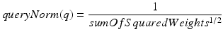
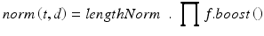
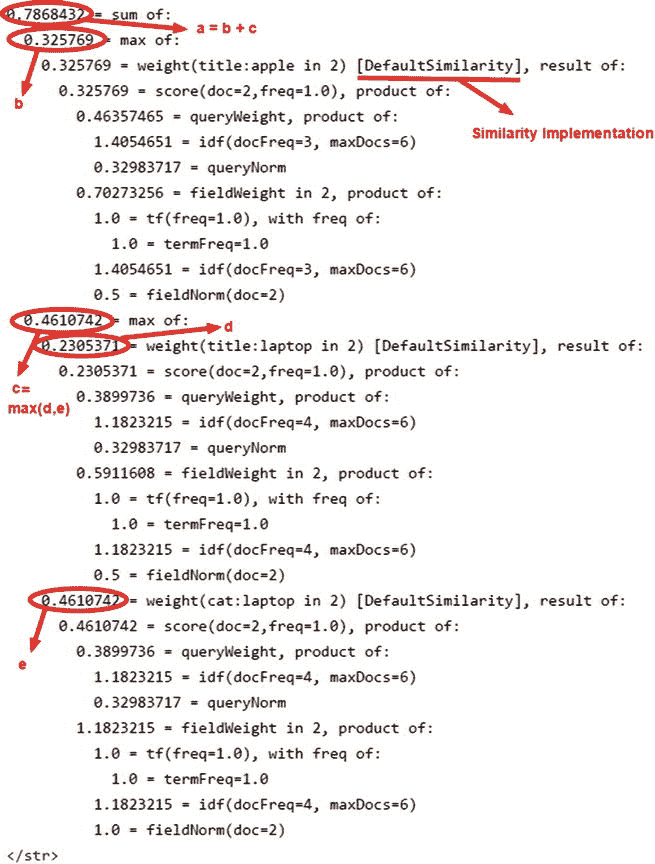

# 八、Solr 排名

在评估搜索响应时，您可能想知道为什么某个特定文档的排名高于另一个文档，以及这些文档是如何获得分数的。在本章中，您将了解 Solr 排名。

本章从默认的排名实现和控制分数的因素开始，逐步深入到更多的细节，以便您可以覆盖现有的排名因素或编写自定义排名器。即使计分是一个高级的话题，并且这一章涵盖了一些数学公式，你也不需要成为一个数学奇才来理解它。

我本可以在第 3 章中对排名做一个简单的介绍，但是我想深入了解更多细节，超越基本概念，并在实现层面讨论 Solr 排名，这需要一个专门的章节。

Note

在[第 3 章](03.html)中，你学习了信息检索概念；如果你跳过了那一章，我建议你在继续这一章之前先读一读，尽管这不是强制性的。

本章涵盖以下主题:

*   Solr 如何对文档进行排序
*   默认排名模型和因素
*   支持替代型号
*   诊断文档分数
*   自定义排名

## Solr 排名简介

相关性排名是任何搜索引擎的核心，Solr 也是如此。为了对用户查询的文档进行排序，Solr 根据模型的算法计算每个匹配文档的分数，并根据它们的相对分数对它们进行排序。它将得分最高的文档排在结果集的最前面。

最初，Lucene 只支持基于 TF-IDF 的向量空间模型来对文档进行排序，但是后来的 4.0 版本引入了额外的模型来支持更灵活的排序。这些模型都扩展了 Lucene 的抽象类`Similarity`来实现算法。现有的基于 TF-IDF 的模型，在`DefaultSimilarity`类中实现，仍然是排名的默认模型。在本章中，您将了解这些模型。

大多数 Solr 设置使用`DefaultSimilarity`，这对于大多数需求来说都很好。我建议您不要担心改变模型，继续使用默认的相似性，除非您真正理解为什么您需要一个替代模型或定制实现。

在 90%的情况下，您将能够通过在索引或查询时应用不同的调优方法来操纵和控制文档的排名，而无需触及`Similarity`类。这些方法以这样或那样的方式影响着文档的得分，对其进行适当的调整应该会带来预期的结果。综上所述，以下是控制文档排序的方法:

*   查询语法、运算符和其他组合，如短语、slop 和模糊匹配
*   查询解析器及其配置
*   文本分析
*   索引时提升文档和字段
*   查询时的术语提升
*   函数查询

如果这些定制得到了想要的结果，您应该避免改变排名模型，应该只在真正需要的时候操作它。我建议您清楚地了解您正在对排名进行的更改，并彻底测试它们。

即使您没有改变排名模型的计划，了解它们仍然很重要，这样您就可以了解前面的因素如何影响最终得分，并且可以衡量任何调整对您的文档排名的影响。

您可能有一个业务案例，您觉得调整这些参数没有帮助，并且您的排名要求与 Solr 提供的默认实现不同。在这种情况下，您可以执行以下操作:

*   使用 Lucene 提供的另一个`Similarity`实现，并根据您的需求进行调整。
*   扩展默认相似性以操纵其排名因子。
*   编写您的自定义实现。这将需要你对你的排名需求和你计划使用的算法有一个专家级的理解。你需要小心，因为这可能会让你陷入一个循环迭代，而排名没有任何显著的提高。

在您进一步了解之前，以下是关于 Solr 排名的一些重要事实，将有助于您避免任何假设:

*   无负分:分数始终是大于 0.0 的浮点数，任何文档都不能有负分。
*   分数是相对的:对于一个给定的查询，文档的分数是相对的，可以比较。多个文档可以分别具有与所有排名因素相同的分数，或者它们的分数相加可以生成相同的值。如果需要标准化的分数，可以将每个文档的分数除以查询的最高分数。
*   每场计算:分数是按场计算的。汇总每个字段的单独分数，以计算文档的最终分数。
*   可插入:Solr 允许您扩展可用的`Similarity`实现，以及插入您自己的排名算法。

*   Lucene:Solr 中的排名实现是由 Lucene 提供的。`org.apache.lucene.search.similarities`包包含所有实现各种排名模型的`Similarity`类。为了连接您的定制实现，您可以将您的类打包在一个单独的 JAR 中，并将其添加到 Solr 类路径中，而不必担心更改 Solr 或 Lucene 包。
*   按相关性排序:默认情况下，搜索响应按分数降序排序，顶部的文档被标识为最佳匹配。
*   Maximum score: No upper boundary has been specified for the score of documents. The maximum value is based on several scoring factors, including boosts, which combined together can lead to a very high score. The `maxScore` parameter in a search response returns the maximum score for that query. Figure [8-1](#Fig1) shows an example that marks the `maxScore` for a query.

    

    图 8-1。

    Maximum score for a user query

Note

术语相关性排名、Solr 排名和相似性可以互换使用。相反，术语排名模型指的是用于实现相似性的算法。

## 默认排名

Lucene 的默认排名方法是它如此受欢迎的原因。它速度快，经过优化，易于理解和使用，对于大多数用例都很实用。这是一种(几乎)一刀切的方法。

默认的 Lucene 排名是基于布尔模型(BM)和向量空间模型(VSM)的组合。对于给定的查询，并不是对语料库中的所有文档进行排序，而是只对满足布尔条件(使用布尔运算符指定)的文档子集进行排序。这些缩小范围的文档还通过避免 VSM 对不相关的文档进行不必要的排序来减少处理时间。简单来说，BM 批准的文件由 VSM 排名。搜索响应中的`numFound`参数指定 BM 批准的文档数量。图 [8-2](#Fig2) 标记了`numFound`参数，表示匹配文件的数量。

图 8-2。

Number of matching documents

### 履行

Lucene 中的默认排名是由`DefaultSimilarity`类实现的，它扩展了`TFIDFSimilarity`类。`DefaultSimilarity`类派生出一种基于 TF-IDF 排名的高级形式，用于实际的分数计算。在下一节中，您将了解 TF、IDF 和其他违约排名因素。

在`solrconfig.xml`或者`schema.xml`中不需要额外的定义，Solr 从用户那里抽象出所有的实现细节。如果你想明确指定这种相似性，尽管这没有意义，你可以在`schema.xml`中这样做，如下所示:

`<schema>`

`..`

`<similarity class="solr.DefaultSimilarity" />`

`</schema>`

### 得分因素

本节涵盖影响文档分数的因素。一旦您理解了这些因素，您将了解到将这些因素标准化并将它们组合起来得出汇总分数的公式。对因子的理解足以通过使用诸如 boosting 之类的规定来调整分数，而对公式的理解相对来说不那么重要。

Note

术语权重是在每个字段的基础上计算的。为了计算某个字段的术语分数，排名因子使用该特定字段的统计数据。该术语的最终权重是通过汇总其适用的所有字段的分数来计算的。

以下是决定文档得分的主要因素:

*   术语频率(TF):这是一个术语在文档字段中出现的次数。文档的得分与它的术语频率成正比:术语在文档中的计数越高，它的得分就越高。该模型假设，如果一个术语在文档中出现的次数越多，它就越与用户相关。
*   逆文档频率(IDF):此因子根据术语出现的文档数量计算得分。它与计数相反:计数越高，权重越低。这个想法是给予更少的单词更多的重要性。请注意，文档计数是针对该特定字段进行的，不考虑该术语在其他字段中的存在。

在前面的章节中，您使用了停用字词表来过滤掉不重要的术语。`stopFilterFactory`直接丢弃列表中的术语，对该术语的任何查询都不会得到匹配。但是有些术语不如其他术语重要，而且无论如何也不能被过滤掉。IDF 排名因子通过降低权重来处理如此频繁出现的术语。例如，在医学领域，诸如患者、结果、治疗、蛋白质和疾病等术语是常见的且重要性较低，而诸如肿瘤、帕金森病和囊肿等术语相对较少且重要性较高。IDF 作为一个因素在全文搜索中对适当地加权这些术语是至关重要的。

*   字段长度(`lengthNorm`):该因子考虑字段中标记的数量，用于确定文档的重要性。字段越短(索引的标记数量越少)，文档越重要。length norm 背后的想法是确保一个术语在短字段(如`title`)中的出现比在长字段(如`abstract`)中的出现更重要。
*   协调因子(`coord`):该因子基于查询和文档之间的术语重叠来排名。这意味着包含大多数查询词的文档更重要，应该得到奖励。
*   提升:文档和字段可以在索引时提升，术语可以在查询时提升。通过给予更高的提升，您指定了一个特定的术语或一组术语更重要，应该得到更高的分数。这是您可以直接轻松地调整特定文档分数的因素。

Note

`QueryNorm`是一个额外的因素，但此处未指定，因为它不影响两个文档之间的得分。相反，它使两个查询之间的分数正常化。你会在讨论 Lucene 排名公式的时候了解到`QueryNorm`。

### 排名公式

前面讨论的默认相似性因子不使用计数来计算文档分数。原始值被标准化以获得最有用和最平衡的值，该值为计算文档的实际分数提供了最佳权重。根据需要和信息可用性，Solr 在查询时或索引时对这些因素进行规范化，其值基于一个字段、一个文档或整个集合的统计数据。

在 VSM 中，查询和文档被表示为多维空间中的加权向量，其中每个术语是一个维度，TF-IDF 值构成权重。VSM 使用余弦相似度来计算文档的分数。如果你觉得这个数学概念太难消化，你可以暂时跳过这句话。如果你感兴趣或者你想重温一下基本概念，请参考第 3 章了解 VSM 的详细信息。

如前所述，Lucene 使用 TF-IDF 的高级形式来计算实际分数。这种高级形式提供了增强、长度标准化和协调因子，以及术语频率和逆文档频率。在 Lucene 中使用 TF-IDF 的高级形式计算得分的公式如下:

这个得分公式包含六个函数。每个函数负责计算特定得分因子的标准化值。如等式中所述，这些函数的输出被组合，以生成文档的最终得分。

接下来描述每个函数及其与 Lucene 排名因子的关系。为了便于理解，这些函数是在假设索引只有一个可搜索字段的情况下定义的。

#### tf(t 在 d 中)

如前所述，TF 是频率一词的缩写。这个函数统计每个查询词在文档中出现的次数。一个文档的得分和它的出现频率成正比。术语出现的频率越高，得分越高。Lucene 通过计算频率的平方根来归一化 TF 权重:

#### 以色列国防军(t)

如你所知，IDF 是逆文档频率的缩写。该函数通过计算出现该术语的文档数量的倒数来计算分数。Lucene 通过取反数值的对数来规格化该值:

`docFreq`和对数值加上数字常数 1，以避免分别出现`numDocs/0`和`log(0)`这样的未定义值。

#### 坐标(q，d)

`coord`代表配位因子。该函数根据文档中重叠的查询词的数量来计算分数。使用此公式计算协调因子:

#### queryNorm(q)

在讨论文档排序因素时，我们跳过了这个函数。`queryNorm`的目的是标准化查询之间的分数——与标准化文档之间的分数的其他因素相反。这个函数使得两个查询之间的分数具有可比性。相同的`queryNorm`值应用于一个查询的所有文档，因此它不会直接影响文档的得分。查询词的`queryNorm`计算如下:

其中`sumOfSquaredWeights`使用以下公式计算:

#### t.getBoost()

这个函数获取查询时应用的术语 boost，比如查询`adidas^3 shoes`。值得注意的是，这个函数只考虑查询时的提升，不考虑索引时应用的字段或文档提升。术语 boost 直接影响文档的得分。如果查询词不包含任何提升，则隐式应用默认值 1.0。

#### 范数(t，d)

该函数是两个因素的产物，即`lengthNorm`和索引时间提升。`lengthNorm`考虑字段的长度，以确定文档的重要性。字段越短(索引的标记数量越少)，文档越重要。索引时提升是在索引文档时应用于文档或字段的提升。计算范数的公式如下:

`Similarity`类在索引文档时计算范数。如果您应用一个替代模型(一个`Similarity`实现)，文档应该被重新索引。

归一化因子(或`norm`)是在索引文档时计算的。关于`norm`的一个有趣的事情是，计算出的范数值，也就是`float`，被编码成一个字节进行存储。在查询时，从索引中读取`norm`字节值，并解码回`float`。编码/解码的目的是支持有效的内存利用和减少索引大小，但这是以一些精度损失为代价的。

如果在字段定义中设置`omitNorms="true"`时省略了某个字段的规范，则该字段的`norm`值将被忽略。

编制索引时，如果任何文档有多个同名字段，则其所有提升将相乘，以计算该字段的总提升。

Note

默认相似度详见 [`https://lucene.apache.org/core/5_3_1/core/org/apache/lucene/search/similarities/DefaultSimilarity.html`](https://lucene.apache.org/core/5_3_1/core/org/apache/lucene/search/similarities/DefaultSimilarity.html) 。

### 限制

基于 TF-IDF 的 VSM 是一个简单而强大的模型，适用于大多数情况，尤其是全文搜索，但它有一些局限性。

在高层次上，该模型基于两个主要概念:

*   识别查询中最感兴趣的术语及其权重
*   基于加权术语查找最相关的文档

基于 TF-IDF 的模型认为稀有术语更有趣，但情况并非总是如此。例如，在音乐元数据的搜索引擎中，诸如 love 和 heart 之类的术语很常见，因为许多歌曲标题都包含这些词，但它们的重要性丝毫不减。如果您有类似的情况，您可能希望关闭 IDF 作为一个得分因素，也许在该领域。在本章的后面，你会看到一些覆盖默认因子的示例代码。

基础 VSM 的另一个限制是，它假设术语是独立的(术语之间没有关系)，但实际上术语是相关的。例如，对于像信用卡或纸袋这样的词，在 VSM 就失去了这种关系。

## 解释查询

Solr 搜索参数`debugQuery=true`解释了结果集中每个文档的得分计算。搜索响应中的附加元素`explain`包含每个文档的一个条目(映射到它的`uniqueId`),并提供由函数返回的分数的描述及其聚合，以获得每个查询词的分数。不同的字段可以为相同的查询词返回不同的分数，再次汇总这些分数以计算该词的最终分数。这个词得分再次与其他查询词的得分(如果有的话)相加，以返回文档的最终得分。

为了更好地理解查询解释，您将对一小组文档进行索引，并尝试理解一个示例查询的得分计算:

Create a small set of sample documents. The following is a sample in CSV format: `id,title,cat,units,popularity` `1,Apple iPhone,phone,100,9` `2,Apple iMac,desktop,9,8` `3,Apple MacBook Pro laptop,laptop,30,10` `4,Lenovo laptop,laptop,40,7` `5,Asus Laptop,laptop,60,8` `6,HP Laptop,laptop,50,7`   Index the documents. `$ curl` `http://localhost:8983/solr/hellosolr/update/csv?commit=true` `--data-binary @explain-sample.csv` `-H ’Content-Type:text/plain; charset=utf-8’`   Query with the additional parameter `debugQuery=true`. `$ curl http://localhost:8983/solr/hellosolr/select?` `q=apple+laptop&fl=*,score&wt=xml&indent=true&debugQuery=true` `&defType=edismax&qf=title+cat&lowercaseOperators=true`  

图 [8-3](#Fig3) 包含 Solr 返回的查询解释的快照。以下是一些需要注意的要点:

*   用于每个术语的分数计算的`Similarity`类在方括号中指定。图 [8-3](#Fig3) 中用下划线标出了一个例子。
*   每个函数返回的分数与产生分数的输入值一起指定。
*   每个函数的单独分数被合计，以获得包含该令牌的所有字段上的术语的最终分数。在图 [8-3](#Fig3) 中，术语膝上型电脑在两个字段`title`和`cat`中匹配，它们的分数被分别计算，标注为 d 和 e
*   对一个学期来说，它所有的领域分数相加得到一个最终分数。汇总字段分数取决于查询解析器。eDisMax 取最大值，在图 [8-3](#Fig3) 中标记为 c。
*   最后将每个标记的汇总分数相加，得出文档的最终分数。在图 [8-3](#Fig3) 中，注释 a 标注的是最终分数，是学期分数 b 和 c 的总和。
*   相同的`queryNorm`适用于所有条款。

图 8-3。

Explain query

## 替代排名模型

除了默认的基于 VSM 的排名，Lucene 4.0 引入了新的排名模型。这些模型为 Solr 提供的排名可能性带来了额外的灵活性。

大多数基于 Solr 和 Lucene 的应用程序仍然依赖默认排名。如果您可以通过调整 TF-IDF 权重或给予适当的提升来获得想要的结果，或者如果数学计算的想法吓到了您，您可以继续使用默认算法。这些替代模型需要一定的数学理解。

`org.apache.lucene.search.similarities.*`包包含了计算文档相关性等级的所有类。抽象类`Similarity`是基类，和`DefaultSimilarity`一样，这些模型的实现也扩展了它。

如果您计划评估这些备选模型中的任何一个，首先要理解底层算法。网上有很多研究论文提供了算法的详细描述。选择最符合您需求的模型，然后对其进行评估，看它是否满足这些需求。您可以使用模型创建单独的索引并比较结果，或者运行 A/B 测试。

默认的相似性不需要任何额外的参数，但是这些替代模型允许您通过使用额外的参数来控制算法的行为。

Note

文档应重新编制索引，以充分利用备选排名模型的潜力，因为在编制索引时会计算标准。

这一节涵盖了 Lucene 支持的两种主要的排名方案。

### bm25 相似性

BM25Similarity 是 Lucene 提供的备选实现中使用最广泛的排序算法。这种相似性基于 Okapi BM25 算法，其中 BM 代表最佳匹配，是一种概率检索模型。对于包含小文档的索引，它可以产生比基于 TF-IDF 的排序更好的结果。

该模型类似于 VSM，在某种意义上，它采用词袋方法，并考虑术语频率和逆文档频率来计算和总结得分。但是它有一些显著的不同。这些算法之间最重要的两个区别如下:。

*   Field length (`lengthNorm`): BM25 considers the fact that longer documents have more terms, and so the possibility of higher term frequency is also more. As a term can have a high frequency due to the long length and might not be more relevant to the user query, this similarity applies an additional parameter, `b`, that normalizes the term frequency due to this possibility. Table [8-1](#Tab1) provides more details of this parameter.

    表 8-1。

    BM25SimilarityFactory Configuration Parameters

    <colgroup><col> <col> <col></colgroup> 
    | 参数 | 类型 | 描述 |
    | --- | --- | --- |
    | `k1` | 浮动 | 该可选参数控制术语频率的饱和度。默认值为 1.2。较高的值会延迟饱和，而较低的值会导致过早饱和。 |
    | `b` | 浮动 | 此可选参数控制文档长度在规范化术语频率方面的影响程度。默认值为 0.75。较高的值会增加规范化的效果，而较低的值会降低其效果。 |
    | `discountOverlaps` | 布尔代数学体系的 | 此可选参数确定在基于文档长度计算范数时是否应忽略重叠标记(位置增量为 0 的标记)。默认值为`true`，忽略重叠的令牌。 |

*   Saturation: In the VSM, the normalized term frequency of a document grows linearly with the growing term count and has no upper limit. In the BM25-based model, the normalized value grows nonlinearly, and after a point does not grow with the growing term count. This point is the saturation point for term frequency in BM25\. Figure [8-4](#Fig4) shows a graph comparing term frequency for DefaultSimilarity (which is VSM based) and BM25Similarity (which is BM25 based).

    

    图 8-4。

    Term frequency in DefaultSimilarity vs. BM25Similarity In BM25Similarity, if the term frequency goes beyond a threshold, the increasing count will have no additional effect on the score of the document, and the score of VSM will be more than that of BM25.

以下是使用 bm25 相似度计算分数的步骤:

Register the `BM25SimilarityFactory` in `schema.xml` by using the `similarity` element. Globally, only one similarity class should be defined. If no similarity definition is available in `schema.xml`, by default `DefaultSimilarity` is used. `<schema>`   `..`   `<similarity class="solr.BM25SimilarityFactory" />` `</schema>`   Specify the configuration parameters. Table [8-1](#Tab1) describes the parameters supported by `BM25SimilarityFactory`. Here is a sample configuration: `<similarity class="solr.BM25SimilarityFactory">`   `<float name="k1">1.2</float>`   `<float name="b">0.75</float>` `</similarity>` There is no standard rule that specifies the ideal value for the parameters `k1` and `b`. The optimal combination of `k1` and `b` is to be computed by experimenting on the dataset.   Reindex the documents.  

### 相似性

DFRSimilarity 实现了与随机性模型的差异，随机性模型是一种信息检索的概率模型。该模型通过测量实际术语分布和通过随机过程获得的术语分布之间的差异来计算术语权重。

通过该模型的早期形式观察到，信息项的分布不同于非信息项的分布。信息术语在一些文档中出现得更密集，称为精英文档，而非信息词随机分布在所有文档中。

这个框架由三个模型组成，在`schema.xml`中注册工厂时需要配置。这三个模型将在接下来的小节中介绍。

#### 基本模型

这个模型选择了基本的随机性模型。该框架支持七个基本模型，每个模型使用不同的排名算法。表 [8-2](#Tab2) 提供了支持型号的详细信息。这个步骤之后可以是两个归一化步骤，这增加了算法的灵活性。

表 8-2。

Basic Models Supported by Divergence from Randomness

<colgroup><col> <col> <col></colgroup> 
| 基本模型 | 价值 | 描述 |
| --- | --- | --- |
| `BasicModelBE` | `Be` | 实现了玻色-爱因斯坦模型的极限形式。在某些情况下，这可能会导致性能问题。BasicModelG 是一个更好的选择。 |
| `BasicModelG` | `G` | 实现了玻色-爱因斯坦模型的几何近似。 |
| `BasicModelP` | `P` | 实现二项式模型的泊松近似。 |
| `BasicModelD` | `D` | 实现二项式模型的散度近似。 |
| `BasicModelIn` | `I(n)` | 考虑计算随机性的逆文档频率。 |
| `BasicModelIne` | `I(ne)` | 通过使用泊松和逆文档频率的组合来计算随机性。 |
| `BasicModelIF` | `I(F)` | 考虑逆文档频率的近似值来计算随机性。 |

#### 后效模型

这个模型也被称为第一归一化模型。它平滑从基本模型获得的权重。表 [8-3](#Tab3) 提供了支持的后效模型的详细信息。

表 8-3。

AfterEffect Supported by Divergence from Randomness

<colgroup><col> <col> <col></colgroup> 
| 后果 | 价值 | 描述 |
| --- | --- | --- |
| `AfterEffectL` | `L` | 运用拉普拉斯定律。 |
| `AfterEffectB` | `B` | 基于两个伯努利过程比值的信息增益模型。 |
| `NoAfterEffect` | `none` | 此参数禁用第一次规范化。 |

#### 正常化

这个模型也被称为第二归一化模型。它对算法用来标准化术语频率的字段长度进行标准化。表 [8-4](#Tab4) 提供了支持的标准化模型的详细信息。

表 8-4。

Second Normalization Supported by Divergence from Randomness

<colgroup><col> <col> <col></colgroup> 
| 正常化 | 价值 | 描述 |
| --- | --- | --- |
| `NormalizationH1` | `H1` | 假设频率项是均匀分布的。 |
| `NormalizationH2` | `H2` | 在这个模型中，术语频率与场长度成反比。 |
| `NormalizationH3` | `H3` | 实现由 Dirichlet 先验提供的术语频率归一化。 |
| `NormalizationZ` | `Z` | 实现由 Pareto-Zipf 规范化提供的术语频率规范化。 |
| `NoNormalization` | `none` | 禁用第二次规范化。 |

#### 使用

以下是使用 DFRSimilarity 计算文档得分的步骤:

Register the `DFRSimilarityFactory` in `schema.xml` by using the `similarity` element. The `basicModel`, `afterEffect`, and `normalization` parameters are mandatory, and the value of the desired class should be provided for each of these parameters. Tables [8-2](#Tab2), [8-3](#Tab3), and [8-4](#Tab4) provide options for `basicModel`, `afterEffect`, and `normalization`, respectively. The following is a sample `schema.xml` configuration: `<schema>`   `..`   `<similarity class="solr.DFRSimilarityFactory">`     `<str name="basicModel">P</str>`     `<str name="afterEffect">L</str>`     `<str name="normalization">H2</str>`     `<float name="c">7</float>`     `<bool name="discountOverlaps">true</bool>`   `</similarity>` `</schema>` `DFRSimilarityFactory` supports the optional parameter `c` to allow normalization, which controls the behavior of the implementations `NormalizationH1` and `NormalizationH2`.   Reindex the documents.   Note

参见 [`http://terrier.org/docs/v3.5/dfr_description.html`](http://terrier.org/docs/v3.5/dfr_description.html) 了解随机性模型偏离的全部细节。

### 其他相似性度量

除了前面讨论的算法，Lucene 还支持其他一些算法。每个都可以通过在一个`similarity`元素中注册它的工厂来配置，就像前面的例子一样。以下是 Lucene 支持的其他相似之处:

*   IBSimilarity:这为基于信息的概率模型提供了一个框架。这个框架和随机发散有很多相似之处。在注册相似度时，需要三个参数:`distribution`、`lambda`和`normalization`。详见 [`http://lucene.apache.org/core/5_3_1/core/org/apache/lucene/search/similarities/IBSimilarity.html`](http://lucene.apache.org/core/5_3_1/core/org/apache/lucene/search/similarities/IBSimilarity.html) 的 Javadoc。
*   SweetSpotSimilarity:这是对 [`DefaultSimilarity`](http://lucene.apache.org/core/5_3_0/core/org/apache/lucene/search/similarities/DefaultSimilarity.html?is-external=true#class%20or%20interface%20in%20org.apache.lucene.search.similarities) 的扩展，提供额外的调优选项，用于根据您的数据指定最佳术语频率的最佳点和`lengthNorm`值。更多细节请参考 [`http://lucene.apache.org/core/5_3_1/misc/org/apache/lucene/misc/SweetSpotSimilarity.html`](http://lucene.apache.org/core/5_3_2/misc/org/apache/lucene/misc/SweetSpotSimilarity.html) 的 Javadoc。
*   Dirichlet 相似性:这是基于使用 Dirichlet 先验的贝叶斯平滑模型。它支持附加平滑参数`mu`。更多细节请参考 [`https://lucene.apache.org/core/5_3_1/core/org/apache/lucene/search/similarities/LMDirichletSimilarity.html`](https://lucene.apache.org/core/5_3_1/core/org/apache/lucene/search/similarities/LMDirichletSimilarity.html) 的 Javadoc。
*   LMJelinekMercerSimilarity:这是一个基于 Jelinek-Mercer 平滑方法的语言模型。它支持附加平滑参数`lambda`。更多细节请参考 [`https://lucene.apache.org/core/5_3_1/core/org/apache/lucene/search/similarities/LMJelinekMercerSimilarity.html`](https://lucene.apache.org/core/5_3_1/core/org/apache/lucene/search/similarities/LMJelinekMercerSimilarity.html) 的 Javadoc。

## 每场相似度

您已经了解了 Lucene 中几种可用的相似性选择，以及如何在全局范围内实现它们(无论您选择哪种实现，都适用于所有领域)。Lucene 和 Solr 允许你对不同的字段使用不同的`Similarity`实现。

从行为角度来看，全局相似性将应用于所有字段，除非定义了特定于字段的相似性来覆盖该字段的默认相似性。以下是配置每个字段相似性的步骤:

Define `solr.SchemaSimilarityFactory` as the global similarity class that delegates similarity if there is a field-specific similarity definition. Here is an example: `<schema>`   `..`   `<similarity class="solr.SchemaSimilarityFactory">` `</schema>` `SchemaSimilarityFactory` specifies the `DefaultSimilarityFactory` as an implicit global similarity, and any field-specific definition will apply the overriding similarity on that field.   The `schema.xml` can have only one global similarity factory. If any other `Similarity` implementation is defined, that should be commented out. `<!--similarity class="solr.BM25SimilarityFactory"-->`   To override the global similarity for specific field, specify the applicable similarity factory in the `fieldType` definition of that field. The following is a sample definition of `DFRSimilarity` on `text_general fieldType`. `<fieldType name="text_general" class="solr.TextField" positionIncrementGap="100">`   `<analyzer type="index">`     `<tokenizer class="solr.StandardTokenizerFactory"/>`     `<filter class="solr.StopFilterFactory" ignoreCase="true"`       `words="stopwords.txt"/>`     `<filter class="solr.LowerCaseFilterFactory"/>`   `</analyzer>`   `<analyzer type="query">`     `<tokenizer class="solr.StandardTokenizerFactory"/>`     `<filter class="solr.StopFilterFactory" ignoreCase="true"`       `words="stopwords.txt"/>`     `<filter class="solr.SynonymFilterFactory"`       `synonyms="synonyms.txt" ignoreCase="true" expand="true"/>`     `<filter class="solr.LowerCaseFilterFactory"/>`   `</analyzer>`   `<similarity class="solr.DFRSimilarityFactory">`     `<str name="basicModel">I(F)</str>`     `<str name="afterEffect">B</str>`     `<str name="normalization">H2</str>`   `</similarity>` `</fieldType>`   Note

到目前为止，`coord`和`queryNorm`还没有作为`SchemaSimilarityFactory`的一部分实现，所以你会得到 TF-IDF 不同的分数。

## 自定义相似性

Solr 允许您定制`Similarity`实现。如果您想要调整现有相似性的行为，您可以扩展`Similarity`实现并覆盖一个方法来插入您想要的计算。

假设您正在开发一个音乐元数据的搜索引擎，并且您发现诸如 love 和 heart 这样的术语很常见，但是仍然和其他不常见的术语一样有趣。如果您使用默认相似性，IDF 因子会认为稀有术语更重要，并赋予它们更高的权重。但在这种情况下并非如此，您想要禁用 IDF 权重。您可以使用以下步骤自定义此默认行为:

Extend the existing `Similarity` implementation provided by Lucene. `import org.apache.lucene.search.similarities.DefaultSimilarity;` `public class NoIDFSimilarity extends DefaultSimilarity {`   `@Override`   `public float idf(long docFreq, long numDocs) {`     `return 1.0f;`   `}` `}` In this class, you have overridden the `idf()` method to always return a value of 1.0, which disables the role of IDF in computing the score of a document. If you want to provide your custom computation formula, you can put your code in the method and return the computed value. In `DefaultSimilarity`, the method computes the IDF score as follows:   `public float idf(long docFreq, long numDocs) {`     `return (float)(Math.log(numDocs/(double)(docFreq+1)) + 1.0);`   `}`   Add the Java executable JAR of the project containing the class to the classpath. `<lib dir="../../../custom-lib" regex="solr-practical-approach-\d.*\.jar" />`   Register the custom similarity in `schema.xml` either globally or on the desired `fieldType`. The following example configures the custom similarity on a specific field. `<fieldType name="text_general" class="solr.TextField" positionIncrementGap="100">`   `<analyzer`     `<tokenizer class="solr.StandardTokenizerFactory"/>`   `</analyzer>`   `<similarity class="com.apress.solr.pa.chapter08.similarity.NoIDFSimilarity"/>` `</fieldType>` `<similarity class="solr.SchemaSimilarityFactory">` Generally, you want to apply the custom implementation at the field level, as the default similarity works well for most cases and your implementation would address the requirement of a specific field.   For the preceding example, it’s not necessary to rebuild the index. But it’s advisable that you reindex the documents after changing the `Similarity` implementation.   Query for the result. Figure [8-5](#Fig5) contains a snapshot of the ranking explanation. You can see that `NoIDFSimilarity` (underlined) is used as the `Similarity` implementation for computing the score. You also can see that all IDF computation returns a constant score of 1.0\. This constant value disables the default IDF implementation applied while computing the term weight.

图 8-5。

Explanation for custom similarity  

前面的例子有一个限制:您可以调整现有的因子来计算相似性，但是不能引入一个新的因子。如果你想插入一个全新的相似性算法，或者是基于一篇研究论文，或者是你自己开发的东西，你需要做更多的工作，而不是扩展现有的`Similarity`实现。首先，您需要扩展`SimilarityFactory`并实现`getSimilarity()`方法来返回您的自定义相似性，这扩展了抽象的`Similarity`类。

## 摘要

在这一章中，你看到了 Lucene 是如何增强 Solr 的相关性排名的，Lucene 支持的各种相关性模型，以及主要模型的细节。您看到了 Lucene 的默认排名简单而强大，这也是 Lucene 更受欢迎的原因。您了解了主要模型中影响文档得分的因素。您还了解了文档分数的解释，这样您就可以理解为什么一个文档会排在另一个文档之上，或者出现在结果集的顶部。您还看到了覆盖默认相似性的示例代码，以自定义排名因素的行为。