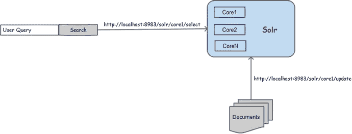
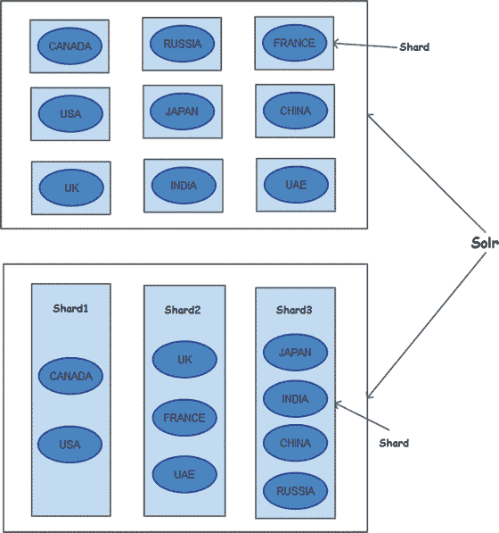
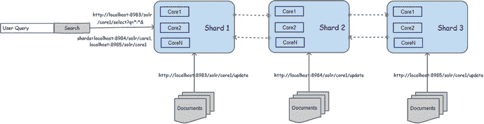
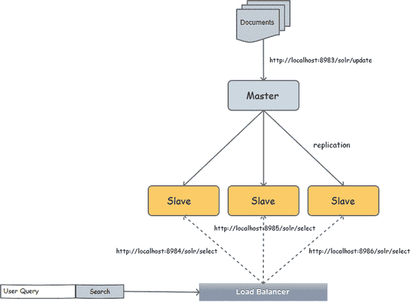
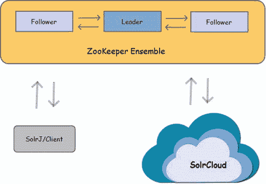

# 十、传统扩展和 SolrCloud

第 2 章介绍了如何设置 Solr 的独立实例、核心管理、内存管理和其他管理任务。接下来的章节讲述了索引、搜索和 Solr 的其他高级特性。Solr 的这个单一实例非常适合于概念验证、开发、特性测试和简单的产品部署。但是当涉及到任务关键型部署时，您需要考虑性能、可伸缩性、可用性和容错等方面。

在本章中，您将了解 Solr 支持的各种模型，以使您的系统为生产做好准备。你可以选择一个最适合你需要的。您将首先探索传统模型，然后关注 SolrCloud，这是 Solr 提供的共同运行服务器集群的终极模型。

本章涵盖以下主题:

*   独立实例
*   分片
*   主从架构
*   分片和主从的混合体
*   索尔鲁德
*   常见问题

## 独立模式

独立模式是最简单的 Solr 设置:一个 Solr 服务器(也称为实例)运行在一个特定的端口上，以满足您所有的搜索需求。在这种模式下，文档被索引到同一个实例并在其上进行查询。独立实例是开发活动的首选模式，在这种模式下，您需要频繁地进行更改、重新加载和重新启动。如果高可用性并不重要，并且数据量有限，那么您也可以在生产环境中以这种模式运行。

Solr 引入了多核的概念，这样每个核都可以有自己的索引和配置，而不是有一个单独的 Solr 设置，每个内核运行在不同的端口上，用于不同类型的索引。Solr 中的多核类似于拥有多个表的数据库。

拥有多个内核可以让您轻松管理多个索引。通过 Solr 管理界面，可以在运行时轻松加载、卸载、重命名、交换和优化内核。对于索引和搜索，URL 应该包含核心名称；这就是所有需要的改变。

前面的章节已经探讨了内核、它们的用法和`core.properties`文件，所以我假设现在你已经理解了拥有多个内核而不是多个实例的好处。多核作为一项功能，并不局限于独立模式，可以在任何架构中设置。

图 [10-1](#Fig1) 展示了一个具有 N 个内核的独立 Solr 实例，该实例被请求用于索引和搜索。

图 10-1。

Stand-alone Solr instance with multiple cores

## 碎片

一旦开始索引越来越多的文档，索引大小就会增加，搜索性能也会受到影响。如果您的应用程序即将达到可接受的响应时间阈值，那么是时候进行分片了。

分片是将一个大的索引分成较小的分区的过程，这些分区在物理上分布在服务器上，但在逻辑上构成一个单元。索引被垂直划分并分布在 Solr 服务器网络上；每个单独的单元称为一个碎片。

假设您正在为一家制造商的文档编制索引，其中包含多个国家的销售点信息。如果索引很小，那么所有文档都可以放在一个 Solr 实例中。但是随着业务的增长，数据量也将增长，您可能希望将索引划分为碎片。分片策略将取决于您的需求和数据量。可以通过使用散列函数简单地对文档进行分片，或者分片可以基于定制的逻辑。图 [10-2](#Fig2) 展示了两种分片策略:一种是基于国家划分文档，如美国或英国；另一种是以地区为基础，如北美、欧洲、中东、非洲(EMEA)和亚太地区(APAC)。

图 10-2。

Concept of sharding

搜索应用程序应该知道 shard URLs，并可以根据需要查询全部或部分内容。这个请求应该发送给任何一个带有附加的`shards`参数的实例，该参数指定了要查询的其他碎片的列表。接收请求的实例将查询分发给在`shards`参数中提到的所有碎片，获取它们的结果，合并它们，并响应客户端。这种方法提供了更好的查询响应时间。

以下是使用多个碎片查询 Solr 的示例:

`$ curl ’``http://localhost:8983/solr/core1/select?q=*:*&shards=localhost:8984/solr/core1,localhost:8985/solr/core1`T2】

图 [10-3](#Fig3) 描述了一个多共享架构，其中所有的请求都发送给在端口 8983 上运行的 Solr 实例，该实例将查询分配给其他 shards。值得注意的是，文档被分别索引到每个实例，而查询可以被发送到任何一个碎片进行分发。

图 10-3。

Sharding in Solr

以下是关于分片设计需要注意的一些要点:

*   模式应该包含一个`uniqueKey`。
*   这种方法只提供分布式查询，不支持分布式索引。索引应用程序应该将用于索引的文档分别发送到每个碎片。
*   逆文档频率是该碎片中的本地术语计数，而不是所有碎片的聚合值。如果术语分布是偏斜的，分数可能会受到影响。
*   Solr 将请求分布在各个分片中，因此应该考虑增加线程池的大小。

## 主从架构

在主-从架构中，索引和搜索的过程在不同的机器之间是分离的。所有文档都被索引到主服务器，主服务器将索引复制到从实例，客户端将搜索请求发送到任何从实例。这种体系结构有明确的任务分离:索引在主服务器上完成，搜索请求发送给从服务器。每个从服务器都包含主服务器索引的冗余副本，因此客户端可以向任何一个从服务器发送请求。或者，您可以引入一个负载平衡器，它将向客户端提供一个 URL，并在循环的基础上将搜索请求重定向到一个从属服务器。负载平衡器通常能够检测实例的故障，并向实时服务器发送请求。这种方法有助于扩展 Solr 来处理大量请求，还支持高可用性和容错。

在这种体系结构中，索引应用程序很简单，其过程与独立实例上的索引相同。对于搜索请求，通常在客户端应用程序之前有一个负载平衡器，在从属实例之间路由请求。

图 [10-4](#Fig4) 描述了一个简单的主从架构，其中所有的索引请求都发送给主设备，而搜索请求则发送给从设备。此外，您可以看到一个负载平衡器位于应用程序的前面，用于路由请求。

图 10-4。

Master-slave architecture Note

主实例能够处理搜索请求，但是使用专用的从实例进行搜索是一种规范。

为了建立一个主从架构，Solr 要求您进行一些配置更改，以支持从主服务器到从服务器的索引复制。除了复制更改之外，您可能希望优化主实例以进行索引，优化从实例以进行搜索。

复制过程由`ReplicationHandler`实现。为了让主从架构工作，这个处理程序应该在`solrconfig.xml`中注册。在处理程序中，您需要指定服务器类型(主服务器或从服务器)并使用适当的设置来获得所需的行为。

需要注意的是，主服务器不知道从服务器。了解主人的是奴隶。从属实例配置有主实例的 URL，它们以指定的时间间隔轮询主实例的更新。

### 掌握

主服务器的复制处理程序应该包含一个名为`master`的元素，从服务器应该包含一个名为`slave`的元素。表 [10-1](#Tab1) 显示了主机支持的复制参数的详细信息。以下是主实例的配置示例。

表 10-1。

Master-Slave Architecture: Master Configuration

<colgroup><col> <col></colgroup> 
| 名字 | 描述 |
| --- | --- |
| `replicateAfter` | 此属性指定应在何时触发复制的事件。从节点轮询主节点，如果发生了任何指定的事件，将会触发复制。支持的事件有`startup`、`commit`、`optimize`，可以配置多个事件。 |
| `confFiles` | 除了索引之外，还可以复制配置文件。此元素指定要复制的文件的逗号分隔列表。只能复制`conf`及其子目录中的文件。仅当主服务器有新的索引要复制时，才复制修改的文件(如果更新了配置文件，但没有修改任何文档，则不会触发复制)。 |
| `backupAfter` | 此参数与复制无关，但与备份有关。它指定应在哪个事件之后备份索引。该主题在第 2 章中有详细介绍。 |
| `maxNumberOfBackups` | 此属性指定要维护的备份数量。 |
| `commitReserveDuration` | 此参数指定从主机向从机传输 5MB 数据的最大允许时间。 |

`<requestHandler name="/replication" class="solr.ReplicationHandler" >`

`<lst name="master">`

`<str name="replicateAfter">startup</str>`

`<str name="replicateAfter">commit</str>`

`<str name="backupAfter">optimize</str>`

`<str name="confFiles">schema.xml,stopwords.txt,elevate.xml</str>`

`</lst>`

`<int name="maxNumberOfBackups">2</int>`

`</requestHandler>`

复制配置文件的规定使您免于在所有实例中应用更改的冗余工作。您应该在主实例中执行配置，复制会负责将其部署到从实例中。但是有一个挑战:使用这种架构，主实例和从实例的`solrconfig.xml`文件应该是不同的，并且您不能将主实例的副本复制到从实例。为此，您可以在文件名后添加一个冒号(`:`)分隔符，并指定复制到从属服务器时应该使用的名称。下面是一个将主实例中的`solrconfig_slave.xml`复制到从实例中作为`solrconfig.xml`的例子:

`<str name="confFiles">solrconfig_slave.xml:solrconfig.xml,schema.xml</str>`

要从`conf`中的子目录复制文件，可以如下指定相对路径。`conf`之外的文件不会被复制。

`<str name="confFiles">schema.xml,velocity/template.html</str>`

这样，您就可以设置主服务器了。

### 奴隶

从属实例应该知道它的主实例以及它应该轮询它的频率。表 [10-2](#Tab2) 显示了从站支持的复制参数的详细信息。以下是在从属实例中启用复制的配置:

表 10-2。

Master-Slave Architecture: Slave Configuration

<colgroup><col> <col></colgroup> 
| 名字 | 描述 |
| --- | --- |
| `masterUrl` | 指定主复制处理程序的 URL。 |
| `pollInterval` | 指定从设备轮询其主设备以检查更新的时间间隔(以 HH:mm:ss 表示)。更高的间隔将延迟从设备中反映的变化。复制也可以通过复制 API 触发，在这种情况下，您可能希望禁用轮询。可以通过删除此参数来禁用轮询。 |
| `httpConnTimeout` | 指定 HTTP 连接超时。 |
| `httpReadTimeout` | 指定 HTTP 读取超时。 |
| `httpBasicAuthUser` | 如果主服务器需要认证，可以在该参数中指定用户名。 |
| `httpBasicAuthPassword` | 指定与用户名对应的密码。 |

`<requestHandler name="/replication" class="solr.ReplicationHandler">`

`<lst name="slave">`

`<str name="masterUrl">``http://localhost:8983/solr/core1/replication</str`T2】

`<str name="pollInterval">00:00:30</str>`

`</lst>`

`</requestHandler>`

## 主从碎片

分片允许 Solr 处理分布式请求，而主从架构有助于实现复制。如果您的应用程序需要这两者，您可以构建一个混合系统，其中每个碎片可以有一个主碎片用于索引，一组从碎片用于搜索。

图 [10-5](#Fig5) 显示了一个同时使用分片和主从模型的设计。该模型包含两个碎片，每个碎片都有自己的主实例和从实例。

图 10-5。

Hybrid of shards with master-slave architecture

这种方法是所有传统方法中最复杂的，但是它有一些限制。这种 Solr 扩展模型非常复杂，难以管理、监控和维护。

为了解决传统架构的局限性，引入了 SolrCloud。如果您计划实现混合方法，我建议您考虑 SolrCloud，这将在下一节中介绍。

## 索尔鲁德

在前面的小节中，您看到了扩展 Solr 并将其组合在一起的传统方法，这种方法有以下局限性:

*   索引过程不是分布式的，所有文档都应该被索引到主实例。主服务器可能是单点故障；如果主机停机，步进必须停止。
*   客户端应用程序需要包含一些逻辑，比如文档的路由和负载平衡。
*   通过复制过程很难实现实时更新，因为从实例会频繁地轮询主实例，并且索引会复制到从实例。
*   不支持反向文档频率。

SolrCloud 是在 4.0 版中引入的，比目前所有的模型都要先进一步。它解决了以前的限制，并提供了真正的分布式体系结构。

SolrCloud 提供了高度可用和可伸缩的解决方案，并支持负载平衡、自动路由、乐观并发、故障转移和健壮性。

SolrCloud 建立了一个服务器集群，其中的数据被分割成碎片并分布在多台机器上。它还维护多个碎片副本，以实现容错和高可用性，并且可以在集群中的任何碎片上索引和搜索文档。集群自动将文档分发到适当的碎片上进行索引，并同步副本。类似地，集群中的任何碎片都可以接受搜索请求进行处理。集群负责路由、合并和可用性。如果任何故障节点变为可用，群集会自动将其同步。客户是从所有的实现细节和分配和协调过程中抽象出来的。

您甚至可以在一个有数百台机器的农场上建立这种架构，并从 Solr 管理界面集中管理它。该模型甚至在监控和维护方面提供了很多便利，甚至可以在商用机器上运行。

### 理解术语

SolrCloud 引入了一些新的术语，以及一些大家可能很熟悉但需要从全新角度理解的术语。[第 2 章](02.html)简要介绍了一些术语，本节将进一步阐述。事不宜迟，我们开始吧。

#### 结节

节点，通常称为服务器，是在机器上的特定端口上运行 Solr 的 Java 虚拟机实例。图 [10-6](#Fig6) 描绘了一个 SolrCloud 节点。

图 10-6。

A SolrCloud node

#### 串

一组两个或更多的节点就是一个集群。集群将外部世界从实现细节中抽象出来，并使节点看起来像一个单元。可以在集群中添加或删除节点，以动态扩展或收缩集群，客户端不需要知道任何关于这种变化的信息。客户端只需向集群发出请求，如果得到确认，客户端就不需要担心其他任何事情。确保请求的原子性和进一步处理是集群的工作。

图 [10-7](#Fig7) 表示一个 SolrCloud 集群，它对索引和搜索应用程序来说是一个单独的单元。

图 10-7。

SolrCloud cluster

集群依靠 ZooKeeper 来协调和管理配置。动物园管理员将在本章后面讨论。

#### 核心

在本书中，我们一直将核心称为单一索引。如果你想创建两种类型的索引，你需要创建两个核心。但是在 SolrCloud 中，情况有所不同。一个索引在物理上可以驻留在多个节点上，但在逻辑上可以分布在几台机器上。节点中的每个物理索引可以被视为一个核心，每个逻辑索引可以由多个核心组成。

Note

核心有多重含义。在独立的 Solr 实例中，一个核心对应一个逻辑/物理索引。在 SolrCloud 中，集合定义逻辑索引，而核心对应于驻留在节点中的物理索引，它是逻辑索引的一部分。

#### 募捐

集合是簇中完整的逻辑索引。一个集群可以有多个集合(多种类型的索引)，一个集合可以有多个分片，一个分片可以有多个副本，这些副本可以分布在集群中的多个节点上。

#### 陶瓷或玻璃碎片

分片的概念对 SolrCloud 来说并不陌生。你也可以从传统的分布式体系结构方面了解到这一点。在独立方法中，所有文档都在同一台机器上编制索引。在这种方法中，索引分布在多个碎片中，这些碎片维护一部分逻辑索引的物理副本。用户查询被分发给所有的碎片进行处理，并最终在响应用户之前被其中一个碎片合并。

传统的分片方法要求客户端应用程序包含分片逻辑，但 SolrCloud 会自动处理。

图 [10-8](#Fig8) 显示了 Solr admin UI 中的云标签，它有一个包含两个碎片的`hellocloud`集合。该设置包含一个在端口 8983 和 7574 上运行的双节点集群。这个示例在同一台机器上的不同端口上运行两个实例。在生产环境中，您可能希望在不同的机器上运行节点。

图 10-8。

Sharding in SolrCloud

#### 复制品

副本是作为 Solr 核心在节点中运行的碎片的物理副本。假设一个碎片只有一个物理副本，如果它关闭了，Solr 将只能处理部分结果。为了实现高可用性，需要维护 shard 的冗余副本，每个副本称为一个副本。每个副本对应于 Solr 管理控制台中的一个核心。

在管理界面中，副本由连接碎片的圆圈表示。如果一个圆圈被标为绿色，它是活动的，可以接受请求。图 [10-8](#Fig8) 显示了一个例子，其中每个碎片有两个副本。

#### 领导者

每个碎片的一个副本被选为领导者，负责协调索引和查询请求。领导者确保所有副本都得到更新并且同步。他们以先到先得的方式当选。如果主服务器关闭，其中一个可用副本将自动升级为主服务器。

图 [10-9](#Fig9) 显示了一个运行四个节点的典型 SolrCloud 集群。该集群代表两个碎片的集合，一个以名字 S1 开始，另一个以名字 S2 开始。每个以 S 开头的方框代表一个复制品。以 L 结尾的复制品是各自碎片的领导者，所有 S1(或 S2)盒子放在一起构成碎片。

图 10-9。

A typical SolrCloud cluster

与主从架构不同，在主从架构中，主机是在设置实例时配置的，领导者是动态选举的。群集中任何节点上的任何副本都可以被指定为领导者。

在 Solr 管理控制台中，领导者由实心空白圆圈表示。图 [10-8](#Fig8) 显示在端口 7574 上运行的节点上的副本是`shard1`和`shard2`的领导者。

### 启动 SolrCloud

在[第二章](02.html)中，你学会了在单机模式下设置 Solr，这与设置 SolrCloud 是不同的。在这里，您将首先了解如何启动 SolrCloud 实例，这显然是执行任何其他操作的先决条件。一旦启动了 SolrCloud 实例，就需要执行其他设置步骤。启动和设置 SolrCloud 最简单的方式是在交互模式下。如果您以前没有使用 SolrCloud 的经验，我建议您以这种模式启动 Solr，尝试一下它的特性和行为，一旦您对它感到满意，就可以使用标准方法启动 SolrCloud。

以下是设置 SolrCloud cluster 以索引和搜索文档时需要执行的一般步骤。

Start Solr in cloud mode   Design the schema and create the required configurations files. Alternatively, you can use a named configset or choose to go schemaless.   SolrCloud doesn’t reads the schema.xml and other configurations from `conf` directory but relies on ZooKeeper for it. Solr bundles a ZooKeeper and by default starts it for you. Alternatively, you can start a separate ZooKeeper ensemble. Upload the configurations to the preferred ZooKeeper.   Create a collection by specifying the ZooKeeper path and other required information.  

#### 对话方式

`bin/solr`脚本允许您在本地工作站上快速启动一个小型节点集群，而不需要您执行前面列表中提到的步骤。交互过程自动在本地机器的不同端口上实例化多个节点，并设置碎片及其副本和配置集以创建集群。

如果你选择尝试无模式，设置 Solr 就像下载和启动一样简单，你就可以尽情摇滚了！

对于交互模式，按如下方式运行脚本:

`$ bin/solr start -e cloud`

这个脚本将为您提供一个以交互方式运行的 SolrCloud 实例。设置过程简单明了。即使您对所有选项都按 Enter 键，您也将建立一个名为`gettingstarted`的双节点集群。

如果您想绕过交互步骤，从默认设置开始，运行带有`-noprompt`选项的脚本:

`$ bin/solr start -e cloud -noprompt`

成功启动后，终端将打印以下消息:

`"SolrCloud example is running, please visit``http://localhost:8983/solr`T2】

#### 标准模式

在这种模式下，你需要自己完成所有的艰苦工作。首先，通过向`solr`脚本传递一个附加参数来启动 SolrCloud 实例，如下所示:

`$ bin/solr start -c -z <zkHost>`

*   `-c`:该参数指示 Solr 以云模式启动实例。或者，`-cloud`也可以作为选项提供。
*   `-z`:默认情况下，SolrCloud 启动一个嵌入式 ZooKeeper 实例，其端口号比当前实例端口号多 1000。例如，如果您在端口 8983 上启动 Solr 节点，那么嵌入式 ZooKeeper 将在端口 9983 上启动。要指定一个外部 ZooKeeper 系综，可以使用`-z`参数。

运行此命令后，SolrCloud 应该会成功启动。但是您仍然需要创建集合；按照“创建收藏”的步骤。完成后，您就可以开始添加文档并在集合中搜索结果了。

如果您已经设置了配置和`$SOLR_HOME`，那么可以为`solr`脚本提供`-s`参数，该参数指向您的`$SOLR_HOME`目录。下面是一个使用`$SOLR_HOME`路径启动实例的例子:

`$ bin/solr start -c -s "/home/dev/solr-5.3.1/server/solr"`

假设您正在启动另一个节点，或者想要引用现有的 ZooKeeper 集合。这里有一个例子:

`$ bin/solr start -c -s "/home/dev/solr-5.3.1/server/solr" -z localhost:9983 -p 8984`

通过提供`-help`参数，参考完整手册了解`bin/solr`脚本中可用的启动选项:

`$ bin/solr start -help`

### 重新启动节点

重新启动节点的选项类似于启动节点的选项。此示例重新启动在端口 8983 上运行的节点:

`$ bin/solr restart -c -p 8983 -s "/home/dev/solr-5.3.1/server/solr"`

### 创建收藏

要创建集合，有几个先决条件。首先，应该定义模式和其他配置。您甚至可以使用命名的配置集。第二，集合中碎片的数量应该在创建集合时确定。虽然你可以把一个碎片一分为二，但是你不可能动态的扩展或者收缩一个碎片。我知道，很难预测语料库的大小，所以确定准确的碎片数量可能是不可能的。在这种情况下，您可以创建大约数量的碎片，然后在需要时进行分割。

SolrCloud 节点从 ZooKeeper 读取配置，因此集合使用的配置必须上传到 ZooKeeper。Solr 提供了一个将收藏目录上传到 ZooKeeper 的脚本。这将在下一节讨论。

以下是创建集合的示例命令:

`$ bin/solr create -c hellocloud -d sample_techproducts_configs`

`-n hellocloud -shards 2 -replicationFactor 2`

*   `-c`指定收藏名称。
*   `-d`指定应该上传到 ZooKeeper 并使用的配置目录的路径或现有配置集的名称。
*   `-n`指定 ZooKeeper 中收藏的名称。如果未指定该参数，将考虑参数`-c`的值。
*   `-shards`指定要创建的碎片数量。
*   `-replicationFactor`指定为碎片创建的副本数量。如果因子指定为 2，将创建一个引线和一个复本。

您也可以选择使用`create_collection`选项。要查看可用于创建集合的所有选项，请按如下方式运行脚本:

`$ bin/solr create_collection -help`

SolrCloud 提供了用于管理集合的集合 API。如果您想使用 API 创建一个集合，可以按如下方式完成:

`$ curl ’``http://localhost:8983/solr/admin/collections`T2】

`action=CREATE&name=hellocloud&collection=hellocloud&numShards=2&replicationFactor=2’`

使用集合 API，您不能指定配置集或配置目录。相反，它应该被预先加载到 ZooKeeper，并且它的名字应该在`collection.configName`参数中提供。

Note

参考 Solr 官方参考指南，了解 Solr 在 [`https://cwiki.apache.org/confluence/display/solr/Collections+API`](https://cwiki.apache.org/confluence/display/solr/Collections+API) 提供的一整套集合 API。

### 上传到动物园管理员

在前面的例子中，您看到 Solr 自动将配置上传到 ZooKeeper。如果想要手动将配置上传到 ZooKeeper，Solr 提供了 ZooKeeper 命令行接口(也称为 zkCLI)。zkCLI 脚本可以位于`$SOLR_DIST/server/scripts/cloud-scripts`目录中。`zkcli.sh`应该用在*nix 机器上，`zkcli.bat`应该用在 Windows 机器上。

这个例子使用`zkcli.sh`将配置上传到 ZooKeeper:

`$ ./zkcli.sh -cmd upconfig -zkhost  localhost:9983 -confname hellocloud`

`-solrhome /home/dev/solr-5.3.1/server/solr`

`-confdir /home/dev/solr-5.3.1/server/solr/configsets/hello_configs/conf`

Note

关于 [`https://cwiki.apache.org/confluence/display/solr/Command+Line+Utilities`](https://cwiki.apache.org/confluence/display/solr/Command+Line+Utilities) 的完整命令集实用程序，请参考 Solr wiki。

### 删除收藏

可以使用如下的`bin/solr`脚本从集群中删除集合:

`$ bin/solr delete -c hellocloud -deleteConfig false -p 8983`

*   `-c`指定要删除的收藏的名称。
*   指定 ZooKeeper 应该保留配置还是删除它。
*   `-p`指定删除集合时要引用的本地实例上的端口。

除了使用`bin/solr`脚本删除集合，您还可以使用集合 API 删除集合，如下所示:

`$ curl ’``http://localhost:8983/solr/admin/collections?action=DELETE&name=hellocloud`T2】

### 为文件编制索引

SolrCloud 简化了客户端应用程序的索引过程。在传统的分布式体系结构中，客户端程序将所有文档索引到主实例，主实例被复制到从实例进行搜索。此外，客户端应用程序负责将文档路由到适当的碎片。SolrCloud 自动决定将文档发送到哪个碎片进行索引，而无需客户端担心主实例或路由到合适的碎片。

客户端程序将文档发送到集群中的任何碎片进行索引。如果接收请求的碎片是一个副本，它将文档发送给它的领导者进行处理。领导者识别文档应该被索引到的碎片，并将请求发送到该碎片的领导者。该领导者将文档附加到事务日志，对其进行索引，然后将其路由到其所有副本进行索引。如果更新在主服务器上成功，但在副本服务器上失败，客户端仍会得到成功状态的响应。当失败的副本恢复时，它们可以通过与主服务器同步来进行协调。

在传统的主从架构中，所有文档都在主服务器上建立索引，主服务器将索引段复制到从服务器上。从属实例中没有索引进程。相比之下，在 SolrCloud 中，领导者索引文档，然后将其发送给副本进行索引。领导者通常传输文档而不是段，并且索引在领导者和复制品中完成。

在 SolrCloud 中，通常避免从客户端应用程序触发提交，而应该依靠自动提交。如果有多个应用程序索引文档，并且您发现很难确保它们都不会触发提交，那么您可以将`IgnoreCommitOptimizeUpdateProcessorFactory`注册到流程链，以禁止来自客户端应用程序的提交。以下是禁用提交的配置示例:

`<updateRequestProcessorChain name="preprocessor">`

`<processor class="solr.IgnoreCommitOptimizeUpdateProcessorFactory">`

`<int name="statusCode">403</int>`

`<str name="responseMessage">External commit is disabled on this collection!</str>`

`</processor>`

`<processor class="solr.LogUpdateProcessorFactory" />`

`<processor class="solr.DistributedUpdateProcessorFactory" />`

`<processor class="solr.RunUpdateProcessorFactory" />`

`</updateRequestProcessorChain>`

### 负载平衡

SolrCloud 会自动对请求进行负载平衡，您不需要像传统架构那样在前端安装负载平衡器。但是仍然建议使用负载平衡器或智能客户端向集群发出请求。假设您向同一个节点发出所有请求，该节点会将请求转发给其领导者，而该领导者又会确定应该处理请求的分片，然后将其转发给该分片的领导者。如果您的客户端应用程序本身知道请求应该发送到哪个碎片，就可以避免初始路由，从而避免网络不堪重负。像 SolrJ 这样的智能客户端提供了一个负载平衡器，它在循环的基础上分发请求。

如果你把所有的请求发送到同一个碎片，而那个碎片出现故障，所有的请求都会失败。为了解决这种单点故障，SolrJ 使您能够提供 ZooKeeper 的引用，而不是 Solr 节点。因为 ZooKeeper 总是知道集群的状态，所以它永远不会将请求定向到不可用的节点。为了避免这种单点故障，对 SolrJ 的请求应该配置如下:

`import org.apache.solr.client.solrj.impl.CloudSolrServer;`

`import org.apache.solr.common.SolrInputDocument;`

`// Provide ZooKeeper address as argument`

`CloudSolrServer server = new CloudSolrServer("localhost:9983");`

`server.setDefaultCollection("hellocloud");`

`// Create document`

`SolrInputDocument document = new SolrInputDocument();`

`document.addField( "productId", "Mac152016");`

`document.addField( "name", "Apple MacBook Pro");`

`server.add(document);`

`// Let Solr autocommit`

`// server.commit();`

### 文档路由

默认情况下，SolrCloud 使用哈希函数在碎片之间分发文档。如果您愿意，可以在创建集合时通过指定参数`router.name=compositeId`来微调行为。该参数还要求指定参数`numShards`，该参数定义了应该在其中分发文档的碎片数量。

如果使用了`compositeId`路由器，那么文档的`uniqueKey`应该以一个字符串为前缀，Solr 将使用这个字符串来生成一个散列，以标识文档应该被索引到的碎片。前缀后面应该跟一个感叹号(`!`)以区别于`uniqueKey`。假设原来的`uniqueKey`是`Mac152016`，并且您想要根据制造商来路由文档。在这种情况下，您可以在文档前面加上制造商名称，例如`Apple!Mac152016`。

Solr 最多支持两级路由，中间用感叹号隔开。例如，如果您想要基于制造商和产品类别进行路由，那么文档 ID 应该修改为类似于`Apple!Laptop!Mac152016`的内容。

如果使用`compositeId`传送文件，那么在搜索时，应该在附加参数`_router_`中提供前缀信息。这些信息将帮助 Solr 将查询路由到正确的分片，而不是发送到所有的分片。以下是查询路由的一个示例:

使用`_router_`参数，一个示例查询将是`q=mac&_router_=Apple`。

`$ curl ’``http://localhost:8983/solr/hellocloud/select?q=*:*&_router_=Apple`T2】

### 使用事务日志

Solr 使用事务日志来降低数据丢失的风险。在 Solr 4.0 中引入，它是一个只追加的预写日志，记录每个片上的所有索引操作。在 SolrCloud 中，所有碎片，无论是主碎片还是副本碎片，都有自己的日志文件。

事务日志也称为`tlog`，创建在`data`目录内的`tlog`目录中(与`index`目录相邻)。图 [10-10](#Fig10) 显示了`tlog`的目录结构。

图 10-10。

Solr transaction log directory

Solr 将所有文档附加到事务日志的末尾，并在硬提交时翻转。当请求是原子更新时，`tlog`记录旧值和新值，这允许您回滚文档。如果在很长时间后执行硬提交，或者以很高的速度对文档进行索引，文件可能会变得非常大，恢复成本也会很高。

### 执行碎片运行状况检查

索引客户端可以发送表示最小复制因子的附加参数`min_rf`，以了解碎片是否处于降级状态以及文档的复制因子是否低于预期阈值。如果您想采取任何预防措施，此信息可能会有所帮助。

### 查询结果

向 SolrCloud 发送查询几乎和往常一样简单，因为集群对客户端应用程序隐藏了所有实现细节。SolrCloud 处理搜索请求的步骤如下:

The client application sends a request to any node in the cluster.   The receiving node determines the eligible shards and sends the query to any available replica of each of them.   Each replica returns the matching documents to the receiver shard.   The receiver shard merges the results and triggers another request to the replicas, for getting the stored values for the documents to be returned.   The receiver responds to the client with the matching documents.   Note

查询请求不会被路由到碎片领导者，而是可以由任何碎片复制品来处理。

建议使用智能客户端(如 SolrJ)或负载平衡器来查询集群。Solr 内置了对负载平衡器的支持，但是如果所有的查询都被发送到同一个节点，它将不得不完成所有的路由，并且可能会被请求淹没。反过来，负载平衡器会将查询分布到各个节点上，从而提供更好的性能。像 SolrJ 这样的智能客户端从 ZooKeeper 获取集群状态，并将请求重新发送到一个活动节点。

在完整索引上搜索结果的过程和以前一样，您可能甚至不知道您正在查询一个集群。如果您想要查询索引的一部分(一组指定的碎片)，您所需要做的就是传递一个额外的参数`shards`，就像传统的碎片架构一样。下面是它们各自的一个例子:

*   查询整个集合/完整索引。`$ curl ’``http://localhost:8983/solr/hellocloud/select?q=*:*`T2】
*   通过用逗号分隔的 URL 列表指定`shards`参数来查询一组特定的碎片。`$ curl ’` `http://localhost:8983/solr/hellocloud/select?q=*:*&shards=localhost:8983/solr` `,localhost:7574/solr’`
*   通过使用管道(`|`)操作符分隔碎片 URL，查询一组特定的碎片并在其副本之间进行负载平衡。`$ curl ’` `http://localhost:8983/solr/hellosolr/select?q` `=*:*` `&shards=localhost:8983/solr|localhost:8483/solr’`

Note

像 curl 这样的简单客户端可以用于评估和开发，但是建议在生产中使用像 SolrJ 这样的智能客户端。

如果您想获得关于处理查询的碎片的信息，请将附加参数`shards.info=true`传递给请求。

### 执行恢复

失败是常见的，尤其是当您运行大型集群时，在商用机器上也是如此。当故障节点恢复时，SolrCloud 通过自动与其他碎片同步来从这种故障中恢复。

当停机的非主节点恢复时，它与分片主节点同步，并且只有在它更新后才开始接受请求。如果要重播的文档数量很大，恢复过程可能会很长。

当一个领导者倒下时，Solr 指定另一个复制品作为领导者。当此故障节点变为可用时，它会与当前的主节点同步，以获取它可能会错过的更新。

值得注意的是，当副本从故障中恢复时，它从主服务器的`tlog`中获取文档并重放它。但是，如果它发现自己落后太多，就像传统方法一样复制数据段。

### 碎片分裂

Solr Collections API 允许您将一个分片分成两个分区。现有碎片的文档被分成两部分，每一部分都被复制到一个新的碎片中。现有的碎片可以在以后方便的时候删除。

下面是一个将`hellocloud`集合中的`shard1`分割成两部分的例子:

`$ curl ’` `http://localhost:8983/solr/admin/collections?action=SPLITSHARD`

`&collection=hellocloud&shard=shard1’`

### 添加副本

SolrCloud 提供了扩展和收缩集群的灵活性。假设您想要扩展系统以处理更多的查询，或者您有了新的硬件；在这种情况下，您可能希望向群集中添加一个节点，并为其分配副本。

您可以使用 Solr Collections API 向集合中添加副本。本例向集合`hellocloud`中的碎片`shard1`添加一个节点:

`$ curl ’` `http://localhost:8983/solr/admin/collections?action=ADDREPLICA`

`&collection=hellocloud&shard=shard1&node=192.10.8.120:7573_solr’`

## 动物园管理员

Apache ZooKeeper 是一个成熟快速的开源服务器，广泛应用于分布式系统中，用于协调、同步和维护共享信息。它能够每秒处理数十万个事务，在包括 Hadoop、Spark 和 HBase 在内的分布式系统中非常流行。

ZooKeeper 在内存中维护信息，并构建一组服务器来维护这些配置的冗余副本，以实现快速性能和高可用性。主服务器被称为领导者，并有一组冗余的追随者。图 [10-11](#Fig11) 描绘了一个 ZooKeeper 系综以及它如何适应 SolrCloud 架构。

图 10-11。

ZooKeeper ensemble Note

更多详情请参考 Apache ZooKeeper 官方网站: [`https://zookeeper.apache.org/`](https://zookeeper.apache.org/) 。

在 SolrCloud 中，集群使用 ZooKeeper 来协调碎片并维护配置。概括地说，SolrCloud 将 ZooKeeper 用于以下用途:

*   配置管理:你在`core/conf`目录下的所有配置文件，包括`solrconfig.xml`和`schema.xml`，都在 ZooKeeper 中集中维护。所有配置的节点都引用 ZooKeeper。配置的任何变化都应该上传到 ZooKeeper。
*   集群协调:ZooKeeper 维护关于集群、其集合、活动节点和副本状态的信息，这些信息由节点监视以进行协调。
*   首领选举:每个碎片应该有一个首领，并且可以有多个副本。如果领导者倒下，复制品中的一个必须被选为领导者。动物园管理员在这个领袖选举过程中扮演着重要的角色。

Solr 与 ZooKeeper 捆绑在一起，这为评估、开发和初始测试提供了一个很好的起点。但是因为 ZooKeeper ensemble 需要超过一半的服务器，所以建议在生产环境中运行外部 ensemble。法定人数是一个组织中开展业务的最少成员的集合。— [www。词汇。com](http://www.vocabulary.com/)

Note

关于在 [`https://cwiki.apache.org/confluence/display/solr/Setting+Up+an+External+ZooKeeper+Ensemble`](https://cwiki.apache.org/confluence/display/solr/Setting+Up+an+External+ZooKeeper+Ensemble) 建立外部动物园管理员合奏，请参考 Solr 的官方指南。

## 常见问题

本节涵盖了一些与 SolrCloud 相关的常见问题。

### 为什么我的数据/tlog 目录的大小急剧增长？我该怎么处理？

该目录包含原子更新和 SolrCloud 使用的事务日志。所有索引更新都记录在这些文件中，并在硬提交时被截断。如果您的系统高速索引，但硬提交很少执行，文件会变得很大。

您可以通过更频繁地执行自动提交来控制`tlog`的大小。下面是您如何在`solrconfig.xml`中配置它:

`<autoCommit>`

`<maxTime>${solr.autoCommit.maxTime:30000}</maxTime>`

`<maxTime>${solr.autoCommit.maxDocs:100000}</maxTime>`

`<openSearcher>false</openSearcher>`

`</autoCommit>`

### 我可以完全禁用事务日志吗？会有什么影响？

您可以通过注释掉`solrconfig.xml`中的以下部分来禁用`tlog`:

`<updateLog>`

`<str name="dir">${solr.ulog.dir:}</str>`

`<int name="numVersionBuckets">${solr.ulog.numVersionBuckets:65536}</int>`

`</updateLog>`

强烈建议不要禁用事务日志。SolrCloud 的高可用性，以及原子更新和近实时搜索等功能都依赖于`tlog`，禁用它将影响对这些功能的支持。

### 我最近从传统架构迁移到了 SolrCloud。在 SolrCloud 中，有什么我应该小心和不要做的事情吗？

有了 SolrCloud，Solr 中的许多东西都发生了变化，通读本章会让您对这些变化有一个大致的了解。以下是你应该注意的一些关键事项:

*   您应该避免从客户端程序触发提交，而是使用 Solr 的`autocommit`和`softCommit`特性。
*   总是优雅地停止节点。如果你一直在做`kill -9`，停止它。
*   避免搜索所有碎片。

### 我正在迁移到 SolrCloud，但是它无法将配置上传到 ZooKeeper。原因可能是什么？

ZooKeeper 将配置的大小限制在 1MB 以内。如果您的配置集太大，ZooKeeper 将无法上传。由于巨大的同义词文件或集成分类法的定制插件，`conf`目录的大小通常很大。您需要一个更好的数据源来解决这个限制。

## 摘要

在本章中，您了解了 Solr 为可伸缩性提供的各种传统方法。根据您的需求，您可以选择这些方法之一或它们的组合。您还了解了这些方法的局限性以及引入 SolrCloud 的原因。

本章还介绍了 SolrCloud 的突出特性及其基本概念，以及这些特性如何革新 Solr 中的分布式伸缩。您还了解了动物园管理员的概况。