# 二、使用 Apache Spark

当谈到使用 Spark 或构建 Spark 应用程序时，有许多选择。本章描述了三个常见的选项，包括使用 Spark shell、从命令行提交 Spark 应用程序以及使用名为 Databricks 的托管云平台。本章的最后一部分面向那些希望在本地机器上安装 Apache Spark 源代码的软件工程师，他们将研究 Spark 源代码并了解某些特性是如何实现的。

## 下载和安装

要学习或试验 Spark，将它本地安装在您的计算机上是很方便的。通过这种方式，您可以轻松地尝试某些功能，或者使用小型数据集测试您的数据处理逻辑。将 Spark 本地安装在您的笔记本电脑上，您可以在任何地方学习它，包括您舒适的客厅、海滩或墨西哥的酒吧。

Spark 是用 Scala 写的。它经过打包，可以在 Windows 和类似 UNIX 的系统(例如 Linux、macOS)上运行。要在本地运行 Spark，只需要在您的计算机上安装 Java。

建立一个多租户 Spark 生产集群需要更多的信息和资源，这超出了本书的范围。

### 下载 Spark

Apache Spark 网站的下载部分( [`http://spark.apache.org/downloads.html`](http://spark.apache.org/downloads.html) )有下载预打包 Spark 二进制文件的详细说明。在写这本书的时候，最新的版本是 3.1.1。包类型方面，选择 Hadoop 最新版本的。图 [2-1](#Fig1) 显示了下载 Spark 的各种选项。最简单的方法是下载预打包的二进制文件，因为它包含在您的计算机上运行 Spark 所必需的 JAR 文件。单击行项目 3 上的链接会触发二进制文件下载。有一种方法可以从源代码手动构建 Spark 二进制文件。本章稍后将介绍如何操作的说明。


图 2-1

Apache Spark 下载选项

### 安装 Spark

一旦文件成功下载到您的计算机上，下一步就是解压缩它。`spark-3.1.1-bin-hadoop2.7.tgz`文件位于 GZIP 压缩的 tar 存档文件中，因此您需要使用正确的工具来解压缩它。

对于 Linux 或 macOs 电脑，`tar`命令应该已经存在。所以运行下面的命令来解压缩下载的文件。

```scala
tar xvf spark-3.1.1-bin-hadoop2.7.tgz

```

对于 Windows 计算机，您可以使用 WinZip 或 7-zip 工具来解压缩下载的文件。

解压缩成功完成后，应该有一个名为 spark-3.1.1-bin-hadoop2.7 的目录。从这里开始，这个目录称为 spark 目录。

Note

如果下载了不同版本的 Spark，目录名会略有不同。

`spark-3.1.1-bin-hadoop2.7`目录下大概有十几个目录。表 [2-1](#Tab1) 描述了值得了解的内容。

表 2-1

spark-3.1.1-bin-hadoop2.7 中的子目录

<colgroup><col class="tcol1 align-left"> <col class="tcol2 align-left"></colgroup> 
| 

名字

 | 

描述

 |
| --- | --- |
| 容器 | 包含各种可执行文件，用于在 Scala 或 Python 中调用 Spark shell、提交 Spark 应用程序、运行 Spark 示例 |
| 数据 | 包含各种 Spark 示例的小样本数据文件 |
| 例子 | 包含所有 Spark 示例的源代码和二进制文件 |
| 震动 | 包含运行 Spark 所需的必要二进制文件 |
| 命令 | 包含管理 Spark 集群的可执行文件 |

下一步是通过调用 Spark shell 来测试安装。

Spark shell 类似于 Unix shell。它提供了一个交互式环境，可以轻松地学习 Spark 和分析数据。大多数 Spark 应用程序都是使用 Python 或 Scala 编程语言开发的。Spark shell 可用于这两种语言。如果你是一名数据科学家，Python 是你的最爱，你不会感到被冷落。下一节将展示如何使用 Spark Scala 和 Spark Python shell。

Note

Scala 是一种基于 Java JVM 的语言，因此很容易在 Scala 应用程序中利用现有的 Java 库。

#### Spark Scala 外壳

要启动 Spark Scala shell，在 Spark 目录中输入`./bin/spark-shell`命令。几秒钟后，您应该会看到类似于图 [2-2](#Fig2) 的东西。


图 2-2

Scala Spark 壳输出

要退出 Scala Spark shell，请键入`:quit`或`:q`。

Note

Java 版本 11 或更高版本是运行 Spark Scala shell 的首选。

#### Spark Python Shell

要启动 Spark Python shell，请在 Spark 目录中输入`./bin/pyspark`命令。几秒钟后，您应该会看到类似于图 [2-3](#Fig3) 的东西。

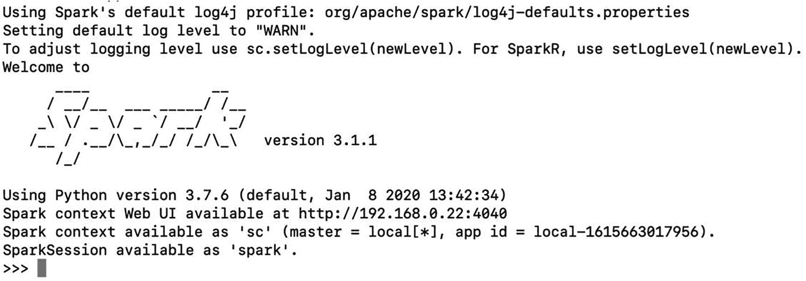

图 2-3

Python Spark shell 的输出

要退出 Python Spark shell，请输入`ctrl-d`。

Note

Spark Python shell 需要 Python 3.7.x 或更高版本。

Spark Scala shell 和 Spark Python shell 分别是 Scala REPL 和 Python REPL 的扩展。REPL 是读取-评估-打印循环的首字母缩写。它是一个交互式计算机编程环境，接受用户输入，对其进行评估，并将结果返回给用户。一旦输入一行代码，REPL 会立即提供关于是否有语法错误的反馈。如果没有任何语法错误，它会对它们进行评估。如果有输出，它会显示在 shell 中。交互和即时反馈环境使开发人员能够通过绕过正常软件开发过程中的代码编译步骤来提高工作效率。

要学习 Spark，Spark shell 是一个非常方便的工具，可以随时随地在您的本地计算机上使用。除了您处理的数据文件需要驻留在您的计算机上之外，它没有任何外部依赖性。然而，如果你有一个互联网连接，有可能访问这些远程数据文件，但它会很慢。

本书的其余章节使用 Spark Scala shell。

## 享受 Spark Scala Shell 带来的乐趣

本节提供了关于 Scala Spark shell 的信息，以及一组有用的命令，这些命令在使用它进行探索性数据分析或交互式构建 Spark 应用程序时非常有效。

`./bin/spark-shell`命令有效地启动了 Spark 应用程序，并提供了一个环境，您可以在其中交互式地调用 Spark Scala APIs 来轻松地执行探索性数据处理。由于 Spark Scala shell 是 Scala REPL 的扩展，所以用它同时学习 Scala 和 Spark 是一个很好的方法。

### 有用的 Spark Scala Shell 命令和提示

一旦 Spark Scala shell 启动，它会将您置于一个交互式环境中，以便输入 shell 命令和 Scala 代码。本节涵盖了各种有用的命令和一些使用 shell 的技巧。

进入 Spark Shell 后，键入以下命令以获得可用命令的完整列表。

```scala
scala>  :help

```

该命令的输出如图 [2-4](#Fig4) 所示。

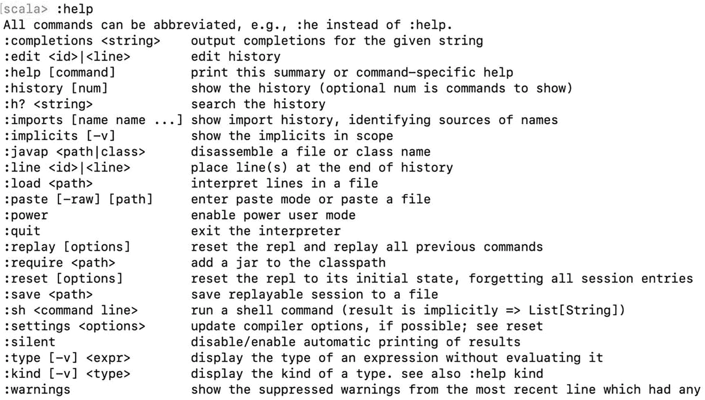

图 2-4

可用 shell 命令列表

有些命令比其他命令更常用，因为它们很有用。表 [2-2](#Tab2) 描述了常用的命令。

表 2-2

有用的 Spark Shell 命令

<colgroup><col class="tcol1 align-left"> <col class="tcol2 align-left"></colgroup> 
| 

名字

 | 

描述

 |
| --- | --- |
| :历史 | 该命令显示在之前的 Spark shell 会话和当前会话中输入的内容。这对于复制非常有用。 |
| :加载 | 加载并执行所提供文件中的代码。当数据处理逻辑很长时，这尤其有用。跟踪文件中的逻辑要容易一些。 |
| :重置 | 试用各种 Scala 或 Spark APIs 一段时间后，您可能会忘记各种变量的值。该命令将 shell 重置为干净状态，以便于推理。 |
| :无声 | 这是为那些对查看 shell 中输入的每个 Scala 或 Spark APIs 的输出有些厌倦的高级用户准备的。要重新启用输出，只需再次键入:silent。 |
| :退出 | 这是一个不言自明的命令，但是知道它很有用。通常，人们试图通过进入:退出来退出外壳，这是行不通的。 |
| :类型 | 显示变量的类型。:类型<variable name=""></variable> |

除了这些命令之外，还有一个有助于提高开发人员工作效率的特性是代码完成特性。与流行的集成开发环境(ide)如 Eclipse 或 IntelliJ 一样，代码完成特性帮助开发人员探索可能的选项并减少键入错误。

在 shell 中，键入`spa`，然后按 Tab 键。环境添加字符将“spa”转换为“spark”。此外，它还显示了 Spark 的可能匹配(见图 [2-5](#Fig5) )。


图 2-5

spa 的选项卡完成输出

```scala
scala> spa <tab>

```

除了完成部分输入单词的名称，制表符结束还可以显示对象的可用成员变量和函数。

在 shell 中，键入`spark`，然后按 Tab 键。这将显示由`spark`变量代表的 Scala 对象的可用成员变量和函数列表(参见图 [2-6](#Fig6) )。

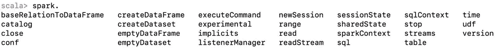

图 2-6

名为“spark”的对象的可用成员变量和函数列表

`:history`命令显示先前输入的命令或代码行。这表明 Spark shell 保留了输入内容的记录。快速显示或回忆最近输入的内容的一种方法是按向上箭头键。一旦你向上滚动到你想要执行的行，只需按下回车键来执行它。

### 与 Scala 和 Spark 的基本交互

上一节介绍了导航 Spark shell 的基础知识；本节介绍了在 Spark shell 中使用 Scala 和 Spark 的一些基本方法。这些基础知识将在以后的章节中非常有帮助，因为您会更深入地研究 Spark DataFrame 和 Spark SQL 等主题。

#### 与 Scala 的基本交互

让我们从 Spark Scala shell 中的 Scala 开始，它为学习 Scala 提供了一个成熟的环境。把 Spark Scala shell 想象成一个空体的 Scala 应用程序，这就是你的用武之地。您可以用 Scala 函数和应用程序逻辑来填充这个空身体。本节打算在 Spark shell 中演示几个简单的 Scala 示例。Scala 是一种迷人的编程语言，强大、简洁、优雅。请参考 Scala 相关书籍，了解更多关于这种编程语言的知识。

学习任何编程语言的典型例子是“Hello World”例子，它需要打印出一条消息。让我们开始吧。在 Spark Scala shell 中输入以下代码行；输出应该如图 [2-7](#Fig7) 所示。

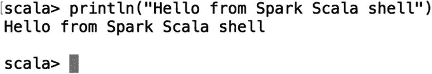

图 2-7

Hello World 示例命令的输出

```scala
scala> println("Hello from Spark Scala shell")

```

下一个示例定义了一个年龄数组，并在 Spark shell 中打印出这些元素值。此外，这个例子说明了上一节中提到的代码完成特性。

要定义一个年龄数组并将其赋给一个不可变的变量，请在 Spark shell 中输入以下内容。图 [2-8](#Fig8) 显示了评估输出。


图 2-8

定义年龄数组的输出

```scala
scala> val ages = Array(20, 50, 35, 41)

```

现在你可以在下面一行代码中引用`ages`变量。让我们假设您不能准确地记住`Array`类中的一个函数名来迭代数组中的元素，但是您知道它以“fo”开头。您可以输入以下内容并点击选项卡，看看 Spark shell 可以提供什么帮助。

```scala
scala> ages.fo

```

按 Tab 键后，Spark shell 显示如图 [2-9](#Fig9) 所示。


图 2-9

代码完成的输出

啊哈！您需要`foreach`函数来遍历数组中的元素。让我们用它来打印年龄。

```scala
scala> ages.foreach(println)

```

图 [2-10](#Fig10) 显示了预期的输出。


图 2-10

打印年龄的输出

对于 Scala 新手来说，前面的代码语句可能看起来有点晦涩；但是，你可以直观地猜测它是做什么的。当`foreach`函数遍历“ages”数组中的每个元素时，它将该元素传递给`println`函数以将值打印到控制台。这种风格在接下来的章节中会经常用到。

本节最后一个例子定义了一个 Scala 函数来确定年龄是奇数还是偶数；然后用它来查找数组中的奇数年龄。

```scala
scala> def isOddAge(age:Int) : Boolean = {
  (age % 2) == 1
}

```

如果您来自 Java 编程背景，这个函数签名可能看起来很奇怪，但要破译它是做什么的并不太难。请注意，该函数不使用关键字`return`来返回其主体中表达式的值。在 Scala 中，不需要添加`return`关键字。函数体中最后一条语句的输出返回给调用者(如果该函数被定义为返回值)。图 [2-11](#Fig11) 显示了 Spark 壳的输出。


图 2-11

如果有语法错误，Spark shell 将返回函数签名

为了计算出`ages`数组中的奇数年龄，让我们利用`Array`类中的`filter`函数。

```scala
scala> ages.filter(age => isOddAge(age)).foreach(println)

```

这行代码进行过滤，然后遍历结果，打印出奇数年龄。在 Scala 中，使用函数链使代码简洁是一种常见的做法。图 [2-12](#Fig12) 显示了 Spark 壳的输出。


图 2-12

过滤和打印出的输出只是奇数的年龄

现在让我们在前面定义的 Scala 变量和函数上尝试一下`:type` shell 命令。一旦您使用 Spark shell 一段时间，并且忘记了某个变量的数据类型或某个函数的返回类型，这个命令就会派上用场。图 [2-13](#Fig13) 显示了`:type`命令的示例。


图 2-13

输出:类型命令

学习 Spark，不一定要掌握 Scala 编程语言。然而，你必须熟悉 Scala 的基础知识并熟练使用。在 [`https://github.com/deanwampler/JustEnoughScalaForSpark`](https://github.com/deanwampler/JustEnoughScalaForSpark) ，有一个很好的资源可以学习刚刚够学习 Spark 的 Scala。该资源在各种 Spark 相关会议上展示。

#### Spark UI 和与 Spark 的基本交互

在上一节中，我提到了 Spark shell 是一个 Scala 应用程序。这只是部分正确。Spark shell 是用 Scala 编写的 Spark 应用程序。当 Spark shell 启动时，会初始化并设置一些东西供您使用，包括 Spark UI 和一些重要的变量。

##### Spark UI

如果你回头仔细检查图 [2-2](#Fig2) 或图 [2-3](#Fig3) 中的 Spark 壳输出，你会看到一条类似下面的线。(对于您的 Spark shell，URL 可能会有所不同。)

SparkContext Web UI 在 [`http://<ip>:4040`](http://192.168.1.73:4040) 可用。

如果您将浏览器指向 Spark shell 中的 URL，它会显示如图 [2-14](#Fig14) 所示的内容。


图 2-14

Spark UI

Spark UI 是一个 web 应用程序，旨在帮助监控和调试 Spark 应用程序。它包含 Spark 应用程序的详细运行时信息和各种资源消耗。运行时包括各种度量，这些度量对于诊断 Spark 应用程序中的性能问题非常有帮助。需要注意的一点是，Spark UI 仅在 Spark 应用程序运行时可用。

Spark UI 顶部的导航栏包含到各种选项卡的链接，包括作业、阶段、存储、环境、执行器和 SQL。我将简要介绍环境和执行者选项卡，并在后面的章节中描述其余的选项卡。

Environment 选项卡包含 Spark 应用程序运行环境的静态信息。这包括运行时信息、spark 属性、系统属性和类路径条目。表 [2-3](#Tab3) 描述了这些区域。

表 2-3

环境选项卡中的部分

<colgroup><col class="tcol1 align-left"> <col class="tcol2 align-left"></colgroup> 
| 

名字

 | 

描述

 |
| --- | --- |
| 运行时信息 | 包含 Spark 所依赖的各种组件的位置和版本，包括 Java 和 Scala。 |
| Spark 特性 | 该区域包含在 Spark 应用程序中配置的基本和高级属性。基本属性包括应用程序的基本信息，如应用程序 id、名称等。高级属性旨在打开或关闭某些 Spark 功能，或者以最适合特定应用程序的特定方式调整它们。有关可配置属性的完整列表，请参见位于 [`https://spark.apache.org/docs/latest/configuration.html`](https://spark.apache.org/docs/latest/configuration.html) 的参考资料。 |
| 资源配置文件 | 关于 Spark 集群中 CPU 数量和内存量的信息。 |
| Hadoop 属性 | 各种 Hadoop 和 Hadoop 文件系统属性。 |
| 系统属性 | 这些属性主要是 OS 和 Java 级别的，而不是 Spark 特有的。 |
| 类路径条目 | 包含 Spark 应用程序中使用的类路径和 jar 文件的列表。 |

Executors 选项卡包含支持 Spark 应用程序的每个执行器的摘要和细分信息。这些信息包括特定资源的容量，以及每个执行器使用了多少资源。资源包括内存、磁盘和 CPU。Summary 部分提供了 Spark 应用程序中所有执行器的资源消耗的鸟瞰图。图 [2-15](#Fig15) 显示了更多细节。

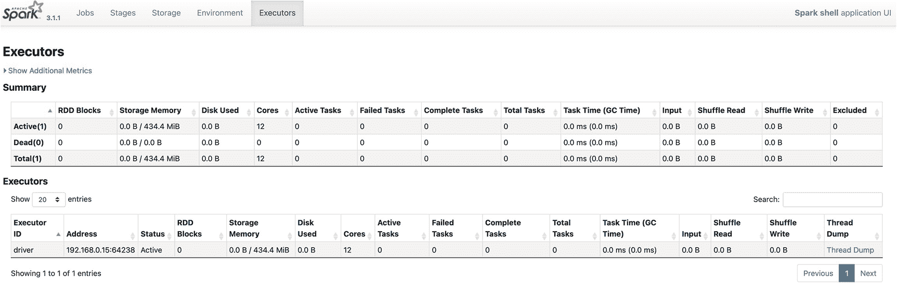

图 2-15

仅使用一个执行器的 Spark 应用程序的 Executor 选项卡

您将在后面的章节中再次讨论 Spark UI。

##### 与 Spark 的基本交互

一旦一个 Spark shell 成功启动，一个名为`spark`的重要变量就被初始化并准备好使用。变量`spark`代表了一个`SparkSession`类的实例。让我们使用`:type`命令来验证这一点。

```scala
scala>:type spark

```

Spark 壳在图 [2-16](#Fig16) 中显示其类型。

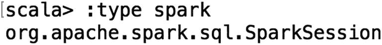

图 2-16

显示“Spark”变量的类型

Spark 2.0 中引入了`SparkSession`类，以提供与底层 Spark 功能交互的单一入口点。这个类有读取文本和二进制格式的非结构化和结构化数据的 API，比如 JSON、CSV、Parquet、ORC 等等。此外，`SparkSession`组件提供了检索和设置 Spark 配置的工具。

让我们开始与 Spark shell 中的`spark`变量交互，打印出一些有用的信息，比如版本和现有配置。在 Spark shell 中，键入以下代码来打印 Spark 版本。图 [2-17](#Fig17) 显示输出。

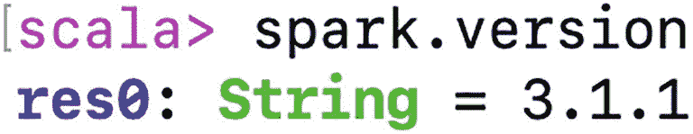

图 2-17

Spark 版本输出

```scala
scala> spark.version

```

再正式一点，可以使用上一节介绍的`println`函数打印出如图 [2-18](#Fig18) 所示的 Spark 版本和输出。

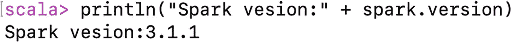

图 2-18

使用 println 函数显示 Spark 版本

```scala
scala> println("Spark version: " + spark.version)

```

要查看 Spark shell 中的默认配置，您可以访问`spark`的`conf`变量。下面是显示默认配置的代码，输出如图 [2-19](#Fig19) 所示。

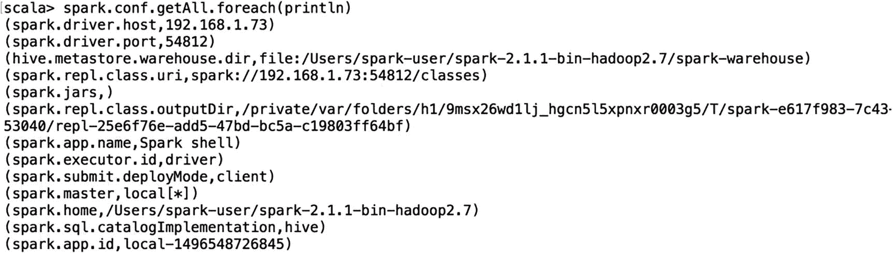

图 2-19

Spark shell 应用中的默认配置

```scala
scala> spark.conf.getAll.foreach(println)

```

要查看您可以从`spark`变量访问的可用对象的完整集合，您可以利用 Spark shell 代码完成特性。

```scala
scala> spark.<tab>

```

图 [2-20](#Fig20) 显示了该命令的结果。

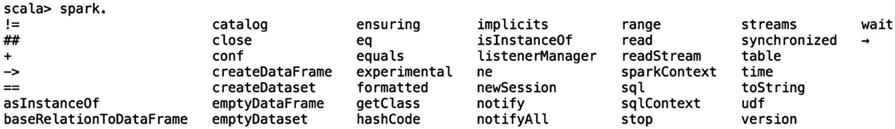

图 2-20

可以从 spark 变量访问的变量的完整列表

接下来的章节有更多使用`spark`与 Spark 底层功能交互的例子。

## 协作笔记本简介

协作笔记本是由 Databricks 提供的商业产品，data bricks 是名为 Apache Spark 的开源项目的最初创建者。根据产品文档，Collaborative Notebooks 是为数据工程师、数据科学家和数据分析师设计的，用于执行数据分析和构建支持多种语言、内置数据可视化和自动数据版本化的机器学习模型。它还提供 Spark on demand 计算基础架构，并可以按照特定的计划执行生产数据管道的作业。它围绕 Apache Spark 构建，为全球客户提供四个主要价值主张。

*   完全管理的 Spark 集群

*   用于探索和可视化的交互式工作空间

*   生产流水线调度程序

*   为您最喜爱的基于 Spark 的应用提供支持的平台

协作笔记本产品有两个版本，完整平台版和社区版。商业版是一个付费产品，提供高级功能，如创建多个集群、用户管理和作业调度。社区版是免费的，非常适合开发人员、数据科学家、数据工程师以及任何想要学习 Apache Spark 或尝试 Databricks 的人。

以下部分涵盖了协作笔记本社区版的基本功能。它为学习 Spark、执行数据分析或构建 Spark 应用程序提供了一个简单直观的环境。本节不是一个全面的指南。为此，您可以参考 Databricks 用户指南( [`https://docs.databricks.com/user-guide/index.html`](https://docs.databricks.com/user-guide/index.html) )。

要使用协作笔记本，您需要在 [`https://databricks.com/try-databricks`](https://databricks.com/try-databricks) 注册一个社区版的免费账户。这个注册过程简单快捷；几分钟之内就可以创建一个帐户。一旦在注册表单中提供并提交了必要的信息，您很快就会收到来自 Databricks 的电子邮件，确认您的电子邮件，它看起来有点像图 [2-21](#Fig21) 。


图 2-21

Databricks 电子邮件确认您的电子邮件地址

点击图 [2-21](#Fig21) 所示的网址链接，进入 Databricks 签到表，如图 [2-22](#Fig22) 所示。


图 2-22

数据块登录页面

使用电子邮件和密码成功登录后，您会看到如图 [2-23](#Fig23) 所示的 Databricks 欢迎页面。


图 2-23

数据块欢迎页面

随着时间的推移，欢迎页面可能会发生变化，因此它看起来并不完全像图 [2-23](#Fig23) 。请随意浏览教程或文档。

本节的目的是在 Databricks 中创建一个笔记本，以便您可以学习上一节中介绍的命令。以下是主要步骤。

1.  创建一个集群。

2.  创建一个文件夹。

3.  创建一个笔记本。

### 创建一个集群

community edition (CE)最酷的特性之一是，它免费提供了一个 15 GB 内存的单节点 Spark 集群。在写这本书的时候，这个单节点集群托管在 AWS 云上。因为 ce 帐户是免费的，所以它提供了同时创建多个集群的能力。只要群集还在使用，它就会一直保持运行状态。如果闲置两个小时，它会自动关机。这意味着您不必主动关闭集群。

要创建集群，请单击页面左侧垂直导航栏中的集群图标。集群页面如图 [2-24](#Fig24) 所示。

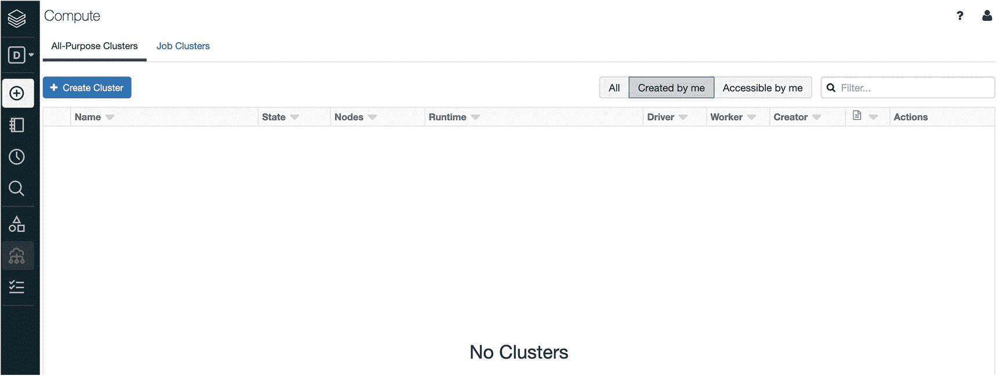

图 2-24

没有活动集群的数据块集群页面

现在点击 Create Cluster 按钮，调出新的集群表单，如图 [2-25](#Fig25) 所示。


图 2-25

创建集群表单

该表单上唯一的必填字段是集群名称。表 [2-4](#Tab4) 描述了每个字段。

表 2-4

数据块新的集群表单字段

<colgroup><col class="tcol1 align-left"> <col class="tcol2 align-left"></colgroup> 
| 

名字

 | 

描述

 |
| --- | --- |
| 集群名称 | 用于标识集群的唯一名称。名称的每个单词之间可以有空格；比如《我的星火簇》。 |
| 数据块运行时版本 | Databricks 支持许多版本的 Spark。出于学习目的，请选择最新版本，它会自动为您填充。每个版本都绑定到一个特定的 AWS 映像。 |
| 情况 | 对于 CE 版，没有其他选择。 |
| AWS–可用性区域 | 这允许您决定单节点集群运行在哪个 AWS 可用性区域。根据您所在的位置，选项可能会有所不同。 |
| Spark–Spark 配置 | 这允许您指定用于启动 Spark 集群的任何特定于应用程序的配置。例子包括打开某些 Spark 特性的 JVM 配置。 |

输入集群名称后，单击创建集群按钮。创建一个单节点 Spark 集群可能需要 10 分钟。如果需要，尝试切换到不同的可用性区域，如果默认区域需要很长时间。一旦成功创建一个 Spark 簇，簇名旁边会出现一个绿点，如图 [2-26](#Fig26) 所示。

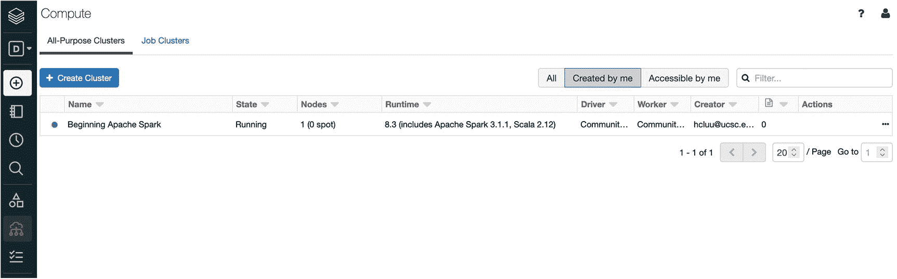

图 2-26

成功创建集群后

通过单击您的集群的名称或本页上的各种链接，您可以随意探索。如果您试图按照相同的步骤创建另一个 Spark 集群，它不允许您这样做。

要终止活动的 Spark 簇，请单击 Actions 列下的方块。

有关在数据块中创建和管理 Spark 集群的更多信息，请访问 [`https://docs.databricks.com/user-guide/clusters/index.html`](https://docs.databricks.com/user-guide/clusters/index.html) 。

让我们进入下一步，创建一个文件夹。

### 创建文件夹

在讨论如何创建文件夹之前，有必要花点时间描述一下 Databricks 中的工作空间概念。考虑 workspace 最简单的方法是将其视为计算机上的文件系统，这意味着可以利用其分层属性来组织各种笔记本。

要创建文件夹，请单击页面左侧垂直导航栏中的工作区图标。工作区列滑出，如图 [2-27](#Fig27) 所示。


图 2-27

工作区列

现在点击工作区栏右上方的向下箭头，弹出菜单出现(见图 [2-28](#Fig28) )。

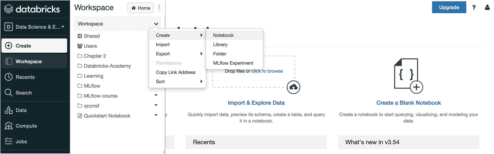

图 2-28

用于创建文件夹的菜单项

选择创建➤文件夹菜单项，弹出新文件夹名称对话框(见图 [2-29](#Fig29) )。

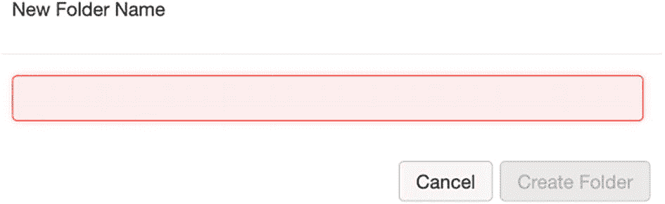

图 2-29

“新建文件夹名称”对话框

现在，您可以输入一个文件夹名称(即第 [2](02.html) 章)，并点击创建文件夹按钮以完成该过程。章 [2](02.html) 文件夹现在应该出现在工作区栏中，如图 [2-30](#Fig30) 所示。


图 2-30

第 [2 章](02.html)文件夹出现在工作区列中

在创建笔记本之前，值得一提的是，还有一种创建文件夹的替代方法。将鼠标指针放在工作区列中的任意位置，然后右键单击；出现相同的菜单选项。

有关工作区和创建文件夹的更多信息，请访问 [`https://docs.databricks.com/user-guide/workspace.html`](https://docs.databricks.com/user-guide/workspace.html) 。

### 创建笔记本

在章节 [2](02.html) 文件夹中创建一个 Scala 笔记本。首先，在工作区栏中选择章节 [2](02.html) 文件夹。章节 [2](02.html) 栏在工作区栏后滑出，如图 [2-31](#Fig31) 所示。


图 2-31

章节 [2](02.html) 栏出现在工作区栏的右侧

现在你既可以点击章节 [2](02.html) 栏右上角的向下箭头，也可以在章节 [2](02.html) 栏的任意位置点击鼠标右键，调出菜单，如图 [2-32](#Fig32) 所示。

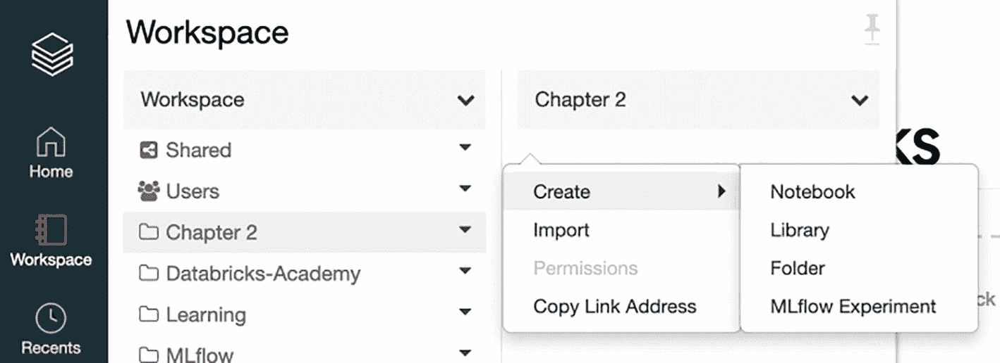

图 2-32

创建笔记本菜单项

选择“笔记本”菜单项会弹出“创建笔记本”对话框。为您的笔记本命名，并确保为语言字段选择 Scala 选项。应该自动填充集群的值，因为 CE 版本一次只能有一个集群。该对话框看起来应该如图 [2-33](#Fig33) 所示。


图 2-33

选择了 Scala 语言选项的“创建笔记本”对话框

点击创建按钮后，一个全新的笔记本被创建，如图 [2-34](#Fig34) 所示。


图 2-34

新 Scala 笔记本

如果你从未使用过 IPython 笔记本，笔记本的概念一开始可能会显得有些陌生。然而，一旦你习惯了，你会发现它很直观，很有趣。

笔记本本质上是一个交互式计算环境(类似于 Spark shell，但是更好)。您可以执行 Spark 代码，使用 Markdown 或 HTML 标记语言用富文本记录您的代码，并使用各种类型的图表和图形可视化您的数据分析结果。

以下部分仅涵盖几个基本部分，以帮助您高效使用 Spark 笔记本。有关使用 Databricks 笔记本并与之交互的完整说明列表，请访问 [`https://docs.databricks.com/user-guide/notebooks/index.html`](https://docs.databricks.com/user-guide/notebooks/index.html) 。

Spark Notebook 包含一个单元格集合，每个单元格包含一个要执行的代码块或用于文档目的的标记。

Note

使用 Spark Notebook 的一个好习惯是将数据处理逻辑分成多个逻辑组，这样每个逻辑组都驻留在一个或多个单元中。这类似于开发可维护软件应用程序的实践。

让我们把笔记本分成两部分。第一部分包含您在“Scala 的基本交互”一节中输入的代码片段。第二部分包含您在“与 Spark 的基本交互”一节中输入的代码片段。

让我们从添加一个 Markdown 语句开始，通过在第一个单元格中输入以下内容来记录笔记本的第一部分(参见图 [2-35](#Fig35) )。

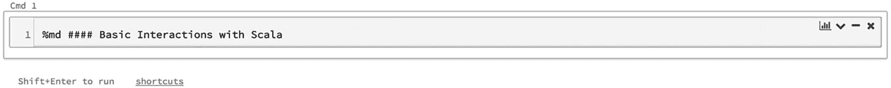

图 2-35

单元格包含节头标记语句

```scala
%md #### Basic Interactions with Scala

```

要执行标记语句，请确保鼠标光标在单元格 1 中，按住 Shift 键，然后按 Enter 键。这是在单元格中运行代码或标记语句的快捷方式。结果应该如图 [2-36](#Fig36) 所示。

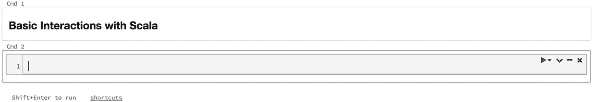

图 2-36

执行标记语句的输出

请注意，Shift+Enter 组合键执行该单元格中的语句，并在其下方创建一个新单元格。现在让我们在第二个单元格中输入“Hello World”示例并执行该单元格。输出应该如图 [2-37](#Fig37) 所示。


图 2-37

执行 println 语句的输出

“与 Scala 的交互”部分剩余的三个代码语句被复制到笔记本中(见图 [2-38](#Fig38) )。

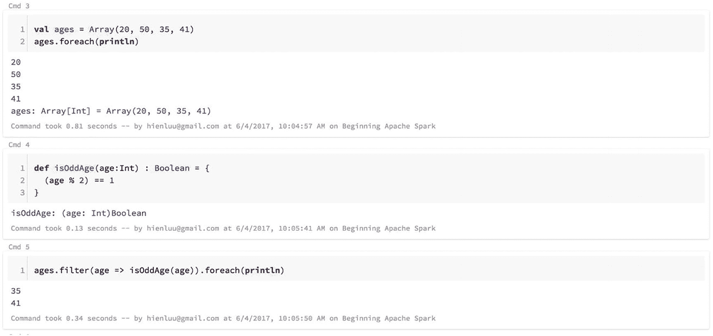

图 2-38

“与 Scala 的交互”一节中剩余的代码语句

像 Spark Scala shell 一样，Scala Notebook 是一个成熟的 Scala 交互环境，在这里可以执行 Scala 代码。

现在让我们输入第二个标记语句来表示笔记本第二部分的开始，以及“与 Spark 的交互”部分中剩余的代码片段。图 [2-39](#Fig39) 显示了输出。


图 2-39

与 Spark 部分交互的代码片段的输出

```scala
%md #### Basic Interactions with Spark

```

使用 Spark 笔记本时，有一些重要注意事项需要了解。它提供了一个非常方便的自动保存功能。当您输入市场声明或代码片段时，笔记本的内容会自动保存。事实上，文件菜单项下的菜单项没有保存笔记本的选项。

有时需要在两个现有单元之间创建一个新单元。一种方法是将鼠标光标移动到它们之间的空间，然后单击出现的加号图标创建一个新的单元格。图 [2-40](#Fig40) 显示了加号图标的样子。

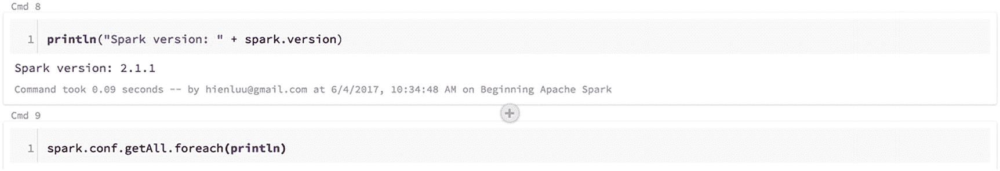

图 2-40

使用加号图标在两个现有单元格之间创建一个新单元格

有时，您需要与在远程办公室工作的同事或其他合作者分享您的笔记本电脑，以展示您出色的 Spark 知识或获得他们对您的数据分析的反馈。只需单击 Spark 笔记本顶部的 File 菜单项，然后选择 Publish 子菜单项。图 [2-41](#Fig41) 显示了它的样子。

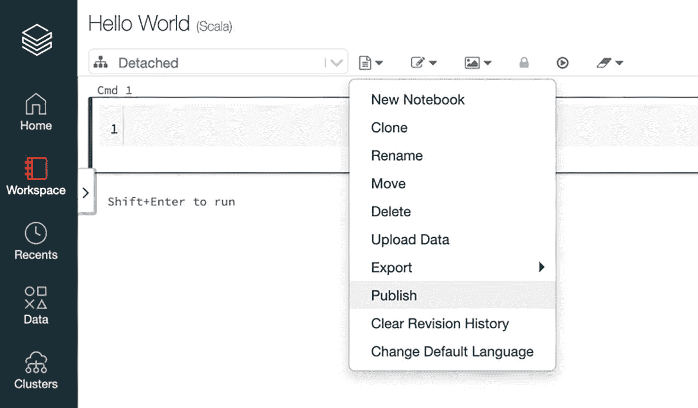

图 2-41

笔记本发布菜单项

点击发布子菜单项，弹出确认对话框(见图 [2-42](#Fig42) )。如果你坚持到底，笔记本发布对话框(见图 [2-43](#Fig43) )提供了一个你可以发送给世界上任何人的 URL。通过该 URL，您的同事或协作者可以查看您的笔记本，或者将它导入他们的 Databricks 工作区。

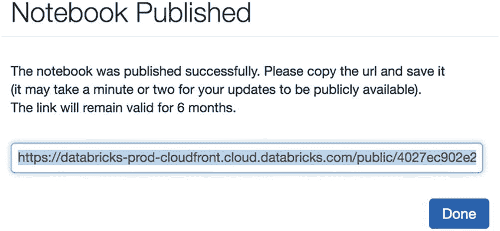

图 2-43

笔记本发布的 URL

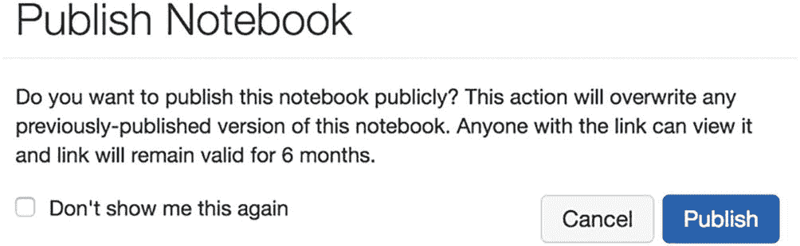

图 2-42

发布确认对话框

本节仅涵盖使用数据块的基本部分。许多其他高级功能使 Databricks 成为执行交互式数据分析或构建机器学习模型等高级数据解决方案的平台。

CE 提供了一个单节点 Spark 集群的免费帐户。通过 Databricks 产品学习 Spark 变得比以前容易多了。我强烈建议您在学习 Spark 的过程中尝试一下 Databricks。

## 设置 Spark 源代码

本节面向软件开发人员或任何有兴趣了解 Spark 在代码级如何工作的人。由于 Apache Spark 是一个开源项目，它的源代码是公开的，可以从 GitHub 下载，研究某些特性是如何实现的。Spark 代码是由这个星球上一些最聪明的 Scala 程序员用 Scala 编写的，所以学习 Spark 代码是提高一个人的 Scala 编程技能和知识的好方法。

有两种方法可以将 Apache Spark 源代码下载到您的计算机上。您可以从位于 [`http://spark.apache.org/downloads.html`](http://spark.apache.org/downloads.html) 的 Spark 下载页面下载它，这个页面之前用于下载 Spark 二进制文件。这一次，让我们选择源代码包类型，如图 [2-44](#Fig44) 。


图 2-44

Apache Spark 源代码下载选项

要完成源代码下载过程，请单击第 3 行的链接下载压缩的源代码文件。最后一步是将文件解压缩到您选择的目录中。

您还可以使用`git clone`命令从 GitHub 存储库中下载 Apache Spark 源代码。这需要在您的计算机上安装 git。Git 可以在 [`https://git-scm.com/downloads`](https://git-scm.com/downloads) 下载。安装说明可从 [`https://git-scm.com/book/en/v2/Getting-Started-Installing-Git`](https://git-scm.com/book/en/v2/Getting-Started-Installing-Git) 获得。在您的计算机上正确安装 Git 后，发出以下命令在 GitHub 上克隆 Apache Spark git 存储库( [`https://github.com/apache/spark`](https://github.com/apache/spark) )。

```scala
git clone git://github.com/apache/spark.git

```

一旦 Apache Spark 源代码被下载到你的计算机上，进入 [`http://spark.apache.org/developer-tools.html`](http://spark.apache.org/developer-tools.html) 获取关于如何将它们导入到你喜欢的 IDE 中的信息。

## 摘要

*   说到学习 Spark，有几个选择。您可以使用本地安装的 Spark，也可以使用协作笔记本社区版。这些工具让任何人学习 Spark 都变得简单方便。

*   Spark shell 是一个强大的交互式环境，用于学习 Spark APIs 和交互式分析数据。有两种类型的 Spark shell，Spark Scala shell 和 Spark Python shell。

*   Spark shell 提供了一组命令来帮助用户提高工作效率。

*   协作笔记本是一个全面管理的平台，旨在简化构建和部署数据探索、数据管道和机器学习解决方案。交互式工作区提供了一种直观的方式来组织和管理笔记本。每个笔记本都包含标记语句和代码片段的组合。与他人共享笔记本只需点击几下鼠标。

*   对于有兴趣了解 Spark 内部原理的软件开发人员来说，下载并研究 Apache Spark 源代码是满足这种好奇心的好方法。