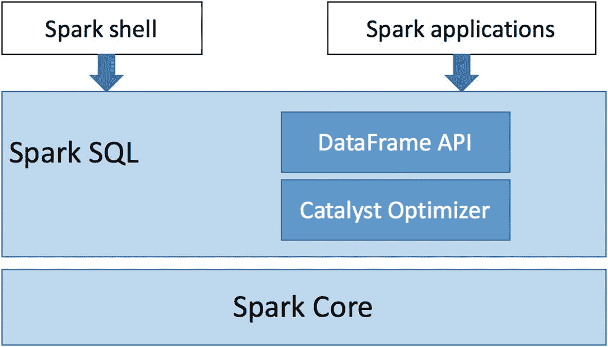

# 三、Spark SQL:基础

随着 Spark 作为统一数据处理引擎的发展和成熟，在每个新版本中都有更多的特性，它的编程抽象也在发展。当 Spark 在 2012 年向世界推出时，*弹性分布式数据集* (RDD)是最初的核心编程抽象。在 Spark 版中，引入了一种新的编程抽象，称为结构化 API。这是处理数据工程任务(如执行数据处理或构建数据管道)的新的首选方式。结构化 API 旨在通过易于使用、直观且富于表现力的 API 来提高开发人员的工作效率。新的编程抽象要求数据以结构化格式可用，数据计算逻辑需要遵循一定的结构。有了这两条信息，Spark 就可以执行必要的复杂优化来加速数据处理应用程序。

图 [3-1](#Fig1) 展示了 Spark SQL 组件是如何构建在可靠的 Spark 核心组件之上的。这种分层架构使其能够轻松利用 Spark 核心组件中引入的任何新改进。



图 3-1

Spark SQL 组件

本章介绍 Spark SQL 模块，它是为结构化数据处理而设计的。它提供了一个易于使用的抽象，用最少的代码来表达数据处理逻辑，并且在它的背后，它智能地执行必要的优化。

Spark SQL 模块由两个主要部分组成。第一个是称为 DataFrame 和 Dataset 的结构 API 的表示，它们定义了用于处理结构化数据的高级 API。DataFrame 概念的灵感来自 Python 熊猫 DataFrame。主要区别在于 Spark 中的 DataFrame 可以处理分布在多台机器上的大量数据。Spark SQL 模块的第二部分是 Catalyst optimizer，它负责所有在幕后工作的复杂机器，使您的生活更加轻松，并最终加快您的数据处理逻辑。Spark SQL 模块提供的一个很酷的功能是执行 SQL 查询来执行数据处理。有了这个功能，Spark 可以获得一个新的用户群，称为业务分析师，他们非常熟悉 SQL 语言，因为这是他们经常使用的主要工具之一。

区分结构化数据和非结构化数据的一个主要概念是模式，它以列名和相关数据类型的形式定义数据结构。模式概念是 Spark 结构化 API 不可或缺的一部分。

结构化数据通常以某种格式捕获。有些格式是基于文本的，有些是基于二进制的。文本数据的常见格式是 CSV、XML 和 JSON，二进制数据的常见格式是 Avro、Parquet 和 ORC。现成的 Spark SQL 模块使得从这些格式中读取数据和向其中写入数据变得非常容易。这种多功能性的一个意想不到的结果是 Spark 可以用作数据格式转换工具。

在进入结构化 API 之前，让我们讨论一下最初的编程抽象，以便更好地理解新抽象背后的动机。

## 了解 RDD

要真正理解 Spark 是如何工作的，你必须理解 RDD 的本质。它为构建结构化 API 提供了坚实的基础和抽象。简而言之，一个 RDD 代表一个容错的元素集合，这些元素被划分到一个集群中可以并行操作的节点上。它由以下特征组成。

*   一组对父 rdd 的依赖关系

*   一组分区，即构成整个数据集的区块

*   计算数据集中所有行的函数

*   关于分区方案的元数据(可选)

*   数据在群集上的驻留位置(可选)

Spark runtime 使用这五条信息来调度和执行使用 RDD 运算表达的数据处理逻辑。

前三条信息组成了血统信息，Spark 将它用于两个目的。第一个是确定 rdd 的执行顺序，第二个是故障恢复。

依赖项集合实质上是 RDD 的输入数据。需要此信息来重现故障场景中的 RDD，因此它提供了弹性特征。

该组分区使 Spark 能够并行执行计算逻辑，以加快计算时间。

Spark 需要产生 RDD 输出的最后一部分是计算功能，它是由 Spark 用户提供的。compute 函数被发送到集群中的每个执行器，以针对每个分区中的每一行执行。

RDD 抽象既简单又灵活。这种灵活性有一个缺点，即 Spark 无法洞察用户的意图。它不知道计算逻辑是在执行数据过滤、连接还是聚合。因此，Spark 不能执行任何优化，例如执行谓词下推以减少从输入源读取的数据量，推荐更有效的连接类型以加快计算速度，或者修剪输出不再需要的列。

## DataFrame API 简介

数据帧是组织成行的不可变的分布式数据集合。每一个都由一组列组成，每一列都有一个名称和一个关联的类型。换句话说，这种分布式数据集合具有由模式定义的结构。如果您熟悉关系数据库管理系统(RDBMS)中的表概念，您会意识到数据帧本质上是等价的。一个通用的`Row`对象代表数据帧中的每一行。与 RDD API 不同，DataFrame APIs 提供了一组特定于域的操作，这些操作是相关的并且具有丰富的语义。在接下来的章节中，您将了解更多关于这些 API 的内容。像 RDD API 一样，DataFrame APIs 分为两种类型:转换和动作。评估语义在 RDD 是相同的。转换被延迟评估，而动作被急切地评估。

可以通过从许多结构化数据源读取数据以及从 Hive 或其他数据库中的表读取数据来创建数据帧。此外，Spark SQL 模块通过提供关于 RDD 中数据的模式信息，提供了将 RDD 轻松转换为数据帧的 API。DataFrame API 有 Scala、Java、Python 和 r 版本。

## 创建数据帧

有许多方法可以创建数据帧；其中一个共同点是隐式或显式地提供一个模式。

### 从 RDD 创建数据帧

让我们从从 RDD 创建数据帧开始。清单 [3-1](#PC1) 首先创建一个包含两列整数的 RDD。然后它调用`toDF`隐式函数，该函数使用指定的列名将 RDD 转换为数据帧。列类型是从 RDD 中的数据值推断出来的。清单 [3-2](#PC2) 显示了数据帧中两个常用的函数，`printSchema,`和`show`。`printSchema`函数将列名及其相关类型打印到控制台。该函数以表格格式打印出数据帧中的数据。默认情况下，它显示 20 行。要更改显示的默认行数，可以将一个数字传递给`show`函数。清单 [3-3](#PC3) 是一个指定要显示的行数的例子。

```scala
kvDF.show(5)
+----+------+
| key| value|
+----+------+
|   1|    59|
|   2|    60|
|   3|    66|
|   4|   280|
|   5|    40|
+----+------+

Listing 3-3Call show Function to Display 5 Rows in Tabular Format

```

```scala
kvDF.printSchema
|-- key: integer (nullable = false)
|-- value: integer (nullable = false)

kvDF.show
+----+-------+
| key|  value|
+----+-------+
|   1|     58|
|   2|     18|
|   3|    237|
|   4|     32|
|   5|     80|
|   6|    210|
|   7|    567|
|   8|    360|
|   9|    288|
|  10|    260|
+----+-------+

Listing 3-2Print Schema and Show the Data of a DataFrame

```

```scala
import scala.util.Random
val rdd = spark.sparkContext.parallelize(1 to 10).map(x => (x, Random.nextInt(100)* x))
val kvDF = rdd.toDF("key","value")

Listing 3-1Creating DataFrame from an RDD of Numbers

```

Note

值列中的实际数字可能看起来不同，因为它们是通过调用`Random.nextInt()`函数随机生成的。

创建数据帧的另一种方法是指定 RDD 和模式，这可以通过编程方式创建。清单 [3-4](#PC4) 首先使用一个行对象数组创建一个 RDD，其中每个行对象包含三列。它以编程方式创建一个模式，最后将 RDD 和模式提供给`createDataFrame`函数以转换成 DataFrame。清单 [3-5](#PC5) 显示了模式和数据帧`peopleDF`中的数据。

```scala
peopleDF.printSchema
 |-- id: long (nullable = true)
 |-- name: string (nullable = true)
 |-- age: long (nullable = true)

peopleDF.show
+----+-------------+----+
| id |        name | age|
+----+-------------+----+
|   1|     John Doe|  30|
|   2|    Mary Jane|  25|
+----+-------------+----+

Listing 3-5Display Schema of peopleDF and Its Data

```

```scala
import org.apache.spark.sql.Row
import org.apache.spark.sql.types._

val peopleRDD = spark.sparkContext.parallelize(Array(Row(1L, "John Doe",  30L),Row(2L, "Mary Jane", 25L)))

val schema = StructType(Array(
        StructField("id", LongType, true),
        StructField("name", StringType, true),
        StructField("age", LongType, true)
))

val peopleDF = spark.createDataFrame(peopleRDD, schema)

Listing 3-4Create a DataFrame from a RDD with a Schema Created Programmatically

```

编程创建模式的能力使 Spark 应用程序能够根据一些外部配置灵活地调整模式。

每个`StructField`对象都有三条信息:名称、类型、值是否可以为空。

DataFrame 中的每个列类型都映射到一个内部 Spark 类型，它可以是简单的标量类型，也可以是复杂的类型。表 [3-1](#Tab1) 按照先标量类型后复杂类型的顺序引用 Spark 中可用的 Scala 类型。

表 3-1

Spark Scala 类型参考

<colgroup><col class="tcol1 align-left"> <col class="tcol2 align-left"></colgroup> 
| 

数据类型

 | 

Scala 类型

 |
| --- | --- |
| 布尔类型 | 布尔代数学体系的 |
| 字节类型 | 字节 |
| 排序方式 | 短的 |
| 整合类型 | （同 Internationalorganizations）国际组织 |
| LongType(长型) | 长的 |
| 浮动型 | 浮动 |
| DoubleType(双精度型) | 两倍 |
| 十进制 | Java . math . bigdecline |
| StringType | 线 |
| 二元类型 | 数组[字节] |
| TimestampType | java.sql.Timestamp |
| datatype(日期类型) | java.sql.Date |
| ArrayType | scala.collection.Seq |
| 字体渲染 | scala.collection.Map |
| 结构类型 | org.apache.spark.sql.Row |

### 从一系列数字创建数据帧

Spark 2.0 为主要使用数据帧和数据集 API 的 Spark 应用程序引入了新的入口点。这个新的入口点由`SparkSession`类表示，它有一个叫做`range`的方便函数，您可以使用它轻松地创建一个包含一列的数据集，该列的名称为`id`，类型为`LongType`。这个函数有一些变化，可以使用额外的参数来指定结束和步骤。清单 [3-6](#PC6) 提供了使用该函数创建数据帧的例子。

```scala
val df1 = spark.range(5).toDF("num").show
+-----+
|  num|
+-----+
|    0|
|    1|
|    2|
|    3|
|    4|
+-----+

spark.range(5,10).toDF("num").show
+-----+
|  num|
+-----+
|    5|
|    6|
|    7|
|    8|
|    9|
+-----+

spark.range(5,15,2).toDF("num").show
+------+
|   num|
+------+
|     5|
|     7|
|     9|
|    11|
|    13|
+------+

Listing 3-6Examples Using SparkSession.range Function to Create a DataFrame

```

`range`函数的最后一个版本有三个参数。第一个代表起始值，第二个代表结束值(不含)，最后一个代表步长。注意`range`函数只能创建一个列数据帧。你对如何创建两列数据帧有什么想法吗？

创建多列 DataFrame 的一个选项是使用 Spark 的隐式方法，它转换 Scala Seq 集合中的元组集合。列表 [3-7](#PC7) 是 Spark 的`toDF`隐式的一个例子。

```scala
val movies = Seq(("Damon, Matt", "The Bourne Ultimatum", 2007L),
                 ("Damon, Matt", "Good Will Hunting", 1997L))

val moviesDF = movies.toDF("actor", "title", "year")

moviesDF.printSchema
|-- actor: string (nullable = true)
|-- title: string (nullable = true)
|-- year: long (nullable = false)

moviesDF.show
+-----------+--------------------+------+
|      actor|               title|  year|
+-----------+--------------------+------+
|Damon, Matt|The Bourne Ultimatum|  2007|
|Damon, Matt|   Good Will Hunting|  1997|
+-----------+--------------------+------+

Listing 3-7Converting a Collection Tuples to a DataFrame Using Spark’s toDF Implicit

```

这些创建数据帧的有趣方法使得学习和使用数据帧 API 变得容易，而不需要从一些外部文件加载数据。然而，当您开始对大型数据集执行严肃的数据分析时，必须知道如何从外部数据源加载数据，这将在接下来讨论。

### 从数据源创建数据帧

Spark SQL 支持一组内置数据源，其中每个数据源都映射到一种数据格式。Spark SQL 模块中的数据源层被设计为可扩展的，因此自定义数据源可以很容易地集成到 DataFrame APIs 中。Spark 社区编写了数百个自定义数据源，实现起来并不太难。

Spark 中用于读写数据的两个主要类分别是`DataFrameReader`和`DataFrameWriter`。本节介绍了如何使用`DataFrameReader`类中的 API，以及从特定数据源读取数据时的各种可用选项。

`DataFrameReader`类的实例和`SparkSession`类的`read`变量一样可用。您可以从 Spark shell 或 Spark 应用程序中引用它，如清单 [3-8](#PC8) 所示。

```scala
spark.read

Listing 3-8Using read Variable from SparkSession

```

清单 [3-9](#PC9) 中描述了与 DataFrameReader 交互的常见模式。

```scala
spark.read.format(...).option("key", value").schema(...).load()

Listing 3-9Common Pattern for Interacting with DataFrameReader

```

表 [3-2](#Tab2) 描述了读取数据时使用的三条主要信息:格式、选项和模式。关于这三条信息的更多内容将在本章后面讨论。

表 3-2

DataFrameReader 上的主要信息

<colgroup><col class="tcol1 align-left"> <col class="tcol2 align-left"> <col class="tcol3 align-left"></colgroup> 
| 

名字

 | 

可选择的

 | 

评论

 |
| --- | --- | --- |
| 格式 | 不 | 它可以是内置数据源之一，也可以是自定义格式。对于内置格式，可以使用短名称(json、parquet、jdbc、orc、csv、text)。对于自定义数据源，需要提供完全限定的名称。参见清单 [3-10](#PC10) 中的示例。 |
| 选择权 | 是 | DataFrameReader 对每种数据源格式都有一组默认选项。您可以通过提供一个值作为`option`函数来覆盖这些默认值。 |
| 计划 | 是 | 一些数据源在数据文件中嵌入了模式，尤其是 Parquet 和 ORC。在这些情况下，会自动推断出模式。对于其他情况，您可能需要提供一个模式。 |

```scala
spark.read.json("<path>")
spark.read.format("json")

spark.read.parquet("<path>")
spark.read.format("parquet")

spark.read.jdbc
spark.read.format("jdbc")

spark.read.orc("<path>")
spark.read.format("orc")

spark.read.csv("<path>")
spark.read.format("csv")

spark.read.text("<path>")
spark.read.format("text")

// custom data source – fully qualified package name
spark.read.format("org.example.mysource")

Listing 3-10Specifying Data Source Format

```

表 [3-3](#Tab3) 描述了 Spark 的六个内置数据源，并为每个数据源提供了注释。

表 3-3

Spark 的内置数据源

<colgroup><col class="tcol1 align-left"> <col class="tcol2 align-left"> <col class="tcol3 align-left"></colgroup> 
| 

名字

 | 

数据格式

 | 

评论

 |
| --- | --- | --- |
| 文本文件 | 文本 | 没有结构。 |
| 战斗支援车 | 文本 | 逗号分隔的值。可以指定另一个分隔符。可以从标题中引用列名。 |
| 数据 | 文本 | 流行的半结构化格式。列名和数据类型是自动推断的 |
| 镶木地板 | 二进制的 | (默认格式)Hadoop 社区中流行的二进制格式。 |
| 妖魔 | 二进制的 | Hadoop 社区中另一种流行的二进制格式。 |
| 数据库编程 | 二进制的 | 读写 RDBMS 的通用格式。 |

#### 通过读取文本文件创建数据帧

文本文件包含非结构化数据。在读入 Spark 时，每一行都成为数据帧中的一行。在 [`www.gutenberg.org`](http://www.gutenberg.org) 有很多纯文本格式的免费书籍可供下载。对于纯文本文件，解析单词的一种常见方法是用空格分隔符分隔每行。这类似于典型的字数统计示例的工作方式。清单 [3-11](#PC11) 是一个自述文本文件的例子。

```scala
val textFile = spark.read.text("README.md")

textFile.printSchema
|-- value: string (nullable = true)

// show 5 lines and don't truncate
textFile.show(5, false)
+-------------------------------------------------------------------------+
|value                                                                    |
+-------------------------------------------------------------------------+
|# Apache Spark                                                           |
|                                                                         |
|Spark is a fast and general cluster computing system for Big Data. It provides |
|high-level APIs in Scala, Java, Python, and R, and an optimized engine that    |
|supports general computation graphs for data analysis. It also supports a      |
+-------------------------------------------------------------------------+

Listing 3-11Read README.md File as a Text File from Spark Shell

```

如果文本文件包含可以用来解析每行中的列的分隔符，那么最好使用 CSV 格式来读取它，这将在下一节中介绍。

#### 通过读取 CSV 文件创建数据帧

一种流行的文本文件格式是 CSV，它代表逗号分隔的值。像 Microsoft Excel 这样的流行工具可以轻松地导入和导出 CSV 格式的数据。Spark 中的 CSV 解析器非常灵活，可以使用用户提供的分隔符解析文本文件。逗号分隔符恰好是默认分隔符。这意味着您可以使用 CSV 格式读取制表符分隔值文本文件或其他带有任意分隔符的文本文件。

有些 CSV 文件有文件头，有些没有。由于列值可能包含逗号，因此使用特殊字符对其进行转义是一种常见且良好的做法。表 [3-4](#Tab4) 描述了处理 CSV 格式时常用的选项。有关选项的完整列表，请参见 [`https://github.com/apache/spark`](https://github.com/apache/spark) 的`CSVOptions`类。

表 3-4

CSV 常见选项

<colgroup><col class="tcol1 align-left"> <col class="tcol2 align-left"> <col class="tcol3 align-left"> <col class="tcol4 align-left"></colgroup> 
| 

钥匙

 | 

价值

 | 

默认

 | 

描述

 |
| --- | --- | --- | --- |
| 九月 | 单字符 | , | 用作每列分隔符的单个字符值。 |
| 页眉 | 真，假 | 错误的 | 如果该值为 true，则意味着文件中的第一行代表列名。 |
| 逃跑 | 任何字符 | \ | 用于转义列值中字符的字符与 sep 相同。 |
| 推断模式 | 真，假 | 错误的 | Spark 是否应该尝试根据列值推断列类型。 |

将`header`和`inferSchema`选项指定为 true 不需要您指定模式。否则，您需要手动或编程定义一个模式，并将其传递给`schema`函数。如果`inferSchema`选项为 false，并且没有提供模式，Spark 假定所有列的数据类型都是字符串类型。

您用作示例的数据文件在`data/chapter4`文件夹中称为`movies.csv`。该文件包含每一列的标题:`actor, title, year.`列表 [3-12](#PC12) 提供了一些读取 CSV 文件的例子。

```scala
val movies = spark.read.option("header","true").csv("<path>/book/chapter4/data/movies/movies.csv")

movies.printSchema
 |-- actor: string (nullable = true)
 |-- title: string (nullable = true)
 |-- year: string (nullable = true)

// now try to infer the schema
val movies2 = spark.read.option("header","true").option("inferSchema","true")
                          .csv("<path>/book/chapter4/data/movies/movies.csv")

movies2.printSchema
 |-- actor: string (nullable = true)
 |-- title: string (nullable = true)
 |-- year: integer (nullable = true)

// now try to manually provide a schema
import org.apache.spark.sql.types._
val movieSchema = StructType(Array(StructField("actor_name", StringType, true),
                                              StructField("movie_title", StringType, true),
                                              StructField("produced_year", LongType, true)))
val movies3 = spark.read.option("header","true").schema(movieSchema)
                                .csv("<path>/book/chapter4/data/movies/movies.csv")

movies3.printSchema
 |-- actor_name: string (nullable = true)
 |-- movie_title: string (nullable = true)
 |-- produced_year: long (nullable = true)

movies3.show(5)

+-----------------+--------------+--------------+
|       actor_name|   movie_title| produced_year|
+-----------------+--------------+--------------+
|McClure, Marc (I)| Freaky Friday|          2003|
|McClure, Marc (I)|  Coach Carter|          2005|
|McClure, Marc (I)|   Superman II|          1980|
|McClure, Marc (I)|     Apollo 13|          1995|
|McClure, Marc (I)|      Superman|          1978|
+-----------------+--------------+--------------+

Listing 3-12Read CSV Files with Various Options

```

第一个示例读取文件`movies.csv`，并将第一行指定为标题。Spark 可以识别列名。但是，由于`inferSchema`选项没有设置为 true，所以所有列的类型都是`string`。第二个例子添加了`inferSchema`选项，Spark 能够识别列类型。第三个例子提供了一个列名不同于标题中的列名的模式，因此 Spark 使用所提供的列名。

现在让我们试着用不同的分隔符，而不是逗号来读入一个文本文件。在这种情况下，您为 Spark 使用的 sep 选项指定一个值。清单 [3-13](#PC13) 显示了在`data/chapter4`文件夹中一个名为`movies.tsv`的文件。

```scala
val movies4 = spark.read.option("header","true").option("sep", "\t")
                                        .schema(movieSchema).csv("<path>/book/chapter4/data/movies/movies.tsv")

movies.printSchema
|-- actor_name: string (nullable = true)
|-- movie_title: string (nullable = true)
|-- produced_year: long (nullable = true)

Listing 3-13Read a TSV File with CSV Format

```

如您所见，处理包含逗号分隔值和其他分隔值的文本文件非常容易。

#### 通过读取 JSON 文件创建数据帧

JSON 是 JavaScript 社区中非常有名的格式。它被认为是半结构化格式，因为每个对象(也称为行)都有一个结构，每个列都有一个名称。在 web 应用程序开发领域，JSON 被广泛用作后端服务器和浏览器端之间传输数据的数据格式。JSON 的优势之一是它提供了一种灵活的格式，可以对任何用例建模，并且它可以支持嵌套结构。JSON 有一个与冗长相关的缺点。数据文件的每一行中都有重复的列名(假设数据文件有一百万行)。

Spark 使得读取 JSON 文件中的数据变得很容易。但是，有一点你需要注意。JSON 对象可以在一行中表示，也可以跨多行表示，这是您需要让 Spark 知道的。假设 JSON 数据文件只包含列名，不包含数据类型，Spark 如何提出模式呢？Spark 尽力通过解析一组样本记录来推断模式。要采样的记录数量由`samplingRatio`选项决定，其默认值为 1.0。因此，加载一个非常大的 JSON 文件是相当昂贵的。在这种情况下，您可以降低`samplingRatio`值来加快数据加载过程。表 [3-5](#Tab5) 描述了 JSON 格式的常用选项列表。

表 3-5

JSON 常见选项

<colgroup><col class="tcol1 align-left"> <col class="tcol2 align-left"> <col class="tcol3 align-left"> <col class="tcol4 align-left"></colgroup> 
| 

钥匙

 | 

价值

 | 

默认

 | 

描述

 |
| --- | --- | --- | --- |
| 允许注释 | 真，假 | 错误的 | 忽略 JSON 文件中的注释 |
| 多线 | 真，假 | 错误的 | 将整个文件视为一个跨越多行的大型 JSON 对象 |
| 抽样比率 | Zero point three | One | 为推断架构而读取的采样大小 |

清单 [3-14](#PC14) 展示了两个读取 JSON 文件的例子。第一个只是读取一个 JSON 文件，而不覆盖任何选项值。注意 Spark 会根据 JSON 文件中的信息自动检测列名和数据类型。第二个示例指定了一个模式。

```scala
val movies5 = spark.read.json("<path>/book/chapter4/data/movies/movies.json")

movies.printSchema
 |-- actor_name: string (nullable = true)
 |-- movie_title: string (nullable = true)
 |-- produced_year: long (nullable = true)

// specify a schema to override the Spark's inferring schema.
// producted_year is specified as integer type
import org.apache.spark.sql.types._
val movieSchema2 = StructType(Array(StructField("actor_name", StringType, true),
                                              StructField("movie_title", StringType, true),
                                              StructField("produced_year", IntegerType, true)))

val movies6 = spark.read.option("inferSchema","true").schema(movieSchema2)
                                        .json("<path>/book/chapter4/data/movies/movies.json")

movies6.printSchema
 |-- actor_name: string (nullable = true)
 |-- movie_title: string (nullable = true)
 |-- produced_year: integer (nullable = true)

Listing 3-14Various Example of Reading a JSON File

```

当模式中指定的列数据类型与 JSON 文件中的值不匹配时会发生什么？默认情况下，当 Spark 遇到损坏的记录或遇到解析错误时，它会将该行中所有列的值设置为 null。您可以告诉 Spark 快速失败，而不是获得空值。清单 [3-15](#PC15) 通过将`mode`选项指定为`failFast`来告诉 Spark 的解析逻辑快速失败。

```scala
// set data type for actor_name as BooleanType
import org.apache.spark.sql.types._
val badMovieSchema = StructType(Array(StructField("actor_name", BooleanType, true),
                                               StructField("movie_title", StringType, true),
                                               StructField("produced_year", IntegerType, true)))

val movies7 = spark.read.schema(badMovieSchema)
                                        .json("<path>/book/chapter4/data/movies/movies.json")
movies7.printSchema
 |-- actor_name: boolean (nullable = true)
 |-- movie_title: string (nullable = true)
 |-- produced_year: integer (nullable = true)

movies7.show(5)
+----------+-----------+-------------+
|actor_name|movie_title|produced_year|
+----------+-----------+-------------+
|      null|       null|         null|
|      null|       null|         null|
|      null|       null|         null|
|      null|       null|         null|
|      null|       null|         null|
+----------+-----------+-------------+

// tell Spark to fail fast when facing a parsing error
val movies8 = spark.read.option("mode","failFast").schema(badMovieSchema)
                                        .json("<path>/book/chapter4/data/movies/movies.json")

movies8.printSchema
 |-- actor_name: boolean (nullable = true)
 |-- movie_title: string (nullable = true)
 |-- produced_year: integer (nullable = true)

// Spark will throw a RuntimeException when executing an action
movies8.show(5)
ERROR Executor: Exception in task 0.0 in stage 3.0 (TID 3)
java.lang.RuntimeException

: Failed to parse a value for data type BooleanType (current token: VALUE_STRING).

Listing 3-15Parsing Error and How to Tell Spark to Fail Fast

```

#### 通过读取拼花文件创建数据帧

Parquet 是 Hadoop 生态系统中最流行的开源列存储格式之一。它是在 Twitter 上创建的。它的流行是由于它的自描述数据格式，并且它通过利用压缩以高度紧凑的结构存储数据。列存储格式旨在很好地处理数据分析工作负载，在数据分析过程中只使用一小部分列。Parquet 将每一列的数据存储在一个单独的文件中；因此，数据分析中不需要的列不必读入。在支持具有嵌套结构的复杂数据类型时，它非常灵活。像 CSV 和 JSON 这样的文本文件格式对于小文件来说是很好的，它们是人类可读的。对于处理大型数据集来说，Parquet 是一种更好的文件格式，可以降低存储成本并加快读取速度。如果你偷看一下`chapter4/data/movies`文件夹中的`movies.parquet`文件，你会看到它的大小大约是`movies.csv`的六分之一。

Spark 与 Parquet 文件格式配合得非常好，事实上，Parquet 是 Spark 中读写数据的默认文件格式。清单 [3-16](#PC16) 显示了一个读取拼花文件的例子。注意，您不需要提供一个模式，也不需要让 Spark 推断模式。Spark 可以从 Parquet 文件中检索模式。

Spark 在从 Parquet 读取数据时做的一个很酷的优化是按列批次解压缩和解码，这大大加快了读取速度。

```scala
// Parquet is the default format, so we don't need to specify the format when reading
val movies9 = spark.read.load("<path>/book/chapter4/data/movies/movies.parquet")
movies9.printSchema
 |-- actor_name: string (nullable = true)
 |-- movie_title: string (nullable = true)
 |-- produced_year: long (nullable = true)

// If we want to more explicit, we can specify the path to the parqet function
val movies10 = spark.read.parquet("<path>/book/chapter4/data/movies/movies.parquet")
movies10.printSchema
 |-- actor_name: string (nullable = true)
 |-- movie_title: string (nullable = true)
 |-- produced_year: long (nullable = true)

Listing 3-16Reading a Parquet File

in Spark

```

#### 通过读取 ORC 文件创建数据帧

优化行列(ORC)是 Hadoop 生态系统中另一种流行的开源自描述列存储格式。它是由 Cloudera 创建的，作为大规模加速 Hive 计划的一部分。在效率和速度方面，它与 Parquet 非常相似，是为分析工作负载而设计的。使用 ORC 文件就像使用拼花文件一样简单。清单 [3-17](#PC17) 显示了一个从 ORC 文件中读取数据来创建数据帧的例子。

```scala
val movies11 = spark.read.orc("<path>/book/chapter4/data/movies/movies.orc")
movies11.printSchema
 |-- actor_name: string (nullable = true)
 |-- movie_title: string (nullable = true)
 |-- produced_year: long (nullable = true)

movies11.show(5)
+--------------------------+-------------------+--------------+
|                actor_name|        movie_title| produced_year|
+--------------------------+-------------------+--------------+
|         McClure, Marc (I)|       Coach Carter|          2005|
|         McClure, Marc (I)|        Superman II|          1980|
|         McClure, Marc (I)|          Apollo 13|          1995|
|         McClure, Marc (I)|           Superman|          1978|
|         McClure, Marc (I)| Back to the Future|          1985|
+--------------------------+-------------------+--------------+

Listing 3-17Reading ORC File in Spark

```

#### 从 JDBC 创建数据帧

JDBC 是一个标准的应用程序 API，用于从关系数据库管理系统读取数据和向关系数据库管理系统写入数据。Spark 支持 JDBC 数据源，这意味着您可以使用 Spark 从任何现有的 RDBMSs(如 MySQL、PostgreSQL、Oracle、SQLite 等)读取数据和向其中写入数据。使用 JDBC 数据源时，需要提供一些重要的信息:RDBMS 的 JDBC 驱动程序、连接 URL、认证信息和表名。

为了让 Spark 连接到 RDBMS，它必须能够在运行时访问 JDBC 驱动程序 JAR 文件。因此，需要将 JDBC 驱动程序的位置添加到 Spark 类路径中。清单 3-18 展示了如何从 Spark Shell 连接到 MySQL。

```scala
 ./bin/spark-shell ../jdbc/mysql-connector-java-5.1.45/mysql-connector-java-5.1.45-bin.jar  --jars ../jdbc/mysql-connector-java-5.1.45/mysql-connector-java-5.1.45-bin.jar

Listing 3-18Specifying a JDBC Driver When Starting the Spark Shell

```

一旦 Spark shell 成功启动，您可以通过使用`java.sql.DriverManager`快速验证 Spark 是否可以连接到您的 RDBMS，如清单 [3-19](#PC19) 所示。这个例子试图测试一个到 MySQL 的连接。如果你的 RDBMS 不是 MySQL，URL 格式会有一点不同，所以请查阅你正在使用的 JDBC 驱动程序的文档。

```scala
import java.sql.DriverManager
val connectionURL = "jdbc:mysql://localhost:3306/<table>?user=<username>&password=<password>"
val connection = DriverManager.getConnection(connectionURL)
connection.isClosed()
connection close()

Listing 3-19Testing Connection to MySQL in Spark Shell

```

如果您没有得到任何关于连接的异常，Spark shell 可以成功地连接到您的 RDBMS。

表 [3-6](#Tab6) 描述了使用 JDBC 驱动程序时需要指定的主要选项。有关选项的完整列表，请咨询 [`https://spark.apache.org/docs/latest/sql-programming-guide.html#jdbc-to-other-databases`](https://spark.apache.org/docs/latest/sql-programming-guide.html%2523jdbc-to-other-databases) 。

表 3-6

JDBC 数据源的主要选项

<colgroup><col class="tcol1 align-left"> <col class="tcol2 align-left"></colgroup> 
| 

钥匙

 | 

描述

 |
| --- | --- |
| 全球资源定位器(Uniform Resource Locator) | Spark 要连接到的 JDBC URL。它至少应该包含主机、端口和数据库名称。对于 MySQL，它可能看起来像 JDBC:MySQL://localhost:3306/saki la。 |
| 成问题的 | Spark 读取或写入数据的数据库表的名称。 |
| 驾驶员 | Spark 实例化以连接到前面的 URL 的 JDBC 驱动程序的类名。请查阅您正在使用的 JDBC 驱动程序文档。对于 MySQL 连接器/J 驱动，类名为`com.mysql.jdbc.Driver`。 |

清单 [3-20](#PC20) 展示了一个从 MySQL 服务器中的 Sakila 数据库的 film 表中读取数据的例子。

```scala
val mysqlURL= "jdbc:mysql://localhost:3306/sakila"
val filmDF = spark.read.format("jdbc").option("driver", "com.mysql.jdbc.Driver")
                                                        .option("url", mysqlURL)
                                                        .option("dbtable", "film")
                                                        .option("user", "<username>")
                                                        .option("password","<pasword>")
                                                        .load()

filmDF.printSchema
 |-- film_id: integer (nullable = false)
 |-- title: string (nullable = false)
 |-- description: string (nullable = true)
 |-- release_year: date (nullable = true)
 |-- language_id: integer (nullable = false)
 |-- original_language_id: integer (nullable = true)
 |-- rental_duration: integer (nullable = false)
 |-- rental_rate: decimal(4,2) (nullable = false)
 |-- length: integer (nullable = true)
 |-- replacement_cost: decimal(5,2) (nullable = false)
 |-- rating: string (nullable = true)
 |-- special_features: string (nullable = true)
 |-- last_update: timestamp (nullable = false)

filmDF.select("film_id","title").show(5)

+-------+---------------------+
|film_id|                title|
+-------+---------------------+
|      1|     ACADEMY DINOSAUR|
|      2|       ACE GOLDFINGER|
|      3|     ADAPTATION HOLES|
|      4|     AFFAIR PREJUDICE|
|      5|          AFRICAN EGG|
+-------+---------------------+

Listing 3-20Reading Data from a Table in MySQL Server

```

当使用 JDBC 数据源时，Spark 将过滤条件尽可能向下推到 RDBMS。通过这样做，大部分数据在 RDBMS 级别被过滤掉，因此这加快了数据过滤逻辑，并大大减少了 Spark 需要读取的数据量。这种优化被称为谓词下推，当 Spark 知道数据源可以支持过滤功能时，它经常这样做。Parquet 是另一个具有这种能力的数据源。第 [4](04.html) 章中的“Catalyst Optimizer”部分提供了一个示例。

### 使用结构化操作

现在您已经知道如何创建数据帧，下一步是学习如何使用结构化操作来操作或转换它们。与 RDD 运算不同，结构化运算被设计为更加关系化，这意味着这些运算反映了您可以使用 SQL 执行的表达式类型，如投影、过滤、转换、连接等。与 RDD 操作类似，结构化操作也分为两类:转换和操作。结构化转换和动作的语义与 rdd 中的相同。换句话说，结构化转换被延迟评估，而结构化动作被急切地评估。

结构化操作有时被描述为分布式数据操作的领域特定语言(DSL)。DSL 是一种专门用于特定应用领域的计算机语言。在这种情况下，应用程序域是分布式数据操作。如果你曾经使用过 SQL，那么学习结构化操作是很容易的。

表 [3-7](#Tab7) 描述了常用的数据帧结构化转换。提醒一下，数据帧是不可变的，它的转换操作总是返回一个新的数据帧。

表 3-7

常用的数据帧结构化转换

<colgroup><col class="tcol1 align-left"> <col class="tcol2 align-left"></colgroup> 
| 

操作

 | 

描述

 |
| --- | --- |
| 挑选 | 从数据帧中的现有列集中选择一个或多个列。select 的一个更专业的术语是投影。在投影过程中，可以变换和操纵柱。 |
| 选择表达式 | 类似于 select，但在转换每一列时提供了强大的 SQL 表达式。 |
| 过滤器在哪里 | `filter`和`where`都有相同的语义。`where`与 SQL 中的 where 条件更加相关和相似。它们都用于根据给定的布尔条件过滤行。 |
| 明显的删除重复项 | 从数据帧中删除重复的行 |
| 分类排序依据 | 按提供的列对数据帧进行排序 |
| 限制 | 通过取前“n”行返回一个新的数据帧。 |
| 联盟 | 合并两个数据帧中的行，并将其作为新的数据帧返回。 |
| 带栏 | 用于在数据帧中添加列或替换现有列 |
| 带列名 | 重命名现有列。如果给定的列名在模式中不存在，那么它就是一个空操作。 |
| 滴 | 从 DataFrame 中删除一列或多列。如果模式不包含给定的列名，则该操作不执行任何操作 |
| 样品 | 根据给定的分数、可选的种子值和可选的替换选项，随机选择一组行。 |
| 随机拆分 | 基于给定的权重将数据帧分割成一个或多个数据帧。在机器学习过程中，将主数据集分为训练数据集和测试数据集。 |
| 加入 | 连接两个数据帧。Spark 支持许多类型的连接。更多信息将在下一章介绍。 |
| 群组依据 | 按一列或多列对数据帧进行分组。常见的模式是在 groupBy 之后执行聚合。更多信息将在下一章介绍。 |

#### 使用列

表 [3-7](#Tab7) 中的大多数数据帧结构化操作需要你指定一个或多个列。对于某些应用程序，列是在字符串中指定的；对于其他的，列需要被指定为`Column`类的实例。质疑为什么有两种选择，什么时候用什么，是完全公平的。要回答这些问题，您需要理解`Column`类提供的功能。在较高层次上，Column 类的功能可以分为以下几类。

*   像加法、乘法等数学运算

*   列值或文字之间的逻辑比较，如等于、大于和小于

*   字符串模式匹配，如以开头，以结尾，等等。

关于`Column`类中可用函数的完整列表，请参考位于 [`https://spark.apache.org/docs/latest/api/scala/index.html#org.apache.spark.sql.Column`](https://spark.apache.org/docs/latest/api/scala/index.html%2523org.apache.spark.sql.Column) 的 Scala 文档。

了解了`Column`类提供的功能后，您可以得出结论，无论何时需要指定列表达式，都有必要将列指定为`Column`类的实例，而不是字符串。接下来的例子说明了这一点。

引用一个专栏有不同的方式，这在 Spark 用户社区中造成了混乱。一个常见的问题是何时使用哪一个，答案是——视情况而定。表 [3-8](#Tab8) 描述了可用的功能选项。

表 3-8

引用列的方式

<colgroup><col class="tcol1 align-left"> <col class="tcol2 align-left"> <col class="tcol3 align-left"></colgroup> 
| 

功能

 | 

例子

 | 

描述

 |
| --- | --- | --- |
| "" | "`columnName`" | 将列作为字符串类型引用。 |
| `col` | `col(``columnName``)` | `col`函数返回`Column`类的一个实例。 |
| `column` | `column(``columnName``)` | 类似于`col`，这个函数返回一个`Column`类的实例。 |
| `$` | `$``columnName` | 一种仅在 Scala 中构造`Column`类的语法糖方式。 |
| `(tick)` | '`columnName` | 一种利用 Scala 符号文字特性在 Scala 中构造`Column`类的语法糖方式。 |

`col`和`column`函数是同义的，在 Scala 和 Python Spark APIs 中都有。如果你经常在 Spark Scala 和 Python APIs 之间切换，那么使用`col`函数是有意义的，这样你的代码就有了一致性。如果您主要或专门使用 Spark Scala APIs，那么我建议您使用'(撇号)，因为只需要键入一个字符。DataFrame 类有自己的`col`函数，在执行连接时，该函数可以区分两个或更多 data frame 中同名的列。清单 [3-21](#PC21) 提供了引用一个列的不同方法的例子。

```scala
import org.apache.spark.sql.functions._

val kvDF = Seq((1,2),(2,3)).toDF("key","value")

// to display column names in a DataFrame, we can call the columns function
kvDF.columns
Array[String] = Array(key, value)

kvDF.select("key")
kvDF.select(col("key"))
kvDF.select(column("key"))
kvDF.select($"key")
kvDF.select('key)

// using the col function of DataFrame
kvDF.select(kvDF.col("key"))

kvDF.select('key, 'key > 1).show
+---+----------+
|key| (key > 1)|
+---+----------+
|  1|     false|
|  2|      true|
+---+----------+

Listing 3-21Different Ways of Referring to Columns

```

这个例子演示了一个列表达式，因此需要指定一个列作为`Column`类的实例。如果列被指定为字符串，则会导致类型不匹配错误。在各种数据帧结构操作的例子中可以找到更多的列表达式的例子。

#### 使用结构化转换

本节提供了表 [3-7](#Tab7) 中列出的结构化转换的使用示例。为了保持一致，所有示例都一致使用'(撇号)来指代数据帧中的列。为了减少冗余，大多数例子都引用通过读取拼花文件创建的`movies`数据帧(参见清单 [3-22](#PC22) )。

```scala
val movies = spark.read.parquet("<path>/chapter4/data/movies/movies.parquet")

Listing 3-22Creating the movies DataFame from a Parquet File

```

##### 选择(列)

这种转换通常执行投影，从数据帧中选择所有列或列的子集。在选择过程中，每个列都可以通过列表达式进行转换。这种转换有两种变体。一个将列作为字符串，另一个将列作为`Column`类。这种转换不允许您在使用这两种变体之一时混合使用列类型。清单 [3-23](#PC23) 是这两种变化的一个例子。

```scala
movies.select("movie_title","produced_year").show(5)
+------------------------+--------------+
|             movie_title| produced_year|
+------------------------+--------------+
|            Coach Carter|          2005|
|             Superman II|          1980|
|               Apollo 13|          1995|
|                Superman|          1978|
|      Back to the Future|          1985|
+------------------------+--------------+

// using a column expression to transform year to decade
movies.select('movie_title,('produced_year - ('produced_year % 10)).as("produced_decade")).show(5)

+------------------------+----------------+
|             movie_title| produced_decade|
+------------------------+----------------+
|            Coach Carter|            2000|
|             Superman II|            1980|
|               Apollo 13|            1990|
|                Superman|            1970|
|      Back to the Future|            1980|
+------------------------+----------------+

Listing 3-23Two Variations of Select Transformation

```

第二个例子需要两个列表达式:取模和减法。两者都是通过`Column`类中的模(`%`)和减法(`-`)函数实现的(参见 Scala 文档)。默认情况下，Spark 使用列表达式作为结果列的名称。为了提高可读性，`as`函数将其重命名为一个更易于阅读的列名。作为一个敏锐的读者，您可能会发现可以向 DataFrame 添加一列或多列的 select 转换。

##### selectExpr(表示式)

此转换是 select 转换的变体。一个很大的区别是它接受一个或多个 SQL 表达式，而不是列。然而，两者本质上都在执行相同的投射任务。SQL 表达式是强大而灵活的构造，允许您自然地表达列转换逻辑，就像您思考的方式一样。您可以用字符串格式表示 SQL 表达式，Spark 将它们解析成一个逻辑树，以正确的顺序对它们求值。

如果您想创建一个包含电影数据帧中所有列的新数据帧，并引入一个新的列来表示电影制作的年代，请执行清单 [3-24](#PC24) 中所示的操作。

```scala
movies.selectExpr("*","(produced_year - (produced_year % 10)) as decade").show(5)
+-----------------+--------------------+-------------------+----------+
|       actor_name|         movie_title|      produced_year|    decade|
+-----------------+--------------------+-------------------+----------+
|McClure, Marc (I)|        Coach Carter|               2005|      2000|
|McClure, Marc (I)|         Superman II|               1980|      1980|
|McClure, Marc (I)|           Apollo 13|               1995|      1990|
|McClure, Marc (I)|            Superman|               1978|      1970|
|McClure, Marc (I)|  Back to the Future|               1985|      1980|
+-----------------+--------------------+-------------------+----------+

Listing 3-24Adding the Decade Column to Movies DataFrame using SQL Expression

```

SQL 表达式和内置函数的结合使得执行数据分析变得容易，否则需要多个步骤。清单 [3-25](#PC25) 展示了在一条语句中确定电影数据集中唯一电影标题和唯一演员的数量是多么容易。`count`函数对整个数据帧执行聚合。

```scala
movies.selectExpr("count(distinct(movie_title)) as movies","count(distinct(actor_name)) as actors").show
+---------+--------+
|   movies| actors |
+---------+--------+
|     1409|   6527 |
+---------+--------+

Listing 3-25Using SQL Expression and Built-in Functions

```

##### 填充符(条件)，其中(条件)

这种转变很简单。它过滤掉不满足给定条件的行，换句话说，当条件评估为 false 时。看待筛选转换行为的另一种方式是，它只返回满足指定条件的行。给定的条件可以是简单的，也可以是复杂的。使用这种转换需要知道如何利用`Column`类中的一些逻辑比较函数，比如等于、小于、大于和不等于。`filter`和`where`转换的行为是一样的，所以选择一个你觉得最舒服的。后者只是比前者关系更密切一点。清单 [3-26](#PC26) 展示了一些过滤的例子。

```scala
movies.filter('produced_year < 2000)
movies.where('produced_year > 2000)

movies.filter('produced_year >= 2000)
movies.where('produced_year >= 2000)

// equality comparison require 3 equal signs
movies.filter('produced_year === 2000).show(5)
+-------------------+---------------------------+--------------+
|         actor_name|                movie_title| produced_year|
+-------------------+---------------------------+--------------+
|  Cooper, Chris (I)|         Me, Myself & Irene|          2000|
|  Cooper, Chris (I)|                The Patriot|          2000|
|    Jolie, Angelina|       Gone in Sixty Sec...|          2000|
|     Yip, Françoise|             Romeo Must Die|          2000|
|     Danner, Blythe|           Meet the Parents|          2000|
+-------------------+---------------------------+--------------+

// inequality comparison uses an interesting looking operator =!=
movies.select("movie_title","produced_year").filter('produced_year =!= 2000).show(5)
+-------------------+--------------+
|        movie_title| produced_year|
+-------------------+--------------+
|       Coach Carter|          2005|
|        Superman II|          1980|
|          Apollo 13|          1995|
|           Superman|          1978|
| Back to the Future|          1985|
+-------------------+--------------+

// to combine one or more comparison

expressions, we will use either the OR and AND expression operator
movies.filter('produced_year >= 2000 && length('movie_title) < 5).show(5)
+----------------+------------+--------------+
|      actor_name| movie_title| produced_year|
+----------------+------------+--------------+
| Jolie, Angelina|        Salt|          2010|
|  Cueto, Esteban|         xXx|          2002|
|   Butters, Mike|         Saw|          2004|
|  Franko, Victor|          21|          2008|
|   Ogbonna, Chuk|        Salt|          2010|
+----------------+------------+--------------+

// the other way of accomplishing the result is by calling the filter function two times
movies.filter('produced_year >= 2000).filter(length('movie_title) < 5).show(5)

Listing 3-26Filter Rows with Logical Comparison Functions in Column Class

```

##### 不同，删除重复项

这两种转换具有相同的行为。但是，`dropDuplicates`允许您控制应该在重复数据删除逻辑中使用哪些列。如果未指定，重复数据删除逻辑将使用`DataFrame`中的所有列。清单 [3-27](#PC27) 展示了计算电影数据集中有多少部电影的不同方法。

```scala
movies.select("movie_title").distinct.selectExpr("count(movie_title) as movies").show
movies.dropDuplicates("movie_title").selectExpr("count(movie_title) as movies").show

+--------+
|  movies|
+--------+
|    1409|
+--------+

Listing 3-27Using distinct and dropDuplicates to Achieve the Same Goal

```

就性能而言，这两种方法没有区别，因为 Spark 将它们转换为相同的逻辑计划。

##### 排序(列)，排序依据(列)

两种转换具有相同的语义。`orderBy`转换比另一个转换更有关系。默认情况下，排序是升序，很容易将其更改为降序。当指定多个列时，每个列可能有不同的顺序。清单 [3-28](#PC28) 有一些例子。

```scala
val movieTitles = movies.dropDuplicates("movie_title")
                                       .selectExpr("movie_title", "length(movie_title) as title_length", , "produced_year")

movieTitles.sort('title_length).show(5)
+-----------+-------------+--------------+
|movie_title| title_length| produced_year|
+-----------+-------------+--------------+
|         RV|            2|          2006|
|         12|            2|          2007|
|         Up|            2|          2009|
|         X2|            2|          2003|
|         21|            2|          2008|
+-----------+-------------+--------------+

// sorting in descending order
movieTitles.orderBy('title_length.desc).show(5)
+---------------------+-------------+--------------+
|          movie_title| title_length| produced_year|
+---------------------+-------------+--------------+
| Borat: Cultural L...|           83|          2006|
| The Chronicles of...|           62|          2005|
| Hannah Montana & ...|           57|          2008|
| The Chronicles of...|           56|          2010|
| Istoriya pro Rich...|           56|          1997|
+---------------------+-------------+--------------+

// sorting by two columns in different orders
movieTitles.orderBy('title_length.desc, 'produced_year).show(5)
+---------------------+-------------+--------------+
|          movie_title| title_length| produced_year|
+---------------------+-------------+--------------+
| Borat: Cultural L...|           83|          2006|
| The Chronicles of...|           62|          2005|
| Hannah Montana & ...|           57|          2008|
| Istoriya pro Rich...|           56|          1997|
| The Chronicles of...|           56|          2010|
+---------------------+-------------+--------------+

Listing 3-28Sorting the DataFrame in Ascending and Descending Order

```

请注意，最后两部电影的片名长度相同，但它们的年份是按照正确的升序排列的。

##### 极限值

该转换通过获取前 *n* 行返回一个新的数据帧。这种转换通常在排序完成后使用，以便根据排序顺序找出顶部的 *n* 或底部的 *n* 行。清单 [3-20](#PC20) 展示了一个使用`limit`转换来查找名字最长的前十名演员的例子。

```scala
// first create a DataFrame with their name and associated length
val actorNameDF = movies.select("actor_name").distinct.selectExpr("*", "length(actor_name) as length")

// order names by length and retrieve the top 10
actorNameDF.orderBy('length.desc).limit(10).show
+--------------------------------+-------+
|              actor_name        | length|
+--------------------------------+-------+
|    Driscoll, Timothy 'TJ' James|     28|
|    Badalamenti II, Peter Donald|     28|
|    Shepard, Maridean Mansfield |     27|
|    Martino, Nicholas Alexander |     27|
|    Marshall-Fricker, Charlotte |     27|
|    Phillips, Christopher (III) |     27|
|    Pahlavi, Shah Mohammad Reza |     27|
|    Juan, The Bishop Don Magic  |     26|
|    Van de Kamp Buchanan, Ryan  |     26|
|     Lough Haggquist, Catherine |     26|
+--------------------------------+-------+

Listing 3-29Using the limit Transformation to Figure Top Ten Actors with the Longest Name

```

##### 联盟(奥赛达费布雷省)

你知道了数据帧是不可变的。如果需要向现有的数据帧中添加更多的行，那么`union`转换对于这个目的以及合并两个数据帧中的行是有用的。这种转换要求两个数据帧具有相同的模式，这意味着两个列名及其顺序必须完全匹配。假设数据帧中的一部电影缺少一个演员，而您想要修复这个问题。清单 [3-30](#PC30) 展示了如何使用联合转换来实现这一点。

```scala
// the movie we want to add missing actor is "12"
val shortNameMovieDF = movies.where('movie_title === "12")
shortNameMovieDF.show
+---------------------+------------+---------------+
|           actor_name| movie_title| produced_year |
+---------------------+------------+---------------+
|     Efremov, Mikhail|          12|           2007|
|      Stoyanov, Yuriy|          12|           2007|
|      Gazarov, Sergey|          12|           2007|
| Verzhbitskiy, Viktor|          12|           2007|
+---------------------+------------+---------------+

// create a DataFrame with one row
import org.apache.spark.sql.Row
val forgottenActor = Seq(Row("Brychta, Edita", "12", 2007L))
val forgottenActorRDD = spark.sparkContext.parallelize(forgottenActor)
val forgottenActorDF = spark.createDataFrame(forgottenActorRDD, shortNameMovieDF.schema)

// now adding the missing action

val completeShortNameMovieDF = shortNameMovieDF.union(forgottenActorDF)
completeShortNameMovieDF.union(forgottenActorDF).show
+----------------------+------------+---------------+
|            actor_name| movie_title|  produced_year|
+----------------------+------------+---------------+
|      Efremov, Mikhail|          12|           2007|
|       Stoyanov, Yuriy|          12|           2007|
|       Gazarov, Sergey|          12|           2007|
|  Verzhbitskiy, Viktor|          12|           2007|
|        Brychta, Edita|          12|           2007|
+----------------------+------------+---------------+

Listing 3-30Add a Missing Actor to the movies DataFrame

```

##### withColumn（colName， column）

这种转换向数据帧添加了一个新列。它需要两个输入参数；一个列名和一个列表达式形式的值。您可以通过使用`selectExpr`转换来完成几乎相同的目标。但是，如果给定的列名与某个现有列名匹配，则该列将被给定的列表达式替换。清单 [3-31](#PC31) 提供了添加新列以及替换现有列的例子。

```scala
// adding a new column based on a certain column expression
movies.withColumn("decade", ('produced_year - 'produced_year % 10)).show(5)
+------------------+------------------------+--------------+-----------+
|        actor_name|             movie_title| produced_year|     decade|
+------------------+------------------------+--------------+-----------+
| McClure, Marc (I)|            Coach Carter|          2005|       2000|
| McClure, Marc (I)|             Superman II|          1980|       1980|
| McClure, Marc (I)|               Apollo 13|          1995|       1990|
| McClure, Marc (I)|                Superman|          1978|       1970|
| McClure, Marc (I)|      Back to the Future|          1985|       1980|
+------------------+------------------------+--------------+-----------+

// now replace the produced_year with new values
movies.withColumn("produced_year", ('produced_year - 'produced_year % 10)).show(5)
+------------------+-------------------+--------------+
|        actor_name|        movie_title| produced_year|
+------------------+-------------------+--------------+
| McClure, Marc (I)|       Coach Carter|          2000|
| McClure, Marc (I)|        Superman II|          1980|
| McClure, Marc (I)|          Apollo 13|          1990|
| McClure, Marc (I)|           Superman|          1970|
| McClure, Marc (I)| Back to the Future|          1980|
+------------------+-------------------+--------------+

Listing 3-31Add as Well Replacing a Column Using withColumn Transformation

```

##### with column renamed(existing colname，newColName)

这种转换严格地说是重命名数据帧中现有的列名。有理由问为什么 Spark 会提供这种转变。事实证明，这种转换在以下情况下很有用。

*   将一个晦涩的列名重命名为更人性化的名称。神秘的列名可能来自您无法控制的现有模式，例如，当您公司的合作伙伴在一个拼花文件中生成您需要的列时。

*   在连接两个碰巧有一个或多个相同列名的数据帧之前。这种转换可以重命名两个数据帧之一中的一个或多个列，因此在连接后可以很容易地引用它们。

注意，如果提供的`existingColName`在模式中不存在，Spark 不会抛出错误，它也不会做任何事情。清单 [3-32](#PC32) 将`movies` DataFrame 中的一些列名重命名为简称。顺便说一下，这也可以通过使用选择或`selectExpr`转换来实现。我把这个留给你做练习。

```scala
movies.withColumnRenamed("actor_name", "actor")
           .withColumnRenamed("movie_title", "title")
           .withColumnRenamed("produced_year", "year").show(5)
+------------------+--------------------+------+
|             actor|               title|  year|
+------------------+--------------------+------+
| McClure, Marc (I)|        Coach Carter|  2005|
| McClure, Marc (I)|         Superman II|  1980|
| McClure, Marc (I)|           Apollo 13|  1995|
| McClure, Marc (I)|            Superman|  1978|
| McClure, Marc (I)|  Back to the Future|  1985|
+------------------+--------------------+------+

Listing 3-32Using withColumnRenamed Transformation to Rename Some of the Column Names

```

##### drop（列名称 1，列名称 2）

这种转换只是从数据帧中删除指定的列。您可以指定一个或多个要删除的列名，但是只删除模式中存在的列名，而忽略不存在的列名。您可以使用`select`转换，通过投影出您想要保留的列来删除列。但是，如果一个 DataFrame 有 100 列，而您想删除几列，那么这个转换比`select`转换更方便使用。清单 [3-33](#PC33) 提供了删除列的示例。

```scala
movies.drop("actor_name", "me").printSchema
 |-- movie_title: string (nullable = true)
 |-- produced_year: long (nullable = true)

Listing 3-33Drop Two Columns, One Exists and the Other One Doesn’t

```

如您所见，第二列`"me"`在模式中不存在，drop 转换简单地忽略了它。

##### 样本(分数)，样本(分数，种子)，样本(分数，种子，替换)

该转换从数据帧中返回一组随机选择的行。返回的行数大约等于指定的分数，表示一个百分比，该值必须介于 0 和 1 之间。种子植入随机数生成器，该生成器生成一个要包含在结果中的行号。如果未指定种子，则使用随机生成的值。`withReplacement`选项决定是否将随机选择的行放回选择池中。换句话说，当`withReplacement`为真时，特定的选定行有可能被选择不止一次。那么，什么时候需要使用这种转换呢？当原始数据集很大，并且需要将其缩减到较小的尺寸以便快速迭代数据分析逻辑时，这是非常有用的。清单 [3-34](#PC34) 提供了使用`sample`转换的例子。

```scala
// sample with no replacement and a ratio
movies.sample(false, 0.0003).show(3)
+--------------------+----------------------+--------------+
|          actor_name|           movie_title| produced_year|
+--------------------+----------------------+--------------+
|     Lewis, Clea (I)|  Ice Age: The Melt...|          2006|
|      Lohan, Lindsay|   Herbie Fully Loaded|          2005|
|Tagawa, Cary-Hiro...|       Licence to Kill|          1989|
+--------------------+----------------------+--------------+

// sample with replacement, a ratio and a seed
movies.sample(true, 0.0003, 123456).show(3)
+---------------------+-----------------+--------------+
|           actor_name|      movie_title| produced_year|
+---------------------+-----------------+--------------+
| Panzarella, Russ (V)|   Public Enemies|          2009|
|         Reed, Tanoai|        Daredevil|          2003|
|         Moyo, Masasa|     Spider-Man 3|          2007|
+---------------------+-----------------+--------------+

Listing 3-34Different ways of Using the sample Transformation

```

如你所见，返回的电影是相当随机的。

##### 随机拆分(重量)

这种转换通常在准备数据以训练机器学习模型的过程中使用。与前面的转换不同，这个转换返回一个或多个数据帧。它返回的数据帧数量基于您指定的权重数量。如果这组权重的总和不等于 1，则它们会被相应地归一化为总和为 1。清单 [3-35](#PC35) 提供了一个将电影数据帧分割成三个小帧的例子。

```scala
// the weights need to be an Array
val smallerMovieDFs = movies.randomSplit(Array(0.6, 0.3, 0.1))

// let's see if the counts are added up to the count of movies DataFrame
movies.count
Long = 31393

smallerMovieDFs(0).count
Long = 18881

smallerMovieDFs(0).count + smallerMovieDFs(1).count + smallerMovieDFs(2).count
Long = 31393

Listing 3-35Use randomSplit to Split movies DataFrame into Three Parts

```

#### 处理缺失或错误的数据

实际上，您经常使用的数据并不像您希望的那样干净。可能是因为数据在发展，因此有些列有值，有些没有。在数据操作逻辑的开始处理这类问题是很重要的，以防止任何不愉快的意外，导致长时间运行的数据处理作业停止工作。

Spark 社区认识到处理缺失数据的需要是生活中的现实。因此，Spark 提供了一个名为`DataFrameNaFunctions`的专用类来帮助处理这个不方便的问题。`DataFrameNaFunctions`的一个实例可以作为`DataFrame`类中的`an`成员变量。有三种常见的处理缺失或错误数据的方法。第一种方法是删除一列或多列中缺少值的行。第二种方法是用用户提供的值来填充那些缺失的值。第三种方法是用你知道如何处理的东西替换坏数据。

让我们从删除丢失数据的行开始。您可以告诉 Spark 删除任何一列或只有特定列有缺失数据的行。清单 [3-36](#PC36) 显示了删除丢失数据的行的几种不同方式。

```scala
// first create a DataFrame with missing values in one or more columns
import org.apache.spark.sql.Row

val badMovies = Seq(Row(null, null, null),
                    Row(null, null, 2018L),
                    Row("John Doe", "Awesome Movie", null),
                    Row(null, "Awesome Movie", 2018L),
                    Row("Mary Jane", null, 2018L))
val badMoviesRDD = spark.sparkContext.parallelize(badMovies)
val badMoviesDF = spark.createDataFrame(badMoviesRDD, movies.schema)
badMoviesDF.show
+-----------+-----------------+--------------+
| actor_name|      movie_title| produced_year|
+-----------+-----------------+--------------+
|       null|             null|          null|
|       null|             null|          2018|
|   John Doe|    Awesome Movie|          null|
|       null|    Awesome Movie|          2018|
|  Mary Jane|             null|          2018|
+-----------+-----------------+--------------+

// dropping rows that have missing data in any column
// both of the lines below achieve the same output
badMoviesDF.na.drop().show
badMoviesDF.na.drop("any").show
+----------+------------+--------------+
|actor_name| movie_title| produced_year|
+----------+------------+--------------+
+----------+------------+--------------+
// drop rows that have missing data in every single column
badMoviesDF.na.drop("all").show
+-----------+--------------+--------------+
| actor_name|   movie_title| produced_year|
+-----------+--------------+--------------+
|       null|          null|          2018|
|   John Doe| Awesome Movie|          null|
|       null| Awesome Movie|          2018|
|  Mary Jane|          null|          2018|
+-----------+--------------+--------------+

// drops rows that column actor_name has missing data
badMoviesDF.na.drop(Array("actor_name")).show
+------------+---------------+--------------+
|  actor_name|    movie_title| produced_year|
+------------+---------------+--------------+
|    John Doe|  Awesome Movie|          null|
|   Mary Jane|           null|          2018|
+------------+---------------+--------------+

Listing 3-36Dropping Rows with Missing Data

```

#### 使用结构化操作

本节介绍结构化操作。它们与 RDD 动作具有相同的急切求值语义，因此它们触发导致特定动作的所有转换的计算。表 [3-9](#Tab9) 描述了结构化动作的列表。

表 3-9

常用的结构化操作

<colgroup><col class="tcol1 align-left"> <col class="tcol2 align-left"></colgroup> 
| 

操作

 | 

描述

 |
| --- | --- |
| `show()``show(numRows)``show(truncate)``show(numRows, truncate)` | 以表格格式显示行。如果未指定 numRows，则显示前 20 行。truncate 选项控制是否截断长度超过 20 个字符的字符串列。 |
| `head()``first()``head(n)``take(n)` | 返回第一行。如果指定了 n，则返回前 n 行。first 是 first 的别名。take(n)是 first(n)的别名。 |
| `takeAsList(n)` | 以 Java 列表的形式返回前 n 行。注意不要带太多行；否则，它可能会导致应用程序的驱动程序进程出现内存不足的错误。 |
| `collect``collectAsList` | 以数组或 Java 列表的形式返回所有行。应用与采取列表操作中描述的相同的注意事项。 |
| `count` | 返回数据帧中的行数。 |
| `describe` | 计算数据帧中数值列和字符串列的常见统计信息。可用的统计数据有计数、平均值、标准差、最小值、最大值和任意近似百分位数。 |

其中大多数是不言自明的。show 动作已经在结构化转换部分的许多例子中使用过。

另一个有趣的动作叫做`describe`，接下来讨论。

##### 描述(列名)

有时，对您正在处理的数据的基本统计有一个大致的了解是很有用的。此操作可以计算字符串和数字列的基本统计信息，如计数、平均值、标准差、最小值和最大值。您可以选择计算哪个或哪些字符串或数字列的统计数据。清单 [3-37](#PC37) 就是一个例子。

```scala
movies.describe("produced_year").show
+-----------+-------------------------+
|    summary|            produced_year|
+-----------+-------------------------+
|      count|                    31392|
|       mean|       2002.7964449541284|
|     stddev|        6.377236851493877|
|        min|                     1961|
|        max|                     2012|
+-----------+-------------------------+

Listing 3-37Use describe Action to Show the Statistics of produced_year Column

```

## 数据集简介

在某一点上，关于数据帧和数据集 API 之间的区别有很多混淆。给定这些选项，可以问它们之间的区别是什么，每个选项的优点和缺点，以及何时使用哪个选项。认识到 Spark 用户社区中的这一巨大混乱，Spark 设计师决定在 Spark 2.0 版本中统一 DataFrame APIs 和 Dataset APIs，以减少用户学习和记忆的抽象。

从 Spark 2.0 版本开始，只有一个称为 Dataset 的高级抽象，它有两种风格:强类型 API 和非类型 API。术语`DataFrame`不会消失；相反，它被重新定义为 Dataset 中一般对象集合的别名。从代码的角度来看，DataFrame 本质上是`Dataset[Row]`的类型别名，其中`Row`是通用的非类型化 JVM 对象。数据集是强类型 JVM 对象的集合，由 Scala 中的`case`类或 Java 中的类表示。表 [3-10](#Tab10) 描述了 Spark 支持的每种编程语言中可用的数据集 API 风格。

表 3-10

数据集风格

<colgroup><col class="tcol1 align-left"> <col class="tcol2 align-left"></colgroup> 
| 

语言

 | 

风味

 |
| --- | --- |
| 斯卡拉 | 数据集[T]和数据帧 |
| 爪哇 | 数据表 |
| 计算机编程语言 | 数据帧 |
| 稀有 | 数据帧 |

Python 和 R 语言没有编译时类型安全；因此，仅支持非类型化数据集 API(也称为 DataFrame)。

把数据集当成 DataFrame 的弟弟。它的独特属性包括类型安全和面向对象。数据集是强类型、不可变的数据集合。像数据帧一样，数据被映射到一个定义的模式。但是，数据帧和数据集之间有一些重要的区别。

*   数据集中的每一行都由一个用户定义的对象表示，因此您可以将单个列作为该对象的成员变量来引用。这为您提供了编译类型的安全性。

*   数据集有名为`encoders`的帮助器，它们是智能和高效的编码实用程序，可以将每个用户定义的对象中的数据转换为紧凑的二进制格式。当数据集缓存在内存中时，这意味着内存使用的减少，当 Spark 需要在混洗过程中通过网络传输时，这意味着字节数的减少。

就限制而言，数据集 API 仅在 Scala 和 Java 等强类型语言中可用。将行对象转换为特定于域的对象会产生转换成本，当数据集有数百万行时，这种成本可能是一个因素。此时，您应该会想到一个关于何时使用数据帧 API 和数据集 API 的问题。数据集 API 适用于需要定期运行并由数据工程师团队编写和维护的生产作业。对于大多数交互式和探索性分析用例，使用 DataFrame APIs 就足够了。

Note

Scala 语言中的 case 类就像 Java 语言中的 JavaBean 类；但是，它有一些内置的有趣属性。case 类的实例是不可变的，因此它通常用于建模特定于领域的对象。此外，很容易推断出 case 类实例的内部状态，因为它们是不可变的。toString 和 equals 方法是自动生成的，以便更容易打印出 case 类的内容并在 case 类实例之间进行比较。Scala case 类与 Scala 模式匹配特性配合得很好。

### 创建数据集

在创建数据集之前，需要定义一个特定于域的对象来表示每一行。有几种方法可以创建数据集。第一种方法是使用 DataFrame 类的`as`(符号)函数将 DataFrame 转换为 Dataset。第二种方法是使用`SparkSession.createDataset()`函数从对象集合中创建数据集。第三种方法是使用`toDS`隐式转换工具。清单 [3-38](#PC38) 提供了创建数据集的不同示例。

```scala
// define Movie case class
case class Movie(actor_name:String, movie_title:String, produced_year:Long)

// convert DataFrame to strongly typed Dataset
val moviesDS = movies.as[Movie]

// create a Dataset using SparkSession.createDataset() and the toDS implicit function
val localMovies = Seq(Movie("John Doe", "Awesome Movie", 2018L),
                                    Movie("Mary Jane", "Awesome Movie", 2018L))

val localMoviesDS1 = spark.createDataset(localMovies)
val localMoviesDS2 = localMovies.toDS()
localMoviesDS1.show
+------------+---------------+-------------+
|  actor_name|    movie_title|produced_year|
+------------+---------------+-------------+
|    John Doe|  Awesome Movie|         2018|
|   Mary Jane|  Awesome Movie|         2018|
+------------+---------------+-------------+

Listing 3-38Different Ways of Creating Datasets

```

在创建数据集的不同方法中，第一种方法是最受欢迎的。当使用 Scala case 类将 DataFrame 转换为 Dataset 时，Spark 会执行验证，以确保 Scala case 类中的成员变量名与 DataFrame 模式中的列名相匹配。如果有不匹配，Spark 会让您知道。

### 使用数据集

现在您已经有了一个数据集，您可以使用转换和操作来操作它。在本章的前面，数据帧中的列使用了这些选项之一。对于数据集，每一行都用强类型对象表示；因此，您可以只使用成员变量名来引用列，这为您提供了类型安全和编译时验证。如果名字中有拼写错误，编译器会在开发阶段立即标记出来。清单 [3-39](#PC39) 是操作数据集的例子。

```scala
// filter movies that were produced in 2010 using
moviesDS.filter(movie => movie.produced_year == 2010).show(5)
+---------------------+---------------------+-------------+
|           actor_name|          movie_title|produced_year|
+---------------------+---------------------+-------------+
|    Cooper, Chris (I)|             The Town|         2010|
|      Jolie, Angelina|                 Salt|         2010|
|      Jolie, Angelina|          The Tourist|         2010|
|       Danner, Blythe|       Little Fockers|         2010|
|   Byrne, Michael (I)| Harry Potter and ...|         2010|
+---------------------+---------------------+-------------+

// displaying the title of the first movie in the moviesDS
moviesDS.first.movie_title
String = Coach Carter

// try with misspelling the movie_title and get compilation error
moviesDS.first.movie_tile
error: value movie_tile is not a member of Movie

// perform projection using map transformation
val titleYearDS = moviesDS.map(m => ( m.movie_title, m.produced_year))
titleYearDS.printSchema
 |-- _1: string (nullable = true)
 |-- _2: long (nullable = false)

// demonstrating a type-safe transformation that fails at compile time, performing subtraction on a column with string type

// a problem is not detected for DataFrame until runtime
movies.select('movie_title - 'movie_title)
// a problem is detected at compile time
moviesDS.map(m => m.movie_title - m.movie_title)
error: value - is not a member of String

// take action returns rows as Movie objects to the driver
moviesDS.take(5)
Array[Movie] = Array(Movie(McClure, Marc (I),Coach Carter,2005), Movie(McClure, Marc (I),Superman II,1980), Movie(McClure, Marc (I),Apollo 13,1995))

Listing 3-39Manipulating a Dataset in a Type-Safe Manner

```

对于那些经常使用 Scala 编程语言的人来说，使用数据集强类型 API 感觉很自然，给你的印象是数据集中的那些对象驻留在本地。

当您使用数据集强类型 API 时，Spark 隐式地将每个`Row`实例转换为您提供的特定于域的对象。这种转换在性能方面有一些代价；然而，它提供了更多的灵活性。

帮助决定何时在 DataFrame 上使用 Dataset 的一个通用准则是，希望在编译时具有更高程度的类型安全，这对于由多个数据工程师开发和维护的复杂 ETL Spark 作业来说非常重要。

## 在 Spark SQL 中使用 SQL

在大数据时代，SQL 被描述为大数据分析的通用语言。Spark 中最酷的特性之一是能够使用 SQL 执行大规模的分布式数据操作。精通 SQL 的数据分析师现在可以使用 Spark 对大型数据集执行数据分析。需要记住的重要一点是，Spark 中的 SQL 是为在线分析处理(OLAP)用例设计的，而不是为在线事务处理(OLTP)用例设计的。换句话说，它不适用于低延迟用例。

SQL 随着时间的推移不断发展和改进。Spark 实现了 ANSI SQL:2003 修订版的一个子集，大多数流行的 RDBMS 服务器都支持它。符合这一修订版意味着 Spark SQL 数据处理引擎可以使用广泛使用的行业标准决策支持基准 TPC-DS 进行基准测试。

2016 年末，脸书开始将其最大的一些 Hive 工作负载迁移到 Spark，以利用 Spark SQL 引擎的强大功能(参见 [`https://code.facebook.com/posts/1671373793181703/apache-spark-scale-a-60-tb-production-use-case/`](https://code.facebook.com/posts/1671373793181703/apache-spark-scale-a-60-tb-production-use-case/) `)`)。

Note

结构化查询语言(SQL)是一种特定于领域的语言，它对以表格格式组织的结构化数据进行数据分析和操作。SQL 中的概念基于关系代数；然而，这是一种容易学习的语言。SQL 与 Scala 或 Python 等其他编程语言之间的一个关键区别是，SQL 是一种声明式编程语言，这意味着您可以表达您想要对数据做什么，并让 SQL 执行引擎找出如何执行数据操作以及必要的优化以加快执行时间。如果你是 SQL 新手，在这个网站的 [`www.datacamp.com/courses/intro-to-sql-for-data-science`](http://www.datacamp.com/courses/intro-to-sql-for-data-science) 有一个免费的课程。

### 在 Spark 中运行 SQL

Spark 为在 Spark 中运行 SQL 提供了一些不同的选项。

*   Spark SQL CLI(。/bin/spark-sql)

*   JDBC/ODBC 服务器

*   Spark 应用程序中的编程

前两个选项集成了 Apache Hive 以利用其 megastore，这是一个包含关于各种系统和用户定义的表的元数据和模式信息的存储库。本节只讨论最后一个选项。

数据帧和数据集本质上类似于数据库中的表。在发出 SQL 查询来操作它们之前，您需要将它们注册为临时视图。每个视图都有一个名称，在`select`子句中用作表名。Spark 为视图提供了两个层次的范围。一个是在 Spark 会议级别。当在这一级注册数据帧时，只有在同一会话中发出的查询才能引用该数据帧。当相关的 Spark 会话关闭时，会话范围的级别消失。第二个范围级别是全局的，这意味着这些视图对于所有 Spark 会话中的 SQL 语句都是可用的。所有注册的视图都保存在 Spark 元数据目录中，可以通过`SparkSession`访问。清单 [3-40](#PC40) 是注册视图并使用 Spark 目录检查视图元数据的一个例子。

```scala
// display tables in the catalog, expecting an empty list
spark.catalog.listTables.show
+-------+------------+---------------+------------+------------+
|   name|    database|    description|   tableType| isTemporary|
+-------+------------+---------------+------------+------------+
+-------+------------+---------------+------------+------------+

// now register movies DataFrame as a temporary view
movies.createOrReplaceTempView("movies")

// should see the movies view in the catalog
spark.catalog.listTables.show
+-------+---------+------------+-----------+--------------+
|   name| database| description|  tableType|   isTemporary|
+-------+---------+------------+-----------+--------------+
| movies|     null|        null|  TEMPORARY|          true|
+-------+---------+------------+-----------+--------------+

// show the list of columns of movies view in catalog
spark.catalog.listColumns("movies").show
+--------------+------------+---------+---------+------------+------------+
|          name| description| dataType| nullable| isPartition|    isBucket|
+--------------+------------+---------+---------+------------+------------+
|    actor_name|        null|   string|     true|       false|       false|
|   movie_title|        null|   string|     true|       false|       false|
| produced_year|        null|   bigint|     true|       false|       false|
+--------------+------------+---------+---------+------------+------------+

// register movies as global temporary view called movies_g
movies.createOrReplaceGlobalTempView("movies_g")

Listing 3-40Register the movies DataFrame as a Temporary View and Inspecting Metadata Catalog

```

清单 [3-40](#PC40) 给出了几个视图供您选择。发布 SQL 查询的编程方式是使用`SparkSession`类的`sql`函数。在 SQL 语句中，您可以访问所有 SQL 表达式和内置函数。`SparkSession.sql`函数执行给定的 SQL 查询；它返回一个数据帧。发布 SQL 语句和使用数据帧转换和动作的能力为您在 Spark 中选择如何执行分布式数据处理提供了很大的灵活性。

清单 [3-41](#PC41) 提供了发出简单和复杂 SQL 语句的例子。

```scala
// simple example of executing a SQL statement without a registered view
val infoDF = spark.sql("select current_date() as today , 1 + 100 as value")
infoDF.show
+----------+--------+
|     today|   value|
+----------+--------+
|2017-12-27|     101|
+----------+--------+

// select from a view
spark.sql("select * from movies where actor_name like '%Jolie%' and produced_year > 2009").show
+---------------+----------------+--------------+
|     actor_name|     movie_title| produced_year|
+---------------+----------------+--------------+
|Jolie, Angelina|            Salt|          2010|
|Jolie, Angelina| Kung Fu Panda 2|          2011|
|Jolie, Angelina|     The Tourist|          2010|
+---------------+----------------+--------------+

// mixing SQL statement and DataFrame transformation
spark.sql("select actor_name, count(*) as count from movies group by actor_name")
         .where('count > 30)
         .orderBy('count.desc)
         .show
+----------------------+--------+
|            actor_name|   count|
+----------------------+--------+
|      Tatasciore, Fred|      38|
|         Welker, Frank|      38|
|    Jackson, Samuel L.|      32|
|         Harnell, Jess|      31|
+----------------------+--------+

// using a subquery to figure out the number movies produced each year.
// leverage """ to format multi-line SQL statement

spark.sql("""select produced_year, count(*) as count
                   from (select distinct movie_title, produced_year from movies)
                   group by produced_year""")
         .orderBy('count.desc).show(5)

+------------------+--------+
|     produced_year|   count|
+------------------+--------+
|              2006|      86|
|              2004|      86|
|              2011|      86|
|              2005|      85|
|              2008|      82|
+------------------+--------+

// select from a global view requires prefixing the view name with key word 'global_temp'
spark.sql("select count(*) from global_temp.movies_g").show
+--------+
|   count|
+--------+
|   31393|
+--------+

Listing 3-41Executing SQL Statements in Spark

```

不是通过`DataFrameReader`类读取数据文件并将新创建的数据帧注册为临时视图，而是有一种简单方便的方法对数据文件发出 SQL 查询。清单 [3-42](#PC42) 就是一个例子。

```scala
spark.sql("SELECT * FROM parquet.`<path>/chapter4/data/movies/movies.parquet`").show(5)

Listing 3-42Issue SQL Query Against a Data File

```

## 将数据写出到存储系统

至此，您已经知道如何使用`DataFrameReader`从各种文件格式或数据库服务器中读取数据，并且知道如何使用 SQL 或结构化 API 的转换和操作来操作数据。有时，您需要将数据帧中数据处理逻辑的结果写入外部存储系统(例如，本地文件系统、HDFS 或亚马逊 S3)。在一个典型的 ETL 数据处理作业中，结果很可能被写到一些持久存储系统中。

在 Spark SQL 中，`DataFrameWriter`类负责将数据帧中的数据写出到外部存储系统的逻辑和复杂性。作为 DataFrame 类中的`write`变量，`DataFrameWriter`类的一个实例可供您使用。与`DataFrameWriter`的交互方式与`DataFrameReader`的交互方式类似。您可以从 Spark shell 或 Spark 应用程序中引用它，如清单 [3-43](#PC43) 所示。

```scala
movies.write

Listing 3-43Using write Variable from DataFrame Class

```

清单 [3-44](#PC44) 描述了与`DataFrameWriter`交互的常见模式。

```scala
movies.write.format(...).mode(...).option(...).partitionBy(...).bucketBy(...).sortBy(...).save(path)

Listing 3-44Common Interacting Pattern with DataFrameWriter

```

和`DataFrameReader`类似，默认格式是拼花；因此，如果所需的输出格式是拼花，则没有必要指定格式。`partitionBy`、`bucketBy,`和`sortBy`函数控制基于文件的数据源中输出文件的目录结构。基于读取模式构建目录布局可以显著减少分析所需读取的数据量。在本章的后面你会学到更多。`save`函数的输入是一个目录名，而不是文件名。

`the DataFrameWriter class is the save mode, which controls how Spark handles the situation when the specified output location`中的一个重要选项存在。表 [3-11](#Tab11) 列出了各种支持的保存模式。

表 3-11

保存模式

<colgroup><col class="tcol1 align-left"> <col class="tcol2 align-left"></colgroup> 
| 

方式

 | 

描述

 |
| --- | --- |
| 附加 | 这将把数据帧数据追加到指定目标位置已经存在的文件列表中。 |
| 写得过多 | 这将使用数据帧中的数据完全覆盖指定目标位置上已经存在的任何数据文件。 |
| 错误错误如果存在系统默认值 | 这是默认模式。如果指定的目标位置存在，DataFrameWriter 将引发错误。 |
| 忽视 | 如果指定的目标位置存在，那么什么也不做。换句话说，不要在 DataFrame 中写出数据。 |

清单 [3-45](#PC45) 展示了一些使用各种格式和模式组合的例子

```scala
// write data out in CVS format, but using a '#' as delimiter
movies.write.format("csv").option("sep", "#").save("/tmp/output/csv")

// write data out using overwrite save mode
movies.write.format("csv").mode("overwrite").option("sep", "#").save("/tmp/output/csv")

Listing 3-45Using DataFrameWriter to Write Out Data to File-based Sources

```

写出到输出目录的文件数量对应于数据帧的分区数量。清单 [3-46](#PC46) 展示了如何找出一个数据帧的分区数量。

```scala
movies.rdd.getNumPartitions
Int = 1

Listing 3-46Display the Number of DataFrame Partitions

```

当数据帧中的行数不大时，需要有一个输出文件，以便于共享。实现这个目标的一个小技巧是将数据帧中的分区数量减少到一个，然后将其写出。清单 [3-47](#PC47) 展示了一个如何做到这一点的例子。

```scala
val singlePartitionDF = movies.coalesce(1)

Listing 3-47Reduce the Number of Partitions in a DataFrame to 1

```

使用分区和分桶写出数据的想法是从 Apache Hive 用户社区借鉴来的。根据经验，按列分区应该具有较低的基数。在`movies`数据帧中，`produced_year`列是按列分区的良好候选。假设您想要写出由`produced_year`列分区的`movies`数据帧。DataFrameWriter 将所有具有相同`produced_year`的电影写入单个目录。输出文件夹中的目录数量对应于`movies`数据帧中的年数。清单 [3-48](#PC48) 是使用`partitionBy`函数的一个例子。

```scala
movies.write.partitionBy("produced_year").save("/tmp/output/movies ")

// the /tmp/output/movies directory will contain the following subdirectories
produced_year=1961 to produced_year=2012

Listing 3-48Write the movies DataFrame Using Partition By produced_year Column

```

由`partitionBy`选项生成的目录名看起来很奇怪，因为每个目录名都由分区列名和相关值组成。这两条信息在数据读取时用于根据数据访问模式选择要读取的目录，因此最终读取的数据比其他情况少得多。

## 三者:数据帧、数据集和 SQL

现在您知道了在 Spark SQL 模块中有三种不同的操作结构化数据的方法。表 [3-12](#Tab12) 显示了每个选项在语法和分析谱中的位置。

表 3-12

语法和分析错误谱

<colgroup><col class="tcol1 align-left"> <col class="tcol2 align-left"> <col class="tcol3 align-left"> <col class="tcol4 align-left"></colgroup> 
|   | 

结构化查询语言

 | 

数据帧

 | 

资料组

 |
| --- | --- | --- | --- |
| 系统错误 | 运行时间 | 编译时间 | 编译时间 |
| 分析错误 | 运行时间 | 运行时间 | 编译时间 |

越早发现错误，您的工作效率就越高，数据处理应用程序就越稳定。

## 数据帧持久性

数据帧可以在内存中持久化/缓存，就像使用 rdd 一样。DataFrame 类中提供了相同的常见持久性 API(persist 和 unpersist)。然而，缓存数据帧时有一个很大的区别。因为 Spark SQL 知道数据帧中的数据模式，所以它可以以列格式组织数据，并应用任何适用的压缩来最小化空间使用。最终结果是，当两者由相同的数据文件支持时，在内存中存储数据帧比存储 RDD 需要更少的空间。表 [3-5](#Tab5) 中描述的所有不同存储选项都适用于数据帧的保存。清单 [3-49](#PC49) 演示了用一个人类可读的名字来持久化一个数据帧，这个名字在 Spark UI 中很容易识别。

```scala
val numDF = spark.range(1000).toDF("id")
// register as a view
numDF.createOrReplaceTempView("num_df")
// use Spark catalog to cache the numDF using name "num_df"
spark.catalog.cacheTable("num_df")
// force the persistence to happen by taking the count action
numDF.count

Listing 3-49Persisting a DataFrame with a Human Readable Name

```

接下来，将浏览器指向 Spark UI(运行 Spark shell 时为`http://localhost:4040`),然后单击 Storage 选项卡。图 [3-2](#Fig2) 显示了一个例子。


图 3-2

存储选项卡

## 摘要

在本章中，您学习了以下内容。

*   Spark SQL 模块为结构化分布式数据操作提供了一个新的强大的抽象。结构化数据有一个已定义的模式，由列名和列数据类型组成。

*   Spark SQL 中的主要编程抽象是数据集，它有两种风格的 API:强类型 API 和非类型 API。对于强类型 API，每一行都由一个域指定的对象表示。对于非类型化的 API，范围行由一个行对象表示。DataFrame 现在只是 Dataset[Row]的别名。强类型 API 为您提供静态类型和编译时检查；因此，它们只在强类型语言中可用，比如 Scala 或 Java。

*   Spark SQL 支持从各种流行的数据源读取不同格式的数据。`DataFrameReader`类负责通过从这些数据源中读取数据来创建数据帧。

*   像 RDD 一样，数据集有两种类型的结构化操作。它们是转变和行动。前者评价慵懒，后者评价热切。

*   Spark SQL 使得使用 SQL 对大型集合执行数据处理变得非常容易。这为数据分析师和非程序员打开了大门。

*   从数据集或数据帧中写出数据是通过一个名为`DataFrameWriter`的类来完成的。

Spark SQL Exercises

以下练习基于`chapter3/data/movies`目录下的`movies.tsv`和`movie-ratings.tsv`文件。这些文件中的列分隔符是一个制表符，所以确保使用它来分隔每一行。

`movies.tsv`文件中的每一行代表一部电影中的一个演员。如果一部电影中有十个演员，那么这部电影就有行。

1.  计算每年生产的电影数量。输出应该有两列:year 和 count。输出应按计数降序排列。

2.  计算每个演员参演的电影数量。输出应该有两列:actor、count。输出应按计数降序排列。

3.  计算每年收视率最高的电影，并包括该电影中的所有演员。输出应该每年只有一部电影，它应该包含四列:年份，电影名称，评级，一个分号分隔的演员姓名列表。这个问题需要在`movies.tsv`和`movie-ratings.tsv`文件之间进行连接。解决这个问题有两种方法。首先是计算出每年收视率最高的电影，然后加入演员名单。第二个是先执行 join，然后算出每年收视率最高的电影和演员名单。每种方法的结果都不同。你认为这是为什么？

4.  确定哪一对演员合作得最多。合作被定义为出现在同一部电影中。输出应该有三列:actor1、actor2 和 count。输出应该按照计数降序排序。这个问题的解决方案需要进行自连接。