# 九、管理机器学习生命周期

随着公司利用人工智能和机器学习来转变他们的业务，他们很快意识到开发和部署 ML 应用程序不是一项小任务。在第 [8](08.html) 章中，你了解到机器学习开发过程是一个高度迭代和科学的过程，需要与传统软件开发过程略有不同的工程文化和实践。随着机器学习开发社区，包括数据科学家，*ML 工程师和软件工程师，获得更多开发机器学习应用程序并将其投入生产的经验，一个明显的主题出现了，并已正式形成一个称为 MLOps 的学科。

根据维基百科，MLOps 是一套实践，旨在可靠有效地开发、部署和维护生产中的机器学习模型。谷歌云团队将 MLOps 定义为旨在统一 ML 系统开发和运营的 ML 工程文化和实践。

作为在生产 ML 应用程序方面拥有丰富经验的机器学习先驱，谷歌在一篇名为“机器学习系统中隐藏的技术债务”( [`https://papers.nips.cc/paper/2015/file/86df7dcfd896fcaf2674f757a2463eba-Paper.pdf`](https://papers.nips.cc/paper/2015/file/86df7dcfd896fcaf2674f757a2463eba-Paper.pdf) )的开创性论文中分享了其在这一领域的经验和见解。

本章旨在深入探讨开发、管理和部署机器学习应用程序的挑战，然后展示 MLflow 开源项目如何帮助应对一些挑战。此外，它还讨论了一些常见的 ML 模型部署选项。

## 百万富翁的崛起

MLOps 已经成为 ML 从业者、云提供商和提供机器学习解决方案的初创公司中最热门的话题之一。随着公司投资构建机器学习应用程序，理解它的好处、最佳实践和实现是真实的。

### MLOps 概述

MLOps 不是一种技术或平台。它是一个包含一系列实践和工程文化的术语，旨在使开发、部署、维护和监控生产机器学习系统无缝、高效和可靠。MLOps 的目标是最大限度地减少技术摩擦，在尽可能短的时间内以高质量的预测能力和尽可能低的风险将模型从想法变为产品。对于许多企业和 ML 从业者来说，只有在生产中运行的模型才能带来价值。

在高层次上，MLOps 倡导在整个 ML 生命周期中进行自动化和监控，以解决其独特的挑战和需求。虽然 ML 系统的一些需求与标准软件系统中的需求相似，例如持续集成源代码控制、单元测试和持续交付，但是有些需求是独特的。

*   ML 模型的输入数据对 ML 模型预测的质量有很大的影响；因此，测试和验证输入数据非常重要

*   再现性。除了对用于训练 ML 模型的代码进行版本控制之外，还必须跟踪附加信息，例如用于训练的输入数据、训练超参数以及机器学习库及其版本。

*   由于数据的不断变化，ML 模型的质量很容易下降。因此，密切监控模型性能和机器学习特定的指标是必不可少的。

为了应对机器学习的独特挑战，机器学习社区和从业者已经确定了一套企业可以遵循的最佳实践。

*   合作
    *   成功实现机器学习的好处需要组织内各个团队之间的协作，例如数据科学家、ML 工程师、数据工程师、软件工程师和 DevOps 工程师。每个团队都带来了独特的技能和知识，为生产机器学习模型的各个步骤做出贡献。因此，它需要一种促进和推动密切合作的工程文化。

*   连续一致的管道
    *   为消费者生产机器学习模型数据的数据管道需要进行版本控制，以一定的节奏连续运行，并受到密切监控，以确保最小的中断和高质量。

    *   数据管道可能具有特定的数据转换逻辑来产生特征，因此该逻辑需要在训练和服务机器学习管道中一致地实现。

*   再现性
    *   机器学习开发是一项科学努力，需要迭代，需要可重复性。由于客户行为或业务目标的变化，它需要迭代来适应数据的不断变化。训练和评估模型的所有资产、工件和元数据必须被跟踪和版本控制，以实现可再现性。

*   测试和可观察性
    *   机器学习模型部署应该经历与标准软件部署类似的过程，但是具有一些特定于机器学习的统计性质的特定验证，例如模型特征和模型性能评估结果的分布和标准偏差。

    *   一旦模型投入生产以预测新数据，密切监视模型性能降级并发出警报是非常重要的。

遵循 MLOps 最佳实践使企业能够大幅增加实现机器学习所提供优势的几率。随着利用机器学习的需求增加，MLOps 使得扩展开发速度和维护许多机器学习应用程序变得更加容易。当生产化机器学习的飞轮加速时，MLOps 有助于建立对领导层的信任，从而通过包括自动化、验证、可再现性和声音监控在内的可重复过程来获益。此外，机器学习通过利用从收集的数据中获得的见解，增加了企业在过去十年中构建大数据基础设施的投资回报。

在撰写本文时，许多初创公司和大型云提供商正在竞相发明和构建与 MLOps 相关的解决方案。然而，很难想象有一种“一刀切”的产品可以满足所有 MLOps 的需求。

已经生产机器学习一段时间的公司有一些共同点:投资建立自己的解决方案，称为*机器学习平台*。比如 Google 有 TFX，FB 有 FBLearner，优步有米开朗基罗，Twitter 有 Cortex，LinkedIn 有 Pro-ML。

本章的下一部分将介绍一个名为 MLflow 的开源项目，这是一个用于管理端到端机器学习生命周期的开源平台。

## MLflow 概述

在 MLOps 领域，还没有很多开源项目，但是我怀疑随着 ML 从业者和社区走到一起讨论他们的需求并互相学习，这种情况将会改变。

这个领域最流行的开源项目之一是 MLflow，由 Databricks 创建。它的首次发布是在 2018 年。它提供的能力极其有用，是机器学习从业者所需要的；因此，自最初发布以来，它的受欢迎程度和采用率稳步上升。随着来自社区的贡献越来越多，MLflow 的功能不断成熟和扩展，变得越来越复杂。

MLflow 受欢迎的背后有几个原因。

*   展开性
    *   MLflow 被设计为开放和可扩展的，因此开源社区可以很容易地贡献和扩展其核心功能。

*   灵活性
    *   MLflow 被设计为与任何 ML 库一起工作，并且可以与机器学习社区中的编程语言一起使用。

*   可量测性
    *   MLflow 设计用于小型和大型组织。

*   到处跑
    *   MLflow 可以在公司的基础设施或大多数云提供商或某人的笔记本电脑上利用和部署。

Apache Spark 成功的原因之一是它的易用性。遵循这个配方，MLflow 的创建者希望最大限度地减少使用 MLflow 的摩擦，因此他们在设计 MLflow 时牢记了这两个原则:API 优先和模块化设计。API 优先原则鼓励从最终用户的需求向后工作，并提供一组编程 API 来满足这些需求。模块化设计为用户提供了一条简单的入门之路，以及以最适合其使用案例的方式逐步采用 MLflow 平台的自由。

有关 MLflow 的更多信息，请访问 [`https://mlflow.org`](https://mlflow.org) 。GitHub 项目在 [`https://github.com/mlflow`](https://github.com/mlflow) 。

### MLflow 组件

从逻辑上讲，MLflow 平台提供的管理端到端机器学习生命周期的功能可以分为四个部分，如图 [9-1](#Fig1) 所示。MLflow 组件是模块化的，因此您可以灵活自由地采用一个或多个组件来满足您的机器学习用例及需求。

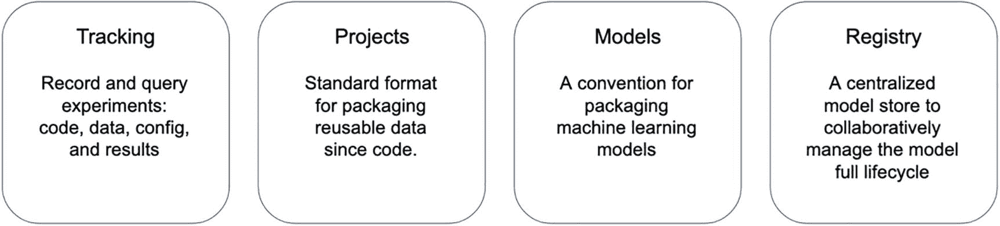

图 9-1

MLflow 组件

如上所述，机器学习开发是一项科学努力，需要运行许多实验，对输入进行各种小的调整，以达到最佳模型。跟踪组件是专门为这个目的设计的，它提供了跟踪实验输入、元数据和输出的工具。一旦收集了不同实验运行的数据，就可以很容易地进行比较、可视化和共享。

项目组件定义了一种标准格式，用于将机器学习代码打包为自包含的可执行单元，以促进机器学习模型在各种运行时平台(如本地笔记本电脑或云环境)上的再现性。轻松复制机器学习模型的能力增加了数据科学家之间的合作及其生产力。

模型组件定义了一种标准格式，用于打包机器学习模型，以便轻松部署到各种模型服务环境，例如本地机器或云提供商，如 Azure、GCP 或 AWS。

模型注册组件提供了存储机器学习模型的集中方式，以实现管理其生命周期和谱系的协作方式。一旦注册了机器学习模型，它就可以通过审计跟踪来帮助管理模型版本化和生产化。

MLflow 提供了多种语言的 API，如 Python、R、Java 和 Scala，命令行界面和 UI，供您与其每个组件进行交互。

### 工作中的 MLflow

本节将更详细地介绍每个组件，以便更好地理解其动机，并学习如何使用提供的 UI、命令行工具和 API 与它们进行交互。

运行以下示例的先决条件是 Python 3.x、scikit-learn 0.24.2 和 MLflow 1.18 或更高版本。假设您的计算机已经安装了 Python 3.x，您可以使用清单 [9-1](#PC1) 中列出的命令安装其余的。

```scala
pip install scikit-learn
pip install mlflow

mlflow --version   # to test the installation and version
# you should see the output similar to below
mlflow, version 1.18.0

Listing 9-1Installing MLflow and scikit-learn

```

#### 物流跟踪

MLflow 跟踪组件背后的动机是使数据科学家能够在模型开发阶段开发和优化他们的模型时跟踪所有需要和产生的工件。在此阶段，数据科学家通常需要运行许多实验，通过调整各种输入参数(如输入要素、算法和超参数)来优化模型性能。

传统上，数据科学家使用记事本、文档或电子表格来跟踪他们实验的细节。不幸的是，这种方法是手动的，容易出错，并且实验结果不容易共享、可视化以及与其他实验进行比较。

从概念上讲，每次模型训练代码运行时产生的跟踪信息被组织成一次*运行，*，您可以记录以下信息。

*   **参数**:您选择的键/值输入参数，其中值是一个字符串。参数的例子是超参数，如学习率、树的数量和正则化。

*   **指标**:键/值指标，其中值是数字。每个指标都可以在整个运行过程中更新。你可以想象它的全部历史。度量的例子包括准确性、RMSE 和 F1。

*   **工件**:输出任意格式的文件。伪像的例子是图像的准确性和特征的重要性。

*   **标签**:当前活动运行中的一个或多个键/值标签。

*   **元数据**:关于运行的一般信息，例如运行日期和时间、名称、源代码和代码版本。

您可以选择将多次运行组织到一个实验中，该实验通常是为特定的机器学习任务而设计的。MLflow Tracking 组件提供了记录运行的 API，它们有多种语言版本:Python、R、Java、Scala 和 REST APIs。跟踪服务器记录运行信息，这些信息可以在调用 API 的应用程序所在的本地机器上运行，也可以在远程机器上运行。实质上，物流跟踪是一个客户端-服务器应用程序，其架构如图 [9-2](#Fig2) 所示。


图 9-2

ml 流跟踪组件架构

出于学习或探索的目的，在本地运行 ML 跟踪服务器更容易。在您的团队希望集中跟踪和管理机器学习模型生命周期的团队环境中，在远程主机上配置和运行跟踪服务器更有意义。MLflow 提供了两种简单的方法来指定跟踪服务器的运行位置。第一种方法是用跟踪服务器的 URI 设置`MLFLOW_TRACKING_URI`环境变量。第二种方法是在应用程序中使用`mlflow.set_tracking_uri()`来指定这样的 URI。如果没有设置跟踪服务器 URI，无论您在哪里运行程序，跟踪 API 都会将运行信息记录在本地的一个`mlruns`目录中。

一旦运行信息在服务器中可用，您就可以通过提供的 MLflow 跟踪 UI、使用跟踪 API 或使用 Spark 来访问它，如图 [9-2](#Fig2) 的右侧所示。

运行信息可以分为两种类型:结构化数据和非结构化数据。工件，比如图像、模型或者数据文件，被认为是非结构化的，并存储在工件存储中。其余的运行信息被视为结构化数据，存储在后端存储中。工件存储可以是本地文件系统上的一个文件夹，也可以是云提供商的分布式存储，比如 AWS S3、Azure blob 存储或 Google 云存储。后端存储可以是本地文件系统上的一个文件夹，也可以是一个 SQL 存储，如 Postgres、MySQL 或 SQLite，如图 [9-3](#Fig3) 所示。

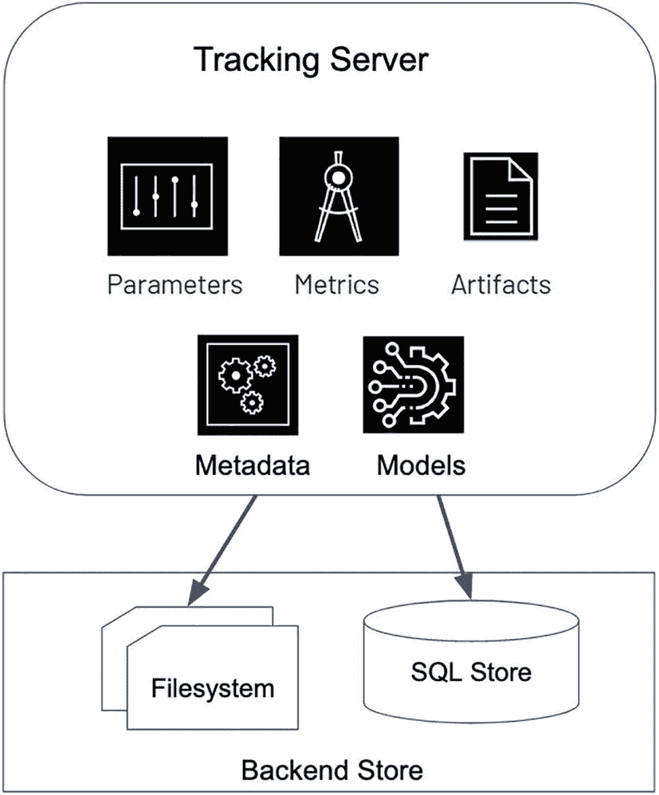

图 9-3

MLflow 跟踪服务器后端存储选项

在存储工件方面，MLflow 客户端 API 从跟踪服务器获得工件存储 URI。然后它负责将工件直接上传到工件存储。

对 MLflow 跟踪组件体系结构和运行信息的存储位置有了很好的理解后，下一部分将展示如何启动 MLflow 跟踪服务器的实例，使用跟踪 API 来跟踪运行，然后使用跟踪 UI 来可视化运行信息。

清单 [9-2](#PC2) 使用本地目录作为工件存储，使用本地 SQLite 文件作为后端存储。在启动 MLflow 服务器来管理运行信息和工件之前，您需要创建两个目录:一个用于数据库后端存储，另一个用于工件存储。清单 [9-2](#PC2) 显示了启动 MLflow 服务器的命令。

Note

为了使用模型注册功能，您必须使用数据库后端存储运行 MLflow 追踪服务器

```scala
mlflow server --backend-store-uri sqlite:////<directory>/backend-store/mlflow.db --default-artifact-root <directory>/artifact-store
# you should see the following in the console if the server was started successfully
[2021-07-24 08:17:55 -0700] [81975] [INFO] Starting gunicorn 20.0.4
[2021-07-24 08:17:55 -0700] [81975] [INFO] Listening at: http://127.0.0.1:5000 (81975)
[2021-07-24 08:17:55 -0700] [81975] [INFO] Using worker: sync
[2021-07-24 08:17:55 -0700] [81978] [INFO] Booting worker with pid: 81978
[2021-07-24 08:17:55 -0700] [81979] [INFO] Booting worker with pid: 81979
[2021-07-24 08:17:55 -0700] [81980] [INFO] Booting worker with pid: 81980
[2021-07-24 08:17:55 -0700] [81981] [INFO] Booting worker with pid: 81981

Listing 9-2Start MLflow Server with SQLlite Database Back End and Local Artifact Store

```

现在 MLflow 跟踪服务器已经启动并运行，将您的浏览器指向`http://localhost:500`以查看 MLflow UI。它看起来有点像图 [9-4](#Fig4) 。

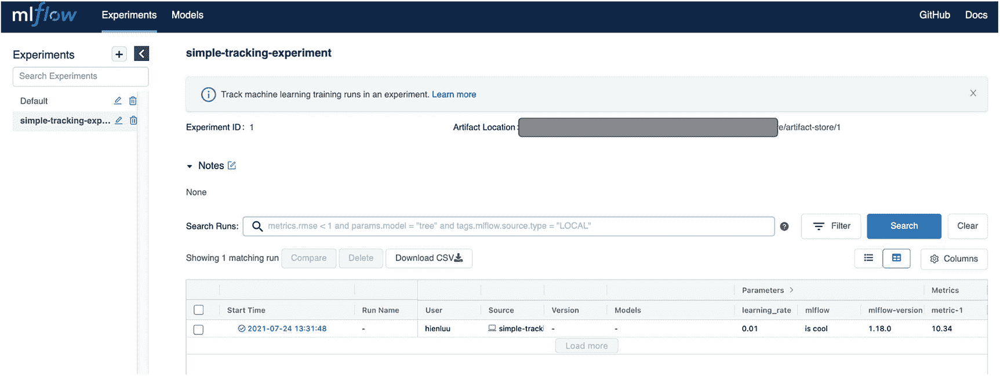

图 9-4

MLflow 用户界面

第一个示例演示了如何使用各种跟踪 API 来跟踪一次运行的不同信息。这个例子的源代码在`chapter9/simple-tracking.py`文件中。默认情况下，该示例将 MLflow 追踪 URI 设置为`http://localhost:5000`，因此在使用清单 [9-3](#PC3) 中的命令执行该 Python 脚本之前，请确保您的 MLflow 追踪服务器已经启动并正在运行。

```scala
python simple-tracking.py

# the output would looking something like below
starting a run with experiment_id 1
done logging artifact
Done tracking on run
experiment_id: 1
run_id: cb17324d40764a428b3d983e8ac4d1dd

Listing 9-3Executing simple-tracking.py

```

清单 [9-4](#PC4) 中显示的`simple-tracking.py`脚本是以一种安全的方式编写的，可以多次运行，每次它都在同一个实验`simple-tracking-experiment` *下创建一个新的运行。*如果运行五次，MLflow 跟踪用户界面将如图 [9-5](#Fig5) 所示，其中以表格形式显示了运行情况，包括每次运行的开始时间、记录运行信息的用户等信息。

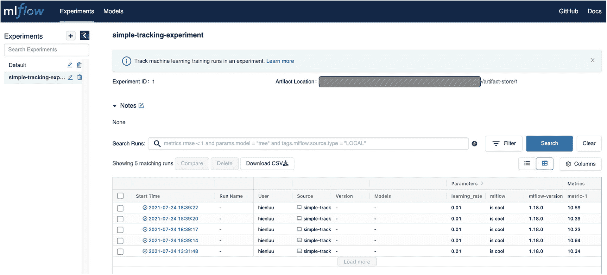

图 9-5

运行五次后的 MLflow 跟踪 UI

```scala
import os
import mlflow
import numpy as np
import matplotlib.pyplot as plt
from random import random, randint
from mlflow import log_metric, log_param, log_params, log_artifacts

if __name__ == "__main__":
      #mlflow.set_tracking_uri("http://localhost:5000")
      experiment_name = "simple-tracking-experiment"
      experiment = mlflow.get_experiment_by_name(experiment_name)
      experiment_id = experiment.experiment_id if experiment else None
      if experiment_id is None:
      print("INFO: '{}' does not exist. Creating a new experiment
                         experiment".format(experiment_name))
      experiment_id = mlflow.create_experiment(experiment_name)

      print("starting a run with experiment_id
                               {}".format(experiment_id))
      with mlflow.start_run(experiment_id=experiment_id) as run:
      # Log a parameter (key-value pair)
      log_param("mlflow", "is cool")
      log_param("mlflow-version", mlflow.version.VERSION)

      params = {"learning_rate": 0.01, "n_estimators": 10}
      log_params(params)

      # Log a metric; metrics can be updated throughout the run
      log_metric("metric-1", random())
      for x in range(1,11):
            log_metric("metric-1", random() + x)

      # Log an artifact (output file)
      if os.path.exists("images"):
            log_artifacts("images")
            print("done logging artifact")
      else:
            print("images directory does not exists")

      image = np.random.randint(0, 256, size=(100, 100, 3),
                              dtype=np.uint8)
      mlflow.log_image(image, "random-image.png")

      fig, ax = plt.subplots()
      ax.plot([0, 2], [2, 5])
      mlflow.log_figure(fig, "figure.png")

      experiment = mlflow.get_experiment(experiment_id)
      print("Done tracking on run")
      print("experiment_id: {}".format(experiment.experiment_id))
      print("run_id: {}".format(run.info.run_id))

Listing 9-4Content of simple-tracking.py

```

MLflow UI 中一个非常有用的特性是比较多次运行的指标。您只需通过点击这些运行的复选框来选择两个或多个运行，然后点击比较按钮来并排比较它们，如图 [9-6](#Fig6) 所示。


图 9-6

并排比较运行

让我们仔细看看`simple-tracking.py`脚本中发生了什么。它首先设置跟踪服务器的跟踪 URI。然后它决定是否创建一个名为简单跟踪实验的实验，如果它还不存在的话。接下来，它使用 MLflow，一个高级的 fluent API，使用 Python `with block`开始运行，并在`with`块结束时自动终止运行。`with`块包含记录参数、度量、工件、图像和数字的各种跟踪 API 的例子。我强烈建议您访问 MLflow API 文档网站，如 [`https://mlflow.org/docs/latest/python_api/index.html`](https://mlflow.org/docs/latest/python_api/index.html) ，了解各种 API 及其用法。

如果您注释掉设置跟踪 URI 的行并运行清单 [9-3](#PC3) 中的命令，MLflow 跟踪 API 会将运行信息记录在名为`mlruns.`的本地目录中。要查看该本地目录中的运行信息，请运行`mlflow ui`命令，然后将浏览器指向`http://localhost:5000`。

每次运行都属于一个特定的实验，因此当开始运行而没有指定实验 ID 时，MLflow 会在默认实验中创建它。

要查看每次运行的详细信息，只需单击运行开始时间的链接。你会看到类似图 [9-7](#Fig7) 的东西。

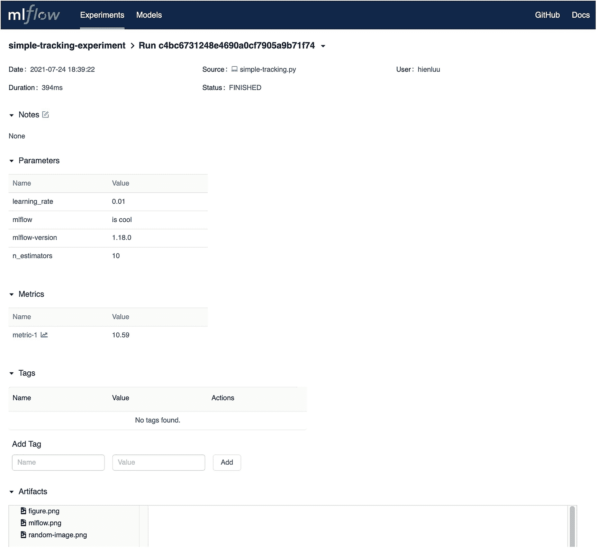

图 9-7

运行的详细信息

关于跑步的常规元数据显示在顶部，然后每种类型的跟踪信息显示在单独的部分。对于每个更新多次的指标，您可以通过单击指标名称的链接来查看每个指标的可视化效果。在图 [9-8](#Fig8) 中描绘了度量-1 的图表。

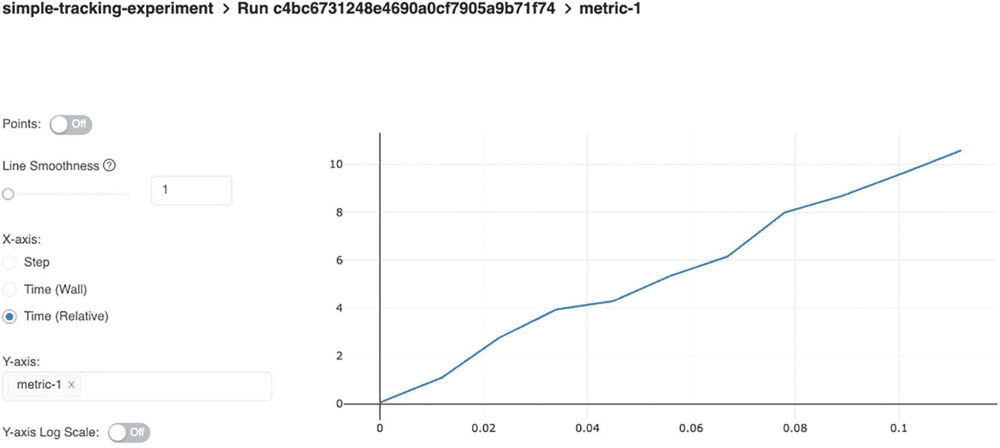

图 9-8

指标的可视化

将 MLflow 跟踪集成到 ML 模型训练脚本中的一种方法是启动跟踪运行，并记录在模型训练逻辑开始时使用的参数。然后，添加调用来记录模型评估度量、模型以及它之后的任何工件。清单 [9-5](#PC5) 就是一个例子。

```scala
with mlflow.start_run(experiment_id=experiment_id) as run:
     mlflow.log_param("MLflow version", mlflow.version.VERSION)

     params = {'n_estimators': n_estimators,
               'max_depth': max_depth,
               'min_samples_split': min_samples_split,
               'learning_rate': learning_rate, 'loss': 'ls'}
     mlflow.log_params(params)

     gbr = ensemble.GradientBoostingRegressor(**params)
     gbr.fit(X_train, y_train)

     y_pred = gbr.predict(X_test)
     # calculate error metrics
     mae = metrics.mean_absolute_error(y_test, y_pred)
     mse = metrics.mean_squared_error(y_test, y_pred)
     rsme = np.sqrt(mse)
     r2 = metrics.r2_score(y_test, y_pred)

     # Log model
     mlflow.sklearn.log_model(gbr, "GradientBoostingRegressor")

     # Log metrics
     mlflow.log_metric("mae", mae)
     mlflow.log_metric("mse", mse)
     mlflow.log_metric("rsme", rsme)
     mlflow.log_metric("r2", r2)

     experiment = mlflow.get_experiment(experiment_id)
     print("Done training model")
     print("experiment_id: {}".format(experiment.experiment_id))
     print("run_id: {}".format(run.info.run_id))

Listing 9-5Integrate MLflow Tracking into Model Training Logic

```

事实证明，在使用各种机器学习库(如 scikit-learn、TensorFlow、Spark 和 Keras)训练机器学习模型时，记录指标、参数和模型的需求是常见的。MLflow 跟踪组件通过提供一个名为`mlflow.autlog()`的 API 进一步简化了这个过程。在模型定型代码之前添加这一行代码会自动记录所有的公共信息，而不需要显式的 log 语句。清单 [9-6](#PC6) 就是一个例子。

```scala
# enable auto logging
mlflow.autolog()

# prepare training data
X = np.array([[1, 1], [1, 2], [2, 2], [2, 3]])
y = np.dot(X, np.array([1, 2])) + 3

# train a model
model = LinearRegression()
with mlflow.start_run() as run:
    model.fit(X, y)

Listing 9-6MLflow Automatic Logging

```

在写这本书的时候，对自动日志的支持还处于试验阶段。请查阅 [`https://mlflow.org/docs/latest/tracking.html#automatic-logging`](https://mlflow.org/docs/latest/tracking.html%2523automatic-logging) 上的文档，了解每个受支持库的最新信息。

#### MLflow 项目

MLflow 项目组件将项目打包格式标准化为可在多种平台上重用和再现。

围绕机器学习库的几项创新训练了模型，如 TensorFlow、PyTorch、Spark MLlib 和 XGBoost。数据科学家倾向于支持能够帮助他们为其业务用例生成优化的机器学习模型的库。如今，数据科学家可以使用大量的计算资源来训练小到大的机器学习模型，如本地机器、Docker、云等等。

项目组件组织和定义机器学习项目，以在可执行单元中捕获代码、配置、依赖性和数据。因此，数据科学家可以轻松地在他们的项目中使用任何机器学习库，并在任何计算平台上运行他们的项目(见图 [9-9](#Fig9) )。


图 9-9

MLFlow 项目详细信息

每个 MLflow 项目只是一个文件目录或一个 Git 存储库。虽然它是可选的，但是强烈建议您的项目包含一个名为 MLproject 的文件，该文件指定了控制项目执行的环境、参数和入口点。一个项目支持以下类型的环境，每一种环境都需要自己的定义方式。

*   **Conda** :使用 Conda 包管理系统，可以支持 Python 包和原生库，在

*   Docker :使用一个 Docker 容器环境，它可以支持几乎任何类型的依赖项来执行您的 MLflow 项目

*   **系统**:执行 MLflow 项目的当前系统环境

有关 MLflow 中各种支持环境的更多信息，请参考位于 [`https://mlflow.org/docs/latest/projects.html#specifying-projects`](https://mlflow.org/docs/latest/projects.html%2523specifying-projects) 的 MLflow 项目文档。

除了 MLproject 文件之外，MLflow 项目通常还包括一个定义环境的文件和另一个包含模型定型逻辑的文件。清单 [9-7](#PC7) 显示了使用 Conda 环境的 MLflow 项目中的一个示例 MLproject 文件和`conda.yml`文件的内容。在 MLproject 中设置如清单 [9-7](#PC7) 所示的参数是一个很好的做法，这样就可以很容易地从命令行覆盖它们，这样数据科学家就可以很容易地在他们的模型优化过程中尝试不同的值。

```scala
# MLproject file
name: boston-housing-price

conda_env: conda.yaml

entry_points:
  main:
     parameters:
       run_name: {type: str, default: "run_name"}
       n_estimators: {type: int, default: 100}
       max_depth: {type: int, default: 4}
       min_samples_split: {type: int, default: 2}
       learning_rate: {type: float, default: 0.01}
     command: |
       python train.py \
         --n_estimators={n_estimators} \
         --max_depth={max_depth} \
         --min_samples_split={min_samples_split} \
         --learning_rate={learning_rate}

# conda.yaml
channels:
- conda-forge
dependencies:
- python=3.7.6
- pip
- pip:
  - mlflow
  - scikit-learn==0.24.2
  - cloudpickle==1.6.0

Listing 9-7An Example of MLproject File with Conda Environment

```

既然您已经知道了如何构建一个 MLflow 项目，接下来的部分就是学习如何运行它们。MLflow 项目组件提供了两种以编程方式运行项目的方法:`mlflow run`命令行工具和`mlflow.projects.run()` API。这两种方法采用相似的参数，工作方式也相似。清单 [9-8](#PC8) 使用命令行工具运行一个 MLflow 项目。您可以通过发出`mlflow run --help`命令来显示它的用法。

第一个也是最重要的参数是项目 URI，它要么是本地文件系统上的一个目录，要么是 Git 存储库路径。清单 [9-8](#PC8) 包含了运行存在于本地目录中的 MLflow 项目的几个例子。

```scala
# run the boston-housing-price MLflow project with creating a
# new conda environment and using default parameter values and
# add run under the boston-housing-price experiment.

mlflow run <chapter9>/boston-housing-price --experiment-name=boston-housing-price

# similar to the one above, except without creating a
# new conda environment

mlflow run <chapter9>/boston-housing-price --no-conda --experiment-name=boston-housing-price

# to overwrite one or more parameter value, specify them using -P # format
mlflow run <chapter9>/boston-housing-price --no-conda -P learning_rate=0.06 --experiment-name=boston-housing-price

Listing 9-8Run MLflow Project from Local Directory

```

当运行使用 Conda 环境的 MLflow 项目时，MLflow 首先创建一个新的 Conda 环境，然后下载在`conda.yaml`文件中指定的所有依赖项，因此完成所有步骤可能需要一段时间。这在尝试从其他人的 MLflow 项目中复制模型或验证 MLflow 项目的可重复性时非常有用。指定`--no-coda`命令参数可以跳过 Conda 创建步骤，从而加快项目构建过程。这是非常有用的，当你把你的 ml 项目。

为了适应各种应用程序开发基础设施，MLflow 项目支持其他环境，如 Docker 和 Kubernetes。它们提供了更多的灵活性，但是设置起来有点复杂。

#### ml 流程模型

MLflow 模型组件背后的动机是通过标准化 ML 模型打包格式来促进模型互操作性，以便可以使用任何流行的机器学习库来开发它们，并将其部署到一组不同的执行环境，如图 [9-10](#Fig10) 所示。例如，您可以在 PyTorch 中开发一个模型，在您的本地 Docker、Spark 或某个云提供商 ML 平台上部署它并执行推理。MLflow Models 使用的解决方案是通过定义一个统一的模型抽象来捕捉模型的味道。


图 9-10

MLflow 模型抽象

口味是使 MLflow 模型组件通用和有用的关键概念。本质上，风味是一种约定，部署工具可以通过它来理解模型；因此，有可能开发出与使用任何 ML 库训练的模型一起工作的工具，而无需将每个工具与每个特定的库集成。MLflow 定义了几种受支持的风格，所有内置部署工具都支持这些风格。

与 MLflow 项目类似，MLflow 模型是包含一组文件的目录。其中有一个名为 MLmodel 的文件，它包含一些关于模型的元数据，并定义了可以查看模型的风格。如果您的模型训练脚本使用 API `log_model`来记录模型或者使用 API `save_model`来保存模型，那么会自动创建一个模型目录，其中包含所有适当的文件，这些文件包含有关环境和依赖项的信息，以便加载和服务它。图 [9-10](#Fig10) 显示了波士顿房价项目中 MLflow 模型目录及其内容的示例。导航到 boston-housing-price experiment 下的一个运行，然后向下滚动到 artifacts 部分。你会看到类似图 [9-11](#Fig11) 的东西。

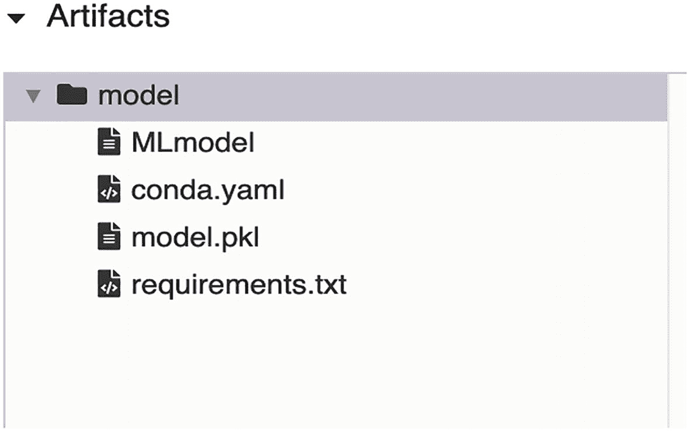

图 9-11

MLFlow 模型目录及其内容

MLmodel 文件捕获模型的一些元数据，比如它是何时创建和运行的。更重要的是，它还包含模型签名和风味。清单 [9-9](#PC9) 显示了`chapter9/airbnb-price/train.py`中的`mlflow.autoLog` API 生成的 MLmodel 文件的内容。

```scala
artifact_path: model
flavors:
  python_function:
      env: conda.yaml
      loader_module: mlflow.sklearn
      model_path: model.pkl
      python_version: 3.7.6
  sklearn:
      pickled_model: model.pkl
      serialization_format: cloudpickle
      sklearn_version: 0.24.2
run_id: fc9bf6efeff74752812debc131b6c369
signature:
  inputs: '[{"name": "bedrooms", "type": "double"},
            {"name": "beds", "type": "double"},
             {"name": "bathrooms", "type": "double"}]'
  outputs: '[{"type": "tensor",
              "tensor-spec": {"dtype": "float64",
              "shape": [-1]}}]'
utc_time_created: '2021-07-28 20:14:17.612140'

Listing 9-9Content of MLmodel

```

模型签名定义了模型输入和输出的模式。模型输入模式指定了执行模型推理所需的特性。下一节将给出一个指定特性的例子。

清单 [9-9](#PC9) 展示了两种风格:python_function 和 sklearn。python_function 风格定义了一种通用的自包含文件系统模型格式，专门用于 python 模型。这使得 MLflow 提供的模型部署和服务工具能够与任何 Python 模型一起工作，而不管哪个 ML 库训练了该模型。因此，任何 Python 模型都可以在各种运行时环境中轻松生产。

`conday.yaml`和`requirements.txt`分别捕获依赖项和环境信息，因此在部署时可以很容易地创建类似的环境。

MLflow 内置的模型持久性实用程序负责为各种流行的 ML 库打包模型，如 PyTorch、TensorFlow、scikit-learn、LightGBM 和 XGBoost。如果您的模型需要特殊处理，MLflow 支持持久化和加载定制模型格式。

除了提供一组 API 来管理模型生命周期之外，MLflow 的模型组件还提供了命令行工具来部署、加载和服务模型。

为了演示命令行工具的用法，下一节将使用`airbnb-price` MLflow 项目，这是一个简单的 MLflow 项目，使用 scikit-learn 随机森林算法来预测 Airbnb 房源的价格。为了简单起见，它只使用三个特性:卧室的数量、床的数量和浴室的数量。这个项目位于`chapter9/airbnb-price`文件夹中，train.py 训练脚本使用`mlflow.autoLog` API 来自动记录参数、度量和模型。为了训练模型，您可以发出清单 [9-10](#PC10) 中列出的命令之一。此示例假设 MLflow 已经启动，并且正在本地计算机的端口 5000 上运行。

```scala
# make sure to set the MLFLOW tracking server URI first
export MLFLOW_TRACKING_URI=http://localhost:5000

# run airbnb-price project
# with the default 100 estimators and max depth of 4
mlflow run ./airbnb-price --no-conda  --experiment-name=airbnb-price
# with the 300 estimators and max depth of 9
mlflow run ./airbnb-price --no-conda  --experiment-name=airbnb-price -P n_estimators=300 -P max_depth=9

Listing 9-10Run airbnb-price MLflow Project

```

接下来，导航到 MLflow Tracking UI 中的`airbnb-price`实验下记录的最新运行，并在工件部分下的 MLmodel 文件中找到`run_id`。接下来，通过在本地机器上启动一个 web 服务器，使用`mlflow serve`命令行工具来服务与所提供的运行 id 相关联的模型。清单 [9-11](#PC11) 中的`mlflow serve c`命令启动一个使用端口 7000 运行的 web 服务器，并指示 MLflow 使用 python_function 风格。

```scala
# replace run id with the real run id
# the command below will launch the webserver that
# listens on port 7000.

mlflow models serve --model-uri runs:/<run id>/model -p 7000 --no-conda

# the output of the above command looks something like below
2021/07/28 19:50:25 INFO mlflow.models.cli: Selected backend for flavor 'python_function'
2021/07/28 19:50:25 INFO mlflow.pyfunc.backend: === Running command 'gunicorn --timeout=60 -b 127.0.0.1:7000 -w 1 ${GUNICORN_CMD_ARGS} -- mlflow.pyfunc.scoring_server.wsgi:app'
[2021-07-28 19:50:26 -0700] [36709] [INFO] Starting gunicorn 20.0.4
[2021-07-28 19:50:26 -0700] [36709] [INFO] Listening at: http://127.0.0.1:7000 (36709)
[2021-07-28 19:50:26 -0700] [36709] [INFO] Using worker: sync
[2021-07-28 19:50:26 -0700] [36712] [INFO] Booting worker with pid: 36712
[2021-07-28 19:54:24 -0700] [36709] [INFO] Handling signal: winch

Listing 9-11Launch Webserver to Perform Model Inference

```

为了使用`airbnb-price`随机森林模型执行推理，您使用`curl`命令行工具向`invocations` REST 端点发送 HTTP 请求。列表 [9-12](#PC12) 包含一些预测 Airbnb 列表价格的示例。

```scala
# single prediction
curl http://127.0.0.1:7000/invocations -H 'Content-Type: application/json' -d '{"columns": ["bedrooms","beds","bathrooms"], "data": [[1,1,1]]}'
# multiple predictions
curl http://127.0.0.1:7000/invocations -H 'Content-Type: application/json' -d '{"columns": ["bedrooms","beds","bathrooms"], "data": [[1,1,1], [2,2,1], [2,2,2], [3,2,2]]}'

# The HTTP request response contains a single value, which is the predicted price of an Airbnb listing with the specified features.

Listing 9-12Perform Model Inferencing Using HTTP Requests

```

您还可以使用`mlflow.model`模块中预测的 API 以编程方式执行模型推断。

MLflow 模型组件提供了许多其他功能。更多信息在 [`www.mlflow.org/docs/latest/models.html`](http://www.mlflow.org/docs/latest/models.html) 。

#### MLflow 模型注册表

MLflow Registry 组件背后的动机是提供管理 MLflow 模型的完整生命周期的方法，如图 [9-12](#Fig12) 所示。该生命周期包括关于 MLflow 实验和生成模型的运行的沿袭信息、模型注册和版本控制，以及在部署过程中使用审计跟踪和注释将模型从一个阶段转换到另一个阶段的工作流。该组件是最新的，是在 MLflow 1.7 中引入的。

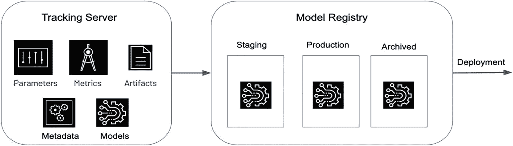

图 9-12

MLflow 模型生命周期

Note

要使用模型注册表功能，必须使用数据库后端存储运行 MLflow tracking 服务器。

与其他 MLflow 组件一样，这个组件也提供了 UI、API 和命令行工具供您进行交互。下一节提供了管理从实验`airbnb-price`中的一次运行中产生的模型生命周期的例子。

MLflow 模型生命周期的第一步是模型注册。在将 MLflow 模型添加到模型注册表之前，您必须使用`log_model` API 或通过`autolog` API 登录。每个注册的模型可以有一个或多个版本。这种模型名称和版本组合使得在完全投入生产之前执行推断和跟踪 A/B 测试变得容易。当模型在模型注册中心注册时，必须提供一个名称。如果模型名称还不存在，那么从版本 1 开始添加。否则，将自动创建新的模型版本。

要从用户界面注册某次运行产生的模型，您首先导航到该运行的详细页面，向下滚动到工件部分，选择顶层文件夹，并单击注册模型按钮(参见图 [9-13](#Fig13) )。

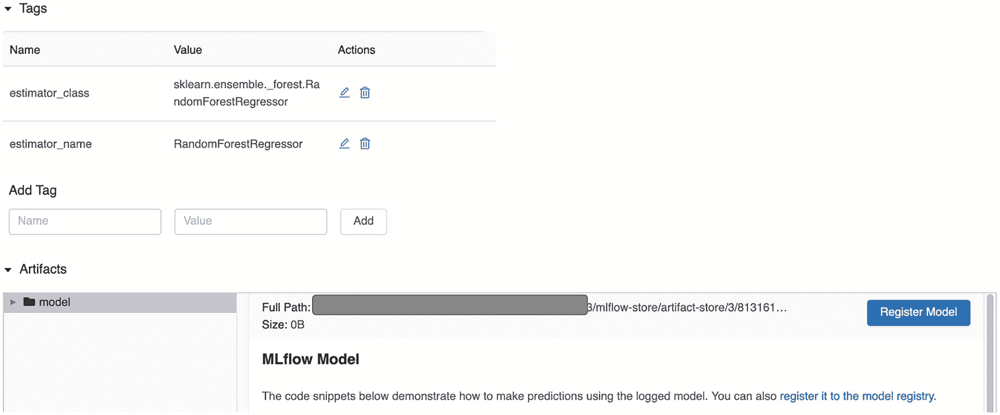

图 9-13

模型注册

弹出注册型号对话框，输入型号名称，如图 [9-14](#Fig14) 所示。如果型号名称已经存在，您会看到一个下拉列表供您选择。

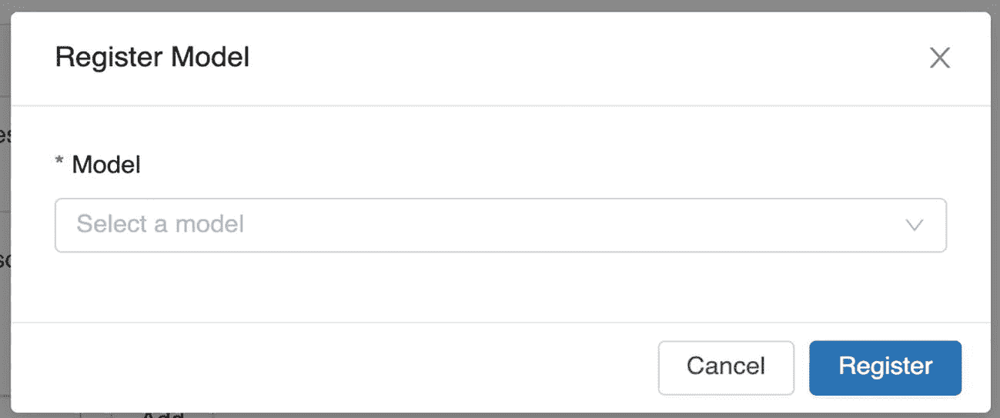

图 9-14

注册模型对话框

要在模型注册完成后查看注册的模型，请通过单击 MLflow UI 顶部的模型链接导航到注册的模型页面以查看所有注册的模型。你会看到类似图 [9-15](#Fig15) 的东西。


图 9-15

注册型号列表页面

每个模型都有一个概述页面，显示各种活动的模型版本。要查看 Airbnb SF-A 模型的概述页面，请点按模型名称。你会看到类似图 [9-16](#Fig16) 的东西。

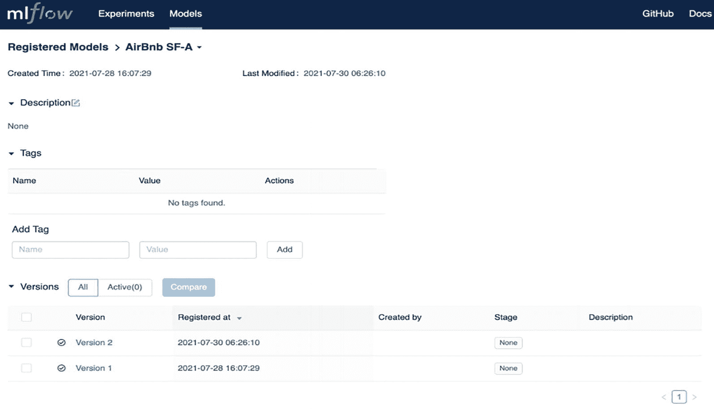

图 9-16

注册模型详细信息页面

注册型号的内置阶段为*暂存*、*生产*和*存档*。通过导航至模型版本页面并点击阶段下拉菜单，您可以将模型和版本转换至特定阶段(参见图 [9-17](#Fig17) )。当前模型阶段向您展示了特定模型版本可以转换到的可能阶段。选择一个阶段后，显示阶段转换确认对话框进行确认，如图 [9-18](#Fig18) 所示。


图 9-18

模型阶段转换


图 9-17

过渡模型版本

如果一个注册的模型有多个版本，并且处于不同的阶段，那么 model overview 页面会给你一个很好的鸟瞰图。图 [9-19](#Fig19) 中描述了一个例子。


图 9-19

模型版本阶段的鸟瞰图

前面的示例使用 MLflow Model Registry UI 来管理模型的生命周期，从注册到将它们转换到各个阶段。您可以通过使用提供的 API 以编程方式执行相同的任务。表 [9-1](#Tab1) 中列出的 API 使得模型管理生命周期与 CI/CD 系统的集成变得容易。例如，如果 CI/CD 管道以规则的节奏连续训练模型，并且如果模型性能通过了预定的标准，则 CI/CD 管道可以容易地过渡到下一个适当的阶段，以供数据科学家分析和确定下一步。

表 9-1

与模型注册交互的 API

<colgroup><col class="tcol1 align-left"> <col class="tcol2 align-left"></colgroup> 
| 

名字

 | 

描述

 |
| --- | --- |
| mlflow.register_model | 使用运行 URI 和模型名称将模型添加到注册表中。如果提供的模型名称不存在，则创建版本 1；否则，将创建一个新版本。 |
| mlflow client . create _ registered _ model | 用提供的模型名称注册一个全新的空模型。如果这样的名称已经存在，则会引发异常。 |
| mlflow client . create _ model _ version | 使用提供的名称、源和 run_id 创建模型的新版本。 |
| mlflow。<model flavor="">。负载模型</model> | 使用模型 URI 从模型注册表中获取注册的模型。例如，“型号:/{型号名称}/{型号版本}” |
| mlflow client . update _ model _ version | 使用提供的模型名称、版本和新描述更新特定版本的模型描述。 |
| mlflowclient . rename _ registered _ model | 重命名现有的注册型号名称。 |
| mlflow client . transition _ model _ version _ stage | 将注册的模型转换到以下阶段之一:登台、生产或归档 |
| mlflow client . list _ registered _ models | 获取注册表中所有注册的模型。 |
| mlflow client . search _ model _ versions | 使用注册的型号名称搜索型号版本列表。 |
| mlflow client . delete _ model _ version | 删除注册型号名称的特定版本。 |
| mlflowclient . delete _ registered _ model _ version | 删除已注册的模型及其所有版本。 |

有关模型注册 API 的完整列表，请阅读位于 [`https://mlflow.org/docs/latest/model-registry.html#api-workflow`](https://mlflow.org/docs/latest/model-registry.html%2523api-workflow) 的 MLflow 模型注册 API 工作流文档。

## 模型部署和预测

模型部署策略在很大程度上取决于模型预测需求，而这两者往往是相辅相成的。当涉及到模型预测时，不同的机器学习用例具有不同的需求和要求。一些标准要求包括延迟、吞吐量和成本。直到最近，模型部署主题通常被机器学习研究论文忽略。

将机器学习应用于业务用例时，了解不同的部署选项以及何时使用它们非常重要。本节描述了两种常见的模型部署策略和模型预测场景，以及 Spark 的适用范围。

两种常见的模型预测方案是联机预测和脱机预测。表 [9-2](#Tab2) 根据标准要求比较了这两种情况。

表 9-2

在线预测与离线预测

<colgroup><col class="tcol1 align-left"> <col class="tcol2 align-left"> <col class="tcol3 align-left"> <col class="tcol4 align-left"></colgroup> 
| 

方案

 | 

潜伏

 | 

生产能力

 | 

费用

 |
| --- | --- | --- | --- |
| 在线的 | 毫秒 | 低的 | 变化 |
| 脱机的 | 几秒到几天 | 高的 | 变化 |

当机器学习模型预测是执行特定用户活动的在线系统的一部分时，使用在线预测场景，这通常意味着它需要很快。因此，延迟需要以毫秒为单位。在线预测的例子有在线广告、欺诈检测、搜索和推荐等等。在线预测的部署策略包括构建和管理支持 REST 或 gRPC 协议的预测服务，以并发执行模型预测并支持高请求率。响应延迟必须很低，只有几十毫秒。换句话说，预测服务必须是可伸缩的和可靠的。预测服务通常是一种无状态服务，位于负载平衡器之后，运行在一个机器集群或 Kubernetes 节点上。与在线预测相关的成本是延迟要求和预测请求速率的规模的函数。

Spark MLlib 组件提供的模型预测无法满足低延迟要求。因此，您要么使用 PyTorch、TensorFlow 和 XGBoost 等机器学习库来训练您的机器学习模型，要么使用 ONNX ( [`http://onnx.ai`](http://onnx.ai) )中的工具在 Spark 之外导出您的 MLlib 训练模型。

当需要以一定的节奏大批量执行模型预测时，离线预测场景非常有用。它不是在线用户流的一个组成部分。离线预测的例子是为每个用户生成的电影推荐、用户流失倾向预测、市场需求预测和客户细分分析。这些离线预测通常被写出到持久分布式存储或低延迟分布式数据库，以便下游系统访问预测或为在线用户流量提供服务。就复杂性和成本而言，这是最简单和最便宜的部署策略，因为离线预测是使用批处理作业进行的，并且由于开销较低，成本相对较低。只有当这些作业正在运行时，才会发生这种情况。

Spark 是这种情况下的最佳选择，因为它具有可扩展的分布式计算框架、用于模型训练和评估的良好集成的 MLlib 组件，以及用于模型生命周期管理和批处理作业的 MLflow 模型注册组件之间的轻松集成。离线预测的一个重要考虑因素是生成预测的频率。答案取决于预测新鲜度对你的机器学习用例有多重要。对于电影推荐用例，可能越接近实时越好，但是频率以小时为单位可能就足够了。离线预测可以为这个用例做的一个小的优化是跳过为过去几个月不活跃的用户生成推荐。

## 摘要

*   MLOps 为生产机器学习应用程序带来了最佳实践和工程思维，因此世界各地的企业都可以获得机器学习给业务用例带来的好处。

*   MLflow 是一个管理机器学习生命周期的开源平台。它提供了四个组件来帮助机器学习开发过程中的步骤
    *   跟踪组件使数据科学家能够在模型开发阶段开发和优化他们的模型时跟踪所有需要和产生的工件。

    *   项目组件将机器学习项目的打包格式标准化，以便在多个平台上可重用和可复制。

    *   模型组件将使用任何流行的机器学习库开发的机器学习模型的打包格式标准化，并被部署到一组不同的执行环境。

    *   Model Registry 组件提供了一种管理模型生命周期和沿袭的机制，它使用一个中央存储库来托管已注册的模型，使用一个工作流在模型的生命周期中转换模型，并使用 UI 和 API 与已注册的模型进行交互。

*   模型部署和预测齐头并进。两种常见的模型预测场景是在线和离线，每一种都适用于不同的用例集。