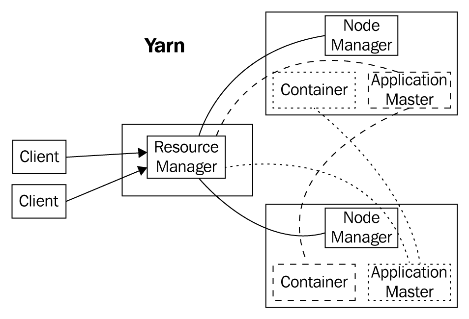
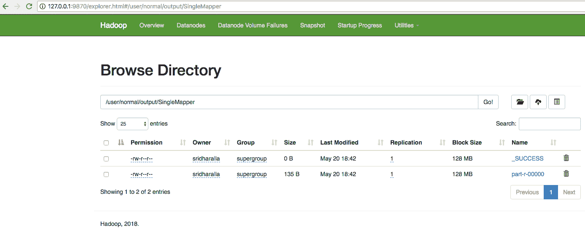
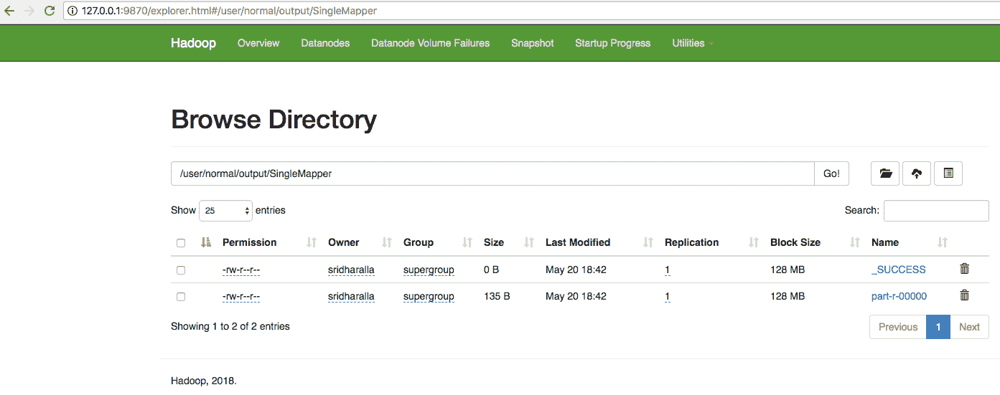
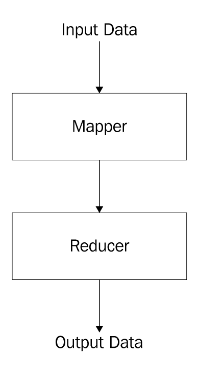
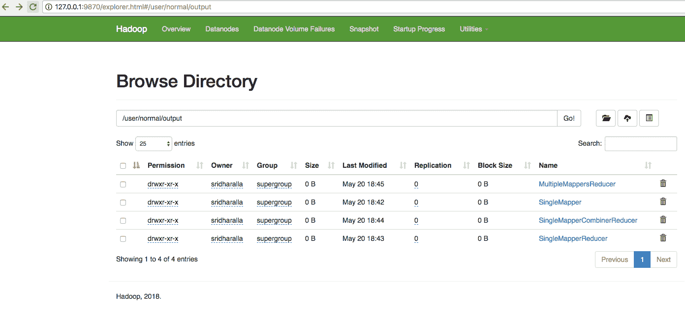
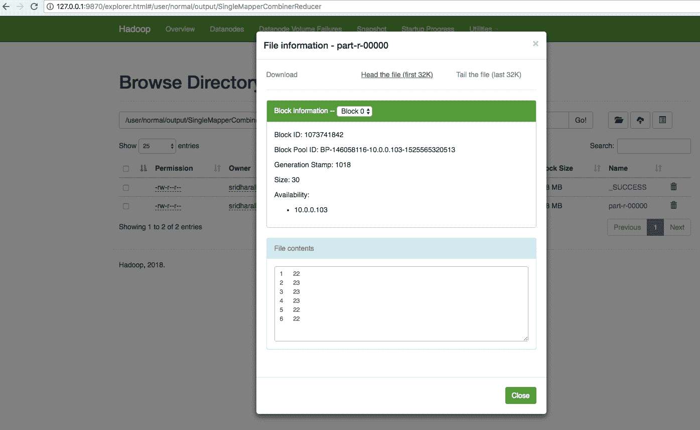
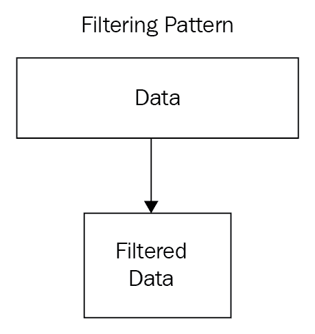
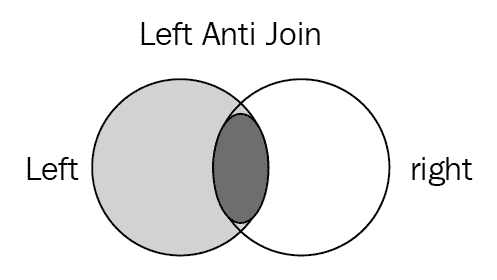
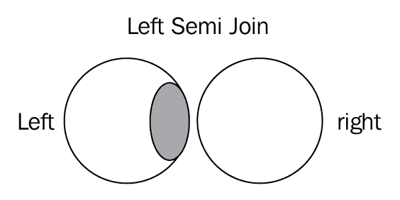

# 三、MapReduce 大数据处理

这一章将把我们在书中学到的一切都放入一个实际的用例中，构建一个端到端的管道来执行大数据分析。

简而言之，本章将涵盖以下主题:

*   MapReduce 框架
*   MapReduce 作业类型:
    *   单一映射程序作业
    *   单映射器缩减器作业
    *   多个映射器减速器作业
*   MapReduce 模式:
    *   聚合模式
    *   过滤模式
    *   连接模式

# MapReduce 框架

MapReduce 是一个用于在 Hadoop 集群中计算大量数据的框架。MapReduce 使用 Yarn 来调度映射器和 Reduce 作为任务，使用容器。MapReduce 框架使您能够编写分布式应用，以可靠和容错的方式处理文件系统中的大量数据，例如 **Hadoop 分布式文件系统** ( **HDFS** )。当您想要使用 MapReduce 框架来处理数据时，它通过创建作业来工作，然后在框架上运行作业来执行所需的任务。MapReduce 作业通常通过将输入数据拆分到工作节点，以并行方式运行映射器任务来工作。

此时，发生的任何故障，无论是 HDFS 级别的故障还是映射器任务的故障，都会被自动处理，以实现容错。一旦映射器完成，结果将通过网络复制到运行减速器任务的其他机器上。

下图显示了使用 MapReduce 作业统计单词频率的示例:


MapReduce 使用 Yarn 作为资源管理器，如下图所示:



MapReduce 这个术语实际上是指 Hadoop 程序执行的两个独立且不同的任务。第一个是 map 作业，它获取一组数据，并将其转换为另一组数据，其中各个元素被分解为元组(键/值对)。

reduce 作业将来自地图的输出作为输入，并将这些数据元组组合成更小的元组集。正如名称 MapReduce 的序列所暗示的，Reduce 作业总是在 map 作业之后执行。

MapReduce 作业的输入是分布在 HDFS 的数据存储中的一组文件。在 Hadoop 中，这些文件是用输入格式分割的，输入格式定义了如何将文件分割成输入分割。输入拆分是一个面向字节的文件块视图，由映射任务加载。Hadoop 中的每个映射任务都分为以下几个阶段:记录读取器、映射器、组合器和分割器。地图任务的输出，称为**中间键和值**，被发送到减速器。缩减任务分为以下几个阶段:洗牌、排序、缩减和输出格式。运行地图任务的节点最好位于数据所在的节点上。这样，数据通常不必在网络上移动，并且可以在本地计算机上计算。

在本章中，我们将研究不同的用例，以及如何使用 MapReduce 作业来产生所需的输出；为此，我们将使用一个简单的数据集。

# 资料组

第一个数据集是包含城市`ID`和`City`名称的城市表:

```scala
Id,City
1,Boston
2,New York
3,Chicago
4,Philadelphia
5,San Francisco
7,Las Vegas
```

该文件`cities.csv`可以下载，一旦下载，您可以通过运行命令将其移动到`hdfs`中，如以下代码所示:

```scala
hdfs dfs -copyFromLocal cities.csv /user/normal
```

第二个数据集是一个城市的每日温度测量数据，它包含测量的`Date`、城市`ID`和特定城市特定日期的`Temperature`:

```scala
Date,Id,Temperature
2018-01-01,1,21
2018-01-01,2,22
2018-01-01,3,23
2018-01-01,4,24
2018-01-01,5,25
2018-01-01,6,22
2018-01-02,1,23
2018-01-02,2,24
2018-01-02,3,25
```

该文件`temperatures.csv`可以下载，一旦下载，您可以通过运行命令将其移动到`hdfs`中，如以下代码所示:

```scala
hdfs dfs -copyFromLocal temperatures.csv /user/normal
```

以下是 MapReduce 程序的编程组件:


# 记录阅读器

输入阅读器将输入分成适当大小的分割(实际上，通常为 64 MB 到 128 MB)，框架为每个映射函数分配一个分割。输入读取器从稳定存储(通常是分布式文件系统)中读取数据，并生成键/值对。

A common example will read a directory full of text files and return each line as a record.

记录读取器将输入格式生成的输入拆分转换为记录。记录读取器的目的是将数据解析成记录，而不是解析记录本身。它以键/值对的形式将数据传递给映射器。通常，上下文中的关键字是位置信息，值是组成记录的数据块。定制记录阅读器不在本书的讨论范围之内。我们通常假设您有一个合适的数据记录阅读器。LineRecordReader 是`TextInputFormat`提供的默认 RecordReader，它将输入文件的每一行都视为新值；相关的关键字是字节偏移量。LineRecordReader 总是跳过拆分中的第一行(或其一部分)，如果它不是第一个拆分的话。它在末尾的分割边界后读取一行(如果数据可用，那么它不是最后一次分割)。

# 地图

`map`函数取一系列键/值对，分别处理，生成零个或多个输出键/值对。地图的输入和输出类型可以(通常)互不相同。

如果应用正在进行字数统计，`map`功能会将该行分解成单词，并为每个单词输出一个键/值对。每个输出对将包含作为关键字的单词和作为值的行中该单词的实例数。

在映射器中，对来自记录读取器的每个键/值对执行代码，以产生零个或多个新的键/值对，称为映射器的**中间输出(也由键/值对组成)。决定每条记录的键和值与 MapReduce 作业完成的任务直接相关。关键是数据将被分组在什么上，而值是数据的一部分，将在减速器中使用，以生成必要的输出。模式中讨论的关键项目之一是不同类型的用例如何决定特定的键/值逻辑。事实上，这个逻辑的语义是 MapReduce 设计模式之间的一个关键区别。**

# 组合器

如果每个映射器的每个输出都直接发送到每个缩减器，这将消耗大量的资源和时间。组合器是可选的本地化缩减器，可以在映射阶段对数据进行分组。它从映射器中获取中间键，并应用用户提供的方法在该映射器的小范围内聚合值。例如，因为聚合的计数是每个部分的计数之和，所以您可以生成一个中间计数，然后对这些中间计数求和以获得最终结果。在许多情况下，这大大减少了必须通过网络传输的数据量。例如，如果我们查看城市和温度的数据集，发送(波士顿，66)比通过网络发送(波士顿，20)、(波士顿，25)、(波士顿，21)需要更少的字节。组合器通常能带来显著的性能提升，而且没有任何负面影响。

我们将指出哪些模式受益于使用组合器，哪些模式不能使用组合器。组合器不能保证执行，因此它不能成为整个算法的一部分。

# 瓜分者ˌ分割者

分割器从映射器(或者组合器，如果正在使用的话)获取中间键/值对，并将它们分割成碎片，每个缩减器一个碎片。

应用的`partition`功能将每个`map`功能输出分配给特定的减速器，以便进行分割。`partition`功能，给定键和减压器数量，返回所需减压器的索引。

一个典型的缺省值是散列密钥，并使用`hash`值对减数器的数量进行模块计算:

```scala
partitionId = hash(key) % R, where R is number of Reducers
```

重要的是选择一个`partition`函数，该函数为每个分片提供近似均匀的数据分布，以实现负载平衡；否则，MapReduce 操作可能会被延迟，等待慢速的 Reduce 完成(也就是说，reduce 会分配更大份额的倾斜数据)。

在映射和缩减阶段之间，数据被混洗(并行排序，然后在节点之间交换)，以便将数据从产生它们的映射节点移动到将在其中进行缩减的分片。根据网络带宽、中央处理器速度、产生的数据以及映射和减少计算所需的时间，混洗有时会比计算时间长。

默认情况下，分区器计算每个对象的哈希代码，通常是 md5 校验和。然后，它将键空间随机均匀地分布在缩减器上，但仍然确保不同映射器中具有相同值的键最终位于相同的缩减器上。可以通过排序等操作自定义分区器的默认行为。对于每个映射任务，分区数据被写入本地文件系统，并等待由相应的缩减器提取。

# 洗牌和排序

一旦映射器完成了输入数据处理(本质上，拆分数据并生成键/值对)，输出就必须分布在集群中，以启动缩减任务。因此，缩减任务从洗牌和排序步骤开始，获取所有映射器和后续分区器写入的输出文件，并将它们下载到运行缩减任务的本地计算机。然后，这些单独的数据片段按键分类到一个更大的键/值对列表中。这种排序的目的是将等价的键组合在一起，这样它们的值就可以在 reduce 任务中轻松迭代。该框架自动处理一切，自定义代码能够控制键的排序和分组方式。

# 减少

减速器以分组数据为输入，每个按键分组运行一次`reduce`功能。该函数被传递给键和与该键相关联的所有值的迭代器。正如我们将在许多模式中看到的，在这个函数中可以发生广泛的处理。数据可以通过多种方式进行聚合、过滤和组合。一旦完成`reduce`功能，它会将零个或多个键/值对发送到最后一步，即输出格式。与`map`功能一样，`reduce`功能将因工作而异，因为它是解决方案中的核心逻辑。减速器可以有很多定制，包括将输出写入 HDFS，输出到弹性搜索索引，输出到关系数据库管理系统或 NoSQL，如卡珊德拉、HBase 等。

# 输出格式

输出格式翻译来自`reduce`函数的最终键/值对，并由记录写入器将其写入文件。默认情况下，它会用制表符分隔键和值，并用换行符分隔记录。这通常可以定制，以提供更丰富的输出格式，但最终，无论格式如何，数据都会被写入 HDFS。默认情况下，不仅支持写入 HDFS，还支持输出到弹性搜索索引、输出到关系数据库管理系统或 NoSQL，如卡珊德拉、糖化血红蛋白等。

# MapReduce 作业类型

MapReduce 作业可以用多种方式编写，具体取决于期望的结果。MapReduce 作业的基本结构如下:

```scala
import java.io.IOException;
import java.util.StringTokenizer;
import java.util.Map;
import java.util.HashMap;
import org.apache.hadoop.conf.Configuration;
import org.apache.hadoop.fs.Path;
import org.apache.hadoop.io.IntWritable;
import org.apache.hadoop.io.Text;
import org.apache.hadoop.mapreduce.Job;
import org.apache.hadoop.mapreduce.Mapper;
import org.apache.hadoop.mapreduce.Reducer;
import org.apache.hadoop.mapreduce.lib.input.FileInputFormat;
import org.apache.hadoop.mapreduce.lib.output.FileOutputFormat;
import org.apache.hadoop.util.GenericOptionsParser;
import org.apache.commons.lang.StringEscapeUtils;

public class EnglishWordCounter {
public static class WordMapper
extends Mapper<Object, Text, Text, IntWritable> {
...
}
public static class CountReducer
extends Reducer<Text, IntWritable, Text, IntWritable> {
...
}

public static void main(String[] args) throws Exception {
Configuration conf = new Configuration();
Job job = new Job(conf, "English Word Counter");
job.setJarByClass(EnglishWordCounter.class);
job.setMapperClass(WordMapper.class);
job.setCombinerClass(CountReducer.class);
job.setReducerClass(CountReducer.class);
job.setOutputKeyClass(Text.class);
job.setOutputValueClass(IntWritable.class);
FileInputFormat.addInputPath(job, new Path(args[0]));
FileOutputFormat.setOutputPath(job, new Path(args[1]));
System.exit(job.waitForCompletion(true) ? 0 : 1);
}
}
```

驱动程序的目的是编排作业。`main`的前几行都是关于解析命令行参数的。然后，我们开始设置作业对象，告诉它使用什么类进行计算，以及使用什么输入路径和输出路径。

让我们看看`Mapper`代码，它只是标记输入字符串，并将每个单词作为映射器的输出写入:

```scala
public static class WordMapper
extends Mapper<Object, Text, Text, IntWritable> {
private final static IntWritable one = new IntWritable(1);
private Text word = new Text();
public void map(Object key, Text value, Context context)
throws IOException, InterruptedException {
// Grab the "Text" field, since that is what we are counting over
String txt = value.toString()
StringTokenizer itr = new StringTokenizer(txt);
while (itr.hasMoreTokens()) {
word.set(itr.nextToken());
context.write(word, one);
}
}
}
```

最后是减速器代码，比较简单。`reduce`函数每个键组调用一次；在这种情况下，每个单词。我们将迭代这些值，这些值将是数字，并取一个连续的和。这个累计和的最终值将是以下值的总和:

```scala
public static class CountReducer
extends Reducer<Text, IntWritable, Text, IntWritable> {
private IntWritable result = new IntWritable();
public void reduce(Text key, Iterable<IntWritable> values,
Context context) throws IOException, InterruptedException {
int sum = 0;
for (IntWritable val : values) {
sum += val.get();
}
result.set(sum);
context.write(key, result);
}
}
```

有几种基本类型的 MapReduce 作业，如以下几点所示。

# 单一映射程序作业

单一映射器作业用于转换用例。如果我们只想更改数据的格式，比如某种转换，那么就使用这种模式:


| 方案 | 有些城市有简称，如波士顿、纽约等等 |
| 映射(键、值) | 关键词:城市名称值:短名称→如果城市是波士顿/波士顿，则转换为 BOS 否则，如果城市是纽约，则转换为纽约 |

现在，让我们看一个完整的仅单一映射程序作业的示例。为此，我们将简单地尝试从前面看到的`temperature.csv`文件中输出 cityID 和温度。

以下是代码:

```scala
package io.somethinglikethis;

import org.apache.hadoop.conf.Configuration;
import org.apache.hadoop.fs.Path;
import org.apache.hadoop.io.IntWritable;
import org.apache.hadoop.io.Text;
import org.apache.hadoop.mapreduce.Job;
import org.apache.hadoop.mapreduce.Mapper;
import org.apache.hadoop.mapreduce.Reducer;
import org.apache.hadoop.mapreduce.lib.input.FileInputFormat;
import org.apache.hadoop.mapreduce.lib.output.FileOutputFormat;
import java.io.IOException;

public class SingleMapper
{
    public static void main(String[] args) throws Exception {
        Configuration conf = new Configuration();
        Job job = new Job(conf, "City Temperature Job");
        job.setMapperClass(TemperatureMapper.class);
        job.setOutputKeyClass(Text.class);
        job.setOutputValueClass(IntWritable.class);

        FileInputFormat.addInputPath(job, new Path(args[0]));
        FileOutputFormat.setOutputPath(job, new Path(args[1]));

        System.exit(job.waitForCompletion(true) ? 0 : 1);
    }

    /*
    Date,Id,Temperature
    2018-01-01,1,21
    2018-01-01,2,22
    */
    private static class TemperatureMapper
            extends Mapper<Object, Text, Text, IntWritable> {

        public void map(Object key, Text value, Context context)
                throws IOException, InterruptedException {
            String txt = value.toString();
            String[] tokens = txt.split(",");
            String date = tokens[0];
            String id = tokens[1].trim();
            String temperature = tokens[2].trim();
            if (temperature.compareTo("Temperature") != 0)
                context.write(new Text(id), new IntWritable(Integer.parseInt(temperature)));
        }
    }

}
```

要执行这个作业，您必须使用您最喜欢的编辑器创建一个 Maven 项目，并编辑`pom.xml`使其看起来像下面的代码:

```scala
<?xml version="1.0" encoding="UTF-8"?>

<project  xmlns:xsi="http://www.w3.org/2001/XMLSchema-instance"
  xsi:schemaLocation="http://maven.apache.org/POM/4.0.0 http://maven.apache.org/xsd/maven-4.0.0.xsd">
  <modelVersion>4.0.0</modelVersion>
  <packaging>jar</packaging>
  <groupId>io.somethinglikethis</groupId>
  <artifactId>mapreduce</artifactId>
  <version>1.0-SNAPSHOT</version>

  <name>mapreduce</name>
  <!-- FIXME change it to the project's website -->
  <url>http://somethinglikethis.io</url>

  <properties>
    <project.build.sourceEncoding>UTF-8</project.build.sourceEncoding>
    <maven.compiler.source>1.7</maven.compiler.source>
    <maven.compiler.target>1.7</maven.compiler.target>
  </properties>

  <dependencies>
    <dependency>
      <groupId>junit</groupId>
      <artifactId>junit</artifactId>
      <version>4.11</version>
      <scope>test</scope>
    </dependency>
    <dependency>
      <groupId>org.apache.hadoop</groupId>
      <artifactId>hadoop-mapreduce-client-core</artifactId>
      <version>3.1.0</version>
    </dependency>
    <dependency>
      <groupId>org.apache.hadoop</groupId>
      <artifactId>hadoop-client</artifactId>
      <version>3.1.0</version>
    </dependency>
  </dependencies>
  <build>
      <plugins>
        <plugin>
          <groupId>org.apache.maven.plugins</groupId>
          <artifactId>maven-shade-plugin</artifactId>
          <version>3.1.1</version>
          <executions>
              <execution>
                  <phase>package</phase>
                  <goals>
                      <goal>shade</goal>
                  </goals>
              </execution>
          </executions>
            <configuration>
                <finalName>uber-${project.artifactId}-${project.version}</finalName>
                <transformers>
                    <transformer implementation="org.apache.maven.plugins.shade.resource.ServicesResourceTransformer"/>
                </transformers>
                <filters>
                    <filter>
                        <artifact>*:*</artifact>
                        <excludes>
                            <exclude>META-INF/*.SF</exclude>
                            <exclude>META-INF/*.DSA</exclude>
                            <exclude>META-INF/*.RSA</exclude>
                            <exclude>META-INF/LICENSE*</exclude>
                            <exclude>license/*</exclude>
                        </excludes>
                    </filter>
                </filters>
            </configuration>
        </plugin>
      </plugins>
  </build>
</project>
```

一旦你有了代码，你可以使用 Maven 来构建阴影/脂肪`.jar`，如下所示:

```scala
Moogie:mapreduce sridharalla$ mvn clean compile package
[INFO] Scanning for projects...
[INFO]
[INFO] ------------------------------------------------------------------------
[INFO] Building mapreduce 1.0-SNAPSHOT
[INFO] ------------------------------------------------------------------------
[INFO]
[INFO] --- maven-clean-plugin:2.5:clean (default-clean) @ mapreduce ---
[INFO] Deleting /Users/sridharalla/git/mapreduce/target
.......
............
```

你应该在目标目录中看到一个`uber-mapreduce-1.0-SNAPSHOT.jar`；现在我们已经准备好执行任务了。

Make sure that the local Hadoop cluster, as seen in [Chapter 1](01.html), *Introduction to Hadoop,* is started, and that you are able to browse to `http://localhost:9870`.

为了执行该作业，我们将使用 Hadoop 二进制文件和我们之前构建的 fat `.jar`，如以下代码所示:

```scala
export PATH=$PATH:/Users/sridharalla/hadoop-3.1.0/bin
hdfs dfs -chmod -R 777 /user/normal
```

现在，运行命令，如以下代码所示:

```scala
hadoop jar target/uber-mapreduce-1.0-SNAPSHOT.jar io.somethinglikethis.SingleMapper /user/normal/temperatures.csv /user/normal/output/SingleMapper
```

作业将运行，您应该能够看到如下代码所示的输出:

```scala
Moogie:target sridharalla$ hadoop jar uber-mapreduce-1.0-SNAPSHOT.jar io.somethinglikethis.SingleMapper /user/normal/temperatures.csv /user/normal/output/SingleMapper
2018-05-20 18:38:01,399 WARN util.NativeCodeLoader: Unable to load native-hadoop library for your platform... using builtin-java classes where applicable
2018-05-20 18:38:02,248 INFO impl.MetricsConfig: loaded properties from hadoop-metrics2.properties
......
```

特别注意输出计数器:

```scala
Map-Reduce Framework
 Map input records=28
 Map output records=27
 Map output bytes=162
 Map output materialized bytes=222
 Input split bytes=115
 Combine input records=0
 Combine output records=0
 Reduce input groups=6
 Reduce shuffle bytes=222
 Reduce input records=27
 Reduce output records=27
 Spilled Records=54
 Shuffled Maps =1
 Failed Shuffles=0
 Merged Map outputs=1
 GC time elapsed (ms)=13
 Total committed heap usage (bytes)=1084227584
```

这表明映射器输出了 27 条记录，并且没有缩减器动作，所有输入记录都是以 1:1 的方式输出的。您可以使用 HDFS 浏览器检查这一点，只需使用`http://localhost:9870`并跳转到`/user/normal/output`下显示的输出目录，如下图所示:


Figure: Screenshot showing how to check output from output directory

现在找到`SingleMapper`文件夹，进入这个目录，如下图截图所示:


Figure: Screenshot showing SingleMapper folder

深入到这个`SingleMapper`文件夹:



Figure: Screenshot showing further down in the SingleMapper folder

最后，点击如下截图所示的`part-r-00000`文件:



Figure: Screenshot showing the file to be selected

您将看到一个显示文件属性的屏幕，如下图所示:


Figure: screenshot showing the file properties

使用前面截图中的 head/tail 选项，您可以查看文件的内容，如下图所示:


Figure: Screenshot showing content of the file

这将`SingleMapper`作业的输出显示为简单地写入每行的城市标识和温度，无需任何计算。

You can also use the command line to view the contents of output `hdfs dfs -cat /user/normal/output/SingleMapper/part-r-00000`.

输出文件内容如以下代码所示:

```scala
1 25
1 21
1 23
1 19
1 23
2 20
2 22
2 27
2 24
2 26
3 21
3 25
3 22
3 25
3 23
4 21
4 26
4 23
4 24
4 22
5 18
5 24
5 22
5 25
5 24
6 22
6 22
```

`SingleMapper`作业执行到此结束，输出如预期。

# 单一映射器缩减器作业

单一映射器缩减器作业用于聚合用例。如果我们想做一些聚合，比如计数，按键，那么使用这个模式:



| 方案 | 计算城市的总/平均温度 |
| 映射(键、值) | 关键:城市价值:它们的温度 |
| 减少 | 按城市分组，取每个城市的平均温度 |

现在让我们看一个完整的仅映射器缩减器作业的例子。为此，我们将简单地尝试从前面看到的`temperature.csv`文件中输出 cityID 和平均温度。

以下是代码:

```scala
package io.somethinglikethis;

import org.apache.hadoop.conf.Configuration;
import org.apache.hadoop.fs.Path;
import org.apache.hadoop.io.IntWritable;
import org.apache.hadoop.io.Text;
import org.apache.hadoop.mapreduce.Job;
import org.apache.hadoop.mapreduce.Mapper;
import org.apache.hadoop.mapreduce.Reducer;
import org.apache.hadoop.mapreduce.lib.input.FileInputFormat;
import org.apache.hadoop.mapreduce.lib.output.FileOutputFormat;

import java.io.IOException;

public class SingleMapperReducer
{
    public static void main(String[] args) throws Exception {
        Configuration conf = new Configuration();
        Job job = new Job(conf, "City Temperature Job");
        job.setMapperClass(TemperatureMapper.class);
        job.setReducerClass(TemperatureReducer.class);
        job.setOutputKeyClass(Text.class);
        job.setOutputValueClass(IntWritable.class);

        FileInputFormat.addInputPath(job, new Path(args[0]));
        FileOutputFormat.setOutputPath(job, new Path(args[1]));

        System.exit(job.waitForCompletion(true) ? 0 : 1);
    }

    /*
    Date,Id,Temperature
    2018-01-01,1,21
    2018-01-01,2,22
    */
    private static class TemperatureMapper
            extends Mapper<Object, Text, Text, IntWritable> {

        public void map(Object key, Text value, Context context)
                throws IOException, InterruptedException {
            String txt = value.toString();
            String[] tokens = txt.split(",");
            String date = tokens[0];
            String id = tokens[1].trim();
            String temperature = tokens[2].trim();
            if (temperature.compareTo("Temperature") != 0)
                context.write(new Text(id), new IntWritable(Integer.parseInt(temperature)));
        }
    }

    private static class TemperatureReducer
            extends Reducer<Text, IntWritable, Text, IntWritable> {
        private IntWritable result = new IntWritable();
        public void reduce(Text key, Iterable<IntWritable> values,
                           Context context) throws IOException, InterruptedException {
            int sum = 0;
            int n = 0;
            for (IntWritable val : values) {
                sum += val.get();
                n +=1;
            }
            result.set(sum/n);
            context.write(key, result);
        }
    }
}
```

现在，运行以下命令:

```scala
hadoop jar target/uber-mapreduce-1.0-SNAPSHOT.jar io.somethinglikethis.SingleMapperReducer /user/normal/temperatures.csv /user/normal/output/SingleMapperReducer
```

作业将运行，您应该能够看到输出，如下面显示输出计数器的代码所示:

```scala
Map-Reduce Framework
    Map input records=28
    Map output records=27
    Map output bytes=162
    Map output materialized bytes=222
    Input split bytes=115
    Combine input records=0
 Combine output records=0
    Reduce input groups=6
    Reduce shuffle bytes=222
    Reduce input records=27
 Reduce output records=6
    Spilled Records=54
    Shuffled Maps =1
    Failed Shuffles=0
    Merged Map outputs=1
    GC time elapsed (ms)=12
    Total committed heap usage (bytes)=1080557568
```

这表明映射器输出了 27 条记录，减速器输出了 6 条记录。您可以使用 HDFS 浏览器检查这一点，只需使用`http://localhost:9870`并跳转到`/user/normal/output`下显示的输出目录，如下图所示:


Figure: screenshot showing how to check output in the output directory

现在，找到`SingleMapperReducer`文件夹，进入这个目录，然后像在*单一映射器*部分一样向下钻取；然后使用前面截图中的 head/tail 选项，可以查看文件的内容，如下图所示:


这显示了`SingleMapperReducer`作业的输出，写入每行的城市标识和每个城市标识的平均温度。

You can also use command line to view the contents of output `hdfs dfs -cat /user/normal/output/SingleMapperReducer/part-r-00000`.

输出文件内容如以下代码所示:

```scala
1 22
2 23
3 23
4 23
5 22
6 22
```

`SingleMapperReducer`作业执行到此结束，输出如预期。

# 多映射器减速器作业

在连接用例中使用了多个 mappers reducer 作业。在这种设计模式中，我们的输入取自多个输入文件，以产生连接/聚合输出:


| 方案 | 我们必须找到整个城市的平均温度，但是我们有两个不同模式的文件，一个用于城市，另一个用于温度。输入文件 1 城市标识到名称输入文件 2 每个城市每天的温度 |
| 映射(键、值) | 地图 1(用于输入 1)我们需要编写一个程序来根据城市标识，写下名字然后准备密钥/值对(城市标识、名称)地图 2(用于输入 2)我们需要编写一个程序，根据城市 ID，写温度然后准备密钥/值对(城市标识、温度) |
| 减少 | 按城市 ID 分组取每个城市名称的平均温度。 |

现在让我们来看一个完整的单个映射器缩减器作业的例子。为此，我们将简单地尝试从前面看到的`temperature.csv`文件中输出 cityID 和平均温度。

以下是代码:

```scala
package io.somethinglikethis;

import org.apache.hadoop.conf.Configuration;
import org.apache.hadoop.fs.Path;
import org.apache.hadoop.io.IntWritable;
import org.apache.hadoop.io.Text;
import org.apache.hadoop.mapreduce.Job;
import org.apache.hadoop.mapreduce.Mapper;
import org.apache.hadoop.mapreduce.Reducer;
import org.apache.hadoop.mapreduce.lib.input.FileInputFormat;
import org.apache.hadoop.mapreduce.lib.input.MultipleInputs;
import org.apache.hadoop.mapreduce.lib.input.TextInputFormat;
import org.apache.hadoop.mapreduce.lib.output.FileOutputFormat;

import java.io.IOException;

public class MultipleMappersReducer
{
    public static void main(String[] args) throws Exception {
        Configuration conf = new Configuration();
        Job job = new Job(conf, "City Temperature Job");
        job.setMapperClass(TemperatureMapper.class);
        MultipleInputs.addInputPath(job, new Path(args[0]), TextInputFormat.class, CityMapper.class);
        MultipleInputs.addInputPath(job, new Path(args[1]), TextInputFormat.class, TemperatureMapper.class);

        job.setMapOutputKeyClass(Text.class);
        job.setMapOutputValueClass(Text.class);
        job.setReducerClass(TemperatureReducer.class);
        job.setOutputKeyClass(Text.class);
        job.setOutputValueClass(IntWritable.class);

        FileOutputFormat.setOutputPath(job, new Path(args[2]));

        System.exit(job.waitForCompletion(true) ? 0 : 1);
    }

    /*
    Id,City
    1,Boston
    2,New York
    */
    private static class CityMapper

            extends Mapper<Object, Text, Text, Text> {

        public void map(Object key, Text value, Context context)
                throws IOException, InterruptedException {
            String txt = value.toString();
            String[] tokens = txt.split(",");
            String id = tokens[0].trim();
            String name = tokens[1].trim();
            if (name.compareTo("City") != 0)
                context.write(new Text(id), new Text(name));
        }
    }

    /*
    Date,Id,Temperature
    2018-01-01,1,21
    2018-01-01,2,22
    */
    private static class TemperatureMapper
            extends Mapper<Object, Text, Text, Text> {

        public void map(Object key, Text value, Context context)
                throws IOException, InterruptedException {
            String txt = value.toString();
            String[] tokens = txt.split(",");
            String date = tokens[0];
            String id = tokens[1].trim();
            String temperature = tokens[2].trim();
            if (temperature.compareTo("Temperature") != 0)
                context.write(new Text(id), new Text(temperature));
        }
    }

    private static class TemperatureReducer
            extends Reducer<Text, Text, Text, IntWritable> {
        private IntWritable result = new IntWritable();
        private Text cityName = new Text("Unknown");
        public void reduce(Text key, Iterable<Text> values,
                           Context context) throws IOException, InterruptedException {
            int sum = 0;
            int n = 0;

            cityName = new Text("city-"+key.toString());

            for (Text val : values) {
                String strVal = val.toString();
                if (strVal.length() <=3)
                {
                    sum += Integer.parseInt(strVal);
                    n +=1;
                } else {
                    cityName = new Text(strVal);
                }
            }
            if (n==0) n = 1;
            result.set(sum/n);
            context.write(cityName, result);
        }
    }
}
```

现在，运行命令，如以下代码所示:

```scala
hadoop jar target/uber-mapreduce-1.0-SNAPSHOT.jar io.somethinglikethis.MultipleMappersReducer /user/normal/cities.csv /user/normal/temperatures.csv /user/normal/output/MultipleMappersReducer
```

作业将运行，您应该能够看到如下输出计数器所示的输出:

```scala
Map-Reduce Framework -- mapper for temperature.csv
    Map input records=28
 Map output records=27
    Map output bytes=135
    Map output materialized bytes=195
    Input split bytes=286
    Combine input records=0
    Spilled Records=27
    Failed Shuffles=0
    Merged Map outputs=0
    GC time elapsed (ms)=0
    Total committed heap usage (bytes)=430964736

Map-Reduce Framework.  -- mapper for cities.csv
    Map input records=7
 Map output records=6
    Map output bytes=73
    Map output materialized bytes=91
    Input split bytes=273
    Combine input records=0
    Spilled Records=6
    Failed Shuffles=0
    Merged Map outputs=0
    GC time elapsed (ms)=10
    Total committed heap usage (bytes)=657457152

Map-Reduce Framework -- output average temperature per city name
    Map input records=35
 Map output records=33
    Map output bytes=208
    Map output materialized bytes=286
    Input split bytes=559
    Combine input records=0
    Combine output records=0
    Reduce input groups=7
    Reduce shuffle bytes=286
    Reduce input records=33
 Reduce output records=7
    Spilled Records=66
    Shuffled Maps =2
    Failed Shuffles=0
    Merged Map outputs=2
    GC time elapsed (ms)=10
    Total committed heap usage (bytes)=1745879040
```

这表明一个映射器输出了 27 条记录，Mapper2 输出了 6 条记录，reducer 输出了 7 条记录。您可以使用 HDFS 浏览器检查这一点，只需使用`http://localhost:9870`并跳转到`/user/normal/output`下显示的输出目录，如下图所示:



Figure: Check output in output directory

现在找到进入目录的`MultipleMappersReducer`文件夹，然后像在*单一映射器*部分一样向下钻取；然后，使用前面截图中的 head/tail 选项，可以查看文件的内容，如下图所示:


Figure: Content of the file

这将`MultipleMappersReducer`作业的输出显示为城市名称和每个城市的平均温度。如果一个城市标识在`temperature.csv`中没有相应的温度记录，平均值显示为 0。同样，如果一个城市 ID 在`cities.csv`中没有名字，那么这个城市的名字显示为 city-N

You can also use the command line to view the contents of output `hdfs dfs -cat /user/normal/output/MultipleMappersReducer/part-r-00000`.

输出文件内容如以下代码所示:

```scala
Boston 22
New York 23
Chicago 23
Philadelphia 23
San Francisco 22
city-6 22  //city ID 6 has no name in cities.csv only temperature measurements
Las Vegas 0 // city of Las vegas has no temperature measurements in temperature.csv
```

`MultipleMappersReducer`作业执行到此结束，输出如预期。

# SingleMapperCombinerReducer 作业

`SingleMapperReducer`作业用于聚合用例。**组合器**，也称为**半减速器**，是一个可选类，通过接受来自 map 类的输入，然后将输出键/值对传递给**减速器**类来操作。组合器的目的是减少**减速器**的工作量；


在 MapReduce 程序中，25%的工作是在地图阶段完成的，也称为**数据准备阶段**，并行工作。同时 75%的工作是在**减**阶段完成的，这个阶段被称为**计算阶段**，并不是平行的。因此，它比地图阶段慢。为了减少时间，可以在合并器阶段完成缩减阶段的一些工作。

例如，如果我们有一个组合器，那么我们将从映射器发送(波士顿，66)，映射器将(波士顿，22)，(波士顿，24)，(波士顿，20)视为输入记录，而不是通过网络发送三个单独的密钥/密钥对记录。

# 方案

有几个城市，每个城市提供一个日温度，我们要计算这个城市的平均工资。但是，计算平均值有一定的规则。计算每个城市的城市总数后，我们可以计算每个城市的平均温度:

| **输入文件(几个文件)** | **地图****(平行)****(，值=名称)** | 合并**(平行)** | **减速器****(不平行)** | **输出** |
| 城市 | 1 <10,20,25,45,15,45,25,20>2 <10,30,20,25,35> | 1 <250,20>2 <120,10> | one 波士顿，< 250，20，155，10,90,90,30>Two 纽约，< 120，10，175，10，135，10,110,10,130,10> | 波士顿<645>纽约<720> |
| 城市 | 12 | 12 |  |  |

现在，让我们来看看`SingleMapperCombinerReducer`作业的完整示例。为此，我们将简单地尝试从前面看到的`temperature.csv`文件中输出城市标识和平均温度。

以下是代码:

```scala
package io.somethinglikethis;

import org.apache.hadoop.conf.Configuration;
import org.apache.hadoop.fs.Path;
import org.apache.hadoop.io.IntWritable;
import org.apache.hadoop.io.Text;
import org.apache.hadoop.mapreduce.Job;
import org.apache.hadoop.mapreduce.Mapper;
import org.apache.hadoop.mapreduce.Reducer;
import org.apache.hadoop.mapreduce.lib.input.FileInputFormat;
import org.apache.hadoop.mapreduce.lib.output.FileOutputFormat;

import java.io.IOException;

public class SingleMapperCombinerReducer
{
    public static void main(String[] args) throws Exception {
        Configuration conf = new Configuration();
        Job job = new Job(conf, "City Temperature Job");
        job.setMapperClass(TemperatureMapper.class);
        job.setCombinerClass(TemperatureReducer.class);
        job.setReducerClass(TemperatureReducer.class);
        job.setOutputKeyClass(Text.class);
        job.setOutputValueClass(IntWritable.class);

        FileInputFormat.addInputPath(job, new Path(args[0]));
        FileOutputFormat.setOutputPath(job, new Path(args[1]));

        System.exit(job.waitForCompletion(true) ? 0 : 1);
    }

    /*
    Date,Id,Temperature
    2018-01-01,1,21
    2018-01-01,2,22
    */
    private static class TemperatureMapper
            extends Mapper<Object, Text, Text, IntWritable> {

        public void map(Object key, Text value, Context context)
                throws IOException, InterruptedException {
            String txt = value.toString();
            String[] tokens = txt.split(",");
            String date = tokens[0];
            String id = tokens[1].trim();
            String temperature = tokens[2].trim();
            if (temperature.compareTo("Temperature") != 0)
                context.write(new Text(id), new IntWritable(Integer.parseInt(temperature)));
        }
    }

    private static class TemperatureReducer
            extends Reducer<Text, IntWritable, Text, IntWritable> {
        private IntWritable result = new IntWritable();
        public void reduce(Text key, Iterable<IntWritable> values,
                           Context context) throws IOException, InterruptedException {
            int sum = 0;
            int n = 0;
            for (IntWritable val : values) {
                sum += val.get();
                n +=1;
            }
            result.set(sum/n);
            context.write(key, result);
        }
    }
}
```

现在，运行命令，如以下代码所示:

```scala
hadoop jar target/uber-mapreduce-1.0-SNAPSHOT.jar io.somethinglikethis.SingleMapperCombinerReducer /user/normal/temperatures.csv /user/normal/output/SingleMapperCombinerReducer
```

作业将运行，您应该能够看到如下输出计数器所示的输出:

```scala
Map-Reduce Framework
    Map input records=28
 Map output records=27
    Map output bytes=162
    Map output materialized bytes=54
    Input split bytes=115
    Combine input records=27
 Combine output records=6
    Reduce input groups=6
    Reduce shuffle bytes=54
    Reduce input records=6
 Reduce output records=6
    Spilled Records=12
    Shuffled Maps =1
    Failed Shuffles=0
    Merged Map outputs=1
    GC time elapsed (ms)=11
    Total committed heap usage (bytes)=1077936128
```

这表明映射器输出了 27 条记录，减速器输出了 6 条记录。但是，请注意，现在有一个合并器，它接收 27 个输入记录，输出 6 个记录，通过减少从映射器到缩减器的记录混洗，清楚地展示了性能增益。您只需使用`http://localhost:9870`并跳转到`/user/normal/output`下显示的输出目录，就可以使用 HDFS 浏览器对此进行检查，如下图所示:

现在找到`SingleMapperCombinerReducer`文件夹，进入这个目录，然后像前面的*单一映射器*部分一样向下钻取，然后使用前面屏幕中的头/尾选项，您可以查看文件的内容，如下图所示:


Figure: Check output in output directory

这会将`SingleMapperCombinerReducer`作业的输出显示为写入每行的城市标识和每个城市标识的平均温度:



Figure: Screenshot showing output of the SingleMapperCombinerReducer You can also use command line to view contents of output `hdfs dfs -cat /user/normal/output/SingleMapperCombinerReducer/part-r-00000`.

输出文件内容如以下代码所示:

```scala
1 22
2 23
3 23
4 23
5 22
6 22
```

`SingleMapperCombinerReducer`作业执行到此结束，输出如预期。

接下来，我们将研究编写 MapReduce 作业时使用的模式的更多细节。

# MapReduce 模式

MapReduce 模式是一个模板，用于解决 MapReduce 常见的数据操作问题。模式并不特定于某个领域，例如文本处理或图形分析，但它是解决问题的通用方法。使用设计模式就是使用可靠的设计原则来构建更好的软件。

多年来，设计模式一直让开发人员的生活变得更加轻松。它们是以可重用和通用的方式解决问题的工具，因此开发人员可以花更少的时间来弄清楚他们将如何克服一个障碍并继续下一个障碍。

# 聚合模式

这一章着重于设计模式，这些模式产生了数据的顶层、汇总视图，因此您可以从单独查看一组本地化的记录中获得无法获得的见解。聚合或汇总、分析都是将相似的数据分组在一起，然后执行操作，例如计算统计数据、构建索引或简单计数。

本章中的模式是数字汇总、倒排索引和计数器计数:


聚合模式是一种用于计算数据的聚合统计值的通用模式，下面将详细讨论。在编写代码之前，正确使用组合器并理解正在执行的计算非常重要。基本上，逻辑是通过一个关键字段将记录组合在一起，并计算每个组的数字聚合。

当下列两个条件都成立时，可以使用聚合或数字汇总:

*   你在处理数字数据或计数
*   数据可以按特定字段分组

# 各城市的平均温度

应用输出记录中的每个城市作为关键字，每个温度作为值，从而按城市分组。然后，减少阶段将整数相加，并输出每个唯一的城市的平均温度。

# 记录计数

一种非常常见的汇总方法是获取按关键字分组的记录计数，并可能细分为每日、每周和每月计数。

# 最小/最大/计数

这是一种分析方法，用于确定特定事件的最小值、最大值和计数，例如第一次对城市进行采样、最后一次对城市进行采样以及在此期间测量温度的次数。如果您只对其中一个感兴趣，您不必同时收集所有这三个聚合，或者这里列出的任何其他用例。

# 平均/中位数/标准偏差

这类似于最小/最大/计数，但不像实现那样简单，因为这些操作是不相关的。组合器可以用于这三种情况，但是需要一种比重用缩减器实现更复杂的方法。

计算给定字段的最小、最大和计数的最小、最大和计数示例都是数字摘要模式的优秀应用。

`SingleMapperReducer` job seen earlier is a good example for aggregation pattern.

根据用例，可以定制聚合模式来生成预期的输出。

# 过滤模式

也称为**转换模式**，过滤模式查找数据的子集，无论它是小的，如前 10 名列表，还是大的，如重复数据消除的结果:



本章介绍了四种模式:过滤、布隆过滤、十大模式和独特模式。

作为最基本的模式，过滤作为其他一些模式的抽象模式。过滤只是单独评估每条记录，并根据某些条件决定它应该留下还是离开。过滤掉不感兴趣的记录，保留感兴趣的记录。考虑一个取一条记录并返回布尔值`true`或`false`的评估函数`f`。如果此功能返回`true`，保留记录；否则，扔掉它。

The `SingleMapper` job seen earlier is a good example of a filtering patterns.

根据用例，可以定制一个转换模式来生成预期的输出。

# 连接模式

数据无处不在，虽然它本身非常有价值，但当我们开始一起分析这些集合时，我们可以发现有趣的关系。这就是连接模式发挥作用的地方。联接可用于用较小的引用集丰富数据，也可用于筛选或选择某种特殊列表中的记录。

要理解这些模式及其实现，您应该参考本章前面的`MultipleMappersReducer`作业。

缩写代码如下所示，显示了两个 mappers 和一个 reducer 类:

```scala
public class MultipleMappersReducer
{
    public static void main(String[] args) throws Exception {
        Configuration conf = new Configuration();
        Job job = new Job(conf, "City Temperature Job");
        job.setMapperClass(TemperatureMapper.class);
        MultipleInputs.addInputPath(job, new Path(args[0]), TextInputFormat.class, CityMapper.class);
        MultipleInputs.addInputPath(job, new Path(args[1]), TextInputFormat.class, TemperatureMapper.class);

        job.setMapOutputKeyClass(Text.class);
        job.setMapOutputValueClass(Text.class);
        job.setReducerClass(TemperatureReducer.class);
        job.setOutputKeyClass(Text.class);
        job.setOutputValueClass(IntWritable.class);

        FileOutputFormat.setOutputPath(job, new Path(args[2]));

        System.exit(job.waitForCompletion(true) ? 0 : 1);
    }

    /*
    Id,City
    1,Boston
    2,New York
    */
    private static class CityMapper

            extends Mapper<Object, Text, Text, Text> {

        public void map(Object key, Text value, Context context)
                throws IOException, InterruptedException {
            String txt = value.toString();
            String[] tokens = txt.split(",");
            String id = tokens[0].trim();
            String name = tokens[1].trim();
            if (name.compareTo("City") != 0)
                context.write(new Text(id), new Text(name));
        }
    }

    /*
    Date,Id,Temperature
    2018-01-01,1,21
    2018-01-01,2,22
    */
    private static class TemperatureMapper
            extends Mapper<Object, Text, Text, Text> {

        public void map(Object key, Text value, Context context)
                throws IOException, InterruptedException {
            String txt = value.toString();
            String[] tokens = txt.split(",");
            String date = tokens[0];
            String id = tokens[1].trim();
            String temperature = tokens[2].trim();
            if (temperature.compareTo("Temperature") != 0)
                context.write(new Text(id), new Text(temperature));
        }
    }

    private static class TemperatureReducer
            extends Reducer<Text, Text, Text, IntWritable> {
        private IntWritable result = new IntWritable();
        private Text cityName = new Text("Unknown");
        public void reduce(Text key, Iterable<Text> values,
                           Context context) throws IOException, InterruptedException {
            int sum = 0;
            int n = 0;

            cityName = new Text("city-"+key.toString());

            for (Text val : values) {
                String strVal = val.toString();
                if (strVal.length() <=3)
                {
                    sum += Integer.parseInt(strVal);
                    n +=1;
                } else {
                    cityName = new Text(strVal);
                }
            }
            if (n==0) n = 1;
            result.set(sum/n);
            context.write(cityName, result);
        }
    }
}
```

该作业的输出显示在以下代码中:

```scala
Boston 22
New York 23
Chicago 23
Philadelphia 23
San Francisco 22
city-6 22 //city ID 6 has no name in cities.csv only temperature measurements
Las Vegas 0 // city of Las vegas has no temperature measurements in temperature.csv
```

# 内部连接

内部联接要求左右表具有相同的列。如果在左侧或右侧有重复或多个键的副本，连接将很快变成一种笛卡儿连接，要比设计正确的情况花费更长的时间来完成，以最小化多个键:


只有当城市标识同时具有以下代码所示的两个记录时，我们才会考虑城市和温度:

```scala
private static class InnerJoinReducer
        extends Reducer<Text, Text, Text, IntWritable> {
    private IntWritable result = new IntWritable();
    private Text cityName = new Text("Unknown");
    public void reduce(Text key, Iterable<Text> values,
                       Context context) throws IOException, InterruptedException {
        int sum = 0;
        int n = 0;

        for (Text val : values) {
            String strVal = val.toString();
            if (strVal.length() <=3)
            {
                sum += Integer.parseInt(strVal);
                n +=1;
            } else {
                cityName = new Text(strVal);
            }
        }
        if (n!=0 && cityName.toString().compareTo("Unknown") !=0) {
 result.set(sum / n);
 context.write(cityName, result);
 }
    }
}
```

输出将如以下代码所示(没有 city-6 或 Las Vegas，如前面原始输出所示):

```scala
Boston 22
New York 23
Chicago 23
Philadelphia 23
San Francisco 22
```

# 左反连接

左反连接只给出基于左侧表的那些行，这些行不在右侧表中。当您希望仅在右表中没有行时保留左表中的行时，请使用此选项。这提供了非常好的性能，因为只充分考虑了一个表，并且只检查了另一个表的连接条件:



如果 cityID 只有、名称而没有温度记录，我们将考虑城市和温度，如以下代码所示:

```scala
private static class LeftAntiJoinReducer
        extends Reducer<Text, Text, Text, IntWritable> {
    private IntWritable result = new IntWritable();
    private Text cityName = new Text("Unknown");
    public void reduce(Text key, Iterable<Text> values,
                       Context context) throws IOException, InterruptedException {
        int sum = 0;
        int n = 0;

        for (Text val : values) {
            String strVal = val.toString();
            if (strVal.length() <=3)
            {
                sum += Integer.parseInt(strVal);
                n +=1;
            } else {
                cityName = new Text(strVal);
            }
        }
        if (n==0 ) {
            if (n==0) n=1;
 result.set(sum / n);
 context.write(cityName, result);
 }
    }
}
```

输出将如以下代码所示:

```scala
Las Vegas 0 // city of Las vegas has no temperature measurements in temperature.csv
```

# 左外连接

左外联接给出了左侧表中的所有行，以及两个表共有的行(内联接)。如果在几乎没有共同点的表上使用，会导致非常大的结果，从而降低性能:


只有当城市标识既有记录又只有城市标识在`cities.csv`时，我们才会考虑城市和温度，如下代码所示:

```scala
private static class LeftOuterJoinReducer
        extends Reducer<Text, Text, Text, IntWritable> {
    private IntWritable result = new IntWritable();
    private Text cityName = new Text("Unknown");
    public void reduce(Text key, Iterable<Text> values,
                       Context context) throws IOException, InterruptedException {
        int sum = 0;
        int n = 0;

        for (Text val : values) {
            String strVal = val.toString();
            if (strVal.length() <=3)
            {
                sum += Integer.parseInt(strVal);
                n +=1;
            } else {
                cityName = new Text(strVal);
            }
        }
        if (cityName.toString().compareTo("Unknown") !=0)) {
            if (n==0) n = 1;
 result.set(sum / n);
 context.write(cityName, result);
 }
    }
}
```

输出显示在以下代码中:

```scala
Boston 22
New York 23
Chicago 23
Philadelphia 23
San Francisco 22
Las Vegas 0 // city of Las vegas has no temperature measurements in temperature.csv
```

# 右外连接

右外部联接给出右侧表中的所有行，以及左侧和右侧的公共行(内部联接)。使用它可以获得右表中的所有行，以及左表和右表中的行。如果不在左边，填写`NULL`。这里的性能类似于上表中提到的左外部连接:


只有当 cityID 既有记录又有温度测量值时，我们才会考虑城市和温度，如以下代码所示:

```scala
private static class RightOuterJoinReducer
        extends Reducer<Text, Text, Text, IntWritable> {
    private IntWritable result = new IntWritable();
    private Text cityName = new Text("Unknown");
    public void reduce(Text key, Iterable<Text> values,
                       Context context) throws IOException, InterruptedException {
        int sum = 0;
        int n = 0;

        for (Text val : values) {
            String strVal = val.toString();
            if (strVal.length() <=3)
            {
                sum += Integer.parseInt(strVal);
                n +=1;
            } else {
                cityName = new Text(strVal);
            }
        }
       if (n !=0) {
 result.set(sum / n);
 context.write(cityName, result);
 }
     }
}
```

输出如下:

```scala
Boston 22
New York 23
Chicago 23
Philadelphia 23
San Francisco 22
city-6 22 //city ID 6 has no name in cities.csv only temperature measurements
```

# 完全外部连接

完全外部联接给出联接子句左侧和右侧表中的所有(匹配和不匹配)行。当我们想要保留两个表中的所有行时，我们使用这个。当其中一个表匹配时，完全外部联接返回所有行。如果在几乎没有共同点的表上使用，可能会导致非常大的结果，从而降低性能:


只有当 cityID 同时具有这两个记录，或者它存在于其中一个表中时，我们才会考虑城市和温度，如下面的代码所示:

```scala
private static class FullOuterJoinReducer
        extends Reducer<Text, Text, Text, IntWritable> {
    private IntWritable result = new IntWritable();
    private Text cityName = new Text("Unknown");
    public void reduce(Text key, Iterable<Text> values,
                       Context context) throws IOException, InterruptedException {
        int sum = 0;
        int n = 0;

        for (Text val : values) {
            String strVal = val.toString();
            if (strVal.length() <=3)
            {
                sum += Integer.parseInt(strVal);
                n +=1;
            } else {
                cityName = new Text(strVal);
            }
        }
        if (n==0) n = 1;
 result.set(sum/n);
 context.write(cityName, result);
    }
}
```

输出如下:

```scala
Boston 22
New York 23
Chicago 23
Philadelphia 23
San Francisco 22
city-6 22 //city ID 6 has no name in cities.csv only temperature measurements
Las Vegas 0 // city of Las vegas has no temperature measurements in temperature.csv
```

# 左半连接

左半连接仅给出左侧表中的行，如果且仅当它们存在于右侧表中。当且仅当在右表中找到行时，使用此选项从左表中获取行。这与上一节中看到的左反连接相反。它不包括右侧值。它提供了非常好的性能，因为只充分考虑了一个表，并且只检查了另一个表的连接条件:



这类似于左外连接，只是我们将只从`cities.csv`输出左表记录。

# 交叉连接

交叉连接将左边的每一行与右边的每一行进行匹配，生成笛卡尔叉积。这需要谨慎使用，因为它是性能最差的联接，只能在特定的用例中使用:


这将输出所有城市的所有温度，生成 6×6 个记录(36 个输出记录)。通常不使用这种连接，因为输出可能非常大，而且在大多数情况下没有那么有用。

因此，我们可以使用多重映射方法实现不同的连接。

The multiple mappers reducer job seen earlier is a good example of a join pattern.

根据用例，可以定制连接模式来生成预期的输出。

# 摘要

在本章中，我们讨论了 MapReduce 框架、MapReduce 框架的各种组件以及 MapReduce 范式中的各种模式，这些模式可用于设计和开发 MapReduce 代码以满足特定的目标。

在下一章中，我们将了解 Python 语言，以及如何使用它对大数据进行分析。