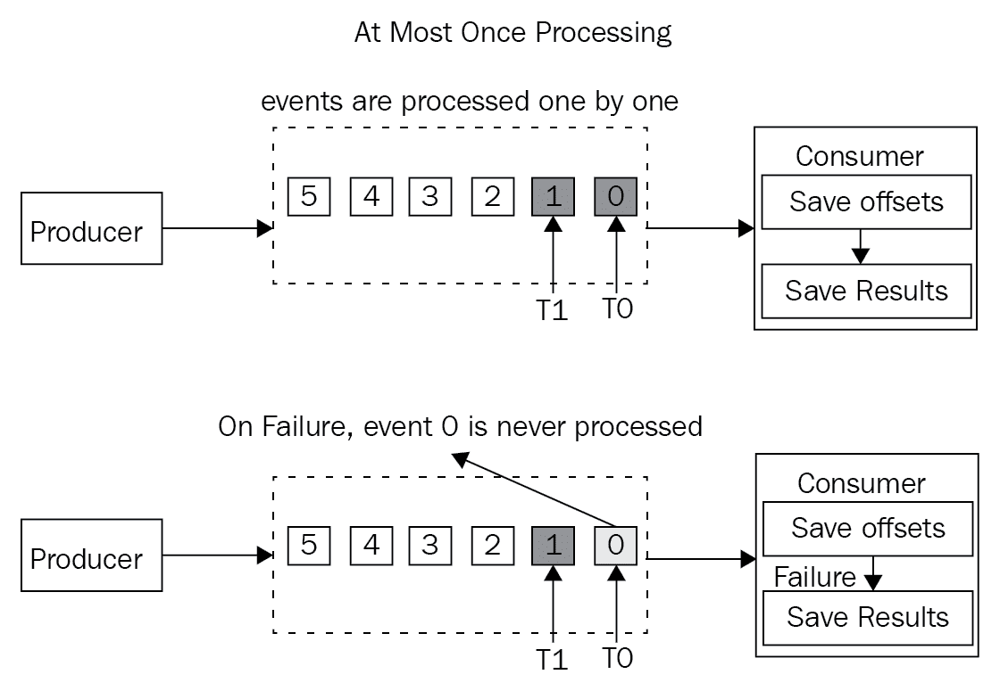
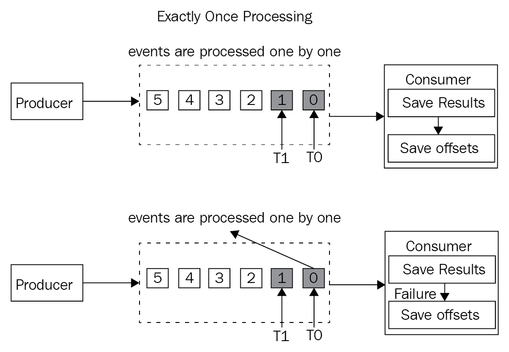
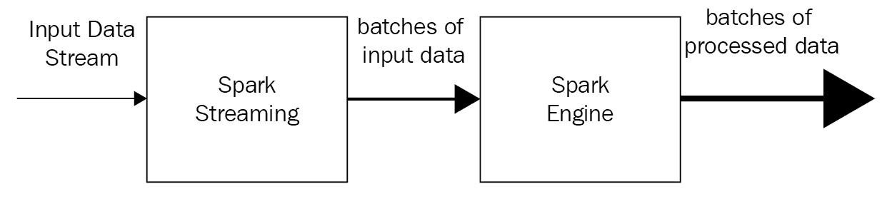
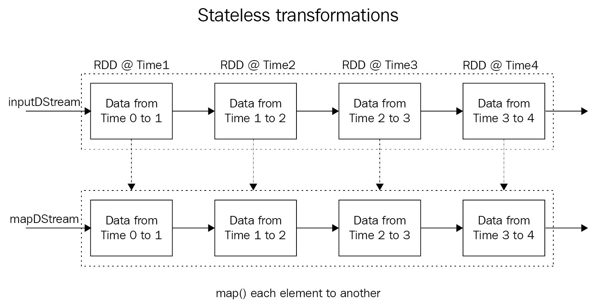

# 七、Apache Spark 实时分析

在本章中，我们将介绍 Apache Spark 的流处理模型，并向您展示如何构建基于流的实时分析应用。本章将重点介绍 Spark Streaming，并向您展示如何使用 Spark API 处理数据流。

更具体地说，读者将学习如何处理推特的推文，以及如何以几种方式处理实时数据流。基本上，本章将集中讨论以下内容:

*   流媒体简介
*   Spark流
*   离散化流
*   有状态和无状态转换
*   检查点
*   与其他流媒体平台(如 Apache Kafka)一起运营
*   结构化流

# 流动

在现代世界，越来越多的人通过互联网相互联系。随着智能手机的出现，这一趋势飞速发展。如今，智能手机可以用来做很多事情，比如查看社交媒体、在线点餐、在线叫出租车。我们发现自己比以往任何时候都更加依赖互联网，未来我们只会变得更加依赖互联网。随着这一发展，数据生成量大幅增加。随着互联网开始繁荣，数据处理的本质发生了变化。任何时候通过手机访问某个应用或服务，都会进行实时数据处理。因为应用的质量关系重大，公司被迫改进数据处理，随着改进而来的是范式转变。目前正在研究和使用的一个范例是在高端基础设施上建立高度可扩展的实时(或尽可能接近实时)处理引擎的想法。它必须迅速发挥作用，接受变化和失败。基本上，数据处理必须尽可能接近实时，没有中断。

大多数被监控的系统会产生大量的数据，这些数据是不确定但连续的事件流。与任何其他数据处理系统一样，收集、存储和处理数据的挑战依然存在。实时需求导致了额外的复杂性。为了收集和处理这些不确定的流，需要一个高度可扩展的架构，并且存在许多这样的系统的迭代，例如弗林克、AMQ、Storm和Spark。更新、更现代化的系统非常高效和灵活，这意味着公司可以比以往任何时候都更容易、更高效地实现目标。这些新的技术发展允许来自各种来源的数据消费，以及数据处理和使用。所有这些都有最小的延迟。

当你用智能手机点披萨时，你可以用信用卡付款，然后直接把披萨送到你的地址。有些公交系统可以让你在地图上实时追踪个别公交车，如果你需要等公交车，可以用智能手机找附近的星巴克喝杯咖啡。

通过查看预计到达时间，你可以对去机场的行程做出明智的决定。如果汽车到达的时间可能对你的飞行计划不利，你可以取消你的旅程，坐附近的出租车。如果交通堵塞导致无法准时到达机场，你可以重新安排或取消航班。

要了解所有这些数据是如何实时处理的，我们必须首先了解流架构的基础知识。对于实时流体系结构来说，高速收集大量数据至关重要，但也要确保数据得到处理。

下面是一个通用的流处理系统，生产者将事件放入消息传递系统，而消费者则从消息传递系统中读取:


实时流数据可以根据以下三种范例进行处理:

*   至少一次处理
*   最多一次处理
*   一次性处理

一次处理是最理想的情况，但在各种场景下很难实现。在实现这种标准非常复杂的情况下，我们必须在一次性处理的属性上做出妥协。

# 至少一次处理

在至少处理一次的范例中，最后接收到的事件的位置只有在它被处理之后才被保存，并且结果被存储在某个地方。在失败的情况下，消费者仍然能够读取和重新处理旧事件。但是，不能假设接收到的事件从未处理过或部分处理过，因此在再次调用前一个事件后，可能会出现结果重复。当名字说数据已经被处理至少一次时，这就是它的意思。

这个范例对于任何更新跑马灯或仪表以显示当前值的应用都是理想的。但是，总和、计数器或任何依赖于这些聚合类型的准确性的东西对于至少一次处理来说并不理想，主要是因为重复的事件会导致不正确的结果。

顺序如下:

*   保存结果
*   保存偏移量

下图显示了至少一次的处理范例:


# 最多一次处理

在这个范例中，最后一个事件的位置在实际处理之前被保存，结果被存储在某个地方。如果出现故障和消费者重启，旧事件将不会被再次读取。然而，可能会有事件丢失的可能性，因为我们不能假设所有接收到的事件都已处理，因此永远无法再次检索到这些事件。当范例声明事件要么不处理，要么最多处理一次时，这就是范例的含义。它非常适合需要更新跑马灯或仪表以显示当前值的情况。此外，如果准确性不是强制性的，或者如果需要所有事件，任何聚合(如累计总和或计数器)也可能起作用。任何丢失的事件都会导致结果丢失或不正确。

顺序如下:

*   保存结果
*   保存偏移量

如果出现故障，消费者最终会重新启动，那么每个事件都会有偏移量(前提是它们都在故障发生之前处理)，但是事件可能会丢失，如下图所示:



# 一次性处理

这个范例类似于至少一次处理。它只保存实际处理后收到的最后一个事件，并将结果存储在某个地方，以便在失败和消费者重启的情况下，可以重新读取和重新处理旧事件。然而，存在潜在重复的原因，因为不能假设所有事件要么没有处理，要么只是部分处理。与至少一次处理不同，任何重复的事件都会被丢弃而不被处理，从而导致只进行一次处理。

这非常适合精度很重要的任何应用，例如涉及聚合的应用，如精确计数器，或者任何只需要处理一次事件而不会丢失的应用。

顺序如下:

*   保存结果
*   保存偏移量

以下是消费者在失败后重新启动时发生的情况。事件已经被处理，但是偏移没有被保存，如下图所示:



一次加工如何复制？涉及两个过程:

*   幂等更新
*   事务性更新

Spark Streaming 在 Spark 2.0 及更高版本中实现了结构流，支持一次处理。本章稍后将介绍结构流。

在幂等更新中，根据生成的唯一密钥或标识保存结果。在复制的情况下，生成的密钥或标识将已经在结果中(例如，数据库)，因此消费者可以在不更新结果的情况下移除复制。然而，这可能会变得复杂，因为为每个事件生成唯一的密钥并不是一项简单的任务，因为在消费者端需要额外的处理。此外，对于结果和偏移，数据库可以是独立的。

在事务更新中，结果是分批保存的，需要开始一个事务并提交一个事务，因此在提交的情况下，事件将被成功处理。如果出现重复，可以在不更新结果的情况下删除它们。然而，这些比幂等更新更复杂，因为现在需要存储事务数据。另一个缺点是，对于结果和偏移，数据库可能需要保持不变。

Decisions on using at-least-once processing or at-most-once processing should be made after looking into the use case that you are trying to build, to keep a reasonable level of accuracy and performance.

# Spark流

Spark Streaming 并不是第一个流架构。随着时间的推移，已经开发了多种技术来满足各种实时处理需求。最早流行的流处理器技术之一是推特Storm，它被用于许多企业。Spark 包括流媒体库，该库已发展成为当今使用最广泛的技术。这主要是因为与所有其他技术相比，Spark Streaming 具有一些显著的优势，最重要的是它将 Spark Streaming APIs 集成到其核心 API 中。不仅如此，Spark Streaming 还与 Spark ML 和 Spark SQL 以及 GraphX 集成在一起。由于所有这些集成，Spark 是一种强大而通用的流媒体技术。

注意[https://Spark . Apache . org/docs/2 . 1 . 0/Streaming-programming-guide . html](https://spark.apache.org/docs/2.1.0/streaming-programming-guide.html)有更多关于 Spark Streaming Flink、Heron (Twitter Storm 的继承者)、Samza 及其各种功能的信息；例如，他们处理事件的能力，同时最大限度地减少延迟。但是，Spark Streaming 会消耗数据并在微批处理中进行处理。这些微贴片的大小至少为 500 毫秒。

Apache Apex, Flink, Samza, Heron, Gearpump, and other new technologies are all competitors of Spark Streaming in some cases. Spark Streaming, will not be the right fit if you need true, event-by-event processing.

Spark Streaming 的工作原理是，按照用户的配置，在特定的时间间隔内创建一批事件，并在另一个指定的时间间隔内交付这些事件进行处理。

Spark Streaming 支持多个输入源，并且可以将结果写入多个接收器:


与`SparkContext`类似，Spark流包含一个`StreamingContext`，这是流发生的主要入口点。`StreamingConext`依赖于`SparkContext`，而`SparkContext`实际上可以直接用于流媒体任务。`StreamingContext`与`SparkContext`相似，不同之处在于`StreamingContext`要求程序对配料间隔的时间间隔/持续时间进行规定，范围从分钟到毫秒:



The `SparkContext` is the main point of entry. The `StreamingContext` reuses the logic that is part of `SparkContext` (task scheduling and resource management).

# StreamingContext

作为流媒体的主要入口点，`StreamingContext`处理流媒体应用的动作，包括 RDD 的检查点和转换。

# 创建流上下文

新的`StreamingContext`可以通过以下几种方式之一创建:

*   使用现有的`SparkContext`创建`StreamingContext`:

```scala
StreamingContext(sparkContext: SparkContext, batchDuration: Duration)
scala> val ssc = new StreamingContext(sc, Seconds(10))
```

*   通过提供新配置所需的配置来创建`StreamingContext`:

```scala
StreamingContext(conf: SparkConf, batchDuration: Duration)
scala> val conf = newSparkConf().setMaster("local[1]").setAppName("TextStreams")
scala> val ssc = new StreamingContext(conf, Seconds(10))
```

*   `getOrCreate`功能用于从前一个检查点数据段重新创建一个`StreamingContext`，或者创建一个新的`StreamingContext`。如果数据不存在，则调用提供的`creatingFunc`创建`StreamingContext`，如下所示:

```scala
def getOrCreate(
checkpointPath: String,
creatingFunc: () => StreamingContext,
hadoopConf: Configuration = SparkHadoopUtil.get.conf,
createOnError: Boolean = false
): StreamingContext
```

# 开始流上下文

通过开始执行使用`StreamingContext`定义的流来启动流应用:

```scala
def start(): Unit
scala> ssc.start()
```

# 停止流上下文

当`StreamingContext`停止时，所有处理停止。您需要创建一个新的`StreamingContext`，并且您必须调用`start()`来重新启动应用。有两种有用的 API 可以停止流处理:

*   使用以下命令立即停止流执行(这不会等待接收到的数据被处理):

```scala
def stop(stopSparkContext: Boolean)
scala> ssc.stop(false)
```

*   使用以下选项停止流的执行，并允许处理接收到的数据:

```scala
def stop(stopSparkContext: Boolean, stopGracefully: Boolean)
scala> ssc.stop(true, true)
```

# 输入流

有几种类型的输入流，都需要创建`StreamingContext`，如下节所示。

# 接收流

输入流由任何用户实现的接收器创建。它是可定制的:

更多详情请访问[http://spark . Apache . org/docs/latest/streaming-custom-receiver . html](http://spark.apache.org/docs/latest/streaming-custom-receivers.html):

```scala
API declaration for receiverStream:
def receiverStream[T]: ClassTag](receiver: Receiver[T]):
ReceiverInputDStream[T]
```

# socketTextStream

`socketTextStream`使用 TCP 源`hostname:port`创建输入流。数据通过 TCP 套接字接收，接收到的字节被解释为 UTF8，用`\n`定界符行编码:

```scala
def socketTextStream(hostname: String, port: Int,
storageLevel: StorageLevel = StorageLevel.MEMORY_AND_DISK_SER_2):
ReceiverInputDStream[String]
```

# rawSocketStream

`rawSocketStream`使用网络源`hostname:port`创建输入流。这是接收数据最有效的方法:

```scala
def rawSocketStream[T: ClassTag](hostname: String, port: Int,
storageLevel: StorageLevel = StorageLevel.MEMORY_AND_DISK_SER_2):
ReceiverInputDStream[T]
```

# fileStream

`fileStream`创建一个监控 Hadoop 兼容文件系统的输入流。它使用给定的键值类型和输入格式读取新文件。任何以`.`开头的文件名都会被忽略。调用原子文件重命名功能，以`.`开头的文件名被重命名为可用的文件名，该文件名可由`fileStream`拾取并处理其内容:

```scala
def fileStream[K: ClassTag, V: ClassTag, F <: NewInputFormat[K, V]:
ClassTag] (directory: String): InputDStream[(K, V)]
```

# 文本文件流

`textFileStream`命令创建一个监控 Hadoop 兼容文件系统的输入流。它读取新文件，作为文本文件，键为`Longwritable`，值为`text`，输入格式为`TextInputFormat`。任何以`.`开头的文件都会被忽略:

```scala
def textFileStream(directory: String): Dstream[String]
```

# 二进制记录流

使用`binaryRecordsStream`，创建一个监控 Hadoop 兼容文件系统的输入流。任何以`.`开头的文件名都会被忽略:

```scala
def binaryRecordsStream(directory: String, recordLength: Int):
Dstream[Array[Byte]]
```

# queueStream

使用`queueStream`，从 rdd 队列中创建输入流。在每个批处理中，队列返回的一个或所有 rdd 都会被处理:

```scala
def queueStream[T: ClassTag](queue: Queue[RDD[T]], oneAtATime: Boolean =
true): InputDStream[T]
```

# 文本文件流示例

以下是使用`textFileStream`方法的Spark流的示例。一个`StreamingContext`由Spark壳`SparkContext` ( `sc`)创建，间隔`10`秒。`textFileStream`将启动，然后将监控名为`streamfiles`的目录，并处理在该目录中找到的任何新文件。在本例中，将打印 RDD 中的元素数量:

```scala
scala> import org.apache.spark._
scala> import org.apache.spark.streaming._
scala> val ssc = new StreamingContext(sc, Seconds(10))
scala> val filestream = ssc.textFileStream("streamfiles")
scala> filestream.foreachRDD(rdd => {println(rdd.count())})
scala> ssc.start
```

# twitterStream 示例

以下是如何使用 Spark Streaming 处理推特推文的另一个示例:

1.  打开一个终端，将目录改为`spark-2.1.1-bin-hadoop2.7`。

2.  在`spark-2.1.1-bin-hadoop2.7`文件夹下创建一个名为`streamouts`的文件夹，其中安装了 Spark。`Streamouts`对象将收集推文，并在应用运行时将其转换为文本文件。

3.  将这些 jar 下载到目录中:[http://central . maven . org/maven 2/org/Apache/bahir/spark-streaming-Twitter _ 2.11/2 . 1 . 0/spark-streaming-Twitter _ 2.11-2 . 1 . 0 . jar](http://central.maven.org/maven2/org/apache/bahir/spark-streaming-twitter_2.11/2.1.0/spark-streaming-twitter_2.11-2.1.0.jar)，[http://central . maven . org/maven 2/org/twiter 4j/twiter 4j-core/4 . 0 . 6/twiter 4j-core-4 . 0 . 6 . jar【T3](http://central.maven.org/maven2/org/twitter4j/twitter4j-core/4.0.6/twitter4j-core-4.0.6.jar)

4.  启动`spark-shell`和 Twitter 集成所需的所有 JARs，这里指定为`./bin/spakr-shell –jars twitter4j-stream-4.0.6.jar`、`twitter4j-core-4.0.6.jar`和`spark-streaming-twitter_2.11-2.1.0.jar`。

5.  现在可以编写示例代码了。下面是测试推特事件处理的代码:

```scala
import org.apache.spark._
import org.apache.spark.streaming._
import org.apache.spark.streaming.twitter._
import twitter4j.auth.OAuthAuthorization
import twitter4j.conf.ConfigurationBuilder
//you can replace the next 4 settings with your own twitter account
settings.
System.setProperty("twitter4j.oauth.consumerKey",
"8wVysSpBc0LGzbwKMRh8hldSm")
System.setProperty("twitter4j.oauth.consumerSecret",
"FpV5MUDWliR6sInqIYIdkKMQEKaAUHdGJkEb4MVhDkh7dXtXPZ")
System.setProperty("twitter4j.oauth.accessToken", "817207925756358656-
yR0JR92VBdA2rBbgJaF7PYREbiV8VZq")
System.setProperty("twitter4j.oauth.accessTokenSecret",
"JsiVkUItwWCGyOLQEtnRpEhbXyZS9jNSzcMtycn68aBaS")
val ssc = new StreamingContext(sc, Seconds(10))
val twitterStream = TwitterUtils.createStream(ssc, None)
twitterStream.saveAsTextFiles("streamouts/tweets", "txt")
ssc.start()
```

`streamouts`文件夹现在将包含几个推文输出文本文件。这些可以被打开和检查，以确保它们包含推文。

# 离散化流

**离散流** ( **数据流**)是Spark流所基于的抽象。每个
数据流被表示为一个 rdd 序列，每个 rdd 在特定的时间
间隔被创建。然后，可以使用类似于
这样的概念作为基于有向循环图的执行计划(DAG)，类似于常规 RDD 来处理数据流。就像常规的 RDD 处理一样，
作为执行计划一部分的任何转换和动作都在数据流的情况下处理，如下图所示:


数据流根据时间间隔将很长的数据流分成更小的数据块，并将每个数据块作为 RDD 进行处理。这些微批次是独立处理的，每个微批次都是无状态的。假设批处理间隔为 5 秒钟，事件被实时消耗，并且微批处理作为 RDD 进行进一步处理。关于 Spark Streaming 需要注意的一点是，用于处理微批处理事件的 API 调用被集成到 Spark APIs 中，以便与架构的其余部分集成。每当创建一个微批处理时，它就变成一个 RDD，允许使用如下图所示的 Spark APIs 进行无缝处理:


`DStream`类类似于以下示例:

```scala
class DStream[T: ClassTag] (var ssc: StreamingContext)
//hashmap of RDDs in the DStream
var generatedRDDs = new HashMap[Time, RDD[T]]()
```

在这个例子中，创建了一个`StreamingContext`，它每五秒钟生成一个微批处理，以创建一个类似于Spark核心应用编程接口 RDD 的 RDD。数据流中的这些关系数据库可以像任何其他关系数据库一样进行处理。构建流应用的步骤如下:

1.  从`SparkContext`创建`StreamingContext`。
2.  从流中创建`DStream`。
3.  上下文提供了可以应用于关系数据库的转换和操作。
4.  通过调用`StreamingContext`上的`start`启动流媒体应用。Spark流应用实时处理消费和处理过程。

No further operations may be added once the Spark Streaming application is started. A stopped `StreamingContext` cannot be restarted ,either, and a new `StreamingContext` will have to be made.

以下是如何创建访问推特的流式作业的示例:

1.  从`SparkContext`创建`StreamingContext`:

```scala
scala> val ssc = new StreamingContext(sc, Seconds(5))
ssc: org.apache.spark.streaming.StreamingContext =
org.apache.spark.streaming.StreamingContext@8ea5756
```

2.  从`StreamingContext`创建一个`DStream`:

```scala
scala> val twitterStream = TwitterUtils.createStream(ssc, None)
twitterStream:
org.apache.spark.streaming.dstream.ReceiverInputDStream[twitter4j.Status] =
org.apache.spark.streaming.twitter.TwitterInputDStream@46219d14
```

3.  提供适用于每个 RDD 的转换和操作:

```scala
val aggStream = twitterStream
.flatMap(x => x.getText.split(" ")).filter(_.startsWith("#"))
.map(x => (x, 1))
.reduceByKey(_ + _)
```

4.  通过调用`StreamingContext`上的`start`启动流媒体应用:

```scala
ssc.start()
//to stop just call stop on the StreamingContext
ssc.stop(false)
```

在*步骤 2* 中，我们创建了一个`ReceiverInputDStream`类型的`DSTream`。这是一个抽象类，它将任何必须在工作节点上启动接收器的`InputDStream`定义为能够接收外部数据。

这个例子展示了我们从推特流接收到的信息:

```scala
class InputDStream[T: ClassTag](_ssc: StreamingContext) extends
DStream[T](_ssc)
class ReceiverInputDStream[T: ClassTag](_ssc: StreamingContext) extends
InputDStream[T](_ssc)
```

在`twitterStream`上运行一个变换`flatMap()`，将产生一个`FlatMappedDStream`，如下代码所示:

```scala
scala> val wordStream = twitterStream.flatMap(x => x.getText().split(" "))
wordStream: org.apache.spark.streaming.dstream.DStream[String] = org.apache.spark.streaming.dstream.FlatMappedDStream@1ed2dbd5
```

# 转换

数据流上的转换类似于适用于Spark核心 RDD 的转换。
数据流由 RDD 组成，因此对每个 RDD 进行转换，为每个 RDD 生成一个转换后的 RDD，从而创建一个转换后的数据流。每个转换
创建一个指定的数据流派生类。

有许多为某个功能而构建的数据流类；使用不同的 DStream 派生类实现地图转换、窗口函数、缩减动作和不同的`InputStream`类型。

下表展示了可能的转换类型:

| **转化** | **表示** |
| `map(func)` | 对数据流的每个元素应用`transformation`函数，并返回一个新的数据流。 |
| `filter(func)` | 过滤掉`DStream`的记录，返回一个新的数据流。 |
| `repartition(numPartitions)` | 创建更多或更少的分区来重新分布数据以改变并行度。 |
| `union(otherStream)` | 合并两个源数据流中的元素，并返回一个新数据流。 |
| `count()` | 通过计算源数据流的每个 RDD 中的元素数量，返回一个新的数据流。 |
| `reduce(func)` | 通过对源数据流的每个元素应用`reduce`函数，返回一个新的数据流。 |
| `countByValue()` | 计算每个`Key`的频率，并返回一个新的`(Key, Long)`对数据流。 |
| `reduceByKey(func, [numTasks])` | 在源数据流的 RDDs 中按`Key`聚合数据，并返回一个新的`(Key, Value)`对数据流。 |
| `join(otherStream, [numTasks])` | 连接两个`(K, V)`和`(K, W)`对数据流，并返回一个新的`(K, (V, W))`对数据流，合并两个数据流的值。 |
| `cogroup(otherStream, [numTasks])` | 当在由`(K, V)`和`(K, W)`对组成的数据流上调用时，`cogroup`转换将返回由`(K, Seq(V), Seq(W))`元组组成的新数据流。 |
| `transform(func)` | 对源数据流的每个 RDD 应用一个转换函数，并返回一个新的数据流。 |
| `updateStateByKey(func)` | 通过对每个键的先前状态和新值应用给定函数来更新该键的状态。通常用于维护状态机。 |

# Windows 操作

Spark流允许窗口处理，这使您能够在事件的滑动窗口上应用转换。此滑动窗口是在指定的时间间隔内创建的。

每次窗口滑过数据流时，落入窗口
规范的源数据流将被合并以创建一个窗口数据流，如下图所示。窗口必须有两个指定的参数:


*   窗口长度–指定考虑的间隔长度
*   滑动间隔–创建窗口的间隔

The window length and the sliding interval are required to be a multiple of the block interval.

以下是一些常见转换的表格:

| **转化** | **表示** |
| `window(windowLength, slideInterval)` | 在源数据流上创建一个窗口，并将其作为新数据流返回。 |
| `countByWindow(windowLength, slideInterval)` | 通过应用滑动窗口返回数据流中的元素计数。 |
| `reduceByWindow(func, windowLength,` `slideInterval)` | 在创建一个`windowLength `长度的滑动窗口后，通过对源数据流的每个元素应用`reduce`函数返回一个新的数据流。 |
| `reduceByKeyAndWindow(func, windowLength,``slideInterval, [numTasks])` | 在应用于源数据流 RDDs 的窗口中，按`Key`聚合数据，并返回一个新的`(Key, Value)`对数据流。计算由`func`函数提供。 |
| `reduceByKeyAndWindow(func, invFunc,``windowLength, slideInterval, [numTasks])` | aggrega–窗口 w 应用于源数据流的 RDDs 并返回新数据流对的时间间隔。前一个函数和这个函数的主要区别是`invFunc`，它提供了在滑动窗口开始时要进行的计算。 |
| `countByValueAndWindow(windowLength,``slideInterval, [numTasks])` | 计算每个`Key`的频率，并在指定的滑动窗口内返回一个新的`(Key, Long)`对数据流。 |

让我们重温一下推特流的例子。现在的目标是每 5 秒钟打印一次推文中最常用的五个单词，15 秒钟的窗口每 10 秒钟滑动一次。要运行该代码，请执行以下步骤:

1.  打开一个终端，将目录改为`spark-2.1.1-bin-hadoop2.7`。
2.  在安装 Spark 的`spark-2.1.1-bin-hadoop2.7`文件夹下创建一个名为`streamouts`的文件夹。运行应用后，`streamouts`文件夹将包含所有推文到文本的文件。

3.  下载以下 JARs，放入目录:[http://central . maven . org/maven 2/org/Apache/bahir/spark-streaming-Twitter _ 2.11/2 . 1 . 0/spark-streaming-Twitter _ 2.11-2 . 1 . 0 . jar](http://central.maven.org/maven2/org/apache/bahir/spark-streaming-t)，[http://central . maven . org/maven 2/org/Twitter 4j/Twitter 4j-core/4 . 0 . 6/Twitter 4j-core-4 . 0。](http://central.maven.org/maven2/org/twitter4j/twitter4j-core/4.0.6/twit)
4.  启动带有集成指定推文所需的 JARs 的 Spark 外壳；`./bin/spark-shell --jars twitter4j-stream-4.0.6.jar,twitter4j-` `core-4.0.6.jar,spark-streaming-twitter_2.11-2.1.0.jar`。
5.  以下是一些测试推文处理的示例代码:

```scala
import org.apache.log4j.Logger
import org.apache.log4j.Level
Logger.getLogger("org").setLevel(Level.OFF)
import java.util.Date
import org.apache.spark._
import org.apache.spark.streaming._
import org.apache.spark.streaming.twitter._
import twitter4j.auth.OAuthAuthorization
import twitter4j.conf.ConfigurationBuilder
System.setProperty("twitter4j.oauth.consumerKey","8wVysSpBc0LGzbwKMRh8hldSm")
System.setProperty("twitter4j.oauth.consumerSecret",
"FpV5MUDWliR6sInqIYIdkKMQEKaAUHdGJkEb4MVhDkh7dXtXPZ")
System.setProperty("twitter4j.oauth.accessToken",
"817207925756358656-yR0JR92VBdA2rBbgJaF7PYREbiV8VZq")
System.setProperty("twitter4j.oauth.accessTokenSecret",
"JsiVkUItwWCGyOLQEtnRpEhbXyZS9jNSzcMtycn68aBaS")

val ssc = new StreamingContext(sc, Seconds(5))
val twitterStream = TwitterUtils.createStream(ssc, None)
val aggStream = twitterStream
.flatMap(x => x.getText.split(" "))
.filter(_.startsWith("#"))
.map(x => (x, 1))
.reduceByKeyAndWindow(_ + _, _ - _, Seconds(15), Seconds(10), 5)

ssc.checkpoint("checkpoints")
aggStream.checkpoint(Seconds(10))
aggStream.foreachRDD((rdd, time) => {
val count = rdd.count()
if (count > 0) {
val dt = new Date(time.milliseconds)
println(s"\n\n$dt rddCount = $count\nTop 5 words\n")
val top5 = rdd.sortBy(_._2, ascending = false).take(5)
top5.foreach {
case (word, count) =>
println(s"[$word] - $count")
}}})
ssc.start
//wait 60 seconds
ss.stop(false)
The output is shown on the console every 15 seconds, looking like the following:
Mon May 29 02:44:50 EDT 2017 rddCount = 1453
Top 5 words
[#RT] - 64
[#de] - 24
[#a] - 15
[#to] - 15
[#the] - 13
Mon May 29 02:45:00 EDT 2017 rddCount = 3312
Top 5 words
[#RT] - 161
[#df] - 47
[#a] - 35
[#the] - 29
[#to] – 29
```

# 有状态/无状态转换

Spark Streaming 使用数据流的概念，数据流基本上是关系数据库的微数据块。我们还看到了一些可以应用于数据流的转换。数据流转换可以分为两种类型:无状态转换和有状态转换。

在无状态转换中，每个数据微批次是否被处理不依赖于之前的数据批次，因此每个批次都完全独立于之前的数据批次。

在有状态转换中，每个数据微批次是否被处理部分或全部取决于之前的数据批次，因此每个批次都会考虑之前发生了什么，并在处理时使用这些信息。

# 无状态转换

通过对数据流中的每个 RDD 应用转换，一个数据流被转换成另一个数据流，如下图所示。例如`map()`、`flatMap()`、`union()`、`join()`和`reduceBykey()`。



# 有状态转换

有状态转换应用于数据流，但是它们依赖于先前的处理状态。例如`countByValueAndWindow()`、`reduceByKeyAndWindow()`、`mapWithState()`和`updateStateByKey()`。根据定义，所有基于窗口的转换都是有状态的；我们必须跟踪窗口长度和数据流的滑动间隔。

# 检查点

由于预计实时流应用将长时间运行，同时保持对故障的弹性，Spark流实现了一种称为**检查点**的机制。该机制跟踪足够的信息，以便能够从任何故障中恢复。有两种类型的数据检查点:

*   元数据检查点
*   数据检查点

通过调用`StreamingContext`上的`checkpoint()`启用检查点:

```scala
def checkpoint(directory: String)
```

这将指定存储检查点数据的目录。请注意，这必须是容错的文件系统，例如 HDFS。

一旦设置了检查点的目录，就可以根据时间间隔将任何数据流检查到其中。再来看一下推特的例子，每 10 秒钟可以检查一次每个数据流:

```scala
val ssc = new StreamingContext(sc, Seconds(5))
val twitterStream = TwitterUtils.createStream(ssc, None)
val wordStream = twitterStream.flatMap(x => x.getText().split(" "))
val aggStream = twitterStream
.flatMap(x => x.getText.split(" ")).filter(_.startsWith("#"))
.map(x => (x, 1))
.reduceByKeyAndWindow(_ + _, _ - _, Seconds(15), Seconds(10), 5)
ssc.checkpoint("checkpoints")
aggStream.checkpoint(Seconds(10))
wordStream.checkpoint(Seconds(10))
```

# 元数据检查点

元数据检查点保存定义流操作的信息，这些流操作由到达 HDFS 的 DAG 表示。这可用于在发生故障时恢复 DAG，从而允许应用重新启动。然后，驱动程序重新启动并从 HDFS 读取所有元数据，重建 DAG，同时恢复崩溃前的操作状态。

# 数据检查点

数据检查点将 RDDs 保存到 HDFS。在流式应用出现故障的情况下，可以恢复 RDDs，并且处理可以从停止的地方继续。在数据检查点的情况下，恢复不仅是好的，而且当 rdd 由于缓存清理或执行器丢失而丢失时，它也有所帮助。现在，任何生成的 rdd 都不需要等待 DAG 谱系中的父 rdd 被重新处理。

对于具有以下要求的任何应用，都必须启用检查点:

*   应用状态转换。如果使用`updateStateBykey()`或`reduceByKeyAndWindow()`(以及它们的反函数)，那么必须给出检查点目录，以便发生 RDD 检查点。
*   运行应用时从驱动程序故障中恢复。元数据检查点有助于恢复进度信息。

如果没有状态转换，那么应用可以在没有启用检查点的情况下运行。

There could be a loss of received, but not yet processed, data.

需要注意的是，RDD 检查点意味着将每个 RDD 存储起来。这将增加具有 rdd 检查点的批次的处理时间。因此，必须设置和调整检查点间隔，以免影响性能，这在处理实时处理的预期时很重要。

微小的批处理大小(例如 1 秒)意味着检查点出现得过于频繁，这可能会降低操作吞吐量。相反，不经常检查点会导致任务大小增加，由于大量排队数据而导致处理延迟。

需要 RDD 检查点的状态转换的默认检查点间隔至少为 10 秒。一个好的设置是 5 到 10 个数据流滑动间隔的检查点间隔。

# 驱动程序故障恢复

借助`StreamingContext.getOrCreate()`，我们可以实现驾驶员故障恢复。如前所述，这将从已经存在的检查点初始化`StreamingContext`，或者创建一个新的检查点。

我们不会实现一个名为`createStreamContext` `0`的函数，它会创建一个`StreamingContext`并设置 DStreams 来解释推文并生成前五个最常用的哈希表，每 15 秒使用一个窗口。我们将调用`getOrCreate()`而不是调用`createStreamContext()`然后调用`ssc.start()`，这样如果存在检查点，那么`StreamingContext`将从`checkpoint Directory`中的数据重新创建。如果没有这样的目录，或者应用是第一次运行，那么`createStreamContext()`将被调用:

```scala
val ssc = StreamingContext.getOrCreate(checkpointDirectory,
createStreamContext _)
```

下面的代码显示了如何定义函数，以及如何调用`getOrCreate()`:

```scala

val checkpointDirectory = "checkpoints"
//Creating and setting up a new StreamingContext
def createStreamContext(): StreamingContext = {
val ssc = new StreamingContext(sc, Seconds(5))
val twitterStream = TwitterUtils.createStream(ssc, None)
val wordStream = twitterStream.flatMap(x => x.getText().split(" "))
val aggStream = twitterStream
.flatMap(x => x.getText.split(" ")).filter(_.startsWith("#"))
.map(x => (x, 1))
.reduceByKeyAndWindow(_ + _, _ - _, Seconds(15), Seconds(10), 5)
ssc.checkpoint(checkpointDirectory)
aggStream.checkpoint(Seconds(10))
wordStream.checkpoint(Seconds(10))
aggStream.foreachRDD((rdd, time) => {
val count = rdd.count()
if (count > 0) {
val dt = new Date(time.milliseconds)
println(s"\n\n$dt rddCount = $count\nTop 5 words\n")
val top10 = rdd.sortBy(_._2, ascending = false).take(5)
top10.foreach {
case (word, count) =>
println(s"[$word] - $count")
}
}
})
ssc
}
//Retrieve StreamingContext from checkpoint data or create a new one
val ssc = StreamingContext.getOrCreate(checkpointDirectory,
createStreamContext _)
```

# 与流媒体平台的互操作性(Apache Kafka)

Spark Streaming 与目前最流行的消息平台 Apache Kafka 集成良好。这种集成有几种方法，随着时间的推移，这种机制在性能和可靠性方面有所改进。

主要有三种方法:

*   基于接收者的方法
*   直接流方法
*   结构化流

# 基于接收器

Spark 和卡夫卡的第一次融合是基于接收者的融合。在基于接收者的方法中，驱动程序启动执行器上的接收者，然后执行器使用来自卡夫卡代理的高级应用编程接口提取数据。由于事件是从卡夫卡经纪人那里提取的，接收者将偏移量更新到动物园管理员中，这也是卡夫卡集群所使用的。这里重要的方面是使用**提前写日志** ( **WAL** ，这是接收器从卡夫卡收集数据时写入的内容。如果出现问题，执行者和接收者必须重新启动或丢失，可以利用 WAL 恢复事件并处理它们。因此，这种基于日志的设计有助于提供耐用性和一致性。

事件的输入数据流由每个接收者从卡夫卡主题创建，同时它向动物园管理员查询卡夫卡主题、经纪人和偏移量。登录的、运行的接收器使并行变得复杂，因为随着应用的扩展，工作负载将无法正确分配。另一个问题是对 HDFS 的依赖，以及写操作重复。还需要关于一次处理范例的可靠性，因为只有幂等方法会起作用。事务方法在基于接收者的方法中不起作用，因为没有办法从 Zookeeper 或 HDFS 位置访问偏移范围。基于接收者的方法也更通用，因为它适用于任何消息传递系统，如下图所示:


可以通过调用`createStream()`应用编程接口来创建基于接收器的流:

```scala
def createStream(
ssc: StreamingContext,
// StreamingContext object
zkQuorum: String,
//Zookeeper quorum (hostname:port,hostname:port,..)
groupId: String,
//Group id for the consumer
topics: Map[String, Int],
//Map of (topic_name to numPartitions) to consume
storageLevel: StorageLevel = StorageLevel.MEMORY_AND_DISK_SER_2
//Storage level to use for storing the received objects
(default: StorageLevel.MEMORY_AND_DISK_SER_2)
): ReceiverInputDStream[(String, String)]
//DStream of (Kafka message key,
Kafka message value)
```

创建基于接收者的流，从卡夫卡经纪人那里提取消息的一个例子如下:

```scala
val topicMap = topics.split(",").map((_, numThreads.toInt)).toMap
val lines = KafkaUtils.createStream(ssc, zkQuorum, group,
topicMap).map(_._2)
```

# 直接流

可以创建一个不使用接收器直接从 Kafka 代理获取消息的输入流，这样可以确保每个 Kafka 消息只包含在转换中一次，如下图所示:


直接流的属性如下:

*   **无接收器**:不使用接收器，直接查询卡夫卡。
*   **偏移量**:不使用 Zookeeper 存储偏移量，任何消耗的偏移量都由流本身跟踪。每个批次中使用的偏移量可以从生成的 rdd 中访问。
*   **故障恢复**:必须启用流上下文中的检查点，才能从驱动程序故障中恢复。
*   **端到端示意图**:流保证所有的记录都被接收和转换一次，但不保证转换后的数据被输出一次。

可以使用卡夫卡实用程序`createDirectStream()`应用编程接口如下创建一个直接流:

```scala
def createDirectStream[
K: ClassTag,
//K type of Kafka message key
V: ClassTag,
//V type of Kafka message value
KD <: Decoder[K]: ClassTag,
//KD type of Kafka message key decoder
VD <: Decoder[V]: ClassTag,
//VD type of Kafka message value decoder
R: ClassTag
//R type returned by messageHandler
](
ssc: StreamingContext,
//StreamingContext object
kafkaParams: Map[String, String],
/*
kafkaParams Kafka <a
href="http://kafka.apache.org/documentation.html#configuration">
configuration parameters</a>. Requires "metadata.broker.list" or
"bootstrap.servers"
to be set with Kafka broker(s) (NOT Zookeeper servers) specified in
host1:port1,host2:port2 form.
*/
fromOffsets: Map[TopicAndPartition, Long],
//fromOffsets Per-
topic/partition Kafka offsets defining the (inclusive) starting point of
the stream
messageHandler: MessageAndMetadata[K, V] => R
//messageHandler Function
for translating each message and metadata into the desired type
): InputDStream[R]
//DStream of R
```

下面是一个直接流的例子，它从卡夫卡的主题中提取数据来创建数据流:

```scala
val topicsSet = topics.split(",").toSet
val kafkaParams : Map[String, String] =
Map("metadata.broker.list" -> brokers,
"group.id" -> groupid )
val rawDstream = KafkaUtils.createDirectStream[String, String,
StringDecoder, StringDecoder](ssc, kafkaParams, topicsSet)
```

直接流应用编程接口只能与卡夫卡一起使用，所以它不是通用的。

# 结构化流

结构化流是 Apache Spark 2.0+的新版本，目前仍处于开发的 alpha 阶段。在下一节中，将详细介绍如何使用结构化流，并举例说明。也可以参考[https://spark . Apache . org/docs/latest/Structured-Streaming-kafka-integration . html](https://spark.apache.org/docs/latest/structured-streaming-kafka-integration.html)了解更多关于结构化流中 Kafka 集成的信息。

下面的代码片段显示了如何在结构化流中使用卡夫卡源流的示例:

```scala
val ds1 = spark
.readStream
.format("kafka")
.option("kafka.bootstrap.servers", "host1:port1,host2:port2")
.option("subscribe", "topic1")
.load()
ds1.selectExpr("CAST(key AS STRING)", "CAST(value AS STRING)")
.as[(String, String)]
```

以下是如何使用卡夫卡源而不是源流的示例(如果您想采用批处理分析方法):

```scala
val ds1 = spark
.read
.format("kafka")
.option("kafka.bootstrap.servers", "host1:port1,host2:port2")
.option("subscribe", "topic1")
.load()
ds1.selectExpr("CAST(key AS STRING)", "CAST(value AS STRING)")
.as[(String, String)]
```

# 深入了解结构化流

结构化流是一个容错、可扩展的流处理引擎，构建在 Spark SQL 引擎之上。但是，结构化流允许您在接收的数据中指定事件时间，以便自动处理任何延迟的数据。需要注意的一点是，在 Spark 2.1 中，结构化流仍处于其阿尔法阶段，并且 API 被标记为实验性的。详情可参考[https://spark . Apache . org/docs/latest/structured-streaming-programming-guide . html](https://spark.apache.org/docs/latest/structured-streaming-programming-guide.html)。

结构化流背后的驱动思想是将数据流视为不断被添加的无界表。然后，计算和 SQL 查询可以应用于该表，这通常可以通过批处理数据来完成。例如，Spark SQL 查询将处理无界表。随着数据流随时间的变化，将处理越来越多的数据来生成结果表。该表可以写入外部接收器，称为**输出**。

我们现在来看一个通过监听本地主机端口`9999`的输入来创建结构化流查询的例子。在 Linux 或 macOS 上，很容易在端口`9999`上启动服务器:

```scala
nc -lk 9999
```

下面是一个通过调用 SparkSession 的`readStream`应用编程接口创建`inputStream`的例子，然后从行中提取这些单词。然后，对单词进行分组，并对出现的单词进行计数，最后将结果写入输出流:

```scala
//Creating stream reading from localhost 999
val inputLines = spark.readStream
.format("socket")
.option("host", "localhost")
.option("port", 9999)
.load()
inputLines: org.apache.spark.sql.DataFrame = [value: string]
// Splitting the inputLines into words
val words = inputLines.as[String].flatMap(_.split(" "))
words: org.apache.spark.sql.Dataset[String] = [value: string]
// Generating running word count
val wordCounts = words.groupBy("value").count()
wordCounts: org.apache.spark.sql.DataFrame = [value: string, count: bigint]
val query = wordCounts.writeStream
.outputMode("complete")
.format("console")

query:
org.apache.spark.sql.streaming.DataStreamWriter[org.apache.spark.sql.Row] =
org.apache.spark.sql.streaming.DataStreamWriter@4823f4d0
query.start()
```

只要在终端中键入单词，查询就会更新，并通过在控制台上打印来继续生成结果:

```scala
scala> -------------------------------------------
Batch: 0
-------------------------------------------
+-----+-----+
|value|count|
+-----+-----+
| dog| 1|
+-----+-----+
-------------------------------------------
Batch: 1
-------------------------------------------
+-----+-----+
|value|count|
+-----+-----+
| dog| 1|
| cat| 1|
+-----+-----+
scala> -------------------------------------------
Batch: 2
-------------------------------------------
+-----+-----+
|value|count|
+-----+-----+
| dog| 2|
| cat| 1|
+-----+-----+
```

# 处理事件时间和延迟日期

事件时间是数据内部的时间。Spark Streaming 过去将时间定义为用于数据流目的的接收时间，但是对于许多需要事件时间的应用来说，这是不够的。例如，如果您要求一个标签每分钟在推文中出现的次数，那么您将需要数据生成的时间，而不是 Spark 收到事件的时间。

以下是前面结构化流示例的扩展，在服务器端口`9999`上侦听。`Timestamp`现在作为输入数据的一部分被启用，所以现在，我们可以在无界表上执行窗口操作:

```scala
import java.sql.Timestamp
import org.apache.spark.sql.SparkSession
import org.apache.spark.sql.functions._
// Creating DataFrame that represent the stream of input lines from connection
to host:port
val inputLines = spark.readStream
.format("socket")
.option("host", "localhost")
.option("port", 9999)
.option("includeTimestamp", true)
.load()
// Splitting the lines into words, retaining timestamps
val words = inputLines.as[(String, Timestamp)].flatMap(line =>
line._1.split(" ").map(word => (word, line._2))
).toDF("word", "timestamp")
// Grouping the data by window and word and computing the count of each
val windowedCounts = words.withWatermark("timestamp", "10 seconds")
.groupBy(
window($"timestamp", "10 seconds", "10 seconds"), $"word"
).count().orderBy("window")
// Begin executing the query which will print the windowed word counts to the
console
val query = windowedCounts.writeStream.outputMode("complete")
.format("console")
.option("truncate", "false")

query.start()
query.awaitTermination()
```

# 容错语义

一次性范例在使用外部数据库/存储来维护偏移量的传统流中是复杂的。结构化流仍在变化，在它被广泛使用之前，有几个挑战需要克服。

# 摘要

在这一章的过程中，涵盖了流处理系统、Spark Streaming、Apache Spark 中的数据流、数据流、DAG 和数据流谱系以及转换和动作的概念。此外，还介绍了窗口流处理和使用 Spark Streaming 处理推特推文的实际例子。然后，针对卡夫卡，介绍了基于接收者的和直接流的数据消费方式，最后，介绍了最新发展的结构化流技术。目前，它旨在解决当前的许多挑战，例如容错、在流中使用一次语义，以及简化与消息传递系统(如卡夫卡)的集成，同时保持与其他输入流类型集成的灵活性和可扩展性。

在下一章中，我们将探讨 Apache Flink，它是 Spark 作为计算平台的关键挑战者。