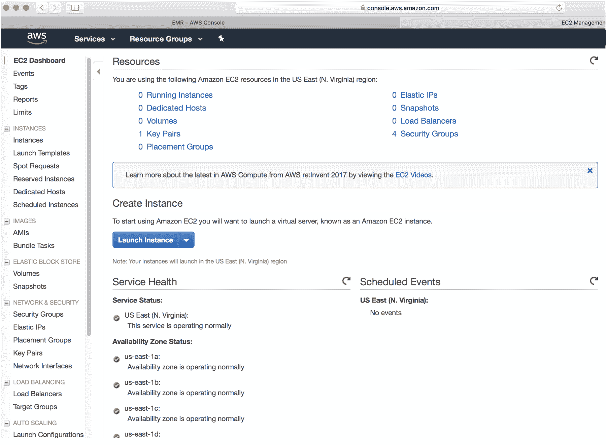
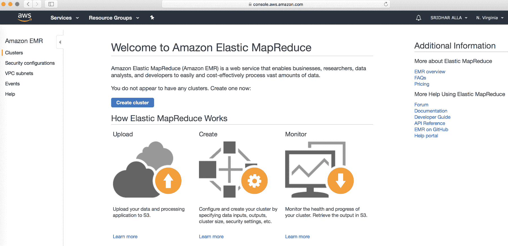
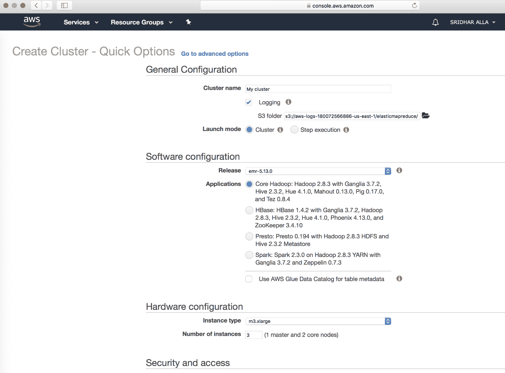
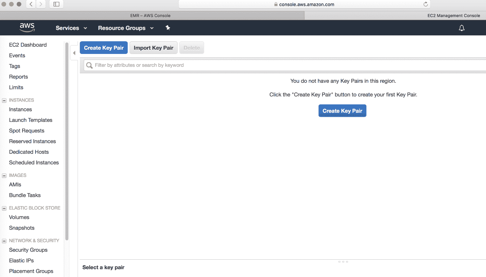
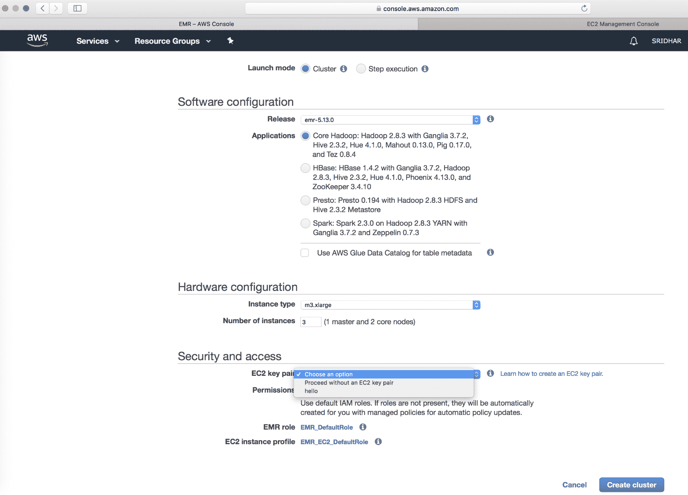
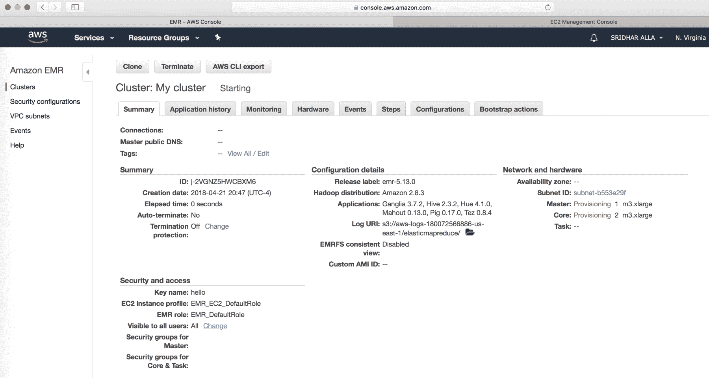
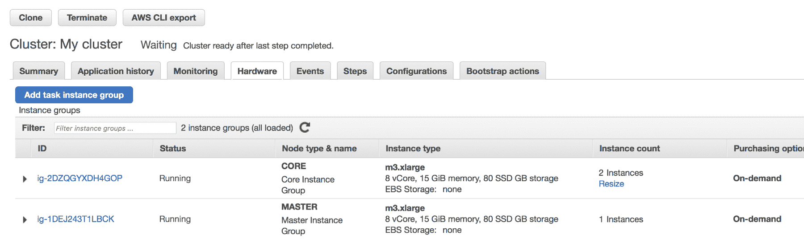
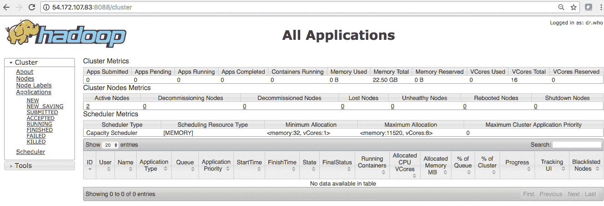
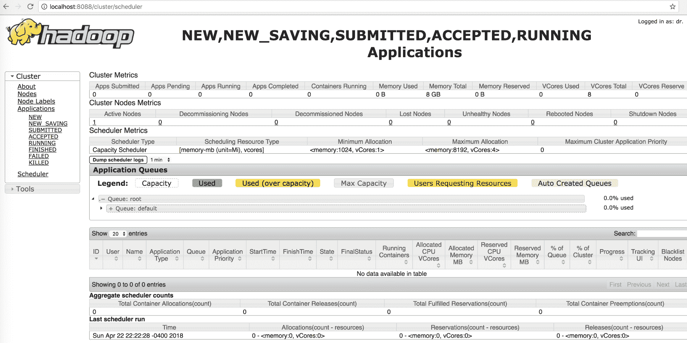

# 十二、使用亚马逊网络服务

本章向您介绍了 AWS 及其服务的概念，当您在 AWS 云中设置 Hadoop 集群时，这些概念对于使用**弹性 MapReduce** ( **EMR** )执行大数据分析非常有用。我们将查看 AWS 提供的关键组件和服务，并了解如何利用 AWS 组件和服务提供的各种功能。

简而言之，本章将涵盖以下主题:

*   亚马逊弹性计算云
*   从一个 AMI 启动多个实例
*   什么是 AWS Lambda？
*   亚马逊 S3 简介
*   亚马逊 DynamoDB
*   亚马逊人体运动数据流
*   AWS 胶水
*   亚马逊 EMR

# 亚马逊弹性计算云

**亚马逊弹性计算云** ( **亚马逊 EC2** )是一种在云上提供安全、可调整计算能力的网络服务。它旨在使网络规模的云计算对开发人员来说更容易。

亚马逊 EC2 的简单网络服务界面让您可以轻松获得和配置容量。它为您提供了对计算资源的完全控制，并让您使用亚马逊的计算环境。Amazon EC2 将获取和引导新服务器实例所需的时间减少到几分钟，使您能够随着计算需求的变化快速扩展容量(向上和向下)。亚马逊 EC2 允许您节省计算成本，因为您只需为实际使用的容量付费。亚马逊 EC2 为开发人员提供了构建抗故障应用的工具，并将它们与常见的故障场景隔离开来。

# 弹性网络规模计算

亚马逊 EC2 使您能够在几分钟内增加或减少容量。您可以同时委托一个或多个服务器实例。您也可以使用**亚马逊 EC2 自动扩展**来保持您的 EC2 车队的可用性，并根据您的需求自动上下扩展您的车队，以最大限度地提高性能并降低成本。要扩展多个服务，您可以使用 **AWS 自动扩展**。

# 完全控制操作

您可以完全控制您的实例，包括根访问，并且能够像处理任何机器一样与它们进行交互。您可以停止任何实例，同时保留引导分区上的数据，然后使用 web 服务 API 重新启动同一个实例。实例可以使用 web 服务 API 远程重启，并且您还可以访问它们的控制台输出。

# 灵活的云托管服务

您可以选择多种实例类型、操作系统和软件包。Amazon EC2 允许您选择内存、CPU、实例存储的配置，以及最适合您选择的操作系统和应用的引导分区大小。例如，操作系统的选择包括许多 Linux 发行版和微软视窗服务器。

# 综合

Amazon EC2 集成了大多数 AWS 服务，如**Amazon Simple Storage Service**(**Amazon S3**)**Amazon****关系数据库服务** ( **Amazon** **RDS** )和 **Amazon** **虚拟私有云**(**Amazon****VPC**)，为大范围的计算、查询处理和云存储提供完整、安全的解决方案

# 高可靠性

亚马逊 EC2 提供了一个高度可靠的环境，可以快速、可预测地委托更换实例。该服务在亚马逊成熟的网络基础设施和数据中心内运行。亚马逊 EC2 **服务级别协议** ( **服务级别协议**)为每个亚马逊 EC2 地区提供 99.99%的可用性。

# 安全

AWS 的云安全是最高优先级。作为 AWS 客户，您将受益于专为满足对安全性最敏感的组织的需求而构建的数据中心和网络架构。亚马逊 EC2 与亚马逊 VPC 合作，为您的计算资源提供安全和强大的网络功能。

# 便宜的

亚马逊 EC2 向你传递了亚马逊规模带来的财务收益。您为实际消耗的计算能力支付的费率非常低。详见亚马逊 EC2 的实例购买选项:[https://aws.amazon.com/ec2/pricing/](https://aws.amazon.com/ec2/pricing/)。

# 易于启动

有几种方法可以开始使用亚马逊 EC2。您可以使用 AWS 管理控制台、AWS **命令行工具**，这些工具可通过**命令行界面**或使用 AWS 软件开发工具包访问。AWS 易于启动和操作。要了解更多信息，请访问我们位于[https://aws.amazon.com/getting-started/tutorials/](https://aws.amazon.com/getting-started/tutorials/)的教程。

# 实例和亚马逊机器图像

一个**亚马逊机器映像** ( **AMI** )是一个包含软件配置(例如，操作系统、应用服务器和应用)的模板。从 AMI 中，您启动一个实例，它是 AMI 的副本，在云中作为虚拟服务器运行。您可以启动一个 AMI 的多个实例，如下图所示:

# 启动一个 AMI 的多个实例

您的实例会一直运行，直到您停止或终止它们，或者直到它们失败。如果一个实例失败，您可以从 AMI 启动一个新实例。

# 例子

您可以从单个 AMI 启动不同类型的实例。实例类型本质上决定了用于实例的主机的硬件。每种实例类型都提供不同的计算和内存能力。根据计划在实例上运行的应用或软件所需的内存量和计算能力选择实例类型。有关每个 Amazon EC2 实例类型的硬件规格的更多信息，请参见此链接[https://aws.amazon.com/ec2/instance-types/](https://aws.amazon.com/ec2/instance-types/)处的 *Amazon EC2* 实例。

启动一个实例后，它看起来像一个传统的主机，您可以像任何计算机一样与它交互。您可以完全控制您的实例；可以使用`sudo`运行需要 root 权限的命令。

# 埃米斯

**亚马逊网络服务** ( **AWS** )发布了许多包含公共使用的通用软件配置的 AMIs。此外，AWS 开发人员社区的成员已经发布了他们自己的定制 AMIs。您也可以创建自己的自定义 AMI 或 AMIs 这样做使您能够快速轻松地启动拥有所需一切的新实例。例如，如果您的应用是网站或 web 服务，您的 AMI 可能包括 web 服务器、相关的静态内容和动态页面的代码。因此，从这个 AMI 启动一个实例后，您的 web 服务器就会启动，您的应用就可以接受请求了。

所有 AMI 都被分类为由亚马逊 EBS 支持，这意味着从 AMI 启动的实例的根设备是亚马逊 EBS 卷，或者由实例存储支持，这意味着从 AMI 启动的实例的根设备是从存储在亚马逊 S3 的模板创建的实例存储卷。

# 区域和可用性区域

亚马逊 EC2 托管在全球多个地点。这些位置由区域和可用性区域组成。每个地区都是一个独立的地理区域。每个区域都有多个独立的位置，称为可用性区域。Amazon EC2 为您提供了在多个位置放置实例和数据等资源的能力。资源不会跨地区复制，除非您特别这样做。

亚马逊运营着最先进、高度可用的数据中心。虽然很少发生，但可能会发生影响同一位置实例可用性的故障。如果您将所有实例托管在受此类故障影响的单个位置，则没有一个实例可用。

# 区域和可用性区域概念

每个地区都完全独立。每个可用性区域都是隔离的，但是一个区域中的可用性区域通过低延迟链路连接在一起。下图说明了区域和可用性区域之间的关系:

# 地区

每个亚马逊 EC2 区域都被设计成与其他亚马逊 EC2 区域完全隔离。这实现了最大可能的容错性和稳定性。

当您查看资源时，您只会看到与您指定的区域相关联的资源。这是因为区域是相互隔离的，我们不会跨区域自动复制资源。

# 可用性区域

启动实例时，您可以选择可用性区域或为您分配一个可用性区域。如果您将实例分布在多个可用性区域，而一个实例出现故障，您可以设计应用，以便另一个可用性区域中的实例可以处理请求。

您还可以使用弹性 IP 地址，通过将地址快速重新映射到另一个可用性区域中的实例，来屏蔽一个可用性区域中实例的故障。更多信息见*弹性 IP 地址*此链接为[https://docs . AWS . Amazon . com/AWSEC2/latest/user guide/Elastic-IP-address-EIP . html](https://docs.aws.amazon.com/AWSEC2/latest/UserGuide/elastic-ip-addresses-eip.html)。

# 可用区域

您的帐户决定了您可以使用的地区。例如，一个 AWS 帐户提供多个区域，这样您就可以在满足您要求的位置启动 Amazon EC2 实例。例如，您可能希望在欧洲启动实例，以更接近您的欧洲客户或满足法律要求。

AWS 政府云(美国)帐户仅提供对 AWS 政府云(美国)区域的访问。更多信息见 *AWS GovCloud(美国)地区*。

亚马逊 AWS(中国)帐户仅提供中国(北京)地区的访问权限。

下表列出了 AWS 帐户提供的区域:

| 地区名称 | 地区 | 端点 | 草案 |
| 美国东部(俄亥俄州) | 美国东部 2 | `rds.us-east-2.amazonaws.com` | HTTPS |
| 美国东部(北弗吉尼亚) | 美国东部 1 | `rds.us-east-1.amazonaws.com` | HTTPS |
| 美国西部(北加利福尼亚) | 美国-西部-1 | `rds.us-west-1.amazonaws.com` | HTTPS |
| 美国西部(俄勒冈州) | 美国西部 2 | `rds.us-west-2.amazonaws.com` | HTTPS |
| 亚太地区(东京) | AP-东北-1 | `rds.ap-northeast-1.amazonaws.com` | HTTPS |
| 亚太地区(首尔) | AP-东北-2 | `rds.ap-northeast-2.amazonaws.com` | HTTPS |
| 亚太地区(大阪-本地) | AP-东北-3 | `rds.ap-northeast-3.amazonaws.com` | HTTPS |
| 亚太地区(孟买) | ap-south-1 | `rds.ap-south-1.amazonaws.com` | HTTPS |
| 亚太地区(新加坡) | AP-东南-1 | `rds.ap-southeast-1.amazonaws.com` | HTTPS |
| 亚太地区(悉尼) | AP-东南-2 | `rds.ap-southeast-2.amazonaws.com` | HTTPS |
| 加拿大(中部) | ca-中央-1 | `rds.ca-central-1.amazonaws.com` | HTTPS |
| 中国北京 | cn-north-1 | `rds.cn-north-1.amazonaws.com.cn` | HTTPS |
| 中国(宁夏) | cn-西北-1 | `rds.cn-northwest-1.amazonaws.com.cn` | HTTPS |
| 我(法兰克福) | 我-中央-1 | `rds.eu-central-1.amazonaws.com` | HTTPS |
| 欧盟(爱尔兰) | 我-西-1 | `rds.eu-west-1.amazonaws.com` | HTTPS |
| 欧盟(伦敦) | 我-西-2 | `rds.eu-west-2.amazonaws.com` | HTTPS |
| 我(巴黎) | 我-西-3 | `rds.eu-west-3.amazonaws.com` | HTTPS |
| 南美洲(圣保罗) | sa-east-1 | `rds.sa-east-1.amazonaws.com` | HTTPS |

# 区域和端点

使用命令行界面或应用编程接口操作处理实例时，必须指定其区域端点。有关亚马逊 EC2 区域和端点的更多信息，请参见此链接的*区域和端点*:[https://docs.aws.amazon.com/general/latest/gr/rande.html](https://docs.aws.amazon.com/general/latest/gr/rande.html)。

# 实例类型

启动实例时，您指定的实例类型决定了用于实例的主机的硬件。每种实例类型都提供不同的计算、内存和存储能力，并根据这些能力分组到一个实例系列中。根据您计划在实例上运行的应用或软件的要求，选择实例类型。

# 标签基础知识

标签使您能够以不同的方式对您的 AWS 资源进行分类，例如，按目的、所有者或环境。当您有许多相同类型的资源时，这很有用—您可以根据分配给特定资源的标签快速识别该资源。每个标记由一个键和一个可选值组成，这两个值都是您定义的。例如，您可以为您的帐户的 Amazon EC2 实例定义一组标签，帮助您跟踪每个实例的所有者和堆栈级别。

# Amazon EC2 密钥对

亚马逊 EC2 使用公钥密码对登录信息进行加密和解密。公钥加密使用公钥加密一段数据，如密码，然后收件人使用私钥解密数据。公钥和私钥被称为**密钥对**。

# 针对 Linux 实例的 Amazon EC2 安全组

安全组充当虚拟防火墙，控制一个或多个实例的流量。启动实例时，您可以将一个或多个安全组与该实例相关联。您可以向每个安全组添加允许流量进出其关联实例的规则。您可以随时修改安全组的规则；短时间后，新规则将自动应用于与安全组关联的所有实例。当您决定是否允许流量到达某个实例时，您可以评估与该实例关联的所有安全组的所有规则。

# 弹性 IP 地址

弹性 IP 地址是为动态云计算设计的静态 IPv4 地址。弹性 IP 地址与您的 AWS 帐户相关联。使用弹性 IP 地址，您可以通过快速将地址重新映射到帐户中的另一个实例来掩盖实例或软件的故障。

# 亚马逊 EC2 和亚马逊虚拟私有云

亚马逊 VPC 使您能够在 AWS 云中自己的逻辑隔离区域定义一个虚拟网络，称为 VPC。您可以将 AWS 资源(如实例)启动到您的 VPC 中。您的 VPC 非常类似于传统的网络，您可以在自己的数据中心运行，具有使用 AWS 可扩展基础架构的优势。您可以配置您的 VPC，或选择其 IP 地址范围，创建子网，并配置路由表、网络网关和安全设置。您可以将 VPC 的实例连接到互联网。您可以将您的 VPC 连接到您自己的公司数据中心，使 AWS 云成为您的数据中心的扩展。为了保护每个子网中的资源，您可以使用多个安全层，包括安全组和网络访问控制列表。更多信息，请参见[https://aws.amazon.com/documentation/vpc/](https://aws.amazon.com/documentation/vpc/)的*亚马逊 VPC 用户指南*。

# 亚马逊弹性积木商店

**亚马逊** **弹性块存储** ( **亚马逊** **EBS** )提供块级存储卷，供 EC2 实例使用。EBS 卷是高度可用和可靠的存储卷，可以连接到同一可用性区域中的任何正在运行的实例。连接到 EC2 实例的 EBS 卷作为独立于实例生命周期的存储卷公开。有了亚马逊 EBS，你只需为你使用的东西付费。有关亚马逊电子商务服务定价的更多信息，请参见亚马逊电子商务服务页面[https://aws.amazon.com/ebs/](https://aws.amazon.com/ebs/)的*预计成本*部分。

当数据必须能够快速访问并且需要长期持久性时，建议使用亚马逊 EBS。EBS 卷特别适合用作文件系统、数据库或任何需要精细更新和访问原始、未格式化的块级存储的应用的主存储。Amazon EBS 非常适合依赖随机读写的数据库式应用，也非常适合执行长时间连续读写的吞吐量密集型应用。

# Amazon EC2 实例存储

实例存储为实例提供临时块级存储。该存储位于物理连接到主机的磁盘上。实例存储非常适合于经常变化的信息的临时存储，如缓冲区、缓存、暂存数据和其他临时内容，或者适合于跨一系列实例复制的数据，如负载平衡的 web 服务器池。

实例存储由一个或多个作为块设备公开的实例存储卷组成。实例存储的大小以及可用设备的数量因实例类型而异。虽然实例存储专用于特定实例，但磁盘子系统在主机上的实例之间共享。

# 什么是 AWS Lambda？

**AWS Lambda** 是一种计算服务，它允许您运行代码，而无需配置或管理服务器。AWS Lambda 仅在需要时执行您的代码，并自动扩展，从每天几个请求扩展到每秒几千个请求。您只需为消耗的计算时间付费，当您的代码没有运行时，无需付费。使用 AWS Lambda，您可以为几乎任何类型的应用或后端服务运行代码，所有这些都无需管理。AWS Lambda 在高可用性计算基础架构上运行您的代码，并执行计算资源的所有管理，包括服务器和操作系统维护、容量调配和自动扩展、代码监控和日志记录。你所需要做的就是用 AWS Lambda 支持的语言之一提供你的代码(目前是 Node.js、Java、C#、Go 和 Python)。

您可以使用 AWS Lambda 运行您的代码来响应事件，例如对亚马逊 S3 桶或亚马逊 DynamoDB 表中的数据的更改；使用亚马逊应用编程接口网关运行您的代码来响应 HTTP 请求；或者使用使用 AWS SDKs 进行的 API 调用来调用您的代码。有了这些功能，您可以使用 Lambda 轻松地为 Amazon S3 和 Amazon DynamoDB 等 AWS 服务构建数据处理触发器，以处理存储在 Kinesis 中的流数据，或者创建自己的后端，在 AWS 规模上运行，提供卓越的性能和必要的系统安全性。

您还可以构建由事件触发的函数组成的无服务器应用，并使用 **AWS 代码管道**和 **AWS 代码构建**自动部署它们。有关更多信息，请参见*部署基于 Lambda 的应用*。

# 什么时候应该用 AWS Lambda？

AWS Lambda 是许多应用场景的理想计算平台，前提是您可以用 AWS Lambda 支持的语言(即 Node.js、Java、Go、C#和 Python)编写应用代码，并在 AWS Lambda 标准运行时环境和 Lambda 提供的资源内运行。

# 亚马逊 S3 简介

亚马逊 S3 在全球最大的云基础设施上运行，从头开始构建，以实现 99.99999999999%耐用性的客户承诺。数据自动分布在一个自动气象站区域内至少三个地理位置分开的物理设施上，亚马逊 S3 也可以自动将数据复制到任何其他自动气象站区域。

在[https://aws.amazon.com/](https://aws.amazon.com/)了解更多关于 AWS 全球云基础设施的信息。

# 亚马逊 S3 入门

亚马逊 S3 是互联网的存储。您可以使用亚马逊 S3 随时随地存储和检索任意数量的数据。您可以使用 AWS 管理控制台完成这些任务，这是一个简单直观的网络界面。本指南向您介绍了亚马逊 S3 以及如何使用 AWS 管理控制台来管理亚马逊 S3 提供的存储空间。

如今的公司需要能够轻松、安全地大规模收集、存储和分析他们的数据。亚马逊 S3 是一种对象存储，旨在存储和检索来自任何地方的任何数量的数据——网站和移动应用、企业应用以及来自物联网传感器或设备的数据，并存储每个行业市场领导者使用的数百万个应用的数据。S3 提供了全面的安全和合规能力，甚至可以满足最严格的法规要求。它让客户能够灵活地管理数据，以实现成本优化、访问控制和法规遵从性。S3 提供就地查询功能，允许您直接对 S3 的静态数据进行强大的分析。亚马逊 S3 是支持度最高的存储平台，拥有最大的独立软件开发商解决方案生态系统和系统集成商合作伙伴。

# 全面的安全和合规能力

亚马逊 S3 是唯一支持三种不同加密形式的云存储平台。S3 提供了与 **AWS 云跟踪**的复杂集成，以记录、监控和保留存储应用编程接口调用活动进行审计。亚马逊 S3 是唯一一个拥有**亚马逊 Macie** 的云存储平台，它使用机器学习来自动发现、分类和保护 AWS 中的敏感数据。S3 支持安全标准和合规认证，包括 PCI-DSS、HIPAA/HITECH、FedRAMP、欧盟数据保护指令和 FISMA，帮助满足全球几乎每个监管机构的合规要求。

在[https://aws.amazon.com/security/](https://aws.amazon.com/security/)了解更多安全信息。

在[https://aws.amazon.com/compliance/](https://aws.amazon.com/compliance/)了解更多合规信息。

# 查询到位

亚马逊 S3 允许您对数据运行复杂的大数据分析，而无需将数据转移到单独的分析系统中。亚马逊雅典娜为任何懂 SQL 的人提供了对大量非结构化数据的按需查询访问。**亚马逊红移光谱**让你运行跨越你的数据仓库和 S3 的查询。只有 AWS 提供了 Amazon S3 Select(目前处于测试预览阶段)，这是一种仅从 S3 对象中检索所需数据子集的方法，可以将经常从 S3 访问数据的大多数应用的性能提高高达 400%。

在[https://AWS . Amazon . com/blogs/AWS/Amazon-红移-光谱-exabyte-scale-in-query-of-S3-data/](https://aws.amazon.com/blogs/aws/amazon-redshift-spectrum-exabyte-scale-in-place-queries-of-s3-data/)了解更多关于就地查询的信息。

# 灵活管理

亚马逊 S3 提供最灵活的存储管理和管理功能。存储管理员可以对数据使用趋势进行分类、报告和可视化，以降低成本并提高服务级别。可以使用唯一的、可定制的元数据来标记对象，以便客户可以针对每个工作负载分别查看和控制存储消耗、成本和安全性。S3 清单功能提供有关对象及其元数据的计划报告，用于维护、法规遵从性或分析操作。S3 还可以分析对象访问模式，以构建自动化分层、删除和保留的生命周期策略。由于亚马逊 S3 与 AWS Lambda 合作，客户可以记录活动、定义警报和调用工作流，而无需任何额外的基础架构。

在[https://aws.amazon.com/s3/](https://aws.amazon.com/s3/)了解更多关于 S3 存储管理的信息。

# 拥有最大生态系统的最受支持的平台

除了与大多数 AWS 服务集成之外，亚马逊 S3 生态系统还包括多个咨询系统集成商和独立软件供应商合作伙伴，每个月都有更多合作伙伴加入。AWS 市场提供 35 个类别和 3，500 多个软件清单，来自 1，100 多家独立软件开发商，这些软件预先配置为部署在 AWS 云上。 **AWS 合作伙伴网络** ( **APN** )合作伙伴已经调整了他们的服务和软件，以便与 S3 合作提供备份和恢复、归档和灾难恢复等解决方案。

在[https://aws.amazon.com/backup-recovery/partner-solutions/](https://aws.amazon.com/backup-recovery/partner-solutions/)了解更多关于 AWS 存储合作伙伴的信息。

# 轻松灵活的数据传输

您可以从众多选项中选择，将您的数据传输到(或传输出)亚马逊 S3。S3 简单可靠的 API 使得在互联网上传输数据变得很容易。**亚马逊 S3 传输加速**非常适合跨大地理距离的数据上传。AWS 直连为使用专用网络连接将大量数据移动到 AWS 提供了一致的高带宽和低延迟数据传输。您可以使用 AWS 雪球和 **AWS 雪球边缘**设备进行千兆字节级的数据传输，或者使用 AWS 雪地摩托进行更大的数据集。 **AWS 存储网关**为您提供了一个物理或虚拟数据传输设备，可在内部使用，轻松地将卷或文件移动到 AWS 云中。

在[https://aws.amazon.com/cloud-migration/](https://aws.amazon.com/cloud-migration/)了解更多关于云数据迁移的信息。

# 备份和恢复

亚马逊 S3 为备份和归档您的关键数据提供了一个高度耐用、可扩展和安全的目的地。您可以使用 S3 的版本控制功能来保护您存储的数据。您还可以定义生命周期规则，将不常使用的数据迁移到 S3 标准非频繁访问，并将对象集归档到亚马逊冰川。

在[https://aws.amazon.com/backup-restore/](https://aws.amazon.com/backup-restore/)了解更多关于备份和恢复的信息。

# 数据存档

亚马逊 S3 和亚马逊冰川提供了一系列存储类别，以满足受监管行业的法规遵从性归档需求，或者满足需要快速、不经常访问归档数据的组织的活动归档需求。亚马逊冰川保险库锁提供**一次写入多次读取** ( **WORM** )存储，以满足记录保留的合规性要求。生命周期策略使数据从亚马逊 S3 转移到亚马逊冰川变得简单，有助于基于客户定义的策略自动进行转移。

在[https://aws.amazon.com/archive/](https://aws.amazon.com/archive/)了解更多关于数据归档的信息。

# 数据湖和大数据分析

无论您存储的是医药或金融数据，还是照片和视频等多媒体文件，亚马逊 S3 都可以作为您的大数据分析数据湖。AWS 提供全面的服务组合，通过降低成本、扩展以满足需求和提高创新速度来帮助您管理大数据。

更多关于数据湖和大数据分析的信息，请访问[https://aws . Amazon . com/blogs/big-data/介绍 AWS 上的数据湖解决方案/](https://aws.amazon.com/blogs/big-data/introducing-the-data-lake-solution-on-aws/) 。

# 混合云存储

AWS 存储网关帮助您构建混合云存储，利用亚马逊 S3 的耐用性和规模来扩展您现有的本地存储环境。使用它将工作负载从您的站点爆发到云中进行处理，然后将结果带回来。将主存储中较冷或价值较低的数据分层到云中，以降低成本并扩大您的内部投资。或者，作为备份或迁移项目的一部分，简单地使用它将数据增量移动到 S3。

在[https://aws.amazon.com/enterprise/hybrid/](https://aws.amazon.com/enterprise/hybrid/)了解更多关于混合云存储的信息。

# 云原生应用数据

亚马逊 S3 提供高性能、高可用性的存储，使其易于扩展和维护经济高效的移动和基于互联网的快速运行的应用。借助 S3，您可以添加任意数量的内容，并从任何地方访问这些内容，因此您可以更快地部署应用并接触更多客户。

# 灾难恢复

亚马逊 S3 安全的全球基础设施提供了强大的灾难恢复解决方案，旨在提供卓越的数据保护。**跨区域复制** ( **CRR** )会自动将每个 S3 对象复制到位于不同 AWS 区域的目标存储桶。

在[https://aws.amazon.com/disaster-recovery/](https://aws.amazon.com/disaster-recovery/)了解更多关于灾难恢复的信息。

# 亚马逊 DynamoDB

Amazon DynamoDB 是一个完全托管的 NoSQL 数据库服务，提供快速和可预测的性能以及无缝的可扩展性。DynamoDB 让您卸下操作和扩展分布式数据库的管理负担，这样您就不必担心硬件配置、设置和配置、复制、软件修补或集群扩展。此外，DynamoDB 提供静态加密，这消除了保护敏感数据的操作负担和复杂性。更多信息，请参见[休息时的*亚马逊 DynamoDB 加密**https://docs . AWS . Amazon . com/Amazon DynamoDB/latest/developer guide/encryptiontrest . html*](https://docs.aws.amazon.com/amazondynamodb/latest/developerguide/EncryptionAtRest.html)。

使用 DynamoDB，您可以创建数据库表来存储和检索任意数量的数据，并为任意级别的请求流量提供服务。您可以在不停机或不降低性能的情况下扩大或缩小表的吞吐量，并使用 AWS 管理控制台来监控资源利用率和性能指标。

亚马逊 DynamoDB 提供按需备份功能。它允许您创建表的完整备份，以便长期保留和存档，满足法规遵从性需求。有关更多信息，请参见动态数据库的*按需备份和恢复*。

DynamoDB 允许您自动从表中删除过期的项目，以帮助您减少存储使用和存储不再相关的数据的成本。更多信息见*生存时间*。

DynamoDB 会自动将表的数据和流量分散到足够数量的服务器上，以满足您的吞吐量和存储需求，同时保持一致和快速的性能。您的所有数据都存储在**固态硬盘** ( **固态硬盘**)上，并自动跨 AWS 区域的多个可用性区域进行复制，从而提供内置的高可用性和数据持久性。您可以使用全局表来保持 AWS 区域之间的电动数据库表同步。有关更多信息，请参见*全球表格*。

# 亚马逊人体运动数据流

您可以使用亚马逊*驱动*数据流实时收集和处理大数据流记录。您将创建数据处理应用，称为亚马逊驱动数据流应用。典型的亚马逊驱动程序数据流应用从驱动程序数据流中读取数据作为数据记录。这些应用可以使用驱动程序客户端库，并且可以在亚马逊 EC2 实例上运行。处理后的记录可以发送到仪表板，用于生成警报、动态更改定价和广告策略，或者将数据发送到各种其他 AWS 服务。有关驱动程序数据流功能和定价的信息，请参见亚马逊驱动程序数据流。

除了亚马逊驱动数据消防软管，驱动数据流是驱动流数据平台的一部分。有关更多信息，请参见亚马逊驱动数据消防软管开发人员指南。有关 AWS 大数据解决方案的更多信息，请参见*大数据*。有关 AWS 流数据解决方案的更多信息，请参见*什么是流数据？*

# 我能用驱动力数据流做什么？

您可以使用驱动数据流进行快速和连续的数据获取和聚合。使用的数据类型包括信息技术基础设施日志数据、应用日志、社交媒体、市场数据馈送和网络点击流数据。因为数据获取和处理的响应时间是实时的，所以处理通常是轻量级的。

以下是使用驱动程序数据流的典型场景。

# 加速日志和数据馈送的获取和处理

您可以让生产者将数据直接推送到流中。例如，推送系统和应用日志，几秒钟后就可以进行处理。如果前端或应用服务器出现故障，这可以防止日志数据丢失。驱动数据流提供了加速的数据输入，因为在提交数据输入之前，您不会在服务器上对数据进行批处理。

# 实时指标和报告

您可以使用收集到驱动程序数据流中的数据进行简单的数据分析和实时报告。例如，当数据流入时，您的数据处理应用可以处理系统和应用日志的度量和报告，而不是等待接收批量数据。

# 实时数据分析

这结合了并行处理的能力和实时数据的价值。例如，您可以实时处理网站点击流，然后使用并行运行的多个不同的驱动数据流应用来分析网站可用性。

# 复杂流处理

您可以创建亚马逊驱动数据流应用和数据流的**有向无环图** ( **DAGs** )。这通常包括将来自多个亚马逊驱动数据流应用的数据放入另一个流中，由不同的亚马逊驱动数据流应用进行下游处理。

# 使用驱动程序数据流的好处

虽然您可以使用运动学数据流来解决各种流数据问题，但一个常见的用途是实时聚合数据，然后将数据加载到数据仓库或地图缩减集群中。

为了确保持久性和弹性，数据被放入驱动程序数据流中。记录被放入流中的时间和它可以被检索的时间之间的延迟(放入-获取延迟 *)* 小于 1 秒；亚马逊驱动数据流应用可以在添加数据后几乎立即开始消费数据流中的数据。驱动数据流的托管服务方面减轻了您创建和运行数据输入管道的操作负担。您可以创建流式地图缩减类型的应用，并且动态数据流的弹性使您能够向上或向下扩展数据流，这样您就永远不会在数据记录到期之前丢失它们。

多个亚马逊驱动数据流应用可以从一个流中消费数据，因此多个操作(如归档和处理)可以同时独立进行。例如，两个应用可以从同一个流中读取数据。第一个应用计算正在运行的聚合并更新一个 DynamoDB 表，第二个应用将数据压缩并归档到一个数据存储中，如亚马逊 S3。然后仪表板读取带有运行聚合的动态数据库表，以获得最新的*报告。*

# AWS 胶水

AWS Glue 是一个完全托管的**提取、转换和加载** ( **ETL** )服务，它使您的数据分类、清理、丰富和在各种数据存储之间可靠移动变得简单且经济高效。AWS Glue 由一个名为 **AWS Glue 数据目录**的中央数据存储库、一个自动生成 Python 代码的 ETL 引擎和一个灵活的调度程序组成，该调度程序处理依赖项解析、作业监控和失败时的作业重试/重试。AWS Glue 是无服务器的，因此没有基础架构可以设置或管理。

使用 AWS Glue 控制台发现数据、转换数据，并使其可用于搜索和查询。控制台调用底层服务来协调转换数据所需的工作。您还可以使用 AWS 胶水应用编程接口操作来与 AWS 胶水服务接口。使用熟悉的开发环境编辑、调试和测试您的 Python 或 Scala Apache Spark ETL 代码。

# 什么时候应该用 AWS 胶水？

您可以使用 AWS Glue 构建一个数据仓库来组织、清理、验证和格式化数据。您可以将 AWS 云数据转换并移动到您的数据存储中。您还可以将来自不同来源的数据加载到数据仓库中，以便进行定期报告和分析。通过将其存储在数据仓库中，您可以集成来自业务不同部分的信息，并为决策提供一个通用的数据来源。

当您构建数据仓库时，AWS Glue 简化了许多任务:

*   发现关于数据存储的元数据并将其编目到一个中央目录中。
*   您可以处理半结构化数据，如点击流或流程日志。
*   使用计划的爬网程序中的表定义填充 AWS 粘附数据目录。
*   爬虫调用分类器逻辑来推断数据的模式、格式和数据类型。这些元数据作为表格存储在 AWS 粘合数据目录中，并在您的 ETL 作业的创作过程中使用。
*   生成 ETL 脚本来转换、展平和丰富从源到目标的数据。
*   检测模式更改并根据您的偏好进行调整。
*   根据计划或事件触发您的 ETL 作业。您可以自动启动作业，将数据移动到数据仓库中。触发器可用于创建作业之间的依赖流。
*   收集运行时指标来监控数据仓库的活动。
*   自动处理错误并重试。
*   根据需要扩展资源，以运行您的作业。

当您对您的亚马逊 S3 数据湖运行无服务器查询时，您可以使用 AWS Glue。AWS Glue 可以对你的亚马逊 S3 数据进行编目，让你可以用亚马逊雅典娜和亚马逊红移光谱进行查询。使用爬虫，您的元数据与底层数据保持同步。雅典娜和红移光谱可以直接查询你的亚马逊 S3 数据湖使用 AWS 胶水数据目录。使用 AWS Glue，您可以通过一个统一的界面访问和分析数据，而无需将其加载到多个数据孤岛中。

您可以使用 AWS 胶水创建事件驱动的 ETL 管道。通过从 AWS Lambda 函数调用 AWS Glue ETL 作业，您可以在亚马逊 S3 有新数据时立即运行 ETL 作业。您也可以在 AWS 粘合数据目录中注册这个新数据集，作为您的 ETL 作业的一部分。

您可以使用 AWS Glue 来了解您的数据资产。您可以使用各种 AWS 服务存储数据，并且仍然可以使用 AWS 胶水数据目录维护数据的统一视图。查看数据目录以快速搜索和发现您拥有的数据集，并在一个中央存储库中维护相关元数据。数据目录还可以作为您的外部 Apache Hive Metastore 的替代插件。

# 亚马逊 EMR

Amazon EMR 是一个托管集群平台，它简化了在 AWS 上运行大数据框架，如 Apache Hadoop 和 Apache Spark，以处理和分析海量数据。通过使用这些框架和相关的开源项目，如 Apache Hive 和 Apache Pig，您可以为分析目的和商业智能工作负载处理数据。您还可以使用亚马逊电子病历将大量数据移入和移出其他 AWS 数据存储和数据库，例如亚马逊 S3 和亚马逊 DynamoDB。

亚马逊 EMR 提供了一个易于管理、快速且经济高效的 Hadoop 框架，以便跨可动态扩展的亚马逊 EC2 实例处理大量数据。您还可以在亚马逊 EMR 中运行其他流行的分布式框架，如 Apache Spark、HBase、Presto 和 Flink，并与其他 AWS 数据存储中的数据进行交互，如亚马逊 S3 和亚马逊 DynamoDB。

亚马逊 EMR 安全可靠地处理大量大数据用例，包括日志分析、网络索引、数据转换(ETL)、机器学习、金融分析、科学模拟和生物信息学。

# 实用的 AWS EMR 集群

在本练习中，您需要使用[aws.amazon.com](http://aws.amazon.com)创建一个 AWS 帐户。

You will be charged to create and use an EMR cluster so please make sure you are OK with spending money on the cluster (typically $10 a day) and also terminate the cluster as soon as you are done.

登录后，您将看到如下屏幕截图所示的屏幕:

Figure: Screenshot of the screen that will appear after logging into your AWS account

通过选择 EMR 作为服务，您将进入如下屏幕截图所示的屏幕:

您可以通过选择各种选项来创建 EMR 集群，如下图所示:

对于 EMR 来说，密钥对是必不可少的，因此您可以打开一个新的选项卡并转到 AWS 控制台中的 EC2 服务:

以下是 EC2 仪表板:

通过选择左窗格中的“密钥对”选项，在 EC2 仪表板中创建新的密钥对:

以下是如何命名密钥对:

Make sure you copy the key pair, as you will not be able to do so at a later time

这是密钥对，您可以保存起来以备后用:

Figure: Screenshot showing the key pair that can be saved for later use

现在，使用您刚才生成的密钥对继续操作:

选择密钥对后，现在可以创建集群:

EMR cluster creation takes about 10 minutes.

这是 EMR 集群创建屏幕:

这是“摘要”选项卡，显示集群详细信息:

这是硬件选项卡，显示集群硬件:

这是“事件”选项卡，显示集群事件:

由于安全设置，您将无法访问 EMR 群集。因此，您必须打开端口以便从外部访问，然后才能探索 EMR 集群的 HDFS 和Yarn服务。

Make sure you don't use this insecure EMR cluster for practical purposes. This is just to be used to understand EMR.

这些是群集的安全组，显示在 EC2 仪表板中:

Figure: Screenshot showing security groups for the cluster

编辑两个安全组，并允许来自源 0.0.0.0/0 的所有 TCP 流量，如下图所示:

Figure: Screenshot showing how to edit the two security groups

现在，查看 EMR 主 IP 地址(公共)，然后使用该地址访问Yarn服务`http://EMR_MASTER_IP:8088/cluster`。

这是资源管理器:

这是资源管理器的队列:

也可以使用相同的 IP 地址`http://<EMR-MASTER-IP>:50070`访问 HDFS。

这里显示的是 HDFS 门户网站:

这些是 EMR 群集中的数据节点:

Figure: Screenshot showing datanodes in the EMR cluster

这是显示文件系统中目录和文件的 HDFS 浏览器:

我们已经演示了如何轻松地在 AWS 中旋转 EMR 集群。

Please make sure you terminate the EMR cluster at this point.

# 摘要

在本章中，我们讨论了 AWS 作为云计算需求的云提供商。

在下一章中，我们将把所有内容放在一起，以了解实现构建实用的大数据分析实践的业务目标需要什么。