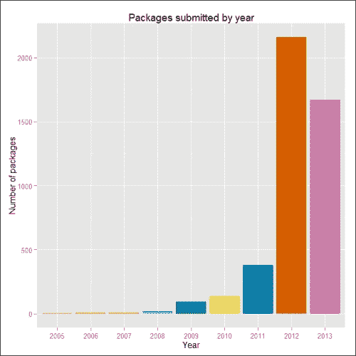

# 零、前言

企业每天获取的数据量呈指数级增长。现在可以在 Hadoop 等低成本平台上存储这些海量信息。

这些组织现在面临的难题是如何处理所有这些数据，以及如何从这些数据中收集关键见解。于是，R 出现了。r 是一个非常神奇的工具，它可以很容易地对数据运行高级统计模型，将导出的模型转换成彩色图形和可视化，并执行更多与数据科学相关的功能。

然而，R 的一个主要缺点是它的可扩展性不是很好。核心 R 引擎可以处理和处理非常有限的数据。由于 Hadoop 在大数据处理中非常受欢迎，因此将 R 与 Hadoop 对应起来以实现可扩展性是下一个逻辑步骤。

这本书专门介绍了 R 和 Hadoop，以及 R 的数据分析操作如何通过使用 Hadoop 这样的平台进行扩展的复杂性。

考虑到这一议程，这本书将迎合广泛的受众，包括数据科学家、统计学家、数据架构师和工程师，他们正在寻找使用 R 和 Hadoop 处理和分析大量信息的解决方案。

在 Hadoop 中使用 R 将提供一个弹性数据分析平台，该平台将根据要分析的数据集的大小进行扩展。然后，有经验的程序员可以在 R 中编写 Map/Reduce 模块，并使用 Hadoop 的并行处理 Map/Reduce 机制来运行它，以识别数据集中的模式。

# 引入 R

r 是一个对数据进行统计分析的开源软件包。r 是数据科学家、统计学家和其他人使用的编程语言，他们需要对数据进行统计分析，并使用回归、聚类、分类和文本分析等机制从数据中收集关键见解。r 注册于 **GNU** ( **通用公共许可证**)。它是由新西兰奥克兰大学的罗斯·伊哈卡和罗伯特·绅士开发的，目前由研发核心团队负责。它可以被认为是由贝尔实验室的约翰·钱伯斯开发的 S 的不同实现。有一些重要的区别，但是使用 R 解释器引擎，很多用 S 编写的代码可以保持不变。

r 提供多种统计、机器学习(线性和非线性建模、经典统计测试、时间序列分析、分类、聚类)和图形技术，并且具有高度可扩展性。r 具有各种内置和扩展的统计、机器学习和可视化任务功能，例如:

*   数据析取
*   数据清理
*   数据加载
*   数据转换
*   统计分析
*   预测建模
*   数据可视化

它是当今市场上最受欢迎的开源统计分析包之一。它是跨平台的，拥有非常广泛的社区支持，以及每天都在添加新包的庞大且不断增长的用户社区。随着包列表的不断增加，R 现在可以与其他数据存储连接，例如 MySQL、SQLite、MongoDB 和 Hadoop，用于数据存储活动。

# 理解 R 的特征

让我们看看 R 的不同有用特性:

*   有效的编程语言
*   关系数据库支持
*   数据分析
*   数据可视化
*   通过庞大的 R 包库进行扩展

# 研究 R 的流行

KD 提供的图表表明 R 是最流行的数据分析和挖掘语言:


下图提供了 2005 年至 2013 年 R 用户发布的 R 包总数的详细信息。这就是我们探索 R 用户的方式。2012 年的增长率是指数级的，2013 年似乎有望超过这一数字。

r 允许通过各种统计和机器学习操作执行数据分析，如下所示:

*   回归
*   分类
*   使聚集
*   建议
*   文本挖掘



# 引入大数据

大数据必须处理大型复杂的数据集，这些数据集可以是结构化的、半结构化的或非结构化的，并且通常不适合要处理的内存。它们必须就地处理，这意味着计算必须在数据所在的地方进行。当我们与实际构建大数据系统和应用的开发人员交谈时，我们会更好地理解他们对 3Vs 的理解。他们通常会提到大数据的 3Vs 模型，即速度、容量和多样性。

速度是指需要应用分析的低延迟、实时速度。这方面的一个典型例子是对源自社交网站的连续数据流或不同数据源的聚合进行分析。

体积是指数据集的大小。它可能以 KB、MB、GB、TB 或 PB 为单位，具体取决于生成或接收数据的应用的类型。

多样性是指可能存在的各种类型的数据，例如文本、音频、视频和照片。

大数据通常包括大小不一的数据集。此类系统不可能在业务要求的时间范围内处理如此大量的数据。大数据量是一个不断变化的目标，截至 2012 年，单个数据集中的数据量从几十万亿字节到几千兆字节不等。面对这个看似不可逾越的挑战，全新的平台被称为大数据平台。


# 获取有关持有大数据的热门组织的信息

持有大数据的一些流行组织如下:

*   脸书:它有 40 PB 的数据，每天捕获 100 TB
*   雅虎！:它有 60 PB 的数据
*   推特:它每天捕获 8 TB
*   易趣:它有 40 PB 的数据，每天捕获 50 TB

有多少数据被视为大数据因公司而异。虽然一家公司的大数据是另一家公司的小数据，但有一个共同点:既不适合内存，也不适合磁盘，有大量需要处理的数据，并且将受益于分布式软件堆栈。对于一些公司，10 TB 的数据将被视为大数据，而对于其他公司，1 PB 的数据将被视为大数据。所以只有你能确定数据是否真的是大数据。可以说，它将从低太字节范围开始。

此外，一个非常值得问的问题是，由于您没有捕获和保留足够的数据，您认为您现在没有大数据问题吗？在某些情况下，公司确实会丢弃数据，因为没有一种经济高效的方法来存储和处理数据。有了 Hadoop 这样的平台，就有可能开始捕获和存储所有这些数据。

# 介绍 Hadoop

Apache Hadoop 是一个开源的 Java 框架，用于处理和查询大型商品硬件集群上的大量数据。Hadoop 是一个顶级的 Apache 项目，由雅虎发起和领导！还有道格·卡特。它的成功有赖于来自世界各地的积极贡献者。

通过雅虎的大量技术投资！，Apache Hadoop 已经成为企业级的云计算技术。它正在成为行业事实上的大数据处理框架。

Hadoop 改变了大规模计算的经济和动态。它的影响可以归结为四个显著特征。Hadoop 支持可扩展、经济高效、灵活、容错的解决方案。

# 探索 Hadoop 特性

Apache Hadoop 有两个主要特性:

*   HDFS (Hadoop 分布式文件系统)
*   MapReduce

## 研究 Hadoop 组件

Hadoop 包括在核心 HDFS 和 MapReduce 层上构建的其他产品生态系统，以支持平台上的各种类型的操作。一些流行的 Hadoop 组件如下:

*   **Mahout** :这是一个庞大的机器学习算法库。
*   **Pig** : Pig 是一种分析大型数据集的高级语言(如 PERL)，有自己的语言语法来表达数据分析程序，再加上评估这些程序的基础设施。
*   **Hive** : Hive 是一个面向 Hadoop 的数据仓库系统，可以方便地进行数据汇总、即席查询以及分析存储在 HDFS 的大型数据集。它有自己的类似 SQL 的查询语言，叫做**Hive 查询语言** ( **HQL** )，用来向 Hadoop 发出查询命令。
*   **HBase**:**HBase**(**Hadoop 数据库**)是一个分布式、面向列的数据库。HBase 使用 HDFS 作为底层存储。它支持使用 MapReduce 的批处理风格计算和原子查询(随机读取)。
*   **Sqoop** : Apache Sqoop 是一款专为在 Hadoop 和结构化关系数据库之间高效传输海量数据而设计的工具。 **Sqoop** 是( **SQ** )L 到 Had( **oop** 的缩写。
*   **ZooKeeper**:ZooKeeper 是维护配置信息、命名、提供分布式同步、分组服务的集中式服务，对于各种分布式系统非常有用。
*   **Ambari** :基于 web 的工具，用于供应、管理和监控 Apache Hadoop 集群，包括对 Hadoop HDFS、Hadoop MapReduce、Hive、HCatalog、HBase、ZooKeeper、Oozie、Pig 和 Sqoop 的支持。

## 了解一起使用 R 和 Hadoop 的原因

我还要说，有时数据驻留在 HDFS(以各种格式)。由于许多数据分析师在 R 中的工作效率很高，因此使用 R 来计算通过 Hadoop 相关工具存储的数据是很自然的。

如前所述，R 的优势在于其使用丰富的包库分析数据的能力，但在处理非常大的数据集时却有所欠缺。另一方面，Hadoop 的优势是存储和处理 TB 甚至 PB 范围内的大量数据。如此庞大的数据集无法在内存中处理，因为每台机器的内存无法容纳如此大的数据集。选项将是在有限的块上运行分析，也称为采样，或者将 R 的分析能力与 Hadoop 的存储和处理能力对应起来，您将获得一个理想的解决方案。这样的解决方案也可以使用亚马逊 EMR 等平台在云中实现。

# 这本书涵盖了什么

[第一章](1.html "Chapter 1. Getting Ready to Use R and Hadoop")、*准备使用 R 和 Hadoop* ，介绍了安装 R 和 Hadoop 的过程。

[第二章](2.html "Chapter 2. Writing Hadoop MapReduce Programs")、*编写 Hadoop MapReduce 程序*，介绍 Hadoop MapReduce 的基础知识以及使用 Hadoop 执行 MapReduce 的方法。

[第 3 章](3.html "Chapter 3. Integrating R and Hadoop")、*集成 R 和 Hadoop* ，展示了通过各种数据处理流程部署和运行 RHadoop 和 RHIPE 的示例 MapReduce 程序。

[第四章](4.html "Chapter 4. Using Hadoop Streaming with R")、*用 R 使用 Hadoop Streaming*，展示如何用 R 使用 Hadoop Streaming

[第 5 章](5.html "Chapter 5. Learning Data Analytics with R and Hadoop")、*用 R 和 Hadoop* 学习数据分析，通过用真实数据分析问题进行演示，介绍数据分析项目生命周期。

[第 6 章](6.html "Chapter 6. Understanding Big Data Analysis with Machine Learning")、*用机器学习理解大数据分析*，涵盖了用 RHadoop 通过机器学习技术执行大数据分析。

[第 7 章](7.html "Chapter 7. Importing and Exporting Data from Various DBs")、*从各种数据库*导入和导出数据，介绍了如何与流行的关系数据库接口，用 r

[附录](8.html "Appendix A. References")、*参考文献*，描述了与所有章节内容相关的附加资源的链接。

# 这本书你需要什么

由于我们将使用 R 和 Hadoop 执行大数据分析，您应该具备 R 和 Hadoop 的基本知识以及如何执行实践，并且您需要安装和配置 R 和 Hadoop。如果你已经有了更大规模的数据和问题定义，可以用数据驱动的技术来解决，比如 R 和 Hadoop 函数，那就太好了。

# 这本书是给谁的

这本书非常适合正在寻找用 Hadoop 执行大数据分析的方法的研发人员。他们想要集成 R 和 Hadoop 的所有技术，如何编写 Hadoop MapReduce，以及在 R 中开发和运行 Hadoop MapReduce 的教程。此外，这本书面向那些了解 Hadoop 并希望使用 R 包在大数据上构建一些智能应用的人。如果读者有 r 的基础知识会有帮助。

# 惯例

在这本书里，你会发现许多区分不同种类信息的文本风格。以下是这些风格的一些例子，以及对它们的含义的解释。

文本中的码字、数据库表名、文件夹名、文件名、文件扩展名、路径名、虚拟网址、用户输入和推特句柄如下所示:“准备`Map()`输入。”

代码块设置如下:

```r
<property>
<name>mapred.job.tracker</name>
<value>localhost:54311</value>
<description>The host and port that the MapReduce job tracker runs
at. If "local", then jobs are run in-process as a single map
and reduce task.
</description>
</property>
```

任何命令行输入或输出都编写如下:

```r
// Setting the environment variables for running Java and Hadoop commands
export HADOOP_HOME=/usr/local/hadoop
export JAVA_HOME=/usr/lib/jvm/java-6-sun

```

**新名词**和**重要词语**以粗体显示。你在屏幕上看到的单词，例如在菜单或对话框中，出现在如下文本中:“打开**密码**标签。”。

### 注

警告或重要提示会出现在这样的框中。

### 类型

提示和技巧是这样出现的。

# 读者反馈

我们随时欢迎读者的反馈。让我们知道你对这本书的看法——你喜欢或可能不喜欢什么。读者反馈对我们开发您真正能从中获得最大收益的标题非常重要。

要给我们发送一般反馈，只需向`<[feedback@packtpub.com](mailto:feedback@packtpub.com)>`发送电子邮件，并通过您的消息主题提及书名。

如果你对某个主题有专业知识，并且对写作或投稿感兴趣，请参阅我们在[www.packtpub.com/authors](http://www.packtpub.com/authors)上的作者指南。

# 客户支持

现在，您已经自豪地拥有了一本书，我们有许多东西可以帮助您从购买中获得最大收益。

## 下载示例代码

您可以从您在[http://www.packtpub.com](http://www.packtpub.com)的账户中下载您购买的所有 Packt 书籍的示例代码文件。如果您在其他地方购买了这本书，您可以访问[http://www.packtpub.com/support](http://www.packtpub.com/support)并注册，以便将文件直接通过电子邮件发送给您。

## 勘误表

尽管我们尽了最大努力来确保我们内容的准确性，但错误还是会发生。如果你在我们的某本书里发现了错误——可能是文本或代码中的错误——如果你能向我们报告，我们将不胜感激。通过这样做，你可以让其他读者免受挫折，并帮助我们改进这本书的后续版本。如果您发现任何勘误表，请访问[http://www.packtpub.com/submit-errata](http://www.packtpub.com/submit-errata)，选择您的书籍，点击**勘误表** **提交** **表格**链接，并输入您的勘误表详情。一旦您的勘误表得到验证，您的提交将被接受，勘误表将上传到我们的网站上，或添加到该标题的勘误表部分下的任何现有勘误表列表中。通过从[http://www.packtpub.com/support](http://www.packtpub.com/support)中选择您的标题，可以查看任何现有的勘误表。

## 盗版

互联网上版权材料的盗版是所有媒体的一个持续问题。在 Packt，我们非常重视版权和许可证的保护。如果您在互联网上遇到任何形式的我们作品的非法拷贝，请立即向我们提供位置地址或网站名称，以便我们寻求补救。

请通过`<[copyright@packtpub.com](mailto:copyright@packtpub.com)>`联系我们，获取疑似盗版资料的链接。

我们感谢您在保护我们作者方面的帮助，以及我们为您带来有价值内容的能力。

## 问题

如果您对本书的任何方面有问题，可以在`<[questions@packtpub.com](mailto:questions@packtpub.com)>`联系我们，我们将尽最大努力解决。