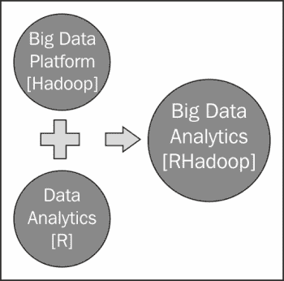
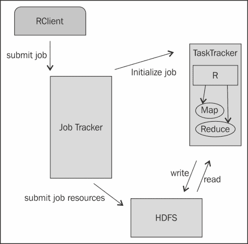
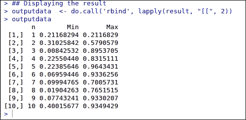
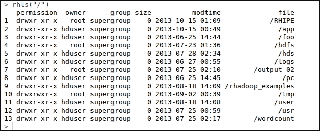
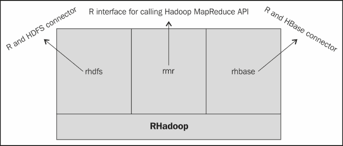
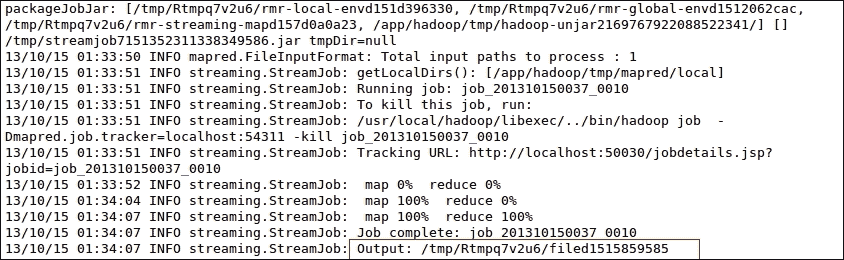
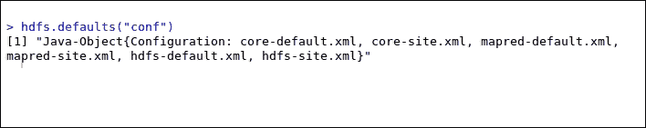

# 三、集成 R 和 Hadoop

在前两章中，我们获得了关于如何安装 R 和 Hadoop 工具的基本信息。此外，我们还了解了 Hadoop 的主要功能，以及为什么它们与大数据解决方案集成在一起，以解决业务数据问题。因此，借助 R 和 Hadoop 的集成，我们可以将数据分析转向大数据分析。这两种中间件在一起使用时仍在不断改进。

在[第二章](2.html "Chapter 2. Writing Hadoop MapReduce Programs")*编写 Hadoop MapReduce 程序*中，我们学习了如何在 Hadoop 中编写 MapReduce 程序。在这一章中，我们将学习在 Hadoop 集群上运行的 MapReduce 程序。本章将提供关于 RHIPE 和 RHadoop 的开发教程。在安装了 R 和 Hadoop 之后，我们将看到如何使用简单的步骤来集成 R 和 Hadoop。

在我们开始安装之前，让我们看看在一个组织中集成 R 和 Hadoop 有什么好处。由于统计学家和数据分析师经常使用 R 工具进行数据探索和数据分析，Hadoop 集成对于处理大规模数据是一大福音。类似地，使用 Hadoop 工具(如系统)来组织数据仓库的数据工程师可以执行这样的逻辑分析操作，以获得信息丰富的见解，这些见解可以通过与 R 工具集成来操作。

因此，这种数据驱动的工具和技术的集成可以构建一个强大的可扩展系统，该系统具有这两者的特点。



链接 R 和 Hadoop 的三种方式如下:

*   瑞佩
*   RHadoop
*   Hadoop 流

在本章中，我们将学习与 RHIPE 和 RHadoop 的集成和分析。Hadoop 流将在[第 4 章](4.html "Chapter 4. Using Hadoop Streaming with R")、*中介绍使用带有 R* 的 Hadoop 流。

# 引入 RHIPE

**RHIPE** 代表 **R 和 Hadoop 集成编程环境**。正如在[http://www.datadr.org/](http://www.datadr.org/)上提到的，在希腊语中是“一瞬间”的意思，是 R 和 Hadoop 的合并。它最早是由*萨普塔什古哈*为他 2012 年在普渡大学统计系的博士论文开发的。目前，这是由普渡大学统计系团队和其他活跃的谷歌讨论组进行的。

RHIPE 包使用 **分割和重组**技术对大数据进行数据分析。在这种技术中，数据被分成子集，通过特定的 R 分析操作对这些子集执行计算，并组合输出。RHIPE 主要设计用于实现两个目标，如下所示:

*   允许您对大数据和小数据进行深入分析。
*   允许用户使用低级语言在 R 中执行分析操作。RHIPE设计有几个功能，可以使用简单的 R 控制台帮助执行 **Hadoop 分布式文件系统** ( **HDFS** )以及 MapReduce 操作。

与 HDFS 和 MapReduce 操作相比，RHIPE 是一个低级接口。使用 RHIPE 的最新支持版本 0.73.1 作为`Rhipe_0.73.1-2.tar.gz`。

## 安装 RHIPE

由于 RHIPE 是 R 和 Hadoop 的连接器，我们需要 Hadoop 和 R 按照以下顺序安装在我们的机器上或集群中:

1.  安装 Hadoop。
2.  安装 r。
3.  安装协议缓冲区。
4.  设置环境变量。
5.  正在安装 rJava。
6.  安装 RHIPE。

让我们从安装开始。

### 安装 Hadoop

当我们在这里将 R 和 Hadoop 与 RHIPE 包库集成时，我们需要在我们的机器上安装 Hadoop 。根据要分析的数据大小，可以任意选择是单节点安装还是多节点安装。

因为我们已经学习了如何在 Ubuntu 中安装 Hadoop，所以我们不打算在这里重复这个过程。如果您还没有安装，请参考[第 1 章](1.html "Chapter 1. Getting Ready to Use R and Hadoop")、*准备使用 R 和 Hadoop* ，获取指导。

### 安装 R

如果我们使用多节点 Hadoop 架构，则有多个任务跟踪器节点用于执行 MapReduce 作业。因此，我们需要在所有这些任务跟踪器节点上安装 R。这些任务跟踪器节点将通过开发的地图开始处理数据子集，并通过考虑关键值减少逻辑。

### 安装协议缓冲区

协议缓冲区只是序列化数据，使其独立于平台、中立且健壮(主要用于结构化数据)。谷歌使用相同的协议进行数据交换。RHIPE 依赖协议缓冲区 2.4.1 在网络上进行数据序列化。

可以使用以下命令进行安装:

```r
## For downloading the protocol buffer 2.4.1
wget http://protobuf.googlecode.com/files/protobuf-2.4.1.tar.gz

## To extracting the protocol buffer
tar -xzf protobuf-2.4.1.tar.gz

## To get in to the extracted protocol buffer directory
cd protobuf-2.4.1

## For making install the protocol buffer
./configure # --prefix=...
make
make install

```

### 环境变量

为了使 RHIPE 能够正确编译和工作，最好确保适当设置以下环境变量:

对于配置Hadoop 库，我们需要在`hduser` (Hadoop 用户)的`~./bashrc`文件中设置两个变量`PKG_CONFIG_PATH`和`LD_LIBRARY_PATH`，以便在用户登录系统时自动设置。

这里，`PKG_CONFIG_PATH`是保存`pkg-config`脚本路径的环境变量，用于检索系统中已安装库的信息，`LD_LIBRARY_PATH`是保存本机共享库路径的环境变量。

```r
export PKG_CONFIG_PATH = /usr/local/lib
export LD_LIBRARY_PATH = /usr/local/lib

```

您也可以从您的控制台设置所有这些变量，如下所示:

```r
Sys.setenv(HADOOP_HOME="/usr/local/hadoop/")
Sys.setenv(HADOOP_BIN="/usr/local/hadoop/bin")
Sys.setenv(HADOOP_CONF_DIR="/usr/local/hadoop/conf")

```

其中`HADOOP_HOME`用于指定 Hadoop 目录的位置，`HADOOP_BIN`用于指定 Hadoop 二进制文件的位置，`HADOOP_CONF_DIR`用于指定 Hadoop 的配置文件。

设置变量是临时的，并且在特定的 R 会话之前是有效的。如果我们想使这个变量永久化，就像在 R 会话初始化时自动初始化一样，我们需要将这些变量设置到`/etc/R/Renviron`文件中，就像我们在特定用户配置文件的`.bashrc`中设置环境变量一样。

### rJava 包安装

由于 RHIPE 是一个 Java 包，它就像是 R 和 Hadoop 之间的 Java 桥梁。RHIPE 将输入数据序列化为 Java 类型，该类型必须通过集群进行序列化。它需要一个 Java 的低级接口，由 rJava 提供。因此，我们将安装 rJava 来实现 RHIPE 的功能。

```r
## For installing the rJava Package will be used for calling java libraries from R.
install.packages("rJava")

```

### 安装 RHIPE

现在，是时候从 RHIPE 包的存储库中安装它了。

```r
## Downloading RHIPE package from RHIPE repository
Wget http://ml.stat.purdue.edu/rhipebin/Rhipe_0.73.1-2.tar.gz

## Installing the RHIPE package in R via CMD command
R CMD INSTALL Rhipe_0.73.1.tar.gz

```

现在，我们已经准备好了一个 RHIPE 系统，可以用 R 和 Hadoop 进行数据分析。

## 了解 RHIPE 的架构

让我们了解RHIPE 库包的工作原理，该库包旨在集成 R 和 Hadoop 以实现有效的大数据分析。



RHIPE 的成分

有许多 Hadoop 组件将用于 R 和 Hadoop 的数据分析操作。

RHIPE 的成分如下:

*   **rcclient**:rcclient是一个 R 应用程序，调用 **JobTracker** 执行作业，并带有若干 MapReduce 作业资源的指示，如 Mapper、Reducer、输入格式、输出格式、输入文件、输出文件以及其他几个可以用 rcclient 处理 MapReduce 作业的参数。
*   **作业跟踪器**:一个作业跟踪器是 Hadoop MapReduce 操作的主节点，用于初始化和监控 Hadoop 集群上的 MapReduce 作业。
*   **任务跟踪器**:任务跟踪器是 Hadoop 集群中的从节点。它按照作业跟踪器给出的命令执行地图缩减作业，检索输入数据块，并在其上运行特定于 R 的`Mapper`和`Reducer`。最后，输出将被写入 HDFS 目录。
*   **HDFS** : HDFS 是一个分布在 Hadoop 集群上的文件系统，有几个数据节点。它为各种数据操作提供数据服务。

## 了解 RHIPE 样品

在本节中，我们将创建两个 RHIPE MapReduce 示例。这两个例子是用 RHIPE 包中 Hadoop MapReduce 作业的基本实用程序定义的。

### RHIPE 示例程序(仅限地图)

MapReduce 问题定义:这个 MapReduce 示例程序的目标是在 Hadoop 环境下，通过对数值数据使用`min`和`max`函数来测试 RHIPE 安装。由于这是一个示例程序，我们只包括了地图阶段，它将把输出存储在 HDFS 目录中。

要用 RHIPE 开始开发，我们需要通过加载库并调用 `rhinit()`方法来初始化 RHIPE 子系统。

```r
## Loading the RHIPE library
library(Rhipe)

## initializing the RHIPE subsystem, which is used for everything. RHIPE will not work if rhinit is not called.
rhinit()

```

输入:我们插入一个数值，而不是使用文件作为输入。

映射阶段:这个 MapReduce 程序的映射阶段将调用 10 个不同的迭代，在所有这些迭代中，将根据它们的迭代号生成从 1 到 10 的随机数。之后，将计算生成的数字的最大值和最小值。

```r
## Defining the Map phase

Map(function(k,v){

## for generating the random deviates
 X  runif(v)

## for emitting the key-value pairs with key – k and
## value – min and max of generated random deviates.
 rhcollect(k, c(Min=min(x),Max=max(x))
}

```

输出:最后，地图阶段的输出在这里将被视为该地图缩减作业的输出，并将在`/app/hadoop/RHIPE/`存储到 HDFS。

通过 RHIPE 包的 `rhwatch()`方法定义 MapReduce 作业:

```r
## Create and running a MapReduce job by following
job = rhwatch(map=map,input=10,reduce=0,
output="/app/Hadoop/RHIPE/test",jobname='test')

```

读取来自 HDFS 的 MapReduce 输出:

```r
## Read the results of job from HDFS
result <- rhread(job)

```

要以更易读的表格格式显示结果，请使用以下代码:

```r
## Displaying the result
outputdata  <- do.call('rbind', lapply(result, "[[", 2))

```

输出:



### 字数

MapReduce 问题定义:这个 RHIPE MapReduce 程序被定义用于识别在提供的输入文本文件中出现的所有单词的频率。

还要注意，这和我们在[第 2 章](2.html "Chapter 2. Writing Hadoop MapReduce Programs")、*编写 Hadoop MapReduce 程序*中看到的问题是一样的。

```r
## Loading the RHIPE Library
library(Rhipe)

```

输入:我们将使用 Hadoop 发行版附带的`CHANGES.txt`文件，并将其与此 MapReduce 算法一起使用。通过使用以下命令，我们将它复制到 HDFS:

```r
rhput("/usr/local/hadoop/CHANGES.txt","/RHIPE/input/")

```

映射阶段:映射阶段包含从文件中读取所有单词并将它们全部赋值给`1`的代码。

```r
## Defining the Map functionw_map<-expression({ words_vector<-unlist(strsplit(unlist(map.values)," ")) lapply(words_vector,function(i) rhcollect(i,1))
})

```

还原阶段:通过这个还原任务，我们可以计算出输入文本文件中单词的总出现频率。

```r
## For reference, RHIPE provides a canned version
Reduce = rhoptions()$templates$scalarsummer

## Defining the Reduce functionw_reduce<-expression(pre={total=0},reduce={total<-sum(total,unlist(reduce.values))},post={rhcollect(reduce.key,total)})

```

定义 MapReduce 作业对象:定义了字数映射器和缩减器之后，我们需要设计`driver`方法，通过依次调用`Mapper`和`Reducer`来执行这个 MapReduce 作业。

```r
## defining and executing a MapReduce job object
Job1 <- rhwatch(map=w_map,reduce=w_reduce, ,input="/RHIPE/input/",output="/RHIPE/output/", jobname="word_count")

```

读取 MapReduce 输出:

```r
## for reading the job output data from HDFS
Output_data <- rhread(Job1)results <- data.frame(words=unlist(lapply(Output_data,"[[",1)), count =unlist(lapply(Output_data,"[[",2)))

```

MapReduce 作业的输出将存储到`output_data`，我们将把这个输出转换成 R 支持的数据帧格式。数据帧输出将存储到`results`变量中。为了在数据框中显示 MapReduce 输出，格式如下:

`head (results)`输出:


`tail (results)`输出:


## 了解 RHIPE 功能参考

RHIPE 是专门为在 Hadoop 上提供低级接口而设计的。因此，拥有 RHIPE 包的 R 用户可以轻松地对存储在 HDFS 的大型数据集执行 Hadoop 数据操作，就像 R 中调用的 `print()`函数一样

现在我们将看到 RHIPE 库中所有可用方法的所有可能的功能用途。所有这些方法分为三类:初始化、 HDFS 和 MapReduce 操作。

### 初始化

我们使用以下命令进行初始化:

*   `rhinit`: This is used to initialize the Rhipe subsystem.

    `rhinit(TRUE,TRUE)`

### HDFS

我们使用以下命令进行 HDFS 操作:

*   `rhls`: This is used to retrieve all directories from HDFS.

    它的语法是`rhls(path)`

    `rhls("/")`

    输出:

    

*   `hdfs.getwd`:此用于获取当前工作 HDFS 目录。它的语法是`hdfs.getwd()`
*   `hdfs.setwd`:此用于设置当前工作 HDFS 目录。它的语法是`hdfs.setwd("/RHIPE")`
*   `rhput`:这是用来将文件从本地目录复制到 HDFS。它的语法是`rhput(src,dest)`和`rhput("/usr/local/hadoop/NOTICE.txt","/RHIPE/")`。
*   `rhcp`:这是用来将文件从一个 HDFS 位置复制到另一个 HDFS 位置。它的语法是`rhcp('/RHIPE/1/change.txt','/RHIPE/2/change.txt')`。
*   `rhdel`:这里是用来从 HDFS 删除一个目录/文件。它的语法是`rhdel("/RHIPE/1")`。
*   `rhget`:此用于将 HDFS 文件复制到本地目录。它的语法是`rhget("/RHIPE/1/part-r-00000", "/usr/local/")`。
*   `rwrite`:这个是用来给 HDFS 写 R 数据的。其语法为`rhwrite(list(1,2,3),"/tmp/x")`。

### MapReduce

我们使用以下命令进行 MapReduce 操作:

*   `rhwatch`:此用于准备、提交、监控 MapReduce 作业。

    ```r
    # Syntax:
    rhwatch(map, reduce, combiner, input, output, mapred,partitioner,mapred, jobname)

    ## to prepare and submit MapReduce job:

    z=rhwatch(map=map,reduce=0,input=5000,output="/tmp/sort",mapred=mapred,read=FALSE)

    results <- rhread(z)

    ```

*   `rhex`:这是用来在 Hadoop 集群上执行 MapReduce 作业。

    ```r
    ## Submit the job
    rhex(job)

    ```

*   `rhjoin`:这里是用来检查 MapReduce 作业是否完成。它的语法是`rhjoin(job)`。
*   `rhkill`:这个用来杀死正在运行的 MapReduce 作业。其语法为`rhkill(job)`。
*   `rhoptions`:此用于获取或设置 RHIPE 配置选项。它的语法是`rhoptions()`。
*   `rhstatus`:此用于获取 RHIPE MapReduce 作业的状态。它的语法是`rhstatus(job)`。

    ```r
    rhstatus(job, mon.sec = 5, autokill = TRUE,showErrors = TRUE, verbose = FALSE, handler = NULL)

    ```

# 介绍 RHadoop

RHadoop 是三个 R 包的集合，用于在 R 环境中提供大型数据操作。它是由 Revolution Analytics 开发的，Revolution Analytics 是基于 R. RHadoop 的领先商业软件提供商，提供三个主要的 R 包:`rhdfs`、`rmr`和`rhbase`。它们都提供了不同的 Hadoop 特性。

*   `rhdfs`是一个 R 接口，用于从 R 控制台提供 HDFS 可用性。当 Hadoop MapReduce 程序在 HDFS 上编写输出时，通过调用`rhdfs`方法很容易访问它们。R 程序员可以轻松地对分布式数据文件执行读写操作。基本上，`rhdfs`包调用后端的 HDFS API 来操作存储在 HDFS 的数据源。
*   `rmr`是一个 R 接口，用于在 R 环境中提供 Hadoop MapReduce 工具。所以，R 程序员只需要将他们的应用逻辑划分到图中，减少阶段，用`rmr`方法提交。之后，`rmr`调用 Hadoop 流 MapReduce API，将多个作业参数作为输入目录、输出目录、映射器、缩减器等，在 Hadoop 集群上执行 R MapReduce 作业。
*   `rhbase`是一个 R 接口，用于通过一个节俭服务器操作存储在分布式网络中的 Hadoop HBase 数据源。`rhbase`包设计有多种初始化、读/写和表操作方法。

这里不需要安装所有三个 RHadoop 包来运行带有 R 和 Hadoop 的 Hadoop MapReduce 操作。如果我们已经将我们的输入数据源存储在了 HBase 数据源，我们需要安装`rhbase`；否则我们需要`rhdfs`和`rmr`套餐。由于 Hadoop 最受欢迎的两个主要功能是 Hadoop MapReduce 和 HDFS，这两个功能都将在 RHadoop `rhdfs`和`rmr`包的帮助下在 R 控制台中使用。这些包足够从 r 运行 Hadoop MapReduce，基本上`rhdfs`提供 HDFS 数据操作，`rmr`提供 MapReduce 执行操作。

RHadoop 还包括另一个名为`quick check`的包，它是设计用于调试由`rmr`包定义的已开发的 MapReduce 作业。

在下一节中，我们将看到它们的架构关系以及安装步骤。

## 了解 RHadoop 的架构

由于 Hadoop 因 HDFS 和 MapReduce 而高度流行，Revolution Analytics 开发了独立的 R 包，即`rhdfs`、`rmr`和`rhbase`。RHadoop 的架构如下图所示:



RHadoop 生态系统

## 安装 RHadoop

在本节中，我们将学习三个 RHadoop 包的一些安装技巧，包括它们的先决条件。

*   **R and Hadoop installation**: As we are going to use an R and Hadoop integrated environment, we need Hadoop as well as R installed on our machine. If you haven't installed yet, see [Chapter 1](1.html "Chapter 1. Getting Ready to Use R and Hadoop"), *Getting Ready to Use R and Hadoop*. As we know, if we have too much data, we need to scale our cluster by increasing the number of nodes. Based on this, to get RHadoop installed on our system we need Hadoop with either a single node or multimode installation as per the size of our data.

    RHadoop 已经用 Cloudera、Hortonworks 和 MapR 提供的几个 Hadoop 发行版进行了测试。

*   **Installing the R packages**: We need several R packages to be installed that help it to connect R with Hadoop. The list of the packages is as follows:
    *   棕色
    *   RJSONIO
    *   迭代工具
    *   摘要
    *   Rcpp 公司
    *   http(http)
    *   功能的
    *   dev 工具
    *   -你好
    *   重塑 2

    我们可以通过在 R 控制台中调用以下 R 命令的执行来安装它们:

    ```r
    install.packages( c('rJava','RJSONIO', 'itertools', 'digest','Rcpp','httr','functional','devtools', 'plyr','reshape2'))

    ```

*   **Setting environment variables**: We can set this via the R console using the following code:

    ```r
    ## Setting HADOOP_CMD
    Sys.setenv(HADOOP_CMD="/usr/local/hadoop/bin/hadoop")

    ## Setting up HADOOP_STREAMING
    Sys.setenv(HADOOP_STREAMING="/usr/local/hadoop/contrib/streaming/hadoop-streaming-1.0.3.jar")

    ```

    或者，我们也可以通过命令行设置 R 控制台，如下所示:

    ```r
    export HADOOP_CMD=/usr/local/Hadoop
    export HADOOP_STREAMING=/usr/lib/hadoop-0.20-mapreduce/contrib/streaming/hadoop-streaming-2.0.0-mr1-cdh4.1.1.jar

    ```

*   安装 RHadoop [ `rhdfs`、`rmr`、`rhbase` ]
    1.  从革命分析的 GitHub 存储库中下载 RHadoop 包:[https://github.com/RevolutionAnalytics/RHadoop](https://github.com/RevolutionAnalytics/RHadoop)。
        *   `rmr` : [ `rmr-2.2.2.tar.gz` ]
        *   `rhdfs` : [ `rhdfs-1.6.0.tar.gz` ]
        *   `rhbase` : [ `rhbase-1.2.0.tar.gz` ]
    2.  Installing packages.
        *   对于 rmr，我们使用:

            ```r
            R CMD INSTALL rmr-2.2.2.tar.gz

            ```

        *   对于`rhdfs`我们使用:

            ```r
            R CMD INSTALL rmr-2.2.2.tar.gz

            ```

        *   对于`rhbase`我们使用:

            ```r
            R CMD INSTALL rhbase-1.2.0.tar.gz

            ```

        ### 类型

        要安装 rhbase，我们需要在我们的 Hadoop 集群上安装 hbase 和 Zookeeper。

### 理解 RHadoop 示例

一旦我们完成了 rhadop 的安装，我们可以通过使用 rhadop 示例程序中的`rmr2`和`rhdfs`库运行 MapReduce 作业来测试设置，如下所示:

```r
## loading the libraries
library(rhdfs')
library('rmr2')

## initializing the RHadoop
hdfs.init()

# defining the input data
small.ints = to.dfs(1:10)

## Defining the MapReduce job
mapreduce(
# defining input parameters as small.ints hdfs object, map parameter as function to calculate the min and max for generated random deviates.
  input = small.ints, 
  map = function(k, v)
  {
lapply(seq_along(v), function(r){

  x <- runif(v[[r]])
    keyval(r,c(max(x),min(x))) 
  })}) 

```

运行这几行后，只需按 *Ctrl* + *回车*即可执行本 MapReduce 程序。如果成功，最后一行将出现，如下图所示:



其中最后一行的字符表示 MapReduce 作业的输出位置。

要读取执行的 MapReduce 作业的结果，请复制最后一行中提供的输出位置，并将其传递给`rhdfs`的`from.dfs()`功能。


其中前一个输出的第一列表示最大值，第二列表示最小值。

#### 字数

MapReduce 问题定义:这个 RHadoop MapReduce 程序被定义为识别在提供的输入文本文件中出现的所有单词的频率。

此外，请注意，这与我们在[第 2 章](2.html "Chapter 2. Writing Hadoop MapReduce Programs")*编写 Hadoop MapReduce 程序*中关于 RHIPE 的上一节中学习的 MapReduce 问题相同。

```r
wordcount = function(input, output = NULL, pattern = " "){

```

地图阶段:此`map`功能将逐行读取文本文件，并用空格分割。该映射阶段将为映射器捕获的所有字分配`1`作为值。

```r
wc.map = function(., lines) {
 keyval(
 unlist(
 strsplit(
 x = lines,
 split = pattern)),
 1)}

```

减少相位:减少相位将通过对具有相同键的单词执行求和操作来计算所有单词的总频率。

```r
wc.reduce = function(word, counts ) {
 keyval(word, sum(counts))}

```

定义 MapReduce 作业:在定义了字数映射器和 Reduce 之后，我们需要创建`driver`方法，开始执行 MapReduce。

```r
# To execute the defined Mapper and Reducer functions
# by specifying the input, output, map, reduce and input.format as parameters.

# Syntax:
# mapreduce(input, output, input.format, map,reduce,
# combine)

mapreduce(input = input ,
 output = output,
 input.format = "text",
 map = wc.map,
 reduce = wc.reduce,
 combine = T)}

```

执行 MapReduce 作业:我们将通过将输入数据位置作为参数传递给`wordcount`函数来执行 RHadoop MapReduce 作业。

```r
wordcount('/RHadoop/1/')

```

探索`wordcount`输出:

```r
from.dfs("/tmp/RtmpRMIXzb/file2bda5e10e25f")

```

### 理解 RHadoop 函数引用

RHadoop 有三个不同的包，分别是 HDFS、MapReduce 和 HBase 操作，用于对数据执行操作。

下面我们来看看如何使用`rmr`和`rhdfs`包功能:

#### HDFS 包

分类功能有:

*   Initialization
    *   `hdfs.init`:此用于初始化`rhdfs`包。它的语法是`hdfs.init()`。
    *   `hdfs.defaults`:用于检索和设置`rhdfs`默认值。它的语法是`hdfs.defaults()`。

    要检索`hdfs`配置默认值，请参考以下屏幕截图:

    

*   文件操作
    *   `hdfs.put`:这个用于将文件从本地文件系统复制到 HDFS 文件系统。

        ```r
        hdfs.put('/usr/local/hadoop/README.txt','/RHadoop/1/')

        ```

    *   `hdfs.copy`:这个用来将文件从 HDFS 目录复制到本地文件系统。

        ```r
        hdfs.put('/RHadoop/1/','/RHadoop/2/')

        ```

    *   `hdfs.move`:这个用来把一个文件从一个 HDFS 目录移动到另一个 HDFS 目录。

        ```r
        hdfs.move('/RHadoop/1/README.txt','/RHadoop/2/')

        ```

    *   `hdfs.rename`:此用于将存放在 HDFS 的文件从

        ```r
        hdfs.rename('/RHadoop/README.txt','/RHadoop/README1.txt')

        ```

        重命名
    *   `hdfs.delete`:此用于从

        ```r
        hdfs.delete("/RHadoop")

        ```

        中删除 HDFS 文件或目录
    *   `hdfs.rm`:此用于从

        ```r
        hdfs.rm("/RHadoop")

        ```

        中删除 HDFS 文件或目录
    *   `hdfs.chmod`:这个是用来更改一些文件的权限的。

        ```r
        hdfs.chmod('/RHadoop', permissions= '777')

        ```

*   文件读/写:
    *   `hdfs.file`:此用于将文件初始化为用于读/写操作。

        ```r
        f = hdfs.file("/RHadoop/2/README.txt","r",buffersize=104857600)

        ```

    *   `hdfs.write`:这个是用来通过流媒体写入 HDFS 存储的文件的。

        ```r
        f = hdfs.file("/RHadoop/2/README.txt","r",buffersize=104857600)
        hdfs.write(object,con,hsync=FALSE)

        ```

    *   `hdfs.close`:这是用来在文件操作完成时关闭流。它将关闭流，并且不允许进一步的文件操作。

        ```r
        hdfs.close(f)

        ```

    *   `hdfs.read`: This is used to read from binary files on the HDFS directory. This will use the stream for the deserialization of the data.

        f = HDFS . file("/Rhadoop/2/README . txt "，" r "，buffersize=104857600)

        m = hdfs.read(f)

        c =罗托卡(m)

        印刷(c)

*   目录操作:
    *   `hdfs.dircreate`或`hdfs.mkdir` :这两个功能都将用于在 HDFS 文件系统上创建目录。

        ```r
        hdfs.mkdir("/RHadoop/2/")

        ```

    *   `hdfs.rm` 或`hdfs.rmr`或`hdfs.delete` -从 HDFS 删除目录或文件。

        ```r
        hdfs.rm("/RHadoop/2/")

        ```

*   Utility:
    *   `hdfs.ls`: This is used to list the directory from HDFS.

        ```r
        Hdfs.ls('/')

        ```

        

    *   `hdfs.file.info`:用于获取存储在 HDFS 的文件的元信息。

        ```r
        hdfs.file.info("/RHadoop")

        ```

    

#### rmr 包

功能类别如下:

*   用于存储和检索数据:
    *   `to.dfs`: This is used to write R objects from or to the filesystem.

        small.ints = to.dfs(1:10)

    *   `from.dfs`: This is used to read the R objects from the HDFS filesystem that are in the binary encrypted format.

        from . DFS('/tmp/rtmprmizb/file 2 bda3fa 07850 ')

*   对于 MapReduce :
    *   `mapreduce`: This is used for defining and executing the MapReduce job.

        mapreduce(输入、输出、映射、缩减、组合、input.fromat、output.format、verbose)

    *   `keyval`: This is used to create and extract key-value pairs.

        keyval（key， val）

# 总结

由于 RHadoop 被认为是成熟的，我们将在后面的章节中进行数据分析时考虑它。在[第 5 章](5.html "Chapter 5. Learning Data Analytics with R and Hadoop")、*用 R 和 Hadoop 学习数据分析*和[第 6 章](6.html "Chapter 6. Understanding Big Data Analysis with Machine Learning")、*用机器学习理解大数据分析*中，我们将深入探讨一些大数据分析技术，并看看 RHadoop 如何解决现实世界的问题。到目前为止，我们已经学习了如何使用 RHIPE 和 RHadoop 用 R 和 Hadoop 编写 MapReduce 程序。在下一章中，我们将看到如何使用 Hadoop 流实用程序以及 Hadoop 流 R 包编写 Hadoop MapReduce 程序。