# 第一章。深度学习导论

|   | *“到目前为止，人工智能最大的危险是，人们过早地得出结论，认为自己理解了它。”* |   |
|   | -Eliezer yukowsky |

有没有想过，为什么下棋经常很难打败电脑，即使是对最好的棋手来说？脸书是如何在数亿张照片中认出你的脸的？您的手机如何识别您的声音，并将呼叫从列出的数百个联系人中重定向到正确的人？

这本书的主要目标是处理这些查询，并为读者提供详细的解决方案。这本书可以被各种各样的读者用于各种各样的原因，然而，我们写这本书时考虑了两个主要的目标受众。主要目标受众之一是学习深度学习和人工智能的本科生或研究生；第二类读者是已经具备大数据、深度学习和统计建模知识的软件工程师，但希望快速获得深度学习如何用于大数据的知识，反之亦然。

本章将主要通过提供基本概念、术语、特征和深度学习的主要挑战来为读者奠定基础。本章还将提出不同深度网络算法的分类，这些算法在过去十年中被研究者广泛使用。以下是本章将涵盖的主要主题:

*   开始深度学习
*   深入学习术语
*   深度学习:人工智能的一场革命
*   深度学习网络的分类

自从文明出现以来，人们就一直梦想着制造出行为和工作完全像人类的人造机器或机器人。从希腊神话人物到古代印度教史诗，这样的例子数不胜数，清楚地表明了人们对创造和拥有人工生命的兴趣和倾向。

在最初的计算机时代，人们一直想知道计算机是否能变得像人类一样聪明！展望未来，即使在医学领域，对自动化机器的需求也变得不可或缺，几乎不可避免。有了这种需求和同一领域不断的研究，**人工智能** ( **人工智能**)已经成为一项蓬勃发展的技术，在多个领域有各种应用，如图像处理、视频处理以及医学中的许多其他诊断工具。

虽然人工智能系统每天都会解决很多问题，但是没有人知道人工智能系统是如何编程的具体规则！一些直观的问题如下:

*   谷歌搜索，它能很好地理解你输入或说出的内容
*   如前所述，脸书也有点擅长识别你的脸，从而理解你的兴趣

而且，随着其他各个领域的融合，例如概率、线性代数、统计学、机器学习、深度学习等等，随着时间的推移，人工智能已经在研究领域获得了巨大的普及。

人工智能早期成功的关键原因之一可能是它基本上处理了计算机不需要大量知识的基本问题。例如，在 1997 年，IBM 的深蓝下棋系统能够击败世界冠军加里·卡斯帕罗夫[1]。虽然这种成就在当时可以认为意义重大，但仅仅用象棋中涉及的有限规则训练计算机，绝对不是一项繁重的任务！用固定且有限数量的规则训练一个系统被称为计算机的*硬编码知识*。许多人工智能项目已经用许多传统语言经历了这种关于世界各个方面的硬编码知识。随着时间的推移，这种硬编码的知识似乎不适用于处理大量数据的系统。此外，数据遵循的规则数量也在频繁变化。因此，遵循该系统的大多数项目都没有达到预期的高度。

这种硬编码知识面临的挫折意味着，这些人工智能系统需要某种方式从提供的原始数据中归纳出模式和规则，而不需要外部的填鸭式喂养。系统做到这一点的熟练程度被称为*机器学习*。我们在日常生活中使用各种成功的机器学习实现。一些最常见和最重要的实现如下:

*   **垃圾邮件检测**:给定收件箱中的一封电子邮件，模型可以检测是将该邮件放入垃圾邮件还是收件箱文件夹中。常见的朴素贝叶斯模型可以区分这类电子邮件。
*   **信用卡诈骗检测**:可以检测特定时间间隔内进行的多笔交易是否由原客户进行的模型。
*   Mor-Yosef 等人在 1990 年给出的最流行的机器学习模型之一使用了逻辑回归，它可以建议患者是否需要剖腹产！

在机器学习技术的帮助下，已经实现了许多这样的模型。

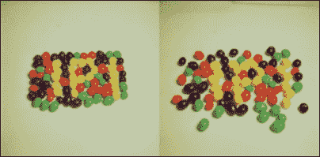

图 1.1:该图显示了不同类型表示的示例。假设我们想训练机器来检测果冻豆之间的一些空白空间。在右边的图像中，我们有稀疏的果冻豆，人工智能系统更容易确定空的部分。然而，在左侧的图像中，我们有非常紧凑的果冻豆，因此，对于机器来说，找到空白空间将是一项极其困难的任务。图片来源于南加州大学 SIPI 图像数据库

机器学习系统的很大一部分性能取决于输入系统的数据。这被称为数据的*表示*。与该表示相关的所有信息被称为数据的*特征*。例如，如果用逻辑回归来检测患者的脑瘤，AI 系统将不会尝试直接诊断患者！相反，相关医生将根据患者的常见症状向系统提供必要的输入。然后，人工智能系统将这些输入与已经接收到的用于训练系统的过去输入进行匹配。

基于系统的预测分析，它将提供关于疾病的决策。虽然逻辑回归可以根据给定的特征进行学习和决定，但它不能影响或修改特征的定义方式。与线性回归不同，逻辑回归是一种回归模型，其中因变量基于自变量具有有限数量的可能值。因此，例如，如果该模型提供了剖腹产患者的报告，而不是脑肿瘤患者的报告，它肯定无法预测正确的结果，因为给定的特征永远不会与训练数据相匹配。

机器学习系统对数据表示的这些依赖性对我们来说并不是不知道的！事实上，基于数据的表现方式，我们的大多数计算机理论都表现得更好。例如，数据库的质量是根据模式的设计来考虑的。如果对表进行了适当的索引，那么任何数据库查询的执行，即使是在一千或一百万行数据上，都会变得非常快。因此，人工智能系统数据表示的依赖性不应该让我们感到惊讶。

日常生活中也有很多这样的例子，数据的表示决定了我们的效率。在 20 个人中找到一个人显然比在 500 人的人群中找到同一个人容易。前面的*图 1.1* 中显示了两种不同类型数据表示的可视化表示。

因此，如果人工智能系统被输入适当的特征数据，即使是最困难的问题也能得到解决。然而，对计算机程序员来说，以正确的方式收集并向系统提供所需的数据是一个严重的障碍。

可能有许多实时场景，其中提取特征可能是一项繁琐的任务。因此，数据的表示方式决定了系统智能的主要因素。

### 注

如果特征不合适，在一群人和猫中找到猫可能会非常复杂。我们知道猫有尾巴；因此，我们可能希望检测尾巴的存在作为一个突出的特征。然而，给定不同的尾部形状和大小，通常很难准确描述尾部在像素值方面的样子！此外，尾巴有时会与人类的手混淆。此外，一些物体的重叠可能会忽略猫尾巴的存在，使图像更加复杂。

从以上所有讨论可以得出结论，人工智能系统的成功主要取决于数据是如何表示的。此外，各种表示可以捕捉和缓存数据背后所有差异的不同解释因素。

**表征学习**是用于处理这些特定问题的最流行和最广泛实践的学习方法之一。从现有的数据表示中学习下一层的表示可以被定义为表示学习。理想情况下，所有的表示学习算法都具有学习表示的优势，它可以捕获潜在的因素，一个可能适用于每个特定子任务的子集。下面*图 1.2* 给出了一个简单的说明:

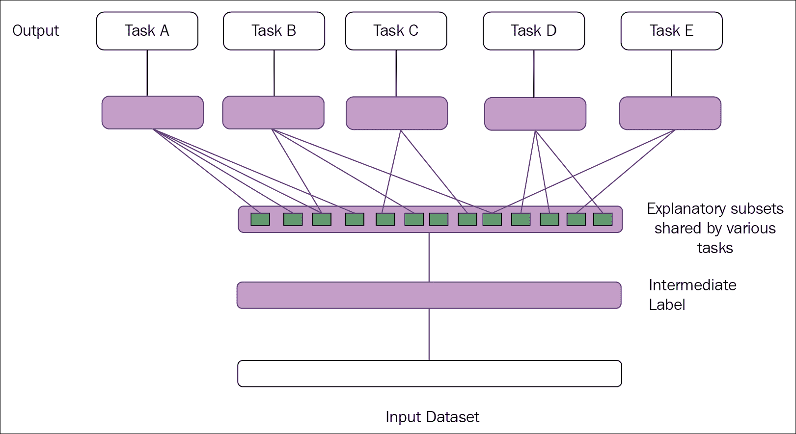

图 1.2:该图说明了表征学习。中间层能够发现解释因素(隐藏层，在蓝色矩形框中)。有些因素解释了每项任务的目标，而有些因素解释了输入

然而，在处理从大量原始数据中提取一些高级数据和特征时，需要某种程度的人类理解，这已经显示出它的局限性。这样的例子可以有很多:

*   区分两个相似年龄婴儿的哭声。
*   识别猫眼在白天和晚上的图像。这变得很笨拙，因为猫的眼睛在晚上发光，而不是在白天。

在所有这些前面的边缘情况下，表征学习似乎没有异常表现，并且表现出威慑行为。

**深度学习**是机器学习的一个子领域，它可以通过构建多层次的表示或从一系列其他简单的表示和特征中学习特征的层次结构来纠正表示学习的这个主要问题[2] [8]。


图 1.3:该图显示了深度学习系统如何通过识别角和轮廓等各种组合来表示人类图像，这些组合可以用边缘来定义。图片经伊恩·古德费勒、约舒·本吉奥和亚伦·库维尔许可转载，深度学习，麻省理工学院出版社出版

前面的*图 1.3* 显示了深度学习模型的图示。对于计算机来说，将原始非结构化输入数据(如这张图像所示)解码为不同像素值的集合通常是一项麻烦的任务。理想情况下，将转换像素组以识别图像的映射函数很难实现。此外，直接训练计算机进行这种映射几乎是不可逾越的。对于这些类型的任务，深度学习通过创建一系列映射子集来达到期望的输出，从而解决了这个难题。映射的每个子集对应于模型的一组不同的层。输入包含可以观察到的变量，因此在可见图层中表示。从给定的输入中，我们可以逐步提取数据的抽象特征。由于这些值在给定数据中不可用或不可见，因此这些图层被称为隐藏图层。

在图像中，从第一层数据，仅仅通过相邻像素的比较研究就可以容易地识别边缘。第二个隐藏层可以从第一个隐藏层对边缘的描述中区分拐角和轮廓。从描述角和轮廓的第二个隐藏层，第三个隐藏层可以识别特定对象的不同部分。最终，可以从第三层清楚地检测到图像中存在的不同对象。

深度学习于 2006 年独家开启征程， **Hinton et al.** 于 2006 年[2]；同样 **Bengio 等人**在 2007 年【3】最初关注的是 MNIST 数字分类问题。在过去的几年里，深度学习经历了从数字到自然图像中对象识别的重大转变。除此之外，**克里哲夫斯基等人**在 2012 年【4】使用 ImageNet 数据集实现了一项重大突破。

这本书的范围主要限于深度学习，所以在直接深入之前，应该讨论深度学习的必要定义。

许多研究人员以多种方式定义了深度学习，因此，在过去的 10 年里，它也经历了许多定义！以下是一些广为接受的定义:

*   正如 GitHub 所指出的，深度学习是机器学习研究的一个新领域，它的引入是为了让机器学习更接近其最初的目标之一:人工智能。深度学习是指学习多层次的表示和抽象，这有助于理解图像、声音和文本等数据。
*   正如维基百科最近更新的那样，深度学习是基于一组算法的机器学习的一个分支，这些算法试图通过使用具有多个处理层的深度图来建模数据中的高级抽象，该深度图由多个线性和非线性变换组成。

正如定义所暗示的，深度学习也可以被认为是一种特殊类型的机器学习。深度学习凭借其从各种简单特征中学习复杂表示的能力，在数据科学领域获得了巨大的普及。为了深入掌握深度学习，我们列出了几个术语，这些术语将在接下来的章节中频繁使用。本章的下一个主题将通过提供用于深度学习的各种术语和重要网络来帮助您为深度学习奠定基础。

# 开始深度学习

要理解本书的深度学习之旅，必须了解机器学习的所有术语和基本概念。但是，如果您已经对机器学习和相关术语有了足够的了解，您应该可以忽略这一部分，跳到本章的下一个主题。对数据科学充满热情，想要彻底学习机器学习的读者，可以关注汤姆·米契尔(1997) [5]和*的*机器学习*【机器学习:一个概率的视角】* (2012) [6]。

### 注

神经网络不会创造奇迹。但是，如果使用得当，它们可以产生一些惊人的结果。

## 深度前馈网络

神经网络可以是递归的，也可以是前馈的。前馈网络在它们的图中没有任何相关联的环路，而是排列在一组层中。多层网络被称为深度网络。简单来说，任何具有两层或更多层(隐藏)的神经网络都被定义为**深度前馈网络**或**前馈神经**网络。*图 1.4* 显示了深度前馈神经网络的一般表示。

深度前馈网络的工作原理是，随着深度的增加，网络也可以执行更多的顺序指令。顺序指令可以提供强大的功能，因为这些指令可以指向较早的指令。

前馈网络的目的是推广某些函数。例如，分类器 *y=f(x)* 从输入 *x* 映射到类别 *y* 。深度前馈网络修改了映射，*y = f(x；α)* ，学习参数 *α* 的值，给出函数最合适的值。下面的*图 1.4* 显示了深度前向网络的简单表示，以提供与传统神经网络的架构差异。

### 注

深度神经网络是具有许多隐藏层的前馈网络。


图 1.4:图中显示了浅层和深层前馈网络

## 各种学习算法

**数据集**被认为是学习过程的构建模块。数据集可以被定义为相互关联的数据集的集合，它由独立的实体组成，但是可以根据用例作为单个实体使用。数据集的单个数据元素称为**数据点**。

下面的*图 1.5* 给出了从社交网络分析中收集的各种数据点的可视化表示:

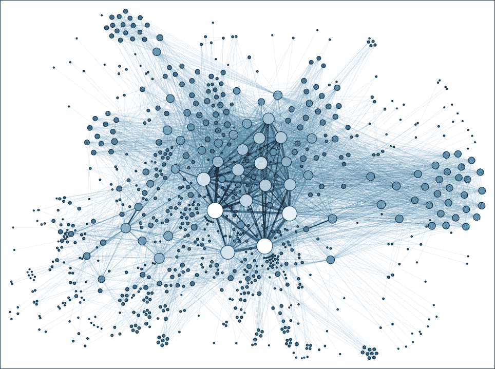

图 1.5:图片展示了社交网络分析的零散数据点。图片来源于维基百科

*   **未标注数据**:这部分数据由人为生成的物体组成，可以很容易的从周围获取。一些例子是 x 光片、日志文件数据、新闻文章、演讲、视频、推文等等。
*   **标记数据**:标记数据是来自一组未标记数据的标准化数据。这些类型的数据通常被很好地格式化、分类、标记，并且容易被人类理解以便进一步处理。

从顶层理解来看，机器学习技术根据其学习过程是如何进行的，可以分为监督学习和非监督学习。

### 无监督学习

在无监督学习算法中，给定的输入数据集没有期望的输出。在分析数据集的过程中，系统从其经验中学习有意义的属性和特征。在深度学习中，系统通常试图从数据点的整体概率分布中学习。有各种类型的无监督学习算法，它们执行聚类。用简单的话来解释，聚类意味着在相似类型数据的聚类中分离数据点。但是，这种类型的学习，没有基于最终输出的反馈，也就是不会有老师来纠正你！*图 1.6* 展示了无监督聚类的基本概况:


图 1.6:图显示了无监督聚类的简单表示

无监督聚类算法的一个真实例子是谷歌新闻。当我们在谷歌新闻下打开一个主题时，它会显示一些重定向到几个页面的超链接。这些主题中的每一个都可以被认为是指向独立链接的一组超级链接。

### 监督学习

在监督学习中，与无监督学习不同，体验的每一步都有一个预期的输出。系统被赋予一个数据集，它已经知道期望的输出是什么样子，以及每个关联层的输入和输出之间的正确关系。这种类型的学习通常用于分类问题。

*图 1.7* 给出了如下可视化表示:


图 1.7:图中显示了基于监督学习的数据分类

监督学习的现实例子包括人脸检测、人脸识别等等。

尽管监督学习和非监督学习看起来像是不同的身份，但它们往往通过各种方式相互联系。因此，这两种学习之间的细微差别对于学生团体来说往往是模糊的。

前面的陈述可以用下面的数学表达式来表述:

概率的一般乘积规则指出，对于数据集 n ε ℝ <sup>t</sup> 的 *n* 个数量，联合分布可以被分割如下:


该分布表示出现的无监督问题可以通过 *t* 个有监督问题来解决。除此之外， *p (k | n)* 的条件概率是一个有监督的问题，可以使用无监督学习算法来体验 *p (n，k)* 的联合分布来解决。


虽然这两种类型不是完全独立的身份，但它们通常有助于根据执行的操作对机器学习和深度学习算法进行分类。一般来说，聚类形成、基于相似性识别种群密度等被称为无监督学习，而结构化格式化输出、回归、分类等被认为是有监督学习。

### 半监督学习

顾名思义，在这种类型的学习中，在训练过程中既使用有标签的数据，也使用无标签的数据。这是一类在训练过程中使用大量未标记数据的监督学习。

例如，半监督学习用于深度信念网络(稍后解释)，这是一种深度网络，其中一些层学习数据的结构(无监督)，而一层学习如何对数据进行分类(监督学习)。

在半监督学习中，给定 *n* 或 *p (k | n】的概率，使用来自 *p (n)* 的未标记数据和来自 *p (n，k)* 的标记数据来预测 *k* 的概率。*


图 1.8:图中显示了半监督学习技术中大量未标记数据的影响。图来自维基百科

在前面的*图 1.8* 中，顶部显示了模型在区分白圈和黑圈后使用的决策边界。底部的图显示了模型包含的另一个决策边界。在该数据集中，除了两个不同类别的圆之外，还附有一组未标记的数据(灰色圆)。这种类型的训练可以被视为创建聚类，然后用标记数据标记这些聚类，这将决策边界从高密度数据区域移开。

前面的*图 1.8* 描绘了半监督学习的图解。你可以参考*查佩尔等人的*书【7】来了解更多关于半监督学习方法的知识。

因此，由于您已经对人工智能、机器学习和表示学习有了基础，我们现在可以将整个重点转移到进一步描述的深度学习上。

从前面提到的深度学习的定义中，可以指出深度学习的两个主要特征，如下:

*   通过来自后续抽象层的连续知识，体验特征表示的无监督和有监督学习的方式
*   由非线性信息处理的多个抽象阶段组成的模型

# 深度学习术语

*   **深度神经网络** ( **DNN** ):这可以定义为一个有很多隐藏层的多层感知器。所有层的权重完全相互连接，并接收来自前一层的连接。通过监督学习或无监督学习来初始化权重。
*   **递归神经网络** ( **RNN** ): RNN 是一种深度学习网络，专门用于从时间序列或序列数据中学习，如语音、视频等。RNN 的主要概念是，来自前一个州的观察结果需要为下一个州保留。最近跟 RNN 深度学习的热门话题是**长短期记忆** ( **LSTM** )。
*   **深度信念网络** ( **DBN** ):这种类型的网络【9】【10】【11】可以定义为具有可见和多层潜在变量(隐藏)的概率生成模型。每个隐藏层通过学习拥有下层单元之间的统计关系。网络越趋向于向更高层移动，关系就变得越复杂。这种类型的网络可以使用贪婪的逐层训练来有效地训练，其中所有的隐藏层以自下而上的方式一次训练一个。
*   **玻尔兹曼机** ( **BM** ):这可以定义为一个网络，它是一个对称连接的神经元状单元，能够随机决定是保持开启还是关闭。BMs 通常有一个简单的学习算法，这使得它们能够发现许多有趣的特征，这些特征代表了训练数据集中的复杂规律。
*   **受限玻尔兹曼机** ( **RBM** ):生成式随机人工神经网络 RBM 是玻尔兹曼机的一种特殊类型。这些类型的网络能够学习数据集集合上的概率分布。RBM 由一层可见和隐藏的单元组成，但没有可见-可见或隐藏-隐藏的联系。
*   **卷积神经网络**:卷积神经网络是神经网络的一部分；这些层彼此稀疏地连接，并且连接到输入层。后续层的每个神经元只负责输入的一部分。深度卷积神经网络在位置识别、图像分类、人脸识别等领域取得了无可匹敌的性能。
*   **深度自动编码器**:深度自动编码器是一种具有多个隐藏层的自动编码器。这种类型的网络可以预先训练为单层自动编码器的堆栈。训练过程通常比较困难:首先，我们需要训练第一个隐藏层重构输入数据，然后用它训练下一个隐藏层重构前一个隐藏层的状态，以此类推。
*   **梯度下降** ( **GD** ):这是机器学习中广泛使用的确定函数系数的优化算法( *f* )，降低了函数的整体代价。梯度下降主要用于无法解析计算所需参数的情况(例如线性代数)，必须通过某种优化算法才能找到。

在梯度下降中，模型的权重随着训练数据集(历元)的每次迭代而递增更新。

具有平方误差之和的成本函数 *J (w)* 可以写成如下:

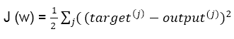

权重更新的幅度方向通过在成本梯度的相反方向上采取一个步骤来计算，如下所示:

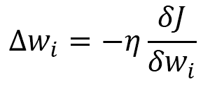

在上式中， *η* 是网络的学习速率。权重在每个时期后按照以下规则递增更新:

```scala
                         for one or more epochs, 
                           for each weight i, 
                             wi:= w + ∆wi 
                           end  
                         end 

```


可以使用梯度下降进行优化的流行示例是逻辑回归和线性回归。

*   **随机梯度下降** ( **SGD** ):各种深度学习算法在大量数据集上运行，基于一种称为随机梯度下降的优化算法。梯度下降仅在小数据集的情况下表现良好。然而，在非常大规模的数据集的情况下，这种方法变得极其昂贵。在梯度下降中，在整个训练数据集上一次通过只需要一个单独的步骤；因此，随着数据集的大小趋于增加，整个算法最终会变慢。权重的更新速度非常慢；因此，收敛到全局最小成本所需的时间变得很长。

因此，为了处理这样的大规模数据集，使用了称为随机梯度下降的梯度下降变体。与梯度下降不同，权重在训练数据集的每次迭代后更新，而不是在整个数据集的末尾更新。

```scala
                     until cost minimum is reached 
                       for each training sample j: 
                         for each weight i 
                           wi:= w + ∆wi 
                         end 
                       end 
                     end 

```

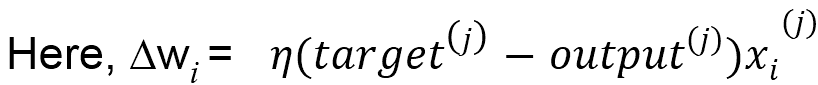

在过去的几年里，深度学习获得了巨大的普及，因为它已经成为许多广泛实践的学科的研究领域的结合点，例如模式识别、神经网络、图形建模、机器学习和信号处理。

这种流行的其他重要原因可以总结为以下几点:

*   近年来， **GPU** ( **图形处理单元**)的能力大幅提升
*   用于训练目的的数据集的数据大小显著增加
*   最近在机器学习、数据科学和信息处理方面的研究已经显示出一些重大进展

所有这些要点的详细描述将在本章的下一个主题中提供。

# 深度学习:人工智能的一场革命

深度学习的广泛历史超出了本书的范围。然而，要对这门学科产生兴趣和认知，一些基本的背景知识是必不可少的。

在介绍中，我们已经稍微谈到了深度学习在人工智能领域占据的空间。本节将详细介绍机器学习和深度学习是如何相互关联或相互不同的。我们还将讨论在过去十年左右的时间里，这两个主题的趋势是如何变化的。

|   | *“数年来，深度学习的浪潮一直拍打着计算语言学的海岸，但 2015 年似乎是海啸席卷主要自然语言处理(NLP)会议的一年。”* |   |
|   | - *克里斯托弗·曼宁博士，2015 年 12 月* |

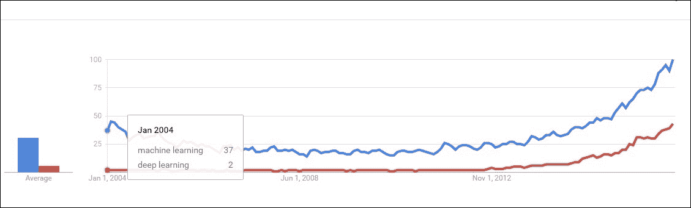

图 1.9:该图描绘了大约 10 年前深度学习处于初始阶段。然而，机器学习在研究者群体中是一个趋势性的话题。

深度学习正在人工智能领域迅速扩展其领域，并以其惊人的实证结果不断让许多研究人员感到惊讶。机器学习和深度学习都代表了两种不同的思想流派。机器学习可以被视为人工智能最基本的方法，深度学习可以被认为是一个新的、巨大的时代，增加了这门学科的一些功能。

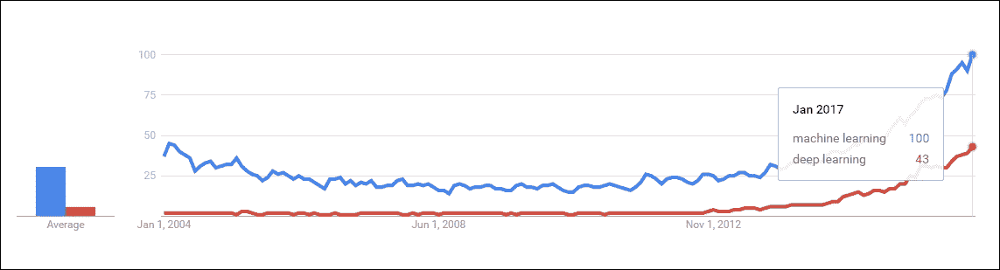

图 1.10:图中描绘了深度学习如今是如何越来越受欢迎，并试图达到机器学习的水平

然而，机器学习往往不能完全解决人工智能的许多关键问题，主要是语音识别、对象识别等。

随着随机变量数量的不断增加，传统算法在处理高维数据时的性能似乎更具挑战性。此外，传统机器学习方法中用于获得泛化能力的过程不足以学习高维空间中的复杂任务，这通常会增加整个模型的计算成本。深度学习的发展主要是由机器学习的基本算法在这些函数上的崩溃所推动的，也是为了克服上述障碍。

很大比例的研究者和数据科学家认为，随着时间的推移，深度学习将占据人工智能的主要部分，并最终使机器学习算法过时。为了清楚地了解这一点，我们查看了这两个领域的当前谷歌趋势，并得出以下结论:

*   机器学习的曲线一直是过去十年的成长阶段。深度学习是新的，但比机器学习发展得更快。当趋势被密切观察时，人们会发现与机器学习相比，深度学习的增长速度更快。

前面的*图 1.9* 和*图 1.10* 都描绘了谷歌趋势的可视化。

## 深度学习的动机

机器学习算法面临的最大问题之一是维度的**诅咒**【12】【13】【14】。这是指当数据集中的维数较高时，某些学习算法可能表现不佳。在下一节中，我们将讨论深度学习如何通过引入新的特性给这个问题带来了足够的希望。与传统体系结构相比，深度体系结构在许多其他相关问题上表现出了明显的优势。在本章的这一部分，我们将把更明显的挑战作为一个单独的主题进行介绍。

### 维度的诅咒

维数灾难可以定义为在高维空间(在数千甚至更高维的范围内)中分析和组织数据时出现的现象。当数据集的维数很高时，机器学习问题面临着极大的困难。高维数据很难处理，原因如下:

*   随着维数的增加，特征的数量将趋于指数增长，最终导致噪声的增加。
*   在标准实践中，我们不会得到足够多的观测值来概括数据集。

维度诅咒的一个直接解释可能是**组合爆炸**。根据组合爆炸，通过收集大量的变量，可以建立一个巨大的组合。例如，对于 *n* 二进制变量，可能组合的数量为 *O (2 <sup>n</sup> )* 。因此，在高维空间中，配置的总数几乎是不可数的，比我们可用的示例数量要多得多——大多数配置都没有相关的训练示例。*图 1.11* 为了更好地理解，显示了类似现象的图示。

因此，由于训练的困难，这种情况对于任何机器学习模型来说都是麻烦的。**休斯效应**【15】声明如下:

> *“对于固定数量的训练样本，预测能力随着维数的增加而降低。”*

因此，随着解释变量数量的增加，模型的可实现精度几乎崩溃。

为了应对这种情况，我们需要增加提供给系统的样本数据集的大小，使其能够与该情况竞争。但是随着数据复杂度的也增加，维度的数量几乎达到了一千。对于这种情况，即使是拥有数亿张图像的数据集也是不够的。

深度学习以其更深的网络配置，在部分解决这个问题方面显示出一些成功。这一贡献主要归因于以下原因:

*   现在，研究人员能够在输入样本进行训练之前，通过重新定义网络结构来管理模型的复杂性
*   深度卷积网络关注的是数据的高层特征，而不是基本层信息，这大大降低了特征的维数

尽管深度学习网络已经给出了一些应对维度诅咒的见解，但它们还不能完全征服挑战。在微软最近对超深度神经网络的研究中，他们提出了 150 层；因此，参数空间变得更大。该团队已经探索了研究，甚至深度网络几乎达到 1000 层；但是由于模型*过拟合*，结果不达标！

### 注

**机器学习中的过拟合**:当一个模型被过度训练到对其性能产生负面影响的程度时，这种现象被称为模型的过拟合。当模型学习到训练数据集的随机波动和不想要的噪声时，就会出现这种情况。这些现象的后果并不令人满意——模型不能很好地处理新的数据集，这对模型的泛化能力产生了负面影响。

**机器学习中的欠拟合**:这是指模型既不能用当前数据集执行，也不能用新数据集执行的情况。这种类型的模型不适合数据集，并且表现出较差的性能。

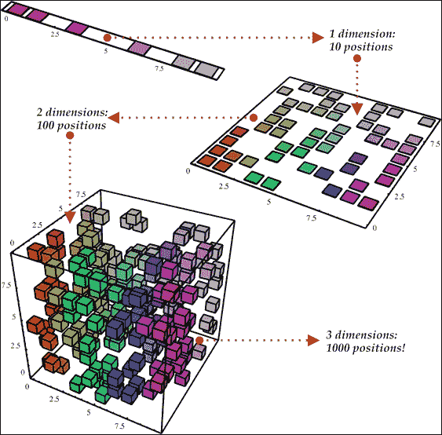

图 1.11:图中显示，随着维度数量从一个增加到三个，从上到下，随机变量的数量可能呈指数级增加。图片转载自尼古拉斯·查帕多斯的文章《精算估值的数据挖掘算法》。

在上图的 1D 示例(上)中，由于只有 10 个感兴趣的区域，因此学习算法正确地进行归纳应该不是一项艰巨的任务。然而，对于更高维度的 3D 示例(底部)，模型需要跟踪所有的 *10*10*10=1000 个*感兴趣区域，这要麻烦得多(或者几乎将是模型无法完成的任务)。这可以作为维度诅咒最简单的例子。

### 消失梯度问题

消失梯度问题[16]是在训练人工神经网络时发现的障碍，它与一些基于梯度的方法相关联，例如反向传播。理想情况下，这个困难使得学习和训练前几层变得非常困难。当深层神经网络的层数急剧增加时，情况会变得更糟。

梯度下降算法特别通过梯度的负值乘以小比例值(位于`0`和`1`之间)来更新权重。

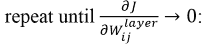

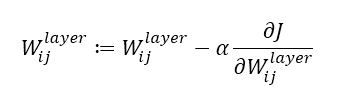

如前面的等式所示，我们将重复梯度，直到它达到零。然而，理想情况下，我们通常为最大迭代次数设置一些超参数。如果迭代次数太高，训练的持续时间也会更长。另一方面，如果迭代的次数对于某些深度神经网络来说变得难以察觉，我们最终肯定会得到不准确的结果。

在消失梯度问题中，相对于先前层的参数，网络输出的梯度变得非常小。因此，结果权重不会随着每次迭代而出现任何显著变化。因此，即使早期层的参数值发生较大变化，也不会对整体输出产生显著影响。作为这个问题的结果，深度神经网络的训练变得不可行，并且模型的预测变得不令人满意。这种现象被称为消失梯度问题。这将导致一些拉长的成本函数，如下图*图 1.12* :

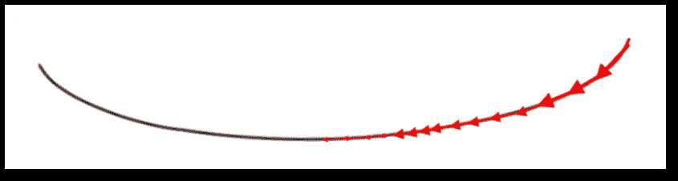

图 1.12:平坦梯度和拉长成本函数的图像

下面*图 1.13* 中也展示了一个梯度较大的例子，梯度下降可以快速收敛:


图 1.13:较大梯度成本函数的图像；因此，梯度下降可以更快地收敛

这对于深度学习的成功来说是一个实质性的挑战，但是现在，由于各种不同的技术，这个问题已经在一定程度上被克服了。**长短期记忆**(**【LSTM】**)网络是 1997 年使这个问题无效的重大突破之一。[第四章](4.html "Chapter 4. Recurrent Neural Network")、*递归神经网络*给出了详细描述。此外，一些研究人员试图用不同的技术来解决这个问题，包括功能准备、激活功能等。

### 分布式表示

所有的深度网络大多基于分布式表示的概念，这是深度学习算法成功背后的理论优势。在深度学习的背景下，分布式表示是多尺度表示，与理论化学和物理的多尺度建模密切相关。分布式表示背后的基本思想是，感知的特征是多个因素的结果，这些因素作为一个组合来产生期望的结果。日常生活中的一个例子可能是人脑，它使用分布式表示来伪装周围的物体。

在这种表示中，人工神经网络将以这样一种方式构建，即它将具有表示我们必要模型所需的大量特征和层。该模型将使用多个相互依赖的层来描述数据，例如语音、视频或图像，其中每个层将负责在不同的尺度级别上描述数据。这样，表示将分布在许多层上，涉及许多尺度。因此，这种表示被称为分布式表示。

### 注

分布式表示本质上是密集的。它遵循两种表示形式之间的多对多关系。一个概念可以用多个神经元来表示。另一方面，一个神经元描绘了不止一个概念。

使用非分布式表示的传统聚类算法，如最近邻算法、决策树或高斯混合，都需要 *O(N)* 参数来区分 *O(N)* 输入区域。在某个时候，人们很难相信有任何其他算法能表现得比这更好！然而，深度网络，如稀疏编码、RBM、多层神经网络等，都可以仅用 *O(N)* 参数来区分多达 *O(2 <sup>k</sup> )* 个输入区域(其中 *k* 表示稀疏表示中非零元素的总数， *k=N* 表示其他非稀疏 RBM 和密集表示)。

在这些类型的操作中，要么对输入的不同部分应用相同的聚类，要么并行进行几个聚类。将聚类推广到分布式表示被称为多重聚类。

使用分布式表示的指数优势是由于在多个示例中重用了每个参数，这些示例不一定彼此靠近。例如，在这种情况下，受限玻尔兹曼机器可能是一个合适的例子。然而，在局部泛化的情况下，输入空间中不相同的区域只关心它们自己的私有参数集。

主要优势如下:

*   数据内部结构的表示在抗损坏性和适度降级方面是稳健的
*   它们有助于概括数据之间的概念和关系，从而增强推理能力。

以下*图 1.14* 表示分布式表示的实时示例:


图 1.14:图显示了分布式表示如何帮助模型区分图像中的各种类型的表达式

# 深度学习网络的分类

**机器学习中的人工神经网络**常被许多研究者称为新一代神经网络。我们听到的大多数学习算法本质上都是为了让系统像生物大脑一样学习而构建的。这就是**人工神经网络**这个名字的由来！历史上，深度学习的概念源自**人工神经网络** ( **ANN** )。深度学习的实践可以追溯到 20 世纪 60 年代，甚至可能更早。随着深度学习的兴起，人工神经网络在研究领域越来越受欢迎。

**多层感知器** ( **MLP** )或具有许多隐藏中间层的前馈神经网络，被称为**深度神经网络** ( **DNN** )，是深度架构模型的一些很好的例子。第一个流行的深度架构模型是由 Ivakhnenko 和帕拉在 1965 年使用有监督的深度前馈多层感知器发布的[17]。

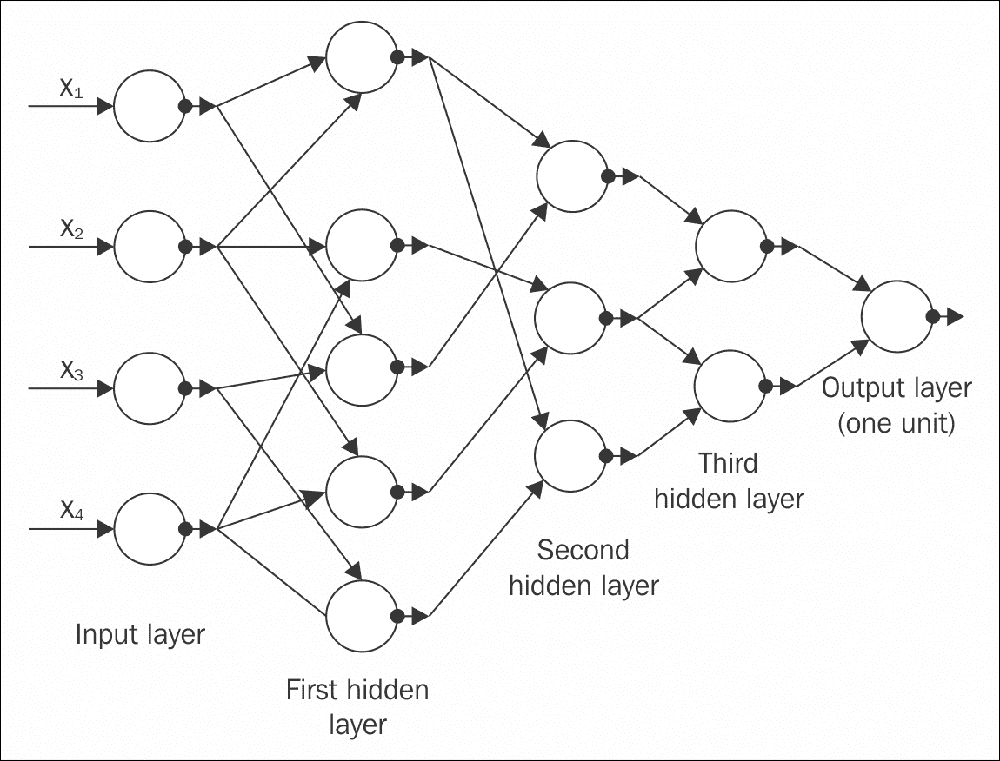

图 1.15:GMDH 网络有四个输入(输入向量 x 的分量)和一个输出 y，这是对真实函数 y= f(x) = y 的估计

Alexey Ivakhnenko 在 1971 年的另一篇论文中使用了数据处理算法 ( **GMDH** )的**分组方法，该方法试图解释一种具有八个训练层的深度网络。它仍然被认为是当前千年最受欢迎的论文之一[18]。前面的*图 1.15* 显示了四个输入的 GMDH 网络。**

向前看，**反向传播** ( **BP** )是一种众所周知的学习相似类型网络参数的算法，在 20 世纪 80 年代流行起来。然而，由于许多原因，具有许多隐藏层的网络难以处理，因此，BP 未能达到预期水平[8] [19]。此外，反向传播学习使用基于局部梯度信息的梯度下降算法，这些操作从一些随机的初始数据点开始。当通过不断增加的网络深度传播时，这些信息通常会被收集到一些不需要的局部最优值中；因此，结果通常会陷入糟糕的解决方案中。

在两篇论文[8] [20]中建立了一种高效的无监督学习算法后，与深度架构模型相关的*优化约束*被务实地减少了。这两篇论文介绍了一类被称为**深度信念网络** ( **DBN** )的深度生成模型。

2006 年，又发表了两个具有非生成性、非概率特征的无监督深度模型，这在研究界非常受欢迎。一种是基于能量的无监督模型[21]，另一种是带有后续层训练的自动编码器变体，很像之前的 DBN 训练[3]。这两种算法都可以有效地用来训练深度神经网络，几乎完全像 DBN。

自 2006 年以来，世界范围内深度学习的研究出现了巨大的爆发。除了传统的浅层机器学习技术之外，该学科已经经历了持续的指数级增长。

基于本章前面主题中提到的学习技术，并根据所使用的技术和架构的用例，深度学习网络可以大致分为两个不同的组。

## 深度生成模型或无监督模型

许多深度学习网络都属于这一类，如受限玻尔兹曼机、深度信念网络、深度玻尔兹曼机、去噪自动编码器等。这些网络中的大多数都可以通过在网络中采样来产生样本。然而，一些其他网络，例如稀疏编码网络等，难以采样，因此本质上不具有生成性。

一个流行的深度无监督模型是**深度玻尔兹曼机器**(**DBM**)【22】【23】【24】【25】。一个传统的 DBM 包含许多层隐藏的变量；但是，同一层中的变量之间没有联系。传统的**玻尔兹曼机** ( **BM** )虽然算法比较简单，但是学习起来太复杂，训练起来非常慢。在 DBM 中，每一层都获得前一层的潜在特征的响应之间的高阶复杂相关性。许多现实生活中的问题，如对象和语音识别，需要学习复杂的内部表示，用数据库管理系统更容易解决。

具有一个隐藏层的 DBM 被称为**受限玻尔兹曼机器** ( **RBM** )。类似于 DBM，RBM 没有任何隐藏到隐藏和可见到可见的联系。RBM 的关键特性体现在它建立了许多成果管理制。随着大量潜在层的形成，先前 RBM 的特征激活充当下一个的输入训练数据。这种架构产生了一种不同的网络，名为**深度信仰网络** ( **DBN** )。在[第 5 章](5.html "Chapter 5.  Restricted Boltzmann Machines")、*受限玻尔兹曼机器*中详细讨论了受限玻尔兹曼机器和深度信念网络的各种应用。

DBN 的一个主要组成部分是一组层，这降低了其时间复杂度，与网络的大小和深度成线性关系。除了 DBN 特性可以通过从一些期望的初始化数据点开始训练来克服 BP 的主要缺点之外，它还具有其他吸引人的捕捉特性。其中一些列举如下:

*   DBN 可以被认为是一个概率生成模型。
*   由于有数亿个参数，数据库网络普遍存在过拟合问题。此外，深度体系结构由于其庞大的数据集，经常遇到不合适的问题。这两个问题都可以在预训练步骤中有效地减少。
*   DBN 对未标记数据进行了有效利用。

可以用于无监督(以及有监督)学习的另一个深度生成网络是**和积网络** ( **SPN** ) [26]，[27]。SPN 是深度网络，可以看作有向无环图，其中图的叶子是观察变量，内部节点是和与积运算。“总和”节点代表混合模型，“产品”节点构成特征层次结构。使用期望最大化算法和反向传播来训练 SPN。学习 SPN 的主要障碍是当向深层移动时，梯度迅速减小。具体地说，从条件似然的导数生成的规则深度神经网络的标准梯度下降经历了磨难。减少这个问题的一个解决方案是用潜变量的最可能状态代替边际推断，然后通过它传播梯度。多明戈和金斯在[28]中提出了一个关于小规模图像识别的杰出成果。以下*图 1.16* 为便于理解，展示了一个 SPN 网络示例。它显示了和积网络的框图:


图 1.16:和积网络框图

另一种流行的深度生成网络，可以用作无监督(以及监督)学习，是**递归神经网络** ( **RNN** )。这种网络的深度直接取决于输入数据序列的长度。在无监督的 RNN 模型中，来自先前数据样本的经验被用来预测未来的数据序列。rnn 已经被用作对文本或语音进行数据排序的一个优秀的强大模型，然而，由于消失梯度问题的出现，它们的受欢迎程度最近有所下降[29] [16]。使用随机曲率估计，无黑森优化[30]在一定程度上克服了局限性。最近，Bengio 等人[31]和 Sutskever [32]提出了不同的变体来训练生成的 RNNs，其性能优于无黑森优化模型。RNN 在本书[第四章](4.html "Chapter 4. Recurrent Neural Network")、*递归神经网络*中得到进一步阐述。

在无监督深度网络的其他子类中，基于能量的深度模型大多是已知的体系结构[33] [34]。深度网络的无监督模型类别的一个典型例子是深度自动编码器。深度自动编码器的大多数变体本质上都是生成性的；然而，属性和实现通常彼此不同。流行的例子有预测稀疏编码器、变换自动编码器、去噪自动编码器及其堆叠版本等。自动编码器在[第 6 章](6.html "Chapter 6.  Autoencoders")、*自动编码器*中有详细说明。

## 深度判别模型

监督学习中使用的大多数鉴别技术都是浅层体系结构，如隐藏的马可夫模型[35]，[36]，[37]，[38]，[39]，[40]，[41]或条件随机场。然而，最近，通过将每一个较低层的输出作为较高层的输入，一种深层结构的条件随机场模型已经发展起来。对于自然语言处理、电话识别、语言识别等，已经成功地实现了多种版本的深度结构条件随机场。尽管有区别的方法对于深度架构来说是成功的，但是它们还没有达到预期的结果。

如前一节所述，RNNs 已经被用于无监督学习。然而，神经网络也可以作为一个判别模型，用监督学习进行训练。在这种情况下，输出成为与输入数据序列相关的标签序列。语音识别技术在很久以前就已经看到了这种有区别的神经网络，但是收效甚微。论文[42]表明，一个隐藏的马科夫模型被用来将 RNN 分类结果变异成一个标签序列。但不幸的是，出于所有这些原因使用隐藏马科夫模型并没有充分利用无线网络的全部功能。

最近为神经网络开发了一些其他的方法和模型，其基本思想是将 RNN 输出视为一些条件分布，并分布在所有可能的输入序列上[43]，[44]，[45]，[46]。这有助于 RNNs 进行序列分类，同时将长短期记忆嵌入其模型中。主要的好处是它既不需要训练数据集的预分割，也不需要输出的后处理。基本上，数据集的分割是由算法自动执行的，并且可以导出一个可微分的目标函数来优化标签序列上的条件分布。这种算法的有效性广泛适用于手写识别操作。

一种更流行的深度鉴别体系结构是**卷积神经网络** ( **CNN** )。在美国有线电视新闻网中，每个模块由一个卷积层和一个汇集层组成。为了形成深度模型，模块通常一个堆叠在另一个之上，或者在它的顶部具有深度神经网络。卷积层有助于共享许多权重，池层稍后分离卷积的输出，最小化来自前一层的数据速率。美国有线电视新闻网被认为是一个高效的模型，尤其是对于图像识别、计算机视觉等任务。最近，在美国有线电视新闻网设计的具体修改下，也发现它在语音识别方面同样有效。**时延神经网络**(**TDNN**)【47】【48】，起源于早期的语音识别，是卷积神经网络的特例，也可以认为是它的前身。

在这种类型的模型中，权重分配仅限于时间维度，不存在池层。[第三章](3.html "Chapter 3.  Convolutional Neural Network")、*卷积神经网络*深入讨论了中枢神经系统的概念和应用。

深度学习有许多模式，也有广泛的应用。许多顶尖的科技公司，如脸书、微软、谷歌、Adobe、IBM 等，都在广泛使用深度学习。除了计算机科学，深度学习也为其他科学领域做出了宝贵的贡献。

用于物体识别的现代中枢神经系统已经对视觉处理有了很大的了解，甚至神经科学家也可以进一步探索。深度学习还为处理大规模数据和在科学领域进行预测提供了必要的功能工具。该领域在预测分子行为以促进药物研究方面也非常成功。

总而言之，深度学习是机器学习的一个子领域，由于其更广泛的适用性，它在实用性和普及性方面有了非凡的增长。然而，未来几年应该充满挑战和机遇，以进一步改善深度学习，并为新的数据爱好者探索这一主题。

### 注

为了帮助读者更深入地了解深度学习，以下是其他一些优秀且经常更新的在线阅读列表:[http://deeplearning.net/tutorial/](http://deeplearning.net/tutorial/)[http://ufldl.stanford.edu/wiki/index.php/UFLDL_Tutorial](http://ufldl.stanford.edu/wiki/index.php/UFLDL_Tutorial)[http://deeplearning.net/reading-list/](http://deeplearning.net/reading-list/)

# 总结

在过去的十年里，我们有幸从许多从事人工智能工作的伟大科学家和公司那里听到了深度学习的最伟大发明。深度学习是机器学习的一种方法，在过去的几年里，它的实用性和普及性有了巨大的发展。这主要是因为它能够处理涉及高维数据的大型数据集，解决诸如消失梯度问题等主要问题，以及训练更深层次网络的技术。在本章中，我们已经详细解释了这些概念中的大部分，并且还对深度学习的各种算法进行了分类，这些将在后续章节中详细阐述。

本书下一章将介绍大数据与深度学习的关联。本章将主要关注深度学习如何在从大规模数据中提取有价值的信息方面发挥主要作用。