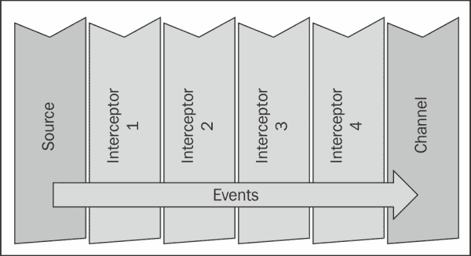
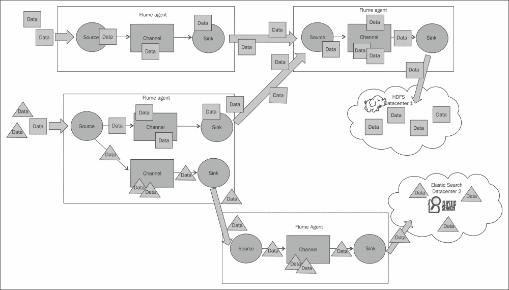

# 一、概述和架构

如果你正在读这本书，你很有可能会沉浸在堆积如山的数据中。 多亏了 Facebook、Twitter、亚马逊、数码相机和照相手机、YouTube、谷歌，以及你能想到的任何连接到互联网的东西，创建海量数据变得非常容易。 作为网站提供商，10 年前，您的应用日志仅用于帮助您排除网站故障。 今天，如果您知道如何从您的数据洪流中淘金，同样的数据可以为您的业务和客户提供宝贵的洞察力。

此外，由于您正在阅读这本书，您也知道创建 Hadoop 的目的是(部分)解决筛选海量数据的问题。 当然，这只有在您能够可靠地将数据加载到 Hadoop 集群以供数据科学家分析的情况下才有效。

将数据传入和传出Hadoop(在本例中为**Hadoop File System**(**HDFS**))并不困难-它只是一个简单的命令，如下所示：

```scala
% hadoop fs --put data.csv .
```

当您将所有数据整齐打包并准备上传时，这一功能非常有用。

但你的网站一直在创建数据。 您应该多久将数据批量加载到 HDFS？ 每天都有吗？ 每小时？ 不管你选择什么样的处理周期，最终总会有人问，“你能早点给我拿到数据吗？” 您真正需要的是一个能够处理流日志/数据的解决方案。

事实证明，你并不是唯一一个有这种需要的人。 Cloudera 是一家为 Hadoop 提供专业服务的提供商，也是他们自己的 Hadoop 发行版，在与他们的客户合作时，Cloudera 一次又一次地看到了这种需求。 Flume 就是为了满足这一需求而创建的，它创建了一个标准的、简单的、健壮的、灵活的和可扩展的工具，用于将数据摄取到 Hadoop 中。

# Flume 0.9

Flume 于 2011 年首次引入Cloudera 的 CDH3 发行版。 它由通过 ZooKeeper(一个联合配置和协调系统)从一个集中的主进程(或多个主进程)配置的工作者守护进程(代理)组成。 在主服务器上，您可以在 Web UI 中检查代理状态，也可以从 UI 或通过命令行 shell 集中推送配置(两者实际上都是通过 ZooKeeper 与辅助代理通信)。

数据可以以三种模式之一发送，即**尽力而为**(**BE**)、**磁盘故障转移**(**DFO**)和**端到端**(**E2E**)。 主机用于端到端(E2E)模式确认，而多主机配置从未真正成熟，因此通常只有一个主机使其成为 E2E 数据流的中心故障点。 尽力而为就像它听起来那样-代理将尝试发送数据，但如果不能，数据将被丢弃。 此模式适用于度量标准等可以轻松容忍差距的情况，因为新数据只有一秒钟的距离。 磁盘故障转移模式将无法传递的数据存储到本地磁盘(有时是本地数据库)，并不断重试，直到可以将数据传递给数据流中的下一个收件人。 只要您有足够的本地磁盘空间来缓冲负载，这对于那些计划内(或计划外)的停机非常方便。

2011 年 6 月，Cloudera 将 Flume 项目的控制权移交给了Apache基金会。 一年后，它在 2012 年脱离了孵化器的地位。 在那个孵化年，“星际迷航”主题标签下的 Flume-NG(Flume The Next Generation)的重构工作已经开始。

# Flume 1.X(Flume-NG)

Flume 被重构的原因有很多。 如果您对详细信息感兴趣，可以在[https://issues.apache.org/jira/browse/FLUME-728](https://issues.apache.org/jira/browse/FLUME-728)上阅读。 最初的重构分支最终成为 Flume 1.X 的开发主线。

Flume 1.X 中最明显的变化是集中配置 Master/Master 和 ZooKeeper 消失了。 Flume 0.9 中的配置过于冗长，很容易出错。 此外，集中式配置确实超出了 Flume 的目标范围。 集中式配置被简单的磁盘配置文件取代(尽管配置提供程序是可插拔的，因此可以替换)。 这些配置文件可以使用 cf-engine、chef 和 plupet 等工具轻松分发。 如果您使用的是 Cloudera 发行版，请查看 Cloudera Manager 来管理您的配置-他们最近更改了许可以提高节点限制，因此对您来说这可能是一个有吸引力的选择。 请确保不要手动管理这些配置，否则您将永远手动编辑这些文件。

Flume 1.X 中的另一个主要区别是，输入数据的读取和输出数据的写入现在由不同的工作线程(称为运行器)处理。 在 Flume 0.9 中，输入线程还执行对输出的写入(故障转移重试除外)。 如果输出写入器速度慢(而不仅仅是彻底失败)，它将阻止 Flume 接收数据的能力。 这种新的异步设计让输入线程完全没有意识到任何下游问题。

本书涵盖的 Flume 版本是 1.3.1(撰写本书时的当前版本)。

# HDFS 和流数据/日志的问题

HDFS 不是真正的文件系统，至少不是传统意义上的文件系统，而且我们认为普通文件系统理所当然的许多东西在这里都不适用，例如能够挂载它。 这使得将流数据导入 Hadoop 变得更加复杂。

在常规的**可移植操作系统接口**(**POSIX**)样式的文件系统中，如果您打开一个文件并写入数据，那么在关闭该文件之前，该文件仍然存在于磁盘上。 也就是说，如果另一个程序打开相同的文件并开始读取，它将获得写入器已经刷新到磁盘的数据。 此外，如果写入过程中断，则写入磁盘的任何部分都是可用的(它可能不完整，但确实存在)。

在 HDFS 中，文件仅作为目录条目存在，在文件关闭之前，它会显示为零长度。 这意味着，如果数据在较长时间内写入文件而没有关闭，则与客户端断开网络连接后，您所做的所有工作只会留下一个空文件。 这可能会导致您得出这样的结论：编写小文件是明智的，这样您就可以尽快关闭它们。

问题是 Hadoop 不喜欢很多小文件。 由于 HDFS 元数据保存在 NameNode 上的内存中，因此创建的文件越多，需要使用的 RAM 就越多。 从 MapReduce 的角度来看，小文件会导致效率低下。 通常，每个映射器都会被指定单个文件块作为输入(除非您使用了某些压缩编解码器)。 如果您有很多小文件，启动工作进程的成本可能会比它正在处理的数据高得不成比例。 这种块碎片还会导致更多的映射器任务，增加总体作业运行时间。

在确定写入 HDFS 时要使用的循环周期时，需要权衡这些因素。 如果计划短期保留数据，那么您可以选择较小的文件大小。 但是，如果您计划将数据保留很长时间，则可以针对较大的文件或执行一些定期清理，将较小的文件压缩到较少的较大文件中，以使它们对 MapReduce 更加友好。 毕竟，您只能摄取一次数据，但是您可能会对该数据运行一个MapReduce 作业数百次或数千次。

# 源、通道和汇

在这个简单的图中可以看到 Flume 代理的体系结构。 输入称为**源**，输出称为**宿**。 **通道**提供**源**和**宿**之间的粘合剂。 所有这些都在一个称为**代理**的守护进程中运行。


### 备注

我们应该牢记以下几点：

**源**将**事件**写入一个或多个**通道**。

当**事件**从**信源**传递到**信宿**时，**信道**是保持区域。

**接收器**仅从一个**通道**接收**事件**。

**代理**可以有许多**源、通道和汇**。

# Flume事件

Flume传输的数据的基本有效负载称为事件。 一个事件由个或多个标头和一个正文组成。

标头是键/值对，可用于做出路由决策或携带其他结构化信息(如事件的时间戳或事件发起的服务器的主机名)。 您可以将其视为与 HTTP 报头的功能相同-一种传递与正文不同的附加信息的方式。

正文是包含实际有效负载的字节数组。 如果您的输入由尾随的日志文件组成，则数组很可能是包含一行文本的 UTF-8 编码的`String`。


Flume 可能会自动添加其他标头(例如，当源添加数据来源的主机名或创建事件的时间戳时)，但正文基本保持不变，除非您在使用拦截器进行编辑的过程中对其进行编辑。

## 拦截器、通道选择器和接收器处理器

**拦截器**是数据流中的一个点，您可以在这里检查和更改 Flume**事件**。 您可以在**源**创建**事件**之后或在**接收器**将**事件**发送到任何目的地之前链接零个或多个拦截器。 如果您熟悉 AOP Spring 框架，它类似于 Java Servlet 中的`MethodInterceptor.`，它类似于`ServletFilter`。 下面的示例展示了在一个源上使用四个链式拦截器可能会是什么样子：



通道选择器负责数据如何从源移动到一个或多个通道。 Flume 附带了两个通道选择器，它们涵盖了您可能会遇到的大多数用例，不过如果需要，您也可以编写自己的通道选择器。 假设您配置了多个通道，复制通道选择器(默认设置)只会将事件的副本放入每个通道。 相反，多路复用通道选择器可以根据某些报头信息写入不同的通道。 与拦截器逻辑相结合，这两个组合形成了将输入路由到不同通道的基础。

最后，接收器处理器是一种机制，您可以通过该机制为接收器创建故障转移路径，或跨通道中的多个接收器进行负载平衡事件。

## 分层数据收集(多个流和/或代理)

您可以根据您的特定用例来链接您的 Flume 代理。 例如，您可能希望以分层方式插入代理，以限制尝试直接连接到 Hadoop 群集的客户端数量。 更有可能的情况是，源计算机没有足够的磁盘空间来应对长时间的停机或维护窗口，因此您在源计算机和 Hadoop 集群之间创建了一个具有大量磁盘空间的层。

在下图中，您可以看到有两个创建数据的位置(左侧)和两个数据的最终目的地(右侧的**HDFS**和**ElasticSearch**云泡)。 为了使更有趣，假设其中一台机器生成两种数据(我们称它们为正方形和三角形数据)。 您可以看到，在左下角的代理中，我们使用多路复用通道选择器将两种数据分成不同的通道。 然后，矩形通道被路由到右上角的代理(以及来自左上角代理的数据)。 合并后的事件卷一起写入数据中心 1 的 HDFS 中。同时，三角形数据被发送到写入数据中心 2 中的 ElasticSearch 的代理。请记住，数据转换可以发生在任何源之后，也可以发生在任何接收器之前。 随着本书的继续，如何使用所有这些组件来构建复杂的数据工作流将变得清晰起来。



# 摘要

在本章中，我们讨论了 Flume 试图解决的问题：以一种易于配置和可靠的方式将数据放入 Hadoop 集群进行数据处理。 我们还讨论了 Flume 代理及其逻辑组件，包括：事件、源、通道选择器、通道、接收器处理器和接收器。

下一章将更详细地介绍这些实现，特别是每种实现最常用的实现。 与所有优秀的开源项目一样，如果捆绑的组件不能完成您需要它们做的事情，那么几乎所有这些组件都是可扩展的。