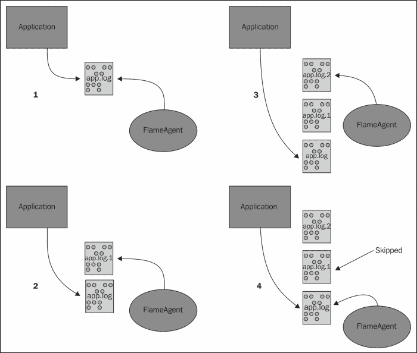

# 五、信号源和通道选择器

现在我们已经介绍了通道和接收器，我们将介绍一些将数据传送到您的 Flume 代理的更常见的方法。 正如在[第 1 章](1.html "Chapter 1. Overview and Architecture")、*概述和体系结构*中所讨论的，源是 Flume 代理的输入点。 Flume 发行版有许多可用的源代码，以及许多可用的开源选项。 像大多数开放源码软件一样，如果您找不到需要的东西，您可以通过扩展`org.apache.flume.source.AbstractSource`类来编写您自己的软件。 由于本书的主要关注点是将日志文件吸收到 Hadoop 中，因此我们将介绍几个更合适的来源来实现这一点。

# 使用 Tail 的问题

如果您使用过任何 Flume 0.9版本，您会注意到 TailSource 不再是 Flume 的一部分。 TailSource 提供了一种机制来`tail`([http://en.wikipedia.org/wiki/Tail_(Unix)](http://en.wikipedia.org/wiki/Tail_(Unix)))系统上的任何文件，并为文件的每一行创建 Flume 事件。 许多人已经将文件系统用作创建数据的应用程序(例如，`log4j`)和负责将这些文件移动到其他地方的机制(例如，`syslog`)之间的交接点。因此，TailSource 是 syslog 传输的完美替代品，无需对创建数据的应用程序进行更改。

与通道和接收器的情况一样，事件作为事务的一部分在通道中添加和删除。 当您跟踪文件时，无法正确参与事务。 如果发生向通道成功写入的失败，或者如果通道已满(这是一种比失败更有可能的事件)，则数据不能像回滚语义所规定的那样被“放回”。

此外，如果写入文件的数据速率超过 Flume 可以读取数据的速率，则可能会完全丢失一个或多个输入日志文件。 例如，假设您在跟踪`/var/log/app.log`。 当该文件达到特定大小时，该文件将被旋转/重命名为`/var/log/app.log.1`，并启动一个新文件`/var/log/app.log`。 比方说，你在媒体上得到了好评，你的申请记录比往常高得多。 当发生另一次旋转将`/var/log/app.log`移动到`/var/log/app.log.1`时，Flume 可能仍在从旋转的文件(`/var/log/app.log.1`)中读取。 正在读取的文件 Flume 现在已重命名为`/var/log/app.log.2`。 当 Flume 完成此文件时，它将移动到它认为是下一个文件`/var/log/app.log`的位置，从而跳过现在驻留在`/var/log/app.log.1`处的文件。 这种数据丢失完全不会被注意到，如果可能的话，这是我们想要避免的。



出于这些原因，我们决定在重构 Flume 时将`tail`功能从 Flume 中移除。 已经删除了 TailSource 的一些解决方法，但应该注意的是，在这些情况下，没有任何解决方法可以消除在负载下丢失数据的可能性。

# EXEC 来源

EXEC 源提供了一种机制，用于在 Flume 外部运行命令，然后将输出转换为 Flume 事件。 要使用 EXEC 源，请将`type`属性设置为`exec`：

```scala
agent.sources.s1.type=exec
```

Flume 中的所有源都需要使用`channels`(复数)属性指定要向其写入事件的通道列表。 这是一个或多个通道名称的空格分隔列表：

```scala
agent.sources.s1.channels=c1
```

唯一需要的另一个参数是`command`属性，它告诉 Flume 要向操作系统传递什么命令。 例如：

```scala
agent.sources=s1
agent.sources.s1.channels=c1
agent.sources.s1.type=exec
agent.sources.s1.command=tail -F /var/log/app.log
```

在这里，我为名为`agent`的代理配置了单个源`s1`。 源(EXEC 源)将跟踪`/var/log/app.log`文件，并遵循外部应用程序可能对该日志文件执行的任何轮换。 所有事件都写入`c1`通道。 这是 Flume 1.x 中缺少 TailSource 的解决方法之一的一个示例。

### 备注

如果将`tail -F`命令与 EXEC 源一起使用，则当 Flume 代理关闭或重新启动时，派生进程可能不会 100%关闭。 这将使孤立的尾部进程永远不会退出。 `tail -F`根据定义，没有终点。 即使您删除了尾随的文件(至少在 Linux 中)，正在运行的尾部进程也会无限期地保持文件句柄打开。 这可以防止文件的空间被实际回收，直到尾部进程退出--它不会退出。我想您已经开始明白为什么 Flume 开发人员不喜欢尾部文件了。

如果沿着这条路线走下去，请务必定期扫描进程表，查找父 PID 为 1 的`tail -F`。这些进程实际上是死进程，需要手动终止。

以下是您可以与 EXEC 源一起使用的其他属性的列表：

<colgroup><col style="text-align: left"> <col style="text-align: left"> <col style="text-align: left"> <col style="text-align: left"></colgroup> 
| 

钥匙 / 键 / 关键 / 主调

 | 

规定的

 | 

类型 / 品种 / 象征 / 印刷文字

 | 

不履行 / 拖欠 / 未到庭 / 不到场

 |
| --- | --- | --- | --- |
| `type` | 是 | `String` | `exec` |
| `channels` | 是 | `String` | 以空格分隔的通道列表 |
| `command` | 是 | `String` |   |
| `restart` | 没有Колибрисистема | `boolean` | `false` |
| `restartThrottle` | 没有Колибрисистема | `long`(毫秒) | 10000 毫秒 |
| `logStdErr` | 没有Колибрисистема | `boolean` | `false` |
| `batchSize` | 没有Колибрисистема | `int` | `20` |

并不是每个命令都能继续运行，要么是因为它失败了(比如它正在写入的通道已满)，要么是因为命令被设计为立即退出。 在本例中，我们希望通过 Linux`uptime`命令记录系统负载，该命令将一些系统信息打印到`stdout`并退出：

```scala
agent.sources.s1.command=uptime
```

此命令将立即退出，因此您可以使用`restart`和`restartThrottle`属性定期运行它：

```scala
agent.sources.s1.command=uptime
agent.sources.s1.restart=true
agent.sources.s1.restartThrottle=60000
```

这将每分钟产生一个事件。 在 Tail 示例中，如果通道填满导致 EXEC 源出现故障，您可以使用这些属性重新启动 EXEC 源。 在这种情况下，设置`restart`属性将从当前文件的开头开始拖尾该文件，从而产生重复项。 根据将`restartThrottle`值设置为的时间长短，您可能会因文件轮换到 Flume 外部而丢失某些数据。 此外，通道可能*仍然*不能接受数据，在这种情况下，源将再次出现故障。 将此值设置得太低意味着给通道提供更少的排水时间，而且与我们看到的某些汇不同，没有指数回退的选项。

有时，命令会将要捕获的输出写入`StdErr`。 如果还希望包括这些行，请将`logStdErr`属性设置为`true`。 没有将*关闭*`StdOut`行作为输入的属性(但您可以在[第 6 章](6.html "Chapter 6. Interceptors, ETL, and Routing")、*拦截器、ETL 和路由*中讨论拦截器时过滤掉它们)。

最后，您可以通过更改`batchSize`属性指定每个事务要写入的事件数。 如果您的输入数据很大，并且您发现无法足够快地写入通道，则您可能需要将此值设置为大于默认值 20。 使用较大的批处理大小可以降低每个事件的总体平均事务开销。 使用不同的值进行测试并监控通道的投放率是唯一确定的方法。

# 假脱机目录源

为了避免跟踪文件所固有的所有假设，设计了一个新的源来跟踪哪些文件已转换为 Flume 事件，哪些文件仍需要处理。 假脱机目录源被赋予一个目录来监视新文件的出现。 假定复制到此目录的文件已完成；否则，源可能会尝试发送部分文件。 它还假设文件名永远不会更改；否则，源将在重新启动时失去其位置，不知道哪些文件已经发送，哪些文件没有发送。 使用`DailyRollingFileAppender`而不是`RollingFileAppender`可以在`log4j`中满足文件名条件，但是，当前打开的文件需要写入一个目录，并在关闭后复制到假脱机目录。 发货的`log4j`附加设备都没有此功能。

也就是说，如果您在环境中使用 Linux`logrotate`程序，可能会对此感兴趣。 您可以使用`postrotate`脚本将完成的文件移动到单独的目录。

请记住，在标记为已由 Flume 发送之后，您将需要一个单独的过程来清除假脱机目录中的所有旧文件，否则您的磁盘最终将被填满。

要创建假脱机目录源，请将`type`属性设置为`spooldir`。 您必须设置目录以监视`spoolDir`属性：

```scala
agent.sources=s1
agent.sources.channels=c1
agent.sources.s1.type=spooldir
agent.sources.s1.spoolDir=/path/to/files
```

以下是假脱机目录源的属性摘要：

<colgroup><col style="text-align: left"> <col style="text-align: left"> <col style="text-align: left"> <col style="text-align: left"></colgroup> 
| 

钥匙 / 键 / 关键 / 主调

 | 

规定的

 | 

类型 / 品种 / 象征 / 印刷文字

 | 

不履行 / 拖欠 / 未到庭 / 不到场

 |
| --- | --- | --- | --- |
| `type` | 是 | `String` | `spooldir` |
| `channels` | 是 | `String` | 以空格分隔的通道列表 |
| `spoolDir` | 是 | `String` | 假脱机目录的路径 |
| `fileSuffix` | 没有Колибрисистема | `String` | `.COMPLETED` |
| `fileHeader` | 没有Колибрисистема | `boolean` | `false` |
| `fileHeaderKey` | 没有Колибрисистема | `String` | `file` |
| `batchSize` | 没有Колибрисистема | `int` | `10` |
| `bufferMaxLines` | 没有Колибрисистема | `int` | `100` |
| `maxBufferLineLength` | 没有Колибрисистема | `int` | `5000` |

文件传输完成后，除非通过设置`fileSuffix`属性将其覆盖，否则将使用`.COMPLETED`扩展名对其进行重命名。 例如：

```scala
agent.source.s1.fileSuffix=.DONE
```

如果要将绝对文件路径附加到每个事件，请将`fileHeader`属性设置为`true`。 这将使用`file`键创建标题，除非使用`fileHeaderKey`属性将其设置为其他值。 例如：

```scala
agent.source.s1.fileHeader=true
agent.source.s1.fileHeaderKey=sourceFile
```

如果事件是从`/path/to/files/foo.1234.log`文件中读取的，这将添加标题`{sourceFile=/path/to/files/foo.1234.log}`。

`batchSize`属性允许您调整写入通道的每个事务的事件数。 增加这可能会提供更好的吞吐量，但代价是更大的事务(可能还会有更大的回滚)。 `bufferMaxLines`属性用于设置读取文件时使用的内存缓冲区的大小，方法是将其与`maxBufferLineLength`相乘。 如果您的数据非常短，您可以考虑增加`bufferMaxLines`，同时减少`maxBufferLineLength`。 在这种情况下，它将在不增加内存开销的情况下提高吞吐量。 也就是说，如果事件长度超过 5000 个字符，则需要将`maxBufferLineLength`设置得更高。

最后，您需要确保将新文件写入假脱机目录的任何机制都会创建唯一的文件名，比如添加时间戳(可能还有更多)。 重复使用文件名会混淆来源，您的数据可能无法处理。

与往常一样，请记住，重新启动和错误将在假脱机目录中因未标记为完成而重新传输的任何文件上创建重复事件。

# 系统日志源

Syslog 已经有年的历史，经常被用作在系统中捕获和移动日志的操作系统级机制。 在许多方面，与 Flume 提供的某些功能存在重叠。 甚至有一个用于**rsyslog**的 Hadoop 模块，它是 syslog([http://www.rsyslog.com/doc/rsyslog_conf_modules.html/omhdfs.html](http://www.rsyslog.com/doc/rsyslog_conf_modules.html/omhdfs.html))的一个更现代的变体。 一般来说，我不喜欢将可能独立版本的技术结合在一起的解决方案。 如果您使用此 rsyslog/Hadoop 集成，则需要在将 Hadoop 群集升级到新的主要版本的同时，更新编译到 rsyslog 中的 Hadoop 版本。 如果您有大量的服务器和/或环境，这在后勤上可能会很困难。 Hadoop 有线协议中的向后兼容性是 Hadoop 社区正在积极研究的问题，但目前还不是标准。 我们将在[第 7 章](7.html "Chapter 7. Monitoring Flume")，*监控 Flume*中讨论更多这方面的内容，届时我们将讨论分层数据流。

Syslog 具有较旧的 UDP 传输和较新的 TCP 协议，该协议可以处理大于单个 UDP 数据包可以传输的数据量(约 64k)的数据，以及处理可能需要重新传输数据的与网络相关的拥塞事件。

最后，syslog 源上还有一些未记录的属性，这些属性允许为不符合 RFC 标准的消息添加额外的正则表达式匹配模式。 我不会讨论这些额外的设置，但是如果您经常遇到解析错误，您应该知道它们。 在这种情况下，请查看`org.apache.flume.source.SyslogUtils`的来源以了解实现详细信息以查找原因。

有关系统日志术语(如什么是工具)和标准格式的更多详细信息，请参阅**RFC3164(**[http://tools.ietf.org/html/rfc3164](http://tools.ietf.org/html/rfc3164))和**RFC5424**([http://tools.ietf.org/html/rfc5424](http://tools.ietf.org/html/rfc5424))。

## 系统日志 UDP 源

当您从服务器的本地 syslog 进程接收数据时，只要数据足够小(小于 64k)，使用 syslog 的 UDP 版本通常是安全的。

### 备注

无论您的网络实际可以处理什么，该源的实现都选择 2500 字节作为最大有效负载大小。 因此，如果您的有效负载将大于此值，请改用其中一个 TCP 源。

要创建系统日志 UDP 源，请将`type`属性设置为`syslogudp`。 必须使用`port`属性设置要侦听的端口。 可选的`host`属性指定绑定地址。 如果未指定主机，则将使用服务器的所有 IP-与指定`0.0.0.0`相同。 在此示例中，我们将仅侦听端口 5140 上的本地 UDP 连接：

```scala
agent.sources=s1
agent.sources.channels=c1
agent.sources.s1.type=syslogudp
agent.sources.s1.host=localhost
agent.sources.s1.port=5140
```

如果希望 syslog 转发尾部文件，可以在 syslog 配置文件中添加如下行：

```scala
*.err;*.alert;*.crit;*.emerg;kern.*     @localhost:5140
```

这会将任何优先级的所有错误、警报、严重、紧急优先级和内核消息发送到您的 Flume 源中。 单个`@`符号表示应使用 UDP 协议。

以下是系统日志 UDP 源的属性摘要：

<colgroup><col style="text-align: left"> <col style="text-align: left"> <col style="text-align: left"> <col style="text-align: left"></colgroup> 
| 

钥匙 / 键 / 关键 / 主调

 | 

规定的

 | 

类型 / 品种 / 象征 / 印刷文字

 | 

不履行 / 拖欠 / 未到庭 / 不到场

 |
| --- | --- | --- | --- |
| `type` | 是 | `String` | `syslogudp` |
| `channels` | 是 | `String` | 以空格分隔的通道列表 |
| `port` | 是 | `int` |   |
| `host` | 没有Колибрисистема | `String` | `0.0.0.0` |

由 syslogUDP 源创建的 Flume 标头摘要如下：

<colgroup><col style="text-align: left"> <col style="text-align: left"></colgroup> 
| 

标题键

 | 

描述 / 描写 / 形容 / 类别

 |
| --- | --- |
| `Facility` | 系统日志工具。 请参阅 syslog文档。 |
| `Priority` | 系统日志优先级。 请参阅系统日志文档。 |
| `timestamp` | 系统日志事件转换为纪元时间戳的时间。 如果不是从标准 RFC 格式之一解析，则省略。 |
| `hostname` | 系统日志消息中解析的主机名。 如果未分析则省略。 |
| `flume.syslog.status` | 解析系统日志消息的标头时出现问题。 如果有效载荷不符合 RFC，则设置为`Invalid`。 如果消息长于`eventSize`值，则设置为`Incomplete`(对于 UDP，内部设置为 2500 字节)。 如果一切正常，则省略。 |

## 系统日志 TCP 源

如前所述，syslog TCP 源为 TCP 上的消息提供了一个端点，从而允许更大的有效负载大小和 TCP 重试语义，这些语义应用于任何可靠的服务器间通信。

要创建系统日志 TCP 源，请将`type`属性设置为`syslogtcp`。 您仍必须设置要侦听的绑定地址和端口：

```scala
agent.sources=s1 
agent.sources.s1.type=syslogtcp
agent.sources.s1.host=0.0.0.0
agent.sources.s1.port=12345
```

如果您的 syslog 实施支持基于 TCP 的 syslog，则配置通常相同，只是使用双`@`符号表示 TCP 传输。 下面是使用 TCP 的相同示例，其中我将转发到在名为`flume-1`的不同服务器上运行的 Flume 代理：

```scala
*.err;*.alert;*.crit;*.emerg;kern.*     @@flume-1:12345
```

系统日志 TCP 源有一些可选属性：

<colgroup><col style="text-align: left"> <col style="text-align: left"> <col style="text-align: left"> <col style="text-align: left"></colgroup> 
| 

钥匙 / 键 / 关键 / 主调

 | 

规定的

 | 

类型 / 品种 / 象征 / 印刷文字

 | 

不履行 / 拖欠 / 未到庭 / 不到场

 |
| --- | --- | --- | --- |
| `type` | 是 | `String` | `syslogtcp` |
| `channels` | 是 | `String` | 以空格分隔的通道列表 |
| `port` | 是 | `int` |   |
| `host` | 没有Колибрисистема | `String` | `0.0.0.0` |
| `eventSize` | 没有Колибрисистема | `int`(字节) | 2500 字节 |

由syslog TCP 源创建的 Flume 标头摘要如下：

<colgroup><col style="text-align: left"> <col style="text-align: left"></colgroup> 
| 

标题键

 | 

描述 / 描写 / 形容 / 类别

 |
| --- | --- |
| `Facility` | 系统日志工具。 请参阅系统日志文档。 |
| `Priority` | 系统日志优先级。 请参阅 syslog文档。 |
| `timestamp` | 将转换为纪元时间戳的系统日志事件的时间。 如果不是从标准 RFC 格式之一解析，则省略。 |
| `hostname` | 系统日志消息中解析的主机名。 如果未分析则省略。 |
| `flume.syslog.status` | 解析系统日志消息的标头时出现问题。 如果有效载荷不符合 RFC，则设置为`Invalid`。 如果消息比配置的`eventSize`长，则设置为`Incomplete`。 如果一切正常，则省略。 |

## 多端口系统日志 TCP 源

多端口 syslogTCP 源在功能上与 syslog TCP 源几乎相同，不同之处在于它可以侦听多个端口的输入。 如果您无法更改 syslog 将在其转发规则中使用的端口(它可能根本不是您的服务器)，您可能需要使用此功能。 更有可能的是，您将使用它来读取多个格式，使用一个源来写入不同的通道。 我们稍后将在*通道选择器*部分介绍这一点。

要配置此源，请将`type`属性设置为`multiport_syslogtcp`：

```scala
agent.sources.s1.type=multiport_syslogtcp
```

与其他 syslog 源一样，您需要指定端口，但在本例中是空格分隔的端口列表。 只有在指定了一个端口时，才能使用此选项。 其属性为`ports`(复数)：

```scala
agent.sources.s1.type=multiport_syslogtcp
agent.sources.s1.channels=c1
agent.sources.s1.ports=33333 44444
agent.sources.s1.host=0.0.0.0
```

这会将名为`s1`的多端口 syslog TCP 源配置为侦听端口`33333`和`44444`上的任何传入连接，并将它们发送到通道`c1`。

为了知道哪个事件来自哪个端口，您可以将可选的`portHeader`属性设置为键的名称，该键的值将是端口号。 如果我将此属性添加到配置中：

```scala
agent.sources.s1.portHeader=port
```

则从端口`33333`接收的任何事件都将具有标题键/值`{"port"="33333"}`。 正如您在[第 4 章](4.html "Chapter 4. Sinks and Sink Processors")，*接收器和接收器处理器*中看到的，您现在可以使用此值(实际上是任何标头)作为 HDFS 接收器文件路径约定的一部分，如下所示：

```scala
agent.sinks.k1.hdfs.path=/logs/%{hostname}/%{port}/%Y/%m/%D/%H
```

以下是这些属性的完整表格：

<colgroup><col style="text-align: left"> <col style="text-align: left"> <col style="text-align: left"> <col style="text-align: left"></colgroup> 
| 

钥匙 / 键 / 关键 / 主调

 | 

规定的

 | 

类型 / 品种 / 象征 / 印刷文字

 | 

不履行 / 拖欠 / 未到庭 / 不到场

 |
| --- | --- | --- | --- |
| `type` | 是 | `String` | `syslogtcp` |
| `channels` | 是 | `String` | 以空格分隔的通道列表 |
| `ports` | 是 | `int` | 以空格分隔的端口号列表 |
| `host` | 没有Колибрисистема | `String` | `0.0.0.0` |
| `eventSize` | 没有Колибрисистема | `int`(字节) | 2500 字节 |
| `portHeader` | 没有Колибрисистема | `String` |   |
| `batchSize` | 没有Колибрисистема | `int` | `100` |
| `readBufferSize` | 没有Колибрисистема | `int`(字节) | `1024` |
| `numProcessors` | 没有Колибрисистема | `int` | 自动检测到 |
| `charset.default` | 没有Колибрисистема | `String` | `UTF-8` |
| `charset.port.PORT#` | 没有Колибрисистема | `String` |   |

此 TCP 源在标准 TCP syslog 源的基础上有一些额外的可调选项，您可能希望对其进行优化。 第一个是`batchSize`属性。 这是通道的每个事务处理的事件数。 还有`readBufferSize`属性指定内部 MINA 库使用的内部缓冲区大小。 最后，`numProcessors`属性用于调整 MINA 中的工作线程池的大小。 在调优这些参数之前，您可能希望熟悉 MINA([http://mina.apache.org/](http://mina.apache.org/))，并在偏离默认设置之前查看源代码。

最后，您可以指定在字符串和 byte[]之间进行转换时要使用的默认和每个端口的字符编码。

```scala
agent.sources.s1.charset.default=UTF-16
agent.sources.s1.charset.port.33333=UTF-8
```

此示例配置显示，除了使用 UTF-8 的端口 33333 流量外，所有端口都将使用 UTF-16 编码进行解释。

下面汇总了此源创建的 Flume 标头：

<colgroup><col style="text-align: left"> <col style="text-align: left"></colgroup> 
| 

标题键

 | 

描述 / 描写 / 形容 / 类别

 |
| --- | --- |
| `Facility` | Syslog工具。 请参阅系统日志文档。 |
| `Priority` | 系统日志优先级。 请参阅系统日志文档。 |
| `timestamp` | 转换为纪元时间戳的系统日志事件的时间。 如果未从标准 RFC 格式之一解析，则省略。 |
| `hostname` | 系统日志消息中解析的主机名。 如果未分析则省略。 |
| `flume.syslog.status` | 解析 syslog 消息的标头时出现问题。 如果有效载荷不符合 RFC，则设置为`Invalid`。 如果消息比配置的`eventSize`长，则设置为`Incomplete`。 如果一切正常，则省略。 |

# 通道选择器

正如我们之前在[第 1 章](1.html "Chapter 1. Overview and Architecture")、*概述和架构*中所讨论的，源可以写入一个或多个通道。 这就是该属性是复数(`channels`而不是`channel`)的原因。 有两种方式可以处理多个通道。 该事件可以写入所有通道，也可以基于某个 Flume 标头值仅写入一个通道。 在Flume中的内部机制称为**通道选择器**。

任何通道的选择器都可以使用`selector.type`属性指定。 任何选择器特定的属性都以常用的源前缀开头；代理名称、关键字 Sources 和源名称：

```scala
agent.sources.s1.selector.type=replicating
```

## 正在复制

默认情况下，如果您没有为信号源指定选择器，则默认值为`replicating`。 复制选择器将相同的事件写入信号源的通道列表中的所有通道：

```scala
agent.sources.s1.channels=c1 c2 c3
agent.sources.s1.selector.type=replicating
```

在本例中，每个事件都将写入所有三个通道`c1`、`c2`和`c3`。

此选择器上有一个可选属性，名为`optional`。 它是可选通道的空格分隔列表。 也就是说，如果我设置了以下内容：

```scala
agent.sources.s1.channels=c1 c2 c3 
agent.sources.s1.selector.type=replicating 
agent.sources.s1.selector.optional=c2 c3
```

写入通道`c2`或`c3`的任何失败都不会导致事务失败，写入`c1`的任何数据都将被提交。 在前面没有可选通道的示例中，任何单通道故障都会回滚所有通道的事务。

## 多路复用

如果要将不同的事件发送到不同的通道，可以通过将`selector.type`设置为`multiplexing`来使用多路复用通道选择器。 您还需要通过设置`selector.header`属性告诉通道选择器使用哪个标题。

```scala
agent.sources.s1.selector.type=multiplexing
agent.sources.s1.selector.header=port
```

假设我们使用多端口 Syslog TCP 源侦听四个端口，分别是 11111、22222、33333 和 44444，`portHeader`设置为`port`。 请考虑以下配置：

```scala
agent.sources.s1.selector.default=c2
agent.sources.s1.selector.mapping.11111=c1 c2
agent.sources.s1.selector.mapping.44444=c2
agent.sources.s1.selector.optional.44444=c3
```

这将导致端口 22222 和端口 33333 的通信量仅通过通道`c2`。 来自端口 11111 的流量将进入通道`c1`和`c2`。 任一通道上的故障都不会导致向任一通道添加任何内容。 来自端口 44444 的流量将进入通道`c2`和`c3`；但是，写入`c3`失败仍会将事务提交到通道`c2`(如果发生该事件，则不会再次尝试`c3`)。

# 摘要

在本章中，我们深入介绍了可用于将日志数据插入 Flume 的各种来源，包括：

*   EXEC 消息来源
*   系统日志源(UDP、TCP 和多端口 TCP)

我们讨论了在 Flume 0.9 中复制旧的 TailSource 功能，以及使用 Tail 语义的一般问题。

我们还介绍了通道选择器以及如何将事件发送到多个通道之一。 具体地说，就是：

*   复制通道选择器
*   多路复用信道选择器

还讨论了可选通道，作为一种仅在使用多个通道时使某些通道的通道 PUT 事务失败的方法。

在下一章中，我们将介绍允许在飞行中检查和转换事件的拦截器。 拦截器与通道选择器结合使用，提供了使用 Flume 创建复杂数据流的最后一块。