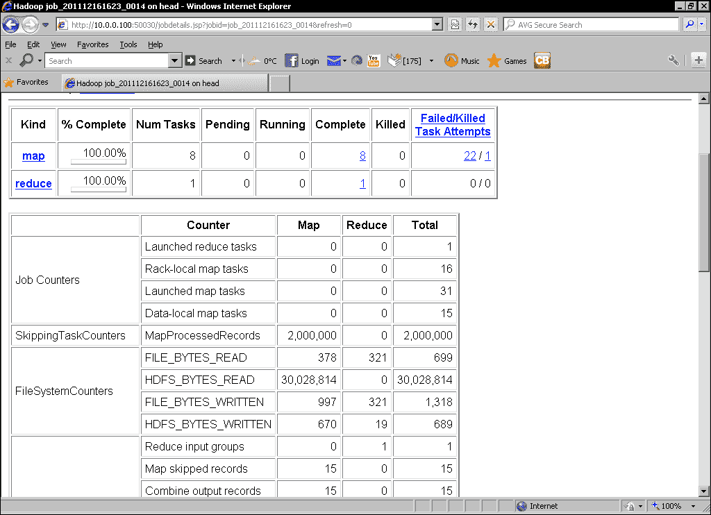

# 第六章.当事情破裂时

*Hadoop 的主要承诺之一是对失败的恢复能力，以及在失败发生时能够幸免于难的能力。 容忍失败将是本章的重点。*

我们将特别介绍以下主题：

*   Hadoop 如何处理 DataNodes 和 TaskTracker 的故障
*   Hadoop 如何处理 NameNode 和 JobTracker 的故障
*   硬件故障对 Hadoop 的影响
*   如何处理由软件错误导致的任务失败
*   脏数据如何导致任务失败以及如何处理

在此过程中，我们将加深对 Hadoop 各个组件如何组合在一起的理解，并确定一些最佳实践领域。

# 故障

对于许多技术，在出现问题时要采取的步骤在很多文档中很少涉及，而且通常只被视为专家感兴趣的主题。 有了 Hadoop，它变得更加突出；Hadoop 的大部分架构和设计都基于在故障频繁且意料之中的环境中执行。

## 拥抱失败

近年来，一种与传统心态不同的心态被称为**拥抱失败**。 与其希望失败不会发生，不如接受这样的事实：失败会发生，并且知道当失败发生时，您的系统和进程将如何响应。

## 或者至少不要害怕

这可能有点牵强，因此，我们在本章的目标是让您对系统中的故障感到更舒服。 我们将杀死正在运行的集群的进程，故意导致软件失败，将坏数据推入我们的作业，通常会造成尽可能多的中断。

## 不要在家里尝试这个

通常，当试图破坏系统时，测试实例会被滥用，从而使操作系统不受中断的影响。 我们不主张对可操作的 Hadoop 集群执行本章中给出的操作，但事实是，除了一两个非常具体的情况外，您可以这样做。 我们的目标是了解各种类型的故障的影响，以便当它们确实发生在业务关键型系统上时，您将知道它是否是一个问题。 幸运的是，大多数案例都是由 Hadoop 为您处理的。

## 故障类型

我们将故障大致分为以下五种类型：

*   节点出现故障，即 DataNode 或 TaskTracker 进程
*   群集的主进程(即 NameNode 或 JobTracker 进程)出现故障
*   硬件故障，即主机崩溃、硬盘故障等
*   由于软件错误，MapReduce 作业中的单个任务失败
*   MapReduce 作业中的单个任务因数据问题而失败

在接下来的部分中，我们将依次探讨其中的每一个。

## Hadoop 节点故障

我们将探讨的第一类故障是单个 DataNode 和 TaskTracker 进程的意外终止。 考虑到 Hadoop 声称通过其商用硬件的故障生存来管理系统可用性，我们可以预期这一领域将非常稳固。 事实上，随着集群发展到成百上千台主机，单个节点的故障可能会变得相当常见。

在我们开始杀戮之前，让我们先介绍一个新工具并正确设置集群。

### dfsadmin 命令

作为经常查看 HDFS Web 用户界面以确定群集状态的替代工具，我们将使用`dfsadmin`命令行工具：

```scala
$ Hadoop dfsadmin 

```

这将给出该命令可以采用的各种选项的列表；出于我们的目的，我们将使用`-report`选项。 这提供了整个群集状态的概述，包括已配置的容量、节点和文件，以及有关每个已配置节点的具体详细信息。

### 群集设置、测试文件和块大小

以下活动需要一个完全分布式集群；请参阅本书前面给出的设置说明。 下面的屏幕截图和示例使用一个集群，其中一个主机用于 JobTracker 和 NameNode，四个从节点用于运行 DataNode 和 TaskTracker 进程。

### 提示

请记住，您不需要为每个节点配备物理硬件，我们的群集使用虚拟机。

在正常使用中，64 MB 是 Hadoop 群集通常配置的块大小。 出于我们的测试目的，这非常不方便，因为我们需要相当大的文件才能在我们的多节点集群中获得有意义的块计数。

我们可以做的是减小配置的块大小；在本例中，我们将使用 4MB。 对 Hadoop`conf`目录中的`hdfs-site.xml`文件进行以下修改：

```scala
<property>
<name>dfs.block.size</name>
<value>4194304</value>
;</property>
<property>
<name>dfs.namenode.logging.level</name>
<value>all</value>
</property>
```

第一个属性对块大小进行必要的更改，第二个属性增加 NameNode 日志记录级别，以使某些块操作更可见。

### 备注

这两个设置都适用于此测试设置，但在生产集群上很少看到。 尽管如果正在调查一个特别困难的问题，可能需要更高的 NameNode 日志记录，但您不太可能想要一个小到 4MB 的块大小。 虽然较小的块大小可以很好地工作，但它会影响 Hadoop 的效率。

我们还需要一个大小合理的测试文件，它将由多个 4MB 的块组成。 我们实际上不会使用文件的内容，因此文件类型无关紧要。 但是，对于以下部分，您应该尽可能将最大的文件复制到 HDFS 上。 我们使用的是 CD ISO 映像：

```scala
$ Hadoop fs –put cd.iso file1.data

```

### 容错和弹性 MapReduce

本书中的示例是针对本地 Hadoop 集群的，因为这样可以使一些故障模式细节更加明确。 EMR 提供与本地集群完全相同的容错能力，因此这里描述的故障场景同样适用于本地Hadoop 集群和 EMR 托管的集群。

# 操作时间-终止 DataNode 进程

首先，我们将终止一个 DataNode。 回想一下，DataNode 进程在 HDFS 集群中的每台主机上运行，负责管理 HDFS 文件系统中的块。 由于 Hadoop 在默认情况下对数据块使用复制系数 3，因此我们预计单个 DataNode 故障不会对可用性产生直接影响，而是会导致某些数据块暂时低于复制阈值。 执行以下步骤以终止 DataNode 进程：

1.  Firstly, check on the original status of the cluster and check whether everything is healthy. We'll use the `dfsadmin` command for this:

    ```scala
    $ Hadoop dfsadmin -report
    Configured Capacity: 81376493568 (75.79 GB)
    Present Capacity: 61117323920 (56.92 GB)
    DFS Remaining: 59576766464 (55.49 GB)
    DFS Used: 1540557456 (1.43 GB)
    DFS Used%: 2.52%
    Under replicated blocks: 0
    Blocks with corrupt replicas: 0
    Missing blocks: 0
    -------------------------------------------------
    Datanodes available: 4 (4 total, 0 dead)
    Name: 10.0.0.102:50010
    Decommission Status : Normal
    Configured Capacity: 20344123392 (18.95 GB)
    DFS Used: 403606906 (384.91 MB)
    Non DFS Used: 5063119494 (4.72 GB)
    DFS Remaining: 14877396992(13.86 GB)
    DFS Used%: 1.98%
    DFS Remaining%: 73.13%
    Last contact: Sun Dec 04 15:16:27 PST 2011
    …

    ```

    现在登录到个节点，并使用`jps`命令确定 DataNode 进程的进程 ID：

    ```scala
    $ jps
    2085 TaskTracker
    2109 Jps
    1928 DataNode

    ```

2.  使用 DataNode 进程的**进程 ID**(**PID**)并终止它：

    ```scala
    $ kill -9  1928

    ```

3.  检查主机

    ```scala
    $ jps
    2085 TaskTracker

    ```

    上是否不再运行 DataNode 进程
4.  使用`dfsadmin`命令再次检查群集的状态：

    ```scala
    $ Hadoop dfsadmin -report
    Configured Capacity: 81376493568 (75.79 GB)
    Present Capacity: 61117323920 (56.92 GB)
    DFS Remaining: 59576766464 (55.49 GB)
    DFS Used: 1540557456 (1.43 GB)
    DFS Used%: 2.52%
    Under replicated blocks: 0
    Blocks with corrupt replicas: 0
    Missing blocks: 0
    -------------------------------------------------
    Datanodes available: 4 (4 total, 0 dead)
    …

    ```

5.  要关注的关键线路是报告块、活动节点和每个节点的最后联系时间的线路。 一旦死节点的最后联系时间约为 10 分钟，请更频繁地使用该命令，直到块和活动节点值更改：

    ```scala
    $ Hadoop dfsadmin -report
    Configured Capacity: 61032370176 (56.84 GB)
    Present Capacity: 46030327050 (42.87 GB)
    DFS Remaining: 44520288256 (41.46 GB)
    DFS Used: 1510038794 (1.41 GB)
    DFS Used%: 3.28%
    Under replicated blocks: 12
    Blocks with corrupt replicas: 0
    Missing blocks: 0
    -------------------------------------------------
    Datanodes available: 3 (4 total, 1 dead)
    …

    ```

6.  重复该过程，直到复制不足的数据块计数再次为`0`：

    ```scala
    $ Hadoop dfsadmin -report
    …
    Under replicated blocks: 0
    Blocks with corrupt replicas: 0
    Missing blocks: 0
    -------------------------------------------------
    Datanodes available: 3 (4 total, 1 dead)
    …

    ```

## *刚刚发生了什么？*

高层的描述非常简单；Hadoop 认识到节点丢失，并解决了这个问题。 然而，为了实现这一目标，还有相当多的工作要做。

当我们终止 DataNode 进程时，作为读/写操作的一部分，该主机上的进程不再可用于服务或接收数据块。 然而，我们当时实际上并没有访问文件系统，那么 NameNode 进程是如何知道这个特定的 DataNode 是死的呢？

### NameNode 和 DataNode 通信

答案在于 NameNode 和 DataNode 进程之间的持续通信，我们已经提到过一两次，但从未真正解释过。 这是通过来自 DataNode 的一系列持续不断的心跳消息来实现的，这些消息报告了它的当前状态和它持有的块。 作为回报，NameNode 向 DataNode 发出指令，例如创建新文件的通知或从另一个节点检索块的指令。

这一切都是在 NameNode 进程启动并开始从 DataNode 接收状态消息时开始的。 回想一下，每个 DataNode 都知道其 NameNode 的位置，并将持续发送状态报告。 这些消息列出了每个 DataNode 保存的块，NameNode 可以由此构建一个完整的映射，使其能够将文件和目录与组成它们的块以及存储它们的节点相关联。

NameNode 进程监视它最后一次从每个 DataNode 接收心跳的时间，在达到阈值之后，它会假定 DataNode 不再起作用，并将其标记为失效。

### 备注

认为 DataNode 已死的确切阈值不能配置为单个 HDFS 属性。 相反，它是根据其他几个属性(如定义心跳间隔)计算得出的。 正如我们稍后将看到的，在 MapReduce 世界中事情会稍微简单一些，因为 TaskTracker 的超时是由单个配置属性控制的。

一旦某个 DataNode 被标记为失效，NameNode 进程就会确定该节点上保留的、现在已低于其复制目标的块。 在默认情况下，停用节点上保存的每个数据块将是三个复制副本之一，因此该节点保存其复制副本的每个数据块现在在群集上只有两个复制副本。

在前面的示例中，我们捕获了 12 个数据块仍未充分复制时的状态，即它们在整个群集中没有足够的复制副本来满足复制目标。 当 NameNode 进程确定复制不足的数据块时，它会分配其他 DataNode 从现有复制副本所在的主机复制这些数据块。 在这种情况下，我们只需重新复制数量非常少的数据块；在实时群集中，当受影响的数据块达到其复制系数时，节点故障可能会导致一段时间的高网络流量。

请注意，如果故障节点返回到群集，我们会遇到数据块的副本数量超过所需的个的情况；在这种情况下，NameNode 进程将发送指令以删除多余的副本。 要删除的特定副本是随机选择的，因此结果将是返回的节点最终将保留其某些块并删除其他块。

## 有一个围棋英雄-NameNode 日志挖掘

我们将NameNode 进程配置为记录其所有活动。 查看这些非常详细的日志，并尝试识别正在发送的复制请求。

最终输出显示复制不足的数据块复制到活动节点后的状态。 群集仅剩三个活动节点，但没有复制不足的数据块。

### 提示

重新启动所有主机上的失效节点的快速方法是使用`start-all.sh`脚本。 它将尝试启动所有内容，但它足够智能，可以检测正在运行的服务，这意味着您可以重新启动失效的节点，而不会有重复的风险。

# 行动时间-行动中的复制因素

让我们重复前面的过程，但这一次，从我们的四个集群中删除两个 DataNode。 我们将简要演练本练习，因为它与前面的*操作时间*部分非常相似：

1.  重新启动失效的 DataNode 并监视群集，直到所有节点都标记为活动。
2.  选择两个 DataNode，使用进程 ID，然后终止 DataNode 进程。
3.  如前所述，等待大约 10 分钟，然后通过`dfsadmin`主动监视群集状态，特别注意报告的复制不足数据块数量。
4.  等待群集稳定下来，并产生类似于以下内容的输出：

    ```scala
    Configured Capacity: 61032370176 (56.84 GB)
    Present Capacity: 45842373555 (42.69 GB)
    DFS Remaining: 44294680576 (41.25 GB)
    DFS Used: 1547692979 (1.44 GB)
    DFS Used%: 3.38%
    Under replicated blocks: 125
    Blocks with corrupt replicas: 0
    Missing blocks: 0
    -------------------------------------------------
    Datanodes available: 2 (4 total, 2 dead)
    …

    ```

## *刚刚发生了什么？*

这与以前的过程相同；不同之处在于，由于两个 DataNode 故障，明显有更多数据块低于复制因子，其中许多数据块只剩下一个剩余的副本。 因此，您应该会看到，报告的复制不足数据块数量在最初增加时会有更多活动，因为节点会出现故障，然后随着重新复制的发生而下降。 这些事件也可以在 NameNode 日志中看到。

请注意，尽管 Hadoop 可以使用重新复制将只有一个剩余副本的数据块增加到两个副本，但这仍会使数据块处于复制不足状态。 由于群集中只有两个活动节点，现在任何数据块都不可能满足默认复制目标 3 个。

由于空间原因，我们一直在截断`dfsadmin`输出；特别是，我们一直在省略每个节点的报告信息。 但是，让我们通过前面的阶段来看一下集群中的第一个节点。 在我们开始终止任何 DataNode 之前，它报告了以下内容：

```scala
Name: 10.0.0.101:50010
Decommission Status : Normal
Configured Capacity: 20344123392 (18.95 GB)
DFS Used: 399379827 (380.88 MB)
Non DFS Used: 5064258189 (4.72 GB)
DFS Remaining: 14880485376(13.86 GB)
DFS Used%: 1.96%
DFS Remaining%: 73.14%
Last contact: Sun Dec 04 15:16:27 PST 2011

```

在单个 DataNode 被终止并根据需要重新复制所有数据块后，它报告了以下信息：

```scala
Name: 10.0.0.101:50010
Decommission Status : Normal
Configured Capacity: 20344123392 (18.95 GB)
DFS Used: 515236022 (491.37 MB)
Non DFS Used: 5016289098 (4.67 GB)
DFS Remaining: 14812598272(13.8 GB)
DFS Used%: 2.53%
DFS Remaining%: 72.81%
Last contact: Sun Dec 04 15:31:22 PST 2011

```

需要注意的是，节点上的本地 DFS 存储增加了。 这不应该令人惊讶。 对于死节点，群集中的其他节点需要添加一些额外的数据块副本，这将转化为每个数据块上更高的存储利用率。

最后，以下是其他两个 DataNode 被终止后该节点的报告：

```scala
Name: 10.0.0.101:50010
Decommission Status : Normal
Configured Capacity: 20344123392 (18.95 GB)
DFS Used: 514289664 (490.46 MB)
Non DFS Used: 5063868416 (4.72 GB)
DFS Remaining: 14765965312(13.75 GB)
DFS Used%: 2.53%
DFS Remaining%: 72.58%
Last contact: Sun Dec 04 15:43:47 PST 2011

```

有了两个死节点，剩余的活动节点似乎应该消耗更多的本地存储空间，但事实并非如此，这又是复制因素的自然结果。

如果我们有四个节点，复制系数为 3，则每个数据块在群集中的三个活动节点上都有一个副本。 如果一个节点死了，驻留在其他节点上的数据块不会受到影响，但是在死节点上有副本的任何块都需要创建一个新的副本。 但是，由于只有三个活动节点，每个节点将保存每个数据块的副本。 如果第二个节点出现故障，这种情况将导致数据块复制不足，Hadoop 没有地方放置额外的副本。 由于剩余的两个节点都已拥有每个数据块的副本，因此它们的存储利用率不会增加。

# 采取行动的时间-故意导致块丢失

下一步应该很明显；让我们快速连续地杀死三个 DataNode。

### 提示

这是我们提到的第一个活动，您确实不应该在生产集群上执行这些活动。 虽然如果正确遵循这些步骤不会丢失数据，但有一段时间现有数据不可用。

以下是快速连续终止三个 DataNode 的步骤：

1.  使用以下命令重新启动所有节点：

    ```scala
    $ start-all.sh

    ```

2.  等待 Hadoop`dfsadmin -report`显示四个活动节点。
3.  将测试文件的新副本放到 HDFS 上：

    ```scala
    $ Hadoop fs -put file1.data file1.new

    ```

4.  登录到其中三台群集主机，并终止每台主机上的 DataNode 进程。
5.  等待通常的 10 分钟，然后通过`dfsadmin`开始监视群集，直到您得到类似以下报告丢失数据块的输出：

    ```scala
    …
    Under replicated blocks: 123
    Blocks with corrupt replicas: 0
    Missing blocks: 33
    -------------------------------------------------
    Datanodes available: 1 (4 total, 3 dead)
    …

    ```

6.  尝试从 HDFS 检索测试文件：

    ```scala
    $ hadoop fs -get file1.new  file1.new
    11/12/04 16:18:05 INFO hdfs.DFSClient: No node available for block: blk_1691554429626293399_1003 file=/user/hadoop/file1.new
    11/12/04 16:18:05 INFO hdfs.DFSClient: Could not obtain block blk_1691554429626293399_1003 from any node:  java.io.IOException: No live nodes contain current block
    …
    get: Could not obtain block: blk_1691554429626293399_1003 file=/user/hadoop/file1.new

    ```

7.  使用`start-all.sh`脚本重新启动失效节点：

    ```scala
    $ start-all.sh

    ```

8.  重复监视块的状态：

    ```scala
    $ Hadoop dfsadmin -report | grep -i blocks
    Under replicated blockss: 69
    Blocks with corrupt replicas: 0
    Missing blocks: 35
    $ Hadoop dfsadmin -report | grep -i blocks
    Under replicated blockss: 0
    Blocks with corrupt replicas: 0
    Missing blocks: 30

    ```

9.  等待，直到没有报告丢失块，然后将测试文件复制到本地文件系统：

    ```scala
    $ Hadoop fs -get file1.new file1.new

    ```

10.  对此文件和原始文件执行 MD5 检查：

    ```scala
    $ md5sum file1.*
    f1f30b26b40f8302150bc2a494c1961d  file1.data
    f1f30b26b40f8302150bc2a494c1961d  file1.new

    ```

## *刚刚发生了什么？*

在重新启动被杀死的节点之后，我们再次将测试文件复制到 HDFS 上。 这并不是绝对必要的，因为我们可以使用现有的文件，但由于副本的混洗，干净的副本会给出最具代表性的结果。

然后，我们像以前一样杀死了三个个 DataNode，并等待 HDFS 响应。 与前面的示例不同，杀死这些节点意味着可以肯定的是，某些块将在被杀死的节点上拥有它们的所有副本。 正如我们所看到的，这正是结果；剩余的单节点群集显示了 100 多个复制不足的数据块(显然只剩下一个复制副本)，但也有 33 个数据块丢失。

谈论块有点抽象，所以我们尝试检索我们的测试文件，我们知道，该文件实际上有 33 个洞。 尝试访问该文件失败，因为 Hadoop 找不到传送该文件所需的丢失数据块。

然后，我们重新启动所有节点，并再次尝试检索该文件。 这一次成功了，但我们采取了额外的预防措施，对文件执行 MD5 密码检查，以确认它与原始文件按位相同-确实如此。

这一点很重要：虽然节点故障可能会导致数据不可用，但如果节点恢复，可能不会永久丢失数据。

### 数据可能丢失的时间

不要从这个例子中假定在 Hadoop 集群中不可能丢失数据。 一般情况下，这是非常困难的，但灾难往往有以错误的方式袭击的习惯。

如上例所示，多个节点的并行故障等于或大于复制系数，有可能导致块丢失。 在我们的示例中，四个集群中有三个死节点，可能性很高；在 1000 个集群中，这个几率要低得多，但仍然不是零。 随着群集大小的增加，故障率也会增加，在狭窄的时间窗口内出现三个节点故障的可能性越来越小。 相反，影响也会降低，但快速的多个故障总是会带来数据丢失的风险。

另一个更隐蔽的问题是反复出现或部分故障，例如，当整个群集的电源问题导致节点崩溃和重启时。 Hadoop 最终可能会追逐复制目标，不断要求恢复的主机复制复制不足的数据块，还可能会看到它们在任务中途失败。 这样的一系列事件还可能增加数据丢失的可能性。

最后，不要忘记人的因素。 当用户意外删除文件或目录时，让复制系数等于群集的大小(确保每个数据块都在每个节点上)对您没有帮助。

总结说，由于系统故障而丢失数据的可能性很小，但通过几乎不可避免的人为操作是可能的。 复制不是备份的完全替代方案；请确保您了解所处理数据的重要性以及此处讨论的丢失类型的影响。

### 备注

Hadoop 集群中最灾难性的损失实际上是由 NameNode 故障和文件系统损坏造成的；我们将在下一章详细讨论这个主题。

### 阻止损坏

来自每个 DataNode 的报告还包括损坏块的计数，我们没有提到这一点。 首次存储数据块时，还会有一个隐藏文件写入同一 HDFS 目录，其中包含该数据块的加密校验和。 默认情况下，块内的每个 512 字节区块都有一个校验和。

每当任何客户端读取数据块时，它都会检索校验和列表，并将这些校验和与它对已读取的块数据生成的校验和进行比较。 如果校验和不匹配，则该特定 DataNode 上的数据块将被标记为损坏，并且客户端将检索不同的复制副本。 在获知损坏的数据块后，NameNode 将计划从现有的未损坏的副本之一制作新的副本。

如果这种情况似乎不太可能发生，请考虑单个主机上的故障内存、磁盘驱动器、存储控制器或许多问题可能会导致块在存储或读取时最初被写入时损坏。 这些都是罕见事件，在持有同一数据块副本的所有 DataNode 上发生相同损坏的可能性变得异常渺茫。 但是，请记住，如前所述，复制不是备份的完全替代方案，如果您需要 100%的数据可用性，则可能需要考虑群集外备份。

# 操作时间-终止 TaskTracker 进程

我们已经充分滥用了 HDFS及其 DataNode；现在让我们看看杀死一些 TaskTracker 进程会对 MapReduce 造成什么损害。

虽然有一个`mradmin`命令，但它不会给出我们在 HDFS 中习惯的那种状态报告。 因此，我们将使用 MapReduce web UI(默认情况下位于 JobTracker 主机的端口 50070 上)来监控 MapReduce 集群的运行状况。

执行以下步骤：

1.  Ensure everything is running via the `start-all.sh` script then point your browser at the MapReduce web UI. The page should look like the following screenshot:

    

2.  启动一个长期运行的 MapReduce 作业；具有较大值的示例 pi 估计器非常适用于此：

    ```scala
    $ Hadoop jar Hadoop/Hadoop-examples-1.0.4.jar pi 2500 2500

    ```

3.  现在登录到群集节点并使用`jps`标识 TaskTracker 进程：

    ```scala
    $ jps
    21822 TaskTracker
    3918 Jps
    3891 DataNode

    ```

4.  终止 TaskTracker 进程：

    ```scala
    $ kill -9 21822

    ```

5.  验证 TaskTracker 是否不再运行：

    ```scala
    $jps
    3918 Jps
    3891 DataNode

    ```

6.  Go back to the MapReduce web UI and after 10 minutes you should see that the number of nodes and available map/reduce slots change as shown in the following screenshot:

    

7.  在原始窗口中监视作业进度；作业应该正在进行，即使速度很慢。
8.  重新启动死的 TaskTracker 进程：

    ```scala
    $ start-all.sh

    ```

9.  Monitor the MapReduce web UI. After a little time the number of nodes should be back to its original number as shown in the following screenshot:

    

## *刚刚发生了什么？*

MapReduce Web 界面提供了大量关于集群及其执行的作业的信息。 对于我们这里的兴趣而言，重要的数据是集群摘要，它显示了当前正在执行的映射和减少任务的数量、提交的作业总数、节点数量及其映射和减少的容量，最后是任何列入黑名单的节点。

JobTracker 进程与 TaskTracker 进程的关系与 NameNode 和 DataNode 之间的关系大不相同，但使用了类似的心跳/监视机制。

TaskTracker 进程经常向 JobTracker 发送心跳信号，但它们包含分配的任务和可用容量的进度报告，而不是数据块运行状况的状态报告。 每个节点都有可配置数量的映射和还原任务槽(每个任务槽的默认值是两个)，这就是为什么我们在第一个 Web UI 屏幕截图中看到四个节点和八个映射和还原任务槽的原因。

当我们终止 TaskTracker 进程时，它的心跳不足由 JobTracker 进程测量，在可配置的时间后，节点被假定为死机，我们看到 Web 用户界面中反映的群集容量减少。

### 提示

TaskTracker 进程被视为已死的超时由在`mapred-site.xml`中配置的`mapred.tasktracker.expiry.interval`属性修改。

当 TaskTracker 进程被标记为失效时，JobTracker 进程还会将其正在进行的任务视为失败，并将其重新分配给集群中的其他节点。 我们通过观察作业在节点被杀死的情况下成功进行来隐含地看到这一点。

重新启动 TaskTracker进程后，它会向 JobTracker 发送心跳，JobTracker 将其标记为活动状态，并将其重新集成到 MapReduce 集群中。 我们可以从集群节点和任务槽容量恢复到它们的原始值看到这一点，如最后的屏幕截图所示。

### 比较 DataNode 和 TaskTracker 故障

我们不会使用 TaskTracker 执行类似的两三个节点终止活动，因为任务执行架构使得单个 TaskTracker 故障相对不重要。 由于 TaskTracker 进程处于 JobTracker 的控制和协调之下，因此它们各自的故障除了降低集群执行能力外，不会产生任何直接影响。 如果 TaskTracker 实例失败，JobTracker 将简单地将失败的任务调度到集群中健康的 TaskTracker 进程上。 JobTracker 可以自由地重新调度群集周围的任务，因为 TaskTracker 在概念上是无状态的；单个故障不会影响作业的其他部分。

相比之下，丢失 DataNode(本质上是有状态的)可能会影响 HDFS 上保存的持久数据，从而可能使其不可用。

这突出了各种节点的性质以及它们与整个 Hadoop 框架的关系。 DataNode 管理数据，而 TaskTracker 读取和写入数据。 每个 TaskTracker 的灾难性故障仍然会给我们留下一个功能完全正常的 HDFS；类似的 NameNode 进程故障会留下一个有效无用的活动 MapReduce 集群(除非它被配置为使用不同的存储系统)。

### 永久性故障

到目前为止，我们的恢复场景假定故障节点可以在同一物理主机上重新启动。 但是，如果由于主机出现严重故障而无法恢复，该怎么办？ 答案很简单；您可以从从服务器的文件中删除主机，Hadoop 将不再尝试在该主机上启动 DataNode 或 TaskTracker。 相反，如果您获得了具有不同主机名的替换计算机，请将此新主机添加到同一文件中并运行`start-all.sh`。

### 备注

请注意，从文件仅由`start`/`stop`和`slaves.sh`脚本等工具使用。 您不需要在每个节点上都保持更新，只需要在通常运行此类命令的主机上保持更新即可。 实际上，这可能是一个专用的头节点或运行 NameNode 或 JobTracker 进程的主机。 我们将在[第 7 章](07.html "Chapter 7. Keeping Things Running")、*中探讨这些设置*。

## 杀死群集主机

虽然DataNode 和 TaskTracker 进程的故障影响不同，但每个单独的节点都相对不重要。 任何一个 TaskTracker 或 DataNode 的故障都不值得担心，只有当多个其他 TaskTracker 或 DataNode 失败时才会出现问题，特别是在快速接连失败的情况下。 但是我们只有一个 JobTracker 和 NameNode；让我们来看看当它们失败时会发生什么。

# 该行动了-干掉 JobTracker

我们将首先终止 JobTracker 进程，这应该会影响我们执行 MapReduce 作业的能力，但不会影响底层的 HDFS 文件系统。

1.  登录到 JobTracker 主机并终止其进程。
2.  尝试启动测试 MapReduce 作业，如 PI 或 Wordcount：

    ```scala
    $ Hadoop jar wc.jar WordCount3 test.txt output
    Starting Job
    11/12/11 16:03:29 INFO ipc.Client: Retrying connect to server: /10.0.0.100:9001\. Already tried 0 time(s).
    11/12/11 16:03:30 INFO ipc.Client: Retrying connect to server: /10.0.0.100:9001\. Already tried 1 time(s).
    …
    11/12/11 16:03:38 INFO ipc.Client: Retrying connect to server: /10.0.0.100:9001\. Already tried 9 time(s).
    java.net.ConnectException: Call to /10.0.0.100:9001 failed on connection exception: java.net.ConnectException: Connection refused
     at org.apache.hadoop.ipc.Client.wrapException(Client.java:767)
     at org.apache.hadoop.ipc.Client.call(Client.java:743)
     at org.apache.hadoop.ipc.RPC$Invoker.invoke(RPC.java:220)
    …

    ```

3.  执行一些 HDFS 操作：

    ```scala
    $ hadoop fs -ls /
    Found 2 items
    drwxr-xr-x   - hadoop supergroup          0 2011-12-11 19:19 /user
    drwxr-xr-x   - hadoop supergroup          0 2011-12-04 20:38 /var
    $ hadoop fs -cat test.txt
    This is a test file

    ```

## *刚刚发生了什么？*

在终止 JobTracker 进程之后，我们尝试启动 MapReduce 作业。 从[第 2 章](02.html "Chapter 2. Getting Hadoop Up and Running")，*启动并运行 Hadoop*的演练中，我们知道启动作业的机器上的客户端尝试与 JobTracker 进程通信以启动作业调度活动。 但在这种情况下，没有运行 JobTracker，此通信没有发生，作业失败。

然后，我们执行了几个 HDFS 操作来突出显示上一节中的要点；不起作用的 MapReduce 集群不会直接影响 HDFS，它仍然可用于所有客户端和操作。

### 启动更换工单跟踪器

MapReduce 集群的恢复也非常简单。 重新启动 JobTracker 进程后，所有后续 MapReduce 作业都将成功处理。

请注意，当 JobTracker 被终止时，所有正在运行的作业都会丢失，需要重新启动。 注意 HDFS 上的临时文件和目录；许多 MapReduce 作业将临时数据写入 HDFS，这些数据通常在作业完成时被清除。 失败的作业-尤其是由于 JobTracker 失败而失败的作业-可能会留下这些数据，这可能需要手动清理。

## 拥有一位围棋英雄-将 JobTracker 移动到新主机

但是，如果运行 JobTracker 进程的主机出现致命的硬件故障并且无法恢复，会发生什么情况呢？ 在这种情况下，您需要在另一台主机上启动新的 JobTracker 进程。 这需要所有节点使用新位置更新其`mapred-site.xml`文件，并重新启动群集。 尝尝这个!。 我们将在下一章详细讨论这个问题。

# 该采取行动了-终止 NameNode 进程

现在让我们终止 NameNode 进程，该进程将直接阻止我们访问 HDFS，进而阻止 MapReduce 作业执行：

### 备注

不要在具有重要运营意义的群集上尝试此操作。 虽然影响将是短暂的，但它实际上会在一段时间内杀死整个群集。

1.  登录到NameNode 主机并列出正在运行的进程：

    ```scala
    $ jps
    2372 SecondaryNameNode
    2118 NameNode
    2434 JobTracker
    5153 Jps

    ```

2.  终止 NameNode 进程。 不用担心 Second DaryNameNode，它可以继续运行。
3.  尝试访问 HDFS 文件系统：

    ```scala
    $ hadoop fs -ls /
    11/12/13 16:00:05 INFO ipc.Client: Retrying connect to server: /10.0.0.100:9000\. Already tried 0 time(s).
    11/12/13 16:00:06 INFO ipc.Client: Retrying connect to server: /10.0.0.100:9000\. Already tried 1 time(s).
    11/12/13 16:00:07 INFO ipc.Client: Retrying connect to server: /10.0.0.100:9000\. Already tried 2 time(s).
    11/12/13 16:00:08 INFO ipc.Client: Retrying connect to server: /10.0.0.100:9000\. Already tried 3 time(s).
    11/12/13 16:00:09 INFO ipc.Client: Retrying connect to server: /10.0.0.100:9000\. Already tried 4 
    time(s).
    …
    Bad connection to FS. command aborted.

    ```

4.  提交 MapReduce 作业：

    ```scala
    $ hadoop jar hadoop/hadoop-examples-1.0.4.jar  pi 10 100
    Number of Maps  = 10
    Samples per Map = 100
    11/12/13 16:00:35 INFO ipc.Client: Retrying connect to server: /10.0.0.100:9000\. Already tried 0 time(s).
    11/12/13 16:00:36 INFO ipc.Client: Retrying connect to server: /10.0.0.100:9000\. Already tried 1 time(s).
    11/12/13 16:00:37 INFO ipc.Client: Retrying connect to server: /10.0.0.100:9000\. Already tried 2 time(s).
    …
    java.lang.RuntimeException: java.net.ConnectException: Call to /10.0.0.100:9000 failed on connection exception: java.net.ConnectException: Connection refused
     at org.apache.hadoop.mapred.JobConf.getWorkingDirectory(JobConf.java:371)
     at org.apache.hadoop.mapred.FileInputFormat.setInputPaths(FileInputFormat.java:309)
    …
    Caused by: java.net.ConnectException: Call to /10.0.0.100:9000 failed on connection exception: java.net.ConnectException: Connection refused
    …

    ```

5.  检查正在运行的个进程：

    ```scala
    $ jps
    2372 SecondaryNameNode
    5253 Jps
    2434 JobTracker
    Restart the NameNode
    $ start-all.sh

    ```

6.  访问 HDFS：

    ```scala
    $ Hadoop fs -ls /
    Found 2 items
    drwxr-xr-x   - hadoop supergroup          0 2011-12-16 16:18 /user 
    drwxr-xr-x   - hadoop supergroup          0 2011-12-16 16:23 /var 

    ```

## *刚刚发生了什么？*

我们终止了 NameNode 进程，并尝试访问 HDFS 文件系统。 这当然失败了；没有 NameNode，就没有服务器接收我们的文件系统命令。

然后，我们尝试提交 MapReduce 作业，但也失败了。 从简化的异常堆栈跟踪中可以看到，在尝试设置作业数据的输入路径时，JobTracker 还尝试连接到 NameNode，但失败了。

然后，我们确认 JobTracker 进程是健康的，正是 NameNode 的不可用导致 MapReduce 任务失败。

最后，我们重新启动 NameNode 并确认可以再次访问 HDFS 文件系统。

### 启动替换 NameNode

到目前为止，MapReduce 和 HDFS 集群之间存在差异，了解到在另一台主机上重新启动新的 NameNode 并不像移动 JobTracker 那么简单就不足为奇了。 更直截了当地说，由于硬件故障而不得不移动 NameNode 可能是使用 Hadoop 集群所能遇到的最严重的危机。 除非你做了仔细的准备，否则丢失所有数据的可能性很高。

这是一个相当不错的陈述，我们需要探索 NameNode 进程的性质来理解为什么会出现这种情况。

### 更详细地介绍 NameNode 的角色

到目前为止，我们已经谈到 NameNode 进程作为 DataNode 进程和负责确保遵守配置参数(如块复制值)的服务之间的协调器。 这是一组重要的任务，但也非常注重操作。 NameNode 进程还负责管理 HDFS 文件系统元数据；一个很好的类比是将其视为持有传统文件系统中的文件分配表的等价物。

### 文件系统、文件、数据块和节点

在访问 HDFS 时，您很少关心数据块。 您希望访问文件系统中某个位置的给定文件。 为此，NameNode 进程需要维护大量信息：

*   实际的文件系统内容、所有文件的名称及其包含的目录
*   有关每个元素的其他元数据，例如大小、所有权和复制系数
*   哪些数据块保存每个文件的数据的映射
*   群集中的哪些节点保存哪些数据块的映射，以及每个数据块的当前复制状态

前面的个点之外的所有点都是持久性数据，在 NameNode 进程重新启动后必须维护这些数据。

### 群集中最重要的一条数据-FIMAGE

NameNode 进程将两个数据结构存储到磁盘，即`fsimage`文件和对其进行更改的编辑日志。 `fsimage`文件包含上一节提到的关键文件系统属性；文件系统上每个文件和目录的名称和详细信息，以及与每个文件和目录对应的块的映射。

如果`fsimage`文件丢失，您有一系列节点保存数据块，而不知道哪些块对应于文件的哪个部分。 事实上，您甚至不知道首先应该构造哪些文件。 丢失`fsimage`文件会留下所有文件系统数据，但实际上会使其变得毫无用处。

`fsimage`文件在启动时由 NameNode 进程读取，出于性能原因在内存中保存和操作。 为了避免丢失对文件系统的更改，所做的任何修改都会在 NameNode 的正常运行时间内写入编辑日志。 下次重新启动时，它会在启动时查找此日志，并使用它来更新`fsimage`文件，然后将该文件读入内存。

### 备注

这个过程可以通过使用 Second daryNameNode 进行优化，我们稍后会提到这一点。

### 数据节点启动

当DataNode 进程启动时，它通过向 NameNode 进程报告其持有的块来开始其心跳进程。 正如本章前面所解释的，这就是 NameNode 进程如何知道应该使用哪个节点来为给定块的请求提供服务。 如果 NameNode 进程本身重新启动，它将使用所有 DataNode 进程重新建立检测信号来构建块到节点的映射。

由于 DataNode 进程可能进出集群，因此持久存储此映射几乎没有什么用处，因为磁盘上的状态通常会与当前实际情况不符。 这就是 NameNode 进程不会持久化在哪些节点上保存哪些块的位置的原因。

### 安全模式

如果您在启动 HDFS 群集后不久查看HDFS Web UI 或`dfsadmin`的输出，您将看到群集处于**安全模式**的引用，以及在它离开安全模式之前报告的数据块所需阈值。 这是正在工作的 DataNode 块报告机制。

作为额外的保护措施，NameNode 进程将 HDFS 文件系统保持为只读模式，直到它确认给定百分比的块达到其复制阈值。 在通常情况下，这只需要报告所有 DataNode 进程，但如果有些进程失败，NameNode 进程将需要安排一些重新复制，然后才能退出安全模式。

### Second daryNameNode

Hadoop中最不幸的命名实体是**Second daryNameNode**。 当人们第一次了解到关键的`fsimage`文件时，这个称为 Second daryNameNode 的东西开始听起来像是一个有用的缓解方法。 是否如其名称所示，在另一台主机上运行的 NameNode 进程的第二个副本可以在主要主机出现故障时接管？ 没有，Second daryNameNode 有一个非常特定的角色；它定期读取`fsimage`文件的状态，编辑日志，并写出应用了日志更改的更新后的`fsimage`文件。 这在 NameNode 启动方面节省了大量时间。 如果 NameNode 进程已经运行了很长一段时间，那么编辑日志将非常庞大，将所有更改应用到存储在磁盘上的旧`fsimage`文件状态将需要很长时间(很容易就是几个小时)。 Second daryNameNode 有助于更快地启动。

### 那么，当 NameNode 进程出现严重故障时该怎么办呢？

说别惊慌会有帮助吗？ 有解决 NameNode 故障的方法，这是一个如此重要的主题，我们将在下一章中用完整的一节来介绍它。 但目前的要点是，您可以将 NameNode 进程配置为写入其`fsimage`文件，并将日志编辑到多个位置。 通常，网络文件系统被添加为第二个位置，以确保在 NameNode 主机之外有`fsimage`文件的副本。

但是，在新主机上移动到新 NameNode 进程的过程需要手动操作，并且在您执行此操作之前，Hadoop 集群将处于停滞状态。 这是您想要有一个过程的东西，并且您已经尝试过了(成功！)。 在测试场景中。 你真的不想在你的运营集群崩溃、你的 CEO 对你大喊大叫、公司亏损的时候学习如何做到这一点。

### BackupNode/CheckpointNode 和 NameNode HA

Hadoop 0.22 用两个新组件**BackupNode**和**CheckpointNode**替换了 SecdaryNameNode。 后者实际上是一个重命名的 Second DaryNameNode；它负责在常规检查点更新`fsimage`文件，以减少 NameNode 启动时间。

不过，BackupNode 离实现 NameNode 全功能热备份的目标又近了一步。 它从 NameNode 接收持续不断的文件系统更新流，其内存中的状态在任何时间点都是最新的，当前状态保存在主 NameNode 中。 如果 NameNode 失效，BackupNode 将更有能力作为新的 NameNode 投入使用。 该过程不是自动的，需要手动干预和重新启动集群，但它减轻了 NameNode 故障带来的一些痛苦。

请记住，Hadoop 1.0 是 0.20 版分支的延续，因此它不包含前面提到的特性。

Hadoop2.0 将把这些扩展带到下一个逻辑步骤：从当前主 NameNode 到最新备份 NameNode 的全自动 NameNode 故障转移。 此 NameNode**高可用性**(**HA**)是对 Hadoop 体系结构要求最长的更改之一，完成后将是一个受欢迎的补充。

### 硬件故障

当我们早先终止各种 Hadoop 组件时，我们-在大多数情况下-使用 Hadoop 进程的终止作为托管物理硬件故障的代理。 根据经验，如果没有一些底层主机问题导致问题，Hadoop 进程失败的情况非常少见。

### 主机故障

主机的实际故障是要考虑的最简单的情况。 机器可能会因严重的硬件问题(CPU 故障、电源故障、风扇卡住等)而出现故障，从而导致主机上运行的 Hadoop 进程突然出现故障。 系统级软件中的严重错误(内核死机、I/O 锁定等)也可能产生同样的影响。

一般来说，如果故障导致主机崩溃、重新启动或在一段时间内无法访问，我们可以预期 Hadoop 的行为与本章中所演示的一样。

### 主机损坏

一个更隐蔽的问题是主机看起来正常工作，但实际上正在产生损坏的结果。 这种情况的示例可能是导致数据损坏的内存故障或导致磁盘上的数据损坏的磁盘扇区错误。

对于 HDFS，这是我们前面讨论的损坏块的状态报告发挥作用的地方。

对于 MapReduce，没有等效的机制。 与大多数其他软件一样，TaskTracker 依赖于主机正确写入和读取的数据，并且无法检测到任务执行或混洗阶段的损坏。

### 相关故障的风险

有一种现象，大多数人直到它咬了他们才会考虑；有时失败的原因也会导致后续的失败，极大地增加了遇到数据丢失情况的机会。

例如，我曾经在一个使用四个网络设备的系统上工作。 其中一个失败了，没有人关心它；毕竟还有三个设备。 直到他们在 18 小时内全部失败。 原来它们都是一批有问题的硬盘。

它不一定要如此奇特；更常见的原因将是共享服务或设施中的故障。 网络交换机可能会出现故障，配电可能会出现峰值，空调可能会出现故障，设备机架可能会短路。 正如我们将在下一章中看到的那样，Hadoop 不会将块分配到随机位置，它积极寻求采用一种放置策略，以防止共享服务中出现此类故障。

我们又在谈论不太可能的情况，最常见的情况是，一个失败的东道主就是这样，而不是失败危机冰山一角。 但是，切记永远不要忽视不太可能的情况，特别是在集群规模逐渐扩大的情况下。

## 软件导致任务失败

如前所述，Hadoop 进程本身崩溃或自发失败的情况实际上相对较少。 在实践中，您可能会看到更多由任务导致的故障，即您在集群上执行的映射或 Reduce 任务中的错误。

### 运行缓慢的任务失败

我们将首先看看如果任务挂起或在 Hadoop 看来已经停止进展会发生什么。

# 导致行动任务失败的时间

让我们导致任务失败；在此之前，我们需要修改默认超时：

1.  将此配置属性添加到`mapred-site.xml`：

    ```scala
    <property>
    <name>mapred.task.timeout</name>
    <value>30000</value>
    </property>
    ```

2.  现在我们将修改[第 3 章](03.html "Chapter 3. Understanding MapReduce")，*了解 MapReduce*中的老朋友 Wordcount。 将`WordCount3.java`复制到名为`WordCountTimeout.java`的新文件中，并添加以下导入：

    ```scala
    import java.util.concurrent.TimeUnit ;
    import org.apache.hadoop.fs.FileSystem ;
    import org.apache.hadoop.fs.FSDataOutputStream ;
    ```

3.  将`map`方法替换为以下方法：

    ```scala
        public void map(Object key, Text value, Context context
                        ) throws IOException, InterruptedException {
    String lockfile = "/user/hadoop/hdfs.lock" ;
      Configuration config = new Configuration() ;  
    FileSystem hdfs = FileSystem.get(config) ;  
    Path path = new Path(lockfile) ;  
    if (!hdfs.exists(path))
    {
    byte[] bytes = "A lockfile".getBytes() ;
      FSDataOutputStream out = hdfs.create(path) ;  
    out.write(bytes, 0, bytes.length);
    out.close() ;
    TimeUnit.SECONDS.sleep(100) ;
    }

    String[] words = value.toString().split(" ") ;

    for (String str: words)
    {
            word.set(str);
            context.write(word, one);

        }
        }
      }
    ```

4.  更改类名后编译文件，将其压缩，然后在集群上执行：

    ```scala
    $ Hadoop jar wc.jar WordCountTimeout test.txt output
    …
    11/12/11 19:19:51 INFO mapred.JobClient:  map 50% reduce 0%
    11/12/11 19:20:25 INFO mapred.JobClient:  map 0% reduce 0%
    11/12/11 19:20:27 INFO mapred.JobClient: Task Id : attempt_201112111821_0004_m_000000_0, Status : FAILED
    Task attempt_201112111821_0004_m_000000_0 failed to report status for 32 seconds. Killing!
    11/12/11 19:20:31 INFO mapred.JobClient:  map 100% reduce 0%
    11/12/11 19:20:43 INFO mapred.JobClient:  map 100% reduce 100%
    11/12/11 19:20:45 INFO mapred.JobClient: Job complete: job_201112111821_0004
    11/12/11 19:20:45 INFO mapred.JobClient: Counters: 18
    11/12/11 19:20:45 INFO mapred.JobClient:   Job Counters
    …

    ```

## *刚刚发生了什么？*

我们首先修改了一个默认的 Hadoop 属性，该属性管理一个任务在 Hadoop 框架考虑终止之前可以看起来毫无进展的时间。

然后，我们修改了 WordCount3，添加了一些使任务休眠 100 秒的逻辑。 我们在 HDFS 上使用了一个锁定文件，以确保只有一个任务实例休眠。 如果我们在映射操作中只有 SLEEP 语句而不进行任何检查，那么每个映射器都会超时，作业将会失败。

## 围棋英雄-HDFS 编程访问

我们在本书中说过我们不会真正处理对 HDFS 的编程访问。 不过，请看一下我们在这里所做的工作，并浏览这些类的 Javadoc。 您会发现该接口在很大程度上遵循访问标准 Java 文件系统的模式。

然后，我们编译、打包类，并在集群上执行作业。 第一个任务进入休眠状态，在超过我们设置的阈值(以毫秒为单位指定值)之后，Hadoop 将终止该任务，并重新调度另一个映射器来处理分配给失败任务的拆分。

### Hadoop 对运行缓慢任务的处理

Hadoop 在这里需要执行平衡操作。 它想要终止那些停滞不前或由于其他原因运行异常缓慢的任务；但有时复杂的任务只是需要很长时间。 如果任务依赖于任何外部资源来完成其执行，则情况尤其如此。

Hadoop 在决定任务的空闲/静止/停滞时间时，会从任务中寻找进展的证据。 通常情况下，这可能是：

*   正在发出结果
*   正在将值写入计数器
*   明确报告进度

对于后者，Hadoop 提供了`Progressable`接口，其中包含一个感兴趣的方法：

```scala
Public void progress() ;
```

`Context`类实现此接口，因此任何映射器或减少器都可以调用`context.progress()`来表明它是活动的并继续处理。

### 投机性执行

通常，MapReduce作业将由许多离散映射和减少任务执行组成。 当在群集上运行时，配置错误或故障的主机确实存在风险，可能会导致其任务的运行速度比其他主机慢得多。

为了解决这个问题，Hadoop 将在映射或减少阶段接近尾声时在整个集群中分配重复的映射或减少任务。 这种推测性的任务执行旨在防止一两个运行缓慢的任务对整个作业执行时间造成重大影响。

### Hadoop 对失败任务的处理

任务不会只是挂起；有时它们会显式抛出异常、中止或以其他方式停止执行，而不是像前面提到的那样安静。

Hadoop 有三个配置属性，它们控制如何响应任务失败，都是在`mapred-site.xml`中设置的：

*   `mapred.map.max.attempts`：在导致作业失败之前，给定的映射任务将重试多次
*   `mapred.reduce.max.attempts`：在导致作业失败之前，将多次重试给定的 Reduce 任务[t1
*   `mapred.max.tracker.failures`：如果记录了如此多的单个任务失败，则作业将失败

所有这些的默认值都是 4。

### 备注

请注意，将`mapred.tracker.max.failures`设置为小于其他两个属性的值是没有意义的。

您考虑设置其中哪一个将取决于您的数据和作业的性质。 如果您的作业访问的外部资源偶尔会导致暂时性错误，则增加任务的重复失败次数可能会很有用。 但是，如果任务非常特定于数据，则这些属性可能不太适用，因为失败一次的任务将再次失败。 但是，请注意，默认值高于 1 确实有意义，因为在大型复杂系统中，各种瞬态故障总是可能发生的。

## 有一个围棋英雄--导致任务失败

修改 wordcount 示例；不是休眠，而是让它抛出一个基于随机数的 RuntimeException。 修改群集配置，并探索管理多少失败的任务将导致整个作业失败的配置属性之间的关系。

## 数据导致任务失败

我们将探索的最后类故障是与数据相关的故障类型。 这里，我们指的是由于给定记录的数据已损坏、使用了错误的数据类型或格式或各种相关问题而崩溃的任务。 我们指的是那些收到的数据与预期不同的情况。

### 通过代码处理脏数据

处理脏数据的一种方法是编写防御性处理数据的映射器和减少器。 因此，例如，如果映射器接收的值应该是逗号分隔的值列表，则在处理数据之前首先验证项数。 如果第一个值应该是整数的字符串表示形式，请确保转换为数值类型时具有可靠的错误处理和默认行为。

这种方法的问题在于，无论您多么小心，总会有一些奇怪的数据输入没有被考虑到。 您是否考虑过接收不同 Unicode 字符集的值？ 如果有多个字符集、空值、结尾错误的字符串、错误编码的转义字符等怎么办？

如果输入到作业的数据是由您生成和/或控制的，那么这些可能性就不那么重要了。 但是，如果您正在处理从外部来源接收的数据，总会有令人惊讶的理由。

### 使用 Hadoop 的跳过模式

另一种方法是将 Hadoop 配置为以不同方式处理任务失败。 Hadoop 不会将失败的任务视为原子事件，而是可以尝试识别哪些记录可能导致了问题，并将它们排除在未来的任务执行之外。 该机制称为**跳过模式**。 如果您遇到各种各样的数据问题，其中围绕这些问题进行编码是不可取或不实用的，那么这会很有用。 或者，如果在您的工作中使用的是第三方库，而您可能没有源代码，那么您可能别无选择。

跳过模式目前仅适用于写入 API 0.20 之前版本的作业，这是另一个需要考虑的问题。

# 使用跳过模式处理脏数据的操作时间

让我们通过编写一个 MapReduce 作业来查看操作中的跳过模式，该作业接收导致其失败的数据：

1.  将以下 Ruby 脚本另存为`gendata.rb`：

    ```scala
    File.open("skipdata.txt", "w") do |file|
      3.times do
        500000.times{file.write("A valid record\n")}
        5.times{file.write("skiptext\n")}
      end
      500000.times{file.write("A valid record\n")}
    End
    ```

2.  运行脚本：

    ```scala
    $ ruby gendata.rb 

    ```

3.  检查生成的文件的大小及其行数：

    ```scala
    $ ls -lh skipdata.txt
    -rw-rw-r-- 1 hadoop hadoop 29M 2011-12-17 01:53 skipdata.txt
    ~$ cat skipdata.txt | wc -l
    2000015

    ```

4.  将文件复制到 HDFS：

    ```scala
    $ hadoop fs -put skipdata.txt skipdata.txt

    ```

5.  将以下属性定义添加到`mapred-site.xml`：

    ```scala
    <property>
    <name>mapred.skip.map.max.skip.records</name>
    <value5</value>
    </property>
    ```

6.  检查为`mapred.max.map.task.failures`设置的值，如果该值较低，则将其设置为`20`。
7.  将以下 Java 文件另存为`SkipData.java`：

    ```scala
    import java.io.IOException;

    import org.apache.hadoop.conf.* ;
    import org.apache.hadoop.fs.Path;
    import org.apache.hadoop.io.* ;
    import org.apache.hadoop.mapred.* ;
    import org.apache.hadoop.mapred.lib.* ;

    public class SkipData
    {

        public static class MapClass extends MapReduceBase
        implements Mapper<LongWritable, Text, Text, LongWritable>
        {

            private final static LongWritable one = new LongWritable(1);
            private Text word = new Text("totalcount");

            public void map(LongWritable key, Text value,
                OutputCollector<Text, LongWritable> output,
                    Reporter reporter) throws IOException
                    {
                        String line = value.toString();

                    if (line.equals("skiptext"))
                    throw new RuntimeException("Found skiptext") ;
                    output.collect(word, one);
                }
            }

            public static void main(String[] args) throws Exception
            {
                Configuration config = new Configuration() ;
                JobConf conf = new JobConf(config, SkipData.class);
                conf.setJobName("SkipData");

                conf.setOutputKeyClass(Text.class);
                conf.setOutputValueClass(LongWritable.class);

                conf.setMapperClass(MapClass.class);
                conf.setCombinerClass(LongSumReducer.class);
                conf.setReducerClass(LongSumReducer.class);

                FileInputFormat.setInputPaths(conf,args[0]) ;
                FileOutputFormat.setOutputPath(conf, new Path(args[1])) ;

                JobClient.runJob(conf);
            }
        }
    ```

8.  编译该文件并将其 JAR 到`skipdata.jar`。
9.  运行作业：

    ```scala
    $ hadoop jar skip.jar SkipData skipdata.txt output
    …
    11/12/16 17:59:07 INFO mapred.JobClient:  map 45% reduce 8%
    11/12/16 17:59:08 INFO mapred.JobClient: Task Id : attempt_201112161623_0014_m_000003_0, Status : FAILED
    java.lang.RuntimeException: Found skiptext
     at SkipData$MapClass.map(SkipData.java:26)
     at SkipData$MapClass.map(SkipData.java:12)
     at org.apache.hadoop.mapred.MapRunner.run(MapRunner.java:50)
     at org.apache.hadoop.mapred.MapTask.runOldMapper(MapTask.java:358)
     at org.apache.hadoop.mapred.MapTask.run(MapTask.java:307)
     at org.apache.hadoop.mapred.Child.main(Child.java:170)
    11/12/16 17:59:11 INFO mapred.JobClient:  map 42% reduce 8%
    ...
    11/12/16 18:01:26 INFO mapred.JobClient:  map 70% reduce 16%
    11/12/16 18:01:35 INFO mapred.JobClient:  map 71% reduce 16%
    11/12/16 18:01:43 INFO mapred.JobClient: Task Id : attempt_201111161623_0014_m_000003_2, Status : FAILED
    java.lang.RuntimeException: Found skiptext
    ...
    11/12/16 18:12:44 INFO mapred.JobClient:  map 99% reduce 29%
    11/12/16 18:12:50 INFO mapred.JobClient:  map 100% reduce 29%
    11/12/16 18:13:00 INFO mapred.JobClient:  map 100% reduce 100%
    11/12/16 18:13:02 INFO mapred.JobClient: Job complete: job_201112161623_0014
    ...

    ```

10.  检查作业输出文件的内容：

    ```scala
    $ hadoop fs -cat output/part-00000
    totalcount  2000000

    ```

11.  在输出目录中查找跳过的记录：

    ```scala
    $ hadoop fs -ls output/_logs/skip
    Found 15 items
    -rw-r--r--   3 hadoop supergroup        203 2011-12-16 18:05 /user/hadoop/output/_logs/skip/attempt_201112161623_0014_m_000001_3
    -rw-r--r--   3 hadoop supergroup        211 2011-12-16 18:06 /user/hadoop/output/_logs/skip/attempt_201112161623_0014_m_000001_4
    …

    ```

12.  Check the job details from the MapReduce UI to observe the recorded statistics as shown in the following screenshot:

    

## *刚刚发生了什么？*

我们必须在这里做很多设置，所以让我们一步一步地来完成。

首先，我们需要将 Hadoop 配置为使用跳过模式；默认情况下禁用该模式。 Key Configuration 属性被设置为`5`，这意味着我们不希望框架跳过任何大于此数字的记录集。 请注意，这包括无效记录，通过将此属性设置为`0`(默认值)，Hadoop 将不会进入跳过模式。

我们还会检查以确保 Hadoop 配置了足够高的重复任务尝试失败阈值，我们稍后将对此进行解释。

接下来，我们需要一个可以用来模拟脏数据的测试文件。 我们编写了一个简单的 Ruby 脚本，该脚本生成了一个包含 200 万行的文件，我们会将其视为有效的，并在该文件中散布着三组五条错误记录。 我们运行此脚本并确认生成的文件确实有 2,000,015 行。 然后将该文件放到 HDFS 上，作为作业输入。

然后，我们编写了一个简单的 MapReduce 作业，该作业可以有效地计算有效记录的数量。 每次该行将输入读取为有效文本时，我们将在聚合为最终总数的基础上再发出 1 的计数。 当遇到无效行时，映射器会抛出异常而失败。

然后，我们编译该文件，将其压缩，然后运行作业。 作业需要一段时间才能运行，从作业状态的摘录中可以看出，它遵循一种我们以前从未见过的模式。 MAP 进度计数器会增加，但当任务失败时，进度会回落，然后再次开始增加。 这是正在运行的跳过模式。

每次将键/值对传递给映射器时，Hadoop 默认情况下会递增一个计数器，使其能够跟踪导致故障的记录。

### 提示

如果您的 map 或 Reduce 任务通过机制处理其输入，而不是直接通过 map 或 Reduce 方法的参数接收所有数据(例如，从异步进程或缓存)，则需要确保手动显式更新此计数器。

当任务失败时，Hadoop 会在同一块上重试该任务，但会尝试解决无效记录。 通过二分搜索方法，框架会对数据执行重试，直到跳过的记录数不大于我们之前配置的最大值(即 5 条)。当框架寻找要跳过的最佳批次时，此过程确实需要多次任务重试和失败，这就是为什么我们必须确保框架配置为能够容忍超过正常数量的重复任务失败。

我们看着作业在这个来回的过程中继续进行，并在完成时检查输出文件的内容。 这显示了 2,000,000 条已处理的记录，这是我们输入文件中正确的有效记录数。 Hadoop 成功地仅跳过了三组(每组五个)无效记录。

然后，我们查看了作业输出目录中的`_logs`目录，发现有一个包含跳过记录的序列文件的跳过目录。

最后，我们查看了 MapReduce web 用户界面以查看总体作业状态，其中包括在跳过模式下处理的记录数和跳过的记录数。 请注意，失败任务的总数是 22 个，这大于我们的失败映射尝试阈值，但这个数字是多个任务的总失败数。

### 跳过或不跳过...

跳过模式可能非常有效，但正如我们在前面看到的，Hadoop 必须确定跳过哪个记录范围会导致性能损失。 我们的测试文件实际上对 Hadoop 非常有帮助；坏记录被很好地分成三组，只占整个数据集的很小一部分。 如果输入数据中有更多无效记录，并且它们在整个文件中分布得更广，那么更有效的方法可能是使用前身 MapReduce 作业来过滤掉所有无效记录。

这就是为什么我们提出了编写代码来处理坏数据和连续使用跳过模式的主题。 这两种都是你应该在你的工具带上掌握的有效技术。 当哪种方法是最佳方法时，没有单一的答案，在做出决定之前，您需要考虑输入数据、性能要求和硬编码机会。

# 摘要

我们在这一章中造成了很多破坏，我希望您永远不必在运行 Hadoop 集群的一天内处理如此多的故障。 从这次经历中有一些关键的学习要点。

通常，组件故障在 Hadoop 中并不可怕。 特别是在大型集群中，某些组件或主机出现故障是相当常见的，Hadoop 就是为处理这种情况而设计的。 HDFS 负责存储数据，它主动管理每个数据块的复制，并计划在 DataNode 进程停止时创建新副本。

MapReduce 对 TaskTracker 故障有一种无状态的方法，一般情况下，如果一个作业失败，它只需调度重复的作业。 它还可以这样做，以防止行为不端的主人拖慢整个工作。

HDFS 和 MapReduce 主节点的故障是更严重的故障。 特别是，NameNode 进程保存关键的文件系统数据，您必须积极确保已将其设置为允许新的 NameNode 进程接管。

通常，硬件故障看起来与以前的进程故障非常相似，但始终要注意相关故障的可能性。 如果任务因软件错误而失败，Hadoop 将在可配置的阈值内重试。 使用跳过模式可以解决与数据相关的错误，尽管这会带来性能损失。

现在我们知道了如何处理集群中的故障，我们将在下一章讨论更广泛的集群设置、运行状况和维护问题。