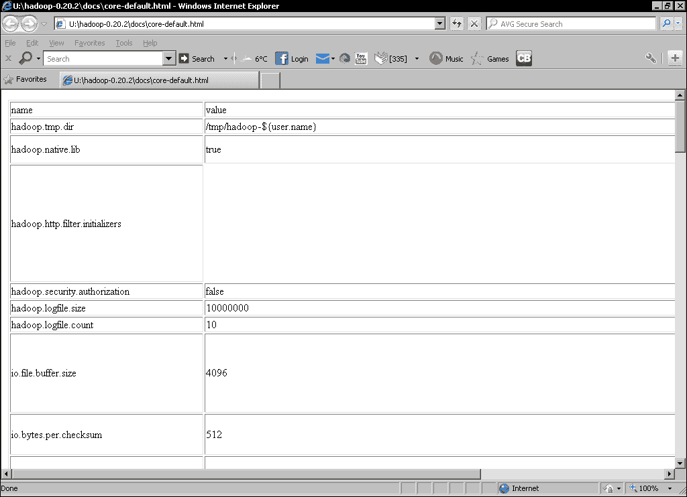

# 七、保持运转

*拥有 Hadoop 集群并不完全是编写有趣的程序来进行智能数据分析。 您还需要维护集群，使其保持调优，并准备好执行您想要的数据处理。*

在本章中，我们将介绍：

*   有关 Hadoop 配置属性的详细信息
*   如何为您的群集选择硬件
*   Hadoop 安全性的工作原理
*   管理 NameNode
*   管理 HDFS
*   管理 MapReduce
*   扩展群集

虽然这些主题侧重于操作，但它们确实给了我们一个机会来探索 Hadoop 的一些我们以前没有研究过的方面。 因此，即使您不亲自管理集群，这里也应该有对您有用的信息。

# 关于电子病历的说明

使用云服务(如 Amazon Web Services 提供的云服务)的主要好处之一是，大部分维护开销由服务提供商承担。 Elastic MapReduce 可以创建绑定到单个任务(非持久作业流)执行的 Hadoop 集群，或者允许长期运行的集群可用于多个作业(持久作业流)。 当使用非持久作业流时，底层 Hadoop 集群如何配置和运行的实际机制在很大程度上对用户是不可见的。 因此，使用非持久工作流的用户将不需要考虑本章中的许多主题。 如果您在持续的工作流程中使用电子病历，许多主题(但不是所有主题)都会变得相关。

在本章中，我们将概括介绍本地 Hadoop 群集。 如果需要重新配置持久作业流，请使用相同的 Hadoop 属性，但请按照[第 3 章](03.html "Chapter 3. Understanding MapReduce")，*编写 MapReduce 作业*中所述进行设置。

# Hadoop 配置属性

在我们看运行集群之前，让我们先来讨论一下 Hadoop 的配置属性。 在此过程中，我们一直在介绍其中的许多内容，还有几个额外的要点值得考虑。

## 默认值

对于Hadoop 新用户来说，最令人费解的事情之一是大量的配置属性。 它们来自哪里，它们的含义是什么，它们的默认值是什么？

如果您拥有完整的 Hadoop 发行版-即，不仅仅是二进制发行版-以下 XML 文件将回答您的问题：

*   `Hadoop/src/core/core-default.xml`
*   `Hadoop/src/hdfs/hdfs-default.xml`
*   `Hadoop/src/mapred/mapred-default.xml`

# 操作浏览默认属性的时间

幸运的是，XML 文档不是查看默认值的唯一方式；还有更具可读性的 HTML 版本，我们现在将快速了解一下。

这些文件不包括在 Hadoop 仅限二进制版本中；如果您正在使用该版本，还可以在 Hadoop 网站上找到这些文件。

1.  Point your browser at the `docs/core-default.html` file within your Hadoop distribution directory and browse its contents. It should look like the next screenshot:

    

2.  现在，类似地，浏览以下其他文件：
    *   `Hadoop/docs/hdfs-default.html`
    *   `Hadoop/docs/mapred-default.html`

## *刚刚发生了什么？*

如您所见，每个属性都有名称、默认值和简短描述。 您还会看到确实有非常多的属性。 现在不要期望了解所有这些内容，但一定要花点时间浏览一下，以了解 Hadoop 允许的定制类型。

## 其他属性元素

当我们之前在配置文件中设置了属性时，我们使用了以下形式的 XML 元素：

```scala
<property>
<name>the.property.name</name>
<value>The property value</value>
</property>
```

我们还可以添加另外两个可选的 XML 元素：`description`和`final`。 现在，使用这些附加元素的完整描述属性如下所示：

```scala
<property>
<name>the.property.name</name>
<value>The default property value</value>
<description>A textual description of the property</description>
<final>Boolean</final>
</property>
```

Description 元素是不言而喻的，它提供了我们在前面的 HTML 文件中看到的每个属性的描述性文本的位置。

`final`属性的含义与 Java 中的类似：标记为`final`的任何属性不能被任何其他文件中的值或其他方式覆盖；我们很快就会看到这一点。 对于出于性能、完整性、安全性或其他原因而希望强制实施群集范围值的属性，请使用此选项。

## 默认存储位置

您将看到修改 Hadoop 在本地磁盘和 HDFS 上存储数据的位置的属性。 有一个属性用作许多其他`hadoop.tmp.dir`的基础，它是所有 Hadoop 文件的根位置，其缺省值是`/tmp`。

不幸的是，许多 Linux 发行版-包括 Ubuntu-被配置为在每次重新引导时删除该目录的内容。 这意味着如果您不覆盖此属性，您将在下次主机重新启动时丢失所有 HDFS 数据。 因此，在`core-site.xml`中设置如下内容是值得的：

```scala
<property>
<name>hadoop.tmp.dir</name>
<value>/var/lib/hadoop</value>
</property>
```

请记住，要确保启动 Hadoop 的用户可以写入该位置，并且目录所在的磁盘有足够的空间。 正如您稍后将看到的，还有许多其他属性允许更精细地控制特定类型数据的存储位置。

## 设置属性的位置

我们之前已经使用配置文件为 Hadoop 属性指定了新值。 这很好，但如果我们试图为某个属性找到最佳值或正在执行需要特殊处理的作业，则会产生开销。

可以使用`JobConf`类以编程方式设置正在执行的作业的配置属性。 支持两种类型的方法，第一种是专门用于设置特定属性的方法，比如我们已经看到的用于设置作业名称、输入和输出格式等的方法。 还有一些方法可以设置属性，例如作业的 MAP 和 Reduce 任务的首选数量。

此外，还有一组泛型方法，如下所示：

*   `Void set(String key, String value);`
*   `Void setIfUnset(String key, String value);`
*   `Void setBoolean( String key, Boolean value);`
*   `Void setInt(String key, int value);`

这些方法更加灵活，不需要为我们希望修改的每个属性创建特定的方法。 但是，它们也会丢失编译时检查，这意味着您可以使用无效的属性名称或为属性分配错误的类型，并且只能在运行时才能发现。

### 备注

这种以编程方式和在配置文件中设置属性值的能力是能够将属性标记为`final`的重要原因。 对于您不希望任何已提交作业能够覆盖它们的属性，请在主配置文件中将其设置为最终属性。

# 设置群集

在我们看如何保持集群运行之前，让我们先来看看设置集群的一些方面。

## 有多少台主机？

当考虑一个新的 Hadoop 集群时，首要问题之一是从多大容量开始。 我们知道，随着需求的增长，我们可以添加更多节点，但我们也希望以一种轻松增长的方式开始。

这里确实没有明确的答案，因为这在很大程度上取决于要处理的数据集的大小和要执行的作业的复杂性。 唯一近乎绝对的说法是，如果您希望复制因子为*n*，则至少应该有那么多节点。 但请记住，节点会出现故障，如果您的节点数量与默认的复制因子相同，则任何单个故障都会将数据块推入复制不足状态。 在具有数十个或数百个节点的大多数集群中，这不是问题；但对于复制系数为 3 的非常小的集群，最安全的方法是 5 节点集群。

### 计算节点上的可用空间

所需节点数量的一个明显起点是查看要在集群上处理的数据集的大小。 如果您的主机具有 2 TB 的磁盘空间和 10 TB 的数据集，那么很可能会认为 5 个节点是所需的最低数量。

这是不正确的，因为它忽略了复制因素和对临时空间的需求。 回想一下，映射器的输出被写入本地磁盘，以便由还原器检索。 我们需要考虑到这种重要的磁盘使用情况。

一个不错的经验法则是假设复制系数为 3，剩余空间的 25%应计为临时空间。 使用这些假设，我们的 2 TB 节点上的 10 TB 数据集所需的群集计算如下：

*   Divide the total storage space on a node by the replication factor:

    2 TB/3=666 GB

*   Reduce this figure by 25 percent to account for temp space:

    666 GB*0.75=500 GB

*   因此，每个 2 TB 节点大约有 500 GB(0.5 TB)的可用空间
*   Divide the data set size by this figure:

    10 TB/500 GB=20

因此，我们的 10 TB 数据集可能至少需要 20 个节点的群集，是我们天真估计的四倍。

这种需要比预期更多的节点的模式并不少见，在考虑您希望主机达到多高规格时应该记住这一点；请参阅本章后面的*调整硬件*一节。

### 主节点的位置

下一个问题是 NameNode、JobTracker和 Second daryNameNode 将位于何处。 我们已经看到，DataNode可以与 NameNode 运行在同一主机上，TaskTracker 可以与 JobTracker 共存，但对于生产集群来说，这不太可能是一个很好的设置。

正如我们将看到的，NameNode 和 Second daryNameNode 有一些特定的资源需求，任何影响它们性能的东西都可能会降低整个集群操作的速度。

理想的情况是将 NameNode、JobTracker 和 Second daryNameNode 放在它们自己的专用主机上。 但是，对于非常小的群集，这将导致硬件占用空间的显著增加，而不一定会获得全部好处。

如果可能，第一步应该是将 NameNode、JobTracker 和 Second daryNameNode分离到没有运行任何 DataNode 或 TaskTracker 进程的单个专用主机上。 随着群集的不断增长，您可以添加额外的服务器主机，然后将 NameNode 移到自己的主机上，从而保持 JobTracker 和 Second DaryNameNode 位于同一位置。 最后，随着集群进一步发展，迁移到完全分离将是有意义的。

### 备注

正如在[章](06.html "Chapter 6. When Things Break")，*保持事物运行*中所讨论的，Hadoop 2.0 将辅助 NameNode 拆分为备份 NameNode 和检查点 NameNode。 最佳实践仍在发展中，但目标是为 NameNode 和至少一个备份 NameNode 各有一台专用主机似乎是明智的。

### 调整硬件大小

要存储的数据量不是关于节点要使用的硬件规格的唯一考虑因素。 相反，您必须考虑可用的处理能力、内存、存储类型和网络。

关于为 Hadoop 集群选择硬件的文章已经很多了，再说一次，没有一个单一的答案可以适用于所有情况。 最大的变量是将在数据上执行的 MapReduce 任务的类型，特别是它们是否受 CPU、内存、I/O 或其他因素的限制。

### 处理器/内存/存储比

考虑这一点的一个好方法是从 CPU/内存/存储比的角度来看待潜在的硬件。 因此，例如，具有 8 GB 内存和 2 TB 存储的四核主机可以被视为每 1 TB 存储具有两个核心和 4 GB 内存。

然后看看您将要运行的 MapReduce 作业的类型，这个比率看起来合适吗？ 换句话说，您的工作负载是否按比例需要更多的这些资源，或者更平衡的配置就足够了吗？

当然，这是通过建立原型和收集度量来评估的最佳方法，但这并不总是可能的。 如果不是，考虑一下这项工作的哪个部分是最昂贵的。 例如，我们看到的一些作业是 I/O 绑定的，从磁盘读取数据，执行简单的转换，然后将结果写回磁盘。 如果这是我们工作负载的典型情况，我们可能会使用具有更多存储的硬件-特别是当它由多个磁盘提供以增加 I/O 时-而使用更少的 CPU 和内存。

相反，执行非常繁重的数字处理的作业将需要更多的 CPU，而那些创建或使用大型数据结构的作业将从内存中受益。

从限制因素的角度来考虑这一点。 如果您的作业正在运行，它是受 CPU 限制(处理器满负荷运行；内存和 I/O 为备用)、内存为限制(物理内存已满并交换到磁盘；CPU 和 I/O 为备用)还是 I/O 为限制(CPU 和内存为备用，但数据以最大可能的速度从磁盘读取/写入)？ 你能买到能放松这一限制的硬件吗？

这当然是一个无限的过程，因为一旦你放松了一个界限，另一个界限就会显露出来。 因此，请始终记住，我们的想法是获得一个在您可能的使用场景上下文中有意义的性能配置文件。

如果你真的不知道你工作的绩效特点怎么办？ 理想情况下，试着找出答案，在你拥有的任何硬件上做一些原型测试，并用它来指导你的决定。 但是，如果连这都不可能，您将不得不进行配置并试用。 请记住，Hadoop 支持异构硬件-尽管拥有统一的规范最终会让您的工作更轻松-因此，请将集群构建到尽可能小的大小并评估硬件。 利用这些知识为未来有关额外购买主机或升级现有机群的决策提供信息。

### 电子病历作为原型平台

回想一下，当我们在 Elastic MapReduce 上配置作业时，我们选择了主节点和数据/任务节点的硬件类型。 如果您计划在 EMR 上运行作业，您有一个内置的功能来调整此配置，以找到价格和执行速度的最佳硬件规格组合。

但是，即使您不打算全职使用 EMR，它也可以是一个有价值的原型平台。 如果您正在调整集群大小，但不知道作业的性能特征，请考虑EMR 上的一些原型以获得更好的洞察力。 虽然您最终可能会在您没有计划的 EMR 服务上花钱，但这可能比发现您为集群购买了完全不合适的硬件的成本要低得多。

## 特殊节点要求

并非所有主机都有相同的硬件要求。 具体地说，NameNode 的主机看起来可能与托管 DataNodes 和 TaskTracker 的主机截然不同。

回想一下，NameNode 保存 HDFS 文件系统的内存表示，以及文件、目录、块、节点和各种元数据之间的关系。 这意味着 NameNode 往往受内存限制，可能比任何其他主机需要更大的内存，特别是对于非常大的集群或具有大量文件的主机。 虽然 16 GB 可能是 DataNodes/TaskTracker 的常见内存大小，但 NameNode 主机拥有 64 GB 或更多内存的情况并不少见。 如果 NameNode 耗尽了物理内存并开始使用交换空间，则对群集性能的影响可能会很严重。

然而，虽然 64 GB 的物理内存很大，但对于现代存储来说很小，而且鉴于文件系统映像是 NameNode 存储的唯一数据，我们不需要 DataNode 主机上常见的海量存储。 我们更关心 NameNode 的可靠性，因此很可能在冗余配置中有多个磁盘。 因此，NameNode 主机将受益于多个小型驱动器(用于冗余)，而不是大型驱动器。

因此，总体而言，NameNode 主机看起来可能与集群中的其他主机非常不同；这就是为什么我们早先建议在预算/空间允许的情况下尽快将 NameNode 移动到它自己的主机，因为这样更容易满足其独特的硬件要求。

### 备注

Second daryNameNode(或 Hadoop 2.0 中的 CheckpointNameNode 和 BackupNameNode)与 NameNode 具有相同的硬件要求。 您可以在一个更通用的主机上以辅助容量运行它，但如果由于主要硬件故障而需要切换并将其设置为 NameNode，您可能会遇到麻烦。

## 存储类型

虽然您会发现对前面关于处理器、内存和存储容量(或 I/O)的相对重要性的一些观点有强烈的看法，但这些论点通常是基于应用程序要求以及硬件特征和度量的。 然而，一旦我们开始讨论要使用的存储类型，就很容易陷入火焰战的局面，在那里你会发现非常根深蒂固的观点。

### 商品级存储与企业级存储

第一个论证将是关于使用针对商品/消费者细分市场的硬盘驱动器还是针对企业客户的硬盘驱动器最有意义。 前者(主要是 SATA 磁盘)更大、更便宜、速度更慢，**平均无故障时间**(**MTBF**)的报价较低。 企业磁盘将使用 SAS 或光纤通道等技术，总体上将更小、更昂贵、更快，并且具有更高的报价 MTBF 数字。

### 单磁盘与 RAID

下一个问题将是关于磁盘是如何配置的。 企业级的方法是使用**廉价磁盘冗余阵列**(**RAID**)将多个磁盘分组到单个逻辑存储设备中，该设备可以安静地承受一个或多个磁盘故障。 这随之而来的是总体容量损失的代价以及对实现的读/写速率的影响。

另一种方法是独立处理每个磁盘，以最大限度地提高总存储和聚合 I/O，代价是单个磁盘故障导致主机宕机。

### 寻找平衡点

Hadoop 架构在很多方面都是，其前提是硬件将出现故障。 从这个角度来看，可以争辩说没有必要使用任何传统的以企业为重点的存储功能。 取而代之的是，使用许多大而便宜的磁盘来最大化总存储，并并行地从它们读取和写入，以同样地提高 I/O 吞吐量。 单个磁盘故障可能会导致主机出现故障，但正如我们所看到的，群集将解决此故障。

这是一个完全有效的论点，在许多情况下完全有道理。 然而，这一论点忽略了让主机重新投入服务的成本。 如果您的群集位于隔壁房间，并且您有一架备用磁盘，则主机恢复可能会是一项快速、无痛苦且成本低廉的任务。 但是，如果您的集群是由商业配置机构托管的，则任何实际操作的维护成本都可能要高得多。 如果您使用的是完全托管的服务器，而您必须向提供商支付维护任务的费用，情况就更是如此。 在这种情况下，使用 RAID 带来的额外成本以及减少的容量和 I/O 可能是有意义的。

### Колибри网络存储

有一件事几乎永远不会有意义，那就是将网络存储用于您的主群集存储。 无论是通过**存储区域网络**(**SAN**)进行块存储，还是通过**网络文件系统**(**NFS**)或类似协议进行基于文件的存储，这些方法通过引入不必要的瓶颈和额外的共享设备来约束 Hadoop，从而对故障产生重大影响。

然而，有时您可能会因为非技术原因而被迫使用这样的东西。 这并不是说它不起作用，只是它改变了 Hadoop 在速度和容错性方面的执行方式，所以请确保您了解如果发生这种情况的后果。

## Hadoop 网络配置

Hadoop 对网络设备的支持不如对存储的支持复杂，因此与 CPU、内存和存储设置相比，您需要选择的硬件更少。 归根结底，Hadoop 目前只能支持一个网络设备，例如，不能使用主机上的所有 4 Gb 以太网连接来实现 4 Gb 的总吞吐量。 如果您需要的网络吞吐量大于单个千兆位端口所提供的吞吐量，则除非您的硬件或操作系统可以将多个端口作为单个设备提供给 Hadoop，否则唯一的选择就是使用 10 千兆位以太网设备。

### 块的放置方式

我们已经讨论了很多关于使用复制实现冗余的 HDFS，但是还没有探索 Hadoop 如何选择将数据块的副本放置在哪里。

在大多数传统服务器群中，各种主机(以及网络和其他设备)安装在垂直堆叠设备的标准大小机架中。 每个机架通常都有一个为其供电的公共配电装置，并且通常有一个网络交换机作为更广泛的网络与机架中所有主机之间的接口。

在此设置下，我们可以确定三种主要的故障类型：

*   影响单个主机的故障(例如，CPU/内存/磁盘/主板故障)
*   影响单个机架的故障(例如，电源装置或交换机故障)
*   影响整个群集的因素(例如，更大的电源/网络故障、冷却/环境中断)

### 备注

请记住，Hadoop 目前不支持分布在多个数据中心的集群，因此第三种类型故障的实例很可能会导致集群崩溃。

默认情况下，Hadoop 会将每个节点视为位于同一物理机架中。 这意味着任何一对主机之间的带宽和延迟大致相等，并且每个节点与任何其他节点遭受相关故障的可能性相同。

### 机架感知

但是，如果您确实具有多机架设置，或者其他配置使前面的假设无效，则可以为每个节点添加向 Hadoop 报告其机架 ID 的功能，Hadoop 随后会在放置副本时考虑这一点。

在这样的设置中，Hadoop 尝试将节点的第一个副本放在给定主机上，第二个副本放在同一机架中的另一个主机上，第三个副本放在不同机架中的主机上。

此策略在性能和可用性之间提供了良好的平衡。 当机架包含自己的网络交换机时，机架内主机之间的通信延迟通常低于与外部主机之间的通信延迟。 此策略在一个机架内放置两个副本，以确保这些副本的最大写入速度，但在机架外保留一个副本，以便在机架故障时提供冗余。

#### 机架感知脚本

如果设置了`topology.script.file.name`属性并指向文件系统上的可执行脚本，NameNode 将使用它来确定每个主机的机架。

请注意，需要设置该属性，并且脚本只需要存在于 NameNode 主机上。

NameNode 将向脚本传递它发现的每个节点的 IP 地址，因此脚本负责从节点 IP 地址到机架名称的映射。

如果未指定脚本，则每个节点将被报告为单个默认机架的成员。

# 行动时间-检查默认机架配置

让我们来看看如何在我们的集群中设置默认机架配置。

1.  执行以下命令：

    ```scala
    $ Hadoop fsck -rack

    ```

2.  结果应包括类似以下内容的输出：

    ```scala
    Default replication factor:    3
    Average block replication:     3.3045976
    Corrupt blocks:                0
    Missing replicas:              18 (0.5217391 %)
    Number of data-nodes:          4
    Number of racks:               1
    The filesystem under path '/' is HEALTHY

    ```

## *刚刚发生了什么？*

这里对使用的工具及其输出都很感兴趣。 该工具是**Hadoop fsck**，可用于检查和修复文件系统问题。 可以看到，这包括一些与我们的老朋友`hadoop dfsadmin`没有什么不同的信息，尽管该工具更关注每个节点的详细状态，而`hadoop fsck`报告整个文件系统的内部结构。

它报告的内容之一是集群中的机架总数，如前面的输出所示，其值为`1`，与预期不谋而合。

### 备注

此命令是在最近用于某些 HDFS 弹性测试的群集上执行的。 这解释了平均数据块复制和复制不足数据块的数字。

如果某个数据块因主机临时故障而导致复制副本数量超过所需数量，则恢复服务的主机会将该数据块置于最小复制系数之上。 除了确保数据块已添加副本以满足复制因素外，Hadoop 还将删除多余的副本以将数据块返回到复制因素。

# 该行动了-添加机架感知脚本

我们可以通过创建派生每个主机的机架位置的脚本来增强默认的扁平机架配置。

1.  在 NameNode 主机上的 Hadoop 用户主目录中创建名为`rack-script.sh`的脚本，其中包含以下文本。 请记住将 IP 地址更改为其中一个 HDFS 节点。

    ```scala
    #!/bin/bash

    if [ $1 = "10.0.0.101" ]; then
        echo -n "/rack1 "
    else
        echo -n "/default-rack "
    fi
    ```

2.  使此脚本可执行。

    ```scala
    $ chmod +x rack-script.sh

    ```

3.  将以下属性添加到 NameNode 主机上的`core-site.xml`：

    ```scala
    <property>
    <name>topology.script.file.name</name>
    <value>/home/Hadoop/rack-script.sh</value>
    </property>
    ```

4.  重新启动 HDFS。

    ```scala
    $ start-dfs.sh

    ```

5.  Check the filesystem via `fsck`.

    ```scala
    $ Hadoop fsck –rack

    ```

    上述命令的输出如下图所示：

    

## *刚刚发生了什么？*

我们首先创建了一个简单的脚本，该脚本为命名节点返回一个值，为所有其他节点返回一个默认值。 我们将其放在 NameNode 主机上，并将所需的配置属性添加到 NameNode`core-site.xml`文件。

启动 HDFS 后，我们使用`hadoop fsck`报告文件系统，看到现在有了一个双机架群集。 有了这些知识，Hadoop 现在将采用更复杂的块放置策略，如前所述。

### 提示

**使用外部主机文件**

一种常见的方法是在 Unix 上保留一个类似于`/etc/hosts`文件的单独数据文件，并使用该文件指定 IP/机架映射，每行一个。 然后，该文件可以独立更新，并由机架识别脚本读取。

## 什么是商用硬件？

让我们回顾一下问题，即集群使用的主机的一般特征，以及它们看起来是更像一个商用白盒服务器，还是更像是为高端企业环境而构建的东西。

问题的一部分是“商品”是一个模棱两可的术语。 对于一家企业来说，看起来便宜而令人愉悦的东西，对另一家企业来说，可能看起来是奢侈的高端。 我们建议在选择硬件时考虑以下几点，然后对您的决定保持满意：

*   对于您的硬件，您是否为复制 Hadoop 的某些容错功能的可靠性功能支付了额外费用？
*   您为解决已确认的需求或风险而支付的高端硬件功能在您的环境中是否切合实际？
*   您是否已验证高端硬件的成本高于价格较低/可靠性较低的硬件？

## 弹出式测验-设置群集

问题 1.。 在为您的新 Hadoop 群集选择硬件时，以下哪项最重要？

1.  CPU 核心的数量及其速度。
2.  物理内存量。
3.  存储量。
4.  存储的速度。
5.  这取决于最有可能的工作负载。

Q2.。 为什么您可能不想在群集中使用网络存储？

1.  因为它可能会引入新的单点故障。
2.  因为考虑到 Hadoop 的容错能力，它很可能具有冗余和容错的方法，这可能是不必要的。
3.  因为这样的单个设备的性能可能低于 Hadoop 同时使用多个本地磁盘的性能。
4.  以上都是。

第三季度。 您将在群集上处理 10 TB 的数据。 您的主要 MapReduce 作业处理金融交易，使用它们生成行为和未来预测的统计模型。 以下哪种硬件选择会是您群集的首选？

1.  20 台主机，每台配备快速双核处理器、4 GB 内存和一个 500 GB 磁盘驱动器。
2.  30 台主机，每台配备快速双核处理器、8 GB 内存和两个 500 GB 磁盘驱动器。
3.  30 台主机，每台配备快速四核处理器、8 GB 内存和一个 1 TB 磁盘驱动器。
4.  40 台主机，每台配备 16 GB 内存、快速四核处理器和四个 1 TB 磁盘驱动器。

# 集群访问控制

一旦启动并运行了这个闪亮的新集群，您就需要考虑访问和安全问题。 谁可以访问群集上的数据-是否有您真的不想让整个用户群看到的敏感数据？

## Hadoop 安全模型

直到最近，Hadoop 还拥有一个充其量可以被描述为“仅标记”的安全模型。 它将所有者和组与每个文件相关联，但是，正如我们将看到的，它几乎没有对给定的客户端连接进行验证。 强大的安全性不仅可以管理指定给文件的标记，还可以管理所有连接用户的身份。

# 行动时间-演示默认安全性

当我们以前显示了文件列表时，我们已经看到了它们的用户名和组名。 然而，我们还没有真正探索这意味着什么。 我们就这么做吧。

1.  在 Hadoop 用户的主目录中创建一个测试文本文件。

    ```scala
    $ echo "I can read this!" >  security-test.txt 
    $ hadoop fs -put security-test.txt  security-test.txt 

    ```

2.  Change the permissions on the file to be accessible only by the owner.

    ```scala
    $ hadoop fs -chmod 700 security-test.txt 
    $ hadoop fs -ls

    ```

    上述命令的输出如下图所示：

    

3.  Confirm you can still read the file.

    ```scala
    $ hadoop fs -cat security-test.txt 

    ```

    您将在屏幕上看到以下行：

    ```scala
    I can read this!

    ```

4.  Connect to another node in the cluster and try to read the file from there.

    ```scala
    $ ssh node2
    $ hadoop fs -cat security-test.txt 

    ```

    您将在屏幕上看到以下行：

    ```scala
    I can read this!

    ```

5.  从另一个节点注销。

    ```scala
    $ exit

    ```

6.  Create a home directory for another user and give them ownership.

    ```scala
    $ hadoop m[Kfs -mkdir /user/garry
    $ hadoop fs -chown garry /user/garry
    $ hadoop fs -ls /user

    ```

    上述命令的输出如下图所示：

    

7.  切换到该用户。

    ```scala
    $ su garry

    ```

8.  尝试读取 Hadoop 用户主目录中的测试文件。

    ```scala
    $ hadoop/bin/hadoop fs -cat /user/hadoop/security-test.txt
    cat: org.apache.hadoop.security.AccessControlException: Permission denied: user=garry, access=READ, inode="security-test.txt":hadoop:supergroup:rw-------

    ```

9.  Place a copy of the file in this user's home directory and again make it accessible only by the owner.

    ```scala
    $ Hadoop/bin/Hadoop fs -put security-test.txt security-test.txt
    $ Hadoop/bin/Hadoop fs -chmod 700 security-test.txt
    $ hadoop/bin/hadoop fs -ls 

    ```

    上述命令的输出如以下截图所示：

    

10.  Confirm this user can access the file.

    ```scala
    $ hadoop/bin/hadoop fs -cat security-test.txt 

    ```

    您将在屏幕上看到以下行：

    ```scala
    I can read this!

    ```

11.  返回到 Hadoop 用户。

    ```scala
    $ exit

    ```

12.  Try and read the file in the other user's home directory.

    ```scala
    $ hadoop fs -cat /user/garry/security-test.txt

    ```

    您将在屏幕上看到以下行：

    ```scala
    I can read this!

    ```

## *刚刚发生了什么？*

我们首先使用 Hadoop 用户在 HDFS 上的主目录中创建一个测试文件。 我们对`hadoop fs`使用了`-chmod`选项，这是我们以前从未见过的。 这与标准 Unix**chmod**工具非常相似，后者为文件所有者、组成员和所有用户提供不同级别的读/写/执行访问权限。

然后，我们转到另一台主机，再次以 hadoop 用户的身份尝试访问该文件。 不足为奇的是，这种做法奏效了。 但是为什么呢？ Hadoop 对允许其访问该文件的 Hadoop 用户了解多少？

为了探索这一点，我们随后在 HDFS 上创建了另一个主目录(您可以使用您有权访问的主机上的任何其他帐户)，并通过使用`hadoop fs`的`-chown`选项授予它所有权。 这看起来应该再次类似于标准 Unix`-chown`。 然后，我们切换到该用户并尝试读取存储在 Hadoop 用户主目录中的文件。 此操作失败，出现前面显示的安全异常，这也是我们所预期的。 我们再次将一个测试文件复制到该用户的主目录中，并使其仅供所有者访问。

但是，我们随后切换回 Hadoop 用户，并尝试访问另一个帐户主目录中的文件，从而搅乱了局面，令人惊讶的是，这一切都奏效了。

### 用户标识

谜题第一部分的答案是 Hadoop使用执行 HDFS 命令的用户的 Unix ID 作为 HDFS 上的用户标识。 因此，名为`alice`的用户执行的任何命令都将使用名为`alice`的所有者创建文件，并且只能读取或写入该用户具有正确访问权限的文件。

有安全意识的人会意识到，要访问 Hadoop 群集，只需在任何可以连接到该群集的主机上创建一个与现有 HDFS 用户同名的用户即可。 因此，例如，在前面的示例中，在可以访问 NameNode 的任何主机上创建的名为`hadoop`的任何用户都可以读取用户`hadoop`可以访问的所有文件，这实际上比看起来更糟糕。

#### 超级用户

在上一步中，Hadoop 用户访问了另一个用户的文件。 Hadoop 将启动集群的用户 ID 视为超级用户，并为其提供各种权限，例如读取、写入和修改 HDFS 上的任何文件的能力。 有安全意识的人会意识到在 Hadoop 管理员控制之外的主机上随机创建名为`hadoop`的用户的风险更大。

### 更精细的访问控制

上述情况导致 Hadoop 从一开始就存在安全问题。 然而，社区并没有停滞不前，经过大量工作，Hadoop 的最新版本支持更精细、更强大的安全模型。

为了避免依赖简单的用户 ID，开发人员需要从某个地方了解用户身份，因此选择了与之集成的 Kerberos 系统。 这确实需要建立和维护本书讨论范围之外的服务，但是如果这种安全性对您很重要，请参考 Hadoop 文档。 请注意，此支持确实允许与第三方身份系统(如 Microsoft Active Directory)集成，因此功能相当强大。

## 通过物理访问控制绕过安全模型

如果 Kerberos 的负担太重，或者安全性是可有可无的，而不是绝对的，那么有一些方法可以降低风险。 我最喜欢的一种方式是将整个集群置于具有严格访问控制的防火墙之后。 特别是，只允许从将被视为簇头节点且所有用户都连接到的单个主机访问 NameNode 和 JobTracker 服务。

### 提示

**从非群集主机访问 Hadoop**

Hadoop 无需在主机上运行，即可使用命令行工具访问 HDFS 并运行 MapReduce 作业。 只要主机上安装了 Hadoop，并且其配置文件具有正确的 NameNode 和 JobTracker 位置，就可以在调用`Hadoop fs`和`Hadoop jar`等命令时找到它们。

此模型之所以有效，是因为只有一台主机用于与 Hadoop 交互；而且由于该主机由集群管理员控制，普通用户应该无法创建或访问其他用户帐户。

请记住，此方法不会提供安全性。 它在一个软件系统周围设置了一个硬外壳，以减少 Hadoop 安全模型被颠覆的方式。

# 管理 NameNode

让我们再做一些风险降低。 在[第 6 章](06.html "Chapter 6. When Things Break")，*当事情中断时*，当我谈到运行 NameNode 的主机故障的潜在后果时，我可能吓到您了。 如果那一节没有吓到你，那就回去重读一遍--它应该吓到你的。 总结是，丢失 NameNode 可能会丢失集群上的每一条条数据。 这是因为 NameNode 写入一个名为`fsimage`的文件，该文件包含文件系统的所有元数据，并记录哪些块组成哪些文件。 如果 NameNode 主机丢失导致`fsimage`无法恢复，则所有 HDFS 数据也同样丢失。

## 为 fsimage 类配置多个位置

NameNode可以配置为同时将`fsimage`写入多个位置。 这纯粹是一种冗余机制，相同的数据写入每个位置，并且不会尝试使用多个存储设备来提高性能。 相反，政策是`fsimage`的多个副本将更难丢失。

# 该行动了-添加额外的图像位置

现在，让我们将 NameNode 配置为同时写入`fsimage`的多个副本，以提供所需的数据弹性。 为此，我们需要一个 NFS 导出的目录。

1.  确保群集已停止。

    ```scala
    $ stopall.sh

    ```

2.  将以下属性添加到`Hadoop/conf/core-site.xml`，将第二个路径修改为指向可以写入 NameNode 数据的附加副本的 NFS 挂载位置。

    ```scala
    <property>
    <name>dfs.name.dir</name>
    <value>${hadoop.tmp.dir}/dfs/name,/share/backup/namenode</value>
    </property>
    ```

3.  删除新添加目录的所有现有内容。

    ```scala
    $ rm -f /share/backup/namenode

    ```

4.  启动群集。

    ```scala
    $ start-all.sh

    ```

5.  通过对前面指定的两个文件运行`md5sum`命令(根据您配置的位置更改以下代码)，验证`fsimage`是否写入了这两个指定位置：

    ```scala
    $ md5sum /var/hadoop/dfs/name/image/fsimage
    a25432981b0ecd6b70da647e9b94304a  /var/hadoop/dfs/name/image/fsimage
    $ md5sum /share/backup/namenode/image/fsimage
    a25432981b0ecd6b70da647e9b94304a  /share/backup/namenode/image/fsimage

    ```

## *刚刚发生了什么？*

首先，我们确保集群已停止；尽管正在运行的集群不会重新读取对核心配置文件的更改，但这是一个好习惯，以防 Hadoop 中添加了该功能。

然后，我们向集群配置添加了一个新属性，为`data.name.dir`属性指定值。 此属性获取逗号分隔值的列表，并将`fsimage`写入每个位置。 注意前面讨论的`hadoop.tmp.dir`属性是如何被取消引用的，这在使用 Unix 变量时可以看到。 此语法允许我们将属性值基于其他属性，并在更新父属性时继承更改。

### 提示

**不要忘记所有必需的位置**

此属性的默认值为`${Hadoop.tmp.dir}/dfs/name`。 添加附加值时，请记住也要显式添加缺省值，如前所示。 否则，该属性将仅使用单个新值。

在启动群集之前，我们确保新目录存在并且为空。 如果目录不存在，NameNode 将无法按预期启动。 但是，如果该目录以前用于存储 NameNode 数据，Hadoop 也将无法启动，因为它将识别两个目录包含不同的 NameNode 数据，并且不知道哪个目录是正确的。

这里要小心！ 特别是当您尝试各种 NameNode 数据位置或在节点之间来回交换时；您真的不希望意外删除错误目录中的内容。

在启动 HDFS 集群之后，我们等待片刻，然后使用 MD5 加密校验和来验证两个位置是否包含相同的`fsimage`。

### 传真复印件的写入位置

建议至少将`fsimage`写入两个位置，其中一个应该是远程(如 NFS)文件系统，如上例所示。 `fsimage`仅定期更新，因此文件系统不需要高性能。

在前面关于硬件选择的讨论中，我们提到了 NameNode 主机的其他注意事项。 由于`fsimage`的重要性，确保将其写入多个磁盘并可能投资于可靠性更高的磁盘，甚至将`fsimage`写入 RAID 阵列可能是有用的。 如果主机出现故障，使用写入远程文件系统的副本将是最简单的选择；但万一也遇到问题，最好选择从故障主机中取出另一个磁盘，然后在另一个主机上使用它来恢复数据。

## 交换到另一台 NameNode 主机

我们已确保将`fsimage`写入多个位置，这是管理到不同 NameNode 主机的交换的一个最重要的前提条件。 现在我们需要真正做到这一点。

这是您确实不应该在生产集群上执行的操作。 在第一次尝试的时候绝对不是，但即使在那之后，这也不是一个没有风险的过程。 但一定要在其他集群上练习，了解一下当灾难来袭时你会做些什么。

### 在灾难来临前做好准备

当您需要恢复生产群集时，您不会希望第一次探索此主题。 有几件事要提前做，这样灾难恢复就不那么痛苦了，更不用说可能了：

*   确保 NameNode 将`fsimage`写入多个位置，如前所述。
*   确定哪个主机将成为新的 NameNode 位置。 如果这是当前用于 DataNode 和 TaskTracker 的主机，请确保它具有托管 NameNode 所需的正确硬件，并且由于失去这些工作进程而导致的群集性能降低不会太大。
*   复制`core-site.xml`和`hdfs-site.xml`文件，将它们(理想情况下)放在 NFS 位置，然后更新它们以指向新主机。 每次修改当前配置文件时，请记住对这些副本进行相同的更改。
*   将`slaves`文件从 NameNode 复制到新主机或 NFS 共享。 另外，一定要让它保持最新。
*   了解您将如何处理新主机中的后续故障。 您可能会以多快的速度修复或更换原来出现故障的主机？ 在此期间，哪个主机将是 NameNode(和辅助 NameNode)的位置？

准备好的?。 那，我们做吧!

# 是时候交换到新的 NameNode 主机了

在下面的步骤中，我们将新配置文件保留在挂载到`/share/backup`的 NFS 共享上，并更改路径以匹配您拥有新文件的位置。 对 grep 也使用不同的字符串；我们使用我们知道的未与集群中的任何其他主机共享的 IP 地址的一部分。

1.  登录到当前 NameNode 主机并关闭群集。

    ```scala
    $ stop-all.sh

    ```

2.  停止运行 NameNode 的主机。

    ```scala
    $ sudo poweroff

    ```

3.  登录到新的 NameNode 主机并确认新的配置文件具有正确的 NameNode 位置。

    ```scala
    $ grep 110 /share/backup/*.xml

    ```

4.  在新主机上，首先复制`slaves`文件。

    ```scala
    $ cp /share/backup/slaves Hadoop/conf

    ```

5.  现在复制更新后的配置文件。

    ```scala
    $ cp /share/backup/*site.xml Hadoop/conf

    ```

6.  从本地文件系统中删除所有旧的 NameNode 数据。

    ```scala
    $ rm -f /var/Hadoop/dfs/name/*

    ```

7.  将更新的配置文件复制到群集中的每个节点。

    ```scala
    $ slaves.sh cp /share/backup/*site.xml Hadoop/conf

    ```

8.  确保每个节点现在都有指向新 NameNode 的配置文件。

    ```scala
    $ slaves.sh grep 110 hadoop/conf/*site.xml

    ```

9.  启动群集。

    ```scala
    $ start-all.sh

    ```

10.  从命令行检查 HDFS 是否运行正常。

    ```scala
    $ Hadoop fs ls /

    ```

11.  验证是否可以从 Web 用户界面访问 HDFS。

## *刚刚发生了什么？*

首先，我们关闭集群。 这有点不具代表性，因为大多数故障都会看到 NameNode 以一种不太友好的方式死去，但我们不想在本章后面讨论文件系统损坏的问题。

然后，我们关闭旧的 NameNode 主机。 虽然不是绝对必要的，但这是一种很好的方法，可以确保没有人访问旧主机，并且会让您对迁移进行得有多好有不正确的看法。

在跨文件复制之前，我们快速查看一下`core-site.xml`和`hdfs-site.xml`，以确保为`core-site.xml`中的`fs.default.dir`属性指定了正确的值。

然后，我们准备新主机，首先复制`slaves`配置文件和集群配置文件，然后从本地目录中删除所有旧的 NameNode 数据。 有关在此步骤中非常小心的信息，请参阅前面的步骤。

接下来，我们使用`slaves.sh`脚本让集群中的每台主机复制新的配置文件。 我们知道我们的新 NameNode 主机是唯一一个 IP 地址为 110 的主机，因此我们在文件中对其进行 grep，以确保所有主机都是最新的(显然，您的系统需要使用不同的模式)。

在这个阶段，一切都应该很好；我们启动集群，并通过命令行工具和 UI 进行访问，以确认它正在按预期运行。

### 先别急着庆祝！

请记住，即使成功迁移到新的 NameNode，也还没有完全完成。 您事先决定了如何处理 Second DaryNameNode，以及如果新迁移的主机发生故障，哪个主机将成为新的指定 NameNode 主机。 要为此做好准备，你需要再次检查前面提到的“做好准备”清单，并采取适当的行动。

### 备注

不要忘记考虑相关故障的可能性。 调查 NameNode 主机故障的原因，以防这是更大问题的开始。

### MapReduce 怎么样？

我们没有提到移动 JobTracker，因为这是一个痛苦得多的过程，如[第 6 章](06.html "Chapter 6. When Things Break")*中所示*。 如果您的 NameNode 和 JobTracker 在同一台主机上运行，则需要修改前面的方法，同时保留`mapred-site.xml`的新副本，该副本在`mapred.job.tracker`属性中包含新主机的位置。

## 来个围棋英雄-换到新的 NameNode 主机

执行 NameNode 和 JobTracker 从一台主机到另一台主机的迁移。

# 管理 HDFS

正如我们在[第 6 章](06.html "Chapter 6. When Things Break")，*中看到的在节点中断时*，Hadoop 会自动管理许多在更传统的文件系统上耗费大量精力的可用性问题。 然而，有些事情我们仍然需要意识到。

## 数据写入位置

正如NameNode 可以有多个存储通过`dfs.name.dir`属性指定的`fsimage`的位置一样，我们前面已经研究过，有一个类似的属性，称为`dfs.data.dir`，它允许 HDFS 使用主机上的多个数据位置，我们现在来看一下。

这是一种有用的机制，其工作方式与 NameNode 属性非常不同。 如果在`dfs.data.dir`中指定了多个目录，Hadoop 会将这些目录视为一系列可以并行使用的独立位置。 如果您在文件系统上的不同位置安装了多个物理磁盘或其他存储设备，这将非常有用。 Hadoop 将智能地使用这些多个设备，不仅最大化总存储容量，而且通过跨位置平衡读写来获得最大吞吐量。 正如在*存储类型*部分中提到的，这是一种以单个磁盘故障导致整个主机故障为代价来最大化这些因素的方法。

## 使用平衡器

Hadoop 努力工作，以最大化性能和冗余的方式将数据块放在 HDFS 上。 但是，在某些情况下，群集可能会变得不平衡，各个节点上保存的数据之间会有很大差异。 导致这种情况的典型情况是将新节点添加到群集中。 默认情况下，Hadoop 会将新节点视为与所有其他节点一起放置块的候选节点，这意味着它将在相当长的一段时间内保持较低的利用率。 已经停止服务或以其他方式遭受问题的节点也可能比它们的对等节点收集的块数量更少。

Hadoop 包含一个称为平衡器的工具，分别由`start-balancer.sh`和`stop-balancer.sh`脚本启动和停止来处理这种情况。

### 何时重新平衡

Hadoop没有任何自动警报，可以提醒您文件系统不平衡。 相反，您需要密切关注`hadoop fsck`和`hadoop fsadmin`报告的数据，并关注节点之间的不平衡。

实际上，这并不是您通常需要担心的问题，因为 Hadoop 非常擅长管理块放置，并且在添加新硬件或恢复故障节点服务时，您可能只需要考虑运行平衡器来消除严重的不平衡。 但是，为了保持最大的集群健康，让平衡器按计划(例如，每晚)运行以将块平衡保持在指定阈值内的情况并不少见。

# MapReduce 管理

正如我们在前面的章中所看到的，MapReduce 框架通常比 HDFS 更能容忍问题和故障。 JobTracker 和 TaskTracker 没有要管理的持久数据，因此，MapReduce 的管理更多的是处理正在运行的作业和任务，而不是服务于框架本身。

## 命令行作业管理

`hadoop job`命令行工具是此作业管理的主要界面。 像往常一样，键入以下内容以获取使用摘要：

```scala
$ hadoop job --help

```

该命令的选项通常不言自明；除了检索作业历史记录的某些元素外，它还允许您启动、停止、列出和修改正在运行的作业。 在下一节中，我们将一起探讨其中几个子命令的用法，而不是分别研究每个子命令。

## 拥有 Go 英雄-命令行工作管理

MapReduce UI 还提供对这些功能子集的访问。 浏览用户界面，了解您可以在 Web 界面上执行哪些操作，以及不可以执行哪些操作。

## 作业优先级和调度

到目前为止，我们通常对集群运行单个作业并等待其完成。 这隐藏了一个事实，即默认情况下，Hadoop 将后续作业提交放入**先进先出**(**FIFO**)队列。 当一个作业完成时，Hadoop 只是开始执行队列中的下一个作业。 除非我们使用我们将在后面部分讨论的替代调度器之一，否则 FIFO 调度器会将整个集群专用于当前正在运行的唯一作业。

对于作业提交模式很少看到作业在队列中等待的小集群来说，这完全没有问题。 但是，如果作业经常在队列中等待，则可能会出现问题。 特别是，FIFO 模型没有考虑作业优先级或所需的资源。 长时间运行但低优先级的作业将在稍后提交的较快的高优先级作业之前执行。

为了解决这种情况，Hadoop 定义了五个作业优先级级别：`VERY_HIGH`、`HIGH`、`NORMAL`、`LOW`和`VERY_LOW`。 作业的默认优先级为`NORMAL`，但可以使用`hadoop job -set-priority`命令进行更改。

# 是时候采取行动了-更改作业优先级并终止作业

让我们通过动态更改作业优先级并观察终止作业的结果来探索作业优先级。

1.  在群集上启动运行时间相对较长的作业。

    ```scala
    $ hadoop jar hadoop-examples-1.0.4.jar pi 100 1000

    ```

2.  打开另一个窗口并提交第二个作业。

    ```scala
    $ hadoop jar hadoop-examples-1.0.4.jar wordcount test.txt out1

    ```

3.  打开另一个窗口并提交第三个窗口。

    ```scala
    $ hadoop jar hadoop-examples-1.0.4.jar wordcount test.txt out2

    ```

4.  List the running jobs.

    ```scala
    $ Hadoop job -list

    ```

    您将在屏幕上看到以下行：

    ```scala
    3 jobs currently running
    JobId  State  StartTime  UserName  Priority  SchedulingInfo
    job_201201111540_0005  1  1326325810671  hadoop  NORMAL  NA
    job_201201111540_0006  1  1326325938781  hadoop  NORMAL  NA
    job_201201111540_0007  1  1326325961700  hadoop  NORMAL  NA

    ```

5.  Check the status of the running job.

    ```scala
    $ Hadoop job -status job_201201111540_0005

    ```

    您将在屏幕上看到以下行：

    ```scala
    Job: job_201201111540_0005
    file: hdfs://head:9000/var/hadoop/mapred/system/job_201201111540_0005/job.xml
    tracking URL: http://head:50030/jobdetails.jsp?jobid=job_201201111540_000
    map() completion: 1.0
    reduce() completion: 0.32666665
    Counters: 18

    ```

6.  将上次提交的作业的优先级提高到`VERY_HIGH`。

    ```scala
    $ Hadoop job -set-priority job_201201111540_0007 VERY_HIGH

    ```

7.  取消当前正在运行的作业。

    ```scala
    $ Hadoop job -kill job_201201111540_0005

    ```

8.  查看其他作业以查看哪些作业开始处理。

## *刚刚发生了什么？*

我们在集群上启动了一个作业，然后将另外两个作业排队，使用`hadoop job -list`确认排队的作业按预期顺序排列。 `hadoop job -list all`命令将列出已完成的作业和当前作业，`hadoop job -history`将允许我们更详细地检查作业及其任务。 为了确认提交的作业正在运行，除了作业计数器之外，我们还使用`hadoop job -status`获取作业的当前映射和减少任务完成状态。

然后，我们使用`hadoop job -set-priority`提高队列中当前最后一个作业的优先级。

在使用`hadoop job -kill`中止当前运行的作业之后，我们确认了下一个执行的优先级较高的作业，即使队列中剩余的作业是预先提交的。

## 备用调度器

手动修改 FIFO 队列中的作业优先级确实有效，但它需要主动监视和管理作业队列。 如果我们考虑这个问题，我们会遇到这种困难的原因是 Hadoop 将整个集群专用于正在执行的每个作业。

Hadoop 提供了两个额外的作业调度器，它们采用不同的方法，并在多个并发执行的作业之间共享集群。 还有一个插件机制，可以用来添加额外的调度器。 请注意，这种类型的资源共享是概念上简单但实际上非常复杂的问题之一，也是许多学术研究的领域。 我们的目标是在遵守相对优先级概念的同时，不仅在某个时间点，而且在更长的时间内最大限度地分配资源。

### 容量调度器

**Capacity Scheduler**使用向其提交作业的多个作业队列(可以对其应用访问控制)，每个作业队列都分配有一部分集群资源。 例如，您可以让一个队列用于分配 90%的群集的大型长期运行作业，另一个队列用于分配剩余 10%的较小的高优先级作业。 如果两个队列都提交了作业，将按此比例分配集群资源。

但是，如果一个队列为空，而另一个队列有作业要执行，则 Capacity Scheduler 会将空队列的容量临时分配给忙碌的队列。 一旦作业提交到空队列，它将在当前运行的任务完成执行时重新获得其容量。 该方法在期望的资源分配和防止长时间未使用的容量之间提供了合理的平衡。

虽然默认情况下禁用了 Capacity Scheduler，但它支持每个队列中的作业优先级。 如果高优先级作业是在低优先级作业之后提交的，则在容量可用时，其任务将优先于其他作业进行调度。

### 公平调度器

**Fair Scheduler**将集群分割成作业提交到的池；用户和池之间通常存在关联。 虽然默认情况下每个池都会获得相等的群集份额，但可以对此进行修改。

在每个池中，默认模式是在提交到该池的所有作业之间共享该池。 因此，如果集群被分成 Alice 和 Bob 的池，这两个池分别提交三个作业，那么集群将并行执行所有六个作业。 可以对池中运行的并发作业数量设置总限制，因为同时运行太多作业可能会产生大量临时数据，并提供整体效率低下的处理。

与 Capacity Scheduler 一样，如果一个池为空，公平调度器将向其他池过度分配群集容量，然后在池接收作业时回收该容量。 它还支持池中的作业优先级，以便优先调度高优先级作业的任务，而不是低优先级作业的任务。

### 启用备用调度程序

每个备用调度器在 Hadoop 安装的`contrib`目录内的`capacityScheduler`和`fairScheduler`目录中以 JAR 文件的形式提供。 要启用调度程序，要么将其 JAR 添加到`hadoop/lib`目录，要么显式地将其放在类路径上。 请注意，每个调度程序都需要自己的一组属性来配置其使用情况。 有关更多详细信息，请参阅各自的文档。

### 何时使用替代调度程序

备用调度器非常有效，但在小型集群或那些不需要确保多个作业并发或执行晚到但优先级高的作业的集群上并不真正需要。 每个服务器都有多个配置参数，需要进行调整才能获得最佳的集群利用率。 但对于具有多个用户和不同作业优先级的任何大型群集，它们可能是必不可少的。

# 缩放

您有数据，并且有一个正在运行的 Hadoop 集群；现在，您获得了更多的前者，也需要更多的后者。 我们反复说过，Hadoop 是一个易于扩展的系统。 因此，让我们增加一些新的容量。

## 向本地 Hadoop 群集添加容量

希望在这一点上，您应该对向正在运行的集群添加另一个节点的想法感到非常不满意。 在[第 6 章](06.html "Chapter 6. When Things Break")、*中，当事情中断*时，我们不断地终止和重新启动节点。 添加新节点实际上没有什么不同，您只需执行以下步骤：

1.  在主机上安装 Hadoop。
2.  设置[第 2 章](02.html "Chapter 2. Getting Hadoop Up and Running")、*设置和运行*中所示的环境变量。
3.  将配置文件复制到安装上的`conf`目录。
4.  将主机的 DNS 名称或 IP 地址添加到通常从其运行命令(如`slaves.sh`或群集启动/停止脚本)的节点上的`slaves`文件。

就这样！

## 有围棋英雄-添加节点和运行平衡器

尝试添加新节点的过程，然后检查 HDFS 的状态。 如果不平衡，用平衡器来修理。 为了帮助最大化效果，在添加新节点之前，请确保 HDFS 上有合理数量的数据。

## 向电子病历工作流添加容量

如果您正在使用 Elastic MapReduce，对于非持久性的集群，伸缩的概念并不总是适用。 由于您指定了每次设置作业流时所需的主机数量和类型，因此只需确保群集大小适合于要执行的作业。

### 展开正在运行的作业流

但是，有时您可能需要更快地完成一个长期运行的作业。 在这种情况下，您可以向正在运行的作业流中添加更多节点。 回想一下，EMR 有三种不同类型的节点：NameNode 和 JobTracker 的主节点、HDFS 的核心节点和 MapReduce 工作者的任务节点。 在这种情况下，您可以添加其他任务节点来帮助处理 MapReduce 作业。

另一个场景是，您定义了一个作业流，其中包含一系列 MapReduce 作业，而不是只有一个。 电子病历现在允许在这样一系列步骤之间修改作业流。 这样做的好处是，每个作业都有一个定制的硬件配置，可以更好地控制性能与成本之间的平衡。

EMR 的规范模型是作业流从 S3 提取其源数据，在临时 EMR Hadoop 集群上处理该数据，然后将结果写回 S3。 但是，如果您有一个需要频繁处理的非常大的数据集，那么来回复制数据可能会变得太耗时。 在这种情况下可以采用的另一种模型是在作业流中使用持久性 Hadoop 集群，该作业流的大小已经有足够的核心节点来在 HDFS 上存储所需的数据。 在执行处理时，如前所示，通过向作业流分配更多任务节点来增加容量。

### 备注

这些调整运行作业流大小的任务目前无法从 AWS 控制台获得，需要通过 API 或命令行工具执行。

# 摘要

本章介绍了如何构建、维护和扩展 Hadoop 群集。 特别是，我们了解了在哪里可以找到 Hadoop 配置属性的默认值，以及如何在每个作业级别以编程方式设置它们。 我们了解了如何为群集选择硬件，以及在承诺购买之前了解您可能的工作负载的价值，以及 Hadoop 如何通过机架感知利用主机的物理位置感知来优化其数据块放置策略。

然后，我们了解了默认 Hadoop 安全模型是如何工作的，它的弱点以及如何缓解它们，如何降低我们在[第](06.html "Chapter 6. When Things Break")章*中介绍的 NameNode 故障风险*，以及如何在灾难来袭时切换到新的 NameNode 主机。 我们了解了有关数据块副本放置的更多信息，了解了群集如何变得不平衡，以及如果不平衡该怎么办。

我们还了解了 MapReduce 作业调度的 Hadoop 模型，了解了作业优先级如何修改行为、Capacity Scheduler 和 Fair Scheduler 如何提供更复杂的方式来跨多个并发作业提交管理集群资源，以及如何使用新容量扩展集群。

本书对核心 Hadoop 的探索到此结束。 在接下来的章节中，我们将介绍构建在 Hadoop 之上的其他系统和工具，以提供更复杂的数据视图以及与其他系统的集成。 我们将通过使用配置单元从 HDFS 中数据的关系视图开始。