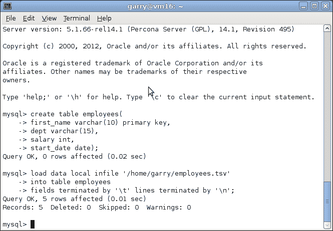
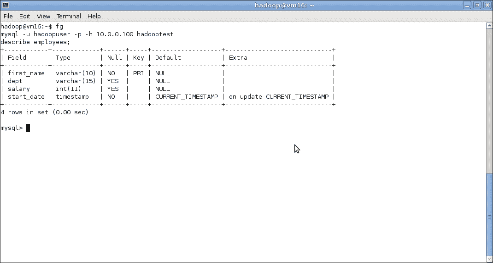

# 九、使用关系数据库

*正如我们在上一章中看到的，配置单元是一个很棒的工具，它提供了存储在 Hadoop 中的数据的类似于关系数据库的视图。 然而，归根结底，它并不是真正的关系数据库。 它没有完全实现 SQL 标准，其性能和规模特征与传统关系数据库有很大不同(不是更好或更差，只是不同)。*

*在许多情况下，您会发现 Hadoop 集群与关系数据库一起使用(而不是替代)。 通常，业务流需要将数据从一个商店移动到另一个商店；我们现在将探索这种集成。*

在本章中，我们将：

*   确定一些常见的 Hadoop/RDBMS 使用情形
*   了解如何将数据从 RDBMS 移动到 HDFS 和配置单元
*   使用 Sqoop 作为此类问题的更好解决方案
*   将带有导出的数据从 Hadoop 移动到 RDBMS
*   最后，我们将讨论如何将其应用于 AWS

# 公共数据路径

回到[第 1 章](01.html "Chapter 1. What It's All About")，*关于*的全部内容，我们谈到了我们认为会引起很大争议的人为选择：使用 Hadoop 或传统的关系数据库。 正如那里解释的那样，我们的论点是，要重点关注的是为手头的任务确定正确的工具，这可能会导致使用多种技术的情况。 值得看几个具体的例子来说明这一观点。

## Hadoop 作为归档存储

当 RDBMS用作主数据存储库时，经常会出现规模和数据保留问题。 随着新数据量的增加，如何处理较旧且价值较低的数据？

传统上，有两种主要方法来解决这种情况：

*   对 RDBMS 进行分区，以提高较新数据的性能；有时，该技术允许将较旧的数据存储在速度较慢且成本较低的存储系统上
*   将数据归档到磁带或其他脱机存储

这两种方法都是有效的，两者之间的决定通常取决于是否需要较旧的数据才能及时访问。 这是两种极端情况，前者以复杂性和基础设施费用为代价最大化访问，而后者降低成本但使数据更难访问。

最近看到的模型是将最新的数据保存在关系数据库中，而将较旧的数据推送到 Hadoop 中。 这可以作为结构化文件放到 HDFS 上，也可以放到配置单元中以保留 RDBMS 接口。 这两全其美，允许通过高速、低延迟的 SQL 查询访问较低的数据量和较新的数据，而从 Hadoop 访问的归档数据量要大得多。 因此，数据对于需要两种访问类型中的任何一种的用例仍然可用；对于需要跨最新数据和归档数据的任何查询，这在需要额外集成的平台上都是必需的。

由于 Hadoop 的可伸缩性，此模型提供了巨大的未来增长潜力；我们知道，我们可以继续增加存储的归档数据量，同时保留对其运行分析的能力。

## Hadoop 作为预处理步骤

在我们的Hive讨论中，我们多次强调了一些预处理工作对处理或清理数据非常有用的机会。 不幸的事实是，在许多(大多数？)。 在大数据的情况下，来自多个来源的大量数据意味着脏数据只是给定的。 尽管大多数 MapReduce 作业只需要处理全部数据的一个子集，但我们仍然会在整个数据集中发现不完整或损坏的数据。 正如配置单元可以从预处理数据中获益一样，传统的关系数据库也可以。

Hadoop 在这里可以是一个很棒的工具；它可以从多个源提取数据，将它们组合以进行必要的转换，并在将数据插入到关系数据库之前进行清理。

## Hadoop 作为数据输入工具

Hadoop 不仅有的价值，还因为它使数据变得更好，并且非常适合被吸收到关系数据库中。 除了这些任务之外，Hadoop 还可以用于生成额外的数据集或数据视图，然后从关系数据库提供这些数据集或数据视图。 这里的常见模式指的是这样的情况：我们不仅希望显示帐户的主要数据，还希望在其旁边显示从帐户历史记录生成的次要数据。 这些观点可以是对前几个月各类支出交易的汇总。 这些数据保存在 Hadoop 中，可以从 Hadoop 中生成实际摘要，这些摘要可能会被推回到数据库中，以便更快地显示。

## 蛇吃自己的尾巴

实际情况往往比这些明确定义的情况更复杂，Hadoop 和关系数据库之间的数据流使用圆圈和圆弧而不是一条直线来描述的情况并不少见。 例如，Hadoop 群集可以对数据执行预处理步骤，这些数据随后被摄取到 RDBMS 中，然后接收用于构建聚合的频繁事务转储，这些事务转储被发送回数据库。 然后，一旦数据超过某个阈值，它就会从数据库中删除，但会保留在 Hadoop 中以备存档之用。

无论情况如何，能够将数据从 Hadoop 获取到关系数据库并返回是将 Hadoop 集成到 IT 基础设施中的一个关键方面。 那么，让我们看看怎么做。

# 设置 MySQL

在从关系数据库读取和写入数据之前，我们需要一个正在运行的关系数据库。 我们将在本章中使用 MySQL，因为它是免费且广泛可用的，而且许多开发人员在其职业生涯的某个时候都使用过它。 当然，您可以使用任何可用的 JDBC 驱动程序的 RDBMS，但如果这样做，则需要修改本章中需要与数据库服务器直接交互的方面。

# 行动时间-安装和设置 MySQL

让我们安装 MySQL 并配置基本数据库和访问权限。

1.  在 Ubuntu 主机上，使用`apt-get`：

    ```scala
    $ apt-get update
    $ apt-get install mysql-server

    ```

    安装 MySQL
2.  按照提示操作，并在系统提示时选择合适的超级用户密码。
3.  安装后，连接到 MySQL 服务器：

    ```scala
    $ mysql -h localhost -u root -p

    ```

4.  提示时输入根密码：

    ```scala
    Welcome to the MySQL monitor.  Commands end with ; or \g.
    Your MySQL connection id is 40
    …
    Mysql>

    ```

5.  Create a new database to use for the examples in this chapter:

    ```scala
    Mysql> create database hadooptest;

    ```

    您将收到以下响应：

    ```scala
    Query OK, 1 row affected (0.00 sec)

    ```

6.  Create a user account with full access to the database:

    ```scala
    Mysql>  grant all on hadooptest.* to 'hadoopuser'@'%' identified by 'password';

    ```

    您将收到以下响应：

    ```scala
    Query OK, 0 rows affected (0.01 sec)

    ```

7.  Reload the user privileges to have the user changes take effect:

    ```scala
    Mysql> flush privileges;

    ```

    您将收到以下响应：

    ```scala
    Query OK, 0 rows affected (0.01 sec)

    ```

8.  Log out as root:

    ```scala
    mysql> quit;

    ```

    您将收到以下响应：

    ```scala
    Bye

    ```

9.  以新创建的用户身份登录，在系统提示时输入密码：

    ```scala
    $ mysql -u hadoopuser -p

    ```

10.  更改到新创建的数据库：

    ```scala
    mysql> use hadooptest;

    ```

11.  Create a test table, drop it to confirm the user has the privileges in this database, and then log out:

    ```scala
    mysql> create table tabletest(id int);
    mysql> drop table tabletest;
    mysql> quit;

    ```

    

## *刚刚发生了什么？*

由于像`apt`这样的包管理器的奇迹，安装像 MySQL 这样的复杂软件真的很容易。 我们只是使用标准过程来安装一个包；在 Ubuntu(实际上还有大多数其他发行版)下，请求 MySQL 的主服务器包将带来所有需要的依赖项以及客户端包。

在安装过程中，系统将提示您输入数据库的超级用户密码。 即使这是一个测试数据库实例，没有人会使用，并且没有有价值的数据，也请给 root 用户一个强密码。 使用弱根密码是一种坏习惯，我们不想鼓励这种做法。

安装 MySQL 之后，我们使用`mysql`命令行实用程序连接到数据库。 这需要一系列选项，但我们将使用以下选项：

*   `-h`：此选项用于指定数据库的主机名(如果未指定，则假定为本地计算机)
*   `-u`：此选项用于连接的用户名(默认为当前 Linux 用户)
*   `-p`：此选项用于提示输入用户密码

MySQL有多个数据库的概念，每个数据库都是表的集合分组。 每个表都需要与一个数据库相关联。 MySQL 有几个内置数据库，但是我们使用`CREATE DATABASE`语句来创建一个名为`hadooptest`的新数据库，以便我们稍后进行工作。

除非明确授予请求用户执行操作所需的权限，否则 MySQL 拒绝执行操作的连接/请求。 我们不想以 root 用户的身份执行所有操作(这是一种糟糕的做法，而且非常危险，因为 root 可以修改/删除所有内容)，因此我们使用`GRANT`语句创建了一个名为`hadoopuser`的新用户。

我们使用的`GRANT`语句实际上做了三件不同的事情：

*   创建`hadoopuser`帐户
*   设置`hadoopuser`密码；我们将其设置为`password`，显然您永远不应该这样做；选择容易记忆的密码
*   授予`hadoopuser`对`hadooptest`数据库及其所有表的所有权限

我们发出`FLUSH PRIVILEGES`命令以使这些更改生效，然后我们以 root 用户身份注销并以新用户身份连接以检查所有操作是否正常。

这里的`USE`语句有点多余。 将来，我们可以将数据库名称添加到`mysql`命令行工具中，以自动更改为该数据库。

以新用户身份连接是一个好兆头，但为了获得充分的信心，我们在`hadooptest`数据库中创建了一个新表，然后删除它。 此处的成功表明`hadoopuser`确实拥有修改数据库所需的权限。

## 有必要这么难吗？

我们在这里可能有点谨慎，因为我们检查了整个过程的每一步。 然而，我在过去发现，细微的拼写错误，特别是在`GRANT`语句中，可能会导致以后很难诊断的问题。 为了继续我们的偏执，让我们对默认的 MySQL 配置做一个更改，我们现在还不需要这样做，但是如果我们不这样做，我们以后会后悔的。

对于任何生产数据库，您当然不会有从书中键入的安全敏感语句，比如`GRANT`。 请参阅数据库文档以了解用户帐户和权限。

# 该采取行动了-将 MySQL 配置为允许远程连接

我们需要更改常见的默认 MySQL 行为，这将阻止我们从其他主机访问数据库。

1.  在您喜欢的文本编辑器中编辑`/etc/mysql/my.cnf`并查找该行：

    ```scala
    bind-address = 127.0.0.1
    ```

2.  将其更改为：

    ```scala
    # bind-address = 127.0.0.1
    ```

3.  重新启动 MySQL：

    ```scala
    $ restart mysql

    ```

## *刚刚发生了什么？*

大多数开箱即用的 MySQL 配置仅允许从运行服务器的同一主机进行访问。 从安全角度来看，这绝对是正确的默认设置。 但是，例如，如果您启动了试图访问该主机上的数据库的 MapReduce 作业，也可能会造成真正的混乱。 您可能会看到作业因连接错误而失败。 如果发生这种情况，您将在主机上启动`mysql`命令行客户端；这将成功。 然后，您可能会编写一个快速 JDBC 客户端来测试连通性。 这也会奏效。 只有当您从 Hadoop 工作节点之一尝试这些步骤时，问题才会显现出来。 是的，这在过去已经咬了我好几次了！

前面的更改告诉 MySQL 绑定到所有可用接口，从而可以从远程客户端访问。

进行更改后，我们需要重新启动服务器。 在 Ubuntu11.10 中，许多服务脚本已经移植到`Upstart`框架，我们可以直接使用方便的`restart`命令。

如果您使用的是 Ubuntu 之外的发行版--甚至可能是不同版本的 Ubuntu--全局 MySQL 配置文件可能位于不同的位置；例如，CentOS 和 Red Hat Enterprise Linux 上的`/etc/my.cnf`。

## 在生产中不要这样做！

或者至少在不考虑后果的情况下不会这么做。 在前面的示例中，我们给新用户提供了一个非常糟糕的密码；请不要这样做。 但是，如果您随后使数据库在整个网络上可用，则尤其不要做这样的事情。 是的，这是一个没有有价值数据的测试数据库，但令人惊讶的是，有这么多测试数据库存活了很长一段时间，并且开始变得越来越关键。 完成后，您会记得删除具有弱密码的用户吗？

说教说得够多了。 数据库需要数据。 让我们向本章将使用的`hadooptest`数据库添加一个表。

# 该行动了-设置员工数据库

如果没有 Employee 表的例子，对数据库的讨论就不完整，所以我们将遵循传统从这里开始。

1.  使用以下条目创建名为`employees.tsv`的制表符分隔文件：

    ```scala
    Alice  Engineering  50000  2009-03-12
    BobSales  35000  2011-10-01
    Camille  Marketing  40000  2003-04-20
    David  Executive  75000  2001-03-20
    Erica  Support  34000  2011-07-07
    ```

2.  连接到 MySQL 服务器：

    ```scala
    $ mysql -u hadoopuser -p hadooptest

    ```

3.  创建表：

    ```scala
    Mysql> create table employees(
    first_name varchar(10) primary key,
    dept varchar(15),
    salary int,
    start_date date
    ) ;

    ```

4.  Load the data from the file into the database:

    ```scala
    mysql> load data local infile '/home/garry/employees.tsv'
     -> into table employees
     -> fields terminated by '\t' lines terminated by '\n' ;

    ```

    

## *刚刚发生了什么？*

这是相当标准的数据库内容。 我们创建了一个制表符分隔的数据文件，在数据库中创建表，然后使用`LOAD DATA LOCAL INFILE`语句将数据导入到表中。

我们在这里使用的是一组非常小的数据，因为它实际上仅用于说明目的。

## 注意数据文件访问权限

不要省略`LOAD DATA`语句中的`LOCAL`部分；这样做会看到 MySQL 以 MySQL 用户的身份尝试并加载文件，这通常会导致访问问题。

# 将数据导入 Hadoop

既然我们已经投入了所有的前期工作，让我们来看看将数据从 MySQL 转移到 Hadoop 的方法。

## 使用 MySQL 工具和手动导入

将数据导出到 Hadoop 的最简单方法是使用现有的命令行工具和语句。 要导出整个表(或者实际上是整个数据库)，MySQL 提供了`mysqldump`实用程序。 要进行更精确的导出，我们可以使用以下形式的`SELECT`语句：

```scala
SELECT col1, col2 from table
INTO OUTFILE '/tmp/out.csv'
FIELDS TERMINATED by ',', LINES TERMINATED BY '\n';
```

一旦有了导出文件，我们就可以使用`hadoop fs -put`将其移动到 HDFS 中，或者通过上一章中讨论的方法将其移动到配置单元中。

## 让 Go 成为英雄-将 EMPLOYEE 表导出到 HDFS

我们不希望本章将变成 MySQL 教程，因此请查找`mysqldump`实用程序的语法，并使用它或`SELECT … INTO OUTFILE`语句将 EMPLOYEE 表导出为以制表符分隔的文件，然后将其复制到 HDFS。

## 从映射器访问数据库

对于我们这个简单的示例，前面的方法很好，但是如果您需要导出更大的数据集，特别是如果要由 MapReduce 作业处理这些数据，那该怎么办呢？

最明显的方法是在 MapReduce 输入作业中直接进行 JDBC 访问，该作业从数据库中提取数据并将其写入 HDFS，为进一步的处理做好准备。

这是一种有效的技术，但也有一些不太明显的问题。

您需要小心您对数据库施加了多少负载。 将这类作业放到一个非常大的集群上可能会非常迅速地融化数据库，因为成百上千的映射器试图同时打开连接并读取同一个表。 最简单的访问模式也可能是每行一个查询，这样就无法使用更高效的大容量访问语句。 即使数据库可以承担负载，数据库网络连接也很有可能很快成为瓶颈。

要在所有映射器中有效地并行化查询，您需要一种策略来将表划分为每个映射器将检索的段。 然后，您需要确定每个映射器如何传递其段参数。

如果检索到的段很大，除非您显式报告进度，否则很可能最终会出现由 Hadoop 框架终止的长时间运行的任务。

对于一项概念上简单的任务来说，这实际上是相当多的工作。 为此，使用现有的工具不是更好吗？ 确实有这样一个工具，我们将在本章的其余部分中使用，它就是 Sqoop。

## 更好的方式--引入 Sqoop

是由Cloudera([Hadoop](http://www.cloudera.com))，一家公司创建的，该公司除了提供自己的 http://www.cloudera.com 发行版打包外，还提供大量与 Hadoop 相关的服务，这一点我们将在[第 11 章](11.html "Chapter 11. Where to Go Next")，*下一步去哪里*中讨论。

除了提供这个打包的 Hadoop 产品之外，该公司还创建了许多工具供社区使用，Sqoop 就是其中之一。 它的工作就是做我们需要的事情，在 Hadoop 和关系数据库之间复制数据。 虽然它最初是由 Cloudera 开发的，但它已经向Apache 软件基金会捐款，它的主页是[http://sqoop.apache.org](http://sqoop.apache.org)。

# 行动时间-下载和配置 Sqoop

让我们下载并安装并配置 Sqoop。

1.  转到 Sqoop 主页，选择不低于 1.4.1 的最稳定版本的链接，并将其与您正在使用的 Hadoop 版本进行匹配。 下载该文件。
2.  将检索到的文件复制到您希望将其安装在系统上的位置；然后将其解压缩：

    ```scala
    $mv sqoop-1.4.1-incubating__hadoop-1.0.0.tar.gz_ /usr/local
    $ cd /usr/local
    $ tar –xzf sqoop-1.4.1-incubating__hadoop-1.0.0.tar.gz_

    ```

3.  创建符号链接：

    ```scala
    $ ln -s sqoop-1.4.1-incubating__hadoop-1.0.0 sqoop

    ```

4.  更新您的环境：

    ```scala
    $ export SQOOP_HOME=/usr/local/sqoop
    $ export PATH=${SQOOP_HOME}/bin:${PATH}

    ```

5.  为您的数据库下载 jdbc 驱动程序；对于 mysql，我们可以在[http://dev.mysql.com/downloads/connector/j/5.0.html](http://dev.mysql.com/downloads/connector/j/5.0.html)找到它。
6.  将下载的 JAR 文件复制到 Sqoop`lib`目录：

    ```scala
    $ cp mysql-connector-java-5.0.8-bin.jar /opt/sqoop/lib

    ```

7.  Test Sqoop:

    ```scala
    $ sqoop help

    ```

    您将看到以下输出：

    ```scala
    usage: sqoop COMMAND [ARGS]
    Available commands:
     codegen            Generate code to interact with database records
    …
     version            Display version information
    See 'sqoop help COMMAND' for information on a specific command.

    ```

## *刚刚发生了什么？*

Sqoop 是一个非常简单的安装工具。 从 Sqoop 主页下载所需版本后-小心选择与我们的 Hadoop 版本匹配的版本-我们复制并解压缩文件。

同样，我们需要设置一个环境变量，并将 Sqoop`bin`目录添加到我们的路径中，这样我们就可以直接在 Shell 中设置这些变量，或者像前面一样，将这些步骤添加到我们可以在开发会话之前获取的配置文件中。

Sqoop 需要访问数据库的 JDBC 驱动程序；对于我们来说，我们下载了 MySQL 连接器并将其复制到 Sqoop`lib`目录中。 对于最流行的数据库，这是 Sqoop 所需的所有配置；如果您想要使用一些新奇的东西，请参考 Sqoop 文档。

在此最小安装之后，我们执行了`sqoop`命令行实用程序以验证它是否正常工作。

### 备注

您可能会看到来自 Sqoop 的警告消息，告诉您尚未定义`HBASE_HOME`等其他变量。 因为我们在这本书中不讨论 HBase，所以我们不需要这个设置，并且将在我们的屏幕截图中省略这样的警告。

### Sqoop 和 Hadoop 版本

我们对之前要检索的 Sqoop 版本非常具体；比以前的软件下载更加具体。 在 1.4.1 之前的 Sqoop 版本中，依赖于仅在 Cloudera Hadoop 发行版或 0.21 之后的 Hadoop 版本中提供的核心 Hadoop 类之一上的附加方法。

不幸的是，Hadoop1.0 实际上是 0.20 分支的延续，这意味着 Sqoop 1.3 可以与 Hadoop 0.21 一起工作，但不能与 0.20 或 1.0 一起工作。 为了避免此版本混淆，我们建议使用版本 1.4.1 或更高版本，这样可以消除依赖关系。

不需要额外的 MySQL 配置；如前所述，我们可以通过使用 Sqoop 发现服务器是否没有配置为允许远程客户端。

### Sqoop 和 HDFS

我们可以执行的最简单的导入是将数据库表中的数据转储到 HDFS 上的结构化文件。 就这么办吧。

# 执行操作的时间-将数据从 MySQL 导出到 HDFS

在这里，我们将使用一个简单的示例，在该示例中，我们只需从单个 MySQL 表中提取所有数据，并将其写入 HDFS 上的单个文件。

1.  Run Sqoop to export data from MySQL onto HDFS:

    ```scala
    $ sqoop import --connect jdbc:mysql://10.0.0.100/hadooptest 
    --username hadoopuser \ > --password password --table employees

    ```

    

2.  Examine the output directory:

    ```scala
    $ hadoop fs -ls employees

    ```

    您将收到以下响应：

    ```scala
    Found 6 items
    -rw-r--r--   3 hadoop supergroup          0 2012-05-21 04:10 /user/hadoop/employees/_SUCCESS
    drwxr-xr-x   - hadoop supergroup          0 2012-05-21 04:10 /user/hadoop/employees/_logs
    -rw-r--r--   3 … /user/hadoop/employees/part-m-00000
    -rw-r--r--   3 … /user/hadoop/employees/part-m-00001
    -rw-r--r--   3 … /user/hadoop/employees/part-m-00002
    -rw-r--r--   3 … /user/hadoop/employees/part-m-00003

    ```

3.  Display one of the result files:

    ```scala
    $ hadoop fs -cat /user/hadoop/employees/part-m-00001

    ```

    您将看到以下输出：

    ```scala
    Bob,Sales,35000,2011-10-01
    Camille,Marketing,40000,2003-04-20

    ```

## *刚刚发生了什么？*

我们不需要任何前言；这里只需要一条 Sqoop 语句。 可以看到，Sqoop 命令行有很多选项；让我们一次只解压一个选项。

Sqoop 中的第一个选项是要执行的任务类型；在本例中，我们希望将数据从关系源导入 Hadoop。 `--connect`选项指定数据库的 JDBC URI，标准格式为`jdbc:<driver>://<host>/<database>`。 显然，您需要将 IP 或主机名更改为运行数据库的服务器。

我们使用`--username`和`--password`选项指定这些属性，最后使用`--table`指示我们希望从哪个表检索数据。 就是这样！ Sqoop 会做剩下的事情。

Sqoop 输出相对冗长，但一定要阅读它，因为它可以很好地了解到底发生了什么。

### 备注

但是，重复执行 Sqoop 可能会包含关于已存在的生成文件的嵌套错误。 暂时忽略这一点。

首先，在前面的步骤中，我们看到 Sqoop 告诉我们不要使用`--password`选项，因为它本质上是不安全的。 Sqoop 有一个替代的`-P`命令，它会提示输入密码；我们将在以后的示例中使用该命令。

我们还收到关于使用文本主键列的警告，这是一个非常糟糕的主意；稍后将对此进行详细介绍。

然而，在所有设置和警告之后，我们看到 Sqoop 执行了一个 MapReduce 作业并成功完成了它。

默认情况下，Sqoop 将输出文件放入运行作业的用户的主目录中的一个目录中。 这些文件将位于与源表同名的目录中。 为了验证这一点，我们使用`hadoop fs -ls`检查了这个目录，并确认它包含几个文件，很可能比我们预期的要多，考虑到这么小的表。 请注意，我们在这里略微缩写了输出，以使其适合一行。

然后，我们检查了其中一个输出文件，发现了产生多个文件的原因；即使表很小，它仍然被分割到多个映射器，因此也就是输出文件。 默认情况下，Sqoop 使用四个映射任务。 在这种情况下，这看起来可能有点奇怪，但通常的情况是导入的数据要大得多。 考虑到希望将数据复制到 HDFS 上，该数据很可能是未来 MapReduce 作业的源，因此多个文件使非常有意义。

### 映射器和主键列

我们故意使用员工数据集中的文本主键列来设置这种情况。 实际上，主键更有可能是一个自动递增的数字雇员 ID。然而，这个选择突出了 Sqoop 处理表格的方式及其对主键的使用的本质。

Sqoop 使用主键列来确定如何在其映射器之间分割源数据。 但是，正如前面的警告所述，这意味着我们依赖基于字符串的比较，并且在大小写意义不完美的环境中，结果可能是不正确的。 理想情况是按照建议使用数值列。

或者，也可以使用`-m`选项控制映射器的数量。 如果我们使用`-m 1`，将只有一个映射器，并且不会尝试对主键列进行分区。 对于像我们这样的小数据集，我们也可以这样做，以确保单个输出文件。

这不仅仅是一个选项；如果您尝试从没有主键的表导入，Sqoop 将失败，并显示一个错误，指出从这样的表导入的唯一方法是显式设置单个映射器。

### 其他选项

在导入数据时，不要认为 Sqoop 要么全有要么什么都不是。 Sqoop 还有其他几个选项来指定、限制和更改从数据库提取的数据。 我们将在下面讨论配置单元的部分中对其进行说明，但请记住，在导出到 HDFS 时也可以使用大多数配置单元。

### Sqoop 的架构

现在我们已经看到了Sqoop 的运行，有必要花一些时间来澄清它的架构，看看它是如何工作的。 在几种方式上，Sqoop 与 Hadoop 的交互方式与 Have 非常相似；两者都是创建一个或多个 MapReduce 作业来执行任务的单一客户端程序。

Sqoop 没有任何服务器进程；我们运行的命令行客户端就是它的全部。 但是，因为它可以根据手头的特定任务定制生成的 MapReduce 代码，所以它往往可以非常高效地利用 Hadoop。

前面在主键上拆分源 RDBMS 表的示例就是一个很好的例子。 Sqoop 知道将在 MapReduce 作业中配置的映射器的数量(如前所述，缺省值为 4)，因此它可以对源表进行智能分区。

如果我们假设一个表有 100 万条记录和 4 个映射器，那么每个映射器将处理 25 万条记录。 凭借对主键列的了解，Sqoop 可以创建四条 SQL 语句来检索数据，每条语句都使用所需的主键列范围作为警告。 在最简单的情况下，这可以像在第一条语句中添加类似`WHERE id BETWEEN 1 and 250000`的内容，并对其他语句使用不同的`id`范围一样简单。

当从 Hadoop 导出数据时，我们将看到相反的行为，因为 Sqoop 再次并行跨多个映射器的数据检索，并优化将该数据插入到关系数据库中。 然而，所有这些智能都被推入在 Hadoop 上执行的 MapReduce 作业中；Sqoop 命令行客户端的工作是尽可能高效地生成这些代码，然后在处理发生时避开它。

## 使用 Sqoop 将数据导入配置单元

Sqoop 有与配置单元的重要集成，允许它将数据从关系源导入到新的或现有的配置单元表中。 有多种方法可以定制此流程，但同样，让我们从简单的案例开始。

# 执行操作的时间-将数据从 MySQL 导出到配置单元

对于本例，我们将将单个 MySQL 表中的所有数据导出到配置单元中对应命名的表中。 您需要按照上一章中的详细说明安装和配置配置单元。

1.  Delete the output directory created in the previous section:

    ```scala
    $ hadoop fs -rmr employees

    ```

    您将收到以下响应：

    ```scala
    Deleted hdfs://head:9000/user/hadoop/employees

    ```

2.  Confirm Hive doesn't already contain an employees table:

    ```scala
    $ hive -e "show tables like 'employees'"

    ```

    您将收到以下响应：

    ```scala
    OK
    Time taken: 2.318 seconds

    ```

3.  Perform the Sqoop import:

    ```scala
    $ sqoop import --connect jdbc:mysql://10.0.0.100/hadooptest 
    --username hadoopuser -P
    --table employees --hive-import --hive-table employees 

    ```

    

4.  Check the contents in Hive:

    ```scala
    $ hive -e "select * from employees"

    ```

    您将收到以下响应：

    ```scala
    OK
    Alice  Engineering  50000  2009-03-12
    Camille  Marketing  40000  2003-04-20
    David  Executive  75000  2001-03-20
    Erica  Support  34000  2011-07-07
    Time taken: 2.739 seconds

    ```

5.  Examine the created table in Hive:

    ```scala
    $ hive -e "describe employees"

    ```

    您将收到以下响应：

    ```scala
    OK
    first_name  string 
    dept  string 
    salary  int 
    start_date  string 
    Time taken: 2.553 seconds

    ```

## *刚刚发生了什么？*

同样，我们使用带有两个新选项的Sqoop 命令，`--hive-import`告诉 Sqoop 最终目的地是配置单元而不是 HDFS，`--hive-table`指定配置单元中我们希望将数据导入到的表名。

实际上，如果配置单元表与`--table`选项指定的源表相同，则不需要指定配置单元表的名称。 但是，它确实让事情变得更加明确，所以我们通常会将其包括在内。

和前面一样，一定要阅读完整的 Sqoop 输出，因为它提供了对正在发生的事情的很好的洞察力，但是最后几行突出显示了成功地导入到新的 hive 表中。

我们看到 Sqoop 从 MySQL 检索 5 行，然后经历将它们复制到 HDFS 并导入到配置单元的各个阶段。 接下来我们将讨论警告重新类型转换。

在 Sqoop 完成这个过程之后，我们使用配置单元从新的配置单元表中检索数据，并确认它是我们所期望的。 然后，我们检查创建的表的定义。

在这一点上，我们确实看到了一件奇怪的事情：`start_date`列被赋予了一个类型字符串，尽管它最初是 MySQL 中的 SQL`DATE`类型。

我们在 Sqoop 执行过程中看到的警告解释了这种情况：

```scala
12/05/23 13:06:33 WARN hive.TableDefWriter: Column start_date had to be cast to a less precise type in Hive

```

这是因为配置单元不支持除`TIMESTAMP`以外的任何时态数据类型。 在导入的数据属于另一种类型(与日期或时间相关)的情况下，Sqoop 会将其转换为字符串。 稍后我们将研究处理这种情况的方法。

此示例非常常见，但我们并不总是希望将整个表导入到配置单元中。 有时，我们希望只包含特定的列或应用谓词来减少所选项目的数量。 Sqoop 允许我们两者兼而有之。

# 采取行动的时间-更有选择性的进口

让我们通过执行受条件表达式限制的导入来看看这是如何工作的。

1.  Delete any existing employee import directory:

    ```scala
    $ hadoop fs -rmr employees

    ```

    您将收到以下响应：

    ```scala
    Deleted hdfs://head:9000/user/hadoop/employees

    ```

2.  Import selected columns with a predicate:

    ```scala
    sqoop import --connect jdbc:mysql://10.0.0.100/hadooptest 
    --username hadoopuser -P
    --table employees --columns first_name,salary
     --where "salary > 45000" 
    --hive-import --hive-table salary 

    ```

    您将收到以下响应：

    ```scala
    12/05/23 15:02:03 INFO hive.HiveImport: Hive import complete.

    ```

3.  Examine the created table:

    ```scala
    $ hive -e "describe salary"

    ```

    您将收到以下响应：

    ```scala
    OK
    first_name  string 
    salary  int 
    Time taken: 2.57 seconds

    ```

4.  Examine the imported data:

    ```scala
    $ hive -e "select * from salary"

    ```

    您将看到以下输出：

    ```scala
    OK
    Alice  50000
    David  75000
    Time taken: 2.754 seconds

    ```

## *刚刚发生了什么？*

这一次，我们的Sqoop 命令首先添加了`--columns`选项，该选项指定要在导入中包括哪些列。 这是一个逗号分隔的列表。

我们还使用了`--where`选项，该选项允许应用于用于从数据库提取数据的 SQL 的`WHERE`子句的自由文本规范。

这些选项的组合是，我们的 Sqoop 命令应该只导入薪水大于`WHERE`子句中指定的阈值的人的姓名和薪水。

我们执行该命令，看到它成功完成，然后检查在配置单元中创建的表。 我们看到它确实只包含指定的列，然后显示表内容以验证 WHERE 谓词是否也被正确应用。

### 数据类型问题

在[第八章](08.html "Chapter 8. A Relational View on Data with Hive")，*与配置单元*的数据关系视图中，我们提到了配置单元并不支持所有常见的 SQL数据类型。 特别是`DATE`和`DATETIME`类型目前还没有实现，尽管它们确实作为已确定的配置单元问题存在；因此，希望将来会添加它们。 我们在本章早些时候看到了这一影响，这是我们第一次导入蜂巢。 尽管 MySQL 中的`start_date`列是`DATE`类型，但 Sqoop 导入标记了一个转换警告，并且配置单元中的结果列是`STRING`类型。

Sqoop 有一个在这里很有用的选项，即我们可以使用`--map-column-hive`显式地告诉 Sqoop 如何在生成的配置单元表中创建列。

# 操作时间-使用类型映射

让我们使用类型映射来改进数据导入。

1.  删除任何现有输出目录：

    ```scala
    $ hadoop fs -rmr employees

    ```

2.  Execute Sqoop with an explicit type mapping:

    ```scala
    sqoop import --connect jdbc:mysql://10.0.0.100/hadooptest --username hadoopuser 
    -P --table employees 
    --hive-import --hive-table employees 
    --map-column-hive start_date=timestamp

    ```

    您将收到以下响应：

    ```scala
    12/05/23 14:53:38 INFO hive.HiveImport: Hive import complete.

    ```

3.  Examine the created table definition:

    ```scala
    $ hive -e "describe employees"

    ```

    您将收到以下响应：

    ```scala
    OK
    first_name  string 
    dept  string 
    salary  int 
    start_date  timestamp 
    Time taken: 2.547 seconds

    ```

4.  Examine the imported data:

    ```scala
    $ hive -e "select * from employees";

    ```

    您将收到以下响应：

    ```scala
    OK
    Failed with exception java.io.IOException:java.lang.IllegalArgumentException: Timestamp format must be yyyy-mm-dd hh:mm:ss[.fffffffff]
    Time taken: 2.73 seconds

    ```

## *刚刚发生了什么？*

这里的 Sqoop命令行类似于原始的配置单元导入，只是增加了列映射规范。 我们指定`start_date`列应该是`TIMESTAMP`类型，并且我们可以添加其他规范。 该选项接受此类映射的逗号分隔列表。

在确认 Sqoop 成功执行之后，我们检查了创建的配置单元表，并验证确实应用了映射，并且`start_date`列的类型为`TIMESTAMP`。

然后，我们尝试从表中检索数据，但没有成功，收到关于类型格式不匹配的错误。

仔细想想，这并不令人意外。 尽管我们将所需的列类型指定为`TIMESTAMP`，但是从 MySQL 导入的实际数据的类型是`DATE`，它不包含时间戳中所需的时间部分。 这是一个重要的教训。 确保类型映射正确只是难题的一部分；我们还必须确保数据对于指定的列类型有效。

# 执行操作的时间-从原始查询导入数据

让我们看一个导入的示例，其中使用原始 SQL 语句来选择要导入的数据。

1.  删除任何现有输出目录：

    ```scala
    $ hadoop fs –rmr employees

    ```

2.  删除任何现有配置单元员工表：

    ```scala
    $ hive -e 'drop table employees'

    ```

3.  使用显式查询导入数据：

    ```scala
    sqoop import --connect jdbc:mysql://10.0.0.100/hadooptest 
    --username hadoopuser -P
    --target-dir employees 
    --query 'select first_name, dept, salary, 
    timestamp(start_date) as start_date from employees where $CONDITIONS' 
    --hive-import --hive-table employees 
    --map-column-hive start_date=timestamp -m 1

    ```

4.  Examine the created table:

    ```scala
    $ hive -e "describe employees"

    ```

    您将收到以下响应：

    ```scala
    OK
    first_name  string 
    dept  string 
    salary  int 
    start_date  timestamp 
    Time taken: 2.591 seconds

    ```

5.  Examine the data:

    ```scala
    $ hive -e "select * from employees"

    ```

    您将收到以下响应：

    ```scala
    OK
    Alice  Engineering  50000  2009-03-12 00:00:00
    BobSales  35000  2011-10-01 00:00:00
    Camille  Marketing  40000  2003-04-20 00:00:00
    David  Executive  75000  2001-03-20 00:00:00
    Erica  Support  34000  2011-07-07 00:00:00
    Time taken: 2.709 seconds

    ```

## *刚刚发生了什么？*

为了实现我们的目标，我们使用了一种非常不同的 Sqoop 导入形式。 这里我们使用`--query`选项来定义显式 SQL 语句，而不是指定所需的表，然后让 Sqoop 导入所有列或指定的子集。

在语句中，我们选择了源表中的所有列，但应用`timestamp()`函数将`start_date`列转换为正确的类型。 (请注意，此函数仅向日期添加一个`00:00`时间元素)。 我们为该函数的结果设置别名，这使我们可以在类型映射选项中对其进行命名。

因为我们没有`--table`选项，所以我们必须添加`--target-dir`来告诉 Sqoop 它应该在 HDFS 上创建的目录的名称。

SQL 中的`WHERE`子句是 Sqoop 所需的，尽管我们实际上并没有使用它。 没有`--table`选项不仅会降低 Sqoop 自动生成导出目录名称的能力，还意味着 Sqoop 不知道从哪里检索数据，因此不知道如何跨多个映射器划分数据。 `$CONDITIONS`变量与`--where`选项结合使用；指定后者为 Sqoop 提供了对表进行适当分区所需的信息。

我们在这里采用了一种不同的方法，而是将映射器的数量显式设置为`1`，这样就不需要显式分区子句了。

执行 Sqoop 之后，我们检查配置单元中的表定义，与前面一样，它具有所有列的正确数据类型。 然后我们查看数据，现在成功了，`start_date`列数据被适当地转换为`TIMESTAMP`值。

### 备注

当我们在*Sqoop 和 HDFS*部分提到 Sqoop 提供了限制从数据库提取的数据的机制时，我们指的是`query`、`where`和`columns`选项。 请注意，无论目的地如何，任何 Sqoop 导入都可以使用它们。

## 来个围棋英雄

虽然对于这么小的数据集来说确实不需要它，但`$CONDITIONS`变量是一个重要的工具。 修改前面的 Sqoop 语句以使用具有显式分区语句的多个映射器。

### Sqoop 和Hive分区

在[章](08.html "Chapter 8. A Relational View on Data with Hive")，*与配置单元*的数据关系视图中，我们谈到了很多关于配置单元分区的内容，并强调了它们在允许对非常大的表进行查询优化方面的重要性。 好消息是 Sqoop 可以支持配置单元分区；坏消息是支持不完整。

要将数据从关系数据库导入分区配置单元表，我们使用`--hive-partition-key`选项指定分区列，使用`--hive-partition-value`选项指定此 Sqoop 命令将向其中导入数据的分区的值。

这很好，但确实需要将每个 Sqoop 语句导入到单个配置单元分区中；目前不支持配置单元自动分区。 相反，如果要将数据集导入到表中的多个分区中，则需要使用单独的 Sqoop 语句插入到每个分区中。

### 字段和行终止符

到目前为止，我们一直在隐含地依赖于一些默认值，但现在应该讨论它们。 我们的原始文本文件是用制表符分隔的，但您可能已经注意到，我们导出到 HDFS 的数据是用逗号分隔的。 如果您查看`/user/hive/warehouse/employees`下的文件(请记住，这是 HDFS 上配置单元保存其源文件的默认位置)，记录将使用 ASCII 代码 001 作为分隔符。 怎么一回事？

在第一个实例中，我们让 Sqoop使用其缺省值，在本例中，这意味着使用逗号分隔字段，并使用`\n`记录。 但是，当 Sqoop 导入配置单元时，它使用配置单元默认值，包括使用 001 代码(^A)分隔字段。

我们可以使用以下 Sqoop 选项显式设置分隔符：

*   `fields-terminated-by`：这是字段之间的分隔符
*   `lines-terminated-by`：行终止符
*   `escaped-by`：用于转义字符(例如，\)
*   `enclosed-by`：将字段括起来的字符(例如，“)
*   `optionally-enclosed-by`：类似于前面的选项，但不是必填项
*   `mysql-delimiters`：使用 MySQL 默认值的快捷方式

这看起来可能有点吓人，但它并不像术语可能暗示的那样晦涩难懂，并且具有 SQL 经验的人应该熟悉其中的概念和语法。 前几个选项非常不言自明；当谈到封闭字符和可选封闭字符时，它就变得不那么清楚了。

这实际上是关于(通常是自由格式)数据，其中给定域可能包括具有特殊含义的字符。 例如，逗号分隔的文件中包含逗号的字符串列。 在这种情况下，我们可以用引号将字符串列括起来，以允许在字段中使用逗号。 如果所有字段都需要这样的封闭字符，我们将使用第一个表单；如果只有一个字段子集需要这样的表单，则可以将其指定为可选。

# 从 Hadoop 获取数据

我们说 Hadoop 和关系数据库之间的数据流很少是线性的单向过程。 事实上，在 Hadoop 中处理数据，然后将其插入到关系数据库中的情况可以说是更常见的情况。 我们现在就来探索这一点。

## 从减速机内写入数据

考虑如何将 MapReduce 作业的输出复制到关系数据库中，我们发现了与查看数据导入 Hadoop 问题时类似的注意事项。

最明显的方法是修改减法器，为每个键及其关联值生成输出，然后通过JDBC 将它们直接插入到数据库中。 我们不必像导入情况那样担心源列分区，但仍然需要考虑我们对数据库施加了多少负载，以及我们是否需要考虑长期运行任务的超时。 此外，与映射器的情况一样，这种方法倾向于对数据库执行许多单个查询，这通常比批量操作的效率低得多。

## 从减速器写入 SQL 导入文件

通常，更好的方法不是像前面的示例那样绕过通常的 MapReduce 生成输出文件的情况，而是利用它。

所有关系数据库都能够通过自定义工具或使用`LOAD DATA`语句从源文件获取数据。 因此，在 Reducer 中，我们可以修改数据输出，使其更容易被吸收到我们的关系目标中。 这样就不需要考虑减速器给数据库带来负载或如何处理长期运行的任务等问题，但它确实需要在我们的MapReduce 作业之外进行第二步。

## 更好的方式-再次 Sqoop

如果你看过 Sqoop 内置帮助或其在线文档的输出，了解到 Sqoop 也可以成为我们从 Hadoop 导出数据的首选工具，这可能不会令人惊讶--如果你看过 Sqoop 内置帮助或其在线文档的话。

# 开始行动-将数据从 Hadoop 导入 MySQL

让我们通过将数据从 HDFS 文件导入到 MySQL 表中来演示这一点。

1.  使用以下条目创建名为`newemployees.tsv`的制表符分隔文件：

    ```scala
    Frances  Operations  34000  2012-03-01
    Greg  Engineering  60000  2003-11-18
    Harry  Intern  22000  2012-05-15
    Iris  Executive  80000  2001-04-08
    Jan  Support  28500  2009-03-30
    ```

2.  在 HDFS 上创建一个新目录，并将文件复制到其中：

    ```scala
    $hadoop fs -mkdir edata
    $ hadoop fs -put newemployees.tsv edata/newemployees.tsv

    ```

3.  Confirm the current number of records in the employee table:

    ```scala
    $ echo "select count(*) from employees" | 
    mysql –u hadoopuser –p hadooptest

    ```

    您将收到以下响应：

    ```scala
    Enter password: 
    count(*)
    5

    ```

4.  Run a Sqoop export:

    ```scala
    $ sqoop export --connect jdbc:mysql://10.0.0.100/hadooptest 
    --username hadoopuser  -P --table employees 
    --export-dir edata --input-fields-terminated-by '\t'

    ```

    您将收到以下响应：

    ```scala
    12/05/27 07:52:22 INFO mapreduce.ExportJobBase: Exported 5 records.

    ```

5.  Check the number of records in the table after the export:

    ```scala
    Echo "select count(*) from employees" 
    | mysql -u hadoopuser -p hadooptest

    ```

    您将收到以下响应：

    ```scala
    Enter password: 
    count(*)
    10

    ```

6.  Check the data:

    ```scala
    $ echo "select * from employees" 
    | mysql -u hadoopuser -p hadooptest

    ```

    您将收到以下响应：

    ```scala
    Enter password: 
    first_name  dept  salary  start_date
    Alice  Engineering  50000  2009-03-12
    …
    Frances  Operations  34000  2012-03-01
    Greg  Engineering  60000  2003-11-18
    Harry  Intern  22000  2012-05-15
    Iris  Executive  80000  2001-04-08
    Jan  Support  28500  2009-03-30

    ```

## *刚刚发生了什么？*

我们首先创建了一个数据文件，其中包含另外五名员工的信息。 我们在 HDFS 上为数据创建了一个目录，并将新文件复制到该目录中。

在运行导出之前，我们确认 MySQL 中的表只包含最初的五名员工。

Sqoop 命令的结构与以前类似，最大的变化是使用了`export`命令。 顾名思义，Sqoop 将导出数据从 Hadoop 导出到关系数据库。

我们使用了几个与前面类似的选项，主要用于指定数据库连接、连接所需的用户名和密码以及要向其中插入数据的表。

因为我们要从 HDFS 导出数据，所以需要指定包含要导出的所有文件的位置，这是通过`--export-dir`选项完成的。 目录中包含的所有文件都将被导出；它们不需要位于单个文件中；Sqoop 将包括其 MapReduce 作业中的所有文件。 默认情况下，Sqoop 使用四个映射器；如果您有大量的文件，增加这个数字可能会更有效；不过，一定要进行测试，以确保数据库上的负载保持在可控范围内。

传递给 Sqoop 的最后一个选项指定了源文件中使用的字段终止符，在本例中是制表符。 确保数据文件的格式正确是您的责任；Sqoop 将假定每个记录中的元素数量与表中的列相同(尽管 NULL 是可以接受的)，并由指定的字段分隔符分隔。

在观看 Sqoop 命令成功完成之后，我们看到它报告它导出了 5 条记录。 我们使用`mysql`工具检查数据库中现在的行数，然后查看数据以确认新员工加入了我们的老朋友。

### Sqoop 导入和导出之间的差异

虽然在概念上和命令行调用中类似，但 Sqoop 导入和导出之间有许多重要的区别值得研究。

首先，Sqoop 导入可以假设更多关于正在处理的数据的信息；通过显式命名的表或添加的谓词，有很多关于数据结构和类型的信息。 但是，Sqoop 导出仅提供源文件的位置以及用于分隔和括起字段和记录的字符。 虽然 Sqoop 导入到配置单元可以根据提供的表名和结构自动创建新表，但是 Sqoop 导出必须导入到关系数据库中的现有表中。

尽管我们前面的日期和时间戳演示显示了一些尖锐的边缘，但是 Sqoop 导入也能够确定源数据是否符合定义的列类型；否则，数据将不可能插入到数据库中。 同样，Sqoop 导出只能有效地访问字符字段，而不了解真实数据类型。 如果您拥有非常干净和格式良好的数据，这可能永远不重要，但对于我们其他人来说，将需要考虑数据导出和类型转换，特别是在 NULL 和默认值方面。 Sqoop 文档详细介绍了这些选项，值得一读。

### 插入与更新

我们前面的示例非常简单；我们添加了一组完整的新数据，它们可以愉快地与表的现有内容共存。 默认情况下，Sqoop 导出执行一系列附加操作，将每条记录作为表中的新行添加。

但是，如果我们稍后想要更新数据，例如，我们的员工在年底加薪时，该怎么办？ 由于数据库表将`first_name`定义为主键，任何插入与现有员工同名的新行的尝试都将失败，并导致主键约束失败。

在这种情况下，我们可以设置 Sqoop`--update-key`选项来指定主键，Sqoop 将基于该键(可以是逗号分隔的键列表)生成`UPDATE`语句，而不是添加新行的`INSERT`语句。

### 备注

在此模式下，任何与现有键值不匹配的记录都将被静默忽略，如果一条语句更新多行，Sqoop 将不会标记错误。

如果我们还想要为不存在的数据添加新行的更新选项，我们可以将`--update-mode`选项设置为`allowinsert`。

## 来个围棋英雄

创建另一个数据文件，其中包含三名新员工以及两名现有员工的更新工资。 在导入模式下使用 Sqoop 既可以添加新员工，也可以应用所需的更新。

### Sqoop 和配置单元导出

鉴于前面的示例，了解到 Sqoop 目前没有任何直接支持将配置单元表导出到关系数据库中可能并不令人惊讶。 更准确地说，我们之前使用的`--hive-import`选项没有显式的等价物。

但是，在某些情况下，我们可以解决此问题。 如果配置单元表格以文本格式存储其数据，我们可以将 Sqoop 指向 HDFS 上表格数据文件的位置。 在表引用外部数据的情况下，这可能很简单，但是一旦我们开始看到带有复杂分区的Hive表，目录结构就会变得更加复杂。

HIVE 还可以将表存储为 Binary SequenceFiles，当前的限制是 Sqoop 不能透明地从以这种格式存储的表导出。

# 操作时间-将配置单元数据导入 MySQL

不管这些限制如何，让我们演示一下，在正确的情况下，我们可以使用 Sqoop 直接导出存储在配置单元中的数据。

1.  Remove any existing data in the employee table:

    ```scala
    $ echo "truncate employees" | mysql –u hadoopuser –p hadooptest

    ```

    您将收到以下响应：

    ```scala
    Query OK, 0 rows affected (0.01 sec)

    ```

2.  Check the contents of the Hive warehouse for the employee table:

    ```scala
    $ hadoop fs –ls /user/hive/warehouse/employees

    ```

    您将收到以下响应：

    ```scala
    Found 1 items
    … /user/hive/warehouse/employees/part-m-00000

    ```

3.  Perform the Sqoop export:

    ```scala
    sqoop export --connect jdbc:mysql://10.0.0.100/hadooptest 
    --username hadoopuser –P --table employees \
    --export-dir /user/hive/warehouse/employees 
    --input-fields-terminated-by '\001' 
    --input-lines-terminated-by '\n'

    ```

    

## *刚刚发生了什么？*

首先，我们截断 MySQL 中的`employees`表以删除所有现有数据，然后确认 Employee 表数据就是我们预期的位置。

### 备注

请注意，Sqoop 还可能在此目录中创建一个后缀为`_SUCCESS`的空文件；如果存在该文件，则应在运行 Sqoop 导出之前将其删除。

Sqoop`export`命令与以前一样；唯一的变化是不同的数据源位置以及添加了显式的字段和行终止符。 回想一下，默认情况下，配置单元的字段和行终止符分别使用 ASCII 代码 001 和`\n`(不过，还要回想一下，我们之前已经使用其他分隔符将文件导入到配置单元中，因此这是始终需要检查的内容)。

我们执行 Sqoop 命令，并在尝试创建`java.sql.Date`的实例时看到它因`Java IllegalArgumentExceptions`而失败。

我们现在遇到了与前面遇到的问题相反的问题；源 MySQL 表中的原始类型具有配置单元不支持的数据类型，并且我们转换了数据以匹配可用的`TIMESTAMP`类型。 但是，当再次导出数据时，我们现在尝试使用`TIMESTAMP`值创建`DATE`，如果不进行一些转换，这是不可能的。

这里的教训是，我们以前进行单向转换的方法只在数据只在一个方向流动的情况下有效。 只要我们需要双向数据传输，配置单元和关系存储之间不匹配的类型就会增加复杂性，并且需要插入转换例程。

# 执行操作的时间-修复映射并重新运行导出

然而，在本例中，让我们做一些可能更有意义的事情-修改 Employee 表的定义，使其在两个数据源中保持一致。

1.  启动`mysql`实用程序：

    ```scala
    $ mysql -u hadoopuser -p hadooptest
    Enter password: 

    ```

2.  Change the type of the `start_date` column:

    ```scala
    mysql> alter table employees modify column start_date timestamp;

    ```

    您将收到以下响应：

    ```scala
    Query OK, 0 rows affected (0.02 sec)
    Records: 0  Duplicates: 0  Warnings: 0

    ```

3.  Display the table definition:

    ```scala
    mysql> describe employees; 

    ```

    

4.  退出`mysql`工具：

    ```scala
    mysql> quit;

    ```

5.  Perform the Sqoop export:

    ```scala
    sqoop export --connect jdbc:mysql://10.0.0.100/hadooptest --username hadoopuser –P –table employees
    --export-dir /user/hive/warehouse/employees 
    --input-fields-terminated-by '\001' 
    --input-lines-terminated-by '\n'

    ```

    您将收到以下响应：

    ```scala
    12/05/27 09:17:39 INFO mapreduce.ExportJobBase: Exported 10 records.

    ```

6.  Check the number of records in the MySQL database:

    ```scala
    $ echo "select count(*) from employees" 
    | mysql -u hadoopuser -p hadooptest

    ```

    您将收到以下输出：

    ```scala
    Enter password: 
    count(*)
    10

    ```

## *刚刚发生了什么？*

在尝试与上次相同的Sqoop 导出之前，我们使用`mysql`工具连接到数据库并修改`start_date`列的类型。 当然，请注意，在生产系统上不应该随意进行这样的更改，但是考虑到我们目前有一个空的测试表，这里不存在任何问题。

进行更改后，我们重新运行了 Sqoop 导出，这一次成功了。

### 其他 Sqoop 功能

Sqoop 还有许多我们不会详细讨论的其他特性，但我们将重点介绍它们，以便感兴趣的读者可以在 Sqoop 文档中查找它们。

#### 增量合并

我们使用的示例是要么全有要么全无的处理，在大多数情况下，在将数据导入空表时最有意义。 有个处理添加的机制，但是如果我们预见 Sqoop 执行持续的导入，那么一些额外的支持是可用的。

Sqoop 支持增量导入的概念，在这种情况下，导入任务由某个日期额外限定，并且该任务只处理晚于该日期的记录。 这允许构建包括 Sqoop 的长期运行工作流。

#### 避免部分导出

我们已经看到在将数据从 Hadoop 导出到关系数据库时如何发生错误。 对我们来说，这不是一个大问题，因为这个问题导致所有导出的记录都失败了。 但是，只有部分导出失败并导致数据库中的数据部分提交的情况并不少见。

为了降低这种风险，Sqoop 允许使用临时表；它将所有数据加载到这个辅助表中，并且只有在成功插入所有数据之后，才在单个事务中执行移动到主表中的操作。 这对于容易失败的工作负载非常有用，但也有一些重要的限制，比如不能支持更新模式。 对于非常大的导入，还会对单个非常长时间运行的事务的 RDBMS 造成性能和负载影响。

#### 作为代码生成器的 Sqoop

我们一直在忽略 Sqoop 处理过程中的错误，我们不久前很随意地忽略了这个错误--抛出的异常是因为 Sqoop 所需的生成代码已经存在。

在执行导入时，Sqoop 会生成 Java 类文件，这些文件提供了访问所创建文件中的字段和记录的编程方法。 Sqoop 在内部使用这些类，但也可以在 Sqoop 调用外部使用它们，实际上，Sqoop`codegen`命令可以在导出任务外部重新生成类。

# AWS 注意事项

到目前为止，我们没有在本章提到AWS，因为 Sqoop 中没有任何内容支持或阻止在 AWS 上使用它。 我们可以在 EC2 主机上像在本地主机上一样轻松地运行 Sqoop，并且它可以访问手动创建的 Hadoop 群集，也可以选择访问 EMR 创建的运行配置单元的 Hadoop 群集。 考虑在 AWS 中使用时，唯一可能出现的问题是安全组访问，因为许多默认 EC2 配置不允许大多数关系数据库使用的端口上的流量(MySQL 默认为 3306)。 但是，这并不比我们的 Hadoop 集群和 MySQL 数据库位于防火墙或任何其他网络安全边界的不同侧更成问题。

## 考虑 RDS

还有一个我们以前没有提到的 AWS服务现在确实值得介绍一下。 Amazon**Relational Database Service**(**RDS**)在云中提供托管的关系数据库，并提供 MySQL、Oracle 和 Microsoft SQL Server 选项。 RDS 允许从控制台或命令行工具启动实例，而不必担心数据库引擎的安装、配置和管理。 然后，您只需将数据库客户端工具指向数据库，并开始创建表和操作数据。

RDS 和EMR 是一个强大的组合，它们提供的托管服务大大减轻了手动管理此类服务的痛苦。 如果您需要一个关系数据库，但又不想担心它的管理，那么 RDS 可能适合您。

如果您使用 EC2 主机在 S3 中生成数据或存储数据，RDS 和 EMR 组合可能会特别强大。 亚马逊的一般政策是，在一个地区内将数据从一项服务传输到另一项服务不收取任何费用。 因此，可以让一组 EC2 主机生成大量数据量，这些数据量被推送到 RDS 中的关系数据库中以进行查询访问，并存储在 EMR 中以进行存档和长期分析。 将数据放入存储和处理系统通常是一项具有技术挑战性的活动，如果需要跨商业网络链路移动数据，则很容易消耗大量费用。 构建在协作 AWS 服务(如EC2、RDS 和 EMR)之上的架构可以最大限度地减少这两个问题。

# 摘要

在本章中，我们介绍了 Hadoop 和关系数据库的集成。 特别是，我们探索了最常见的用例，并看到 Hadoop 和关系数据库可以成为高度互补的技术。 我们考虑了将数据从关系数据库导出到 HDFS 文件的方法，并意识到诸如主键、列分区和长时间运行的任务等问题使其比乍看起来更难。

然后我们介绍了 Sqoop，这是一个现已捐赠给 Apache 软件基金会的 Cloudera 工具，它为此类数据迁移提供了一个框架。 我们使用 Sqoop 将数据从 MySQL 导入 HDFS，然后导入配置单元，强调了在执行此类任务时必须考虑的数据类型兼容性方面。 我们还使用 Sqoop 执行反向操作-将数据从 HDFS 复制到 MySQL 数据库-发现此路径比其他方向有更微妙的考虑，简要讨论了文件格式和更新与插入任务的问题，并引入了额外的 Sqoop 功能，如代码生成和增量合并。

关系数据库是大多数 IT 基础设施的重要(通常是关键)部分。 但是，它们并不是唯一的这样的组成部分。 Web 服务器和其他应用程序生成的海量日志文件越来越重要--通常是低调的。 下一章将展示 Hadoop 如何非常适合处理和存储此类数据。