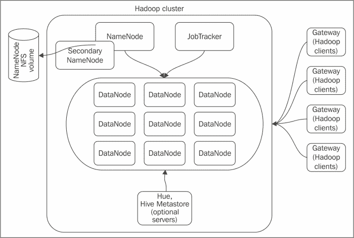

# 一、设置 Hadoop 集群——从硬件到发行版

**Hadoop** 是一个免费开放的开源分布式存储和计算平台。它的创建是为了允许使用商品硬件集群存储和处理大量数据。在过去的几年里，Hadoop 成为了大数据项目事实上的标准。在本章中，我们将涵盖以下主题:

*   选择 Hadoop 集群硬件
*   Hadoop 发行版
*   为 Hadoop 集群选择操作系统

本章将概述为集群选择和配置硬件时的 Hadoop 理念。我们还将回顾不同的 Hadoop 发行版，其数量每年都在增长。本章将解释这些分布之间的异同。

对您来说，作为 Hadoop 管理员或架构师，集群实施的实际部分始于决定使用什么样的硬件以及需要多少硬件，但在您下硬件订单、卷起袖子并开始设置之前，需要问一些基本问题。这些问题包括与集群设计相关的问题，例如集群需要存储多少数据，数据增长率的预测是什么，主要的数据访问模式是什么，集群将主要用于预定义的计划任务，还是用于探索性数据分析的多租户环境？Hadoop 的架构和数据访问模型允许极大的灵活性。它可以适应不同类型的工作负载，例如批量处理海量数据或支持像 Impala 这样的项目的实时分析。

与此同时，一些集群更适合特定类型的工作，因此在到达硬件规范阶段时，考虑集群设计和目的的想法是很重要的。在处理数百台服务器的集群时，关于硬件和总体布局的初步决策将对集群的性能、稳定性和相关成本产生重大影响。

# 选择 Hadoop 集群硬件

Hadoop 是一个可扩展的集群非共享系统，用于大规模并行数据处理。Hadoop 的整个概念是，单个节点在整个集群的可靠性和性能中不起重要作用。这种设计假设导致选择能够在单个节点上高效处理少量(相对于总数据大小)数据并且在硬件级别上不需要大量可靠性和冗余的硬件。您可能已经知道，有几种类型的服务器组成了 Hadoop 集群。有主节点，如**命名节点**、**次命名节点**、**作业跟踪器**和称为**数据节点**的工作节点。除了核心的 Hadoop 组件之外，部署几个辅助服务器也是一种常见的做法，例如网关、Hue 服务器和 Hive Metastore。典型的 Hadoop 集群如下图所示:

典型的 Hadoop 集群布局

这些类型的服务器在集群中扮演的角色不同，对这些节点的硬件规格和可靠性的要求也不同。我们将首先讨论数据节点的不同硬件配置，然后讨论名称节点和作业跟踪器的典型设置。

## 选择数据节点硬件

数据节点是 Hadoop 集群中的主要工作节点，它扮演两个主要角色:存储 HDFS 数据和执行 **MapReduce** 任务。数据节点是 Hadoop 的主要存储和计算资源。人们可能会认为，由于数据节点在集群中扮演着如此重要的角色，您应该为它们使用最好的硬件。这并不完全正确。Hadoop 的设计理念是，数据节点是“一次性工作人员”，服务器作为集群的一部分，速度足够快，可以完成有用的工作，但价格足够便宜，如果出现故障，可以轻松更换。大型集群中的硬件故障频率可能是核心 Hadoop 开发人员考虑的最重要因素之一。Hadoop 通过将冗余实现从集群硬件转移到集群软件本身来解决这个问题。

### 注

Hadoop 在许多层面上提供冗余。每个数据节点只存储 HDFS 文件的一些数据块，这些数据块被多次复制到不同的节点，因此在单个服务器出现故障时，数据仍然可以访问。根据您选择的配置，群集甚至可以容忍多个节点出现故障。Hadoop 超越了这一点，允许您指定哪些服务器驻留在哪些机架上，并尝试在不同的机架上存储数据副本，因此，即使整个机架停机，您的数据保持可访问的可能性也会大大增加(尽管这不是严格的保证)。这种设计意味着没有理由为 Hadoop 数据节点投资 RAID 控制器。

与其对本地磁盘使用 RAID，不如选择称为 JBOD(只是一堆磁盘)的设置。为 Hadoop 工作负载提供更好的性能，降低硬件成本。您不必担心个别磁盘故障，因为冗余是由 HDFS 提供的。

存储数据是数据节点扮演的第一个角色。第二个角色是充当数据处理节点并执行自定义的 MapReduce 代码。MapReduce 作业被分成许多独立的任务，这些任务在多个数据节点上并行执行，为了使一个作业产生逻辑一致的结果，必须完成所有子任务。

这意味着 Hadoop 不仅要在存储上提供冗余，还要在计算层提供冗余。Hadoop 通过在不同节点上重试失败的任务来实现这一点，而不会中断整个作业。它还跟踪故障率异常高或响应速度比其他节点慢的节点，最终这些节点可能会被列入黑名单并从集群中排除。

那么，典型数据节点的硬件应该是什么样的呢？理想情况下，数据节点应该是一个平衡的系统，具有合理数量的磁盘存储和处理能力。定义“平衡系统”和“合理存储量”并不像听起来那么简单。当您试图设计出一个最佳且可扩展的 Hadoop 集群时，有许多因素会起作用。最重要的考虑因素之一是总群集存储容量和群集存储密度。这些参数紧密相关。总群集存储容量的估计相对简单。它基本上回答了诸如我们可以向集群中放入多少数据之类的问题。以下是您可以用来估计集群所需容量的步骤列表:

1.  **确定数据源**:列出所有已知的数据源，并决定是否需要全部或部分初始数据导入。您应该保留总群集容量的 15-20%，甚至更多，以适应任何新的数据源或计划外的数据大小增长。
2.  **估计数据增长率**:每个确定的数据源都有一个相关的数据摄取率。例如，如果您计划每天从您的 OLTP 数据库导出数据，您可以很容易地估计这个源在一周、一月、一年等过程中将产生多少数据。您需要做一些测试导出来获得一个准确的数字。
3.  **将您估计的存储需求乘以复制因子**:到目前为止，我们已经讨论了可用存储容量。Hadoop 通过多次复制数据块并将它们放在集群中的不同节点上，实现了 HDFS 级的冗余。默认情况下，每个数据块复制三次。您可以通过增加或减少复制因子来调整此参数。将复制因子设置为`1`会完全降低集群的可靠性，因此不应使用。因此，要获得原始群集存储容量，您需要将估计值乘以复制因子。如果您估计今年需要 300 TB 的可用存储，并且计划使用`3`的复制系数，则原始容量将为 900 TB。
4.  **将 MapReduce** **临时文件和系统数据**考虑在内:MapReduce 任务产生中间数据，该数据正从地图执行阶段传递到 Reduce 阶段。这些临时数据不在 HDFS，但是您需要为临时文件分配总服务器磁盘容量的 25-30%。此外，操作系统需要单独的磁盘卷，但操作系统的存储需求通常微不足道。

确定总的可用和原始群集存储容量是确定数据节点硬件规格的第一步。为了进一步讨论，我们将在提及群集的总可用存储时指原始容量，因为从硬件角度来看，这一点很重要。另一个重要指标是存储密度，即总群集存储容量除以群集中的数据节点数。一般来说，你有两种选择:要么部署大量存储密度低的服务器，要么使用更少的存储密度更高的服务器。我们将回顾这两种选择，并概述每种选择的利弊。

## 低存储密度集群

历史上，Hadoop 集群部署在合理的低存储密度服务器上。这允许使用当时市场上可用的低容量硬盘将集群扩展到千兆字节的存储容量。虽然硬盘容量在过去几年中显著增加，但使用大型低密度群集对许多人来说仍然是一个有效的选择。成本是你想走这条路的主要原因。单个 Hadoop 节点的性能不仅取决于存储容量，还取决于内存/中央处理器和磁盘之间的平衡。在大多数情况下，在每个数据节点上都有大量存储，但没有足够的内存和 CPU 资源来处理所有数据是没有好处的。

很难给出关于 Hadoop 集群硬件的具体建议。平衡的设置将取决于集群工作负载以及分配的预算。新硬件一直在市场上出现，所以任何考虑都应该相应调整。为了说明低密度集群的硬件选择逻辑，我们将使用以下示例:

假设我们选择了一台带有 6 个硬盘插槽的服务器。如果我们选择价格合理的 2 TB 硬盘，它将为我们提供每台服务器 12 TB 的原始容量。

### 注

几乎没有理由为集群选择更快的 15000 rpm 驱动器。对于 Hadoop 集群来说，顺序读/写性能比随机访问速度更重要。在大多数情况下，7200 rpm 驱动器是首选。

对于低密度服务器，我们的主要目标是保持低成本，以便能够负担大量的机器。2×4 核心 CPU 符合这一要求，将提供合理的处理能力。每个映射或缩减任务将使用一个中央处理器内核，但是由于一些时间将花费在等待输入输出上，超额订阅中央处理器内核是可以的。有了 8 个可用内核，我们可以为每个节点配置大约 12 个映射/缩减插槽。

每项任务都需要 2 到 4 GB 的内存。对于这种类型的服务器，36 GB 的内存是一个合理的选择，但是 48 GB 是理想的选择。请注意，我们正在尝试平衡不同的组件。对于这种配置来说，大幅增加内存量没有多大用处，因为您将无法在一个节点上安排足够的任务来正确利用它。

假设您计划在集群中存储 500 TB 的数据。使用`3`的默认复制因子，这将导致 1500 TB 的原始容量。如果您使用低密度数据节点配置，您将需要 63 台服务器来满足这一要求。如果将所需容量增加一倍，您的群集中需要 100 多台服务器。管理大量服务器本身就有很多挑战。您需要考虑您的数据中心是否有足够的物理空间来容纳额外的机架。随着服务器数量的增长，额外的功耗和空调也带来了巨大的挑战。为了解决这些问题，您可以增加单个服务器的存储容量，以及调整其他硬件规格。

## 高存储密度集群

许多公司正在寻求构建更小的 Hadoop 集群，但每台服务器的存储和计算能力更强。除了解决上面提到的问题，这样的集群可以更好地适应大容量存储不是优先考虑的工作负载。这样的工作负载是计算密集型的，包括机器学习、探索性分析和其他问题。

为高密度集群选择和平衡硬件组件背后的逻辑与低密度集群相同。作为这种配置的一个示例，我们将选择具有 16 x 2 TB 硬盘或 24 x 1 TB 硬盘的服务器。每台服务器拥有更多容量较低的磁盘更好，因为这将提供更好的 IO 吞吐量和更好的容错能力。为了提高单台机器的计算能力，我们将使用 16 个中央处理器内核和 96 GB 内存。

## 名称节点和作业跟踪器硬件配置

Hadoop 实现了一个集中式协调模型，其中有一个节点(或一组节点)，其角色是协调组成集群的服务器之间的任务。负责 HDFS 协调的服务器称为名称节点，负责 MapReduce 作业调度的服务器称为作业跟踪器。实际上，NameNode 和 JobTracker 只是独立的 Hadoop 进程，但由于它们在几乎所有情况下的关键作用，这些服务都在专用机器上运行。

### 命名节点硬件

**名称节点**对于 HDFS 的可用性至关重要。它存储所有文件系统元数据:哪些块包含哪些文件，这些块可以在哪些数据节点上找到，有多少空闲块可用，以及哪些服务器可以托管它们。没有 NameNode，HDFS 的数据几乎完全没用。数据实际上仍然存在，但是没有名称节点，您将无法从数据块重建文件，也无法上传新数据。很长一段时间以来，NameNode 都是单点故障，这对于一个宣扬大多数组件和进程具有高容错性和冗余性的系统来说并不理想。在 Apache Hadoop 2.0.0 中引入名称节点高可用性设置解决了这个问题，但是名称节点的硬件要求仍然与上一节中概述的数据节点有很大不同。让我们从名称节点的内存估计开始。名称节点必须在内存中存储所有 HDFS 元数据信息，包括文件、目录结构和块分配。这听起来像是对内存的浪费，但是 NameNode 必须保证能够快速访问成百上千台机器上的文件，所以使用硬盘来访问这些信息太慢了。根据 Apache Hadoop 文档，每个 HDFS 块将占用名称节点上大约 250 字节的内存，另外每个文件和目录还需要 250 字节的内存。假设您有 5000 个文件，每个文件平均 20 GB。如果您使用 64 MB 的默认 HDFS 块文件大小和的复制因子`3`，您的名称节点将需要保存大约 5000 万个块的信息，这将需要 5000 万 x 250 字节加上等于 1.5 GB 内存的文件系统开销。这并没有您想象的那么多，但是在大多数情况下，Hadoop 集群总共有更多的文件，并且由于每个文件至少由一个块组成，因此 NameNode 上的内存使用量会高得多。名称节点上的内存超过集群目前的需求不会带来任何损失，因此过度配置是可以的。内存为 64-96 GB 的系统是命名节点服务器的好选择。

为了保证文件系统元数据的持久性，NameNode 还必须在磁盘上保留其内存结构的副本。为此，NameNode 维护一个名为`editlog`的文件，该文件捕获 HDFS 发生的所有更改，例如新文件和目录的创建以及复制因子的更改。这与大多数关系数据库使用的重做日志文件非常相似。除了`editlog`之外，名称节点在`fsimage`文件中维护当前 HDFS 元数据状态的完整快照。在重启或服务器崩溃的情况下，名称节点将使用最新的`fsimage`并应用`editlog`文件中需要应用的所有更改，以恢复文件系统的有效时间点状态。

与传统的数据库系统不同，名称节点将定期将从`editlog`到`fsimage`的更改应用到一个名为辅助名称节点的独立服务器的任务。这样做是为了控制`editlog`文件的大小，因为日志文件中不再需要已经应用于`fsimage`的更改，同时也是为了最大限度地减少恢复时间。由于这些文件是 NameNode 保存在内存中的镜像数据结构，因此对它们的磁盘空间要求通常很低。`fsimage`不会增长到超过您为名称节点分配的内存量，`editlog`将在默认情况下达到 64 MB 后旋转。这意味着您可以将名称节点的磁盘空间要求保持在 500 GB 范围内。在命名节点上使用 RAID 很有意义，因为它可以保护关键数据免受单个磁盘崩溃的影响。除了服务来自 HDFS 客户端的文件系统请求，名称节点还必须处理来自集群中所有数据节点的心跳消息。这种类型的工作负载需要大量的 CPU 资源，因此根据计划的集群大小，为名称节点调配 8-16 个 CPU 内核是一个好主意。

在本书中，我们将重点设置名称节点 HA，这将要求主名称节点和备用名称节点在硬件方面相同。关于如何实现名称节点高可用性的更多细节将在[第 2 章](2.html "Chapter 2. Installing and Configuring Hadoop")、*安装和配置 Hadoop* 中提供。

### 作业跟踪器硬件

除了名称节点和辅助名称节点，在 Hadoop 集群中还有另一个主服务器，称为**作业跟踪器**。从概念上讲，它在 MapReduce 框架中扮演着与 HDFS 的 NameNode 相似的角色。作业跟踪器负责向任务跟踪器提交用户作业，任务跟踪器是运行在每个数据节点上的服务。任务跟踪器定期向作业跟踪器发送心跳消息，报告正在运行的作业的当前状态、可用的映射/缩减插槽等。此外，作业跟踪器在内存中保存最后执行的作业的历史记录(数量可配置)，并提供对与作业相关联的特定于 Hadoop 或用户定义的计数器的访问。虽然内存可用性对作业跟踪器至关重要，但它的内存占用通常小于名称节点。中型和大型集群拥有 24-48 GB 内存是一个合理的估计。如果您的集群是一个拥有数千用户的多租户环境，您可以查看此数字。默认情况下，JobTracker 不会将任何状态信息保存到磁盘，并且仅出于日志记录的目的使用永久存储。这意味着此服务的总磁盘需求极低。就像名称节点一样，作业跟踪器需要能够处理来自任务跟踪器的大量心跳信息，接受和调度传入的用户作业，并应用作业调度算法，以便能够最有效地利用集群。这些都是高 CPU 密集型任务，因此请确保您投资于快速多核处理器，类似于您将为 NameNode 购买的处理器。

所有三种类型的主节点对于 Hadoop 集群的可用性都至关重要。如果您失去了名称节点服务器，您将无法访问 HDFS 数据。辅助名称节点的问题不会导致立即停机，但会延迟文件系统检查点进程。同样，作业跟踪器的崩溃将导致所有正在运行的 MapReduce 作业中止，并且没有新作业能够运行。所有这些结果都要求对主机的硬件选择采取与我们讨论的数据节点不同的方法。将 RAID 阵列用于关键数据卷、冗余网络和电源以及可能更高级别的企业级硬件组件是首选。

## 网关等辅助服务

网关服务器是客户端对 Hadoop 集群的访问点。在 HDFS 与数据交互需要客户端程序和集群内的所有节点之间的连接。从网络设计和安全角度来看，这并不总是切实可行的。网关通常部署在主群集子网之外，用于数据导入和其他用户程序。额外的基础架构组件和不同的外壳可以部署在独立的服务器上，也可以与其他服务结合使用。硬件对这些可选服务的要求显然比集群节点的要求低得多，通常您可以在虚拟机上部署网关。对于网关节点来说，4-8 个 CPU 内核和 16-24 GB 内存是合理的配置。

## 网络注意事项

在 Hadoop 集群中，网络是与 CPU、磁盘或 RAM 同等重要的组件。HDFS 依靠网络通信来更新当前文件系统状态的名称节点，以及接收和发送数据块到客户端。MapReduce 作业还使用网络来发送状态消息，但是当必须从当前 TaskTracker 不本地的数据节点读取文件块时，它还会使用带宽，并将中间数据从 mappers 发送到 Reduce。简而言之，Hadoop 集群中存在大量网络活动。到目前为止，网络硬件主要有两种选择。1gb 网络很便宜，但吞吐量相当有限，而 10gb 网络会显著增加大型 Hadoop 部署的成本。与集群的其他组件一样，网络选择将取决于预期的集群布局。

对于更大的集群，我们提出了通常规格更低的机器，每个节点具有更少的磁盘、内存和中央处理器，假设大量这样的服务器将提供足够的容量。对于较小的集群，我们选择了高端服务器。在选择应用哪种网络架构时，我们可以使用相同的论点。

对于具有多个功能较弱的节点的集群，安装 10 GbE 没有什么意义，原因有二。首先，这将显著增加构建群集的总成本，并且您可能无法利用所有可用的网络容量。例如，每个数据节点有六个磁盘，您应该能够实现大约 420 兆字节/秒的本地写入吞吐量，这小于网络带宽。这意味着集群瓶颈将从网络转移到磁盘的 IO 容量。另一方面，拥有大量存储空间的小型快速服务器集群很可能会被 1gb 网络阻塞，服务器的大部分可用资源将被浪费。由于此类集群通常较小，10 GbE 网络硬件对预算的影响不会像更大的设置那样大。

### 类型

大多数现代服务器都带有几个网络控制器。您可以使用绑定来提高网络吞吐量。

## Hadoop 硬件总结

让我们总结一下不同类型集群可能需要的 Hadoop 硬件配置。

低存储密度集群的数据节点:

<colgroup><col style="text-align: left"> <col style="text-align: left"></colgroup> 
| 

成分

 | 

规格

 |
| --- | --- |
| 储存；储备 | 每台服务器 6-8 个 2 TB 硬盘，JBOD 设置，无 RAID |
| 中央处理器 | 8 个彩色 CPU |
| 随机存取存储 | 每个节点 32-48 GB |
| 网络 | 1gb 接口，可以绑定多个网卡以获得更高的吞吐量 |

高存储密度集群的数据节点

<colgroup><col style="text-align: left"> <col style="text-align: left"></colgroup> 
| 

成分

 | 

规格

 |
| --- | --- |
| 储存；储备 | 每台服务器 16-24 个 1 TB 硬盘，JBOD 设置，无 RAID |
| 中央处理器 | 16 个彩色 CPU |
| 随机存取存储 | 每个节点 64-96 GB |
| 网络 | 10 GbE 网络接口 |

名称节点和备用名称节点

<colgroup><col style="text-align: left"> <col style="text-align: left"></colgroup> 
| 

成分

 | 

规格

 |
| --- | --- |
| 储存；储备 | 低磁盘空间要求:500 GB 在大多数情况下应该足够了。`fsimage`和`editlog`的 RAID 10 或 RAID 5。放置这些文件副本的网络连接存储 |
| 中央处理器 | 8-16 个 CPU 内核，具体取决于集群大小 |
| 随机存取存储 | 64-96 GB |
| 网络 | 1 千兆以太网或 10 千兆以太网接口，可以绑定多个网卡以获得更高的吞吐量 |

工作跟踪者

<colgroup><col style="text-align: left"> <col style="text-align: left"></colgroup> 
| 

成分

 | 

规格

 |
| --- | --- |
| 储存；储备 | 低磁盘空间要求:对于日志文件和作业状态信息，500 GB 在大多数情况下应该足够了 |
| 中央处理器 | 8-16 个 CPU 内核，具体取决于集群大小 |
| 随机存取存储 | 64-96 GB。 |
| 网络 | 1gb 或 10gb 接口，多个网卡的绑定可以提高吞吐量 |

# Hadoop 发行版

Hadoop 有许多不同的风格。有许多不同的版本和许多不同的发行版可以从许多公司获得。今天在这个领域有几个关键人物，我们将讨论他们提供了哪些选择。

## Hadoop 版本

至少可以说，Hadoop 发布版本控制系统令人困惑。有几个分支有不同的稳定版本，了解每个分支提供(或排除)哪些功能非常重要。到目前为止，这些是以下可用的 Hadoop 版本:0.23、1.0 和 2.0。令人惊讶的是，较高版本并不总是包含较低版本的所有功能。例如，0.23 包括名称节点高可用性和名称节点联盟，但放弃了对传统地图简化框架(MRv1)的支持，转而支持新的Yarn框架(MRv2)。

MRv2 在 API 级别上与 MRv1 兼容，但是守护进程的设置和配置以及概念是不同的。1.0 版本仍然包含 MRv1，但缺少 NameNode HA 和联合功能，许多人认为这些功能对于生产使用至关重要。2.0 版本实际上是基于 0.23 的，具有相同的功能集，但将用于未来的开发和发布。Hadoop 发布的版本似乎没有遵循简单的逻辑的原因之一是，Hadoop 仍然是一种相对较新的技术，一些用户非常希望的许多功能可能会引入不稳定性，有时它们需要重大的代码更改和方法更改，例如在Yarn的情况下。这导致许多不同的代码分支，具有不同的稳定发布版本，并给最终用户带来许多困惑。由于本书的目的是指导您规划和实施生产 Hadoop 集群，因此我们将重点关注稳定的 Hadoop 版本，这些版本提供了经验证的解决方案，如 MRv1，但也将包括 NameNode 的重要可用性功能。如您所见，这将立即缩小 Hadoop 版本的选择范围。

## 选择 Hadoop 分布

Apache Hadoop 不是唯一可用的发行版。还有其他几家公司维护自己的项目分支，既有免费的，也有专有的。您可能已经开始明白为什么这样做是有意义的:简化 Hadoop 的发布过程，并结合几个 Hadoop 分支的不同特性，使最终用户更容易实现集群。Hadoop 最受欢迎的非 Apache 发行版之一是 **Cloudera Hadoop 发行版**或 **CDH** 。

## Cloudera Hadoop 发行版

Cloudera 是为 Hadoop 提供商业支持、专业服务和高级工具的公司。他们的 CDH 发行版是免费的，并且在相同的 Apache 2.0 许可下是开源的。CDH 吸引最终用户的地方在于它的代码分支更少，版本号一致，关键的错误修复被回溯到旧版本。目前，CDH 最新的主要版本是 CDH4，它结合了 Apache 2.0 和 1.0 版本的功能。它包括名称节点高可用性和联盟，支持 MRv1 和 MRv2，目前没有一个 Apache 版本支持。CDH 提供的另一个有价值的特性是集成不同的 Hadoop 生态系统项目。HDFS 和 MapReduce 是 Hadoop 的核心组件，但随着时间的推移，许多新项目都建立在这些组件之上。这些项目使 Hadoop 更加用户友好，加快开发周期，轻松构建多层 MapReduce 作业，等等。

在 CDH 获得大量关注的项目之一是 Impala，它允许在 Hadoop 上运行实时查询，完全绕过 MapReduce 层，直接从 HDFS 访问数据。拥有几十个生态系统组件，每个组件都有自己的兼容性要求和各种 Apache Hadoop 分支，并不能使集成成为一项轻松的任务。CDH 通过提供核心 Hadoop 和大多数流行的生态系统项目来为您解决这个问题，这些项目在一个发行版中相互兼容并经过测试。这对用户来说是一个很大的优势，它使 CDH 成为目前最受欢迎的 Hadoop 发行版(根据谷歌趋势)。除了 CDH，Cloudera 还分发 Cloudera Manager—一种基于网络的管理工具，用于调配、配置和监控您的 Hadoop 集群。Cloudera Manager 有免费和付费企业版。

## Hortonworks Hadoop 发行版

另一个流行的 Hadoop 发行版是霍顿工程公司的霍顿工程数据平台(HDP)。与 Cloudera 类似，Hortonworks 提供了核心和生态系统 Hadoop 项目的预打包分发，以及对其的商业支持和服务。截至目前，HDP 1.2 和 2.0 的最新稳定版本处于 Alpha 阶段；两者都相应地基于 Apache Hadoop 1.0 和 2.0。HDP 1.2 提供了 CDH 或Apache发行版中没有的几个功能。Hortonworks 在 Hadoop 1.0 上实现了 NameNode HA，这不是通过从 Apache Hadoop 2.0 中向后移植 JournalNodes 和基于 Quorum 的存储，而是通过基于 Linux HA 解决方案实现冷集群故障转移。HDP 还包括 HCatalog——一种为像 Pig 和 Hive 这样的项目提供集成点的服务。Hortonworks 押注于将 Hadoop 与传统商业智能工具相集成，这是一个现有和潜在 Hadoop 用户非常感兴趣的领域。HDP 包括一个用于 Hive 的 ODBC 驱动程序，据称它与大多数现有的 BI 工具兼容。另一个独特的 HDP 特色是其在视窗平台上的可用性。将 Hadoop 引入视窗世界将对平台的采用率产生巨大影响，并可能使 HDP 成为该操作系统的领先发行版，但不幸的是，这仍处于 alpha 版本，目前无法推荐用于生产。说到集群管理和监控，HDP 包括 Apache Ambari，这是一个基于网络的工具，类似于 Cloudera Manager，但它是 100%免费和开源的，不区分免费和企业版本。

## MapR

虽然 Cloudera 和 Hortonworks 提供了最受欢迎的 Hadoop 发行版，但它们并不是唯一使用 Hadoop 作为产品基础的公司。这里应该提到几个项目。MapR 是一家提供基于 Hadoop 的平台的公司。他们的产品有几个不同的版本:M3 是免费版，功能有限，M5 和 M7 是企业级商业版。MapR 采用了与 Cloudera 或 Hortonworks 不同的方法。他们的软件不是免费的，但是有一些吸引企业用户的功能。MapR 平台与 Apache Hadoop 的主要区别在于，使用了一个名为 MapR-FS 的不同专有文件系统来代替 HDFS。MapR-FS 是用 C++实现的，比基于 Java 的 HDFS 提供了更低的延迟和更高的并发访问。它在 API 级别上与 Hadoop 兼容，但它是一个完全不同的实现。其他 MapR-FS 功能包括将 Hadoop 集群装载为 NFS 卷的能力、集群范围的快照和集群镜像。显然，所有这些特性都依赖于 MapR-FS 实现。

如您所见，现代 Hadoop 环境远非一帆风顺。有很多选择。当您考虑生产集群的需求时，很容易缩小可用选项的列表。生产 Hadoop 版本需要稳定且经过良好测试。它需要包括重要的组件，比如 NameNode HA 和经过验证的 MRv1 框架。对于您来说，作为一名 Hadoop 管理员，能够在多个节点上轻松安装 Hadoop 非常重要，而无需精心挑选所需组件和担心兼容性。这些要求会很快让你注意到像 CDH 或 HDP 这样的发行版。这本书的其余部分将集中在 CDH 发行，因为它是目前最受欢迎的生产装置的选择。CDH 还提供了丰富的功能集和良好的稳定性。值得一提的是，Hadoop 2 在本书进行期间获得了第一个 GA 版本。Hadoop 2 引入了许多新功能，如名称节点高可用性，这些功能以前只在 CDH 提供。

# 为 Hadoop 集群选择操作系统

为您未来的 Hadoop 集群选择操作系统是一项相对简单的任务。除了少数例外，Hadoop 核心及其生态系统组件都是用 Java 编写的。虽然 Java 代码本身是跨平台的，但目前 Hadoop 只在类似 Linux 的系统上运行。其原因是，太多的设计决策都是在考虑 Linux 的情况下做出的，这使得围绕核心 Hadoop 组件(如`start/stop`脚本和权限模型)的代码依赖于 Linux 环境。

说到 Linux，Hadoop 对具体的实现相当漠不关心，并且在这种操作系统的不同变种上运行良好:红帽、CentOS、Debian、Ubuntu、Suse 和 Fedora。所有这些发行版都没有运行 Hadoop 的具体要求。一般来说，如果您确保所有依赖关系都得到正确解决，并且所有外壳支持脚本都在工作，那么没有什么可以阻止 Hadoop 在任何其他 POSIX 风格的操作系统上成功工作，例如 Solaris 或 BSD。尽管如此，Hadoop 的大多数生产安装都是在 Linux 上运行的，这是我们在进一步讨论中将重点关注的操作系统。具体来说，本书中的例子将集中在 CentOS 上，因为它是生产系统的流行选择之一，还有它的孪生兄弟红帽。

Apache Hadoop 提供了源代码二进制文件，以及 **RPM** 和 **DEB** 包，用于稳定发布。目前，这是一个 1.0 分支。从源代码构建 Hadoop 虽然仍然是一种选择，但不建议大多数用户使用，因为它需要有组装大型基于 Java 的项目的经验和仔细的依赖项解析。Cloudera 和 Hortonworks 发行版都提供了一种在服务器上设置存储库并从中安装所有必需包的简单方法。

### 类型

没有严格要求在所有 Hadoop 节点上运行相同的操作系统，但常识表明，节点配置的偏差越小，管理和管理就越容易。

# 总结

构建生产 Hadoop 集群是一项复杂的任务，涉及许多步骤。规划集群时经常被忽略的一个步骤是概述未来集群将处理什么样的工作负载。正如您在本章中所看到的，了解您正在构建的集群类型对于正确调整规模和选择正确的硬件配置非常重要。Hadoop 最初是为商品硬件设计的，但现在它正被那些用例不同于雅虎这样的网络巨头的公司所采用！和脸书。这些公司有不同的目标和资源，应该相应地规划他们的 Hadoop 集群。构建具有更强大节点的较小集群来节省数据中心的空间并控制功耗并不罕见。

Hadoop 一直在不断发展，不断添加新功能，新的重要生态系统项目不断涌现。通常，这些变化会影响核心 Hadoop 组件，新版本可能并不总是与旧版本兼容。有几种 Hadoop 发行版可供最终用户选择，它们都提供了组件之间的良好集成，甚至还提供了一些附加功能。选择最新和功能最丰富的 Hadoop 版本通常很有诱惑力，但从可靠性的角度来看，最好选择经历了一些生产老化时间并且足够稳定的版本。这将使你免于不愉快的惊喜。在下一章中，我们将深入了解关于安装和配置核心 Hadoop 组件的细节。卷起你的袖子，准备弄脏你的手！