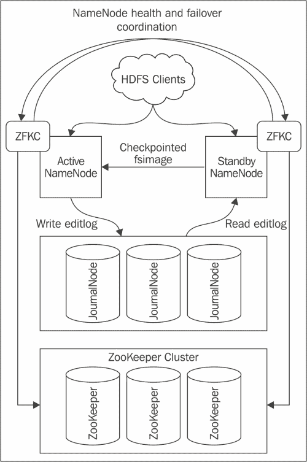

# 第二章。安装和配置 Hadoop

在您决定了集群布局和规模之后，是时候安装 Hadoop 并让集群开始运行了。我们将引导您完成三个核心 Hadoop 组件的安装和配置步骤:名称节点、数据节点和作业跟踪器。我们还将回顾配置名称节点高可用性的不同选项，以及快速评估集群运行状况和性能的方法。到本章结束时，您应该已经启动并运行了您的 Hadoop 集群。我们将保持集群的结构类似于[第 1 章](1.html "Chapter 1. Setting Up Hadoop Cluster – from Hardware to Distribution")、*中概述的设置 Hadoop 集群-从硬件到分发*。

# 为 Hadoop 集群配置操作系统

如前所述， Hadoop 几乎可以在任何现代风格的 Linux 上运行。本节和后续章节中的说明将集中在 CentOS 6.x 上，CentOS 和红帽是与生产相关的 Hadoop 安装中最受欢迎的选择。对于 Debian 来说，采用这些指令应该不会太难，因为所有与配置 Hadoop 组件直接相关的东西都将保持不变，并且您应该能够轻松地用包管理器替换您最喜欢的发行版。

## 选择和设置文件系统

现代 Linux 发行版支持不同的文件系统:EXT3、EXT4、 XFS、BTRFS 等等。这些文件系统在某些工作负载上的性能具有稍微不同的特点。

如果您更喜欢稳定性而不是性能和高级功能，您可能想使用 EXT3，它在一些最大的 Hadoop 集群上经过了战斗测试。完整的名单可以在[http://wiki.apache.org/hadoop/DiskSetup](http://wiki.apache.org/hadoop/DiskSetup)看到。我们将使用 EXT4 进行我们的集群设置，因为它在大文件上提供了更好的性能，这使得它成为 Hadoop 的一个很好的候选。

要使用 EXT4 文件系统格式化卷，请在 shell 中以 root 用户身份运行以下命令:

```sh
# mkfs –t ext4 –m 0 –O extent,sparse_super,flex_bg /dev/sdb1

```

在本例中，驱动器 b 上的分区 1 将被格式化。format 命令中有几个选项需要解释。

*   `-m 0`:该选项将为超级用户预留的空间从默认值 5%减少到的 0%。这可以在大型文件系统上节省大量磁盘空间。如果每台服务器有 16 TB，您将节省大约 800 GB。
*   `-O extent,sparse_super,flex_bg` : 此选项将启用基于范围的分配，这将提高大型顺序 IO 请求的性能。 `sparse_super`选项是另一个节省磁盘空间的选项。您可以通过分配更少的超级块备份副本来节省大型文件系统的空间。`flex_bg`选项强制文件系统将元数据块打包在一起，提供了一些性能改进。

挂载文件系统时，您需要了解几个重要的选项。那就是`noatime`和`noadirtime`。默认情况下，文件系统会通过更新元数据时间戳字段来跟踪所有操作，包括读取文件或访问目录。这可能会给繁忙的系统带来巨大的开销，应该禁用。以下是如何在`/etc/fstab`中禁用此功能的示例:

```sh
/dev/sda1 /disk1 ext4 noatime,noadirtime 1 2
/dev/sdb1 /disk2 ext4 noatime,noadirtime 1 2

```

### 注

请记住，这些磁盘配置选项仅适用于数据节点数据磁盘。建议为命名节点卷配置 RAID。RAID 配置特定于您的控制器制造商。

## 设置 Java 开发工具包

由于 Hadoop 是用 Java 编写的，您需要确保在所有 Hadoop 节点上都安装了正确版本的 JDK。确保 JDK 的版本和发行版在所有节点上都是相同的，这一点至关重要。目前，唯一官方支持的 JVM 发行版是 Oracle JVM。有报道称，Hadoop 可以在 OpenJDK 上构建并运行良好，但我们将坚持使用甲骨文 JDK。在写这本书的时候，Hadoop 被测试在 Java Version 6 上工作，而目前的 Oracle Java 版本是 7，Java 6 实际上在 2013 年 2 月就到了生命的尽头。你可以看到 Hadoop 在 http://wiki.apache.org/hadoop/HadoopJavaVersions T4 测试过的所有 Java 版本的列表。CentOS 的存储库中不包含 Oracle JDK，所以需要单独下载安装。从[http://www . Oracle . com/tech network/Java/javase/downloads/JDK 6 downloads-1902814 . html](http://www.oracle.com/technetwork/java/javase/downloads/jdk6downloads-1902814.html)(或谷歌`Oracle Java 6 download`如果链接发生变化)。选择最新的 6.x 版本是可以的，因为经常会发布新的更新和安全补丁。确保进行rpm 安装。我们将使用 Cloudera 的发行版，包括 Apache Hadoop ( **CDH** )包，在更多依赖 Oracle Java rpms 的部分安装 Hadoop。以下是如何安装 64 位 Oracle Java 1 . 6 . 0 _ 45 版:

```sh
# chmod 755 jdk-6u45-linux-x64-rpm.bin
# ./jdk-6u45-linux-x64-rpm.bin

```

确保在所有 Hadoop 节点上重复此步骤，包括网关服务器。

## 其他操作系统设置

为了确保 Hadoop 集群的正常运行，您需要更改其他几个操作系统设置。首先，您需要确保主机名/IP 解析在整个集群中正常工作。当 Hadoop 主节点(如名称节点或作业跟踪器)第一次从新的数据节点接收心跳消息时，它们会记录其 IP 地址，并将其用于进一步的通信。因此，为集群中的所有节点配置正确的主机名，并确保它们使用`/etc/hosts`文件解析为正确的 IP 地址是非常重要的。要确保主机报告正确的 IP 地址，请使用`ping`命令并检查返回的 IP 地址。以下是`/etc/hosts`的一个例子:

```sh
127.0.0.1   localhost.localdomain localhost
::1         localhost.localdomain localhost
192.168.0.100 nn1.hadoop.test.com nn1
192.168.0.101 sn1.hadoop.test.com sn1
192.168.0.102 jt1.hadoop.test.com jt1
192.168.0.40  dn1.hadoop.test.com dn1
192.168.0.41  dn2.hadoop.test.com dn2

```

### 类型

给集群中的节点起一个有意义的名字是一个很好的做法，这样名字就反映了主机所扮演的角色。这种方法可以很容易地用脚本生成主机/IP 列表，并在所有服务器上传播。

## 建立 CDH 存储库

安装 Hadoop 的方法有很多，具体要看你选择哪个发行版。即使在一个配送中心内，您也可以选择不同的路线。 CDH 提供了在集群上安装 Hadoop 软件包的各种辅助模式:您可以使用 Cloudera Manager web 界面来执行集群中节点的自动发现，并为您安装和预配置合适的软件包，或者您可以设置 CDH 存储库并手动安装组件。在本书中，我们将继续手动安装，因为这将有助于更好地理解 Hadoop 机制以及不同组件之间的交互方式。我们仍将使用 **百胜**包管理实用程序来处理在正确位置复制文件、设置服务等工作。这将允许我们更加关注组件的配置。

您需要做的第一件事，就是添加一个新的 yum 存储库。您需要的存储库取决于您的操作系统版本，完整列表可在[http://www . cloudera . com/content/cloudera-content/cloudera-docs/CDH 4/latest/CDH 4-安装指南/cdh4ig_topic_4_4.html](http://www.cloudera.com/content/cloudera-content/cloudera-docs/CDH4/latest/CDH4-Installation-Guide/cdh4ig_topic_4_4.html) 上找到。本书中的所有示例都将使用最新的可用版本，即 CentOS 6 64 位上的 CDH 4.2。请务必相应地调整说明，因为当您阅读这本书时，可能会有更新的 CDH 版本。要添加存储库，请下载此文件[http://archive . cloudera . com/CDH 4/red hat/6/x86 _ 64/CDH/cloudera-CDH 4 . repo](http://archive.cloudera.com/cdh4/redhat/6/x86_64/cdh/cloudera-cdh4.repo)并将其放入服务器上的`/etc/yum.repos.d/`:

您还需要添加一个存储库 GPG 密钥:

```sh
# rpm --import http://archive.cloudera.com/cdh4/redhat/6/x86_64/cdh/RPM-GPG-KEY-cloudera

```

完成后，您可以通过运行以下命令来检查有哪些 Hadoop 包可用:

```sh
# yum search Hadoop

```

# 设置名称节点

在本节中，我们将逐步安装和配置名称节点服务，包括高可用性(**高可用性**)设置。与许多其他在线指南和教程不同，它们将名称节点的高可用性设置视为一个高级主题，我们将从一开始就专注于设置名称节点的高可用性。其原因是名称节点在 Hadoop 设置中扮演的关键角色。基本上，名称节点是 Hadoop 集群的单点故障。没有这项服务，就无法访问 Hadoop 分布式文件系统( **HDFS** )上的文件。

有几种方法可以设置名称节点高可用性。在 CDH 4.1 之前，高可用性可以使用共享存储设置来实施。在这种情况下，主名称节点将文件系统元数据更改写入位于共享网络存储上的编辑日志中，辅助名称节点从编辑日志中轮询更改，并将其应用到自己的元数据快照副本中。此外，所有数据节点都用当前块的位置信息更新了两个名称节点，因此在主名称节点出现故障的情况下，辅助名称节点可以接管主角色。

### 注

在 CDH 版本 4 之前，辅助名称节点不执行备用功能。它唯一的作用是执行检查点操作。在高可用性实施中，备用名称节点同时执行高可用性和检查点功能。您可以将备用名称节点视为辅助名称节点+热备盘。

这种设置并不理想。它需要额外的硬件，而这些硬件又需要易于获得。在 CDH 4.1 中，发布了一个易于获得的名称节点设置的新版本，它依赖于分布式服务来同步两个数据节点，并且消除了对共享网络存储的需求。这个设置叫做**法定日志管理器**，它引入了几个新的组件。有两个命名节点:主节点和备用节点。这与前面的设置类似，但是主名称节点不是将编辑日志写入共享网络文件，而是将它们写入 **日志节点**的集群。日志节点是 CDH 4.1 中引入的一种新型守护进程。日志节点背后的思想是，主名称节点将编辑日志更改提交给一组日志节点，这些节点将它们存储在本地磁盘上。如果大多数日志节点能够将其保存在磁盘上，则写入被视为成功。这消除了共享存储需求，但仍然保证了 editlog 写入的持久性，并且没有单点故障。关于日志节点的一个很好的事情是它们的操作是轻量级的，你不需要在单独的硬件上运行它们。

通常的做法是运行三个日志节点(奇数保证适当的仲裁)。其中两个可以在与名称节点相同的服务器上运行，一个可以在作业跟踪器上运行。这不是强制要求，您可以在您选择的群集中的任何服务器上运行日志节点。对于我们的设置，我们将选择这个选项。

备用名称节点从一群日志节点中轮询一个编辑日志，并将它们应用于它所拥有的文件系统映像的副本。备用名称节点仍然执行校验和功能，并将更新后的 fsimage 文件发送回主名称节点。此外，数据节点被配置为向两个节点发送带有数据块分配信息的心跳。在主名称节点出现故障的情况下，辅助名称节点可以无缝接管 HDFS 操作。

为了使整个跨节点协调成为可能，名称节点依靠**动物园管理员**来跟踪哪个名称节点是主节点，哪个是备用节点，以防止两个节点都决定它们是主节点并开始将编辑日志写入日志节点的情况。动物园管理员是另一个阿帕奇项目，是 CDH 的一部分。它提供分布式协调服务，并且在许多不同的节点需要共享状态、锁定信息或任何其他数据信息时非常有用。你可以在[http://zookeeper.apache.org](http://zookeeper.apache.org)找到更多关于动物园管理员的信息。名称节点高可用性难题的最后一块是动物园管理员故障转移控制器。ZKFC 是一个守护程序，它在主名称节点和备用名称节点上运行，检查它们的运行状况和状态，并在需要时启动到备用名称节点的故障转移。在处理名称节点故障时，集群管理员有两种选择:

*   使用**手动故障转移** 从故障名称节点转移到备用名称节点。这是一个更简单的设置，但这意味着集群管理员必须仔细监控活动名称节点的运行状况，并在出现问题时快速启动故障转移步骤。
*   配置**自动故障转移** 选项，该选项依赖 ZKFC 监控活动名称节点的状态。如果需要，ZKFC 将启动故障转移，并使用 ZooKeeper 集群作为状态同步点。

对于我们的设置，我们将选择自动名称节点故障转移选项。

如您所见，名称节点高可用性设置中添加了许多移动部件。下面是一个图表，它将帮助您可视化所有涉及的组件及其相互关系:



名称带日志节点仲裁的节点高可用性设置图

以下各节中的所有示例都是在测试集群上执行的，其中设置并配置了以下节点:nn1.hadoop.test.com、nn2.hadoop.test.com 和 jt1.hadoop.test.com。名字应该是不言而喻:nn1 和 nn2 分别是主备 NameNodes，jt1 是 JobTracker。我将暂时省略数据节点，因为我们将在本章后面讨论它们。

### 类型

显然，大规模处理一组机器需要某种程度的普通任务自动化。在设置和配置集群时，需要不断重复的任务之一是在不同的机器上传播这些配置文件。Cloudera Manager 在配置管理方面可以提供很多帮助。您也可以使用工具，如木偶，厨师，或 Ansible。

我们将从在 nn1、nn2 和 jt1 上安装 NameNode 所需的包开始。我们在作业跟踪器服务器上安装 HDFS 包的原因是因为我们需要在那里运行一个日志节点。

### 注

除非另有说明，否则所有命令都将作为根用户执行。

您可以通过在 nn1、nn2 和 jt1 服务器上运行一个简单的 `yum`命令来实现:

```sh
# yum install hadoop-hdfs-namenode

```

这将安装几个依赖包。让我们快速看一下那些是什么。

*   **bigtop-jsvc** 和 **bigtop-utils** :这些包是针对 Apache Bigtop 项目([http://bigtop.apache.org](http://bigtop.apache.org))这个项目是为了帮助简化 Hadoop组件的开发和打包而创建的。它负责正确的环境设置，确保在不同的系统中正确检测到 JAVA_HOME，等等。一般来说，您不必担心这个问题，但需要知道它的存在，因为自 Bigtop 推出以来，一些配置文件的位置和用途已经发生了变化。
*   **hadoop** :这个包包含核心 hadoop 组件、配置文件和共享库。它将安装在所有群集节点上。
*   **hadoop-hdfs** :这个为 hdfs、NameNode、JournalNode、DataNode 提供配置文件，内置 web 服务器配置等等。
*   **zookeeper** :我们之前讨论过 ZooKeeper 在 NameNode HA 中的角色，但是它也被 HBase 柱状存储使用。

这里需要注意的一点是，随着 HDFS 软件包的设置，CDH 还将创建一个名为`hdfs`的新操作系统用户。所有守护进程都将以该用户身份执行。

## 日志节点、动物园管理员和故障转移控制器

下一步是在所有三个服务器上安装日志节点包:

```sh
# yum install hadoop-hdfs-journalnode

```

我们已经安装了 zookeeper 包作为 NameNode 依赖项的一部分，但是我们还需要安装脚本来启动/停止 ZooKeeper 服务器。在 nn1、nn2 和 jt1 上运行以下命令:

```sh
# yum install zookeeper-server

```

最后，我们需要安装故障转移控制器。这个守护进程只需要在主备命名节点上执行，所以我们在 nn1 和 nn2 上安装:

```sh
# yum install hadoop-hdfs-zkfc

```

在我们继续配置名称节点和其他组件之前，我们需要确保 ZooKeeper 集群已经启动并运行。在我们的例子中，我们在 nn1、nn2 和 jt1 上有三个 ZooKeeper 节点。动物园管理员配置文件`zoo.cfg`位于`/etc/zookeeper/conf/`，下面是我们的设置:

```sh
maxClientCnxns=50
# The number of milliseconds of each tick
tickTime=2000
# The number of ticks that the initial
# synchronization phase can take
initLimit=10
# The number of ticks that can pass between
# sending a request and getting an acknowledgement
syncLimit=5
# the directory where the snapshot is stored.
dataDir=/var/lib/zookeeper
# the port at which the clients will connect
clientPort=2181

server.1=nn1.hadoop.test.com:2888:3888
server.2=nn2.hadoop.test.com:2888:3888
server.3=jt1.hadoop.test.com:2888:3888
```

示例配置文件包含一些默认值，除非您正在进行一些高级调整，否则不需要进行任何更改。根据您的设置，您可能需要更改`dataDir`选项。需要添加到这个配置文件中的是您可以在前面的代码中看到的最后三行。这些行为 ZooKeeper 集群提供了一个配置。每个`server`字后面的数字是服务器标识，`2888`和`3888`分别是连接到动物园管理员和选举新领导的端口。我们现在不必关心这些细节，但是您需要做的一件事是仔细检查 ZooKeeper 节点上的这些端口是否打开，以及客户端端口 2181 是否可用于任何其他需要使用 ZooKeeper 的服务器，例如 HBase 节点。

配置文件更新后(别忘了在所有节点上更新！)，您需要运行以下命令，该命令将创建并初始化数据目录:

```sh
# service zookeeper-server init --myid=1

```

我们已经安装了 zookeeper 包作为 NameNode 依赖项的一部分，但是我们还需要安装脚本来启动/停止 ZooKeeper 服务器。

在 nn1、nn2 和 jt1 上运行以下命令:

```sh
# yum install zookeeper-server

```

该命令需要在 nn1、nn2 和 jt1 上执行。它还将在所有三个节点上创建一个名为`/var/lib/zookeeper/`(位置取决于`dataDir`选项)的文件。该文件包含 ZooKeeper 节点的唯一服务器标识，这是您通过`--myid`选项提供的。因此，您需要在每台服务器上提供不同的`--myid`值。这是 ZooKeeper 守护进程了解集群中谁的一种方式。

要启动 ZooKeeper 服务，在所有三个节点上执行以下命令:

```sh
# service zookeeper-server start

```

确保您验证了默认情况下 ZooKeeper 在`/var/log/zookeeper/zookeeper.log`写入的日志文件的内容。有时，即使在失败的情况下，`zookeeper-server start`命令仍然返回成功，查看服务器是否已经正确启动的唯一方法是检查日志文件。

现在，我们准备继续进行名称节点配置。

## Hadoop 配置文件

在我们深入了解名称节点守护程序配置的细节之前，需要说几句关于 Hadoop 配置文件的话。Hadoop 集群中涉及许多不同的守护程序，人们可能会期望它们都有自己的配置文件。事实上，核心 Hadoop 服务只需要使用几个配置文件。最初可能会很混乱，因为不同角色的选项在几个文件中混合在一起。

核心 Hadoop 组件有三个主要配置文件:`core-site.xml`、`hdfs-site.xml`和`mapred-site.xml`。 `core-site.xml`文件包含集群中所有服务器通用的配置选项。 `hdfs-site.xml`和`mapred-site.xml`文件分别为集群的 HDFS 和 MapReduce 组件提供配置。还有控制集群不同方面的其他配置文件，我们将很快了解这些文件。CDH 将这些配置文件放入`/etc/hadoop/conf`目录，该目录又是`alternatives`目录的符号链接。CDH 使用 Linux 替代项目来维护不同版本的配置和其他文件。我们不必担心确切的设置，因为它不会真正影响我们设置集群所需的步骤。

### 注

你可以在[http://www.linuxalt.com](http://www.linuxalt.com)了解更多关于 Linux 替代品的信息。

让我们看看我们的一个名称节点服务器 nn1 上的`/etc/hadoop/conf`中有哪些文件:

```sh
# ls –lh /etc/hadoop/conf
-rw-r--r--1 root root 1.2K May 21 05:40 core-site.xml
-rw-r--r--1 root root 1.8K Apr 22 19:36 hadoop-metrics2.properties
-rw-r--r--1 root root 2.5K Apr 22 19:36 hadoop-metrics.properties
-rw-r--r--1 root root 2.4K May 22 04:51 hdfs-site.xml
-rw-r--r--1 root root 8.6K Apr 22 19:36 log4j.properties
-rw-r--r--1 root root   10 Apr 22 19:36 slaves
-rw-r--r--1 root root 2.3K Apr 22 19:36 ssl-client.xml.example
-rw-r--r--1 root root 2.2K Apr 22 19:36 ssl-server.xml.example

```

可以看到`core-site.xml``hdfs-site.xml`到位，但是`mapred-site.xml`不见了。这是因为我们还没有在这台服务器上安装任何与 MapReduce 相关的软件包，比如 JobTracker 或 TaskTracker。

`hadoop-metrics.properties`和`hadoop-metrics2.properties`文件控制着 Hadoop 公开其内部指标的方式。这在配置集群监控时将变得重要，我们将在[第 5 章](5.html "Chapter 5. Monitoring Hadoop Cluster")、*监控 Hadoop 集群*中更详细地讨论这些文件。

`log4j.properties`配置文件用于指定 Hadoop 日志记录工具的详细信息。它非常灵活，允许您指定保留和归档选项、日志详细级别，甚至日志格式。Hadoop 附带了一套很好的默认值，因此我们在此不会讨论所有可用的选项，但是如果默认值不符合您的需求，请随意浏览 Log4j 和 Hadoop 文档。

`slaves`文件是可选的，默认为空。您可以用数据节点列表填充它。该列表将由脚本使用，例如`start-all.sh`，它将启动集群中的所有守护程序。在 CDH，不建议使用这种启动服务的方法，而应该使用服务命令。

示例文件`ssl-client.xml.example`和`ssl-server.xml.example`是示例配置文件，可用于为 MapReduce 设置加密混洗阶段。

除了`/etc/hadoop/conf`目录，还有一个位置需要注意。随着 Bigtop 项目的引入，一些设置被移动到`/etc/default`目录中的一组 shell 脚本中。这些脚本设置了不同服务使用的一些环境变量。以下是默认`hadoop-hdfs-namenode`脚本的示例(为了节省空间，去掉了标题):

```sh
export HADOOP_PID_DIR=/var/run/hadoop-hdfs
export HADOOP_LOG_DIR=/var/log/hadoop-hdfs
export HADOOP_NAMENODE_USER=hdfs
export HADOOP_SECONDARYNAMENODE_USER=hdfs
export HADOOP_DATANODE_USER=hdfs
export HADOOP_IDENT_STRING=hdfs
export HADOOP_NAMENODE_OPTS="-Xmx10g"
# export HADOOP_SECURE_DN_USER=hdfs
# export HADOOP_SECURE_DN_PID_DIR=/var/run/hadoop-hdfs
# export HADOOP_SECURE_DN_LOG_DIR=/var/log/hadoop-hdfsewew

```

如您所见，该文件指定了 PID 和日志文件的位置、将用于运行名称节点守护程序的操作系统用户以及其他选项。在大多数情况下，当您实现 CDH 软件包安装时，默认路径就足够了。不属于默认值的一个变量是`HADOOP_NAMENODE_OPTS`。此变量指定将用于启动名称节点守护程序的 JVM 选项列表。在这种情况下，NameNode JVM 将以 10 GB 的最大堆大小启动。您需要根据对您计划在 HDFS 存储的文件/数据块数量的估计来调整您的配置。有关名称节点内存要求的详细信息，请参考[第 1 章](1.html "Chapter 1. Setting Up Hadoop Cluster – from Hardware to Distribution")、*设置 Hadoop 集群-从硬件到分发*。

## 名称节点高可用性配置

我们将通过向 `core-site.xml`文件添加几个选项来开始配置名称节点高可用性设置。以下是该特定步骤的文件结构。如果您不熟悉的话，它会让您了解 XML 结构。标题注释被剥离出来:

```sh
<?xml version="1.0"?>
<?xml-stylesheet type="text/xsl" href="configuration.xsl"?>
<configuration>
<property>
    <name>fs.default.name</name>
    <value>hdfs://sample-cluster/</value>
</property>
<property>
    <name>ha.zookeeper.quorum</name>
    <value>nn1.hadoop.test.com:2181,nn2.hadoop.test.com:2181,
       jt1.hadoop.test.com:2181
    </value>
</property>
</configuration>
```

配置文件格式几乎是不言自明的；变量被`<property>`标记包围，每个变量都有一个名称和值。

现阶段我们只需要增加两个变量。`fs.default.name`是 NameNode 集群的逻辑名称。值`hdfs://sample-cluster/`特定于高可用性设置。这是名称节点群集的逻辑名称。我们将在`hdfs-site.xml`文件中定义组成它的服务器。在非高可用性设置中，这个变量被分配了一个主机和一个名称节点端口，因为集群中只有一个名称节点。

`ha.zookeeper.quorum` 变量指定了动物园管理员服务器的位置和端口。ZooKeeper 集群可以被其他服务使用，比如 HBase，这就是为什么在`core-site.xml`中定义它的原因。

下一步是配置`hdfs-site.xml`文件，并在那里添加所有 HDFS 特有的参数。我将省略`<property>`标签，仅包含`<name>`和`<value>`，以使列表不那么冗长。

```sh
<name>dfs.name.dir</name>
<value>/dfs/nn/</value>
```

名称节点将使用`dfs.name.dir`变量指定的位置来存储 HDFS 元数据的持久快照。这是 fsimage 文件的存储位置。如前所述，该目录所在的卷需要由 RAID 支持。丢失此卷意味着名称节点完全丢失。`/dfs/nn`路径就是一个例子，但是你可以自由选择你自己的。您实际上可以用`dfs.name.dir`值指定几个路径，并用逗号分隔。名称节点将镜像每个指定目录中的元数据文件。如果您有可用的共享网络存储，您可以将其用作 HDFS 元数据的目标之一。这将提供额外的异地备份。

```sh
<name>dfs.nameservices</name>
<value>sample-cluster</value>
```

`dfs.nameservices`变量指定了 NameNode 集群的逻辑名称，应该用对你有意义的东西来代替，比如`prod-cluster`或者`stage-cluster`。`dfs.nameservices`的值必须与`core-site.xml`文件中的`fs.default.name`的值相匹配。

```sh
<name>dfs.ha.namenodes.sample-cluster</name>
<value>nn1,nn2</value>
```

在这里，我们指定了组成高可用性集群设置的名称节点。这些是逻辑名称，不是真实的服务器主机名或 IP。这些逻辑名称将在其他配置变量中引用。

```sh
<name>dfs.namenode.rpc-address.sample-cluster.nn1</name>
<value>nn1.hadoop.test.com:8020</value>
<name>dfs.namenode.rpc-address.sample-cluster.nn2</name>
<value>nn2.hadoop.test.com:8020</value>
```

这对变量提供了从逻辑名称(如 nn1 和 nn2)到真实主机和端口值的映射。默认情况下，名称节点守护程序使用端口 8020 与客户端和彼此通信。确保此端口对群集节点开放。

```sh
<name>dfs.namenode.http-address.sample-cluster.nn1</name>
<value>nn1.hadoop.test.com:50070</value>

<name>dfs.namenode.http-address.sample-cluster.nn2</name>
<value>nn2.hadoop.test.com:50070</value>
```

每个名称节点守护程序运行一个内置的 HTTP 服务器，名称节点 web 界面将使用该服务器来公开有关 HDFS 操作的各种指标和状态信息。此外，备用名称节点使用 HTTP 调用定期从主服务器复制 fsimage 文件，执行检查点操作，并将其发送回来。

```sh
<name>dfs.namenode.shared.edits.dir</name>
<value>qjournal://nn1.hadoop.test.com:8485;nn2.hadoop.test.com:8485;jt1.hadoop.test.com:8485/sample-cluster</value>
```

`dfs.namenode.shared.edits.dir`变量指定了日志节点集群的设置。在我们的配置中，有三个运行在 nn1、nn2 和 nn3 上的日志节点。主节点和备用节点都将使用该变量来标识它们应该联系哪些主机来发送或接收来自 editlog 的新更改。

```sh
<name>dfs.journalnode.edits.dir</name>
<value>/dfs/journal</value>
```

日志节点需要保存活动名称节点提交给它们的编辑日志更改。`dfs.journalnode.edits.dir`变量指定本地文件系统上存储编辑日志更改的位置。请记住，该路径必须存在于所有日志节点上，并且所有目录的所有权必须设置为`hdfs:hdfs`(用户和组)。

```sh
<name>dfs.client.failover.proxy.provider.sample-cluster</name>
<value>org.apache.hadoop.hdfs.server.namenode.ha.ConfiguredFailoverProxyProvider</value>
```

在高可用性设置中，访问 HDFS 的客户端需要知道他们的请求应该联系哪个名称节点。`dfs.client.failover.proxy.provider.sample-cluster`变量指定 Java 类名，客户端将使用该类名来确定活动的名称节点。

目前只有`ConfiguredFailoverProxyProvider`可用。

```sh
<name>dfs.ha.automatic-failover.enabled</name>
<value>true</value>
```

`dfs.ha.automatic-failover.enabled`变量指示名称节点集群将使用手动还是自动故障转移。

```sh
<name>dfs.ha.fencing.methods</name>
<value>sshfence
       shell(/bin/true)
</value>
```

在群集设置中协调故障转移是一项复杂的任务，涉及多个步骤。一个常见的问题不是 Hadoop 集群独有的，而是影响任何分布式系统的，这就是“裂脑”场景。大脑分裂是指两个命名节点决定它们都扮演一个积极的角色，并开始向编辑日志写入更改。为了防止此类问题的发生， HA 配置在 ZooKeeper 中维护一个标记，清楚地说明哪个名称节点是活动的，并且日志节点只接受来自该节点的写入。为了绝对确保两个名称节点不会同时处于活动状态，在故障转移期间使用了一种称为隔离的技术。其思想是在将活动状态转移到备用状态之前强制关闭活动名称节点。

目前有两种击剑方式:`sshfence`和`shell`。`sshfence`。这些需要作为启动名称节点守护程序的用户的无密码 ssh 访问，从活动的名称节点到备用节点，反之亦然。默认情况下，这是 hdfs 用户。隔离进程使用`nc`命令检查是否有人在名称节点端口上侦听，如果发现端口繁忙，它会尝试终止名称节点进程。`dfs.ha.fencing.methods`的另一个选择是贝壳。这将执行指定的 shell 脚本来执行隔离。重要的是要理解，如果隔离失败，故障转移将失败。在我们的例子中，我们指定了两个选项，第二个总是返回成功。这样做是为了解决以下情况:主 NameNode 计算机出现故障，ssh 方法将失败，并且不会执行故障切换。我们希望避免这种情况，所以第二种选择是无论如何都进行故障转移，即使没有隔离，正如已经提到的，这在我们的设置中是安全的。为了实现这一点，我们指定了两种剑术方法，ZKFC 将按照以下顺序尝试:如果第一种失败，将尝试第二种。在我们的例子中，第二个将总是返回成功，并且将启动故障转移，即使运行主名称节点的服务器通过 ssh 不可用。

```sh
<name>dfs.ha.fencing.ssh.private-key-files</name>
<value>/var/lib/hadoop-hdfs/.ssh/id_rsa</value>
```

我们需要为名称节点高可用性设置配置的最后一个选项是 ssh 密钥，它将由 sshfence 使用。请确保将此文件的所有权更改为 hdfs 用户。需要生成两个密钥，一个用于主名称节点，一个用于辅助名称节点。以 hdfs 用户的身份双向测试 ssh 访问是一个好主意，以确保它工作正常。

`hdfs-site.xml`配置文件现在已经全部设置好，用于测试高可用性设置。不要忘记将这些配置文件同步到群集中的所有节点。接下来需要做的是启动日志节点。在 nn1、nn2 和 jt1 a 根用户上执行此命令:

```sh
# service hadoop-hdfs-journalnode start

```

对于 CDH，建议始终使用服务命令，而不是直接调用`/etc/init.d/`中的脚本。这样做是为了保证在守护进程启动之前，所有环境变量都设置正确。始终检查守护程序的日志文件。

现在，我们需要初步格式化 HDFS。为此，请在 nn1 上运行以下命令:

```sh
# sudo -u hdfs hdfs namenode –format

```

这是 NameNode 的初始设置，因此我们不必担心会影响任何 HDFS 元数据，但是要小心这个命令，因为它会破坏任何以前的元数据项。在 nn1 上运行 format 命令没有严格的要求，但是为了更容易理解，让我们假设我们希望 nn1 成为一个活动的 NameNode。命令还将格式化日志节点的存储。

下一步是在 ZooKeeper 中为高可用性集群创建一个条目，并在第一个名称节点上启动名称节点和 ZKFC。在我们的例子中，这是 nn1:

```sh
# sudo -u hdfs hdfs zkfc -formatZK
# service hadoop-hdfs-namenode start
# service hadoop-hdfs-zkfc start

```

检查 ZKFC 日志文件(默认在`/var/log/hadoop-hdfs/`中)，确保 nn1 现在是活动的名称节点:

```sh
INFO org.apache.hadoop.ha.ZKFailoverController: Trying to make NameNode at nn1.hadoop.test.com/192.168.0.100:8020 active...
INFO org.apache.hadoop.ha.ZKFailoverController: Successfully transitioned NameNode at nn1.hadoop.test.com/192.168.0.100:8020 to active state
```

要激活辅助名称节点，需要执行一个称为引导的操作。为此，请在 nn2 上执行以下命令:

```sh
# sudo -u hdfs hdfs namenode –bootstrapStandby

```

这将从活动名称节点中提取当前文件系统状态，并将辅助名称节点与日志节点仲裁同步。

现在，您已经准备好在 nn2 上启动名称节点守护程序和 ZKFC 守护程序。使用与 nn1 相同的命令。检查 ZKFC 日志文件，确保 nn2 成功获得辅助名称节点角色。您应该会在日志文件的末尾看到以下消息:

```sh
INFO org.apache.hadoop.ha.ZKFailoverController: ZK Election indicated that NameNode at nn2.hadoop.test.com/192.168.0.101:8020 should become standby
INFO org.apache.hadoop.ha.ZKFailoverController: Successfully transitioned NameNode at nn2.hadoop.test.com/192.168.0.101:8020 to standby state
```

这是配置名称节点高可用性的最后一步。最好验证自动故障切换是否配置正确，以及在主名称节点中断的情况下，它是否会像预期的那样运行。在群集设置阶段测试故障转移比发现故障转移在生产阶段不起作用并导致群集中断更容易、更安全。您可以执行一个简单的测试:终止主名称节点守护程序，并验证辅助名称节点是否接管其角色。之后，让旧的主要角色重新上线，并确保它接管次要角色。

### 注

您可以使用执行以下命令来获取名称节点 nn1 的当前状态:

```sh
# sudo -u hdfs hdfs haadmin -getServiceState nn1

```

在手动故障转移设置中，`hdfs haadmin`命令也可用于启动故障转移。

此时，您已经有了一个完全配置且功能正常的名称节点高可用性设置。

## 作业跟踪器配置

和 NameNode 一样，JobTracker 在 MapReduce 框架中扮演着主角色；它从集群中的 TaskTrackers 收集心跳消息，维护关于集群当前容量的信息，并负责调度、提交和跟踪用户定义的作业的进度。这是很多工作要做，在一个大型集群上，JobTracker 可能会变得非常繁忙；但是与 NameNode 不同，JobTracker 需要维护的关于正在运行的作业的状态信息要少得多，此外，在维护作业日志时，对持久存储的要求也很低。

长期以来，JobTracker 就像 NameNode 一样，是 Hadoop 集群中的单点故障。如果作业跟踪器进程失败，所有当前正在运行或计划的作业都将失败，必须重新启动。在 CDH 4.1 发布之前，用户有责任监控作业状态，并在作业跟踪器失败时重新提交。在 CDH 4.1 中，向高可用性迈出了第一步，并将作业持久性功能添加到了作业跟踪器中。现在，作业跟踪器可以自动重启在作业跟踪器崩溃或重启期间运行的所有作业。在 CDH 4.2 中，引入了作业跟踪器的高可用性设置。它允许配置活动和备用作业跟踪器，并在活动作业跟踪器失败时执行自动故障转移。配置作业跟踪器高可用性时，您需要注意的一点是，在故障切换时运行的所有作业都必须在备用作业跟踪器上从头重新启动。作业跟踪器高可用性设置对名称节点高可用性设置使用类似的组件。它使用 ZooKeeper 来存储关于哪个节点当前处于活动状态的信息，并依赖 ZKFC 守护程序来监控 JobTracker 的运行状况并执行自动故障转移。作业跟踪器将通过 HDFS 上的文件共享作业状态信息，因此不需要额外的存储集群，如日志节点。

对于我们的示例安装，我们将不会使用 JobTracker HA，但是我们将配置作业状态信息持久性。以这种方式设置有几个原因。首先，作业跟踪器高可用性没有名称节点高可用性那么关键。守护进程重新启动或计划外的服务器重新启动很容易被容忍，作业跟踪器会在启动时自动重新启动作业。在服务器完全故障的情况下，设置一个新的作业跟踪器非常容易，因为不需要以前的状态信息就可以使作业跟踪器快速运行。因此，在守护进程崩溃和重启时，JobTracker HA 不会提供太多，但在灾难性节点故障的情况下，它可以缩短恢复时间。取决于您对运行在那里的作业的服务级别协议，由您决定作业跟踪器在集群中的重要位置。不详细讨论 JobTracker HA 的第二个原因是因为设置它在很多方面与 NameNode HA 相似；您将需要为 JobTracker 集群配置一个逻辑名称，在配置文件中描述参与其中的两台服务器，设置 ZKFC，等等。

您应该可以按照[http://www . cloudera . com/content/cloudera-content/cloudera-docs/CDH 4/latest/CDH 4-High-Availability-Guide/CDH 4 hag _ topic _ 3 . html](http://www.cloudera.com/content/cloudera-content/cloudera-docs/CDH4/latest/CDH4-High-Availability-Guide/cdh4hag_topic_3.html)找到的 CDH HA 指南快速配置 JobTracker 的 HA

要安装作业跟踪器包，请在专用服务器上执行以下命令。在我们的示例集群中，作业跟踪器的主机名是`jt1.hadoop.test.com`:

```sh
# yum install hadoop-0.20-mapreduce-jobtracker

```

这个命令将把`hadoop-0.20-mapreduce`作为一个依赖包安装，这个依赖包实际上包含了所有相关的`.jar`文件，以及其他相关的文件。JobTracker 包只提供默认文件和服务器启动脚本。从现在开始，你应该开始看到事物包装的趋势。

MapReduce 特定参数存储在`/etc/hadoop/conf/mapred-site.xml`中，JobTracker 和 TaskTracker 都使用这个参数。JobTracker 包的一个小怪癖是它不提供框架配置文件，所以您应该手动创建它。

我们首先需要配置的是作业跟踪器的主机名和端口。任务跟踪器将使用此选项来了解在哪里查找主节点:

```sh
<name>mapred.job.tracker</name>
<value>jt1.hadoop.test.com:8021</value>
```

如前所述，JobTracker 的本地磁盘空间要求很低。除了标准日志文件，作业跟踪器还存储所有提交的用户作业的配置以及已完成作业的历史信息。该日志记录到标准的 Hadoop 日志目录，在 CDH，该目录位于`/var/log/hadoop-0.20-mapreduce/`。此外，作业跟踪器需要在本地磁盘上存储一些系统信息。这些数据并不重要，通常不会占用太多磁盘空间。以下变量指定了此本地目录的位置:

```sh
<name>mapred.local.dir</name>
<value>/tpm/mapred/jt</value>
```

`mapred.local.dir`目录需要由映射的用户和组拥有。这是 CDH 在软件包安装期间创建的用户。

MapReduce 作业需要在大量机器上运行，因此需要能够将作业共享文件(如作业配置文件、jar 文件等)传播给所有机器。JobTracker 使用 HDFS 来存储这样的文件。它允许所有集群节点上的任务跟踪器轻松访问共享文件。

以下变量指定了此类共享目录的位置:

```sh
<name>mapred.system.dir</name>
<value>/tmp/mapred/system</value>
```

没有真正的迹象表明`mapred-site.xml`文件中的路径是指本地文件系统，还是使用 HDFS，所以记住哪个变量负责什么是很重要的。

MapReduce 还将一些正在运行和已完成作业的信息写入 HDFS，因此提交作业的用户可以轻松访问这些信息。为了实现这一点，以下变量需要指向根用户目录，在 HDFS 通常是`/user`:

```sh
<name>mapreduce.jobtracker.staging.root.dir</name>
<value>/user</value>
```

接下来的几个变量与工作状态信息在 HDFS 的存储方式有关。以前，JobTracker 将作业状态信息存储在内存中，因此在守护程序重新启动的情况下，MapReduce 客户端可能永远不会获得其提交作业的状态。为了解决这个问题，创建了作业状态存储，它基本上是 HDFS 的一个目录。要激活作业状态存储，您需要启用以下变量:

```sh
<name>mapred.job.tracker.persist.jobstatus.active</name>
<value>true</value>
```

默认情况下，作业状态信息将被写入 HDFS 的`/jobtracker/jobsInfo`目录。您可以使用`mapred.job.tracker.persist.jobstatus.dir`变量控制该位置。我们将使用默认设置，因此我们需要在 HDFS 创建这些目录并设置适当的权限:

```sh
# sudo -u hdfs hdfs dfs -mkdir /jobtracker
# sudo -u hdfs hdfs dfs -chown mapred:mapred /jobtracker

```

下一个变量允许重新启动作业跟踪器重新启动或崩溃时正在运行的作业。作业跟踪器从 HDFS 读取作业状态并重新启动它。虽然它可以提供额外的可靠性，并允许比需要人工交互的情况更快地恢复失败的作业，但是您应该决定集群中是否需要此选项。自动作业重新启动可能会出现几个潜在问题。首先，在出现故障的情况下，一些客户端可能会决定自己重新启动作业，这将导致提交同一作业的多个副本的情况。在多租户环境中，提交工作的一般规则可能很难实施。

另一个潜在的问题是，JobTracker 崩溃实际上可能与当前正在运行的作业有关，在 JobTracker 恢复在线后重新启动所有作业，而不适当调查导致崩溃的原因，可能不是最好的主意。另一方面，如果您对集群上运行的作业有很好的控制，或者您对作业完成有严格的服务级别协议，则启用自动作业重启是一个有效的选项。

```sh
<name>mapred.jobtracker.restart.recover</name>
<value>true</value>
```

您还可以通过设置以下选项来控制作业状态信息在 HDFS 存储的时间:

```sh
<name>mapred.job.tracker.persist.jobstatus.hours</name>
<value>24</value>
```

### 配置作业计划程序

作业跟踪器的主要作用之一是调度用户作业并将其提交给任务跟踪器。很可能没有用于生产目的的 Hadoop 集群被用来一次运行一个作业。在大多数情况下，不同的用户会提交几个作业，对于如何为竞争作业分配集群资源，这是一个合理的问题。从 MapReduce 框架的角度来看，集群容量由可用的 map 和 Reduce 插槽组成。这些参数是在任务跟踪器的配置过程中定义的，并且是每个工作节点的固定数字。任务跟踪器向作业跟踪器发送常规消息，其中包含给定服务器上当前占用多少 map 和 reduce 插槽的信息，作业跟踪器调度程序有责任决定如何以最有效的方式利用这些插槽。

JobTracker 可以使用几种算法来调度并发作业。这些算法实现为可插拔类，需要在`mapred-site.xml`文件中指定。管理员有责任为给定的工作负载选择最佳的调度程序。调度程序由`mapred.jobtracker.taskScheduler`变量标识，该变量是特定调度程序的 Java 类名。目前，有三种不同的调度器可用:作业队列任务调度器、公平调度器和容量任务调度器。由于实现良好的集群利用率是任何 Hadoop 管理员的首要任务，因此有必要简要概述一下调度器之间的主要差异。

#### 作业队列调度程序

默认的最原始的调度程序是作业队列任务调度程序或先进先出调度程序。这个调度程序形成一个提交作业的队列，让第一个作业到达并占据集群中所有可用的位置。所有其他作业都必须在队列中等待第一个作业完全完成。这可能会导致相当长的等待时间，即使是小的工作，如果他们在长时间的工作后不走运的话。在长的 ETL 过程必须与短时间的用户请求共存的环境中，这种方法不是最佳的。先进先出调度器允许为提交的作业分配不同的优先级，但每个优先级只是分配给一个单独的队列，高优先级队列中的作业比低优先级队列中的作业更快地提交给任务跟踪器。这个调度程序缺少适当的资源管理器的重要特性，不太适合大多数生产安装。

#### FairScheduler

第二个可用的调度程序是 FairScheduler。FairScheduler 背后的主要思想是允许在一段时间内将集群资源平均分配给个不同的作业。作业被组织到池中，每个池获得等量的群集插槽。默认情况下，FairScheduler 被配置为为每个用户创建一个池，但也有其他选项可用。如果只有一个作业在运行，则允许消耗所有可用的槽，但是被释放的槽(一些地图任务会比其他任务完成得更快)可以被其他作业重用。还有一种方法可以将最少量的群集资源分配给更重要的池。例如，您可能希望为关键的生产作业执行此操作。您还可以将此调度程序配置为终止正在运行的任务，以保证高优先级作业有足够的容量。FairScheduler 为多租户环境提供了更好的集群利用率，并具有更高级的调整选项。我们将为集群配置选择这个调度程序。

#### 容量任务计划程序

当前最后一个可用的调度程序是capacity tasksscheduler。这个调度器使用了一个类似于 FairScheduler 的方法，但是有一些不同。作业被分配到一组预定义的队列中，每个队列获得一部分由管理员指定的集群资源。这部分资源被分配给一个队列，即使没有其他作业在运行，也不会被放弃。在队列中，作业以先进先出的方式进行调度，这意味着来自一个用户的作业将在队列中序列化。CapacityTaskScheduler 的一个有趣特性是，这个调度程序可以解释任务跟踪器报告的关于系统资源利用率(如内存)的信息，并根据一般的服务器利用率而不仅仅是通过查看可用的集群插槽来做出调度决定。这是生产使用的一个流行选项，并且在负载类型或多或少是静态的情况下工作良好。

如前所述，我们将为示例设置配置公平调度器。我们将使用基本设置，为每个用户创建任务池，所有池都配置为无最小容量共享要求。首先我们需要指定我们想要使用的调度器:

```sh
<name>mapred.jobtracker.taskScheduler</name>
<value>org.apache.hadoop.mapred.FairScheduler</value>
```

接下来，我们需要配置如何创建池。在以下示例中，提交作业的每个用户将获得一个单独的池:

```sh
<name>mapred.fairscheduler.poolnameproperty</name>
<value>user.name</value>
```

`mapred.fairscheduler.poolnameproperty`变量的值可以是任何作业属性。例如，要基于用户的主操作系统组创建池，您可以将该值设置为`group.name`。

管理员可以在名为`allocations`文件的单独的 XML 文件中预定义池。所有其他池属性(如共享的最小插槽)都在此文件中指定。在我们的设置中，我们将允许 FairScheduler 为提交作业的每个用户动态创建池，没有额外的选项。为此，在`/etc/hadoop/conf/`中创建新文件，并将其命名为`fair-scheduler.xml`。它将是一个空的 XML 文件，其中只有一个部分:

```sh
<?xml version="1.0"?>
<allocations>
</allocations>
```

现在，我们需要在`mapred-site.xml`中指定这个文件的位置:

```sh
<name>mapred.fairscheduler.allocation.file</name>
<value>/etc/hadoop/conf/fair-scheduler.xml</value>
```

由于我们没有声明任何池，我们需要允许 FairScheduler 动态分配池。这是通过将`mapred.fairscheduler.allow.undeclared.pools`变量设置为真来实现的:

```sh
<name>mapred.fairscheduler.allow.undeclared.pools</name>
<value>true</value>
```

如果您想要微调池的行为，您可以在[http://hadoop.apache.org/docs/r1.2.1/fair_scheduler.html](http://hadoop.apache.org/docs/r1.2.1/fair_scheduler.html)的调度程序文档中探索可用的选项。

这些是我们在这个阶段需要指定的所有 JobTracker 配置选项。现在，您可以使用服务命令启动守护程序:

```sh
# service hadoop-0.20-mapreduce-jobtracker start

```

## 数据节点配置

现在我们已经完成了配置 Hadoop 主服务、名称节点和作业跟踪器，现在是时候配置完成大部分数据处理的节点了:数据节点。

数据节点是 Hadoop 的工作节点，也是集群服务器的主要组成部分。数据节点扮演双重角色；它们托管数据节点 HDFS 守护程序，以及来自 MapReduce 框架的任务跟踪器。这种混合允许 MapReduce 作业利用数据的局部性，并尽可能避免昂贵的网络传输。

让我们浏览一下数据节点配置的细节。然后，您将能够跨集群中的所有数据节点复制这些步骤。对于以下示例，我向示例集群添加了一个新主机:dn1.hadoop.test.com。我们对名称节点安装所做的假设同样适用于本节。应该正确格式化和装载本地磁盘卷，应用操作系统调整，对 Hadoop 端口不应该有防火墙限制，并且应该配置 CDH 存储库。

要使用 CDH 软件包安装数据节点，请使用以下 yum 命令:

```sh
# yum install hadoop-hdfs-datanode.x86_64

```

这将安装 Hadoop 核心、Hadoop HDFS 和特定于数据节点的软件包。实际上`hadoop-hdfs-datanode`包只包含默认配置文件和服务启动脚本。所有核心组件都作为 hadoop 和 hadoop-hdfs 包的一部分进行安装。

现在，我们需要在`hdfs-site.xml`中添加几个数据节点特定的选项。其中一些选项仅由数据节点使用，一些选项可由不同的 HDFS 客户端使用，但为了保持一致，我们将在完成名称节点配置并将其传播到群集中的所有节点后，编辑已经存在的`hdfs-site.xml`文件。

首先，我们需要指定数据节点将使用哪些卷来存储实际的 HDFS 数据。这是通过设置 `dfs.data.dir`变量来完成的:

```sh
<name>dfs.data.dir</name>
<value>
/dfs/data1,/dfs/data2,/dfs/data3,/dfs/data4,/dfs/data5,/dfs/data6
</value>
```

此变量是每个数据节点上本地卷的逗号分隔列表。由于通常没有为数据节点配置 RAID，因此这些卷实际上是独立的磁盘。数据节点将以循环方式使用这些磁盘来存储 HDFS 数据。

我们添加到`hdfs-site.xml`的下一个变量是`dfs.block.size`。此变量设置存储在 HDFS 的文件的默认块大小(以字节为单位)。您可以通过指定给定文件的块大小来覆盖此设置。默认情况下，Hadoop 使用 64 MB 的块大小，如今在大多数生产安装中，128 MB 的块大小已经成为标准。当您通过指定客户端选项将文件上传到 HDFS 时，可以改变不同文件的块大小。如果没有提供这样的选项，Hadoop 将使用配置文件中的`dfs.block.size`。对于我们的示例集群，我们将使用 128 MB 的块大小:

```sh
<name>dfs.block.size</name>
<value>134217728</value>
```

控制 HDFS 行为的另一个核心变量是`dfs.replication`。此变量指定每个文件块将被复制多少次。默认设置为`3`，在大多数情况下，这是群集弹性和总可用群集存储容量之间的最佳选择。就像块大小一样，HDFS 客户端可以基于每个文件指定一个复制因子。即使不需要调整该变量，也最好将其显式添加到配置文件中，以便于理解使用了哪种设置:

```sh
<name>dfs.replication</name>
<value>3</value>
```

还有两个与`dfs.replication`(即`dfs.replication.max`变量)相关的变量限制了群集中一个数据块的可能副本数量。默认情况下是`512`。如果您不信任所有使用您的集群的客户端，并且如果您不希望任何人将文件系统设置为复制 512 次，您可能希望降低该值。另一个相关设置是`dfs.namenode.replication.min`。它控制给定数据块的最小副本数，以认为数据块写入已完成。该变量的默认值为`1`，这意味着如果至少有一个数据节点存储了该块，则写操作被视为成功。这种默认行为意味着某些文件存储的副本数量将少于 dfs.replication 设置所要求的数量。当群集中出现网络问题或并非所有数据节点都可用时，就会出现这种情况。

Hadoop 将定期扫描文件系统中这种复制不足的数据块，并尝试复制它们以匹配系统默认值。`1`的缺省值对于`dfs.namenode.replication.min`来说是一个合理的设置，对于我们的设置，我们将保持不变，但是您可能想要查看这个设置，尤其是如果您对数据弹性有很强的要求。

我们将为数据节点配置指定的下一个变量是`dfs.du.reserve`。这个变量的名称不是很有描述性，但其思想是 Hadoop 可以在数据节点正在使用的磁盘上保留一些空间。这是必需的，因为 MapReduce 框架需要一个本地卷来存储临时数据。作业的映射和缩减阶段都将生成临时文件，并且在映射缩减临时目录中有足够的空间至关重要。通常的做法是使用 HDFS 使用的相同本地磁盘，以便能够将 IO 负载分配给多个磁盘轴，但这意味着需要保留一些空间，以防止所有磁盘空间都被 HDFS 占用，并且 MapReduce 作业开始失败，因为没有地方传输临时数据。最好在每个磁盘上保留大约 10%的总磁盘容量，除非您计划在每个服务器上为 MapReduce 临时目录保留一个专用卷。要为每个磁盘保留 10 GB，我们将使用以下设置:

```sh
<name>dfs.du.reserve</name>
<value>10737418240</value>
```

在我们启动数据节点守护程序之前，值得仔细检查一下 JVM 堆设置。默认情况下，数据节点将以 1 GB 堆内存大小开始。在大多数情况下，这已经足够了，因为数据节点主要集中在大型顺序读写上，但是如果您需要调整它，请使用`/etc/default/hadoop-hdfs-datanode`文件并设置`HADOOP_DATANODE_OPTS`变量，类似于我们对名称节点的堆大小所做的:

```sh
export HADOOP_DATANODE_OPTS="-Xmx1024m"
```

现在，我们准备使用`service`命令启动数据节点守护程序:

```sh
# service hadoop-hdfs-datanode start

```

始终检查刚刚启动的守护程序的日志文件，尤其是在对配置文件进行更改时。如果数据节点成功启动并能够与活动和备用名称节点通信，您应该会在日志文件中看到消息，表明数据节点开始向名称节点发送块分配信息。

为了验证数据节点是否正常工作，我们将执行两个简单的测试。此时可以使用 HDFS，尽管我们只配置了一个数据节点。回忆`dfs.namenode.replication.min`设置。默认值为`1`，如果至少可以创建一个文件块的副本，HDFS 将能够存储文件。这将允许我们在投入时间在所有数据节点上传播这些设置之前，先验证一个数据节点上的配置。

首先，我们将在 HDFS 创建一个临时目录，然后在那里上传一个示例文件。Hadoop 中的临时目录与您的 Linux 安装中的`/tmp`目录扮演着相同的角色。我们将在后续章节中建立的一些生态系统项目将要求`/tmp`出现在 HDFS。要在 HDFS 创建新目录，我们将使用`hdfs`命令:

```sh
# sudo -u hdfs hdfs dfs -mkdir /tmp

```

`hdfs`命令行客户端工具是用来对 HDFS 进行各种操作。它接受 HDFS 命令作为参数，并且通常试图模仿标准的 Linux 命令，例如`mkdir`、`ls`、`rm`等等。请注意，我们以 hdfs 用户的身份执行此命令，因为我们需要在文件系统中创建根目录，而 hdfs 相当于本地文件系统的根用户。如果您尝试以根用户身份执行此命令，将会出现权限被拒绝的错误。

现在，我们需要在 HDFS 的`/tmp`目录上设置权限，就像对本地文件系统一样；每个人都可以读写这个目录，但用户只能删除或重命名自己的文件(粘性位)。HDFS 有一个`chmod`命令，类似于下面的 Linux 命令:

```sh
# sudo -u hdfs hdfs dfs -chmod 1777 /tmp

```

让我们创建一个简单的文本文件，`test.txt`并将其上传到 HDFS，假设文件在`/root`中，您可以使用以下命令上传它:

```sh
# hdfs dfs -put /root/test.txt /tmp

```

为了验证文件是否被正确加载，我们可以对 hdfs 使用`-ls`和`-cat`命令。您也可以使用`hdfs fsck`命令来验证文件系统的健康状况。

此时，您应该继续配置集群中的其余数据节点。显然，在处理大量机器时，使用自动化工具传播配置文件并并行执行命令会很方便。

### 任务跟踪器配置

任务跟踪器是我们需要设置和配置的 Hadoop 核心的最后一部分。任务跟踪器对于 MapReduce 框架就像数据节点对于 HDFS 一样。任务跟踪器负责为作业跟踪器提交给它们的作业启动和执行单个任务。任务跟踪器的守护程序运行在与数据节点相同的服务器上。这是在地图阶段最大化本地数据访问所必需的。JobTracker 足够聪明，能够找出各个任务所需的文件块驻留在哪些数据节点上，并将这些任务提交给运行在同一服务器上的 TaskTrackers。

首先，我们需要安装所需的软件包:

```sh
# yum install hadoop-0.20-mapreduce-tasktracker

```

与 JobTracker 类似，`hadoop-0.20-mapreduce`包将作为依赖项安装。

任务跟踪器守护程序使用相同的`mapred-site.xml`配置文件，就像作业跟踪器一样。这可能不是最好的决定，因为任务跟踪器和作业跟踪器的某些设置可能有不同的值。在下面的例子中，我们将假设您维护两个不同版本的`mapred-site.xml`，一个用于作业跟踪器，一个用于所有的任务跟踪器。

我们需要指定的第一个设置是 JobTracker 守护程序的地址和端口:

```sh
<name>mapred.job.tracker</name>
<value>jt1.hadoop.test.com:8021</value>
```

这与我们为 JobTracker 配置的值完全相同。

我们也在 JobTracker 服务器上配置了`mapred.local.dir`，但是在 TaskTracker 上，它有不同的功能。虽然它仍然指定本地卷来存储临时数据，但是对本地存储的要求在 TaskTracker 上更加苛刻。MapReduce 作业将使用这个本地存储来保存临时数据(地图任务输出数据)，这些数据稍后将被传递到 Reduce 阶段。数据的大小和输入输出的强度可能很重要，这取决于您运行的作业类型和作业并发性。一种常见的做法是在数据节点使用的相同磁盘上为作业数据分配单独的目录。这允许足够的磁盘空间，并利用多个磁盘来提高输入输出吞吐量。之前，我们已经为数据节点守护程序配置了`dfs.du.reserve`变量。这是为了防止 HDFS 占用所有磁盘空间并导致作业失败，因为它们无法再写入临时位置。我们在 JobTracker 上配置了相同的变量，但是那里的磁盘空间要求要低得多。以下是如何在任务跟踪器上配置此变量:

```sh
<name>mapred.local.dir</name>
<value>
/dfs/data1/mapred,/dfs/data2/mapred,/dfs/data3/mapred,/dfs/data4/mapred,/dfs/data5/mapred,/dfs/data6/mapred
</value>
```

这假设您的 HDFS 卷安装在`/dfs/data*`上。确保映射操作系统用户可以访问映射目录。

任务跟踪器是 Hadoop 集群容量配置发生的地方。从 MapReduce 的角度来看，集群容量由可用的映射槽和可用的缩减槽组成。每个任务跟踪器可分配的插槽数量取决于服务器硬件配置，特别是可用的中央处理器和内存。创建单个工作节点可以处理的更多插槽没有太大意义，因为这样作业进程将开始争夺机器资源，从而导致速度显著下降。让我们假设我们正在设置一个更小的高端机器集群，每个节点有 16 个 CPU 内核和 64 GB 内存，如前所述。经验法则是将可用插槽的数量与可用内核的数量大致匹配。对于速度更快的服务器，稍微超额订阅 CPU 是可以的，对于 16 核机器，我们总共可以分配 24 个任务槽(16 * 1.5 = 24)。请记住，这些是*总的*可用时段，包括地图和缩减时段，因为地图任务进行初始数据处理，并且为每个输入分割创建一个地图任务，所以您可以预计对地图时段的需求将多于缩减时段。缩减阶段是对地图任务生成的数据执行的，通常预期处理的数据比地图阶段少得多。可用映射减少插槽的确切比例将取决于实际工作负载，但一个好的起点是将所有服务器插槽的 2/3 分配给映射任务，1/3 分配给减少任务。对于我们的 16 核机器，我们将有 16 个映射插槽和 8 个缩减插槽:

```sh
<name>mapred.tasktracker.map.tasks.maximum</name>
<value>16</value>
<name>mapred.tasktracker.reduce.tasks.maximum</name>
<value>8</value>
```

任务跟踪器为每个映射创建单独的 Java 进程并减少任务，因此除了它自己的堆内存设置之外，它还需要向子进程提供这些设置。就像我们到目前为止配置的所有其他 Hadoop 守护程序一样，TaskTracker 的堆大小可以通过设置`/etc/default/hadoop-0.20-mapreduce`文件中的`HADOOP_TASKTRACKER_OPTS`变量来配置:

```sh
export HADOOP_TASKTRACKER_OPTS="-Xmx1G"
```

任务跟踪器堆内存的默认设置是`1G`，对于大多数安装来说应该足够了。不过，此设置与可用于映射和减少进程的内存无关。为此，使用了`mapred-site.xml`中的`mapred.java.child.opts`变量。实际上，它可以用来提供不同的参数来映射和减少进程，但最常见的是最小和最大堆内存设置。应该分配给各个任务的内存量取决于配置的插槽总数和服务器内存。例如，对于一台具有 64 GB 内存和总共 24 个任务插槽的服务器，为每个任务分配`2G`是合理的:

```sh
<name>mapred.java.child.opts</name>
<value>-Xmx2G</value>
```

`mapred.java.child.opts` 变量只是一个将被传递给任务进程的选项字符串，因此您可以包含其他选项，例如最初用`-Xms`选项分配给进程的内存量。

基本的任务跟踪器配置到此结束，我们现在可以开始了。使用以下命令将其联机:

```sh
service hadoop-0.20-mapreduce-tasktracker

```

检查任务跟踪器日志文件，确保没有错误。初始设置期间的典型问题是由本地目录上的不正确权限、JobTracker 地址中的拼写错误等引起的。您也可以运行以下命令来列出已成功注册到作业跟踪器的所有作业跟踪器:

```sh
# hadoop job -list-active-trackers

```

在您将此设置传播到所有任务跟踪器之前，我们运行一个最终的验证测试，它正在执行一个实际的 MapReduce 作业。这将是一个基本的字数统计示例，通常作为 MapReduce 的“你好，世界”等价物出现。它也包括在随 CDH 包裹一起运送的例子中。

1.  首先，创建一个包含任意文本的文件，并将其保存在本地目录中。让我们假设您在 jt1 服务器上这样做，并且作为根用户操作。要执行 MapReduce 作业，您需要在 HDFS 创建一个`/user/root`目录。它将用作作业暂存目录。确保所有权被分配给根:

    ```sh
    # sudo –u hdfs hdfs dfs -mkdir /user/root
    # sudo -u hdfs hdfs dfs -chown root:root /user/root

    ```

2.  请注意，我们是作为 hdfs 用户执行这些操作的，HDFS 用户是 HDFS 的超级用户，而从 HDFS 的角度来看，root 只是一个普通用户。接下来，在`/user/root` :

    ```sh
    # hdfs dfs -mkdir /user/root/words_input

    ```

    中创建作业输入目录
3.  要将文件上传到 HDFS，请使用以下命令:

    ```sh
    # hdfs dfs -put /tmp/words.txt /user/root/words_input

    ```

4.  字数示例，连同其他样本作业一起位于`/usr/lib/hadoop-0.20-mapreduce/hadoop-examples.jar`。要提交地图缩减作业，请使用`hadoop jar`命令:

    ```sh
    # hadoop jar /usr/lib/hadoop-0.20-mapreduce/hadoop-examples.jar wordcount /user/root/words_input/tmp/words_output

    ```

5.  `hadoop jar`命令接受几个参数:`.jar`文件的位置，我们要运行的作业的类名，查找输入文件的目录，以及写入最终结果的目录。每次运行作业时都会创建输出目录，因此在开始作业之前，请确保它不存在。如果在执行此命令后一切都配置正确，您应该会看到作业执行进度和一些额外的统计信息，包括在映射和缩减阶段花费的时间、处理的行数等。
6.  看一下输出目录，应该会看到以下文件:

    ```sh
    # hdfs dfs -ls /user/root/words_output
    Found 3 items
    -rw-r--r--   3 root supergroup          0  /user/root/words_output/_SUCCESS
    drwxrwxrwt   - root supergroup          0  /user/root/words_output/_logs
    -rw-r--r--   3 root supergroup         65  /user/root/words_output part-r-00000

    ```

7.  `_SUCCESS`文件是一个有标记的文件，表示作业完成没有错误。`_logs`目录包含作业执行日志，最后`part-r-00000`是结果文件，包含输入文件中的单词及其各自的计数。您可以通过运行以下命令来检查其内容:

    ```sh
    # hdfs dfs -cat /user/root/words_output/part-r-00000

    ```

如果一切都如这里描述的那样工作，那么您的 MapReduce 和 HDFS 配置是有效的，您可以继续在集群中的所有节点上传播它们。

### 高级 Hadoop 调优

前面几节描述了设置和配置核心 Hadoop 组件的步骤。了解了典型的生产工作负载和正在执行的作业类型后，您可能希望调整一些附加配置设置，以更好地改善或平衡工作负载。Hadoop 公开了比我们已经讨论过的更多的配置选项。您可能永远不需要更改其中的大部分，但是这里有几个与性能相关的变量值得一提。

#### hdfs-site.xml

名称节点需要响应来自 HDFS 客户的许多不同请求，包括数据节点和外部应用程序。为了有效地处理这些请求，名称节点生成几个线程来处理这个负载，它创建的线程数量可以通过`dfs.namenode.handler.count`变量来配置。线程的默认数量是`10`，但是如果你正在设置一个大的集群，你可能想要增加它。对于如何计算这个数字有不同的意见，但是一般来说，如果将这个值设置得太高，您将不会获得显著的性能提升。如果集群大小超过 200 个节点，将该值设置为`100`，如果小于 200 个节点，将该值设置为`50`:

```sh
<name>dfs.namenode.handler.count</name>
<value>50</value>
```

向集群中添加新的数据节点以增加总容量，或者替换出现故障的节点，是 Hadoop 管理员迟早需要执行的一项常见任务。虽然新节点将开始接受新创建的文件和副本的数据块，但现有数据不会自动重新平衡。这意味着您的新节点不会得到充分利用。要强制 Hadoop 将现有数据块移动到具有大量容量的服务器，您需要运行`hdfs balancer`命令，，但是跨网络移动万亿字节的数据很容易中断常规作业。为了防止出现这种情况，Hadoop 将平衡数据移动限制到`dfs.datanode.balance.bandwidthPerSec`变量中定义的值，即每秒字节数。确切的值将取决于集群中的网络带宽；默认值为 1mb/秒。要将其增加到 10mb/秒，请使用以下设置:

```sh
<name>dfs.datanode.balance.bandwidthPerSec</name>
<value>10485760</value>
```

#### mapred-site.xml

类似于名称节点，作业跟踪器可以非常繁忙地响应多个客户端请求。为了确保 JobTracker 为此分配了足够的线程，您需要调整`mapred.job.tracker.handler.count` 变量。使用与命名节点线程数相同的规则:

```sh
<name>mapred.job.tracker.handler.count</name>
<value>50</name>
```

MapReduce 作业的性能受排序和洗牌阶段的影响很大，在这个阶段，单个地图任务的输出必须按关键字排序，合并成几个更大的文件，然后发送给 Reduce。此阶段通常会产生大量网络流量，还会导致大量本地 IO。当地图任务需要对其输出进行排序时，它会使用一个内部缓冲区，一旦该缓冲区已满，它就会将数据溢出到本地磁盘上。为了减少这种溢出的次数，可以增加`io.sort.mb`变量的值。默认情况下，它被设置为`100 MB`，对于大多数工作负载来说，这是一个很好的缓冲区大小。如果在排序阶段观察到大量本地 IO，可以增加该值。要将排序缓冲区增加到 200 MB，请在`mapred-site.xml`文件中添加以下行:

```sh
<name>io.sort.mb</name>
<value>200</value>
```

### 注

请记住，该缓冲区是作为任务堆大小的一部分分配的，由`mapred.java.child.opts`变量指定。

一个相关的选项是`io.sort.factor`。它指定一批中要合并多少个文件。同样，这个变量没有严格的规则，但是`10`的默认值似乎太低了。您可以从`32`开始，这是一个有点任意的数字，观察集群的性能来进一步调整它:

```sh
<name>io.sort.factor</name>
<value>32</value>
```

在作业图的缩减阶段，属于给定关键范围的输出需要被复制到特定的缩减器。集群中可能有许多这样的片段，为了加快复制速度，减少器使用了几个并行的进程。默认情况下，并行创建五个拷贝过程。如果要设置大型集群，或者计划运行需要数千个地图任务的作业，则可能需要增加该值。对于中小型集群(20-100 个节点)，采用 12-16 个并行流程:

```sh
<name>mapred.reduce.parallel.copies</name>
<value>12</value>
```

#### core-site.xml

大型 Hadoop 集群在数据中心的多个机架上大量涌现，但较小的集群被分割在两个或三个不同的机架上并不罕见。对于较小的集群，多机架设置可在其中一个机架出现故障时提供额外的冗余。 Hadoop 被设计为机架感知型，例如，能够根据给定服务器属于哪个机架进行一些优化。其中一个优化是 Hadoop 使用的块副本放置策略。它将尝试在不同的机架中存储至少一个副本，以提高数据恢复能力。当请求数据块时，比如说一个 MapReduce 作业，Hadoop 将尝试最小化跨机架网络流量，取而代之的是在同一个机架中的服务器。

为了能够使用这个功能，Hadoop 需要知道哪个服务器属于哪个机架。想法是 Hadoop 管理员将提供一个可执行文件，该文件将返回机架标识和服务器 IP 或主机名。这个可执行文件的实现完全取决于管理员。最常见的情况是创建一个逗号分隔的文本文件，该文件将保持服务器映射到机架，并编写一个 shell / python / perl 脚本，该脚本将以 IP 或主机名作为参数并返回机架 ID。试管架号可以是任何字符串。提供这样的脚本超出了本书的范围，但是在线上有多个版本。要启用机架感知，您需要在`net.topology.script.file.name`变量中指定您的脚本路径:

```sh
<name>net.topology.script.file.name</name>
<value>/etc/Hadoop/conf/rack_topology.bash</value>
```

如果没有提供脚本，Hadoop 假设所有服务器都在一个机架内。

# 总结

本章提供了设置和配置核心 Hadoop 组件的分步指南。我们已经开始确定 Hadoop 服务器需要调整的最关键的操作系统设置。然后，我们重点介绍了使用 CDH 分发版为 CentOS Linux 分发版设置名称节点、数据节点、作业跟踪器和任务跟踪器的步骤。为了消除 HDFS 的单点故障，我们使用日志节点仲裁配置了一个名称节点高可用性集群。按照这些步骤，您可以构建一个功能齐全、生产就绪的集群。Hadoop 核心组件足以开始执行有用的工作，但是随着时间的推移，许多生态系统项目围绕 Hadoop 发展。其中一些成为了必备的集群组件。在下一章*配置 Hadoop 生态系统*中，我们将通过这些项目提供的附加功能来丰富我们的集群。