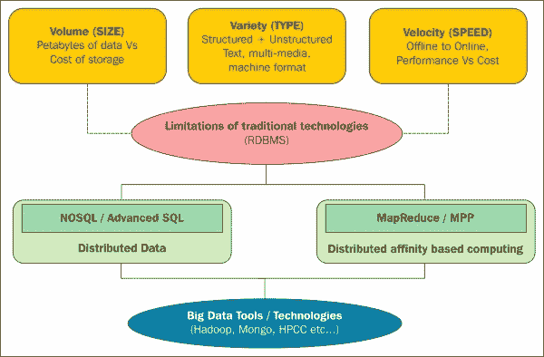
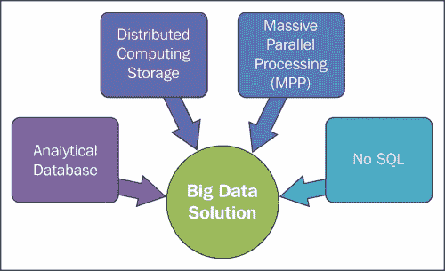
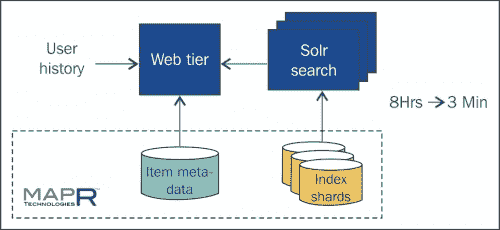
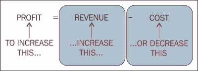
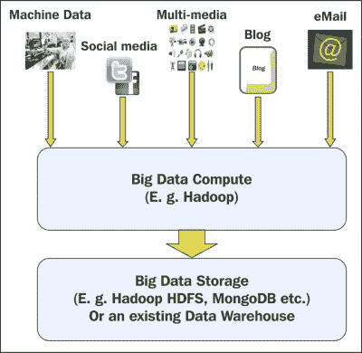
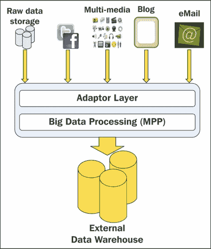
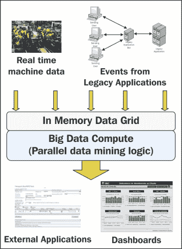
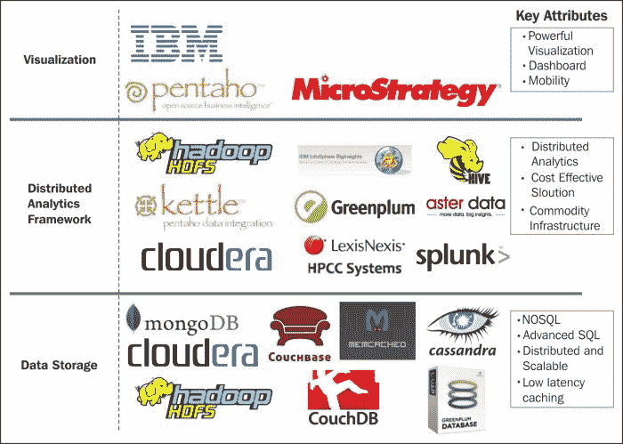
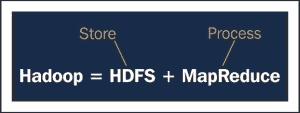
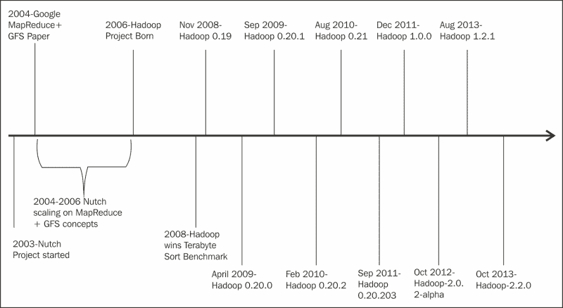

# 一、大数据和 Hadoop 简介

你好大数据爱好者！到这个时候，我相信你一定听说了很多关于大数据的事情，因为大数据是热门的 IT 流行语，大数据有很多令人兴奋的地方。让我们试着去理解大数据的必要性。互联网上、机构中以及一些组织中有海量数据，这些数据有很多有意义的见解，可以使用数据科学技术进行分析，并涉及复杂的算法。数据科学技术需要大量的处理时间、中间数据和中央处理器能力，这可能需要几十个小时来处理千兆字节的数据，数据科学是在反复试验的基础上工作的，以检查算法是否能更好地处理数据来获得这样的见解。与任何其他分析或商业智能系统相比，大数据系统不仅可以更快、更高效地处理大数据的数据分析，还可以扩大研发分析的范围，并产生更有意义的见解。

由于传统系统的一些问题和局限性，大数据系统应运而生。传统系统适用于 **【在线交易处理】**(**【OLTP】**)和 **【商业智能】** ( **BI** )，但考虑到成本、工作量和可管理性方面，它们不容易扩展。处理繁重的计算很困难，并且容易出现内存问题，或者非常慢，这在更大程度上阻碍了数据分析。传统系统在数据科学分析方面存在广泛的不足，使得大数据系统强大而有趣。大数据使用案例的一些示例包括预测分析、欺诈分析、机器学习、识别模式、数据分析、半结构化和非结构化数据处理和分析。

# 大数据的 V

通常，大数据范畴内的问题是由通常被称为大数据 V 的术语定义的。通常有三个 V，即音量、速度和变化，如下图所示:

## 卷

根据 **国际数据公司** ( **IDC** )的第五次年度调查，仅 2011 年就创造和复制了 1.8 兆字节(1.8 万亿千兆字节)的信息，高于 2009 年的 800 千兆字节，预计到 2020 年，这一数字将超过 35 兆字节，每两年翻一番以上。大数据系统旨在通过容错架构存储这些数据量，甚至更大的数据量，并且由于它分布和复制在多个节点上，底层节点可以是普通的计算系统，也不需要是高性能系统，这大大降低了成本。

大数据中每万亿字节存储的成本比其他系统中的成本低得多，这使得组织在更大程度上感兴趣，即使数据增长了多次，也很容易扩展，并且无需太多维护工作就可以添加节点。

## 速度

处理和分析我们前面讨论的数据量是大数据越来越受欢迎并取得巨大发展的关键兴趣领域之一。并不是所有要处理的数据最初都必须在数量上更大，但是当我们处理和执行一些复杂的算法时，数据会大量增长。为了处理大多数算法，我们将需要中间或临时数据，对于大数据，这些数据可能是以 GB 或 TB 为单位的，因此在处理时，我们将需要大量数据，并且处理速度也必须更快。大数据系统可以更快地处理海量数据上的巨大复杂算法，因为它利用了跨分布式环境的并行处理，同时并行执行多个进程，作业可以更快地完成。

例如，雅虎在 2009 年创造了一项世界纪录，使用 Apache Hadoop 在 16.25 小时内对一个千兆字节进行排序，在 62 秒内对一个千兆字节进行排序。MapR 已经在 55 秒内实现了万亿字节的数据排序，这充分说明了处理能力，尤其是在分析中，我们需要使用大量中间数据来更快地执行大量时间和内存密集型算法。

## 品种

传统系统面临的另一大挑战是处理不同种类的半结构化数据或非结构化数据，如电子邮件、音频和视频分析、图像分析、社交媒体、基因、地理空间、3D 数据等。大数据不仅可以帮助存储，还可以使用算法更快、更有效地利用和处理这些数据。半结构化和非结构化数据的处理非常复杂，大数据可以像其他系统一样使用最少或不需要预处理的数据，可以节省大量工作，并有助于最大限度地减少数据丢失。

# 了解大数据

实际上，大数据是一个术语，指的是我们在 V 问题方面由于数据的指数级增长而面临的挑战。挑战可细分为以下几个阶段:

*   捕获
*   储存；储备
*   搜索
*   共享
*   分析学
*   形象化

大数据系统指的是能够处理和分析数据的技术，我们将它称为容量、速度和各种数据问题。能够解决大数据问题的技术应该使用以下体系结构策略:

*   分布式计算系统
*   大规模并行处理
*   NoSQL(不仅仅是 SQL)
*   分析数据库

结构如下:

大数据系统使用分布式计算和并行处理来处理大数据问题。除了分布式计算和 MPP，还有其他可以解决大数据问题的体系结构，即 NoSQL 和高级 SQL，它们都是基于数据库环境的系统。

## NoSQL

由于无模式设计，NoSQL 数据库是一种广泛适用的技术，其纵向和横向扩展的能力相当简单，而且工作量也小得多。SQL 和 RDBMS 已经统治了三十多年，它在处理环境的限制范围内表现良好，除此之外，RDBMS 系统性能下降，成本增加，可管理性降低，我们可以说 NoSQL 在这些场景中比 RDBMS 有优势。

### 注

值得一提的重要一点是，NoSQLs 不支持所有 ACID 属性，并且具有高度可伸缩性、可用性和容错性。NoSQL 通常提供一致性或可用性(处理节点的可用性)，这取决于架构和设计。

### NoSQL 数据库的类型

由于 NoSQL 数据库是非关系型的，它们有不同的可能架构和设计。根据数据的存储方式，NoSQL 数据库大致有四种类型:

1.  **键值存储**:这些数据库是为在键值存储中存储数据而设计的。键可以是自定义的，可以是合成的，也可以是自动生成的，值可以是复杂的对象，如 XML、JSON 或 BLOB。数据的关键字被编入索引，以便更快地访问数据并改进对值的检索。一些流行的键值类型数据库是 DynamoDB、Azure 表存储(ATS)、Riak 和 BerkeleyDB。
2.  **列存储**:这些数据库是为作为一组列族存储数据而设计的。读/写操作是使用列而不是行来完成的。优点之一是压缩范围大，可以有效节省空间，避免对列的内存扫描。由于列的设计，并不是所有的文件都需要被扫描，并且每个列文件都可以被压缩，尤其是当一个列有许多空值和重复值时。列存储高度可扩展且具有极高性能架构的数据库。一些流行的列存储类型数据库是 HBase、BigTable、Cassandra、Vertica 和 Hypertable。
3.  **文档数据库**:这些数据库是设计用于存储、检索和管理面向文档的信息。文档数据库扩展了键值存储的思想，在键值存储中，值或文档使用某种结构存储，并以 XML、YAML 或 JSON 等格式编码，或者以二进制形式编码，如 BSON、PDF、微软办公文档(微软 Word、Excel)等。以像 XML 或 JSON 这样的编码格式存储的优点是，我们可以在数据的文档中使用关键字进行搜索，这在即席查询和半结构化数据中非常有用。一些流行的文档类型数据库是 MongoDB 和 CouchDB。
4.  **图形数据库**:这些数据库是为数据设计的，这些数据的关系被很好地表示为树或图形，并且具有元素，通常具有相互连接的节点和边。关系数据库在执行基于图的查询时不太受欢迎，因为它们需要大量复杂的连接，因此管理互连变得很麻烦。图论算法在预测、用户跟踪、点击流分析、计算最短路径等方面非常有用，由于算法本身比较复杂，因此用图数据库处理这些问题会更加有效。一些流行的图形类型数据库是 Neo4J 和 Polyglot。

## 分析数据库

分析数据库是一种为存储、管理和使用大数据而构建的数据库。分析数据库是由供应商管理的数据库管理系统，针对处理高级分析进行了优化，包括对万亿字节数据的高度复杂查询以及复杂的统计处理、数据挖掘和自然语言处理。分析数据库的例子有 Vertica(由惠普收购)、Aster Data(由 Teradata 收购)、Greenplum(由 EMC 收购)等等。

# 谁在创造大数据？

数据呈指数级增长，并且来自持续一致地发布数据的多个来源。在某些领域，我们必须分析由机器、传感器、质量、设备、数据点等处理的数据。创建大数据的一些来源列表如下:

*   监测传感器:气候或海浪监测传感器产生的数据一致且大小良好，将有超过数百万个传感器捕捉数据。
*   发布到社交媒体网站:社交媒体网站，如脸书、推特和其他网站，有大量的千兆字节数据。
*   网上发布的数字图片和视频:YouTube、网飞等网站处理大量数字视频和数据，数据量可达千兆字节。
*   网上购物的交易记录:易贝、亚马逊、Flipkart 等电子商务网站一次处理数千笔交易。
*   服务器/应用程序日志:应用程序生成持续增长的日志数据，对这些数据的分析变得困难。
*   CDR(通话数据记录):漫游数据和手机 GPS 信号，不一而足。
*   科学、基因组学、生物地球化学、生物学和其他复杂和/或跨学科的科学研究。

## 大数据用例

我们来看看信用卡发卡行(MapR 演示的用例)。

一位信用卡发卡行客户希望改进现有的推荐系统，该系统比较落后，如果推荐速度更快，可能会有巨大的潜在利润。

现有系统是 **企业数据仓库** ( **EDW** )，成本非常高，生成推荐的速度也比较慢，进而影响潜在利润。由于 Hadoop 更便宜更快，它将比现有系统产生巨大的利润。

通常，信用卡客户会有如下数据:

*   客户购买历史记录(大)
*   商家名称
*   商家特别优惠

让我们分析一下现有 EDW 平台与大数据解决方案的总体比较。推荐系统采用 Mahout(可扩展机器学习库 API)和 Solr/Lucene 设计。推荐基于作为搜索索引实现的共现矩阵。

基准测试的时间改进从 20 小时缩短到仅 3 小时，少了令人难以置信的 6 倍，如下图所示:

在下图的 web 层中，我们可以看到改进从 8 小时缩短到 3 分钟:

因此，最终，我们可以说时间减少，收入增加，Hadoop 提供了一个经济高效的解决方案，因此利润增加，如下图所示:

# 大数据用例模式

有很多技术场景，有些模式相似。用架构模式映射场景是一个好主意。一旦理解了这些模式，它们就成为解决方案的基本构件。我们将在下一节讨论五种类型的模式。

### 注

该解决方案并不总是优化的，它可能取决于域数据、数据类型或一些其他因素。这些例子是为了可视化问题，它们可以帮助找到解决方案。

## 大数据作为一种存储模式

大数据系统可以作为存储模式，也可以作为数据仓库，来自多个来源的数据，即使是不同类型的数据，都可以存储起来，以后可以利用。使用场景和用例如下:

*   使用场景:
    *   大量数据不断生成
    *   加载到目标系统之前需要预处理
*   用例:
    *   用于后续清理的机器数据捕获可以合并到多个或单个大文件中，并可以加载到 Hadoop 中进行计算
    *   应该捕获跨多个来源的非结构化数据，以便随后对新兴模式进行分析
    *   在 Hadoop 中加载的数据应该经过处理和过滤，根据数据的不同，我们可以将存储作为数据仓库、Hadoop 或任何 NoSQL 系统。

存储模式如下图所示:

## 大数据作为一种数据转换模式

大数据系统可以设计为执行转换作为数据加载和清理活动，由于并行性，许多转换可以比传统系统完成得更快。转换是数据提取-转换-加载和清理阶段的一个阶段。使用场景和用例如下:

*   使用场景
    *   需要预处理的大量原始数据
    *   数据类型包括结构化数据和非结构化数据
*   用例
    *   利用大数据的 ETL(提取-转换-加载)工具的发展，例如 Pentaho、Talend 等。此外，在 Hadoop 中，ELT(提取-加载-转换)也是趋势，因为在 Hadoop 中加载会更快，清理可以运行并行流程来清理和转换输入，这将会更快

数据转换模式如下图所示:

## 用于数据分析模式的大数据

数据分析在大数据系统中更受关注，在大数据系统中，大量数据可以被分析以生成关于数据的统计报告和见解，这对业务和模式理解非常有用。使用场景和用例如下:

*   使用场景
    *   改善模式检测的响应时间
    *   非结构化数据的数据分析
*   用例
    *   机器数据分析的快速周转(例如，地震数据分析)
    *   跨结构化和非结构化数据的模式检测(例如，欺诈分析)

## 实时模式下的大数据

集成和一些流库的大数据系统和系统能够处理大规模实时数据处理。大型复杂需求的实时处理具有许多挑战，如性能、可伸缩性、可用性、资源管理、低延迟等。一些流技术，如Storm和Spark流可以与Yarn集成。使用场景和用例如下:

*   使用场景
    *   实时管理基于不断变化的数据采取的措施
*   用例
    *   基于制造设备实时的自动化过程控制
    *   基于业务系统 **企业资源规划** ( **企业资源规划**事件的工厂运营实时变化

下图显示了实时模式中的数据:

## 用于低延迟缓存模式的大数据

大数据系统可以作为的特例进行调优，这是一个低延迟的系统，读取高得多，更新低，可以更快地获取数据并存储在内存中，可以进一步提高性能并避免开销。使用场景和用例如下:

*   使用场景
    *   读取与写入的比率要高得多
    *   读取需要非常低的延迟和有保证的响应
    *   基于位置的分布式数据缓存
*   用例
    *   订购有希望的解决方案
    *   基于云的身份和单点登录
    *   移动设备上的低延迟实时个性化服务

低延迟缓存模式显示在以下模式中:

下图显示了根据层和框架广泛使用的一些技术堆栈:

# Hadoop

在大数据中，应用最广泛的系统是 Hadoop。Hadoop 是大数据的开源实现，在业界被广泛接受，Hadoop 的基准测试令人印象深刻，在某些情况下是其他系统无法比拟的。Hadoop 在工业中用于大规模、大规模并行和分布式数据处理。Hadoop 具有很高的容错性，并且可以根据我们需要配置任意多的级别，以使系统具有容错性，这将直接影响数据的存储次数。

正如我们已经谈到的大数据系统，该架构围绕两个主要组件:分布式计算和并行处理。在 Hadoop 中，分布式计算由 HDFS 处理，并行处理由 MapReduce 处理。简而言之，我们可以说 Hadoop 是 HDFS 和 MapReduce 的结合，如下图所示:

我们将在接下来的章节中详细介绍上述两个主题。

## Hadoop 历史

Hadoop 始于一个名为 Nutch 的项目，这是一个基于开源爬虫的搜索，在分布式系统上处理。在 2003-2004 年，谷歌发布了谷歌地图减少和全球资源定位系统论文。MapReduce 是在 Nutch 上改编的。Doug Cutting 和 Mike Cafarella 是 Hadoop 的创作者。当道格·卡特加入雅虎时，一个类似于 Nutch 的新项目被创建，我们称之为 Hadoop，Nutch 仍然是一个独立的子项目。然后，有了不同的版本，其他独立的子项目开始与 Hadoop 集成，我们称之为 Hadoop 生态系统。

下图和描述描述了在 Hadoop 中实现的时间表和里程碑的历史:

## 描述

*   **2002.8**:Nutch项目开工
*   **2003.2** :第一个 MapReduce 库是在谷歌写的
*   **2003.10** :谷歌文件系统论文发表
*   **2004.12** :谷歌 MapReduce 论文发表
*   **2005.7** : Doug Cutting 报道 Nutch 现在使用新的 MapReduce 实现
*   **2006.2** : Hadoop 代码从 Nutch 转移到了一个新的 Lucene 子项目中
*   **2006.11** :谷歌 Bigtable 论文发表
*   **2007.2** :第一个 HBase 代码从 Mike Cafarella 掉了
*   **2007.4** :雅虎！在 1000 节点集群上运行 Hadoop
*   **2008.1** : Hadoop 做了一个 Apache 顶级项目
*   **2008.7** : Hadoop 打破了 Terabyte 数据排序基准
*   **2008.11** : Hadoop 0.19 发布
*   **2011.12** : Hadoop 1.0 发布
*   **2012.10**:Hadoop 2.0 alpha 发布
*   **2013.10** : Hadoop 2.2.0 发布
*   **2014.10** : Hadoop 2.6.0 发布

## Hadoop 的优势

Hadoop 有很多优点，其中一些如下:

*   **低成本——在商品硬件上运行:** Hadoop 可以在性能一般的商品硬件上运行，不需要高性能的系统，可以帮助控制成本，实现可扩展性和性能。从集群中添加或删除节点很简单，就像我们需要时一样。在 Hadoop 中，每 TB 的存储和处理成本更低。
*   **存储灵活性** : Hadoop 可以在分布式环境中以原始格式存储数据。Hadoop 可以比大多数现有技术更好地处理非结构化数据和半结构化数据。Hadoop 为处理数据提供了充分的灵活性，我们不会有任何数据丢失。
*   **开源社区:** Hadoop 是开源的，得到了众多贡献者的支持，全球开发者网络不断壮大。许多组织，如雅虎、脸书、霍顿工程和其他组织，都对 Hadoop 和其他相关子项目的进展做出了巨大贡献。
*   **容错** : Hadoop 具有大规模可伸缩性和容错性。就数据可用性而言，Hadoop 是可靠的，即使某些节点宕机，Hadoop 也可以恢复数据。Hadoop 架构假设节点可以关闭，系统应该能够处理数据。
*   **复杂数据分析**:随着大数据的出现，数据科学也有了突飞猛进的发展，我们有了复杂且计算密集的算法来进行数据分析。Hadoop 可以为非常大规模的数据处理这种可扩展的算法，并且可以更快地处理算法。

## Hadoop 的用途

使用 Hadoop 的一些用例示例如下:

*   搜索/文本挖掘
*   日志处理
*   推荐系统
*   商业智能/数据仓库
*   视频和图像分析
*   归档
*   图形创建和分析
*   模式识别
*   风险评估
*   情绪分析

## Hadoop 生态系统

一个 Hadoop 集群可以有千个节点，人工管理复杂且困难，因此有一些组件辅助整个 Hadoop 系统的配置、维护和管理。在本书中，我们将基于[第 2 章](2.html "Chapter 2. Hadoop Ecosystem")、 *Hadoop 生态系统*中的以下组件进行讨论。

<colgroup><col> <col></colgroup> 
| 

层

 | 

实用程序/工具名称

 |
| --- | --- |
| 分布式文件系统 | Apache HDFS |
| 分布式程序设计 | Apache MapReduce |
| Apache Hive |
| ApachePIG |
| ApacheSpark |
| NoSQL 数据库 | 阿帕契巴塞 |
| 数据摄取 | ApacheFlume |
| Apache Sqoop |
| ApacheStorm |
| 服务编程 | Apache动物园管理员 |
| 行程安排 | Apache Oozie |
| 机器学习 | Apache·马胡特 |
| 系统部署 | Apache人 Ambari |

上述所有组件都有助于管理 Hadoop 任务和作业。

## Apache Hadoop

开源的 Hadoop 由 Apache 软件基金会维护。 Apache Hadoop 的官方网站是[http://hadoop.apache.org/](http://hadoop.apache.org/)，这里详细描述了包和其他细节。当前的 Apache Hadoop 项目(2.6 版)包括以下模块:

*   **Hadoop 通用**:支持其他 Hadoop 模块的通用实用程序
*   **Hadoop 分布式文件系统(HDFS)** :一个分布式文件系统，提供对应用程序数据的高吞吐量访问
*   **Hadoop Yarn**:作业调度和集群资源管理的框架
*   **Hadoop MapReduce** :一个基于Yarn的系统，用于大数据集的并行处理

Apache Hadoop 可以以以下三种模式部署:

*   **独立**:用于进行简单的分析或调试。
*   **伪分布式**:帮助在单个节点上模拟多节点安装。在伪分布式模式下，每个组件进程都在单独的 JVM 中运行。您可以在单个服务器上模拟它，而不是在不同的服务器上安装 Hadoop。
*   **分布式**:集群有几十个或者几百个或者几千个节点的多个工作节点。

在 Hadoop 生态系统中，除了 Hadoop 之外，还有许多独立的 Apache 项目的实用程序组件，如 Hive、Pig、HBase、Sqoop、Flume、Zookeper、Mahout 等，它们必须单独配置。我们必须小心子项目与 Hadoop 版本的兼容性，因为并非所有版本都是相互兼容的。

Apache Hadoop 是一个开源项目，它有很多好处，因为源代码可以更新，也有一些贡献是通过一些改进完成的。作为开源项目的一个缺点是，公司通常为他们的产品提供支持，而不是为开源项目提供支持。客户更喜欢支持和改编供应商支持的 Hadoop 发行版。

让我们看看一些可用的 Hadoop 发行版。

## Hadoop 发行版

Hadoop 发行版由管理发行版的公司提供支持，一些发行版也有许可成本。Cloudera、Hortonworks、Amazon、MapR 和 Pivotal 等公司在市场上都有各自的 Hadoop 发行版，为 Hadoop 提供所需的子包和项目，这些子包和项目兼容并提供商业支持。这大大减少了工作量，不仅是在操作方面，而且在部署、监控以及工具和实用程序方面，以便于更快地开发产品或项目。

为了管理 Hadoop 集群，Hadoop 发行版为 Hadoop 集群的部署、管理和监控提供了一些图形网络用户界面工具，可用于设置、管理和监控复杂的集群，从而减少了大量的工作和时间。

一些可用的 Hadoop 发行版如下:

*   **Cloudera**:根据 *The Forrester Wave:大数据 Hadoop Solutions，Q1 2014* ，这是使用最广泛的 Hadoop 发行版，拥有最大的客户群因为它提供了很好的支持，并且拥有一些很好的实用组件，比如 Cloudera Manager，可以创建、管理和维护集群，管理作业处理，Impala 是由具备实时处理能力的 Cloudera 开发和贡献的。
*   **Hortonworks** : Hortonworks 的战略是通过开源社区推动所有创新，并创建一个合作伙伴生态系统，加速企业对 Hadoop 的采用。它使用开源 Hadoop 项目，是 Apache Hadoop 中 Hadoop 增强的主要贡献者。Ambari 是由 Hortonworks 开发并贡献给 Apache 的。Hortonworks 为入门提供了一个非常好的、易于使用的沙盒。Hortonworks 做出了一些改变，使 Apache Hadoop 在微软视窗平台上运行，包括视窗服务器和微软 Azure。
*   **MapR**:Hadoop 的 MapR 发行版使用了与普通开源 Hadoop 及其竞争对手不同的概念，特别是支持网络文件系统(NFS)而不是 HDFS，以获得更好的性能和易用性。在 NFS，可以使用本机 Unix 命令来代替 Hadoop 命令。MapR 具有高可用性功能，例如快照、镜像或状态故障转移。
*   **Amazon Elastic MapReduce(EMR)**:AWS 的 Elastic MapReduce (EMR)利用其全面的云服务，如用于计算的 Amazon EC2、用于存储的 Amazon S3 以及其他服务，为希望在云中实施 Hadoop 的客户提供非常强大的 Hadoop 解决方案。EMR 非常适合用于不常见的大数据处理。它可能会帮你省很多钱。

# Hadoop 的支柱

Hadoop 被设计为高度可扩展、分布式、大规模并行处理、容错和灵活，设计的关键方面是 HDFS、MapReduce 和Yarn。HDFS 和 MapReduce 可以以更快的速度执行非常大规模的批处理。由于各种组织和机构的贡献，Hadoop 架构经历了很多改进，其中之一就是Yarn。Yarn克服了 Hadoop 的一些限制，允许 Hadoop 轻松地与不同的应用程序和环境集成，尤其是在流和实时分析方面。我们将要讨论的一个这样的例子是 Storm 和 Spark，它们在流和实时分析方面非常有名，都可以通过Yarn与 Hadoop 集成。

我们将在[第 3 章](3.html "Chapter 3. Pillars of Hadoop – HDFS, MapReduce, and YARN")、*Hadoop 的支柱——HDFS、MapReduce 和Yarn*中更详细地介绍 HDFS、MapReduce 和Yarn的概念。

# 数据访问组件

MapReduce 是一个非常强大的框架，但是掌握和优化一个 MapReduce 作业有着巨大的学习曲线。为了在 MapReduce 范式中分析数据，我们的大量时间将花费在编码上。在大数据中，用户来自不同的背景，如编程、脚本、EDW、数据库管理员、分析等等，对于这样的用户，在 MapReduce 之上有抽象层。Hive 和 Pig 就是这样两层，Hive 有类似 SQL 查询的接口，Pig 有 Pig 拉丁程序语言接口。分析这些层上的数据变得容易得多。

我们将在[第 4 章](4.html "Chapter 4. Data Access Components – Hive and Pig")、*数据访问组件-Hive和PIG*中更详细地介绍Hive和PIG的概念。

# 数据存储组件

HBase 是一个基于列商店的 NoSQL 数据库解决方案。HBase 的数据模型与谷歌的 BigTable 框架非常相似。HBase 可以高效地处理大量数据(通常是数百万或数十亿行)中的随机和实时访问。HBase 的重要优势在于，它支持对更大的表进行更新，并且查找速度更快。HBase 数据存储支持线性和模块化扩展。HBase 将数据存储为多维地图，并且是分布式的。HBase 操作都是以并行方式运行的 MapReduce 任务。

我们将在[第 5 章](5.html "Chapter 5. Storage Component – HBase")、*存储组件—HBase* 中更详细地介绍 HBase 的概念。

# Hadoop 中的数据摄取

在 Hadoop 中，存储从来都不是问题，但是管理数据是驱动力，不同的系统可以围绕它设计不同的解决方案，因此管理数据变得极其关键。一个更好管理的系统在可伸缩性、可重用性甚至性能方面都有很大帮助。在 Hadoop 生态系统中，我们有两个广泛使用的工具:Sqoop 和 Flume，它们都可以帮助管理数据，并且可以高效地导入和导出数据，性能良好。Sqoop 通常用于与 RDBMS 系统的数据集成，Flume 通常在流式日志数据方面表现更好。

我们将在[第 6 章](6.html "Chapter 6. Data Ingestion in Hadoop – Sqoop and Flume")、*Hadoop 中的数据摄取—Sqoop 和 Flume* 中更详细地介绍 Sqoop 和 Flume 的概念。

# 流式传输和实时分析

Storm 和 Spark 是两个令人着迷的新组件，它们可以在Yarn网上运行，并在处理流和实时分析方面具有一些惊人的能力。这两种方法都用于我们有大量连续流数据并且必须在实时或接近实时的情况下进行处理的场景。我们前面讨论的流量分析器的例子是 Storm 和 Spark 用例的一个很好的例子。

我们将在[第 7 章](7.html "Chapter 7. Streaming and Real-time Analysis – Storm and Spark")、*流和实时分析—Storm和Spark*中更详细地介绍Storm和Spark的概念。

# 总结

在本章中，我们谈到了大数据及其用例模式。我们探讨了一下 Hadoop 的历史，最后谈到了 Hadoop 的优势和用途。

Hadoop 系统的监控和管理非常复杂，我们有独立的子项目框架、工具和实用程序，它们与 Hadoop 集成在一起，有助于更好地管理任务，这被称为 Hadoop 生态系统，我们将在后续章节中讨论。