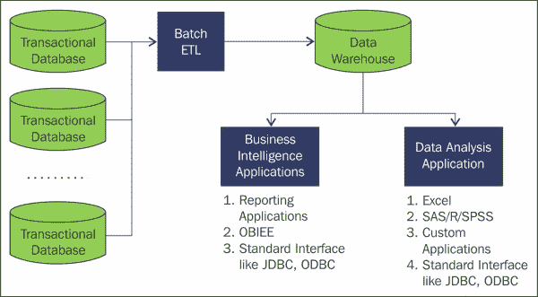
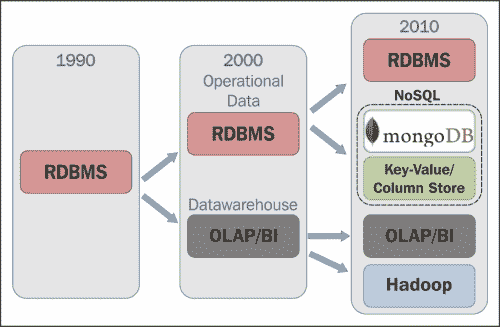
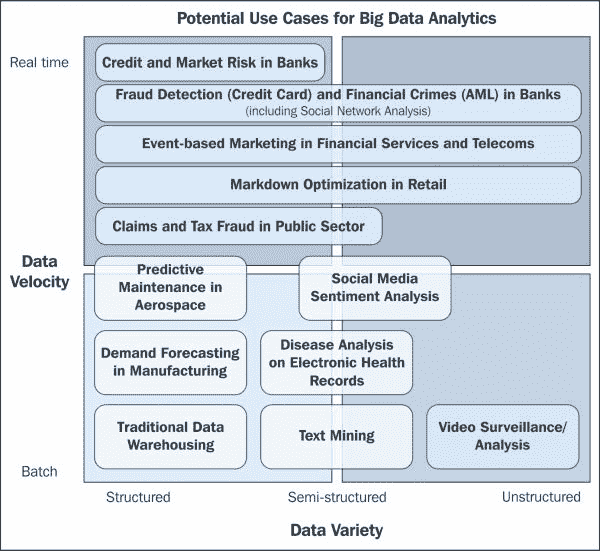

# 二、Hadoop 生态系统

既然我们已经讨论并了解了大数据和 Hadoop，我们就可以继续了解 Hadoop 生态系统了。一个 Hadoop 集群可能有数百或数千个难以手动设计、配置和管理的节点。因此，需要工具和实用程序来轻松有效地管理系统和数据。除了 Hadoop，我们还有独立的子项目，由一些组织和贡献者贡献，并且主要由 Apache 管理。子项目与 Hadoop 集成得非常好，可以帮助我们更加专注于设计和开发，而不是维护和监控，还可以帮助开发和数据管理。

在了解不同的工具和技术之前，让我们先了解一个用例，以及它与传统系统的区别。

# 传统系统

传统系统适合 OLTP(在线事务处理)和一些基本的数据分析和 BI 用例。在这个范围内，传统系统在性能和管理方面是最好的。下图显示了传统系统的高级概述:

BIA 的传统系统

典型传统系统的步骤如下:

1.  数据驻留在数据库中
2.  提取转换加载过程
3.  数据被移入数据仓库
4.  商业智能应用程序可以有一些商业智能报告
5.  数据分析应用程序也可以使用数据

当数据增长时，传统系统无法处理甚至存储数据；即使他们这样做了，也要付出非常高的成本和努力，因为体系结构的局限性、可伸缩性和资源限制的问题、横向扩展的能力或困难。

## 数据库趋势

数据库技术已经发展了一段时间。我们有关系数据库、企业数据仓库，现在出现了基于 Hadoop 和 NoSQL 的数据库。Hadoop 和基于 NoSQL 的数据库现在是用于解决大数据问题的首选技术，一些传统系统正在逐步转向 Hadoop 和 NoSQL，以及它们现有的系统。一些系统有不同的技术来处理数据，例如，Hadoop 和 RDBMS，Hadoop 和 EDW，NoSQL 和 EDW，NoSQL 和 Hadoop。下图描述了弗雷斯特研究公司的数据库趋势:

数据库趋势

该图描绘了设计趋势和在特定十年中可用和适用的技术。

20 世纪 90 年代是关系数据库管理系统时代，它是为 OLTP 处理而设计的，数据处理没有那么复杂。

数据仓库的出现和适应是在 2000 年，用于 OLAP 处理和商业智能。

从 2010 年开始，大数据系统，尤其是 Hadoop，被许多组织用来解决大数据问题。

所有这些技术实际上可以共存于一个解决方案中，因为每种技术都有其优缺点，因为不是所有的问题都可以通过任何一种技术来解决。

# Hadoop 用例

Hadoop 可以帮助解决我们在[第 1 章](1.html "Chapter 1. Introduction to Big Data and Hadoop")、*大数据和 Hadoop 简介*中讨论的大数据问题。基于数据速度(批处理和实时)和数据多样性(结构化、半结构化和非结构化)，我们在不同的领域和行业有不同的用例集。所有这些用例都是大数据用例，Hadoop 可以有效地帮助解决它们。下图描述了一些用例:

大数据分析的潜在使用案例

# Hadoop 的基础数据流

Hadoop 系统的一个基本数据流可以分为四个阶段:

1.  **捕获大数据**:来源可以是结构化、半结构化和非结构化的大量列表，一些流式实时数据源、传感器、设备、机器捕获的数据以及许多其他来源。对于数据捕获和存储，我们在 Hadoop 生态系统中有不同的数据集成器，如 Flume、Sqoop、Storm 等，具体取决于数据的类型。
2.  **流程和结构**:我们将使用基于 MapReduce 的框架或者其他一些能够在 Hadoop 生态系统中执行分布式编程的框架，对数据进行清理、过滤和转换。目前可用的框架有 MapReduce、Hive、Pig、Spark 等。
3.  **分发结果**:处理后的数据可以被 BI 和分析系统或大数据分析系统用于执行分析或可视化。
4.  **反馈和保留**:分析后的数据可以反馈给 Hadoop，用于改进和审核。

下图显示了在 Hadoop 平台中捕获并处理的数据，以及在商业交易和交互系统以及商业智能和分析系统中使用的结果:

Hadoop 基本数据流

# Hadoop 集成

Hadoop 架构旨在轻松与其他系统集成。集成非常重要，因为虽然我们可以在 Hadoop 中高效地处理数据，但我们也应该能够将结果发送到另一个系统，以将数据移动到另一个级别。数据必须与其他系统集成，以实现互操作性和灵活性。

下图描述了与不同系统集成的 Hadoop 系统，以及一些实现的工具，以供参考:

Hadoop 与其他系统的集成

通常与 Hadoop 集成的系统有:

*   数据集成工具，如，Sqoop，Flume 等
*   NoSQL 工具，如卡珊德拉、MongoDB、Couchbase 等
*   ETL 工具，如 Pentaho、Informatica、Talend 等
*   可视化工具，如 Tableau、Sas、R 等

# Hadoop 生态系统

Hadoop 生态系统由许多子项目组成，我们可以根据需要在 Hadoop 集群中配置这些项目。由于 Hadoop 是一个开源软件，并且已经变得流行，我们看到了不同组织支持 Hadoop 的许多贡献和改进。所有实用程序都绝对有用，有助于高效管理 Hadoop 系统。为了简单起见，我们将通过分类来理解不同的工具。

下图描述了 Hadoop 生态系统中的层以及该层中的工具和实用程序:

Hadoop 生态系统

# 分布式文件系统

在 Hadoop 中，我们知道数据存储在分布式计算环境中，因此文件分散在集群中。我们应该有一个高效的文件系统来管理 Hadoop 中的文件。Hadoop 中使用的文件系统是 HDFS，详细描述为 Hadoop 分布式文件系统。

## HDFS

HDFS 是极可扩展和容错。它被设计成在分布式环境中甚至在商用硬件中有效地处理并行处理。HDFS 在 Hadoop 中有守护进程，负责管理数据。流程为`NameNode`、`DataNode`、`BackupNode`、`Checkpoint NameNode`。

我们将在下一章很少讨论 hdfs 。

# 分布式编程

为了利用分布式存储文件系统的能力，Hadoop 执行分布式编程，可以进行大规模并行编程。分布式编程是任何大数据系统的核心，因此极其关键。以下是可用于分布式编程的不同框架:

*   MapReduce
*   储备
*   PIG
*   Spark

Hadoop 中用于分布式编程的基本层是 MapReduce。让我们介绍一下 MapReduce:

*   **Hadoop MapReduce**:MapReduce 是 Hadoop 系统分布式编程的核心。MapReduce 是一个框架模型，设计为分布式环境下的并行处理。Hadoop MapReduce 的灵感来自谷歌 MapReduce 白皮书。Hadoop MapReduce 是一个可扩展的大规模并行处理框架，可以处理巨大的数据，设计为即使在商品硬件中也能运行。在 Hadoop 2 之前。 *x* ，MapReduce 是唯一可以执行的处理框架，然后一些实用程序扩展并创建了一个包装器，可以轻松编程以加快开发速度。我们将在[第三章](3.html "Chapter 3. Pillars of Hadoop – HDFS, MapReduce, and YARN")、*Hadoop 的支柱——HDFS、MapReduce 和 T7 中详细讨论 Hadoop MapReduce。*
*   **Apache Hive** : Hive 为 Hadoop 提供了一个数据仓库基础架构系统，它在 MapReduce 之上创建了一个类似 SQL 的包装器接口，名为 HiveQL，。Hive 可用于对 Hadoop 数据运行一些特别的查询以及基本的聚合和汇总处理。HiveQL 不符合 SQL92。Hive是由脸书开发的，并为Apache做出了贡献。Hive 是在 MapReduce 之上设计的，这意味着 HiveQL 查询将运行 MapReduce 作业来处理查询。我们甚至可以通过使用 **【用户定义功能】** ( **UDF** )来扩展 HiveQL。
*   **Apache Pig** : Pig 提供了一个用 Pig 拉丁语编写的类似脚本的包装器，用类似脚本的语法处理数据。Pig 由雅虎开发，并为 Apache 做出了贡献。Pig 还将 Pig 拉丁脚本代码翻译成 MapReduce 并执行作业。Pig 通常用于分析半结构化和大型数据集。
*   **Apache Spark** : Spark 为 Hadoop 的 MapReduce 提供了强大的替代方案。Apache Spark 是一个并行数据处理框架，在内存上可以运行比 Hadoop MapReduce 快 100 倍的程序，在磁盘上可以快 10 倍。Spark 用于实时流处理和数据分析。

# NoSQL 数据库

我们已经讨论过 NoSQL 是新兴和被采用的体系之一。在 Hadoop 生态系统中，我们有一个名为 HBase 的 NoSQL 数据库。HBase 是提供非常灵活的设计和低延迟的大容量同时读写的关键组件之一，因此被广泛采用。

## Apache HBase

HBase 的灵感来源于谷歌的《大桌子》。HBase 是一个排序图，具有稀疏性、一致性、分布性和多维性。HBase 是一个面向 NoSQL、面向列的数据库和键/值存储，它在 HDFS 之上工作。HBase 提供了更快的查找速度，还可以大规模地大量插入/更新随机访问请求。HBase 模式非常灵活，实际上是可变的，可以在运行时添加或删除列。HBase 支持低延迟和高度一致的读写操作。适用于高速计数器聚合。

许多组织或公司使用 HBase，如雅虎、Adobe、脸书、推特、Stumbleupon、NGData、Infolinks、趋势科技等。

# 数据摄取

大数据中的数据管理是一个重要而关键的方面。我们必须导入和导出大规模数据来进行处理，这在生产环境中变得难以管理。在 Hadoop 中，我们处理不同的源集，如批处理、流、实时，以及数据格式复杂的源，因为有些源也是半结构化和非结构化的。管理这样的数据是非常困难的，因此我们有一些数据管理的工具，比如 Flume、Sqoop 和 Storm，它们被提到如下:

*   **Apache Flume**:ApacheFlume是一个广泛使用的工具，用于高效地收集、聚合和移动来自许多不同来源的大量日志数据到一个集中的数据存储中。Flume是一个分布式、可靠、可用的系统。如果一个源是流的，例如日志文件，它会表现很好。
*   **Apache Sqoop** : Sqoop 可以用来管理 Hadoop 和关系数据库、企业数据仓库、NoSQL 系统之间的数据。Sqoop 有不同的连接器，具有各自的数据存储，使用这些连接器，Sqoop 可以在 MapReduce 中导入和导出数据，并且可以以并行模式导入和导出数据。Sqoop 也是容错的。
*   **Apache Storm**:Apache Storm为流媒体数据提供实时、可扩展、分布式的解决方案。Storm支持数据驱动和自动化活动。Apache Storm 可以与任何编程语言一起使用，它保证了数据流的处理不会丢失数据。Storm 与数据类型无关，它处理任何数据类型的数据流。

# 服务编程

在分布式环境中编程很复杂，必须小心，否则会变得效率低下。为了在 Hadoop 中开发合适的分布式应用程序，我们有一些服务编程工具，它们提供了处理分发和资源管理方面的实用程序。我们将讨论的工具如下:

*   Apache Yarn
*   Apache动物园管理员

## ApacheYarn

**另一个资源谈判者** ( **Yarn**)是在 Hadoop *2.x* 版本的主要发布中的一场革命。Yarn提供资源管理，应该被用作一个公共平台，用于在 Hadoop 集群中集成不同的工具和实用程序并管理它们。Yarn是一个资源管理器，它是通过分离 MapReduce 的处理引擎和资源管理功能而创建的。它还为处理 MapReduce 之外的框架提供了平台，如 Storm、Spark 等。Yarn内置支持多租户共享集群资源。Yarn负责管理和监控工作负载，并管理 Hadoop 的高可用性功能。

Yarn具有改进的功能，因此也可以针对流和实时分析进行调整，这在某些场景中是一个巨大的优势和需求。Yarn也向后兼容现有的 MapReduce 应用程序。

由Yarn驱动的一些应用如下:

*   Apache Hadoop MapReduce
*   ApacheSpark
*   ApacheStorm
*   Apache Tez
*   Apache S4

## Apache动物园管理员

ZooKeeper 是一个分布式、开源的分布式应用协调服务。ZooKeeper 公开了一组简单的原语，分布式应用程序可以使用这些原语进行同步、配置、维护、分组和命名资源，以实现协调、高可用性和同步。ZooKeeper 在 Java 中运行，并且有 Java 和 c 的绑定。

HBase、Solr、Kata、Neo4j 等等，都是一些使用 Zookeeper 来协调活动的工具。

# 调度

Hadoop 系统可以有多个作业，这些作业必须被调度多次。Hadoop 作业的调度很复杂，很难创建、管理和监控。我们可以使用像 ozie 这样的系统来高效地协调和监控 Hadoop 作业，如下所述:

*   **Apache Ouzie**:Ouzie 是一个工作流和协调服务处理系统，允许用户管理多个作业以及用 MapReduce、Pig 和 Hive 编写的作业链，以及 java 程序和 shell sripts，并且可以将它们相互链接。Oozie 是一个可扩展、可扩展和数据感知的服务。Oozie 可以用来设置工作流的开始和结束规则，它还可以检测任务的完成情况。

# 数据分析和机器学习

在 Hadoop 中，对于一般的大数据，分析是关键的兴趣领域，因为 Hadoop 是处理复杂程序和算法以改进流程和业务的强大工具。数据分析可以识别深刻的见解，并有助于优化流程，在竞争中保持领先地位。由于 Hadoop 强大的处理特性，机器学习一直备受关注，并且在算法和技术方面的大量开发已经适用于 Hadoop。机器学习技术也用于预测分析。竞争组织需要数据分析和机器学习来在竞争中保持领先地位，一些研究人员，特别是生命科学领域的研究人员，需要处理基因和病历模式，以产生医学领域非常必要的重要和有用的见解和细节。机器人领域的研究人员也需要这样做，以便为执行和优化任务的机器提供智能。RHadoop 是一种与 Hadoop 集成的数据分析统计语言。Mahout 是一个在 Hadoop 中使用的开源机器学习 API。

*   **Apache Mahout** : Mahout 是一个可扩展的机器学习 API，有很多已经实现的机器学习库。Mahout 是一个孤立的项目，可以作为一个纯粹的机器学习库，但是当它与 Hadoop 集成时，Mahout 的力量会增强。Mahout 中常用的一些算法如下:
    *   建议
    *   使聚集
    *   分类

# 系统管理

部署、配置、管理和监控 Hadoop 集群需要专业的脚本知识，并且通常需要大量的人工工作和时间，但这是重复的。对于在 Hadoop 中执行这样的活动，我们可以使用 Ambari 等工具。

## Apache Ambari

应用程序开发人员和系统集成商可以使用 Ambari 来管理 Hadoop 集群中的大多数管理活动。Ambari 是 Hadoop 生态系统中的一个开源框架，可用于安装、配置、部署、管理和监控 Hadoop 集群。Ambari 的主要动机是隐藏 Hadoop 集群管理的复杂性，并提供一个非常简单直观的网络用户界面。Ambari 的一个关键特性是它提供了 RESTful APIs，可以用来与其他外部工具集成，以实现更好的管理。

# 总结

在本章中，我们探讨了不同的层，以及在 Hadoop 生态系统中可以执行层功能的一些组件及其用法。

我们在非常高的层次上讨论了 Hadoop 系统，我们将在[第 3 章](3.html "Chapter 3. Pillars of Hadoop – HDFS, MapReduce, and YARN")、*Hadoop 的支柱——HDFS、MapReduce 和Yarn*中深入讨论 Hadoop 架构。