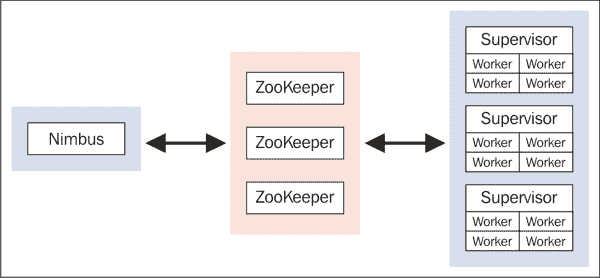
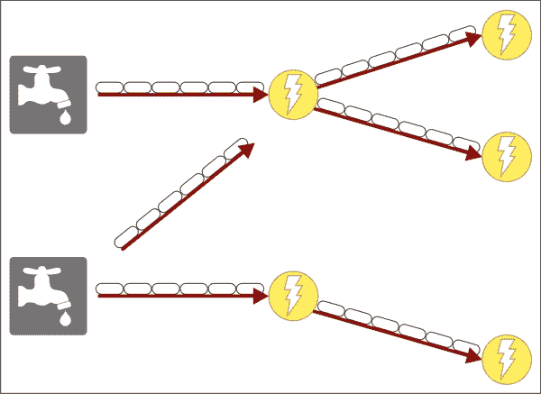
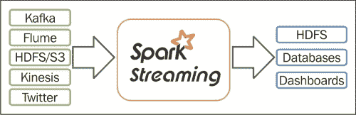
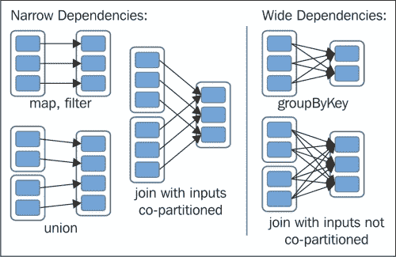

# 七、流和实时分析–Storm和Spark

正如我们已经讨论过的，Hadoop 是一个批处理系统，一些数据源类型的速度或速率、数据量各不相同。许多系统，尤其是机器，会持续生成大量数据，它们需要处理如此大量的数据来保持质量并避免严重的损失，因此出现了对流处理的需求。为了设计构建为 Lambda 实现的系统，即批处理和流处理系统，我们应该结合不同的环境，这些环境可以相互集成来处理数据，这显然增加了系统设计的复杂性。流数据的存储、分析、处理和维护非常复杂。版本 2 之前。 *x* 的时候，Hadoop 只是一个批处理系统，在出现了 YARN 等框架以及这些框架与 YARN 的集成之后，Hadoop 可以设计成性能更好的流和实时分析。各种计划和贡献提升了 Hadoop 与Storm和Spark等系统的集成能力。

在本章中，我们将介绍 Storm 和 Spark 框架的范例，以便高效地处理流和进行实时分析。

# Storm入门

Storm 可以非常快速地处理流数据(每个节点每秒钟超过一百万条消息)；它是可扩展的(集群的数千个工作节点)、容错的和可靠的(消息处理得到保证)。Storm 易于使用和部署，这也简化了它的可维护性。Hadoop 主要是为批处理和 Lambda 架构系统设计的。Storm 与 Hadoop 很好地集成在一起，以便为大数据提供可靠的分布式实时流分析和良好的容错能力。

Storm 由 Twitter 开发，后来贡献给了 Apache。Storm 的基准测试结果非常出色，每个节点每秒处理超过一百万组元组。Storm 利用了一个节俭界面；因此，客户端可以用任何语言编写，甚至非 JVM 语言也可以通过基于 JSON 的协议进行通信。考虑到 Storm 的复杂性，它是一个相当好用的 API。

## Storm特征

Storm的一些重要特征如下:

*   简单编程模型
*   免费开放源码
*   可以用于任何语言
*   容错的
*   分布式和水平可扩展—并行运行在一组机器上
*   可靠—保证消息处理
*   快速—实时处理流式数据
*   易于部署和操作

## Storm的物理架构

Storm架构基于主从模型，利用 Zookeeper 来协调主从。它由四个部分组成:

*   **光轮**:掌握流程，在集群间分配处理
*   **主管**:管理工人节点
*   **工作人员**:执行光轮分配的任务
*   **动物园管理员**:光轮和监工之间的坐标

工人通过**动物园管理员**向**主管**和**光轮**发送心跳。如果**工作人员**或**主管**无法响应，则**邻避**将工作重新分配给集群中的另一个节点，如下图所示:



## Storm的数据架构

Storm 数据架构有以下术语:

*   **喷口**:产生流或数据源
*   **Bolt** :摄取壶嘴元组，然后对其进行处理，产生输出流；它可以用来过滤、聚合或连接数据，或者与数据库对话
*   **拓扑结构**:喷口和螺栓之间的网络图

下图解释了上述要点:


《Storm》中的数据级抽象是:

*   **元组**:Storm数据的基本单位——一个命名的值列表
*   **流**:一个无界的元组序列

下图显示了产生流的喷口和处理元组或流以产生不同流的螺栓:



# Storm拓扑

流可以通过使用流分组在螺栓之间进行划分，这允许流朝着螺栓行进。Storm 提供了以下内置流分组，您可以通过实现接口来实现自定义流分组:

*   **混洗分组**:每个螺栓被统一配置以获得几乎相等数量的元组
*   **字段分组**:对特定字段进行分组可以将相同字段值和不同值元组的元组合并到不同的螺栓上
*   **所有分组**:每个元组可以发送到所有螺栓，但是会增加开销
*   **全局分组**:所有的元组都归到一个螺栓上
*   **直接分组**:生产者可以决定将哪些元组发送到哪个螺栓

# Yarn上的Storm

对Yarn的Storm集成是在雅虎完成的，并作为开源发布。Storm 可以与Yarn集成，在与 Lambda 架构相同的集群上提供批处理和实时分析。Storm on YARN 将 Storm 的事件处理框架与 Hadoop 相结合，以提供低延迟处理。Storm资源可以由Yarn管理，以提供 Hadoop 上Storm流处理的所有好处。“Yarn上Storm”在资源利用方面提供了高可用性、优化和弹性。

# 拓扑配置示例

Storm拓扑可以由`TopologyBuilder`类通过创建喷口和螺栓，然后提交拓扑来配置。

## 喷口

在 Storm 中可以使用一些实现的喷口，例如 **BaseRichSpout** 、**clojuresport**、 **DRPCSpout** 、 **FeederSpout** 、**fixed duplespout**、 **MasterBatchCoordinator** 、 **RichShellSpout** 、**rich bulotbatchtriggerer**、 **ShellSpout**

我们可以通过扩展上述任何一个类或者实现 ISpout 接口来编写一个定制的螺栓:

```sh
public class NumberSpout extends BaseRichSpout 
{
    private SpoutOutputCollector collector;

    private static int currentNumber = 1;

    @Override
    public void open( Map conf, TopologyContext context, SpoutOutputCollector collector ) 
    {
        this.collector = collector;
    }

    @Override
    public void nextTuple() 
    {

        // Emit the next number
        collector.emit( new Values( new Integer( currentNumber++ ) ) );
    }

    @Override
    public void ack(Object id) 
    {
    }

    @Override
    public void fail(Object id) 
    {
    }

    @Override
    public void declareOutputFields(OutputFieldsDeclarer declarer) 
    {
        declarer.declare( new Fields( "number" ) );
    }
}
```

## 螺栓

螺栓的一些实现在 Storm 中可用，如 **BaseBasicBolt** 、 **BatchProcessWord** 、**batchrepata**、 **IdentityBolt** 、 **PrepareBatchBolt** 、 **PrepareRequest** 、 **TestConfBolt** 、**testwordpcounter**、**tridentbluotcooler**。

我们可以通过扩展上述任何一个类或者实现 IBasicBolt 接口来编写一个定制的 bolt:

```sh
public class PrimeNumberBolt extends BaseRichBolt 
{
  private OutputCollector collector;
  public void prepare( Map conf, TopologyContext context, OutputCollector collector ) 
  {
    this.collector = collector;
  }

  public void execute( Tuple tuple ) 
  {
    int number = tuple.getInteger( 0 );
    if( isPrime( number) )
    {
      System.out.println( number );
    }
    collector.ack( tuple );
  }

  public void declareOutputFields( OutputFieldsDeclarer declarer )
  {
    declarer.declare( new Fields( "number" ) );
  }

  private boolean isPrime( int n )
  {
    if( n == 1 || n == 2 || n == 3 )
    {
      return true;
    }
    // Is n an even number?
    if( n % 2 == 0 )
    {
      return false;
    }

        //if not, then just check the odds
        for( int i=3; i*i<=n; i+=2 ) 
        {
            if( n % i == 0)
            {
                return false;
            }
        }
        return true;
    }
}
```

## 拓扑

`TopologyBuilder`类可用于配置喷口和螺栓，并提交拓扑，如本例所示:

```sh
public class PrimeNumberTopology
{
  public static void main(String[] args)
  {
    TopologyBuilder builder = new TopologyBuilder();
    builder.setSpout( "spout", new NumberSpout() );
    builder.setBolt( "prime", new PrimeNumberBolt() )
    .shuffleGrouping("spout");

    Config conf = new Config();
    LocalCluster cluster = new LocalCluster();
    cluster.submitTopology("test", conf, builder.createTopology());
    Utils.sleep(10000);
    cluster.killTopology("test");
    cluster.shutdown();
  }
}
```

# Spark介绍

Spark 是一个集群计算框架，它是在加州大学伯克利分校的 AMPLab 开发的，并作为一个开源项目贡献给了 Apache。Spark 是一个基于内存的数据处理框架，这使得它的处理速度比 MapReduce 快得多。在 MapReduce 中，中间数据存储在磁盘中，数据访问和传输会使它变慢，而在 Spark 中，它存储在内存中。由于 MapReduce 的局限性和开销，Spark 可以被认为是 MapReduce 的替代方案，但不能作为替代方案。Spark 广泛用于流数据分析、图形分析、快速交互式查询和机器学习。由于其内存特性，它吸引了许多贡献者的注意，并且实际上是 2014 年拥有 200 多名贡献者和 50 多个组织的顶级 Apache 项目之一。Spark 利用多线程而不是多个进程在单个节点上实现并行。

Spark 的主要动机是开发一个更快、更容易使用并可用于分析的处理系统。它的编程遵循更多的**有向无环图** ( **DAG** )模式，其中多步数据流动且复杂，如下图所示:


## Spark的特征

Spark 有许多值得一提的特性和功能，如下所示:

*   在内存中运行时比 MapReduce 快 100 倍，在磁盘上运行时快 10 倍
*   可以进行迭代和交互式分析
*   许多函数和运算符可用于数据分析
*   轻松设计功能的 DAG 框架
*   基于内存的中间存储
*   易于使用和维护
*   用 Scala 编写，在 JVM 环境下运行；使用 Spark 的应用可以用 Scala、Java、Python、R、Clojure 编写
*   在 Hadoop 和 Mesos 等环境中运行，或者独立运行，或者在云中运行

# Spark框架

Spark 贡献者利用了核心 Spark 框架，并在 Spark 之上开发了不同的库来增强其功能。这些库可以按照要求插入 Spark:


## Spark SQL

Spark SQL 是Spark之上的一个 SQL 的包装器。它将 SQL 查询转换成 Spark 作业以产生结果。Spark SQL 可以处理各种数据源，如 Hive 表、Parquet 文件和 JSON 文件。

## 图形

顾名思义，GraphX 支持使用基于图形的算法。它已经实现了各种各样的基于图形的算法，并且还在增长。一些例子有 PageRank、连通分量、标签传播、SVD++、强连通分量、三角计数等等。

## MLib

MLib 是一个可扩展的机器学习库，工作在 Spark 的之上。它的使用和部署要容易得多，其性能可以优化到比 MapReduce 快 100 倍。

## Spark流

Spark streaming 是一个库，使 Spark 能够执行可扩展、容错、高吞吐量的系统，以实时处理流数据。Spark流很好地集成了许多来源，如**驱动****HDFS****S3****Flume****卡夫卡****推特**等等，其中为如下图所示:



Spark streaming 可以与 MLib 和 GraphX 集成，在流数据中处理它们的算法或库。Spark streaming 从一个源接收输入数据，并将其分成多个批次。该批被存储为内部数据集(RDD，我们将详细讨论)进行处理，如下图所示:


# Spark架构

Spark 架构基于 DAG 引擎，其数据模型在**弹性分布式数据集** ( **RDD** )上工作，这是其在性能方面具有大量优势的 USP。在 Spark 中，计算是延迟执行的，这允许 DAG 引擎识别最终结果不需要的步骤或计算，并且根本不执行，从而提高性能。

## 有向无环图引擎

Spark 有一个先进的 DAG 引擎来管理数据流。Spark 中的一个作业被转换成带有任务阶段的 DAG，然后图形被优化。然后分析所识别的任务，以检查它们是否可以在一个阶段或多个阶段中处理。还分析了任务局部性，以优化流程。

## 弹性分布式数据集

根据白皮书“弹性分布式数据集，内存集群计算的容错抽象”2012 年 4 月，马泰·扎哈里亚、莫沙拉夫·乔杜里、如来佛·达斯、安库尔·戴夫、贾斯汀·马、墨菲·麦考利、迈克尔·富兰克林、斯科特·申克、扬·斯托伊察。该论文还获得了最佳论文奖和社区荣誉奖。RDD 是只读的分区记录集合。只有通过对(a)稳定存储中的数据或(b)其他 rdd 进行确定性操作，才能创建 rdd。

RDDs 是一个“不可变的弹性分布式记录集合”，可以存储在易失性存储器或持久存储器(HDFS、HBase 等)中，并可以通过一些转换转换成另一个 RDD。RDD 将数据尽可能长时间地存储在内存中。如果数据增长超过阈值，就会溢出到磁盘中。因此，计算变得更快。另一方面，如果某个将数据保存在内存中的节点出现故障，那么这部分计算必须再次处理。为了避免这种情况，检查点会在某些阶段后执行，如下图所示:


rdd 有两种类型:

*   **并行化集合**:通过调用 SparkContext 的并行化方法创建
*   **Hadoop 数据集**:从 HDFS 文件创建

一个 RDD 可以执行变换或动作。转换可用于某些过滤器或映射函数。操作可以在一些执行后返回值，如减少或计数。

一个 RDD 可以有两种类型的依赖:窄和宽。当 RDD 的一个分区仅被下一个 RDD 的一个分区使用时，就会出现狭窄的依赖关系。当一个 RDD 的一个分区被下一个 RDD 的多个分区使用时，通常会出现广泛的依赖关系。下图显示了两种类型的依赖关系:



RDDs 的特点如下:

*   具有弹性和容错性；如果出现任何故障，可以根据存储的数据进行重建
*   分布的
*   跨群集节点分区的数据集
*   不变的
*   内存密集型
*   缓存级别可根据环境进行配置

## 物理架构

Spark 的物理架构组件由 Spark Master 和 Spark Worker 组成，其中作为 Hadoop Spark Worker 位于数据节点上。Spark Master 控制工作流程，它在Yarn网之上高度可用。我们可以配置一个备份Spark主机，以便于故障转移。Spark Worker 为每个任务启动适当的执行器，如下图所示:


在部署中，一个分析节点运行 Spark Master，Spark Workers 在每个节点上运行。

# Spark中的操作

RDDs 支持两种类型的操作:

*   转换
*   行动

## 转换

变换操作执行一些功能并创建另一个数据集。转换在惰性模式下处理，并且只处理最终结果中需要的那些转换。如果发现任何转换都是不必要的，那么 Spark 会忽略它，这提高了效率。

转换在[的 Spark Apache 文档中可用并提及](https://spark.apache.org/docs/latest/programming-guide.html#transformations)，如下所示:

<colgroup><col> <col></colgroup> 
| 

转换

 | 

意义

 |
| --- | --- |
| `map (func)` | 返回通过函数`func`传递源的每个元素形成的新的分布式数据集。 |
| `filter (func)` | 返回通过选择源中`func`返回真的那些元素形成的新数据集。 |
| `flatMap (func)` | 类似来映射，但是每个输入项可以映射到 0 个或更多的输出项(所以`func`应该返回一个`Seq`而不是单个项)。 |
| `mapPartitions (func)` | 类似于映射，但在 RDD 的每个分区(块)上分别运行，因此在类型为 T 的 RDD 上运行时，func 必须是类型`Iterator[T] => Iterator[U]` |
| `mapPartitionsWithSplit (func)` | 类似于映射分区，但也为 func 提供了一个代表分割索引的整数值，因此 func 在类型为 T 的 RDD 上运行时必须是类型(`Int, Iterator[T]) => Iterator[U]`) |
| `Sample (withReplacement,fraction, seed)` | 使用给定的随机数发生器种子，用或不用替换对一小部分数据进行采样。 |
| `Union (otherDataset)` | 返回一个包含源数据集中元素和参数的并集的新数据集。 |
| `Distinct ([numTasks]))` | 返回包含源数据集不同元素的新数据集。 |
| `groupByKey ([numTasks])` | 当在(K，V)对的数据集上调用时，返回(K，Seq[V])对的数据集。注意:默认情况下，这仅使用八个并行任务来进行分组。您可以通过可选的`numTasks`参数来设置不同数量的任务。 |
| `reduceByKey (func, [numTasks])` | 当在(K，V)对的数据集上调用时，返回(K，V)对的数据集，其中使用给定的 reduce 函数聚合每个键的值。像在 groupByKey 中一样，reduce 任务的数量可以通过可选的第二个参数来配置。 |
| `sortByKey ([ascending], [numTasks])` | 当在(K，V)对的数据集上调用时，其中 K 实现 Ordered，返回(K，V)对的数据集，按照布尔升序参数中指定的升序或降序按键排序。 |
| `Join (otherDataset, [numTasks])` | 当在类型为(K，V)和(K，W)的数据集上调用时，返回一个(K，(V，W))对的数据集，其中包含每个键的所有元素对。 |
| `Cogroup (otherDataset, [numTasks])` | 当在(K，V)和(K，W)类型的数据集上调用时，返回(`K, Seq[V], Seq[W]`)元组的数据集。这个操作也叫**组跟**。 |
| `Cartesian (otherDataset)` | 当在类型为 T 和 U 的数据集上调用时，返回(T，U)对(所有元素对)的数据集。 |

## 行动

动作操作产生并返回一个结果。一个操作的结果实际上被写入一个外部存储系统。 Spark Apache 文档中可用和提及的操作，在[https://Spark . Apache . org/docs/latest/programming-guide . html # actions](https://spark.apache.org/docs/latest/programming-guide.html#actions)中提及的是如下:

<colgroup><col> <col></colgroup> 
| 

行动

 | 

意义

 |
| --- | --- |
| `Reduce (func)` | 使用函数`func`聚合数据集的元素(该函数接受两个参数并返回一个参数)。该函数应该是可交换的和关联的，以便可以并行地正确计算。 |
| `Collect ()` | 在驱动程序中将数据集的所有元素作为数组返回。这通常在返回足够小的数据子集的过滤器或其他操作之后有用。 |
| `Count ()` | 返回数据集中的元素数量。 |
| `First ()` | 返回数据集的第一个元素(类似于 take(1))。 |
| `Take (n)` | 返回带有数据集第一个 *n 个*元素的数组。请注意，这当前没有并行执行。相反，驱动程序计算所有的元素。 |
| `takeSample (withReplacement,num, seed)` | 使用给定的随机数生成器种子，返回一个带有数据集 num 元素随机样本的数组，有或没有替换。 |
| `saveAsTextFile (path)` | 将数据集的元素作为文本文件(或文本文件集)写入本地文件系统、HDFS 或任何其他 Hadoop 支持的文件系统中的给定目录。Spark 会在每个元素上调用`toString`将其转换为文件中的一行文本。 |
| `saveAsSequenceFile (path)` | 将数据集的元素作为 Hadoop 序列写入本地文件系统、HDFS 或任何其他 Hadoop 支持的文件系统中的给定路径。这仅在实现 Hadoop 的可写接口或隐式转换为可写的键值对的 RDD 上可用(Spark包括像 Int、Double、String 等基本类型的转换)。 |
| `countByKey ()` | 只有在类型(K，V)的 rdd 上可用。返回包含每个键的计数的(K，Int)对的映射。 |
| `Foreach (func)` | 对数据集的每个元素运行函数`func`。这通常是为了副作用，如更新累加器变量(见下文)或与外部存储系统交互。 |

# Spark示例

为了简单起见，我们以《星火》中的字数为例。

在 Scala 中:

```sh
val file = spark.textFile("hdfs://...")
val counts = file.flatMap(line => line.split(" "))
  .map(word => (word, 1))
  .reduceByKey(_ + _)
counts.saveAsTextFile("hdfs://...")
```

在 Java 中:

```sh
JavaRDD<String> file = spark.textFile("hdfs://...");JavaRDD<String> words = file.flatMap(new FlatMapFunction<String, String>() {
  public Iterable<String> call(String s) {
return Arrays.asList(s.split(" ")); }
});

JavaPairRDD<String, Integer> pairs = words.mapToPair(new PairFunction<String, String, Integer>() {
    public Tuple2<String, Integer> call(String s) {
return new Tuple2<String, Integer>(s, 1); }});
JavaPairRDD<String, Integer> counts = pairs.reduceByKey(new Function2<Integer, Integer>() {
  public Integer call(Integer a, Integer b) {
return a + b; }});
counts.saveAsTextFile("hdfs://...");
```

# 总结

大数据中的许多系统都需要流式传输和实时分析。Hadoop 很好地处理了批处理，Storm和Spark等框架的集成提升了它们的流和实时能力。

我们讨论了 Storm 是一个开源、快速、流处理、可扩展、容错和可靠的系统，易于使用和部署。Storm的物理架构包括光轮、监督者、工作者和动物园管理员流程。Storm 的数据架构包括喷口、螺栓和基于拓扑的数据流系统。

Spark 是一个非常流行的框架，它提供了内存中的数据处理能力，并且比 MapReduce 框架快得多。Spark 框架有一些库，如 Spark SQL、GraphX、MLib、Spark Streaming 和其他库来处理专门的数据和需求。Spark 架构基于 RDDs 和 DAG 引擎，提供内存数据处理能力，并根据数据流高效地优化处理。Spark RDD 可以执行许多转换和行动。

最后，我们来到了最后一章，介绍了 Hadoop 生态系统中的不同工具和实用程序集。我希望这本书对你有用，并让你快速了解组件和基本细节，以及如何使用它们。