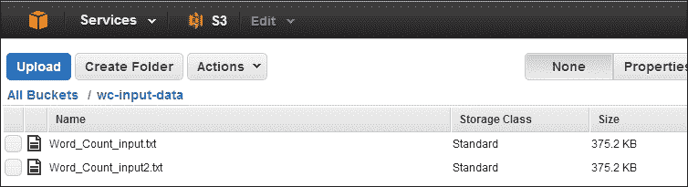
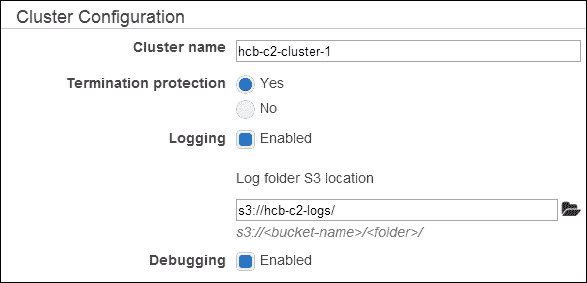
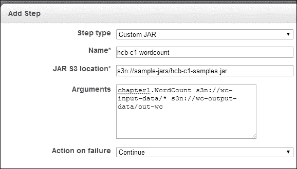
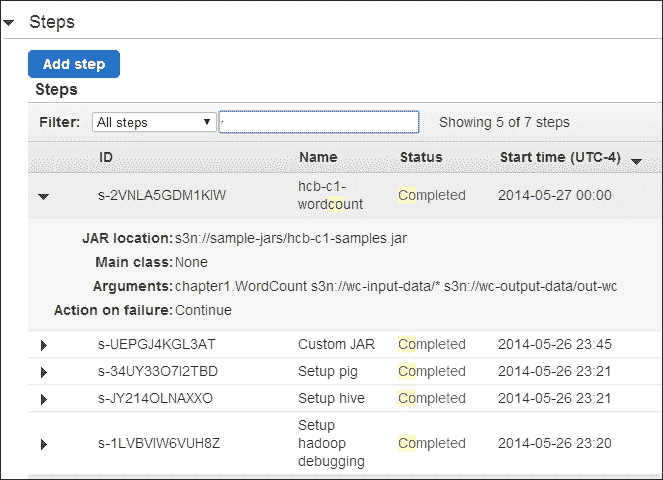
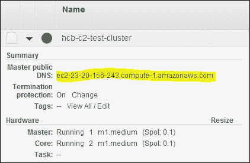
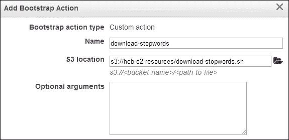

# 二、云部署——在云环境中使用 Hadoop Yarn

在本章中，我们将介绍以下食谱：

*   使用 Amazon Elastic MapReduce 运行 Hadoop MapReduce v2 计算
*   使用 Amazon EC2 Spot 实例执行 EMR 作业流节省资金
*   使用 EMR 执行 Pig 脚本
*   使用 EMR 执行配置单元脚本
*   使用 AWS 命令行界面创建 Amazon EMR 作业流
*   使用 EMR 在 Amazon EC2 上部署 Apache HBase 群集
*   使用 EMR 引导操作为 Amazon EMR 作业配置虚拟机
*   使用 Apache Whirr 在 EC2 环境中部署 Apache Hadoop 群集

# 简介

在本章中，我们将探索在云环境中部署和执行 Hadoop MapReduce v2 和其他 Hadoop 相关计算的几种机制。

像 Amazon EC2 和 Microsoft Azure 这样的云计算环境通过 Web 以服务的形式提供按需计算和存储资源。 这些云计算环境使我们能够在不需要前期资本投资的情况下执行偶尔的大规模 Hadoop 计算，并且只需要为实际的使用付费。 使用云环境的另一个优势是能够以最小的额外成本水平扩展计算资源的数量，从而提高 Hadoop 计算的吞吐量。 例如，使用 10 个云实例 100 小时的成本相当于使用 100 个云实例 10 小时的成本。 除了存储、计算和托管 MapReduce 服务之外，这些云环境还提供许多其他分布式计算服务，在实现整个应用体系结构时，您可能会发现这些服务很有用。

虽然云环境比传统的同类环境具有许多优势，但由于基础设施的虚拟化、多租户特性，它们也带来了几个独特的可靠性和性能挑战。 对于数据密集型 Hadoop 计算，主要挑战之一将是将大型数据集传入和传出云环境。 我们还需要确保使用永久存储介质来存储您需要保存的任何数据。 云实例的临时实例存储中存储的任何数据都将在这些实例终止时丢失。

与 Microsoft Azure 云等其他商业云产品相比，由于 Linux 实例支持的成熟度和托管 Hadoop 服务的成熟度，我们将主要使用 Amazon AWS 云作为本章的食谱。

本章将指导您使用托管 Hadoop 基础设施 Amazon**Elastic MapReduce**(**EMR**)在 Amazon EC2 基础设施上执行传统的 MapReduce 计算以及PIG和Hive计算。 本章还介绍了如何使用 Amazon EMR 调配 HBase 群集，以及如何备份和恢复 EMR HBase 群集的数据。 我们还将使用 Apache Whirr，一个用于在云环境中部署服务的云中立库，在云环境中配置 Apache Hadoop 和 Apache HBase 集群。

### 提示

**示例代码**

本书的示例代码文件位于[https://github.com/thilg/hcb-v2](https://github.com/thilg/hcb-v2)存储库中。 代码库的`chapter2`文件夹包含本章的示例源代码文件。

# 使用 Amazon Elastic MapReduce 运行 Hadoop MapReduce v2 计算

**Amazon Elastic MapReduce**(**EMR**)在Amazon Web Services(**AWS**)云中提供按需管理的 Hadoop群集来执行 Hadoop MapReduce 计算。 EMR 使用 Amazon**Elastic Compute Cloud**(**EC2**)实例作为计算资源。 EMR 支持从 Amazon**Simple Storage Service**(**S3**)读取输入数据，并将输出数据存储在 Amazon S3 中。 EMR 负责云实例的配置、Hadoop 集群的配置以及 MapReduce 计算流的执行。

在本配方中，我们将使用 Amazon Elastic MapReduce 服务在 Amazon EC2 中执行 wordcount MapReduce 示例(*编写 Wordcount MapReduce 应用，将其捆绑，并使用[第 1 章](01.html "Chapter 1. Getting Started with Hadoop v2")，*Hadoop v2*中的 Hadoop 本地模式*配方运行)。

## 做好准备

通过运行示例代码存储库的`chapter1`文件夹中的 Gradle 构建来构建`hcb-c1-samples.jar`文件。

## 怎么做……

以下是在 Amazon Elastic MapReduce 上执行 Wordcount MapReduce 应用的步骤：

1.  通过访问[http://aws.amazon.com](http://aws.amazon.com)注册。
2.  在[https://console.aws.amazon.com/s3](https://console.aws.amazon.com/s3)打开Amazon S3 监控控制台并登录。
3.  通过单击**创建存储桶**，创建一个**S3 存储桶**以上传输入数据。 为您的存储桶提供唯一的名称。 让我们假设存储桶的名称是`wc-input-data`。 您可以在[http://docs.amazonwebservices.com/AmazonS3/latest/gsg/CreatingABucket.html](http://docs.amazonwebservices.com/AmazonS3/latest/gsg/CreatingABucket.html)找到有关创建 S3 存储桶的更多信息。 亚马逊 S3 还存在多个第三方桌面客户端。 您也可以使用其中一个客户端来管理 S3 中的数据。
4.  Upload your input data to the bucket we just created by selecting the bucket and clicking on **Upload**. The input data for the WordCount sample should be one or more text files:

    

5.  创建一个 S3 存储桶来上传我们的 MapReduce 计算所需的 JAR 文件。 让我们假设存储桶的名称为`sample-jars`。 将`hcb-c1-samples.jar`上传到新创建的存储桶中。
6.  Create an S3 bucket to store the output data of the computation. Let's assume the name of this bucket as `wc-output-data`. Create another S3 bucket to store the logs of the computation. Let's assume the name of this bucket is `hcb-c2-logs`.

    ### 备注

    请注意，所有 S3 用户共享 S3 存储桶命名空间。 因此，使用本食谱中给出的示例存储桶名称可能对您不起作用。 在这种情况下，您应该为存储桶指定您自己的自定义名称，并在本食谱的后续步骤中替换这些名称。

7.  在[https://console.aws.amazon.com/elasticmapreduce](https://console.aws.amazon.com/elasticmapreduce)打开亚马逊电子邮件记录控制台。 单击**Create Cluster**按钮创建新的电子病历群集。 为您的群集提供名称。
8.  In the **Log folder S3 location** textbox, enter the path of the S3 bucket you created earlier to store the logs. Select the **Enabled** radio button for **Debugging**.

    

9.  在**软件配置**部分中选择 Hadoop发行版和版本。 选择带有 Amazon Hadoop 发行版的 AMI 版本 3.0.3 或更高版本以部署 Hadoop v2 群集。 保留**要安装的应用**部分中的默认选定应用(Hive、PIG和色调)。
10.  Select the EC2 instance types, instance counts, and the availability zone in the **Hardware Configuration** section. The default options use two EC2 m1.large instances for the Hadoop slave nodes and one EC2 m1.large instance for the Hadoop Master node.

    

11.  保留**Security and Access**和**Bootstrap Actions**部分中的默认选项。
12.  Select the **Custom Jar** option under the **Add Step** dropdown of the **Steps** section. Click on **Configure and add** to configure the JAR file for our computation. Specify the S3 location of `hcb-c1-samples.jar` in the **Jar S3 location** textbox. You should specify the location of the JAR in the format `s3n://bucket_name/jar_name`. In the **Arguments** textbox, type `chapter1.WordCount` followed by the bucket location where you uploaded the input data in step 4 and the output data bucket you created in step 6\. The output path should not exist and we use a directory (for example, `wc-output-data/out1`) inside the output bucket you created in step 6 as the output path. You should specify the locations using the format, `s3n://bucket_name/path`.

    

13.  Click on **Create Cluster** to launch the EMR Hadoop cluster and run the WordCount application.

    ### 备注

    在第 13 步中单击**创建群集**时，Amazon 将为您使用的计算和存储资源收费。请参阅*使用 Amazon EC2 Spot 实例执行 EMR 作业流*食谱，了解如何通过使用 Amazon EC2 Spot 实例来节省资金。

    请注意，AWS 按小时向您收费，任何部分使用都将按小时计费。 实例的每次启动和停止都将按小时计费，即使只需要几分钟。 为进行测试而频繁重新启动群集时，请注意相关费用。

14.  Monitor the progress of your MapReduce cluster deployment and the computation in the **Cluster List** | **Cluster Details** page of the Elastic MapReduce console. Expand the **Steps** section of the page to see the status of the individual steps of the cluster setup and the application execution. Select a step and click on **View logs** to view the logs and to debug the computation. Since EMR uploads the logfiles periodically, you might have to wait and refresh to access the logfiles. Check the output of the computation in the output data bucket using the AWS S3 console.

    

15.  终止您的集群以避免为剩余实例计费。 但是，您可以让集群继续运行，以尝试本章中的其他食谱。

## 另请参阅

*   *编写字数计数 MapReduce 应用，将其捆绑在一起，并使用[第 1 章](01.html "Chapter 1. Getting Started with Hadoop v2")，*《Hadoop v2 入门》*中的 Hadoop 本地模式*配方运行它
*   在分布式群集环境中运行 wordcount 程序的*Hadoop v2*快速入门中的[章](01.html "Chapter 1. Getting Started with Hadoop v2")，*中的*秘诀

# 使用 Amazon EC2 Spot 实例执行 EMR 作业流可节省资金

Amazon**EC2 Spot 实例**允许我们以的大幅折扣购买未充分利用的 EC2 计算资源。 Spot 实例的价格根据需求而变化。 我们可以为 Spot 实例提交投标，如果我们的出价超过当前 Spot 实例价格，我们将收到所请求的计算实例。 亚马逊根据 Spot 实例的实际价格向这些实例收费，该价格可能低于您的出价。 如果 Spot 实例价格超过您的出价，亚马逊将终止您的实例。 但是，如果亚马逊终止您的实例，亚马逊不会按部分 Spot 实例小时数收费。 您可以在[http://aws.amazon.com/ec2/spot-instances/](http://aws.amazon.com/ec2/spot-instances/)上找到有关 AmazonEC2 Spot 实例的更多信息。

Amazon EMR 支持将 Spot 实例用作主实例和辅助计算实例。 Spot 实例是执行批处理作业等非时间关键型计算的理想选择。

## 怎么做……

以下步骤说明如何将 Amazon EC2 Spot 实例与 Amazon Elastic MapReduce 配合使用，以执行 Wordcount MapReduce 应用：

1.  按照使用 Amazon Elastic MapReduce 配方运行 Hadoop MapReduce v2 计算的*中的步骤 1 到 9 操作。*
2.  在**硬件配置**部分中配置 EMR 群集以使用 Spot 实例。 (请参阅*使用 Amazon Elastic MapReduce*配方运行 Hadoop MapReduce v2 计算的步骤 10)。 在**Hardware Configuration**部分中，选中实例类型旁边的**Request Spot**复选框。
3.  Specify your bid price in the **Bid price** textboxes. You can find the Spot Instance pricing history in the Spot Requests window of the Amazon EC2 console ([https://console.aws.amazon.com/ec2](https://console.aws.amazon.com/ec2)).

    

4.  按照使用 Amazon Elastic MapReduce 配方运行 Hadoop MapReduce v2 计算的*步骤 11 到 16 进行操作。*

## 还有更多...

您还可以在传统 EC2 按需实例和 EC2 Spot 实例的组合上运行 EMR 计算，从而安全地保护您的计算免受 Spot 实例可能终止的影响。

由于 Amazon 使用当前 Spot 价格对 Spot 实例进行计费，而不考虑您的出价，因此最好不要将 Spot 实例价格设置得太低，以避免频繁终止的风险。

## 另请参阅

运行 Hadoop MapReduce v2 计算的*使用 Amazon Elastic MapReduce*配方。

# 使用 EMR 执行 Pig 脚本

AmazonEMR 支持对存储在 S3 中的数据执行 Apache Pig 脚本。 有关使用 Apache Pig 进行数据分析的更多详细信息，请参阅[第 7 章](07.html "Chapter 7. Hadoop Ecosystem II – Pig, HBase, Mahout, and Sqoop")、*Hadoop 生态系统 II 中的*Pig 相关食谱-Pig、HBase、Mahout 和 Sqoop*。*

 *在本食谱中，我们将使用 Amazon EMR 执行一个简单的 Pig 脚本。 此示例将使用人类发展报告数据([http://hdr.undp.org/en/statistics/data/](http://hdr.undp.org/en/statistics/data/))打印按 GNI 排序的人均国民总收入大于 2,000 美元的国家名称。

## 怎么做……

以下步骤向您展示了如何将 Pig 脚本与Amazon Elastic MapReduce 一起使用来处理存储在 Amazon S3 上的数据集：

1.  使用 Amazon S3 控制台在 S3 中创建一个存储桶来上传输入数据。 将本章源存储库中的`resources/hdi-data.csv`文件上传到新创建的存储桶中。 您还可以使用现有存储桶或存储桶内的目录。 我们假设上载文件的 S3 路径为`hcb-c2-data/hdi-data.csv`。
2.  查看本章源代码存储库的`resources/countryFilter-EMR.pig` 文件中提供的 Pig 脚本。 此脚本使用`STORE`命令将结果保存在文件系统中。 此外，我们通过添加`$INPUT`作为输入文件来参数化 Pig 脚本的`LOAD`命令，并通过添加`$OUTPUT`作为输出目录来参数化 store 命令。 这两个参数将替换为我们在步骤 5 中指定的 S3 输入和输出位置。

    ```scala
    A = LOAD '$INPUT' using PigStorage(',')  AS 
    (id:int, country:chararray, hdi:float, lifeex:int,
    mysch:int, eysch:int, gni:int);
    B = FILTER A BY gni > 2000;
    C = ORDER B BY gni;
    STORE C into '$OUTPUT';
    ```

3.  使用 Amazon S3 控制台在 S3 中创建存储桶以上传 Pig 脚本。 将`resources/countryFilter-EMR.pig`脚本上传到新创建的存储桶中。 您还可以使用现有存储桶或存储桶内的目录。 我们假设上载文件的 S3 路径为`hcb-c2-resources/countryFilter-EMR.pig`。
4.  Open the Amazon EMR console at [https://console.aws.amazon.com/elasticmapreduce](https://console.aws.amazon.com/elasticmapreduce). Click on the **Create Cluster** button to create a new EMR cluster. Provide a name for your cluster. Follow steps 8 to 11 of the *Running Hadoop MapReduce v2 computations using Amazon Elastic MapReduce* recipe to configure your cluster.

    ### 备注

    您可以使用 Amazon Elastic MapReduce 配方重用在运行 Hadoop MapReduce v2 计算的*中创建的 EMR 集群，以遵循本配方的步骤。 为此，请使用正在运行的集群的**Cluster Details**页面中的**Add Step**选项来执行步骤 5 中提到的操作。*

5.  Select the **Pig Program** option under the **Add Step** dropdown of the **Steps** section. Click on **Configure and add** to configure the Pig script, input, and output data for our computation. Specify the S3 location of the Pig script we uploaded in step 3, in the **Script S3 location** textbox. You should specify the location of the script in the format `s3://bucket_name/script_filename`. Specify the S3 location of the uploaded input data file in the **Input S3 Location** textbox. In the **Output S3 Location** textbox, specify an S3 location to store the output. The output path should not exist; we use a non-existing directory (for example, `hcb-c2-out/pig`) inside the output bucket as the output path. You should specify the locations using the format `s3://bucket_name/path`. Click on **Add**.

    

6.  Click on **Create Cluster** to launch the EMR Hadoop cluster and to run the configured Pig script.

    ### 备注

    Amazon 将在第 8 步中单击**Create Job Flow**，对您使用的计算和存储资源收费。请参阅我们之前讨论的*使用 EC2 Spot 实例执行 EMR 作业流*食谱，了解如何通过使用 Amazon EC2 Spot 实例来节省资金。

7.  在 Elastic MapReduce 控制台的**群集列表**|**群集详细信息**页面中监视MapReduce群集部署和计算的进度。 展开并刷新页面的**步骤**部分，查看集群设置和应用执行的各个步骤的状态。 选择一个步骤并单击**查看日志**以查看日志并调试计算。 使用 AWS S3 控制台检查输出数据桶中的计算输出。

## 还有更多...

Amazon EMR 还允许我们在交互模式下使用 Apache Pig。

### 启动PIG互动会话

1.  在[https://console.aws.amazon.com/elasticmapreduce](https://console.aws.amazon.com/elasticmapreduce)打开亚马逊电子邮件记录控制台。 单击**Create Cluster**按钮创建新的电子病历群集。 为您的群集提供名称。
2.  您必须从**安全和访问**部分的**Amazon EC2 密钥对**下拉列表中选择密钥对。 如果您没有可用的 Amazon EC2 密钥对访问私钥，请登录 Amazon EC2 控制台并创建新的密钥对。
3.  在不指定任何步骤的情况下，单击**创建集群**。 确保在**步骤**部分下的**自动终止**选项中选择了**否**。
4.  Monitor the progress of your MapReduce cluster deployment and the computation in the **Cluster Details** page under **Cluster List** of the Elastic MapReduce console. Retrieve **Master Public DNS** from the cluster details in this page.

    

5.  使用步骤 2 中指定的 Amazon EC2 密钥对的主公共 DNS 名称和私钥文件通过 SSH 连接到集群的主节点：

    ```scala
    $ ssh -i <path-to-the-key-file> hadoop@<master-public-DNS>

    ```

6.  在主节点中启动Pig 交互式 Grunt shell 并发出您的 Pig 命令：

    ```scala
    $ pig
    .........
    grunt>

    ```

# 使用 EMR 执行配置单元脚本

HIVE利用其下的 Hadoop MapReduce 为 HDFS 中存储的数据提供了类似 SQL 的查询层。 Amazon EMR 支持对存储在 S3 中的数据执行配置单元查询。 有关使用配置单元进行大规模数据分析的更多信息，请参阅[章](06.html "Chapter 6. Hadoop Ecosystem – Apache Hive")、*Hadoop 生态系统-Apache 配置单元*中的 Apache Have 配方。

在这个配方中，我们将执行一个配置单元脚本，以执行前面使用 EMR 配方在*Executing a Pig 脚本中执行的计算。 我们将使用“人类发展报告”数据([http://hdr.undp.org/en/statistics/data/](http://hdr.undp.org/en/statistics/data/))打印按国民总收入排序的国民总收入大于人均国民总收入 2,000 美元的国家的名称。*

## 怎么做……

以下步骤显示如何将配置单元脚本与 Amazon Elastic MapReduce 配合使用，以查询存储在 Amazon S3 上的数据集：

1.  使用 Amazon S3 控制台在 S3 中创建一个存储桶来上传输入数据。 在存储桶内创建一个目录。 将本章源包中的`resources/hdi-data.csv`文件上传到存储桶内新创建的目录中。 您还可以使用现有存储桶或存储桶内的目录。 我们假设上载文件的 S3 路径为`hcb-c2-data/data/hdi-data.csv`。
2.  查看本章来源资料库的`resources/countryFilter-EMR.hql`文件中提供的配置单元脚本。 该脚本首先创建输入数据到配置单元表的映射。 然后，我们创建一个配置单元表来存储查询结果。 最后，我们发出一个查询以选择国民总收入大于 2000 美元的国家/地区列表。 我们使用`$INPUT`和`$OUTPUT`变量来指定输入数据的位置和存储输出表数据的位置。

    ```scala
    CREATE EXTERNAL TABLE 
    hdi(
        id INT, 
        country STRING, 
        hdi FLOAT, 
        lifeex INT, 
        mysch INT, 
        eysch INT, 
        gni INT) 
    ROW FORMAT DELIMITED 
    FIELDS TERMINATED BY ',' 
    STORED AS TEXTFILE
    LOCATION '${INPUT}';

    CREATE EXTERNAL TABLE 
    output_countries(
        country STRING, 
        gni INT) 
        ROW FORMAT DELIMITED
        FIELDS TERMINATED BY ','
        STORED AS TEXTFILE
        LOCATION '${OUTPUT}';

    INSERT OVERWRITE TABLE 
    output_countries
      SELECT 
        country, gni 
      FROM 
        hdi 
      WHERE 
        gni > 2000;
    ```

3.  使用Amazon S3 控制台在 S3 中创建存储桶以上传配置单元脚本。 将`resources/countryFilter-EMR.hql`脚本上传到新创建的存储桶中。 您还可以使用现有存储桶或存储桶内的目录。 我们假设上载文件的 S3 路径为`hcb-resources/countryFilter-EMR.hql`。
4.  Open the Amazon EMR console at [https://console.aws.amazon.com/elasticmapreduce](https://console.aws.amazon.com/elasticmapreduce). Click on the **Create Cluster** button to create a new EMR cluster. Provide a name for your cluster. Follow steps 8 to 11 of the *Running Hadoop MapReduce v2 computations using Amazon Elastic MapReduce* recipe to configure your cluster.

    ### 备注

    您可以重用为前面的某个食谱创建的 EMR 集群，以遵循本食谱的步骤。 为此，请使用正在运行的集群的**Cluster Details**页面中的**Add Step**选项来执行步骤 5 中提到的操作。

5.  Select the **Hive Program** option under the **Add Step** dropdown of the **Steps** section. Click on **Configure and add** to configure the Hive script, and input and output data for our computation. Specify the S3 location of the Hive script we uploaded in step 3 in the **Script S3 location** textbox. You should specify the location of the script in the format `s3://bucket_name/script_filename`. Specify the S3 location of the uploaded input data directory in the **Input S3 Location** textbox. In the **Output S3 Location** textbox, specify an S3 location to store the output. The output path should not exist and we use a nonexisting directory (for example, `hcb-c2-out/hive`) inside the output bucket as the output path. You should specify the locations using the format `s3://bucket_name/path`. Click on **Add**.

    

6.  Click on **Create Cluster** to launch the EMR Hadoop cluster and to run the configured Hive script.

    ### 备注

    Amazon 将在第 8 步中单击**Create Job Flow**，对您使用的计算和存储资源收费。请参阅前面讨论的使用 Amazon EC2 Spot 实例执行 EMR 作业流来执行 EMR 作业流食谱，了解如何通过使用 Amazon EC2 Spot 实例来节省资金。

7.  在 Elastic MapReduce 控制台的**群集列表**下的**群集详细信息**页面中监视 MapReduce 群集部署和计算的进度。 展开并刷新页面的**步骤**部分，查看集群设置和应用执行的各个步骤的状态。 选择一个步骤并单击**查看日志**以查看日志并调试计算。 使用 AWS S3 控制台检查输出数据桶中的计算输出。

## 还有更多...

Amazon EMR 还允许我们在交互模式下使用Hive外壳。

### 启动配置单元互动会话

按照前面的*中的*启动 Pig 交互式会话*部分中的步骤 1 到 5，使用 EMR*配方执行 Pig 脚本，创建一个集群并使用 SSH 登录到该集群。

在主节点中启动配置单元外壳，并发出您的配置单元查询：

```scala
$ hive
hive >
.........

```

## 另请参阅

第 6 章，*Hadoop 生态系统*的[章](06.html "Chapter 6. Hadoop Ecosystem – Apache Hive")，*的*简单 SQL 样式的数据查询使用 Apache Have*配方-Apache Have*。**

# 使用 AWS 命令行界面创建 Amazon EMR 作业流

AWS**命令行界面**(**CLI**)是一个允许我们从命令行管理我们的 AWS 服务的工具。 在本配方中，我们使用AWS CLI 来管理 Amazon EMR 服务。

此配方使用 AWS CLI 创建一个 EMR 作业流，以执行本章使用 Amazon Elastic MapReduce 配方运行 Hadoop MapReduce 计算的*中的 WordCount 示例。*

## 做好准备

以下是开始使用本食谱的前提条件：

*   Python 2.6.3 或更高版本
*   PIP-Python 包管理系统

## 怎么做……

以下步骤显示了如何使用 EMR 命令行界面创建 EMR 作业流：

1.  Install AWS CLI in your machine using the pip installer:

    ```scala
    $ sudo pip install awscli

    ```

    ### 备注

    有关安装 AWS CLI 的更多信息，请参阅[http://docs.aws.amazon.com/cli/latest/userguide/installing.html](http://docs.aws.amazon.com/cli/latest/userguide/installing.html)。 本指南提供了在不使用`sudo`的情况下安装 AWS CLI 的说明，以及使用其他方法安装 AWS CLI 的说明。

2.  通过登录 AWS IAM 控制台([https://console.aws.amazon.com/iam](https://console.aws.amazon.com/iam))创建访问密钥ID 和秘密访问密钥。 下载密钥文件并将其保存在安全位置。
3.  Use the `aws configure` utility to configure your AWS account to the AWC CLI. Provide the access key ID and the secret access key you obtained in the previous step. This information would get stored in the `.aws/config` and `.aws/credentials` files in your home directory.

    ```scala
    $ aws configure
    AWS Access Key ID [None]: AKIA….
    AWS Secret Access Key [None]: GC…
    Default region name [None]: us-east-1a
    Default output format [None]: 

    ```

    ### 提示

    如果您已完成本章中使用 Amazon Elastic MapReduce 进行 Hadoop MapReduce 计算的*运行 Hadoop MapReduce 计算中的步骤 2 至 6，则可以跳到步骤 7。*

4.  在 AmazonS3 监控控制台([https://console.aws.amazon.com/s3](https://console.aws.amazon.com/s3))中单击**create Bucket**，创建一个存储桶来上传输入数据。 为您的存储桶提供一个唯一的名称。 通过选择存储桶并单击**Upload**将输入数据上传到新创建的存储桶。 WordCount 示例的输入数据应该是一个或多个文本文件。
5.  创建一个 S3 存储桶来上传我们的 MapReduce 计算所需的 JAR 文件。 上传`hcb-c1-samples.jar`到新创建的存储桶中。
6.  创建一个 S3 存储桶来存储计算的输出数据。 创建另一个 S3 存储桶来存储计算日志。 让我们假设这个存储桶的名称是`hcb-c2-logs`。
7.  通过执行以下命令创建EMR 集群。 此命令将输出创建的 EMR 群集的群集 ID：

    ```scala
    $ aws emr create-cluster --ami-version 3.1.0 \
    --log-uri s3://hcb-c2-logs \
    --instance-groups \
    InstanceGroupType=MASTER,InstanceCount=1,\
    InstanceType=m3.xlarge \
    InstanceGroupType=CORE,InstanceCount=2,\
    InstanceType=m3.xlarge
    {
     “ClusterId”: “j-2X9TDN6T041ZZ”
    }

    ```

8.  您可以使用`list-clusters`命令检查创建的 EMR 群集的状态：

    ```scala
    $ aws emr list-clusters
    {
     “Clusters”: [
     {
     “Status”: {
     “Timeline”: {
     “ReadyDateTime”: 1421128629.1830001,
     “CreationDateTime”: 1421128354.4130001
     },
     “State”: “WAITING”,
     “StateChangeReason”: {
     “Message”: “Waiting after step completed”
     }
     },
     “NormalizedInstanceHours”: 24,
     “Id”: “j-2X9TDN6T041ZZ”,
     “Name”: “Development Cluster”
     }
     ]
    }

    ```

9.  通过执行以下命令将作业步骤添加到此 EMR 集群。 将 JAR 文件的路径、输入数据位置和输出数据位置替换为步骤 5、6 和 7 中使用的位置。将`cluster-id`替换为新创建的 EMR 集群的集群 ID。

    ```scala
    $ aws emr add-steps \
    --cluster-id j-2X9TDN6T041ZZ \
    --steps Type=CUSTOM_JAR,Name=CustomJAR,ActionOnFailure=CONTINUE,\
    Jar=s3n://[S3 jar file bucket]/hcb-c1-samples.jar,\
    Args=chapter1.WordCount,\
    s3n://[S3 input data path]/*,\
    s3n://[S3 output data path]/wc-out
    {
     “StepIds”: [
     “s-1SEEPDZ99H3Y2”
     ]
    }

    ```

10.  使用`describe-step`命令检查提交的作业步骤的状态，如下所示。 您还可以使用 Amazon EMR 控制台([https://console.aws.amazon.com/elasticmapreduce](https://console.aws.amazon.com/elasticmapreduce))检查状态并调试作业流。

    ```scala
    $ aws emr describe-step \
    –cluster-id j-2X9TDN6T041ZZ \
    –step-id s-1SEEPDZ99H3Y2

    ```

11.  作业流完成后，使用 S3 控制台在输出数据位置检查计算结果。
12.  使用`terminate-clusters`命令终止群集：

    ```scala
    $ aws emr terminate-clusters --cluster-ids j-2X9TDN6T041ZZ

    ```

## 还有更多...

您可以将 EC2 Spot 实例与 EMR 集群配合使用，以降低计算成本。 通过将`--BidPrice`参数添加到您的`create-cluster`命令的实例组，将投标价格添加到您的请求中：

```scala
$ aws emr create-cluster --ami-version 3.1.0 \
--log-uri s3://hcb-c2-logs \
--instance-groups \
InstanceGroupType=MASTER,InstanceCount=1,\
InstanceType=m3.xlarge,BidPrice=0.10 \
InstanceGroupType=CORE,InstanceCount=2,\
InstanceType=m3.xlarge,BidPrice=0.10

```

有关 Amazon Spot 实例的更多详细信息，请参阅本章中的*使用 Amazon EC2 Spot 实例执行 EMR 作业流*食谱。

## 另请参阅

*   本章的*使用 Amazon Elastic MapReduce*配方运行 Hadoop MapReduce 计算
*   您可以在[http://docs.aws.amazon.com/cli/latest/reference/emr/index.html](http://docs.aws.amazon.com/cli/latest/reference/emr/index.html)找到 AWS CLI 电子病历部分的参考文档

# 使用 EMR 在 Amazon EC2 上部署 Apache HBase 群集

我们可以使用 Amazon Elastic MapReduce在 Amazon 基础设施上启动 Apache HBase 集群，以便在面向列的数据存储中存储大量数据。 我们还可以将存储在 Amazon EMR HBase 集群上的数据用作 EMR MapReduce 计算的输入和输出。 我们可以将存储在 Amazon EMR HBase 群集中的数据增量备份到 Amazon S3 以实现数据持久性。 我们还可以通过从以前的 S3 备份恢复数据来启动 EMR HBase 群集。

在本食谱中，我们使用 Amazon EMR 在 Amazon EC2 上启动 Apache HBase 群集；在新创建的 HBase 群集上执行几个简单操作，并在关闭群集之前将 HBase 数据备份到 Amazon S3。 然后，我们启动一个新的 HBase 集群，从原来的 HBase 集群恢复 HBase 数据备份。

## 做好准备

您应该安装 AWS CLI 并将其配置为手动备份 HBase 数据。 有关安装和配置 AWS CLI 的详细信息，请参阅本章中的*使用 AWS 命令行界面*配方创建 Amazon EMR 作业流。

## 怎么做……

以下步骤显示如何使用 Amazon EMR 在 Amazon EC2 上部署 Apache HBase 群集：

1.  创建一个 S3 存储桶来存储 HBase 备份。 我们假设 HBase 数据备份的 S3 存储桶为`hcb-c2-data`。
2.  在[https://console.aws.amazon.com/elasticmapreduce](https://console.aws.amazon.com/elasticmapreduce)打开Amazon EMR 控制台。 单击**Create Cluster**按钮创建新的电子病历群集。 为您的群集提供名称。
3.  在**日志文件夹 S3 位置**中提供路径，并选择具有 Hadoop v2 的**AMI 版本**(例如，具有 Hadoop 2.4.0 的 AMI 版本 3.1.0)。
4.  从**要安装的应用**部分下的**其他应用**下拉框中选择**HBase**。 单击**配置并添加**。
5.  Make sure the **Restore from backup** radio button is not selected. Select the **Schedule regular backups** and **Consistent Backup** radio buttons. Specify a **Backup frequency** for automatic scheduled incremental data backups and provide a path inside the Blob we created in step 1 as the backup location. Click on **Continue**.

    

6.  在**硬件配置**部分配置 EC2 实例。
7.  Select a key pair in the **Amazon EC2 Key Pair** drop-down box. Make sure you have the private key for the selected EC2 key pair downloaded on your computer.

    ### 备注

    如果没有可用的密钥对，请转到 EC2 控制台([https://console.aws.amazon.com/ec2](https://console.aws.amazon.com/ec2))创建密钥对。 要创建密钥对，请登录 EC2 仪表板，选择一个区域，然后单击**网络和安全**菜单下的**密钥对**。 单击**密钥对**窗口中的**创建密钥对**按钮，并提供新密钥对的名称。 下载私钥文件(PEM 格式)并将其保存在安全位置。

8.  Click on the **Create Cluster** button to deploy the EMR HBase cluster.

    ### 备注

    Amazon 将通过单击上一步中的**Create Cluster**向您收取您使用的计算和存储资源的费用。 请参考前面讨论的*使用 Amazon EC2 Spot 实例执行 EMR 工作流*食谱，了解如何通过使用 Amazon EC2 Spot 实例来节省资金。

以下步骤将向您展示如何连接到已部署的 HBase 集群的主节点以启动 HBase shell：

1.  转到 Amazon EMR 控制台([https://console.aws.amazon.com/elasticmapreduce](https://console.aws.amazon.com/elasticmapreduce))。 选择 HBase 群集的**群集详细信息**以查看有关该群集的更多信息。 从信息窗格中检索**主公共 DNS 名称**。
2.  使用主公共 DNS 名称和基于 EC2 PEM 的密钥(在步骤 4 中选择)连接到 HBase 群集的主节点：

    ```scala
    $ ssh -i ec2.pem hadoop@ec2-184-72-138-2.compute-1.amazonaws.com

    ```

3.  Start the HBase shell using the `hbase shell` command. Create a table named `'test'` in your HBase installation and insert a sample entry to the table using the `put` command. Use the `scan` command to view the contents of the table.

    ```scala
    $ hbase shell
    .........

    hbase(main):001:0> create 'test','cf'
    0 row(s) in 2.5800 seconds

    hbase(main):002:0> put 'test','row1','cf:a','value1'
    0 row(s) in 0.1570 seconds

    hbase(main):003:0> scan 'test'
    ROW                   COLUMN+CELL
     row1                 column=cf:a, timestamp=1347261400477, value=value1 
    1 row(s) in 0.0440 seconds

    hbase(main):004:0> quit

    ```

    下面的步将备份存储在 Amazon EMR HBase 群集中的数据。

4.  使用 AWS CLI 执行以下命令，计划对 EMR HBase 集群中存储的数据进行定期备份。 从 EMR 控制台检索群集 ID(例如，`j-FDMXCBZP9P85`)。 使用检索到的作业流名称替换`<cluster_id>`。 根据您的备份数据 Blob 更改备份目录路径(`s3://hcb-c2-data/hbase-backup`)。 等待几分钟以执行备份。

    ```scala
    $ aws emr schedule-hbase-backup --cluster-id <cluster_id> \
     --type full –dir s3://hcb-c2-data/hbase-backup \
    --interval 1 --unit hours 

    ```

5.  Go to the **Cluster Details** page in the EMR console and click on **Terminate**.

    现在，我们将通过从备份恢复数据来启动新的 Amazon EMR HBase 群集：

6.  通过单击 EMR 控制台中的**Create Clusters**按钮创建新的作业流。 为您的群集提供名称。 在**Log Folder S3 位置**中提供路径，并选择具有 Hadoop v2 的 AMI 版本(例如，具有 Hadoop 2.4.0 的 AMI 版本 3.1.0)。
7.  从**要安装的应用**部分下的**其他应用**下拉框中选择**HBase**。 单击**配置并添加**。
8.  配置 EMR HBase 群集以从以前的数据备份恢复数据。 选择**从备份**还原选项，并在**备份位置**文本框中提供您在步骤 9 中使用的备份目录路径。 您可以将备份版本文本框留空，电子病历将还原最新的备份。 单击**继续**。
9.  重复步骤 4、5、6 和 7。
10.  登录到？启动 HBase shell。 新 HBase 群集的主节点。 使用`list`命令列出 HBase 中的集合表格，使用`scan 'test'`命令查看`'test'`表格的内容。

    ```scala
    $ hbase shell
    .........

    hbase(main):001:0> list
    TABLE
    test
    1 row(s) in 1.4870 seconds

    hbase(main):002:0> scan 'test'
    ROW                   COLUMN+CELL
     row1                 column=cf:a, timestamp=1347318118294, value=value1 
    1 row(s) in 0.2030 seconds

    ```

11.  通过转到**Cluster Details**页面并单击**Terminate**按钮，使用 EMR 控制台终止您的群集。

## 另请参阅

[第 7 章](07.html "Chapter 7. Hadoop Ecosystem II – Pig, HBase, Mahout, and Sqoop")、*Hadoop 生态系统 II 中与HBase 相关的配方--Pig、HBase、Mahout 和 Sqoop*。

# 使用 EMR 引导操作为 Amazon EMR 作业配置虚拟机

**EMR 引导操作**为我们提供了一种在运行 MapReduce 计算之前配置EC2 实例的机制。 引导操作的示例包括为 Hadoop 提供自定义配置、安装任何相关软件、分发公共数据集等。 Amazon 提供了一组预定义的引导操作，并允许我们编写自己的自定义引导操作。 EMR 在启动 Hadoop 群集服务之前在每个实例中运行引导操作。

在本食谱中，我们将使用停用词列表从单词计数示例中筛选出常用单词。 我们使用自定义引导操作将停止单词列表下载到工人。

## 怎么做……

以下步骤显示如何使用引导脚本将文件下载到 EMR 计算的所有 EC2 实例：

1.  将以下脚本保存到名为`download-stopwords.sh`的文件中。 将文件上传到 Amazon S3 中的 Blob 容器。 此自定义引导文件将停用词列表下载到每个实例，并将其复制到实例内的预先指定的目录中。

    ```scala
    #!/bin/bash
    set -e
    wget http://www.textfixer.com/resources/common-english-words-with-contractions.txt
    mkdir –p /home/hadoop/stopwords
    mv common-english-words-with-contractions.txt /home/hadoop/stopwords

    ```

2.  完成本章中使用 Amazon Elastic MapReduce 配方运行 Hadoop MapReduce 计算的*步骤 1 至 10。*
3.  Select the **Add Bootstrap Actions** option in the **Bootstrap Actions** tab. Select **Custom Action** in the **Add Bootstrap Actions** drop-down box. Click on **Configure and add**. Give a name to your action in the **Name** textbox and provide the S3 path of the location where you uploaded the `download-stopwords.sh` file in the **S3 location** textbox. Click on **Add**.

    

4.  如果需要，添加**步骤**。
5.  单击**创建集群**按钮启动实例并部署 MapReduce 集群。
6.  单击 EMR 控制台中的**刷新**，然后转到**群集详细信息**页面以查看群集的详细信息。

## 还有更多...

Amazon为我们提供了以下预定义的引导操作：

*   `configure-daemons`：这允许我们为 Hadoop 守护进程设置**Java 虚拟机**(**JVM**)选项，比如堆大小和垃圾收集行为。
*   `configure-hadoop`：这允许我们修改 Hadoop 配置设置。 我们可以上传 Hadoop 配置 XML，也可以将各个配置选项指定为键-值对。
*   `memory-intensive`：此允许我们为内存密集型工作负载配置 Hadoop 集群。
*   `run-if`：这允许我们基于实例的属性运行引导操作。 当我们只想在 Hadoop 主节点中运行命令时，可以使用此操作。

您还可以通过将脚本写入实例中的指定目录来创建关机操作。 SHUTDOWN操作在作业流终止后执行。

有关详细信息，请参阅[http://docs.amazonwebservices.com/ElasticMapReduce/latest/DeveloperGuide/Bootstrap.html](http://docs.amazonwebservices.com/ElasticMapReduce/latest/DeveloperGuide/Bootstrap.html)。

# 使用 Apache Whirr 在云环境中部署 Apache Hadoop 群集

Apache Whirr 提供了一组与云供应商无关的库，用于在云资源上提供服务。 Apache Whirr 支持在几个云环境中配置、安装和配置 Hadoop 集群。 除了 Hadoop，Apache Whirr 还支持在云环境中提供 Apache Cassandra、Apache ZooKeeper、Apache HBase、Voldemort(键值存储)和 Apache Hama 集群。

### 备注

几个商业 Hadoop 发行版(如 Hortonworks HDP 和 Cloudera CDH)的安装程序现在支持在 Amazon EC2 实例上安装和配置这些发行版。 与使用 Apache Whirr 相比，这些基于商业分发的安装将在云上为您提供功能更丰富的 Hadoop 集群。

在本菜谱中，我们将使用 Apache Whirr 在 Amazon EC2 上启动 Hadoop 集群，并在该集群上运行 wordcount MapReduce 示例(*编写 Wordcount MapReduce 应用，将其捆绑，并使用[第 1 章](01.html "Chapter 1. Getting Started with Hadoop v2")，*《Hadoop v2 入门》*中的 Hadoop 本地模式*菜谱运行)。

## 怎么做……

以下是使用 Apache Whirr 在 Amazon EC2 上部署 Hadoop 群集以及在部署的群集上执行 Wordcount MapReduce 示例的步骤：

1.  从[http://whirr.apache.org/](http://whirr.apache.org/)下载并解压缩 Apache Whirr 二进制发行版。 您也可以通过 Hadoop 发行版安装 Whirr。
2.  从解压的目录运行以下命令以验证您的 Whirr 安装：

    ```scala
    $ whirr version
    Apache Whirr 0.8.2
    jclouds 1.5.8

    ```

3.  将您的 AWS 访问密钥导出到`AWS_ACCESS_KEY_ID`和`AWS_SECRET_ACCESS_KEY`环境参数：

    ```scala
    $ export AWS_ACCESS_KEY_ID=AKIA…
    $ export AWS_SECRET_ACCESS_KEY=…

    ```

4.  使用下面的the命令生成**rsa 密钥对**。 此密钥对与您的 AWS 密钥对不同。

    ```scala
    $ssh-keygen -t rsa -P ''

    ```

5.  在 Apache Whirr 安装中找到名为`recipes/hadoop-yarn-ec2.properties`的文件。 将其复制到您的工作目录。 更改`whirr.hadoop.version`属性以匹配 Apache Hadoop 下载页面中提供的当前 Hadoop 版本(例如，2.5.2)。
6.  If you provided a custom name for your key-pair in the previous step, change the `whirr.private-key-file` and the `whirr.public-key-file` property values in the `hadoop-yarn-ec2.properties` file to the paths of the private key and the public key you generated.

    ### 提示

    `whirr.aws-ec2-spot-price`属性是一个可选属性，它允许我们使用更便宜的 EC2 Spot 实例。 您可以删除该属性以使用 EC2 传统按需实例。

7.  执行以下命令，指向您的`hadoop-yarn-ec2.properties`文件，在 EC2 上启动您的 Hadoop 集群。 成功创建集群后，此命令将输出一个 SSH 命令，我们可以使用该命令登录 EC2Hadoop 集群。

    ```scala
    $bin/whirr launch-cluster --config hadoop-yarn-ec2.properties

    ```

8.  从外部到调配的 EC2 Hadoop 群集的流量通过主节点路由。 Whirr 在`~/.whirr`目录中以 Hadoop 集群命名的子目录下生成一个脚本，我们可以使用该脚本启动该代理。 在一个新的终端上运行这个。 Whirr 启动集群并生成此脚本需要几分钟时间。

    ```scala
    $cd ~/.whirr/Hadoop-yarn/
    $hadoop-proxy.sh

    ```

9.  您可以通过在 Web 浏览器中配置此代理，在本地计算机中打开基于 Hadoop Web 的监控控制台。
10.  Whirr 在`~/.whirr/<your cluster name>`目录中为您的集群生成一个`hadoop-site.xml`文件。 您可以使用它从本地计算机向 EC2 上的 Hadoop 集群发出 Hadoop 命令。 将生成的`hadoop-site.xml`的路径导出到名为`HADOOP_CONF_DIR`的环境变量。 将此目录中的`hadoop-site.xml`文件复制到名为`core-site.xml`的另一个文件中。 要执行 Hadoop 命令，您应该在您的机器上安装 Hadoopv2 二进制文件。

    ```scala
    $ cp ~/.whirr/hadoop-yarn/hadoop-site.xml ~/.whirr/hadoop-yarn/core-site.xml
    $ export HADOOP_CONF_DIR=~/.whirr/hadoop-yarn/
    $ hdfs dfs -ls /

    ```

11.  在 HDFS 中创建名为`wc-input-data`的目录，并将文本数据集上传到该目录。 根据 Whirr 的版本，您可能需要首先创建您的主目录。

    ```scala
    $ hdfs dfs –mkdir /user/<user_name>
    $ hdfs  dfs -mkdir wc-input-data
    $ hdfs dfs -put sample.txt wc-input-data

    ```

12.  在本步骤中，我们在 Amazon EC2 中启动的 Hadoop 集群中运行 Hadoop wordcount 示例：

    ```scala
    $ hadoop jar hcb-c1-samples.jar chapter1.WordCount \
    wc-input-data wc-out

    ```

13.  通过执行以下命令查看字数计算结果：

    ```scala
    $hadoop fs -ls wc-out
    Found 3 items
    -rw-r--r--   3 thilina supergroup          0 2012-09-05 15:40 /user/thilina/wc-out/_SUCCESS
    drwxrwxrwx   - thilina supergroup          0 2012-09-05 15:39 /user/thilina/wc-out/_logs
    -rw-r--r--   3 thilina supergroup      19908 2012-09-05 15:40 /user/thilina/wc-out/part-r-00000

    $ hadoop fs -cat wc-out/part-* | more

    ```

14.  发出以下命令关闭 Hadoop 集群。 请确保在关闭群集之前下载所有重要数据，因为关闭群集后数据将永久丢失。

    ```scala
    $bin/whirr destroy-cluster --config hadoop.properties

    ```

## 它是如何工作的.

以下是我们在`hadoop.properties`文件中使用的属性的说明。

```scala
whirr.cluster-name=Hadoop-yarn
```

前面的属性提供了群集的名称。 群集的实例将使用此名称进行标记。

```scala
whirr.instance-templates=1 hadoop-namenode+yarn-resource-manager+mapreduce-historyserver, 1 hadoop-datanode+yarn-nodemanager
```

此属性指定要用于每组角色的实例数以及实例的角色类型。

```scala
whirr.provider=aws-ec2
```

我们使用 Whirr Amazon EC2 提供程序来配置我们的群集。

```scala
whirr.private-key-file=${sys:user.home}/.ssh/id_rsa
whirr.public-key-file=${sys:user.home}/.ssh/id_rsa.pub
```

前面提到的属性都指向您为集群提供的私钥和公钥的路径。

```scala
whirr.hadoop.version=2.5.2
```

我们使用前面的属性指定自定义 Hadoop 版本。

```scala
whirr.aws-ec2-spot-price=0.15
```

此属性指定 Amazon EC2 Spot 实例的投标价格。 指定此属性将触发 Whirr 对簇使用 EC2 Spot 实例。 如果没有达到投标价格，Apache Whirr Spot 实例会在 20 分钟后请求超时。 有关更多详细信息，请参阅*使用 Amazon EC2 Spot 实例执行 EMR 工作流*食谱。

有关 Whirr 配置的更多详细信息，请参见[http://whirr.apache.org/docs/0.8.1/configuration-guide.html](http://whirr.apache.org/docs/0.8.1/configuration-guide.html)。

## 另请参阅

*使用 Amazon EC2 Spot 实例执行 EMR 作业流节省资金*秘诀。*