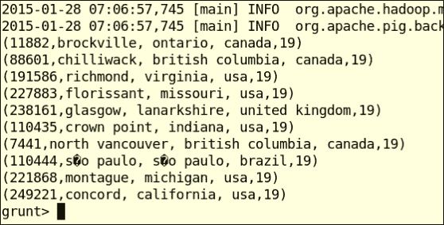
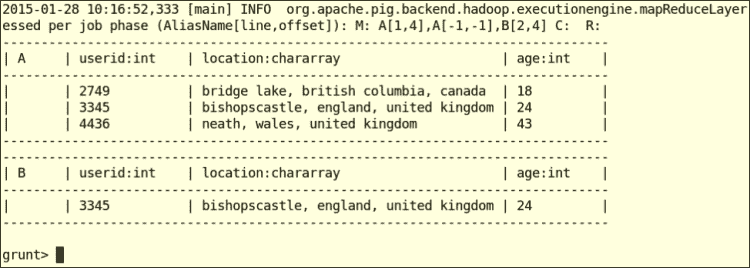
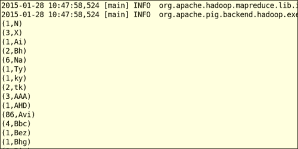

# 第 7 章：Hadoop 生态系统 II--Pig、HBase、Mahout 和 Sqoop

在本章中，我们将介绍以下主题：

*   Apache Pig 入门
*   使用 Pig 连接两个数据集
*   使用 HCatalog 访问 Pig 中的蜂窝表数据
*   Apache HBase 入门
*   使用 Java 客户端 API 随机访问数据
*   在 HBase 上运行 MapReduce 作业
*   使用配置单元将数据插入 HBase 表
*   Apache Mahout 入门
*   使用 Mahout 运行 K-Means
*   使用 Apache Sqoop 将数据从关系数据库导入 HDFS
*   使用 Apache Sqoop 将数据从 HDFS 导出到关系数据库

# 简介

Hadoop 生态系统有一系列项目，这些项目要么构建在 Hadoop 之上，要么与 Hadoop 紧密合作。 这些项目催生了一个专注于大规模数据处理的生态系统，用户往往可以组合使用几个这样的项目来解决他们的大数据问题。

本章介绍 Hadoop 生态系统中的几个关键项目，并展示如何开始使用每个项目。

重点抓好以下四个项目：

*   **Pig**：一种数据流样式的数据处理语言，用于大规模处理存储在 HDFS 中的数据
*   **HBase**：一种NoSQL 风格的高度可扩展的数据存储，它在 HDFS 之上提供低延迟、随机访问和高度可扩展的数据存储
*   **Mahout**：机器学习和数据挖掘工具的工具包
*   **Sqoop**：用于在 Apache Hadoop 生态系统和关系数据库之间高效传输批量数据的数据移动工具

### 备注

本章的一些 HBase 和 Mahout 配方基于本书前一版*Hadoop MapReduce Cookbook*的[章 5](05.html "Chapter 5. Analytics")，*Hadoop 生态系统*章。 这些食谱最初是由斯里纳特·佩雷拉(Srinath Perera)撰写的。

### 备注

**示例代码**

本书的示例代码和数据文件可以在 giHub 的[https://github.com/thilg/hcb-v2](https://github.com/thilg/hcb-v2)中找到。 代码库的`chapter7`文件夹包含本章的示例代码。

通过在代码库的`chapter7`文件夹中发出 Gradle build 命令，可以编译和构建示例代码。 Eclipse IDE 和 IntelliJ IDEA IDE 的项目文件可以通过分别在代码存储库的主文件夹中运行`gradle eclipse`和`gradle idea`命令来生成。

本章的一些食谱使用图书交叉数据集作为样本数据。 该数据集由 Cai-Nicolas Ziegler 编制，包括图书列表、用户列表和评级列表。 源资料库的`chapter6`文件夹包含此数据集的清理样本。 您可以从[http://www2.informatik.uni-freiburg.de/~cziegler/BX/](http://www2.informatik.uni-freiburg.de/~cziegler/BX/)获取完整的数据集。

# Apache Pig 入门

Apache Pig是 Hadoop 的高级语言框架，它使得分析存储在 HDFS 中的非常大的数据集变得容易，而不必实现复杂的 Java MapReduce 应用程序。 Pig 的语言被称为 Pig 拉丁语，是一种数据流语言。 虽然 Pig 和 Have 框架的目标相似，但这两个框架的语言层通过分别提供过程性语言和声明性语言来相辅相成。

PIG 在后台将 Pig 拉丁语查询转换为一系列一个或多个 MapReduce 作业。

为了安装 Pig，我们建议您使用免费提供的商业 Hadoop 发行版之一，如[第 1 章](01.html "Chapter 1. Getting Started with Hadoop v2")，*《Hadoop v2 入门》*中所述。 另一种选择是使用 Apache bigtop 安装 Pig。 有关使用 Apache bigtop 发行版安装 Pig 的步骤，请参阅[第 1 章](01.html "Chapter 1. Getting Started with Hadoop v2")*《Hadoop v2 入门》*中与 bigtop 相关的食谱。

### 备注

如果您没有正在运行的 Pig 和 Hadoop 安装，下面的步骤将向您展示如何使用本地文件系统作为数据存储，在 MapReduce 本地模式下安装 Pig。 建议仅用于学习和测试目的。

下载并从[http://pig.apache.org/releases.html](http://pig.apache.org/releases.html)解压最新版本的 PIG。 将解压缩文件夹的`bin`目录添加到 PATH 环境变量，如下所示：

```scala
$ export PATH=pig-0.13.0/bin:$PATH

```

使用带有`local`标志的`pig`命令启动 Grunt shell，如下所示：

```scala
$ pig -x local
grunt>

```

这个配方演示了如何使用 Pig 查询来处理 HDFS 中的数据。 我们将在这个食谱中使用图书交叉数据集。 本食谱将使用 Pig 处理图书交叉用户数据集，并选择年龄在 18 岁到 34 岁之间的用户列表(按年龄排序)。

## 做好准备

此配方需要将 Working Pig 安装与 Hadoop 纱线集群集成。 您也可以使用 Pig 本地模式运行这些示例。 但是，在这种情况下，您必须使用本地文件系统而不是 HDFS 来加载数据。

## 怎么做……

本节介绍如何使用 Pig 拉丁语查询从图书交叉用户数据集中查找按年龄排序的 18 到 34 岁之间的用户。 继续执行以下步骤：

1.  从代码存储库的`chapter6`文件夹复制并解压缩 BookCross 示例数据集(`chapter6-bookcrossing-data.tar.gz`)。
2.  在 HDFS 中创建一个目录，并将书签用户数据集复制到该目录中，如下所示：

    ```scala
    $ hdfs dfs –mkdir book-crossing
    $ hdfs dfs -copyFromLocal \
    chapter6/data/BX-Users-Prepro.txt book-crossing

    ```

3.  启动 Pig Grunt shell 并发出以下 Pig 命令：

    ```scala
    $ pig
    grunt> A = LOAD 'book-crossing/BX-Users-Prepro.txt' USING PigStorage(';')  AS (userid:int, location:chararray, age:int);
    grunt> B = FILTER A BY age > 18 AND age < 34 ;
    grunt> C = ORDER B BY age;

    ```

4.  Print the output of the processing flow by using the DUMP operator in the same grunt shell. The queries we issued in step 3 get executed only after we issue the following command (or any other data output command). You should notice a series of MapReduce jobs after issuing the following two commands:

    ```scala
    grunt> D = LIMIT C 10;
    grunt> DUMP D;

    ```

    前面命令的输出如下所示：

    

5.  You can also use the `ILLUSTRATE` operator to test your queries. The Illustrate operator retrieves a small sample of data from your input data and runs your queries on that data, giving faster turnaround times to review and test the Pig queries:

    ```scala
    grunt> ILLUSTRATE B;

    ```

    前面命令的输出如下所示：

    

## 它是如何工作的.

当我们发出 Pig 查询时，Pig 会在内部将它们转换为一组 MapReduce 作业，并在 Hadoop 集群中执行它们以获得所需的结果。 对于几乎所有的数据查询，Pig 查询比 MapReduce 应用程序更容易编写和管理。

以下行指示 Pig 将数据文件加载到名为`A`的关系中。 我们可以为`load`命令提供单个文件或目录。 使用`PigStorage(';')`指示 Pig 使用默认加载函数加载数据，并以`;`作为分隔符。 在执行 MapReduce 作业时，Pig 的 Load 函数解析输入数据，并将其分配给 AS 子句中描述的模式的字段。 任何不符合给定模式的数据点都会在执行时导致错误或`NULL`值：

```scala
grunt> A = LOAD 'book-crossing/BX-Users-Prepro.txt' USING PigStorage(';')  AS (userid:int, location:chararray, age:int);

```

`FILTER`运算符根据给定条件从关系中选择数据。 在下面的代码行中，我们选择数据点，其中用户的年龄在 18 到 34 岁之间：

```scala
grunt> B = FILTER A BY age > 18 AND age < 34;

```

`ORDER BY`运算符根据一个或多个数据字段对关系中的数据进行排序。 在下面的查询中，我们按用户的年龄对关系 B 进行排序：

```scala
grunt> C = ORDER B BY age;

```

运算符`LIMIT`使用给定的数量限制关系中的数据点(元组)的数量。 在下面的查询中，我们将关系 C 限制为只有 10 个元组。 以下步骤使使用`DUMP`运算符检查数据变得容易：

```scala
grunt> D = LIMIT C 10;

```

## 还有更多...

PIG 拉丁语还包含大量内置函数，这些函数提供数学、字符串处理、数据时间处理、基本统计、数据加载和存储等领域的功能。 PIG 的内置函数列表可以在[http://pig.apache.org/docs/r0.13.0/func.html](http://pig.apache.org/docs/r0.13.0/func.html)中找到。 您还可以实现 Pig`User Defined Functions`来执行所需的任何自定义处理。

## 另请参阅

*   有关猪拉丁数据类型、运算符和其他基础知识的文档，请参阅[http://pig.apache.org/docs/r0.13.0/basic.html[T1](http://pig.apache.org/docs/r0.13.0/basic.html)
*   有关`ILLUSTRATE`、`DUMP`和`DESCRIBE`等猪拉丁语测试操作符的文档，请参阅[http://pig.apache.org/docs/r0.13.0/test.html](http://pig.apache.org/docs/r0.13.0/test.html)

# 使用 Pig 连接两个数据集

本食谱解释了如何使用 Pig 连接两个数据集。 我们将使用本食谱的书本交叉数据集。 本食谱将使用 Pig 将 Books 数据集与 Book-Ratings 数据集连接起来，并查找关于作者的高评级(评级为>3)的分布。

## 怎么做……

本节介绍如何使用 Pig 拉丁文脚本通过将图书数据集与评级数据集相结合来查找作者的评论评级分布：

1.  从代码存储库的`chapter6`文件夹中提取书签示例数据集(`chapter6-bookcrossing-data.tar.gz`)。
2.  在 HDFS 中创建一个目录，并将 BookCrossBooks 数据集和 Book-Ratings 数据集复制到该目录，如下所示：

    ```scala
    $ hdfs dfs –mkdir book-crossing
    $ hdfs dfs -copyFromLocal \
    chapter6/data/BX-Books-Prepro.txt book-crossing
    $ hdfs dfs -copyFromLocal \
    BX-Book-Ratings-Prepro.txt book-crossing

    ```

3.  查看`chapter7/pig-scripts/book-ratings-join.pig`脚本。
4.  Execute the preceding Pig Latin script using the following command:

    ```scala
    $ pig –f pig-scripts/book-ratings-join.pig

    ```

    前面命令的输出如下所示：

    

## 它是如何工作的.

下面的Pig 命令将数据加载到 Books和 BookRatings 关系中。 如前面的配方中所述，`PigStorage(';')`指示 Pig 使用`';'`作为字段分隔符：

```scala
Books = LOAD 'book-crossing/BX-Books-Prepro.txt' 
USING PigStorage(';')  AS (
    isbn:chararray, 
    title:chararray, 
    author:chararray, 
    year:int, 
    publisher:chararray, 
    image_s:chararray, 
    image_m:chararray, 
    image_l:chararray);
Ratings = LOAD 'book-crossing/BX-Book-Ratings-Prepro.txt' 
  USING PigStorage(';')  AS (
    userid:int, 
    isbn:chararray, 
    ratings:int);
```

我们使用以下`FILTER`操作只选择评分良好的评论：

```scala
GoodRatings = FILTER R BY ratings > 3;
```

然后，我们使用 ISBN 作为公共标准加入图书和好评关系。 这是个内部等值连接，并生成由连接条件过滤的所有记录的笛卡尔乘积。 换句话说，结果关系包含每个匹配图书的记录和图书评级(匹配图书的数量 X 良好评级的数量)：

```scala
J = JOIN Books BY isbn, GoodRatings by isbn;
```

下面的语句按作者对联接结果进行分组。 现在，每个组都包含属于某个作者的所有记录。 假设我们对每个好的评价都有一本相匹配的书，那么一个组中的记录数就是该组的作者收到的好评数。

```scala
JA = GROUP J BY author;
```

下面的语句统计每组关系 JA 中的记录数，并输出作者姓名和该作者所写书籍的好评计数：

```scala
JB = FORACH JA GENERATE group, COUNT(J);
OA = LIMIT JB 100;
DUMP OA;
```

您可以在 Pig Grunt shell 中手动发出上述命令，以更详细地了解数据流。 在执行此操作时，您可以使用`LIMIT`和`DUMP`运算符来了解每一步的结果。

## 还有更多...

猪也支持外连接。 然而，目前 Pig 只支持 equi 联接，其中联接条件必须基于相等。

# 使用 HCatalog 访问 Pig 中的蜂窝表数据

可能会有希望从蜂窝和 Pig 访问同一数据集的情况。 还可能存在这样的场景，我们希望处理使用 Pig 映射到配置单元表的配置单元查询的结果。 在这种情况下，我们可以利用 Pig 中的 HCatalog 集成从 Pig 访问 HCatalog 管理的蜂窝表，而不必担心数据定义、数据存储格式或存储位置。

## 做好准备

遵循*配置单元批处理模式-使用[第 6 章](06.html "Chapter 6. Hadoop Ecosystem – Apache Hive")，*Hadoop 生态系统中的查询文件*配方-Apache 配置单元*创建我们将在本配方中使用的配置单元表。

## 怎么做……

本部分演示如何从 Pig 访问蜂窝表。 继续执行以下步骤：

1.  使用`-useHCatalog`标志启动 Pig‘s Grunt 外壳，如下所示。 这将加载访问配置单元

    ```scala
    $ pig -useHCatalog

    ```

    中的 HCatalog 托管表所需的 HCatalog JAR
2.  在 Grunt shell 中使用以下命令将`users`表从`bookcrossing`配置单元数据库加载到名为`users`的 Pig 关系中。 HCatLoader 便于从 HCatalog 管理表读取数据：

    ```scala
    grunt> users = LOAD 'bookcrossing.users' USING org.apache.hive.hcatalog.pig.HCatLoader();

    ```

3.  按如下方式使用`describe`运算符检查`users`关系的架构：

    ```scala
    grunt> DESCRIBE users;
    users: {user_id: int,location: chararray,age: int}

    ```

4.  Inspect the data of the `users` relation by issuing the following command in the Pig Grunt shell. The relations loaded through Hive can be used similarly to any other relation in Pig:

    ```scala
    grunt> ILLUSTRATE users; 

    ```

    前面命令的输出如下所示：

    

## 还有更多...

您还可以使用 HCatStorer 接口将数据写入 HCatalog 管理的表格中，如所示，从 Pig 将数据存储在配置单元表格中：

```scala
grunt> STORE r INTO 'database.table' 
 USING org.apache.hcatalog.pig.HCatStorer();

```

## 另请参阅

*HCatalog-在映射到配置单元表*和*的数据上执行 Java MapReduce 计算-从 Java MapReduce 计算*配方将数据写入配置单元表[第 6 章](06.html "Chapter 6. Hadoop Ecosystem – Apache Hive")，*Hadoop 生态系统-Apache 配置单元*。

# Apache HBase 入门

HBase 是一个高度可伸缩的分布式 NoSQL 数据存储，支持列式数据存储。 HBase 是以谷歌的 Bigtable 为蓝本的。 HBase 使用 HDFS 进行数据存储，并允许随机访问数据，这在 HDFS 中是不可能的。

可以将 HBase 表数据模型可视化为一个非常大的多维排序映射。 HBase 表由行组成，每个行都有一个唯一的行键，后跟一个列列表。 每行可以有任意数量的列，并且不必遵循固定的架构。 每个数据单元格(特定行中的列)可以基于时间戳具有多个值，从而形成三维表(行、列、时间戳)。 HBase 按排序顺序存储所有行和列，从而可以随机访问数据。

尽管数据模型与关系数据模型有一些相似之处，但与关系表不同，HBase 数据模型中的不同行可能有不同的列。 例如，第二行可能包含与第一行完全不同的名称-值对。 HBase 也不支持跨行的事务或原子性。 您可以在 Google 的 Bigtable 文章[http://research.google.com/archive/bigtable.html](http://research.google.com/archive/bigtable.html)中找到有关该数据模型的更多详细信息。

HBase 支持超大型数据集的存储，并提供低延迟、高吞吐量的读写。 HBase 为一些要求非常苛刻的实时数据处理系统提供动力，比如在线广告代理；它也为 Facebook Messenger 提供动力。 存储在 HBase 中的数据也可以使用 MapReduce 进行处理。

HBase 集群架构由一个或多个主节点和一组区域服务器组成。 HBase 表水平拆分成区域，由区域服务器提供服务和管理。 面域按柱族进一步垂直细分，并作为文件保存在 HDFS 中。 列族是表中列的逻辑分组，其结果是在存储层对列进行物理分组。

要获得 HBase 的最高性能，需要仔细设计表，同时考虑到它的分布式特性。 RowKey 在性能中起着重要作用，因为区域分布和任何查询都是基于 RowKey 的。 本书中的食谱并没有关注这样的优化。

为了安装 HBase，我们建议您使用免费提供的商业 Hadoop 发行版之一，如[第 1 章](01.html "Chapter 1. Getting Started with Hadoop v2")，*《Hadoop v2 入门》*中所述。 另一种选择是在 Amazon 云环境中使用 HBase 集群，如[第 2 章](02.html "Chapter 2. Cloud Deployments – Using Hadoop YARN on Cloud Environments")，*云部署中所述--在云环境上使用 Hadoop 纱线*。

## 做好准备

本食谱要求 Apache HBase 安装与 Hadoop 纱线集群集成。 在开始之前，请确保启动所有已配置的 HBase Master 和 RegionServer 进程。

## 怎么做……

本节演示如何开始使用 Apache HBase。 我们将创建一个简单的 HBase 表，并使用 HBase shell 向该表插入一行数据。 继续执行以下步骤：

1.  通过执行以下命令启动 HBase shell：

    ```scala
    $ hbase shell
    ……
    hbase(main):001:0> 

    ```

2.  在 HBase shell 中发出以下命令以检查版本：

    ```scala
    hbase(main):002:0> version
    0.98.4.2.2.0.0-2041-hadoop2, r18e3e58ae6ca5ef5e9c60e3129a1089a8656f91d, Wed Nov 19 15:10:28 EST 2014

    ```

3.  创建名为`test`table 的 HBase 表。 列出所有表以验证`test`表的创建，如下所示：

    ```scala
    hbase(main):003:0> create 'test', 'cf'
    0 row(s) in 0.4210 seconds
    => Hbase::Table - test 

    hbase(main):004:0> list
    TABLE 
    SYSTEM.CATALOG 
    SYSTEM.SEQUENCE 
    SYSTEM.STATS 
    test
    4 row(s) in 0.0360 seconds

    ```

4.  现在，使用 HBase`put`命令向`test`表插入一行，如下所示。 使用`row1`作为行键，使用`cf:a`作为列名，使用 10 作为值

    ```scala
    hbase(main):005:0> put 'test', 'row1', 'cf:a', '10'
    0 row(s) in 0.0080 seconds

    ```

5.  使用以下命令扫描`test`表，该命令将打印表中的所有数据：

    ```scala
    hbase(main):006:0> scan 'test'
    ROW      COLUMN+CELL 
    row1column=cf:a, timestamp=1338485017447, value=10 
    1 row(s) in 0.0320 seconds

    ```

6.  使用以下命令从表中检索值，方法是将`test`指定为表名，将`row1`指定为 RowKey：

    ```scala
    hbase(main):007:0> get 'test', 'row1'
    COLUMN    CELL 
    cf:atimestamp=1338485017447, value=10 
    1 row(s) in 0.0130 seconds

    ```

7.  使用`disable`和`drop`命令禁用并删除测试表，如下所示：

    ```scala
    hbase(main):014:0> disable 'test'
    0 row(s) in 11.3290 seconds

    hbase(main):015:0> drop 'test'
    0 row(s) in 0.4500 seconds

    ```

## 还有更多...

除了本章接下来的几个菜谱外，本书中的以下菜谱也使用了 HBase，并提供了更多关于 HBase 的用例：

*   *将大型数据集加载到 Apache HBase 数据存储--[第 10 章](10.html "Chapter 10. Mass Text Data Processing")，*海量文本数据处理*中的 Importtsv 和 BulkLoad*配方
*   *创建用于[第 10 章](10.html "Chapter 10. Mass Text Data Processing")、*海量文本数据处理*的文本数据*配方的 TF 和 TF-IDF 向量
*   *生成[第 8 章](08.html "Chapter 8. Searching and Indexing")、*搜索和索引*的爬行网页的内链图*配方
*   *在 Amazon EC2 上使用[章](02.html "Chapter 2. Cloud Deployments – Using Hadoop YARN on Cloud Environments")，*云部署的 EMR*配方部署 Apache HBase 集群-在云环境上使用 Hadoop 纱线*

## 另请参阅

*   有关 HBase 的详细文档，请参阅[http://hbase.apache.org/book.html](http://hbase.apache.org/book.html)。

# 使用 Java 客户端 API 随机访问数据

前面的配方引入了 HBase 的命令行界面。 本食谱演示了如何使用 Java API 与 HBase 交互。

## 做好准备

本食谱要求 Apache HBase 安装与 Hadoop 纱线集群集成。 在开始之前，请确保启动所有已配置的 HBase Master 和 RegionServer 进程。

## 怎么做……

以下步骤执行 HBase Java 客户端以从 HBase 表存储和检索数据。

通过从示例源资料库的`chapter 7`文件夹运行以下命令来运行`HBaseClient`Java 程序：

```scala
$ gradle execute HBaseClient

```

## 它是如何工作的.

上述 Java 程序的源代码位于源代码存储库的`chapter7/src/chapter7/hbase/HBaseClient.java`文件中。 以下代码创建一个 HBase 配置对象，然后创建到`test`HBase 表的连接。 此步骤使用 ZooKeeper 获取 HBase 主机名和端口。 在高吞吐量生产场景下，建议使用`HConnection`实例连接 HBase 表。

```scala
Configuration conf = HBaseConfiguration.create();
HTable table = new HTable(conf, "test");
```

下面的命令将向 HBase 表添加一个数据行：

```scala
Put put = new Put("row1".getBytes());
put.add("cf".getBytes(), "b".getBytes(), "val2".getBytes());
table.put(put);
```

通过执行扫描搜索数据，如下所示：

```scala
Scan s = new Scan();
s.addFamily(Bytes.toBytes("cf")); 
ResultScanner results = table.getScanner(s);
```

# 在 HBase 上运行 MapReduce 作业

这个配方解释了如何运行 MapReduce 作业，该作业直接从 HBase 存储读取数据和从 HBase 存储写入数据。

HBase 提供抽象的映射器和减少器实现，用户可以扩展到直接从 HBase 读取和写入。 本食谱解释了如何使用这些映射器和减少器编写示例 MapReduce 应用程序。

我们将使用世界银行的**《人类发展报告》**(**HDR**)数据，其中显示**每个国家的人均国民总收入**(**GNI**)。 数据集可在[http://hdr.undp.org/en/statistics/data/](http://hdr.undp.org/en/statistics/data/)找到。 示例源代码存储库中的`chapter7/resources/hdi-data.csv`文件中提供了该数据集的示例。 使用 MapReduce，我们将按国家计算人均国民总收入的平均值。

## 做好准备

本食谱要求 Apache HBase 安装与 Hadoop 纱线集群集成。 在开始之前，请确保启动所有已配置的 HBase Master 和 RegionServer 进程。

## 怎么做……

本节演示如何对存储在 HBase 中的数据运行 MapReduce 作业。 继续执行以下步骤：

1.  从源代码库的`chapter7`文件夹执行命令编译源代码，如下所示：

    ```scala
    $ gradle build 

    ```

2.  从`chapter7`文件夹运行以下命令，将示例数据上传到 HBase。 此命令使用`chapter7/src/chapter7/hbase/HDIDataUploader`上载数据：

    ```scala
    $ gradle executeHDIDataUpload

    ```

3.  通过从`HADOOP_HOME`运行以下命令来运行 MapReduce 作业：

    ```scala
    $ hadoop jar hcb-c7-samples.jar \
     chapter7.hbase.AverageGINByCountryCalcualtor

    ```

4.  通过从 HBase shell 运行以下命令在 HBase 中查看结果：

    ```scala
    $ hbase shell
    hbase(main):009:0> scan  'HDIResult'

    ```

## 它是如何工作的.

您可以在`chapter7/src/chapter7/hbase/AverageGINByCountryCalcualtor.java`中找到 Java HBase MapReduce 示例。 由于我们将使用 HBase 来读取输入和写入输出，因此我们使用 HBase`TableMapper`和`TableReducer`帮助器类来实现 MapReduce 应用程序。 我们使用`TableMapReduceUtil`类中给出的实用程序方法配置`TableMapper`和`TableReducer`。 对象`Scan`用于指定映射器在从 HBase 数据存储读取输入数据时要使用的条件。

# 使用配置单元将数据插入 HBase 表

配置单元-HBase集成使我们能够使用**配置单元查询语言**(**HQL**)查询 HBase 表。 配置单元-HBase 集成支持将现有的HBase 表映射到配置单元表，以及使用 HQL 创建新的 HBase 表。 HQL 支持从 HBase 表中读取数据和向 HBase 表中插入数据，包括执行配置单元映射的 HBase 表和传统配置单元表之间的连接。

下面的配方使用 HQL 创建一个 HBase 表来存储`bookcrossing`数据集的`books`表，并使用示例数据填充该表。

## 做好准备

遵循*配置单元批处理模式-使用[第 6 章](06.html "Chapter 6. Hadoop Ecosystem – Apache Hive")，*Hadoop 生态系统的查询文件*配方-Apache 配置单元*创建我们将在本配方中使用的配置单元表。

## 怎么做……

本节演示如何从 Pig 访问蜂窝表。 继续执行以下步骤：

1.  使用以下命令启动配置单元外壳：

    ```scala
    $ hive

    ```

2.  在配置单元 shell 中发出以下命令以创建 HBase 表。 `HBaseStorageHandler`类负责与 HBase 的数据通信。 我们必须指定`hbase.column.mapping`属性来指示配置单元如何将 HBase 表的列映射到相应的配置单元表：

    ```scala
    CREATE TABLE IF NOT EXISTS books_hbase
     (key STRING,
     title STRING,
     author STRING,
     year INT,
     publisher STRING,
     image_s STRING,
     image_m STRING,
     image_l STRING)
    STORED BY 'org.apache.hadoop.hive.hbase.HBaseStorageHandler'
    WITH SERDEPROPERTIES ('hbase.columns.mapping' =   ':key,f:title,f:author,f:year,f:publisher,img:image_s,img:image_m,img:image_l')
    TBLPROPERTIES ('hbase.table.name' = 'bx-books');

    ```

3.  发出以下配置单元查询，将数据插入到新创建的 HBase 表中。 HBase 表中的行键必须是唯一的。 当有多行具有重复的行键时，HBase 只存储其中的一行，而丢弃其他行。 使用图书 ISBN(对于每本图书都是唯一的)作为以下示例中的 RowKey：

    ```scala
    hive> insert into table books_hbase select * from bookcrossing.books;
    ….
    Total MapReduce CPU Time Spent: 23 seconds 810 msec
    OK
    books.isbn    books.title    books.author    books.year    books.publisher    books.image_s    books.image_m    books.image_l
    Time taken: 37.817 seconds

    ```

4.  使用以下命令检查插入配置单元映射 HBase 表的数据：

    ```scala
    hive> select * from books_hbase limit 10;

    ```

5.  我们还可以在刚刚创建的表上执行配置单元函数，如`count`，如下所示：

    ```scala
    hive> select count(*) from books_hbase; 
    ...
    Total MapReduce CPU Time Spent: 22 seconds 510 msec
    OK
    _c0
    271379

    ```

6.  启动 HBase shell 并发出`list`命令查看 HBase 中的表列表，如下所示：

    ```scala
    $ hbase shell
    hbase(main):001:0> list
    TABLE
    …… 
    SYSTEM.STATS
    bx-books
    …… 
    8 row(s) in 1.4260 seconds

    ```

7.  Inspect the data of the `bx-books` HBase table using the following command:

    ```scala
    hbase(main):003:0> scan 'bx-books', {'LIMIT' => 5}

    ```

    前面命令的输出如下所示：

    

## 另请参阅

*   *HCatalog-在映射到配置单元表*和*的数据上执行 Java MapReduce 计算-从 Java MapReduce 计算*配方将数据写入配置单元表[第 6 章](06.html "Chapter 6. Hadoop Ecosystem – Apache Hive")，*Hadoop 生态系统-Apache 配置单元*。

# Apache Mahout 入门

Mahout 是一种使用 Hadoop MapReduce 框架实现众所周知的**机器学习**和**数据挖掘**算法的努力。 用户可以在他们的数据处理应用程序中使用 Mahout 算法实现，而无需经历使用 Hadoop MapReduce 从头开始实现这些算法的复杂性。

这个食谱解释了如何开始使用 Mahout。

为了安装 Mahout，我们建议您使用可免费获得的商业 Hadoop 发行版之一，如[章 1](01.html "Chapter 1. Getting Started with Hadoop v2")，*《Hadoopv2 入门》*中所述。 另一种选择是使用 Apache bigtop 安装 Mahout。 有关使用 Apache bigtop 发行版安装 Mahout 的步骤，请参阅[第 1 章](01.html "Chapter 1. Getting Started with Hadoop v2")*《Hadoop v2 入门》*中与 bigtop 相关的食谱。

## 怎么做……

本节演示如何通过运行示例 KMeans 集群计算来开始使用 Mahout。 您可以通过执行以下步骤来运行和验证 Mahout 安装：

1.  从[http://archive.ics.uci.edu/ml/databases/synthetic_control/synthetic_control.data](http://archive.ics.uci.edu/ml/databases/synthetic_control/synthetic_control.data)下载输入数据如下：

    ```scala
    $ wget http://archive.ics.uci.edu/ml/databases/synthetic_control/synthetic_control.data 

    ```

2.  创建名为`testdata`的 HDFS 目录，并使用以下命令将下载的文件复制到该目录：

    ```scala
    $ hdfs dfs –mkdir testdata
    $ hdfs dfs –copyFromLocal synthetic_control.data  testdata

    ```

3.  通过运行以下命令运行 K 均值示例：

    ```scala
    $ mahout org.apache.mahout.clustering.syntheticcontrol.kmeans.Job

    ```

4.  如果一切正常，它将处理并打印出群集：

    ```scala
    12/06/19 21:18:15 INFO kmeans.Job: Running with default arguments
    12/06/19 21:18:15 INFO kmeans.Job: Preparing Input
    12/06/19 21:18:15 WARN mapred.JobClient: Use GenericOptionsParser for parsing the arguments. Applications should implement Tool for the same.
    .....
    2/06/19 21:19:38 INFO clustering.ClusterDumper: Wrote 6 clusters
    12/06/19 21:19:38 INFO driver.MahoutDriver: Program took 83559 ms (Minutes: 1.39265)

    ```

## 它是如何工作的.

Mahout 是MapReduce 作业的集合，您可以使用`mahout`命令运行它们。 前面的说明通过运行 Mahout 发行版附带的**K-Means**示例安装并验证了 Mahout。

## 还有更多...

除了本章的下一个配方外，本书[第 10 章](10.html "Chapter 10. Mass Text Data Processing")、*海量文本数据处理*中的以下配方也使用 Mahout：

*   *创建用于[第 10 章](10.html "Chapter 10. Mass Text Data Processing")、*海量文本数据处理*的文本数据*配方的 TF 和 TF-IDF 向量
*   [第 10 章](10.html "Chapter 10. Mass Text Data Processing")，*海量文本数据处理*中的*使用 Apache Mahout*配方对文本数据进行聚类
*   使用潜在狄利克雷分配(LDA)配方的*主题发现[第 10 章](10.html "Chapter 10. Mass Text Data Processing")，*海量文本数据处理**
*   使用 Mahout 朴素贝叶斯分类器的*文档分类*配方[第 10 章](10.html "Chapter 10. Mass Text Data Processing")，*海量文本数据处理*

# 使用 Mahout 运行 K-Means

K-Means 是一种聚类算法。 聚类算法采用在和**N 维空间**中定义的数据点，并通过考虑这些数据点之间的距离将它们分组到多个**簇**中。 群集是一组数据点，使得群集内的数据点之间的距离远远小于群集内的数据点到群集外的数据点的距离。 关于 K-Means 聚类的更多细节可以在 Google 的*集群计算和 MapReduce*系列讲座的第 4 讲([http://www.youtube.com/watch?v=1ZDybXl212Q](http://www.youtube.com/watch?v=1ZDybXl212Q))中找到。

在这个配方中，我们将使用一个数据集，其中包括按国家/地区列出的**人类发展报告**(**HDR**)。 人类发展报告根据几项人类发展指标描述了不同的国家。 您可以在[http://hdr.undp.org/en/statistics/data/](http://hdr.undp.org/en/statistics/data/)找到该数据集。 示例源代码存储库中的`chapter7/resources/hdi-data.csv`文件中提供了该数据集的示例。 本食谱将使用 K-Means 根据 HDR 维度对国家进行分类。

## 做好准备

这个食谱需要一个 Mahout 安装。 如果您还没有安装 Mahout，请按照前面的方法安装。

## 怎么做……

本节演示如何使用 Mahout K-Means 算法处理数据集。 继续执行以下步骤：

1.  使用以下 Gradle 命令编译示例：

    ```scala
    $ gradle build 

    ```

2.  将文件`chapter7/resources/countries4Kmean.data`复制到 HDFS 中的`testdata`目录。 创建`testdata`目录。
3.  通过运行以下命令运行示例：

    ```scala
    $ gradle executeKMeans

    ```

## 它是如何工作的.

前面的示例显示了如何配置和使用 Java 中的 K-Means 实现。 您可以在`chapter7/src/chapter7/KMeansSample.java`文件中找到此示例的来源。 当我们运行代码时，它会初始化 K-Means MapReduce 作业，并使用 MapReduce 框架执行它。

# 使用 Apache Sqoop 将数据从关系数据库导入 HDFS

ApacheSqoop 是一个支持在 Apache Hadoop 生态系统和关系数据存储之间高效地批量传输数据的项目。 Sqoop 可用于自动执行从 RDBMS(如 MySQL、PostgreSQL、Oracle 等)导入数据或将数据导出到 RDBMS 的过程。 Sqoop 还支持 Netezza 和 Teradata 等数据库设备。 它支持使用多个 Map 任务并行导入/导出数据，还支持节流以减少外部 RDBMS 的负载。

在本食谱中，我们将使用 Sqoop2 将数据从 PostgreSQL 数据库导入到 HDFS。 我们还包括了 Sqoop 1.4.x 的说明，因为该 Sqoop 版本在当前 Hadoop 发行版中有广泛的可用性和用途。

我们建议您使用[第 1 章](01.html "Chapter 1. Getting Started with Hadoop v2")，*《Hadoop v2 入门》*中描述的免费商业 Hadoop 发行版之一来安装 Apache Sqoop2 或 Sqoop 1.4.x。 另一种选择是使用 Apache bigtop 安装 Apache Sqoop2。

## 做好准备

本食谱需要一个安装了 Sqoop2 或 Sqoop 1.4.x 的工作 Hadoop2 集群。

我们将使用 PostgreSQL 数据库。 您也可以使用另一个 RDBMS 来实现此目的，但是必须相应地更改以下配方中的某些步骤。

## 怎么做……

本节演示如何使用 SQOOP 将数据从 PostgreSQL 数据库导入到 HDFS。 继续执行以下步骤：

1.  Download the appropriate PostgreSQL JDBC driver from [http://jdbc.postgresql.org/download.html](http://jdbc.postgresql.org/download.html) and copy it to the lib directory of the SQOOP web app using the following command and restart the SQOOP server:

    ```scala
    $ cp postgresql-XXXX.jdbcX.jar \
    /usr/lib/sqoop/webapps/sqoop/WEB-INF/lib/

    ```

    ### 备注

    对于 Sqoop 1.4.x，将 PostgreSQL JDBC 驱动程序 JAR 复制到 Sqoop 安装的 lib 文件夹。

2.  在 PostgreSQL 中创建用户和数据库，如下所示。 也可以使用您的操作系统用户名作为 PostgreSQL 数据库中的用户。 对于本食谱，您可以使用现有的 PostgreSQL 用户和现有的数据库：

    ```scala
    $ sudo su - postgres
    $ psql
    postgres=# CREATE USER aluck WITH PASSWORD 'xxx123';
    CREATE ROLE
    postgres=# CREATE DATABASE test;
    CREATE DATABASE
    postgres=# GRANT ALL PRIVILEGES ON DATABASE test TO aluck;
    GRANT
    postgres=# \q

    ```

3.  登录到新创建的数据库。 使用 PostgreSQL 外壳中的以下语句创建模式和数据库表：

    ```scala
    $ psql test

    test=> CREATE SCHEMA bookcrossing;
    CREATE SCHEMA
    test=> CREATE TABLE bookcrossing.ratings 
     (user_id INT, 
     isbn TEXT, 
     rating TEXT);
    CREATE TABLE

    ```

4.  Load the `book-ratings.txt` dataset in the `chapter7` folder of the Git repository into the table we just created, using the following command:

    ```scala
    test=> \COPY bookcrossing.ratings FROM '…/chapter7/book-ratings.txt' DELIMITER ';'
    test=# select * from bookcrossing.ratings limit 10;

     user_id |    isbn    | rating 
    ---------+------------+--------
     276725 | 034545104X | 0
     276726 | 0155061224 | 5
     276727 | 0446520802 | 0
     276729 | 052165615X | 3
     276729 | 0521795028 | 6
     276733 | 2080674722 | 0
     276736 | 3257224281 | 8
     276737 | 0600570967 | 6
     276744 | 038550120X | 7
     276745 | 342310538  | 10
    (10 rows)

    ```

    ### 备注

    以下步骤(6 到 9)适用于 Sqoop2。 有关 Sqoop 1.4.x 的说明，请跳至步骤 10。

5.  在 SQOOP 命令行客户端中使用以下命令创建 SQOOP 连接，并回答提示的问题：

    ```scala
    $ sqoop
    sqoop:000> create connection --cid 1 
    Creating connection for connector with id 1
    Please fill following values to create new connection object
    Name: t2

    Connection configuration

    JDBC Driver Class: org.postgresql.Driver 
    JDBC Connection String: jdbc:postgresql://localhost:5432/test
    Username: testuser
    Password: ****
    JDBC Connection Properties: 
    There are currently 0 values in the map:
    …
    New connection was successfully created with validation status FINE and persistent id 3

    ```

6.  创建 SQOOP 作业以将数据导入 HDFS，如下所示：

    ```scala
    sqoop:000> create job --xid 1 --type import
    Creating job for connection with id 1
    Please fill following values to create new job object
    Name: importest 
    Database configuration
    Schema name: bookcrossing
    Table name: ratings
    Table SQL statement: 
    Table column names: 
    Partition column name: user_id
    Boundary query: 

    Output configuration
    Storage type: 
     0 : HDFS
    Choose: 0
    Output format: 
     0 : TEXT_FILE
     1 : SEQUENCE_FILE
    Choose: 0
    Output directory: /user/test/book_ratings_import
    New job was successfully created with validation status FINE  and persistent id 8

    ```

7.  使用以下命令提交 Sqoop 作业：

    ```scala
    sqoop:000> submission start --jid 8 
    Submission details
    Job id: 8
    Status: BOOTING 
    Creation date: 2014-10-15 00:01:20 EDT

    ```

8.  使用以下命令监视作业状态：

    ```scala
    sqoop:000> submission status --jid 8
    Submission details
    Job id: 8
    Status: SUCCEEDED
    Creation date: 2014-10-15 00:01:20 EDT

    ```

9.  检查HDFS 目录中的数据。 您可以将此数据映射到配置单元表以供进一步查询。 接下来的两步只适用于 Sqoop 1.4.x。 如果您使用的是 Sqoop 2，请跳过它们。
10.  发出以下 Sqoop 命令，将数据从 PostgreSQL 直接导入配置单元表。 相应地替换 PostgreSQL 数据库 IP 地址(或主机名)、数据库端口和数据库用户名。 成功执行以下命令后，将在 HDFS 主目录中创建一个名为‘Rating’的文件夹，其中包含从 PostgreSQL 导入的数据：

    ```scala
    $ sqoop import \
    --connect jdbc:postgresql://<ip_address>:5432/test \
    --table ratings \
    --username aluck -P \
    --direct -- --schema bookcrossing

    ```

11.  发出以下 Sqoop 命令，将数据从 PostgreSQL 导入到 HDFS 主目录。 相应地替换 PostgreSQL 数据库 IP 地址(或主机名)、数据库端口和数据库用户名。 成功执行以下命令后，将在当前配置单元数据库中创建一个名为‘Rating’的配置单元表，其中包含从 PostgreSQL 导入的数据：

    ```scala
    $ sqoop import \
    --connect jdbc:postgresql://<ip_address>:5432/test \
    --table ratings \
    --username aluck -P \
    --hive-import \
    --direct -- --schema bookcrossing

    ```

# 使用 Apache Sqoop 将数据从 HDFS 导出到关系数据库

在这个配方中，我们将使用 Sqoop2 或 Sqoop 1.4.x 将数据从 HDFS 导出到 PostgreSQL 数据库。

## 做好准备

本食谱需要一个安装了 Sqoop2 或 Sqoop 1.4.x 的工作 Hadoop2 集群。

我们将使用 PostgreSQL 数据库。 您也可以使用另一个 RDBMS 来实现此目的，但是必须相应地更改以下配方步骤。

遵循前面的配方，*使用 Apache Sqoop*将数据从关系数据库导入 HDFS。

## 怎么做……

本节演示如何使用 SQOOP 将数据从 HDFS 导出到 PostgreSQL 数据库。 继续执行以下步骤：

1.  按照前面*中的步骤 1 使用 Apache Sqoop*配方将数据从关系数据库导入 HDFS，在 PostgreSQL 数据库中创建一个用户和一个数据库。
2.  Create a database table using the following statements in the PostgreSQL shell:

    ```scala
    $ psql test
    test=> CREATE TABLE bookcrossing.ratings_copy
     (user_id INT,
     isbn TEXT, 
     rating TEXT);

    ```

    ### 备注

    以下步骤(3 到 5)适用于 Sqoop2。 有关 Sqoop 1.4.x 的说明，请跳至步骤 6。

3.  创建 SQOOP 作业以从 HDFS 导出数据，如下所示：

    ```scala
    sqoop:000> create job --xid 1 --type export
    Creating job for connection with id 1
    Please fill following values to create new job object
    Name: exporttest

    Database configuration
    Schema name: bookcrossing
    Table name: ratings_copy
    Table SQL statement: 
    Table column names: 
    Input configuration
    Input directory: /user/test/book_ratings_import
    Throttling resources
    Extractors: 
    Loaders: 
    New job was successfully created with validation status FINE  and persistent id 13

    ```

4.  使用以下命令提交Sqoop 作业：

    ```scala
    sqoop:000> submission start --jid 13 
    Submission details
    Job id: 13
    Status: BOOTING 
     …..

    ```

5.  使用此命令监视作业状态。 跳到步骤 7：

    ```scala
    sqoop:000> submission status --jid 13
    Submission details
    Job id: 13
    Status: SUCCEEDED

    ```

6.  此步骤仅适用于 Sqoop 1.4.x。 使用 Apache Sqoop 配方重新执行前面*步骤中的步骤 11，将数据从关系数据库导入 HDFS，以确保 HDFS 主目录中有包含导入数据的“Rating”文件夹。 发出以下 Sqoop 命令将数据从 HDFS 直接导出到 PostgreSQL 表中。 替换 PostgreSQL 数据库 IP 地址(或主机名)、数据库端口、数据库用户名，相应导出数据源目录。 执行此步骤将导致 Hadoop MapReduce 作业：

    ```scala
    $ sqoop export \
    --connect jdbc:postgresql://<ip_address>:5432/test \
    --table ratings_copy \
    --username aluck -P \
    --export-dir /user/aluck/ratings
    --input-fields-terminated-by ','
    --lines-terminated-by '\n'
    -- --schema bookcrossing

    ```* 
7.  登录 PostgreSQL shell 并检查导入的数据：

    ```scala
    test=# select * from bookcrossing.ratings_copy limit 10;
     user_id |    isbn    | rating 
    ---------+------------+--------
     276725 | 034545104X | 0
     276726 | 0155061224 | 5
     276727 | 0446520802 | 0
     276729 | 052165615X | 3
     276729 | 0521795028 | 6

    ```